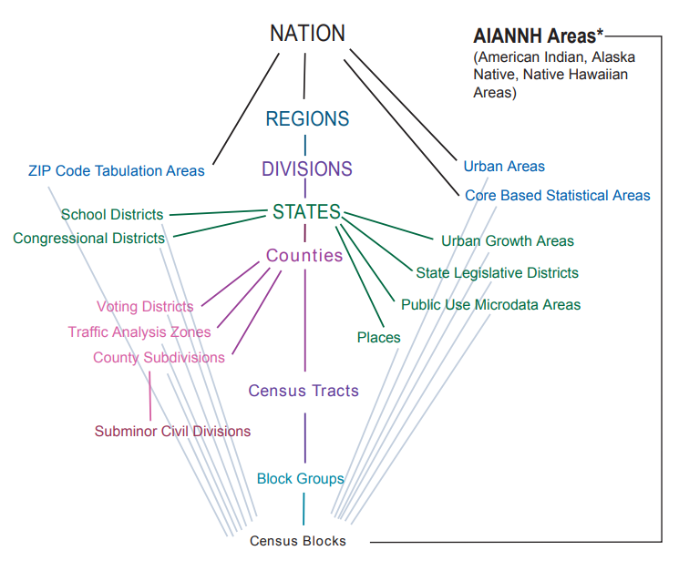
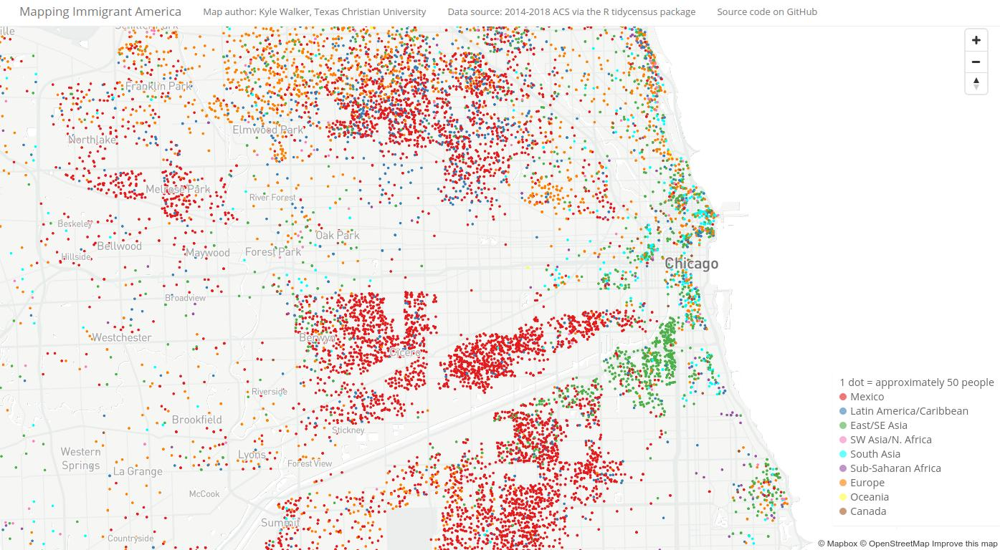

```{r setup-ch1, include = FALSE}
library(tigris)
library(tidyverse)
options(tigris_use_cache = TRUE)
source("R/book-functions.R")
```

# The United States Census and the R programming language

The main focus of this book is applied social data analysis in the R programming language, with a focus on data from the United States Census Bureau. This chapter introduces both topics. The first part of the chapter covers the United States Census and the US Census Bureau, and gives an overview of how Census data can be accessed and used by analysts. The second part of the chapter is an introduction to the R programming language for readers who are new to R. The chapter wraps up with some examples of applied social data analysis projects that have used R and US Census data, setting the stage for the topics covered in the remainder of the book.

## Census data: an overview

The United States Constitution mandates in Article I, Sections 2 and 9 that a complete enumeration of the US population be taken every 10 years. The language from the Constitution is as follows (see <https://www.census.gov/programs-surveys/decennial-census/about.html>):

> The actual enumeration shall be made within three years after the first meeting of the Congress of the United States, and within every subsequent term of ten years, in such manner as they shall by law direct.

The government agency tasked with completing the enumeration of the United States population is the [United States Census Bureau](https://www.census.gov/en.html), part of the [US Department of Commerce](https://www.commerce.gov/). The first US Census was conducted in 1790, with enumerations taking place every 10 years since then. By convention, "Census day" is April 1 of the Census year.

The decennial US Census is intended to be a complete enumeration of the US population to assist with *apportionment*, which refers to the balanced arrangement of Congressional districts to ensure appropriate representation in the United States House of Representatives. It asks a limited set of questions on race, ethnicity, age, sex, and housing tenure.

Before the 2010 decennial Census, 1 in 6 Americans also received the Census *long form*, which asked a wider range of demographic questions on income, education, language, housing, and more. The Census long form has since been replaced by the **American Community Survey**, which is now the premier source of detailed demographic information about the US population. The ACS is mailed to approximately 3.5 million households per year (representing around 3 percent of the US population), allowing for annual data updates. The Census Bureau releases two ACS datasets to the public: the **1-year ACS**, which covers areas of population 65,000 and greater, and the **5-year ACS**, which is a moving average of data over a 5-year period that covers geographies down to the Census block group. ACS data are distinct from decennial Census data in that data represent *estimates* rather than precise counts, and in turn are characterized by *margins of error* around those estimates. This topic is covered in more depth in Section \@ref(handling-margins-of-error-in-the-american-community-survey-with-tidycensus). Due to data collection problems resulting from the COVID-19 pandemic, 2020 1-year ACS data will not be released, replaced by experimental estimates for that year.

While the decennial US Census and American Community Survey are the most popular and widely used datasets produced by the US Census Bureau, the Bureau conducts hundreds of other surveys and disseminates data on a wide range of subjects to the public. These datasets include economic and business surveys, housing surveys, international data, population estimates and projections, and much more; [a full listing is available on the Census website](https://www.census.gov/programs-surveys/surveys-programs.html).

## Census hierarchies

Aggregate data from the decennial US Census, American Community Survey, and other Census surveys are made available to the public at different *enumeration units*. Enumeration units are geographies at which Census data are tabulated. They include both *legal entities* such as states and counties, and *statistical entities* that are not official jurisdictions but used to standardize data tabulation. The smallest unit at which data are made available from the decennial US Census is the *block,* and the smallest unit available in the ACS is the *block group*, which represents a collection of blocks. Other surveys are generally available at higher levels of aggregation.

Enumeration units represent different levels of the *Census hierarchy.* This hierarchy is summarized in the graphic below (from <https://www.census.gov/programs-surveys/geography/guidance/hierarchy.html>).

```{r census-hierarchy, echo = FALSE, fig.cap = "Census hierarchy of enumeration units"}

```

The central axis of the diagram represents the central Census hierarchy of enumeration units, as each geography from Census blocks all the way up to the nation *nests* within its parent unit. This means that block groups are fully composed of Census blocks, Census tracts are fully composed of block groups, and so forth. An example of nesting is shown in the graphic below for 2020 Census tracts in Benton County, Oregon.

```{r benton-tracts, echo = FALSE, fig.cap = "Benton County, OR Census tracts in relationship to the county boundary"}
library(patchwork)

benton_tracts <- tracts("OR", "Benton", cb = TRUE, year = 2020)
benton_county <- counties("OR", cb = TRUE, year = 2020) %>%
  filter(NAME == "Benton")

b1 <- ggplot(benton_county) + 
  geom_sf(color = "black", fill = "white") + 
  theme_void() + 
  labs(title = "Benton County, OR") + 
  theme(plot.title = element_text(hjust = 0.5))

b2 <- ggplot() + 
  geom_sf(data = benton_tracts, color = "red", fill = "white") + 
  geom_sf(data = benton_county, color = "black", fill = NA) + 
  theme_void() + 
  labs(title = "Census tracts in Benton County") + 
  theme(plot.title = element_text(hjust = 0.5))

b1 + b2
```

The plot illustrates how Census tracts in Benton County neatly nest within its parent geography, the county. This means that the sum of Census data for Census tracts in Benton County will also equal Benton County's published total at the county level.

Reviewing the diagram shows that some Census geographies, like congressional districts, only nest within states, and that some other geographies do not nest within any parent geography at all. A good example of this is the Zip Code Tabulation Area (ZCTA), which is used by the Census Bureau to represent postal code geographies in the US. A more in-depth discussion of ZCTAs (and some of their pitfalls) is found in Section \@ref(understanding-and-working-with-zctas); a brief illustration is represented by the graphic below.

```{r benton-zctas, echo = FALSE, fig.cap = "Benton County, OR ZCTAs in relationship to the county boundary"}
all_zctas <- zctas(cb = TRUE)

benton_centers <- all_zctas %>%
  sf::st_centroid() %>%
  sf::st_filter(benton_county)

benton_zctas <- all_zctas %>%
  filter(GEOID10 %in% benton_centers$GEOID10)

ggplot() + 
  geom_sf(data = benton_zctas, color = "red", fill = "white") + 
  geom_sf(data = benton_county, color = "black", fill = NA) + 
  theme_void() + 
  labs(title = "ZCTAs in Benton County") + 
  theme(plot.title = element_text(hjust = 0.5))
```

As the graphic illustrates, while some ZCTAs do fit entirely within Benton County, others overlap the county boundaries. In turn, "ZCTAs in Benton County" does not have the same meaning as "Census tracts in Benton County", as the former will extend into neighboring counties whereas the latter will not.

## How to find US Census data

US Census data are available from a variety of sources, both directly from the Census Bureau and also from third-party distributors. This section gives an overview of some of these sources.

### Data downloads from the Census Bureau

For years, researchers would visit the US Census Bureau's [American FactFinder site](https://www.census.gov/acs/www/data/data-tables-and-tools/american-factfinder/) to download Census data for custom geographies. American FactFinder was decomissioned in 2020, giving way to a new data download interface, [data.census.gov](https://data.census.gov/cedsci/). Users can interactively search several Census Bureau datasets (the decennial Census & ACS, along with the Economic Census, Population Estimates Program, and others), generate custom queries by geography, and download data extracts.

```{r data-census-gov, echo = FALSE, fig.cap = "View of the data.census.gov interface"}
knitr::include_graphics("img/screenshots/data-census-gov.png")
```

The graphic above shows ACS table DP02 from the ACS Data Profile for Census tracts in Arkansas.

Users who are comfortable dealing with data in bulk and want to download the raw data will instead prefer the US Census Bureau's FTP site, <https://www2.census.gov/programs-surveys/>. This site includes a directory of Census surveys that can be navigated and downloaded. The image below shows the directory structure for the [2019 American Community Survey](https://www2.census.gov/programs-surveys/acs/summary_file/2019/data/), which is available by state or alternatively for the entire country.

```{r census-ftp, echo = FALSE, fig.cap = "View of the Census FTP download site"}
knitr::include_graphics("img/screenshots/census-ftp-site.png")
```

National files are very large (the full 5-year file for all geographies is over 10GB of data zipped) so users will require dedicated software and computing workflows to interact with this data.

### The Census API

The Obama Administration's [Digital Government Strategy](https://obamawhitehouse.archives.gov/digitalgov/apis) prioritized widespread dissemination of government data resources to the public, highlighted by the [data.gov](https://www.data.gov/) data portal. As part of this strategy, [the Census Bureau released the Census Application Programming Interface, or API, in 2012](https://www.census.gov/newsroom/releases/archives/miscellaneous/cb12-135.html). This interface, available at <https://www.census.gov/data/developers/data-sets.html>, has grown to provide developers programmatic access to hundreds of data resources from the Census Bureau.

Census APIs are characterized by an *API endpoint*, which is a base web address for a given Census dataset, and a *query*, which customizes the data returned from the API. For example, the API endpoint for the 2010 Decennial US Census is `https://api.census.gov/data/2010/dec/sf1`; an example query that requests total population data for all counties in California, `?get=P001001,NAME&for=county:*&in=state:06`, would be appended to the endpoint in a request to the Census API. [The result of the query can be viewed here](https://api.census.gov/data/2010/dec/sf1?get=P001001,NAME&for=county:*&in=state:06), returning data in JavaScript Object Notation (JSON) format as shown below.

``` json
[["P001001","NAME","state","county"],
["21419","Colusa County, California","06","011"],
["220000","Butte County, California","06","007"],
["1510271","Alameda County, California","06","001"],
["1175","Alpine County, California","06","003"],
["38091","Amador County, California","06","005"],
["45578","Calaveras County, California","06","009"],
["1049025","Contra Costa County, California","06","013"],
["28610","Del Norte County, California","06","015"],
["152982","Kings County, California","06","031"],
["28122","Glenn County, California","06","021"],
["134623","Humboldt County, California","06","023"],
["174528","Imperial County, California","06","025"],
["181058","El Dorado County, California","06","017"],
["930450","Fresno County, California","06","019"],
...
```

In most cases, users will interact with the Census API through *software libraries* that offer simplified programmatic access to the API's data resources. The example covered extensively in this book is the R package **tidycensus** [@walker_and_herman2021], introduced in Chapter \@ref(an-introduction-to-tidycensus). Many other libraries exist for accessing the Census API; some of these resources are covered in Chapter \@ref(other-census-and-government-data-resources), and readers will learn how to write their own data access functions in Section \@ref(writing-your-own-data-access-functions).

Users of the Census API through these software libraries will require a [Census API key](https://api.census.gov/data/key_signup.html), which is free and fast to acquire. Getting an API key is covered in more detail in Section \@ref(getting-started-with-tidycensus). Users may also want to join the [US Census Bureau's Slack Community](https://uscensusbureau.slack.com/), where developers interact and answer each others' questions about using the API and associated software libraries.

### Third-party data distributors

As the US Census Bureau provides data resources that are free and available for re-distribution, several third-party data distributors have developed streamlined interfaces to use Census data. One of the most comprehensive of these resources is the University of Minnesota's [National Historical Geographic Information System, or NHGIS](https://www.nhgis.org/) [@manson2021], which provides access to ACS data as well as decennial Census data back to 1790. NHGIS is covered in more depth in Section \@ref(getting-started-with-nhgis).

Two other recommended third-party Census data distributors are [Census Reporter](https://censusreporter.org/) and [Social Explorer](https://www.socialexplorer.com/). Census Reporter, a project based at [Northwestern University's Knight Lab](https://knightlab.northwestern.edu/), is targeted towards journalists but offers a web interface that can help anyone explore tables available in the ACS and download ACS data. Social Explorer is a commercial product that offers both table-based and a map-based interface for exploring and visualizing Census data, and makes mapping of Census data straightfoward for users who aren't experienced with data analysis or mapping software.

Most readers of this book will want to learn how to use Census data resources to produce unique insights in their field of interest. This requires identifying a workflow to access and download custom data extracts relevant to their topics and study areas, then set up a software environment to help them wrangle, visualize, and model those data extracts. This book recommends the **R programming language** as an ideal software environment for completing all these tasks in an integrated way. The next section introduces R to new users.

## What is R?

**R** [@rcore2021] is one of the most popular programming languages and software environments for statistical computing, and is the focus of this book with respect to software applications. This section introduces some basics of working with R and covers some terminology that will help readers work through the sections of this book. If you are an experienced R user, you can safely skip this section; however, readers new to R will find this information helpful before getting started with the applied examples in the book.

### Getting started with R

To get started with R, visit the CRAN (Comprehensive R Archive Network) website at <https://cloud.r-project.org/> and download the appropriate version of R for your operating system, then install the software. At the time of this writing, the most recent version of R is 4.1.1; it is a good idea to make sure you have the most recent version of R installed on your computer.

Once R is installed, I strongly recommend that you install **RStudio** [@rstudio2021], the premier integrated development environment (IDE) for R. While you can run R without RStudio, RStudio offers a wide variety of utilities to make analysts' work with R easier and more streamlined. In fact, this entire book was written inside RStudio! RStudio can be installed from <http://www.rstudio.com/download>.

Once RStudio is installed, open it up and find the **Console** pane. This is an interactive console that allows you to type or copy-paste R commands and get results back.

### Basic data structures in R

On a basic level, R can function as a calculator, computing everything from simple arithmetic to advanced math:

```{r basic-1}
2 + 3
```

Often, you will want to *assign* analytic results like this to an *object* (also commonly called a *variable*). Objects in R are created with an *assignment operator* (either `<-` or `=`) like this:

```{r basic-2}
x <- 2 + 3
```

Above, we have *assigned* the result of the mathematical operation `2 + 3` to the object `x`:

```{r basic-3}
x
```

Object names can be composed of any unquoted combination of letters and numbers so long as the first character is a letter. Our object, which stores the value `5`, is characterized by a `class`:

```{r basic-4}
class(x)
```

`x` is an object of class `numeric`, which is a general class indicating that we can perform mathematical operations on our object. Numeric objects can be contrasted with objects of class `"character"`, which represent character strings, or textual information. Objects of class `"character"` are defined by either single- or double-quotes around a block of text.

```{r basic-5}
y <- "census"
class(y)
```

There are *many* other classes of objects you'll encounter in this book; however the distinction between objects of class `"numeric"` and `"character"` will come up frequently.

Data analysts will commonly encounter another class of object: the data frame and its derivatives (class `"data.frame"`). Data frames are rectangular objects characterized by *rows*, which generally represent individual observations, and *columns*, which represent characteristics or attributes common to those rows.

```{r basic-6}
df <- data.frame(
  v1 = c(2, 5, 1, 7, 4),
  v2 = c(10, 2, 4, 2, 1),
  v3 = c("a", "b", "c", "d", "e")
)

df
```

### Functions and packages

The code that generates the data frame in the previous section uses two built-in *functions*: `data.frame()`, which creates columns from one or more *vectors* (defined as sequences of objects), and `c()`, which was used to create the vectors for the data frame. You can think of functions as "wrappers" that condense longer code-based workflows into simpler representations. R users can define their own functions as follows:

```{r functions-1}
multiply <- function(x, y) {
  x * y
}

multiply(232, 7)
```

In this basic example, a function named `multiply()` is defined with `function`. `x` and `y` are *parameters*, which are locally-varying elements of the function. When the function is called, a user supplies *arguments*, which are passed to the parameters for some series of calculations. In this example, `x` takes on the value of 232, and `y` takes on the value of 7; the result is then returned by the `multiply()` function.

You can do quite a bit in R without ever having to write your own functions; however, you will almost certainly use functions written by others. In R, functions are generally available in *packages*, which are libraries of code designed to complete a related set of tasks. For example, the main focus of Chapter \@ref(an-introduction-to-tidycensus) is the **tidycensus** package, which includes functions to help users access Census data. Packages can be installed from CRAN with the `install.packages()` function:

```{r install, eval = FALSE}
install.packages("tidycensus")
```

Once installed, functions from a package can be loaded into a user's R environment with the `library()` command, e.g. `library(tidycensus)`. Alternatively, they can be used with the `package_name::function_name()` notation, e.g. `tidycensus::get_acs()`. Both notations are used at times in this book.

While "official" versions of R packages are usually published to CRAN and installable with `install.packages()`, more experimental or in-development R packages may be available on [GitHub](https://github.com/) instead. These packages should be installed with the `install_github()` function in the **remotes** package [@hester2021_remotes], referencing both the user name and the package name.

```{r install-github, eval = FALSE}
library(remotes)
install_github("Shelmith-Kariuki/rKenyaCensus")
```

While most packages used in this book are available on CRAN, some are only available on GitHub and should be installed accordingly.

### Package ecosystems in R

R is [*free and open source software (FOSS)*](https://en.wikipedia.org/wiki/Free_and_open-source_software), which means that R is free to download and install and its source code is open for anyone to view. This brings the substantial benefit of encouraging innovation from the user community, as anyone can create new packages and either submit them for publication to the official CRAN repository or host them on their personal GitHub page. In turn, new methodological innovations are often quickly accessible to the R user community. However, this can make R feel fragmented, especially for users coming from commercial software designed to have a consistent interface. Package syntax will sometimes represent idiosyncratic choices of the developer which can make R confusing to beginners.

The **tidyverse** ecosystem developed by RStudio [@wickham2019] is one of the most popular frameworks for data analysis in R, and attempts to respond to problems introduced by package fragmentation. The tidyverse consists of a series of R packages designed to address common data analysis tasks (data wrangling, data reshaping, and data visualization, among many others) using a consistent syntax. Many R packages are now developed with integration within the tidyverse in mind. A good example of this is the **sf** package [@pebesma2018] which integrates spatial data analysis and the tidyverse. This book is largely written with the tidyverse and sf ecosystems in mind; **tidyverse** is covered in greater depth in Chapter \@ref(wrangling-census-data-with-tidyverse-tools), and **sf** is introduced in Chapter \@ref(census-geographic-data-and-applications-in-r).

Other ecosystems exist that may be preferable to R users. R's core functionality, commonly termed "base R," consists of the original syntax of the language which R users should get to know independent of their preferred analytic framework. Some R users prefer to maintain their analysis in base R as it does not require *dependencies*, meaning that it can run without installing external libraries. Another popular framework is **data.table** [@dowle2021] and its associated packages, which extend base R's `data.frame` and allow for fast and high-performance data wrangling and analysis.

## Analyses using R and US Census data

A large ecosystem of R packages exists to help analysts work with US Census data. A good summary of this ecosystem is found in Ari Lamstein and Logan Powell's *A Guide to Working with US Census Data in R* [@lamstein2018], and the ecosystem has grown further since their report was published. Below is a non-comprehensive summary of some R packages that will be of interest to readers; others will be covered throughout the book.

### Census data packages in R: a brief summary

For users who prefer to work with the raw Census data files, the **totalcensus** package [@li2021] helps download Census data in bulk from the Census FTP server and loads it into R. For election analysts, the **PL94171** package [@mccartan2021] processes and loads PL-94171 redistricting files, including the most recent data from the 2020 Census.

Users who want to make more custom queries will be interested in R packages that interact with the Census APIs. The pioneering package in this area is the **acs** package [@haberglenn2019], which uses a custom interface and class system to return data extracts from various Census APIs. This package has informed a variety of other convenient Census data packages, such as **choroplethr** [@lamstein2020] which automates map production with data from the Census API. The **censusapi** package [@recht2021] also offers a comprehensive interface to the hundreds of datasets available from the Census Bureau via API. The examples in this book largely focus on the **tidycensus** and **tigris** packages created by the author, which interact with several Census API endpoints and return geographic data for mapping and spatial analysis.

R interfaces to third-party Census data resources have emerged as well. A good example is the **ipumsr** R package [@ellis_and_burk2020], which helps users interact with datasets from the Minnesota Population Center like NHGIS. The aforementioned R packages - along with R's rich ecosystem for data analysis - have contributed to wide range of projects using Census data in a variety of fields. A few such examples are highlighted below.

### Health resource access

R and Census data have widespread applications in the analysis of health care and resource access. An excellent example is **censusapi** developer Hannah Recht's study of stroke care access in the Mississippi Delta and Appalachia, published in KHN in 2021 [@pattani2021]. The graphic below illustrate Recht's work integrating travel-time analytics with Census data to identify populations with limited access to stroke care across the US South.

```{r recht-isochrones, echo = FALSE, fig.cap = "Accessibility to stroke care across the US South from Pattani et al. (2021). Image reprinted with permission from the publisher."}
knitr::include_graphics("img/screenshots/recht-isochrones.png")
```

Recht published her analysis code [in a corresponding GitHub repository](https://github.com/khnews/2021-delta-appalachia-stroke-access), allowing readers and developers to understand the methodology and reproduce the analysis. R packages used in the analysis include **censusapi** for Census data, **sf** for spatial analysis, and the **tidyverse** framework for data preparation and wrangling.

### COVID-19 and pandemic response

R and Census data can also be used together to generate applications to the benefit of public health initiatives. A great example of this is the [Texas COVID-19 Vaccine Tracker](https://texasvaccinetracker.com/), developed by Matt Worthington at the University of Texas LBJ School of Public Affairs.

```{r worthington-vaccines, echo = FALSE, fig.cap = "Screenshot of the Texas COVID-19 Vaccine Tracker website"}
knitr::include_graphics("img/screenshots/worthington-vaccines.png")
```

The application, illustrated in the graphic above, provides a comprehensive set of information about vaccine uptake and access around Texas. The example map shown visualizes vaccine doses administered per 1,000 persons in Austin-area ZCTAs. Census data are used throughout the application to help visitors understand differential vaccine update by regions and by demographics.

Source code for Worthington's application [can be explored at its corresponding GitHub repository](https://github.com/utexas-lbjp-data/tx_vaccine_site). The site was built with a variety of R frameworks, including the Shiny framework for interactive dashboarding, and includes a range of static graphics, interactive graphics, and interactive maps generated from R.

### Politics and gerrymandering

As discussed above, one of the primary purposes of the US Census is to determine congressional apportionment. This process requires the re-drawing of congressional districts every 10 years, termed *redistricting*. The redistricting process is politically fraught due to *gerrymandering*, which refers to the drawing of districts in a way that gives one political party (in the US, Republican or Democratic) a built-in advantage over the other, potentially disenfranchising voters in the process.

[Harvard University's ALARM project](https://alarm-redist.github.io/) uses R to analyze redistricting and gerrymandering and contribute to equitable solutions. The ALARM project has developed a veritable ecosystem of R packages that incorporate Census data and make Census data accessible to redistricting analysts. This includes the **PL94171** package mentioned above to get 2020 redistricting data, the **geomander** package to prepare data for redistricting analysis [@kenny2021], and the **redist** package to algorithmically derive and evaluate redistricting solutions [@kenny2021]. The example below, which is generated with modified code from the **redist** documentation, shows a basic example of potential redistricting solutions based on Census data for Iowa.

```{r iowa, echo = FALSE, results = 'hide'}
library(redist)
library(dplyr)
library(ggplot2)
library(patchwork) # for plotting
set.seed(123456)

data(iowa)

iowa_map = redist_map(iowa, existing_plan=cd_2010, pop_tol=0.0001, total_pop = pop)

iowa_plans = redist_smc(iowa_map, nsims=250, verbose=FALSE)
```

```{r iowa-redist-map, echo = FALSE, fig.cap = "Example redistricting solutions using the redist package"}
set.seed(123456)

redist.plot.plans(iowa_plans, draws=c("cd_2010", "1", "2", "3"),
                  geom=iowa_map)
```

As court battles and contentious discussions around redistricting ramp up following the release of the 2020 Census redistricting files, R users can use ALARM's family of packages to analyze and produce potential solutions.

### Social equity research

Census data is a core resource for a large body of research in the social sciences as it speaks directly to issues of inequality and opportunity. Jerry Shannon's study of dollar store geography [@shannon2020] uses Census data with R in a compelling way for this purpose. His analysis examines the growth of dollar stores across the United States in relationship to patterns of racial segregation in the United States. Shannon finds that dollar stores are more likely to be found nearer to predominantly Black and Latino neighborhoods as opposed to predominantly white neighborhoods, even after controlling for structural and economic characteristics of those neighborhoods. Shannon's analysis was completed in R, and his analysis code [is available in the corresponding GitHub repository](https://github.com/jshannon75/metrodollars). The demographic analysis uses American Community Survey data obtained from NHGIS.

### Census data visualization

One of my favorite projects that I have worked on is *Mapping Immigrant America*, an interactive map of the US foreign-born population. The map scatters dots within Census tracts to proportionally represent the residences of immigrants based on data from the American Community Survey. [The map is viewable at this link](https://personal.tcu.edu/kylewalker/immigrant-america/#11.08/41.872/-87.7436) .

```{r mb-immigrants-show, echo = FALSE, fig.cap = "Screenshot of the Mapping Immigrant America interactive map"}

```

While version 1 of the map used a variety of tools to process the data including ArcGIS and QGIS, the data processing for version 2 was completed entirely in R, with data then uploaded to the [Mapbox Studio](https://studio.mapbox.com/) platform for hosting and visualization. The data preparation code can be viewed [in the map's GitHub repository](https://github.com/walkerke/mb-immigrants).

The map uses a *dasymetric dot-density* methodology [@walker2018a] implemented in R using a series of techniques covered in this book. ACS data and their corresponding Census tract boundaries were acquired using tools learned in Chapter \@ref(an-introduction-to-tidycensus) and Section \@ref(using-geometry-in-tidycensus); areas with no population were removed from Census tracts using a spatial analysis technique covered in Section \@ref(erasing-areas-from-census-polygons); and dots were generated for mapping using a method introduced in Section \@ref(dot-density-maps).

These examples are only a small sampling of the volumes of work completed by analysts using R and US Census Bureau data. In the next chapter, you will get started using R to access Census data for yourselves, with a focus on the **tidycensus** package.
