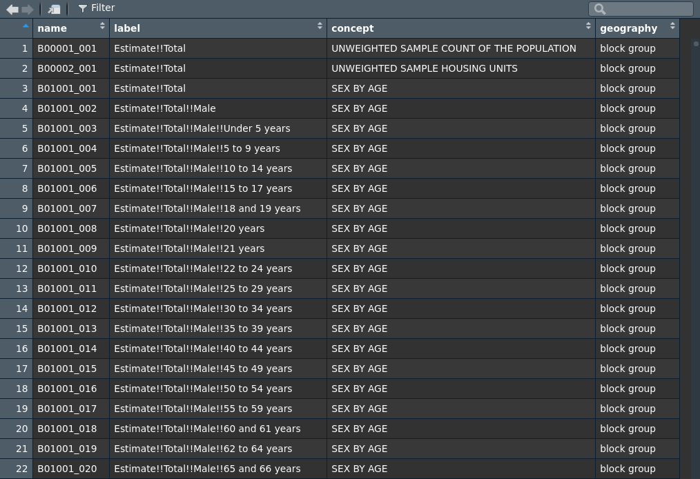

# An introduction to tidycensus

```{r setup-ch2, include = FALSE}
knitr::opts_chunk$set(warning = FALSE, message = FALSE)
```

The **tidycensus** package [@walker_and_herman2021], first released in
2017, is an R package designed to facilitate the process of acquiring
and working with US Census Bureau population data in the R environment.
The package has two distinct goals. First, tidycensus aims to make
Census data available to R users in a tidyverse-friendly format, helping
kick-start the process of generating insights from US Census data.
Second, the package is designed to streamline the data wrangling process
for spatial Census data analysts. With tidycensus, R users can request
*geometry* along with attributes for their Census data, helping
facilitate mapping and spatial analysis. This functionality of
tidycensus is covered in more depth in Chapters 6 through 8.

As discussed in the previous chapter, the US Census Bureau makes a wide
range of datasets available to the user community through their APIs and
other data download resources. tidycensus is not a comprehensive portal
to these data resources; instead, it focuses on a select number of
datasets implemented in a series of core functions. These core functions
in tidycensus include:

-   `get_decennial()`, which requests data from the US Decennial Census
    APIs for 2000 and 2010. When 2020 Census data are released via the
    API, R users will be able to access it with this function as well.

-   `get_acs()`, which requests data from the 1-year and 5-year American
    Community Survey samples. Data are available from the 1-year ACS
    back to 2005 and the 5-year ACS back to 2005-2009.

-   `get_estimates()`, an interface to the Population Estimates APIs.
    These datasets include yearly estimates of population
    characteristics by state, county, and metropolitan area, along with
    components of change demographic estimates like births, deaths, and
    migration rates.

-   `get_pums()`, which accesses data from the ACS Public Use Microdata
    Sample APIs. These samples include anonymized individual-level
    records from the ACS organized by household and are highly useful
    for many different social science analyses. `get_pums()` is covered
    in more depth in Chapters 9 and 10.

-   `get_flows()`, an interface to the ACS Migration Flows APIs.
    Includes information on in- and out-flows from various geographies
    for the 5-year ACS samples, enabling origin-destination analyses.

## Getting started with tidycensus

To get started with tidycensus, users should load the package along with
the **tidyverse** package and set their Census API key with the
`census_api_key()` function. API keys can be obtained at
<https://api.census.gov/data/key_signup.html>. After you've signed up
for an API key, be sure to activate the key from the email you receive
from the Census Bureau so it works correctly. Declaring `install = TRUE`
when calling `census_api_key()` will install the key for use in future R
sessions, which may be convenient for many users.

```{r load-api-key}
library(tidycensus)
library(tidyverse)
# census_api_key("YOUR KEY GOES HERE", install = TRUE)
```

### Decennial Census

Once an API key is installed, users can obtain decennial Census or ACS
data with a single function call. Let's start with `get_decennial()`,
which is used to access decennial Census data from the 2000 and 2010
Censuses. To get data from the decennial US Census, users must specify a
string representing the requested `geography`; a vector of Census
variable IDs, represented by `variable`; or optionally a Census table
ID, passed to `table`.

```{r decennial-2010}
pop10 <- get_decennial(
  geography = "state", 
  variables = "P001001",
  year = 2010
)

head(pop10)
```

The function returns a tibble of data from the 2010 US Census (the
function default year) with information on total population by state.
Data for 2000 can also be obtained by supplying the appropriate year to
the `year` parameter.

### American Community Survey

Similarly, `get_acs()` retrieves data from the American Community
Survey.

```{r acs-5-year}
pop15to19 <- get_acs(
  geography = "state", 
  variables = "B01003_001",
  year = 2019
)

pop15to19
```

If the year is not specified, `get_acs()` defaults to the most recent
five-year ACS sample, which at the time of this writing is 2015-2019.
The data returned is similar in structure to that returned by
`get_decennial()`, but includes an `estimate` column (for the ACS
estimate) and `moe` column (for the margin of error around that
estimate) instead of a `value` column. Different years and different
surveys are available by adjusting the `year` and `survey` parameters.
For example, the following code will fetch data from the 1-year ACS for
2019:

```{r}
pop19 <- get_acs(
  geography = "state", 
  variables = "B01003_001", 
  survey = "acs1",
  year = 2019
)

pop19
```

Variables from the ACS detailed tables, data profiles, and summary
tables are available through tidycensus's `get_acs()` function; the
function will auto-detect from which dataset to look for variables.
Alternatively, users can supply a table name to the `table` parameter in
`get_acs()`; this will return data for every variable in that table. For
example, to get all variables associated with table B01001, which covers
sex broken down by age, from the 2015-2019 5-year ACS:

```{r}
age_table <- get_acs(
  geography = "state", 
  table = "B01001",
  year = 2019
)

age_table
```

To find all of the variables associated with a given ACS table,
tidycensus downloads a dataset of variables from the Census Bureau
website and looks up the variable codes for download. If the
`cache_table` parameter is set to `TRUE`, the function instructs
tidycensus to cache this dataset on the user's computer for faster
future access. This only needs to be done once per ACS or Census dataset
if the user would like to specify this option.

## Geography and variables in tidycensus

The `geography` parameter in `get_acs()` and `get_decennial()` allows
users to request data aggregated to common Census enumeration units. At
the time of this writing, tidycensus accepts enumeration units nested
within states and/or counties, when applicable. Census blocks are
available in `get_decennial()` but not in `get_acs()` as block-level
data are not available from the American Community Survey. To request
data within states and/or counties, state and county names can be
supplied to the `state` and `county` parameters, respectively. Arguments
should be formatted in the way that they are accepted by the US Census
Bureau API, specified in the table below. If an "Available by" geography
is in bold, that argument is required for that geography.

The only geographies available in 2000 are `"state"`, `"county"`,
`"county subdivision"`, `"tract"`, `"block group"`, and `"place"`. Some
geographies available from the Census API are not available in
tidycensus at the moment as they require more complex hierarchy
specification than the package supports, and not all variables are
available at every geography.

+---------------+---------------+------------+----------------------+
| Geography     | Definition    | Available  | Available in         |
|               |               | by         |                      |
+===============+===============+============+======================+
| `"us"`        | United States |            | `get_acs()`,         |
|               |               |            | `get_decennial()`,   |
|               |               |            | `get_estimates()`    |
+---------------+---------------+------------+----------------------+
| `"region"`    | Census region |            | `get_acs()`,         |
|               |               |            | `get_decennial()`,   |
|               |               |            | `get_estimates()`    |
+---------------+---------------+------------+----------------------+
| `"division"`  | Census        |            | `get_acs()`,         |
|               | division      |            | `get_decennial()`,   |
|               |               |            | `get_estimates()`    |
+---------------+---------------+------------+----------------------+
| `"state"`     | State or      | state      | `get_acs()`,         |
|               | equivalent    |            | `get_decennial()`,   |
|               |               |            | `get_estimates()`,   |
|               |               |            | `get_flows()`        |
+---------------+---------------+------------+----------------------+
| `"county"`    | County or     | state,     | `get_acs()`,         |
|               | equivalent    | county     | `get_decennial()`,   |
|               |               |            | `get_estimates()`,   |
|               |               |            | `get_flows()`        |
+---------------+---------------+------------+----------------------+
| `"county      | County        | **state**, | `get_acs()`,         |
| subdivision"` | subdivision   | county     | `get_decennial()`,   |
|               |               |            | `get_estimates()`,   |
|               |               |            | `get_flows()`        |
+---------------+---------------+------------+----------------------+
| `"tract"`     | Census tract  | **state**, | `get_acs()`,         |
|               |               | county     | `get_decennial()`    |
+---------------+---------------+------------+----------------------+
| `"            | Census block  | **state**, | `get_acs()`,         |
| block group"` | group         | county     | `get_decennial()`    |
+---------------+---------------+------------+----------------------+
| `"block"`     | Census block  | **state**, | `get_decennial()`    |
|               |               | **county** |                      |
+---------------+---------------+------------+----------------------+
| `"place"`     | Cens          | state      | `get_acs()`,         |
|               | us-designated |            | `get_decennial()`,   |
|               | place         |            | `get_estimates()`    |
+---------------+---------------+------------+----------------------+
| `"alaska nati | Alaska native | state      | `get_acs()`,         |
| ve regional   | regional      |            | `get_decennial()`    |
| corporation"` | corporation   |            |                      |
+---------------+---------------+------------+----------------------+
| `"american    | Federal and   | state      | `get_acs()`,         |
|  indian area/ | sta           |            | `get_decennial()`    |
| alaska native | te-recognized |            |                      |
|  area/hawaiia | American      |            |                      |
| n home land"` | Indian        |            |                      |
|               | reservations  |            |                      |
|               | and Hawaiian  |            |                      |
|               | home lands    |            |                      |
+---------------+---------------+------------+----------------------+
| `"amer        | Only          | state      | `get_acs()`,         |
| ican indian a | reservations  |            | `get_decennial()`    |
| rea/alaska na | and           |            |                      |
| tive area (re | statistical   |            |                      |
| servation or  | entities      |            |                      |
| statistical e |               |            |                      |
| ntity only)"` |               |            |                      |
+---------------+---------------+------------+----------------------+
| `"american in | Only          | state      | `get_acs()`,         |
| dian area (of | of            |            |                      |
| f-reserva tio | f-reservation |            |                      |
| n trust land  | trust lands   |            |                      |
| only)/hawaiia | and Hawaiian  |            |                      |
| n home land"` | home lands    |            |                      |
+---------------+---------------+------------+----------------------+
| `"metropoli   | Core-based    | state      | `get_acs()`,         |
| tan statistic | statistical   |            | `get_decennial()`,   |
| al area/micro | area          |            | `get_estimates()`,   |
| politan stati |               |            | `get_flows()`        |
| stical area"` |               |            |                      |
| OR `"cbsa"`   |               |            |                      |
+---------------+---------------+------------+----------------------+
| `"c           | Combined      | state      | `get_acs()`,         |
| ombined stati | statistical   |            | `get_decennial()`,   |
| stical area"` | area          |            | `get_estimates()`    |
+---------------+---------------+------------+----------------------+
| `"new en      | New England   | state      | `get_acs()`,         |
| gland city an | city/town     |            | `get_decennial()`    |
| d town area"` | area          |            |                      |
+---------------+---------------+------------+----------------------+
| `"co          | Combined New  | state      | `get_acs()`,         |
| mbined new en | England area  |            | `get_decennial()`    |
| gland city an |               |            |                      |
| d town area"` |               |            |                      |
+---------------+---------------+------------+----------------------+
| `             | C             |            | `get_acs()`,         |
| "urban area"` | ensus-defined |            | `get_decennial()`    |
|               | urbanized     |            |                      |
|               | areas         |            |                      |
+---------------+---------------+------------+----------------------+
| `"congression | Congressional | state      | `get_acs()`,         |
| al district"` | district for  |            | `get_decennial()`    |
|               | the           |            |                      |
|               | yea           |            |                      |
|               | r-appropriate |            |                      |
|               | Congress      |            |                      |
+---------------+---------------+------------+----------------------+
| `"scho        | Elementary    | **state**  | `get_acs()`,         |
| ol district ( | school        |            | `get_decennial()`    |
| elementary)"` | district      |            |                      |
+---------------+---------------+------------+----------------------+
| `"scho        | Secondary     | **state**  | `get_acs()`,         |
| ol district   | school        |            | `get_decennial()`    |
| (secondary)"` | district      |            |                      |
+---------------+---------------+------------+----------------------+
| `"s           | Unified       | **state**  | `get_acs()`,         |
| chool distric | school        |            | `get_decennial()`    |
| t (unified)"` | district      |            |                      |
+---------------+---------------+------------+----------------------+
| `"p           | PUMA          | state      | `get_acs()`          |
| ublic use mic | (geography    |            |                      |
| rodata area"` | associated    |            |                      |
|               | with Census   |            |                      |
|               | microdata     |            |                      |
|               | samples)      |            |                      |
+---------------+---------------+------------+----------------------+
| `"            | Zip code      | state      | `get_acs()`,         |
| zip code tabu | tabulation    |            | `get_decennial()`    |
| lation area"` | area          |            |                      |
| OR `"zcta"`   |               |            |                      |
+---------------+---------------+------------+----------------------+
| `"state       | State senate  | **state**  | `get_acs()`,         |
|  legislative  | districts     |            | `get_decennial()`    |
| district (upp |               |            |                      |
| er chamber)"` |               |            |                      |
+---------------+---------------+------------+----------------------+
| `"state       | State house   | **state**  | `get_acs()`,         |
|  legislative  | districts     |            | `get_decennial()`    |
| district (low |               |            |                      |
| er chamber)"` |               |            |                      |
+---------------+---------------+------------+----------------------+

The geography parameter must be typed exactly as specified in the table
above to request data correctly from the Census API; use the table above
as a reference and copy-paste for longer strings. For core-based
statistical areas and zip code tabulation areas, two heavily-requested
geographies, the aliases `"cbsa"` and `"zcta"` can be used,
respectively, to fetch data for those geographies.

```{r cbsa-alias}
cbsa_population <- get_acs(
  geography = "cbsa",
  variables = "B01003_001",
  year = 2019
)
```

### Geographic subsets

For many geographies, tidycensus supports more granular requests that
are subsetted by state or even by county, if supported by the API. This
information is found in the "Available by" column in the table above. If
a geographic subset is in bold, it is required; if not, it is optional.

For example, an analyst might be interested in studying variations in
household income in the state of Wisconsin. Although the analyst *can*
request all counties in the United States, this is not necessary for
this specific task. In turn, they can use the `state` parameter to
subset the request for a specific state.

```{r income-by-county}
wi_income <- get_acs(
  geography = "county", 
  variables = "B19013_001", 
  state = "WI",
  year = 2019
)

wi_income
```

tidycensus accepts state names (e.g. `"Wisconsin"`), state postal codes
(e.g. `"WI"`), and state FIPS codes (e.g. `"55"`), so an analyst can use
what they are most comfortable with.

Smaller geographies like Census tracts can also be subsetted by county.
Given that Census tracts nest neatly within counties (and do not cross
county boundaries), we can request all Census tracts for a given county
by using the optional `county` parameter. Dane County, home to
Wisconsin's capital city of Madison, is shown below. Note that the name
of the county can be supplied as well as the FIPS code. If a state has
two counties with similar names (e.g. "Collin" and "Collingsworth" in
Texas) you'll need to spell out the full county string and type
`"Collin County"`.

```{r}
dane_income <- get_acs(
  geography = "tract", 
  variables = "B19013_001", 
  state = "WI", 
  county = "Dane"
)

dane_income
```

## Searching for variables in tidycensus

One additional challenge when searching for Census variables is
understanding variable IDs, which are required to fetch data from the
Census and ACS APIs. There are thousands of variables available across
the different datasets and summary files. To make searching easier for R
users, tidycensus offers the `load_variables()` function. This function
obtains a dataset of variables from the Census Bureau website and
formats it for fast searching, ideally in RStudio.

The function takes two required arguments: `year`, which takes the year
or endyear of the Census dataset or ACS sample, and the dataset name -
one of `sf1`, `sf3`, `acs1`, or `acs5`. For the ACS datasets, append
`/profile` for the Data Profile, and `/summary` for the Summary Tables.
As this function requires processing thousands of variables from the
Census Bureau which may take a few moments depending on the user's
internet connection, the user can specify `cache = TRUE` in the function
call to store the data in the user's cache directory for future access.
On subsequent calls of the `load_variables()` function, `cache = TRUE`
will direct the function to look in the cache directory for the
variables rather than the Census website.

`load_variables()` works as follows:

```{r}
v16 <- load_variables(2016, "acs5", cache = TRUE)

filter(v16, str_detect(concept, "MEDIAN AGE"))
```

The resultant data frame has three columns: `name`, which refers to the
Census variable ID; `label`, which is a descriptive data label for the
variable; and `concept`, which refers to the topic of the data and often
corresponds to a table of Census data. As illustrated above, the data
frame can be filtered using tidyverse tools for variable exploration.
However, the RStudio integrated development environment includes an
interactive data viewer which is ideal for browsing this dataset, and
allows for interactive sorting and filtering. The data viewer can be
accessed with the `View()` function:

```{r, eval = FALSE}
View(v16)
```



By browsing the table in this way, users can identify the appropriate
variable IDs (found in the `name` column) that can be passed to the
`variables` parameter in `get_acs()` or `get_decennial()`. Users may
note that the raw variable IDs in the ACS, as consumed by the API,
require a suffix of `E` or `M`. tidycensus does not require this suffix,
as it will automatically return both the estimate and margin of error
for a given requested variable. Additionally, if users desire an entire
table of related variables from the ACS, the user should supply the
characters prior to the underscore from a variable ID to the `table`
parameter.

## Data structure in tidycensus

Key to the design philosophy of tidycensus is its interpretation of tidy
data. Following [@wickham2014], "tidy" data are defined as follows:

1.  Each observation forms a row;
2.  Each variable forms a column;
3.  Each observational unit forms a table.

By default, tidycensus returns a tibble of ACS or decennial Census data
in "tidy" format. For decennial Census data, this will include four
columns:

-   `GEOID`, representing the Census ID code that uniquely identifies
    the geographic unit;

-   `NAME`, which represents a descriptive name of the unit;

-   `variable`, which contains information on the Census variable name
    corresponding to that row;

-   `value`, which contains the data values for each unit-variable
    combination. For ACS data, two columns replace the `value` column:
    `estimate`, which represents the ACS estimate, and `moe`,
    representing the margin of error around that estimate.

Given the terminology used by the Census Bureau to distinguish data, it
is important to provide some clarifications of nomenclature here. Census
or ACS **variables**, which are specific series of data available by
enumeration unit, are interpreted in tidycensus as *characteristics* of
those enumeration units. In turn, rows in datasets returned when
`output = "tidy"`, which is the default setting in the `get_acs()` and
`get_decennial()` functions, represent data for unique unit-variable
combinations. An example of this is illustrated below with income groups
by state for the 2016 1-year American Community Survey.

```{r}
hhinc <- get_acs(
  geography = "state", 
  table = "B19001", 
  survey = "acs1",
  year = 2016
)

hhinc
```

In this example, each row represents state-characteristic combinations,
consistent with the tidy data model. Alternatively, if a user desires
the variables spread across the columns of the dataset, the setting
`output = "wide"` will enable this. For ACS data, estimates and margins
of error for each ACS variable will be found in their own columns. For
example:

```{r}
hhinc_wide <- get_acs(
  geography = "state", 
  table = "B19001", 
  survey = "acs1", 
  year = 2016,
  output = "wide"
)

hhinc_wide
```

The wide-form dataset includes `GEOID` and `NAME` columns, as in the
tidy dataset, but is also characterized by estimate/margin of error
pairs across the columns for each Census variable in the table.

### Renaming variable IDs

Census variables IDs can be cumbersome to type and remember in the
course of an R session. As such, tidycensus has built-in tools to
automatically rename the variable IDs if requested by a user. For
example, let's say that a user is requesting data on median household
income (variable ID `B19013_001`) and median age (variable ID
`B01002_001`). By passing a *named* vector to the `variables` parameter
in `get_acs()` or `get_decennial()`, the functions will return the
desired names rather than the Census variable IDs. Let's examine this
for counties in Georgia from the 2015-2019 five-year ACS.

```{r}
ga <- get_acs(
  geography = "county",
  state = "Georgia",
  variables = c(medinc = "B19013_001",
                medage = "B01002_001"),
  year = 2019
)

ga
```

ACS variable IDs, which would be found in the `variable` column, are
replaced by `medage` and `medinc`, as requested. When a wide-form
dataset is requested, tidycensus will still append `E` and `M` to the
specified column names, as illustrated below.

```{r}
ga_wide <- get_acs(
  geography = "county",
  state = "Georgia",
  variables = c(medinc = "B19013_001",
                medage = "B01002_001"),
  output = "wide"
)

ga_wide
```

Median household income for each county is represented by `medincE`, for
the estimate, and `medincM`, for the margin of error. At the time of
this writing, custom variable names are only available for `variables`
and not for `table`, as users will not always know the number of
variables found in a table beforehand.

## Other Census Bureau datasets in tidycensus

As mentioned earlier in this chapter, tidycensus does not grant access
to all of the datasets available from the Census API; users should look
at the censusapi package for that functionality. However, the Population
Estimates and ACS Migration Flows APIs are accessible with the
`get_estimates()` and `get_flows()` functions, respectively. This
section includes brief examples of each.

### Using `get_estimates()`

### Using `get_flows()`

## Exercises

1.  Review the available geographies in tidycensus from the geography
    table in this chapter. Acquire data on median age (variable
    `B01002_001`) for a geography we have not yet used.

2.  Use the `load_variables()` function to find a variable that
    interests you that we haven't used yet. Use `get_acs()` to fetch
    data from the 2015-2019 ACS for counties in the state where you
    live, where you have visited, or where you would like to visit.
