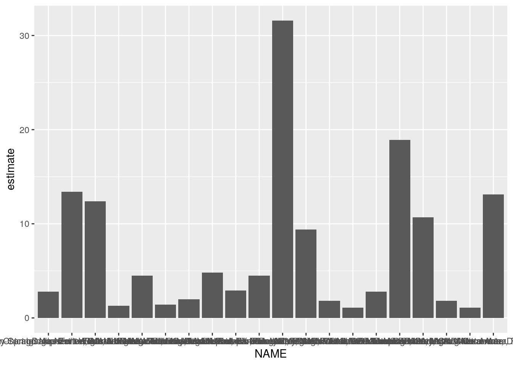
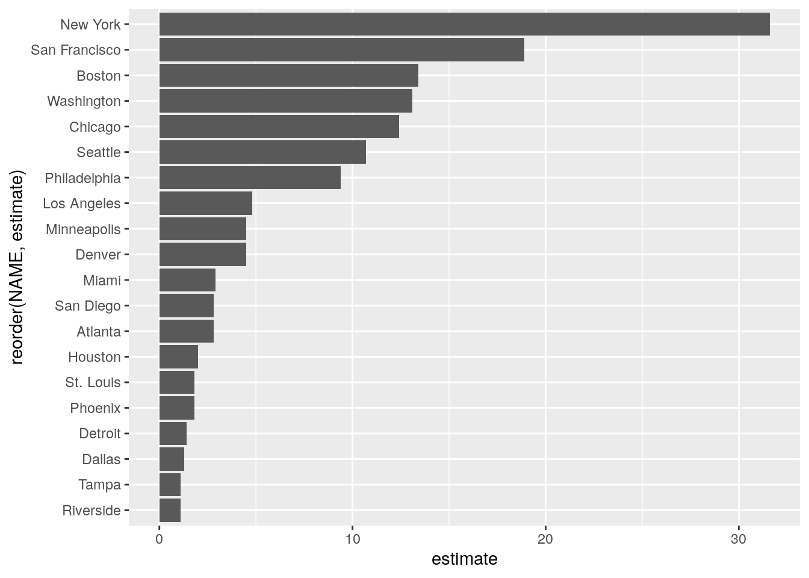
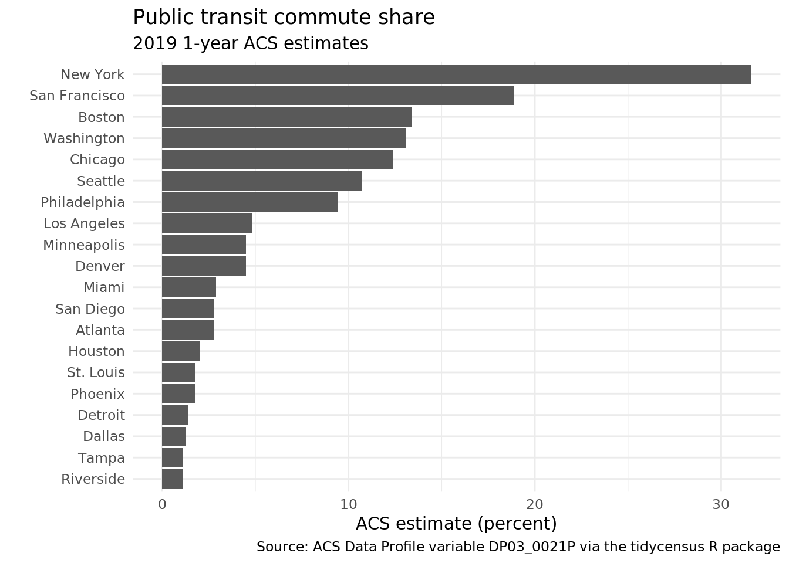
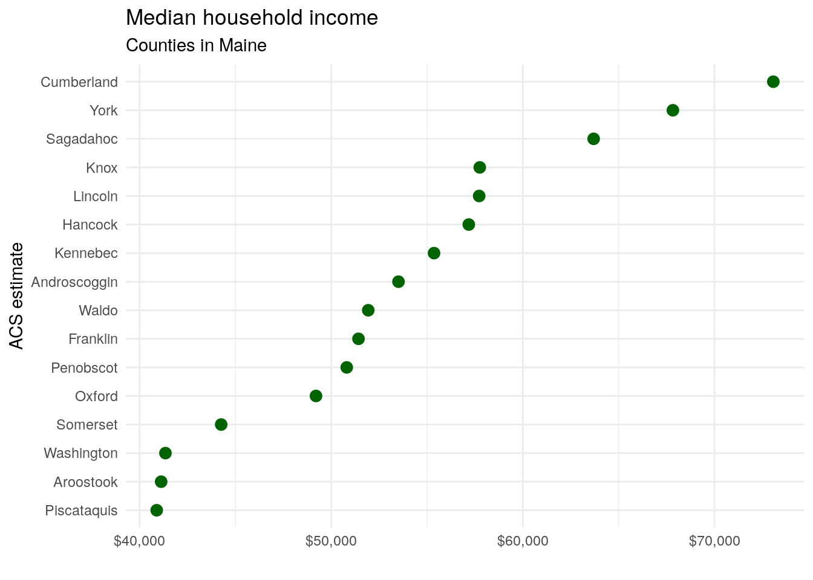
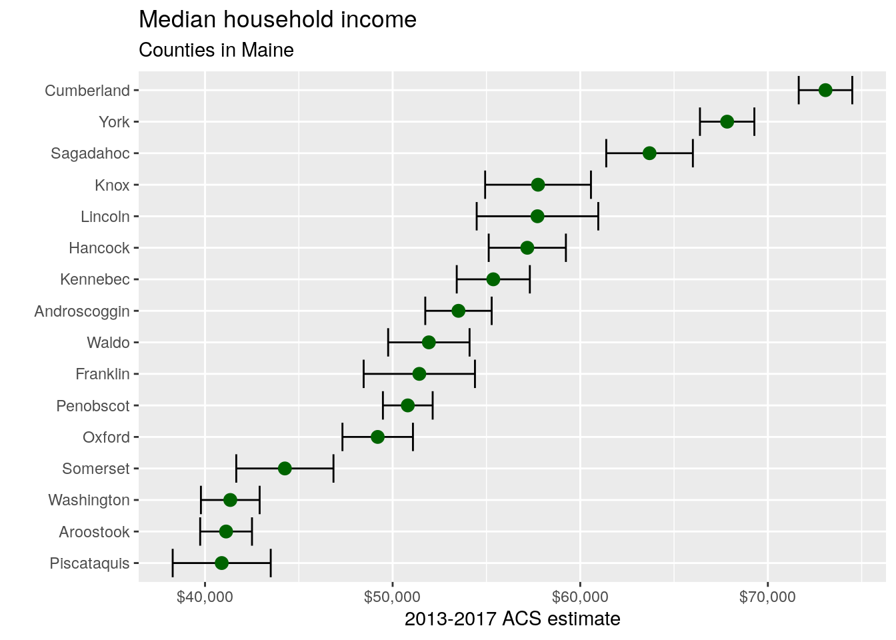
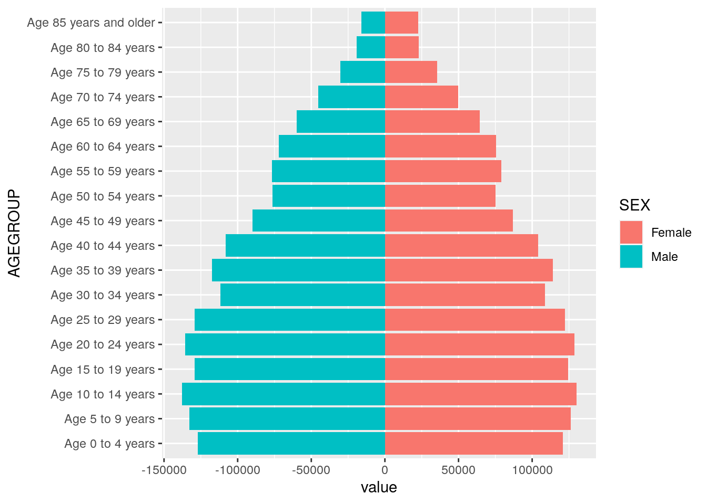
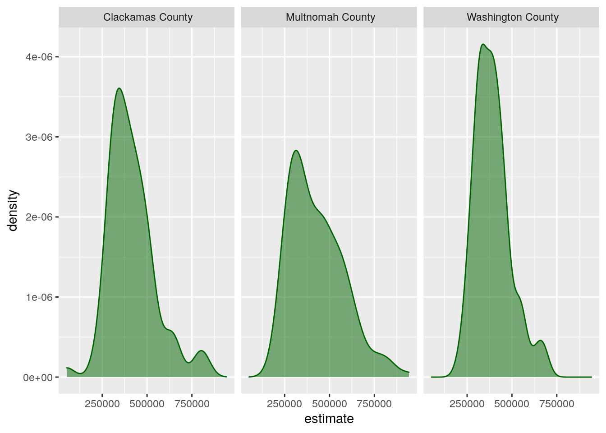
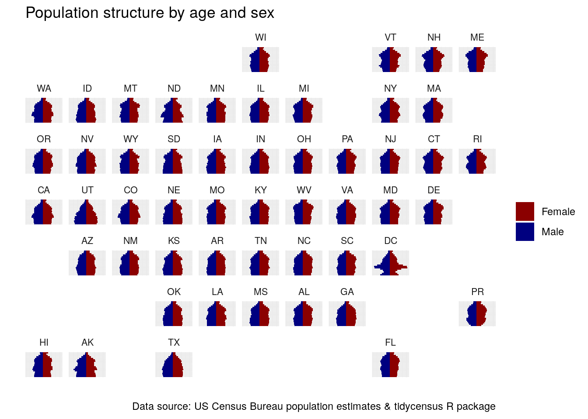

# Exploring US Census data with visualization


The core visualization package within the **tidyverse** suite of packages is **ggplot2** (Wickham 2016). Originally developed by RStudio chief scientist Hadley Wickham, ggplot2 is a widely-used visualization framework by R developers, accounting for 25,000 downloads per day in March of 2019 from the RStudio CRAN mirror. ggplot2 allows R users to visualize data using a *layered grammar of graphics* approach, in which plot objects are initialized upon which the R user layers plot elements.

ggplot2 is an ideal package for visualization of US Census data, especially when obtained in tidy format by the **tidycensus** package. It has powerful capacity for basic charts, group-wise comparisons, and advanced chart types such as maps (which will be covered in the next chapter).

This chapter includes several examples of how R users can visualize data from the US Census Bureau using ggplot2. Chart types explored in this chapter include basic chart types; faceted, or "small multiples" plots; population pyramids; margin of error plots for ACS data; and advanced visualizations using extensions to ggplot2. Finally, the chapter introduces the **plotly** package for interactive visualization, which can be used to convert ggplot2 objects to interactive web graphics.

## Basic Census visualization with ggplot2

In this example, we will create a visualization that illustrates the percent of commuters that take public transportation to work for the largest metropolitan areas in the United States. The data come from the 2019 1-year American Community Survey, variable `DP03_0021P`. To determine this information, we can use **tidyverse** tools to sort our data by descending order of a summary variable representing total population and then retaining the 20 largest metropolitan areas by population.


```r
library(tidycensus)
library(tidyverse)

metros <-  get_acs(
  geography = "cbsa",
  variables = "DP03_0021P",
  summary_var = "B01003_001",
  survey = "acs1",
  year = 2019
) %>%
  slice_max(summary_est, n = 20)


glimpse(metros)
```

```
## Rows: 20
## Columns: 7
## $ GEOID       <chr> "35620", "31080", "16980", "19100", "26420", "47900", "331…
## $ NAME        <chr> "New York-Newark-Jersey City, NY-NJ-PA Metro Area", "Los A…
## $ variable    <chr> "DP03_0021P", "DP03_0021P", "DP03_0021P", "DP03_0021P", "D…
## $ estimate    <dbl> 31.6, 4.8, 12.4, 1.3, 2.0, 13.1, 2.9, 9.4, 2.8, 1.8, 13.4,…
## $ moe         <dbl> 0.2, 0.1, 0.3, 0.1, 0.2, 0.4, 0.2, 0.3, 0.2, 0.2, 0.4, 0.4…
## $ summary_est <dbl> 19216182, 13214799, 9457867, 7573136, 7066140, 6280697, 61…
## $ summary_moe <dbl> NA, NA, 1469, NA, NA, 2482, NA, NA, 3340, NA, NA, NA, NA, …
```

The returned data frame has 7 columns, as is standard for `get_acs()` with a summary variable, but has 20 rows as specified by the `filter` command. While the data can be filtered and sorted further to facilitate comparative analysis, it also can be represented succinctly with a visualization. The tidy format returned by `get_acs()` is well-suited for visualization with ggplot2.

ggplot2 visualizations are initialized with the `ggplot()` function, to which a user commonly supplies a dataset and an `aesthetic`, defined with the `aes()` function. Within the `aes()` function, a user can specify a series of mappings onto either the data axes or other characteristics of the plot, such as element fill or color.

After initializing the ggplot object, users can layer plot elements onto the plot object. Essential to the plot is a `geom`, which specifies one of many chart types available in ggplot2. For example, `geom_bar()` will create a bar chart, `geom_line()` a line chart, `geom_point()` a point plot, and so forth. Layers are linked to the ggplot object by using the `+` operator.

In the basic example below, we can create a dot plot comparing public transportation as commute share for the most populous metropolitan areas in the United States with a minimum of code. The first argument to `ggplot()` in the example below is the name of our dataset; the second argument is an aesthetic mapping of columns to plot elements, specified inside the `aes()` function. This plot initialization is then linked with the `+` operator to the `geom_col()` function to create a bar chart.


```r
p <- ggplot(metros, aes(x = NAME, y = estimate)) + 
  geom_col()

p
```



While the above chart is a visualization of the `metros` dataset, it tells us little about the data given the lack of necessary formatting. The x-axis labels are so lengthy that they overlap and are impossible to read; the axis titles are not intuitive; and the data are not sorted, making it difficult to compare similar observations.

Fortunately, the plot can be made more legible by cleaning up the metropolitan area name, re-ordering the data in descending order, then adding layers to the plot definition. Additionally, ggplot2 visualization can be used in combination with **magrittr** piping and tidyverse functions, allowing analysts to string together data manipulation and visualization processes.

Our first step will be to format the `NAME` column in a more intuitive way. The `NAME` column by default provides a description of each geography as formatted by the US Census Bureau. However, a detailed description like `"Atlanta-Sandy Springs-Roswell, GA Metro Area"` is likely unnecessary for our chart, as the same metropolitan area can be represented on the chart by the name of its first principal city, which in this case would be `"Atlanta"`. To accomplish this, we can overwrite the `NAME` column by using the tidyverse function `str_remove()`, found in the **stringr** package. The example uses *regular expressions* to first remove all the text after the first dash, then remove the text after the first comma if no dash was originally present. These two subsequent calls to `mutate()` will account for the various ways that metropolitan area names are specified.

On the chart, the legibility can be further improved by mapping the metro name to the y-axis and the ACS estimate to the x-axis, and plotting the points in descending order of their estimate values. The ordering of points in this way is accomplished with the `reorder()` function, used inside the call to `aes()`. As the result of the `mutate()` operations is piped to the `ggplot()` function in this example with the `%>%` operator, the dataset argument to `ggplot()` is inferred by the function.


```r
p <- metros %>%
  mutate(NAME = str_remove(NAME, "-.*$")) %>%
  mutate(NAME = str_remove(NAME, ",.*$")) %>%
  ggplot(aes(y = reorder(NAME, estimate), x = estimate)) + 
  geom_col()


p
```



The plot is much more legible after our modifications. Metropolitan areas can be directly compared with one another, and the metro area labels convey enough information about the different places without overwhelming the plot with long axis labels. However, the plot still lacks information to inform the viewer about the plot's content. This can be accomplished by specifying *labels* inside the `labs()` function. In the example below, we'll specify a title and subtitle, and modify the X and Y axis labels from their defaults.


```r
p <- p +  
  labs(title = "Public transit commute share", 
       subtitle = "2019 1-year ACS estimates", 
       y = "", 
       x = "ACS estimate (percent)", 
       caption = "Source: ACS Data Profile variable DP03_0021P via the tidycensus R package") + 
  theme_minimal(base_family = "Waree")
  

p
```



The inclusion of labels provides key information about the contents of the plot and also gives it a more polished look for presentation.

## Visualizing margins of error

As discussed in Chapter 3, handling margins of error appropriately is of significant importance for analysts working with ACS data. While **tidycensus** has tools available for working with margins of error in a data wrangling workflow, it is also often useful to visualize those margins of error to illustrate the degree of uncertainty around estimates, especially when making comparisons between those estimates.

In the above example visualization of public transportation mode share by metropolitan area for the largest metros in the United States, estimates are associated with margins of error; however, these margins of error are relatively small given the large population size of the geographic units represented in the plot. However, if studying demographic trends for geographies of smaller population size - like counties, Census tracts, or block groups - comparisons can be subject to a considerable degree of uncertainty.

In the example below, we will compare the median household incomes of counties in the US state of Maine from the 2013-2017 ACS. Before doing so, it is helpful to understand some basic information about counties in Maine, such as the number of counties and their total population. We can retrieve this information with tidycensus.


```r
maine <- get_acs(
  state = "Maine",
  geography = "county",
  variables = c(totalpop = "B01003_001")
) %>%
  arrange(desc(estimate))

maine
```

```
## # A tibble: 16 x 5
##    GEOID NAME                       variable estimate   moe
##    <chr> <chr>                      <chr>       <dbl> <dbl>
##  1 23005 Cumberland County, Maine   totalpop   292307    NA
##  2 23031 York County, Maine         totalpop   204316    NA
##  3 23019 Penobscot County, Maine    totalpop   151774    NA
##  4 23011 Kennebec County, Maine     totalpop   121753    NA
##  5 23001 Androscoggin County, Maine totalpop   107602    NA
##  6 23003 Aroostook County, Maine    totalpop    67809    NA
##  7 23017 Oxford County, Maine       totalpop    57550    NA
##  8 23009 Hancock County, Maine      totalpop    54601    NA
##  9 23025 Somerset County, Maine     totalpop    50520    NA
## 10 23013 Knox County, Maine         totalpop    39759    NA
## 11 23027 Waldo County, Maine        totalpop    39539    NA
## 12 23023 Sagadahoc County, Maine    totalpop    35452    NA
## 13 23015 Lincoln County, Maine      totalpop    34201    NA
## 14 23029 Washington County, Maine   totalpop    31491    NA
## 15 23007 Franklin County, Maine     totalpop    29982    NA
## 16 23021 Piscataquis County, Maine  totalpop    16836    NA
```

There are sixteen counties in Maine, ranging in population from a maximum of 286,119 to a minimum of 17,156. In turn, estimates for the counties with smaller population sizes are likely to be subject to a larger margin of error than those with larger baseline populations.

Comparing median household incomes of these sixteen counties illustrates this point. Let's firstbobtain this data with tidycensus.


```r
maine_income <- get_acs(
  state = "Maine",
  geography = "county",
  variables = c(hhincome = "B19013_001"),
  year = 2019
) %>%
  mutate(NAME = str_remove(NAME, " County, Maine"))
```

Using some of the tips covered in the previous visualization section, we can produce a plot with appropriate styling and formatting to rank the counties.


```r
ggplot(maine_income, aes(x = estimate, y = reorder(NAME, estimate))) + 
  geom_point(size = 3, color = "darkgreen") + 
  labs(title = "Median household income", 
       subtitle = "Counties in Maine", 
       x = "", 
       y = "ACS estimate") + 
  theme_minimal() + 
  scale_x_continuous(labels = scales::dollar)
```



The above visualization suggests a ranking of counties from the wealthiest (Cumberland) to the poorest (Piscataquis). However, the data used to generate this chart is significantly different from the metropolitan area data used in the previous example. In our first example, ACS estimates covered the top 20 US metros by population - areas that all have populations exceeding 2.8 million. For these areas, margins of error are small enough that they do not meaningfully change the interpretation of the estimates given the large samples sizes used to generate them. However, as discussed in Chapter 3, smaller geographies may have large margins of error around their ACS estimates that may change their interpretation.

On our chart, county estimates are quite close, which may mean that the ranking of counties is misleading given the margin of error around those estimates. We can explore this by looking directly at the data.


```r
maine_income %>% arrange(desc(moe))
```

```
## # A tibble: 16 x 5
##    GEOID NAME         variable estimate   moe
##    <chr> <chr>        <chr>       <dbl> <dbl>
##  1 23015 Lincoln      hhincome    57720  3240
##  2 23007 Franklin     hhincome    51422  2966
##  3 23013 Knox         hhincome    57751  2820
##  4 23021 Piscataquis  hhincome    40890  2613
##  5 23025 Somerset     hhincome    44256  2591
##  6 23023 Sagadahoc    hhincome    63694  2309
##  7 23027 Waldo        hhincome    51931  2170
##  8 23009 Hancock      hhincome    57178  2057
##  9 23011 Kennebec     hhincome    55365  1948
## 10 23017 Oxford       hhincome    49204  1879
## 11 23001 Androscoggin hhincome    53509  1770
## 12 23029 Washington   hhincome    41347  1565
## 13 23031 York         hhincome    67830  1450
## 14 23005 Cumberland   hhincome    73072  1427
## 15 23003 Aroostook    hhincome    41123  1381
## 16 23019 Penobscot    hhincome    50808  1326
```

Specifically, margins of error around the estimated median household incomes vary from a low of \$1326 (Penobscot County) to a high of \$3240 (Sagadahoc County). In many cases, the margins of error around estimated county household income exceed the differences between counties of neighboring ranks, suggesting uncertainty in the ranks themselves.

In turn, a dot plot like the one above intended to visualize a ranking of county household incomes in Maine may be misleading. However, using visualization tools in ggplot2, we can visualize the uncertainty around each estimate, giving chart readers a sense of the uncertainty in the ranking. This is accomplished with the `geom_errorbarh()` function, which will plot horizontal error bars around each dot that stretch to a given value around each estimate. In this instance, we will use the `moe` column to determine the lengths of the error bars.


```r
ggplot(maine_income, aes(x = estimate, y = reorder(NAME, estimate))) + 
  geom_errorbarh(aes(xmin = estimate - moe, xmax = estimate + moe)) + 
  geom_point(size = 3, color = "darkgreen") + 
  labs(title = "Median household income", 
       subtitle = "Counties in Maine", 
       x = "2013-2017 ACS estimate", 
       y = "") + 
  scale_x_continuous(labels = scales::dollar)
```



Adding the horizontal error bars around each point gives us critical information to help us understand how our ranking of Maine counties by median household income. For example, while the ACS estimate suggests that Piscataquis County has the lowest median household income in Maine, the large margin of error around the estimate for Piscataquis County suggests that either Aroostook or Washington Counties *could* conceivably have lower median household incomes. Additionally, while Waldo County has a higher estimated median household income than Androscoggin and Kennebec Counties, the margin of error plot shows us that this ranking is subject to considerable uncertainty.

## Exploring age and sex structure with population pyramids

A common method for visualizing the demographic structure of a particular area is the *population pyramid*. Population pyramids are typically constructed by visualizing population size or proportion on the x-axis; age cohort on the y-axis; and sex is represented categorically with male and female bars mirrored around a central axis.

We can illustrate this type of visualization using data from the Population Estimates API for the state of Utah. We first obtain data using the `get_estimates()` function in tidycensus for 2019 population estimates from the Census Bureau's Population Estimates API.


```r
library(tidycensus)
library(tidyverse)

utah <- get_estimates(
  geography = "state",
  state = "UT",
  product = "characteristics",
  breakdown = c("SEX", "AGEGROUP"),
  breakdown_labels = TRUE,
  year = 2019
) 

utah
```

```
## # A tibble: 96 x 5
##    GEOID NAME    value SEX        AGEGROUP          
##    <chr> <chr>   <dbl> <chr>      <fct>             
##  1 49    Utah  3205958 Both sexes All ages          
##  2 49    Utah   247803 Both sexes Age 0 to 4 years  
##  3 49    Utah   258976 Both sexes Age 5 to 9 years  
##  4 49    Utah  1614917 Male       All ages          
##  5 49    Utah   132868 Male       Age 5 to 9 years  
##  6 49    Utah  1591041 Female     All ages          
##  7 49    Utah   126108 Female     Age 5 to 9 years  
##  8 49    Utah    23039 Female     Age 80 to 84 years
##  9 49    Utah   267985 Both sexes Age 10 to 14 years
## 10 49    Utah   137940 Male       Age 10 to 14 years
## # … with 86 more rows
```

The function returns a tidy dataset in which each row represents population values broken down by age and sex for the state of Utah. However, there are some key issues with this dataset that must be addressed before constructing a population pyramid. First, several rows represent values that we don't need for our population pyramid visualization. For example, the first few rows in the dataset represent population values for `"Both sexes"` or for `"All ages"`. In turn, it will be necessary to isolate those rows that represent five-year age bands by sex, anmd remove the rows that do not. This can be resolved with some data wrangling using tidyverse tools.

In the dataset returned by `get_estimates()`, five-year age bands are identified in the `AGEGROUP` column beginning with the word `"Age"`. We can filter this dataset for rows that match this pattern, and remove those rows that represent both sexes. This leaves us with rows that represent five-year age bands by sex. However, to achieve the desired visual effect, data for one sex must mirror another, split by a central vertical axis. To accomplish this, we can set the values for all `Male` values to negative.


```r
utah_filtered <- filter(utah, str_detect(AGEGROUP, "^Age"), 
                  SEX != "Both sexes") %>%
  mutate(value = ifelse(SEX == "Male", -value, value))

utah_filtered
```

```
## # A tibble: 36 x 5
##    GEOID NAME    value SEX    AGEGROUP          
##    <chr> <chr>   <dbl> <chr>  <fct>             
##  1 49    Utah  -132868 Male   Age 5 to 9 years  
##  2 49    Utah   126108 Female Age 5 to 9 years  
##  3 49    Utah    23039 Female Age 80 to 84 years
##  4 49    Utah  -137940 Male   Age 10 to 14 years
##  5 49    Utah  -129312 Male   Age 15 to 19 years
##  6 49    Utah   130045 Female Age 10 to 14 years
##  7 49    Utah   124535 Female Age 15 to 19 years
##  8 49    Utah  -135806 Male   Age 20 to 24 years
##  9 49    Utah   128846 Female Age 20 to 24 years
## 10 49    Utah  -111776 Male   Age 30 to 34 years
## # … with 26 more rows
```

The data are now ready for visualization! The core components of the pyramid visualization require mapping the population value and the age group to the chart axes. Sex can be mapped to the `fill` aesthetic allowing for the plotting of these categories by color. Importantly, to get the visualization to work correctly, `value` must be mapped to the `y` aesthetic and `AGEGROUP` to the `x` aesthetic, with the `coord_flip()` function then used to plot the bars horizontally instead of vertically.


```r
ggplot(utah_filtered, aes(x = value, y = AGEGROUP, fill = SEX)) + 
  geom_col()
```



The visualization represents a functional population pyramid that is nonetheless in need of some cleanup. In particular, the axis labels are not informative; the y-axis tick labels have redundant information ("Age" and "years"); and the x-axis tick labels are difficult to parse. Cleaning up the plot allows us to use some additional visualization options in ggplot2. In addition to specifying appropriate chart labels, we can format the axis tick labels by using appropriate `scale_*` functions in ggplot2 along with custom label formatters we define. In particular, this involves the use of custom absolute values to represent population sizes, and the removal of redundant age group information. We'll also make use of an alternative ggplot2 theme, `theme_minimal()`, which uses a white background with muted gridlines.


```r
utah_pyramid <- ggplot(utah_filtered, aes(x = value, y = AGEGROUP, fill = SEX)) + 
  geom_col(width = 0.95, alpha = 0.75) + 
  theme_minimal(base_family = "Verdana") + 
  scale_x_continuous(labels = function(y) paste0(abs(y / 1000), "k")) + 
  scale_y_discrete(labels = function(x) gsub("Age | years", "", x)) + 
  scale_fill_manual(values = c("darkred", "navy")) + 
  labs(x = "", 
       y = "2019 Census Bureau population estimate", 
       title = "Population structure in Utah", 
       fill = "", 
       caption = "Data source: US Census Bureau population estimates & tidycensus R package")

utah_pyramid
```


## Making comparisons with faceted plots

One of the most powerful features of ggplot2 is its ability to generate *faceted plots*, which are also commonly referred to as *small multiples*. Faceted plots allow for the sub-division of a dataset into groups, which are then plotted side-by-side to facilitate comparisons between those groups. This is particularly useful when examining how distributions of values vary across different geographies. An example shown below involves a comparison of median home values by Census tract for three counties in the Portland, Oregon area: Multnomah, which contains the city of Portland, and the suburban counties of Clackamas and Washington.


```r
housing_val <- get_acs(geography = "tract", 
                       variables = "B25077_001", 
                       state = "OR", 
                       county = c("Multnomah", "Clackamas", "Washington"))

housing_val
```

```
## # A tibble: 355 x 5
##    GEOID       NAME                                     variable  estimate   moe
##    <chr>       <chr>                                    <chr>        <dbl> <dbl>
##  1 41005020100 Census Tract 201, Clackamas County, Ore… B25077_0…   800400 83602
##  2 41005020200 Census Tract 202, Clackamas County, Ore… B25077_0…   821800 79926
##  3 41005020302 Census Tract 203.02, Clackamas County, … B25077_0…   523700 40705
##  4 41005020303 Census Tract 203.03, Clackamas County, … B25077_0…   533000 34841
##  5 41005020304 Census Tract 203.04, Clackamas County, … B25077_0…   630400 65801
##  6 41005020401 Census Tract 204.01, Clackamas County, … B25077_0…   513400 39993
##  7 41005020403 Census Tract 204.03, Clackamas County, … B25077_0…   787700 54683
##  8 41005020404 Census Tract 204.04, Clackamas County, … B25077_0…   648500 19144
##  9 41005020501 Census Tract 205.01, Clackamas County, … B25077_0…   607200 34920
## 10 41005020503 Census Tract 205.03, Clackamas County, … B25077_0…   645100 50467
## # … with 345 more rows
```

As with other datasets obtained with tidycensus, the `NAME` column contains descriptive information that can be parsed to make comparisons. In this case, Census tract ID, county, and state are separated with commas; in turn the tidyverse `separate()` function can split this column into three columns accordingly.


```r
housing_val2 <- separate(housing_val, NAME, 
                         into = c("tract", "county", "state"), 
                         sep = ",")

housing_val2
```

```
## # A tibble: 355 x 7
##    GEOID      tract            county           state   variable  estimate   moe
##    <chr>      <chr>            <chr>            <chr>   <chr>        <dbl> <dbl>
##  1 410050201… Census Tract 201 " Clackamas Cou… " Oreg… B25077_0…   800400 83602
##  2 410050202… Census Tract 202 " Clackamas Cou… " Oreg… B25077_0…   821800 79926
##  3 410050203… Census Tract 20… " Clackamas Cou… " Oreg… B25077_0…   523700 40705
##  4 410050203… Census Tract 20… " Clackamas Cou… " Oreg… B25077_0…   533000 34841
##  5 410050203… Census Tract 20… " Clackamas Cou… " Oreg… B25077_0…   630400 65801
##  6 410050204… Census Tract 20… " Clackamas Cou… " Oreg… B25077_0…   513400 39993
##  7 410050204… Census Tract 20… " Clackamas Cou… " Oreg… B25077_0…   787700 54683
##  8 410050204… Census Tract 20… " Clackamas Cou… " Oreg… B25077_0…   648500 19144
##  9 410050205… Census Tract 20… " Clackamas Cou… " Oreg… B25077_0…   607200 34920
## 10 410050205… Census Tract 20… " Clackamas Cou… " Oreg… B25077_0…   645100 50467
## # … with 345 more rows
```

As explored in previous chapters, a major strength of the tidyverse is its ability to perform group-wise data analysis. The dimensions of median home values by Census tract in each of the three counties can be explored in this way. For example, a call to `group_by()` followed by `summarize()` facilitates the calculation of county minimums, means, medians, and maximums.


```r
housing_val2 %>%
  group_by(county) %>%
  summarize(min = min(estimate, na.rm = TRUE), 
            mean = mean(estimate, na.rm = TRUE), 
            median = median(estimate, na.rm = TRUE), 
            max = max(estimate, na.rm = TRUE))
```

```
## # A tibble: 3 x 5
##   county                  min    mean median    max
##   <chr>                 <dbl>   <dbl>  <dbl>  <dbl>
## 1 " Clackamas County"   51800 413362. 386300 821800
## 2 " Multnomah County"  193500 428579. 403200 943000
## 3 " Washington County" 207900 391476. 379400 689900
```

While these basic summary statistics offer some insights into comparisons between the three counties, they are limited in their ability to help us understand the dynamics of the overall distribution of values. This task can in turn be augmented through visualization, which allows for quick visual comparison of these distributions. Group-wise visualization in ggplot2 can be accomplished with the `facet_wrap()` function added onto any existing ggplot2 code that has salient groups to visualize. For example, a kernel density plot can show the overall shape of the distribution of median home values in our dataset:


```r
ggplot(housing_val2, aes(x = estimate)) + 
  geom_density()
```


Adding the `facet_wrap()` function, and specifying `county` as the column used to group the data, splits this visualization into side-by-side graphics based on the counties to which each Census tract belongs.


```r
ggplot(housing_val2, aes(x = estimate)) +
  geom_density(fill = "darkgreen", color = "darkgreen", alpha = 0.5) + 
  facet_wrap(~county)
```



The side-by-side comparative graphics show how the value distributions vary between the three counties. Home values in all three counties are common around \$250,000, but Multnomah County has some Census tracts that represent the highest values in the dataset.

## Advanced visualization with ggplot2 extensions

Beeswarm plot:


```r
library(tidycensus)
library(tidyverse)
library(ggbeeswarm)

ny_race_income <- get_acs(
  geography = "tract", 
  state = "NY",  
  county = c("New York", "Bronx", "Queens", "Richmond", "Kings"),
  variables = c(White = "B03002_003", 
                Black = "B03002_004", 
                Asian = "B03002_006",
                Hispanic = "B03002_012"), 
  summary_var = "B19013_001"
) %>%
  group_by(GEOID) %>%
  filter(estimate == max(estimate, na.rm = TRUE)) %>%
  ungroup() %>%
  filter(estimate != 0)

ggplot(ny_race_income, aes(x = variable, y = summary_est, color = summary_est)) +
  geom_quasirandom(alpha = 0.5) + 
  coord_flip() + 
  theme_minimal() + 
  scale_color_viridis_c(guide = FALSE) + 
  scale_y_continuous(labels = scales::dollar) + 
  labs(x = "Largest group in Census tract", 
       y = "Median household income", 
       title = "Household income distribution by largest racial/ethnic group", 
       subtitle = "Census tracts, New York City", 
       caption = "Data source: 2015-2019 ACS")
```


## Geo-facets:


```r
library(geofacet)

us_pyramid_data <- get_estimates(
  geography = "state",
  product = "characteristics",
  breakdown = c("SEX", "AGEGROUP"),
  breakdown_labels = TRUE,
  year = 2019
) %>%
  filter(str_detect(AGEGROUP, "^Age"),
         SEX != "Both sexes") %>%
  group_by(NAME) %>%
  mutate(prop = value / sum(value, na.rm = TRUE)) %>%
  ungroup() %>%
  mutate(prop = ifelse(SEX == "Male", -prop, prop))

ggplot(us_pyramid_data, aes(x = AGEGROUP, y = prop, fill = SEX)) + 
  geom_bar(stat = "identity", width = 1) + 
  theme_minimal() + 
  scale_y_continuous(labels = function(y) paste0(abs(y / 1000), "k")) + 
  scale_x_discrete(labels = function(x) gsub("Age | years", "", x)) + 
  scale_fill_manual(values = c("darkred", "navy")) + 
  coord_flip() + 
  facet_geo(~NAME, grid = "us_state_with_DC_PR_grid2",
            label = "code") + 
  theme(axis.text = element_blank(),
        strip.text.x = element_text(size = 8)) + 
  labs(x = "", 
       y = "", 
       title = "Population structure by age and sex", 
       fill = "", 
       caption = "Data source: US Census Bureau population estimates & tidycensus R package")
```



## Interactive visualization with plotly


```r
library(plotly)

ggplotly(utah_pyramid)
```

```{=html}
<div id="htmlwidget-d9138c51cade593eaaa3" style="width:672px;height:480px;" class="plotly html-widget"></div>
<script type="application/json" data-for="htmlwidget-d9138c51cade593eaaa3">{"x":{"data":[{"orientation":"v","width":[126108,23039,130045,124535,128846,108654,113907,104121,86950,78972,75578,64309,49913,120743,122197,75046,35411,22667],"base":[1.525,16.525,2.525,3.525,4.525,6.525,7.525,8.525,9.525,11.525,12.525,13.525,14.525,0.525,5.525,10.525,15.525,17.525],"x":[63054,11519.5,65022.5,62267.5,64423,54327,56953.5,52060.5,43475,39486,37789,32154.5,24956.5,60371.5,61098.5,37523,17705.5,11333.5],"y":[0.95,0.950000000000003,0.95,0.95,0.949999999999999,0.949999999999999,0.949999999999999,0.949999999999999,0.949999999999999,0.949999999999999,0.949999999999999,0.949999999999999,0.949999999999999,0.95,0.949999999999999,0.949999999999999,0.950000000000001,0.950000000000003],"text":["value:  126108<br />AGEGROUP: Age 5 to 9 years<br />SEX: Female","value:   23039<br />AGEGROUP: Age 80 to 84 years<br />SEX: Female","value:  130045<br />AGEGROUP: Age 10 to 14 years<br />SEX: Female","value:  124535<br />AGEGROUP: Age 15 to 19 years<br />SEX: Female","value:  128846<br />AGEGROUP: Age 20 to 24 years<br />SEX: Female","value:  108654<br />AGEGROUP: Age 30 to 34 years<br />SEX: Female","value:  113907<br />AGEGROUP: Age 35 to 39 years<br />SEX: Female","value:  104121<br />AGEGROUP: Age 40 to 44 years<br />SEX: Female","value:   86950<br />AGEGROUP: Age 45 to 49 years<br />SEX: Female","value:   78972<br />AGEGROUP: Age 55 to 59 years<br />SEX: Female","value:   75578<br />AGEGROUP: Age 60 to 64 years<br />SEX: Female","value:   64309<br />AGEGROUP: Age 65 to 69 years<br />SEX: Female","value:   49913<br />AGEGROUP: Age 70 to 74 years<br />SEX: Female","value:  120743<br />AGEGROUP: Age 0 to 4 years<br />SEX: Female","value:  122197<br />AGEGROUP: Age 25 to 29 years<br />SEX: Female","value:   75046<br />AGEGROUP: Age 50 to 54 years<br />SEX: Female","value:   35411<br />AGEGROUP: Age 75 to 79 years<br />SEX: Female","value:   22667<br />AGEGROUP: Age 85 years and older<br />SEX: Female"],"type":"bar","marker":{"autocolorscale":false,"color":"rgba(139,0,0,0.75)","line":{"width":1.88976377952756,"color":"transparent"}},"name":"Female","legendgroup":"Female","showlegend":true,"xaxis":"x","yaxis":"y","hoverinfo":"text","frame":null},{"orientation":"v","width":[132868,137940,129312,135806,111776,117335,108090,89984,76536,72048,59874,45370,19148,15907,127060,129179,76450,30234],"base":[1.525,2.525,3.525,4.525,6.525,7.525,8.525,9.525,11.525,12.525,13.525,14.525,16.525,17.525,0.525,5.525,10.525,15.525],"x":[-66434,-68970,-64656,-67903,-55888,-58667.5,-54045,-44992,-38268,-36024,-29937,-22685,-9574,-7953.5,-63530,-64589.5,-38225,-15117],"y":[0.95,0.95,0.95,0.949999999999999,0.949999999999999,0.949999999999999,0.949999999999999,0.949999999999999,0.949999999999999,0.949999999999999,0.949999999999999,0.949999999999999,0.950000000000003,0.950000000000003,0.95,0.949999999999999,0.949999999999999,0.950000000000001],"text":["value: -132868<br />AGEGROUP: Age 5 to 9 years<br />SEX: Male","value: -137940<br />AGEGROUP: Age 10 to 14 years<br />SEX: Male","value: -129312<br />AGEGROUP: Age 15 to 19 years<br />SEX: Male","value: -135806<br />AGEGROUP: Age 20 to 24 years<br />SEX: Male","value: -111776<br />AGEGROUP: Age 30 to 34 years<br />SEX: Male","value: -117335<br />AGEGROUP: Age 35 to 39 years<br />SEX: Male","value: -108090<br />AGEGROUP: Age 40 to 44 years<br />SEX: Male","value:  -89984<br />AGEGROUP: Age 45 to 49 years<br />SEX: Male","value:  -76536<br />AGEGROUP: Age 55 to 59 years<br />SEX: Male","value:  -72048<br />AGEGROUP: Age 60 to 64 years<br />SEX: Male","value:  -59874<br />AGEGROUP: Age 65 to 69 years<br />SEX: Male","value:  -45370<br />AGEGROUP: Age 70 to 74 years<br />SEX: Male","value:  -19148<br />AGEGROUP: Age 80 to 84 years<br />SEX: Male","value:  -15907<br />AGEGROUP: Age 85 years and older<br />SEX: Male","value: -127060<br />AGEGROUP: Age 0 to 4 years<br />SEX: Male","value: -129179<br />AGEGROUP: Age 25 to 29 years<br />SEX: Male","value:  -76450<br />AGEGROUP: Age 50 to 54 years<br />SEX: Male","value:  -30234<br />AGEGROUP: Age 75 to 79 years<br />SEX: Male"],"type":"bar","marker":{"autocolorscale":false,"color":"rgba(0,0,128,0.75)","line":{"width":1.88976377952756,"color":"transparent"}},"name":"Male","legendgroup":"Male","showlegend":true,"xaxis":"x","yaxis":"y","hoverinfo":"text","frame":null}],"layout":{"margin":{"t":43.7625570776256,"r":7.30593607305936,"b":25.5707762557078,"l":95.7077625570777},"font":{"color":"rgba(0,0,0,1)","family":"Verdana","size":14.6118721461187},"title":{"text":"Population structure in Utah","font":{"color":"rgba(0,0,0,1)","family":"Verdana","size":17.5342465753425},"x":0,"xref":"paper"},"xaxis":{"domain":[0,1],"automargin":true,"type":"linear","autorange":false,"range":[-151339.25,143444.25],"tickmode":"array","ticktext":["150k","100k","50k","0k","50k","100k"],"tickvals":[-150000,-100000,-50000,0,50000,100000],"categoryorder":"array","categoryarray":["150k","100k","50k","0k","50k","100k"],"nticks":null,"ticks":"","tickcolor":null,"ticklen":3.65296803652968,"tickwidth":0,"showticklabels":true,"tickfont":{"color":"rgba(77,77,77,1)","family":"Verdana","size":11.689497716895},"tickangle":-0,"showline":false,"linecolor":null,"linewidth":0,"showgrid":true,"gridcolor":"rgba(235,235,235,1)","gridwidth":0.66417600664176,"zeroline":false,"anchor":"y","title":{"text":"","font":{"color":"rgba(0,0,0,1)","family":"Verdana","size":14.6118721461187}},"hoverformat":".2f"},"yaxis":{"domain":[0,1],"automargin":true,"type":"linear","autorange":false,"range":[0.4,18.6],"tickmode":"array","ticktext":["0 to 4","5 to 9","10 to 14","15 to 19","20 to 24","25 to 29","30 to 34","35 to 39","40 to 44","45 to 49","50 to 54","55 to 59","60 to 64","65 to 69","70 to 74","75 to 79","80 to 84","85 and older"],"tickvals":[1,2,3,4,5,6,7,8,9,10,11,12,13,14,15,16,17,18],"categoryorder":"array","categoryarray":["0 to 4","5 to 9","10 to 14","15 to 19","20 to 24","25 to 29","30 to 34","35 to 39","40 to 44","45 to 49","50 to 54","55 to 59","60 to 64","65 to 69","70 to 74","75 to 79","80 to 84","85 and older"],"nticks":null,"ticks":"","tickcolor":null,"ticklen":3.65296803652968,"tickwidth":0,"showticklabels":true,"tickfont":{"color":"rgba(77,77,77,1)","family":"Verdana","size":11.689497716895},"tickangle":-0,"showline":false,"linecolor":null,"linewidth":0,"showgrid":true,"gridcolor":"rgba(235,235,235,1)","gridwidth":0.66417600664176,"zeroline":false,"anchor":"x","title":{"text":"2019 Census Bureau population estimate","font":{"color":"rgba(0,0,0,1)","family":"Verdana","size":14.6118721461187}},"hoverformat":".2f"},"shapes":[{"type":"rect","fillcolor":null,"line":{"color":null,"width":0,"linetype":[]},"yref":"paper","xref":"paper","x0":0,"x1":1,"y0":0,"y1":1}],"showlegend":true,"legend":{"bgcolor":null,"bordercolor":null,"borderwidth":0,"font":{"color":"rgba(0,0,0,1)","family":"Verdana","size":11.689497716895},"y":0.96751968503937},"hovermode":"closest","barmode":"relative"},"config":{"doubleClick":"reset","showSendToCloud":false},"source":"A","attrs":{"7942613dc00":{"x":{},"y":{},"fill":{},"type":"bar"}},"cur_data":"7942613dc00","visdat":{"7942613dc00":["function (y) ","x"]},"highlight":{"on":"plotly_click","persistent":false,"dynamic":false,"selectize":false,"opacityDim":0.2,"selected":{"opacity":1},"debounce":0},"shinyEvents":["plotly_hover","plotly_click","plotly_selected","plotly_relayout","plotly_brushed","plotly_brushing","plotly_clickannotation","plotly_doubleclick","plotly_deselect","plotly_afterplot","plotly_sunburstclick"],"base_url":"https://plot.ly"},"evals":[],"jsHooks":[]}</script>
```
