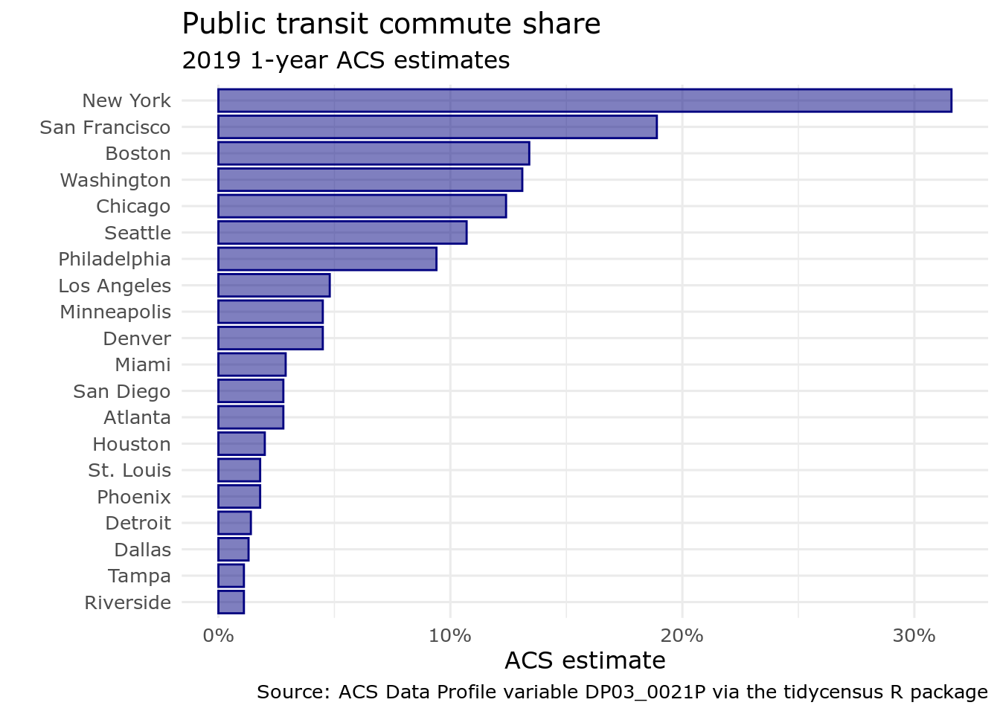
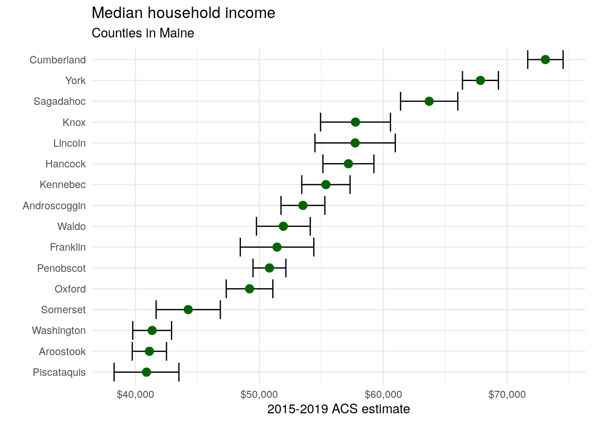
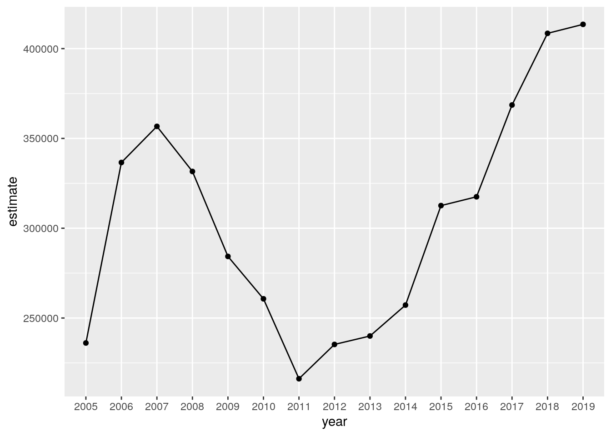
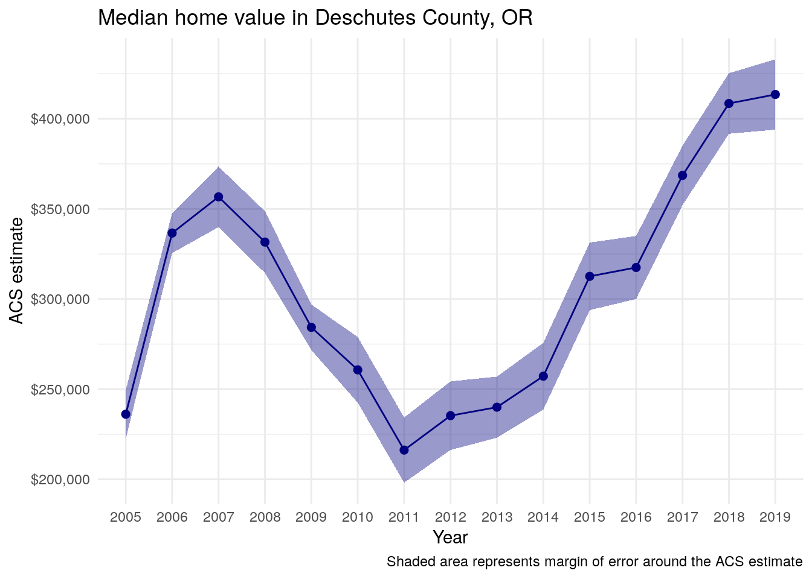
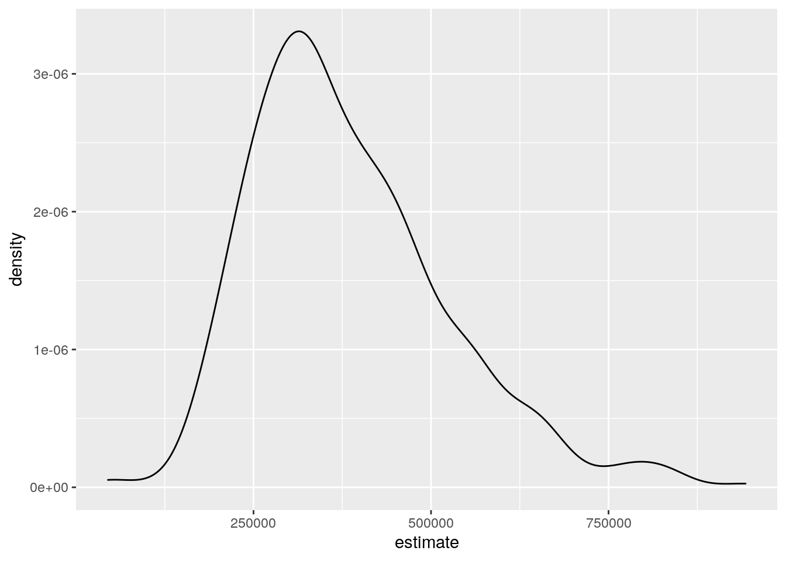
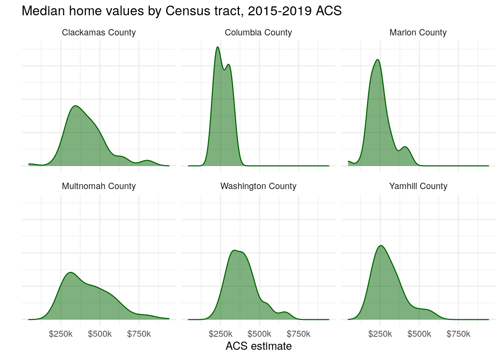
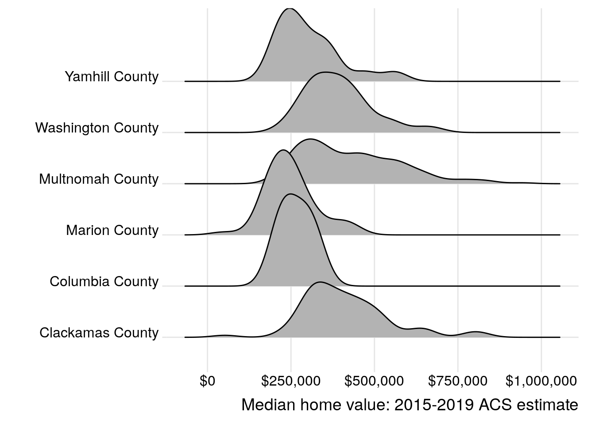
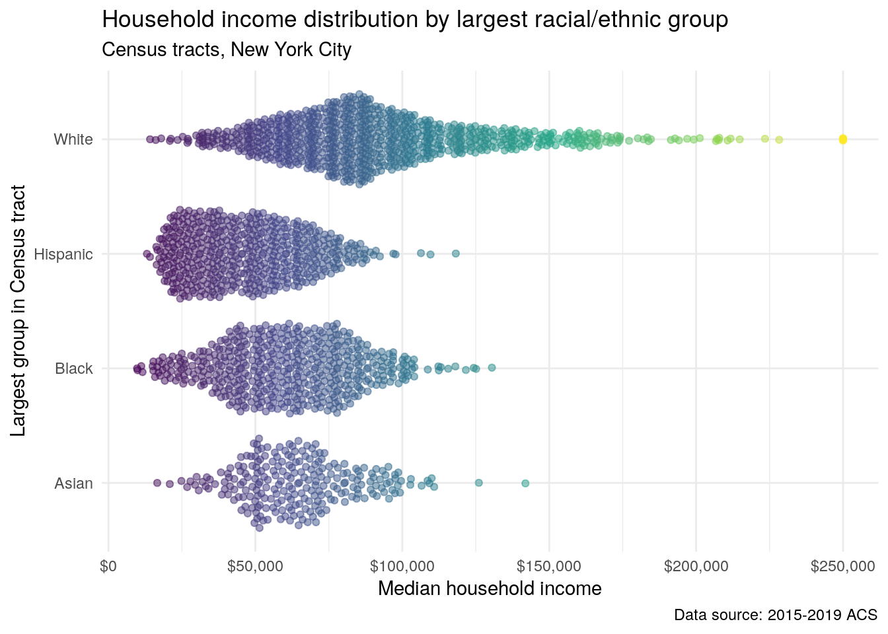

# Exploring US Census data with visualization


The core visualization package within the **tidyverse** suite of packages is **ggplot2** [@wickham2016]. Originally developed by RStudio chief scientist Hadley Wickham, **ggplot2** is a widely-used visualization framework by R developers, accounting for 70,000 downloads per day in June 2021 from the RStudio CRAN mirror. **ggplot2** allows R users to visualize data using a *layered grammar of graphics* approach, in which plot objects are initialized upon which the R user layers plot elements.

**ggplot2** is an ideal package for visualization of US Census data, especially when obtained in tidy format by the **tidycensus** package. It has powerful capacity for basic charts, group-wise comparisons, and advanced chart types such as maps.

This chapter includes several examples of how R users can visualize data from the US Census Bureau using **ggplot2**. Chart types explored in this chapter include basic chart types; faceted, or "small multiples" plots; population pyramids; margin of error plots for ACS data; and advanced visualizations using extensions to **ggplot2**. Finally, the chapter introduces the **plotly** package for interactive visualization, which can be used to convert **ggplot2** objects to interactive web graphics.

## Basic Census visualization with ggplot2

In this example, we will create a visualization that illustrates the percent of commuters that take public transportation to work for the largest metropolitan areas in the United States. The data come from the 2019 1-year American Community Survey Data Profile, variable `DP03_0021P`. To determine this information, we can use **tidyverse** tools to sort our data by descending order of a summary variable representing total population and then retaining the 20 largest metropolitan areas by population using the `slice_max()` function.


```r
library(tidycensus)
library(tidyverse)

metros <-  get_acs(
  geography = "cbsa",
  variables = "DP03_0021P",
  summary_var = "B01003_001",
  survey = "acs1",
  year = 2019
) %>%
  slice_max(summary_est, n = 20)
```

<table class="table table-striped table-hover table-condensed table-responsive" style="margin-left: auto; margin-right: auto;">
<caption>(\#tab:get-metro-data-show)Large metro areas by public transit commuting share</caption>
 <thead>
  <tr>
   <th style="text-align:left;position: sticky; top:0; background-color: #FFFFFF;"> GEOID </th>
   <th style="text-align:left;position: sticky; top:0; background-color: #FFFFFF;"> NAME </th>
   <th style="text-align:left;position: sticky; top:0; background-color: #FFFFFF;"> variable </th>
   <th style="text-align:right;position: sticky; top:0; background-color: #FFFFFF;"> estimate </th>
   <th style="text-align:right;position: sticky; top:0; background-color: #FFFFFF;"> moe </th>
   <th style="text-align:right;position: sticky; top:0; background-color: #FFFFFF;"> summary_est </th>
   <th style="text-align:right;position: sticky; top:0; background-color: #FFFFFF;"> summary_moe </th>
  </tr>
 </thead>
<tbody>
  <tr>
   <td style="text-align:left;"> 35620 </td>
   <td style="text-align:left;"> New York-Newark-Jersey City, NY-NJ-PA Metro Area </td>
   <td style="text-align:left;"> DP03_0021P </td>
   <td style="text-align:right;"> 31.6 </td>
   <td style="text-align:right;"> 0.2 </td>
   <td style="text-align:right;"> 19216182 </td>
   <td style="text-align:right;"> NA </td>
  </tr>
  <tr>
   <td style="text-align:left;"> 31080 </td>
   <td style="text-align:left;"> Los Angeles-Long Beach-Anaheim, CA Metro Area </td>
   <td style="text-align:left;"> DP03_0021P </td>
   <td style="text-align:right;"> 4.8 </td>
   <td style="text-align:right;"> 0.1 </td>
   <td style="text-align:right;"> 13214799 </td>
   <td style="text-align:right;"> NA </td>
  </tr>
  <tr>
   <td style="text-align:left;"> 16980 </td>
   <td style="text-align:left;"> Chicago-Naperville-Elgin, IL-IN-WI Metro Area </td>
   <td style="text-align:left;"> DP03_0021P </td>
   <td style="text-align:right;"> 12.4 </td>
   <td style="text-align:right;"> 0.3 </td>
   <td style="text-align:right;"> 9457867 </td>
   <td style="text-align:right;"> 1469 </td>
  </tr>
  <tr>
   <td style="text-align:left;"> 19100 </td>
   <td style="text-align:left;"> Dallas-Fort Worth-Arlington, TX Metro Area </td>
   <td style="text-align:left;"> DP03_0021P </td>
   <td style="text-align:right;"> 1.3 </td>
   <td style="text-align:right;"> 0.1 </td>
   <td style="text-align:right;"> 7573136 </td>
   <td style="text-align:right;"> NA </td>
  </tr>
  <tr>
   <td style="text-align:left;"> 26420 </td>
   <td style="text-align:left;"> Houston-The Woodlands-Sugar Land, TX Metro Area </td>
   <td style="text-align:left;"> DP03_0021P </td>
   <td style="text-align:right;"> 2.0 </td>
   <td style="text-align:right;"> 0.2 </td>
   <td style="text-align:right;"> 7066140 </td>
   <td style="text-align:right;"> NA </td>
  </tr>
</tbody>
</table>

The returned data frame has 7 columns, as is standard for `get_acs()` with a summary variable, but has 20 rows as specified by the `slice_max()` command. While the data can be filtered and sorted further to facilitate comparative analysis, it also can be represented succinctly with a visualization. The tidy format returned by `get_acs()` is well-suited for visualization with **ggplot2**.

### Getting started with ggplot2

**ggplot2** visualizations are initialized with the `ggplot()` function, to which a user commonly supplies a dataset and an *aesthetic*, defined with the `aes()` function. Within the `aes()` function, a user can specify a series of mappings onto either the data axes or other characteristics of the plot, such as element fill or color.

After initializing the ggplot object, users can layer plot elements onto the plot object. Essential to the plot is a `geom`, which specifies one of many chart types available in ggplot2. For example, `geom_bar()` will create a bar chart, `geom_line()` a line chart, `geom_point()` a point plot, and so forth. Layers are linked to the ggplot object by using the `+` operator.

In the basic example below, we can create a dot plot comparing public transportation as commute share for the most populous metropolitan areas in the United States with a minimum of code. The first argument to `ggplot()` in the example below is the name of our dataset; the second argument is an aesthetic mapping of columns to plot elements, specified inside the `aes()` function. This plot initialization is then linked with the `+` operator to the `geom_col()` function to create a bar chart.


```r
ggplot(metros, aes(x = NAME, y = estimate)) + 
  geom_col()
```

<div class="figure">

<p class="caption">(\#fig:first-plot)A first bar chart with ggplot2</p>
</div>

While the above chart is a visualization of the `metros` dataset, it tells us little about the data given the lack of necessary formatting. The x-axis labels are so lengthy that they overlap and are impossible to read; the axis titles are not intuitive; and the data are not sorted, making it difficult to compare similar observations.

### Improving plot legibility

Fortunately, the plot can be made more legible by cleaning up the metropolitan area name, re-ordering the data in descending order, then adding layers to the plot definition. Additionally, **ggplot2** visualization can be used in combination with **magrittr** piping and **tidyverse** functions, allowing analysts to string together data manipulation and visualization processes.

Our first step will be to format the `NAME` column in a more intuitive way. The `NAME` column by default provides a description of each geography as formatted by the US Census Bureau. However, a detailed description like `"Atlanta-Sandy Springs-Roswell, GA Metro Area"` is likely unnecessary for our chart, as the same metropolitan area can be represented on the chart by the name of its first principal city, which in this case would be `"Atlanta"`. To accomplish this, we can overwrite the `NAME` column by using the tidyverse function `str_remove()`, found in the **stringr** package. The example uses *regular expressions* to first remove all the text after the first dash, then remove the text after the first comma if no dash was originally present. These two subsequent calls to `mutate()` will account for the various ways that metropolitan area names are specified.

On the chart, the legibility can be further improved by mapping the metro name to the y-axis and the ACS estimate to the x-axis, and plotting the points in descending order of their estimate values. The ordering of points in this way is accomplished with the `reorder()` function, used inside the call to `aes()`. As the result of the `mutate()` operations is piped to the `ggplot()` function in this example with the `%>%` operator, the dataset argument to `ggplot()` is inferred by the function.


```r
metros %>%
  mutate(NAME = str_remove(NAME, "-.*$")) %>%
  mutate(NAME = str_remove(NAME, ",.*$")) %>%
  ggplot(aes(y = reorder(NAME, estimate), x = estimate)) + 
  geom_col()
```

<div class="figure">

<p class="caption">(\#fig:second-plot)An improved bar chart with ggplot2</p>
</div>

The plot is much more legible after our modifications. Metropolitan areas can be directly compared with one another, and the metro area labels convey enough information about the different places without overwhelming the plot with long axis labels. However, the plot still lacks information to inform the viewer about the plot's content. This can be accomplished by specifying *labels* inside the `labs()` function. In the example below, we'll specify a title and subtitle, and modify the X and Y axis labels from their defaults.


```r
metros %>%
  mutate(NAME = str_remove(NAME, "-.*$")) %>%
  mutate(NAME = str_remove(NAME, ",.*$")) %>%
  ggplot(aes(y = reorder(NAME, estimate), x = estimate)) + 
  geom_col() +  
  theme_minimal() + 
  labs(title = "Public transit commute share", 
       subtitle = "2019 1-year ACS estimates", 
       y = "", 
       x = "ACS estimate", 
       caption = "Source: ACS Data Profile variable DP03_0021P via the tidycensus R package") 
```

<div class="figure">

<p class="caption">(\#fig:polished-plot)A cleaned-up bar chart with ggplot2</p>
</div>

The inclusion of labels provides key information about the contents of the plot and also gives it a more polished look for presentation.

### Custom styling of ggplot2 charts

While an analyst may be comfortable with the plot as-is, **ggplot2** allows for significant customization with respect to stylistic presentation. The example below makes a few such modifications. This includes styling the bars on the plot with a different color and internal transparency; changing the font; and customizing the axis tick labels.


```r
metros %>%
  mutate(NAME = str_remove(NAME, "-.*$")) %>%
  mutate(NAME = str_remove(NAME, ",.*$")) %>%
  ggplot(aes(y = reorder(NAME, estimate), x = estimate)) + 
  geom_col(color = "navy", fill = "navy", 
           alpha = 0.5, width = 0.85) +  
  theme_minimal(base_size = 12, base_family = "Verdana") + 
  scale_x_continuous(labels = ~paste0(.x, "%")) + 
  labs(title = "Public transit commute share", 
       subtitle = "2019 1-year ACS estimates", 
       y = "", 
       x = "ACS estimate", 
       caption = "Source: ACS Data Profile variable DP03_0021P via the tidycensus R package") 
```

<div class="figure">

<p class="caption">(\#fig:customized-plot)A ggplot2 bar chart with custom styling</p>
</div>

The code used to produced the styled graphic uses the following modifications:

-   While aesthetic mappings relative to a column in the input dataset will be specified in a call to `aes()`, **ggplot2** geoms can be styled directly in their corresponding functions. Bars in **ggplot2** are characterized by both a *color*, which is the outline of the bar, and a *fill*. The above code sets both to `"navy"` then modifies the internal transparency of the bar with the `alpha` argument. Finally, `width = 0.85` slightly increases the spacing between bars.

-   In the call to `theme_minimal()`, `base_size` and `base_family` parameters are available. `base_size` specifies the base font size to which plot text elements will be drawn; this defaults to 11. In many cases, you will want to increase `base_size` to improve plot legibility. `base_family` allows you to change the font family used on your plot. In this example, `base_family` is set to `"Verdana"`, but you can use any font families accessible to R from your operating system. To check this information, use the `system_fonts()` function in the **systemfonts** package [@pederson2021_fonts].

-   The `scale_x_continuous()` function is used to customize the X-axis of the plot. The `labels` parameter can accept a range of values including a function or formula (used here) that operates over the tick labels. The notation `~paste0(.x, "%")` can be read as "concatenate a percentage sign to all X-axis tick labels, represented by `.x`).

## Visualizing margins of error

As discussed in Chapter 3, handling margins of error appropriately is of significant importance for analysts working with ACS data. While **tidycensus** has tools available for working with margins of error in a data wrangling workflow, it is also often useful to visualize those margins of error to illustrate the degree of uncertainty around estimates, especially when making comparisons between those estimates.

In the above example visualization of public transportation mode share by metropolitan area for the largest metros in the United States, estimates are associated with margins of error; however, these margins of error are relatively small given the large population size of the geographic units represented in the plot. However, if studying demographic trends for geographies of smaller population size - like counties, Census tracts, or block groups - comparisons can be subject to a considerable degree of uncertainty.

### Data setup

In the example below, we will compare the median household incomes of counties in the US state of Maine from the 2015-2019 ACS. Before doing so, it is helpful to understand some basic information about counties in Maine, such as the number of counties and their total population. We can retrieve this information with **tidycensus**.


```r
maine <- get_acs(
  state = "Maine",
  geography = "county",
  variables = c(totalpop = "B01003_001"),
  year = 2019
) %>%
  arrange(desc(estimate))
```

<table class="table table-striped table-hover table-condensed table-responsive" style="margin-left: auto; margin-right: auto;">
<caption>(\#tab:style-maine-info)Population sizes of counties in Maine</caption>
 <thead>
  <tr>
   <th style="text-align:left;position: sticky; top:0; background-color: #FFFFFF;"> GEOID </th>
   <th style="text-align:left;position: sticky; top:0; background-color: #FFFFFF;"> NAME </th>
   <th style="text-align:left;position: sticky; top:0; background-color: #FFFFFF;"> variable </th>
   <th style="text-align:right;position: sticky; top:0; background-color: #FFFFFF;"> estimate </th>
   <th style="text-align:right;position: sticky; top:0; background-color: #FFFFFF;"> moe </th>
  </tr>
 </thead>
<tbody>
  <tr>
   <td style="text-align:left;"> 23005 </td>
   <td style="text-align:left;"> Cumberland County, Maine </td>
   <td style="text-align:left;"> totalpop </td>
   <td style="text-align:right;"> 292307 </td>
   <td style="text-align:right;"> NA </td>
  </tr>
  <tr>
   <td style="text-align:left;"> 23031 </td>
   <td style="text-align:left;"> York County, Maine </td>
   <td style="text-align:left;"> totalpop </td>
   <td style="text-align:right;"> 204316 </td>
   <td style="text-align:right;"> NA </td>
  </tr>
  <tr>
   <td style="text-align:left;"> 23019 </td>
   <td style="text-align:left;"> Penobscot County, Maine </td>
   <td style="text-align:left;"> totalpop </td>
   <td style="text-align:right;"> 151774 </td>
   <td style="text-align:right;"> NA </td>
  </tr>
  <tr>
   <td style="text-align:left;"> 23011 </td>
   <td style="text-align:left;"> Kennebec County, Maine </td>
   <td style="text-align:left;"> totalpop </td>
   <td style="text-align:right;"> 121753 </td>
   <td style="text-align:right;"> NA </td>
  </tr>
  <tr>
   <td style="text-align:left;"> 23001 </td>
   <td style="text-align:left;"> Androscoggin County, Maine </td>
   <td style="text-align:left;"> totalpop </td>
   <td style="text-align:right;"> 107602 </td>
   <td style="text-align:right;"> NA </td>
  </tr>
  <tr>
   <td style="text-align:left;"> 23003 </td>
   <td style="text-align:left;"> Aroostook County, Maine </td>
   <td style="text-align:left;"> totalpop </td>
   <td style="text-align:right;"> 67809 </td>
   <td style="text-align:right;"> NA </td>
  </tr>
  <tr>
   <td style="text-align:left;"> 23017 </td>
   <td style="text-align:left;"> Oxford County, Maine </td>
   <td style="text-align:left;"> totalpop </td>
   <td style="text-align:right;"> 57550 </td>
   <td style="text-align:right;"> NA </td>
  </tr>
  <tr>
   <td style="text-align:left;"> 23009 </td>
   <td style="text-align:left;"> Hancock County, Maine </td>
   <td style="text-align:left;"> totalpop </td>
   <td style="text-align:right;"> 54601 </td>
   <td style="text-align:right;"> NA </td>
  </tr>
  <tr>
   <td style="text-align:left;"> 23025 </td>
   <td style="text-align:left;"> Somerset County, Maine </td>
   <td style="text-align:left;"> totalpop </td>
   <td style="text-align:right;"> 50520 </td>
   <td style="text-align:right;"> NA </td>
  </tr>
  <tr>
   <td style="text-align:left;"> 23013 </td>
   <td style="text-align:left;"> Knox County, Maine </td>
   <td style="text-align:left;"> totalpop </td>
   <td style="text-align:right;"> 39759 </td>
   <td style="text-align:right;"> NA </td>
  </tr>
  <tr>
   <td style="text-align:left;"> 23027 </td>
   <td style="text-align:left;"> Waldo County, Maine </td>
   <td style="text-align:left;"> totalpop </td>
   <td style="text-align:right;"> 39539 </td>
   <td style="text-align:right;"> NA </td>
  </tr>
  <tr>
   <td style="text-align:left;"> 23023 </td>
   <td style="text-align:left;"> Sagadahoc County, Maine </td>
   <td style="text-align:left;"> totalpop </td>
   <td style="text-align:right;"> 35452 </td>
   <td style="text-align:right;"> NA </td>
  </tr>
  <tr>
   <td style="text-align:left;"> 23015 </td>
   <td style="text-align:left;"> Lincoln County, Maine </td>
   <td style="text-align:left;"> totalpop </td>
   <td style="text-align:right;"> 34201 </td>
   <td style="text-align:right;"> NA </td>
  </tr>
  <tr>
   <td style="text-align:left;"> 23029 </td>
   <td style="text-align:left;"> Washington County, Maine </td>
   <td style="text-align:left;"> totalpop </td>
   <td style="text-align:right;"> 31491 </td>
   <td style="text-align:right;"> NA </td>
  </tr>
  <tr>
   <td style="text-align:left;"> 23007 </td>
   <td style="text-align:left;"> Franklin County, Maine </td>
   <td style="text-align:left;"> totalpop </td>
   <td style="text-align:right;"> 29982 </td>
   <td style="text-align:right;"> NA </td>
  </tr>
  <tr>
   <td style="text-align:left;"> 23021 </td>
   <td style="text-align:left;"> Piscataquis County, Maine </td>
   <td style="text-align:left;"> totalpop </td>
   <td style="text-align:right;"> 16836 </td>
   <td style="text-align:right;"> NA </td>
  </tr>
</tbody>
</table>

There are sixteen counties in Maine, ranging in population from a maximum of 292,307 to a minimum of 16,836. In turn, estimates for the counties with smaller population sizes are likely to be subject to a larger margin of error than those with larger baseline populations.

Comparing median household incomes of these sixteen counties illustrates this point. Let's first obtain this data with **tidycensus** then clean up the `NAME` column with `str_remove()` to remove redundant information.


```r
maine_income <- get_acs(
  state = "Maine",
  geography = "county",
  variables = c(hhincome = "B19013_001"),
  year = 2019
) %>%
  mutate(NAME = str_remove(NAME, " County, Maine"))
```

Using some of the tips covered in the previous visualization section, we can produce a plot with appropriate styling and formatting to rank the counties.


```r
ggplot(maine_income, aes(x = estimate, y = reorder(NAME, estimate))) + 
  geom_point(size = 3, color = "darkgreen") + 
  labs(title = "Median household income", 
       subtitle = "Counties in Maine", 
       x = "", 
       y = "ACS estimate") + 
  theme_minimal(base_size = 12.5) + 
  scale_x_continuous(labels = scales::dollar)
```

<div class="figure">

<p class="caption">(\#fig:maine-income-ggplot-1)A dot plot of median household income by county in Maine</p>
</div>

The above visualization suggests a ranking of counties from the wealthiest (Cumberland) to the poorest (Piscataquis). However, the data used to generate this chart is significantly different from the metropolitan area data used in the previous example. In our first example, ACS estimates covered the top 20 US metros by population - areas that all have populations exceeding 2.8 million. For these areas, margins of error are small enough that they do not meaningfully change the interpretation of the estimates given the large sample sizes used to generate them. However, as discussed in Section \@ref(handling-margins-of-error-in-the-american-community-survey-with-tidycensus), smaller geographies may have much larger margins of error relative to their ACS estimates.

### Using error bars for margins of error

Several county estimates on the chart are quite close to one another, which may mean that the ranking of counties is misleading given the margin of error around those estimates. We can explore this by looking directly at the data.


```r
maine_income %>% 
  arrange(desc(moe))
```

<table class="table table-striped table-hover table-condensed table-responsive" style="margin-left: auto; margin-right: auto;">
<caption>(\#tab:show-maine-style)Margins of error in Maine</caption>
 <thead>
  <tr>
   <th style="text-align:left;position: sticky; top:0; background-color: #FFFFFF;"> GEOID </th>
   <th style="text-align:left;position: sticky; top:0; background-color: #FFFFFF;"> NAME </th>
   <th style="text-align:left;position: sticky; top:0; background-color: #FFFFFF;"> variable </th>
   <th style="text-align:right;position: sticky; top:0; background-color: #FFFFFF;"> estimate </th>
   <th style="text-align:right;position: sticky; top:0; background-color: #FFFFFF;"> moe </th>
  </tr>
 </thead>
<tbody>
  <tr>
   <td style="text-align:left;"> 23015 </td>
   <td style="text-align:left;"> Lincoln </td>
   <td style="text-align:left;"> hhincome </td>
   <td style="text-align:right;"> 57720 </td>
   <td style="text-align:right;"> 3240 </td>
  </tr>
  <tr>
   <td style="text-align:left;"> 23007 </td>
   <td style="text-align:left;"> Franklin </td>
   <td style="text-align:left;"> hhincome </td>
   <td style="text-align:right;"> 51422 </td>
   <td style="text-align:right;"> 2966 </td>
  </tr>
  <tr>
   <td style="text-align:left;"> 23013 </td>
   <td style="text-align:left;"> Knox </td>
   <td style="text-align:left;"> hhincome </td>
   <td style="text-align:right;"> 57751 </td>
   <td style="text-align:right;"> 2820 </td>
  </tr>
  <tr>
   <td style="text-align:left;"> 23021 </td>
   <td style="text-align:left;"> Piscataquis </td>
   <td style="text-align:left;"> hhincome </td>
   <td style="text-align:right;"> 40890 </td>
   <td style="text-align:right;"> 2613 </td>
  </tr>
  <tr>
   <td style="text-align:left;"> 23025 </td>
   <td style="text-align:left;"> Somerset </td>
   <td style="text-align:left;"> hhincome </td>
   <td style="text-align:right;"> 44256 </td>
   <td style="text-align:right;"> 2591 </td>
  </tr>
  <tr>
   <td style="text-align:left;"> 23023 </td>
   <td style="text-align:left;"> Sagadahoc </td>
   <td style="text-align:left;"> hhincome </td>
   <td style="text-align:right;"> 63694 </td>
   <td style="text-align:right;"> 2309 </td>
  </tr>
  <tr>
   <td style="text-align:left;"> 23027 </td>
   <td style="text-align:left;"> Waldo </td>
   <td style="text-align:left;"> hhincome </td>
   <td style="text-align:right;"> 51931 </td>
   <td style="text-align:right;"> 2170 </td>
  </tr>
  <tr>
   <td style="text-align:left;"> 23009 </td>
   <td style="text-align:left;"> Hancock </td>
   <td style="text-align:left;"> hhincome </td>
   <td style="text-align:right;"> 57178 </td>
   <td style="text-align:right;"> 2057 </td>
  </tr>
  <tr>
   <td style="text-align:left;"> 23011 </td>
   <td style="text-align:left;"> Kennebec </td>
   <td style="text-align:left;"> hhincome </td>
   <td style="text-align:right;"> 55365 </td>
   <td style="text-align:right;"> 1948 </td>
  </tr>
  <tr>
   <td style="text-align:left;"> 23017 </td>
   <td style="text-align:left;"> Oxford </td>
   <td style="text-align:left;"> hhincome </td>
   <td style="text-align:right;"> 49204 </td>
   <td style="text-align:right;"> 1879 </td>
  </tr>
  <tr>
   <td style="text-align:left;"> 23001 </td>
   <td style="text-align:left;"> Androscoggin </td>
   <td style="text-align:left;"> hhincome </td>
   <td style="text-align:right;"> 53509 </td>
   <td style="text-align:right;"> 1770 </td>
  </tr>
  <tr>
   <td style="text-align:left;"> 23029 </td>
   <td style="text-align:left;"> Washington </td>
   <td style="text-align:left;"> hhincome </td>
   <td style="text-align:right;"> 41347 </td>
   <td style="text-align:right;"> 1565 </td>
  </tr>
  <tr>
   <td style="text-align:left;"> 23031 </td>
   <td style="text-align:left;"> York </td>
   <td style="text-align:left;"> hhincome </td>
   <td style="text-align:right;"> 67830 </td>
   <td style="text-align:right;"> 1450 </td>
  </tr>
  <tr>
   <td style="text-align:left;"> 23005 </td>
   <td style="text-align:left;"> Cumberland </td>
   <td style="text-align:left;"> hhincome </td>
   <td style="text-align:right;"> 73072 </td>
   <td style="text-align:right;"> 1427 </td>
  </tr>
  <tr>
   <td style="text-align:left;"> 23003 </td>
   <td style="text-align:left;"> Aroostook </td>
   <td style="text-align:left;"> hhincome </td>
   <td style="text-align:right;"> 41123 </td>
   <td style="text-align:right;"> 1381 </td>
  </tr>
  <tr>
   <td style="text-align:left;"> 23019 </td>
   <td style="text-align:left;"> Penobscot </td>
   <td style="text-align:left;"> hhincome </td>
   <td style="text-align:right;"> 50808 </td>
   <td style="text-align:right;"> 1326 </td>
  </tr>
</tbody>
</table>

Specifically, margins of error around the estimated median household incomes vary from a low of \$1326 (Penobscot County) to a high of \$3240 (Sagadahoc County). In many cases, the margins of error around estimated county household income exceed the differences between counties of neighboring ranks, suggesting uncertainty in the ranks themselves.

In turn, a dot plot like the one above intended to visualize a ranking of county household incomes in Maine may be misleading. However, using visualization tools in **ggplot2**, we can visualize the uncertainty around each estimate, giving chart readers a sense of the uncertainty in the ranking. This is accomplished with the `geom_errorbarh()` function, which will plot horizontal error bars around each dot that stretch to a given value around each estimate. In this instance, we will use the `moe` column to determine the lengths of the error bars.


```r
ggplot(maine_income, aes(x = estimate, y = reorder(NAME, estimate))) + 
  geom_errorbarh(aes(xmin = estimate - moe, xmax = estimate + moe)) + 
  geom_point(size = 3, color = "darkgreen") + 
  theme_minimal(base_size = 12.5) + 
  labs(title = "Median household income", 
       subtitle = "Counties in Maine", 
       x = "2015-2019 ACS estimate", 
       y = "") + 
  scale_x_continuous(labels = scales::dollar)
```

<div class="figure">

<p class="caption">(\#fig:visualize-error-bars)Median household income by county in Maine with error bars shown</p>
</div>

Adding the horizontal error bars around each point gives us critical information to help us understand how our ranking of Maine counties by median household income. For example, while the ACS estimate suggests that Piscataquis County has the lowest median household income in Maine, the large margin of error around the estimate for Piscataquis County suggests that either Aroostook or Washington Counties *could* conceivably have lower median household incomes. Additionally, while Waldo County has a higher estimated median household income than Androscoggin and Kennebec Counties, the margin of error plot shows us that this ranking is subject to considerable uncertainty.

## Visualizing ACS estimates over time

Section \@ref(preparing-time-series-acs-estimates) covered how to obtain a time series of ACS estimates to explore temporal demographic shifts. While the output table usefully represented the time series of educational attainment in Colorado counties, data visualization is also commonly used to illustrate change over time. Arguably the most common chart type chosen for time-series visualization is the line chart, which **ggplot2** handles capably with the `geom_line()` function.

For an illustrative example, we'll obtain 1-year ACS data back to 2005 on median home value for Deschutes County, Oregon, home to the city of Bend and large numbers of in-migrants in recent years from the Bay Area in California. As in Chapter 3, `map_dfr()` is used to iterate over a named vector of years, creating a time-series dataset of median home value in Deschutes County since 2005.


```r
years <- 2005:2019
names(years) <- years

deschutes_value <- map_dfr(years, ~{
  get_acs(
    geography = "county",
    variables = "B25077_001",
    state = "OR",
    county = "Deschutes",
    year = .x,
    survey = "acs1"
  )
}, .id = "year")
```

<table class="table table-striped table-hover table-condensed table-responsive" style="margin-left: auto; margin-right: auto;">
<caption>(\#tab:get-deschutes-value-show)Time series of median home values in Deschutes County, OR</caption>
 <thead>
  <tr>
   <th style="text-align:left;position: sticky; top:0; background-color: #FFFFFF;"> year </th>
   <th style="text-align:left;position: sticky; top:0; background-color: #FFFFFF;"> GEOID </th>
   <th style="text-align:left;position: sticky; top:0; background-color: #FFFFFF;"> NAME </th>
   <th style="text-align:left;position: sticky; top:0; background-color: #FFFFFF;"> variable </th>
   <th style="text-align:right;position: sticky; top:0; background-color: #FFFFFF;"> estimate </th>
   <th style="text-align:right;position: sticky; top:0; background-color: #FFFFFF;"> moe </th>
  </tr>
 </thead>
<tbody>
  <tr>
   <td style="text-align:left;"> 2005 </td>
   <td style="text-align:left;"> 41017 </td>
   <td style="text-align:left;"> Deschutes County, Oregon </td>
   <td style="text-align:left;"> B25077_001 </td>
   <td style="text-align:right;"> 236100 </td>
   <td style="text-align:right;"> 13444 </td>
  </tr>
  <tr>
   <td style="text-align:left;"> 2006 </td>
   <td style="text-align:left;"> 41017 </td>
   <td style="text-align:left;"> Deschutes County, Oregon </td>
   <td style="text-align:left;"> B25077_001 </td>
   <td style="text-align:right;"> 336600 </td>
   <td style="text-align:right;"> 11101 </td>
  </tr>
  <tr>
   <td style="text-align:left;"> 2007 </td>
   <td style="text-align:left;"> 41017 </td>
   <td style="text-align:left;"> Deschutes County, Oregon </td>
   <td style="text-align:left;"> B25077_001 </td>
   <td style="text-align:right;"> 356700 </td>
   <td style="text-align:right;"> 16765 </td>
  </tr>
  <tr>
   <td style="text-align:left;"> 2008 </td>
   <td style="text-align:left;"> 41017 </td>
   <td style="text-align:left;"> Deschutes County, Oregon </td>
   <td style="text-align:left;"> B25077_001 </td>
   <td style="text-align:right;"> 331600 </td>
   <td style="text-align:right;"> 17104 </td>
  </tr>
  <tr>
   <td style="text-align:left;"> 2009 </td>
   <td style="text-align:left;"> 41017 </td>
   <td style="text-align:left;"> Deschutes County, Oregon </td>
   <td style="text-align:left;"> B25077_001 </td>
   <td style="text-align:right;"> 284300 </td>
   <td style="text-align:right;"> 12652 </td>
  </tr>
  <tr>
   <td style="text-align:left;"> 2010 </td>
   <td style="text-align:left;"> 41017 </td>
   <td style="text-align:left;"> Deschutes County, Oregon </td>
   <td style="text-align:left;"> B25077_001 </td>
   <td style="text-align:right;"> 260700 </td>
   <td style="text-align:right;"> 18197 </td>
  </tr>
  <tr>
   <td style="text-align:left;"> 2011 </td>
   <td style="text-align:left;"> 41017 </td>
   <td style="text-align:left;"> Deschutes County, Oregon </td>
   <td style="text-align:left;"> B25077_001 </td>
   <td style="text-align:right;"> 216200 </td>
   <td style="text-align:right;"> 18065 </td>
  </tr>
  <tr>
   <td style="text-align:left;"> 2012 </td>
   <td style="text-align:left;"> 41017 </td>
   <td style="text-align:left;"> Deschutes County, Oregon </td>
   <td style="text-align:left;"> B25077_001 </td>
   <td style="text-align:right;"> 235300 </td>
   <td style="text-align:right;"> 19016 </td>
  </tr>
  <tr>
   <td style="text-align:left;"> 2013 </td>
   <td style="text-align:left;"> 41017 </td>
   <td style="text-align:left;"> Deschutes County, Oregon </td>
   <td style="text-align:left;"> B25077_001 </td>
   <td style="text-align:right;"> 240000 </td>
   <td style="text-align:right;"> 16955 </td>
  </tr>
  <tr>
   <td style="text-align:left;"> 2014 </td>
   <td style="text-align:left;"> 41017 </td>
   <td style="text-align:left;"> Deschutes County, Oregon </td>
   <td style="text-align:left;"> B25077_001 </td>
   <td style="text-align:right;"> 257200 </td>
   <td style="text-align:right;"> 18488 </td>
  </tr>
</tbody>
</table>

This information can be visualized with familiar **ggplot2** syntax. `deschutes_value` is specified as the input dataset, with `year` mapped to the X-axis and `estimate` mapped to the y-axis. The argument `group = 1` is used to help **ggplot2** understand how to connect the yearly data points with lines given that only one county is being visualized. `geom_line()` then draws the lines, and we layer points on top of the lines as well to highlight the actual ACS estimates.


```r
ggplot(deschutes_value, aes(x = year, y = estimate, group = 1)) + 
  geom_line() + 
  geom_point()
```

<div class="figure">

<p class="caption">(\#fig:plot-deschutes-value)A time series chart of median home values in Deschutes County, OR</p>
</div>

The chart shows rising home values prior to the 2008 recession; a notable drop after the housing market crash; and rising values since 2011, reflecting increased demand from wealthy in-migrants from locations like the Bay Area. Given what we have learned in previous sections, there are also several opportunities for chart cleanup. This can include more intuitive tick and axis labels; a re-designed visual scheme; and a title and caption. We can also build the margin of error information into the line chart like we did in the previous section. We'll use the **ggplot2** function `geom_ribbon()` to draw the margin of error interval around the line, helping represent uncertainty in the ACS estimates.


```r
ggplot(deschutes_value, aes(x = year, y = estimate, group = 1)) + 
  geom_ribbon(aes(ymax = estimate + moe, ymin = estimate - moe), 
              fill = "navy",
              alpha = 0.4) + 
  geom_line(color = "navy") + 
  geom_point(color = "navy", size = 2) + 
  theme_minimal(base_size = 12) + 
  scale_y_continuous(labels = scales::dollar) + 
  labs(title = "Median home value in Deschutes County, OR",
       x = "Year",
       y = "ACS estimate",
       caption = "Shaded area represents margin of error around the ACS estimate")
```

<div class="figure">

<p class="caption">(\#fig:final-deschutes-value-plot)The Deschutes County home value line chart with error ranges shown</p>
</div>

## Exploring age and sex structure with population pyramids

A common method for visualizing the demographic structure of a particular area is the *population pyramid*. Population pyramids are typically constructed by visualizing population size or proportion on the x-axis; age cohort on the y-axis; and sex is represented categorically with male and female bars mirrored around a central axis.

### Preparing data from the Population Estimates API

We can illustrate this type of visualization using data from the Population Estimates API for the state of Utah. We first obtain data using the `get_estimates()` function in **tidycensus** for 2019 population estimates from the Census Bureau's Population Estimates API.


```r
utah <- get_estimates(
  geography = "state",
  state = "UT",
  product = "characteristics",
  breakdown = c("SEX", "AGEGROUP"),
  breakdown_labels = TRUE,
  year = 2019
) 
```

<table class="table table-striped table-hover table-condensed table-responsive" style="margin-left: auto; margin-right: auto;">
<caption>(\#tab:get-utah-data-style)Age and sex data for Utah from the PEP API</caption>
 <thead>
  <tr>
   <th style="text-align:left;position: sticky; top:0; background-color: #FFFFFF;"> GEOID </th>
   <th style="text-align:left;position: sticky; top:0; background-color: #FFFFFF;"> NAME </th>
   <th style="text-align:right;position: sticky; top:0; background-color: #FFFFFF;"> value </th>
   <th style="text-align:left;position: sticky; top:0; background-color: #FFFFFF;"> SEX </th>
   <th style="text-align:left;position: sticky; top:0; background-color: #FFFFFF;"> AGEGROUP </th>
  </tr>
 </thead>
<tbody>
  <tr>
   <td style="text-align:left;"> 49 </td>
   <td style="text-align:left;"> Utah </td>
   <td style="text-align:right;"> 3205958 </td>
   <td style="text-align:left;"> Both sexes </td>
   <td style="text-align:left;"> All ages </td>
  </tr>
  <tr>
   <td style="text-align:left;"> 49 </td>
   <td style="text-align:left;"> Utah </td>
   <td style="text-align:right;"> 247803 </td>
   <td style="text-align:left;"> Both sexes </td>
   <td style="text-align:left;"> Age 0 to 4 years </td>
  </tr>
  <tr>
   <td style="text-align:left;"> 49 </td>
   <td style="text-align:left;"> Utah </td>
   <td style="text-align:right;"> 258976 </td>
   <td style="text-align:left;"> Both sexes </td>
   <td style="text-align:left;"> Age 5 to 9 years </td>
  </tr>
  <tr>
   <td style="text-align:left;"> 49 </td>
   <td style="text-align:left;"> Utah </td>
   <td style="text-align:right;"> 1614917 </td>
   <td style="text-align:left;"> Male </td>
   <td style="text-align:left;"> All ages </td>
  </tr>
  <tr>
   <td style="text-align:left;"> 49 </td>
   <td style="text-align:left;"> Utah </td>
   <td style="text-align:right;"> 132868 </td>
   <td style="text-align:left;"> Male </td>
   <td style="text-align:left;"> Age 5 to 9 years </td>
  </tr>
  <tr>
   <td style="text-align:left;"> 49 </td>
   <td style="text-align:left;"> Utah </td>
   <td style="text-align:right;"> 1591041 </td>
   <td style="text-align:left;"> Female </td>
   <td style="text-align:left;"> All ages </td>
  </tr>
  <tr>
   <td style="text-align:left;"> 49 </td>
   <td style="text-align:left;"> Utah </td>
   <td style="text-align:right;"> 126108 </td>
   <td style="text-align:left;"> Female </td>
   <td style="text-align:left;"> Age 5 to 9 years </td>
  </tr>
  <tr>
   <td style="text-align:left;"> 49 </td>
   <td style="text-align:left;"> Utah </td>
   <td style="text-align:right;"> 23039 </td>
   <td style="text-align:left;"> Female </td>
   <td style="text-align:left;"> Age 80 to 84 years </td>
  </tr>
  <tr>
   <td style="text-align:left;"> 49 </td>
   <td style="text-align:left;"> Utah </td>
   <td style="text-align:right;"> 267985 </td>
   <td style="text-align:left;"> Both sexes </td>
   <td style="text-align:left;"> Age 10 to 14 years </td>
  </tr>
  <tr>
   <td style="text-align:left;"> 49 </td>
   <td style="text-align:left;"> Utah </td>
   <td style="text-align:right;"> 137940 </td>
   <td style="text-align:left;"> Male </td>
   <td style="text-align:left;"> Age 10 to 14 years </td>
  </tr>
</tbody>
</table>

The function returns a long-form dataset in which each row represents population values broken down by age and sex for the state of Utah. However, there are some key issues with this dataset that must be addressed before constructing a population pyramid. First, several rows represent values that we don't need for our population pyramid visualization. For example, the first few rows in the dataset represent population values for `"Both sexes"` or for `"All ages"`. In turn, it will be necessary to isolate those rows that represent five-year age bands by sex, and remove the rows that do not. This can be resolved with some data wrangling using tidyverse tools.

In the dataset returned by `get_estimates()`, five-year age bands are identified in the `AGEGROUP` column beginning with the word `"Age"`. We can filter this dataset for rows that match this pattern, and remove those rows that represent both sexes. This leaves us with rows that represent five-year age bands by sex. However, to achieve the desired visual effect, data for one sex must mirror another, split by a central vertical axis. To accomplish this, we can set the values for all `Male` values to negative.


```r
utah_filtered <- filter(utah, str_detect(AGEGROUP, "^Age"), 
                  SEX != "Both sexes") %>%
  mutate(value = ifelse(SEX == "Male", -value, value))
```

<table class="table table-striped table-hover table-condensed table-responsive" style="margin-left: auto; margin-right: auto;">
<caption>(\#tab:show-filter-utah)Filtered and transformed Utah population data</caption>
 <thead>
  <tr>
   <th style="text-align:left;position: sticky; top:0; background-color: #FFFFFF;"> GEOID </th>
   <th style="text-align:left;position: sticky; top:0; background-color: #FFFFFF;"> NAME </th>
   <th style="text-align:right;position: sticky; top:0; background-color: #FFFFFF;"> value </th>
   <th style="text-align:left;position: sticky; top:0; background-color: #FFFFFF;"> SEX </th>
   <th style="text-align:left;position: sticky; top:0; background-color: #FFFFFF;"> AGEGROUP </th>
  </tr>
 </thead>
<tbody>
  <tr>
   <td style="text-align:left;"> 49 </td>
   <td style="text-align:left;"> Utah </td>
   <td style="text-align:right;"> -132868 </td>
   <td style="text-align:left;"> Male </td>
   <td style="text-align:left;"> Age 5 to 9 years </td>
  </tr>
  <tr>
   <td style="text-align:left;"> 49 </td>
   <td style="text-align:left;"> Utah </td>
   <td style="text-align:right;"> 126108 </td>
   <td style="text-align:left;"> Female </td>
   <td style="text-align:left;"> Age 5 to 9 years </td>
  </tr>
  <tr>
   <td style="text-align:left;"> 49 </td>
   <td style="text-align:left;"> Utah </td>
   <td style="text-align:right;"> 23039 </td>
   <td style="text-align:left;"> Female </td>
   <td style="text-align:left;"> Age 80 to 84 years </td>
  </tr>
  <tr>
   <td style="text-align:left;"> 49 </td>
   <td style="text-align:left;"> Utah </td>
   <td style="text-align:right;"> -137940 </td>
   <td style="text-align:left;"> Male </td>
   <td style="text-align:left;"> Age 10 to 14 years </td>
  </tr>
  <tr>
   <td style="text-align:left;"> 49 </td>
   <td style="text-align:left;"> Utah </td>
   <td style="text-align:right;"> -129312 </td>
   <td style="text-align:left;"> Male </td>
   <td style="text-align:left;"> Age 15 to 19 years </td>
  </tr>
  <tr>
   <td style="text-align:left;"> 49 </td>
   <td style="text-align:left;"> Utah </td>
   <td style="text-align:right;"> 130045 </td>
   <td style="text-align:left;"> Female </td>
   <td style="text-align:left;"> Age 10 to 14 years </td>
  </tr>
  <tr>
   <td style="text-align:left;"> 49 </td>
   <td style="text-align:left;"> Utah </td>
   <td style="text-align:right;"> 124535 </td>
   <td style="text-align:left;"> Female </td>
   <td style="text-align:left;"> Age 15 to 19 years </td>
  </tr>
  <tr>
   <td style="text-align:left;"> 49 </td>
   <td style="text-align:left;"> Utah </td>
   <td style="text-align:right;"> -135806 </td>
   <td style="text-align:left;"> Male </td>
   <td style="text-align:left;"> Age 20 to 24 years </td>
  </tr>
  <tr>
   <td style="text-align:left;"> 49 </td>
   <td style="text-align:left;"> Utah </td>
   <td style="text-align:right;"> 128846 </td>
   <td style="text-align:left;"> Female </td>
   <td style="text-align:left;"> Age 20 to 24 years </td>
  </tr>
  <tr>
   <td style="text-align:left;"> 49 </td>
   <td style="text-align:left;"> Utah </td>
   <td style="text-align:right;"> -111776 </td>
   <td style="text-align:left;"> Male </td>
   <td style="text-align:left;"> Age 30 to 34 years </td>
  </tr>
</tbody>
</table>

### Designing and styling the population pyramid

The data are now ready for visualization. The core components of the pyramid visualization require mapping the population value and the age group to the chart axes. Sex can be mapped to the `fill` aesthetic allowing for the plotting of these categories by color.


```r
ggplot(utah_filtered, aes(x = value, y = AGEGROUP, fill = SEX)) + 
  geom_col()
```

<div class="figure">

<p class="caption">(\#fig:first-pyramid-utah)A first population pyramid</p>
</div>

The visualization represents a functional population pyramid that is nonetheless in need of some cleanup. In particular, the axis labels are not informative; the y-axis tick labels have redundant information ("Age" and "years"); and the x-axis tick labels are difficult to parse. Cleaning up the plot allows us to use some additional visualization options in **ggplot2**. In addition to specifying appropriate chart labels, we can format the axis tick labels by using appropriate `scale_*` functions in **ggplot2** along with custom label formatters we define. In particular, this involves the use of custom absolute values to represent population sizes, and the removal of redundant age group information. We'll also make use of an alternative **ggplot2** theme, `theme_minimal()`, which uses a white background with muted gridlines.


```r
utah_pyramid <- ggplot(utah_filtered, 
                       aes(x = value, 
                           y = AGEGROUP, 
                           fill = SEX)) + 
  geom_col(width = 0.95, alpha = 0.75) + 
  theme_minimal(base_family = "Verdana", 
                base_size = 12) + 
  scale_x_continuous(labels = function(y) paste0(abs(y / 1000), "k")) + 
  scale_y_discrete(labels = function(x) gsub("Age | years", "", x)) + 
  scale_fill_manual(values = c("darkred", "navy")) + 
  labs(x = "", 
       y = "2019 Census Bureau population estimate", 
       title = "Population structure in Utah", 
       fill = "", 
       caption = "Data source: US Census Bureau population estimates & tidycensus R package")

utah_pyramid
```

<div class="figure">

<p class="caption">(\#fig:formatted-pyramid-utah)A formatted population pyramid of Utah</p>
</div>

## Visualizing group-wise comparisons

One of the most powerful features of **ggplot2** is its ability to generate *faceted plots*, which are also commonly referred to as *small multiples*. Faceted plots allow for the sub-division of a dataset into groups, which are then plotted side-by-side to facilitate comparisons between those groups. This is particularly useful when examining how distributions of values vary across different geographies. An example shown below involves a comparison of median home values by Census tract for three counties in the Portland, Oregon area: Multnomah, which contains the city of Portland, and the suburban counties of Clackamas and Washington.


```r
housing_val <- get_acs(
  geography = "tract", 
  variables = "B25077_001", 
  state = "OR", 
  county = c(
    "Multnomah", 
    "Clackamas", 
    "Washington",
    "Yamhill", 
    "Marion", 
    "Columbia"
  )
)
```

<table class="table table-striped table-hover table-condensed table-responsive" style="margin-left: auto; margin-right: auto;">
<caption>(\#tab:show-housing-val)Median home values by Census tract in the Portland, OR area</caption>
 <thead>
  <tr>
   <th style="text-align:left;position: sticky; top:0; background-color: #FFFFFF;"> GEOID </th>
   <th style="text-align:left;position: sticky; top:0; background-color: #FFFFFF;"> NAME </th>
   <th style="text-align:left;position: sticky; top:0; background-color: #FFFFFF;"> variable </th>
   <th style="text-align:right;position: sticky; top:0; background-color: #FFFFFF;"> estimate </th>
   <th style="text-align:right;position: sticky; top:0; background-color: #FFFFFF;"> moe </th>
  </tr>
 </thead>
<tbody>
  <tr>
   <td style="text-align:left;"> 41005020100 </td>
   <td style="text-align:left;"> Census Tract 201, Clackamas County, Oregon </td>
   <td style="text-align:left;"> B25077_001 </td>
   <td style="text-align:right;"> 800400 </td>
   <td style="text-align:right;"> 83602 </td>
  </tr>
  <tr>
   <td style="text-align:left;"> 41005020200 </td>
   <td style="text-align:left;"> Census Tract 202, Clackamas County, Oregon </td>
   <td style="text-align:left;"> B25077_001 </td>
   <td style="text-align:right;"> 821800 </td>
   <td style="text-align:right;"> 79926 </td>
  </tr>
  <tr>
   <td style="text-align:left;"> 41005020302 </td>
   <td style="text-align:left;"> Census Tract 203.02, Clackamas County, Oregon </td>
   <td style="text-align:left;"> B25077_001 </td>
   <td style="text-align:right;"> 523700 </td>
   <td style="text-align:right;"> 40705 </td>
  </tr>
  <tr>
   <td style="text-align:left;"> 41005020303 </td>
   <td style="text-align:left;"> Census Tract 203.03, Clackamas County, Oregon </td>
   <td style="text-align:left;"> B25077_001 </td>
   <td style="text-align:right;"> 533000 </td>
   <td style="text-align:right;"> 34841 </td>
  </tr>
  <tr>
   <td style="text-align:left;"> 41005020304 </td>
   <td style="text-align:left;"> Census Tract 203.04, Clackamas County, Oregon </td>
   <td style="text-align:left;"> B25077_001 </td>
   <td style="text-align:right;"> 630400 </td>
   <td style="text-align:right;"> 65801 </td>
  </tr>
</tbody>
</table>

As with other datasets obtained with **tidycensus**, the `NAME` column contains descriptive information that can be parsed to make comparisons. In this case, Census tract ID, county, and state are separated with commas; in turn the tidyverse `separate()` function can split this column into three columns accordingly.


```r
housing_val2 <- separate(
  housing_val, 
  NAME, 
  into = c("tract", "county", "state"), 
  sep = ", "
)
```

<table class="table table-striped table-hover table-condensed table-responsive" style="margin-left: auto; margin-right: auto;">
<caption>(\#tab:separate-housing-val-show)Data with NAME column split by comma</caption>
 <thead>
  <tr>
   <th style="text-align:left;position: sticky; top:0; background-color: #FFFFFF;"> GEOID </th>
   <th style="text-align:left;position: sticky; top:0; background-color: #FFFFFF;"> tract </th>
   <th style="text-align:left;position: sticky; top:0; background-color: #FFFFFF;"> county </th>
   <th style="text-align:left;position: sticky; top:0; background-color: #FFFFFF;"> state </th>
   <th style="text-align:left;position: sticky; top:0; background-color: #FFFFFF;"> variable </th>
   <th style="text-align:right;position: sticky; top:0; background-color: #FFFFFF;"> estimate </th>
   <th style="text-align:right;position: sticky; top:0; background-color: #FFFFFF;"> moe </th>
  </tr>
 </thead>
<tbody>
  <tr>
   <td style="text-align:left;"> 41005020100 </td>
   <td style="text-align:left;"> Census Tract 201 </td>
   <td style="text-align:left;"> Clackamas County </td>
   <td style="text-align:left;"> Oregon </td>
   <td style="text-align:left;"> B25077_001 </td>
   <td style="text-align:right;"> 800400 </td>
   <td style="text-align:right;"> 83602 </td>
  </tr>
  <tr>
   <td style="text-align:left;"> 41005020200 </td>
   <td style="text-align:left;"> Census Tract 202 </td>
   <td style="text-align:left;"> Clackamas County </td>
   <td style="text-align:left;"> Oregon </td>
   <td style="text-align:left;"> B25077_001 </td>
   <td style="text-align:right;"> 821800 </td>
   <td style="text-align:right;"> 79926 </td>
  </tr>
  <tr>
   <td style="text-align:left;"> 41005020302 </td>
   <td style="text-align:left;"> Census Tract 203.02 </td>
   <td style="text-align:left;"> Clackamas County </td>
   <td style="text-align:left;"> Oregon </td>
   <td style="text-align:left;"> B25077_001 </td>
   <td style="text-align:right;"> 523700 </td>
   <td style="text-align:right;"> 40705 </td>
  </tr>
  <tr>
   <td style="text-align:left;"> 41005020303 </td>
   <td style="text-align:left;"> Census Tract 203.03 </td>
   <td style="text-align:left;"> Clackamas County </td>
   <td style="text-align:left;"> Oregon </td>
   <td style="text-align:left;"> B25077_001 </td>
   <td style="text-align:right;"> 533000 </td>
   <td style="text-align:right;"> 34841 </td>
  </tr>
  <tr>
   <td style="text-align:left;"> 41005020304 </td>
   <td style="text-align:left;"> Census Tract 203.04 </td>
   <td style="text-align:left;"> Clackamas County </td>
   <td style="text-align:left;"> Oregon </td>
   <td style="text-align:left;"> B25077_001 </td>
   <td style="text-align:right;"> 630400 </td>
   <td style="text-align:right;"> 65801 </td>
  </tr>
</tbody>
</table>

As explored in previous chapters, a major strength of the tidyverse is its ability to perform group-wise data analysis. The dimensions of median home values by Census tract in each of the three counties can be explored in this way. For example, a call to `group_by()` followed by `summarize()` facilitates the calculation of county minimums, means, medians, and maximums.


```r
housing_val2 %>%
  group_by(county) %>%
  summarize(min = min(estimate, na.rm = TRUE), 
            mean = mean(estimate, na.rm = TRUE), 
            median = median(estimate, na.rm = TRUE), 
            max = max(estimate, na.rm = TRUE))
```

<table class="table table-striped table-hover table-condensed table-responsive" style="margin-left: auto; margin-right: auto;">
<caption>(\#tab:or-summary-table-show)Summary statistics for Census tracts in Portland-area counties</caption>
 <thead>
  <tr>
   <th style="text-align:left;position: sticky; top:0; background-color: #FFFFFF;"> county </th>
   <th style="text-align:right;position: sticky; top:0; background-color: #FFFFFF;"> min </th>
   <th style="text-align:right;position: sticky; top:0; background-color: #FFFFFF;"> mean </th>
   <th style="text-align:right;position: sticky; top:0; background-color: #FFFFFF;"> median </th>
   <th style="text-align:right;position: sticky; top:0; background-color: #FFFFFF;"> max </th>
  </tr>
 </thead>
<tbody>
  <tr>
   <td style="text-align:left;"> Clackamas County </td>
   <td style="text-align:right;"> 51800 </td>
   <td style="text-align:right;"> 413362.0 </td>
   <td style="text-align:right;"> 386300 </td>
   <td style="text-align:right;"> 821800 </td>
  </tr>
  <tr>
   <td style="text-align:left;"> Columbia County </td>
   <td style="text-align:right;"> 203800 </td>
   <td style="text-align:right;"> 264570.0 </td>
   <td style="text-align:right;"> 257650 </td>
   <td style="text-align:right;"> 331800 </td>
  </tr>
  <tr>
   <td style="text-align:left;"> Marion County </td>
   <td style="text-align:right;"> 45000 </td>
   <td style="text-align:right;"> 248117.2 </td>
   <td style="text-align:right;"> 238650 </td>
   <td style="text-align:right;"> 446400 </td>
  </tr>
  <tr>
   <td style="text-align:left;"> Multnomah County </td>
   <td style="text-align:right;"> 193500 </td>
   <td style="text-align:right;"> 428579.4 </td>
   <td style="text-align:right;"> 403200 </td>
   <td style="text-align:right;"> 943000 </td>
  </tr>
  <tr>
   <td style="text-align:left;"> Washington County </td>
   <td style="text-align:right;"> 207900 </td>
   <td style="text-align:right;"> 391476.5 </td>
   <td style="text-align:right;"> 379400 </td>
   <td style="text-align:right;"> 689900 </td>
  </tr>
  <tr>
   <td style="text-align:left;"> Yamhill County </td>
   <td style="text-align:right;"> 192600 </td>
   <td style="text-align:right;"> 304588.2 </td>
   <td style="text-align:right;"> 269600 </td>
   <td style="text-align:right;"> 562000 </td>
  </tr>
</tbody>
</table>

While these basic summary statistics offer some insights into comparisons between the three counties, they are limited in their ability to help us understand the dynamics of the overall distribution of values. This task can in turn be augmented through visualization, which allows for quick visual comparison of these distributions. Group-wise visualization in **ggplot2** can be accomplished with the `facet_wrap()` function added onto any existing **ggplot2** code that has salient groups to visualize. For example, a kernel density plot can show the overall shape of the distribution of median home values in our dataset:


```r
ggplot(housing_val2, aes(x = estimate)) + 
  geom_density()
```

<div class="figure">

<p class="caption">(\#fig:first-density-plot)A density plot using all values in the dataset</p>
</div>

Mapping the `county` column onto the `fill` aesthetic will then draw superimposed density plots by county on the chart:


```r
ggplot(housing_val2, aes(x = estimate, fill = county)) + 
  geom_density(alpha = 0.3)
```

<div class="figure">

<p class="caption">(\#fig:second-density-plot)A density plot with separate curves for each county</p>
</div>

Alternatively, adding the `facet_wrap()` function, and specifying `county` as the column used to group the data, splits this visualization into side-by-side graphics based on the counties to which each Census tract belongs.


```r
ggplot(housing_val2, aes(x = estimate)) +
  geom_density(fill = "darkgreen", color = "darkgreen", alpha = 0.5) + 
  facet_wrap(~county) + 
  scale_x_continuous(labels = function(x) paste0("$", x / 1000, "k")) + 
  theme_minimal(base_size = 14) + 
  theme(axis.text.y = element_blank()) + 
  labs(x = "ACS estimate",
       y = "",
       title = "Median home values by Census tract, 2015-2019 ACS")
```

<div class="figure">

<p class="caption">(\#fig:faceted-housing)An example faceted density plot</p>
</div>

The side-by-side comparative graphics show how the value distributions vary between the three counties. Home values in all three counties are common around \$250,000, but Multnomah County has some Census tracts that represent the highest values in the dataset.

## Advanced visualization with ggplot2 extensions

While the core functionality of **ggplot2** is very powerful, a notable advantage of using **ggplot2** for visualization is the contributions made by its user community in the form of *extensions*. **ggplot2** extensions are packages developed by practitioners outside the core **ggplot2** development team that add functionality to the package. I encourage you to [review the gallery of **ggplot2** extensions from the extensions website](https://exts.ggplot2.tidyverse.org/); I highlight some notable examples below.

### ggridges

The **ggridges** package [@wilke2021] adapts the concept of the faceted density plot to generate *ridgeline plots*, in which the densities overlap one another. The example below creates a ridgeline plot using the Portland-area home value data; `geom_density_ridges()` generates the ridgelines, and `theme_ridges()` styles the plot in an appropriate manner.


```r
library(ggridges)

ggplot(housing_val2, aes(x = estimate, y = county)) + 
  geom_density_ridges() + 
  theme_ridges() + 
  labs(x = "Median home value: 2015-2019 ACS estimate", 
       y = "") + 
  scale_x_continuous(labels = scales::dollar)
```

<div class="figure">

<p class="caption">(\#fig:ggridges)Median home values in Portland-area counties visualized with ggridges</p>
</div>

The overlapping density "ridges" offer both a pleasing aesthetic but also a practical way to compare the different data distributions. As **ggridges** extends **ggplot2**, analysts can style the different chart components to their liking using the methods introduced earlier in this chapter.

### ggbeeswarm

The **ggbeeswarm** package [@clarke2017] extends ggplot2 by allowing users to generate *beeswarm plots*, in which clouds of points are jittered to show the overall density of a distribution of data values. Beeswarm plots can be compelling ways to visualize multiple data variables on a chart, such as the distributions of median household income by the racial and ethnic composition of neighborhoods. This is the motivating example for the chart below, which looks at household income by race/ethnicity in New York City. The data wrangling in the first part of the code chunk takes advantage of some of the skills covered in Chapters 2 and 3, allowing for visualization of household income distributions by the largest group in each Census tract.


```r
library(ggbeeswarm)

ny_race_income <- get_acs(
  geography = "tract", 
  state = "NY",  
  county = c("New York", "Bronx", "Queens", "Richmond", "Kings"),
  variables = c(White = "B03002_003", 
                Black = "B03002_004", 
                Asian = "B03002_006",
                Hispanic = "B03002_012"), 
  summary_var = "B19013_001"
) %>%
  group_by(GEOID) %>%
  filter(estimate == max(estimate, na.rm = TRUE)) %>%
  ungroup() %>%
  filter(estimate != 0)

ggplot(ny_race_income, aes(x = variable, y = summary_est, color = summary_est)) +
  geom_quasirandom(alpha = 0.5) + 
  coord_flip() + 
  theme_minimal(base_size = 13) + 
  scale_color_viridis_c(guide = FALSE) + 
  scale_y_continuous(labels = scales::dollar) + 
  labs(x = "Largest group in Census tract", 
       y = "Median household income", 
       title = "Household income distribution by largest racial/ethnic group", 
       subtitle = "Census tracts, New York City", 
       caption = "Data source: 2015-2019 ACS")
```

<div class="figure">

<p class="caption">(\#fig:beeswarm)A beeswarm plot of median household income by most common racial or ethnic group, NYC Census tracts</p>
</div>

The plot shows that the wealthiest neighborhoods in New York City - those with median household incomes exceeding \$150,000 - are all plurality or majority non-Hispanic white. However, the chart also illustrates that there are a range of values among neighborhoods with pluralities of the different racial and ethnic groups, suggesting a nuanced portrait of the intersections between race and income inequality in the city.

### Geofaceted plots

The next four chapters of the book, Chapters 5 through 8, are all about spatial data, mapping, and spatial analysis. Geographic location can be incorporated into Census data visualizations without using geographic information explicitly by way of the **geofacet** package [@hafen2020]. Geofaceted plots are enhanced versions of faceted visualizations that arrange subplots in relationship to their relative geographic location. The geofacet package has [over 100 available grids to choose from](https://hafen.github.io/geofacet/articles/geofacet.html#list-available-grids) allowing for faceted plots for US states, counties, and regions around the world. The key is to use a column that can map correctly to information in the geofaceted grid that you are using.

In the example below, we replicate the population pyramid code above to generate population pyramids for each state in the US. However, we also modify the output data so that the population information reflects the proportion of the overall population for each state so that all states are on consistent scales. The population pyramid code is similar, though the axis information is unnecessary as it will be stripped from the final plot.


```r
library(geofacet)

us_pyramid_data <- get_estimates(
  geography = "state",
  product = "characteristics",
  breakdown = c("SEX", "AGEGROUP"),
  breakdown_labels = TRUE,
  year = 2019
) %>%
  filter(str_detect(AGEGROUP, "^Age"),
         SEX != "Both sexes") %>%
  group_by(NAME) %>%
  mutate(prop = value / sum(value, na.rm = TRUE)) %>%
  ungroup() %>%
  mutate(prop = ifelse(SEX == "Male", -prop, prop))

ggplot(us_pyramid_data, aes(x = prop, y = AGEGROUP, fill = SEX)) + 
  geom_col(width = 1) + 
  theme_minimal() + 
  scale_fill_manual(values = c("darkred", "navy")) + 
  facet_geo(~NAME, grid = "us_state_with_DC_PR_grid2",
            label = "code") + 
  theme(axis.text = element_blank(),
        strip.text.x = element_text(size = 8)) + 
  labs(x = "", 
       y = "", 
       title = "Population structure by age and sex", 
       fill = "", 
       caption = "Data source: US Census Bureau population estimates & tidycensus R package")
```

<div class="figure">

<p class="caption">(\#fig:geofacet)Geofaceted population pyramids of US states</p>
</div>

The result is a compelling visualization that expresses general geographic relationships and patterns in the data while showing comparative population pyramids for all states. The unique nature of Washington, DC stands out with its large population in their 20s and 30s; we can also compare Utah, the youngest state in the country, with older states in the Northeast.

If this specific grid arrangement is not to your liking (e.g. Minnesotans may take issue with Wisconsin to the north!), try out some of the other built-in grid options in the package. Also, you can use the `grid_design()` function in the **geofacet** package to pull up an interactive app in which you can design your own grid for use in geofaceted plots!

### Interactive visualization with plotly

The **htmlwidgets** package [@vaidyanathan2020] provides a bridge between JavaScript libraries for interactive web-based data visualization and the R language. Since 2015, the R community has released hundreds of packages that depend on htmlwidgets and bring interactive data visualization to R. One of the most popular packages for interactive visualization is the **plotly** package [@sievert2020], an interface to the Plotly visualization library.

**plotly** is a well-developed library that allows for many different types of custom visualizations. However, one of the most useful functions in the **plotly** package is arguably the simplest. The `ggplotly()` function can convert an existing **ggplot2** graphic into an interactive web visualization in a single line of code! Let's try it out here with the `utah_pyramid` population pyramid:


```r
library(plotly)

ggplotly(utah_pyramid)
```

<div class="figure">

```{=html}
<div id="htmlwidget-c2625aef75f6329f98c5" style="width:100%;height:480px;" class="plotly html-widget"></div>
<script type="application/json" data-for="htmlwidget-c2625aef75f6329f98c5">{"x":{"data":[{"orientation":"v","width":[126108,23039,130045,124535,128846,108654,113907,104121,86950,78972,75578,64309,49913,120743,122197,75046,35411,22667],"base":[1.525,16.525,2.525,3.525,4.525,6.525,7.525,8.525,9.525,11.525,12.525,13.525,14.525,0.525,5.525,10.525,15.525,17.525],"x":[63054,11519.5,65022.5,62267.5,64423,54327,56953.5,52060.5,43475,39486,37789,32154.5,24956.5,60371.5,61098.5,37523,17705.5,11333.5],"y":[0.95,0.950000000000003,0.95,0.95,0.949999999999999,0.949999999999999,0.949999999999999,0.949999999999999,0.949999999999999,0.949999999999999,0.949999999999999,0.949999999999999,0.949999999999999,0.95,0.949999999999999,0.949999999999999,0.950000000000001,0.950000000000003],"text":["value:  126108<br />AGEGROUP: Age 5 to 9 years<br />SEX: Female","value:   23039<br />AGEGROUP: Age 80 to 84 years<br />SEX: Female","value:  130045<br />AGEGROUP: Age 10 to 14 years<br />SEX: Female","value:  124535<br />AGEGROUP: Age 15 to 19 years<br />SEX: Female","value:  128846<br />AGEGROUP: Age 20 to 24 years<br />SEX: Female","value:  108654<br />AGEGROUP: Age 30 to 34 years<br />SEX: Female","value:  113907<br />AGEGROUP: Age 35 to 39 years<br />SEX: Female","value:  104121<br />AGEGROUP: Age 40 to 44 years<br />SEX: Female","value:   86950<br />AGEGROUP: Age 45 to 49 years<br />SEX: Female","value:   78972<br />AGEGROUP: Age 55 to 59 years<br />SEX: Female","value:   75578<br />AGEGROUP: Age 60 to 64 years<br />SEX: Female","value:   64309<br />AGEGROUP: Age 65 to 69 years<br />SEX: Female","value:   49913<br />AGEGROUP: Age 70 to 74 years<br />SEX: Female","value:  120743<br />AGEGROUP: Age 0 to 4 years<br />SEX: Female","value:  122197<br />AGEGROUP: Age 25 to 29 years<br />SEX: Female","value:   75046<br />AGEGROUP: Age 50 to 54 years<br />SEX: Female","value:   35411<br />AGEGROUP: Age 75 to 79 years<br />SEX: Female","value:   22667<br />AGEGROUP: Age 85 years and older<br />SEX: Female"],"type":"bar","textposition":"none","marker":{"autocolorscale":false,"color":"rgba(139,0,0,0.75)","line":{"width":1.88976377952756,"color":"transparent"}},"name":"Female","legendgroup":"Female","showlegend":true,"xaxis":"x","yaxis":"y","hoverinfo":"text","frame":null},{"orientation":"v","width":[132868,137940,129312,135806,111776,117335,108090,89984,76536,72048,59874,45370,19148,15907,127060,129179,76450,30234],"base":[1.525,2.525,3.525,4.525,6.525,7.525,8.525,9.525,11.525,12.525,13.525,14.525,16.525,17.525,0.525,5.525,10.525,15.525],"x":[-66434,-68970,-64656,-67903,-55888,-58667.5,-54045,-44992,-38268,-36024,-29937,-22685,-9574,-7953.5,-63530,-64589.5,-38225,-15117],"y":[0.95,0.95,0.95,0.949999999999999,0.949999999999999,0.949999999999999,0.949999999999999,0.949999999999999,0.949999999999999,0.949999999999999,0.949999999999999,0.949999999999999,0.950000000000003,0.950000000000003,0.95,0.949999999999999,0.949999999999999,0.950000000000001],"text":["value: -132868<br />AGEGROUP: Age 5 to 9 years<br />SEX: Male","value: -137940<br />AGEGROUP: Age 10 to 14 years<br />SEX: Male","value: -129312<br />AGEGROUP: Age 15 to 19 years<br />SEX: Male","value: -135806<br />AGEGROUP: Age 20 to 24 years<br />SEX: Male","value: -111776<br />AGEGROUP: Age 30 to 34 years<br />SEX: Male","value: -117335<br />AGEGROUP: Age 35 to 39 years<br />SEX: Male","value: -108090<br />AGEGROUP: Age 40 to 44 years<br />SEX: Male","value:  -89984<br />AGEGROUP: Age 45 to 49 years<br />SEX: Male","value:  -76536<br />AGEGROUP: Age 55 to 59 years<br />SEX: Male","value:  -72048<br />AGEGROUP: Age 60 to 64 years<br />SEX: Male","value:  -59874<br />AGEGROUP: Age 65 to 69 years<br />SEX: Male","value:  -45370<br />AGEGROUP: Age 70 to 74 years<br />SEX: Male","value:  -19148<br />AGEGROUP: Age 80 to 84 years<br />SEX: Male","value:  -15907<br />AGEGROUP: Age 85 years and older<br />SEX: Male","value: -127060<br />AGEGROUP: Age 0 to 4 years<br />SEX: Male","value: -129179<br />AGEGROUP: Age 25 to 29 years<br />SEX: Male","value:  -76450<br />AGEGROUP: Age 50 to 54 years<br />SEX: Male","value:  -30234<br />AGEGROUP: Age 75 to 79 years<br />SEX: Male"],"type":"bar","textposition":"none","marker":{"autocolorscale":false,"color":"rgba(0,0,128,0.75)","line":{"width":1.88976377952756,"color":"transparent"}},"name":"Male","legendgroup":"Male","showlegend":true,"xaxis":"x","yaxis":"y","hoverinfo":"text","frame":null}],"layout":{"margin":{"t":46.2864259028643,"r":7.97011207970112,"b":27.8953922789539,"l":104.408468244085},"font":{"color":"rgba(0,0,0,1)","family":"Verdana","size":15.9402241594022},"title":{"text":"Population structure in Utah","font":{"color":"rgba(0,0,0,1)","family":"Verdana","size":19.1282689912827},"x":0,"xref":"paper"},"xaxis":{"domain":[0,1],"automargin":true,"type":"linear","autorange":false,"range":[-151339.25,143444.25],"tickmode":"array","ticktext":["150k","100k","50k","0k","50k","100k"],"tickvals":[-150000,-100000,-50000,0,50000,100000],"categoryorder":"array","categoryarray":["150k","100k","50k","0k","50k","100k"],"nticks":null,"ticks":"","tickcolor":null,"ticklen":3.98505603985056,"tickwidth":0,"showticklabels":true,"tickfont":{"color":"rgba(77,77,77,1)","family":"Verdana","size":12.7521793275218},"tickangle":-0,"showline":false,"linecolor":null,"linewidth":0,"showgrid":true,"gridcolor":"rgba(235,235,235,1)","gridwidth":0.724555643609193,"zeroline":false,"anchor":"y","title":{"text":"","font":{"color":"rgba(0,0,0,1)","family":"Verdana","size":15.9402241594022}},"hoverformat":".2f"},"yaxis":{"domain":[0,1],"automargin":true,"type":"linear","autorange":false,"range":[0.4,18.6],"tickmode":"array","ticktext":["0 to 4","5 to 9","10 to 14","15 to 19","20 to 24","25 to 29","30 to 34","35 to 39","40 to 44","45 to 49","50 to 54","55 to 59","60 to 64","65 to 69","70 to 74","75 to 79","80 to 84","85 and older"],"tickvals":[1,2,3,4,5,6,7,8,9,10,11,12,13,14,15,16,17,18],"categoryorder":"array","categoryarray":["0 to 4","5 to 9","10 to 14","15 to 19","20 to 24","25 to 29","30 to 34","35 to 39","40 to 44","45 to 49","50 to 54","55 to 59","60 to 64","65 to 69","70 to 74","75 to 79","80 to 84","85 and older"],"nticks":null,"ticks":"","tickcolor":null,"ticklen":3.98505603985056,"tickwidth":0,"showticklabels":true,"tickfont":{"color":"rgba(77,77,77,1)","family":"Verdana","size":12.7521793275218},"tickangle":-0,"showline":false,"linecolor":null,"linewidth":0,"showgrid":true,"gridcolor":"rgba(235,235,235,1)","gridwidth":0.724555643609193,"zeroline":false,"anchor":"x","title":{"text":"2019 Census Bureau population estimate","font":{"color":"rgba(0,0,0,1)","family":"Verdana","size":15.9402241594022}},"hoverformat":".2f"},"shapes":[{"type":"rect","fillcolor":null,"line":{"color":null,"width":0,"linetype":[]},"yref":"paper","xref":"paper","x0":0,"x1":1,"y0":0,"y1":1}],"showlegend":true,"legend":{"bgcolor":null,"bordercolor":null,"borderwidth":0,"font":{"color":"rgba(0,0,0,1)","family":"Verdana","size":12.7521793275218},"title":{"text":"","font":{"color":"rgba(0,0,0,1)","family":"Verdana","size":15.9402241594022}}},"hovermode":"closest","barmode":"relative"},"config":{"doubleClick":"reset","modeBarButtonsToAdd":["hoverclosest","hovercompare"],"showSendToCloud":false},"source":"A","attrs":{"5e6b79aee6f7":{"x":{},"y":{},"fill":{},"type":"bar"}},"cur_data":"5e6b79aee6f7","visdat":{"5e6b79aee6f7":["function (y) ","x"]},"highlight":{"on":"plotly_click","persistent":false,"dynamic":false,"selectize":false,"opacityDim":0.2,"selected":{"opacity":1},"debounce":0},"shinyEvents":["plotly_hover","plotly_click","plotly_selected","plotly_relayout","plotly_brushed","plotly_brushing","plotly_clickannotation","plotly_doubleclick","plotly_deselect","plotly_afterplot","plotly_sunburstclick"],"base_url":"https://plot.ly"},"evals":[],"jsHooks":[]}</script>
```

<p class="caption">(\#fig:plotly-pyramid)An interactive population pyramid rendered with ggplotly</p>
</div>

Try hovering your cursor over the different bars; this reveals a tooltip that shares information about the data. The legend is interactive, as data series can be clicked on and off; viewers can also pan and zoom on the plot using the toolbar that appears in the upper right corner of the visualization. Interactive graphics like this are an excellent way to facilitate additional data exploration, and can be polished further for presentation on the web.

## Learning more about visualization

This chapter has introduced a series of visualization techniques implemented in **ggplot2** that are appropriate for US Census Bureau data. Readers may want to learn more about effective principles for visualization design and communication and apply that to the techniques covered here. While Chapter \@ref(mapping-census-data-with-r) covers some of these principles in brief, literature that focuses specifically on these topics will be more comprehensive. @munzner2014 is an in-depth overview of visualization techniques and design principles, and offers a [corresponding website with lecture slides](https://www.cs.ubc.ca/~tmm/vadbook/). @evergreen2020 and @knaflic2015 provide guidelines for effective communication with visualization and both offer excellent design tips for business and general audiences. R users may be interested in @wilke2019 and @healy2019, which both offer a comprehensive overview of data visualization best practices along with corresponding R code to reproduce the figures in their books.

## Exercises

-   Choose a different variable in the ACS and/or a different location and create a margin of error visualization of your own.

-   Modify the population pyramid code to create a different, customized population pyramid. You can choose a different location (state or county), different colors/plot design, or some combination!
