# Census geographic data and applications in R


As discussed in previous chapters of this book, Census and ACS data are associated with *geographies*, which are units at which the data are aggregated. These defined geographies are represented in the [US Census Bureau's TIGER/Line database](https://www2.census.gov/geo/pdfs/maps-data/data/tiger/tgrshp2019/TGRSHP2019_TechDoc.pdf), where the acronym **TIGER** stands for *Topologically Integrated Geographic Encoding and Referencing*. This database includes a high-quality series of geographic datasets suitable for both spatial analysis and cartographic visualization . Spatial datasets are made available as *shapefiles*, a common format for encoding geographic data.

The TIGER/Line shapefiles include three general types of data:

-   *Legal entities*, which are geographies that have official legal standing in the United States. These include states and counties.
-   *Statistical entities*, which are geographies defined by the Census Bureau for purposes of data collection and dissemination. Examples of statistical entities include Census tracts and block groups.
-   *Geographic features*, which are geographic datasets that are not linked with aggregate demographic data from the Census Bureau. These datasets include roads and water features.

Traditionally, TIGER/Line shapefiles are downloaded from a web interface as zipped folders, then unzipped for use in a Geographic Information System (GIS) or other software that can work with geographic data. However, the R package **tigris** [@walker2016] allows R users to access these datasets directly from their R sessions without having to go through these steps.

This chapter will cover the core functionality of the **tigris** package for working with Census geographic data in R. In doing so, it will highlight the **sf** package [@pebesma2018] for representing spatial data as R objects.

## Basic usage of tigris

The **tigris** R package simplifies the process for R users of obtaining and using Census geographic datasets. Functions in **tigris** *download* a requested Census geographic dataset from the US Census Bureau website, then *load* the dataset into R as a spatial object. Generally speaking, each type of geographic dataset available in the Census Bureau's TIGER/Line database is available with a corresponding function in **tigris**. For example, the `states()` function can be run without arguments to download a boundary file of US states and state equivalents.


```r
library(tigris)

st <- states()
```

Let's take a look at what we get back:


```r
class(st)
```

```
## [1] "sf"         "data.frame"
```

The returned object is of both class `"sf"` and `"data.frame"`. We can print out the first 10 rows to inspect the object further:


```r
st
```

```
## Simple feature collection with 56 features and 14 fields
## Geometry type: MULTIPOLYGON
## Dimension:     XY
## Bounding box:  xmin: -179.2311 ymin: -14.60181 xmax: 179.8597 ymax: 71.43979
## Geodetic CRS:  NAD83
## First 10 features:
##    REGION DIVISION STATEFP  STATENS GEOID STUSPS           NAME LSAD MTFCC
## 1       3        5      54 01779805    54     WV  West Virginia   00 G4000
## 2       3        5      12 00294478    12     FL        Florida   00 G4000
## 3       2        3      17 01779784    17     IL       Illinois   00 G4000
## 4       2        4      27 00662849    27     MN      Minnesota   00 G4000
## 5       3        5      24 01714934    24     MD       Maryland   00 G4000
## 6       1        1      44 01219835    44     RI   Rhode Island   00 G4000
## 7       4        8      16 01779783    16     ID          Idaho   00 G4000
## 8       1        1      33 01779794    33     NH  New Hampshire   00 G4000
## 9       3        5      37 01027616    37     NC North Carolina   00 G4000
## 10      1        1      50 01779802    50     VT        Vermont   00 G4000
##    FUNCSTAT        ALAND      AWATER    INTPTLAT     INTPTLON
## 1         A  62266231560   489271086 +38.6472854 -080.6183274
## 2         A 138947364717 31362872853 +28.4574302 -082.4091477
## 3         A 143779863817  6215723896 +40.1028754 -089.1526108
## 4         A 206230065476 18942261495 +46.3159573 -094.1996043
## 5         A  25151726296  6979340970 +38.9466584 -076.6744939
## 6         A   2677787140  1323663210 +41.5974187 -071.5272723
## 7         A 214049897859  2391604238 +44.3484222 -114.5588538
## 8         A  23189198255  1026903434 +43.6726907 -071.5843145
## 9         A 125925929633 13463401534 +35.5397100 -079.1308636
## 10        A  23874197924  1030383955 +44.0685773 -072.6691839
##                          geometry
## 1  MULTIPOLYGON (((-81.74725 3...
## 2  MULTIPOLYGON (((-86.38865 3...
## 3  MULTIPOLYGON (((-91.18529 4...
## 4  MULTIPOLYGON (((-96.78438 4...
## 5  MULTIPOLYGON (((-77.45881 3...
## 6  MULTIPOLYGON (((-71.7897 41...
## 7  MULTIPOLYGON (((-116.8997 4...
## 8  MULTIPOLYGON (((-72.3299 43...
## 9  MULTIPOLYGON (((-82.41674 3...
## 10 MULTIPOLYGON (((-73.31328 4...
```

The object `st`, representing all US states and territories, includes a data frame with a series of columns representing characteristics of those states, like a name, postal code, and Census ID (the `GEOID` column). It also contains a special list-column, `geometry`, which is made up of a sequence of coordinate of longitude/latitude coordinate pairs that collectively represent the boundary of each state.

The `geometry` column can be visualized in R with the `plot()` function:


```r
plot(st$geometry)
```

<div class="figure">
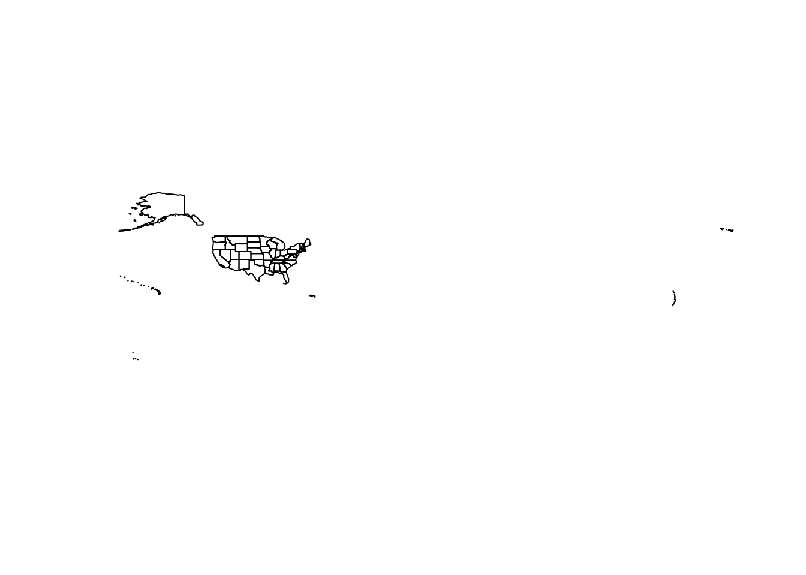
<p class="caption">(\#fig:plot-states)Default US states data obtained with tigris</p>
</div>

Other Census datasets may be available by state or by county within the state. In some cases, this subsetting is optional; in other cases, `state` and/or `county` arguments will be required. For example, the `counties()` function can be used to obtain county boundaries for the entirety of the United States, but also can be used with the `state` argument to return only those counties from a specific state, like New Mexico.


```r
nm_counties <- counties("NM")

plot(nm_counties$geometry)
```

<div class="figure">
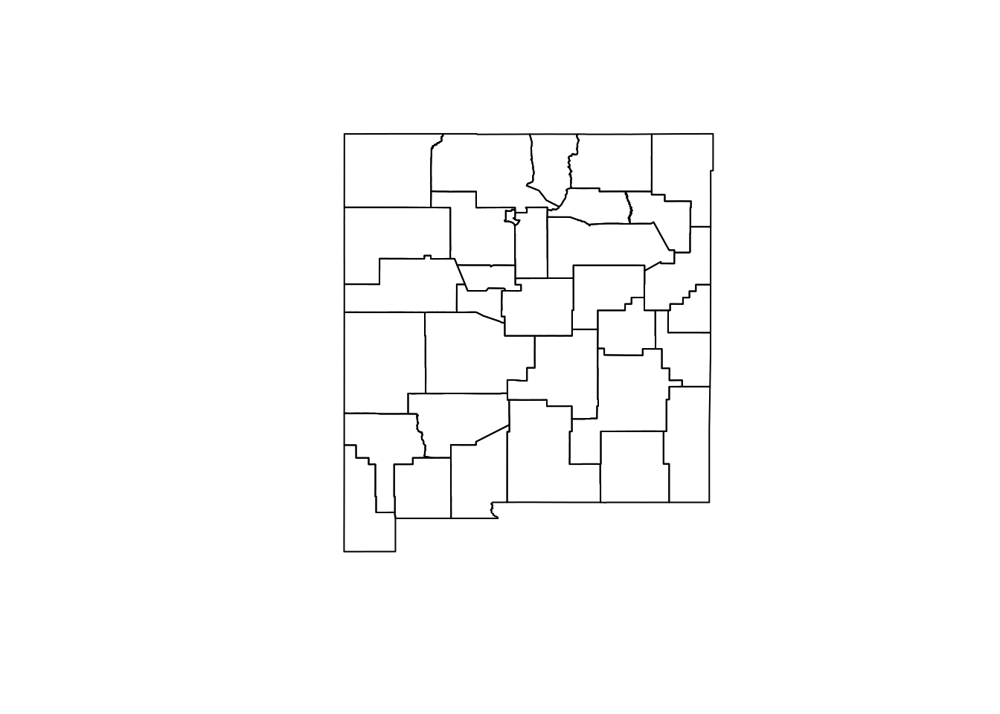
<p class="caption">(\#fig:nm-counties)County boundaries in New Mexico</p>
</div>

In this case the state postal code `"NM"` is used to instruct **tigris** to subset the counties dataset for counties in New Mexico. The full name of the state, `"New Mexico"`, would work the same here as well. Obtaining Census shapefiles programmatically requires inputting the Federal Information Processing Standard (FIPS) code; however, **tigris** translates postal codes and names of states and counties to their FIPS codes so that R users do not have to look them up.

States and counties are examples of *legal entities* that can be accessed with **tigris**. *Statistical entities* and *geographic features* are similarly accessible if they exist in the TIGER/Line database. For example, a user might request Census tract boundaries for a given county in New Mexico with the corresponding `tracts()` function.


```r
la_tracts <- tracts("NM", "Los Alamos")

plot(la_tracts$geometry)
```

<div class="figure">
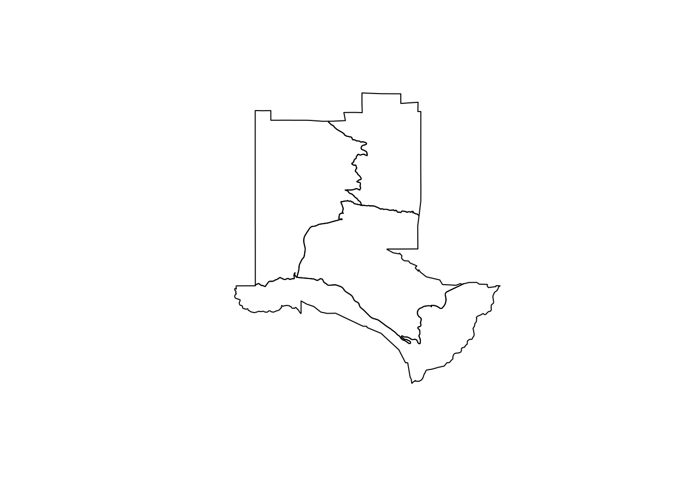
<p class="caption">(\#fig:los-alamos-tracts)Census tract boundaries in Los Alamos County, NM</p>
</div>

Several geographic features are available in **tigris** as well, including roads and water features which can be useful for thematic mapping. For example, a user could request area water data for Los Alamos County with the `area_water()` function.


```r
la_water <- area_water("NM", "Los Alamos")

plot(la_water$geometry)
```

<div class="figure">

<p class="caption">(\#fig:los-alamos-water)Water area in Los Alamos County, NM</p>
</div>

### Understanding tigris and simple features

Data returned by the **tigris** package are examples of *vector spatial data*, a spatial data model that represents geographic features as points, lines, and polygons. The vector spatial data model is represented in R with the [**sf** package](https://r-spatial.github.io/sf/), an implementation of simple features in the R language. The **sf** package is an R interface to C libraries that power much of the broader geographic data ecosystem: [GDAL](https://gdal.org/) for reading & writing spatial data, [GEOS](https://trac.osgeo.org/geos/) for modeling spatial relationships, and [PROJ](https://proj.org/) for representing coordinate reference systems. These topics will be outlined in more detail in this chapter and the remainder of this section.

As mentioned earlier, **sf** represents vector spatial data much like a regular R data frame, but with a special column, `geometry`, that represents the shape of each feature. When a simple features object is printed, the information above the data frame gives some additional geographic context to the coordinates in the `geometry` column. This includes a *geometry type*, a *bounding box,* and a *coordinate reference system (CRS)* definition. These spatial concepts help define how R represents the data geographically, and will be explored further later in this chapter.

Vector data are typically represented as either *points, lines*, or *polygons*, and **tigris** gives access to all three types.

#### Points

An example point dataset available in the **tigris** package is Census landmarks, which is a point-of-interest dataset that is not comprehensive but is used by the Census Bureau to guide field enumerators. Let's acquire landmark point data for the District of Columbia and take a look.


```r
dc_landmarks <- landmarks("DC", type = "point")

plot(dc_landmarks$geometry)
```

<div class="figure">
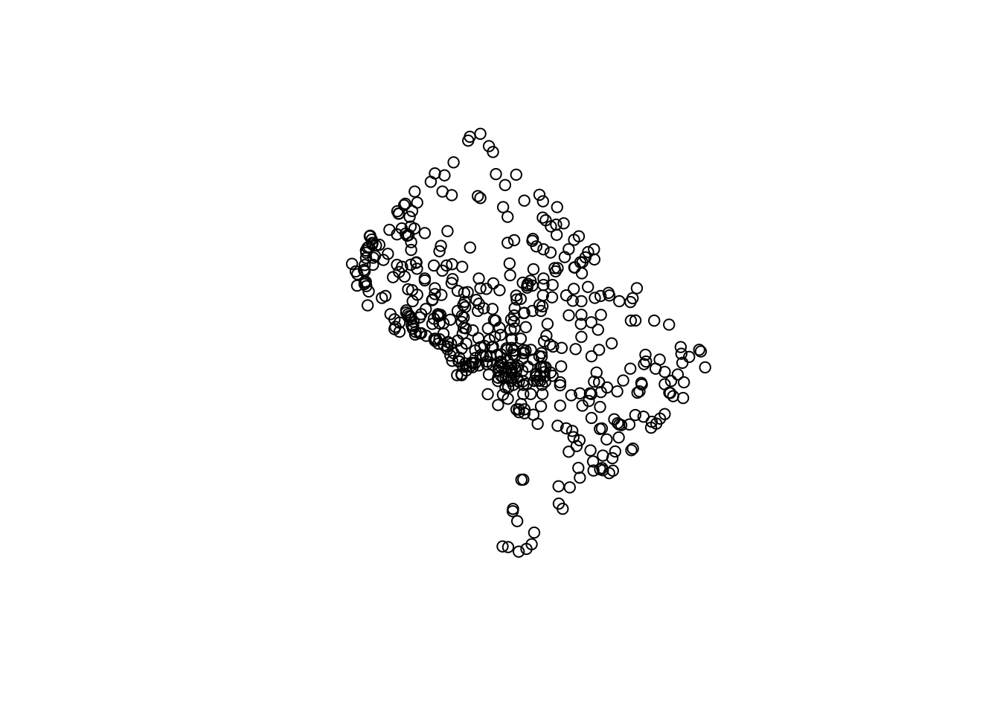
<p class="caption">(\#fig:dc-landmarks)Census landmarks in Washington, DC</p>
</div>

**Points** are vector data represented by a single coordinate pair; while they have a location, they do not have length or area and in turn are zero-dimensional. Points are useful for representing geographic phenomena when the physical properties of the features are not of importance to a visualization or analysis. For example, if we are interested in the geographic distribution of Census landmarks in Washington DC, but not in the actual shape or physical area of those specific landmarks, representing landmarks as points makes sense. sf represents points with the geometry type `POINT`.

#### Lines


```r
dc_roads <- primary_secondary_roads("DC")

plot(dc_roads$geometry)
```

<div class="figure">
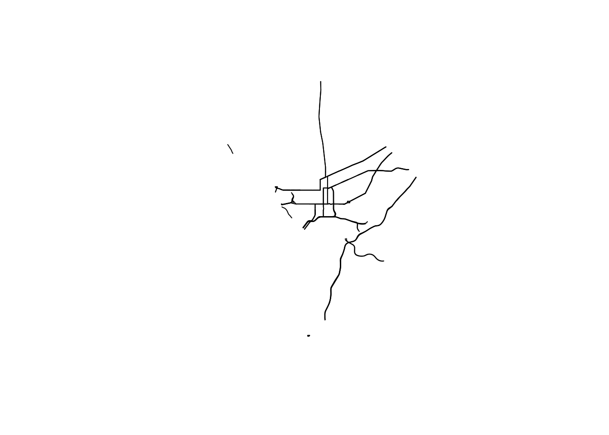
<p class="caption">(\#fig:dc-roads)Primary and secondary roads in Washington, DC</p>
</div>

**Lines** are one-dimensional representations of geographic features that are used when the length, but not the area, of those features is of primary importance. With respect to the TIGER/Line shapefiles, transportation network features such as roads and railroads are represented as lines. Line features will have at least two linked coordinate pairs, and complex linear representations will have many more. Lines are represented with the geometry type `LINESTRING`.

#### Polygons


```r
dc_block_groups <- block_groups("DC")

plot(dc_block_groups$geometry)
```

<div class="figure">
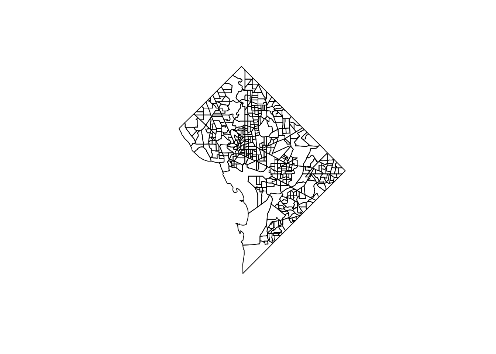
<p class="caption">(\#fig:dc-polygons)Block groups in Washington, DC</p>
</div>

**Polygons** are enclosed shapes with at least three connected coordinate pairs. With respect to Census geometries, enumeration units like block groups are represented as polygons in the TIGER/Line files. Polygon geometry is useful when an analyst needs to represent the shape or area of geographic features in their project.

These three core geometries (point, line, and polygon) can be encoded in more complex ways in the simple features representation used by sf. For example, the geometry type `POLYGON` will use one row in a simple features data frame for each discrete shape; the geometry type `MULTIPOLYGON`, in contrast, can link multiple discrete shapes as part of the same geographic feature. This is important for encoding features that may have detached parts, such as a series of islands that belong to the same county. In this vein, points can be represented as `MULTIPOINT` and lines can be represented as `MULTILINESTRING`, respectively, to accommodate similar scenarios.

### Data availability in tigris

The above examples have provided a sampling of some of the datasets available in **tigris**; a full enumeration of available datasets and the functions to access them are found in the guide below.

| Function                                | Datasets available                             | Years available       |
|-----------------------------------------|------------------------------------------------|-----------------------|
| `nation()`                              | cartographic (1:5m; 1:20m)                     | 2013-2020             |
| `divisions()`                           | cartographic (1:500k; 1:5m; 1:20m)             | 2013-2020             |
| `regions()`                             | cartographic (1:500k; 1:5m; 1:20m)             | 2013-2020             |
| `states()`                              | TIGER/Line; cartographic (1:500k; 1:5m; 1:20m) | 1990, 2000, 2010-2020 |
| `counties()`                            | TIGER/Line; cartographic (1:500k; 1:5m; 1:20m) | 1990, 2000, 2010-2020 |
| `tracts()`                              | TIGER/Line; cartographic (1:500k)              | 1990, 2000, 2010-2020 |
| `block_groups()`                        | TIGER/Line; cartographic (1:500k)              | 1990, 2000, 2010-2020 |
| `blocks()`                              | TIGER/Line                                     | 2000, 2010-2020       |
| `places()`                              | TIGER/Line; cartographic (1:500k)              | 2011-2020             |
| `pumas()`                               | TIGER/Line; cartographic (1:500k)              | 2012-2020             |
| `school_districts()`                    | TIGER/Line; cartographic                       | 2011-2020             |
| `zctas()`                               | TIGER/Line; cartographic (1:500k)              | 2000, 2010, 2012-2020 |
| `congressional_districts()`             | TIGER/Line; cartographic (1:500k; 1:5m; 1:20m) | 2011-2020             |
| `state_legislative_districts()`         | TIGER/Line; cartographic (1:500k)              | 2011-2020             |
| `voting_districts()`                    | TIGER/Line                                     | 2012                  |
| `area_water()`                          | TIGER/Line                                     | 2011-2020             |
| `linear_water()`                        | TIGER/Line                                     | 2011-2020             |
| `coastline()`                           | TIGER/Line()                                   | 2013-2020             |
| `core_based_statistical_areas()`        | TIGER/Line; cartographic (1:500k; 1:5m; 1:20m) | 2011-2020             |
| `combined_statistical_areas()`          | TIGER/Line; cartographic (1:500k; 1:5m; 1:20m) | 2011-2020             |
| `metro_divisions()`                     | TIGER/Line                                     | 2011-2020             |
| `new_england()`                         | TIGER/Line; cartographic (1:500k)              | 2011-2020             |
| `county_subdivisions()`                 | TIGER/Line; cartographic (1:500k)              | 2010-2020             |
| `urban_areas()`                         | TIGER/Line; cartographic (1:500k)              | 2012-2020             |
| `primary_roads()`                       | TIGER/Line                                     | 2011-2020             |
| `primary_secondary_roads()`             | TIGER/Line                                     | 2011-2020             |
| `roads()`                               | TIGER/Line                                     | 2011-2020             |
| `rails()`                               | TIGER/Line                                     | 2011-2020             |
| `native_areas()`                        | TIGER/Line; cartographic (1:500k)              | 2011-2020             |
| `alaska_native_regional_corporations()` | TIGER/Line; cartographic (1:500k)              | 2011-2020             |
| `tribal_block_groups()`                 | TIGER/Line                                     | 2011-2020             |
| `tribal_census_tracts()`                | TIGER/Line                                     | 2011-2020             |
| `tribal_subdivisions_national()`        | TIGER/Line                                     | 2011-2020             |
| `landmarks()`                           | TIGER/Line                                     | 2011-2020             |
| `military()`                            | TIGER/Line                                     | 2011-2020             |

Note from the guide that many datasets are available as both **TIGER/Line** and **cartographic boundary** versions, and can be downloaded for multiple years; these distinctions are covered in Section \@ref(tigris-workflows) below.

## Plottng geographic data

Geographic information science is an inherently visual discipline. For analysts coming to R from a desktop GIS background (e.g. ArcGIS, QGIS), they will be used to having a visual display of their geographic data as central to their interactions with it. This may make the transition to R unfamiliar for geospatial analysts as geographic data will be first and foremost represented as a tabular data frame.

In the previous section, we have used the `plot()` function to visualize the `geometry` column of a simple features object obtained with **tigris**. R includes a variety of other options for quick visualization of geographic data that will be useful to geospatial anlaysts.

### ggplot2 and `geom_sf()`

As of **ggplot2** version 3.0, the package released support for plotting simple features objects directly with the function `geom_sf()`. Prior to the release of this functionality, plotting geographic data (and by consequence making maps) was reasonably cumbersome; `geom_sf()` streamlines the geographic visualization process and makes **ggplot2** a go-to package for visualization of simple features objects.

At a basic level, a couple lines of **ggplot2** code are all that are needed to plot Census shapes obtained with **tigris**. For example, taking a look at our Los Alamos County Census tracts:


```r
library(ggplot2)

ggplot(la_tracts) + 
  geom_sf()
```


By default, ggplot2 includes its standard grey grid with latitude and longitude values displayed along the axes. For many cartographic applications, an analyst will want to remove this background information. The `theme_void()` function strips the background grid and axis labels from the plot accordingly:


```r
ggplot(la_tracts) + 
  geom_sf() + 
  theme_void()
```

<div class="figure">

<p class="caption">(\#fig:los-alamos-ggplot-2)A ggplot2 map with a blank background</p>
</div>

Section \@ref(visualizing-group-wise-comparisons) introduced the concept of *faceted plots* to compare different views, which is also a very useful concept for geographic visualization. Faceted mapping will be addressed directly in the next chapter. For comparative spatial plots, the **patchwork** R package [@pedersen2020] works very well for arranging a multi-plot layout. Below, we'll use patchwork to put two **ggplot2** spatial plots - one of Census tracts and one of block groups in Los Alamos County - side-by-side using the `+` operator.


```r
library(patchwork)

la_block_groups <- block_groups("NM", "Los Alamos")

gg1 <- ggplot(la_tracts) + 
  geom_sf() + 
  theme_void() + 
  labs(title = "Census tracts")

gg2 <- ggplot(la_block_groups) + 
  geom_sf() + 
  theme_void() + 
  labs(title = "Block groups")

gg1 + gg2
```

<div class="figure">
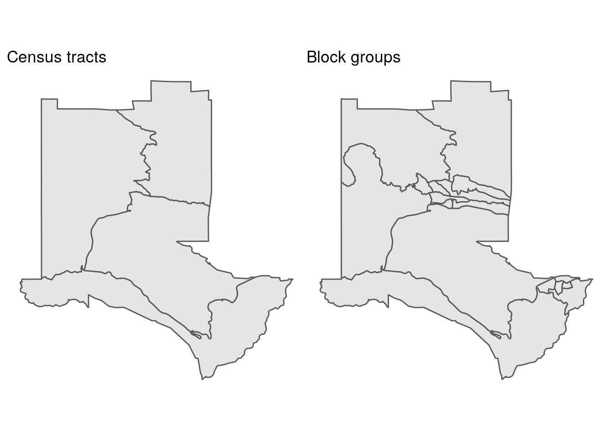
<p class="caption">(\#fig:los-alamos-patchwork)Comparing Census tracts and block groups</p>
</div>

Alternatively, **patchwork** allows R users to arrange plots vertically using the `/` operator.

### Interactive viewing with mapview

A major hesitation for geospatial analysts considering a switch from desktop GIS software to R is the strengths of desktop GIS for interactive visual exploration. Both ArcGIS and QGIS allow analysts to quickly load a geographic dataset and interactively pan and zoom to explore geographic trends. Prior to the development of the htmlwidgets framework (discussed in the previous chapter), R had no equivalent capabilities. Frankly, this was the major reason I hesitated to fully transition my work from desktop GIS software to R for spatial analysis.

The **mapview** R package [@appelhans2020] fills this crucial gap. With a single call to its function `mapview()`, **mapview** visualizes geographic data on an interactive, zoomable map. Let's try it here with our Census tracts in Los Alamos County.


```r
library(mapview)

mapview(la_tracts)
```

<div class="figure">
<iframe src="img/leaflet/la_tracts.html" width="100%" height="500px"></iframe>
<p class="caption">(\#fig:la-tracts-mapview)Interactive view of Los Alamos, NM</p>
</div>

Clicking on a Census tract shape reveals a pop-up with attribute information found in the dataset. Additionally, users can change the underlying basemap to understand the geographic context surrounding their data. **mapview** also includes significant functionality for interactive mapping and data display beyond this basic example; some of these features are covered in the next chapter.

## tigris workflows

As covered in the previous sections, tigris is a useful package for getting TIGER/Line shapefiles into your R geospatial projects without having to navigate the Census website. Functions in **tigris** include additional options to allow for customization of output and better integration into geospatial projects. The sections below provide an overview of some of these options.

### TIGER/Line and cartographic boundary shapefiles

In addition to the core TIGER/Line shapefiles, after which the **tigris** package is named, the Census Bureau also makes available *cartographic boundary shapefiles*. These files are derived from the TIGER/Line shapefiles but are generalized in the interior and clipped to the shoreline of the United States, making them a better choice in many cases than the TIGER/Line shapefiles for thematic mapping. Most polygon datasets in **tigris** are available as cartographic boundary files, accessible with the argument `cb = TRUE`.

Over the years I have been developing **tigris**, I have gotten multiple inquires akin to "why does this area look so strange when I download it?" Michigan, with its extensive shoreline along the Great Lakes, commonly comes up. The TIGER/Line shapefiles include water area for geographic features, connecting the Upper Peninsula of Michigan with the southern part of the state and giving an unfamiliar representation of Michigan's land area. Using the cartographic boundary alternative resolves this. Let's use **patchwork** to compare the TIGER/Line and cartographic boundary shapefiles for counties in Michigan as an illustration.


```r
mi_counties <- counties("MI")
mi_counties_cb <- counties("MI", cb = TRUE)

mi_tiger_gg <- ggplot(mi_counties) + 
  geom_sf() + 
  theme_void() + 
  labs(title = "TIGER/Line")

mi_cb_gg <- ggplot(mi_counties_cb) + 
  geom_sf() + 
  theme_void() + 
  labs(title = "Cartographic boundary")

mi_tiger_gg + mi_cb_gg
```

<div class="figure">
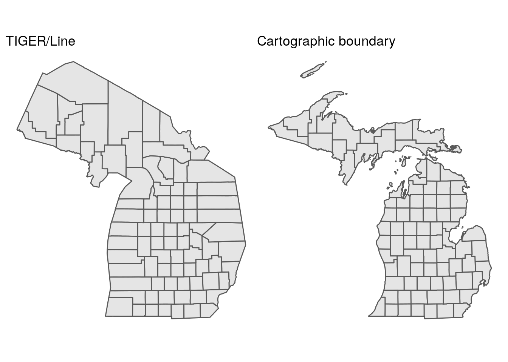
<p class="caption">(\#fig:compare-cb)Comparison of TIGER/Line and cartographic boundary files for Michigan counties</p>
</div>

While the TIGER/Line shapefiles may represent "official" areas of counties - which include water area - they look very unfamiliar to viewers expecting a usual representation of land area in Michigan. As the cartographic boundary file shows islands and a distinct coastline, it will be the better option for most thematic mapping projects. When using the `cb = TRUE` argument with counties and larger geographies, users can also specify one of three resolutions with the `resolution` argument: `"500k"` (the default), `"5m"`, or `"20m"`, with higher values representing more generalized boundaries and smaller file sizes.

### Caching tigris data

A common issue that can arise when working with **tigris** is waiting around for large file downloads, especially if the required geographic data is large or if your internet connection is spotty. For example, the Census block shapefile for Texas in 2019 is 441MB in size zipped, which can take a while to obtain without high-speed internet.

tigris offers a solution in the way of *shapefile caching*. By specifying `options(tigris_use_cache = TRUE)`, users can instruct tigris to download shapefiles to a cache directory on their computers for future use rather than a temporary directory as **tigris** does by default. When shapefile caching is turned on, **tigris** will then look first in the cache directory to see if a requested shapefile is already there. If so, it will read it in without re-downloading. If not, it will download the file from the Census website and store it in the cache directory.

The cache directory can be checked with the `user_cache_dir()` function available in the **rappdirs** package [@ratnakumar2021]. The specific location of your cache directory will depend on your operating system.


```r
options(tigris_use_cache = TRUE)

rappdirs::user_cache_dir("tigris")
```

```
## [1] "~/.cache/tigris"
```

If desired, users can modify their **tigris** cache directory with the function `tigris_cache_dir()`.

### Understanding yearly differences in TIGER/Line files

The US Census Bureau offers a time series of TIGER/Line and cartographic boundary shapefiles from 1990 to 2020. (For even older geographies, see NHGIS, a topic covered in Chapter \@ref(other-census-and-government-data-resources)). While some geographies are reasonably static, such as state boundaries, others change regularly with each decennial US Census, such as Census tracts, block groups, and blocks. An example of these changes is shown below with Census tracts in Tarrant County, Texas displayed, a county that added nearly 1 million people between 1990 and 2020. Given that the US Census Bureau aims to make the population sizes of Census tracts relatively consistent (around 4,000 people), it will subdivide and re-draw tracts in fast-growing areas for each Census to provide better geographic granularity.

We can use some of the tidyverse tools covered earlier in this book to generate a list of tract plots for each year. `purrr::map()` iterates through each year, grabbing a cartographic boundary file of Census tracts for the four decennial Census years then plotting each of them with ggplot2. The `glue()` function in the glue package is used to create a custom title that shows the number of Census tracts in each year.


```r
library(tidyverse)
library(patchwork)
library(glue)

yearly_plots <- map(seq(1990, 2020, 10), ~{
  year_tracts <- tracts("TX", "Tarrant", year = .x,
                        cb = TRUE)

  ggplot(year_tracts) + 
    geom_sf() + 
    theme_void() + 
    labs(title = glue("{.x}: {nrow(year_tracts)} tracts"))
})
```

Once the plots are generated, we can use **patchwork** to facet the plots as we did earlier in this chapter. The division operator `/` places plots on top of one another allowing for the organization of plots in a grid.


```r
(yearly_plots[[1]] + yearly_plots[[2]]) / 
  (yearly_plots[[3]] + yearly_plots[[4]])
```

<div class="figure">
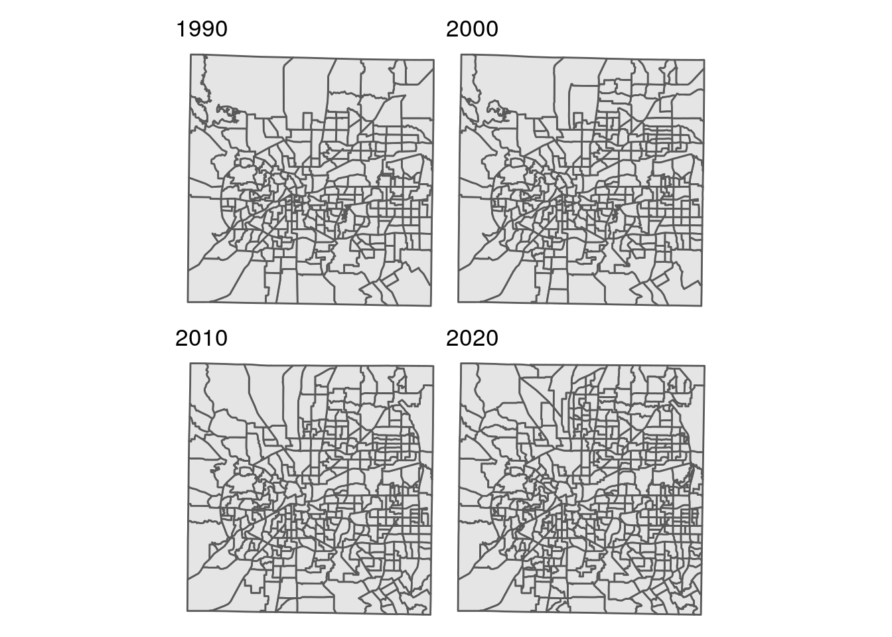
<p class="caption">(\#fig:plot-differences)Tarrant County, TX Census tracts, 1990-2020</p>
</div>

Tarrant County added 180 new Census tracts between 1990 and 2020. As the plot shows, many of these tracts are found in fast-growing parts of the county in the northeast and southeast. Notably, these changes in Census tract geography have downstream implications as well for time-series analysis, as covered in Section \@ref(time-series-analysis-some-cautions). Data at the Census tract level in 2010, for example, will be tabulated differently than in 2020 because the tract geographies are different. One common method for adjusting demographic data between disparate zonal configurations is *areal interpolation*, a topic covered in Section \@ref(computing-demographic-estimates-for-zones-with-areal-interpolation).

The default year of shapefiles in **tigris** aligns with the most recently-released 5-year American Community Survey data. At the time of this writing, the default year is 2019. This will be changed to 2020 pending full data availability of the TIGER/Line shapefiles for that year and upon release of the 2016-2020 5-year ACS estimates in December 2021. If users need the 2020 boundaries in their projects and do not want to type `year = 2020` for each dataset, the command `options(tigris_year = 2020)` can be used. This will direct **tigris** to download the 2020 shapefiles when available without having to specify the year explicitly.

### Combining tigris datasets

For smaller geographies like Census tracts, block groups, and blocks, the Census Bureau stores shapefiles by state and does not provide a national file. For some geographic features, datasets are further subdivided by county. In these instances, **tigris** users must specify a state and/or county to appropriately make a request to the Census Bureau website for data.

That said, a common request from **tigris** users is to obtain *all shapes* for the United States. For example, a national demographic study may require all 241,900 block groups in the United States. While this option is not directly available in **tigris**, national datasets are straightforward to create with **tidyverse** tools. As covered in several examples thus far in this book, the `purrr::map()` family of functions iterate over a sequence of values and combine function results as directed by a user. For tigris users, the `map_dfr()` function will prove especially useful as it row-binds datasets to create its output. The built-in `state.abb` vector in R gives us postal codes of all 50 US states; if Washington, DC or Puerto Rico are required in your analysis, add these to the vector with `c()` as shown below.

Once the vector of state codes is prepared, a user can iterate over those codes with `map_dfr()` and produce a national block group dataset, shown for 2020 below.


```r
state_codes <- c(state.abb, "DC", "PR")

us_bgs <- map_dfr(
  state_codes, 
  ~block_groups(
    state = .x, 
    cb = TRUE, 
    year = 2020
  )
)

nrow(us_bgs)
```

```
## [1] 241900
```

If you are not using shapefile caching, this process will be slowed by the time it takes to download each block group shapefile from the Census Bureau website. However, if you have a local cache of block group shapefiles as illustrated in this section, loading and combining all 241,900 block groups for use in your analysis should only take a few seconds.

## Coordinate reference systems

For geographic data to appropriately represent locations in mapping and spatial analysis, they must be *referenced* to some model of the Earth's surface correctly. In simpler terms - a data model of the state of Florida should represent where Florida is actually located relative to other locations! This is defined with a *coordinate reference system* (CRS), which specifies not only how data coordinates should be mapped to a model of the Earth's surface but also how measurements should be computed using a given dataset. A more complete discussion of coordinate reference systems is found in [@lovelace_geocomputation_2019]; an overview of how to work with coordinate systems in relationship to **tigris** is covered below.

By default, datasets returned by tigris are stored in a *geographic coordinate system*, in which coordinates are represented as longitude and latitude relative to a three-dimensional model of the earth. The `st_crs()` function in the sf package helps us check the CRS of our data; let's do this for counties in Florida.


```r
library(sf)

fl_counties <- counties("FL", cb = TRUE)

st_crs(fl_counties)
```

```
## Coordinate Reference System:
##   User input: NAD83 
##   wkt:
## GEOGCRS["NAD83",
##     DATUM["North American Datum 1983",
##         ELLIPSOID["GRS 1980",6378137,298.257222101,
##             LENGTHUNIT["metre",1]]],
##     PRIMEM["Greenwich",0,
##         ANGLEUNIT["degree",0.0174532925199433]],
##     CS[ellipsoidal,2],
##         AXIS["latitude",north,
##             ORDER[1],
##             ANGLEUNIT["degree",0.0174532925199433]],
##         AXIS["longitude",east,
##             ORDER[2],
##             ANGLEUNIT["degree",0.0174532925199433]],
##     ID["EPSG",4269]]
```

The function returns a [well-known text representation](https://www.ogc.org/standards/wkt-crs) of information about the coordinate reference system. All Census Bureau datasets are stored in the "NAD83" geographic coordinate system, which refers to the North American Datum of 1983. Other relevant information includes the ellipsoid used (GRS 1980, which is a generalized three-dimensional model of the Earth's shape), the prime meridian of the CRS (Greenwich is used here), and the EPSG (European Petroleum Survey Group) ID of **4269**, which is a special code that can be used to represent the CRS in more concise terms.

As of **sf** version 1.0, the package uses the spherical geometry library **s2** to appropriately perform calculations with spatial data stored in geographic coordinate systems. When working with and visualizing geographic data for smaller areas, however, a *projected coordinate reference system* that represents the data in two-dimensions on a planar surface may be preferable. Thousands of projected CRSs exist - each that are appropriate for minimizing data distortion in a specific part of the world. While it can be a challenge to decide on the right projected CRS for your data, the **crsuggest** package [@walker_crsuggest_2021] can help narrow down the choices.

### Using the crsuggest package

The core function implemented in **crsuggest** is `suggest_crs()`, which returns a tibble of possible choices for a suitable projected CRS for your data. The function works by analyzing the geometry of your input dataset then comparing it to a built-in dataset of CRS extents and choosing the CRSs that minimize the [Hausdorff distance](https://en.wikipedia.org/wiki/Hausdorff_distance) between your dataset and those extents.

Let's try this out for the Florida counties dataset.


```r
library(crsuggest)

fl_crs <- suggest_crs(fl_counties)
```

<table class="table table-striped table-hover table-condensed table-responsive" style="margin-left: auto; margin-right: auto;">
<caption>(\#tab:crsuggest-show)Suggested coordinate reference systems for Florida</caption>
 <thead>
  <tr>
   <th style="text-align:left;position: sticky; top:0; background-color: #FFFFFF;"> crs_code </th>
   <th style="text-align:left;position: sticky; top:0; background-color: #FFFFFF;"> crs_name </th>
   <th style="text-align:left;position: sticky; top:0; background-color: #FFFFFF;"> crs_type </th>
   <th style="text-align:right;position: sticky; top:0; background-color: #FFFFFF;"> crs_gcs </th>
   <th style="text-align:left;position: sticky; top:0; background-color: #FFFFFF;"> crs_units </th>
   <th style="text-align:left;position: sticky; top:0; background-color: #FFFFFF;"> crs_proj4 </th>
  </tr>
 </thead>
<tbody>
  <tr>
   <td style="text-align:left;"> 6439 </td>
   <td style="text-align:left;"> NAD83(2011) / Florida GDL Albers </td>
   <td style="text-align:left;"> projected </td>
   <td style="text-align:right;"> 6318 </td>
   <td style="text-align:left;"> m </td>
   <td style="text-align:left;"> +proj=aea +lat_0=24 +lon_0=-84 +lat_1=24 +lat_2=31.5 +x_0=400000 +y_0=0 +ellps=GRS80 +units=m +no_defs </td>
  </tr>
  <tr>
   <td style="text-align:left;"> 3513 </td>
   <td style="text-align:left;"> NAD83(NSRS2007) / Florida GDL Albers </td>
   <td style="text-align:left;"> projected </td>
   <td style="text-align:right;"> 4759 </td>
   <td style="text-align:left;"> m </td>
   <td style="text-align:left;"> +proj=aea +lat_0=24 +lon_0=-84 +lat_1=24 +lat_2=31.5 +x_0=400000 +y_0=0 +ellps=GRS80 +towgs84=0,0,0,0,0,0,0 +units=m +no_defs </td>
  </tr>
  <tr>
   <td style="text-align:left;"> 3087 </td>
   <td style="text-align:left;"> NAD83(HARN) / Florida GDL Albers </td>
   <td style="text-align:left;"> projected </td>
   <td style="text-align:right;"> 4152 </td>
   <td style="text-align:left;"> m </td>
   <td style="text-align:left;"> +proj=aea +lat_0=24 +lon_0=-84 +lat_1=24 +lat_2=31.5 +x_0=400000 +y_0=0 +ellps=GRS80 +towgs84=0,0,0,0,0,0,0 +units=m +no_defs </td>
  </tr>
  <tr>
   <td style="text-align:left;"> 3086 </td>
   <td style="text-align:left;"> NAD83 / Florida GDL Albers </td>
   <td style="text-align:left;"> projected </td>
   <td style="text-align:right;"> 4269 </td>
   <td style="text-align:left;"> m </td>
   <td style="text-align:left;"> +proj=aea +lat_0=24 +lon_0=-84 +lat_1=24 +lat_2=31.5 +x_0=400000 +y_0=0 +datum=NAD83 +units=m +no_defs </td>
  </tr>
  <tr>
   <td style="text-align:left;"> 6443 </td>
   <td style="text-align:left;"> NAD83(2011) / Florida West (ftUS) </td>
   <td style="text-align:left;"> projected </td>
   <td style="text-align:right;"> 6318 </td>
   <td style="text-align:left;"> us-ft </td>
   <td style="text-align:left;"> +proj=tmerc +lat_0=24.3333333333333 +lon_0=-82 +k=0.999941177 +x_0=200000.0001016 +y_0=0 +ellps=GRS80 +units=us-ft +no_defs </td>
  </tr>
  <tr>
   <td style="text-align:left;"> 6442 </td>
   <td style="text-align:left;"> NAD83(2011) / Florida West </td>
   <td style="text-align:left;"> projected </td>
   <td style="text-align:right;"> 6318 </td>
   <td style="text-align:left;"> m </td>
   <td style="text-align:left;"> +proj=tmerc +lat_0=24.3333333333333 +lon_0=-82 +k=0.999941177 +x_0=200000 +y_0=0 +ellps=GRS80 +units=m +no_defs </td>
  </tr>
  <tr>
   <td style="text-align:left;"> 3517 </td>
   <td style="text-align:left;"> NAD83(NSRS2007) / Florida West (ftUS) </td>
   <td style="text-align:left;"> projected </td>
   <td style="text-align:right;"> 4759 </td>
   <td style="text-align:left;"> us-ft </td>
   <td style="text-align:left;"> +proj=tmerc +lat_0=24.3333333333333 +lon_0=-82 +k=0.999941177 +x_0=200000.0001016 +y_0=0 +ellps=GRS80 +towgs84=0,0,0,0,0,0,0 +units=us-ft +no_defs </td>
  </tr>
  <tr>
   <td style="text-align:left;"> 3516 </td>
   <td style="text-align:left;"> NAD83(NSRS2007) / Florida West </td>
   <td style="text-align:left;"> projected </td>
   <td style="text-align:right;"> 4759 </td>
   <td style="text-align:left;"> m </td>
   <td style="text-align:left;"> +proj=tmerc +lat_0=24.3333333333333 +lon_0=-82 +k=0.999941177 +x_0=200000 +y_0=0 +ellps=GRS80 +towgs84=0,0,0,0,0,0,0 +units=m +no_defs </td>
  </tr>
  <tr>
   <td style="text-align:left;"> 2882 </td>
   <td style="text-align:left;"> NAD83(HARN) / Florida West (ftUS) </td>
   <td style="text-align:left;"> projected </td>
   <td style="text-align:right;"> 4152 </td>
   <td style="text-align:left;"> us-ft </td>
   <td style="text-align:left;"> +proj=tmerc +lat_0=24.3333333333333 +lon_0=-82 +k=0.999941177 +x_0=200000.0001016 +y_0=0 +ellps=GRS80 +towgs84=0,0,0,0,0,0,0 +units=us-ft +no_defs </td>
  </tr>
  <tr>
   <td style="text-align:left;"> 2778 </td>
   <td style="text-align:left;"> NAD83(HARN) / Florida West </td>
   <td style="text-align:left;"> projected </td>
   <td style="text-align:right;"> 4152 </td>
   <td style="text-align:left;"> m </td>
   <td style="text-align:left;"> +proj=tmerc +lat_0=24.3333333333333 +lon_0=-82 +k=0.999941177 +x_0=200000 +y_0=0 +ellps=GRS80 +towgs84=0,0,0,0,0,0,0 +units=m +no_defs </td>
  </tr>
</tbody>
</table>

The "best choice" is the CRS "Florida GDL Albers" coordinate reference system, which is available with four different variations on the NAD1983 datum. "Florida GDL" refers to the Florida Geographic Data Library which distributes all of its data in this [state-wide equal-area coordinate reference system](https://www.fgdl.org/metadataexplorer/fgdlfaq.html#3.1). Other large states with large or irregular extents like Florida (Texas is one such example) maintain statewide coordinate reference systems like this suitable for statewide mapping and analysis. Let's choose the third entry, "NAD83 (HARN) / Florida GDL Albers", which is recommended on the Florida GDL website. Coordinate reference system transformations in **sf** are implemented in the `st_transform()` function, used below.


```r
fl_projected <- st_transform(fl_counties, crs = 3087)

head(fl_projected)
```

```
## Simple feature collection with 6 features and 9 fields
## Geometry type: MULTIPOLYGON
## Dimension:     XY
## Bounding box:  xmin: 83061.55 ymin: 130374.4 xmax: 788415.4 ymax: 780618.4
## Projected CRS: NAD83(HARN) / Florida GDL Albers
##     STATEFP COUNTYFP COUNTYNS       AFFGEOID GEOID         NAME LSAD      ALAND
## 24       12      075 00295724 0500000US12075 12075         Levy   06 2896183010
## 96       12      086 00295755 0500000US12086 12086   Miami-Dade   06 4920565755
## 97       12      073 00306916 0500000US12073 12073         Leon   06 1727237331
## 98       12      057 00295757 0500000US12057 12057 Hillsborough   06 2646772012
## 99       12      083 00306922 0500000US12083 12083       Marion   06 4113978836
## 100      12      113 00306914 0500000US12113 12113   Santa Rosa   06 2622050628
##         AWATER                       geometry
## 24   762935040 MULTIPOLYGON (((493790.5 56...
## 96  1376144237 MULTIPOLYGON (((783767.2 17...
## 97    90397079 MULTIPOLYGON (((331309.5 70...
## 98   631505816 MULTIPOLYGON (((555139.5 42...
## 99   192297049 MULTIPOLYGON (((542215.5 56...
## 100  418020790 MULTIPOLYGON (((83268.02 76...
```

Note that the coordinates for the bounding box and the feature geometry have changed to much larger numbers; they are expressed in meters rather than the decimal degrees used by the NAD83 geographic coordinate system. Let's take a closer look at our selected CRS:


```r
st_crs(fl_projected)
```

```
## Coordinate Reference System:
##   User input: EPSG:3087 
##   wkt:
## PROJCRS["NAD83(HARN) / Florida GDL Albers",
##     BASEGEOGCRS["NAD83(HARN)",
##         DATUM["NAD83 (High Accuracy Reference Network)",
##             ELLIPSOID["GRS 1980",6378137,298.257222101,
##                 LENGTHUNIT["metre",1]]],
##         PRIMEM["Greenwich",0,
##             ANGLEUNIT["degree",0.0174532925199433]],
##         ID["EPSG",4152]],
##     CONVERSION["Florida GDL Albers (meters)",
##         METHOD["Albers Equal Area",
##             ID["EPSG",9822]],
##         PARAMETER["Latitude of false origin",24,
##             ANGLEUNIT["degree",0.0174532925199433],
##             ID["EPSG",8821]],
##         PARAMETER["Longitude of false origin",-84,
##             ANGLEUNIT["degree",0.0174532925199433],
##             ID["EPSG",8822]],
##         PARAMETER["Latitude of 1st standard parallel",24,
##             ANGLEUNIT["degree",0.0174532925199433],
##             ID["EPSG",8823]],
##         PARAMETER["Latitude of 2nd standard parallel",31.5,
##             ANGLEUNIT["degree",0.0174532925199433],
##             ID["EPSG",8824]],
##         PARAMETER["Easting at false origin",400000,
##             LENGTHUNIT["metre",1],
##             ID["EPSG",8826]],
##         PARAMETER["Northing at false origin",0,
##             LENGTHUNIT["metre",1],
##             ID["EPSG",8827]]],
##     CS[Cartesian,2],
##         AXIS["easting (X)",east,
##             ORDER[1],
##             LENGTHUNIT["metre",1]],
##         AXIS["northing (Y)",north,
##             ORDER[2],
##             LENGTHUNIT["metre",1]],
##     USAGE[
##         SCOPE["unknown"],
##         AREA["USA - Florida"],
##         BBOX[24.41,-87.63,31.01,-79.97]],
##     ID["EPSG",3087]]
```

There is a lot more information in the CRS's well-known text than for the NAD83 geographic CRS. Information about the base geographic CRS is provided along with parameters for a "false origin." Whereas coordinates for geographic coordinate systems will generally be represented as longitude/latitude relative to the Prime Meridian and Equator, projected coordinate reference systems will be relative to a "false origin" that is specified relative to the area where the CRS is used (noting the `USAGE` section at the bottom). This "false origin" is located at -84 degrees longitude, 24 degrees latitude (SW of the Florida Keys and north of western Cuba) with a false X value of 400,000 and a false Y value of 0. In turn, X and Y values in the projected data are expressed in meters relative to this origin, which is set so all X and Y values in Florida will be positive numbers. This makes planar geometric calculations like distance, perimeter, and area straightforward.

### Plotting with `coord_sf()`

When visualizing simple feature geometries with ggplot2's `geom_sf()`, the `coord_sf()` method allows you to specify a coordinate reference system transformation to be used for the visualization. While `coord_sf()` will inherit the CRS of the spatial object plotted with `geom_sf()` by default, it can also modify the displayed CRS of a spatial object without performing a CRS transformation with `st_transform()`. For example:


```r
options(scipen = 999)

ggplot(fl_counties) + 
  geom_sf() + 
  coord_sf(crs = 3087)
```

<div class="figure">

<p class="caption">(\#fig:coord-sf)ggplot2 map with CRS specified</p>
</div>

While the data are displayed on the plot in the requested coordinate reference system, the underlying *graticule* (the grid lines and axis tick labels) default to longitude/latitude. To show the coordinates of the projected coordinate reference system, the argument `datum` can be used which controls the gridlines.


```r
ggplot(fl_counties) + 
  geom_sf() + 
  coord_sf(crs = 3087, datum = 3087)
```

<div class="figure">

<p class="caption">(\#fig:modify-graticule)ggplot2 plot with modified graticule</p>
</div>

## Working with geometries

While understanding coordinate reference system transformations is important for spatial data management and geographic visualization, other types of geometric manipulations may be required by the spatial analyst. This can include shifting geometries from their "correct" positions for better cartographic display; changing the geometry type of a spatial object; or "exploding" multipart geometries into individual geometric units. This section gives examples of each of these three scenarios.

### Shifting and rescaling geometry for national US mapping

A common problem for national display of the United States is the fragmented nature of US states and territories geographically. The continental United States can be displayed on a map in a relatively straightforward way, and there are a number of projected coordinate reference systems designed for correct display of the continental US. Often, analysts and cartographers then have to make decisions about how to handle Alaska, Hawaii, and Puerto Rico, which cannot be reasonably plotted using default US projections.

For example, let's take a US states shapefile obtained with tigris at low resolution and use ggplot2 to visualize it in the default geographic CRS, NAD 1983:


```r
us_states <- states(cb = TRUE, resolution = "20m")

ggplot(us_states) + 
  geom_sf() + 
  theme_void()
```

<div class="figure">
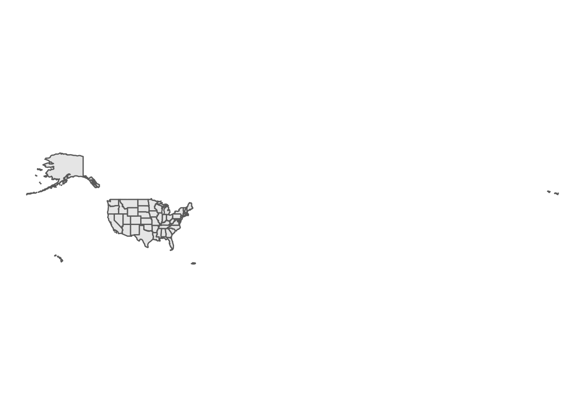
<p class="caption">(\#fig:default-counties)Default CRS for US states</p>
</div>

The plot does not work well, in part because the Aleutian Islands in far west Alaska cross the 180 degree line of longitude and are plotted on the opposite side of the map. In response, a projected coordinate reference system appropriate for the United States *could* be used, such as the continental US Albers Equal Area projection:


```r
ggplot(us_states) + 
  geom_sf() + 
  coord_sf(crs = 'ESRI:102003') + 
  theme_void()
```

<div class="figure">
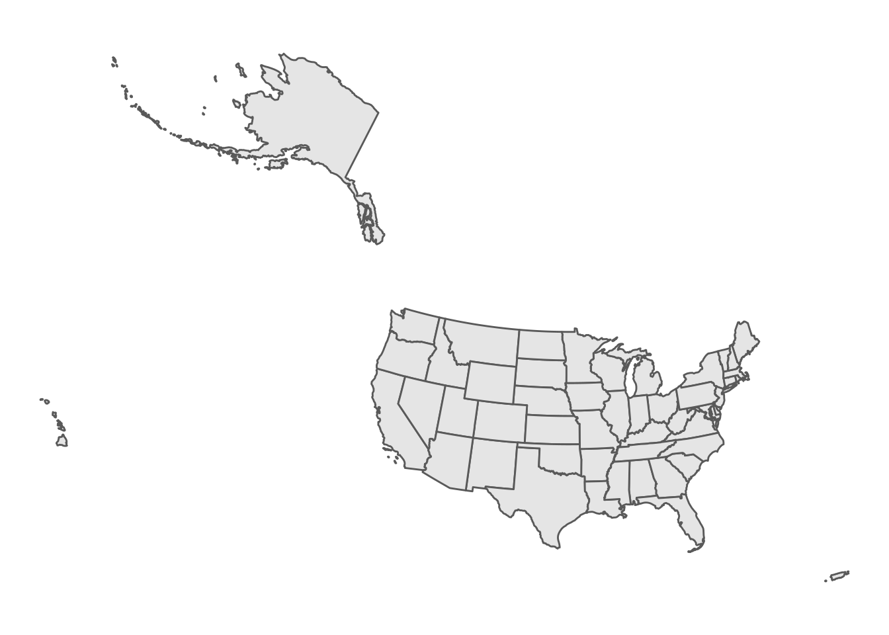
<p class="caption">(\#fig:esri-crs)Equal-area CRS for US states</p>
</div>

While this representation puts all territories in their appropriate locations, it is clearly not appropriate for Alaska, Hawaii, and Puerto Rico which appear distorted. This coordinate reference system is also not ideal for comparative mapping of states given the large amount of blank space between the states on the map.

**tigris** offers a solution to this problem with the `shift_geometry()` function. `shift_geometry()` takes an opinionated approach to the shifting and rescaling of Alaska, Hawaii, and Puerto Rico geometries to offer four options for an alternative view of the US. The function works by projecting geometries in Alaska, Hawaii, and Puerto Rico to appropriate coordinate reference systems for those areas, then re-sizing the geometries (if requested) and moving them to an alternative layout in relationship to the rest of the US using the Albers Equal Area CRS.


```r
us_states_shifted <- shift_geometry(us_states)

ggplot(us_states_shifted) + 
  geom_sf() + 
  theme_void()
```

<div class="figure">

<p class="caption">(\#fig:shift-geometry-1)US states with shifted and rescaled geometry</p>
</div>

This view uses two default arguments: `preserve_area = FALSE`, which shrinks Alaska and inflates Hawaii and Puerto Rico, and `position = "below"`, which places these areas below the continental United States. Alternatively, we can set `preserve_area = TRUE` and `position = "outside"` (used together below, but they can be mixed and matched) for a different view:


```r
us_states_outside <- shift_geometry(us_states, 
                                    preserve_area = TRUE,
                                    position = "outside")

ggplot(us_states_outside) + 
  geom_sf() + 
  theme_void()
```

<div class="figure">

<p class="caption">(\#fig:shift-geometry-2)US states with shifted geometry and consistent area</p>
</div>

The areas of Alaska, Hawaii, and Puerto Rico are preserved relative to the continental United States, and the three areas are directionally in their correct positions while still in proximity to the continental US for national display. In addition to spatial objects obtained with tigris, `shift_geometry()` can shift and rescale other geographic datasets for display in this way. Just make sure you use the same arguments in `shift_geometry()` for all layers or they will end up misaligned!

### Converting polygons to points

As discussed earlier in this chapter, most datasets obtained with tigris are returned with geometry type `POLYGON` or `MULTIPOLYGON`, reflecting the fact that Census geometries are generally areal units to which Census data are aggregated. While this makes sense for many applications, there are some instances in which the default geometry type of Census shapes is not necessary.

For example, let's say we are making a simple plot of the largest cities in the state of Texas. The `places()` function can obtain city geometries, and the `states()` function gives us the outline of the state of Texas. Two successive calls to `geom_sf()` create a graphic that displays those cities on top of the state outline.


```r
tx_places <- places("TX", cb = TRUE) %>%
  filter(NAME %in% c("Dallas", "Fort Worth", "Houston",
                     "Austin", "San Antonio", "El Paso")) %>%
  st_transform(6580)

tx_outline <- states(cb = TRUE) %>%
  filter(NAME == "Texas") %>%
  st_transform(6580)

ggplot() + 
  geom_sf(data = tx_outline) + 
  geom_sf(data = tx_places, fill = "red", color = NA) + 
  theme_void()
```

<div class="figure">

<p class="caption">(\#fig:plot-cities)Large cities in Texas</p>
</div>

The issue with this graphic is that city geographies are actually quite irregular and disjoint in practice. All six cities spread across large areas, have holes, and even in some cases include portions that are detached from the main part of the city. This information is important for local planning purposes, but are unnecessary for a state-wide map.

An alternative representation is possible by converting the city polygons to points where each point represents the *centroid* of each polygon, placed at their geometric centers. In sf, this conversion is implemented with the function `st_centroid()`. Below, we use `st_centroid()` to convert the polygons to central points, and plot those points over the outline of Texas.


```r
tx_centroids <- st_centroid(tx_places)

ggplot() + 
  geom_sf(data = tx_outline) + 
  geom_sf(data = tx_centroids, color = "red", size = 3) + 
  theme_void()
```

<div class="figure">

<p class="caption">(\#fig:tx-centroids)Large cities in Texas represented as points</p>
</div>

The cities are displayed as circles rather than as irregular polygons, which makes more sense for visualization of the cities' locations at this scale.

### Exploding multipolygon geometries to single parts

Generally speaking, areal Census features are returned with the geometry type `MULTIPOLYGON`. This makes sense as many Census shapes - including several states - include disconnected areas such as islands that belong to the same Census area. As this is particularly significant in Florida, let's return to the Florida counties dataset used earlier in this chapter, and take the example of Lee County on Florida's western coast.


```r
lee <- fl_projected %>%
  filter(NAME == "Lee")
```


```r
mapview(lee)
```

<div class="figure">
<iframe src="img/leaflet/lee_county.html" width="100%" height="500px"></iframe>
<p class="caption">(\#fig:lee-mapview-show)Lee County, Florida</p>
</div>

The Lee County polygon has four distinct parts as displayed on the map: the mainland area that contains the cities of Cape Coral and Fort Myers, and three disjoint island areas. Other islands can be further extracted using techniques covered in Chapter 7. Understandably, these four areas are interpreted by R as a single feature:


```r
lee
```

```
## Simple feature collection with 1 feature and 9 fields
## Geometry type: MULTIPOLYGON
## Dimension:     XY
## Bounding box:  xmin: 571477.3 ymin: 258768.2 xmax: 642721.3 ymax: 310584
## Projected CRS: NAD83(HARN) / Florida GDL Albers
##   STATEFP COUNTYFP COUNTYNS       AFFGEOID GEOID NAME LSAD      ALAND
## 1      12      071 00295758 0500000US12071 12071  Lee   06 2023963480
##       AWATER                       geometry
## 1 1116067200 MULTIPOLYGON (((580415.7 30...
```

Specific parts of the multipolygon Lee County object can be extracted by *exploding* the multipart geometry into single parts. This is accomplished with sf's function `st_cast()`, which can convert spatial objects from one geometry type to another. In this example, we will "cast" Lee County as a `POLYGON` object which will create a separate row for each non-contiguous area. For analysts coming from a desktop GIS background, this will perform a similar operation to "Multipart to Singlepart" geoprocessing tools.


```r
lee_singlepart <- st_cast(lee, "POLYGON")

lee_singlepart
```

```
## Simple feature collection with 4 features and 9 fields
## Geometry type: POLYGON
## Dimension:     XY
## Bounding box:  xmin: 571477.3 ymin: 258768.2 xmax: 642721.3 ymax: 310584
## Projected CRS: NAD83(HARN) / Florida GDL Albers
##     STATEFP COUNTYFP COUNTYNS       AFFGEOID GEOID NAME LSAD      ALAND
## 1        12      071 00295758 0500000US12071 12071  Lee   06 2023963480
## 1.1      12      071 00295758 0500000US12071 12071  Lee   06 2023963480
## 1.2      12      071 00295758 0500000US12071 12071  Lee   06 2023963480
## 1.3      12      071 00295758 0500000US12071 12071  Lee   06 2023963480
##         AWATER                       geometry
## 1   1116067200 POLYGON ((580415.7 300219.6...
## 1.1 1116067200 POLYGON ((576540.8 289935.7...
## 1.2 1116067200 POLYGON ((572595.8 298881, ...
## 1.3 1116067200 POLYGON ((571477.3 310583.5...
```

The resulting spatial object now has four rows. Using row indexing, we can extract any of these rows as an individual object, such as the area representing Sanibel Island.


```r
sanibel <- lee_singlepart[2,]

mapview(sanibel)
```

<div class="figure">
<iframe src="img/leaflet/sanibel.html" width="100%" height="500px"></iframe>
<p class="caption">(\#fig:show-sanibel)Sanibel Island, Florida</p>
</div>

## Exercises

-   Give **tigris** a try for yourselves! Go through the available geographies in **tigris** and fetch data for a state and/or county of your choosing.

-   Using your data, try some of the plotting options covered in this chapter. Plot the data with `plot()`, `geom_sf()`, and with `mapview()`.

-   Use `suggest_crs()` from the **crsuggest** package to identify an appropriate projected coordinate reference system for your data. Then, use `st_transform()` from the sf package to apply a CRS transformation to your data.
