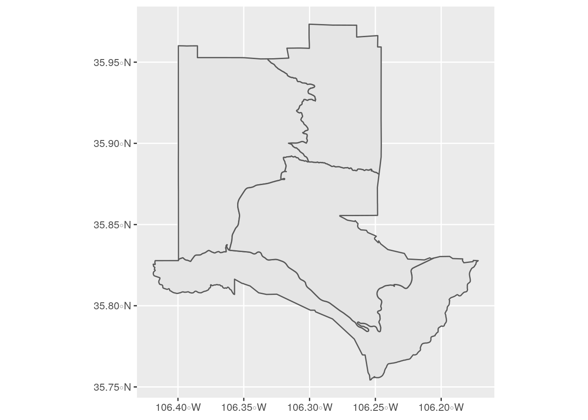
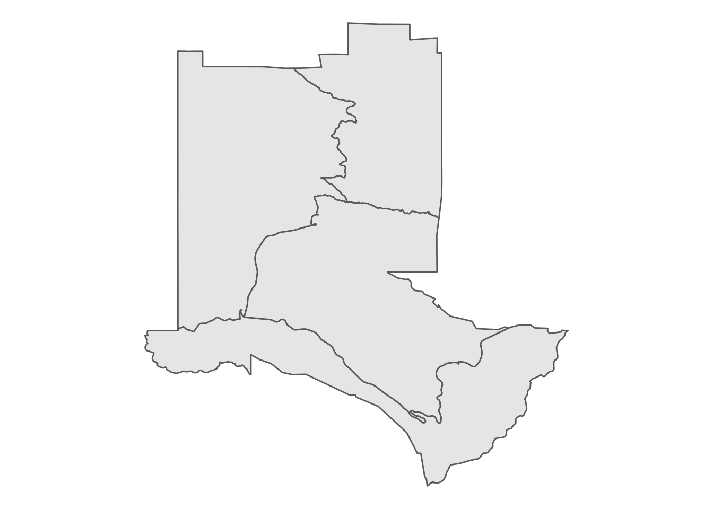
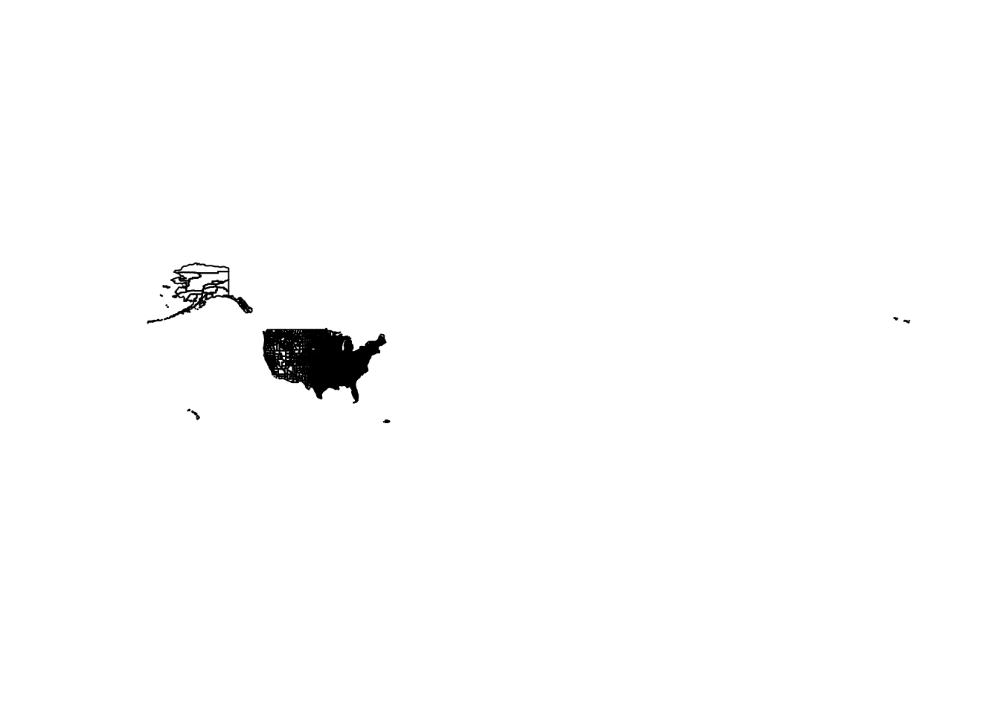
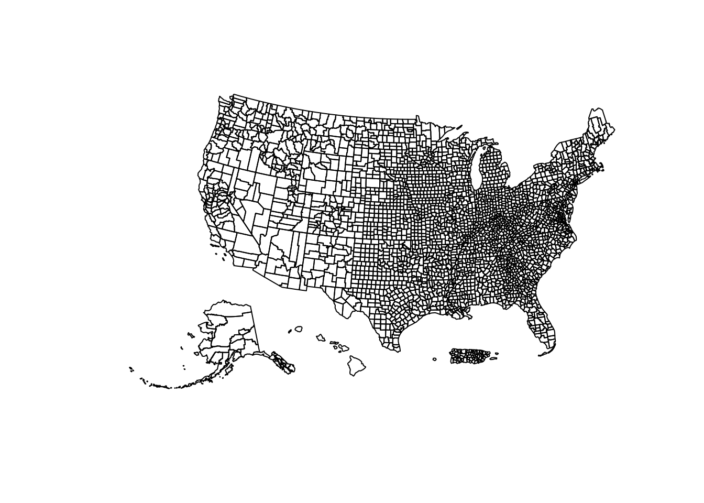
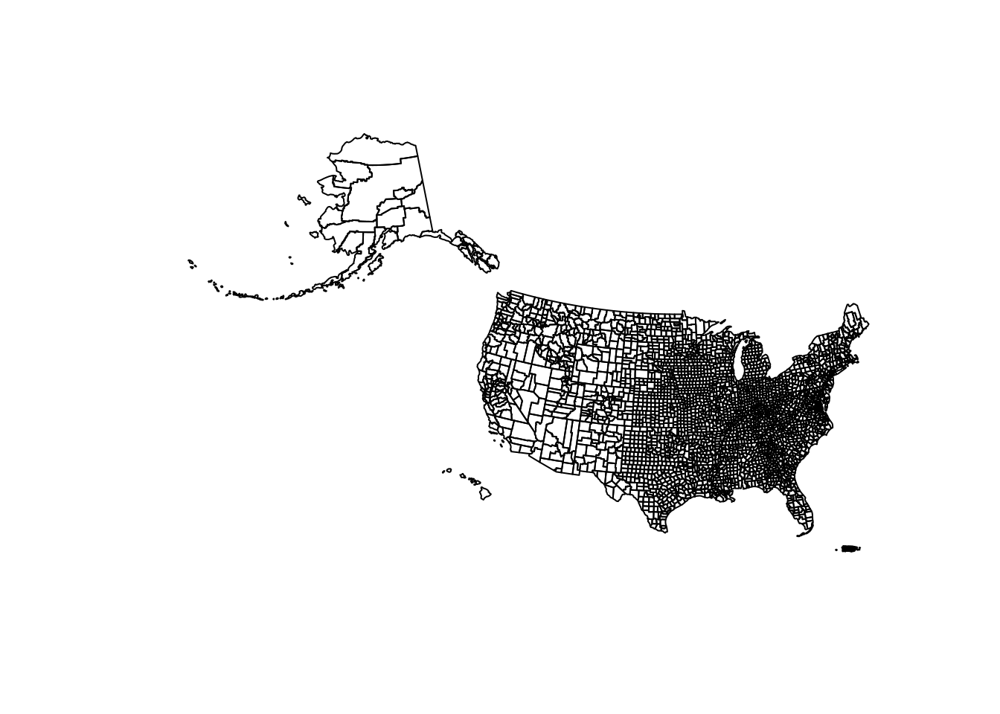
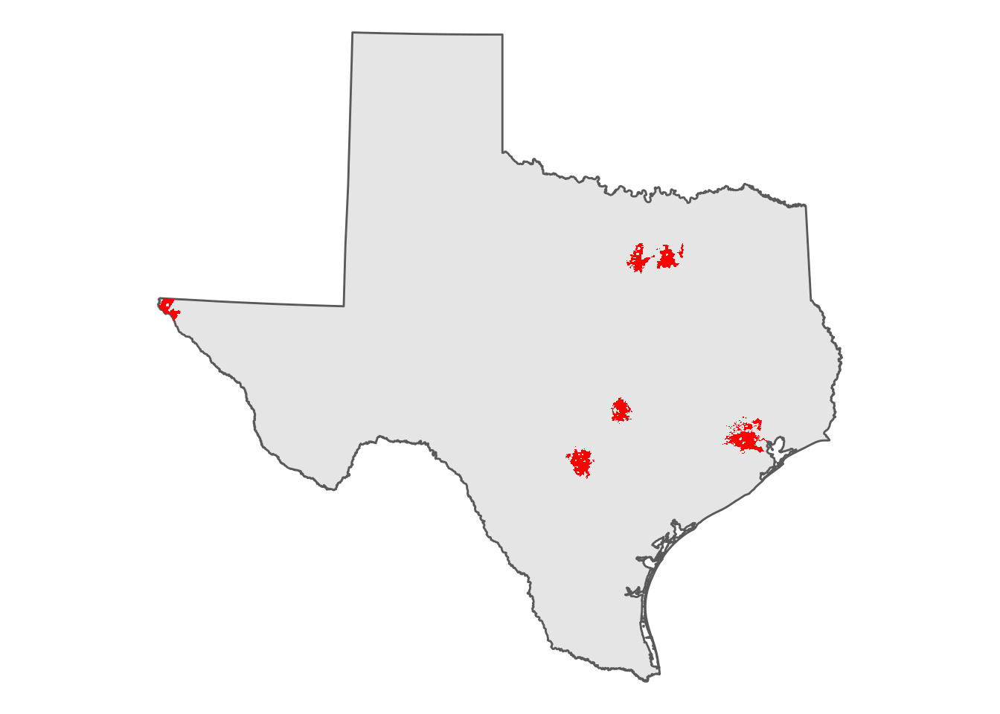
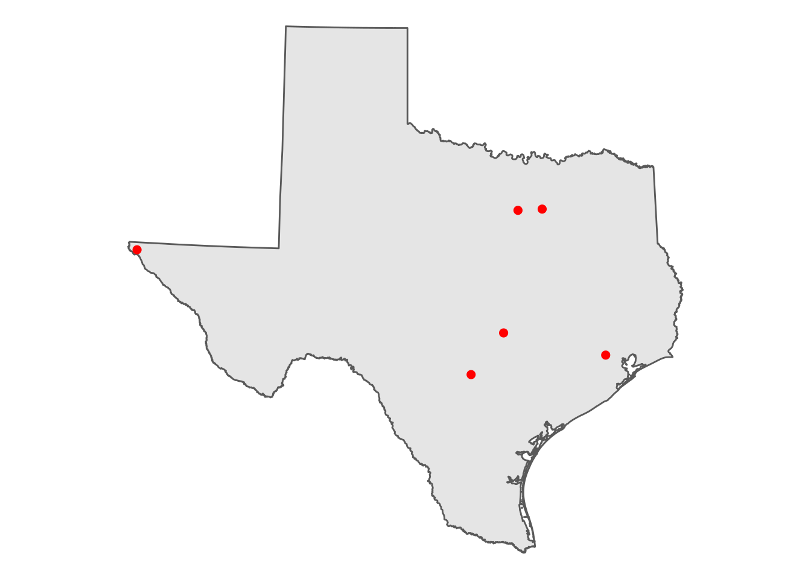
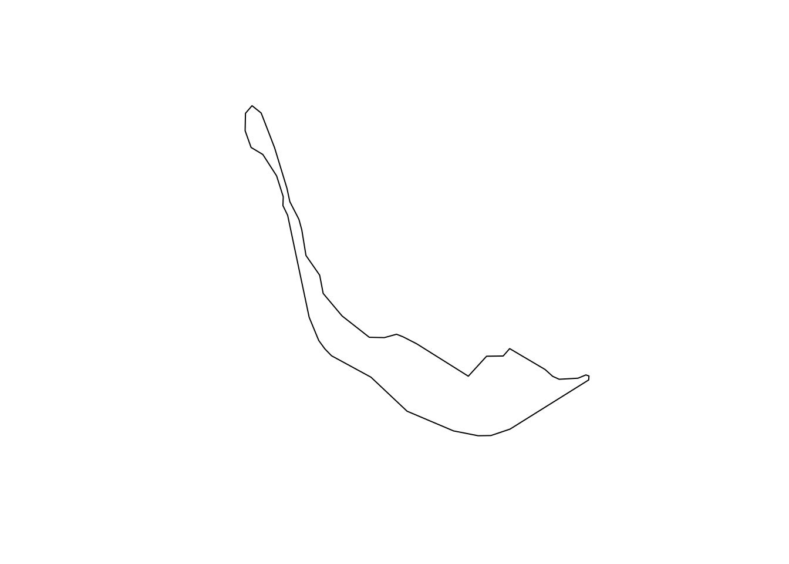

# Census geographic data and applications in R


As discussed in Chapters 1 and 3, Census and ACS data are associated with *geographies*, which are units at which the data are aggregated. These defined geographies are represented in the [US Census Bureau's TIGER/Line database](https://www2.census.gov/geo/pdfs/maps-data/data/tiger/tgrshp2019/TGRSHP2019_TechDoc.pdf), where the acronym **TIGER** stands for *Topologically Integrated Geographic Encoding and Referencing*. This database includes a high-quality series of geographic datasets suitable for both spatial analysis and cartographic visualization . Spatial datasets are made available as *shapefiles*, a common format for encoding geographic data.

The TIGER/Line shapefiles include three general types of data:

-   *Legal entities*, which are geographies that have official legal standing in the United States. These include states and counties.
-   *Statistical entities*, which are geographies defined by the Census Bureau for purposes of data collection and dissemination. Examples of statistical entities include Census tracts and block groups.
-   *Geographic features*, which are geographic datasets that are not linked with aggregate demographic data from the Census Bureau. These datasets include roads and water features.

Traditionally, TIGER/Line shapefiles are downloaded from a web interface as zipped folders, then unzipped for use in a Geographic Information System (GIS) or other software that can work with geographic data. However, the R package **tigris** [@walker2016] allows R users to access these datasets directly from their R sessions without having to go through these steps.

This chapter will cover the core functionality of the tigris package for working with Census geographic data in R. In doing so, it will highlight the **sf** package [@pebesma2018] for representing spatial data as R objects.

## Basic usage of tigris

{width="124"}

The tigris R package simplifies the process for R users of obtaining and using Census geographic datasets. Functions in tigris *download* a requested Census geographic dataset from the US Census Bureau website, then *load* the dataset into R as a spatial object. Generally speaking, each type of geographic dataset available in the Census Bureau's TIGER/Line database is available with a corresponding function in tigris. For example, the `states()` function can be run without arguments to download a boundary file of US states and state equivalents.


```r
library(tigris)

st <- states()
```

Let's take a look at what we get back:


```r
class(st)
```

```
## [1] "sf"         "data.frame"
```

The returned object is of both class `"sf"` and `"data.frame"`. We can print out the first 10 rows to inspect the object further:


```r
st
```

```
## Simple feature collection with 56 features and 14 fields
## Geometry type: MULTIPOLYGON
## Dimension:     XY
## Bounding box:  xmin: -179.2311 ymin: -14.60181 xmax: 179.8597 ymax: 71.43979
## Geodetic CRS:  NAD83
## First 10 features:
##    REGION DIVISION STATEFP  STATENS GEOID STUSPS           NAME LSAD MTFCC
## 1       3        5      54 01779805    54     WV  West Virginia   00 G4000
## 2       3        5      12 00294478    12     FL        Florida   00 G4000
## 3       2        3      17 01779784    17     IL       Illinois   00 G4000
## 4       2        4      27 00662849    27     MN      Minnesota   00 G4000
## 5       3        5      24 01714934    24     MD       Maryland   00 G4000
## 6       1        1      44 01219835    44     RI   Rhode Island   00 G4000
## 7       4        8      16 01779783    16     ID          Idaho   00 G4000
## 8       1        1      33 01779794    33     NH  New Hampshire   00 G4000
## 9       3        5      37 01027616    37     NC North Carolina   00 G4000
## 10      1        1      50 01779802    50     VT        Vermont   00 G4000
##    FUNCSTAT        ALAND      AWATER    INTPTLAT     INTPTLON
## 1         A  62266231560   489271086 +38.6472854 -080.6183274
## 2         A 138947364717 31362872853 +28.4574302 -082.4091477
## 3         A 143779863817  6215723896 +40.1028754 -089.1526108
## 4         A 206230065476 18942261495 +46.3159573 -094.1996043
## 5         A  25151726296  6979340970 +38.9466584 -076.6744939
## 6         A   2677787140  1323663210 +41.5974187 -071.5272723
## 7         A 214049897859  2391604238 +44.3484222 -114.5588538
## 8         A  23189198255  1026903434 +43.6726907 -071.5843145
## 9         A 125925929633 13463401534 +35.5397100 -079.1308636
## 10        A  23874197924  1030383955 +44.0685773 -072.6691839
##                          geometry
## 1  MULTIPOLYGON (((-81.74725 3...
## 2  MULTIPOLYGON (((-86.38865 3...
## 3  MULTIPOLYGON (((-91.18529 4...
## 4  MULTIPOLYGON (((-96.78438 4...
## 5  MULTIPOLYGON (((-77.45881 3...
## 6  MULTIPOLYGON (((-71.7897 41...
## 7  MULTIPOLYGON (((-116.8997 4...
## 8  MULTIPOLYGON (((-72.3299 43...
## 9  MULTIPOLYGON (((-82.41674 3...
## 10 MULTIPOLYGON (((-73.31328 4...
```

The object `st`, representing all US states and territories, includes a data frame with a series of columns representing characteristics of those states, like a name, postal code, and Census ID (the `GEOID` column). It also contains a special list-column, `geometry`, which is made up of a sequence of coordinate of longitude/latitude coordinate pairs that collectively represent the boundary of each state.

The `geometry` column can be visualized in R with the `plot()` function:


```r
plot(st$geometry)
```


Other Census datasets may be available by state or by county within the state. In some cases, this subsetting is optional; in other cases, `state` and/or `county` arguments will be required. For example, the `counties()` function can be used to obtain county boundaries for the entirety of the United States, but also can be used with the `state` argument to return only those counties from a specific state, like New Mexico.


```r
nm_counties <- counties("NM")

plot(nm_counties$geometry)
```


In this case the state postal code `"NM"` is used to instruct tigris to subset the counties dataset for counties in New Mexico. The full name of the state, `"New Mexico"`, would work the same here as well. Obtaining Census shapefiles programmatically requires inputting the Federal Information Processing Standard (FIPS) code; however, tigris translates postal codes and names of states and counties to their FIPS codes so that R users do not have to look them up.

States and counties are examples of *legal entities* that can be accessed with tigris. *Statistical entities* and *geographic features* are similarly accessible if they exist in the TIGER/Line database. For example, a user might request Census tract boundaries for a given county in New Mexico with the corresponding `tracts()` function.


```r
la_tracts <- tracts("NM", "Los Alamos")

plot(la_tracts$geometry)
```


Several geographic features are available in tigris as well, including roads and water features which can be useful for thematic mapping. For example, a user could request area water data for Los Alamos County with the `area_water()` function.


```r
la_water <- area_water("NM", "Los Alamos")

plot(la_water$geometry)
```


### Understanding tigris and simple features

Data returned by the tigris package are examples of *vector spatial data*, a spatial data model that represents geographic features as points, lines, and polygons. The vector spatial data model is represented in R with the [sf package](https://r-spatial.github.io/sf/), an implementation of simple features in the R language.

As mentioned earlier, sf represents vector spatial data much like a regular R data frame, but with a special column, `geometry`, that represents the shape of each feature.

The information above the data frame gives some additional geographic context to the coordinates in the `geometry` column. The returned data is of geometry type `MULTIPOLYGON`, and is characterized by a bounding box and geographic coordinate reference system (CRS) of `NAD83`. These spatial concepts help define how R represents the data geographically, and will be explored further later in this chapter.

Vector data are typically represented as either *points, lines*, or *polygons*, and tigris gives access to all three types.

#### Points

An example point dataset available in the tigris package is Census landmarks, which is a point-of-interest dataset that is not comprehensive but is used by the Census Bureau to guide field enumerators. Let's acquire landmark point data for the District of Columbia and take a look.


```r
dc_landmarks <- landmarks("DC", type = "point")

plot(dc_landmarks$geometry)
```


**Points** are vector data represented by a single coordinate pair; while they have a location, they do not have length or area and in turn are zero-dimensional. Points are useful for representing geographic phenomena when the physical properties of the features are not of importance to a visualization or analysis. For example, if we are interested in the geographic distribution of Census landmarks in Washington DC, but not in the actual shape or physical area of those specific landmarks, representing landmarks as points makes sense.

#### Lines


```r
dc_roads <- primary_secondary_roads("DC")

plot(dc_roads$geometry)
```


**Lines** are one-dimensional representations of geographic features that are used when the length, but not the area, of those features is of primary importance. With respect to the TIGER/Line shapefiles, transportation network features such as roads and railroads are represented as lines.

#### Polygons


```r
dc_block_groups <- block_groups("DC")

plot(dc_block_groups$geometry)
```


### Data availability in tigris

The above examples have provided a sampling of some of the datasets available in tigris; a full enumeration of available datasets and the functions to access them are found in the table below.

+-----------------------------------------+------------------------------------------------+-----------------------+
| Function                                | Datasets available                             | Years available       |
+=========================================+================================================+=======================+
| `nation()`                              | cartographic (1:5m; 1:20m)                     | 2013-2019             |
+-----------------------------------------+------------------------------------------------+-----------------------+
| `divisions()`                           | cartographic (1:500k; 1:5m; 1:20m)             | 2013-2019             |
+-----------------------------------------+------------------------------------------------+-----------------------+
| `regions()`                             | cartographic (1:500k; 1:5m; 1:20m)             | 2013-2019             |
+-----------------------------------------+------------------------------------------------+-----------------------+
| `states()`                              | TIGER/Line; cartographic (1:500k; 1:5m; 1:20m) | 1990, 2000, 2010-2020 |
+-----------------------------------------+------------------------------------------------+-----------------------+
| `counties()`                            | TIGER/Line; cartographic (1:500k; 1:5m; 1:20m) | 1990, 2000, 2010-2020 |
+-----------------------------------------+------------------------------------------------+-----------------------+
| `tracts()`                              | TIGER/Line; cartographic (1:500k)              | 1990, 2000, 2010-2020 |
+-----------------------------------------+------------------------------------------------+-----------------------+
| `block_groups()`                        | TIGER/Line; cartographic (1:500k)              | 1990, 2000, 2010-2020 |
+-----------------------------------------+------------------------------------------------+-----------------------+
| `blocks()`                              | TIGER/Line                                     | 2000, 2010-2020       |
+-----------------------------------------+------------------------------------------------+-----------------------+
| `places()`                              | TIGER/Line; cartographic (1:500k)              | 2011-2020             |
+-----------------------------------------+------------------------------------------------+-----------------------+
| `pumas()`                               | TIGER/Line; cartographic (1:500k)              | 2012-2020             |
+-----------------------------------------+------------------------------------------------+-----------------------+
| `school_districts()`                    | TIGER/Line; cartographic                       | 2011-2020             |
+-----------------------------------------+------------------------------------------------+-----------------------+
| `zctas()`                               | TIGER/Line; cartographic (1:500k)              | 2000, 2010, 2012-2020 |
+-----------------------------------------+------------------------------------------------+-----------------------+
| `congressional_districts()`             | TIGER/Line; cartographic (1:500k; 1:5m; 1:20m) | 2011-2020             |
+-----------------------------------------+------------------------------------------------+-----------------------+
| `state_legislative_districts()`         | TIGER/Line; cartographic (1:500k)              | 2011-2020             |
+-----------------------------------------+------------------------------------------------+-----------------------+
| `voting_districts()`                    | TIGER/Line                                     | 2012                  |
+-----------------------------------------+------------------------------------------------+-----------------------+
| `area_water()`                          | TIGER/Line                                     | 2011-2020             |
+-----------------------------------------+------------------------------------------------+-----------------------+
| `linear_water()`                        | TIGER/Line                                     | 2011-2020             |
+-----------------------------------------+------------------------------------------------+-----------------------+
| `coastline`                             | TIGER/Line()                                   | 2013-2020             |
+-----------------------------------------+------------------------------------------------+-----------------------+
| `core_based_statistical_areas()`        | TIGER/Line; cartographic (1:500k; 1:5m; 1:20m) | 2011-2020             |
+-----------------------------------------+------------------------------------------------+-----------------------+
| `combined_statistical_areas()`          | TIGER/Line; cartographic (1:500k; 1:5m; 1:20m) | 2011-2020             |
+-----------------------------------------+------------------------------------------------+-----------------------+
| `metro_divisions()`                     | TIGER/Line                                     | 2011-2020             |
+-----------------------------------------+------------------------------------------------+-----------------------+
| `new_england()`                         | TIGER/Line; cartographic (1:500k)              | 2011-2020             |
+-----------------------------------------+------------------------------------------------+-----------------------+
| `county_subdivisions()`                 | TIGER/Line; cartographic (1:500k)              | 2010-2020             |
+-----------------------------------------+------------------------------------------------+-----------------------+
| `urban_areas()`                         | TIGER/Line; cartographic (1:500k)              | 2012-2020             |
+-----------------------------------------+------------------------------------------------+-----------------------+
| `primary_roads()`                       | TIGER/Line                                     | 2011-2020             |
+-----------------------------------------+------------------------------------------------+-----------------------+
| `primary_secondary_roads()`             | TIGER/Line                                     | 2011-2020             |
+-----------------------------------------+------------------------------------------------+-----------------------+
| `roads()`                               | TIGER/Line                                     | 2011-2020             |
+-----------------------------------------+------------------------------------------------+-----------------------+
| `rails()`                               | TIGER/Line                                     | 2011-2020             |
+-----------------------------------------+------------------------------------------------+-----------------------+
| `native_areas()`                        | TIGER/Line; cartographic (1:500k)              | 2011-2020             |
+-----------------------------------------+------------------------------------------------+-----------------------+
| `alaska_native_regional_corporations()` | TIGER/Line; cartographic (1:500k)              | 2011-2020             |
+-----------------------------------------+------------------------------------------------+-----------------------+
| `tribal_block_groups()`                 | TIGER/Line                                     | 2011-2020             |
+-----------------------------------------+------------------------------------------------+-----------------------+
| `tribal_census_tracts()`                | TIGER/Line                                     | 2011-2020             |
+-----------------------------------------+------------------------------------------------+-----------------------+
| `tribal_subdivisions_national()`        | TIGER/Line                                     | 2011-2020             |
+-----------------------------------------+------------------------------------------------+-----------------------+
| `landmarks()`                           | TIGER/Line                                     | 2011-2020             |
+-----------------------------------------+------------------------------------------------+-----------------------+
| `military()`                            | TIGER/Line                                     | 2011-2020             |
+-----------------------------------------+------------------------------------------------+-----------------------+

Note from the table that many datasets are available as both **TIGER/Line** and **cartographic boundary** objects, and available for multiple years; these distinctions are covered in the "tigris workflows" subsection below.

## Plotting data

### ggplot2 and `geom_sf()`


```r
library(ggplot2)

ggplot(la_tracts) + 
  geom_sf()
```




```r
ggplot(la_tracts) + 
  geom_sf() + 
  theme_void()
```




```r
library(patchwork)

la_block_groups <- block_groups("NM", "Los Alamos")

gg1 <- ggplot(la_tracts) + 
  geom_sf() + 
  theme_void() + 
  labs(title = "Census tracts")

gg2 <- ggplot(la_block_groups) + 
  geom_sf() + 
  theme_void() + 
  labs(title = "Block groups")

gg1 + gg2
```


### Interactive viewing with `mapview::mapview()`


```r
library(mapview)

mapview(la_tracts)
```

## tigris workflows

Sentence or two

### TIGER/Line and cartographic boundary shapefiles


```r
mi_counties <- counties("MI")
mi_counties_cb <- counties("MI", cb = TRUE)

mi_tiger_gg <- ggplot(mi_counties) + 
  geom_sf() + 
  theme_void() + 
  labs(title = "TIGER/Line")

mi_cb_gg <- ggplot(mi_counties_cb) + 
  geom_sf() + 
  theme_void() + 
  labs(title = "Cartographic boundary")

mi_tiger_gg + mi_cb_gg
```


### Caching tigris data


```r
options(tigris_use_cache = TRUE)

rappdirs::user_cache_dir("tigris")
```

```
## [1] "~/.cache/tigris"
```

### Understanding yearly differences in TIGER/Line files


```r
library(tidyverse)
library(patchwork)

yearly_plots <- map(seq(1990, 2020, 10), ~{
  if (.x < 2020) cb <- TRUE else cb <- FALSE

  year_tracts <- tracts("TX", "Tarrant", year = .x,
                        cb = cb)

  ggplot(year_tracts) + 
    geom_sf() + 
    theme_void() + 
    labs(title = .x)
})
```

We then use patchwork to facet the plots:


```r
(yearly_plots[[1]] + yearly_plots[[2]]) / (yearly_plots[[3]] + yearly_plots[[4]])
```


### Combining tigris datasets


```r
state_codes <- c(state.abb, "DC")

us_bgs <- map_df(state_codes, ~block_groups(state = .x, cb = TRUE))

glimpse(us_bgs)
```

```
## Rows: 217,453
## Columns: 11
## $ STATEFP  <chr> "01", "01", "01", "01", "01", "01", "01", "01", "01", "01", "…
## $ COUNTYFP <chr> "073", "025", "077", "055", "131", "055", "055", "015", "073"…
## $ TRACTCE  <chr> "012910", "957602", "011802", "010200", "034700", "010601", "…
## $ BLKGRPCE <chr> "1", "5", "2", "5", "1", "1", "2", "1", "1", "2", "2", "1", "…
## $ AFFGEOID <chr> "1500000US010730129101", "1500000US010259576025", "1500000US0…
## $ GEOID    <chr> "010730129101", "010259576025", "010770118022", "010550102005…
## $ NAME     <chr> "1", "5", "2", "5", "1", "1", "2", "1", "1", "2", "2", "1", "…
## $ LSAD     <chr> "BG", "BG", "BG", "BG", "BG", "BG", "BG", "BG", "BG", "BG", "…
## $ ALAND    <dbl> 3671177, 5858511, 4693254, 2359614, 402854096, 11699694, 4185…
## $ AWATER   <dbl> 150769, 0, 4993, 0, 19530524, 1158709, 0, 6370, 0, 0, 25350, …
## $ geometry <MULTIPOLYGON [°]> MULTIPOLYGON (((-86.75138 3..., MULTIPOLYGON (((…
```

## Coordinate systems


```r
library(sf)

fl_counties <- counties("FL", cb = TRUE)

st_crs(fl_counties)
```

```
## Coordinate Reference System:
##   User input: NAD83 
##   wkt:
## GEOGCRS["NAD83",
##     DATUM["North American Datum 1983",
##         ELLIPSOID["GRS 1980",6378137,298.257222101,
##             LENGTHUNIT["metre",1]]],
##     PRIMEM["Greenwich",0,
##         ANGLEUNIT["degree",0.0174532925199433]],
##     CS[ellipsoidal,2],
##         AXIS["latitude",north,
##             ORDER[1],
##             ANGLEUNIT["degree",0.0174532925199433]],
##         AXIS["longitude",east,
##             ORDER[2],
##             ANGLEUNIT["degree",0.0174532925199433]],
##     ID["EPSG",4269]]
```

### Using the crsuggest package


```r
library(crsuggest)

fl_crs <- suggest_crs(fl_counties)

glimpse(fl_crs)
```

```
## Rows: 10
## Columns: 6
## $ crs_code  <chr> "6439", "3513", "3087", "3086", "6443", "6442", "3517", "351…
## $ crs_name  <chr> "NAD83(2011) / Florida GDL Albers", "NAD83(NSRS2007) / Flori…
## $ crs_type  <chr> "projected", "projected", "projected", "projected", "project…
## $ crs_gcs   <dbl> 6318, 4759, 4152, 4269, 6318, 6318, 4759, 4759, 4152, 4152
## $ crs_units <chr> "m", "m", "m", "m", "us-ft", "m", "us-ft", "m", "us-ft", "m"
## $ crs_proj4 <chr> "+proj=aea +lat_0=24 +lon_0=-84 +lat_1=24 +lat_2=31.5 +x_0=4…
```


```r
fl_projected <- st_transform(fl_counties, crs = 3086)

head(fl_projected)
```

```
## Simple feature collection with 6 features and 9 fields
## Geometry type: MULTIPOLYGON
## Dimension:     XY
## Bounding box:  xmin: 83061.43 ymin: 130374.3 xmax: 788415.3 ymax: 780618.8
## Projected CRS: NAD83 / Florida GDL Albers
##     STATEFP COUNTYFP COUNTYNS       AFFGEOID GEOID         NAME LSAD      ALAND
## 24       12      075 00295724 0500000US12075 12075         Levy   06 2896183010
## 96       12      086 00295755 0500000US12086 12086   Miami-Dade   06 4920565755
## 97       12      073 00306916 0500000US12073 12073         Leon   06 1727237331
## 98       12      057 00295757 0500000US12057 12057 Hillsborough   06 2646772012
## 99       12      083 00306922 0500000US12083 12083       Marion   06 4113978836
## 100      12      113 00306914 0500000US12113 12113   Santa Rosa   06 2622050628
##         AWATER                       geometry
## 24   762935040 MULTIPOLYGON (((493790.2 56...
## 96  1376144237 MULTIPOLYGON (((783767.2 17...
## 97    90397079 MULTIPOLYGON (((331309.3 70...
## 98   631505816 MULTIPOLYGON (((555139.1 42...
## 99   192297049 MULTIPOLYGON (((542215.2 56...
## 100  418020790 MULTIPOLYGON (((83267.92 76...
```

## Working with geometries

### Shifting and rescaling geometry for national US mapping


```r
us_counties <- counties(cb = TRUE, resolution = "20m")

plot(us_counties$geometry)
```




```r
us_counties_shifted <- shift_geometry(us_counties)

plot(us_counties_shifted$geometry)
```




```r
us_counties_outside <- shift_geometry(us_counties, 
                                      preserve_area = TRUE,
                                      position = "outside")

plot(us_counties_outside$geometry)
```



### Converting polygons to points


```r
tx_places <- places("TX", cb = TRUE) %>%
  filter(NAME %in% c("Dallas", "Fort Worth", "Houston",
                     "Austin", "San Antonio", "El Paso")) %>%
  st_transform(6580)

tx_outline <- states(cb = TRUE) %>%
  filter(NAME == "Texas") %>%
  st_transform(6580)


ggplot() + 
  geom_sf(data = tx_outline) + 
  geom_sf(data = tx_places, fill = "red", color = NA) + 
  theme_void()
```



Poly to point:


```r
tx_centroids <- st_centroid(tx_places)

ggplot() + 
  geom_sf(data = tx_outline) + 
  geom_sf(data = tx_centroids, color = "red", size = 2) + 
  theme_void()
```



### Exploding multipolygon geometries to single parts


```r
lee <- fl_projected %>%
  filter(NAME == "Lee")

lee
```

```
## Simple feature collection with 1 feature and 9 fields
## Geometry type: MULTIPOLYGON
## Dimension:     XY
## Bounding box:  xmin: 571476.9 ymin: 258768.2 xmax: 642720.9 ymax: 310584
## Projected CRS: NAD83 / Florida GDL Albers
##   STATEFP COUNTYFP COUNTYNS       AFFGEOID GEOID NAME LSAD      ALAND
## 1      12      071 00295758 0500000US12071 12071  Lee   06 2023963480
##       AWATER                       geometry
## 1 1116067200 MULTIPOLYGON (((580415.3 30...
```


```r
lee_singlepart <- st_cast(lee, "POLYGON")

lee_singlepart
```

```
## Simple feature collection with 4 features and 9 fields
## Geometry type: POLYGON
## Dimension:     XY
## Bounding box:  xmin: 571476.9 ymin: 258768.2 xmax: 642720.9 ymax: 310584
## Projected CRS: NAD83 / Florida GDL Albers
##     STATEFP COUNTYFP COUNTYNS       AFFGEOID GEOID NAME LSAD      ALAND
## 1        12      071 00295758 0500000US12071 12071  Lee   06 2023963480
## 1.1      12      071 00295758 0500000US12071 12071  Lee   06 2023963480
## 1.2      12      071 00295758 0500000US12071 12071  Lee   06 2023963480
## 1.3      12      071 00295758 0500000US12071 12071  Lee   06 2023963480
##         AWATER                       geometry
## 1   1116067200 POLYGON ((580415.3 300219.6...
## 1.1 1116067200 POLYGON ((576540.4 289935.7...
## 1.2 1116067200 POLYGON ((572595.4 298881, ...
## 1.3 1116067200 POLYGON ((571476.9 310583.5...
```


```r
sanibel <- lee_singlepart[2,]

plot(sanibel$geometry)
```


