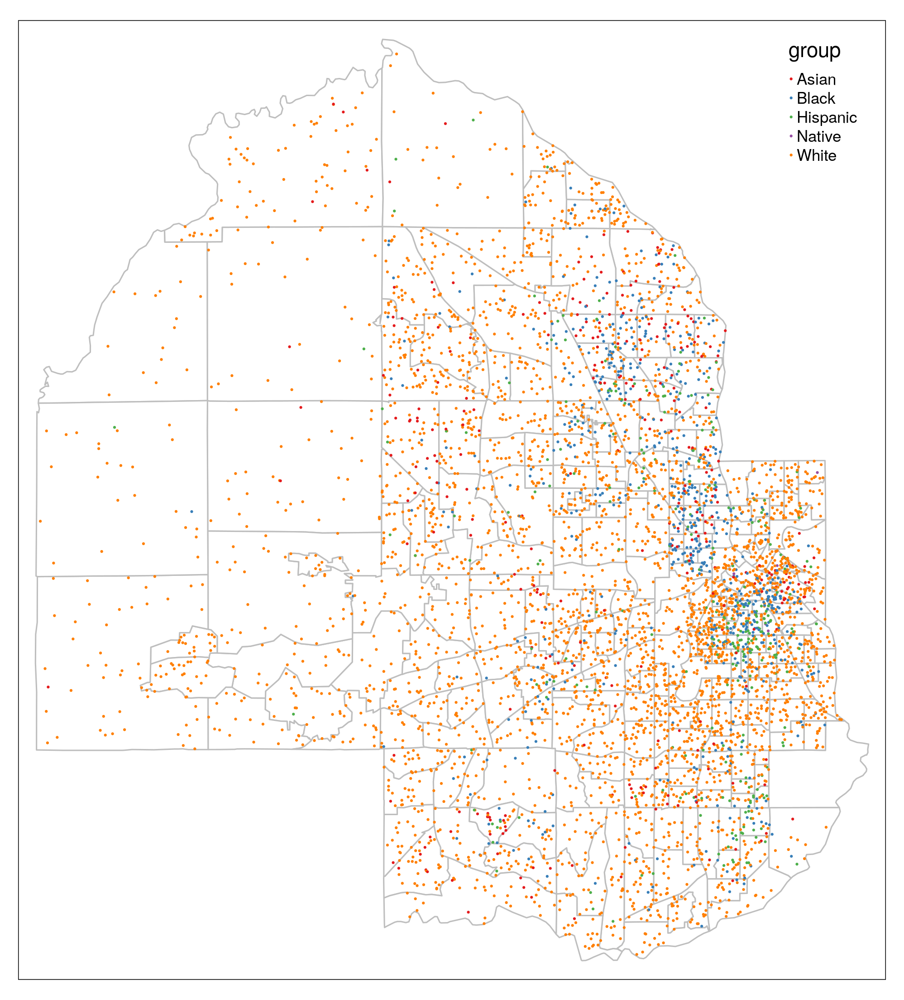
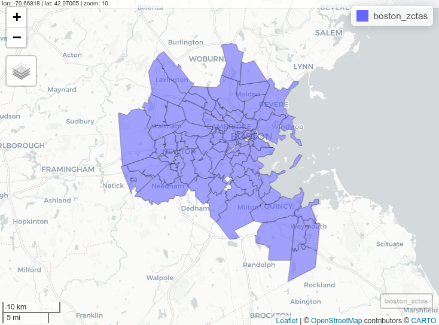
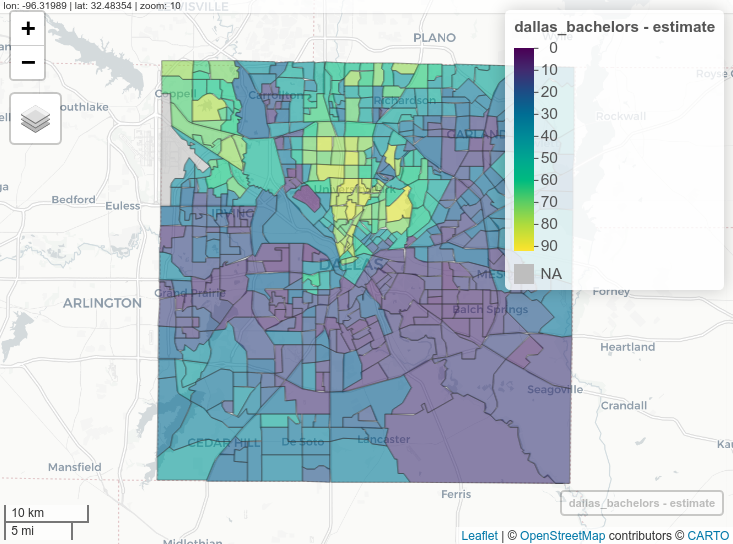
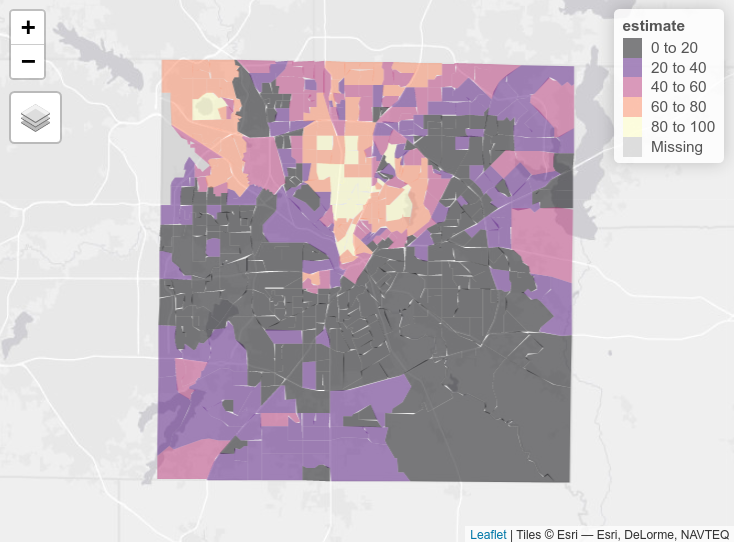
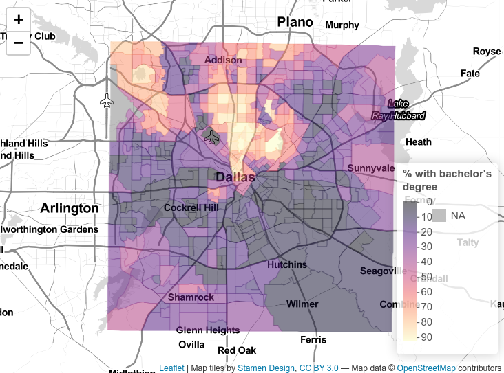
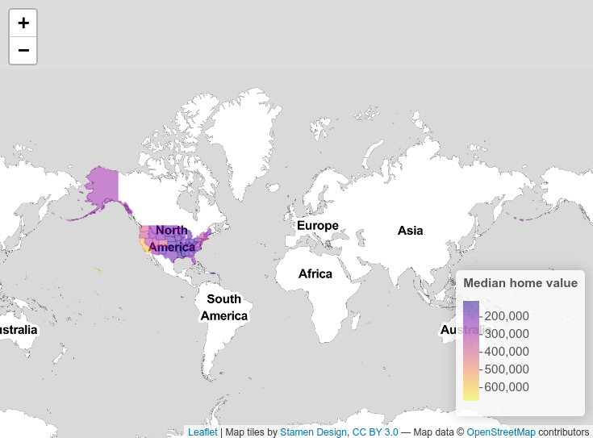
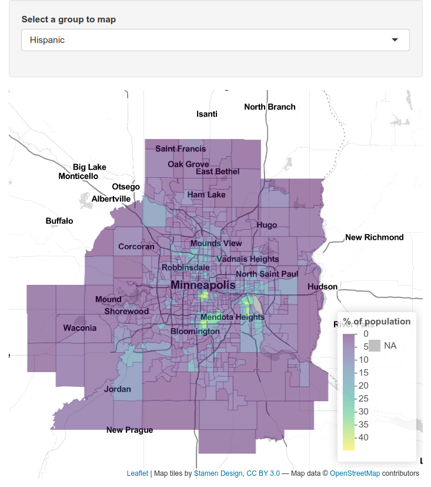

# Mapping Census data with R

```{r setup-ch6, include = FALSE}
options(tigris_use_cache = TRUE)
library(tidyverse)
library(tigris)
library(mapboxapi)

source("R/book-functions.R")
```

Data from the United States Census Bureau are commonly visualized using maps, given that Census and ACS data are aggregated to enumeration units. This chapter will cover the process of map-making using the **tidycensus** R package. Notably, **tidycensus** enables R users to download *simple feature geometry* for common geographies, linking demographic information with their geographic locations in a dataset. In turn, this data model facilitates the creation of both static and interactive demographic maps.

In this chapter, readers will learn how to use the `geometry` parameter in tidycensus functions to download geographic data along with demographic data from the US Census Bureau. The chapter will then cover how to make static maps of Census demographic data using the popular **ggplot2** and **tmap** visualization packages. The closing parts of the chapter will then turn to interactive mapping, with a focus on the **mapview** and **Leaflet** R packages for interactive cartographic visualization.

## Using geometry in tidycensus

As covered in the previous chapter, Census geographies are available from the **tigris** R package as simple features objects, using the data model from the **sf** R package. tidycensus wraps several common geographic data functions in the **tigris** package to allow R users to return simple feature geometry pre-linked to downloaded demographic data with a single function call. The key argument to accomplish this is `geometry = TRUE`, which is available in the core data download functions in tidycensus, `get_acs()`, `get_decennial()`, and `get_estimates()`.

Traditionally, getting "spatial" Census data requires a tedious multi-step process that can involve several software platforms. These steps include:

-   Fetching shapefiles from the Census website;

-   Downloading a CSV of data, then cleaning and formatting it;

-   Loading geometries and data into your desktop GIS of choice;

-   Aligning key fields in your desktop GIS and joining your data.

A major motivation for developing **tidycensus** was my frustration with having to go through this process over and over again before making a simple map of Census data. `geometry = TRUE` combines the automated data download functionality of tidycensus and tigris to allow R users to bypass this process entirely. The following example illustrates the use of the `geometry = TRUE` argument, fetching information on median household income for Census tracts in the District of Columbia. As discussed in the previous chapter, the option `tigris_use_cache = TRUE` is used to cache the downloaded geographic data on the user's computer.

```{r get-geometry}
library(tidycensus)
options(tigris_use_cache = TRUE)

dc_income <- get_acs(
  geography = "tract", 
  variables = "B19013_001",
  state = "DC", 
  geometry = TRUE
)

dc_income
```

As shown in the example call, the structure of the object returned by tidycensus resembles the object we've become familiar with to this point in the book. For example, median household income data are found in the `estimate` column with associated margins of error in the `moe` column, along with a variable ID, GEOID, and Census tract name. However, there are some notable differences. The `geometry` column contains polygon feature geometry for each Census tract, allowing for a linking of the estimates and margins of error with their corresponding locations in Washington, DC. Beyond that, the object is associated with coordinate system information - using the NAD 1983 geographic coordinate system in which Census geographic datasets are stored by default.

### Basic mapping of sf objects with `plot()`

Such geographic information can be difficult to understand without visualization. As the returned object is a simple features object, both geometry and attributes can be visualized with `plot()`. Key here is specifying the name of the column to be plotted inside of brackets, which in this case is `"estimate"`.

```{r plot-dc-income-1, fig.cap = "Base R plot of median household income by tract in DC"}
plot(dc_income["estimate"])
```

The `plot()` function returns a simple map showing income variation in Washington, DC. Wealthier areas, as represented with warmer colors, tend to be located in the northwestern part of the District. `NA` values are represented on the map in white. If desired, the map can be modified further with base plotting functions.

The remainder of this chapter, however, will focus on map-making with additional data visualization packages in R. This includes the popular **ggplot2** package for visualization, which supports direct visualization of simple features objects; the **tmap** package for thematic mapping, and the **leaflet** package for interactive map-making which calls the Leaflet JavaScript framework directly from R.

## Map-making with ggplot2 and geom_sf

As illustrated in Section \@ref(plotting-geographic-data), `geom_sf()` in **ggplot2** can be used for quick plotting of sf objects using familiar **ggplot2** syntax. `geom_sf()` goes far beyond simple cartographic display. The full power of **ggplot2** is available to create highly customized maps and geographic data visualizations.

### Choropleth mapping

One of the most common ways to visualize statistical information on a map is with *choropleth mapping*. Choropleth maps use shading to represent how underlying data values vary by feature in a spatial dataset. The income plot of Washington, DC shown earlier in this chapter is an example of a choropleth map.

In the example below, **tidycensus** is used to obtain linked ACS and spatial data on median age by state for the 50 US states plus the District of Columbia and Puerto Rico. For national maps, it is often preferable to generate insets of Alaska, Hawaii, and Puerto Rico so that they can all be viewed comparatively with the continental United States. We'll use the `shift_geometry()` function in **tigris** to shift and rescale these areas for national mapping. The argument `resolution = "20m"` is necessary here for appropriate results, as it will omit the long archipelago of islands to the northwest of Hawaii.

```{r plot-geometry-1, fig.cap = "Plot of shifted and rescaled US geometry"}
library(tidycensus)
library(tidyverse)
library(tigris)

us_median_age <- get_acs(
  geography = "state",
  variables = "B01002_001",
  year = 2019,
  survey = "acs1",
  geometry = TRUE,
  resolution = "20m"
) %>%
  shift_geometry()

plot(us_median_age$geometry)
```

The state polygons can be styled using **ggplot2** conventions and the `geom_sf()` function. With two lines of **ggplot2** code, a basic map of median age by state can be created with **ggplot2** defaults.

```{r first-choropleth, fig.cap = "US choropleth map with ggplot2 defaults"}
ggplot(data = us_median_age, aes(fill = estimate)) + 
  geom_sf()
```

The `geom_sf()` function in the above example interprets the geometry of the sf object (in this case, polygon) and visualizes the result as a filled choropleth map. In this case, the ACS estimate of median age is mapped to the default blue dark-to-light color ramp in **ggplot2**, highlighting the youngest states (such as Utah) with darker blues and the oldest states (such as Maine) with lighter blues.

### Customizing ggplot2 maps

In many cases, map-makers using **ggplot2** will want to customize this graphic further. For example, a designer may want to modify the color palette and reverse it so that darker colors represent older areas. The map would also benefit from some additional information describing its content and data sources. These modifications can be specified in the same way a user would update a regular ggplot2 graphic. The `scale_fill_distiller()` function allows users to specify a [ColorBrewer](https://colorbrewer2.org/#type=sequential&scheme=BuGn&n=3) palette to use for the map, which includes a wide range of sequential, diverging, and qualitative color palettes [@brewer2003]. The `labs()` function can then be used to add a title, caption, and better legend label to the plot. Finally, **ggplot2** cartographers will often want to use the `theme_void()` function to remove the background and gridlines from the map.

```{r styled-age-map, fig.cap = "Styled choropleth of US median age with ggplot2"}
ggplot(data = us_median_age, aes(fill = estimate)) + 
  geom_sf() + 
  scale_fill_distiller(palette = "RdPu", 
                       direction = 1) + 
  labs(title = "  Median Age by State, 2019",
       caption = "Data source: 2019 1-year ACS, US Census Bureau",
       fill = "ACS estimate") + 
  theme_void()
```

## Map-making with tmap

For **ggplot2** users, `geom_sf()` offers a familiar interface for mapping data obtained from the US Census Bureau. However, **ggplot2** is far from the only option for cartographic visualization in R. The **tmap** package [@tennekes2018] is an excellent alternative for mapping in R that includes a wide range of functionality for custom cartography. The section that follows is an overview of several cartographic techniques implemented with **tmap** for visualizing US Census data. A full treatment of best practices in cartographic design is beyond the scope of this section; recommended resources for learning more include @peterson2020 and @brewer2016.

To begin, let's grab some ACS data on race and ethnicity from the American Community Survey. We'll be looking at data on non-Hispanic white, non-Hispanic Black, Asian, and Hispanic populations for Census tracts in Hennepin County, Minnesota.

```{r hennepin-race-ethnicity}
hennepin_race <- get_acs(
  geography = "tract",
  state = "MN",
  county = "Hennepin",
  variables = c(White = "B03002_003",
                Black = "B03002_004",
                Native = "B03002_005",
                Asian = "B03002_006",
                Hispanic = "B03002_012"),
  summary_var = "B03002_001",
  geometry = TRUE
) %>%
  mutate(percent = 100 * (estimate / summary_est))
```

```{r show-hennepin-race, echo = FALSE}
style_data(hennepin_race, caption = "Race and ethnicity in Hennepin County, MN")
```

We've returned ACS data in tidycensus's regular "tidy" or long format, which will be useful in a moment for comparative map-making, and completed some basic data wrangling tasks learned in Chapter \@ref(wrangling-census-data-with-tidyverse-tools) to calculate group percentages. To get started mapping this data, we'll extract a single group from the dataset to illustrate how **tmap** works.

### Choropleth maps with tmap

**tmap**'s map-making syntax will be somewhat familiar to users of **ggplot2**, as it uses the concept of *layers* to specify modifications to the map. The map object is initialized with `tm_shape()`, which then allows us to view the Census tracts with `tm_polygons()`. We'll first filter our long-form spatial dataset to get a unique set of tract polygons, then visualize them.

```{r henn-plot-tracts, fig.cap = "Basic polygon plot with tmap"}

library(tmap)
hennepin_black <- filter(hennepin_race, 
                         variable == "Black")
tm_shape(hennepin_black) + 
  tm_polygons()
```

We get a default view of Census tracts in Hennepin County, Minnesota. Alternatively, the `tm_fill()` function can be used to produce choropleth maps, as illustrated in the ggplot2 examples above.

```{r tmap-plot-polygons, fig.cap = "Basic choropleth with tmap"}
tm_shape(hennepin_black) + 
  tm_polygons(col = "percent")
```

You'll notice that **tmap** uses a classed color scheme rather than the continuous palette used by **ggplot2**, by default. This involves the identification of "classes" in the distribution of data values and mapping a color from a color palette to data values that belong to each class. The default classification scheme used by `tm_fill()` is `"pretty"`, which identifies clean-looking intervals in the data based on the data range. In this example, data classes change every 10 percent. However, this approach will always be sensitive to the distribution of data values. Let's take a look at our data distribution to understand why:

```{r hist-black-data, fig.cap = "Base R histogram of percent Black by Census tract"}
hist(hennepin_black$percent)
```

As the histogram illustrates, most Census tracts in Hennepin County have Black populations below 20 percent. In turn, variation within this bucket is not visible on the map given that most tracts fall into one class. The `style` argument in `tm_fill()` supports a number of other methods for classification, including quantile breaks (`"quantile"`), equal intervals (`"equal"`), and Jenks natural breaks (`"jenks"`). Let's switch to quantiles below, where each class will contain the same number of Census tracts. We can also change the color palette and add some contextual text as we did with ggplot2.

```{r update-hennepin-map, fig.cap = "tmap choropleth with options"}
tm_shape(hennepin_black, 
         projection = sf::st_crs(26915)) + 
  tm_polygons(col = "percent",
          style = "quantile",
          n = 5,
          palette = "Purples",
          title = "ACS estimate") + 
  tm_layout(title = "Percent Black\nby Census tract",
            frame = FALSE,
            legend.outside = TRUE)
```

Switching from the default classification scheme to quantiles reveals additional neighborhood-level heterogeneity in Hennepin County's Black population in suburban areas. However, it does mask some heterogeneity in Minneapolis as the top class now includes values ranging from 22 percent to 71 percent. A "compromise" solution commonly used in GIS cartography applications is the Jenks natural-breaks method, which uses an algorithm to identify meaningful breaks in the data for bin boundaries [@jenks1967]. To assist with understanding how the different classification methods work, the `legend.hist` argument in `tm_polygons()` can be set to TRUE, adding a histogram to the map with bars colored by the values used on the map.

```{r jenks, fig.cap = "Styled tmap choropleth"}
tm_shape(hennepin_black, 
         projection = sf::st_crs(26915)) + 
  tm_polygons(col = "percent",
          style = "jenks",
          n = 5,
          palette = "Purples",
          title = "ACS estimate",
          legend.hist = TRUE) + 
  tm_layout(title = "Percent Black\nby Census tract",
            frame = FALSE,
            legend.outside = TRUE,
            bg.color = "grey70",
            legend.hist.width = 5,
            fontfamily = "Verdana")
```

The `tm_layout()` function is used to customize the styling of the map and histogram, and has many more options beyond those shown that can be viewed in the function's documentation.

### Adding reference elements to a map

The choropleth map as illustrated in the previous example represents the data as a statistical graphic, with both a map and histogram showing the underlying data distribution. Cartographers coming to R from a desktop GIS background will be accustomed to adding a variety of reference elements to their map layouts to provide additional geographical context to the map. These elements may include a basemap, north arrow, and scale bar, all of which can be accommodated by **tmap**.

The **tmaptools** add-in package to **tmap** includes a function, `read_osm()`, that helps users acquire basemap tiles from OpenStreetMap for use in tmap. `read_osm()` has a dependency on the **rJava** package which can be difficult to install, however, and it limits users to pre-made basemaps. The example shown here uses the **mapboxapi** R package @walker_mapbox, which gives users with a Mapbox account access to pre-designed Mapbox basemaps as well as custom-designed basemaps in [Mapbox Studio](https://studio.mapbox.com/).

To use Mapbox basemaps with **mapboxapi** and **tmap**, you'll first need a Mapbox account and access token. Mapbox accounts are free; [register at the Mapbox website](https://account.mapbox.com/) then find your access token. In R, this token can be set with the `mb_access_token()` function in **mapboxapi**.

```{r map-mb-set-token, eval = FALSE}
library(mapboxapi)

# Replace with your token below
mb_access_token("pk.ey92lksd...")
```

Once set, basemap tiles for an input spatial dataset can be fetched with the `get_static_tiles()` function in **mapboxapi**, which interacts with the [Mapbox Static Tiles API](https://docs.mapbox.com/api/maps/static-tiles/). Mapbox Studio users can design a custom basemap style and use the custom style ID along with their username to fetch tiles from that style for mapping; any Mapbox user can also use the [default Mapbox styles](https://docs.mapbox.com/api/maps/styles/#mapbox-styles) by supplying `username = "mapbox"` and the appropriate style ID. The level of detail of the underlying basemap can be adjusted with the `zoom` argument.

```{r get-hennepin-tiles}
# If you don't have a Mapbox style to use, replace style_id with "light-v9"
# and username with "mapbox".  If you do, replace those arguments with your 
# style ID and user name.
hennepin_tiles <- get_static_tiles(
  location = hennepin_black,
  zoom = 10,
  style_id = "ckedp72zt059t19nssixpgapb",
  username = "kwalkertcu"
)
```

In most cases, users should choose a muted, monochrome basemap when designing a map with a choropleth overlay to avoid confusing blending of colors.

These basemap tiles are layered into the familiar **tmap** workflow with the `tm_rgb()` function. To show the underlying basemap, users should modify the transparency of the Census tract polygons with the `alpha` argument. Additional **tmap** functions then add ancillary map elements. `tm_scale_bar()` adds a scale bar; `tm_compass()` adds a north arrow; and `tm_credits()` helps cartographers give credit for the basemap, which is required when using Mapbox and OpenStreetMap tiles.

```{r hennepin-map-with-basemap, fig.cap="Map of percent Black in Hennepin County with reference elements"}

tm_shape(hennepin_tiles) + 
  tm_rgb() + 
  tm_shape(hennepin_black) + 
  tm_polygons(col = "percent",
          style = "jenks",
          n = 5,
          palette = "Purples",
          title = "ACS estimate",
          alpha = 0.7) +
  tm_layout(title = "Percent Black\nby Census tract",
            legend.outside = TRUE,
            fontfamily = "Verdana") + 
  tm_scale_bar(position = c("left", "bottom")) + 
  tm_compass(position = c("right", "top")) + 
  tm_credits("(c) Mapbox, OSM    ", 
             bg.color = "white",
             position = c("RIGHT", "BOTTOM"))
```

Depending on the shape of your Census data, the `position` arguments in `tm_scale_bar()`, `tm_compass()`, and `tm_credits()` can be modified to organize ancillary map elements appropriately. When capitalized (as used in `tm_credits()`), the element will be positioned tighter to the map frame.

### Choosing a color palette

The examples shown in this chapter thus far have used a variety of *color palettes* to display statistical variation on choropleth maps. Software packages like sf, ggplot2, and tmap will have color palettes built in as "defaults"; I've shown the default palettes for all three, then changed the palettes used in **ggplot2** and in **tmap**. So how do you go about choosing an appropriate color palette? There are a variety of considerations to take into account.

First, it is important to understand the type of data you are working with. If your data are *quantitative* - that is, expressed with numbers, which you'll commonly be working with using Census data - you'll want a color palette that can show the statistical variation in your data correctly. In the demographic examples shown above, ACS data range from a low value to a high value. This type of information is effectively represented with a *sequential* color palette. **Sequential** color palettes use either a single hue or related hues then modify the color lightness or intensity to generate a sequence of colors. An example single-hue palette is the "Purples" ColorBrewer palette used in the map above.

```{r sequential-palette, echo = FALSE, fig.cap = "Sequential 'Purples' color palette"}

```

With this palette, lighter colors should generally be used to represent lower data values, and darker values should represent higher values, suggesting a greater density/concentration of that attribute. In other color palettes, however, the more intense colors may be the lighter colors and should be used accordingly to represent data values. This is the case with the popular viridis color palettes, implemented in R with the **viridis** package [@garnier2021] and shown below.

```{r viridis-palette, echo = FALSE, fig.cap = "Sequential 'viridis' color palette"}

```

**Diverging** color palettes are best used when the cartographer wants to highlight extreme values on either end of the data distribution and represent neutral values in the middle. The example shown below is the ColorBrewer "RdBu" palette.

```{r diverging-palette, echo = FALSE, fig.cap = "Diverging 'RdBu' color palette"}
knitr::include_graphics("img/screenshots/diverging-palette.png")
```

For Census data mapping, diverging palettes are well-suited to maps that visualize change over time. A map of population change using a diverging palette would highlight extreme population loss and extreme population gain with intense colors on either end of the palette, and represent minimal population change with a muted, neutral color in the middle.

**Qualitative** palettes are appropriate for categorical data, as they represent data values with unique, unordered hues. A good example is the "Set1" color palette shown below.

```{r categorical-palette, echo = FALSE, fig.cap = "Categorical 'Set1' color palette"}
knitr::include_graphics("img/screenshots/categorical-palette.png")
```

While maps of Census data as returned by **tidycensus** will generally use sequential or diverging color palettes (given the quantitative nature of Census data), derived data products may require qualitative palettes. Illustrative examples in this book include categorical dot-density maps (addressed later in this chapter) and visualizations of geodemographic clusters, explored in Section \@ref(geodemographic-classification).

Choosing an appropriate color palette for your maps can be a challenge. Fortunately, the ColorBrewer and viridis palettes are appropriate for a wide range of cartographic use cases and have built-in support in **ggplot2** and **tmap**. An excellent tool for helping decide on a color palette is **tmap**'s Palette Explorer app, accessible with the command `tmaptools::palette_explorer()`. Run this command in your R console to launch an interactive app that helps you explore different color scenarios using ColorBrewer and viridis palettes. Notably, the app includes a color blindness simulator to help you choose color palettes that are color blindness friendly.

### Alternative map types with tmap

Choropleth maps are a core part of the Census data analyst's toolkit, but they are not ideal for every application. In particular, choropleth maps are best suited for visualizing rates, percentages, or statistical values that are normalized for the population of areal units. They are not ideal when the analyst wants to compare counts (or estimated counts) themselves, however. Choropleth maps of count data may ultimately reflect the underlying size of a baseline population; additionally, given that the counts are compared visually relative to the irregular shape of the polygons, choropleth maps can make comparisons difficult.

#### Graduated symbols

An alternative commonly used to visualize count data is the **graduated symbol map**. Graduated symbol maps use shapes referenced to geographic units that are sized relative to a data attribute. The example below uses **tmap**'s `tm_bubbles()` function to create a graduated symbol map of the Black population in Hennepin County, mapping the `estimate` column.

```{r symbol-map, fig.cap = "Graduated symbols with tmap"}
tm_shape(hennepin_black, 
         projection = sf::st_crs(26915)) + 
  tm_polygons() + 
  tm_bubbles(size = "estimate", alpha = 0.5, 
             col = "navy",
             title.size = "Non-Hispanic Black - ACS estimate") + 
  tm_layout(legend.outside = TRUE,
            legend.outside.position = "bottom")

```

The visual comparisons on the map are made between the circles, not the polygons themselves, reflecting differences between population sizes.

#### Faceted maps

Given that the long-form race & ethnicity dataset returned by tidycensus includes information on five groups, a cartographer may want to visualize those groups comparatively. A single choropleth map cannot effectively visualize five demographic attributes simultaneously, and creating five separate maps can be tedious. A solution to this is using *faceting*, a concept introduced in Chapter \@ref(4).

Faceted maps in **tmap** are created with the `tm_facets()` function. The `by` argument specifies the column to be used to identify unique groups in the data. The remaining code is familiar **tmap** code; in this example, `tm_fill()` is preferred to `tm_polygons()` to hide the Census tract borders given the smaller sizes of the maps. The legend is also moved with the `legend.position` argument in `tm_layout()` to fill the empty space in the faceted map.

```{r faceted-map, fig.cap = "Faceted map with tmap"}
tm_shape(hennepin_race,
         projection = sf::st_crs(26915)) + 
  tm_facets(by = "variable", scale.factor = 4) + 
  tm_fill(col = "percent",
          style = "quantile",
          n = 6,
          palette = "Blues",
          title = "Percent (2015-2019 ACS)",) + 
  tm_layout(bg.color = "grey", 
            legend.position = c(-0.7, 0.2),
            panel.label.bg.color = "white")
```

The faceted maps do a good job of showing variations in each group in comparative context. However, the common legend and classification scheme used means that within-group variation is suppressed relative to the need to show consistent comparisons between groups. In turn, the "White" subplot shows little variation among Census tracts in Hennepin County given the large size of that group in the area. One additional disadvantage of separate maps by group is that they do not show neighborhood heterogeneity and diversity as well as they could. A popular alternative for visualizing within-unit heterogeneity is the dot-density map, covered below.

#### Dot-density maps

Dot-density maps scatter dots within areal units relative to the size of a data attribute. This cartographic method is intended to show attribute density through the dot distributions; for a Census map, in areas where the dots are dense, more people live there, whereas sparsely positioned dots reflect sparsity of population. Dot-density maps can also incorporate categories in the data to visualize densities of different subgroups simultaneously.

Generating a dot-density map in R requires some more advanced code that uses some of the programmatic skills learned in prior chapters and introduces some new techniques. The code below converts the data in the `hennepin_race` object to a new object, `hennepin_dots`, that is of geometry type `POINT` instead of `MULTIPOLYGON`. Each point in the output spatial dataset will roughly represent an estimated 100 residents of each Census tract who identified as part of a particular racial or ethnic group on the 2015-2019 ACS.

**purrr**'s `map_dfr()` function will be used to accomplish this task. We'll iterate over each unique racial/ethnic group in the dataset, creating dots relative to population sizes for each group. The workhorse function here is the `st_sample()` function from the sf package, which samples points at random positions within polygons. The `size` argument within `st_sample()` can either be a fixed integer (for the same number of points in each polygon) or a vector; we'll use a newly derived column `est100`, which is the population estimate for each group divided by 100. This point sampling is computed for all five groups, then combined into a common dataset of points. The `slice_sample()` function from dplyr is critical here, as it retains all points (`prop = 1`) but shuffles them randomly. This will ensure that the different groups appear in random order visually on the dot-density map, appropriately showing heterogeneity.

This code can take a few minutes to run, so be patient when reproducing. If speed of processing is an issue, consider modifying the dots to data ratio and/or setting `exact = FALSE` in `st_sample()`, which will approximate the number of dots in each tract.

```{r generate-dots, eval = FALSE}
library(sf)

groups <- unique(hennepin_race$variable)

hennepin_dots <- map_dfr(groups, ~{
  hennepin_race %>%
    filter(variable == .x) %>%
    st_transform(26915) %>%
    mutate(est100 = as.integer(estimate / 100)) %>%
    st_sample(size = .$est100, exact = TRUE) %>%
    st_sf() %>%
    mutate(group = .x)
}) %>%
  slice_sample(prop = 1)
```

The map itself is created with the `tm_dots()` function, which in this example is combined with a background map using `tm_polygons()` to show the relative racial and ethnic heterogeneity of Census tracts in Hennepin County.

```{r make-dot-map, eval = FALSE}
background_tracts <- filter(hennepin_race, variable == "White")

tm_shape(background_tracts, 
         projection = sf::st_crs(26915)) + 
  tm_polygons(col = "white", 
              border.col = "grey") + 
  tm_shape(hennepin_dots) +
  tm_dots(col = "group", 
          palette = "Set1",
          size = 0.005, 
          title = "Race/ethnicity")
```

```{r show-hennepin-dots, echo = FALSE, fig.cap = "Dot-density map of race and ethnicity in Hennepin County, Minnesota", out.width="75%"}

```

Issues with dot-density maps can include overplotting of dots which can make legibility a problem; experiment with different dot sizes and dots to data ratios to improve this. Additionally, the use of Census tract polygons to generate the dots can cause visual issues. As dots are placed randomly within Census tract polygons, they in many cases will be placed in locations where no people live (such as lakes in Hennepin County). Dot distributions will also follow tract boundaries, which can create an artificial impression of abrupt changes in population distributions along polygon boundaries (as seen on the example map). A solution is the *dasymetric dot-density map* [@walker2018a], which first removes areas from polygons which are known to be uninhabited then runs the dot-generation algorithm over those modified areas.

## Cartographic workflows with non-Census data

In many instances, an analyst may possess data that is available at a Census geography but is not available through the ACS or decennial Census. This means that the `geometry = TRUE` functionality in tidycensus, which automatically enriches data with geographic information, is not possible. In these cases, Census shapes obtained with tigris can be joined to tabular data and then visualized.

This section covers two such workflows. The first reproduces the popular red/blue election map common in presidential election cycles. The second focuses on mapping zip code tabulation areas, or ZCTAs, a geography that represents the spatial location of zip codes (postal codes) in the United States.

### National election mapping with tigris shapes

While enumeration units like Census tracts and block groups will generally be used to map Census data, Census shapes representing legal entities are useful for a variety of cartographic purposes. A popular example is the political map, which shows the winner or poll results from an election in a region. We'll use data from the [Cook Political Report](https://cookpolitical.com/2020-national-popular-vote-tracker) to generate a basic red state/blue state map of the 2020 US Presidential election results. This dataset was downloaded on June 5, 2021 and is available at `"data/us_vote_2020.csv"` in the book GitHub repository.

```{r get-election-data}
library(tidyverse)
library(tigris)

# Data source: https://cookpolitical.com/2020-national-popular-vote-tracker
vote2020 <- read_csv("data/us_vote_2020.csv")

names(vote2020)
```

The data include a wide variety of columns that can be visualized on a map. As discussed in the previous chapter, a comparative map of the United States can use the `shift_geometry()` function in the **tigris** package to shift and rescale Alaska and Hawaii. State geometries are available in **tigris** with the `states()` function, which should be used with the arguments `cb = TRUE` and `resolution = "20m"` to appropriately generalize the state geometries for national mapping.

To create the map, the geometry data obtained with tigris must be joined to the election data from the Cook Political Report. This is accomplished with the `left_join()` function from **dplyr**. **dplyr**'s `*_join()` family of functions are supported by simple features objects, and work in this context analogous to the common "Join" operations in desktop GIS software. The join functions work by matching values in one or more "key fields" between two tables and merging data from those two tables into a single output table. The most common join functions you'll use for spatial data are `left_join()`, which retains all rows from the first dataset and fills non-matching rows with `NA` values, and `inner_join()`, which drops non-matching rows in the output dataset.

Let's try this out by obtaining low-resolution state geometry with **tigris**, shifting and rescaling with `shift_geometry()`, then merging the political data to those shapes, matching the `NAME` column in `us_states` to the `state` column in `vote2020`.

```{r join-states}
us_states <- states(cb = TRUE, resolution = "20m") %>%
  filter(NAME != "Puerto Rico") %>%
  shift_geometry()

us_states_joined <- us_states %>%
  left_join(vote2020, by = c("NAME" = "state"))
```

Before proceeding we'll want to do some quality checks. In `left_join()`, values must match exactly between `NAME` and `state` to merge correctly - and this is not always guaranteed when using data from different sources. Let's check to see if we have any problems:

```{r check-joined-states}
table(is.na(us_states_joined$state))
```

We've matched all the 50 states plus the District of Columbia correctly. In turn, the joined dataset has retained the shifted and rescaled geometry of the US states and now includes the election information from the tabular dataset which can be used for mapping. To achieve this structure, specifying the directionality of the join was critical. For spatial information to be retained in a join, the spatial object *must* be on the left-hand side of the join. In our pipeline, we specified the `us_states` object first and used `left_join()` to join the election information *to* the states object. If we had done this in reverse, we would have lost the spatial class information necessary to make the map.

For a basic red state/blue state map using **ggplot2** and `geom_sf()`, a manual color palette can be supplied to the `scale_fill_manual()` function, filling state polygons based on the `called` column which represents the party for whom the state was called.

```{r election-map, fig.cap = "Map of the 2020 US presidential election results with ggplot2"}
ggplot(us_states_joined, aes(fill = called)) + 
  geom_sf(color = "white", lwd = 0.2) + 
  scale_fill_manual(values = c("blue", "red")) + 
  theme_void() + 
  labs(fill = "Party",
       title = " 2020 US presidential election results by state",
       caption = "Note: Nebraska and Maine split electoral college votes by congressional district")
```

### Understanding and working with ZCTAs

The most granular geography at which many agencies release data is at the zip code level. This is not an ideal geography for visualization, given that zip codes represent collections of US Postal Service routes (or sometimes even a single building, or Post Office box) that are not guaranteed to form coherent geographies. The US Census Bureau allows for an approximation of zip code mapping with Zip Code Tabulation Areas, or ZCTAs. ZCTAs are shapes built from Census blocks in which the most common zip code for addresses in each block determines how blocks are allocated to corresponding ZCTAs. While ZCTAs are not recommended for spatial analysis due to these irregularities, they can be useful for visualizing data distributions when no other granular geographies are available.

An example of this is the [Internal Revenue Service's Statistics of Income (SOI) data](https://www.irs.gov/statistics/soi-tax-stats-individual-income-tax-statistics-2018-zip-code-data-soi), which includes a wide range of indicators derived from tax returns. The most detailed geography available is the zip code level in this dataset, meaning that within-county visualizations require using ZCTAs. Let's read in the data for 2018 from the IRS website:

```{r get-irs-data}
irs_data <- read_csv("https://www.irs.gov/pub/irs-soi/18zpallnoagi.csv")

ncol(irs_data)
```

The dataset contains 153 columns [which are identified in the linked codebook](https://www.irs.gov/pub/irs-soi/18zpdoc.docx). Geographies are identified by the `ZIPCODE` column, which shows aggregated data by state (`ZIPCODE == "000000"`) and by zip code. We might be interested in understanding the geography of self-employment income within a given region. We'll retain the variables `N09400`, which represents the number of tax returns with self-employment tax, and `N1`, which represents the total number of returns.

```{r self-employment-data}
self_employment <- irs_data %>%
  select(ZIPCODE, self_emp = N09400, total = N1)
```

From here, we'll need to identify a region of zip codes for analysis. In **tigris**, the `zctas()` function allows us to fetch a Zip Code Tabulation Areas shapefile. Given that some ZCTA geography is irregular and sometimes stretches across multiple states, a shapefile for the entire United States must first be downloaded. It is recommended that shapefile caching with `options(tigris_use_cache = TRUE)` be used with ZCTAs to avoid long data download times.

In the next chapter, you'll learn how to use spatial overlay to extract geographic data within a specific region. That said, the `starts_with` parameter in `zctas()` allows users to filter down ZCTAs based on a vector of prefixes, which can identify an area without using a spatial process. For example, we can get ZCTA data near Boston, MA by using the appropriate prefixes.

```{r get-boston-zctas}
library(mapview)
library(tigris)
options(tigris_use_cache = TRUE)

boston_zctas <- zctas(
  cb = TRUE, 
  starts_with = c("021", "022", "024"),
  year = 2018
)
```

Next, we can use `mapview()` to inspect the results:

```{r view-boston-zctas, eval = FALSE}
mapview(boston_zctas)
```

```{r show-boston-zctas, echo = FALSE, fig.cap = "ZCTAs in the Boston, MA area"}
if (knitr::is_html_output()) {
  knitr::include_url(url = "img/leaflet/boston_zctas.html", height = "500px")
} else {
  
}
```

The ZCTA prefixes `021`, `022`, and `024` cover much of the Boston metropolitan area; "holes" in the region represent areas like Boston Common which are not covered by ZCTAs. Let's take a quick look at its attributes:

```{r boston-zctas-names}
names(boston_zctas)
```

Either the `ZCTA4CE10` column or the `GEOID10` column can be matched to the appropriate zip code information in the IRS dataset for visualization. The code below joins the IRS data to the spatial dataset and computes a new column representing the percentage of returns with self-employment income.

```{r boston-se-data}
boston_se_data <- boston_zctas %>%
  left_join(self_employment, by = c("GEOID10" = "ZIPCODE")) %>%
  mutate(pct_self_emp = 100 * (self_emp / total)) %>%
  select(GEOID10, self_emp, pct_self_emp)
```

```{r boston-se-data-show, echo = FALSE}
style_data(boston_se_data, n_rows = 5, caption = "Self-employment percentages by ZCTA in the Boston, MA area")
```

There are a variety of ways to visualize this information. One such method is a choropleth map, which you've learned about earlier this chapter:

```{r boston-zcta-choropleth, fig.cap = "Simple choropleth of self-employment in Boston"}
tm_shape(boston_se_data, projection = 26918) + 
  tm_fill(col = "pct_self_emp", 
          palette = "Purples", 
          title = "% self-employed,\n2018 IRS SOI data")
```

The choropleth map shows that self-employment filings are more common in suburban Boston ZCTAs than nearer to the urban core, generally speaking. However, we might also be interested in understanding where most self-employment income filings are located rather than their share relative to the total number of returns filed. This requires visualizing the `self_emp` column directly. As discussed earlier in this chapter, a graduated symbol map with `tm_bubbles()` is preferable to a choropleth map for this purpose.

```{r zcta-bubble-map, fig.cap = "Graduated symbol map of self-employment by ZCTA in Boston"}
tm_shape(boston_se_data) + 
  tm_polygons() + 
  tm_bubbles(size = "self_emp", 
             alpha = 0.5, 
             col = "navy",
             title.size = "Self-employed filers,\n2018 IRS SOI data")
```

## Interactive mapping

The examples addressed in this chapter thus far have all focused on *static maps*, where the output is fixed after rendering the map. Modern web technologies - and the integration of those technologies into R with the htmlwidgets package, as discussed in Section \@ref(interactive-visualization-with-plotly) - make the creation of interactive, explorable Census data maps straightforward.

### Interactive mapping with Leaflet

With over 31,000 GitHub stars as of July 2021, the Leaflet JavaScript library [@leaflet] is one of the most popular frameworks worldwide for interactive mapping. The RStudio team brought the Leaflet to R with the **leaflet** R package [@cheng2021], which now powers several approaches to interactive mapping in R. The following examples cover how to visualize Census data on an interactive Leaflet map using approaches from **mapview**, **tmap**, and the core **leaflet** package.

Let's start by getting some illustrative data on the percentage of the population aged 25 and up with a bachelor's degree or higher from the 2015-2019 ACS. We'll look at this information by Census tract in Dallas County, Texas.

```{r get-bachelors-data}
dallas_bachelors <- get_acs(
  geography = "tract",
  variables = "DP02_0068P",
  year = 2019,
  state = "TX",
  county = "Dallas",
  geometry = TRUE
)
```

In Chapter 5, you learned how to quickly visualize geographic data obtained with tigris on an interactive map by using the `mapview()` function in the **mapview** package. The `mapview()` function also includes a parameter `zcol` that takes a column in the dataset as an argument, and visualizes that column with an interactive choropleth map.

```{r dallas-mapview, eval = FALSE}
library(mapview)
mapview(dallas_bachelors, zcol = "estimate")
```

```{r dallas-mapview-map, echo = FALSE, fig.cap = "Interactive mapview choropleth"}
if (knitr::is_html_output()) {
  knitr::include_url("img/leaflet/dallas_mapview.html", height = "500px")
} else {
  
}

```

Conversion of **tmap** maps to interactive Leaflet maps is also straightforward with the command `tmap_mode("view")`. After entering this command, all subsequent tmap maps in your R session will be rendered as interactive Leaflet maps using the same tmap syntax you'd use to make static maps.

```{r dallas-tmap, eval = FALSE}
library(tmap)
tmap_mode("view")

tm_shape(dallas_bachelors) + 
  tm_fill(col = "estimate", palette = "magma",
          alpha = 0.5)
```

```{r dallas-tmap-map, echo = FALSE, fig.cap = "Interactive map with tmap in view mode"}
if (knitr::is_html_output()) {
  knitr::include_url("img/leaflet/dallas_tmap.html", height = "500px")
} else {
  
}
```

To switch back to static plotting mode, run the command `tmap_mode("plot")`.

For more fine-grained control over your Leaflet maps, the core **leaflet** package can be used. Below, we'll reproduce the **mapview**/**tmap** examples using the leaflet package's native syntax. First, a color palette will be defined using the `colorNumeric()` function. This function itself creates a function we're calling `pal()`, which translates data values to color values for a given color palette. Our chosen color palette in this example is the viridis magma palette.

```{r dallas-palette}
library(leaflet)

pal <- colorNumeric(
  palette = "magma",
  domain = dallas_bachelors$estimate
)

pal(c(10, 20, 30, 40, 50))

```

The map itself is built with a magrittr pipeline and the following steps:

-   The `leaflet()` function initializes the map. A `data` object can be specified here or in a function that comes later in the pipeline.

-   `addProviderTiles()` helps you add a basemap to the map that will be shown beneath your data as a reference. Several providers are built-in to the Leaflet package, including the popular [Stamen](https://stamen.com/) reference maps. If you are only interested in a basic basemap, the `addTiles()` function returns the standard [OpenStreetMap](https://www.openstreetmap.org/#map=5/38.007/-95.844) basemap. Use the built-in `providers` object to try out different basemaps; it is good practice for choropleth mapping to use a greyscale or muted basemap.

-   `addPolygons()` adds the tract polygons to the map and styles them. In the code below, we are using a series of options to specify the input data; to color the polygons relative to the defined color palette; and to adjust the smoothing between polygon borders, the opacity, and the line weight. The `label` argument will create a hover tooltip on the map for additional information about the polygons.

-   `addLegend()` then creates a legend for the map, providing critical information about how the colors on the map relate to the data values.

```{r dallas-leaflet, eval = FALSE}
leaflet() %>%
  addProviderTiles(providers$Stamen.TonerLite) %>%
  addPolygons(data = dallas_bachelors,
              color = ~pal(estimate),
              weight = 0.5,
              smoothFactor = 0.2,
              fillOpacity = 0.5,
              label = ~estimate) %>%
  addLegend(
    position = "bottomright",
    pal = pal,
    values = dallas_bachelors$estimate,
    title = "% with bachelor's<br/>degree"
  )
```

```{r dallas-leaflet-map, echo = FALSE, fig.cap = "Interactive leaflet map"}
if (knitr::is_html_output()) {
  knitr::include_url("img/leaflet/dallas_leaflet.html", height = "500px")
} else {
  
}
```

This example only scratches the surface of what the **leaflet** R package can accomplish; I'd encourage you to [review the documentation for more examples](https://rstudio.github.io/leaflet/).

### Alternative approaches to interactive mapping

Like most interactive mapping platforms, Leaflet uses [*tiled mapping*](https://wiki.openstreetmap.org/wiki/Slippy_Map) in the Web Mercator coordinate reference system. Web Mercator works well for tiled web maps that need to fit within rectangular computer screens, and preserves angles at large scales (zoomed-in areas) which is useful for local navigation. However, it grossly distorts the area of geographic features near the poles, making it inappropriate for small-scale thematic mapping of the world or world regions [@battersby2014].

Let's illustrate this by mapping median home value by state from the 1-year ACS using **leaflet**. We'll first acquire the data with geometry using tidycensus, setting the output resolution to "20m" to get low-resolution boundaries to speed up our interactive mapping.

```{r us-value-data}
us_value <- get_acs(
  geography = "state",
  variables = "B25077_001",
  year = 2019,
  survey = "acs1",
  geometry = TRUE,
  resolution = "20m"
)
```

The acquired ACS data for the US can be mapped using the same techniques as with the educational attainment map for Dallas County.

```{r us-leaflet, eval = FALSE}
library(leaflet)

us_pal <- colorNumeric(
  palette = "plasma",
  domain = us_value$estimate
)

leaflet() %>%
  addProviderTiles(providers$Stamen.TonerLite) %>%
  addPolygons(data = us_value,
              color = ~us_pal(estimate),
              weight = 0.5,
              smoothFactor = 0.2,
              fillOpacity = 0.5,
              label = ~estimate) %>%
  addLegend(
    position = "bottomright",
    pal = us_pal,
    values = us_value$estimate,
    title = "Median home value"
  )
```

```{r us-leaflet-map, echo = FALSE, fig.cap = "Interactive US map using Web Mercator"}
if (knitr::is_html_output()) {
  knitr::include_url("img/leaflet/us_leaflet.html", height = "500px")
} else {
  
}
```

The disadvantages of Web Mercator - as well as this general approach to mapping the United States - are on full display. Alaska's area is grossly distorted relative to the rest of the United States. It is also difficult on this map to compare Alaska and Hawaii to the continental US - which is particularly important in this example as Hawaii's median home value is the highest in the entire country. The solution proposed elsewhere in this book is to use `tigris::shift_geometry()` which adopts appropriate coordinate reference systems for Alaska, Hawaii, and the continental US and arranges them in a better comparative fashion on the map. However, this approach risks losing the interactivity of a Leaflet map.

A compromise solution can involve other R packages that allow for interactive mapping. An excellent option is the **ggiraph** package [@gohel2021], which like the plotly package can convert ggplot2 graphics into interactive plots. In the example below, interactivity is added to a ggplot2 plot with **ggiraph**, allowing for panning and zooming with a hover tooltip on a shifted and rescaled map of the US.

```{r ggiraph-alternative, fig.cap = "Interactive US map with ggiraph"}
library(ggiraph)

us_value_shifted <- us_value %>%
  shift_geometry(position = "outside") %>%
  mutate(tooltip = paste(NAME, estimate, sep = ": "))

gg <- ggplot(us_value_shifted, aes(fill = estimate)) + 
  geom_sf_interactive(aes(tooltip = tooltip, data_id = NAME), 
                      size = 0.1) + 
  scale_fill_viridis_c(option = "plasma", labels = scales::dollar) + 
  labs(title = "Median housing value by State, 2019",
       caption = "Data source: 2019 1-year ACS, US Census Bureau",
       fill = "ACS estimate") + 
  theme_void() 
  
girafe(ggobj = gg) %>%
  girafe_options(opts_hover(css = "fill:cyan;"), 
                 opts_zoom(max = 10))
```

## Advanced examples

The examples discussed in this chapter thus far likely cover a large proportion of cartographic use cases for Census data analysts. However, R allows cartographers to go beyond these core map types. This final section of the chapter introduces some options for more advanced visualization using data from **tidycensus**.

### Mapping migration flows

In 2021, **tidycensus** co-author Matt Herman added support for the ACS Migration Flows API in the package, covered briefly in Section \@ref(other-census-bureau-datasets-in-tidycensus). One notable feature of this new functionality, available in the `get_flows()` function, is built-in support for flow mapping with the argument `geometry = TRUE`. Geometry operates differently for migration flows data given that the geography of interest is not a single location for a given row, but rather the connection between those locations. In turn, for `get_flows()`, `geometry = TRUE` returns two `POINT` geometry columns: one for the location itself, and one for the location to which it is linked.

Let's take a look for one of the most popular recent migration destinations in the United States: Travis County Texas, home to Austin.

```{r travis-inflow}
travis_inflow <- get_flows(
  geography = "county",
  state = "TX",
  county = "Travis",
  geometry = TRUE
) %>%
  filter(variable == "MOVEDIN") %>%
  na.omit() %>%
  arrange(desc(estimate))
```

```{r travis-inflow-show, echo = FALSE}
style_data(travis_inflow, caption = "Top origins for migrants to Travis County, TX")
```

The dataset is filtered to focus on in-migration, represented by the `MOVEDIN` variable, and drops migrations from outside the United States with `na.omit()` (as these areas do not have a `GEOID` value).

The **mapdeck** R package [@cooley2020] offers excellent support for interactive flow mapping with minimal code. **mapdeck** is a wrapper of [deck.gl](https://deck.gl/), a tremendous visualization library originally developed at Uber that offers 3D mapping capabilities built on top of [Mapbox's GL JS library](https://www.mapbox.com/mapbox-gljs). Users will need to sign up for a Mapbox account and get a Mapbox access token to use **mapdeck**; [see the mapdeck documentation for more information](https://symbolixau.github.io/mapdeck/articles/mapdeck.html#the-basics).

Once set, flow maps can be created by initializing a mapdeck map with `mapdeck()` then using the `add_arc()` function, which can link either X/Y coordinate columns or `POINT` geometry columns, as shown below. In this example, we are using the top 30 origins for migrants to Travis County, and generating a new `weight` column that makes the proportional arc widths less bulky.

```{r mapdeck, eval = FALSE}
library(mapdeck)

token <- "YOUR TOKEN HERE"

travis_inflow %>%
  slice_max(estimate, n = 30) %>%
  mutate(weight = estimate / 500) %>%
  mapdeck(token = token) %>%
  add_arc(origin = "centroid2",
          destination = "centroid1",
          stroke_width = "weight",
          update_view = FALSE) 
```

```{r mapdeck-flows, echo = FALSE, fig.cap = "Flow map of in-migration to Travis County, TX with mapdeck"}
knitr::include_graphics("img/screenshots/mapdeck-flows.png")
```

### Linking maps and charts

This chapter and Chapter \@ref(exploring-us-census-data-with-visualization) are linked in many ways. The visualization principles discussed in each chapter apply to each other; the key difference is that this chapter focuses on *geographic visualization* whereas Chapter \@ref(exploring-us-census-data-with-visualization) does not. In many cases, you'll want to take advantage of the strengths of both geographic and non-geographic visualization. Maps are excellent at showing patterns and trends over space, and offer a familiar reference to viewers; charts are better at showing rankings and ordering of data values between places.

The example below illustrates how to combine two chart types discussed in this book: a choropleth map and a margin of error plot. Margins of error are notoriously difficult to display on maps; possible options include superimposing patterns on choropleth maps to highlight areas with high levels of uncertainty [@wong2013] or using bivariate choropleth maps to simultaneously visualize estimates and MOEs [@lucchesi2017].

R's visualization tools offer an alternative approach: interactive linking of a choropleth map with a chart that clearly visualizes the uncertainty around estimates. This approach involves generating a map and chart with ggplot2, then combining the plots with patchwork and rendering them as interactive, linked graphics with ggiraph. The key aesthetic to be used here is `data_id`, which if set in the code for both plots will highlight corresponding data points on both plots on user hover.

Example code to generate such a linked visualization is below.

```{r linked-map-chart, fig.cap = "Linked map and chart with ggiraph"}
library(tidycensus)
library(ggiraph)
library(tidyverse)
library(patchwork)

vt_income <- get_acs(
  geography = "county",
  variables = "B19013_001",
  state = "VT",
  year = 2019,
  geometry = TRUE
) %>%
  mutate(NAME = str_remove(NAME, " County, Vermont"))

vt_map <- ggplot(vt_income, aes(fill = estimate)) + 
  geom_sf_interactive(aes(data_id = GEOID)) + 
  scale_fill_distiller(palette = "Greens",
                       direction = 1, 
                       guide = "none") + 
  theme_void()

vt_plot <- ggplot(vt_income, aes(x = estimate, y = reorder(NAME, estimate), 
                                 fill = estimate)) +
  geom_errorbarh(aes(xmin = estimate - moe, xmax = estimate + moe)) +
  geom_point_interactive(color = "black", size = 4, shape = 21,
                         aes(data_id = GEOID)) +
  scale_fill_distiller(palette = "Greens", direction = 1,
                       labels = scales::dollar) + 
  scale_x_continuous(labels = scales::dollar) + 
  labs(title = "Household income by county in Vermont",
       subtitle = "2015-2019 American Community Survey",
       y = "",
       x = "ACS estimate (bars represent margin of error)",
       fill = "ACS estimate") + 
  theme_minimal(base_size = 14)

girafe(ggobj = vt_map + vt_plot, width_svg = 10, height_svg = 5) %>%
  girafe_options(opts_hover(css = "fill:cyan;"))
```

This example largely re-purposes visualization code readers have learned in other examples in this book. Try hovering your cursor over any county in Vermont on the map - or any data point on the chart - and notice what happens on the other plot. The corresponding county or data point will also be highlighted, allowing for a linked representation of geographic location and margin of error visualization.

### Reactive mapping with Shiny

Advanced Census cartographers may want to take these examples a step further and build them into full-fledged data dashboards and web-based visualization applications. Fortunately, R users don't have to do this from scratch. Shiny [@chang2021] is a tremendously popular and powerful framework for the development of interactive web applications in R that can execute R code in response to user inputs. A full treatment of Shiny is beyond the scope of this book; however, Shiny is a "must-learn" for R data analysts.

An example Shiny visualization app that extends the race/ethnicity example from this chapter is shown below. It includes a drop-down menu that allows users to select a racial or ethnic group in the Twin Cities and visualizes the distribution of that group on an interactive choropleth map that uses Leaflet and the viridis color palette.

```{r include-app, echo = FALSE, fig.cap = "Interactive mapping app with Shiny"}
if (knitr::is_html_output()) {
  knitr::include_app("https://walkerke.shinyapps.io/msp-shiny-example/", height = "800px")
} else {
  
}
```

The code used to create the app is found below; copy-paste this code into your own R script, set your Census API key, and run it! To learn more, I encourage you to review [Hadley Wickham's *Mastering Shiny* book](https://mastering-shiny.org/index.html) and the [Leaflet package's documentation on Shiny integration](https://rstudio.github.io/leaflet/shiny.html).

```{r example-shiny-code, eval = FALSE}
# app.R
library(tidycensus)
library(shiny)
library(leaflet)
library(tidyverse)

census_api_key("YOUR KEY HERE")

twin_cities_race <- get_acs(
  geography = "tract",
  variables = c(
    hispanic = "DP05_0071P",
    white = "DP05_0077P",
    black = "DP05_0078P",
    native = "DP05_0079P",
    asian = "DP05_0080P"
  ),
  state = "MN",
  county = c("Hennepin", "Ramsey", "Anoka", "Washington",
             "Dakota", "Carver", "Scott"),
  geometry = TRUE
) 

groups <- c("Hispanic" = "hispanic",
            "White" = "white",
            "Black" = "black",
            "Native American" = "native",
            "Asian" = "asian")

ui <- fluidPage(
  sidebarLayout(
    sidebarPanel(
      selectInput(
        inputId = "group",
        label = "Select a group to map",
        choices = groups
      )
    ),
    mainPanel(
      leafletOutput("map", height = "600")
    )
  )
)

server <- function(input, output) {
  
  # Reactive function that filters for the selected group in the drop-down menu
  group_to_map <- reactive({
    filter(twin_cities_race, variable == input$group)
  })
  
  # Initialize the map object, centered on the Minneapolis-St. Paul area
  output$map <- renderLeaflet({

    leaflet(options = leafletOptions(zoomControl = FALSE)) %>%
      addProviderTiles(providers$Stamen.TonerLite) %>%
      setView(lng = -93.21,
              lat = 44.98,
              zoom = 8.5)

  })
  
  observeEvent(input$group, {
    
    pal <- colorNumeric("viridis", group_to_map()$estimate)
    
    leafletProxy("map") %>%
      clearShapes() %>%
      clearControls() %>%
      addPolygons(data = group_to_map(),
                  color = ~pal(estimate),
                  weight = 0.5,
                  fillOpacity = 0.5,
                  smoothFactor = 0.2,
                  label = ~estimate) %>%
      addLegend(
        position = "bottomright",
        pal = pal,
        values = group_to_map()$estimate,
        title = "% of population"
      )
  })
  
}

shinyApp(ui = ui, server = server)


```

## Exercises

Using one of the mapping frameworks introduced in this chapter (either **ggplot2**, **tmap**, or **leaflet**) complete the following tasks:

-   If you are just getting started with **tidycensus**/the tidyverse, make a race/ethnicity map by adapting the code provided in this section but for a different county.

-   Next, find a different variable to map with `tidycensus::load_variables()`. Review the discussion of cartographic choices in this chapter and visualize your data appropriately.
