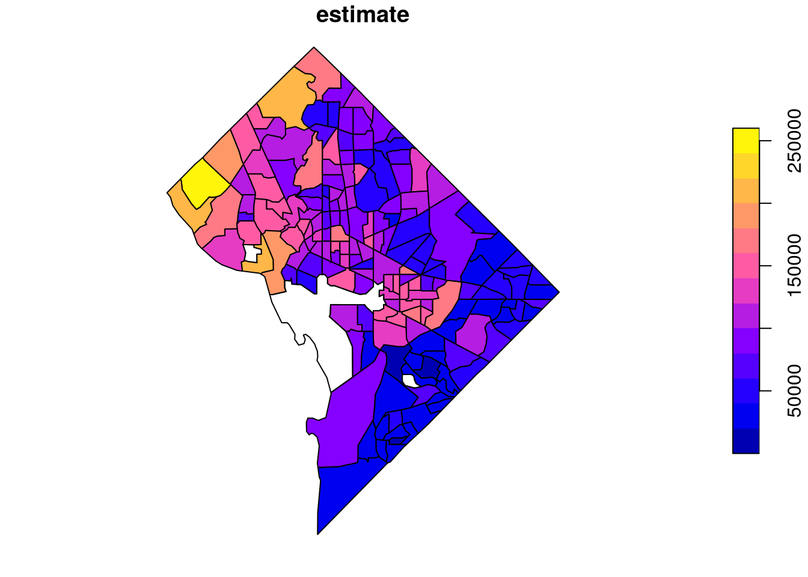
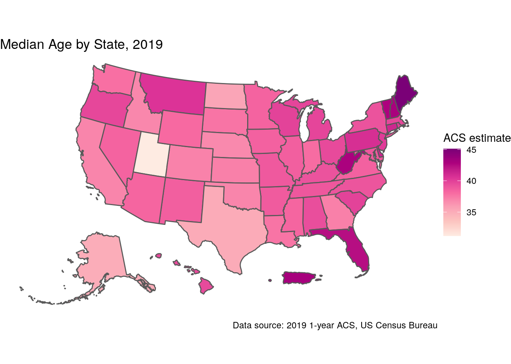
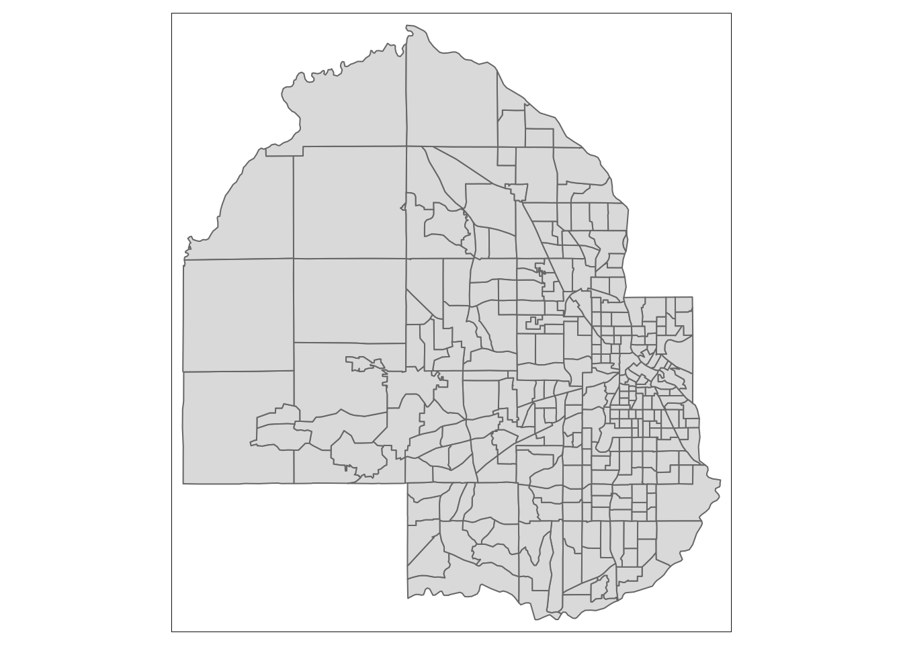
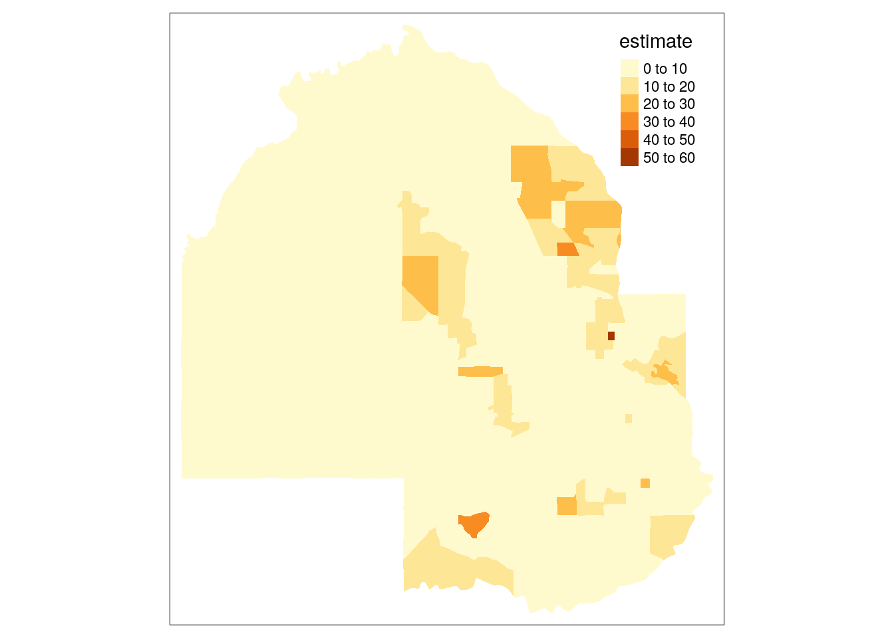
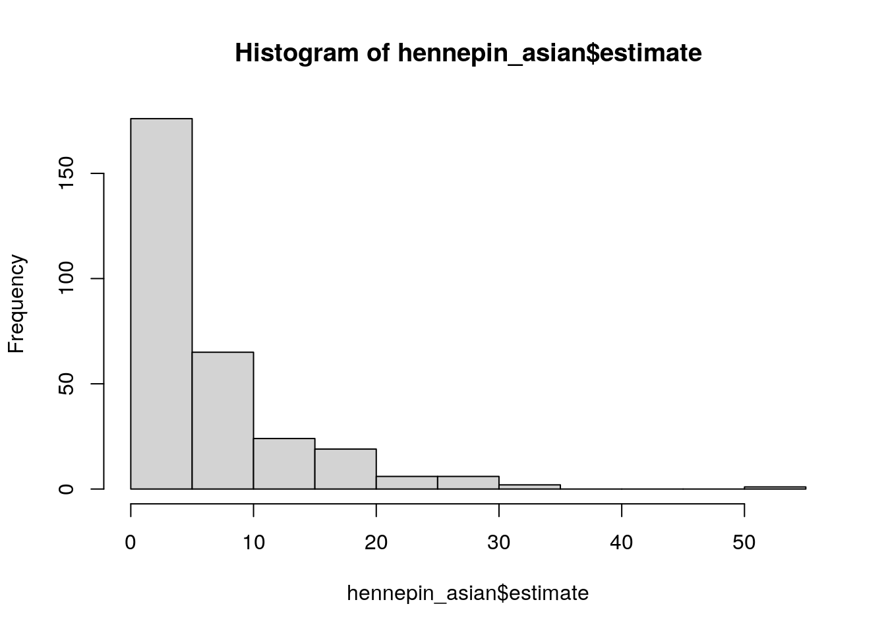
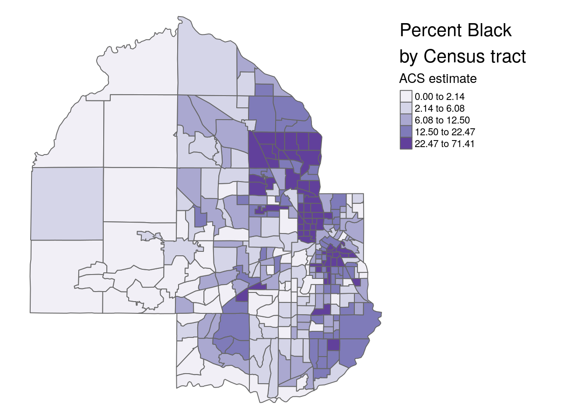
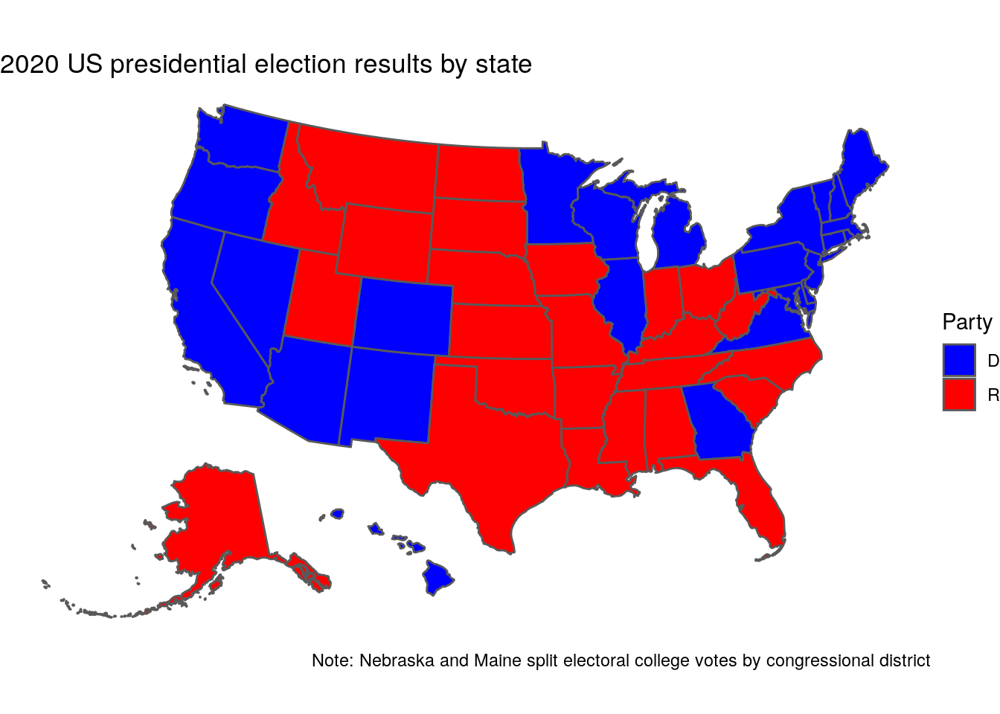
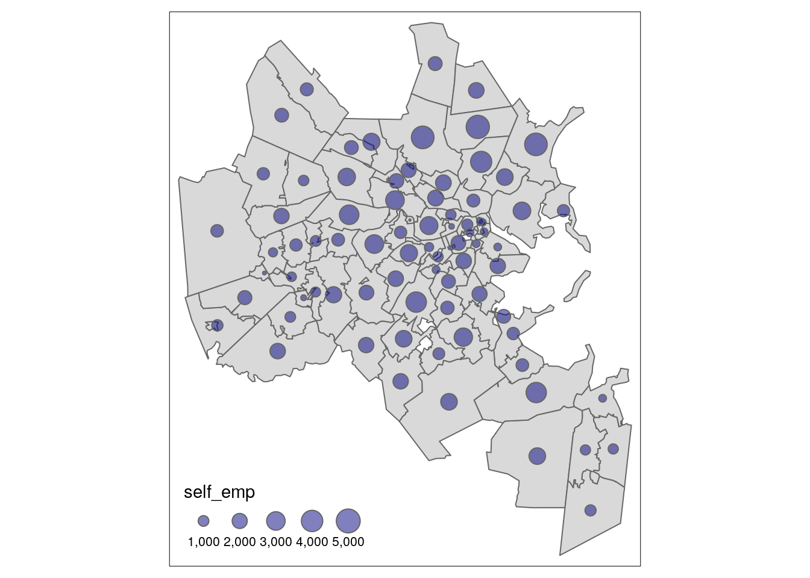

# Mapping Census data with R


Data from the United States Census Bureau are commonly visualized using maps, given that Census and ACS data are aggregated to enumeration units. This chapter will cover the process of map-making using the tidycensus R package. Notably, tidycensus enables R users to download *simple feature geometry* for common geographies, linking demographic information with their geographic locations in a dataset. In turn, this data model facilitates the creation of both static and interactive demographic maps.

In this chapter, readers will learn how to use the `geometry` parameter in tidycensus functions to download geographic data along with demographic data from the US Census Bureau. The chapter will then cover how to make static maps of Census demographic data using the popular ggplot2 and tmap visualization packages. The closing parts of the chapter will then turn to interactive mapping, with a focus on the mapview and Leaflet R packages for interactive cartographic visualization.

## Using geometry in tidycensus

As covered in the previous chapter, Census geographies are available from the tigris R package as simple features objects, using the data model from the sf R package. tidycensus wraps several common geographic data functions in the tigris package to allow R users to return simple feature geometry pre-linked to downloaded demographic data with a single function call. The key argument to accomplish this is `geometry = TRUE`, which is available in the core data download functions in tidycensus, `get_acs()`, `get_decennial()`, and `get_estimates()`.

The following example illustrates the use of the `geometry = TRUE` argument, fetching information on median household income for Census tracts in the District of Columbia. As discussed in the previous chapter, the option `tigris_use_cache = TRUE` is used to cache the downloaded geographic data on the user's computer.


```r
library(tidycensus)
options(tigris_use_cache = TRUE)

dc_income <- get_acs(geography = "tract", 
                     variables = c(hhincome = "B19013_001"), 
                     state = "DC", 
                     geometry = TRUE)

dc_income
```

```
## Simple feature collection with 179 features and 5 fields
## Geometry type: POLYGON
## Dimension:     XY
## Bounding box:  xmin: -77.11976 ymin: 38.79164 xmax: -76.9094 ymax: 38.99511
## Geodetic CRS:  NAD83
## First 10 features:
##          GEOID                                                           NAME
## 1  11001009509 Census Tract 95.09, District of Columbia, District of Columbia
## 2  11001010100   Census Tract 101, District of Columbia, District of Columbia
## 3  11001008301 Census Tract 83.01, District of Columbia, District of Columbia
## 4  11001002101 Census Tract 21.01, District of Columbia, District of Columbia
## 5  11001004100    Census Tract 41, District of Columbia, District of Columbia
## 6  11001008001 Census Tract 80.01, District of Columbia, District of Columbia
## 7  11001002900    Census Tract 29, District of Columbia, District of Columbia
## 8  11001005600    Census Tract 56, District of Columbia, District of Columbia
## 9  11001007605 Census Tract 76.05, District of Columbia, District of Columbia
## 10 11001005900    Census Tract 59, District of Columbia, District of Columbia
##    variable estimate   moe                       geometry
## 1  hhincome    75515 19621 POLYGON ((-77.00201 38.9510...
## 2  hhincome    94861 16089 POLYGON ((-77.03653 38.9056...
## 3  hhincome   138487 30838 POLYGON ((-77.00352 38.9000...
## 4  hhincome    67984 11327 POLYGON ((-77.02803 38.9610...
## 5  hhincome   156625 27218 POLYGON ((-77.05832 38.9177...
## 6  hhincome   154423 28910 POLYGON ((-76.99025 38.8973...
## 7  hhincome   116875 20769 POLYGON ((-77.03273 38.9341...
## 8  hhincome    79357 16304 POLYGON ((-77.05779 38.9025...
## 9  hhincome    38659  7543 POLYGON ((-76.98436 38.8666...
## 10 hhincome    98750 21107 POLYGON ((-77.01901 38.8946...
```

As shown in the example call, the structure of the object returned by tidycensus resembles the object we've become familiar with to this point in the book. For example, median household income data are found in the `estimate` column with associated margins of error in the `moe` column, along with a variable ID, GEOID, and Census tract name. However, there are some notable differences. The `geometry` column contains polygon feature geometry for each Census tract, allowing for a linking of the estimates and margins of error with their corresponding locations in Washington, DC. Beyond that, the object is associated with coordinate system information - using the NAD 1983 geographic coordinate system in which Census geographic datasets are stored by default.

Such geographic information is very difficult to parse, however, without visualization. As the returned object is a simple features spatial object as represented by the **sf** package, it can be plotted using sf's `plot()` function. Key here is specifying the name of the column to be plotted - `"estimate"` in this case - inside of brackets.


```r
plot(dc_income["estimate"])
```



The `plot()` function returns a simple map showing income variation in Washington, DC. Wealthier areas, as represented with warmer colors, tend to be located in the northwestern part of the District. `NA` values are represented on the map in white. If desired, the map can be modified further with base plotting functions.

The remainder of this chapter, however, will focus on map-making with additional data visualization packages in R. This includes the popular **ggplot2** package for visualization, which supports direct visualization of simple features objects; the **tmap** package for thematic mapping, and the **leaflet** package for interactive map-making which calls the Leaflet JavaScript framework directly from R.

## Map-making with ggplot2 and geom_sf

**ggplot2** version 3.0 (released in 2018) included support for mapping simple features objects directly for the first time with the `geom_sf()` function. `geom_sf()` reads in the simple feature geometry - whether point, line, or polygon - and interprets it accordingly to make a map. As illustrated in Chapter 5, `geom_sf()` can be used for quick plotting of sf objects using familiar ggplot2 syntax. Beyond this, ggplot2 users can supply an aesthetic mapping, as with other chart types, to generate maps.

One of the most common ways to visualize statistical information on a map is with *choropleth mapping*. Choropleth maps use shading to represent how underlying data values vary by feature in a spatial dataset. The income plot of Washington, DC shown earlier in this chapter is an example of a choropleth map.

In the example below, tidycensus is used to obtain linked ACS and spatial data on median age by state for the 50 US states plus the District of Columbia and Puerto Rico. For national maps, it is often preferable to generate insets of Alaska, Hawaii, and Puerto Rico so that they can all be viewed comparatively with the continental United States. We'll use the `shift_geometry()` function in **tigris** to shift and rescale these areas for national mapping.


```r
library(tidycensus)
library(tidyverse)
library(tigris)

us_median_age <- get_acs(geography = "state",
                         variables = "B01002_001",
                         year = 2019,
                         survey = "acs1",
                         geometry = TRUE,
                         resolution = "20m") %>%
  shift_geometry()

plot(us_median_age$geometry)
```


The state polygons can be styled using ggplot2 conventions and the `geom_sf()` function. With two lines of ggplot2 code, a basic map of median age by state can be created with ggplot2 defaults.


```r
m1 <- ggplot(data = us_median_age, aes(fill = estimate)) + 
  geom_sf()

m1
```


The `geom_sf()` function in the above example interprets the geometry of the sf object (in this case, polygon) and visualizes the result as a filled *choropleth* map. A choropleth map is a type of map that displays statistical variation as color differences along a gradient. In this case, the ACS estimate of median age is mapped to the default blue dark-to-light color ramp in ggplot2, highlighting the youngest states (such as Utah) with darker blues and the oldest states (such as Maine) with lighter blues.

In many cases, map-makers using ggplot2 will want to customize this graphic further. For example, a designer may want to modify the color palette and reverse it so that darker colors represent older areas. The map would also benefit from some additional information describing its content and data sources. These modifications can be specified in the same way a user would update a regular ggplot2 graphic. The `scale_fill_distiller()` function allows users to specify a [ColorBrewer](https://colorbrewer2.org/#type=sequential&scheme=BuGn&n=3) palette to use for the map, which includes a wide range of sequential, diverging, and qualitative color palettes. The `labs()` function can then be used to add a title, caption, and better legend label to the plot. Finally, ggplot2 cartographers will often want to use the `theme_void()` function to remove the background and gridlines from the map.


```r
m1 + 
  scale_fill_distiller(palette = "RdPu", 
                       direction = 1) + 
  labs(title = "Median Age by State, 2019",
       caption = "Data source: 2019 1-year ACS, US Census Bureau",
       fill = "ACS estimate") + 
  theme_void()
```



\BeginKnitrBlock{rmdtip}<div class="rmdtip">Info here about color palettes
</div>\EndKnitrBlock{rmdtip}


## Map-making with tmap

For ggplot2 users, `geom_sf()` offers a familiar interface for mapping data obtained from the US Census Bureau. However, ggplot2 is far from the only option for cartographic visualization in R. The {tmap} package is an excellent alternative for mapping in R that includes a wide range of functionality for custom cartography.

To get started, let's grab some ACS data on race and ethnicity from the American Community Survey's Data Profile. We'll be looking at data on percentage non-Hispanic white, non-Hispanic Black, Asian, and Hispanic populations for Census tracts in Hennepin County, Minnesota.


```r
hennepin_race <- get_acs(
  geography = "tract",
  variables = c(
    hispanic = "DP05_0071P",
    white = "DP05_0077P",
    black = "DP05_0078P",
    native = "DP05_0079P",
    asian = "DP05_0080P"
  ),
  state = "MN",
  county = "Hennepin",
  geometry = TRUE
)

hennepin_race
```

```
## Simple feature collection with 1495 features and 5 fields
## Geometry type: MULTIPOLYGON
## Dimension:     XY
## Bounding box:  xmin: -93.7678 ymin: 44.78538 xmax: -93.1772 ymax: 45.24662
## Geodetic CRS:  NAD83
## First 10 features:
##          GEOID                                            NAME variable
## 1  27053103900   Census Tract 1039, Hennepin County, Minnesota hispanic
## 2  27053103900   Census Tract 1039, Hennepin County, Minnesota    white
## 3  27053103900   Census Tract 1039, Hennepin County, Minnesota    black
## 4  27053103900   Census Tract 1039, Hennepin County, Minnesota   native
## 5  27053103900   Census Tract 1039, Hennepin County, Minnesota    asian
## 6  27053021602 Census Tract 216.02, Hennepin County, Minnesota hispanic
## 7  27053021602 Census Tract 216.02, Hennepin County, Minnesota    white
## 8  27053021602 Census Tract 216.02, Hennepin County, Minnesota    black
## 9  27053021602 Census Tract 216.02, Hennepin County, Minnesota   native
## 10 27053021602 Census Tract 216.02, Hennepin County, Minnesota    asian
##    estimate moe                       geometry
## 1       5.1 1.7 MULTIPOLYGON (((-93.23693 4...
## 2      69.7 7.1 MULTIPOLYGON (((-93.23693 4...
## 3       8.8 6.4 MULTIPOLYGON (((-93.23693 4...
## 4       0.2 0.4 MULTIPOLYGON (((-93.23693 4...
## 5      11.9 3.7 MULTIPOLYGON (((-93.23693 4...
## 6       4.3 3.0 MULTIPOLYGON (((-93.38036 4...
## 7      86.1 5.7 MULTIPOLYGON (((-93.38036 4...
## 8       3.0 4.8 MULTIPOLYGON (((-93.38036 4...
## 9       1.3 1.5 MULTIPOLYGON (((-93.38036 4...
## 10      0.4 0.5 MULTIPOLYGON (((-93.38036 4...
```

We've returned ACS data in tidycensus's regular "tidy" or long format, which will be useful in a moment for comparative map-making. To get started, we'll extract a single group from the dataset to illustrate how tmap works.

tmap's map-making syntax will be somewhat familiar to users of ggplot2, as it uses the concept of *layers* to specify modifications to the map. The map object is initialized with `tm_shape()`, which then allows us to view the Census tracts with `tm_polygons()`.


```r
library(tmap)

hennepin_asian <- filter(hennepin_race, variable == "asian")

tm_shape(hennepin_asian) + 
  tm_polygons() 
```



We get a default view of Census tracts in Hennepin County, Minnesota. Alternatively, the `tm_fill()` function can be used to produce choropleth maps, as illustrated in the ggplot2 examples above.


```r
tm_shape(hennepin_asian) + 
  tm_fill(col = "estimate")
```



You'll notice that tmap uses a classed color scheme rather than the continuous palette used by ggplot2, by default. This involves the identification of "classes" in the distribution of data values and mapping a color from a color palette to data values that belong to each class. The default classification scheme used by `tm_fill()` is `"pretty"`, which identifies clean-looking intervals in the data based on the data range. In this example, data classes change every 10 percent. However, this doesn't quite work for our data given the distribution of data values. Let's take a look at our data distribution to understand why:


```r
hist(hennepin_asian$estimate)
```



As the histogram illustrates, most Census tracts in Hennepin County have Asian populations below 10 percent. In turn, this makes it difficult to see meaningful variation on our map as most tracts fall into one class. The `style` argument in `tm_fill()` supports a number of other methods for classification, including quantile breaks (`"quantile"`), equal intervals (`"equal"`), and Jenks natural breaks (`"jenks"`). Let's switch to quantiles below, where each class will contain the same number of Census tracts. We can also change the color palette and add some contextual text as we did with ggplot2.


```r
tm_shape(hennepin_asian, 
         projection = sf::st_crs(26915)) + 
  tm_fill(col = "estimate",
          style = "quantile",
          n = 5,
          palette = "Greens",
          title = "ACS estimate") + 
  tm_layout(title = "Percent Asian population\nby Census tract",
            frame = FALSE,
            legend.outside = TRUE)
```



\BeginKnitrBlock{rmdtip}<div class="rmdtip">Info here about classification choices
</div>\EndKnitrBlock{rmdtip}


```r
tm_shape(hennepin_race,
         projection = sf::st_crs(26915)) + 
  tm_facets(by = "variable") + 
  tm_fill(col = "estimate",
          style = "quantile",
          n = 7,
          palette = "Purples")
```


Here - show how to make a dot-density map with tm_dots


```r
hennepin_race2 <- get_acs(
  geography = "tract",
  variables = c(
    hispanic = "DP05_0071",
    white = "DP05_0077",
    black = "DP05_0078",
    native = "DP05_0079",
    asian = "DP05_0080"
  ),
  state = "MN",
  county = "Hennepin",
  geometry = TRUE
)
```


```r
groups <- unique(hennepin_race2$variable)

hennepin_dots <- map(groups, ~{
  group_sf <- filter(hennepin_race2, variable == .x)
  
  dots <- group_sf %>%
    st_transform(26915) %>%
    mutate(est50 = as.integer(estimate / 50)) %>%
    st_sample(size = .$est50, exact = TRUE) %>%
    st_sf() %>%
    mutate(group = .x)
  
  dots
  
}) %>%
  bind_rows() %>%
  slice_sample(prop = 1)
```


```r
tm_shape(hennepin_dots) +
  tm_dots(col = "group", palette = "Set1",
          size = 0.005)
```

## Cartographic workflows with non-Census data

In many instances, an analyst may possess data that is available at a Census geography but is not available through the ACS or decennial Census. This means that the `geometry = TRUE` functionality in tidycensus, which automatically enriches data with geographic information, is not possible. In these cases, Census shapes obtained with tigris can be joined to tabular data and then visualized.

### National election mapping with tigris shapes


```r
library(tidyverse)
library(tigris)

# Data source: https://cookpolitical.com/2020-national-popular-vote-tracker
vote2020 <- read_csv("data/us_vote_2020.csv")

glimpse(vote2020)
```

```
## Rows: 61
## Columns: 22
## $ state              <chr> "U.S. Total", "15 Key Battlegrounds", "Non-Battlegr…
## $ called             <chr> "D", NA, NA, NA, "D", "R", "D", "R", "R", "D", "D",…
## $ final              <chr> "Yes", NA, NA, NA, "Yes", "Yes", "Yes", "Yes", "Yes…
## $ dem_votes          <dbl> 81282916, 31908248, 49374668, NA, 1672143, 5297045,…
## $ rep_votes          <dbl> 74223369, 33002287, 41221082, NA, 1661686, 5668731,…
## $ other_votes        <dbl> 2891441, 950354, 1941087, NA, 53497, 101680, 62229,…
## $ dem_percent        <chr> "51.3%", "48.4%", "53.4%", NA, "49.4%", "47.9%", "4…
## $ rep_percent        <chr> "46.9%", "50.1%", "44.5%", NA, "49.1%", "51.2%", "4…
## $ other_percent      <chr> "1.8%", "1.4%", "2.1%", NA, "1.6%", "0.9%", "1.2%",…
## $ dem_this_margin    <chr> "4.5%", "-1.7%", "8.8%", NA, "0.3%", "-3.4%", "0.2%…
## $ margin_shift       <chr> "2.4%", "2.0%", "2.7%", NA, "3.9%", "-2.2%", "5.4%"…
## $ vote_change        <chr> "15.9%", "17.2%", "15.1%", NA, "31.6%", "17.5%", "2…
## $ stateid            <chr> NA, NA, NA, NA, "AZ", "FL", "GA", "IA", "ME2", "MI"…
## $ EV                 <dbl> NA, NA, NA, NA, 11, 29, 16, 6, 1, 16, 10, 1, 6, 4, …
## $ X                  <dbl> NA, NA, NA, NA, 2, 8, 7, 5, 12, 7, 5, 12, 2, 11, 7,…
## $ Y                  <dbl> NA, NA, NA, NA, 2, 0, 1, 4, 8, 5, 5, 6, 4, 6, 2, 4,…
## $ State_num          <dbl> NA, NA, NA, NA, 4, 12, 13, 19, 102, 26, 27, 104, 32…
## $ Center_X           <dbl> NA, NA, NA, NA, 205, 787, 734, 536, 919, 681, 519, …
## $ Center_Y           <dbl> NA, NA, NA, NA, 374, 520, 419, 223, 92, 190, 120, 2…
## $ X20                <lgl> NA, NA, NA, NA, NA, NA, NA, NA, NA, NA, NA, NA, NA,…
## $ `2016 Margin`      <dbl> 0.020994559, -0.036219533, 0.060978439, NA, -0.0354…
## $ `Total 2016 Votes` <dbl> 136639848, 56209173, 80430331, NA, 2573165, 9420039…
```

Get the geometries and merge:


```r
us_states <- states(cb = TRUE, resolution = "20m") %>%
  shift_geometry()

us_states_merged <- us_states %>%
  inner_join(vote2020, by = c("NAME" = "state"))

table(is.na(us_states_merged$NAME))
```

```
## 
## FALSE 
##    51
```


```r
ggplot(us_states_merged, aes(fill = called)) + 
  geom_sf() + 
  scale_fill_manual(values = c("blue", "red")) + 
  theme_void() + 
  labs(fill = "Party",
       title = "2020 US presidential election results by state",
       caption = "Note: Nebraska and Maine split electoral college votes by congressional district")
```



### Understanding and working with ZCTAs

For example, the most granular geography at which many agencies release data is at the zip code level. This is not an ideal geography for visualization, given that zip codes represent collections of US Postal Service routes (or sometimes even a single building, or Post Office box) that are not guaranteed to form coherent geographies. The US Census Bureau allows for an approximation of zip code mapping with Zip Code Tabulation Areas, or ZCTAs. ZCTAs are shapes built from Census blocks in which the most common zip code for addresses in each block determines how blocks are allocated to corresponding ZCTAs. While ZCTAs are not recommended for spatial analysis due to these irregularities, they are effective for visualizing data distributions when no other granular geographies are available.

An example of this is the [Internal Revenue Service's Statistics of Income (SOI) data](https://www.irs.gov/statistics/soi-tax-stats-individual-income-tax-statistics-2018-zip-code-data-soi), which includes a wide range of indicators derived from tax returns. The most detailed geography available is the zip code level in this dataset, meaning that within-county visualizations require using ZCTAs. Let's read in and take a quick look at the data:


```r
irs_data <- read_csv("https://www.irs.gov/pub/irs-soi/18zpallnoagi.csv")

irs_data
```

```
## # A tibble: 27,658 x 153
##    STATEFIPS STATE ZIPCODE AGI_STUB      N1  MARS1  MARS2  MARS4     ELF CPREP
##    <chr>     <chr> <chr>      <dbl>   <dbl>  <dbl>  <dbl>  <dbl>   <dbl> <dbl>
##  1 01        AL    00000          0 2036290 853350 746450 393790 1851240 93480
##  2 01        AL    35004          0    5200   2150   2100    820    4730   260
##  3 01        AL    35005          0    3190   1410    840    890    2880   160
##  4 01        AL    35006          0    1240    490    590    140    1120    40
##  5 01        AL    35007          0   12050   4840   5180   1740   10580   840
##  6 01        AL    35010          0    7840   3010   2700   2000    7290   290
##  7 01        AL    35014          0    1600    620    490    450    1460    80
##  8 01        AL    35016          0    7210   2880   3280    880    6690   300
##  9 01        AL    35019          0     890    320    450    110     840    20
## 10 01        AL    35020          0    8950   3880   1020   3850    7950   540
## # … with 27,648 more rows, and 143 more variables: PREP <dbl>, DIR_DEP <dbl>,
## #   N2 <dbl>, NUMDEP <dbl>, TOTAL_VITA <dbl>, VITA <dbl>, TCE <dbl>,
## #   VITA_EIC <dbl>, RAC <dbl>, ELDERLY <dbl>, A00100 <dbl>, N02650 <dbl>,
## #   A02650 <dbl>, N00200 <dbl>, A00200 <dbl>, N00300 <dbl>, A00300 <dbl>,
## #   N00600 <dbl>, A00600 <dbl>, N00650 <dbl>, A00650 <dbl>, N00700 <dbl>,
## #   A00700 <dbl>, N00900 <dbl>, A00900 <dbl>, N01000 <dbl>, A01000 <dbl>,
## #   N01750 <dbl>, A01750 <dbl>, SCHF <dbl>, N02300 <dbl>, A02300 <dbl>,
## #   N02500 <dbl>, A02500 <dbl>, N26270 <dbl>, A26270 <dbl>, N02900 <dbl>,
## #   A02900 <dbl>, N03220 <dbl>, A03220 <dbl>, N03300 <dbl>, A03300 <dbl>,
## #   N03270 <dbl>, A03270 <dbl>, N03150 <dbl>, A03150 <dbl>, N03210 <dbl>,
## #   A03210 <dbl>, N04450 <dbl>, A04450 <dbl>, N04100 <dbl>, A04100 <dbl>,
## #   N04200 <dbl>, A04200 <dbl>, N04470 <dbl>, A04470 <dbl>, A00101 <dbl>,
## #   N17000 <dbl>, A17000 <dbl>, N18425 <dbl>, A18425 <dbl>, N18450 <dbl>,
## #   A18450 <dbl>, N18500 <dbl>, A18500 <dbl>, N18800 <dbl>, A18800 <dbl>,
## #   N18460 <dbl>, A18460 <dbl>, N18300 <dbl>, A18300 <dbl>, N19300 <dbl>,
## #   A19300 <dbl>, N19500 <dbl>, A19500 <dbl>, N19530 <dbl>, A19530 <dbl>,
## #   N19570 <dbl>, A19570 <dbl>, N19700 <dbl>, A19700 <dbl>, N20950 <dbl>,
## #   A20950 <dbl>, N04475 <dbl>, A04475 <dbl>, N04800 <dbl>, A04800 <dbl>,
## #   N05800 <dbl>, A05800 <dbl>, N09600 <dbl>, A09600 <dbl>, N05780 <dbl>,
## #   A05780 <dbl>, N07100 <dbl>, A07100 <dbl>, N07300 <dbl>, A07300 <dbl>,
## #   N07180 <dbl>, A07180 <dbl>, N07230 <dbl>, …
```

The dataset contains 153 columns [which are identified in the linked codebook](https://www.irs.gov/pub/irs-soi/18zpdoc.docx). Geographies are identified by the `ZIPCODE` column, which shows aggregated data by state (`ZIPCODE == "000000"`) and by zip code. We might be interested in understanding the geography of self-employment income within a given region. We'll retain the variables `N09400`, which represents the number of tax returns with self-employment tax, and `N1`, which represents the total number of returns.


```r
self_employment <- irs_data %>%
  select(ZIPCODE, self_emp = N09400, total = N1)
```

From here, we'll need to identify a region of zip codes for analysis. In tigris, the `zctas()` function allows us to fetch a Zip Code Tabulation Areas shapefile. Given that some ZCTA geography is irregular and sometimes stretches across multiple states, a shapefile for the entire United States must first be downloaded. It is recommended that shapefile caching with `options(tigris_use_cache = TRUE)` be used with ZCTAs to avoid long data download times.

In the next chapter, you'll learn how to use spatial overlay to extract geographic data within a specific region. That said, the `starts_with` parameter in `zctas()` allows users to filter down ZCTAs based on a vector of prefixes, which can identify an area without using a spatial process. For example, we can get ZCTA data near Boston, MA by using the appropriate prefixes, then use `mapview()` to check and see what we got back:


```r
library(mapview)
library(tigris)
options(tigris_use_cache = TRUE)

boston_zctas <- zctas(cb = TRUE, 
                      starts_with = c("021", "022", "024"),
                      year = 2018)
```

The ZCTA prefixes `021`, `022`, and `024` cover much of the Boston metropolitan area; "holes" in the region represent areas like Boston Common which are not covered by ZCTAs. Let's take a quick look at its attributes:


```r
glimpse(boston_zctas)
```

```
## Rows: 82
## Columns: 6
## $ ZCTA5CE10  <chr> "02461", "02141", "02139", "02180", "02457", "02111", "0213…
## $ AFFGEOID10 <chr> "8600000US02461", "8600000US02141", "8600000US02139", "8600…
## $ GEOID10    <chr> "02461", "02141", "02139", "02180", "02457", "02111", "0213…
## $ ALAND10    <dbl> 3768931, 1667393, 4034615, 15578795, 413238, 700224, 118088…
## $ AWATER10   <dbl> 41434, 26516, 347794, 1632658, 0, 43757, 224619, 58332, 242…
## $ geometry   <MULTIPOLYGON [°]> MULTIPOLYGON (((-71.22275 4..., MULTIPOLYGON (…
```

Either the `ZCTA4CE10` column or the `GEOID10` column can be matched to the appropriate zip code information in the IRS dataset for visualization. This is computed with the `left_join()` function from dplyr. Given that the ZCTA dataset is returned as a simple features object, the sf package includes a variety of methods to allow for processing of spatial datasets using tidyverse functions.

The code below joins the IRS data to the spatial dataset and computes a new column representing the percentage of returns with self-employment income. Note the `by` argument in `left_join()` that specifies the columns to be used on the left and right hand sides of the join.


```r
boston_se_data <- boston_zctas %>%
  left_join(self_employment, by = c("GEOID10" = "ZIPCODE")) %>%
  mutate(pct_self_emp = 100 * (self_emp / total))

glimpse(boston_se_data)
```

```
## Rows: 82
## Columns: 9
## $ ZCTA5CE10    <chr> "02461", "02141", "02139", "02180", "02457", "02111", "02…
## $ AFFGEOID10   <chr> "8600000US02461", "8600000US02141", "8600000US02139", "86…
## $ GEOID10      <chr> "02461", "02141", "02139", "02180", "02457", "02111", "02…
## $ ALAND10      <dbl> 3768931, 1667393, 4034615, 15578795, 413238, 700224, 1180…
## $ AWATER10     <dbl> 41434, 26516, 347794, 1632658, 0, 43757, 224619, 58332, 2…
## $ self_emp     <dbl> 860, 930, 2820, 1680, NA, 510, 2040, 120, 490, 690, 1640,…
## $ total        <dbl> 3560, 7810, 19330, 12490, NA, 3880, 14350, 690, 2450, 675…
## $ geometry     <MULTIPOLYGON [°]> MULTIPOLYGON (((-71.22275 4..., MULTIPOLYGON…
## $ pct_self_emp <dbl> 24.157303, 11.907810, 14.588722, 13.450761, NA, 13.144330…
```

There are a variety of ways to visualize this information. One such method is a choropleth map, which you've learned about earlier this chapter:


```r
tm_shape(boston_se_data, projection = 26918) + 
  tm_fill(col = "pct_self_emp", palette = "Purples")
```


The choropleth map shows that self-employment filings are more common in suburban Boston ZCTAs than nearer to the urban core, generally speaking. However, we might also be interested in understanding where most self-employment income filings are located rather than their share relative to the total number of returns filed. This requires visualizing the `self_emp` column directly. Choropleth maps are generally inappropriate for visualizing this type of information, as the raw counts are heavily influenced by the denominator.


```r
tm_shape(boston_se_data) + 
  tm_polygons() + 
  tm_bubbles(size = "self_emp", alpha = 0.5, 
             col = "navy")
```



## Interactive mapping

### Interactive mapping with Leaflet

In Chapter 5, you learned how to quickly visualize geographic data obtained with tigris on an interactive map by using the `mapview()` function in the mapview package.


```r
dallas_bachelors <- get_acs(
  geography = "tract",
  variables = "DP02_0068P",
  year = 2019,
  state = "TX",
  county = "Dallas",
  geometry = TRUE
)
```

Mapview version:

``` {.r}
library(mapview)
mapview(dallas_bachelors, zcol = "estimate")
```

Interactive viewing with tmap:

``` {.r}
library(tmap)
tmap_mode("view")

tm_shape(dallas_bachelors) + 
  tm_fill(col = "estimate", palette = "magma",
          alpha = 0.5)
```

Leaflet version:


```r
library(leaflet)

pal <- colorNumeric(
  palette = "magma",
  domain = dallas_bachelors$estimate
)

pal(c(10, 20, 30, 40, 50))
```

Make the map:


```r
leaflet() %>%
  addProviderTiles(providers$Stamen.TonerLite) %>%
  addPolygons(data = dallas_bachelors,
              color = ~pal(estimate),
              weight = 0.5,
              smoothFactor = 0.2,
              fillOpacity = 0.5,
              label = ~estimate) %>%
  addLegend(
    position = "bottomright",
    pal = pal,
    values = dallas_bachelors$estimate,
    title = "% with bachelor's<br/>degree"
  )
```

### Alternative approaches to interactive mapping


```r
us_value <- get_acs(
  geography = "state",
  variables = "B25077_001",
  year = 2019,
  survey = "acs1",
  geometry = TRUE,
  resolution = "20m"
)
```

Trying the same Leaflet approach:


```r
library(leaflet)

us_pal <- colorNumeric(
  palette = "plasma",
  domain = us_value$estimate
)

leaflet() %>%
  addProviderTiles(providers$Stamen.TonerLite) %>%
  addPolygons(data = us_value,
              color = ~us_pal(estimate),
              weight = 0.5,
              smoothFactor = 0.2,
              fillOpacity = 0.5,
              label = ~estimate) %>%
  addLegend(
    position = "bottomright",
    pal = us_pal,
    values = us_value$estimate,
    title = "Median home value"
  )
```


```r
library(ggiraph)
library(tidyverse)

us_value_shifted <- us_value %>%
  shift_geometry(position = "outside") %>%
  mutate(tooltip = paste(NAME, estimate, sep = ": "))

gg <- ggplot(us_value_shifted, aes(fill = estimate)) + 
  geom_sf_interactive(aes(tooltip = tooltip, data_id = NAME), 
                      size = 0.4) + 
  scale_fill_viridis_c(option = "plasma") + 
  labs(title = "Median housing value by State, 2019",
       caption = "Data source: 2019 1-year ACS, US Census Bureau",
       fill = "ACS estimate") + 
  theme_void() 
  
girafe(ggobj = gg) %>%
  girafe_options(opts_hover(css = "fill:cyan;"))
```

```{=html}
<div id="htmlwidget-306f25dcc3a970ad81b7" style="width:672px;height:480px;" class="girafe html-widget"></div>
<script type="application/json" data-for="htmlwidget-306f25dcc3a970ad81b7">{"x":{"html":"<?xml version=\"1.0\" encoding=\"UTF-8\"?>\n<svg xmlns='http://www.w3.org/2000/svg' xmlns:xlink='http://www.w3.org/1999/xlink' id='svg_807dc224-2fb0-4b50-a1ba-b7f89ec723e3' viewBox='0 0 432.00 360.00'>\n  <g>\n    <defs>\n      <clipPath id='svg_807dc224-2fb0-4b50-a1ba-b7f89ec723e3_cl_1'>\n        <rect x='0.00' y='0.00' width='432.00' height='360.00'/>\n      <\/clipPath>\n    <\/defs>\n    <rect x='0.00' y='0.00' width='432.00' height='360.00' id='svg_807dc224-2fb0-4b50-a1ba-b7f89ec723e3_el_1' clip-path='url(#svg_807dc224-2fb0-4b50-a1ba-b7f89ec723e3_cl_1)' fill='#FFFFFF' fill-opacity='1' stroke='#FFFFFF' stroke-opacity='1' stroke-width='0.75' stroke-linejoin='round' stroke-linecap='round'/>\n    <defs>\n      <clipPath id='svg_807dc224-2fb0-4b50-a1ba-b7f89ec723e3_cl_2'>\n        <rect x='0.00' y='0.00' width='432.00' height='360.00'/>\n      <\/clipPath>\n    <\/defs>\n    <defs>\n      <clipPath id='svg_807dc224-2fb0-4b50-a1ba-b7f89ec723e3_cl_3'>\n        <rect x='0.00' y='64.92' width='352.43' height='234.28'/>\n      <\/clipPath>\n    <\/defs>\n    <path d='M 251.441297 238.493338 L 251.423403 238.267866 L 251.442685 237.574448 L 251.470351 236.564309 L 251.473881 236.434066 L 251.480654 236.095496 L 251.511155 234.536641 L 251.525881 233.762867 L 251.549226 232.505483 L 251.555782 232.145174 L 251.575729 231.028322 L 251.587666 230.424675 L 251.615147 229.001025 L 251.633056 228.045934 L 251.640071 227.778355 L 251.686802 225.959867 L 251.690658 225.796270 L 251.722223 224.435340 L 251.740900 223.611138 L 251.756256 222.922272 L 251.761504 222.684451 L 251.802465 221.118727 L 251.523456 220.966884 L 251.276838 220.562638 L 251.257482 220.492379 L 252.203659 220.425670 L 252.274072 220.419890 L 252.893721 220.368541 L 253.951026 220.287553 L 254.039256 220.280981 L 255.819953 220.144561 L 255.854303 220.141859 L 255.881930 220.139871 L 257.628005 220.010701 L 257.873415 219.991991 L 257.873508 219.991983 L 259.343472 219.853668 L 260.036412 219.781136 L 260.071218 219.777463 L 262.153524 219.583105 L 263.357772 219.466188 L 263.442442 219.808565 L 263.540172 220.168242 L 263.709607 220.790913 L 263.915711 221.502008 L 263.973072 221.699639 L 264.078937 222.064071 L 264.159822 222.342236 L 264.371125 223.078894 L 264.464106 223.402529 L 264.725063 224.309139 L 264.793043 224.558727 L 264.972376 225.216285 L 265.069961 225.567845 L 265.279325 226.320880 L 265.459285 226.967331 L 265.652842 227.661261 L 265.726410 227.926022 L 265.812101 228.234160 L 266.280275 229.912786 L 266.314030 230.033494 L 266.690148 231.370715 L 266.704117 231.420276 L 266.838699 231.605793 L 267.062015 232.015339 L 267.125108 232.130915 L 267.295885 232.531565 L 267.388464 232.810147 L 267.434736 232.949290 L 267.774635 233.253576 L 267.812360 233.328693 L 267.820856 233.345606 L 267.997674 233.697338 L 267.995467 234.067436 L 267.994907 234.159394 L 267.894248 234.324745 L 268.166448 234.471360 L 268.501847 234.678480 L 268.388548 234.880410 L 268.347456 234.953587 L 268.044431 235.183671 L 267.783604 235.500287 L 267.872065 235.771765 L 267.867737 235.917855 L 267.855539 236.327032 L 267.851269 236.469416 L 267.676941 236.918037 L 267.578118 237.242629 L 267.678098 237.572624 L 267.707455 237.669457 L 267.758869 237.838976 L 267.751675 238.058023 L 268.127254 238.447314 L 268.160887 238.729260 L 268.256169 238.869606 L 268.225238 239.018695 L 268.162211 239.321999 L 268.213912 239.530230 L 268.130324 239.936070 L 268.179636 240.168904 L 268.183811 240.243620 L 268.188184 240.321907 L 268.122489 240.540211 L 268.173181 240.951575 L 268.575315 241.357667 L 268.667745 241.536191 L 268.729675 241.655731 L 268.808135 241.952256 L 268.667568 241.968777 L 268.107426 242.033108 L 267.192854 242.143685 L 266.436582 242.237494 L 266.389226 242.243327 L 265.991467 242.292121 L 265.160537 242.392938 L 264.458054 242.479018 L 263.766429 242.550626 L 263.021847 242.626554 L 262.152297 242.713702 L 262.036448 242.724947 L 261.180622 242.807114 L 260.569651 242.861807 L 260.092322 242.903974 L 259.865588 242.923831 L 259.396181 242.967148 L 258.246122 243.068062 L 258.241222 243.068543 L 257.514197 243.139328 L 256.958192 243.191959 L 256.499384 243.236157 L 256.111093 243.271484 L 256.110564 243.271532 L 256.167547 243.531448 L 256.000622 244.039640 L 256.505445 244.561795 L 256.611953 244.720528 L 257.035060 244.945415 L 257.260392 245.129352 L 257.282862 245.431647 L 257.161927 245.754460 L 257.118636 246.004735 L 257.292589 246.278127 L 257.540352 246.374535 L 257.236239 246.594785 L 257.165571 246.941474 L 256.872091 247.334377 L 256.202918 247.570640 L 255.412745 247.762645 L 255.039814 247.731824 L 255.448648 247.463249 L 255.474876 247.205426 L 255.108469 246.895932 L 254.835459 246.558378 L 254.720620 246.330892 L 254.845604 245.954488 L 254.763288 245.759887 L 254.651436 245.384708 L 254.255429 245.232442 L 254.010970 245.483712 L 254.023786 245.808551 L 253.961497 246.055435 L 253.873980 246.324181 L 253.911598 246.891115 L 253.799642 247.367343 L 253.505456 247.388698 L 253.199685 247.427050 L 252.910449 247.163037 L 252.642794 247.074774 L 252.498235 247.193302 L 252.374574 246.202286 L 252.247241 245.127829 L 252.244518 245.106014 L 252.057808 243.608017 L 251.975461 242.946146 L 251.753949 241.194383 L 251.743475 241.111269 L 251.609901 240.050338 L 251.554978 239.614648 L 251.488228 239.084700 L 251.441297 238.493338 Z ' id='svg_807dc224-2fb0-4b50-a1ba-b7f89ec723e3_el_2' clip-path='url(#svg_807dc224-2fb0-4b50-a1ba-b7f89ec723e3_cl_3)' fill='#3C0694' fill-opacity='1' fill-rule='evenodd' stroke='#595959' stroke-opacity='1' stroke-width='0.85' stroke-linejoin='round' stroke-linecap='butt' data-id='Alabama' title='Alabama: 154000'/>\n    <path d='M 25.988100 121.924537 L 26.200952 121.885300 L 26.299425 121.899123 L 26.464118 122.138459 L 26.348350 122.272748 L 26.152209 122.308707 L 25.996722 122.189915 L 25.933500 122.069154 L 25.988100 121.924537 Z ' id='svg_807dc224-2fb0-4b50-a1ba-b7f89ec723e3_el_3' clip-path='url(#svg_807dc224-2fb0-4b50-a1ba-b7f89ec723e3_cl_3)' fill='#93179B' fill-opacity='1' fill-rule='evenodd' stroke='#595959' stroke-opacity='1' stroke-width='0.85' stroke-linejoin='round' stroke-linecap='butt' data-id='Alaska' title='Alaska: 281200'/>\n    <path d='M 24.178563 122.142337 L 24.309305 122.112779 L 24.678273 122.457273 L 24.960376 123.032395 L 25.061717 123.257616 L 25.262024 123.352004 L 25.307416 123.533415 L 24.899278 123.442916 L 24.657294 122.989474 L 24.580109 122.706789 L 24.509779 122.592683 L 24.346504 122.530790 L 24.140816 122.248191 L 24.178563 122.142337 Z ' id='svg_807dc224-2fb0-4b50-a1ba-b7f89ec723e3_el_4' clip-path='url(#svg_807dc224-2fb0-4b50-a1ba-b7f89ec723e3_cl_3)' fill='#93179B' fill-opacity='1' fill-rule='evenodd' stroke='#595959' stroke-opacity='1' stroke-width='0.85' stroke-linejoin='round' stroke-linecap='butt' data-id='Alaska' title='Alaska: 281200'/>\n    <path d='M 24.335937 121.173325 L 24.465599 121.273639 L 24.504821 121.357360 L 24.362783 121.449307 L 24.298296 121.432235 L 24.259766 121.209490 L 24.335937 121.173325 Z ' id='svg_807dc224-2fb0-4b50-a1ba-b7f89ec723e3_el_5' clip-path='url(#svg_807dc224-2fb0-4b50-a1ba-b7f89ec723e3_cl_3)' fill='#93179B' fill-opacity='1' fill-rule='evenodd' stroke='#595959' stroke-opacity='1' stroke-width='0.85' stroke-linejoin='round' stroke-linecap='butt' data-id='Alaska' title='Alaska: 281200'/>\n    <path d='M 23.731530 121.396516 L 23.943198 121.471977 L 23.971237 121.622386 L 23.913092 121.736567 L 23.764138 121.616468 L 23.731530 121.396516 Z ' id='svg_807dc224-2fb0-4b50-a1ba-b7f89ec723e3_el_6' clip-path='url(#svg_807dc224-2fb0-4b50-a1ba-b7f89ec723e3_cl_3)' fill='#93179B' fill-opacity='1' fill-rule='evenodd' stroke='#595959' stroke-opacity='1' stroke-width='0.85' stroke-linejoin='round' stroke-linecap='butt' data-id='Alaska' title='Alaska: 281200'/>\n    <path d='M 23.812050 120.730518 L 23.918641 120.758422 L 23.959517 120.870271 L 23.911957 120.975367 L 23.765310 120.954291 L 23.746337 120.814462 L 23.812050 120.730518 Z ' id='svg_807dc224-2fb0-4b50-a1ba-b7f89ec723e3_el_7' clip-path='url(#svg_807dc224-2fb0-4b50-a1ba-b7f89ec723e3_cl_3)' fill='#93179B' fill-opacity='1' fill-rule='evenodd' stroke='#595959' stroke-opacity='1' stroke-width='0.85' stroke-linejoin='round' stroke-linecap='butt' data-id='Alaska' title='Alaska: 281200'/>\n    <path d='M 22.223831 120.431515 L 22.397698 120.471162 L 22.531283 120.422202 L 22.719651 120.409985 L 22.892887 120.290199 L 23.087567 120.121739 L 23.179839 120.207849 L 23.178156 120.328759 L 22.994496 120.445147 L 22.902824 120.487269 L 22.906412 120.649095 L 22.855412 120.715624 L 22.689962 120.640762 L 22.554809 120.551170 L 22.458249 120.597637 L 22.356099 120.661306 L 22.270814 120.750397 L 22.233326 120.620029 L 22.118824 120.512477 L 22.223831 120.431515 Z ' id='svg_807dc224-2fb0-4b50-a1ba-b7f89ec723e3_el_8' clip-path='url(#svg_807dc224-2fb0-4b50-a1ba-b7f89ec723e3_cl_3)' fill='#93179B' fill-opacity='1' fill-rule='evenodd' stroke='#595959' stroke-opacity='1' stroke-width='0.85' stroke-linejoin='round' stroke-linecap='butt' data-id='Alaska' title='Alaska: 281200'/>\n    <path d='M 18.024270 115.575739 L 18.292885 115.829023 L 18.396735 115.905403 L 18.365709 116.033457 L 18.083357 115.881637 L 17.911150 115.621965 L 18.024270 115.575739 Z ' id='svg_807dc224-2fb0-4b50-a1ba-b7f89ec723e3_el_9' clip-path='url(#svg_807dc224-2fb0-4b50-a1ba-b7f89ec723e3_cl_3)' fill='#93179B' fill-opacity='1' fill-rule='evenodd' stroke='#595959' stroke-opacity='1' stroke-width='0.85' stroke-linejoin='round' stroke-linecap='butt' data-id='Alaska' title='Alaska: 281200'/>\n    <path d='M 16.933952 116.041182 L 17.127427 116.115234 L 17.315443 116.070068 L 17.505907 116.217059 L 17.295666 116.349092 L 17.310746 116.494458 L 17.227667 116.566319 L 17.111208 116.505394 L 16.992203 116.324668 L 16.870416 116.337806 L 16.669936 116.089707 L 16.933952 116.041182 Z ' id='svg_807dc224-2fb0-4b50-a1ba-b7f89ec723e3_el_10' clip-path='url(#svg_807dc224-2fb0-4b50-a1ba-b7f89ec723e3_cl_3)' fill='#93179B' fill-opacity='1' fill-rule='evenodd' stroke='#595959' stroke-opacity='1' stroke-width='0.85' stroke-linejoin='round' stroke-linecap='butt' data-id='Alaska' title='Alaska: 281200'/>\n    <path d='M 16.087393 114.004187 L 16.437997 114.032448 L 16.671036 114.148383 L 17.149001 114.467359 L 17.284675 114.690076 L 17.449217 115.025224 L 17.393490 115.123856 L 17.177727 115.011148 L 17.083977 114.892548 L 16.952570 114.996377 L 16.832401 114.959005 L 16.663607 114.853603 L 16.502075 114.861682 L 16.395256 114.713371 L 16.371893 114.588457 L 16.431901 114.445550 L 16.351919 114.285720 L 16.233805 114.193629 L 16.019541 114.177163 L 16.087393 114.004187 Z ' id='svg_807dc224-2fb0-4b50-a1ba-b7f89ec723e3_el_11' clip-path='url(#svg_807dc224-2fb0-4b50-a1ba-b7f89ec723e3_cl_3)' fill='#93179B' fill-opacity='1' fill-rule='evenodd' stroke='#595959' stroke-opacity='1' stroke-width='0.85' stroke-linejoin='round' stroke-linecap='butt' data-id='Alaska' title='Alaska: 281200'/>\n    <path d='M 103.885179 115.068973 L 104.030456 114.892871 L 104.104925 114.673854 L 104.167856 114.488089 L 104.153313 114.360077 L 104.027661 114.112977 L 104.000070 113.945065 L 103.961126 113.819425 L 104.051779 113.713377 L 104.318302 113.689969 L 104.653504 113.579336 L 104.728542 113.610244 L 104.910554 113.756837 L 104.975768 113.759070 L 105.099855 113.763202 L 105.266604 113.864012 L 105.410590 114.025816 L 105.318981 114.068604 L 105.417164 114.178641 L 105.476675 114.245226 L 105.913878 114.442406 L 106.258410 114.719494 L 106.370240 115.010674 L 106.501174 114.992429 L 106.731947 115.261732 L 107.062280 115.431973 L 106.923055 115.606390 L 107.245531 115.884565 L 107.396421 115.873222 L 107.577247 116.097451 L 107.570547 116.331644 L 107.709186 116.517119 L 107.832934 116.870185 L 107.972529 117.146020 L 107.962446 117.329586 L 107.943724 117.429551 L 107.736970 117.522003 L 107.608790 117.471210 L 107.489111 117.531422 L 107.367091 117.474173 L 107.277900 117.402989 L 107.114258 117.468137 L 106.935347 117.612799 L 106.950937 117.845617 L 106.827752 117.890774 L 106.624018 117.875957 L 106.558880 117.735918 L 106.466817 117.677024 L 106.319649 117.611156 L 106.061300 117.399196 L 105.906417 117.274547 L 105.804587 117.136850 L 105.686487 116.996769 L 105.685728 116.862679 L 105.603668 116.702020 L 105.510120 116.676969 L 105.427463 116.738069 L 105.320357 116.744392 L 105.186362 116.689039 L 105.162302 116.593636 L 104.953688 116.578214 L 105.016576 116.831476 L 104.907585 116.822445 L 104.795661 116.641486 L 104.835617 116.457268 L 104.791235 116.305961 L 104.653452 116.232949 L 104.508796 116.269046 L 104.490557 116.014295 L 104.486113 115.868378 L 104.446507 115.678474 L 104.500319 115.453841 L 104.362356 115.328079 L 104.318156 115.184329 L 104.060783 115.230745 L 103.959664 115.227811 L 103.885179 115.068973 Z ' id='svg_807dc224-2fb0-4b50-a1ba-b7f89ec723e3_el_12' clip-path='url(#svg_807dc224-2fb0-4b50-a1ba-b7f89ec723e3_cl_3)' fill='#93179B' fill-opacity='1' fill-rule='evenodd' stroke='#595959' stroke-opacity='1' stroke-width='0.85' stroke-linejoin='round' stroke-linecap='butt' data-id='Alaska' title='Alaska: 281200'/>\n    <path d='M 102.388794 112.686563 L 102.512825 112.433935 L 102.629523 112.404109 L 102.679620 112.318225 L 102.857377 112.365750 L 102.980010 112.543151 L 103.115084 112.640045 L 103.191383 112.494329 L 103.013568 112.200989 L 102.764621 112.074100 L 102.786157 111.930513 L 102.946594 111.810618 L 103.189993 111.811470 L 103.521915 111.807603 L 103.854779 111.810807 L 103.879016 111.802304 L 104.193955 111.691200 L 104.447591 111.845807 L 104.675484 112.146349 L 104.858989 112.166778 L 104.996140 112.313203 L 105.230003 112.396161 L 105.297388 112.558503 L 105.259220 112.743792 L 105.088986 112.914261 L 104.883732 112.931199 L 104.723314 112.995370 L 104.566366 113.240607 L 104.382154 113.275616 L 104.213651 113.347586 L 104.147189 113.375877 L 103.862374 113.502206 L 103.654071 113.720812 L 103.696254 113.924267 L 103.669946 114.065005 L 103.708318 114.211947 L 103.652336 114.359412 L 103.703398 114.446465 L 103.699913 114.612152 L 103.614469 114.648301 L 103.502302 114.662662 L 103.504728 114.857873 L 103.577496 114.973239 L 103.608409 115.173038 L 103.501457 115.320197 L 103.456216 115.430688 L 103.395841 115.546448 L 103.316412 115.468311 L 103.200686 115.256329 L 103.330827 115.223462 L 103.376867 114.881343 L 103.204702 114.635268 L 103.068898 114.314481 L 102.981571 114.096996 L 103.009615 113.908046 L 102.955078 113.777858 L 102.963906 113.514623 L 102.876551 113.467614 L 102.758921 113.506759 L 102.732317 113.316611 L 102.578080 113.218223 L 102.385500 112.813893 L 102.388794 112.686563 Z ' id='svg_807dc224-2fb0-4b50-a1ba-b7f89ec723e3_el_13' clip-path='url(#svg_807dc224-2fb0-4b50-a1ba-b7f89ec723e3_cl_3)' fill='#93179B' fill-opacity='1' fill-rule='evenodd' stroke='#595959' stroke-opacity='1' stroke-width='0.85' stroke-linejoin='round' stroke-linecap='butt' data-id='Alaska' title='Alaska: 281200'/>\n    <path d='M 100.279169 108.684654 L 100.454962 108.772538 L 100.621779 108.928209 L 100.742863 109.056165 L 100.778407 109.115196 L 100.855262 109.242684 L 100.978980 109.175043 L 101.202703 109.144734 L 101.414368 109.153636 L 101.512882 109.093943 L 101.515914 109.094334 L 101.648078 109.111301 L 101.674810 109.247910 L 101.766884 109.310682 L 101.883600 109.427482 L 102.080887 109.612942 L 102.311708 109.865496 L 102.428215 110.197333 L 102.623562 110.365575 L 102.645475 110.483357 L 102.638547 110.739903 L 102.745487 111.057724 L 102.913247 111.175343 L 102.867395 111.311939 L 102.818798 111.337600 L 102.628683 111.290514 L 102.486852 111.444778 L 102.416921 111.711861 L 102.295159 111.894835 L 102.200398 111.988657 L 102.212085 112.068317 L 102.146800 112.163748 L 102.092068 112.273963 L 101.996480 112.325262 L 101.821923 112.118569 L 101.705868 111.762234 L 101.692485 111.261823 L 101.527728 110.993435 L 101.255443 110.556442 L 101.156839 110.299496 L 100.962574 109.880563 L 100.798756 109.497971 L 100.601031 109.261204 L 100.349199 108.909761 L 100.279169 108.684654 Z ' id='svg_807dc224-2fb0-4b50-a1ba-b7f89ec723e3_el_14' clip-path='url(#svg_807dc224-2fb0-4b50-a1ba-b7f89ec723e3_cl_3)' fill='#93179B' fill-opacity='1' fill-rule='evenodd' stroke='#595959' stroke-opacity='1' stroke-width='0.85' stroke-linejoin='round' stroke-linecap='butt' data-id='Alaska' title='Alaska: 281200'/>\n    <path d='M 98.234086 110.365846 L 98.226281 110.193412 L 98.346780 110.101557 L 98.438131 109.970622 L 98.328275 109.690888 L 98.469866 109.654272 L 98.625675 109.571630 L 98.824610 109.481920 L 99.064986 109.465493 L 99.180871 109.352497 L 99.327016 109.475600 L 99.688979 109.561673 L 100.070000 109.667702 L 100.320351 109.621144 L 100.592458 109.695388 L 100.722136 110.003181 L 100.637759 110.141048 L 100.803212 110.402220 L 100.831583 110.446910 L 101.216996 111.125330 L 101.320985 111.479166 L 101.365359 111.788868 L 101.777460 112.535334 L 101.903137 112.723186 L 102.031205 112.973884 L 102.160889 113.220995 L 102.241556 113.414251 L 102.294020 113.649385 L 102.253570 113.750942 L 102.361223 113.955143 L 102.454730 114.228290 L 102.520755 114.447371 L 102.547213 114.642176 L 102.542230 114.738221 L 102.369141 114.659415 L 102.269224 114.585146 L 102.171649 114.420645 L 102.012865 114.314054 L 101.856942 114.129651 L 101.658455 113.911336 L 101.500020 113.737513 L 101.359878 113.553190 L 101.309282 113.605521 L 101.124985 113.475864 L 101.012526 113.411299 L 100.843518 113.421898 L 100.661799 113.264634 L 100.708501 113.177138 L 100.733870 113.094194 L 100.745287 112.937680 L 100.816527 112.681655 L 100.620318 112.590362 L 100.421592 112.540650 L 100.419147 112.720716 L 100.398815 112.834219 L 100.130771 112.972279 L 100.079760 112.966820 L 100.028546 112.718005 L 100.131697 112.568048 L 100.100062 112.447618 L 99.979331 112.471156 L 99.882291 112.345718 L 99.884390 112.164236 L 99.823261 112.063750 L 99.705200 111.837285 L 99.588940 111.717894 L 99.392051 111.608091 L 99.299871 111.509366 L 99.185704 111.530180 L 99.022916 111.374158 L 98.959335 111.215657 L 98.814062 110.997613 L 98.668283 110.854453 L 98.667438 110.853622 L 98.523771 110.828888 L 98.454246 110.720529 L 98.300268 110.671243 L 98.234086 110.365846 Z ' id='svg_807dc224-2fb0-4b50-a1ba-b7f89ec723e3_el_15' clip-path='url(#svg_807dc224-2fb0-4b50-a1ba-b7f89ec723e3_cl_3)' fill='#93179B' fill-opacity='1' fill-rule='evenodd' stroke='#595959' stroke-opacity='1' stroke-width='0.85' stroke-linejoin='round' stroke-linecap='butt' data-id='Alaska' title='Alaska: 281200'/>\n    <path d='M 74.764699 106.911009 L 74.914523 106.636463 L 75.076818 106.702820 L 75.007015 106.837062 L 74.921832 107.048719 L 74.748521 107.130886 L 74.764699 106.911009 Z ' id='svg_807dc224-2fb0-4b50-a1ba-b7f89ec723e3_el_16' clip-path='url(#svg_807dc224-2fb0-4b50-a1ba-b7f89ec723e3_cl_3)' fill='#93179B' fill-opacity='1' fill-rule='evenodd' stroke='#595959' stroke-opacity='1' stroke-width='0.85' stroke-linejoin='round' stroke-linecap='butt' data-id='Alaska' title='Alaska: 281200'/>\n    <path d='M 72.610165 109.924156 L 72.768015 109.841071 L 72.879777 109.840507 L 72.975366 109.946782 L 72.919411 110.083683 L 72.731615 110.113735 L 72.685401 110.083836 L 72.610165 109.924156 Z ' id='svg_807dc224-2fb0-4b50-a1ba-b7f89ec723e3_el_17' clip-path='url(#svg_807dc224-2fb0-4b50-a1ba-b7f89ec723e3_cl_3)' fill='#93179B' fill-opacity='1' fill-rule='evenodd' stroke='#595959' stroke-opacity='1' stroke-width='0.85' stroke-linejoin='round' stroke-linecap='butt' data-id='Alaska' title='Alaska: 281200'/>\n    <path d='M 70.813355 115.748154 L 70.949572 115.519742 L 71.066778 115.322284 L 71.217345 115.142462 L 71.388211 115.084073 L 71.571876 114.953066 L 71.718916 114.894738 L 72.029943 114.917487 L 72.128648 114.802417 L 72.120735 114.467166 L 72.355517 114.283905 L 72.447355 114.242612 L 72.558033 114.272405 L 72.766325 114.187295 L 72.733354 114.095347 L 72.806666 113.992747 L 72.957279 114.106768 L 73.089081 113.963837 L 72.986246 113.810760 L 72.903304 113.752136 L 72.989376 113.615339 L 73.058417 113.517710 L 73.197793 113.453489 L 73.227879 113.320537 L 73.378692 113.174765 L 73.463596 113.033937 L 73.641172 112.934993 L 73.702251 112.758665 L 73.845113 112.724791 L 73.923515 112.580915 L 74.063449 112.551580 L 74.020249 112.338254 L 74.091824 112.170067 L 74.174409 112.116854 L 74.333478 112.116640 L 74.480224 112.056061 L 74.509918 112.197297 L 74.439153 112.390198 L 74.322926 112.526473 L 74.258129 112.670117 L 74.282767 112.828287 L 74.383675 112.875391 L 74.450999 112.861432 L 74.512674 112.767182 L 74.493502 112.675762 L 74.574864 112.658628 L 74.689933 112.806494 L 74.836699 112.744770 L 74.899273 112.826030 L 75.062802 112.877976 L 75.318867 113.113862 L 75.356215 113.263731 L 75.259438 113.390521 L 74.997981 113.353947 L 74.882675 113.458816 L 74.651958 113.502127 L 74.487404 113.551647 L 74.322550 113.527274 L 74.254558 113.632775 L 74.062545 113.731277 L 73.897288 113.824387 L 73.966782 113.945749 L 73.924860 114.102032 L 73.846083 114.202400 L 73.870522 114.320562 L 73.927995 114.387591 L 74.036088 114.266592 L 74.103534 114.141373 L 74.270290 114.153226 L 74.408928 113.968979 L 74.426084 114.047529 L 74.578485 114.136286 L 74.543084 114.373269 L 74.758818 114.492703 L 74.629747 114.627377 L 74.414285 114.688297 L 74.500260 114.855611 L 74.614446 114.943642 L 74.849739 114.975279 L 74.855093 115.060723 L 74.706238 115.256424 L 74.611785 115.429865 L 74.726401 115.668702 L 74.620888 115.790689 L 74.380427 115.532504 L 74.231610 115.493411 L 74.188329 115.686792 L 74.146499 115.859215 L 74.047606 115.980425 L 73.858180 116.029955 L 73.663899 116.057480 L 73.657950 116.258240 L 73.766517 116.321463 L 73.736572 116.416286 L 73.482254 116.501714 L 73.272278 116.682434 L 73.169476 116.805803 L 73.052232 116.855498 L 72.952212 116.574919 L 72.823599 116.560418 L 72.676968 116.667698 L 72.736511 116.822356 L 72.741680 117.131716 L 72.644113 117.133897 L 72.494099 117.226754 L 72.373214 117.299455 L 72.273902 117.323414 L 72.175768 117.470225 L 72.066094 117.546233 L 71.994688 117.706268 L 71.779712 117.727927 L 71.818163 117.553804 L 71.540935 117.251240 L 71.530629 117.044304 L 71.383063 116.900402 L 71.194154 116.802366 L 71.205037 116.435824 L 71.096735 116.065810 L 70.946957 115.986675 L 70.788717 115.971206 L 70.813355 115.748154 Z ' id='svg_807dc224-2fb0-4b50-a1ba-b7f89ec723e3_el_18' clip-path='url(#svg_807dc224-2fb0-4b50-a1ba-b7f89ec723e3_cl_3)' fill='#93179B' fill-opacity='1' fill-rule='evenodd' stroke='#595959' stroke-opacity='1' stroke-width='0.85' stroke-linejoin='round' stroke-linecap='butt' data-id='Alaska' title='Alaska: 281200'/>\n    <path d='M 70.684720 118.472581 L 70.901398 118.184340 L 71.207919 117.948698 L 71.688729 117.935117 L 71.869971 117.912198 L 71.981930 118.042693 L 72.213693 118.061512 L 72.199727 118.154535 L 71.988360 118.303329 L 71.598803 118.261183 L 71.181170 118.240568 L 71.030004 118.318384 L 70.839254 118.528112 L 70.684720 118.472581 Z ' id='svg_807dc224-2fb0-4b50-a1ba-b7f89ec723e3_el_19' clip-path='url(#svg_807dc224-2fb0-4b50-a1ba-b7f89ec723e3_cl_3)' fill='#93179B' fill-opacity='1' fill-rule='evenodd' stroke='#595959' stroke-opacity='1' stroke-width='0.85' stroke-linejoin='round' stroke-linecap='butt' data-id='Alaska' title='Alaska: 281200'/>\n    <path d='M 69.192659 120.166622 L 69.295855 120.045402 L 69.433851 119.864752 L 69.553271 119.915398 L 69.510703 120.103690 L 69.487354 120.267132 L 69.445492 120.346047 L 69.239737 120.310320 L 69.192659 120.166622 Z ' id='svg_807dc224-2fb0-4b50-a1ba-b7f89ec723e3_el_20' clip-path='url(#svg_807dc224-2fb0-4b50-a1ba-b7f89ec723e3_cl_3)' fill='#93179B' fill-opacity='1' fill-rule='evenodd' stroke='#595959' stroke-opacity='1' stroke-width='0.85' stroke-linejoin='round' stroke-linecap='butt' data-id='Alaska' title='Alaska: 281200'/>\n    <path d='M 67.633619 119.377506 L 67.717304 119.319794 L 67.822922 119.420900 L 67.812018 119.556947 L 67.707070 119.620351 L 67.624437 119.535445 L 67.633619 119.377506 Z ' id='svg_807dc224-2fb0-4b50-a1ba-b7f89ec723e3_el_21' clip-path='url(#svg_807dc224-2fb0-4b50-a1ba-b7f89ec723e3_cl_3)' fill='#93179B' fill-opacity='1' fill-rule='evenodd' stroke='#595959' stroke-opacity='1' stroke-width='0.85' stroke-linejoin='round' stroke-linecap='butt' data-id='Alaska' title='Alaska: 281200'/>\n    <path d='M 66.812910 117.932365 L 67.001959 117.849287 L 67.127592 117.903962 L 67.305235 118.029398 L 67.189076 118.083275 L 66.997780 118.044678 L 66.747900 118.046986 L 66.812910 117.932365 Z ' id='svg_807dc224-2fb0-4b50-a1ba-b7f89ec723e3_el_22' clip-path='url(#svg_807dc224-2fb0-4b50-a1ba-b7f89ec723e3_cl_3)' fill='#93179B' fill-opacity='1' fill-rule='evenodd' stroke='#595959' stroke-opacity='1' stroke-width='0.85' stroke-linejoin='round' stroke-linecap='butt' data-id='Alaska' title='Alaska: 281200'/>\n    <path d='M 61.681912 122.329786 L 61.815405 121.981739 L 61.844742 121.752872 L 61.941119 121.608263 L 62.132748 121.532460 L 62.406476 121.323272 L 62.441169 121.428880 L 62.468103 121.637095 L 62.708555 121.645573 L 62.970013 121.462623 L 63.007566 121.652071 L 63.221043 122.079472 L 63.413870 122.474951 L 63.288212 122.611001 L 63.226882 122.601465 L 63.016108 122.366485 L 62.943457 122.112617 L 62.730692 122.065948 L 62.544534 121.966725 L 62.434833 122.068736 L 62.082157 122.056135 L 61.948019 122.211426 L 61.711189 122.474497 L 61.681912 122.329786 Z ' id='svg_807dc224-2fb0-4b50-a1ba-b7f89ec723e3_el_23' clip-path='url(#svg_807dc224-2fb0-4b50-a1ba-b7f89ec723e3_cl_3)' fill='#93179B' fill-opacity='1' fill-rule='evenodd' stroke='#595959' stroke-opacity='1' stroke-width='0.85' stroke-linejoin='round' stroke-linecap='butt' data-id='Alaska' title='Alaska: 281200'/>\n    <path d='M 60.806796 121.072457 L 60.899724 120.932774 L 61.106761 120.861156 L 61.376775 120.954045 L 61.692282 120.818373 L 61.817991 120.753054 L 62.015308 120.808979 L 61.968181 121.016012 L 61.699528 121.205183 L 61.628848 121.347126 L 61.431665 121.220797 L 61.325614 121.304437 L 61.371887 121.524003 L 61.293840 121.666785 L 61.088989 121.558587 L 60.956462 121.571043 L 60.805081 121.652237 L 60.797035 121.401137 L 60.806796 121.072457 Z ' id='svg_807dc224-2fb0-4b50-a1ba-b7f89ec723e3_el_24' clip-path='url(#svg_807dc224-2fb0-4b50-a1ba-b7f89ec723e3_cl_3)' fill='#93179B' fill-opacity='1' fill-rule='evenodd' stroke='#595959' stroke-opacity='1' stroke-width='0.85' stroke-linejoin='round' stroke-linecap='butt' data-id='Alaska' title='Alaska: 281200'/>\n    <path d='M 61.462040 111.531034 L 61.514965 111.343328 L 61.733121 111.236554 L 62.076599 111.067555 L 62.097369 111.177393 L 61.740106 111.717788 L 61.611324 111.784401 L 61.439998 111.777274 L 61.462040 111.531034 Z ' id='svg_807dc224-2fb0-4b50-a1ba-b7f89ec723e3_el_25' clip-path='url(#svg_807dc224-2fb0-4b50-a1ba-b7f89ec723e3_cl_3)' fill='#93179B' fill-opacity='1' fill-rule='evenodd' stroke='#595959' stroke-opacity='1' stroke-width='0.85' stroke-linejoin='round' stroke-linecap='butt' data-id='Alaska' title='Alaska: 281200'/>\n    <path d='M 59.846533 121.263580 L 59.961143 121.262794 L 60.004399 121.272931 L 59.961759 121.444412 L 59.792852 121.369039 L 59.846533 121.263580 Z ' id='svg_807dc224-2fb0-4b50-a1ba-b7f89ec723e3_el_26' clip-path='url(#svg_807dc224-2fb0-4b50-a1ba-b7f89ec723e3_cl_3)' fill='#93179B' fill-opacity='1' fill-rule='evenodd' stroke='#595959' stroke-opacity='1' stroke-width='0.85' stroke-linejoin='round' stroke-linecap='butt' data-id='Alaska' title='Alaska: 281200'/>\n    <path d='M 59.414812 121.119908 L 59.705384 121.088196 L 59.624340 121.265945 L 59.407068 121.265678 L 59.414812 121.119908 Z ' id='svg_807dc224-2fb0-4b50-a1ba-b7f89ec723e3_el_27' clip-path='url(#svg_807dc224-2fb0-4b50-a1ba-b7f89ec723e3_cl_3)' fill='#93179B' fill-opacity='1' fill-rule='evenodd' stroke='#595959' stroke-opacity='1' stroke-width='0.85' stroke-linejoin='round' stroke-linecap='butt' data-id='Alaska' title='Alaska: 281200'/>\n    <path d='M 57.264314 122.990131 L 57.670985 123.224670 L 58.054005 123.408848 L 57.968696 123.495627 L 57.829306 123.550011 L 57.602999 123.444159 L 57.351630 123.402278 L 57.202768 123.230085 L 57.264314 122.990131 Z ' id='svg_807dc224-2fb0-4b50-a1ba-b7f89ec723e3_el_28' clip-path='url(#svg_807dc224-2fb0-4b50-a1ba-b7f89ec723e3_cl_3)' fill='#93179B' fill-opacity='1' fill-rule='evenodd' stroke='#595959' stroke-opacity='1' stroke-width='0.85' stroke-linejoin='round' stroke-linecap='butt' data-id='Alaska' title='Alaska: 281200'/>\n    <path d='M 52.471813 123.597708 L 52.712300 123.539741 L 53.042308 123.492005 L 53.282683 123.487974 L 53.506260 123.514386 L 53.742926 123.375502 L 53.854724 123.308571 L 53.954243 123.331796 L 53.836979 123.499912 L 53.557690 123.738148 L 53.342540 123.668633 L 52.993303 123.708632 L 52.538510 123.672739 L 52.471813 123.597708 Z ' id='svg_807dc224-2fb0-4b50-a1ba-b7f89ec723e3_el_29' clip-path='url(#svg_807dc224-2fb0-4b50-a1ba-b7f89ec723e3_cl_3)' fill='#93179B' fill-opacity='1' fill-rule='evenodd' stroke='#595959' stroke-opacity='1' stroke-width='0.85' stroke-linejoin='round' stroke-linecap='butt' data-id='Alaska' title='Alaska: 281200'/>\n    <path d='M 51.778705 123.065102 L 51.966149 122.994637 L 52.114929 123.039409 L 52.559748 122.873700 L 52.801733 122.926807 L 52.910506 123.233045 L 52.593466 123.424077 L 52.180238 123.475379 L 52.012307 123.541423 L 51.981632 123.458727 L 51.730826 123.467517 L 51.661999 123.226231 L 51.778705 123.065102 Z ' id='svg_807dc224-2fb0-4b50-a1ba-b7f89ec723e3_el_30' clip-path='url(#svg_807dc224-2fb0-4b50-a1ba-b7f89ec723e3_cl_3)' fill='#93179B' fill-opacity='1' fill-rule='evenodd' stroke='#595959' stroke-opacity='1' stroke-width='0.85' stroke-linejoin='round' stroke-linecap='butt' data-id='Alaska' title='Alaska: 281200'/>\n    <path d='M 52.990008 105.655664 L 53.167859 105.590189 L 53.453899 105.648046 L 53.688008 105.743958 L 53.820066 105.782379 L 53.883075 105.679072 L 53.861873 105.619070 L 54.064943 105.486249 L 54.195822 105.535398 L 54.313842 105.432667 L 54.409948 105.369832 L 54.556715 105.498471 L 54.757129 105.437133 L 54.909563 105.324812 L 54.937969 105.533797 L 55.005123 105.686676 L 55.233125 105.658000 L 55.491503 105.853751 L 55.403371 106.002218 L 55.438784 106.120373 L 55.365198 106.208493 L 55.425126 106.335069 L 55.335703 106.490159 L 55.418611 106.640979 L 55.528625 106.854382 L 55.435675 106.970507 L 55.247008 107.009450 L 55.165982 106.945316 L 55.026948 107.010582 L 54.850008 106.972877 L 54.687768 107.037054 L 54.655554 107.217817 L 54.491129 107.263339 L 54.407382 107.067847 L 54.294257 106.966865 L 54.084946 106.904216 L 53.886061 106.772728 L 53.722046 106.637901 L 53.547400 106.449743 L 53.382216 106.350814 L 53.187259 106.155859 L 53.050981 106.052384 L 53.071019 105.880652 L 52.990008 105.655664 Z ' id='svg_807dc224-2fb0-4b50-a1ba-b7f89ec723e3_el_31' clip-path='url(#svg_807dc224-2fb0-4b50-a1ba-b7f89ec723e3_cl_3)' fill='#93179B' fill-opacity='1' fill-rule='evenodd' stroke='#595959' stroke-opacity='1' stroke-width='0.85' stroke-linejoin='round' stroke-linecap='butt' data-id='Alaska' title='Alaska: 281200'/>\n    <path d='M 48.413006 124.885373 L 48.606575 124.772193 L 48.783753 124.793556 L 49.037983 124.701307 L 49.190020 124.709458 L 49.359175 124.662174 L 49.537822 124.565131 L 49.641183 124.506470 L 49.628432 124.343976 L 49.734047 124.285738 L 49.812718 124.206385 L 49.887710 124.097410 L 49.973655 123.975519 L 49.844154 123.819452 L 49.786107 123.728998 L 49.810205 123.617246 L 50.037169 123.433075 L 50.314030 123.360503 L 50.556573 123.329560 L 50.719034 123.363936 L 50.784742 123.536315 L 50.897172 123.662644 L 51.033111 123.595903 L 51.191285 123.489397 L 51.332527 123.588273 L 51.401921 123.575879 L 51.496991 123.558822 L 51.644056 123.669295 L 51.483414 123.738669 L 51.389979 123.778870 L 51.302180 123.876549 L 51.182830 123.875593 L 51.008843 124.018523 L 51.111119 124.102768 L 51.368084 124.007746 L 51.520753 123.984608 L 51.532787 124.064961 L 51.413930 124.322639 L 51.226304 124.347243 L 51.079085 124.426011 L 50.851709 124.481273 L 50.713478 124.620940 L 50.563439 124.748016 L 50.413157 124.845631 L 50.231192 124.945243 L 50.007475 124.933843 L 49.810918 124.897060 L 49.671792 124.881738 L 49.511465 124.885272 L 49.272038 124.979337 L 49.227535 125.057386 L 49.039812 125.032183 L 48.885603 125.178227 L 48.804356 125.135876 L 48.648093 125.183968 L 48.449356 125.074490 L 48.294863 124.939090 L 48.413006 124.885373 Z ' id='svg_807dc224-2fb0-4b50-a1ba-b7f89ec723e3_el_32' clip-path='url(#svg_807dc224-2fb0-4b50-a1ba-b7f89ec723e3_cl_3)' fill='#93179B' fill-opacity='1' fill-rule='evenodd' stroke='#595959' stroke-opacity='1' stroke-width='0.85' stroke-linejoin='round' stroke-linecap='butt' data-id='Alaska' title='Alaska: 281200'/>\n    <path d='M 55.339580 90.060537 L 55.556323 89.894705 L 55.978984 89.784927 L 56.462872 89.586052 L 57.151130 89.221298 L 58.096682 88.812688 L 58.893112 88.514613 L 59.615895 88.332283 L 60.113430 88.249435 L 60.118898 88.250043 L 60.773057 88.319978 L 61.009525 88.452237 L 60.843018 88.600503 L 60.736709 88.763706 L 60.631284 88.886877 L 60.624183 89.122034 L 60.610883 89.258732 L 60.501603 89.343369 L 60.496737 89.443075 L 60.588864 89.719495 L 60.697198 89.853143 L 60.939244 89.813360 L 61.082584 89.834902 L 61.333847 89.944257 L 61.513903 89.918674 L 61.805423 89.919268 L 61.935669 90.083115 L 62.170108 90.085971 L 62.271327 90.149721 L 62.513609 90.043432 L 62.842855 90.245174 L 62.932853 90.107834 L 63.154734 89.835919 L 63.251290 89.664246 L 63.332476 89.608409 L 63.495892 89.647894 L 63.509546 89.740443 L 63.646686 89.792018 L 63.891377 89.750406 L 63.805820 89.508283 L 63.553782 89.326574 L 63.271345 89.213148 L 63.134301 89.199150 L 62.863251 89.302118 L 62.961143 88.995791 L 62.965951 88.846192 L 62.740715 88.497748 L 62.684214 88.302321 L 62.500093 88.166780 L 62.333891 88.099926 L 62.235411 87.748640 L 62.301389 87.627943 L 62.449240 87.512029 L 62.458076 87.427608 L 62.277128 87.352648 L 62.041578 87.342452 L 61.867221 87.207931 L 61.557734 87.074699 L 61.244516 86.938307 L 61.127957 86.872023 L 61.126844 86.580598 L 61.061161 85.973993 L 60.936037 85.520270 L 60.748884 85.244527 L 60.480045 84.987969 L 59.969823 84.306334 L 59.740229 83.995005 L 59.694767 83.961426 L 59.410407 83.750067 L 59.224010 83.659635 L 59.130113 83.553018 L 59.049778 83.304960 L 58.848208 83.070477 L 58.567950 82.888102 L 58.318849 82.829483 L 58.616207 82.688438 L 58.912630 82.638128 L 59.001714 82.425643 L 59.105933 82.176760 L 59.202608 81.867547 L 59.247017 81.451306 L 59.555161 81.521686 L 59.964322 81.631096 L 60.552200 81.653053 L 61.024745 81.629582 L 61.314093 81.637674 L 61.681735 81.492797 L 62.097169 81.199693 L 62.508154 80.735615 L 62.652024 80.399442 L 62.723236 79.886602 L 62.851647 79.546418 L 62.968382 79.311561 L 63.208456 79.046920 L 63.554135 78.602921 L 63.790120 78.336727 L 64.249394 78.036678 L 64.532908 78.144959 L 64.819931 78.194600 L 65.311125 78.019715 L 65.946450 77.564499 L 66.320126 77.181121 L 66.555154 76.952518 L 67.033105 76.763211 L 67.075306 76.929609 L 67.322613 77.019027 L 67.593290 77.030928 L 67.798582 76.974798 L 68.123263 76.959905 L 68.385115 76.852265 L 68.734732 76.586362 L 68.985847 76.264145 L 69.261389 75.871118 L 69.358618 75.742305 L 69.594057 75.567151 L 69.623485 75.726375 L 69.829424 75.836423 L 70.051314 75.892669 L 70.074604 76.055966 L 70.217673 76.034331 L 70.508790 76.102003 L 70.568071 76.300615 L 70.553759 76.398230 L 70.385572 76.527967 L 70.328730 76.623686 L 70.144536 76.677173 L 70.114488 76.806782 L 70.161429 76.993671 L 70.346413 77.059558 L 70.530061 77.018932 L 70.587704 76.911068 L 70.564799 76.756473 L 70.711445 76.608610 L 70.813517 76.371420 L 71.009600 76.188343 L 71.121306 76.243933 L 71.463768 76.582665 L 71.435999 76.765246 L 71.467686 77.093729 L 71.605402 77.079777 L 71.740630 77.108032 L 71.897982 77.230782 L 72.127295 76.927547 L 72.343616 76.933225 L 72.575185 76.912811 L 72.755324 76.819888 L 72.938055 76.843919 L 73.079130 76.924101 L 73.279346 76.925532 L 73.544679 76.985677 L 73.740899 77.076908 L 73.772741 77.158681 L 73.625252 77.306139 L 73.624844 77.437579 L 73.507906 77.480259 L 73.550862 77.667654 L 73.685749 77.705666 L 73.900160 77.750032 L 74.002549 77.807119 L 74.276535 77.841905 L 74.244551 77.968040 L 74.245551 78.158191 L 74.477664 78.164308 L 74.684589 78.242049 L 74.808171 78.308158 L 74.953335 78.136946 L 75.064493 78.055299 L 75.179496 78.043154 L 75.401552 77.980053 L 75.545218 78.034535 L 75.662491 78.144969 L 75.882262 78.073072 L 76.073783 77.859269 L 76.199927 77.886997 L 76.468741 77.812215 L 76.751875 77.884453 L 77.009564 78.031991 L 77.265959 78.002658 L 77.469023 78.187398 L 77.490440 78.314574 L 77.605734 78.330825 L 77.740861 78.195043 L 77.987692 78.269460 L 78.089476 78.319405 L 78.206198 78.517321 L 78.544682 78.572647 L 78.735457 78.500177 L 78.821479 78.639077 L 78.992774 78.643923 L 79.085557 78.525005 L 79.458935 78.483418 L 79.842080 78.516092 L 79.970182 78.553581 L 80.107873 78.463804 L 80.369104 78.663963 L 80.573147 78.773046 L 80.847978 78.866218 L 81.129629 78.905725 L 81.232760 78.847706 L 81.357454 78.867149 L 81.545315 78.644669 L 81.718596 78.580813 L 82.046805 78.339728 L 82.428038 78.215126 L 82.524752 78.238328 L 82.653991 78.142534 L 82.960576 78.271955 L 83.231621 78.357553 L 83.562813 78.542761 L 83.631337 78.650413 L 83.804257 78.676999 L 84.056318 78.800290 L 84.381715 78.879923 L 84.712914 79.089552 L 84.938653 79.077571 L 85.167130 79.144201 L 85.801868 82.345595 L 87.282592 89.813732 L 87.282957 89.815576 L 89.489452 100.942280 L 90.339016 105.226172 L 90.387093 105.468594 L 91.085289 105.568837 L 91.122517 105.306525 L 91.870545 105.519066 L 92.180410 104.993501 L 93.017299 104.755402 L 93.045181 104.849239 L 93.030299 105.543023 L 93.304723 105.754345 L 93.844272 105.890094 L 94.004332 106.201717 L 94.113313 106.294816 L 95.850155 107.384520 L 96.182621 108.063743 L 96.198810 108.291054 L 96.199253 108.297315 L 96.310945 108.260979 L 96.506461 107.934325 L 96.979765 107.404904 L 97.018121 107.335305 L 97.361853 107.224226 L 97.420490 106.922701 L 97.434943 106.847747 L 97.288809 106.349130 L 97.463280 106.344883 L 97.580525 106.088613 L 97.550212 105.995131 L 97.360485 105.925461 L 97.554061 105.751209 L 97.877326 105.589996 L 98.144418 105.316302 L 98.423008 105.028290 L 98.847217 105.213817 L 98.897050 105.298056 L 99.069060 105.371005 L 99.239037 105.500880 L 99.313055 105.747046 L 99.298522 105.910178 L 99.411884 105.998958 L 99.414140 106.105687 L 99.414155 106.106384 L 99.561670 106.258540 L 99.953545 106.240175 L 100.062667 106.408384 L 100.243890 106.513359 L 100.364570 106.477541 L 100.585865 106.691243 L 100.605115 106.862602 L 100.719314 106.866408 L 100.719686 106.867680 L 100.754856 106.987851 L 100.918089 107.123687 L 101.612024 107.301614 L 101.916713 107.570946 L 102.530882 107.918686 L 102.451296 108.072572 L 102.721307 108.333268 L 103.068097 108.586228 L 103.069213 108.587038 L 103.347817 108.952622 L 103.788903 109.284064 L 104.077250 109.607477 L 104.319305 109.841103 L 104.549125 110.061728 L 104.972115 110.391698 L 105.265509 110.697181 L 105.200967 111.085496 L 105.715610 111.044490 L 105.764326 111.514929 L 105.769307 111.563565 L 106.212684 111.623527 L 106.216757 111.780049 L 106.458794 112.157514 L 106.827382 111.994069 L 107.068306 112.108877 L 107.603898 112.222733 L 107.765480 112.291027 L 107.767654 112.291943 L 108.214131 112.239071 L 108.346791 112.276851 L 108.598100 112.414828 L 108.859448 112.404868 L 109.020538 112.649498 L 109.157108 112.640279 L 109.333252 112.666660 L 109.335134 112.666940 L 109.529587 112.533086 L 109.802904 112.809396 L 109.867762 113.021791 L 109.853848 113.311189 L 109.811687 113.379184 L 109.834262 113.505994 L 109.852649 113.609518 L 109.956511 113.708953 L 110.063255 114.031901 L 110.189541 114.206908 L 110.322009 114.347845 L 110.439642 114.583680 L 110.539584 114.657133 L 110.548005 114.769300 L 110.466361 115.032343 L 110.451375 115.294567 L 110.450824 115.538614 L 110.373166 115.888532 L 110.188489 116.295535 L 110.053066 116.444707 L 110.105341 116.545239 L 110.036724 116.639047 L 109.920516 116.569474 L 109.804330 116.516319 L 109.741736 116.597147 L 109.703030 116.601223 L 109.563491 116.536068 L 109.462241 116.328851 L 109.396005 116.209313 L 109.333025 116.106262 L 109.254581 116.069230 L 109.231046 115.930988 L 109.161282 115.816153 L 109.073319 115.762009 L 108.975127 115.660220 L 108.937849 115.587159 L 108.828695 115.607540 L 108.868673 115.866429 L 108.932365 116.041606 L 108.897126 116.217848 L 108.944550 116.350655 L 109.043761 116.378470 L 109.003722 116.554464 L 108.895569 116.616316 L 108.694276 116.573585 L 108.571263 116.513822 L 108.409619 116.568417 L 108.352213 116.541636 L 108.333942 116.439192 L 108.322612 116.375753 L 108.229686 116.313349 L 108.267527 116.137554 L 108.225178 116.096060 L 108.091532 116.107321 L 107.982703 116.116366 L 107.792320 115.969790 L 107.654447 115.741247 L 107.542578 115.378899 L 107.524641 115.276543 L 107.288789 115.231625 L 107.019710 115.164788 L 106.879252 115.098740 L 106.811491 114.982915 L 106.710884 114.810703 L 106.592193 114.667462 L 106.752776 114.463066 L 106.789762 114.256778 L 106.591728 114.190201 L 106.418977 114.231915 L 106.420216 114.453200 L 106.282048 114.417901 L 106.130739 114.234056 L 105.964154 113.955256 L 105.850306 114.128693 L 105.593790 113.940249 L 105.483360 113.656640 L 105.273822 113.661585 L 105.221152 113.674730 L 105.123235 113.628530 L 105.044247 113.563600 L 104.922670 113.544209 L 104.847872 113.522425 L 104.834843 113.480116 L 104.838079 113.442548 L 104.891213 113.178880 L 104.996833 113.088727 L 105.162463 113.060817 L 105.397879 112.941073 L 105.486174 112.709928 L 105.571241 112.575551 L 105.386100 112.413252 L 105.306860 112.245562 L 105.291748 112.215028 L 105.235509 112.101333 L 104.794084 111.947843 L 104.521116 111.622609 L 104.404271 111.493246 L 104.037678 111.497865 L 103.865161 111.400628 L 103.775166 111.502550 L 103.519407 111.443425 L 103.331029 111.251737 L 103.357775 111.053768 L 103.328301 110.871151 L 103.173298 110.603788 L 103.116280 110.448386 L 102.925561 110.363118 L 102.803572 110.261774 L 102.758764 110.008303 L 102.619816 109.815256 L 102.619610 109.814971 L 102.283325 109.487484 L 101.882868 109.229780 L 101.764690 108.994533 L 101.625483 108.895498 L 101.499899 108.939693 L 101.286143 108.970408 L 101.141575 108.957982 L 100.883757 108.975294 L 100.592073 108.628658 L 100.269355 108.525957 L 100.094348 108.595849 L 100.034545 108.619644 L 100.147370 108.812412 L 100.228049 108.983771 L 100.166058 109.052100 L 100.260381 109.302649 L 100.027522 109.259882 L 99.908312 109.276359 L 99.681025 109.041387 L 99.623438 109.069723 L 99.493837 109.133323 L 99.345105 109.192757 L 99.174767 109.023413 L 98.911947 109.144640 L 98.733049 109.197632 L 98.660195 109.330436 L 98.457737 109.469946 L 98.217582 109.571437 L 98.050100 109.574068 L 98.032418 109.694478 L 98.069868 109.782394 L 98.055262 109.867764 L 97.894356 109.906224 L 97.831043 109.761596 L 97.594352 109.696452 L 97.475858 109.566888 L 97.342375 109.501134 L 97.213617 109.554355 L 96.938574 109.459661 L 96.741755 109.393406 L 96.364531 109.204653 L 96.226154 109.178999 L 96.151859 109.054456 L 95.868300 108.872068 L 95.679422 108.761955 L 95.676321 108.714183 L 95.669977 108.616825 L 95.601399 108.508590 L 95.387886 108.349720 L 95.109592 108.194388 L 94.892688 108.136287 L 94.451919 108.059536 L 94.156213 107.896988 L 93.969219 107.822542 L 93.727293 107.763759 L 93.410034 107.686983 L 93.170357 107.615481 L 92.816985 107.456754 L 92.438496 107.282856 L 92.559718 107.028478 L 92.770408 106.926431 L 92.725021 106.740702 L 92.626921 106.428242 L 92.382397 106.446655 L 92.268369 106.563621 L 92.000840 106.757728 L 91.877465 106.843895 L 91.812080 106.999531 L 91.565034 107.016434 L 91.008454 107.045027 L 90.810769 107.016601 L 90.444655 106.906800 L 90.079046 106.811705 L 89.918534 106.680749 L 89.743054 106.605668 L 89.544120 106.643046 L 89.270462 106.553193 L 89.051181 106.552194 L 88.513425 106.509683 L 88.053041 106.522004 L 87.823475 106.572131 L 87.608100 106.671778 L 87.331306 106.746440 L 86.836817 106.888269 L 86.625631 106.999906 L 86.477608 107.091782 L 86.472696 107.094824 L 86.306475 107.041178 L 86.227883 106.969023 L 86.121508 106.818058 L 86.005652 106.782735 L 85.786984 106.890269 L 85.649628 106.744432 L 85.459184 106.683003 L 85.307440 106.627619 L 84.910565 106.614859 L 84.846811 106.449015 L 84.649409 106.383005 L 84.591515 106.460133 L 84.419338 106.438727 L 84.227224 106.343461 L 84.055821 106.466219 L 83.880700 106.536079 L 83.592637 106.431485 L 83.357948 106.352182 L 83.225403 106.433419 L 83.077283 106.499570 L 83.030463 106.532541 L 82.807636 106.591519 L 82.680513 106.700619 L 82.532531 106.873509 L 82.470841 106.875154 L 82.398080 106.776802 L 82.079860 106.778400 L 81.986598 106.936126 L 81.791865 107.156163 L 81.650510 107.354835 L 81.508058 107.635331 L 81.575944 107.785490 L 81.417495 107.824777 L 81.405059 107.963188 L 81.525713 108.035281 L 81.368839 108.154687 L 81.177784 108.243219 L 81.012622 108.322364 L 80.861028 108.429483 L 80.779807 108.379022 L 80.788629 108.223650 L 80.862999 108.116063 L 80.694137 107.877924 L 80.489063 107.915564 L 80.275349 107.993588 L 80.312316 107.862863 L 80.164450 107.708978 L 80.052772 107.880844 L 79.952337 108.011060 L 79.733571 108.087146 L 79.710598 108.066390 L 79.648408 108.010131 L 79.486307 107.999541 L 79.409202 108.087798 L 79.292587 108.012699 L 79.151611 108.056061 L 79.021561 107.989210 L 78.887607 108.085273 L 78.830230 108.282421 L 78.685189 108.397401 L 78.534230 108.211544 L 78.399791 108.369305 L 78.377415 108.528787 L 78.510555 108.597390 L 78.492673 108.784043 L 78.345093 108.714124 L 78.197673 108.803666 L 78.189863 109.004371 L 78.038678 108.829628 L 77.929381 108.863793 L 77.820159 109.047681 L 77.642163 109.271612 L 77.443094 109.543118 L 77.426173 109.665756 L 77.339906 109.742997 L 77.310522 109.911487 L 77.244814 109.911015 L 77.163221 109.687695 L 77.127127 109.590770 L 77.008889 109.628924 L 76.976313 109.800916 L 76.883752 110.039447 L 76.825746 110.080845 L 76.672553 109.976513 L 76.544259 110.056406 L 76.585894 110.162239 L 76.510804 110.266250 L 76.425438 110.296115 L 76.243691 110.345262 L 76.005398 110.327859 L 75.926049 110.322940 L 75.734404 110.271524 L 75.800976 110.578368 L 75.468599 110.722887 L 75.174975 110.575390 L 75.082716 110.337783 L 74.977784 110.193227 L 75.002661 110.001092 L 75.107768 109.778077 L 75.312740 109.634838 L 75.637010 109.463694 L 75.905563 109.310166 L 76.076332 109.137741 L 75.935916 108.951168 L 75.721645 109.100339 L 75.439977 109.114234 L 75.285711 109.006146 L 75.100410 108.772704 L 75.173947 108.553246 L 75.247403 108.338913 L 75.295359 108.071946 L 75.445346 107.806376 L 75.697440 107.469324 L 75.744509 107.224670 L 75.757284 107.005379 L 75.841763 106.959788 L 75.863321 106.644522 L 75.825558 106.457353 L 75.750811 106.248414 L 75.657649 106.031394 L 75.710864 105.964132 L 75.859672 105.853405 L 76.135795 105.790643 L 76.360729 105.590367 L 76.613537 105.333505 L 76.886825 105.116625 L 77.021442 105.027669 L 77.106852 105.057779 L 77.332101 105.400476 L 77.452222 105.425279 L 77.626931 105.447628 L 77.734924 105.264504 L 77.794631 105.181650 L 77.934694 105.074854 L 77.976289 105.043050 L 77.805196 104.866165 L 77.554447 104.701171 L 77.468470 104.670081 L 77.195387 104.754461 L 77.240992 104.650021 L 77.246383 104.561233 L 77.258013 104.368571 L 76.956792 104.425783 L 76.800065 104.364194 L 76.602276 104.385397 L 76.404250 104.503502 L 76.252117 104.562948 L 76.206187 104.610822 L 76.108612 104.712281 L 76.015969 104.939842 L 75.958256 105.049767 L 75.839916 105.073345 L 75.709171 105.165266 L 75.526528 105.169785 L 75.364651 105.306731 L 75.202675 105.489669 L 75.096666 105.639412 L 75.132918 105.763062 L 75.243569 105.984926 L 75.228109 106.048918 L 74.972254 106.024617 L 74.778967 106.207447 L 74.649545 106.448198 L 74.475907 106.569152 L 74.381988 106.758500 L 74.427959 106.928339 L 74.525518 106.984840 L 74.326839 107.129364 L 74.281789 107.297266 L 74.101855 107.434903 L 74.054045 107.537592 L 74.050898 107.643318 L 74.095199 107.804554 L 74.063538 107.994292 L 73.918765 108.228933 L 73.890694 108.367378 L 73.662708 108.502318 L 73.509144 108.486171 L 73.451106 108.633901 L 73.444021 108.863624 L 73.395570 109.036329 L 73.247067 109.145801 L 73.124524 109.210569 L 73.024856 109.231061 L 72.878583 109.201803 L 72.685649 109.220915 L 72.670768 109.316844 L 72.635689 109.435608 L 72.479950 109.445498 L 72.368682 109.473256 L 72.460607 109.703295 L 72.390710 109.801590 L 72.222835 109.818057 L 72.130738 109.872681 L 72.023784 109.932014 L 71.976481 110.098527 L 71.841716 110.212164 L 71.814138 110.417137 L 71.767151 110.544333 L 71.755366 110.686499 L 71.927912 110.834302 L 72.120754 110.861612 L 72.325628 110.835965 L 72.470663 110.827967 L 72.618294 111.040206 L 72.790750 111.053168 L 72.920343 111.179617 L 73.025656 111.303429 L 73.109144 111.419817 L 73.069394 111.455409 L 72.959015 111.554019 L 72.911880 111.781442 L 72.849317 111.878081 L 72.689205 111.943166 L 72.631862 112.079435 L 72.423940 112.172436 L 72.243803 112.162475 L 72.156414 112.308816 L 72.125932 112.492750 L 72.018721 112.507624 L 71.915390 112.658555 L 72.043552 112.800395 L 71.909870 112.910597 L 71.865442 113.119707 L 71.801787 113.319312 L 71.684240 113.545054 L 71.504707 113.664425 L 71.295103 113.774312 L 71.136854 113.868511 L 70.856812 113.910599 L 70.688376 113.839250 L 70.459412 113.917954 L 70.316611 114.046547 L 70.400952 114.190994 L 70.345238 114.302508 L 70.074326 114.417019 L 70.051683 114.604805 L 69.943895 114.728030 L 69.712881 114.591210 L 69.556511 114.539284 L 69.541267 114.797445 L 69.516441 114.888270 L 69.369888 114.950711 L 69.350348 115.191660 L 69.067911 115.225438 L 68.864256 115.247073 L 68.910136 115.462876 L 68.787274 115.492436 L 68.589272 115.470239 L 68.365334 115.591803 L 68.398434 115.778720 L 68.379384 116.031943 L 68.385992 116.221824 L 68.321529 116.286014 L 68.210270 116.396522 L 68.148475 116.541710 L 68.027695 116.778757 L 67.892094 116.746652 L 67.787439 116.762127 L 67.585935 117.011598 L 67.416798 116.939594 L 67.256936 117.035085 L 67.189863 117.165087 L 67.007213 117.356259 L 66.844100 117.245517 L 66.650012 117.311762 L 66.458614 117.372649 L 66.398832 117.514707 L 66.565802 117.697211 L 66.491765 117.769262 L 66.320697 117.747362 L 66.209255 117.775312 L 66.146027 117.646069 L 66.034038 117.588926 L 65.829523 117.656550 L 65.893503 117.880462 L 65.967159 118.036562 L 65.876241 118.197458 L 65.716957 118.129983 L 65.467218 118.160705 L 65.279948 118.133534 L 65.221597 118.086593 L 65.080713 118.117097 L 64.967689 118.224643 L 64.869896 118.465138 L 64.987240 118.489285 L 65.185119 118.560385 L 65.310083 118.631102 L 65.441461 118.822864 L 65.166849 118.971436 L 65.013879 119.073072 L 64.967641 119.271390 L 64.895579 119.469306 L 64.766853 119.503424 L 64.563718 119.445771 L 64.532354 119.547813 L 64.379310 119.534798 L 64.137280 119.541210 L 63.811059 119.621361 L 63.809502 119.851806 L 63.284665 120.156464 L 63.052195 120.248501 L 62.997257 120.346423 L 62.976767 120.382897 L 62.761620 120.521600 L 62.700501 120.525916 L 62.668854 120.392599 L 62.810310 120.287308 L 62.843372 120.015614 L 62.929877 119.871990 L 62.854301 119.762963 L 62.711982 119.711403 L 62.575365 119.843360 L 62.430991 119.828275 L 62.284433 119.846852 L 62.214115 120.044314 L 62.087195 120.149118 L 61.834958 120.241169 L 61.641932 120.334290 L 61.506418 120.522082 L 61.501510 120.598449 L 61.397352 120.681397 L 61.192731 120.550681 L 61.156744 120.699756 L 60.968472 120.703745 L 60.884928 120.633402 L 60.657869 120.610857 L 60.469448 120.776640 L 60.171116 120.896483 L 59.794576 120.844610 L 59.757301 120.765326 L 59.833546 120.613771 L 59.866356 120.454716 L 60.040612 120.263072 L 60.032575 120.093047 L 59.889981 120.060341 L 59.715929 120.080812 L 59.581202 120.237908 L 59.498266 120.361652 L 59.484919 120.668050 L 59.310871 120.875465 L 59.149904 121.037076 L 59.194482 121.304284 L 59.348112 121.387074 L 59.563724 121.557686 L 59.594334 121.671419 L 59.369185 121.608529 L 59.193393 121.663838 L 59.022778 121.504503 L 58.944776 121.460820 L 58.773444 121.549996 L 58.676356 121.454999 L 58.546538 121.543050 L 58.485619 121.645575 L 58.435234 121.831555 L 58.404590 122.062248 L 58.314262 122.167999 L 58.203140 122.168976 L 58.094820 121.983191 L 58.095239 121.885272 L 58.170275 121.583903 L 58.081166 121.527966 L 57.903400 121.642218 L 57.860723 121.731132 L 57.658099 121.743816 L 57.439780 121.806516 L 57.318451 121.722284 L 57.255631 121.588290 L 57.059981 121.756989 L 56.906367 121.852608 L 56.715249 121.962326 L 56.541971 122.021275 L 56.646339 122.133067 L 56.805413 122.160601 L 56.970941 122.364219 L 56.996767 122.558021 L 56.702420 122.430579 L 56.416096 122.443567 L 56.104207 122.501138 L 55.728124 122.407303 L 55.335919 122.382582 L 54.951279 122.474382 L 54.797715 122.591271 L 54.746237 122.755405 L 54.554032 122.856365 L 54.236290 122.888907 L 54.066174 122.852406 L 53.888919 122.715241 L 53.850284 122.511366 L 53.799189 122.404744 L 53.814481 122.270506 L 53.972525 122.179320 L 54.185960 122.140834 L 54.322490 121.996681 L 54.539073 121.676646 L 54.572371 121.475990 L 54.820029 121.405534 L 54.952652 121.539886 L 55.195936 121.469911 L 55.352792 121.383081 L 55.563149 121.374770 L 55.749568 121.240688 L 55.953482 121.222673 L 56.350559 121.324098 L 56.474924 121.592026 L 56.623345 121.556011 L 56.749913 121.404001 L 56.732043 121.130470 L 57.050946 121.020271 L 57.210543 121.063948 L 57.498854 121.027032 L 57.456918 120.864357 L 57.615959 120.749357 L 57.929601 120.520697 L 58.080707 120.324959 L 58.454165 119.973374 L 58.727345 119.699490 L 58.899539 119.609968 L 59.027050 119.504371 L 59.285236 119.412144 L 59.451226 119.262358 L 59.608456 119.245236 L 60.044288 119.149628 L 60.532240 119.036334 L 60.843000 119.036099 L 61.095162 119.061685 L 61.066273 119.280787 L 61.076839 119.459138 L 61.438571 119.559970 L 61.529489 119.552580 L 61.625198 119.423573 L 61.514515 119.289178 L 61.431526 119.214145 L 61.619540 118.960347 L 61.788169 118.598654 L 61.839775 118.396042 L 62.117058 118.228180 L 62.252855 118.086686 L 62.520316 117.967841 L 62.793554 117.719851 L 63.276326 117.522479 L 63.798539 117.238265 L 64.209358 116.973363 L 64.326571 117.076934 L 64.386246 117.129532 L 64.557569 117.134735 L 64.699069 117.101731 L 64.721500 116.996497 L 64.672865 116.806587 L 64.699288 116.585820 L 64.958665 116.189200 L 65.315297 115.781422 L 65.462609 115.675445 L 65.695178 115.587060 L 65.950921 115.258744 L 66.207952 115.069062 L 66.354740 115.028695 L 66.353813 114.895556 L 66.323195 114.756716 L 66.378221 114.481838 L 66.459356 114.153924 L 66.563296 113.524405 L 66.633241 113.355495 L 66.759335 113.163113 L 66.667270 112.984375 L 66.691912 112.697442 L 66.797108 112.404049 L 67.061003 112.174075 L 67.186834 112.031134 L 67.342502 111.853520 L 67.460295 111.687251 L 67.575093 111.413379 L 67.545133 111.334907 L 67.427972 111.320323 L 67.396215 111.316345 L 67.275914 111.363133 L 66.984072 111.475835 L 66.702527 111.618589 L 66.389210 111.738669 L 65.833765 111.960691 L 65.697395 111.937967 L 65.556992 111.797584 L 65.505989 111.554974 L 65.440381 111.487556 L 65.237451 111.378728 L 65.314169 111.226641 L 65.177796 111.061184 L 64.949133 111.180361 L 64.903235 111.349371 L 64.907859 111.497047 L 64.775138 111.655827 L 64.810278 111.858473 L 64.965543 112.285284 L 64.813328 112.490546 L 64.681189 112.531129 L 64.414508 112.417180 L 64.207868 111.880451 L 63.977439 111.368155 L 63.810010 111.180586 L 63.648153 111.133760 L 63.719434 111.025084 L 63.709849 110.888338 L 63.567599 110.882355 L 63.500966 111.031988 L 63.421776 111.175319 L 63.239515 111.286897 L 63.148764 111.117552 L 62.903606 111.006628 L 62.791498 110.894500 L 62.672914 110.730105 L 62.781698 110.622938 L 62.712441 110.396016 L 62.403915 110.537895 L 62.062033 110.764905 L 61.898368 111.015204 L 61.841357 110.866155 L 61.642073 110.928779 L 61.594245 110.952397 L 61.527512 110.985291 L 61.293398 111.100152 L 61.110633 111.181158 L 61.107128 111.191145 L 61.035260 111.395602 L 60.752791 111.523489 L 60.433533 111.658855 L 60.379355 111.476767 L 60.043087 111.451811 L 59.843411 111.307000 L 60.120014 111.223417 L 60.388212 111.122624 L 60.513604 110.812850 L 60.504939 110.389034 L 60.383816 110.078770 L 60.284988 109.832475 L 60.237382 109.593917 L 60.347698 109.362431 L 60.588937 109.117713 L 60.685981 109.025399 L 60.820813 108.975188 L 60.744234 108.747236 L 60.626861 108.491327 L 60.626913 108.349138 L 60.448156 107.887581 L 60.383866 107.674878 L 60.351657 107.533021 L 60.261695 107.263481 L 60.097350 106.920671 L 59.988079 106.885337 L 59.911085 107.003838 L 59.890154 107.150565 L 59.882736 107.297703 L 59.824278 107.441276 L 59.669815 107.433970 L 59.506366 107.411189 L 59.390535 107.507423 L 59.208587 107.558376 L 58.836327 107.690925 L 58.414343 107.733695 L 57.959542 107.709209 L 57.736594 107.651868 L 57.465739 107.488675 L 57.398018 107.218635 L 57.452384 107.147137 L 57.531871 107.073588 L 57.356303 106.885644 L 57.183816 106.708087 L 57.079481 106.393807 L 56.952307 106.269732 L 56.869049 106.076755 L 56.757914 106.065840 L 56.493654 105.857961 L 56.331117 105.585323 L 56.427540 105.521973 L 56.508677 105.504782 L 56.616888 105.357653 L 56.581795 105.309148 L 56.427779 105.314180 L 56.277005 105.387821 L 56.159868 105.364830 L 56.040980 105.321380 L 55.982743 105.182844 L 56.070978 105.108841 L 56.309158 105.064542 L 56.529832 104.885194 L 56.649662 104.862467 L 56.645528 104.727239 L 56.616798 104.640815 L 56.662755 104.457047 L 56.623337 104.228705 L 56.597289 104.186789 L 56.501315 104.031902 L 56.603097 103.939772 L 56.730708 103.819265 L 56.634987 103.705886 L 56.574768 103.527538 L 56.417764 103.445084 L 56.291857 103.686310 L 56.192818 103.657821 L 56.066303 103.608559 L 55.972790 103.458950 L 56.028144 103.205099 L 56.066534 103.063891 L 55.859725 102.934274 L 55.798428 102.933069 L 55.726258 102.637245 L 55.800300 102.568281 L 55.926079 102.536056 L 56.006548 102.434729 L 55.869072 102.275826 L 55.816909 102.204308 L 55.691243 102.229807 L 55.564730 102.343840 L 55.475432 102.267738 L 55.441869 101.982255 L 55.594095 101.669878 L 55.740253 101.572495 L 55.707047 101.427907 L 55.929977 101.365308 L 56.100543 101.464775 L 56.330811 101.443311 L 56.330366 101.363627 L 56.250733 101.090261 L 56.283916 100.822184 L 56.435282 100.603010 L 56.788426 100.246083 L 57.108000 99.877968 L 57.380599 99.645854 L 57.474283 99.439853 L 57.619833 99.288528 L 57.794900 99.238470 L 57.791598 99.042599 L 57.802473 98.885816 L 57.929323 98.621063 L 58.149101 98.311134 L 58.290856 98.068922 L 58.543296 97.846963 L 58.863058 97.754575 L 59.049987 97.751798 L 59.265562 97.901050 L 59.457002 97.955933 L 59.576192 98.183506 L 59.684755 98.216213 L 59.920214 98.534431 L 60.266734 98.522735 L 60.463884 98.369559 L 60.573745 98.285246 L 60.623544 98.142274 L 60.751617 98.133041 L 60.930645 97.974473 L 61.042976 97.874516 L 61.211249 97.627188 L 61.315981 97.509478 L 61.079419 97.237728 L 60.909735 97.097730 L 61.079718 96.981804 L 61.319209 96.985702 L 61.474665 97.274518 L 61.692830 97.382799 L 61.785346 97.590036 L 62.181734 97.582697 L 62.506212 97.633828 L 62.809176 97.580461 L 62.981207 97.391215 L 63.407088 96.881413 L 63.451702 96.666208 L 63.332230 96.162225 L 63.301694 95.961999 L 63.322045 95.517079 L 63.091764 95.136092 L 63.002616 94.968027 L 62.712243 94.863394 L 62.783532 94.629356 L 62.894241 94.522188 L 63.114300 94.694868 L 63.380719 94.594019 L 63.649358 94.396037 L 63.690323 94.116951 L 63.535191 93.796265 L 63.374430 93.642630 L 63.318375 93.553585 L 63.215654 93.585584 L 63.059982 93.723412 L 62.982005 93.879315 L 62.803246 93.916524 L 62.655507 93.832329 L 62.490928 93.891981 L 62.348756 93.990521 L 62.120685 94.011187 L 61.957171 94.050505 L 61.881614 94.195117 L 61.474777 94.400167 L 61.378121 94.535859 L 61.307271 94.800236 L 61.119409 94.927249 L 61.074659 94.621333 L 61.072938 94.437746 L 60.987184 94.302244 L 60.864755 94.352744 L 60.856060 94.471846 L 60.761180 94.575755 L 60.687797 94.728191 L 60.574621 94.496053 L 60.401219 94.271453 L 60.084363 94.098047 L 59.911540 94.054511 L 59.724541 94.095152 L 59.519041 94.025367 L 59.321846 94.003689 L 59.006958 94.084355 L 58.658225 94.224237 L 58.412897 94.228898 L 58.080814 94.035833 L 57.466057 93.753907 L 56.980736 93.537971 L 56.801941 93.306074 L 56.774537 92.996384 L 56.801566 92.878597 L 56.917496 92.738663 L 56.904048 92.645630 L 56.758585 92.405257 L 56.644140 92.279157 L 56.616893 92.167360 L 56.463033 91.848566 L 56.500172 91.818333 L 56.793243 91.913142 L 56.999540 91.831380 L 57.070062 91.642870 L 57.215475 91.552729 L 57.129073 91.411338 L 56.952019 91.327220 L 56.768668 91.300806 L 56.607941 91.188848 L 56.423516 91.080547 L 56.099884 90.977833 L 55.961106 90.905807 L 55.758827 90.639619 L 55.592639 90.460354 L 55.381863 90.324358 L 55.339580 90.060537 Z ' id='svg_807dc224-2fb0-4b50-a1ba-b7f89ec723e3_el_33' clip-path='url(#svg_807dc224-2fb0-4b50-a1ba-b7f89ec723e3_cl_3)' fill='#93179B' fill-opacity='1' fill-rule='evenodd' stroke='#595959' stroke-opacity='1' stroke-width='0.85' stroke-linejoin='round' stroke-linecap='butt' data-id='Alaska' title='Alaska: 281200'/>\n    <path d='M 45.535804 125.861679 L 46.018162 125.652780 L 46.189977 125.566447 L 46.407663 125.382138 L 46.554305 125.331246 L 46.568489 125.114198 L 46.678448 124.954592 L 47.049597 124.733327 L 47.267054 124.843837 L 47.343934 124.692290 L 47.432582 124.491579 L 47.570133 124.292217 L 47.772386 124.201676 L 48.151426 124.163729 L 48.315896 124.316248 L 48.524614 124.370352 L 48.465873 124.491203 L 48.357093 124.600818 L 48.356524 124.724123 L 48.133096 124.807660 L 47.876736 124.909586 L 47.494850 125.005701 L 47.380922 125.147034 L 47.226551 125.288734 L 47.117131 125.425491 L 46.821836 125.497931 L 46.668830 125.588023 L 46.517811 125.726907 L 46.355861 125.688632 L 46.044125 125.846650 L 45.728279 125.930375 L 45.558467 125.954770 L 45.535804 125.861679 Z ' id='svg_807dc224-2fb0-4b50-a1ba-b7f89ec723e3_el_34' clip-path='url(#svg_807dc224-2fb0-4b50-a1ba-b7f89ec723e3_cl_3)' fill='#93179B' fill-opacity='1' fill-rule='evenodd' stroke='#595959' stroke-opacity='1' stroke-width='0.85' stroke-linejoin='round' stroke-linecap='butt' data-id='Alaska' title='Alaska: 281200'/>\n    <path d='M 47.240353 114.901391 L 47.547663 115.007656 L 47.763744 115.052004 L 47.767855 115.175528 L 47.537990 115.259518 L 47.380728 115.213569 L 47.240353 114.901391 Z ' id='svg_807dc224-2fb0-4b50-a1ba-b7f89ec723e3_el_35' clip-path='url(#svg_807dc224-2fb0-4b50-a1ba-b7f89ec723e3_cl_3)' fill='#93179B' fill-opacity='1' fill-rule='evenodd' stroke='#595959' stroke-opacity='1' stroke-width='0.85' stroke-linejoin='round' stroke-linecap='butt' data-id='Alaska' title='Alaska: 281200'/>\n    <path d='M 44.033543 125.498579 L 44.259074 125.157714 L 44.387983 125.114206 L 44.648768 125.285314 L 44.856180 125.130744 L 44.819022 124.860156 L 44.959515 124.816334 L 45.034264 125.005660 L 45.008300 125.244911 L 44.942806 125.486637 L 44.820914 125.714241 L 44.635812 125.626867 L 44.408049 125.580055 L 44.146977 125.716945 L 43.917836 125.694097 L 44.033543 125.498579 Z ' id='svg_807dc224-2fb0-4b50-a1ba-b7f89ec723e3_el_36' clip-path='url(#svg_807dc224-2fb0-4b50-a1ba-b7f89ec723e3_cl_3)' fill='#93179B' fill-opacity='1' fill-rule='evenodd' stroke='#595959' stroke-opacity='1' stroke-width='0.85' stroke-linejoin='round' stroke-linecap='butt' data-id='Alaska' title='Alaska: 281200'/>\n    <path d='M 46.725111 113.054190 L 46.919235 113.028372 L 47.162642 113.074861 L 47.135281 113.250633 L 46.867665 113.341878 L 46.685881 113.198018 L 46.725111 113.054190 Z ' id='svg_807dc224-2fb0-4b50-a1ba-b7f89ec723e3_el_37' clip-path='url(#svg_807dc224-2fb0-4b50-a1ba-b7f89ec723e3_cl_3)' fill='#93179B' fill-opacity='1' fill-rule='evenodd' stroke='#595959' stroke-opacity='1' stroke-width='0.85' stroke-linejoin='round' stroke-linecap='butt' data-id='Alaska' title='Alaska: 281200'/>\n    <path d='M 42.830221 125.632460 L 43.122898 125.525137 L 43.346729 125.635802 L 43.191384 125.870336 L 43.015349 125.842898 L 42.811486 125.911549 L 42.733379 125.838327 L 42.830221 125.632460 Z ' id='svg_807dc224-2fb0-4b50-a1ba-b7f89ec723e3_el_38' clip-path='url(#svg_807dc224-2fb0-4b50-a1ba-b7f89ec723e3_cl_3)' fill='#93179B' fill-opacity='1' fill-rule='evenodd' stroke='#595959' stroke-opacity='1' stroke-width='0.85' stroke-linejoin='round' stroke-linecap='butt' data-id='Alaska' title='Alaska: 281200'/>\n    <path d='M 41.885452 125.806729 L 42.006331 125.735028 L 42.088762 125.841216 L 41.988172 126.009465 L 41.867784 125.931003 L 41.885452 125.806729 Z ' id='svg_807dc224-2fb0-4b50-a1ba-b7f89ec723e3_el_39' clip-path='url(#svg_807dc224-2fb0-4b50-a1ba-b7f89ec723e3_cl_3)' fill='#93179B' fill-opacity='1' fill-rule='evenodd' stroke='#595959' stroke-opacity='1' stroke-width='0.85' stroke-linejoin='round' stroke-linecap='butt' data-id='Alaska' title='Alaska: 281200'/>\n    <path d='M 49.458087 94.815519 L 49.556136 94.675742 L 49.615802 94.405726 L 49.739489 94.240563 L 49.900729 94.278269 L 49.885234 94.481748 L 49.885212 94.629055 L 50.151722 94.835534 L 50.557603 95.094607 L 50.683898 95.075685 L 51.057868 94.918143 L 51.220859 94.888226 L 51.396249 94.939916 L 51.479047 95.015394 L 51.556752 95.184341 L 51.647834 95.244914 L 51.654410 95.468578 L 51.662400 95.656286 L 51.827773 95.796079 L 52.070342 95.890484 L 52.155201 96.033027 L 52.266483 96.143326 L 52.724294 96.308362 L 52.908945 96.371988 L 53.202727 96.549138 L 53.069177 96.751093 L 52.914326 96.905690 L 52.780505 96.923087 L 52.634496 96.770992 L 52.434915 96.738690 L 52.135009 96.844153 L 51.984531 96.924739 L 51.899638 97.044887 L 51.877375 97.188342 L 51.761609 97.277397 L 51.625711 97.177699 L 51.642424 96.935535 L 51.567915 96.730846 L 51.394982 96.517549 L 51.235271 96.423789 L 51.137210 96.406692 L 51.127879 96.227265 L 51.021818 95.975710 L 50.774688 95.728794 L 50.514681 95.537621 L 50.306199 95.462741 L 50.087052 95.492793 L 49.992257 95.553092 L 49.764004 95.667878 L 49.658891 95.587701 L 49.509387 95.453772 L 49.413130 95.351313 L 49.380694 95.033073 L 49.458087 94.815519 Z ' id='svg_807dc224-2fb0-4b50-a1ba-b7f89ec723e3_el_40' clip-path='url(#svg_807dc224-2fb0-4b50-a1ba-b7f89ec723e3_cl_3)' fill='#93179B' fill-opacity='1' fill-rule='evenodd' stroke='#595959' stroke-opacity='1' stroke-width='0.85' stroke-linejoin='round' stroke-linecap='butt' data-id='Alaska' title='Alaska: 281200'/>\n    <path d='M 39.532856 125.708696 L 39.687260 125.601138 L 39.878232 125.555828 L 40.065449 125.683295 L 40.079499 125.795863 L 39.845714 125.887774 L 39.634601 125.894144 L 39.436569 125.865721 L 39.532856 125.708696 Z ' id='svg_807dc224-2fb0-4b50-a1ba-b7f89ec723e3_el_41' clip-path='url(#svg_807dc224-2fb0-4b50-a1ba-b7f89ec723e3_cl_3)' fill='#93179B' fill-opacity='1' fill-rule='evenodd' stroke='#595959' stroke-opacity='1' stroke-width='0.85' stroke-linejoin='round' stroke-linecap='butt' data-id='Alaska' title='Alaska: 281200'/>\n    <path d='M 45.595067 102.299248 L 45.731825 102.642066 L 45.749469 102.910135 L 46.075379 103.318585 L 46.276972 103.464596 L 46.434808 103.647666 L 46.382971 103.750866 L 46.174321 103.640810 L 45.898657 103.500060 L 45.629858 103.074225 L 45.444454 102.863226 L 45.502485 102.409453 L 45.595067 102.299248 Z ' id='svg_807dc224-2fb0-4b50-a1ba-b7f89ec723e3_el_42' clip-path='url(#svg_807dc224-2fb0-4b50-a1ba-b7f89ec723e3_cl_3)' fill='#93179B' fill-opacity='1' fill-rule='evenodd' stroke='#595959' stroke-opacity='1' stroke-width='0.85' stroke-linejoin='round' stroke-linecap='butt' data-id='Alaska' title='Alaska: 281200'/>\n    <path d='M 34.763461 124.982798 L 35.252801 125.034336 L 35.528405 125.014543 L 35.818048 125.112041 L 36.118330 125.109253 L 36.319053 125.015296 L 36.418146 124.744657 L 36.682414 124.648796 L 36.963621 124.604625 L 37.137371 124.741273 L 37.215652 124.983547 L 37.042145 125.173274 L 36.996251 125.466169 L 37.209621 125.513635 L 37.631705 125.624508 L 37.854096 125.652716 L 38.074915 125.872059 L 38.431587 125.924714 L 38.802419 126.090547 L 38.712225 126.193178 L 38.372743 126.153121 L 37.977527 126.080325 L 37.771745 126.028307 L 37.486286 125.851822 L 37.262891 125.819236 L 37.131332 125.760354 L 36.812815 125.593623 L 36.524935 125.451128 L 36.341209 125.416543 L 36.237534 125.590183 L 36.007884 125.445234 L 35.676423 125.427102 L 35.423482 125.307917 L 35.204792 125.274691 L 34.970418 125.184093 L 34.683292 125.101120 L 34.763461 124.982798 Z ' id='svg_807dc224-2fb0-4b50-a1ba-b7f89ec723e3_el_43' clip-path='url(#svg_807dc224-2fb0-4b50-a1ba-b7f89ec723e3_cl_3)' fill='#93179B' fill-opacity='1' fill-rule='evenodd' stroke='#595959' stroke-opacity='1' stroke-width='0.85' stroke-linejoin='round' stroke-linecap='butt' data-id='Alaska' title='Alaska: 281200'/>\n    <path d='M 31.634153 125.015499 L 31.796584 124.738981 L 32.058467 124.725477 L 32.125278 124.641576 L 32.101551 124.453371 L 32.200054 124.370763 L 32.325082 124.419696 L 32.561724 124.385991 L 32.568160 124.532837 L 32.515293 124.652796 L 32.414336 124.821925 L 32.676340 124.857011 L 32.889630 124.897504 L 33.131427 124.951435 L 33.201671 124.777390 L 33.225121 124.631563 L 33.239470 124.437380 L 33.392624 124.330510 L 33.542128 124.406702 L 33.583210 124.551636 L 33.719480 124.813265 L 33.848785 124.873954 L 34.094935 124.944851 L 34.473189 125.015183 L 34.479824 125.139228 L 34.081248 125.121948 L 33.815585 125.075082 L 33.453952 125.172183 L 33.352480 125.272434 L 33.051628 125.267246 L 32.803058 125.263174 L 32.489101 125.198632 L 32.332429 125.228085 L 32.104212 125.269768 L 31.967329 125.335970 L 31.804824 125.290683 L 31.560485 125.279674 L 31.493835 125.207415 L 31.634153 125.015499 Z ' id='svg_807dc224-2fb0-4b50-a1ba-b7f89ec723e3_el_44' clip-path='url(#svg_807dc224-2fb0-4b50-a1ba-b7f89ec723e3_cl_3)' fill='#93179B' fill-opacity='1' fill-rule='evenodd' stroke='#595959' stroke-opacity='1' stroke-width='0.85' stroke-linejoin='round' stroke-linecap='butt' data-id='Alaska' title='Alaska: 281200'/>\n    <path d='M 30.476852 124.419328 L 30.802720 124.458097 L 31.111467 124.547530 L 31.279466 124.531159 L 31.431780 124.262821 L 31.494625 124.185529 L 31.625285 124.254429 L 31.679720 124.388191 L 31.522568 124.540910 L 31.404111 124.833290 L 31.239595 124.840743 L 31.079578 124.833176 L 30.972426 124.745246 L 30.729340 124.699136 L 30.418892 124.671464 L 30.373489 124.503130 L 30.476852 124.419328 Z ' id='svg_807dc224-2fb0-4b50-a1ba-b7f89ec723e3_el_45' clip-path='url(#svg_807dc224-2fb0-4b50-a1ba-b7f89ec723e3_cl_3)' fill='#93179B' fill-opacity='1' fill-rule='evenodd' stroke='#595959' stroke-opacity='1' stroke-width='0.85' stroke-linejoin='round' stroke-linecap='butt' data-id='Alaska' title='Alaska: 281200'/>\n    <path d='M 29.757826 123.653333 L 29.949658 123.683698 L 30.176899 123.782057 L 30.220107 123.995208 L 30.433921 124.087119 L 30.680090 124.154324 L 30.570123 124.275752 L 30.363700 124.287285 L 30.181097 124.404276 L 30.080300 124.466275 L 29.927775 124.661346 L 29.731850 124.485401 L 29.658967 124.311782 L 29.792120 124.279989 L 29.925881 124.297447 L 29.969574 124.112594 L 29.844348 123.984155 L 29.671330 123.744486 L 29.757826 123.653333 Z ' id='svg_807dc224-2fb0-4b50-a1ba-b7f89ec723e3_el_46' clip-path='url(#svg_807dc224-2fb0-4b50-a1ba-b7f89ec723e3_cl_3)' fill='#93179B' fill-opacity='1' fill-rule='evenodd' stroke='#595959' stroke-opacity='1' stroke-width='0.85' stroke-linejoin='round' stroke-linecap='butt' data-id='Alaska' title='Alaska: 281200'/>\n    <path d='M 28.254461 124.097890 L 28.666246 124.088369 L 28.862185 124.213044 L 28.758453 124.314721 L 28.484729 124.274146 L 28.336413 124.201487 L 28.254461 124.097890 Z ' id='svg_807dc224-2fb0-4b50-a1ba-b7f89ec723e3_el_47' clip-path='url(#svg_807dc224-2fb0-4b50-a1ba-b7f89ec723e3_cl_3)' fill='#93179B' fill-opacity='1' fill-rule='evenodd' stroke='#595959' stroke-opacity='1' stroke-width='0.85' stroke-linejoin='round' stroke-linecap='butt' data-id='Alaska' title='Alaska: 281200'/>\n    <path d='M 28.555139 123.394625 L 28.731178 123.421840 L 28.737988 123.631951 L 28.600008 123.694200 L 28.461894 123.538215 L 28.555139 123.394625 Z ' id='svg_807dc224-2fb0-4b50-a1ba-b7f89ec723e3_el_48' clip-path='url(#svg_807dc224-2fb0-4b50-a1ba-b7f89ec723e3_cl_3)' fill='#93179B' fill-opacity='1' fill-rule='evenodd' stroke='#595959' stroke-opacity='1' stroke-width='0.85' stroke-linejoin='round' stroke-linecap='butt' data-id='Alaska' title='Alaska: 281200'/>\n    <path d='M 27.469705 124.681871 L 27.912899 124.441732 L 27.996116 124.569255 L 27.981349 124.695571 L 27.611885 124.824679 L 27.487142 124.870670 L 27.469705 124.681871 Z ' id='svg_807dc224-2fb0-4b50-a1ba-b7f89ec723e3_el_49' clip-path='url(#svg_807dc224-2fb0-4b50-a1ba-b7f89ec723e3_cl_3)' fill='#93179B' fill-opacity='1' fill-rule='evenodd' stroke='#595959' stroke-opacity='1' stroke-width='0.85' stroke-linejoin='round' stroke-linecap='butt' data-id='Alaska' title='Alaska: 281200'/>\n    <path d='M 124.825535 226.981662 L 124.806254 226.839766 L 125.052716 226.699563 L 125.344980 226.350464 L 125.436366 226.234658 L 125.608463 226.312143 L 125.852598 226.320562 L 126.080177 226.328291 L 126.303075 226.166321 L 126.668962 225.870549 L 126.759620 225.555250 L 126.720164 225.419784 L 126.752085 225.141591 L 126.668074 224.823161 L 126.640559 224.810324 L 126.382567 224.689850 L 126.126580 224.671350 L 125.934504 224.592432 L 125.844138 224.178608 L 126.031088 223.897392 L 126.116692 223.498392 L 126.162078 223.358724 L 125.970113 223.129501 L 126.081648 222.943967 L 126.144527 222.643670 L 126.092668 222.466211 L 126.348002 222.439195 L 126.534127 222.450178 L 126.574522 222.394592 L 126.787626 222.101112 L 127.196239 221.819917 L 127.235621 221.507748 L 127.315605 221.200549 L 127.444980 221.041220 L 127.513445 220.901057 L 127.520871 220.659608 L 127.523379 220.264246 L 127.633159 220.071253 L 127.659481 219.862572 L 127.568405 219.680730 L 127.718721 219.541206 L 128.033075 219.287242 L 128.157957 219.125649 L 128.223487 218.924912 L 128.248483 218.848322 L 128.371809 218.762221 L 128.665803 218.684996 L 128.957736 218.552214 L 129.272582 218.494663 L 129.570379 218.240522 L 129.772535 218.164561 L 129.812116 217.915906 L 129.814651 217.899982 L 129.709726 217.649997 L 129.348564 217.248475 L 129.073963 216.908386 L 128.873455 216.867177 L 128.949767 216.492911 L 128.817350 216.089195 L 128.742895 215.424211 L 128.662017 215.210213 L 128.370110 214.619974 L 128.168681 214.240862 L 128.268804 213.847563 L 128.317949 213.510868 L 128.431501 213.140970 L 128.514949 212.844404 L 128.609442 212.866576 L 128.750010 212.790305 L 128.823053 212.076331 L 128.805851 211.206018 L 128.680578 210.945434 L 128.771522 210.521539 L 128.912975 210.041033 L 128.795133 209.778127 L 128.852197 209.304489 L 128.914598 208.839987 L 129.125907 208.584357 L 129.028757 208.348699 L 128.936552 208.081805 L 128.958781 207.696773 L 129.019854 207.378896 L 129.024873 207.352773 L 129.095637 207.167390 L 129.424869 207.156508 L 129.626295 207.056984 L 129.890351 207.046851 L 130.162030 207.104396 L 130.249446 207.248720 L 130.419549 207.299799 L 130.584384 207.218126 L 130.784074 207.272868 L 130.902569 207.502846 L 130.948513 207.776448 L 131.123949 207.972011 L 131.359611 208.136263 L 131.650034 208.139800 L 131.742637 207.989258 L 131.991144 207.633808 L 132.310061 207.268708 L 132.385462 206.842633 L 132.450266 206.521143 L 132.745776 204.937544 L 133.003913 203.578659 L 133.173728 202.684777 L 133.551992 202.759512 L 138.025542 203.589950 L 138.327073 203.643769 L 138.639440 203.699290 L 139.914659 203.923498 L 139.943917 203.928584 L 140.755357 204.068795 L 144.997500 204.781912 L 145.028571 204.786975 L 145.600896 204.886138 L 146.554575 205.028427 L 147.975325 205.248425 L 149.232642 205.473709 L 151.346227 205.792872 L 153.623778 206.118024 L 155.653019 206.403363 L 155.553501 207.116783 L 154.952484 211.457564 L 154.861359 212.112403 L 154.763406 212.816299 L 154.552054 214.336985 L 154.351478 215.771856 L 154.204740 216.848975 L 154.036524 218.083844 L 154.036445 218.084419 L 153.734390 220.261032 L 153.689223 220.586497 L 153.176697 224.287986 L 153.098734 224.845964 L 152.805283 226.946030 L 152.647106 228.093037 L 152.647051 228.093436 L 152.307601 230.554577 L 152.307424 230.555856 L 152.028233 232.559179 L 151.755291 234.510418 L 151.524540 236.148471 L 151.155248 238.790612 L 147.376991 238.243605 L 144.325135 237.791358 L 141.348805 237.330357 L 140.023079 236.577551 L 135.520046 233.974231 L 131.186554 231.449697 L 129.334527 230.350146 L 124.647175 227.529400 L 124.689344 227.370135 L 124.796386 227.226422 L 124.724334 227.130731 L 124.825535 226.981662 Z ' id='svg_807dc224-2fb0-4b50-a1ba-b7f89ec723e3_el_50' clip-path='url(#svg_807dc224-2fb0-4b50-a1ba-b7f89ec723e3_cl_3)' fill='#830DA1' fill-opacity='1' fill-rule='evenodd' stroke='#595959' stroke-opacity='1' stroke-width='0.85' stroke-linejoin='round' stroke-linecap='butt' data-id='Arizona' title='Arizona: 255900'/>\n    <path d='M 221.190637 213.317960 L 222.367011 213.298185 L 223.668962 213.277395 L 224.209213 213.267625 L 224.633031 213.257452 L 225.395952 213.238100 L 225.927039 213.226271 L 226.647637 213.209185 L 227.159243 213.196605 L 227.259488 213.194069 L 228.026802 213.173897 L 229.272391 213.133434 L 229.341891 213.131072 L 229.646680 213.120532 L 230.599791 213.086196 L 230.760574 213.080781 L 231.579818 213.052267 L 232.495517 213.014072 L 232.632322 213.008200 L 233.248744 212.981207 L 234.683761 212.913405 L 234.819955 212.906723 L 235.702110 212.875745 L 235.898463 212.868606 L 235.908643 212.868233 L 237.182708 212.800785 L 237.679528 212.773470 L 238.749073 212.713711 L 238.834052 212.708850 L 239.701182 212.660684 L 240.074576 212.639409 L 241.328194 212.578975 L 241.634351 212.563666 L 241.704046 212.764937 L 241.767461 213.020685 L 242.075063 213.168452 L 242.097621 213.337203 L 242.114992 213.648330 L 241.894769 213.879030 L 241.724924 214.188075 L 241.577810 214.284531 L 241.439069 214.375412 L 241.385307 214.641096 L 241.123741 214.810581 L 240.940166 215.202994 L 240.822538 215.507175 L 241.189674 215.481173 L 242.041512 215.419649 L 242.706383 215.372791 L 242.974176 215.353630 L 243.747532 215.296042 L 243.980374 215.587134 L 244.150095 215.727962 L 244.172546 215.830071 L 244.183428 215.879550 L 243.844119 216.024997 L 243.822326 216.177600 L 243.865018 216.396422 L 243.535306 216.573007 L 243.239877 216.795325 L 242.998736 216.768412 L 242.830743 217.123449 L 243.113873 217.363601 L 243.226354 217.496845 L 242.974416 217.621864 L 242.935211 217.899848 L 242.878398 218.011236 L 242.508796 217.984646 L 242.490333 218.297388 L 242.614599 218.516369 L 242.521999 218.765086 L 242.402042 218.727100 L 242.212092 218.815009 L 242.343096 219.078365 L 242.206391 219.426974 L 242.009152 219.612546 L 242.337096 219.734740 L 242.375539 220.002755 L 242.359246 220.228464 L 242.418507 220.492186 L 242.091265 220.451402 L 242.005156 220.673376 L 241.946060 220.912430 L 241.631942 220.991943 L 241.470837 221.068213 L 241.442170 221.261516 L 241.764945 221.578326 L 241.749283 221.754509 L 241.474701 221.970544 L 241.465510 221.977768 L 241.065858 222.212133 L 241.036179 222.214108 L 240.775302 222.231384 L 240.745265 222.499818 L 240.603785 222.648442 L 240.434640 223.019757 L 240.428198 223.243620 L 240.329599 223.421515 L 240.270154 223.528680 L 240.464048 223.793115 L 240.383968 224.047787 L 240.338216 224.432364 L 240.391991 224.681904 L 240.091531 224.879886 L 240.017721 225.162252 L 239.685098 225.016347 L 239.522289 225.149031 L 239.598157 225.454490 L 239.317934 225.526714 L 239.203593 225.783424 L 238.949955 225.864973 L 239.018298 226.092625 L 238.970441 226.230535 L 238.768091 226.311887 L 238.748502 226.478760 L 238.746173 226.498583 L 238.741196 226.540946 L 238.959134 226.614302 L 239.091738 226.737943 L 239.021290 227.002880 L 238.786519 227.066366 L 238.615739 227.179133 L 238.504360 227.318475 L 238.296722 227.282733 L 238.113062 227.429482 L 238.367846 227.517797 L 238.423974 227.721602 L 238.268052 227.905832 L 238.323977 228.211019 L 238.460501 228.309200 L 238.465643 228.553380 L 238.183291 228.494318 L 238.060614 228.511292 L 237.917920 228.677059 L 238.249817 228.849084 L 238.144369 229.165614 L 237.779854 229.238811 L 238.016921 229.458845 L 237.751213 229.672765 L 237.680303 229.845256 L 237.637709 229.948785 L 237.773441 230.152232 L 237.866077 230.324595 L 237.991352 230.521292 L 238.162922 230.709091 L 238.040320 230.970210 L 238.140174 231.361917 L 238.330182 231.390243 L 238.425541 231.620353 L 238.366294 231.924063 L 238.285582 232.212556 L 238.051708 232.204382 L 237.929418 232.422591 L 238.231582 232.660136 L 238.056537 232.918905 L 238.027659 232.961557 L 237.555765 232.981684 L 236.734666 233.015537 L 236.617460 233.020249 L 236.479535 233.025754 L 234.630288 233.100914 L 233.700782 233.135983 L 233.700577 233.135990 L 232.964127 233.162426 L 231.628722 233.195807 L 230.563667 233.221286 L 230.557961 233.221403 L 229.376668 233.244163 L 229.292454 233.246500 L 228.292183 233.273070 L 228.094694 233.278479 L 227.430741 233.296035 L 226.887273 233.308404 L 226.741163 233.311619 L 225.771523 233.331766 L 225.380239 233.341324 L 225.334008 233.342431 L 224.239163 233.367277 L 224.223591 232.554306 L 224.209335 231.914837 L 224.201721 231.573272 L 224.189592 230.966048 L 224.173769 230.299533 L 224.171803 230.297908 L 224.032106 230.182381 L 223.696598 230.157385 L 223.502844 230.077554 L 223.361417 230.204787 L 223.240507 230.171854 L 222.932970 230.248036 L 222.767606 230.235982 L 222.693722 230.298589 L 222.531491 230.249112 L 222.382761 230.184082 L 222.059130 229.839468 L 222.064384 228.967344 L 222.072060 228.090608 L 222.076005 227.636054 L 222.082649 226.651580 L 222.089147 225.673557 L 222.095377 224.819293 L 222.100683 224.082855 L 222.106433 223.539686 L 222.116230 222.605922 L 222.119380 222.354990 L 222.128654 221.612130 L 222.143889 220.378620 L 222.152653 219.836874 L 222.139900 219.740139 L 222.134712 219.700780 L 222.056103 219.103548 L 221.934166 218.285540 L 221.830779 217.589753 L 221.822959 217.537046 L 221.629738 216.270434 L 221.528237 215.611086 L 221.475187 215.265730 L 221.353153 214.469344 L 221.190637 213.317960 Z ' id='svg_807dc224-2fb0-4b50-a1ba-b7f89ec723e3_el_51' clip-path='url(#svg_807dc224-2fb0-4b50-a1ba-b7f89ec723e3_cl_3)' fill='#2D078F' fill-opacity='1' fill-rule='evenodd' stroke='#595959' stroke-opacity='1' stroke-width='0.85' stroke-linejoin='round' stroke-linecap='butt' data-id='Arkansas' title='Arkansas: 136200'/>\n    <path d='M 108.154705 218.137026 L 108.688076 218.145599 L 109.113321 218.711675 L 109.425877 219.129332 L 109.174550 219.379812 L 108.972690 219.206995 L 108.560034 219.072267 L 108.539254 218.807132 L 108.251638 218.355221 L 108.154705 218.137026 Z ' id='svg_807dc224-2fb0-4b50-a1ba-b7f89ec723e3_el_52' clip-path='url(#svg_807dc224-2fb0-4b50-a1ba-b7f89ec723e3_cl_3)' fill='#FCAF35' fill-opacity='1' fill-rule='evenodd' stroke='#595959' stroke-opacity='1' stroke-width='0.85' stroke-linejoin='round' stroke-linecap='butt' data-id='California' title='California: 568500'/>\n    <path d='M 107.568861 220.553257 L 107.745779 220.922309 L 108.065532 221.506318 L 108.402375 222.022530 L 108.036478 222.061296 L 107.804820 221.744789 L 107.485732 221.151455 L 107.321776 220.604939 L 107.568861 220.553257 Z ' id='svg_807dc224-2fb0-4b50-a1ba-b7f89ec723e3_el_53' clip-path='url(#svg_807dc224-2fb0-4b50-a1ba-b7f89ec723e3_cl_3)' fill='#FCAF35' fill-opacity='1' fill-rule='evenodd' stroke='#595959' stroke-opacity='1' stroke-width='0.85' stroke-linejoin='round' stroke-linecap='butt' data-id='California' title='California: 568500'/>\n    <path d='M 103.329847 218.061527 L 103.687420 217.981641 L 104.015330 218.309553 L 103.950998 218.518416 L 103.769987 218.548537 L 103.419112 218.353066 L 103.329847 218.061527 Z ' id='svg_807dc224-2fb0-4b50-a1ba-b7f89ec723e3_el_54' clip-path='url(#svg_807dc224-2fb0-4b50-a1ba-b7f89ec723e3_cl_3)' fill='#FCAF35' fill-opacity='1' fill-rule='evenodd' stroke='#595959' stroke-opacity='1' stroke-width='0.85' stroke-linejoin='round' stroke-linecap='butt' data-id='California' title='California: 568500'/>\n    <path d='M 102.888179 213.306723 L 103.176724 213.303667 L 103.685376 213.564833 L 104.483630 213.742988 L 104.924642 213.851171 L 105.053719 213.882745 L 105.408956 213.992048 L 105.343655 214.274639 L 105.204356 214.274842 L 104.765563 214.153182 L 104.460954 214.068445 L 103.946668 214.009024 L 103.641229 214.087913 L 103.302979 213.981614 L 102.972720 213.793071 L 103.018311 213.547663 L 102.888179 213.306723 Z ' id='svg_807dc224-2fb0-4b50-a1ba-b7f89ec723e3_el_55' clip-path='url(#svg_807dc224-2fb0-4b50-a1ba-b7f89ec723e3_cl_3)' fill='#FCAF35' fill-opacity='1' fill-rule='evenodd' stroke='#595959' stroke-opacity='1' stroke-width='0.85' stroke-linejoin='round' stroke-linecap='butt' data-id='California' title='California: 568500'/>\n    <path d='M 100.844420 212.668047 L 101.392038 212.926336 L 101.835219 213.227020 L 102.222033 213.257843 L 102.468918 213.642174 L 102.457916 213.886464 L 102.068927 213.952420 L 101.710600 213.971976 L 101.494843 213.723471 L 101.440383 213.536915 L 100.736214 213.144941 L 100.380547 212.834923 L 100.844420 212.668047 Z ' id='svg_807dc224-2fb0-4b50-a1ba-b7f89ec723e3_el_56' clip-path='url(#svg_807dc224-2fb0-4b50-a1ba-b7f89ec723e3_cl_3)' fill='#FCAF35' fill-opacity='1' fill-rule='evenodd' stroke='#595959' stroke-opacity='1' stroke-width='0.85' stroke-linejoin='round' stroke-linecap='butt' data-id='California' title='California: 568500'/>\n    <path d='M 93.505177 171.924086 L 94.123026 171.177968 L 94.949899 170.318403 L 95.437385 169.586607 L 95.507191 169.249781 L 95.452733 168.999496 L 95.500717 168.702722 L 95.756717 168.472249 L 96.046652 167.968517 L 96.422073 167.165062 L 96.446380 167.020470 L 96.526684 166.543328 L 96.524044 166.052647 L 96.547589 165.573888 L 96.536582 165.452618 L 96.398805 165.366562 L 96.273800 164.988599 L 96.468940 164.721251 L 96.694564 164.219155 L 96.758369 163.891343 L 97.609587 164.164674 L 98.337227 164.387919 L 99.007930 164.592367 L 99.575879 164.737706 L 99.923375 164.826197 L 100.274407 164.945534 L 100.758881 165.053299 L 101.112409 165.131542 L 101.512845 165.286220 L 102.514473 165.571673 L 103.741745 165.898774 L 104.604135 166.148835 L 104.605041 166.149097 L 105.368720 166.377096 L 106.408387 166.684724 L 107.105568 166.894782 L 108.033707 167.169568 L 108.066028 167.179093 L 108.839322 167.387429 L 109.718251 167.650969 L 110.355549 167.821334 L 111.126354 168.025899 L 111.911578 168.233150 L 113.225904 168.572560 L 113.975979 168.767167 L 113.802829 169.436336 L 113.437171 170.870398 L 112.802653 173.302167 L 112.345765 175.083673 L 112.143488 175.896956 L 111.571600 178.137355 L 111.285827 179.228038 L 111.038131 180.179098 L 110.689919 181.488214 L 110.416821 182.514757 L 110.275668 183.038992 L 110.082175 183.757526 L 110.044221 183.898456 L 109.870113 184.604453 L 109.796756 184.901947 L 109.734132 185.155927 L 109.640020 185.537640 L 109.959499 186.015873 L 111.009302 187.589536 L 111.016851 187.600902 L 111.872609 188.883777 L 112.038143 189.130680 L 112.446973 189.742762 L 113.145515 190.782902 L 114.662163 193.058577 L 114.909548 193.432476 L 116.294898 195.509540 L 116.942952 196.480056 L 117.470649 197.265807 L 118.980098 199.531320 L 119.254869 199.943948 L 119.831742 200.806665 L 121.634005 203.509176 L 122.030859 204.108185 L 123.034344 205.607782 L 123.750377 206.682226 L 123.918204 206.933095 L 124.630112 207.992780 L 124.631370 207.994646 L 125.507481 209.309666 L 125.872582 209.853738 L 126.393799 210.633826 L 126.817352 211.263484 L 127.691775 212.573795 L 128.317949 213.510868 L 128.268804 213.847563 L 128.168681 214.240862 L 128.370110 214.619974 L 128.662017 215.210213 L 128.742895 215.424211 L 128.817350 216.089195 L 128.949767 216.492911 L 128.873455 216.867177 L 129.073963 216.908386 L 129.348564 217.248475 L 129.709726 217.649997 L 129.814651 217.899982 L 129.812116 217.915906 L 129.772535 218.164561 L 129.570379 218.240522 L 129.272582 218.494663 L 128.957736 218.552214 L 128.665803 218.684996 L 128.371809 218.762221 L 128.248483 218.848322 L 128.223487 218.924912 L 128.157957 219.125649 L 128.033075 219.287242 L 127.718721 219.541206 L 127.568405 219.680730 L 127.659481 219.862572 L 127.633159 220.071253 L 127.523379 220.264246 L 127.520871 220.659608 L 127.513445 220.901057 L 127.444980 221.041220 L 127.315605 221.200549 L 127.235621 221.507748 L 127.196239 221.819917 L 126.787626 222.101112 L 126.574522 222.394592 L 126.534127 222.450178 L 126.348002 222.439195 L 126.092668 222.466211 L 126.144527 222.643670 L 126.081648 222.943967 L 125.970113 223.129501 L 126.162078 223.358724 L 126.116692 223.498392 L 126.031088 223.897392 L 125.844138 224.178608 L 125.934504 224.592432 L 126.126580 224.671350 L 126.382567 224.689850 L 126.640559 224.810324 L 126.668074 224.823161 L 126.752085 225.141591 L 126.720164 225.419784 L 126.759620 225.555250 L 126.668962 225.870549 L 126.303075 226.166321 L 126.080177 226.328291 L 125.852598 226.320562 L 125.608463 226.312143 L 125.436366 226.234658 L 125.344980 226.350464 L 123.996504 226.191427 L 121.768559 225.925828 L 118.975861 225.594280 L 118.689514 225.560995 L 116.600537 225.312605 L 116.184422 225.265185 L 115.077744 225.130644 L 113.788490 224.978692 L 113.820061 224.682076 L 113.840432 224.490919 L 113.756776 224.157821 L 113.723567 224.120034 L 113.647272 224.033189 L 113.390895 224.090145 L 113.387385 223.907998 L 113.499350 223.420085 L 113.422600 223.194045 L 113.439116 223.095579 L 113.493227 223.037582 L 113.541915 223.061061 L 113.586374 223.011507 L 113.586708 223.010244 L 113.646350 222.784651 L 113.660040 222.342290 L 113.666790 222.126211 L 113.609504 221.633380 L 113.484929 221.161875 L 113.226809 220.510829 L 112.876907 219.856555 L 112.680246 219.686034 L 112.679247 219.683815 L 112.519610 219.328627 L 112.221415 219.142005 L 112.199590 219.001507 L 112.178713 218.969837 L 111.882770 218.520207 L 111.789720 218.372290 L 111.429579 218.098292 L 111.153669 217.744193 L 110.845271 217.223822 L 110.742832 217.116637 L 110.673914 217.044481 L 110.415390 217.084477 L 110.164646 217.148275 L 110.025468 217.183614 L 109.767130 217.068052 L 109.703998 217.003311 L 109.620030 216.917157 L 109.431289 216.850519 L 109.336721 216.597584 L 109.534042 216.469359 L 109.556425 216.002392 L 109.450686 215.471282 L 109.258562 215.078261 L 108.887536 214.919966 L 108.531058 214.867797 L 108.227886 214.800773 L 107.908937 214.906203 L 107.726437 214.665557 L 107.330858 214.493917 L 107.285767 214.474322 L 106.815054 214.106562 L 106.637925 214.038302 L 106.190371 213.527498 L 106.128177 213.205123 L 106.123575 212.968352 L 106.098761 212.941696 L 105.959145 212.791628 L 105.735843 212.465254 L 105.420663 212.070764 L 105.350132 212.024559 L 105.104116 211.863235 L 104.775423 211.628086 L 104.447856 211.620489 L 104.318086 211.664304 L 103.996961 211.459589 L 103.768994 211.402443 L 103.584670 211.396910 L 103.189369 211.081528 L 102.855063 210.893775 L 102.459835 210.721245 L 101.754933 210.554218 L 101.008468 210.498919 L 100.847070 210.003399 L 100.700487 209.846194 L 100.579577 209.729610 L 100.387616 209.696351 L 100.322364 209.517624 L 100.685403 208.950275 L 100.684088 208.719201 L 100.642989 208.664310 L 100.893443 208.012928 L 100.687405 207.683731 L 100.885555 207.311627 L 101.046963 207.008231 L 101.132014 206.760130 L 101.171323 206.498895 L 101.037520 206.288471 L 100.895276 206.113504 L 100.683322 206.149981 L 100.340760 205.795497 L 100.180113 205.492529 L 100.326873 205.254801 L 100.504826 204.904106 L 100.507045 204.489235 L 100.223167 204.272118 L 100.020523 204.175888 L 99.690761 203.422194 L 99.552138 203.003249 L 99.127281 202.700193 L 99.009049 202.388722 L 99.035751 201.977713 L 98.988976 201.892533 L 98.797801 201.543889 L 98.613381 201.247528 L 98.636562 200.745804 L 98.500874 200.444473 L 98.327466 200.331978 L 98.231529 199.858308 L 98.075455 199.418352 L 97.728641 198.952420 L 97.544705 198.814443 L 97.364631 198.398212 L 97.440935 197.874258 L 97.414662 197.314314 L 97.439099 196.737523 L 97.725100 196.506390 L 97.967417 196.714787 L 98.282145 196.371783 L 98.506699 195.865678 L 98.588317 195.662328 L 98.549276 195.442080 L 98.458371 194.927193 L 98.322639 194.664613 L 98.128285 194.595207 L 97.765428 194.615414 L 97.593215 194.552295 L 97.427397 194.491441 L 97.079493 194.044486 L 96.934195 193.650915 L 96.873567 193.458088 L 96.837698 193.427487 L 96.728690 193.334443 L 96.681974 193.148865 L 96.518675 192.842729 L 96.522579 192.475138 L 96.684166 192.121397 L 96.737754 192.004027 L 96.763174 191.783830 L 96.710392 191.400830 L 96.741080 191.255519 L 96.582188 191.024690 L 96.528845 190.834844 L 96.610114 190.528234 L 96.759964 190.354440 L 96.878314 189.941055 L 96.895996 189.815485 L 96.918367 189.656727 L 96.947389 189.450941 L 97.196522 189.343149 L 97.495334 189.399874 L 97.527193 189.498664 L 97.482853 189.799966 L 97.553816 189.874654 L 97.509315 189.949209 L 97.376959 189.951695 L 97.361105 189.951990 L 97.321795 190.633017 L 97.770883 190.967312 L 98.016020 191.361445 L 98.213816 191.313981 L 98.300485 191.293149 L 98.242882 190.958111 L 98.298529 190.619588 L 98.297232 190.459842 L 98.297200 190.455864 L 98.125458 190.222284 L 98.012825 190.023691 L 98.046706 189.860508 L 97.819311 189.662915 L 97.780989 189.456147 L 97.942076 189.379851 L 97.935664 188.994474 L 97.934187 188.904043 L 97.737387 188.869682 L 97.616263 188.531313 L 97.901209 188.477167 L 97.942767 188.309785 L 98.057521 188.334594 L 98.150331 188.354634 L 98.469563 188.197612 L 98.455733 188.140135 L 98.386287 187.851071 L 98.051122 187.525167 L 98.031612 187.528304 L 97.587293 187.599477 L 97.573687 187.601648 L 97.417455 188.014008 L 97.560797 188.271719 L 97.359844 188.391555 L 97.298350 188.643859 L 97.417195 188.849231 L 97.482080 189.112670 L 97.159357 189.176914 L 96.932235 189.090186 L 96.726904 188.761483 L 96.443663 188.490348 L 96.318721 188.531313 L 96.161220 188.234544 L 96.042640 187.952394 L 95.851971 187.655675 L 95.518073 187.466994 L 95.304605 187.642776 L 95.162307 187.534856 L 95.558103 186.990005 L 95.690930 186.650665 L 95.647064 186.264855 L 95.708404 186.067949 L 95.672693 185.921606 L 95.670624 185.913122 L 95.462442 185.837952 L 95.456597 185.620183 L 95.473092 185.291395 L 95.264244 184.720860 L 94.966427 184.415381 L 94.704679 184.009174 L 94.680333 183.813261 L 94.456333 183.125373 L 94.214763 182.798542 L 94.145874 182.622850 L 94.064114 182.414031 L 93.856199 182.075944 L 93.813592 181.890001 L 93.665788 181.599742 L 93.640366 181.339720 L 93.929594 181.025889 L 93.972235 180.410028 L 93.898125 179.974810 L 93.887737 179.502072 L 93.925846 178.972819 L 94.113905 178.511340 L 94.494345 177.983635 L 94.542169 177.582953 L 94.603186 177.222787 L 94.513237 176.960288 L 94.602299 176.328524 L 94.419604 176.086028 L 94.321006 175.697411 L 94.159641 175.171231 L 94.135129 175.091099 L 94.010622 175.004933 L 94.030937 174.665566 L 93.874195 174.388510 L 93.698235 174.248927 L 93.495139 173.861653 L 93.243849 173.423223 L 93.188075 173.303206 L 93.350700 172.926815 L 93.373723 172.671040 L 93.297658 172.264955 L 93.505177 171.924086 Z ' id='svg_807dc224-2fb0-4b50-a1ba-b7f89ec723e3_el_57' clip-path='url(#svg_807dc224-2fb0-4b50-a1ba-b7f89ec723e3_cl_3)' fill='#FCAF35' fill-opacity='1' fill-rule='evenodd' stroke='#595959' stroke-opacity='1' stroke-width='0.85' stroke-linejoin='round' stroke-linecap='butt' data-id='California' title='California: 568500'/>\n    <path d='M 156.776528 197.789655 L 157.310002 194.205033 L 157.501886 192.825923 L 157.606409 192.074667 L 157.736182 191.141910 L 157.907217 189.912529 L 158.147949 188.159177 L 158.182100 187.919730 L 158.534015 185.451817 L 158.541094 185.400242 L 158.669666 184.463555 L 158.800924 183.462571 L 162.214740 183.922885 L 163.635568 184.098051 L 165.993159 184.377589 L 166.205400 184.404384 L 168.161533 184.646045 L 170.468979 184.918830 L 170.912485 184.969741 L 171.028250 184.982146 L 174.943889 185.382138 L 174.945082 185.382255 L 176.375473 185.520372 L 176.753421 185.556020 L 178.292525 185.675111 L 180.197411 185.843718 L 182.253382 186.011320 L 182.256595 186.011572 L 183.078353 186.075184 L 184.393010 186.173493 L 186.211205 186.305225 L 186.350605 186.314989 L 186.626758 186.334190 L 188.798315 186.477542 L 188.798760 186.477570 L 188.707126 187.936518 L 188.687963 188.236906 L 188.593127 189.723523 L 188.559692 190.247639 L 188.555700 190.310222 L 188.430362 192.246073 L 188.364719 193.309222 L 188.280063 194.724094 L 188.278032 194.758045 L 188.210842 195.881473 L 188.130046 197.271440 L 188.101137 197.768988 L 187.976335 199.787873 L 187.946913 200.263911 L 187.864535 201.596951 L 187.823288 202.265187 L 187.821028 202.301800 L 187.767761 203.164894 L 187.640305 205.328534 L 187.635316 205.413266 L 187.605980 205.873003 L 187.511973 207.346267 L 187.463688 208.102964 L 187.407857 208.978510 L 187.381869 209.391231 L 187.364975 209.633668 L 185.943251 209.532549 L 184.386212 209.421717 L 183.734809 209.349425 L 183.007587 209.293426 L 182.626563 209.266521 L 179.688466 209.047702 L 178.441582 208.955997 L 176.939003 208.840671 L 175.155957 208.680606 L 173.394805 208.503181 L 173.239649 208.487945 L 172.943050 208.458664 L 172.803549 208.444821 L 172.042440 208.368355 L 171.523235 208.316298 L 170.696366 208.232414 L 170.687312 208.231503 L 169.423631 208.102442 L 169.383568 208.098387 L 167.858119 207.941169 L 167.255491 207.877547 L 165.474021 207.684477 L 165.445211 207.636244 L 162.987265 207.347333 L 162.712367 207.314050 L 160.368108 207.022959 L 158.657976 206.804934 L 157.570037 206.662626 L 155.653019 206.403363 L 156.044111 203.619882 L 156.363147 201.348780 L 156.582076 199.790069 L 156.591460 199.723250 L 156.598074 199.076759 L 156.776528 197.789655 Z ' id='svg_807dc224-2fb0-4b50-a1ba-b7f89ec723e3_el_58' clip-path='url(#svg_807dc224-2fb0-4b50-a1ba-b7f89ec723e3_cl_3)' fill='#CD4B78' fill-opacity='1' fill-rule='evenodd' stroke='#595959' stroke-opacity='1' stroke-width='0.85' stroke-linejoin='round' stroke-linecap='butt' data-id='Colorado' title='Colorado: 394600'/>\n    <path d='M 309.930240 175.446600 L 310.689831 174.684312 L 310.292946 174.288437 L 310.225414 173.883155 L 310.215810 173.825550 L 310.154132 173.455753 L 310.067960 172.964836 L 309.953684 172.314474 L 309.927826 172.168989 L 309.768594 171.273895 L 309.535630 169.987848 L 310.599196 169.757453 L 311.031225 169.668447 L 311.338396 169.604865 L 311.524073 169.566310 L 311.562400 169.558340 L 312.192963 169.412608 L 312.399519 169.590856 L 312.539782 169.533206 L 312.571629 169.520107 L 312.653633 169.300760 L 313.186913 169.200529 L 313.510586 169.098217 L 313.588917 169.079737 L 314.050532 168.970495 L 314.382415 168.891599 L 314.871741 168.777492 L 315.132746 168.716365 L 315.271564 168.683780 L 315.746316 168.571947 L 316.170961 168.472924 L 316.518497 168.391522 L 316.546844 168.476685 L 316.866153 169.593850 L 316.997930 170.047959 L 316.998678 170.050536 L 317.122930 170.524049 L 317.186158 170.765006 L 317.186232 170.765332 L 317.413854 171.780734 L 317.414109 171.781871 L 317.246802 171.852799 L 317.346733 172.174323 L 317.293739 172.389281 L 317.163210 172.326630 L 316.880211 172.438954 L 316.628461 172.581758 L 316.330934 172.674303 L 316.186863 172.799423 L 315.884188 172.779697 L 315.764289 172.901536 L 315.554244 173.076637 L 315.362008 173.138653 L 315.326683 173.150038 L 315.190904 173.277848 L 315.087005 173.205196 L 314.821606 173.321841 L 314.586453 173.478254 L 314.538398 173.510188 L 314.301219 173.461383 L 314.072827 173.535413 L 314.071058 173.537470 L 313.947367 173.681269 L 313.663810 173.784685 L 313.523363 173.679333 L 313.157245 173.902635 L 313.054336 173.888868 L 312.909240 173.869410 L 312.787850 174.002006 L 312.737907 174.056524 L 312.733007 174.061872 L 312.627911 174.249184 L 312.398871 174.379320 L 312.350005 174.571659 L 312.333841 174.635215 L 312.251927 174.696529 L 312.064946 174.702813 L 311.934011 174.707162 L 311.740288 174.996116 L 311.710234 175.008321 L 311.599842 175.053125 L 311.465053 175.107780 L 311.299135 175.183645 L 311.399754 175.268578 L 311.299084 175.455990 L 311.167431 175.551465 L 310.969453 175.576839 L 310.782848 175.696879 L 310.623841 175.865669 L 310.483637 175.904144 L 310.266946 176.139412 L 310.266310 176.137461 L 310.233049 176.035375 L 310.213715 175.957817 L 309.816566 175.560308 L 309.930240 175.446600 Z ' id='svg_807dc224-2fb0-4b50-a1ba-b7f89ec723e3_el_59' clip-path='url(#svg_807dc224-2fb0-4b50-a1ba-b7f89ec723e3_cl_3)' fill='#92179C' fill-opacity='1' fill-rule='evenodd' stroke='#595959' stroke-opacity='1' stroke-width='0.85' stroke-linejoin='round' stroke-linecap='butt' data-id='Connecticut' title='Connecticut: 280700'/>\n    <path d='M 302.916499 185.306492 L 302.960857 185.085016 L 303.073767 184.857273 L 303.270190 184.642335 L 303.547290 184.504016 L 303.643829 184.455765 L 304.037964 184.428711 L 304.354865 184.520663 L 304.209750 184.766480 L 304.194798 185.070722 L 304.093005 185.264243 L 304.032198 185.507996 L 303.949432 185.629159 L 304.057657 185.805794 L 304.214020 185.878211 L 304.202701 186.133778 L 304.246904 186.344269 L 303.990894 186.512319 L 304.131961 186.720186 L 304.410862 186.961495 L 304.501557 187.045177 L 304.707039 187.234597 L 305.051862 187.550623 L 305.205489 187.969230 L 305.218751 188.290174 L 305.361508 188.708093 L 305.648305 188.869608 L 305.886790 189.245454 L 305.915369 189.290455 L 305.941078 189.437956 L 306.339581 189.758123 L 306.724086 189.993134 L 306.931322 189.989561 L 307.016854 189.886224 L 307.220784 190.437869 L 307.500959 191.325488 L 307.630462 191.800718 L 307.035999 191.934979 L 306.355049 192.077523 L 305.751858 192.202817 L 304.808705 192.370492 L 304.678281 191.909479 L 304.650086 191.808844 L 304.533473 191.392493 L 304.533394 191.392212 L 304.227419 190.306962 L 303.735162 188.558152 L 303.572667 187.980095 L 303.494086 187.700417 L 303.367552 187.249880 L 303.367324 187.249025 L 302.852997 185.320216 L 302.916499 185.306492 Z ' id='svg_807dc224-2fb0-4b50-a1ba-b7f89ec723e3_el_60' clip-path='url(#svg_807dc224-2fb0-4b50-a1ba-b7f89ec723e3_cl_3)' fill='#8610A0' fill-opacity='1' fill-rule='evenodd' stroke='#595959' stroke-opacity='1' stroke-width='0.85' stroke-linejoin='round' stroke-linecap='butt' data-id='Delaware' title='Delaware: 261700'/>\n    <path d='M 298.036509 190.982768 L 298.308606 190.566483 L 298.510186 190.702938 L 298.998797 191.032947 L 298.757293 191.407116 L 298.551255 191.721487 L 298.494061 191.439997 L 298.463129 191.287757 L 298.199488 191.127837 L 298.036509 190.982768 Z ' id='svg_807dc224-2fb0-4b50-a1ba-b7f89ec723e3_el_61' clip-path='url(#svg_807dc224-2fb0-4b50-a1ba-b7f89ec723e3_cl_3)' fill='#F4E928' fill-opacity='1' fill-rule='evenodd' stroke='#595959' stroke-opacity='1' stroke-width='0.85' stroke-linejoin='round' stroke-linecap='butt' data-id='District of Columbia' title='District of Columbia: 646500'/>\n    <path d='M 289.808655 276.114478 L 290.054013 275.593645 L 290.428403 275.274307 L 290.855919 274.996808 L 290.909485 274.876328 L 291.527898 274.455556 L 292.301974 274.667951 L 292.696060 275.070319 L 292.209637 275.353152 L 291.909377 275.481016 L 291.672816 275.408314 L 291.306380 275.587166 L 290.922146 275.806641 L 290.480136 276.070482 L 289.823770 276.245024 L 289.808655 276.114478 Z ' id='svg_807dc224-2fb0-4b50-a1ba-b7f89ec723e3_el_62' clip-path='url(#svg_807dc224-2fb0-4b50-a1ba-b7f89ec723e3_cl_3)' fill='#7B09A3' fill-opacity='1' fill-rule='evenodd' stroke='#595959' stroke-opacity='1' stroke-width='0.85' stroke-linejoin='round' stroke-linecap='butt' data-id='Florida' title='Florida: 245100'/>\n    <path d='M 288.764190 276.416922 L 288.895651 276.182853 L 289.496822 276.073551 L 289.305540 276.592744 L 288.731696 276.674725 L 288.764190 276.416922 Z ' id='svg_807dc224-2fb0-4b50-a1ba-b7f89ec723e3_el_63' clip-path='url(#svg_807dc224-2fb0-4b50-a1ba-b7f89ec723e3_cl_3)' fill='#7B09A3' fill-opacity='1' fill-rule='evenodd' stroke='#595959' stroke-opacity='1' stroke-width='0.85' stroke-linejoin='round' stroke-linecap='butt' data-id='Florida' title='Florida: 245100'/>\n    <path d='M 287.829936 276.374140 L 288.021221 276.073550 L 288.349129 276.210183 L 288.321806 276.538093 L 287.911916 276.620073 L 287.829936 276.374140 Z ' id='svg_807dc224-2fb0-4b50-a1ba-b7f89ec723e3_el_64' clip-path='url(#svg_807dc224-2fb0-4b50-a1ba-b7f89ec723e3_cl_3)' fill='#7B09A3' fill-opacity='1' fill-rule='evenodd' stroke='#595959' stroke-opacity='1' stroke-width='0.85' stroke-linejoin='round' stroke-linecap='butt' data-id='Florida' title='Florida: 245100'/>\n    <path d='M 256.167547 243.531448 L 256.110564 243.271532 L 256.111093 243.271484 L 256.499384 243.236157 L 256.958192 243.191959 L 257.514197 243.139328 L 258.241222 243.068543 L 258.246122 243.068062 L 259.396181 242.967148 L 259.865588 242.923831 L 260.092322 242.903974 L 260.569651 242.861807 L 261.180622 242.807114 L 262.036448 242.724947 L 262.152297 242.713702 L 263.021847 242.626554 L 263.766429 242.550626 L 264.458054 242.479018 L 265.160537 242.392938 L 265.991467 242.292121 L 266.389226 242.243327 L 266.436582 242.237494 L 267.192854 242.143685 L 268.107426 242.033108 L 268.667568 241.968777 L 268.808135 241.952256 L 268.806405 242.089143 L 268.941973 242.304929 L 269.215730 242.609882 L 269.252444 242.863788 L 269.372765 243.207756 L 269.675162 243.522115 L 269.681216 243.521663 L 269.929760 243.503010 L 271.599724 243.399996 L 272.061829 243.366317 L 272.531191 243.331638 L 273.322248 243.272118 L 273.525728 243.258624 L 273.902191 243.233423 L 274.822283 243.170547 L 275.203511 243.144850 L 275.855099 243.100205 L 276.406633 243.061702 L 277.109369 243.017549 L 277.348347 243.002292 L 278.201751 242.946806 L 278.227383 242.945116 L 279.482398 242.856746 L 280.410070 242.791361 L 280.931378 242.753805 L 281.545005 242.708848 L 281.546049 242.708771 L 281.747372 242.699250 L 282.741112 242.650979 L 282.724293 242.906122 L 282.902084 243.149085 L 282.897634 243.438722 L 283.092480 243.734634 L 283.276942 243.737909 L 283.517372 243.717680 L 283.725353 243.642911 L 283.773941 243.625427 L 283.740049 243.438481 L 283.770476 243.178085 L 283.748250 242.695452 L 283.701901 242.293275 L 283.491500 242.012069 L 283.498153 241.797423 L 283.493907 241.459797 L 283.647869 241.231556 L 283.865482 240.959138 L 284.051924 240.966317 L 284.070086 240.967013 L 284.258332 241.101740 L 284.553548 241.073325 L 284.787548 241.132074 L 284.960153 241.246394 L 285.276313 241.227433 L 285.460027 241.286805 L 285.821177 241.312968 L 285.977452 241.243943 L 286.080531 241.230568 L 286.399757 241.258177 L 286.491466 241.311922 L 286.500000 241.874324 L 286.612766 242.311884 L 286.652095 242.400928 L 286.674767 242.452246 L 286.761981 242.524090 L 286.957069 243.318052 L 287.141551 243.794928 L 287.858836 245.642467 L 287.978336 245.809793 L 288.074196 246.148397 L 288.133061 246.356198 L 288.462569 246.965721 L 288.796423 247.581798 L 289.210667 248.259866 L 289.596128 248.889060 L 290.139228 249.728800 L 290.507393 250.154656 L 291.277233 251.125153 L 291.650507 251.551461 L 292.154491 252.125454 L 292.544876 252.525685 L 292.966508 253.256540 L 292.697517 253.581786 L 292.670552 254.016345 L 292.756371 254.457701 L 292.901240 254.895040 L 293.232878 255.587470 L 293.910459 256.563904 L 294.345073 257.187903 L 294.744342 257.944580 L 294.854048 258.158443 L 295.339313 259.102415 L 295.731111 259.710721 L 296.045983 260.198433 L 296.175569 260.509998 L 296.323476 260.710715 L 296.591249 261.252967 L 296.884238 261.845094 L 296.980261 262.141298 L 297.021330 262.267919 L 297.039633 262.324338 L 297.111771 262.862392 L 297.142345 263.036626 L 297.174311 263.218783 L 297.197259 263.462595 L 297.195215 263.807360 L 297.216511 264.282540 L 297.243342 264.885260 L 297.261446 265.294560 L 297.290234 266.186924 L 297.291355 266.221983 L 297.339998 266.617118 L 297.369054 266.853277 L 297.370634 266.866123 L 297.410140 267.187372 L 297.466797 267.416756 L 297.468953 267.425486 L 297.543051 267.725360 L 297.523918 268.047436 L 297.454590 268.617885 L 297.322887 268.527630 L 297.008991 268.307788 L 296.888401 268.753701 L 296.746540 269.036157 L 296.751134 269.460919 L 296.746573 269.499230 L 296.699768 269.891485 L 296.908561 270.292246 L 297.269701 270.046889 L 297.481317 269.442116 L 297.612640 269.815899 L 297.361765 270.518491 L 297.339378 270.581032 L 296.879893 271.652982 L 296.300992 272.630477 L 295.617841 273.504911 L 294.114915 274.652601 L 293.431765 274.980512 L 293.158501 274.789229 L 293.677699 274.352013 L 294.606780 273.750843 L 295.699820 272.685128 L 296.109711 272.111286 L 296.137034 271.756048 L 296.124024 271.511005 L 295.873851 271.514465 L 295.327729 271.702793 L 295.048629 271.957658 L 294.860113 272.017363 L 294.490537 271.855989 L 294.258845 271.942068 L 294.171812 271.974368 L 293.990911 272.192448 L 293.517692 272.358977 L 293.157884 272.453886 L 292.776464 272.146630 L 292.572301 271.818931 L 292.614297 271.314500 L 292.555380 270.895430 L 292.151188 270.401195 L 291.901262 269.901106 L 291.580499 269.524160 L 291.212502 269.409648 L 291.005025 269.022076 L 290.682137 268.920804 L 290.513263 268.867730 L 289.711050 268.549000 L 289.593386 268.661176 L 289.443834 268.803630 L 289.119627 268.563014 L 288.883907 268.064523 L 288.490769 267.252827 L 288.159054 266.295975 L 288.146893 266.282535 L 287.661418 265.745175 L 287.478861 265.682267 L 287.184933 265.727652 L 286.896083 265.942534 L 286.619008 265.901753 L 286.308534 265.717914 L 285.874218 265.064930 L 285.697334 264.531554 L 285.647896 264.203775 L 285.540180 264.032971 L 285.311234 263.669505 L 284.959166 263.216721 L 284.425120 262.527892 L 283.995784 261.851089 L 283.840606 261.605962 L 283.404332 261.124813 L 283.180555 260.921345 L 282.920908 260.684910 L 282.586450 260.192189 L 282.705737 260.187807 L 283.061255 260.171130 L 283.338267 259.712476 L 283.459511 259.410834 L 283.606767 259.043720 L 283.778158 258.918955 L 283.972732 258.631472 L 283.853732 258.407071 L 283.722916 258.382366 L 283.635918 258.365914 L 283.291009 258.266298 L 283.237881 258.343663 L 283.151796 258.468944 L 282.998137 258.702782 L 283.024213 258.970527 L 282.910818 259.173023 L 282.704490 259.633634 L 282.572010 259.723244 L 282.492745 259.357388 L 282.411623 259.064975 L 282.141188 258.755904 L 281.806946 258.441746 L 281.770291 257.969922 L 281.769206 257.498738 L 281.769191 257.492415 L 281.589768 257.043385 L 281.492064 256.655416 L 281.489318 256.644509 L 281.914952 256.180587 L 282.015146 255.701311 L 282.110519 255.139768 L 282.133360 255.060587 L 282.221822 254.753518 L 282.215533 254.406209 L 282.096120 253.975517 L 282.035884 253.569290 L 282.034749 253.561634 L 281.796110 253.449524 L 281.729175 253.001031 L 281.603886 252.730850 L 281.766424 252.387908 L 281.553533 252.141402 L 281.357586 251.895150 L 281.334092 251.865603 L 281.294693 251.596470 L 280.940507 251.387870 L 281.051648 251.282259 L 280.876461 251.053106 L 280.370070 251.062954 L 280.019115 251.058481 L 279.960055 251.370864 L 279.771637 251.365166 L 279.591933 251.008170 L 279.573526 250.716064 L 279.394409 250.619791 L 279.088068 250.544866 L 279.068918 250.540174 L 278.997536 250.236139 L 278.825467 249.972296 L 278.606666 249.778084 L 278.333678 249.787477 L 278.245135 249.620719 L 277.738625 249.374188 L 277.666500 248.966364 L 277.568291 248.572250 L 277.562065 248.547253 L 277.199875 248.433584 L 276.913707 248.329781 L 276.640984 247.994546 L 276.381522 247.626570 L 276.067963 247.311511 L 275.483984 247.049478 L 274.733873 246.787111 L 274.397569 246.539899 L 274.351102 246.505701 L 274.040255 246.515192 L 273.977081 246.536384 L 273.742663 246.614931 L 273.487375 246.747514 L 273.336742 246.699386 L 272.952971 246.906367 L 272.609868 247.228983 L 272.764325 247.478167 L 272.766777 247.486246 L 272.829347 247.692341 L 272.772454 247.854694 L 272.398330 247.864947 L 272.153457 247.770604 L 271.839243 247.892099 L 271.648926 248.043613 L 271.763991 248.477756 L 271.587258 248.638473 L 271.163834 248.821869 L 270.793640 249.274570 L 270.322987 249.540237 L 269.532580 250.028867 L 268.938421 249.775143 L 268.567963 249.663748 L 268.405006 249.614634 L 267.957569 249.789146 L 267.645091 249.253742 L 267.523665 248.784068 L 267.631329 248.320504 L 267.606979 248.304982 L 267.408807 248.178568 L 267.095712 248.148072 L 266.638338 247.822689 L 266.474858 247.668271 L 265.976878 247.488941 L 265.361468 247.086044 L 264.393870 246.666950 L 264.373822 246.658237 L 263.910095 246.517938 L 263.232518 246.357663 L 262.350924 246.252374 L 262.276836 246.243447 L 261.178997 246.261343 L 260.360320 246.409521 L 260.114378 246.453742 L 259.782736 246.554649 L 258.639634 246.900361 L 258.276805 246.980821 L 258.091086 247.021888 L 257.834650 247.032006 L 257.349905 247.195262 L 256.872091 247.334377 L 257.165571 246.941474 L 257.236239 246.594785 L 257.540352 246.374535 L 257.292589 246.278127 L 257.118636 246.004735 L 257.161927 245.754460 L 257.282862 245.431647 L 257.260392 245.129352 L 257.035060 244.945415 L 256.611953 244.720528 L 256.505445 244.561795 L 256.000622 244.039640 L 256.167547 243.531448 Z ' id='svg_807dc224-2fb0-4b50-a1ba-b7f89ec723e3_el_65' clip-path='url(#svg_807dc224-2fb0-4b50-a1ba-b7f89ec723e3_cl_3)' fill='#7B09A3' fill-opacity='1' fill-rule='evenodd' stroke='#595959' stroke-opacity='1' stroke-width='0.85' stroke-linejoin='round' stroke-linecap='butt' data-id='Florida' title='Florida: 245100'/>\n    <path d='M 263.357772 219.466188 L 263.966350 219.404771 L 264.382047 219.362332 L 264.479586 219.349116 L 264.879771 219.294661 L 264.937776 219.287488 L 265.957830 219.160076 L 266.260992 219.122991 L 266.274358 219.121352 L 266.811015 219.055170 L 267.046979 219.026816 L 267.207755 219.007423 L 267.432402 218.980227 L 267.923996 218.919564 L 268.446014 218.858171 L 269.314334 218.749612 L 270.207337 218.641087 L 270.783201 218.570129 L 271.101882 218.530533 L 271.102897 218.530407 L 272.570725 218.345788 L 272.897251 218.290000 L 273.202993 218.237535 L 273.941048 218.109981 L 274.929368 217.948321 L 274.891767 218.218292 L 274.840128 218.402144 L 274.590578 218.670774 L 274.376217 218.881467 L 274.250088 219.075900 L 274.094355 219.291099 L 274.135153 219.461028 L 274.004708 219.658990 L 274.030504 219.723354 L 274.098540 219.893045 L 274.108135 219.916967 L 274.419276 220.091654 L 274.709503 220.255905 L 275.037523 220.338169 L 275.317933 220.595848 L 275.350578 220.625817 L 275.594843 220.804955 L 275.606902 220.813791 L 275.871238 220.898535 L 275.888105 220.893312 L 276.187053 220.800605 L 276.437313 220.825899 L 276.642879 221.215534 L 276.762185 221.437296 L 277.013195 221.764641 L 277.046400 221.808576 L 277.219822 222.037875 L 277.285509 222.200026 L 277.435995 222.571162 L 277.829684 222.905309 L 278.108419 223.260985 L 278.126932 223.284586 L 278.304867 223.565097 L 278.342882 223.624980 L 278.555584 223.643510 L 278.996711 223.987867 L 279.536374 224.184081 L 280.011606 224.634817 L 280.108920 224.789534 L 280.156445 224.865053 L 280.257772 225.025982 L 280.475139 225.267967 L 280.571116 225.284450 L 280.749840 225.315086 L 281.159954 225.550143 L 281.228266 225.632397 L 281.378628 225.813318 L 281.709782 225.946518 L 281.783511 226.239782 L 281.781141 226.631988 L 282.224065 226.797174 L 282.270756 227.120093 L 282.275298 227.151510 L 282.700491 227.309631 L 282.710850 227.345276 L 282.785070 227.600590 L 283.284652 227.807041 L 283.497781 227.855120 L 283.569547 227.871283 L 283.877918 228.059014 L 284.102241 228.195342 L 284.176451 228.600186 L 284.385127 228.835713 L 284.649954 229.183060 L 284.762189 229.672660 L 284.768875 229.701812 L 284.933994 230.175162 L 284.960574 230.450249 L 285.015015 230.480409 L 285.325394 230.652148 L 285.550036 230.699418 L 285.597033 230.709291 L 286.049370 231.099333 L 286.096767 231.404279 L 286.222962 231.539395 L 286.460984 231.793945 L 286.537342 232.122809 L 286.450032 232.361563 L 286.487845 232.416891 L 286.667804 232.680006 L 286.754055 233.038906 L 287.139546 233.145289 L 287.275477 233.026479 L 287.619051 233.224177 L 287.916745 233.311854 L 288.129376 233.338155 L 288.136755 233.546453 L 287.876237 233.847608 L 287.759492 234.045635 L 287.527291 234.410270 L 287.391356 234.688273 L 287.244457 235.011256 L 287.021254 235.271062 L 287.009665 235.343493 L 286.999484 235.407084 L 287.096491 235.837504 L 286.965947 236.250578 L 286.972057 236.344542 L 286.980487 236.474281 L 286.853914 236.809858 L 286.687825 237.175581 L 286.634918 237.493868 L 286.765733 237.748049 L 286.757444 237.803496 L 286.712624 238.102836 L 286.639275 238.336152 L 286.393947 238.779172 L 286.239530 238.867927 L 286.289783 239.165884 L 286.245757 239.498598 L 286.307121 239.639430 L 286.338244 239.710832 L 286.415495 240.102787 L 286.321427 240.621780 L 286.269381 240.928688 L 286.399757 241.258177 L 286.080531 241.230568 L 285.977452 241.243943 L 285.821177 241.312968 L 285.460027 241.286805 L 285.276313 241.227433 L 284.960153 241.246394 L 284.787548 241.132074 L 284.553548 241.073325 L 284.258332 241.101740 L 284.070086 240.967013 L 284.051924 240.966317 L 283.865482 240.959138 L 283.647869 241.231556 L 283.493907 241.459797 L 283.498153 241.797423 L 283.491500 242.012069 L 283.701901 242.293275 L 283.748250 242.695452 L 283.770476 243.178085 L 283.740049 243.438481 L 283.773941 243.625427 L 283.725353 243.642911 L 283.517372 243.717680 L 283.276942 243.737909 L 283.092480 243.734634 L 282.897634 243.438722 L 282.902084 243.149085 L 282.724293 242.906122 L 282.741112 242.650979 L 281.747372 242.699250 L 281.546049 242.708771 L 281.545005 242.708848 L 280.931378 242.753805 L 280.410070 242.791361 L 279.482398 242.856746 L 278.227383 242.945116 L 278.201751 242.946806 L 277.348347 243.002292 L 277.109369 243.017549 L 276.406633 243.061702 L 275.855099 243.100205 L 275.203511 243.144850 L 274.822283 243.170547 L 273.902191 243.233423 L 273.525728 243.258624 L 273.322248 243.272118 L 272.531191 243.331638 L 272.061829 243.366317 L 271.599724 243.399996 L 269.929760 243.503010 L 269.681216 243.521663 L 269.675162 243.522115 L 269.372765 243.207756 L 269.252444 242.863788 L 269.215730 242.609882 L 268.941973 242.304929 L 268.806405 242.089143 L 268.808135 241.952256 L 268.729675 241.655731 L 268.667745 241.536191 L 268.575315 241.357667 L 268.173181 240.951575 L 268.122489 240.540211 L 268.188184 240.321907 L 268.183811 240.243620 L 268.179636 240.168904 L 268.130324 239.936070 L 268.213912 239.530230 L 268.162211 239.321999 L 268.225238 239.018695 L 268.256169 238.869606 L 268.160887 238.729260 L 268.127254 238.447314 L 267.751675 238.058023 L 267.758869 237.838976 L 267.707455 237.669457 L 267.678098 237.572624 L 267.578118 237.242629 L 267.676941 236.918037 L 267.851269 236.469416 L 267.855539 236.327032 L 267.867737 235.917855 L 267.872065 235.771765 L 267.783604 235.500287 L 268.044431 235.183671 L 268.347456 234.953587 L 268.388548 234.880410 L 268.501847 234.678480 L 268.166448 234.471360 L 267.894248 234.324745 L 267.994907 234.159394 L 267.995467 234.067436 L 267.997674 233.697338 L 267.820856 233.345606 L 267.812360 233.328693 L 267.774635 233.253576 L 267.434736 232.949290 L 267.388464 232.810147 L 267.295885 232.531565 L 267.125108 232.130915 L 267.062015 232.015339 L 266.838699 231.605793 L 266.704117 231.420276 L 266.690148 231.370715 L 266.314030 230.033494 L 266.280275 229.912786 L 265.812101 228.234160 L 265.726410 227.926022 L 265.652842 227.661261 L 265.459285 226.967331 L 265.279325 226.320880 L 265.069961 225.567845 L 264.972376 225.216285 L 264.793043 224.558727 L 264.725063 224.309139 L 264.464106 223.402529 L 264.371125 223.078894 L 264.159822 222.342236 L 264.078937 222.064071 L 263.973072 221.699639 L 263.915711 221.502008 L 263.709607 220.790913 L 263.540172 220.168242 L 263.442442 219.808565 L 263.357772 219.466188 Z ' id='svg_807dc224-2fb0-4b50-a1ba-b7f89ec723e3_el_66' clip-path='url(#svg_807dc224-2fb0-4b50-a1ba-b7f89ec723e3_cl_3)' fill='#5D02A2' fill-opacity='1' fill-rule='evenodd' stroke='#595959' stroke-opacity='1' stroke-width='0.85' stroke-linejoin='round' stroke-linecap='butt' data-id='Georgia' title='Georgia: 202500'/>\n    <path d='M 95.608419 250.786860 L 95.960490 250.468205 L 96.200508 250.185669 L 96.423351 250.129184 L 96.695711 249.870902 L 96.882316 249.485285 L 97.173453 249.170245 L 97.373415 249.050672 L 97.424407 248.681647 L 97.220333 248.370253 L 96.890578 247.850089 L 96.789942 247.393642 L 96.885561 246.725754 L 97.188671 246.585175 L 97.631564 246.731989 L 98.135834 246.997179 L 98.402772 247.261227 L 98.948191 247.588409 L 99.270104 247.830177 L 99.587730 247.768361 L 100.047010 247.914461 L 100.984632 248.310515 L 101.941475 248.753540 L 102.789768 249.402367 L 103.134176 249.746798 L 103.448414 250.102427 L 103.413769 250.778120 L 103.450234 251.191164 L 103.789412 251.087640 L 104.106762 251.089788 L 104.316277 251.503578 L 104.375241 251.994566 L 104.599116 252.235126 L 105.373127 252.704897 L 105.685904 252.865421 L 105.675077 253.117290 L 105.185734 253.698058 L 104.638255 254.141928 L 104.018815 254.579101 L 103.264807 254.933020 L 102.887860 255.126022 L 102.510822 255.192595 L 102.030784 255.082069 L 101.634281 255.285907 L 101.250863 255.645772 L 101.005830 255.713719 L 100.495623 256.138031 L 100.073686 256.260720 L 99.668379 256.849540 L 99.382402 257.379262 L 99.194037 257.699348 L 98.998529 257.945873 L 98.722172 258.154982 L 98.278331 257.712347 L 97.622352 257.334350 L 97.005205 257.143044 L 96.736100 256.609272 L 96.750721 255.924899 L 96.825397 255.245964 L 96.919567 254.899260 L 96.935210 254.478943 L 96.766438 253.902954 L 96.637457 253.574606 L 96.418109 253.295529 L 96.270099 252.703408 L 96.196128 252.257415 L 96.035874 251.961748 L 95.780972 251.900477 L 95.744959 251.737055 L 95.490156 251.211977 L 95.608419 250.786860 Z ' id='svg_807dc224-2fb0-4b50-a1ba-b7f89ec723e3_el_67' clip-path='url(#svg_807dc224-2fb0-4b50-a1ba-b7f89ec723e3_cl_3)' fill='#F0F921' fill-opacity='1' fill-rule='evenodd' stroke='#595959' stroke-opacity='1' stroke-width='0.85' stroke-linejoin='round' stroke-linecap='butt' data-id='Hawaii' title='Hawaii: 669200'/>\n    <path d='M 90.301654 241.066857 L 90.454904 240.558319 L 90.951249 240.152506 L 91.411681 240.250860 L 91.769710 240.774484 L 92.075837 241.255243 L 92.705764 241.103588 L 93.276435 240.841105 L 94.008203 240.912482 L 94.397220 241.302296 L 94.901044 241.561602 L 95.493525 241.992929 L 95.950218 242.119073 L 96.098894 242.555996 L 95.966942 242.950411 L 95.627935 243.234584 L 94.930297 243.555951 L 94.278120 243.549580 L 93.677270 243.824613 L 92.920853 243.980688 L 92.480219 243.813498 L 92.383364 243.319968 L 92.262096 242.632229 L 92.230929 242.484950 L 92.138464 242.171266 L 91.875039 242.097540 L 91.618077 242.277577 L 91.481181 242.212256 L 90.854835 241.913556 L 90.399930 241.321732 L 90.301654 241.066857 Z ' id='svg_807dc224-2fb0-4b50-a1ba-b7f89ec723e3_el_68' clip-path='url(#svg_807dc224-2fb0-4b50-a1ba-b7f89ec723e3_cl_3)' fill='#F0F921' fill-opacity='1' fill-rule='evenodd' stroke='#595959' stroke-opacity='1' stroke-width='0.85' stroke-linejoin='round' stroke-linecap='butt' data-id='Hawaii' title='Hawaii: 669200'/>\n    <path d='M 90.544095 244.143115 L 91.028564 243.853526 L 91.382235 243.758041 L 91.578261 243.969120 L 91.606592 244.416785 L 91.228519 244.553392 L 90.558180 244.613873 L 90.286258 244.377724 L 90.544095 244.143115 Z ' id='svg_807dc224-2fb0-4b50-a1ba-b7f89ec723e3_el_69' clip-path='url(#svg_807dc224-2fb0-4b50-a1ba-b7f89ec723e3_cl_3)' fill='#F0F921' fill-opacity='1' fill-rule='evenodd' stroke='#595959' stroke-opacity='1' stroke-width='0.85' stroke-linejoin='round' stroke-linecap='butt' data-id='Hawaii' title='Hawaii: 669200'/>\n    <path d='M 87.389770 241.129800 L 87.788009 240.990465 L 88.375428 241.028623 L 88.897583 241.289268 L 89.190219 241.554299 L 89.422192 241.922321 L 89.180424 242.398524 L 88.758943 242.566933 L 88.606576 242.612383 L 88.129541 242.650478 L 87.944676 242.302337 L 87.935287 241.869973 L 87.780606 241.632301 L 87.385392 241.375110 L 87.389770 241.129800 Z ' id='svg_807dc224-2fb0-4b50-a1ba-b7f89ec723e3_el_70' clip-path='url(#svg_807dc224-2fb0-4b50-a1ba-b7f89ec723e3_cl_3)' fill='#F0F921' fill-opacity='1' fill-rule='evenodd' stroke='#595959' stroke-opacity='1' stroke-width='0.85' stroke-linejoin='round' stroke-linecap='butt' data-id='Hawaii' title='Hawaii: 669200'/>\n    <path d='M 85.624223 239.040322 L 85.847329 238.819285 L 85.758663 238.467492 L 86.232731 238.522323 L 86.831071 238.674438 L 87.545311 238.764801 L 87.753554 238.681457 L 87.998346 238.583452 L 88.169858 238.584005 L 88.507887 238.950810 L 88.534191 238.951200 L 89.151763 238.960242 L 89.956257 238.888973 L 90.224644 239.038290 L 89.980213 239.441751 L 89.471400 239.819221 L 88.864427 239.971258 L 88.242744 239.828048 L 87.657093 239.633027 L 87.215757 239.522485 L 86.479067 239.618203 L 85.823528 239.643489 L 85.352135 239.524033 L 85.624223 239.040322 Z ' id='svg_807dc224-2fb0-4b50-a1ba-b7f89ec723e3_el_71' clip-path='url(#svg_807dc224-2fb0-4b50-a1ba-b7f89ec723e3_cl_3)' fill='#F0F921' fill-opacity='1' fill-rule='evenodd' stroke='#595959' stroke-opacity='1' stroke-width='0.85' stroke-linejoin='round' stroke-linecap='butt' data-id='Hawaii' title='Hawaii: 669200'/>\n    <path d='M 77.908632 235.395144 L 78.770293 235.374155 L 79.141311 235.023738 L 79.378837 234.657841 L 79.851893 234.346736 L 80.043299 234.307447 L 80.397189 234.832236 L 80.776739 235.479570 L 81.102101 235.866519 L 81.031233 236.404293 L 81.285997 236.630290 L 81.685511 236.452430 L 82.025673 236.471383 L 82.009621 236.947418 L 82.119581 237.329319 L 82.594364 237.710423 L 82.567494 237.749701 L 82.421579 237.962975 L 82.202332 238.134414 L 81.740509 238.013846 L 81.556095 238.121879 L 81.315852 238.185461 L 80.981118 237.955837 L 80.666513 237.767637 L 80.175183 237.714688 L 79.926133 237.684883 L 79.578137 237.739713 L 79.061447 237.827010 L 78.940020 237.834155 L 78.730793 237.433644 L 78.718323 237.398349 L 78.643463 237.186442 L 78.329942 236.925298 L 78.303065 236.705720 L 77.898151 236.214024 L 77.914428 235.905450 L 77.540727 235.436039 L 77.908632 235.395144 Z ' id='svg_807dc224-2fb0-4b50-a1ba-b7f89ec723e3_el_72' clip-path='url(#svg_807dc224-2fb0-4b50-a1ba-b7f89ec723e3_cl_3)' fill='#F0F921' fill-opacity='1' fill-rule='evenodd' stroke='#595959' stroke-opacity='1' stroke-width='0.85' stroke-linejoin='round' stroke-linecap='butt' data-id='Hawaii' title='Hawaii: 669200'/>\n    <path d='M 65.411539 231.204912 L 65.725089 230.931105 L 65.847536 230.571667 L 66.050997 230.409232 L 66.811701 230.059670 L 67.060248 229.874412 L 67.359465 229.892646 L 67.625349 230.049467 L 67.811459 229.830676 L 68.264017 229.915723 L 68.500763 229.811007 L 68.829506 229.971350 L 69.223898 230.238452 L 69.374776 230.750743 L 69.166247 231.271960 L 69.033954 231.438381 L 69.046200 231.798494 L 69.001172 232.207723 L 68.613993 232.533522 L 68.129349 232.901542 L 67.468185 232.765337 L 67.084643 232.685650 L 66.852436 232.688044 L 66.480819 232.330458 L 66.014907 232.092749 L 65.637108 231.948052 L 65.383421 231.596471 L 65.411539 231.204912 Z ' id='svg_807dc224-2fb0-4b50-a1ba-b7f89ec723e3_el_73' clip-path='url(#svg_807dc224-2fb0-4b50-a1ba-b7f89ec723e3_cl_3)' fill='#F0F921' fill-opacity='1' fill-rule='evenodd' stroke='#595959' stroke-opacity='1' stroke-width='0.85' stroke-linejoin='round' stroke-linecap='butt' data-id='Hawaii' title='Hawaii: 669200'/>\n    <path d='M 61.626433 233.284021 L 61.801091 232.657052 L 62.087220 232.377713 L 62.549309 232.160247 L 62.670139 232.040564 L 62.750287 231.766361 L 63.078911 231.701562 L 63.187780 231.761991 L 63.246059 231.892944 L 63.089664 232.036546 L 62.960853 232.346697 L 63.011913 232.612773 L 62.644883 232.772386 L 62.387153 232.844567 L 62.233928 233.021346 L 62.110332 233.227976 L 61.975996 233.591511 L 61.779039 233.502624 L 61.626433 233.284021 Z ' id='svg_807dc224-2fb0-4b50-a1ba-b7f89ec723e3_el_74' clip-path='url(#svg_807dc224-2fb0-4b50-a1ba-b7f89ec723e3_cl_3)' fill='#F0F921' fill-opacity='1' fill-rule='evenodd' stroke='#595959' stroke-opacity='1' stroke-width='0.85' stroke-linejoin='round' stroke-linecap='butt' data-id='Hawaii' title='Hawaii: 669200'/>\n    <path d='M 128.418236 158.053091 L 128.576186 157.875445 L 128.599313 157.572566 L 128.890040 157.378708 L 129.029830 157.210975 L 129.341320 156.722518 L 129.566653 156.330443 L 129.797170 156.207297 L 130.161812 156.110331 L 130.397888 155.848860 L 130.530834 155.701443 L 130.729880 155.402054 L 130.694116 155.100943 L 130.826791 154.823523 L 131.112748 154.616021 L 131.115977 154.612380 L 131.274053 154.434100 L 131.680901 153.696458 L 131.718939 153.620737 L 131.839488 153.380643 L 132.339845 152.735090 L 132.828906 152.115708 L 133.043801 151.873898 L 132.869667 151.449954 L 132.905359 151.147954 L 132.734895 150.850275 L 132.455244 150.768296 L 132.231782 150.459337 L 132.048280 150.336216 L 132.015977 150.265349 L 131.848720 149.897859 L 131.807007 149.586909 L 131.739040 149.355594 L 131.716956 148.965455 L 131.593469 148.797319 L 131.846991 148.516320 L 131.927533 148.367194 L 131.811492 148.172360 L 131.873168 147.871535 L 131.807730 147.564140 L 131.616492 147.224870 L 131.793115 146.933718 L 131.809061 146.842901 L 131.854343 146.585077 L 131.942202 146.194615 L 132.677148 142.928402 L 132.711586 142.775355 L 132.841433 142.192680 L 132.973992 141.597851 L 133.432163 139.542042 L 133.736399 138.196308 L 133.821792 137.818576 L 133.921509 137.377484 L 134.315478 135.729547 L 134.613698 134.432672 L 134.852965 133.382124 L 135.045123 132.538368 L 136.073271 132.763752 L 137.342828 133.042259 L 138.721060 133.335494 L 138.128056 136.105179 L 138.103310 136.220756 L 137.900011 137.173881 L 137.788436 137.695229 L 137.679824 138.202733 L 137.529873 138.898447 L 137.551876 138.992196 L 137.568130 139.061398 L 137.747983 139.537839 L 137.907377 139.892589 L 138.085499 140.094056 L 138.060256 140.403342 L 138.410569 140.851850 L 138.313554 141.075592 L 138.437324 141.284040 L 138.278974 141.525421 L 138.243721 141.772308 L 138.499483 142.122928 L 138.247431 142.212980 L 138.134320 142.419235 L 138.580465 142.808879 L 138.698024 143.141793 L 138.898607 143.354089 L 139.257231 143.543045 L 139.419389 143.630749 L 139.500308 143.915896 L 139.599864 144.141221 L 139.805530 144.438147 L 139.990256 144.882844 L 140.137493 145.141140 L 140.233125 145.455254 L 140.461034 145.726836 L 140.571471 145.858244 L 140.457782 146.104798 L 140.637357 146.468680 L 140.951502 146.724599 L 140.995473 146.966117 L 141.261856 147.011182 L 141.338664 147.075377 L 141.512356 147.220415 L 141.471646 147.531597 L 141.583568 147.586410 L 141.745030 147.665403 L 142.116484 147.710764 L 142.498404 147.670293 L 142.580517 147.766703 L 142.630035 147.824810 L 142.512603 148.205172 L 142.356917 148.580935 L 142.146137 148.594736 L 142.121770 149.096798 L 141.947255 149.206600 L 141.826845 149.628496 L 141.748417 149.828705 L 141.674640 150.028313 L 141.620066 150.386460 L 141.343567 150.368246 L 141.270630 150.601686 L 141.479738 150.807483 L 141.326542 151.167356 L 141.433704 151.433028 L 141.556993 151.614739 L 141.458892 151.887649 L 141.524880 152.070831 L 141.358376 152.195694 L 140.965875 152.231740 L 140.724749 152.511829 L 140.887930 152.881696 L 140.849612 153.184847 L 140.686416 153.260363 L 140.628398 153.504932 L 140.661260 153.637214 L 140.701204 153.797813 L 140.880483 153.922219 L 141.173230 154.279492 L 141.513745 154.416734 L 141.684910 154.115628 L 141.952184 154.122335 L 142.424788 153.871992 L 142.748649 153.642060 L 142.791570 153.404264 L 142.970602 153.412237 L 143.043018 153.531558 L 143.197223 153.785325 L 143.323517 153.929139 L 143.516918 154.091511 L 143.447866 154.539750 L 143.572547 154.811162 L 143.502595 155.107562 L 143.580136 155.371526 L 143.503683 155.706452 L 143.747811 156.281589 L 143.935811 156.938039 L 144.160540 157.146610 L 144.352796 157.419962 L 144.354882 157.725878 L 144.253929 158.019384 L 144.106585 158.241599 L 144.244022 158.666134 L 144.417173 158.743427 L 144.683065 159.002193 L 144.925909 158.906749 L 145.330233 159.320905 L 145.393809 159.660700 L 145.520698 160.146642 L 145.420083 160.432648 L 145.578182 160.805556 L 145.530263 161.070047 L 145.698739 161.422126 L 145.941802 161.678571 L 146.188958 161.577383 L 146.211133 161.568294 L 146.221224 161.365312 L 146.654160 161.111286 L 146.768032 161.108954 L 147.183392 161.252657 L 147.691639 161.406188 L 148.006496 161.647881 L 148.201104 161.209987 L 148.533405 161.036295 L 148.769086 161.222660 L 149.144266 161.374638 L 149.520317 161.385255 L 150.205999 161.347910 L 150.408778 161.687197 L 150.873556 161.482165 L 151.222363 161.558118 L 151.439805 161.605297 L 151.642151 161.477161 L 151.935059 160.963370 L 151.998163 160.878708 L 152.094502 160.749385 L 152.343296 160.588607 L 152.371339 160.616090 L 152.562055 160.802842 L 152.731692 161.157756 L 152.870389 161.441644 L 152.918328 161.727322 L 153.115770 161.991954 L 153.161919 162.244496 L 153.442214 162.403487 L 153.351550 162.966701 L 153.118301 164.445486 L 153.004017 165.193436 L 152.938733 165.620751 L 152.740084 166.875557 L 152.573434 167.939092 L 152.408053 168.994629 L 152.188765 170.380805 L 152.140982 170.682515 L 152.091392 170.995647 L 151.873067 172.373810 L 151.674978 173.562107 L 151.518784 174.498881 L 151.203664 176.482967 L 149.829819 176.265124 L 149.421028 176.204949 L 149.268287 176.180143 L 149.268258 176.180138 L 148.249681 176.013177 L 146.745658 175.768819 L 146.745285 175.768758 L 146.538467 175.726951 L 146.097969 175.637532 L 144.494234 175.361022 L 143.020024 175.109479 L 143.016754 175.108915 L 141.976717 174.931306 L 140.940153 174.756698 L 139.593002 174.531248 L 138.664749 174.323779 L 137.663882 174.127235 L 137.663651 174.127189 L 136.344923 173.866296 L 135.097321 173.585119 L 134.517497 173.475338 L 133.366781 173.254865 L 132.070393 172.977747 L 131.054209 172.767321 L 129.133416 172.351810 L 127.916795 172.084929 L 126.293313 171.708852 L 126.260244 171.701118 L 126.738696 169.567222 L 127.283198 167.152240 L 127.557176 165.926594 L 128.278599 162.714907 L 128.390114 162.242303 L 128.579987 161.437498 L 128.805903 161.149530 L 128.862420 161.077426 L 129.037656 160.600994 L 129.186859 160.360301 L 129.096403 160.009642 L 129.500659 159.703097 L 129.510434 159.695675 L 129.514642 159.548130 L 129.281091 159.409360 L 129.307507 159.170166 L 128.958832 159.082533 L 128.762559 158.800217 L 128.541140 158.860440 L 128.391729 158.652651 L 128.421991 158.611752 L 128.542255 158.449139 L 128.483475 158.249726 L 128.418236 158.053091 Z ' id='svg_807dc224-2fb0-4b50-a1ba-b7f89ec723e3_el_75' clip-path='url(#svg_807dc224-2fb0-4b50-a1ba-b7f89ec723e3_cl_3)' fill='#820DA1' fill-opacity='1' fill-rule='evenodd' stroke='#595959' stroke-opacity='1' stroke-width='0.85' stroke-linejoin='round' stroke-linecap='butt' data-id='Idaho' title='Idaho: 255200'/>\n    <path d='M 234.431735 191.484642 L 234.458929 191.202166 L 234.470798 191.078707 L 234.557367 190.770607 L 234.760078 190.437393 L 234.956105 190.307169 L 234.910883 190.002408 L 234.946613 189.662633 L 234.824599 189.529210 L 234.898687 189.247368 L 235.039429 189.061558 L 235.429762 188.898005 L 235.693381 188.891056 L 235.699715 188.886016 L 235.969022 188.671512 L 235.972303 188.516382 L 235.975439 188.367773 L 236.062973 188.047413 L 236.045056 187.808764 L 236.239349 187.524902 L 236.481172 187.258658 L 236.611468 187.009088 L 236.621163 186.630845 L 236.577368 186.340225 L 236.574894 186.323803 L 236.541724 186.103500 L 236.351380 185.815522 L 236.162989 185.804712 L 235.977213 185.534811 L 235.826170 185.336527 L 235.971671 184.845074 L 235.972869 184.841022 L 235.982131 184.809689 L 236.001106 184.638239 L 236.144178 184.315311 L 236.403655 184.264317 L 236.586864 184.296187 L 236.823008 184.136728 L 237.167834 184.090889 L 237.531130 184.060036 L 237.874397 183.865385 L 238.066593 183.673245 L 238.313226 183.640534 L 238.532657 183.604634 L 238.713998 183.365911 L 238.928907 183.256528 L 239.027319 183.140674 L 239.016576 182.759815 L 239.100029 182.579434 L 239.100433 182.384312 L 239.100594 182.305108 L 239.351665 182.072378 L 239.377269 182.053670 L 239.629488 181.869202 L 239.614717 181.681009 L 239.670267 181.451102 L 239.683274 181.183668 L 239.685625 181.135265 L 239.734173 180.797638 L 239.640154 180.588788 L 239.621608 180.547568 L 239.607905 180.166676 L 239.397005 179.932301 L 239.127267 179.801762 L 238.925775 179.702696 L 238.825112 179.653149 L 238.548672 179.461444 L 238.407736 179.244497 L 238.451712 179.000630 L 238.315955 178.794018 L 238.147287 178.661823 L 238.000246 178.546454 L 237.787184 178.352119 L 237.678235 178.307737 L 237.432993 178.180483 L 237.437459 177.968739 L 238.304531 177.926580 L 238.349291 177.923777 L 239.204473 177.869250 L 240.454079 177.802679 L 240.454156 177.802675 L 240.828517 177.783611 L 242.279054 177.706430 L 242.665746 177.685929 L 242.815779 177.677873 L 244.175823 177.602278 L 244.387747 177.588996 L 244.607401 177.575112 L 245.297319 177.530712 L 245.588082 177.511643 L 245.588254 177.511631 L 246.430721 177.438457 L 247.280649 177.366194 L 247.649586 177.334259 L 247.723305 177.329176 L 248.991540 177.239600 L 249.401865 177.209753 L 249.425166 177.620898 L 249.380895 177.966854 L 249.352082 178.317432 L 249.359803 178.338491 L 249.541631 178.833945 L 249.544857 178.842726 L 249.744606 179.148074 L 249.831164 179.280240 L 249.831301 179.280449 L 249.832733 179.281899 L 250.075991 179.527938 L 250.108319 179.560605 L 250.188427 179.823700 L 250.383720 180.364549 L 250.436741 180.511191 L 250.441997 180.525724 L 250.497384 180.584026 L 250.496531 180.635459 L 250.491827 180.714469 L 250.533928 180.859782 L 250.640769 181.048677 L 250.647357 181.060318 L 250.675127 181.109384 L 250.781485 181.297200 L 250.917585 181.388313 L 250.958108 181.525343 L 250.966577 181.615407 L 251.054693 182.643768 L 251.083296 182.986207 L 251.166084 183.977585 L 251.166149 183.978307 L 251.234591 184.738118 L 251.307863 185.551523 L 251.315572 185.635013 L 251.376591 186.295772 L 251.457791 187.209935 L 251.560889 188.370677 L 251.581125 188.625466 L 251.587692 188.708171 L 251.691247 190.012740 L 251.739896 190.604551 L 251.804559 191.391382 L 251.870128 192.132519 L 251.981359 193.389849 L 252.012390 193.721517 L 252.082585 194.471693 L 252.086755 194.516251 L 252.149229 195.216575 L 251.948044 195.278340 L 251.865131 195.445124 L 251.917325 195.751463 L 251.928966 195.819757 L 252.019962 196.022764 L 251.763504 196.303422 L 251.777143 196.354018 L 251.862872 196.671858 L 252.118358 196.907897 L 252.118084 197.231453 L 252.352363 197.383054 L 252.393637 197.752647 L 252.389796 197.763126 L 252.322966 197.945338 L 252.388420 198.073862 L 252.461819 198.217898 L 252.597957 198.605526 L 252.432886 199.086120 L 252.121700 199.335288 L 252.069423 199.636113 L 252.033470 199.766437 L 251.991478 199.918515 L 252.035455 200.084200 L 251.785522 200.292238 L 251.687781 200.558179 L 251.651398 200.658529 L 251.546859 200.946527 L 251.347038 201.333300 L 251.024825 201.585520 L 250.770611 201.788328 L 250.768588 201.829846 L 250.759355 202.019047 L 250.997707 202.265368 L 250.867911 202.577829 L 250.770867 202.844313 L 250.594576 203.003673 L 250.693354 203.396946 L 250.617212 203.808804 L 250.545906 203.960446 L 250.515646 204.024756 L 250.719605 204.337703 L 250.605315 204.676119 L 250.300285 204.965598 L 250.196103 205.222840 L 250.359286 205.671457 L 250.362950 205.681521 L 250.651571 205.913827 L 250.690475 206.053946 L 250.716173 206.146465 L 250.299002 206.302552 L 249.743889 206.431375 L 249.419831 206.734779 L 249.151682 206.660881 L 249.140415 206.657772 L 248.936946 206.798456 L 248.869620 207.157629 L 248.766565 207.448177 L 248.992958 207.841201 L 249.237893 208.229516 L 249.171661 208.532588 L 249.042697 208.719175 L 249.007957 208.722758 L 248.978104 208.725835 L 248.791744 208.744995 L 248.650517 208.658538 L 248.409121 208.510570 L 248.022400 208.375642 L 247.748734 208.318023 L 247.359131 208.105132 L 246.925917 207.964327 L 246.907936 207.958471 L 246.899949 207.959540 L 246.595971 208.000125 L 246.352691 208.224758 L 246.187018 208.514179 L 245.901862 208.922067 L 245.909392 208.933752 L 246.103166 209.234203 L 246.099911 209.442421 L 245.814559 209.418250 L 245.519841 209.290047 L 245.288205 209.229510 L 245.046463 209.166179 L 244.909850 208.823862 L 244.549836 208.356646 L 244.458591 207.984531 L 244.399613 207.944539 L 244.236809 207.834062 L 244.318806 207.579758 L 244.408676 207.517291 L 244.609131 207.377825 L 244.598753 207.080883 L 244.370869 206.754353 L 244.159912 206.401415 L 244.196255 206.230206 L 244.210102 206.164924 L 244.222746 206.105293 L 244.148603 205.849711 L 244.051153 205.442035 L 243.728554 205.306598 L 243.369682 205.122534 L 243.268981 204.914950 L 243.220197 204.814313 L 242.820712 204.604277 L 242.492481 204.342111 L 242.181033 204.555351 L 242.133049 204.503748 L 241.934056 204.289560 L 242.003264 204.010087 L 241.762300 204.004884 L 241.420385 203.763927 L 241.205916 203.573460 L 240.843999 203.382339 L 240.775185 203.345945 L 240.612331 203.163286 L 240.611086 203.162185 L 240.280941 202.869985 L 240.139029 202.658397 L 240.076211 202.564659 L 240.008004 202.064264 L 240.091019 201.744745 L 240.119128 201.703536 L 240.130122 201.687415 L 240.341648 201.376944 L 240.399564 201.039460 L 240.437303 200.908386 L 240.458724 200.833942 L 240.482274 200.752062 L 240.745238 200.348683 L 240.743354 200.070455 L 240.742021 200.067554 L 240.670812 199.912527 L 240.591953 199.694088 L 240.767761 199.414253 L 240.768514 199.413054 L 240.972714 199.208508 L 240.976529 198.955673 L 240.542732 198.695744 L 240.436375 198.631897 L 240.229125 198.595399 L 240.129252 198.577771 L 239.686811 198.391662 L 239.442265 198.398155 L 239.367713 198.400107 L 239.241828 198.705429 L 239.008820 198.948578 L 238.831662 198.933975 L 238.542659 198.688184 L 238.518797 198.605855 L 238.437198 198.324106 L 238.249965 197.929476 L 238.378733 197.652077 L 238.244073 197.368198 L 238.152641 196.948725 L 238.112998 196.766649 L 237.600861 196.304743 L 237.163514 195.986094 L 237.153726 195.978952 L 236.695572 195.727086 L 236.567201 195.466003 L 236.395843 195.219601 L 236.183061 195.189367 L 236.055499 194.928292 L 236.015727 194.894049 L 235.586991 194.524329 L 235.451266 194.412536 L 235.167437 194.178424 L 235.172802 194.006155 L 235.178000 193.838876 L 235.009767 193.652554 L 234.835850 193.519663 L 234.849575 193.158565 L 234.804685 192.943406 L 234.803282 192.936675 L 234.578052 192.525068 L 234.502562 192.187335 L 234.415063 191.657533 L 234.431735 191.484642 Z ' id='svg_807dc224-2fb0-4b50-a1ba-b7f89ec723e3_el_76' clip-path='url(#svg_807dc224-2fb0-4b50-a1ba-b7f89ec723e3_cl_3)' fill='#6201A4' fill-opacity='1' fill-rule='evenodd' stroke='#595959' stroke-opacity='1' stroke-width='0.85' stroke-linejoin='round' stroke-linecap='butt' data-id='Illinois' title='Illinois: 209100'/>\n    <path d='M 250.545906 203.960446 L 250.617212 203.808804 L 250.693354 203.396946 L 250.594576 203.003673 L 250.770867 202.844313 L 250.867911 202.577829 L 250.997707 202.265368 L 250.759355 202.019047 L 250.768588 201.829846 L 250.770611 201.788328 L 251.024825 201.585520 L 251.347038 201.333300 L 251.546859 200.946527 L 251.651398 200.658529 L 251.687781 200.558179 L 251.785522 200.292238 L 252.035455 200.084200 L 251.991478 199.918515 L 252.033470 199.766437 L 252.069423 199.636113 L 252.121700 199.335288 L 252.432886 199.086120 L 252.597957 198.605526 L 252.461819 198.217898 L 252.388420 198.073862 L 252.322966 197.945338 L 252.389796 197.763126 L 252.393637 197.752647 L 252.352363 197.383054 L 252.118084 197.231453 L 252.118358 196.907897 L 251.862872 196.671858 L 251.777143 196.354018 L 251.763504 196.303422 L 252.019962 196.022764 L 251.928966 195.819757 L 251.917325 195.751463 L 251.865131 195.445124 L 251.948044 195.278340 L 252.149229 195.216575 L 252.086755 194.516251 L 252.082585 194.471693 L 252.012390 193.721517 L 251.981359 193.389849 L 251.870128 192.132519 L 251.804559 191.391382 L 251.739896 190.604551 L 251.691247 190.012740 L 251.587692 188.708171 L 251.581125 188.625466 L 251.560889 188.370677 L 251.457791 187.209935 L 251.376591 186.295772 L 251.315572 185.635013 L 251.307863 185.551523 L 251.234591 184.738118 L 251.166149 183.978307 L 251.166084 183.977585 L 251.083296 182.986207 L 251.054693 182.643768 L 250.966577 181.615407 L 251.211436 181.799402 L 251.436915 181.689995 L 251.681750 182.008054 L 252.128519 182.020492 L 252.288710 181.956045 L 252.689501 181.794443 L 253.092570 181.615099 L 253.473337 181.336010 L 253.568285 181.266303 L 253.907607 181.040275 L 254.686452 180.967367 L 254.691879 180.966853 L 255.183249 180.918572 L 255.278470 180.909146 L 256.447325 180.787531 L 256.447428 180.787520 L 257.140896 180.717452 L 258.290853 180.598602 L 258.290972 180.598589 L 258.848505 180.536996 L 260.405463 180.360855 L 260.656766 180.331852 L 260.809476 180.314262 L 262.382921 180.129594 L 262.464380 180.119864 L 262.507083 180.487940 L 262.624559 181.439761 L 262.698263 182.036843 L 262.710839 182.138713 L 262.805775 182.925136 L 262.818729 183.032442 L 262.909607 183.785189 L 263.000951 184.543163 L 263.047173 184.926690 L 263.181701 186.042877 L 263.181713 186.042975 L 263.286468 186.938759 L 263.333766 187.343232 L 263.356877 187.552657 L 263.428277 188.199780 L 263.428326 188.200250 L 263.453894 188.445771 L 263.575427 189.613322 L 263.638551 190.200994 L 263.693015 190.708179 L 263.810549 191.803106 L 263.810586 191.803454 L 263.911641 192.717067 L 263.940746 192.980250 L 264.023569 193.729296 L 264.076159 194.227685 L 264.076173 194.227815 L 264.123487 194.676321 L 264.206198 195.376074 L 264.046611 195.554236 L 263.903606 195.721011 L 264.004088 195.832428 L 264.148353 195.992260 L 264.249178 196.210357 L 264.078199 196.470048 L 264.141344 196.500578 L 264.302198 196.578288 L 264.506611 196.641738 L 264.468080 196.780315 L 264.453819 196.831570 L 264.455298 197.208119 L 264.258198 197.207271 L 263.800190 197.331998 L 263.554882 197.474214 L 263.341478 197.597743 L 263.040906 197.901164 L 262.867383 197.966577 L 262.796902 197.917349 L 262.617377 197.791853 L 262.442622 197.702889 L 262.194068 197.768001 L 262.157935 197.777453 L 261.893525 197.794995 L 261.694214 197.948960 L 261.773647 198.254880 L 261.824210 198.604660 L 261.852972 198.671375 L 261.948709 198.893319 L 261.886005 199.029724 L 261.885414 199.031010 L 261.715415 199.165500 L 261.629607 199.383707 L 261.246499 199.529379 L 261.117287 199.738090 L 261.084751 199.966934 L 261.054858 200.176814 L 260.918570 200.467954 L 260.635997 200.659333 L 260.435972 200.622232 L 260.336532 200.603750 L 260.258666 200.863594 L 260.044895 201.185102 L 260.045029 201.234810 L 260.046061 201.635506 L 260.019691 202.117889 L 259.897111 202.210884 L 259.795535 202.287888 L 259.707792 202.368955 L 259.559440 202.505909 L 259.257457 202.313259 L 258.755369 202.290147 L 258.387504 201.882154 L 258.168547 201.620015 L 258.018987 201.705904 L 257.887788 201.781178 L 257.702776 202.017998 L 257.700893 202.020407 L 257.555397 202.270934 L 257.484744 202.292885 L 257.336971 202.338751 L 257.362395 202.743959 L 257.470772 203.113182 L 257.063629 203.131290 L 257.025610 203.448533 L 256.877728 203.393066 L 256.822926 203.372494 L 256.523771 203.266552 L 256.229435 202.923839 L 256.068420 202.703226 L 256.056762 202.710843 L 255.792615 202.883278 L 255.580352 203.111902 L 255.361692 203.186602 L 255.219189 203.235212 L 255.096957 203.506189 L 255.056602 203.786677 L 254.874802 204.151573 L 254.710387 203.936590 L 254.501249 203.757821 L 254.150450 203.639491 L 254.078324 203.599079 L 253.917945 203.509149 L 253.786019 203.435098 L 253.378118 203.260032 L 253.249248 203.334939 L 253.087466 203.428884 L 252.793996 203.424927 L 252.551401 203.601180 L 252.497444 203.878312 L 252.245331 203.877282 L 252.090063 203.733018 L 252.038829 203.685382 L 251.669105 203.815488 L 251.357203 203.576226 L 251.143205 203.670695 L 251.130926 203.719916 L 251.088047 203.891672 L 251.267979 204.183556 L 251.137919 204.357627 L 250.987348 204.415986 L 250.719605 204.337703 L 250.515646 204.024756 L 250.545906 203.960446 Z ' id='svg_807dc224-2fb0-4b50-a1ba-b7f89ec723e3_el_77' clip-path='url(#svg_807dc224-2fb0-4b50-a1ba-b7f89ec723e3_cl_3)' fill='#3D0594' fill-opacity='1' fill-rule='evenodd' stroke='#595959' stroke-opacity='1' stroke-width='0.85' stroke-linejoin='round' stroke-linecap='butt' data-id='Indiana' title='Indiana: 156000'/>\n    <path d='M 212.244335 177.033983 L 212.430606 176.755923 L 212.600540 176.463628 L 212.590533 176.289783 L 212.585891 176.209097 L 212.760482 175.997658 L 212.677521 175.891916 L 212.793754 175.734203 L 212.715650 175.532825 L 212.939913 175.374609 L 212.965857 175.288218 L 213.020071 175.107575 L 212.939292 174.937395 L 212.871679 174.488971 L 212.677532 174.488494 L 212.549527 174.335986 L 212.524573 174.276592 L 212.443169 174.082708 L 212.645399 174.032345 L 212.672345 173.760466 L 212.684880 173.538995 L 212.383983 173.257553 L 212.425399 173.053417 L 212.366943 172.875244 L 212.972486 172.878982 L 214.031604 172.882931 L 214.635716 172.884580 L 215.434780 172.885342 L 215.545048 172.885320 L 216.990116 172.878545 L 217.124680 172.877357 L 217.401716 172.874767 L 218.120227 172.867143 L 219.368650 172.856523 L 219.536498 172.854795 L 219.618303 172.853838 L 221.329624 172.829934 L 221.546815 172.826370 L 222.139676 172.817576 L 223.291896 172.797939 L 224.631089 172.767468 L 224.929501 172.760059 L 225.259368 172.751447 L 226.375083 172.720272 L 227.121654 172.697844 L 227.224884 172.694632 L 227.865049 172.674108 L 229.182396 172.624171 L 229.182533 172.624166 L 229.615301 172.607562 L 230.737153 172.562307 L 231.148616 172.545586 L 232.207520 172.500578 L 232.600519 172.483095 L 233.096282 172.460482 L 233.593723 172.437164 L 234.728682 172.382446 L 234.682527 172.671021 L 234.781474 172.847915 L 234.833036 172.940032 L 234.808481 173.110825 L 235.038514 173.323326 L 235.242764 173.435136 L 235.465991 173.768138 L 235.352447 173.959251 L 235.171725 174.242766 L 235.011993 174.480407 L 235.029246 174.793725 L 235.042423 175.033017 L 235.122707 175.324867 L 235.141061 175.391536 L 235.235593 175.802642 L 235.411374 176.020948 L 235.555733 176.527247 L 235.797006 176.837892 L 236.125691 177.026960 L 236.316011 177.071833 L 236.505780 177.116475 L 236.969133 177.202426 L 237.155236 177.302578 L 237.289598 177.583223 L 237.437459 177.968739 L 237.432993 178.180483 L 237.678235 178.307737 L 237.787184 178.352119 L 238.000246 178.546454 L 238.147287 178.661823 L 238.315955 178.794018 L 238.451712 179.000630 L 238.407736 179.244497 L 238.548672 179.461444 L 238.825112 179.653149 L 238.925775 179.702696 L 239.127267 179.801762 L 239.397005 179.932301 L 239.607905 180.166676 L 239.621608 180.547568 L 239.640154 180.588788 L 239.734173 180.797638 L 239.685625 181.135265 L 239.683274 181.183668 L 239.670267 181.451102 L 239.614717 181.681009 L 239.629488 181.869202 L 239.377269 182.053670 L 239.351665 182.072378 L 239.100594 182.305108 L 239.100433 182.384312 L 239.100029 182.579434 L 239.016576 182.759815 L 239.027319 183.140674 L 238.928907 183.256528 L 238.713998 183.365911 L 238.532657 183.604634 L 238.313226 183.640534 L 238.066593 183.673245 L 237.874397 183.865385 L 237.531130 184.060036 L 237.167834 184.090889 L 236.823008 184.136728 L 236.586864 184.296187 L 236.403655 184.264317 L 236.144178 184.315311 L 236.001106 184.638239 L 235.982131 184.809689 L 235.972869 184.841022 L 235.971671 184.845074 L 235.826170 185.336527 L 235.977213 185.534811 L 236.162989 185.804712 L 236.351380 185.815522 L 236.541724 186.103500 L 236.574894 186.323803 L 236.577368 186.340225 L 236.621163 186.630845 L 236.611468 187.009088 L 236.481172 187.258658 L 236.239349 187.524902 L 236.045056 187.808764 L 236.062973 188.047413 L 235.975439 188.367773 L 235.972303 188.516382 L 235.969022 188.671512 L 235.699715 188.886016 L 235.693381 188.891056 L 235.429762 188.898005 L 235.039429 189.061558 L 234.898687 189.247368 L 234.824599 189.529210 L 234.946613 189.662633 L 234.910883 190.002408 L 234.956105 190.307169 L 234.760078 190.437393 L 234.412016 190.317001 L 234.312262 190.142795 L 234.110674 189.989151 L 233.907224 189.772469 L 233.850642 189.548998 L 233.622255 189.490839 L 233.552590 189.332146 L 233.410692 189.194699 L 233.354183 189.139926 L 232.446313 189.223111 L 232.429774 189.224336 L 231.406487 189.298791 L 230.666683 189.346818 L 230.221332 189.375085 L 229.424670 189.429124 L 229.213582 189.443182 L 229.092764 189.448687 L 228.109850 189.492153 L 227.436072 189.535974 L 227.269400 189.546643 L 226.361499 189.586553 L 226.236106 189.590714 L 225.445398 189.616073 L 225.270121 189.621489 L 224.503425 189.651534 L 224.214969 189.662468 L 223.458792 189.694677 L 223.131307 189.708194 L 222.519607 189.725133 L 222.179484 189.734158 L 221.483926 189.749202 L 221.212297 189.754758 L 220.786775 189.755199 L 219.971923 189.754818 L 219.560400 189.752740 L 218.892655 189.748493 L 218.314588 189.745100 L 217.736639 189.740896 L 217.570450 189.739356 L 216.880100 189.732239 L 215.872471 189.718841 L 215.945958 189.613690 L 215.801075 189.325332 L 215.523133 189.156221 L 215.338110 188.845977 L 215.573531 188.575411 L 215.573144 188.570968 L 215.542010 188.213511 L 215.673680 187.975725 L 215.638949 187.910638 L 215.556495 187.756019 L 215.596738 187.480318 L 215.434509 187.220231 L 215.438927 187.015292 L 215.442746 186.838003 L 215.421547 186.599875 L 215.450454 186.393985 L 215.472190 186.239035 L 215.244852 186.254924 L 215.243875 186.215122 L 215.237252 185.945057 L 215.328195 185.711931 L 215.175464 185.458366 L 215.161960 185.181496 L 215.168103 185.066509 L 215.188394 184.686289 L 214.929649 184.605430 L 214.882300 184.390935 L 214.835001 184.176438 L 214.512460 184.267637 L 214.464200 184.077526 L 214.352211 183.774523 L 214.380871 183.456416 L 214.396055 183.410430 L 214.483098 183.146610 L 214.581741 182.737472 L 214.397245 182.463804 L 214.316926 182.314898 L 214.179970 182.060712 L 214.293472 181.687882 L 213.907085 181.409728 L 213.698270 181.267166 L 213.716238 180.883968 L 213.382930 180.575533 L 213.428566 180.298235 L 213.432432 180.274730 L 213.434724 180.009765 L 213.367549 179.916615 L 213.131836 179.589344 L 213.117568 179.164981 L 213.247556 178.872234 L 212.977404 178.704008 L 212.843196 178.593907 L 212.777992 178.549164 L 212.846659 178.325552 L 212.833872 178.295207 L 212.639449 177.833217 L 212.368229 177.560948 L 212.230411 177.344126 L 212.244335 177.033983 Z ' id='svg_807dc224-2fb0-4b50-a1ba-b7f89ec723e3_el_78' clip-path='url(#svg_807dc224-2fb0-4b50-a1ba-b7f89ec723e3_cl_3)' fill='#3F0595' fill-opacity='1' fill-rule='evenodd' stroke='#595959' stroke-opacity='1' stroke-width='0.85' stroke-linejoin='round' stroke-linecap='butt' data-id='Iowa' title='Iowa: 158900'/>\n    <path d='M 188.430362 192.246073 L 189.387944 192.306864 L 190.652289 192.384497 L 191.224827 192.417681 L 191.597902 192.438878 L 191.735431 192.446607 L 192.754928 192.503662 L 194.070587 192.571720 L 194.157884 192.576312 L 195.300426 192.634715 L 196.537606 192.692229 L 196.606547 192.695309 L 198.197433 192.763197 L 199.005949 192.792715 L 199.018731 192.793169 L 199.558223 192.811971 L 200.967306 192.861041 L 201.375818 192.874372 L 201.456961 192.876939 L 202.944834 192.921189 L 203.436760 192.934645 L 203.914195 192.947621 L 204.920822 192.973179 L 205.785724 192.993189 L 206.415731 193.006850 L 206.897719 193.016655 L 207.091462 193.020439 L 208.670108 193.047922 L 208.873860 193.051265 L 210.446967 193.073707 L 210.852279 193.077865 L 211.038401 193.079642 L 211.335723 193.082741 L 212.803154 193.094919 L 212.830390 193.095096 L 213.811422 193.100272 L 213.811578 193.100273 L 214.182168 193.102174 L 214.751449 193.101412 L 214.810054 193.101506 L 215.782640 193.101853 L 215.798092 193.101840 L 217.741266 193.095401 L 217.879378 193.094597 L 218.219249 193.417255 L 218.609536 193.693772 L 218.877970 193.886284 L 219.150744 193.677240 L 219.261681 193.669175 L 219.444614 193.655810 L 219.547156 193.794641 L 219.768489 194.080398 L 219.772476 194.114041 L 219.805164 194.389728 L 219.854014 194.524932 L 219.684956 194.674427 L 219.370235 194.683138 L 219.371488 194.895720 L 219.083150 195.092640 L 219.056513 195.319981 L 219.043908 195.427469 L 218.915207 195.534954 L 218.754383 195.668569 L 218.852863 195.787340 L 219.037958 196.010331 L 219.339210 196.318946 L 219.412603 196.427368 L 219.498080 196.553555 L 219.752763 196.592818 L 219.673202 196.991763 L 219.901588 197.277536 L 220.042515 197.461590 L 220.159934 197.666821 L 220.194162 197.693926 L 220.417699 197.870789 L 220.688846 197.785498 L 220.940414 197.942265 L 221.037746 197.947210 L 221.082019 197.949452 L 221.017370 198.190963 L 221.020967 198.592389 L 221.024192 198.952844 L 221.032819 199.731828 L 221.039639 200.348285 L 221.039709 200.363325 L 221.044836 201.465809 L 221.046707 201.871179 L 221.046707 201.871360 L 221.054631 202.385587 L 221.068095 203.259209 L 221.077205 204.287789 L 221.078382 204.420888 L 221.080901 204.705979 L 221.091260 206.474657 L 221.092083 206.527336 L 221.093848 206.640369 L 221.115787 208.044594 L 221.119013 208.315054 L 221.120789 208.464072 L 221.133076 209.495242 L 221.142904 210.093564 L 221.148407 210.428492 L 220.716841 210.435196 L 219.430663 210.446453 L 219.374546 210.447080 L 219.074620 210.450307 L 217.940790 210.460628 L 217.553063 210.463313 L 217.030971 210.466379 L 216.797956 210.467543 L 215.827509 210.471035 L 215.183952 210.472151 L 215.019378 210.472370 L 214.853030 210.472529 L 213.866200 210.472153 L 212.579091 210.469763 L 212.463939 210.468939 L 211.443017 210.460294 L 209.845966 210.444687 L 209.631692 210.442300 L 208.551874 210.428659 L 208.199442 210.423488 L 206.804897 210.400209 L 206.651909 210.397631 L 205.545663 210.377384 L 205.242321 210.371205 L 204.171952 210.347703 L 204.140436 210.346970 L 203.273118 210.321351 L 202.147932 210.285521 L 201.199785 210.256020 L 200.612143 210.236692 L 199.349274 210.192335 L 199.125515 210.183550 L 198.739250 210.168111 L 198.209123 210.146359 L 196.674034 210.076212 L 196.640506 210.074869 L 196.245174 210.058836 L 194.138434 209.967291 L 193.771579 209.952799 L 192.760308 209.911235 L 192.351760 209.892346 L 191.801568 209.866296 L 191.142033 209.834144 L 189.896778 209.772756 L 189.578814 209.756121 L 188.000449 209.670068 L 187.428774 209.637364 L 187.364975 209.633668 L 187.381869 209.391231 L 187.407857 208.978510 L 187.463688 208.102964 L 187.511973 207.346267 L 187.605980 205.873003 L 187.635316 205.413266 L 187.640305 205.328534 L 187.767761 203.164894 L 187.821028 202.301800 L 187.823288 202.265187 L 187.864535 201.596951 L 187.946913 200.263911 L 187.976335 199.787873 L 188.101137 197.768988 L 188.130046 197.271440 L 188.210842 195.881473 L 188.278032 194.758045 L 188.280063 194.724094 L 188.364719 193.309222 L 188.430362 192.246073 Z ' id='svg_807dc224-2fb0-4b50-a1ba-b7f89ec723e3_el_79' clip-path='url(#svg_807dc224-2fb0-4b50-a1ba-b7f89ec723e3_cl_3)' fill='#430596' fill-opacity='1' fill-rule='evenodd' stroke='#595959' stroke-opacity='1' stroke-width='0.85' stroke-linejoin='round' stroke-linecap='butt' data-id='Kansas' title='Kansas: 163200'/>\n    <path d='M 244.390642 211.926104 L 244.691226 211.953428 L 245.019137 211.953431 L 245.128439 211.598189 L 245.362259 211.572214 L 245.374373 211.570865 L 245.601998 211.823498 L 245.841144 211.854766 L 245.946582 211.520848 L 246.043109 211.365028 L 246.084850 211.297603 L 245.893569 210.997022 L 246.084678 210.755039 L 246.076632 210.579719 L 246.075881 210.563338 L 246.089113 210.225814 L 246.194156 209.958631 L 246.250809 209.647839 L 246.264819 209.570886 L 246.099911 209.442421 L 246.103166 209.234203 L 245.909392 208.933752 L 245.901862 208.922067 L 246.187018 208.514179 L 246.352691 208.224758 L 246.595971 208.000125 L 246.899949 207.959540 L 246.907936 207.958471 L 246.925917 207.964327 L 247.359131 208.105132 L 247.748734 208.318023 L 248.022400 208.375642 L 248.409121 208.510570 L 248.650517 208.658538 L 248.791744 208.744995 L 248.978104 208.725835 L 249.007957 208.722758 L 249.042697 208.719175 L 249.171661 208.532588 L 249.237893 208.229516 L 248.992958 207.841201 L 248.766565 207.448177 L 248.869620 207.157629 L 248.936946 206.798456 L 249.140415 206.657772 L 249.151682 206.660881 L 249.419831 206.734779 L 249.743889 206.431375 L 250.299002 206.302552 L 250.716173 206.146465 L 250.690475 206.053946 L 250.651571 205.913827 L 250.362950 205.681521 L 250.359286 205.671457 L 250.196103 205.222840 L 250.300285 204.965598 L 250.605315 204.676119 L 250.719605 204.337703 L 250.987348 204.415986 L 251.137919 204.357627 L 251.267979 204.183556 L 251.088047 203.891672 L 251.130926 203.719916 L 251.143205 203.670695 L 251.357203 203.576226 L 251.669105 203.815488 L 252.038829 203.685382 L 252.090063 203.733018 L 252.245331 203.877282 L 252.497444 203.878312 L 252.551401 203.601180 L 252.793996 203.424927 L 253.087466 203.428884 L 253.249248 203.334939 L 253.378118 203.260032 L 253.786019 203.435098 L 253.917945 203.509149 L 254.078324 203.599079 L 254.150450 203.639491 L 254.501249 203.757821 L 254.710387 203.936590 L 254.874802 204.151573 L 255.056602 203.786677 L 255.096957 203.506189 L 255.219189 203.235212 L 255.361692 203.186602 L 255.580352 203.111902 L 255.792615 202.883278 L 256.056762 202.710843 L 256.068420 202.703226 L 256.229435 202.923839 L 256.523771 203.266552 L 256.822926 203.372494 L 256.877728 203.393066 L 257.025610 203.448533 L 257.063629 203.131290 L 257.470772 203.113182 L 257.362395 202.743959 L 257.336971 202.338751 L 257.484744 202.292885 L 257.555397 202.270934 L 257.700893 202.020407 L 257.702776 202.017998 L 257.887788 201.781178 L 258.018987 201.705904 L 258.168547 201.620015 L 258.387504 201.882154 L 258.755369 202.290147 L 259.257457 202.313259 L 259.559440 202.505909 L 259.707792 202.368955 L 259.795535 202.287888 L 259.897111 202.210884 L 260.019691 202.117889 L 260.046061 201.635506 L 260.045029 201.234810 L 260.044895 201.185102 L 260.258666 200.863594 L 260.336532 200.603750 L 260.435972 200.622232 L 260.635997 200.659333 L 260.918570 200.467954 L 261.054858 200.176814 L 261.084751 199.966934 L 261.117287 199.738090 L 261.246499 199.529379 L 261.629607 199.383707 L 261.715415 199.165500 L 261.885414 199.031010 L 261.886005 199.029724 L 261.948709 198.893319 L 261.852972 198.671375 L 261.824210 198.604660 L 261.773647 198.254880 L 261.694214 197.948960 L 261.893525 197.794995 L 262.157935 197.777453 L 262.194068 197.768001 L 262.442622 197.702889 L 262.617377 197.791853 L 262.796902 197.917349 L 262.867383 197.966577 L 263.040906 197.901164 L 263.341478 197.597743 L 263.554882 197.474214 L 263.800190 197.331998 L 264.258198 197.207271 L 264.455298 197.208119 L 264.453819 196.831570 L 264.468080 196.780315 L 264.506611 196.641738 L 264.302198 196.578288 L 264.141344 196.500578 L 264.078199 196.470048 L 264.249178 196.210357 L 264.148353 195.992260 L 264.004088 195.832428 L 263.903606 195.721011 L 264.046611 195.554236 L 264.206198 195.376074 L 264.482523 195.099236 L 264.653748 195.164515 L 264.839022 195.342882 L 265.095394 195.428308 L 265.160875 195.450096 L 265.393553 195.269711 L 265.586573 195.232268 L 265.618494 195.226067 L 265.642202 195.221460 L 265.688413 195.132458 L 265.767905 195.093614 L 265.846794 195.126540 L 265.922242 195.295158 L 266.089311 195.493936 L 266.429691 195.562258 L 266.458007 195.598865 L 266.585264 195.763293 L 266.649368 195.953094 L 266.949726 196.355013 L 266.953092 196.388279 L 266.971765 196.572814 L 267.012283 196.642976 L 267.087950 196.773944 L 267.442675 196.824197 L 267.819110 196.881039 L 267.823696 196.881729 L 268.133354 196.750829 L 268.364526 196.794426 L 268.476044 196.822761 L 268.718278 196.884192 L 268.824137 197.077307 L 269.061567 197.165542 L 269.139980 197.374210 L 269.447677 197.451676 L 269.570136 197.482434 L 269.705106 197.395842 L 269.721335 197.385425 L 269.765152 197.168878 L 270.160873 196.984241 L 270.595728 197.117829 L 270.884587 197.125391 L 271.160492 197.314791 L 271.328766 197.429254 L 271.416125 197.336472 L 271.513537 197.232940 L 271.815125 197.240782 L 271.992255 197.099980 L 272.040883 196.909606 L 272.320888 196.657278 L 272.367056 196.600997 L 272.438261 196.514153 L 272.730301 196.396622 L 272.957747 196.290338 L 272.999657 196.368997 L 273.067060 196.495450 L 273.106156 196.724933 L 273.245671 197.137047 L 273.446743 197.295809 L 273.504558 197.341420 L 273.841297 197.326840 L 274.092178 197.537560 L 274.149746 197.574959 L 274.376218 197.721949 L 274.530786 198.023190 L 274.553950 198.259122 L 274.574310 198.466580 L 274.713585 198.617077 L 274.724393 199.008347 L 274.718129 199.056469 L 274.687457 199.291782 L 274.620022 199.688182 L 275.019417 200.051024 L 275.465289 200.491303 L 275.432525 200.719918 L 275.414026 200.848786 L 275.757322 201.060296 L 275.871600 201.215292 L 276.032704 201.433588 L 276.255455 201.632454 L 276.298755 201.721311 L 276.458018 202.047878 L 276.798163 202.191839 L 277.224437 202.468244 L 277.611925 202.707465 L 278.047361 202.682230 L 277.139731 203.767782 L 276.719451 204.267839 L 276.700336 204.292596 L 276.542202 204.497259 L 276.138466 204.680026 L 275.703806 204.990372 L 275.684911 205.003844 L 275.656026 205.029611 L 274.999817 205.613629 L 275.061440 205.919941 L 274.960440 206.131865 L 274.680858 206.269805 L 274.466252 206.492578 L 274.526710 206.795294 L 274.461860 206.943295 L 274.420988 207.036503 L 273.919350 207.309388 L 273.632017 207.329533 L 273.497907 207.666112 L 273.441125 207.983320 L 273.000982 208.137616 L 272.353915 208.459760 L 272.141041 208.607210 L 272.030264 208.622241 L 271.730459 208.662775 L 271.358257 208.898466 L 271.106814 209.124858 L 271.050995 209.238503 L 270.123245 209.335587 L 269.957345 209.349727 L 269.697806 209.371719 L 269.696751 209.371808 L 268.607828 209.493752 L 268.607200 209.493822 L 268.452407 209.509800 L 267.365576 209.620406 L 266.095412 209.734914 L 266.064009 209.737697 L 266.063739 209.737710 L 265.336912 209.769714 L 265.195020 209.774541 L 264.638589 209.793020 L 263.817194 209.865496 L 263.751815 209.871197 L 263.728436 209.875591 L 263.094432 209.994252 L 262.860105 210.037861 L 261.749068 210.128186 L 261.490360 210.148705 L 261.101104 210.179286 L 260.634637 210.199862 L 260.148144 210.220786 L 259.582420 210.248269 L 258.640035 210.292407 L 258.199467 210.312337 L 258.009705 210.415381 L 257.959070 210.404374 L 257.750810 210.359030 L 257.038548 210.448756 L 256.812680 210.476959 L 255.685999 210.601450 L 255.439610 210.628277 L 254.434472 210.736249 L 254.380713 210.741957 L 253.045896 210.881516 L 252.804814 210.909664 L 252.081860 210.993255 L 252.083346 210.816297 L 251.337685 210.802403 L 251.069526 210.818568 L 251.159945 211.087585 L 251.298092 211.533114 L 251.247019 211.837408 L 251.233871 211.838839 L 250.896475 211.875439 L 249.242949 211.993641 L 249.138506 212.000895 L 249.118227 212.002454 L 247.745374 212.105777 L 247.697777 212.109281 L 247.663905 212.111771 L 247.070240 212.154988 L 245.940126 212.217384 L 245.330301 212.285449 L 245.001604 212.321775 L 244.444496 212.366439 L 244.281334 212.144712 L 244.390642 211.926104 Z ' id='svg_807dc224-2fb0-4b50-a1ba-b7f89ec723e3_el_80' clip-path='url(#svg_807dc224-2fb0-4b50-a1ba-b7f89ec723e3_cl_3)' fill='#3A0693' fill-opacity='1' fill-rule='evenodd' stroke='#595959' stroke-opacity='1' stroke-width='0.85' stroke-linejoin='round' stroke-linecap='butt' data-id='Kentucky' title='Kentucky: 151700'/>\n    <path d='M 224.277442 235.246321 L 224.265175 234.644754 L 224.255368 234.163106 L 224.239163 233.367277 L 225.334008 233.342431 L 225.380239 233.341324 L 225.771523 233.331766 L 226.741163 233.311619 L 226.887273 233.308404 L 227.430741 233.296035 L 228.094694 233.278479 L 228.292183 233.273070 L 229.292454 233.246500 L 229.376668 233.244163 L 230.557961 233.221403 L 230.563667 233.221286 L 231.628722 233.195807 L 232.964127 233.162426 L 233.700577 233.135990 L 233.700782 233.135983 L 234.630288 233.100914 L 236.479535 233.025754 L 236.617460 233.020249 L 236.734666 233.015537 L 237.555765 232.981684 L 238.027659 232.961557 L 238.186234 233.089486 L 238.497625 233.319828 L 238.519376 233.602430 L 238.208350 233.847427 L 238.104948 234.063338 L 238.135106 234.271967 L 238.356933 234.468631 L 238.633463 234.537324 L 238.444718 234.779502 L 238.562530 235.261407 L 238.685576 235.380141 L 238.715981 235.409465 L 238.718885 235.414083 L 238.916360 235.727847 L 238.680362 235.764607 L 238.739176 236.187767 L 239.162561 236.244136 L 239.084951 236.669389 L 239.404186 236.708269 L 239.293355 237.051930 L 239.104534 237.458647 L 238.539199 237.525653 L 238.903225 238.084107 L 238.928383 238.122640 L 238.728450 238.425754 L 238.728189 238.580175 L 238.561486 238.798485 L 238.274463 238.892654 L 238.272024 239.199223 L 238.023335 239.460576 L 237.981103 239.503762 L 237.767325 239.722178 L 237.494593 239.682626 L 237.439737 239.935805 L 237.644244 240.222668 L 237.654109 240.236494 L 237.358166 240.324043 L 237.354364 240.325166 L 237.306927 240.835818 L 236.981649 240.988475 L 237.021364 241.175368 L 237.129817 241.408453 L 236.879385 241.488904 L 236.754828 241.701243 L 236.804085 242.041107 L 236.709857 242.325489 L 236.705660 242.624392 L 236.851388 242.886234 L 236.588642 243.071212 L 236.307139 243.048741 L 236.203345 243.245602 L 236.480152 243.467025 L 236.475983 243.476963 L 236.340252 243.800273 L 236.484624 244.054803 L 236.664284 244.287558 L 236.342762 244.557802 L 236.301606 244.592354 L 238.329357 244.496118 L 238.564699 244.483984 L 239.134332 244.454123 L 240.284645 244.391695 L 240.613826 244.373306 L 241.554184 244.318358 L 241.650486 244.312624 L 242.633675 244.252935 L 242.639731 244.252561 L 243.063929 244.225381 L 244.840070 244.107368 L 245.142277 244.086752 L 245.670842 244.050222 L 245.670746 244.050903 L 245.597049 244.570143 L 245.427061 245.113749 L 245.242492 245.661833 L 245.314211 245.992895 L 245.344701 246.133526 L 245.528190 246.653442 L 245.946829 247.051414 L 246.017768 247.181655 L 246.138810 247.403694 L 246.398330 247.994217 L 246.564830 248.506901 L 246.990838 248.686850 L 246.606176 248.930924 L 246.358241 249.087936 L 246.241833 249.339055 L 245.762984 249.546702 L 245.462587 249.721129 L 245.462187 249.732802 L 245.449588 250.099181 L 245.737928 250.187894 L 246.001049 250.264535 L 246.229090 250.499570 L 246.504970 250.541369 L 246.741514 250.423227 L 246.819780 249.830290 L 247.196467 249.475871 L 247.433970 249.344705 L 247.943014 249.319526 L 248.124111 249.120632 L 248.452855 248.847988 L 248.694325 248.748019 L 248.716797 249.237226 L 248.597377 249.650337 L 248.548151 250.044710 L 248.542430 250.323135 L 248.289158 250.766248 L 248.418646 251.025219 L 247.774963 250.988693 L 247.786357 251.497591 L 247.491117 251.690617 L 247.321728 251.807181 L 247.303680 251.819593 L 247.145093 251.732519 L 246.826176 251.973771 L 247.039008 252.341010 L 247.033333 252.626781 L 247.243623 252.953688 L 247.503877 253.098473 L 248.021312 253.145465 L 248.362503 253.143031 L 248.654505 253.415872 L 248.938985 253.352282 L 249.296366 253.699844 L 249.409677 254.034662 L 249.865891 254.026457 L 249.944753 254.297319 L 249.714106 254.751182 L 249.470487 254.864194 L 249.326835 255.129281 L 249.372281 255.344086 L 248.978764 255.195303 L 248.759887 255.005444 L 248.464577 255.302068 L 248.098187 255.765747 L 248.052323 255.292433 L 248.243604 254.964521 L 248.075350 254.679746 L 247.852458 254.549342 L 247.576194 254.189830 L 247.155980 254.060987 L 246.941350 254.021050 L 246.761197 253.812363 L 246.322845 253.764166 L 245.733995 253.717894 L 245.533881 253.798029 L 245.442660 253.884543 L 245.187665 254.126100 L 244.701204 254.558346 L 244.550896 254.677825 L 244.392858 254.803328 L 243.907315 255.172380 L 243.355243 255.327510 L 242.982521 255.380302 L 242.816166 255.403767 L 242.587197 255.401612 L 241.763331 255.454687 L 241.285092 255.582523 L 240.961821 255.588397 L 240.679491 255.523998 L 240.615539 255.247844 L 240.275046 254.936893 L 239.980615 254.911778 L 239.503726 254.832246 L 239.172959 254.675174 L 238.559149 254.536113 L 238.263450 254.258615 L 238.546588 254.066751 L 238.593813 253.885937 L 238.589341 253.883938 L 238.241585 253.728349 L 238.083639 253.569132 L 238.159346 253.429207 L 237.910555 253.139479 L 237.584584 253.310776 L 237.453441 253.149963 L 237.217480 252.975299 L 237.176132 252.780415 L 237.145855 252.618695 L 236.845300 252.421770 L 236.627433 252.434857 L 236.709245 252.037782 L 236.481022 251.781195 L 236.130371 251.776723 L 235.782953 251.931339 L 235.564347 252.067970 L 235.525862 252.273361 L 235.482369 252.505185 L 235.837607 252.669141 L 236.307407 252.800729 L 236.041728 253.265130 L 235.779124 253.370930 L 235.299061 253.136356 L 234.711596 252.850969 L 234.646926 252.826099 L 234.536929 252.783771 L 234.067504 252.826190 L 233.611013 253.086560 L 233.254649 253.145499 L 232.819068 253.070616 L 232.497495 253.004729 L 232.021833 252.928682 L 231.773503 252.870781 L 231.434141 252.791417 L 230.442832 252.393683 L 229.869958 252.162569 L 229.391071 252.032641 L 228.944584 251.923713 L 228.351940 251.914687 L 227.776869 251.974906 L 227.141943 252.015031 L 226.130238 252.194590 L 225.847000 252.322010 L 225.656876 252.467523 L 225.526543 252.278921 L 225.383883 252.066633 L 225.187168 251.834469 L 225.464042 251.549328 L 225.561772 251.429999 L 225.668179 251.299975 L 225.772618 250.952626 L 226.095743 250.560892 L 226.264332 250.381381 L 226.275953 250.369000 L 226.275336 250.034020 L 226.260259 249.683377 L 226.205538 249.390362 L 226.214352 249.282846 L 226.229199 249.101578 L 225.958328 248.795939 L 226.023512 248.409475 L 226.056434 248.378621 L 226.230231 248.215621 L 226.182778 247.778075 L 226.083165 247.559856 L 226.298256 247.280649 L 226.289786 247.093651 L 226.554610 246.772900 L 226.606470 246.435525 L 226.835590 246.059429 L 226.878441 245.676699 L 226.897147 245.630012 L 227.006496 245.356869 L 226.907185 245.114837 L 226.951754 244.875978 L 226.986138 244.627018 L 226.930166 244.184960 L 226.947137 243.858433 L 226.861924 243.865198 L 226.626331 243.883822 L 226.617319 243.884532 L 226.549844 243.444661 L 226.242672 243.212799 L 226.267950 242.786446 L 226.116405 242.483688 L 225.857290 242.258305 L 225.967516 242.052126 L 225.662700 241.925621 L 225.424303 241.592600 L 225.507770 241.381942 L 225.562837 240.931031 L 225.305710 240.334152 L 225.179728 240.113701 L 225.021260 239.836048 L 224.687062 239.651816 L 224.428162 239.350732 L 224.366412 239.278838 L 224.345045 238.441547 L 224.338092 238.107532 L 224.318020 237.143236 L 224.314377 236.977901 L 224.292562 235.987840 L 224.277442 235.246321 Z ' id='svg_807dc224-2fb0-4b50-a1ba-b7f89ec723e3_el_81' clip-path='url(#svg_807dc224-2fb0-4b50-a1ba-b7f89ec723e3_cl_3)' fill='#490499' fill-opacity='1' fill-rule='evenodd' stroke='#595959' stroke-opacity='1' stroke-width='0.85' stroke-linejoin='round' stroke-linecap='butt' data-id='Louisiana' title='Louisiana: 172100'/>\n    <path d='M 325.273725 154.828246 L 325.437681 154.664289 L 325.628963 154.937546 L 325.546983 155.238133 L 325.273725 155.128831 L 325.273725 154.828246 Z ' id='svg_807dc224-2fb0-4b50-a1ba-b7f89ec723e3_el_82' clip-path='url(#svg_807dc224-2fb0-4b50-a1ba-b7f89ec723e3_cl_3)' fill='#5C02A2' fill-opacity='1' fill-rule='evenodd' stroke='#595959' stroke-opacity='1' stroke-width='0.85' stroke-linejoin='round' stroke-linecap='butt' data-id='Maine' title='Maine: 200500'/>\n    <path d='M 314.560491 149.352058 L 314.729549 149.268172 L 314.780025 149.059340 L 315.047420 149.065909 L 315.245891 149.222491 L 315.406787 149.518220 L 315.603046 149.492795 L 315.587723 149.275118 L 315.581487 149.186689 L 315.627133 149.027550 L 315.539868 148.873765 L 315.538676 148.665140 L 315.427402 148.554077 L 315.553137 148.336405 L 315.658344 148.324442 L 315.801877 148.457916 L 316.012129 148.430325 L 316.197394 148.443712 L 316.127195 148.199801 L 315.936452 148.105637 L 315.659998 147.836005 L 315.716031 147.501983 L 315.814638 147.271834 L 315.992158 147.030511 L 316.084983 146.783442 L 316.085057 146.783244 L 316.440927 146.469977 L 316.639567 146.231749 L 316.436757 145.982576 L 316.476528 145.838764 L 316.666134 145.516772 L 316.882684 145.236813 L 316.843079 144.995407 L 316.748038 144.846197 L 316.565625 144.901761 L 316.547170 144.686087 L 316.460065 144.590656 L 316.437421 144.345589 L 316.532395 144.083466 L 316.571532 143.824212 L 316.307880 143.641292 L 316.351257 143.268973 L 316.380704 143.035004 L 316.460616 142.921015 L 316.405817 142.749318 L 316.537123 142.536400 L 316.665333 142.362427 L 316.771703 142.176368 L 316.844594 142.044774 L 316.739485 141.216838 L 316.650443 140.518437 L 317.051957 139.337180 L 317.618603 137.691033 L 317.903200 136.867017 L 318.402341 135.492797 L 318.652636 135.456625 L 318.856951 135.487611 L 319.138106 135.486937 L 319.153931 135.745607 L 319.417624 136.458252 L 319.747876 136.554487 L 320.049834 136.669547 L 320.357269 136.355974 L 320.795603 136.068355 L 321.052550 135.951822 L 321.060736 135.757021 L 321.342590 135.584431 L 321.538143 135.589142 L 321.845872 135.460274 L 321.756545 135.280384 L 321.795096 135.098084 L 322.143425 135.004795 L 322.412427 135.007357 L 322.645532 135.090268 L 322.980586 135.240219 L 323.388864 135.439153 L 323.597628 135.505250 L 323.963965 135.855656 L 324.426977 136.031030 L 324.879702 137.511600 L 325.208019 138.566035 L 325.771897 140.323575 L 326.182164 141.641508 L 326.352102 142.190656 L 326.499469 142.267035 L 326.376548 142.595562 L 326.595145 142.764915 L 326.523872 143.076734 L 326.692038 143.327795 L 326.698907 143.639184 L 326.699042 143.645393 L 327.053904 143.527797 L 327.270325 143.751894 L 327.454523 143.752586 L 327.871349 143.780088 L 328.161820 143.634774 L 328.339323 143.775070 L 328.482602 144.152232 L 328.261513 144.249242 L 328.309525 144.506466 L 328.662822 144.867382 L 328.658676 145.309339 L 328.637139 145.509533 L 328.786737 145.625884 L 329.178320 146.027698 L 329.423442 146.123080 L 329.548868 145.957220 L 329.578025 145.680940 L 329.871617 145.707651 L 330.051486 145.702700 L 330.327433 145.920562 L 330.486235 146.133270 L 330.587332 146.337075 L 330.930444 146.769466 L 331.187531 146.909325 L 331.244458 147.217404 L 331.466788 147.338745 L 331.255191 147.702115 L 331.116343 147.903935 L 331.009379 148.153570 L 330.877980 148.459900 L 330.669410 148.675170 L 330.503558 148.955458 L 330.167786 148.906904 L 330.085411 149.065226 L 329.895855 149.137912 L 329.802027 149.433085 L 329.765468 149.722636 L 329.891814 149.882243 L 329.673206 150.237479 L 329.359344 149.985447 L 329.222066 149.794331 L 329.052662 149.989877 L 328.724370 150.133743 L 328.601196 150.352509 L 328.609845 150.621988 L 328.477926 150.814734 L 328.304205 150.764711 L 328.282489 150.796403 L 328.178404 150.948204 L 328.035150 150.972313 L 327.995662 151.342207 L 327.725739 151.221676 L 327.601943 151.122235 L 327.374430 151.270768 L 327.510993 151.502693 L 327.475030 151.644095 L 327.393169 151.907699 L 327.678411 152.068318 L 327.142982 152.175703 L 327.172687 152.393184 L 327.256695 152.906361 L 326.818230 152.985804 L 326.590913 153.152435 L 326.494655 153.240362 L 326.316422 153.403007 L 326.286679 153.781156 L 326.138892 153.862605 L 325.971544 153.476542 L 325.565865 153.707977 L 325.244601 153.996856 L 325.037857 153.745547 L 324.832483 153.487521 L 324.969932 153.272253 L 324.716561 153.086409 L 324.624215 153.018602 L 324.332152 153.033673 L 324.251450 153.037798 L 324.294833 153.397683 L 324.278227 153.651668 L 324.533528 153.882848 L 324.453359 154.141724 L 324.603062 154.298626 L 324.524474 154.517552 L 324.304484 154.566925 L 324.130866 154.612163 L 324.069337 154.963052 L 323.954918 155.011671 L 323.870347 155.271374 L 323.743546 155.445082 L 323.512923 155.145545 L 323.368835 155.031940 L 323.297696 154.975814 L 323.236609 155.193353 L 323.194464 155.286396 L 323.049301 155.758629 L 322.847348 155.794373 L 322.772757 155.923694 L 322.515904 156.113890 L 322.348943 156.207660 L 322.270042 156.251936 L 322.198879 156.562780 L 322.011320 156.710401 L 321.949192 156.888428 L 321.857568 156.893556 L 321.744516 156.600891 L 321.631939 156.586962 L 321.506290 156.571375 L 321.282731 156.818072 L 321.265524 157.026411 L 321.015473 157.078707 L 320.980802 157.085945 L 320.957004 157.264706 L 320.946453 157.343825 L 320.653711 157.408428 L 320.609613 157.597498 L 320.579641 157.898137 L 320.683887 158.102973 L 320.554073 158.246700 L 320.270375 158.399408 L 320.198502 158.414241 L 320.106825 158.433141 L 320.073800 158.694379 L 320.351339 158.788124 L 320.194082 159.104242 L 320.172552 159.243511 L 320.143916 159.428380 L 319.976330 159.599041 L 319.936769 159.605733 L 319.762749 159.635118 L 319.712028 159.709317 L 319.651256 159.798169 L 319.604208 160.120605 L 319.701347 160.345665 L 319.715566 160.378601 L 319.722401 160.725887 L 319.660301 160.915651 L 319.573786 161.288124 L 319.445907 161.421126 L 319.203126 161.366711 L 318.882911 161.195256 L 318.839576 161.172023 L 318.776479 160.886774 L 318.776459 160.886313 L 318.766819 160.664917 L 318.447520 160.435419 L 318.158574 160.187339 L 317.838542 159.966989 L 317.822998 159.653806 L 317.786147 159.396236 L 317.756749 159.190955 L 317.674824 159.031462 L 317.593968 158.873985 L 317.515316 158.631922 L 317.360957 158.156713 L 317.201773 157.650571 L 317.121764 157.396103 L 316.696172 155.997646 L 316.418593 155.083377 L 316.373506 154.940166 L 316.344174 154.846991 L 316.276705 154.632770 L 316.104558 154.086038 L 316.001354 153.758159 L 315.593997 152.459553 L 315.117542 151.018930 L 314.560491 149.352058 Z ' id='svg_807dc224-2fb0-4b50-a1ba-b7f89ec723e3_el_83' clip-path='url(#svg_807dc224-2fb0-4b50-a1ba-b7f89ec723e3_cl_3)' fill='#5C02A2' fill-opacity='1' fill-rule='evenodd' stroke='#595959' stroke-opacity='1' stroke-width='0.85' stroke-linejoin='round' stroke-linecap='butt' data-id='Maine' title='Maine: 200500'/>\n    <path d='M 303.794759 195.161494 L 303.951972 195.061834 L 304.110105 195.216343 L 304.170874 195.598540 L 303.880159 195.569066 L 303.794759 195.161494 Z ' id='svg_807dc224-2fb0-4b50-a1ba-b7f89ec723e3_el_84' clip-path='url(#svg_807dc224-2fb0-4b50-a1ba-b7f89ec723e3_cl_3)' fill='#B02A90' fill-opacity='1' fill-rule='evenodd' stroke='#595959' stroke-opacity='1' stroke-width='0.85' stroke-linejoin='round' stroke-linecap='butt' data-id='Maryland' title='Maryland: 332500'/>\n    <path d='M 287.321304 190.587365 L 287.142473 189.517699 L 286.977584 188.433901 L 287.341012 188.367779 L 288.837536 188.091990 L 289.343200 188.000071 L 289.861506 187.905185 L 290.227009 187.837865 L 291.707250 187.565459 L 291.869596 187.535246 L 291.870633 187.535053 L 292.920905 187.337368 L 293.020507 187.318476 L 294.344891 187.068823 L 295.635155 186.823824 L 295.635710 186.823714 L 295.678775 186.815205 L 296.621873 186.627685 L 296.720510 186.608037 L 297.656929 186.420276 L 297.692432 186.413113 L 298.568031 186.228796 L 298.874131 186.163898 L 299.502674 186.033681 L 300.148822 185.898765 L 300.918436 185.736464 L 300.945038 185.730827 L 300.945921 185.730639 L 301.364578 185.641339 L 302.852997 185.320216 L 303.367324 187.249025 L 303.367552 187.249880 L 303.494086 187.700417 L 303.572667 187.980095 L 303.735162 188.558152 L 304.227419 190.306962 L 304.533394 191.392212 L 304.533473 191.392493 L 304.650086 191.808844 L 304.678281 191.909479 L 304.808705 192.370492 L 305.751858 192.202817 L 306.355049 192.077523 L 307.035999 191.934979 L 307.630462 191.800718 L 307.631576 192.553716 L 307.571604 192.642717 L 307.510499 193.196341 L 307.474971 193.740696 L 307.445928 193.948774 L 307.319972 194.384715 L 305.685103 194.939706 L 305.539303 195.228574 L 305.281575 195.162996 L 305.011432 195.213833 L 304.739685 195.593819 L 304.600964 195.632296 L 304.503327 195.311892 L 304.607160 194.909123 L 304.575127 194.789573 L 304.503798 194.563172 L 304.154239 194.500642 L 304.054844 194.149864 L 304.380920 193.998215 L 304.308310 193.902223 L 304.224705 193.791641 L 304.064492 193.797246 L 303.970267 193.800514 L 303.549880 193.856102 L 303.661795 194.231786 L 303.828539 194.582116 L 303.909352 194.831451 L 303.710058 194.817398 L 303.458243 194.643783 L 303.407255 194.255047 L 303.154358 194.074817 L 302.706805 193.734716 L 302.508613 193.663122 L 302.497438 193.443955 L 302.315123 193.240798 L 301.965210 192.787413 L 302.163204 192.452325 L 302.075762 192.309212 L 302.073225 192.071007 L 302.278830 192.001104 L 302.405302 191.993729 L 302.569942 191.962093 L 302.512603 191.792944 L 302.452004 191.614118 L 302.345332 191.651250 L 302.127877 191.448295 L 301.970077 191.482333 L 301.803487 191.714983 L 301.683841 191.699115 L 301.663874 191.442468 L 301.415461 191.336837 L 301.424482 191.149794 L 301.717263 191.037903 L 301.819162 190.691594 L 302.093259 190.866847 L 302.195279 190.743004 L 302.138939 190.600618 L 302.059081 190.398706 L 302.022588 190.195485 L 301.817791 190.239501 L 301.546825 190.396721 L 301.537788 190.700684 L 301.366115 190.794506 L 301.323662 190.278776 L 301.414828 189.862224 L 301.463852 189.655115 L 301.636612 189.684403 L 301.792794 189.710813 L 301.698371 189.299709 L 301.608293 189.151888 L 301.438370 189.032868 L 301.510621 188.617812 L 301.581024 188.269037 L 301.691294 188.074823 L 301.724500 187.847675 L 301.892825 187.596926 L 302.085547 187.464281 L 302.166240 187.408693 L 302.288603 187.262518 L 302.218575 187.049116 L 302.110050 187.075065 L 302.010297 187.098890 L 301.698582 187.442595 L 301.426072 187.810994 L 301.175019 188.169352 L 301.084204 188.355405 L 301.006652 188.514104 L 300.830242 188.652300 L 300.732303 188.826477 L 300.566842 188.859832 L 300.417179 188.897514 L 300.399360 188.933865 L 300.330331 189.074598 L 300.805177 189.248783 L 300.894221 189.527395 L 300.947190 189.749126 L 301.097714 189.899526 L 300.893339 190.110755 L 300.827650 190.279946 L 300.937002 190.348187 L 300.893658 190.555295 L 300.879506 190.587331 L 300.828049 190.703757 L 300.753598 190.918228 L 300.885927 190.964249 L 300.785517 191.290778 L 300.683370 191.493259 L 300.860638 191.645157 L 300.872488 191.711742 L 300.922056 191.990296 L 301.055700 192.247132 L 301.118794 192.686842 L 301.293508 192.983340 L 301.523736 193.174378 L 301.838065 193.421762 L 301.899408 193.575743 L 301.890757 193.822343 L 301.888979 193.872801 L 302.031232 193.932044 L 302.018812 194.269857 L 302.263473 194.582456 L 302.457212 194.777147 L 302.456847 195.007928 L 302.569804 195.355784 L 302.300332 195.157652 L 301.995698 194.985929 L 301.777664 195.052165 L 301.473421 194.896012 L 301.180976 194.594775 L 300.794110 194.555405 L 300.501107 194.610839 L 300.192300 194.573454 L 300.092836 194.558213 L 299.917134 194.531227 L 299.614370 194.342509 L 299.339262 194.185852 L 299.138931 193.785745 L 299.047314 193.664809 L 298.812499 193.835467 L 298.619147 193.957478 L 298.268463 194.204912 L 297.992201 193.934588 L 297.934437 193.341000 L 298.138079 192.932112 L 298.361321 192.806582 L 298.332867 192.690370 L 298.278529 192.472231 L 298.446343 192.252644 L 298.468907 192.223093 L 298.583129 192.197669 L 298.604212 192.028070 L 298.595561 191.977984 L 298.557473 191.757483 L 298.551255 191.721487 L 298.757293 191.407116 L 298.998797 191.032947 L 298.510186 190.702938 L 298.308606 190.566483 L 298.036509 190.982768 L 298.036340 190.982604 L 297.885739 190.836768 L 297.638571 190.864539 L 297.412555 190.803535 L 297.372139 190.569739 L 297.372119 190.569621 L 297.073127 190.481159 L 296.984722 190.475487 L 296.849083 190.466747 L 296.386188 190.474420 L 296.272192 190.323425 L 296.087346 190.269806 L 296.036854 190.043015 L 296.162184 189.873145 L 296.238250 189.663344 L 296.237278 189.662586 L 296.042861 189.510995 L 295.766543 189.398922 L 295.589153 189.299950 L 295.235151 189.280482 L 295.184041 189.284962 L 294.999220 189.301112 L 294.849609 189.142104 L 294.821652 188.861752 L 294.488405 188.490066 L 294.405793 188.358587 L 294.322732 188.226319 L 294.229092 187.882635 L 293.791802 187.847085 L 293.450258 187.949840 L 293.339064 187.857305 L 293.048554 187.615237 L 292.445856 187.802149 L 292.096217 188.032322 L 292.013588 188.062436 L 291.803699 188.138841 L 291.627710 188.517521 L 291.569160 188.749447 L 291.537262 188.754004 L 291.003816 188.829835 L 290.710448 188.800571 L 290.473274 188.776755 L 290.278818 188.495707 L 290.110206 188.357845 L 289.852723 188.901119 L 289.533349 189.397035 L 289.512763 189.632212 L 289.136966 189.505630 L 288.999648 189.533531 L 288.896595 189.554438 L 288.643839 190.020297 L 288.303557 190.519858 L 288.227739 190.630946 L 287.955405 190.864991 L 287.698348 191.203467 L 287.448863 191.377860 L 287.321304 190.587365 Z ' id='svg_807dc224-2fb0-4b50-a1ba-b7f89ec723e3_el_85' clip-path='url(#svg_807dc224-2fb0-4b50-a1ba-b7f89ec723e3_cl_3)' fill='#B02A90' fill-opacity='1' fill-rule='evenodd' stroke='#595959' stroke-opacity='1' stroke-width='0.85' stroke-linejoin='round' stroke-linecap='butt' data-id='Maryland' title='Maryland: 332500'/>\n    <path d='M 323.874993 170.680513 L 324.208012 170.568009 L 324.672552 170.404055 L 324.684254 169.967402 L 325.000465 170.076140 L 325.249823 170.572142 L 325.063818 170.783979 L 324.721283 170.862559 L 324.235337 170.950574 L 323.874993 170.680513 Z ' id='svg_807dc224-2fb0-4b50-a1ba-b7f89ec723e3_el_86' clip-path='url(#svg_807dc224-2fb0-4b50-a1ba-b7f89ec723e3_cl_3)' fill='#D6576E' fill-opacity='1' fill-rule='evenodd' stroke='#595959' stroke-opacity='1' stroke-width='0.85' stroke-linejoin='round' stroke-linecap='butt' data-id='Massachusetts' title='Massachusetts: 418600'/>\n    <path d='M 321.500327 171.074697 L 321.796118 170.920585 L 321.974354 170.418923 L 322.255892 170.096009 L 322.508415 170.203167 L 322.787057 170.294746 L 322.929553 170.290083 L 323.094423 170.637343 L 322.567172 170.809143 L 322.096282 170.975829 L 321.845111 171.278675 L 321.707090 171.631784 L 321.557390 171.278481 L 321.500327 171.074697 Z ' id='svg_807dc224-2fb0-4b50-a1ba-b7f89ec723e3_el_87' clip-path='url(#svg_807dc224-2fb0-4b50-a1ba-b7f89ec723e3_cl_3)' fill='#D6576E' fill-opacity='1' fill-rule='evenodd' stroke='#595959' stroke-opacity='1' stroke-width='0.85' stroke-linejoin='round' stroke-linecap='butt' data-id='Massachusetts' title='Massachusetts: 418600'/>\n    <path d='M 309.400085 169.802971 L 309.441163 168.215683 L 309.464206 167.269914 L 309.483291 166.536658 L 309.500340 165.859556 L 310.003751 165.751366 L 310.494776 165.645184 L 310.512730 165.641289 L 310.798763 165.579123 L 310.875898 165.562321 L 310.888867 165.559495 L 311.146923 165.503159 L 311.373585 165.453529 L 312.577257 165.200127 L 312.816728 165.149251 L 312.846864 165.142831 L 313.008010 165.108461 L 313.538687 164.994783 L 313.865352 164.924432 L 314.190599 164.854102 L 314.245979 164.842078 L 314.368061 164.815541 L 314.994290 164.678788 L 315.118668 164.651502 L 315.502425 164.567050 L 315.637342 164.537266 L 315.747212 164.512974 L 316.196631 164.409751 L 317.362815 164.142375 L 317.598953 164.086593 L 317.697298 163.825117 L 317.699296 163.824537 L 317.738566 163.813127 L 317.995244 163.738440 L 317.898676 163.447073 L 318.009380 163.269335 L 318.149906 163.253124 L 318.369898 163.227642 L 318.395589 163.072710 L 318.424593 162.897466 L 318.671864 162.771713 L 318.793001 162.645791 L 319.082048 162.653273 L 319.271126 162.589866 L 319.456834 163.080508 L 319.697510 163.438113 L 319.932619 163.622129 L 320.139417 163.609180 L 320.246345 163.417956 L 320.437027 163.435925 L 320.536544 163.664027 L 320.370337 164.025428 L 320.199489 164.101029 L 319.794428 164.305759 L 319.631059 164.418260 L 319.772103 164.737089 L 319.597085 164.905906 L 319.575756 165.032973 L 319.564429 165.100382 L 319.552354 165.172182 L 319.384427 165.230854 L 319.273377 165.269608 L 319.280875 165.290154 L 319.408814 165.640642 L 319.407009 165.650121 L 319.393959 165.718655 L 319.367205 165.858991 L 319.399201 165.900084 L 319.571425 166.121139 L 319.627113 166.021265 L 319.718620 165.857000 L 319.874196 165.844972 L 320.046214 165.992178 L 320.113767 165.994848 L 320.322669 166.003028 L 320.359873 166.024533 L 320.625454 166.177888 L 320.928790 166.561603 L 320.963800 166.592014 L 321.198719 166.795903 L 321.229088 167.001277 L 321.149380 167.264871 L 321.284629 167.496916 L 321.537643 167.546861 L 321.624291 167.467391 L 321.827592 167.610853 L 322.001763 167.910641 L 322.004015 168.167511 L 322.029304 168.185253 L 322.261132 168.347757 L 322.508376 168.405450 L 323.018825 168.365371 L 323.253308 168.388578 L 323.450822 168.203949 L 323.812649 168.007971 L 324.167367 167.737588 L 324.220061 167.595856 L 324.142277 167.354391 L 323.833792 167.245663 L 323.729691 166.952489 L 323.575501 166.555389 L 323.278926 166.551089 L 323.125132 166.633173 L 322.834347 166.452021 L 323.034835 166.284716 L 323.080156 166.256933 L 323.224276 166.168527 L 323.634164 166.223176 L 323.962076 166.523761 L 324.102155 166.804065 L 324.157088 166.913935 L 324.497068 167.512613 L 324.712886 168.158516 L 324.809181 168.545884 L 324.781857 168.983099 L 324.602695 169.076495 L 324.481272 168.655189 L 324.420800 168.361364 L 324.231921 168.454726 L 323.830432 168.653338 L 323.424074 168.962308 L 323.190801 168.950629 L 322.902756 169.174938 L 322.741000 169.306883 L 322.664515 169.527638 L 322.336132 169.678829 L 321.991409 169.948795 L 321.938982 169.999633 L 321.710082 170.221368 L 321.539591 170.507310 L 321.292742 170.697484 L 320.941855 170.891605 L 320.928892 170.622661 L 321.393434 170.240094 L 321.657576 169.894821 L 321.748671 169.775556 L 321.694022 169.529621 L 321.591737 169.488819 L 321.364322 169.397979 L 321.345986 169.390647 L 321.248007 169.657168 L 321.202266 169.781411 L 321.066761 169.791326 L 321.049411 169.800870 L 320.851053 169.909909 L 320.846916 169.912181 L 320.772112 170.153602 L 320.652483 170.365758 L 320.504858 170.452861 L 320.446759 170.487118 L 320.224189 170.485594 L 320.097669 170.590392 L 319.870606 170.022310 L 319.803585 169.696018 L 319.522451 169.681554 L 319.489044 169.650532 L 319.446326 169.610854 L 319.136472 169.322753 L 318.868683 169.244789 L 318.811355 169.228071 L 318.696104 168.963360 L 318.606314 168.620181 L 318.432233 168.667550 L 318.345989 168.338141 L 318.297362 168.154154 L 318.247599 167.965871 L 317.935599 168.059886 L 317.772229 168.109004 L 317.523058 168.183775 L 317.394231 168.222583 L 317.330752 168.241688 L 316.546844 168.476685 L 316.518497 168.391522 L 316.170961 168.472924 L 315.746316 168.571947 L 315.271564 168.683780 L 315.132746 168.716365 L 314.871741 168.777492 L 314.382415 168.891599 L 314.050532 168.970495 L 313.588917 169.079737 L 313.510586 169.098217 L 313.186913 169.200529 L 312.653633 169.300760 L 312.571629 169.520107 L 312.539782 169.533206 L 312.399519 169.590856 L 312.192963 169.412608 L 311.562400 169.558340 L 311.524073 169.566310 L 311.338396 169.604865 L 311.031225 169.668447 L 310.599196 169.757453 L 309.535630 169.987848 L 309.520229 169.966848 L 309.400085 169.802971 Z ' id='svg_807dc224-2fb0-4b50-a1ba-b7f89ec723e3_el_88' clip-path='url(#svg_807dc224-2fb0-4b50-a1ba-b7f89ec723e3_cl_3)' fill='#D6576E' fill-opacity='1' fill-rule='evenodd' stroke='#595959' stroke-opacity='1' stroke-width='0.85' stroke-linejoin='round' stroke-linecap='butt' data-id='Massachusetts' title='Massachusetts: 418600'/>\n    <path d='M 260.421980 156.385755 L 260.859193 156.713667 L 261.270701 156.829405 L 261.544216 156.957187 L 261.423473 157.227867 L 261.061641 157.254264 L 260.596389 156.871650 L 260.308382 156.603028 L 260.421980 156.385755 Z ' id='svg_807dc224-2fb0-4b50-a1ba-b7f89ec723e3_el_89' clip-path='url(#svg_807dc224-2fb0-4b50-a1ba-b7f89ec723e3_cl_3)' fill='#470598' fill-opacity='1' fill-rule='evenodd' stroke='#595959' stroke-opacity='1' stroke-width='0.85' stroke-linejoin='round' stroke-linecap='butt' data-id='Michigan' title='Michigan: 169600'/>\n    <path d='M 256.192878 157.784235 L 256.388185 157.722489 L 256.842837 157.172515 L 257.503253 157.169470 L 257.469719 157.453365 L 257.050839 158.496002 L 256.856364 158.657569 L 256.602837 158.605696 L 256.236747 158.003789 L 256.192878 157.784235 Z ' id='svg_807dc224-2fb0-4b50-a1ba-b7f89ec723e3_el_90' clip-path='url(#svg_807dc224-2fb0-4b50-a1ba-b7f89ec723e3_cl_3)' fill='#470598' fill-opacity='1' fill-rule='evenodd' stroke='#595959' stroke-opacity='1' stroke-width='0.85' stroke-linejoin='round' stroke-linecap='butt' data-id='Michigan' title='Michigan: 169600'/>\n    <path d='M 254.860256 161.927532 L 255.168799 161.222047 L 255.395897 161.247274 L 255.557952 161.413737 L 255.499916 161.747004 L 255.120740 162.206191 L 254.816791 162.166858 L 254.860256 161.927532 Z ' id='svg_807dc224-2fb0-4b50-a1ba-b7f89ec723e3_el_91' clip-path='url(#svg_807dc224-2fb0-4b50-a1ba-b7f89ec723e3_cl_3)' fill='#470598' fill-opacity='1' fill-rule='evenodd' stroke='#595959' stroke-opacity='1' stroke-width='0.85' stroke-linejoin='round' stroke-linecap='butt' data-id='Michigan' title='Michigan: 169600'/>\n    <path d='M 254.423310 180.553627 L 254.780140 180.037188 L 255.093041 179.040861 L 255.212212 178.739423 L 255.570036 178.072234 L 255.606362 178.004348 L 255.825838 177.167010 L 255.842567 177.021661 L 255.923840 176.312880 L 255.920905 175.793762 L 255.920387 175.704399 L 255.927161 175.019841 L 255.923380 174.992647 L 255.831169 174.329203 L 255.718374 173.733431 L 255.544132 173.199765 L 255.443309 173.007432 L 255.222253 172.585153 L 254.758572 171.801644 L 254.534834 171.282028 L 254.450384 171.056958 L 254.360383 170.816877 L 254.107857 170.389659 L 254.031980 170.101119 L 254.126706 169.778746 L 254.353411 169.333595 L 254.365412 169.055237 L 254.370732 168.931429 L 254.257215 168.494978 L 254.164127 168.198225 L 254.163800 168.197745 L 253.976287 167.922298 L 253.902296 167.720181 L 254.110896 167.460995 L 254.214629 167.331936 L 254.340977 167.007138 L 254.352661 166.977068 L 254.471293 166.671451 L 254.742413 165.973211 L 254.778169 165.647557 L 254.742125 165.176871 L 254.769778 164.969905 L 254.807654 164.685857 L 254.624392 164.234458 L 254.616636 163.940621 L 254.957679 163.736873 L 255.238355 163.630674 L 255.259674 163.415501 L 255.284614 163.163218 L 255.259707 162.648607 L 255.581099 162.642910 L 255.739891 162.263971 L 256.071329 162.405681 L 256.345696 162.146211 L 256.437818 161.712618 L 256.675968 161.447112 L 256.820702 160.979365 L 257.126394 160.715525 L 257.226557 160.898013 L 257.170910 161.676414 L 257.225751 161.766316 L 257.401132 162.053564 L 257.571547 161.936033 L 257.732208 161.770134 L 257.918255 161.577764 L 257.938967 161.255886 L 257.832842 160.809494 L 257.826331 160.655510 L 257.810931 160.292058 L 258.090367 159.997205 L 258.456220 159.700022 L 258.859023 159.639676 L 259.024096 159.614819 L 259.400581 159.502398 L 259.563391 159.287976 L 259.277417 159.208074 L 259.031851 159.194302 L 258.701948 158.741721 L 258.628846 158.476325 L 258.815710 158.047709 L 259.146822 157.738812 L 258.923727 157.337474 L 259.518385 157.315673 L 259.869403 157.059148 L 260.037081 157.090057 L 260.092280 157.100215 L 260.807562 157.470845 L 261.205671 157.689230 L 261.385806 157.568818 L 261.725412 157.556226 L 262.226533 157.714601 L 262.289290 157.734380 L 262.613523 158.068735 L 262.778596 158.391077 L 263.173677 158.376642 L 263.533475 158.361883 L 263.842451 158.614470 L 264.449240 158.761968 L 264.874847 158.959232 L 265.315272 158.881998 L 265.793213 159.291561 L 265.745374 159.570471 L 265.843779 159.673534 L 266.173465 160.018320 L 266.461501 160.635485 L 266.150725 160.592025 L 265.891195 160.459667 L 265.733491 160.592578 L 265.797247 160.879981 L 265.829831 161.218671 L 266.218629 161.483853 L 266.353350 161.498230 L 266.387268 161.621150 L 266.541882 162.180990 L 266.676383 162.564032 L 266.585539 163.044116 L 266.649896 163.598675 L 266.666887 163.745132 L 266.705258 164.629024 L 266.465005 164.841649 L 266.326054 165.071899 L 265.994409 165.137912 L 265.905709 165.718788 L 265.898790 165.763978 L 265.906432 166.338745 L 265.530893 166.506266 L 265.510826 166.785275 L 265.125987 166.855469 L 264.810165 167.038749 L 264.717656 167.354240 L 264.690715 167.445990 L 264.698532 168.119389 L 264.653658 168.368623 L 264.856614 168.705995 L 265.232432 168.650958 L 265.627152 168.892860 L 265.773301 169.000152 L 265.847664 169.054704 L 266.383385 168.236699 L 266.443525 168.144597 L 266.460580 168.075908 L 266.532794 167.784682 L 266.655861 167.235779 L 266.733922 167.024722 L 267.231131 166.852218 L 267.288876 166.638175 L 267.791747 166.455988 L 268.135183 166.277907 L 268.201905 166.097494 L 268.573842 165.905453 L 269.164658 166.091496 L 269.565460 166.471521 L 269.971537 167.094792 L 270.133239 167.604003 L 270.196720 167.882023 L 270.337122 168.496407 L 270.687950 169.372700 L 270.917900 170.487332 L 271.034458 170.800014 L 271.171388 171.166941 L 271.541187 171.678707 L 271.532664 171.992059 L 271.414157 172.385259 L 271.527053 173.100926 L 271.452221 173.838160 L 271.211196 174.357911 L 270.840180 174.596029 L 270.646553 174.046814 L 270.892056 173.778265 L 270.596476 173.736846 L 270.245152 174.053949 L 270.414782 174.202103 L 270.485387 174.399914 L 270.071794 174.588725 L 270.072107 174.594985 L 270.073932 174.631443 L 270.091416 174.981233 L 270.098090 175.115025 L 270.098125 175.115729 L 269.952198 175.711994 L 269.850753 175.771515 L 269.696979 175.861661 L 269.278068 176.165682 L 269.275687 176.190058 L 269.243893 176.514919 L 269.211236 176.847383 L 269.280474 177.342721 L 269.089671 177.577927 L 269.064867 177.692832 L 269.007037 177.960337 L 268.823661 178.273759 L 268.596375 178.386398 L 268.565433 178.652875 L 268.355488 178.838271 L 268.197442 179.117636 L 268.323498 179.496697 L 268.203881 179.559764 L 267.649965 179.655513 L 266.903233 179.783341 L 266.902762 179.783420 L 266.409295 179.866536 L 265.339663 180.044545 L 264.387200 180.197731 L 264.222247 180.224025 L 264.059858 180.249841 L 262.507083 180.487940 L 262.464380 180.119864 L 262.382921 180.129594 L 260.809476 180.314262 L 260.656766 180.331852 L 260.405463 180.360855 L 258.848505 180.536996 L 258.290972 180.598589 L 258.290853 180.598602 L 257.140896 180.717452 L 256.447428 180.787520 L 256.447325 180.787531 L 255.278470 180.909146 L 255.183249 180.918572 L 254.691879 180.966853 L 254.686452 180.967367 L 253.907607 181.040275 L 254.423310 180.553627 Z ' id='svg_807dc224-2fb0-4b50-a1ba-b7f89ec723e3_el_92' clip-path='url(#svg_807dc224-2fb0-4b50-a1ba-b7f89ec723e3_cl_3)' fill='#470598' fill-opacity='1' fill-rule='evenodd' stroke='#595959' stroke-opacity='1' stroke-width='0.85' stroke-linejoin='round' stroke-linecap='butt' data-id='Michigan' title='Michigan: 169600'/>\n    <path d='M 241.211023 146.668495 L 241.363710 146.503582 L 241.963658 146.131621 L 242.252248 145.955722 L 242.428569 145.855882 L 242.719585 145.707000 L 243.040247 145.426170 L 243.392245 145.134156 L 243.708430 144.957698 L 244.163020 144.717560 L 244.174362 144.967181 L 243.727706 145.371692 L 243.643827 145.728623 L 243.124083 146.029476 L 242.616201 146.238373 L 242.465109 146.618927 L 241.919243 146.916072 L 241.492290 147.128421 L 241.310331 146.991670 L 241.092478 146.859515 L 241.211023 146.668495 Z ' id='svg_807dc224-2fb0-4b50-a1ba-b7f89ec723e3_el_93' clip-path='url(#svg_807dc224-2fb0-4b50-a1ba-b7f89ec723e3_cl_3)' fill='#470598' fill-opacity='1' fill-rule='evenodd' stroke='#595959' stroke-opacity='1' stroke-width='0.85' stroke-linejoin='round' stroke-linecap='butt' data-id='Michigan' title='Michigan: 169600'/>\n    <path d='M 237.013775 154.620241 L 237.358413 154.361078 L 237.709262 154.243990 L 238.454780 153.947000 L 238.930865 153.503863 L 239.056562 153.351675 L 239.249206 153.118122 L 239.680268 152.938807 L 239.990169 152.947240 L 240.273611 152.890784 L 240.548932 152.816081 L 240.879153 152.779774 L 241.589792 152.334493 L 241.896382 151.900449 L 242.336962 151.775053 L 242.607407 151.712931 L 242.699201 151.562269 L 242.730473 151.510911 L 242.844532 151.167698 L 243.118826 150.913174 L 243.543165 150.517447 L 243.976450 150.268886 L 244.238826 149.997737 L 244.283145 149.951882 L 244.569310 149.484296 L 245.067598 149.150946 L 245.318544 148.979606 L 245.826675 148.821766 L 246.430843 148.714860 L 246.933372 148.702866 L 247.414810 148.761807 L 247.776423 148.910748 L 247.742722 149.117047 L 246.976751 149.163913 L 246.425516 149.223066 L 246.444870 149.531734 L 246.173059 149.724434 L 245.879821 150.006373 L 245.522892 150.334501 L 245.502921 150.390722 L 245.376362 150.746540 L 245.010424 151.114102 L 244.866226 151.561195 L 244.683214 151.934388 L 244.628525 152.045743 L 244.572689 152.467426 L 244.977655 152.310529 L 245.456269 151.942892 L 245.835387 151.699193 L 246.167121 151.947445 L 246.249027 151.946966 L 246.820384 151.943125 L 247.322468 152.089009 L 247.693449 152.257414 L 248.085045 152.560349 L 248.203848 152.908519 L 248.518096 153.299545 L 249.032569 153.640498 L 249.129192 154.049777 L 249.893229 154.035467 L 250.121026 153.964727 L 250.661656 153.796201 L 250.984367 154.112861 L 251.360803 154.171276 L 251.585235 153.980091 L 251.758527 153.526565 L 252.040407 153.621350 L 252.342088 153.857536 L 252.692064 153.451519 L 253.706450 152.760782 L 253.891428 152.632713 L 254.455918 152.569231 L 254.962386 152.441199 L 255.053798 152.418011 L 256.473784 152.311625 L 257.314169 151.797371 L 257.387384 151.775682 L 257.637326 151.701518 L 258.450967 151.554490 L 258.265070 152.138780 L 258.348679 152.828133 L 258.628531 153.241922 L 259.112098 153.277700 L 259.770295 153.041299 L 260.069734 153.183751 L 260.533488 153.222367 L 260.640009 153.058000 L 260.780066 152.841883 L 261.288028 152.827047 L 261.646379 152.510758 L 261.961153 152.599946 L 261.967014 152.873072 L 261.982020 153.436161 L 262.227389 154.073142 L 262.197437 154.165085 L 262.218264 154.549999 L 262.599268 154.747144 L 262.843811 155.005450 L 263.236554 155.183415 L 263.451814 154.771739 L 263.838248 154.765044 L 264.327018 154.764469 L 264.865614 155.236358 L 264.742248 155.700959 L 264.518794 155.746102 L 264.200146 155.617032 L 263.635881 155.735855 L 263.178836 155.632574 L 262.502228 155.688402 L 262.366990 155.722262 L 261.817221 155.859367 L 261.350814 156.056242 L 260.905088 155.846273 L 260.579454 156.059375 L 260.317038 156.071922 L 259.944249 156.370456 L 260.093939 156.689633 L 259.742782 156.673465 L 259.197525 156.322173 L 258.804596 155.932542 L 258.184871 155.746803 L 257.720342 155.712948 L 257.252595 155.671920 L 256.620062 155.756556 L 256.251375 156.349932 L 256.072300 156.505185 L 255.608818 156.440448 L 255.407941 156.649469 L 255.233962 156.830237 L 254.575166 156.635427 L 253.767788 156.853224 L 253.546808 157.497670 L 253.227446 157.953680 L 253.152569 158.021426 L 252.850305 158.294527 L 252.597353 158.824303 L 252.561801 159.280623 L 252.220436 158.917038 L 252.204287 158.457675 L 252.412534 158.196727 L 251.864551 157.796553 L 251.651957 158.330473 L 251.176295 158.661673 L 250.726048 158.439198 L 250.348638 158.802920 L 250.081956 159.471143 L 249.965768 159.761416 L 249.765043 160.320827 L 249.373981 161.131070 L 249.077818 161.629049 L 248.960147 162.195039 L 248.720023 162.152229 L 248.508355 161.916203 L 248.296207 161.666458 L 248.394590 161.380147 L 248.536631 160.957632 L 248.550871 160.654404 L 248.344248 160.585656 L 248.180708 160.765843 L 247.981801 160.791335 L 247.728102 160.816583 L 247.735242 160.584983 L 247.747987 160.289634 L 247.901315 160.109559 L 247.882153 159.814325 L 247.925248 159.521270 L 247.946884 159.321857 L 247.736491 159.086627 L 247.901414 158.953038 L 247.790249 158.792100 L 247.668657 158.692070 L 247.465532 158.524780 L 247.111919 158.502075 L 246.980972 158.332345 L 246.776382 158.423722 L 246.741191 158.412698 L 246.540327 158.349700 L 246.411173 158.228917 L 246.630088 157.900560 L 246.442351 157.648013 L 246.436029 157.645086 L 246.180163 157.526497 L 245.899852 157.458229 L 245.648999 157.499443 L 245.351855 157.337770 L 245.238794 157.415645 L 244.753677 157.217665 L 244.487982 157.271220 L 244.422214 157.417228 L 244.244269 157.438749 L 244.148199 157.306763 L 244.131418 157.302726 L 243.899137 157.246755 L 243.614318 157.301204 L 243.110343 157.048859 L 242.866786 156.926559 L 242.448740 156.716109 L 240.227932 156.266732 L 239.049626 156.021865 L 238.274940 155.858706 L 238.095347 155.390050 L 237.842700 154.949830 L 237.555070 154.858892 L 237.360107 154.673184 L 237.147276 154.798277 L 237.013775 154.620241 Z ' id='svg_807dc224-2fb0-4b50-a1ba-b7f89ec723e3_el_94' clip-path='url(#svg_807dc224-2fb0-4b50-a1ba-b7f89ec723e3_cl_3)' fill='#470598' fill-opacity='1' fill-rule='evenodd' stroke='#595959' stroke-opacity='1' stroke-width='0.85' stroke-linejoin='round' stroke-linecap='butt' data-id='Michigan' title='Michigan: 169600'/>\n    <path d='M 210.154826 141.367472 L 211.295095 141.384419 L 213.305708 141.398556 L 214.950872 141.401852 L 217.378105 141.400177 L 217.458726 141.399505 L 218.094475 141.393579 L 218.086619 140.339181 L 218.080259 139.634339 L 218.076532 139.209201 L 218.439199 139.382408 L 218.702652 139.290635 L 218.842627 139.290353 L 219.125159 139.488107 L 219.362854 139.554362 L 219.442741 140.157915 L 219.537022 140.662826 L 219.630563 140.804658 L 219.638015 141.370379 L 219.757698 141.368790 L 219.904015 142.025304 L 219.897443 142.274048 L 219.868303 142.562646 L 220.161601 142.853634 L 220.587983 143.057389 L 220.827947 143.095927 L 220.890485 143.064179 L 221.048105 142.984091 L 221.460128 143.014870 L 221.580096 143.136172 L 221.586699 143.290512 L 222.199394 143.350607 L 222.832644 143.408070 L 223.152156 143.411329 L 223.308932 143.743569 L 223.276502 143.993224 L 223.819694 144.038378 L 224.251399 143.955927 L 224.613158 143.851150 L 224.618476 143.588816 L 224.974908 143.503578 L 225.062412 143.378760 L 225.598781 143.273295 L 225.851650 143.365512 L 226.058896 143.348477 L 226.571816 143.305806 L 226.810080 143.506001 L 227.462169 143.800354 L 227.820032 143.767480 L 227.841692 143.963586 L 227.749844 144.201930 L 228.069252 144.338947 L 228.301893 144.287902 L 228.535034 144.473322 L 228.495644 144.829671 L 228.714970 145.142305 L 228.913401 145.562860 L 229.119857 145.439558 L 229.185010 145.223010 L 229.175838 144.962436 L 229.296908 144.781392 L 229.681581 144.718553 L 230.095369 144.724742 L 230.317136 144.930959 L 230.409616 145.345830 L 230.749716 145.388807 L 231.129765 145.553990 L 231.193419 145.581605 L 231.450127 145.577528 L 231.558026 146.027262 L 232.076622 146.066408 L 232.156245 146.376126 L 232.451242 146.285203 L 232.950280 146.244749 L 233.281369 146.145918 L 233.629346 145.806962 L 234.081591 145.504464 L 234.092906 145.497491 L 234.564999 145.206044 L 234.807411 145.157423 L 234.980211 145.522634 L 235.106883 145.832619 L 235.395013 145.966133 L 235.919333 145.784784 L 236.292995 145.857535 L 236.889322 145.835335 L 237.587421 145.745295 L 238.008748 145.859036 L 238.250624 146.227324 L 238.669918 146.374228 L 239.118262 146.154226 L 239.604230 146.189283 L 240.129654 146.136422 L 239.889986 146.379267 L 239.489402 146.541155 L 239.203331 146.748717 L 238.995903 146.915484 L 238.501219 147.114749 L 238.315795 147.306690 L 237.942712 147.441002 L 237.504528 147.656381 L 236.984271 147.826953 L 236.609148 147.955517 L 236.168959 148.164380 L 235.752469 148.455804 L 235.418955 148.656247 L 234.923273 149.068589 L 234.345764 149.624532 L 233.885589 150.125469 L 233.461941 150.730830 L 232.998843 151.279571 L 232.737114 151.567435 L 232.290642 151.870099 L 232.028781 152.244967 L 231.675379 152.510620 L 231.461177 152.749416 L 231.412743 152.803354 L 231.030066 153.063159 L 230.621660 153.409604 L 230.436286 153.587238 L 230.644714 154.137014 L 230.503063 154.119757 L 230.301698 153.991100 L 230.131822 154.014349 L 229.982807 154.228475 L 229.901045 154.406357 L 229.557811 154.428494 L 229.594520 155.387118 L 229.610469 155.835409 L 229.645717 156.826434 L 229.664242 157.322865 L 229.681962 157.797787 L 229.510116 157.931927 L 229.464056 158.142833 L 229.299451 158.127009 L 229.075251 158.234612 L 228.988890 158.405889 L 228.697447 158.432854 L 228.562660 158.574639 L 228.264322 158.710357 L 228.011827 158.952278 L 227.867577 159.235277 L 227.808011 159.497385 L 227.619358 159.809971 L 227.561536 159.853525 L 227.447863 159.939098 L 227.392815 160.348392 L 227.388822 160.378039 L 227.428517 160.753317 L 227.751428 160.803181 L 227.932199 160.827799 L 228.054895 161.006459 L 228.231816 161.306881 L 228.400281 161.498213 L 228.361421 161.740093 L 228.209784 162.088264 L 228.018355 162.326489 L 227.965503 162.392194 L 227.963050 162.822767 L 227.962558 162.908474 L 228.070228 163.315425 L 228.085723 163.373929 L 227.841828 163.658103 L 228.016720 163.899020 L 228.077714 164.362108 L 228.027295 164.821552 L 228.027002 164.824217 L 228.022466 164.865478 L 227.889562 165.364698 L 227.944094 165.416805 L 228.200519 165.661554 L 228.348992 165.803062 L 228.684998 166.231835 L 228.973304 166.423858 L 229.590878 166.512670 L 229.745188 166.503088 L 229.931918 166.609058 L 229.943908 166.615858 L 230.050069 166.914256 L 230.244024 167.086347 L 230.298844 167.134945 L 230.803516 167.295911 L 230.914563 167.345099 L 231.420598 167.568697 L 231.625909 167.813464 L 231.743950 168.309505 L 231.909406 168.497513 L 232.070680 168.680543 L 232.483746 168.866034 L 232.793880 169.225091 L 233.111056 169.424909 L 233.169748 169.437685 L 233.665062 169.545126 L 233.739770 169.640721 L 234.031330 170.013269 L 234.323851 170.370819 L 234.339292 170.402742 L 234.541147 170.819612 L 234.500820 171.094987 L 234.450478 171.438081 L 234.553730 171.815234 L 234.647384 172.015511 L 234.728682 172.382446 L 233.593723 172.437164 L 233.096282 172.460482 L 232.600519 172.483095 L 232.207520 172.500578 L 231.148616 172.545586 L 230.737153 172.562307 L 229.615301 172.607562 L 229.182533 172.624166 L 229.182396 172.624171 L 227.865049 172.674108 L 227.224884 172.694632 L 227.121654 172.697844 L 226.375083 172.720272 L 225.259368 172.751447 L 224.929501 172.760059 L 224.631089 172.767468 L 223.291896 172.797939 L 222.139676 172.817576 L 221.546815 172.826370 L 221.329624 172.829934 L 219.618303 172.853838 L 219.536498 172.854795 L 219.368650 172.856523 L 218.120227 172.867143 L 217.401716 172.874767 L 217.124680 172.877357 L 216.990116 172.878545 L 215.545048 172.885320 L 215.434780 172.885342 L 214.635716 172.884580 L 214.031604 172.882931 L 212.972486 172.878982 L 212.973684 172.579797 L 212.983530 170.867346 L 212.983530 170.867335 L 212.995009 168.867646 L 212.995010 168.867519 L 213.000401 167.927393 L 213.001009 166.871708 L 213.001308 166.367284 L 213.001917 165.365534 L 213.002536 164.378083 L 213.003631 162.703198 L 213.003780 162.480897 L 212.954553 162.370470 L 212.904628 162.258408 L 212.746853 162.088938 L 212.584033 162.028044 L 212.360136 161.900342 L 212.126943 161.886562 L 211.985272 161.732175 L 211.858994 161.491314 L 211.706153 161.161516 L 211.489316 160.871842 L 211.455304 160.826357 L 211.425723 160.680298 L 211.530030 160.481830 L 211.858615 160.212551 L 212.151269 160.038288 L 212.322663 159.759447 L 212.498414 159.558199 L 212.561470 159.240904 L 212.596533 158.877630 L 212.556878 158.411371 L 212.563337 158.380766 L 212.638256 158.025400 L 212.478453 157.245984 L 212.460625 156.674832 L 212.277743 156.450623 L 212.034807 156.009219 L 211.900025 155.260322 L 211.738807 154.894939 L 211.723227 154.859591 L 211.720359 154.853083 L 211.737600 154.533298 L 211.733863 154.048433 L 211.838364 153.277822 L 211.568555 152.717722 L 211.628962 152.312329 L 211.602890 151.915733 L 211.570121 151.416063 L 211.555538 151.193258 L 211.496145 150.259638 L 211.505121 149.924705 L 211.516241 149.509320 L 211.409622 149.069143 L 211.367431 148.937025 L 211.234755 148.520975 L 210.976007 147.951212 L 210.821889 147.443190 L 210.704813 146.912297 L 210.566865 146.540090 L 210.412591 146.098862 L 210.416400 146.072344 L 210.433097 145.956032 L 210.485329 145.591818 L 210.458843 145.097919 L 210.459796 144.609215 L 210.428393 144.030297 L 210.432897 143.982391 L 210.434577 143.964523 L 210.455825 143.738380 L 210.626567 143.262087 L 210.547936 143.001798 L 210.431590 142.665331 L 210.304826 142.124516 L 210.155341 141.678490 L 210.154826 141.367472 Z ' id='svg_807dc224-2fb0-4b50-a1ba-b7f89ec723e3_el_95' clip-path='url(#svg_807dc224-2fb0-4b50-a1ba-b7f89ec723e3_cl_3)' fill='#7C09A3' fill-opacity='1' fill-rule='evenodd' stroke='#595959' stroke-opacity='1' stroke-width='0.85' stroke-linejoin='round' stroke-linecap='butt' data-id='Minnesota' title='Minnesota: 246700'/>\n    <path d='M 236.307139 243.048741 L 236.588642 243.071212 L 236.851388 242.886234 L 236.705660 242.624392 L 236.709857 242.325489 L 236.804085 242.041107 L 236.754828 241.701243 L 236.879385 241.488904 L 237.129817 241.408453 L 237.021364 241.175368 L 236.981649 240.988475 L 237.306927 240.835818 L 237.354364 240.325166 L 237.358166 240.324043 L 237.654109 240.236494 L 237.644244 240.222668 L 237.439737 239.935805 L 237.494593 239.682626 L 237.767325 239.722178 L 237.981103 239.503762 L 238.023335 239.460576 L 238.272024 239.199223 L 238.274463 238.892654 L 238.561486 238.798485 L 238.728189 238.580175 L 238.728450 238.425754 L 238.928383 238.122640 L 238.903225 238.084107 L 238.539199 237.525653 L 239.104534 237.458647 L 239.293355 237.051930 L 239.404186 236.708269 L 239.084951 236.669389 L 239.162561 236.244136 L 238.739176 236.187767 L 238.680362 235.764607 L 238.916360 235.727847 L 238.718885 235.414083 L 238.715981 235.409465 L 238.685576 235.380141 L 238.562530 235.261407 L 238.444718 234.779502 L 238.633463 234.537324 L 238.356933 234.468631 L 238.135106 234.271967 L 238.104948 234.063338 L 238.208350 233.847427 L 238.519376 233.602430 L 238.497625 233.319828 L 238.186234 233.089486 L 238.027659 232.961557 L 238.056537 232.918905 L 238.231582 232.660136 L 237.929418 232.422591 L 238.051708 232.204382 L 238.285582 232.212556 L 238.366294 231.924063 L 238.425541 231.620353 L 238.330182 231.390243 L 238.140174 231.361917 L 238.040320 230.970210 L 238.162922 230.709091 L 237.991352 230.521292 L 237.866077 230.324595 L 237.773441 230.152232 L 237.637709 229.948785 L 237.680303 229.845256 L 237.751213 229.672765 L 238.016921 229.458845 L 237.779854 229.238811 L 238.144369 229.165614 L 238.249817 228.849084 L 237.917920 228.677059 L 238.060614 228.511292 L 238.183291 228.494318 L 238.465643 228.553380 L 238.460501 228.309200 L 238.323977 228.211019 L 238.268052 227.905832 L 238.423974 227.721602 L 238.367846 227.517797 L 238.113062 227.429482 L 238.296722 227.282733 L 238.504360 227.318475 L 238.615739 227.179133 L 238.786519 227.066366 L 239.021290 227.002880 L 239.091738 226.737943 L 238.959134 226.614302 L 238.741196 226.540946 L 238.746173 226.498583 L 238.748502 226.478760 L 238.768091 226.311887 L 238.970441 226.230535 L 239.018298 226.092625 L 238.949955 225.864973 L 239.203593 225.783424 L 239.317934 225.526714 L 239.598157 225.454490 L 239.522289 225.149031 L 239.685098 225.016347 L 240.017721 225.162252 L 240.091531 224.879886 L 240.391991 224.681904 L 240.338216 224.432364 L 240.383968 224.047787 L 240.464048 223.793115 L 240.270154 223.528680 L 240.329599 223.421515 L 240.428198 223.243620 L 240.434640 223.019757 L 240.603785 222.648442 L 240.745265 222.499818 L 240.775302 222.231384 L 241.036179 222.214108 L 241.065858 222.212133 L 241.465510 221.977768 L 241.474701 221.970544 L 241.749283 221.754509 L 241.764945 221.578326 L 241.442170 221.261516 L 243.841211 221.119283 L 244.007172 221.108709 L 244.171833 221.098156 L 244.546255 221.073931 L 245.521576 221.009337 L 245.905154 220.981227 L 246.624883 220.927582 L 247.425414 220.866534 L 247.469293 220.863239 L 248.373896 220.794334 L 248.543722 220.781191 L 250.019507 220.661958 L 250.436120 220.630075 L 250.515176 220.623980 L 251.006483 220.585786 L 251.276838 220.562638 L 251.523456 220.966884 L 251.802465 221.118727 L 251.761504 222.684451 L 251.756256 222.922272 L 251.740900 223.611138 L 251.722223 224.435340 L 251.690658 225.796270 L 251.686802 225.959867 L 251.640071 227.778355 L 251.633056 228.045934 L 251.615147 229.001025 L 251.587666 230.424675 L 251.575729 231.028322 L 251.555782 232.145174 L 251.549226 232.505483 L 251.525881 233.762867 L 251.511155 234.536641 L 251.480654 236.095496 L 251.473881 236.434066 L 251.470351 236.564309 L 251.442685 237.574448 L 251.423403 238.267866 L 251.441297 238.493338 L 251.488228 239.084700 L 251.554978 239.614648 L 251.609901 240.050338 L 251.743475 241.111269 L 251.753949 241.194383 L 251.975461 242.946146 L 252.057808 243.608017 L 252.244518 245.106014 L 252.247241 245.127829 L 252.374574 246.202286 L 252.498235 247.193302 L 252.437119 247.355323 L 252.253877 247.337518 L 252.141070 247.506031 L 251.881843 247.411073 L 251.592186 247.485759 L 251.428400 247.366810 L 251.173733 247.339782 L 251.000182 247.459067 L 250.769365 247.454152 L 250.501292 247.419118 L 250.408838 247.406999 L 250.023345 247.247335 L 249.642590 247.290657 L 249.098729 247.461181 L 248.601878 247.709307 L 248.079356 247.882219 L 248.018586 247.907213 L 247.836322 247.982110 L 247.460079 248.283119 L 247.362920 248.521408 L 247.227780 248.608512 L 246.990838 248.686850 L 246.564830 248.506901 L 246.398330 247.994217 L 246.138810 247.403694 L 246.017768 247.181655 L 245.946829 247.051414 L 245.528190 246.653442 L 245.344701 246.133526 L 245.314211 245.992895 L 245.242492 245.661833 L 245.427061 245.113749 L 245.597049 244.570143 L 245.670746 244.050903 L 245.670842 244.050222 L 245.142277 244.086752 L 244.840070 244.107368 L 243.063929 244.225381 L 242.639731 244.252561 L 242.633675 244.252935 L 241.650486 244.312624 L 241.554184 244.318358 L 240.613826 244.373306 L 240.284645 244.391695 L 239.134332 244.454123 L 238.564699 244.483984 L 238.329357 244.496118 L 236.301606 244.592354 L 236.342762 244.557802 L 236.664284 244.287558 L 236.484624 244.054803 L 236.340252 243.800273 L 236.475983 243.476963 L 236.480152 243.467025 L 236.203345 243.245602 L 236.307139 243.048741 Z ' id='svg_807dc224-2fb0-4b50-a1ba-b7f89ec723e3_el_96' clip-path='url(#svg_807dc224-2fb0-4b50-a1ba-b7f89ec723e3_cl_3)' fill='#25078C' fill-opacity='1' fill-rule='evenodd' stroke='#595959' stroke-opacity='1' stroke-width='0.85' stroke-linejoin='round' stroke-linecap='butt' data-id='Mississippi' title='Mississippi: 128200'/>\n    <path d='M 215.872471 189.718841 L 216.880100 189.732239 L 217.570450 189.739356 L 217.736639 189.740896 L 218.314588 189.745100 L 218.892655 189.748493 L 219.560400 189.752740 L 219.971923 189.754818 L 220.786775 189.755199 L 221.212297 189.754758 L 221.483926 189.749202 L 222.179484 189.734158 L 222.519607 189.725133 L 223.131307 189.708194 L 223.458792 189.694677 L 224.214969 189.662468 L 224.503425 189.651534 L 225.270121 189.621489 L 225.445398 189.616073 L 226.236106 189.590714 L 226.361499 189.586553 L 227.269400 189.546643 L 227.436072 189.535974 L 228.109850 189.492153 L 229.092764 189.448687 L 229.213582 189.443182 L 229.424670 189.429124 L 230.221332 189.375085 L 230.666683 189.346818 L 231.406487 189.298791 L 232.429774 189.224336 L 232.446313 189.223111 L 233.354183 189.139926 L 233.410692 189.194699 L 233.552590 189.332146 L 233.622255 189.490839 L 233.850642 189.548998 L 233.907224 189.772469 L 234.110674 189.989151 L 234.312262 190.142795 L 234.412016 190.317001 L 234.760078 190.437393 L 234.557367 190.770607 L 234.470798 191.078707 L 234.458929 191.202166 L 234.431735 191.484642 L 234.415063 191.657533 L 234.502562 192.187335 L 234.578052 192.525068 L 234.803282 192.936675 L 234.804685 192.943406 L 234.849575 193.158565 L 234.835850 193.519663 L 235.009767 193.652554 L 235.178000 193.838876 L 235.172802 194.006155 L 235.167437 194.178424 L 235.451266 194.412536 L 235.586991 194.524329 L 236.015727 194.894049 L 236.055499 194.928292 L 236.183061 195.189367 L 236.395843 195.219601 L 236.567201 195.466003 L 236.695572 195.727086 L 237.153726 195.978952 L 237.163514 195.986094 L 237.600861 196.304743 L 238.112998 196.766649 L 238.152641 196.948725 L 238.244073 197.368198 L 238.378733 197.652077 L 238.249965 197.929476 L 238.437198 198.324106 L 238.518797 198.605855 L 238.542659 198.688184 L 238.831662 198.933975 L 239.008820 198.948578 L 239.241828 198.705429 L 239.367713 198.400107 L 239.442265 198.398155 L 239.686811 198.391662 L 240.129252 198.577771 L 240.229125 198.595399 L 240.436375 198.631897 L 240.542732 198.695744 L 240.976529 198.955673 L 240.972714 199.208508 L 240.768514 199.413054 L 240.767761 199.414253 L 240.591953 199.694088 L 240.670812 199.912527 L 240.742021 200.067554 L 240.743354 200.070455 L 240.745238 200.348683 L 240.482274 200.752062 L 240.458724 200.833942 L 240.437303 200.908386 L 240.399564 201.039460 L 240.341648 201.376944 L 240.130122 201.687415 L 240.119128 201.703536 L 240.091019 201.744745 L 240.008004 202.064264 L 240.076211 202.564659 L 240.139029 202.658397 L 240.280941 202.869985 L 240.611086 203.162185 L 240.612331 203.163286 L 240.775185 203.345945 L 240.843999 203.382339 L 241.205916 203.573460 L 241.420385 203.763927 L 241.762300 204.004884 L 242.003264 204.010087 L 241.934056 204.289560 L 242.133049 204.503748 L 242.181033 204.555351 L 242.492481 204.342111 L 242.820712 204.604277 L 243.220197 204.814313 L 243.268981 204.914950 L 243.369682 205.122534 L 243.728554 205.306598 L 244.051153 205.442035 L 244.148603 205.849711 L 244.222746 206.105293 L 244.210102 206.164924 L 244.196255 206.230206 L 244.159912 206.401415 L 244.370869 206.754353 L 244.598753 207.080883 L 244.609131 207.377825 L 244.408676 207.517291 L 244.318806 207.579758 L 244.236809 207.834062 L 244.399613 207.944539 L 244.458591 207.984531 L 244.549836 208.356646 L 244.909850 208.823862 L 245.046463 209.166179 L 245.288205 209.229510 L 245.519841 209.290047 L 245.814559 209.418250 L 246.099911 209.442421 L 246.264819 209.570886 L 246.250809 209.647839 L 246.194156 209.958631 L 246.089113 210.225814 L 246.075881 210.563338 L 246.076632 210.579719 L 246.084678 210.755039 L 245.893569 210.997022 L 246.084850 211.297603 L 246.043109 211.365028 L 245.946582 211.520848 L 245.841144 211.854766 L 245.601998 211.823498 L 245.374373 211.570865 L 245.362259 211.572214 L 245.128439 211.598189 L 245.019137 211.953431 L 244.691226 211.953428 L 244.390642 211.926104 L 244.281334 212.144712 L 244.444496 212.366439 L 244.541952 212.568523 L 244.460868 212.816581 L 244.623619 213.047516 L 244.580443 213.245077 L 244.478305 213.255038 L 244.224447 213.279690 L 244.185953 213.478790 L 244.461963 213.641789 L 244.256868 213.885492 L 243.905722 213.850028 L 243.847755 213.989088 L 244.161328 214.197091 L 244.179853 214.209366 L 244.343931 214.473595 L 244.122349 214.674079 L 243.960342 214.807348 L 243.927061 215.168823 L 243.747532 215.296042 L 242.974176 215.353630 L 242.706383 215.372791 L 242.041512 215.419649 L 241.189674 215.481173 L 240.822538 215.507175 L 240.940166 215.202994 L 241.123741 214.810581 L 241.385307 214.641096 L 241.439069 214.375412 L 241.577810 214.284531 L 241.724924 214.188075 L 241.894769 213.879030 L 242.114992 213.648330 L 242.097621 213.337203 L 242.075063 213.168452 L 241.767461 213.020685 L 241.704046 212.764937 L 241.634351 212.563666 L 241.328194 212.578975 L 240.074576 212.639409 L 239.701182 212.660684 L 238.834052 212.708850 L 238.749073 212.713711 L 237.679528 212.773470 L 237.182708 212.800785 L 235.908643 212.868233 L 235.898463 212.868606 L 235.702110 212.875745 L 234.819955 212.906723 L 234.683761 212.913405 L 233.248744 212.981207 L 232.632322 213.008200 L 232.495517 213.014072 L 231.579818 213.052267 L 230.760574 213.080781 L 230.599791 213.086196 L 229.646680 213.120532 L 229.341891 213.131072 L 229.272391 213.133434 L 228.026802 213.173897 L 227.259488 213.194069 L 227.159243 213.196605 L 226.647637 213.209185 L 225.927039 213.226271 L 225.395952 213.238100 L 224.633031 213.257452 L 224.209213 213.267625 L 223.668962 213.277395 L 222.367011 213.298185 L 221.190637 213.317960 L 221.181590 212.663235 L 221.176128 212.343264 L 221.166390 211.772684 L 221.148407 210.428492 L 221.142904 210.093564 L 221.133076 209.495242 L 221.120789 208.464072 L 221.119013 208.315054 L 221.115787 208.044594 L 221.093848 206.640369 L 221.092083 206.527336 L 221.091260 206.474657 L 221.080901 204.705979 L 221.078382 204.420888 L 221.077205 204.287789 L 221.068095 203.259209 L 221.054631 202.385587 L 221.046707 201.871360 L 221.046707 201.871179 L 221.044836 201.465809 L 221.039709 200.363325 L 221.039639 200.348285 L 221.032819 199.731828 L 221.024192 198.952844 L 221.020967 198.592389 L 221.017370 198.190963 L 221.082019 197.949452 L 221.037746 197.947210 L 220.940414 197.942265 L 220.688846 197.785498 L 220.417699 197.870789 L 220.194162 197.693926 L 220.159934 197.666821 L 220.042515 197.461590 L 219.901588 197.277536 L 219.673202 196.991763 L 219.752763 196.592818 L 219.498080 196.553555 L 219.412603 196.427368 L 219.339210 196.318946 L 219.037958 196.010331 L 218.852863 195.787340 L 218.754383 195.668569 L 218.915207 195.534954 L 219.043908 195.427469 L 219.056513 195.319981 L 219.083150 195.092640 L 219.371488 194.895720 L 219.370235 194.683138 L 219.684956 194.674427 L 219.854014 194.524932 L 219.805164 194.389728 L 219.772476 194.114041 L 219.768489 194.080398 L 219.547156 193.794641 L 219.444614 193.655810 L 219.261681 193.669175 L 219.150744 193.677240 L 218.877970 193.886284 L 218.609536 193.693772 L 218.219249 193.417255 L 217.879378 193.094597 L 217.701297 192.926327 L 217.552081 192.939966 L 217.411753 192.693744 L 217.499908 192.470765 L 217.333196 192.282240 L 217.118628 192.008655 L 217.154025 191.733337 L 216.828423 191.602023 L 216.825228 191.580531 L 216.823826 191.571101 L 216.800851 191.416493 L 216.602962 191.309476 L 216.363076 191.236527 L 216.417375 190.982844 L 216.380260 190.810883 L 216.227107 190.422590 L 216.181552 190.247838 L 216.104842 190.073664 L 216.096060 190.053714 L 215.910339 190.061275 L 215.872471 189.718841 Z ' id='svg_807dc224-2fb0-4b50-a1ba-b7f89ec723e3_el_97' clip-path='url(#svg_807dc224-2fb0-4b50-a1ba-b7f89ec723e3_cl_3)' fill='#460598' fill-opacity='1' fill-rule='evenodd' stroke='#595959' stroke-opacity='1' stroke-width='0.85' stroke-linejoin='round' stroke-linecap='butt' data-id='Missouri' title='Missouri: 168000'/>\n    <path d='M 138.721060 133.335494 L 140.772758 133.769958 L 141.869262 134.004902 L 143.673977 134.362098 L 143.857330 134.397857 L 144.992451 134.618155 L 145.725769 134.770711 L 146.146244 134.853893 L 146.749516 134.972339 L 147.554546 135.131991 L 148.747961 135.349354 L 149.724636 135.529144 L 153.202053 136.142403 L 153.389254 136.174430 L 154.481069 136.364885 L 155.813310 136.593026 L 156.685611 136.733960 L 157.690509 136.893623 L 158.676733 137.046543 L 159.476475 137.168513 L 159.830599 137.218331 L 160.838937 137.370843 L 163.379330 137.736590 L 163.421684 137.742755 L 164.326037 137.873181 L 165.272834 138.009237 L 167.007539 138.242968 L 168.171484 138.394545 L 170.189772 138.648330 L 171.190743 138.773740 L 171.485312 138.805506 L 172.183370 138.889305 L 174.320183 139.137317 L 175.778671 139.298881 L 176.242376 139.349529 L 176.476377 139.374859 L 177.522012 139.481877 L 179.120268 139.644896 L 179.465672 139.678029 L 180.255894 139.755990 L 180.949414 139.822975 L 182.214138 139.936077 L 184.100495 140.099259 L 184.026680 140.961289 L 183.927257 142.169335 L 183.862125 142.960853 L 183.814688 143.554983 L 183.747758 144.393440 L 183.635873 145.785303 L 183.635866 145.785397 L 183.624658 145.924853 L 183.549635 146.880487 L 183.447298 148.016197 L 183.343705 149.187759 L 183.310968 149.557928 L 183.310111 149.568252 L 183.214279 150.721773 L 183.117808 151.823433 L 183.011322 153.076829 L 182.977052 153.489423 L 182.929388 154.063303 L 182.914669 154.240521 L 182.823318 155.297051 L 182.801799 155.550772 L 182.639693 157.462084 L 182.614228 157.824321 L 182.607285 157.923103 L 182.556397 158.578966 L 182.465900 159.677227 L 182.434035 160.061140 L 182.364575 160.947326 L 182.305758 161.651526 L 182.263733 162.154691 L 182.205732 162.879003 L 182.130001 162.878854 L 178.212922 162.509345 L 178.160356 162.504325 L 178.005131 162.489457 L 174.883775 162.177063 L 174.167028 162.118093 L 173.199526 162.036363 L 173.199004 162.036304 L 170.674227 161.742033 L 168.809431 161.490877 L 166.549178 161.212053 L 166.202951 161.168147 L 165.189251 161.043546 L 164.171910 160.915762 L 163.684918 160.851101 L 161.908928 160.609948 L 161.748011 160.551217 L 159.849627 160.301990 L 158.947835 160.169531 L 158.157324 160.051630 L 156.829370 159.875638 L 155.292769 159.678825 L 154.981863 159.568380 L 153.939163 159.412729 L 153.938567 159.415340 L 153.766387 160.169023 L 153.643757 160.972161 L 153.590879 161.307756 L 153.553881 161.542578 L 153.442214 162.403487 L 153.161919 162.244496 L 153.115770 161.991954 L 152.918328 161.727322 L 152.870389 161.441644 L 152.731692 161.157756 L 152.562055 160.802842 L 152.371339 160.616090 L 152.343296 160.588607 L 152.094502 160.749385 L 151.998163 160.878708 L 151.935059 160.963370 L 151.642151 161.477161 L 151.439805 161.605297 L 151.222363 161.558118 L 150.873556 161.482165 L 150.408778 161.687197 L 150.205999 161.347910 L 149.520317 161.385255 L 149.144266 161.374638 L 148.769086 161.222660 L 148.533405 161.036295 L 148.201104 161.209987 L 148.006496 161.647881 L 147.691639 161.406188 L 147.183392 161.252657 L 146.768032 161.108954 L 146.654160 161.111286 L 146.221224 161.365312 L 146.211133 161.568294 L 146.188958 161.577383 L 145.941802 161.678571 L 145.698739 161.422126 L 145.530263 161.070047 L 145.578182 160.805556 L 145.420083 160.432648 L 145.520698 160.146642 L 145.393809 159.660700 L 145.330233 159.320905 L 144.925909 158.906749 L 144.683065 159.002193 L 144.417173 158.743427 L 144.244022 158.666134 L 144.106585 158.241599 L 144.253929 158.019384 L 144.354882 157.725878 L 144.352796 157.419962 L 144.160540 157.146610 L 143.935811 156.938039 L 143.747811 156.281589 L 143.503683 155.706452 L 143.580136 155.371526 L 143.502595 155.107562 L 143.572547 154.811162 L 143.447866 154.539750 L 143.516918 154.091511 L 143.323517 153.929139 L 143.197223 153.785325 L 143.043018 153.531558 L 142.970602 153.412237 L 142.791570 153.404264 L 142.748649 153.642060 L 142.424788 153.871992 L 141.952184 154.122335 L 141.684910 154.115628 L 141.513745 154.416734 L 141.173230 154.279492 L 140.880483 153.922219 L 140.701204 153.797813 L 140.661260 153.637214 L 140.628398 153.504932 L 140.686416 153.260363 L 140.849612 153.184847 L 140.887930 152.881696 L 140.724749 152.511829 L 140.965875 152.231740 L 141.358376 152.195694 L 141.524880 152.070831 L 141.458892 151.887649 L 141.556993 151.614739 L 141.433704 151.433028 L 141.326542 151.167356 L 141.479738 150.807483 L 141.270630 150.601686 L 141.343567 150.368246 L 141.620066 150.386460 L 141.674640 150.028313 L 141.748417 149.828705 L 141.826845 149.628496 L 141.947255 149.206600 L 142.121770 149.096798 L 142.146137 148.594736 L 142.356917 148.580935 L 142.512603 148.205172 L 142.630035 147.824810 L 142.580517 147.766703 L 142.498404 147.670293 L 142.116484 147.710764 L 141.745030 147.665403 L 141.583568 147.586410 L 141.471646 147.531597 L 141.512356 147.220415 L 141.338664 147.075377 L 141.261856 147.011182 L 140.995473 146.966117 L 140.951502 146.724599 L 140.637357 146.468680 L 140.457782 146.104798 L 140.571471 145.858244 L 140.461034 145.726836 L 140.233125 145.455254 L 140.137493 145.141140 L 139.990256 144.882844 L 139.805530 144.438147 L 139.599864 144.141221 L 139.500308 143.915896 L 139.419389 143.630749 L 139.257231 143.543045 L 138.898607 143.354089 L 138.698024 143.141793 L 138.580465 142.808879 L 138.134320 142.419235 L 138.247431 142.212980 L 138.499483 142.122928 L 138.243721 141.772308 L 138.278974 141.525421 L 138.437324 141.284040 L 138.313554 141.075592 L 138.410569 140.851850 L 138.060256 140.403342 L 138.085499 140.094056 L 137.907377 139.892589 L 137.747983 139.537839 L 137.568130 139.061398 L 137.551876 138.992196 L 137.529873 138.898447 L 137.679824 138.202733 L 137.788436 137.695229 L 137.900011 137.173881 L 138.103310 136.220756 L 138.128056 136.105179 L 138.721060 133.335494 Z ' id='svg_807dc224-2fb0-4b50-a1ba-b7f89ec723e3_el_98' clip-path='url(#svg_807dc224-2fb0-4b50-a1ba-b7f89ec723e3_cl_3)' fill='#810CA1' fill-opacity='1' fill-rule='evenodd' stroke='#595959' stroke-opacity='1' stroke-width='0.85' stroke-linejoin='round' stroke-linecap='butt' data-id='Montana' title='Montana: 253600'/>\n    <path d='M 180.253195 185.192442 L 180.336266 184.249428 L 180.393240 183.587038 L 180.393287 183.586503 L 180.475434 182.601761 L 180.499169 182.317258 L 180.540004 181.831953 L 180.630848 180.752355 L 180.688807 180.083270 L 180.696085 179.999249 L 180.810024 178.654634 L 180.930872 177.216231 L 180.987362 176.573334 L 180.997037 176.463222 L 181.175309 174.337595 L 183.462519 174.524232 L 183.583440 174.533729 L 185.568656 174.688173 L 186.439339 174.752758 L 188.041070 174.866555 L 189.403443 174.959025 L 189.403701 174.959042 L 192.975056 175.179168 L 193.926600 175.232382 L 197.281288 175.392288 L 197.281293 175.392288 L 198.738877 175.452926 L 200.061076 175.504167 L 201.231174 175.545841 L 202.932388 175.600284 L 204.395161 175.639682 L 204.472069 175.843797 L 204.653024 176.046494 L 204.852839 176.114008 L 205.176356 176.306208 L 205.292926 176.375354 L 205.492710 176.460067 L 205.822891 176.583039 L 205.841736 176.590047 L 206.019650 176.776055 L 206.306643 177.037830 L 206.663881 177.014072 L 206.856903 176.849146 L 206.981078 176.541171 L 207.061903 176.471025 L 207.298611 176.516499 L 207.717997 176.606211 L 207.994018 176.564819 L 208.146261 176.541904 L 208.495578 176.561924 L 208.625440 176.585608 L 208.762470 176.610550 L 208.911516 176.498138 L 209.229047 176.560659 L 209.393901 176.506528 L 209.662323 176.582367 L 209.760222 176.774037 L 209.963432 176.941201 L 210.103778 177.056514 L 210.550516 177.116402 L 210.588886 177.150890 L 210.796908 177.337700 L 211.044957 177.286656 L 211.461266 177.481563 L 211.485222 177.492761 L 211.582236 177.700082 L 211.920981 177.724933 L 211.869525 178.044263 L 212.080901 178.261249 L 212.209218 178.489154 L 212.277819 178.610879 L 212.642108 178.589123 L 212.741727 178.748331 L 212.977404 178.704008 L 213.247556 178.872234 L 213.117568 179.164981 L 213.131836 179.589344 L 213.367549 179.916615 L 213.434724 180.009765 L 213.432432 180.274730 L 213.428566 180.298235 L 213.382930 180.575533 L 213.716238 180.883968 L 213.698270 181.267166 L 213.907085 181.409728 L 214.293472 181.687882 L 214.179970 182.060712 L 214.316926 182.314898 L 214.397245 182.463804 L 214.581741 182.737472 L 214.483098 183.146610 L 214.396055 183.410430 L 214.380871 183.456416 L 214.352211 183.774523 L 214.464200 184.077526 L 214.512460 184.267637 L 214.835001 184.176438 L 214.882300 184.390935 L 214.929649 184.605430 L 215.188394 184.686289 L 215.168103 185.066509 L 215.161960 185.181496 L 215.175464 185.458366 L 215.328195 185.711931 L 215.237252 185.945057 L 215.243875 186.215122 L 215.244852 186.254924 L 215.472190 186.239035 L 215.450454 186.393985 L 215.421547 186.599875 L 215.442746 186.838003 L 215.438927 187.015292 L 215.434509 187.220231 L 215.596738 187.480318 L 215.556495 187.756019 L 215.638949 187.910638 L 215.673680 187.975725 L 215.542010 188.213511 L 215.573144 188.570968 L 215.573531 188.575411 L 215.338110 188.845977 L 215.523133 189.156221 L 215.801075 189.325332 L 215.945958 189.613690 L 215.872471 189.718841 L 215.910339 190.061275 L 216.096060 190.053714 L 216.104842 190.073664 L 216.181552 190.247838 L 216.227107 190.422590 L 216.380260 190.810883 L 216.417375 190.982844 L 216.363076 191.236527 L 216.602962 191.309476 L 216.800851 191.416493 L 216.823826 191.571101 L 216.825228 191.580531 L 216.828423 191.602023 L 217.154025 191.733337 L 217.118628 192.008655 L 217.333196 192.282240 L 217.499908 192.470765 L 217.411753 192.693744 L 217.552081 192.939966 L 217.701297 192.926327 L 217.879378 193.094597 L 217.741266 193.095401 L 215.798092 193.101840 L 215.782640 193.101853 L 214.810054 193.101506 L 214.751449 193.101412 L 214.182168 193.102174 L 213.811578 193.100273 L 213.811422 193.100272 L 212.830390 193.095096 L 212.803154 193.094919 L 211.335723 193.082741 L 211.038401 193.079642 L 210.852279 193.077865 L 210.446967 193.073707 L 208.873860 193.051265 L 208.670108 193.047922 L 207.091462 193.020439 L 206.897719 193.016655 L 206.415731 193.006850 L 205.785724 192.993189 L 204.920822 192.973179 L 203.914195 192.947621 L 203.436760 192.934645 L 202.944834 192.921189 L 201.456961 192.876939 L 201.375818 192.874372 L 200.967306 192.861041 L 199.558223 192.811971 L 199.018731 192.793169 L 199.005949 192.792715 L 198.197433 192.763197 L 196.606547 192.695309 L 196.537606 192.692229 L 195.300426 192.634715 L 194.157884 192.576312 L 194.070587 192.571720 L 192.754928 192.503662 L 191.735431 192.446607 L 191.597902 192.438878 L 191.224827 192.417681 L 190.652289 192.384497 L 189.387944 192.306864 L 188.430362 192.246073 L 188.555700 190.310222 L 188.559692 190.247639 L 188.593127 189.723523 L 188.687963 188.236906 L 188.707126 187.936518 L 188.798760 186.477570 L 188.798315 186.477542 L 186.626758 186.334190 L 186.350605 186.314989 L 186.211205 186.305225 L 184.393010 186.173493 L 183.078353 186.075184 L 182.256595 186.011572 L 182.253382 186.011320 L 180.197411 185.843718 L 180.253195 185.192442 Z ' id='svg_807dc224-2fb0-4b50-a1ba-b7f89ec723e3_el_99' clip-path='url(#svg_807dc224-2fb0-4b50-a1ba-b7f89ec723e3_cl_3)' fill='#490499' fill-opacity='1' fill-rule='evenodd' stroke='#595959' stroke-opacity='1' stroke-width='0.85' stroke-linejoin='round' stroke-linecap='butt' data-id='Nebraska' title='Nebraska: 172700'/>\n    <path d='M 110.082175 183.757526 L 110.275668 183.038992 L 110.416821 182.514757 L 110.689919 181.488214 L 111.038131 180.179098 L 111.285827 179.228038 L 111.571600 178.137355 L 112.143488 175.896956 L 112.345765 175.083673 L 112.802653 173.302167 L 113.437171 170.870398 L 113.802829 169.436336 L 113.975979 168.767167 L 115.103762 169.045982 L 116.606494 169.439198 L 116.754296 169.477539 L 117.231062 169.600811 L 118.086576 169.809336 L 119.014034 170.043682 L 120.152597 170.303785 L 121.409133 170.595663 L 121.409879 170.595835 L 122.750131 170.904337 L 123.783593 171.144282 L 124.695919 171.349538 L 125.549791 171.537738 L 126.260244 171.701118 L 126.293313 171.708852 L 127.916795 172.084929 L 129.133416 172.351810 L 131.054209 172.767321 L 132.070393 172.977747 L 133.366781 173.254865 L 134.517497 173.475338 L 135.097321 173.585119 L 136.344923 173.866296 L 137.663651 174.127189 L 137.663882 174.127235 L 138.664749 174.323779 L 138.410787 175.686553 L 138.123611 177.173686 L 137.808778 178.784517 L 137.579076 179.963964 L 137.579043 179.964131 L 137.274680 181.516821 L 137.014249 182.824319 L 136.905243 183.377618 L 136.597148 184.976032 L 136.576298 185.084201 L 136.363036 186.173271 L 136.238552 186.808922 L 135.966506 188.238172 L 135.920193 188.481498 L 135.371222 191.289932 L 135.237230 192.011615 L 135.011208 193.154810 L 134.894004 193.747545 L 134.893942 193.747859 L 134.710087 194.704985 L 134.541093 195.583579 L 134.431542 196.158976 L 134.431367 196.159897 L 134.140440 197.679010 L 133.983364 198.446646 L 133.825745 199.248630 L 133.701506 199.889286 L 133.478002 201.069134 L 133.264774 202.183540 L 133.173728 202.684777 L 133.003913 203.578659 L 132.745776 204.937544 L 132.450266 206.521143 L 132.385462 206.842633 L 132.310061 207.268708 L 131.991144 207.633808 L 131.742637 207.989258 L 131.650034 208.139800 L 131.359611 208.136263 L 131.123949 207.972011 L 130.948513 207.776448 L 130.902569 207.502846 L 130.784074 207.272868 L 130.584384 207.218126 L 130.419549 207.299799 L 130.249446 207.248720 L 130.162030 207.104396 L 129.890351 207.046851 L 129.626295 207.056984 L 129.424869 207.156508 L 129.095637 207.167390 L 129.024873 207.352773 L 129.019854 207.378896 L 128.958781 207.696773 L 128.936552 208.081805 L 129.028757 208.348699 L 129.125907 208.584357 L 128.914598 208.839987 L 128.852197 209.304489 L 128.795133 209.778127 L 128.912975 210.041033 L 128.771522 210.521539 L 128.680578 210.945434 L 128.805851 211.206018 L 128.823053 212.076331 L 128.750010 212.790305 L 128.609442 212.866576 L 128.514949 212.844404 L 128.431501 213.140970 L 128.317949 213.510868 L 127.691775 212.573795 L 126.817352 211.263484 L 126.393799 210.633826 L 125.872582 209.853738 L 125.507481 209.309666 L 124.631370 207.994646 L 124.630112 207.992780 L 123.918204 206.933095 L 123.750377 206.682226 L 123.034344 205.607782 L 122.030859 204.108185 L 121.634005 203.509176 L 119.831742 200.806665 L 119.254869 199.943948 L 118.980098 199.531320 L 117.470649 197.265807 L 116.942952 196.480056 L 116.294898 195.509540 L 114.909548 193.432476 L 114.662163 193.058577 L 113.145515 190.782902 L 112.446973 189.742762 L 112.038143 189.130680 L 111.872609 188.883777 L 111.016851 187.600902 L 111.009302 187.589536 L 109.959499 186.015873 L 109.640020 185.537640 L 109.734132 185.155927 L 109.796756 184.901947 L 109.870113 184.604453 L 110.044221 183.898456 L 110.082175 183.757526 Z ' id='svg_807dc224-2fb0-4b50-a1ba-b7f89ec723e3_el_100' clip-path='url(#svg_807dc224-2fb0-4b50-a1ba-b7f89ec723e3_cl_3)' fill='#A82494' fill-opacity='1' fill-rule='evenodd' stroke='#595959' stroke-opacity='1' stroke-width='0.85' stroke-linejoin='round' stroke-linecap='butt' data-id='Nevada' title='Nevada: 317800'/>\n    <path d='M 312.222486 164.469602 L 312.278037 164.267001 L 312.194743 163.948888 L 312.337644 163.837252 L 312.479023 163.582731 L 312.427950 163.499978 L 312.352634 163.377898 L 312.402366 163.112993 L 312.240435 162.756171 L 312.235199 162.711525 L 312.198551 162.399325 L 312.201702 162.293537 L 312.207119 162.110509 L 312.203469 161.772751 L 312.161632 161.681831 L 312.099656 161.547109 L 312.072303 161.160440 L 312.072250 161.159683 L 312.045542 160.783819 L 311.937016 160.331641 L 312.076751 160.108705 L 312.089161 160.088889 L 312.109684 159.417895 L 312.305265 159.133280 L 312.328841 159.048829 L 312.391608 158.823706 L 312.352679 158.445693 L 312.499783 157.956383 L 312.395472 157.729972 L 312.487860 157.480026 L 312.488482 157.478341 L 312.499052 157.449715 L 312.554840 157.028050 L 312.405845 156.729350 L 312.339835 156.596936 L 312.280180 156.243922 L 312.246118 155.984905 L 312.373858 155.756514 L 312.582570 155.626080 L 312.858586 155.556799 L 312.994862 155.459613 L 313.062677 155.411215 L 313.154508 155.108677 L 313.210255 155.071735 L 313.471405 154.898490 L 313.577977 154.587291 L 313.793785 154.334929 L 313.694352 154.087030 L 313.819194 153.867288 L 313.721576 153.605601 L 313.536497 153.429765 L 313.249740 153.018299 L 313.387960 152.636936 L 313.466690 152.167227 L 313.531465 151.965734 L 313.291062 151.647609 L 313.356375 151.408422 L 313.284535 151.093106 L 313.422026 150.822867 L 313.447934 150.450669 L 313.459915 150.283208 L 313.270940 150.090425 L 313.530597 149.838508 L 313.784445 149.580092 L 313.987770 149.727025 L 314.270174 149.812553 L 314.436288 149.756889 L 314.495627 149.507558 L 314.560491 149.352058 L 315.117542 151.018930 L 315.593997 152.459553 L 316.001354 153.758159 L 316.104558 154.086038 L 316.276705 154.632770 L 316.344174 154.846991 L 316.373506 154.940166 L 316.418593 155.083377 L 316.696172 155.997646 L 317.121764 157.396103 L 317.201773 157.650571 L 317.360957 158.156713 L 317.515316 158.631922 L 317.593968 158.873985 L 317.674824 159.031462 L 317.756749 159.190955 L 317.786147 159.396236 L 317.822998 159.653806 L 317.838542 159.966989 L 318.158574 160.187339 L 318.447520 160.435419 L 318.766819 160.664917 L 318.776459 160.886313 L 318.776479 160.886774 L 318.839576 161.172023 L 318.882911 161.195256 L 319.203126 161.366711 L 319.445907 161.421126 L 319.390285 161.721010 L 319.325911 161.958848 L 319.268046 162.279837 L 319.270171 162.492552 L 319.271126 162.589866 L 319.082048 162.653273 L 318.793001 162.645791 L 318.671864 162.771713 L 318.424593 162.897466 L 318.395589 163.072710 L 318.369898 163.227642 L 318.149906 163.253124 L 318.009380 163.269335 L 317.898676 163.447073 L 317.995244 163.738440 L 317.738566 163.813127 L 317.699296 163.824537 L 317.697298 163.825117 L 317.598953 164.086593 L 317.362815 164.142375 L 316.196631 164.409751 L 315.747212 164.512974 L 315.637342 164.537266 L 315.502425 164.567050 L 315.118668 164.651502 L 314.994290 164.678788 L 314.368061 164.815541 L 314.245979 164.842078 L 314.190599 164.854102 L 313.865352 164.924432 L 313.538687 164.994783 L 313.008010 165.108461 L 312.846864 165.142831 L 312.816728 165.149251 L 312.690271 164.976503 L 312.376268 164.796336 L 312.243061 164.513332 L 312.222486 164.469602 Z ' id='svg_807dc224-2fb0-4b50-a1ba-b7f89ec723e3_el_101' clip-path='url(#svg_807dc224-2fb0-4b50-a1ba-b7f89ec723e3_cl_3)' fill='#93179B' fill-opacity='1' fill-rule='evenodd' stroke='#595959' stroke-opacity='1' stroke-width='0.85' stroke-linejoin='round' stroke-linecap='butt' data-id='New Hampshire' title='New Hampshire: 281400'/>\n    <path d='M 303.949432 185.629159 L 304.032198 185.507996 L 304.093005 185.264243 L 304.194798 185.070722 L 304.209750 184.766480 L 304.354865 184.520663 L 304.370996 184.500800 L 304.613401 184.201979 L 304.816932 184.140970 L 305.110769 184.002710 L 305.145990 183.962840 L 305.246906 183.848541 L 305.409580 183.741711 L 305.440924 183.721113 L 305.403354 183.576227 L 305.366959 183.435861 L 305.376877 183.410928 L 305.414303 183.316799 L 305.632777 183.110230 L 305.636890 183.106338 L 305.874726 182.787323 L 305.935745 182.719077 L 306.081034 182.556446 L 306.354715 182.412809 L 306.462758 182.140983 L 306.696066 182.056992 L 306.861676 181.878403 L 306.868049 181.871526 L 306.713803 181.722106 L 306.644392 181.654821 L 306.320915 181.475514 L 306.136610 181.304301 L 305.889236 181.133637 L 305.753166 181.020689 L 305.655022 180.939163 L 305.501032 180.722033 L 305.262419 180.753795 L 305.113643 180.712388 L 305.002905 180.505411 L 305.005094 180.349460 L 304.851642 179.987232 L 304.570583 179.887434 L 304.367026 179.970280 L 304.331674 179.840630 L 304.306627 179.748768 L 304.262592 179.587240 L 304.158162 179.148889 L 304.161295 178.861713 L 304.407812 178.654105 L 304.418447 178.645141 L 304.419114 178.300743 L 304.480556 178.070727 L 304.292865 177.869786 L 304.136702 177.675810 L 304.076600 177.601105 L 304.291170 177.325383 L 304.349857 177.229237 L 304.469520 177.033002 L 304.525320 176.831946 L 304.548078 176.749855 L 304.555793 176.722013 L 304.811378 176.396290 L 304.878187 175.953848 L 305.007382 175.519286 L 305.182516 175.217682 L 305.434048 175.059055 L 306.567669 175.446712 L 307.003899 175.607036 L 307.317509 175.721921 L 307.639192 175.823417 L 307.639716 175.823578 L 307.747918 175.856840 L 308.559996 176.105363 L 309.258768 176.308094 L 309.263874 176.578444 L 309.252315 176.776633 L 309.250945 176.800062 L 309.239619 176.993305 L 309.236804 177.041212 L 309.219810 177.145804 L 309.186593 177.349908 L 309.182519 177.374907 L 309.175201 177.402687 L 309.143849 177.521630 L 309.075361 177.781046 L 309.059886 177.898460 L 309.048018 177.988396 L 309.031669 178.112124 L 309.022371 178.182405 L 309.021816 178.186596 L 308.962413 178.319895 L 308.953026 178.340948 L 308.906809 178.444557 L 308.604878 178.548104 L 308.561790 178.562859 L 308.454988 178.667526 L 308.447299 178.675058 L 308.491469 178.891707 L 308.480746 179.096588 L 308.361839 179.204811 L 308.369603 179.456175 L 308.413691 179.669995 L 308.592217 179.723686 L 308.680764 179.750280 L 308.879341 179.663096 L 309.090668 179.636068 L 309.379025 179.716183 L 309.430358 179.393088 L 309.513546 179.341252 L 309.692659 179.704103 L 309.796743 180.039125 L 309.844275 180.435658 L 309.845221 180.806603 L 309.846375 181.365961 L 309.852883 181.484671 L 309.892346 182.209013 L 309.926733 182.606094 L 310.015170 183.245166 L 310.026005 183.457750 L 310.028278 183.502457 L 309.818562 184.330445 L 309.543578 185.088264 L 309.542008 185.092579 L 309.534824 185.309686 L 309.356859 185.763446 L 309.214367 186.041165 L 308.806595 186.414319 L 308.742812 186.510871 L 308.607613 186.715328 L 308.401240 187.111785 L 308.335753 187.317906 L 308.227971 187.698651 L 308.286171 187.785514 L 308.074021 188.307826 L 307.995669 188.545944 L 307.809425 188.858364 L 307.525606 188.992995 L 307.373563 188.998199 L 307.338844 188.603486 L 307.452485 188.066586 L 307.457446 187.732063 L 307.334434 187.574016 L 307.289193 187.573826 L 306.913487 187.572056 L 306.665464 187.485535 L 306.488663 187.551331 L 306.327325 187.758871 L 306.146693 187.557840 L 305.898570 187.374836 L 305.732545 187.275681 L 305.547841 187.278030 L 305.319078 187.090001 L 305.175880 187.030651 L 304.948084 186.893202 L 304.859733 186.856825 L 304.734275 186.805126 L 304.590607 186.619584 L 304.257479 186.564435 L 304.246904 186.344269 L 304.202701 186.133778 L 304.214020 185.878211 L 304.057657 185.805794 L 303.949432 185.629159 Z ' id='svg_807dc224-2fb0-4b50-a1ba-b7f89ec723e3_el_102' clip-path='url(#svg_807dc224-2fb0-4b50-a1ba-b7f89ec723e3_cl_3)' fill='#B8338A' fill-opacity='1' fill-rule='evenodd' stroke='#595959' stroke-opacity='1' stroke-width='0.85' stroke-linejoin='round' stroke-linecap='butt' data-id='New Jersey' title='New Jersey: 348800'/>\n    <path d='M 151.524540 236.148471 L 151.755291 234.510418 L 152.028233 232.559179 L 152.307424 230.555856 L 152.307601 230.554577 L 152.647051 228.093436 L 152.647106 228.093037 L 152.805283 226.946030 L 153.098734 224.845964 L 153.176697 224.287986 L 153.689223 220.586497 L 153.734390 220.261032 L 154.036445 218.084419 L 154.036524 218.083844 L 154.204740 216.848975 L 154.351478 215.771856 L 154.552054 214.336985 L 154.763406 212.816299 L 154.861359 212.112403 L 154.952484 211.457564 L 155.553501 207.116783 L 155.653019 206.403363 L 157.570037 206.662626 L 158.657976 206.804934 L 160.368108 207.022959 L 162.712367 207.314050 L 162.987265 207.347333 L 165.445211 207.636244 L 165.474021 207.684477 L 167.255491 207.877547 L 167.858119 207.941169 L 169.383568 208.098387 L 169.423631 208.102442 L 170.687312 208.231503 L 170.696366 208.232414 L 171.523235 208.316298 L 172.042440 208.368355 L 172.803549 208.444821 L 172.943050 208.458664 L 173.239649 208.487945 L 173.394805 208.503181 L 175.155957 208.680606 L 176.939003 208.840671 L 178.441582 208.955997 L 179.688466 209.047702 L 182.626563 209.266521 L 183.007587 209.293426 L 182.970094 209.815899 L 182.867745 211.168099 L 182.838387 211.586320 L 182.793690 212.176530 L 182.613219 212.162926 L 182.427644 214.731250 L 182.290021 216.552092 L 182.239059 217.226274 L 182.046133 219.758230 L 182.029261 219.979618 L 181.947595 221.077832 L 181.859010 222.269082 L 181.803032 223.003825 L 181.696210 224.386930 L 181.668098 224.771610 L 181.663847 224.829776 L 181.583988 225.922587 L 181.569917 226.115155 L 181.442950 227.579633 L 181.309363 229.039475 L 181.309350 229.039614 L 181.212972 230.085891 L 181.123398 231.057414 L 180.996012 232.551365 L 180.942247 233.181502 L 180.831032 234.683058 L 180.803205 235.060921 L 180.643255 237.226451 L 180.618484 237.559047 L 180.581502 238.055585 L 179.312359 237.960162 L 177.393356 237.809077 L 176.147877 237.706708 L 175.933457 237.688742 L 172.939161 237.422979 L 171.951648 237.331718 L 171.610213 237.299667 L 170.471077 237.190881 L 167.589475 236.893439 L 166.394184 236.770134 L 165.415136 236.666792 L 164.562818 236.577306 L 163.397611 236.452379 L 163.322719 236.613241 L 163.318190 236.944011 L 163.230797 237.180329 L 163.457596 237.539187 L 163.694923 237.743656 L 163.678522 237.737422 L 161.444036 237.484555 L 159.977494 237.312140 L 159.370953 237.239444 L 155.572437 236.764732 L 155.362479 238.383304 L 155.239990 239.331489 L 152.816969 239.013200 L 152.072070 238.917464 L 151.155248 238.790612 L 151.524540 236.148471 Z ' id='svg_807dc224-2fb0-4b50-a1ba-b7f89ec723e3_el_103' clip-path='url(#svg_807dc224-2fb0-4b50-a1ba-b7f89ec723e3_cl_3)' fill='#4F049C' fill-opacity='1' fill-rule='evenodd' stroke='#595959' stroke-opacity='1' stroke-width='0.85' stroke-linejoin='round' stroke-linecap='butt' data-id='New Mexico' title='New Mexico: 180900'/>\n    <path d='M 316.702471 172.817732 L 317.062135 172.629231 L 317.157907 172.836064 L 316.693364 173.054674 L 316.702471 172.817732 Z ' id='svg_807dc224-2fb0-4b50-a1ba-b7f89ec723e3_el_104' clip-path='url(#svg_807dc224-2fb0-4b50-a1ba-b7f89ec723e3_cl_3)' fill='#B32D8E' fill-opacity='1' fill-rule='evenodd' stroke='#595959' stroke-opacity='1' stroke-width='0.85' stroke-linejoin='round' stroke-linecap='butt' data-id='New York' title='New York: 338700'/>\n    <path d='M 283.238869 174.126708 L 283.745277 173.717652 L 284.383325 173.099169 L 284.625495 172.732090 L 284.989906 172.405226 L 285.328914 172.141613 L 285.536783 171.995438 L 285.542863 171.966687 L 285.599739 171.697396 L 285.764889 171.483546 L 285.781143 171.220233 L 286.070124 171.010646 L 286.318414 170.788864 L 286.492313 170.489500 L 286.455451 170.416838 L 286.397005 170.301587 L 286.285340 170.084399 L 286.142002 169.997298 L 286.107422 169.729733 L 286.009628 169.632194 L 285.865281 169.630038 L 285.587370 169.463402 L 285.583079 169.097958 L 285.521387 169.057612 L 285.515616 169.057010 L 285.277825 169.032140 L 285.288521 168.755096 L 285.299679 168.700264 L 285.323728 168.581988 L 285.219216 168.197671 L 285.105631 167.981418 L 286.018909 167.492913 L 287.139283 166.981796 L 287.472973 166.911725 L 288.028039 166.794503 L 288.779205 166.638590 L 289.402278 166.579489 L 289.405409 166.579189 L 290.158469 166.561454 L 290.192683 166.556894 L 290.391401 166.530351 L 290.864176 166.779886 L 291.364171 166.959436 L 291.553030 166.836447 L 292.037527 166.601457 L 292.173088 166.535559 L 292.491392 166.491504 L 293.028912 166.335098 L 293.579555 166.307317 L 293.774667 166.272224 L 294.186209 165.984131 L 294.467797 165.849648 L 294.637564 165.702184 L 294.771587 165.585641 L 294.921455 165.197599 L 294.968766 165.147672 L 295.321909 164.774422 L 295.662981 164.408039 L 295.847558 164.343842 L 295.855844 164.340958 L 296.071782 164.375429 L 296.392675 164.207841 L 296.469747 163.922235 L 296.408529 163.494691 L 296.352318 163.326794 L 296.217552 162.924042 L 296.092224 162.652439 L 295.756127 162.411580 L 295.477652 162.378795 L 295.138518 162.389254 L 295.208274 162.122771 L 295.689802 161.746421 L 295.512654 161.472888 L 295.231186 161.495130 L 295.237936 161.251418 L 295.169347 161.102381 L 295.191242 160.905088 L 295.238795 160.708717 L 295.386290 160.449312 L 295.694617 160.320926 L 295.835825 160.143610 L 295.796497 159.909697 L 296.033273 159.749023 L 296.362774 159.396453 L 296.567452 159.343289 L 296.853928 158.951843 L 296.941898 158.831429 L 296.987822 158.531890 L 297.100519 158.247372 L 297.720911 157.271719 L 298.173075 156.597961 L 298.470463 156.237745 L 298.718100 155.881037 L 299.112527 155.542534 L 299.379808 155.306493 L 299.586899 155.093795 L 299.612122 154.975941 L 299.941153 154.867033 L 300.192137 154.625752 L 300.579784 154.679812 L 300.652889 154.656011 L 300.967637 154.553354 L 301.098401 154.510617 L 301.792312 154.368921 L 302.600909 154.205093 L 303.412492 153.984169 L 304.012214 153.819696 L 304.938233 153.585674 L 306.100522 153.261518 L 306.148922 153.488505 L 306.243352 153.777759 L 306.163954 154.155745 L 306.261445 154.313010 L 306.380145 154.392885 L 306.418187 154.418470 L 306.395517 154.726732 L 306.433036 155.017740 L 306.445508 155.492134 L 306.606341 155.761317 L 306.631511 155.785333 L 306.712100 155.862199 L 306.904707 156.045754 L 307.072148 156.399852 L 307.041966 156.750019 L 307.022469 156.907504 L 307.127714 157.159404 L 307.218023 157.412869 L 307.229199 157.444230 L 307.133539 157.629871 L 307.037709 158.028995 L 307.039380 158.113992 L 307.045467 158.426858 L 307.040099 158.764913 L 307.206137 158.908925 L 307.233664 159.114911 L 307.309725 159.367346 L 307.518777 159.638611 L 307.532483 159.980215 L 307.576263 160.024203 L 307.755496 160.204163 L 307.737072 160.310788 L 307.679155 160.645197 L 307.650878 160.895083 L 307.689428 161.238145 L 307.848944 161.381472 L 308.044881 160.990959 L 308.244841 161.187862 L 308.514598 161.416219 L 308.705331 162.386889 L 308.761788 162.662611 L 309.084277 164.238891 L 309.090465 164.268309 L 309.193907 164.760166 L 309.324802 165.382823 L 309.317766 165.571561 L 309.500340 165.859556 L 309.483291 166.536658 L 309.464206 167.269914 L 309.441163 168.215683 L 309.400085 169.802971 L 309.520229 169.966848 L 309.535630 169.987848 L 309.768594 171.273895 L 309.927826 172.168989 L 309.953684 172.314474 L 310.067960 172.964836 L 310.154132 173.455753 L 310.215810 173.825550 L 310.225414 173.883155 L 310.292946 174.288437 L 310.689831 174.684312 L 309.930240 175.446600 L 309.816566 175.560308 L 310.213715 175.957817 L 310.233049 176.035375 L 310.266310 176.137461 L 310.266946 176.139412 L 310.157886 176.436476 L 309.947434 176.647235 L 309.949794 176.833933 L 310.062126 176.838324 L 310.185418 176.843107 L 310.423481 176.737991 L 310.551369 176.590183 L 311.017391 176.357495 L 311.021448 176.326676 L 311.040201 176.184053 L 311.259975 176.199344 L 311.415784 176.040226 L 311.708589 176.122057 L 312.140360 176.153177 L 312.169936 176.155292 L 312.473698 175.939393 L 312.454689 175.783634 L 312.576137 175.657989 L 312.879121 175.627754 L 313.632770 175.431818 L 314.251096 175.207586 L 314.736430 174.968206 L 315.010259 174.626462 L 315.196160 174.324307 L 315.395878 174.141363 L 315.499633 173.926238 L 315.739529 173.770214 L 316.110215 173.450751 L 316.161698 173.528307 L 315.955565 173.983756 L 315.898589 174.254733 L 316.211326 174.337598 L 316.420981 174.208884 L 316.482900 173.823219 L 316.679576 173.853973 L 316.699996 174.132316 L 316.930887 174.273015 L 317.242611 173.889659 L 317.396733 173.794360 L 317.674337 173.781622 L 317.431168 174.229692 L 316.829994 174.666907 L 316.068465 175.194366 L 315.714178 175.502141 L 314.344674 176.456681 L 313.719091 176.916696 L 313.390492 177.198296 L 312.875005 177.523094 L 312.634036 177.674544 L 312.235690 177.832033 L 312.032672 177.823404 L 311.750924 177.994434 L 311.514168 178.137905 L 311.426817 178.190781 L 310.878248 178.385678 L 310.406999 178.459719 L 310.302598 178.476046 L 310.108940 178.608987 L 309.667716 178.911241 L 309.503725 178.843241 L 309.417042 178.807261 L 309.201570 178.747262 L 309.194838 178.745385 L 309.102666 178.719677 L 308.935443 179.055669 L 308.613844 179.344030 L 308.369603 179.456175 L 308.361839 179.204811 L 308.480746 179.096588 L 308.491469 178.891707 L 308.447299 178.675058 L 308.454988 178.667526 L 308.561790 178.562859 L 308.604878 178.548104 L 308.906809 178.444557 L 308.953026 178.340948 L 308.962413 178.319895 L 309.021816 178.186596 L 309.022371 178.182405 L 309.031669 178.112124 L 309.048018 177.988396 L 309.059886 177.898460 L 309.075361 177.781046 L 309.143849 177.521630 L 309.175201 177.402687 L 309.182519 177.374907 L 309.186593 177.349908 L 309.219810 177.145804 L 309.236804 177.041212 L 309.239619 176.993305 L 309.250945 176.800062 L 309.252315 176.776633 L 309.263874 176.578444 L 309.258768 176.308094 L 308.559996 176.105363 L 307.747918 175.856840 L 307.639716 175.823578 L 307.639192 175.823417 L 307.317509 175.721921 L 307.003899 175.607036 L 306.567669 175.446712 L 305.434048 175.059055 L 305.179202 174.711639 L 305.087596 174.721750 L 304.902172 174.742151 L 304.492237 174.692512 L 304.055390 174.547193 L 303.699589 174.161339 L 303.653678 174.001830 L 303.592683 173.789873 L 303.435567 173.169680 L 303.285619 172.909259 L 303.075149 172.728345 L 302.924927 172.706065 L 302.728535 172.676847 L 302.397689 172.616264 L 302.200809 172.293122 L 301.938985 172.080768 L 301.860121 172.092772 L 301.366389 172.167566 L 301.341481 172.173081 L 301.051264 172.237225 L 299.733370 172.525690 L 298.756368 172.734343 L 298.591464 172.769291 L 297.275020 173.045707 L 297.229626 173.054354 L 296.876517 173.121434 L 296.874455 173.121824 L 295.339427 173.433859 L 295.177489 173.466416 L 295.002942 173.501430 L 292.495153 174.011125 L 291.912222 174.127234 L 291.570080 174.194967 L 290.738326 174.349798 L 290.006581 174.491050 L 289.737048 174.542726 L 289.582787 174.571205 L 288.377067 174.791667 L 287.031533 175.043052 L 286.763300 175.092601 L 286.436490 175.152267 L 284.717166 175.461589 L 284.137886 175.561373 L 283.507730 175.668935 L 283.374271 174.915687 L 283.238869 174.126708 Z ' id='svg_807dc224-2fb0-4b50-a1ba-b7f89ec723e3_el_105' clip-path='url(#svg_807dc224-2fb0-4b50-a1ba-b7f89ec723e3_cl_3)' fill='#B32D8E' fill-opacity='1' fill-rule='evenodd' stroke='#595959' stroke-opacity='1' stroke-width='0.85' stroke-linejoin='round' stroke-linecap='butt' data-id='New York' title='New York: 338700'/>\n    <path d='M 269.323569 217.482990 L 269.324403 217.361656 L 269.569237 217.083732 L 269.798526 217.220513 L 270.168218 217.135086 L 270.451930 216.838635 L 270.475116 216.814381 L 270.369657 216.521422 L 270.493480 216.370001 L 270.401989 216.173276 L 270.593256 215.885842 L 270.655073 215.846989 L 270.679732 215.831485 L 270.837674 215.732127 L 271.118732 215.430077 L 271.440414 215.138783 L 271.936903 215.041133 L 271.981391 215.032354 L 272.282958 215.000694 L 272.697639 214.969242 L 272.878394 214.712392 L 273.013930 214.646152 L 273.317675 214.318124 L 273.549916 214.302846 L 273.663747 214.023033 L 273.693930 213.948755 L 273.696703 213.941929 L 273.951465 213.853432 L 274.090497 213.613610 L 274.375602 213.500630 L 274.589546 213.403425 L 274.914928 213.388424 L 274.958701 213.307467 L 275.067312 213.106417 L 275.202506 212.811689 L 275.111115 212.518890 L 275.182712 212.468519 L 275.322947 212.369792 L 275.545596 212.475632 L 275.654119 212.295946 L 275.658651 212.059720 L 275.886214 211.877758 L 276.292247 211.564066 L 276.415907 211.692007 L 276.471472 211.749461 L 276.443213 212.054676 L 276.702170 212.137848 L 276.907056 211.944410 L 277.085426 211.775783 L 277.248121 211.364121 L 277.273639 211.299456 L 277.532838 211.076236 L 277.741933 210.938988 L 277.892522 210.951554 L 278.077702 210.771398 L 278.114371 210.735696 L 278.454230 210.819152 L 278.543405 210.991924 L 278.751980 210.953753 L 278.756541 210.952917 L 278.975051 210.811871 L 279.199392 210.171612 L 279.285251 209.944889 L 279.338327 209.804565 L 279.372657 209.713735 L 279.674252 209.403470 L 279.971341 209.395581 L 280.259684 209.366873 L 280.127203 209.087161 L 280.066219 208.958304 L 280.195814 208.619418 L 280.114968 208.228458 L 280.171993 207.919715 L 280.983418 207.844269 L 281.649924 207.762217 L 282.452229 207.662060 L 282.976076 207.608089 L 283.705031 207.522788 L 283.705325 207.522740 L 283.982990 207.477121 L 284.594633 207.375979 L 285.017172 207.331215 L 285.802002 207.246960 L 285.840750 207.242763 L 286.462791 207.176106 L 287.556228 207.000139 L 287.674308 206.980966 L 287.674624 206.980915 L 288.287347 206.879207 L 289.086119 206.745266 L 289.994745 206.591047 L 290.008293 206.588732 L 290.191322 206.556035 L 290.763626 206.453276 L 291.325514 206.351619 L 291.686569 206.285895 L 292.571067 206.123558 L 293.228150 206.005890 L 293.508321 205.955401 L 294.518527 205.771785 L 294.755366 205.725372 L 295.355620 205.607130 L 296.212860 205.436746 L 296.602536 205.360146 L 297.260505 205.229969 L 297.856450 205.111154 L 297.934588 205.095511 L 299.960483 204.693551 L 300.448074 204.595314 L 300.564181 204.572078 L 301.673196 204.348477 L 301.678901 204.347107 L 301.680264 204.346780 L 302.470625 204.156221 L 303.351588 203.975413 L 303.578017 203.928635 L 304.376991 203.762571 L 304.377386 203.762488 L 305.232663 203.581828 L 305.660915 203.490694 L 306.375889 203.336357 L 306.645092 203.963953 L 307.009948 204.740575 L 307.196861 205.045001 L 307.577189 205.663339 L 307.960810 206.131863 L 308.554558 206.932417 L 308.900346 207.414423 L 309.054188 207.620859 L 309.387014 208.328629 L 309.513393 209.513746 L 309.505343 210.496611 L 309.048345 210.629241 L 308.571117 210.937660 L 308.536140 210.960229 L 307.906208 211.471167 L 307.518771 211.895307 L 307.040456 212.434204 L 306.700489 212.992619 L 306.410490 213.367592 L 306.139599 213.824189 L 305.930303 214.281768 L 305.685486 215.075319 L 305.556749 214.868025 L 305.206384 214.679332 L 304.680630 214.645393 L 303.872355 214.892575 L 302.972474 215.338403 L 302.868423 215.389785 L 302.440278 215.743191 L 302.123100 216.112312 L 301.547374 216.604572 L 301.343822 216.844659 L 300.876539 217.394374 L 300.590030 217.858019 L 300.405257 218.156310 L 300.194274 218.685413 L 300.069343 219.440729 L 300.002165 219.844637 L 299.968235 220.151907 L 299.923469 220.555579 L 299.700542 220.566694 L 299.612882 220.409671 L 299.036285 220.379381 L 298.387783 220.501149 L 297.896582 220.654718 L 297.217898 221.079795 L 296.801168 220.779054 L 296.607368 220.641561 L 295.716668 220.007482 L 294.285894 218.986775 L 294.285483 218.986474 L 294.285424 218.986431 L 292.704945 217.825383 L 292.203833 217.472495 L 292.141145 217.428270 L 290.980804 216.606499 L 290.899107 216.619385 L 289.826090 216.787186 L 289.813522 216.789135 L 289.119589 216.896207 L 287.990113 217.062880 L 286.873190 217.224792 L 286.872951 217.224824 L 285.778953 217.365328 L 285.745038 216.715939 L 285.414558 216.384910 L 285.059556 216.028543 L 285.044006 216.012914 L 284.882229 215.850230 L 284.447920 216.286305 L 284.345834 216.135841 L 284.399209 215.838578 L 284.351725 215.704428 L 284.346864 215.690693 L 283.020803 215.822835 L 282.837080 215.840825 L 282.248143 215.897971 L 280.976935 216.034218 L 280.483577 216.086095 L 280.042777 216.131974 L 279.716425 216.165653 L 279.675951 216.170538 L 278.899738 216.263501 L 278.532174 216.307037 L 278.262273 216.324255 L 277.990954 216.341397 L 277.807062 216.514122 L 277.469619 216.689708 L 277.268520 216.771709 L 276.785833 216.968048 L 276.543235 217.267181 L 276.468087 217.261571 L 276.367640 217.254051 L 275.862953 217.496950 L 275.372678 217.734340 L 274.930280 217.947881 L 274.929368 217.948321 L 273.941048 218.109981 L 273.202993 218.237535 L 272.897251 218.290000 L 272.570725 218.345788 L 271.102897 218.530407 L 271.101882 218.530533 L 270.783201 218.570129 L 270.207337 218.641087 L 269.314334 218.749612 L 269.323569 217.482990 Z ' id='svg_807dc224-2fb0-4b50-a1ba-b7f89ec723e3_el_106' clip-path='url(#svg_807dc224-2fb0-4b50-a1ba-b7f89ec723e3_cl_3)' fill='#57039F' fill-opacity='1' fill-rule='evenodd' stroke='#595959' stroke-opacity='1' stroke-width='0.85' stroke-linejoin='round' stroke-linecap='butt' data-id='North Carolina' title='North Carolina: 193200'/>\n    <path d='M 184.100495 140.099259 L 186.667412 140.313296 L 188.332875 140.436695 L 188.670613 140.460781 L 191.088087 140.632241 L 191.835885 140.679300 L 193.347128 140.769682 L 193.839380 140.798651 L 195.256986 140.878337 L 197.907937 141.009930 L 198.859813 141.054054 L 199.887336 141.098879 L 201.370686 141.155709 L 201.943099 141.176017 L 203.381933 141.220730 L 203.882020 141.234936 L 207.396919 141.322314 L 208.063486 141.335048 L 210.154826 141.367472 L 210.155341 141.678490 L 210.304826 142.124516 L 210.431590 142.665331 L 210.547936 143.001798 L 210.626567 143.262087 L 210.455825 143.738380 L 210.434577 143.964523 L 210.432897 143.982391 L 210.428393 144.030297 L 210.459796 144.609215 L 210.458843 145.097919 L 210.485329 145.591818 L 210.433097 145.956032 L 210.416400 146.072344 L 210.412591 146.098862 L 210.566865 146.540090 L 210.704813 146.912297 L 210.821889 147.443190 L 210.976007 147.951212 L 211.234755 148.520975 L 211.367431 148.937025 L 211.409622 149.069143 L 211.516241 149.509320 L 211.505121 149.924705 L 211.496145 150.259638 L 211.555538 151.193258 L 211.570121 151.416063 L 211.602890 151.915733 L 211.628962 152.312329 L 211.568555 152.717722 L 211.838364 153.277822 L 211.733863 154.048433 L 211.737600 154.533298 L 211.720359 154.853083 L 211.723227 154.859591 L 211.738807 154.894939 L 211.900025 155.260322 L 212.034807 156.009219 L 212.277743 156.450623 L 212.460625 156.674832 L 212.478453 157.245984 L 212.638256 158.025400 L 212.563337 158.380766 L 212.556878 158.411371 L 212.596533 158.877630 L 210.517900 158.856208 L 209.931714 158.850145 L 208.671519 158.834058 L 207.731617 158.816866 L 206.922918 158.797781 L 206.805372 158.794865 L 206.555190 158.788535 L 205.176266 158.754133 L 204.331347 158.721837 L 203.934646 158.708106 L 202.807627 158.666839 L 202.807177 158.666823 L 202.458120 158.654245 L 201.447966 158.619356 L 200.865804 158.598050 L 200.381534 158.575726 L 199.953150 158.560294 L 199.304364 158.529962 L 199.303442 158.529918 L 198.214900 158.479217 L 197.646170 158.449434 L 196.824329 158.409301 L 196.774521 158.406812 L 196.773896 158.406782 L 195.772160 158.357216 L 194.392033 158.284245 L 193.357422 158.226563 L 192.588949 158.182307 L 191.639236 158.123811 L 190.822471 158.072262 L 190.814682 158.071762 L 190.467107 158.049284 L 189.504327 157.985108 L 188.613542 157.923453 L 187.997956 157.880123 L 187.296615 157.829926 L 187.049441 157.811773 L 186.836823 157.796028 L 185.944723 157.728663 L 185.079532 157.661351 L 184.176580 157.589772 L 182.639693 157.462084 L 182.801799 155.550772 L 182.823318 155.297051 L 182.914669 154.240521 L 182.929388 154.063303 L 182.977052 153.489423 L 183.011322 153.076829 L 183.117808 151.823433 L 183.214279 150.721773 L 183.310111 149.568252 L 183.310968 149.557928 L 183.343705 149.187759 L 183.447298 148.016197 L 183.549635 146.880487 L 183.624658 145.924853 L 183.635866 145.785397 L 183.635873 145.785303 L 183.747758 144.393440 L 183.814688 143.554983 L 183.862125 142.960853 L 183.927257 142.169335 L 184.026680 140.961289 L 184.100495 140.099259 Z ' id='svg_807dc224-2fb0-4b50-a1ba-b7f89ec723e3_el_107' clip-path='url(#svg_807dc224-2fb0-4b50-a1ba-b7f89ec723e3_cl_3)' fill='#5F02A3' fill-opacity='1' fill-rule='evenodd' stroke='#595959' stroke-opacity='1' stroke-width='0.85' stroke-linejoin='round' stroke-linecap='butt' data-id='North Dakota' title='North Dakota: 205400'/>\n    <path d='M 270.730051 179.443482 L 270.865792 179.254695 L 271.070504 179.394162 L 271.085290 179.689420 L 270.871960 179.805121 L 270.730051 179.443482 Z ' id='svg_807dc224-2fb0-4b50-a1ba-b7f89ec723e3_el_108' clip-path='url(#svg_807dc224-2fb0-4b50-a1ba-b7f89ec723e3_cl_3)' fill='#3E0595' fill-opacity='1' fill-rule='evenodd' stroke='#595959' stroke-opacity='1' stroke-width='0.85' stroke-linejoin='round' stroke-linecap='butt' data-id='Ohio' title='Ohio: 157200'/>\n    <path d='M 264.123487 194.676321 L 264.076173 194.227815 L 264.076159 194.227685 L 264.023569 193.729296 L 263.940746 192.980250 L 263.911641 192.717067 L 263.810586 191.803454 L 263.810549 191.803106 L 263.693015 190.708179 L 263.638551 190.200994 L 263.575427 189.613322 L 263.453894 188.445771 L 263.428326 188.200250 L 263.428277 188.199780 L 263.356877 187.552657 L 263.333766 187.343232 L 263.286468 186.938759 L 263.181713 186.042975 L 263.181701 186.042877 L 263.047173 184.926690 L 263.000951 184.543163 L 262.909607 183.785189 L 262.818729 183.032442 L 262.805775 182.925136 L 262.710839 182.138713 L 262.698263 182.036843 L 262.624559 181.439761 L 262.507083 180.487940 L 264.059858 180.249841 L 264.222247 180.224025 L 264.387200 180.197731 L 265.339663 180.044545 L 266.409295 179.866536 L 266.902762 179.783420 L 266.903233 179.783341 L 267.649965 179.655513 L 268.203881 179.559764 L 268.422752 179.771981 L 268.764617 179.666135 L 269.211379 179.940334 L 269.514045 180.016458 L 269.948074 180.125169 L 270.142348 180.330014 L 270.571910 180.511763 L 270.839605 180.112757 L 270.938301 180.033564 L 271.466911 180.225969 L 271.619038 180.468500 L 271.633785 180.491997 L 271.986315 180.815157 L 272.371836 180.977914 L 272.683819 180.961551 L 273.069631 180.670498 L 273.127468 180.658519 L 273.461632 180.589137 L 273.795661 180.302104 L 274.242046 180.088800 L 274.551329 179.940605 L 274.670693 179.984682 L 274.708021 179.998456 L 274.810844 180.036377 L 275.295759 179.941491 L 275.345124 179.931797 L 275.527190 179.928674 L 275.655903 179.926416 L 276.055397 179.562343 L 276.585529 178.931567 L 276.668177 178.832981 L 276.943461 178.451319 L 277.324877 178.081493 L 277.733078 177.862997 L 278.242689 177.473187 L 278.442749 177.385152 L 278.853218 177.204116 L 279.234070 176.904595 L 280.108429 176.481730 L 280.351763 176.325250 L 280.471770 177.054683 L 280.640420 178.079780 L 280.800366 179.048211 L 280.810643 179.110435 L 280.957121 179.997293 L 281.052216 180.573048 L 281.143913 181.139006 L 281.151581 181.186335 L 281.278913 181.972277 L 281.353569 182.433103 L 281.359602 182.469249 L 281.406244 182.748669 L 281.608638 183.961079 L 281.354114 184.139277 L 281.163845 184.144491 L 281.024241 184.386652 L 281.277786 184.708673 L 281.420736 185.118050 L 281.372419 185.427776 L 281.363299 185.486136 L 281.546667 185.934494 L 281.432419 186.261460 L 281.321974 186.656055 L 281.270510 186.839534 L 281.260942 186.873621 L 281.194496 187.303589 L 281.231449 187.570322 L 281.281275 187.930058 L 281.195154 188.064407 L 281.056170 188.271409 L 281.032839 188.677997 L 281.031860 188.694994 L 281.071249 188.958652 L 280.911152 189.204399 L 281.100844 189.433566 L 281.132600 189.471902 L 281.022523 189.777316 L 280.734453 190.150636 L 280.390877 190.608935 L 280.248974 190.797817 L 280.098897 191.125998 L 280.074833 191.178556 L 279.841849 191.324471 L 279.603545 191.600493 L 279.214033 191.920261 L 279.111982 191.918944 L 279.007336 191.917568 L 278.886957 191.684897 L 278.684855 191.630291 L 278.511680 191.867948 L 278.302893 192.148641 L 278.326290 192.464733 L 278.114749 192.501953 L 277.834948 192.553812 L 277.736903 192.887872 L 277.701087 192.941689 L 277.587143 193.112777 L 277.592288 193.133313 L 277.697530 193.553238 L 277.667737 193.572648 L 277.433058 193.725406 L 277.534343 193.965497 L 277.662733 194.295094 L 277.466466 194.528554 L 277.168559 194.668568 L 276.924031 194.332337 L 276.607305 194.167114 L 276.466061 194.256493 L 276.293273 194.527155 L 276.263032 194.619946 L 276.152113 194.959787 L 276.102441 195.440620 L 275.911110 195.597091 L 275.980617 195.834366 L 276.135365 196.401309 L 276.224046 196.687242 L 276.045041 196.811707 L 275.799541 196.835788 L 275.776379 196.920001 L 275.743548 197.039280 L 275.748416 197.412749 L 275.700147 197.694870 L 275.456854 197.814762 L 275.174656 197.901000 L 274.911168 198.010889 L 274.690989 198.102552 L 274.530786 198.023190 L 274.376218 197.721949 L 274.149746 197.574959 L 274.092178 197.537560 L 273.841297 197.326840 L 273.504558 197.341420 L 273.446743 197.295809 L 273.245671 197.137047 L 273.106156 196.724933 L 273.067060 196.495450 L 272.999657 196.368997 L 272.957747 196.290338 L 272.730301 196.396622 L 272.438261 196.514153 L 272.367056 196.600997 L 272.320888 196.657278 L 272.040883 196.909606 L 271.992255 197.099980 L 271.815125 197.240782 L 271.513537 197.232940 L 271.416125 197.336472 L 271.328766 197.429254 L 271.160492 197.314791 L 270.884587 197.125391 L 270.595728 197.117829 L 270.160873 196.984241 L 269.765152 197.168878 L 269.721335 197.385425 L 269.705106 197.395842 L 269.570136 197.482434 L 269.447677 197.451676 L 269.139980 197.374210 L 269.061567 197.165542 L 268.824137 197.077307 L 268.718278 196.884192 L 268.476044 196.822761 L 268.364526 196.794426 L 268.133354 196.750829 L 267.823696 196.881729 L 267.819110 196.881039 L 267.442675 196.824197 L 267.087950 196.773944 L 267.012283 196.642976 L 266.971765 196.572814 L 266.953092 196.388279 L 266.949726 196.355013 L 266.649368 195.953094 L 266.585264 195.763293 L 266.458007 195.598865 L 266.429691 195.562258 L 266.089311 195.493936 L 265.922242 195.295158 L 265.846794 195.126540 L 265.767905 195.093614 L 265.688413 195.132458 L 265.642202 195.221460 L 265.618494 195.226067 L 265.586573 195.232268 L 265.393553 195.269711 L 265.160875 195.450096 L 265.095394 195.428308 L 264.839022 195.342882 L 264.653748 195.164515 L 264.482523 195.099236 L 264.206198 195.376074 L 264.123487 194.676321 Z ' id='svg_807dc224-2fb0-4b50-a1ba-b7f89ec723e3_el_109' clip-path='url(#svg_807dc224-2fb0-4b50-a1ba-b7f89ec723e3_cl_3)' fill='#3E0595' fill-opacity='1' fill-rule='evenodd' stroke='#595959' stroke-opacity='1' stroke-width='0.85' stroke-linejoin='round' stroke-linecap='butt' data-id='Ohio' title='Ohio: 157200'/>\n    <path d='M 182.867745 211.168099 L 182.970094 209.815899 L 183.007587 209.293426 L 183.734809 209.349425 L 184.386212 209.421717 L 185.943251 209.532549 L 187.364975 209.633668 L 187.428774 209.637364 L 188.000449 209.670068 L 189.578814 209.756121 L 189.896778 209.772756 L 191.142033 209.834144 L 191.801568 209.866296 L 192.351760 209.892346 L 192.760308 209.911235 L 193.771579 209.952799 L 194.138434 209.967291 L 196.245174 210.058836 L 196.640506 210.074869 L 196.674034 210.076212 L 198.209123 210.146359 L 198.739250 210.168111 L 199.125515 210.183550 L 199.349274 210.192335 L 200.612143 210.236692 L 201.199785 210.256020 L 202.147932 210.285521 L 203.273118 210.321351 L 204.140436 210.346970 L 204.171952 210.347703 L 205.242321 210.371205 L 205.545663 210.377384 L 206.651909 210.397631 L 206.804897 210.400209 L 208.199442 210.423488 L 208.551874 210.428659 L 209.631692 210.442300 L 209.845966 210.444687 L 211.443017 210.460294 L 212.463939 210.468939 L 212.579091 210.469763 L 213.866200 210.472153 L 214.853030 210.472529 L 215.019378 210.472370 L 215.183952 210.472151 L 215.827509 210.471035 L 216.797956 210.467543 L 217.030971 210.466379 L 217.553063 210.463313 L 217.940790 210.460628 L 219.074620 210.450307 L 219.374546 210.447080 L 219.430663 210.446453 L 220.716841 210.435196 L 221.148407 210.428492 L 221.166390 211.772684 L 221.176128 212.343264 L 221.181590 212.663235 L 221.190637 213.317960 L 221.353153 214.469344 L 221.475187 215.265730 L 221.528237 215.611086 L 221.629738 216.270434 L 221.822959 217.537046 L 221.830779 217.589753 L 221.934166 218.285540 L 222.056103 219.103548 L 222.134712 219.700780 L 222.139900 219.740139 L 222.152653 219.836874 L 222.143889 220.378620 L 222.128654 221.612130 L 222.119380 222.354990 L 222.116230 222.605922 L 222.106433 223.539686 L 222.100683 224.082855 L 222.095377 224.819293 L 222.089147 225.673557 L 222.082649 226.651580 L 222.076005 227.636054 L 222.072060 228.090608 L 222.064384 228.967344 L 222.059130 229.839468 L 221.855782 229.935123 L 221.642560 229.661191 L 221.367863 229.644954 L 220.964526 229.455237 L 220.882368 229.378051 L 220.717765 229.223281 L 220.359806 229.277405 L 220.069269 229.068194 L 219.890030 228.872815 L 219.687677 228.633942 L 219.379128 228.577818 L 219.147076 228.336275 L 218.887275 228.156779 L 218.856621 228.144666 L 218.521517 228.012064 L 218.393985 228.199162 L 218.254915 228.500096 L 218.127013 228.523563 L 217.928593 228.559893 L 217.477824 228.556618 L 217.107624 228.462618 L 216.956695 228.223680 L 216.735161 228.223648 L 216.421266 228.348055 L 216.101283 228.406047 L 215.854411 228.542435 L 215.707743 228.623358 L 215.592538 228.612269 L 215.390382 228.592739 L 215.163447 228.528076 L 214.553422 228.721815 L 214.137199 228.776602 L 214.035345 228.957518 L 213.768785 229.260076 L 213.539967 229.134191 L 213.396280 229.334117 L 213.130526 229.568498 L 213.052461 229.445222 L 212.939891 229.267310 L 212.784270 229.071841 L 212.471482 229.108317 L 212.370439 228.850131 L 212.137568 228.843110 L 212.043128 228.774342 L 212.058263 228.487375 L 212.036713 228.473659 L 211.728778 228.277464 L 211.621860 228.507651 L 211.476128 228.766310 L 211.171297 228.704242 L 211.089519 228.548288 L 210.821299 228.671038 L 210.603255 228.347370 L 210.567483 228.091584 L 210.429560 228.099656 L 210.380850 228.102497 L 210.344360 228.104622 L 210.170172 228.253545 L 210.183323 228.438033 L 209.848149 228.612056 L 209.737411 228.858847 L 209.690899 229.081367 L 209.673027 229.306087 L 209.395035 229.378667 L 209.134153 228.868515 L 209.322019 228.654548 L 209.139481 228.265811 L 208.948648 228.343772 L 208.604204 228.542389 L 208.340978 228.802186 L 208.003233 228.772257 L 207.972863 228.499666 L 207.821782 228.249414 L 207.810869 228.231324 L 207.468859 228.340663 L 207.454951 228.329109 L 207.291684 228.193400 L 207.234872 227.927025 L 206.940362 227.787590 L 206.516338 228.161794 L 206.304614 228.417654 L 206.005773 228.589620 L 205.603904 228.414002 L 205.602145 228.340080 L 205.597596 228.148672 L 205.634496 227.764549 L 205.360041 227.730492 L 204.995510 227.685429 L 204.924446 227.417009 L 204.930444 227.095833 L 204.823231 226.803361 L 204.750118 226.878708 L 204.601803 227.031434 L 204.338102 226.949852 L 203.899077 226.828636 L 203.686710 226.761690 L 203.519946 226.922953 L 203.438044 227.171356 L 203.394524 227.188288 L 203.148193 227.284018 L 202.901609 227.100318 L 202.678713 226.782522 L 202.523654 226.736627 L 202.346082 226.683992 L 202.142602 226.858937 L 201.919411 226.865052 L 201.594896 226.711743 L 201.286686 226.676285 L 200.973280 226.416980 L 200.916317 226.409531 L 200.678262 226.378320 L 200.413095 226.413327 L 200.071218 226.355429 L 199.798635 226.317712 L 199.713829 225.739200 L 199.668890 225.671803 L 199.427858 225.309860 L 199.084666 225.006217 L 198.876074 224.969830 L 198.743400 225.321182 L 198.508805 225.220189 L 198.489808 225.217183 L 197.976868 225.135709 L 197.896482 225.323257 L 197.443809 225.269192 L 197.134072 224.943660 L 196.895479 224.630313 L 196.787672 224.515623 L 196.394133 224.096207 L 196.069641 224.172704 L 196.056565 224.175781 L 196.101731 223.103326 L 196.170661 221.466581 L 196.207805 220.584596 L 196.266075 219.200720 L 196.313922 218.064401 L 196.377677 216.550273 L 196.420114 215.542424 L 196.528157 212.976526 L 196.512790 212.975880 L 195.105971 212.914377 L 194.029496 212.865235 L 193.816763 212.855208 L 192.482255 212.787380 L 192.161927 212.771668 L 191.562280 212.741619 L 189.097136 212.600930 L 188.170113 212.544284 L 187.229030 212.483104 L 186.633996 212.443365 L 182.793690 212.176530 L 182.838387 211.586320 L 182.867745 211.168099 Z ' id='svg_807dc224-2fb0-4b50-a1ba-b7f89ec723e3_el_110' clip-path='url(#svg_807dc224-2fb0-4b50-a1ba-b7f89ec723e3_cl_3)' fill='#360692' fill-opacity='1' fill-rule='evenodd' stroke='#595959' stroke-opacity='1' stroke-width='0.85' stroke-linejoin='round' stroke-linecap='butt' data-id='Oklahoma' title='Oklahoma: 147000'/>\n    <path d='M 96.813351 158.821236 L 97.288995 158.298466 L 97.298038 158.284188 L 97.671873 157.693310 L 97.921449 157.235867 L 98.093204 156.902249 L 98.224135 156.663458 L 98.206851 156.465348 L 98.463133 156.299632 L 98.886052 155.864868 L 99.302233 155.263953 L 99.450453 154.985055 L 99.712358 154.491780 L 100.109323 153.663480 L 100.227876 153.415842 L 100.663098 152.383074 L 100.927054 151.677376 L 100.983015 151.446990 L 100.997022 151.389334 L 101.334505 150.715363 L 101.480923 150.245667 L 101.773731 149.544857 L 101.898276 149.157936 L 102.015529 148.623093 L 102.120383 148.431305 L 102.464992 147.848250 L 102.677351 147.341169 L 102.682407 147.329092 L 102.979658 146.829658 L 103.108216 146.440640 L 103.252781 146.103795 L 103.300050 145.713087 L 103.512487 145.279252 L 103.548859 144.936679 L 103.785848 144.557879 L 103.980195 144.034954 L 104.056405 143.777092 L 104.024529 143.478418 L 104.076680 143.338015 L 104.184721 143.047083 L 104.278925 142.652021 L 104.243121 142.409783 L 104.510152 142.305780 L 104.648750 141.960458 L 104.700000 141.379079 L 104.479871 140.977029 L 104.707121 140.820624 L 104.941646 141.226118 L 105.244248 141.241150 L 105.589145 141.220640 L 105.700417 141.397697 L 105.964470 141.313580 L 106.270342 141.331194 L 106.467651 141.208048 L 106.744120 141.230513 L 106.878189 141.508068 L 106.788387 141.765365 L 106.958245 142.027611 L 106.987501 142.037047 L 107.305586 142.139467 L 107.607523 142.071677 L 107.813031 142.025384 L 108.000645 142.102592 L 108.346147 142.510816 L 108.459090 142.716904 L 108.650222 142.898399 L 108.723791 143.333154 L 108.800599 143.674647 L 108.733157 143.943137 L 108.763392 144.220663 L 108.724971 144.309176 L 108.630549 144.526641 L 108.681325 144.844861 L 108.613161 145.007254 L 108.505339 145.264036 L 108.546481 145.383531 L 108.588273 145.504801 L 108.898181 145.799614 L 109.443736 146.114180 L 109.620377 146.282233 L 109.866145 146.278615 L 110.011882 146.485370 L 110.272967 146.582903 L 110.333959 146.566328 L 110.631380 146.485343 L 110.958657 146.543015 L 111.389144 146.470877 L 111.635207 146.366942 L 111.758668 146.345509 L 111.859268 146.328012 L 112.038140 146.191734 L 112.275445 146.177597 L 112.551313 146.330048 L 112.827044 146.340757 L 113.384316 146.366923 L 113.415490 146.391596 L 113.701060 146.617364 L 113.759728 146.663689 L 114.109423 146.694193 L 114.532303 147.009830 L 114.559015 147.402304 L 114.813186 147.413970 L 115.005769 147.276901 L 115.566595 147.377214 L 115.670965 147.455012 L 115.734770 147.502544 L 115.932420 147.385633 L 116.644574 147.312574 L 116.900214 147.202409 L 117.071503 147.243638 L 117.335122 147.589160 L 117.402301 147.607677 L 117.730511 147.697952 L 118.236556 147.700031 L 118.521282 147.746426 L 118.859495 147.554645 L 119.153782 147.559840 L 119.466680 147.483546 L 119.616154 147.446997 L 120.015528 147.467612 L 120.283540 147.481209 L 120.813307 147.561097 L 121.171441 147.281071 L 121.292320 147.276958 L 121.591108 147.465720 L 121.817397 147.481937 L 122.092640 147.501479 L 122.535334 147.504029 L 123.035370 147.670288 L 123.322382 147.589844 L 123.667920 147.431543 L 123.668378 147.431333 L 124.873111 147.720108 L 125.149707 147.787708 L 126.080093 148.013487 L 127.524684 148.359480 L 127.599959 148.377346 L 128.612928 148.616194 L 129.058022 148.725943 L 129.538522 148.843785 L 130.028998 148.963391 L 131.739040 149.355594 L 131.807007 149.586909 L 131.848720 149.897859 L 132.015977 150.265349 L 132.048280 150.336216 L 132.231782 150.459337 L 132.455244 150.768296 L 132.734895 150.850275 L 132.905359 151.147954 L 132.869667 151.449954 L 133.043801 151.873898 L 132.828906 152.115708 L 132.339845 152.735090 L 131.839488 153.380643 L 131.718939 153.620737 L 131.680901 153.696458 L 131.274053 154.434100 L 131.115977 154.612380 L 131.112748 154.616021 L 130.826791 154.823523 L 130.694116 155.100943 L 130.729880 155.402054 L 130.530834 155.701443 L 130.397888 155.848860 L 130.161812 156.110331 L 129.797170 156.207297 L 129.566653 156.330443 L 129.341320 156.722518 L 129.029830 157.210975 L 128.890040 157.378708 L 128.599313 157.572566 L 128.576186 157.875445 L 128.418236 158.053091 L 128.483475 158.249726 L 128.542255 158.449139 L 128.421991 158.611752 L 128.391729 158.652651 L 128.541140 158.860440 L 128.762559 158.800217 L 128.958832 159.082533 L 129.307507 159.170166 L 129.281091 159.409360 L 129.514642 159.548130 L 129.510434 159.695675 L 129.500659 159.703097 L 129.096403 160.009642 L 129.186859 160.360301 L 129.037656 160.600994 L 128.862420 161.077426 L 128.805903 161.149530 L 128.579987 161.437498 L 128.390114 162.242303 L 128.278599 162.714907 L 127.557176 165.926594 L 127.283198 167.152240 L 126.738696 169.567222 L 126.260244 171.701118 L 125.549791 171.537738 L 124.695919 171.349538 L 123.783593 171.144282 L 122.750131 170.904337 L 121.409879 170.595835 L 121.409133 170.595663 L 120.152597 170.303785 L 119.014034 170.043682 L 118.086576 169.809336 L 117.231062 169.600811 L 116.754296 169.477539 L 116.606494 169.439198 L 115.103762 169.045982 L 113.975979 168.767167 L 113.225904 168.572560 L 111.911578 168.233150 L 111.126354 168.025899 L 110.355549 167.821334 L 109.718251 167.650969 L 108.839322 167.387429 L 108.066028 167.179093 L 108.033707 167.169568 L 107.105568 166.894782 L 106.408387 166.684724 L 105.368720 166.377096 L 104.605041 166.149097 L 104.604135 166.148835 L 103.741745 165.898774 L 102.514473 165.571673 L 101.512845 165.286220 L 101.112409 165.131542 L 100.758881 165.053299 L 100.274407 164.945534 L 99.923375 164.826197 L 99.575879 164.737706 L 99.007930 164.592367 L 98.337227 164.387919 L 97.609587 164.164674 L 96.758369 163.891343 L 96.599013 163.558046 L 96.458973 163.380276 L 96.413012 162.991934 L 96.461144 162.698839 L 96.448384 162.414496 L 96.377487 162.251339 L 96.475955 161.937960 L 96.490955 161.674045 L 96.602636 161.175044 L 96.917585 160.669449 L 97.007995 160.349455 L 97.061596 160.001080 L 96.940719 159.855901 L 96.974071 159.780963 L 96.802986 159.457269 L 96.813351 158.821236 Z ' id='svg_807dc224-2fb0-4b50-a1ba-b7f89ec723e3_el_111' clip-path='url(#svg_807dc224-2fb0-4b50-a1ba-b7f89ec723e3_cl_3)' fill='#BB3688' fill-opacity='1' fill-rule='evenodd' stroke='#595959' stroke-opacity='1' stroke-width='0.85' stroke-linejoin='round' stroke-linecap='butt' data-id='Oregon' title='Oregon: 354600'/>\n    <path d='M 281.353569 182.433103 L 281.278913 181.972277 L 281.151581 181.186335 L 281.143913 181.139006 L 281.052216 180.573048 L 280.957121 179.997293 L 280.810643 179.110435 L 280.800366 179.048211 L 280.640420 178.079780 L 280.471770 177.054683 L 280.351763 176.325250 L 281.090444 175.859727 L 281.751698 175.288822 L 281.792680 175.075873 L 281.969694 174.909842 L 282.264330 174.918911 L 282.623899 174.597399 L 282.927510 174.381712 L 283.238869 174.126708 L 283.374271 174.915687 L 283.507730 175.668935 L 284.137886 175.561373 L 284.717166 175.461589 L 286.436490 175.152267 L 286.763300 175.092601 L 287.031533 175.043052 L 288.377067 174.791667 L 289.582787 174.571205 L 289.737048 174.542726 L 290.006581 174.491050 L 290.738326 174.349798 L 291.570080 174.194967 L 291.912222 174.127234 L 292.495153 174.011125 L 295.002942 173.501430 L 295.177489 173.466416 L 295.339427 173.433859 L 296.874455 173.121824 L 296.876517 173.121434 L 297.229626 173.054354 L 297.275020 173.045707 L 298.591464 172.769291 L 298.756368 172.734343 L 299.733370 172.525690 L 301.051264 172.237225 L 301.341481 172.173081 L 301.366389 172.167566 L 301.860121 172.092772 L 301.938985 172.080768 L 302.200809 172.293122 L 302.397689 172.616264 L 302.728535 172.676847 L 302.924927 172.706065 L 303.075149 172.728345 L 303.285619 172.909259 L 303.435567 173.169680 L 303.592683 173.789873 L 303.653678 174.001830 L 303.699589 174.161339 L 304.055390 174.547193 L 304.492237 174.692512 L 304.902172 174.742151 L 305.087596 174.721750 L 305.179202 174.711639 L 305.434048 175.059055 L 305.182516 175.217682 L 305.007382 175.519286 L 304.878187 175.953848 L 304.811378 176.396290 L 304.555793 176.722013 L 304.548078 176.749855 L 304.525320 176.831946 L 304.469520 177.033002 L 304.349857 177.229237 L 304.291170 177.325383 L 304.076600 177.601105 L 304.136702 177.675810 L 304.292865 177.869786 L 304.480556 178.070727 L 304.419114 178.300743 L 304.418447 178.645141 L 304.407812 178.654105 L 304.161295 178.861713 L 304.158162 179.148889 L 304.262592 179.587240 L 304.306627 179.748768 L 304.331674 179.840630 L 304.367026 179.970280 L 304.570583 179.887434 L 304.851642 179.987232 L 305.005094 180.349460 L 305.002905 180.505411 L 305.113643 180.712388 L 305.262419 180.753795 L 305.501032 180.722033 L 305.655022 180.939163 L 305.753166 181.020689 L 305.889236 181.133637 L 306.136610 181.304301 L 306.320915 181.475514 L 306.644392 181.654821 L 306.713803 181.722106 L 306.868049 181.871526 L 306.861676 181.878403 L 306.696066 182.056992 L 306.462758 182.140983 L 306.354715 182.412809 L 306.081034 182.556446 L 305.935745 182.719077 L 305.874726 182.787323 L 305.636890 183.106338 L 305.632777 183.110230 L 305.414303 183.316799 L 305.376877 183.410928 L 305.366959 183.435861 L 305.403354 183.576227 L 305.440924 183.721113 L 305.409580 183.741711 L 305.246906 183.848541 L 305.145990 183.962840 L 305.110769 184.002710 L 304.816932 184.140970 L 304.613401 184.201979 L 304.370996 184.500800 L 304.354865 184.520663 L 304.037964 184.428711 L 303.643829 184.455765 L 303.547290 184.504016 L 303.270190 184.642335 L 303.073767 184.857273 L 302.960857 185.085016 L 302.916499 185.306492 L 302.852997 185.320216 L 301.364578 185.641339 L 300.945921 185.730639 L 300.945038 185.730827 L 300.918436 185.736464 L 300.148822 185.898765 L 299.502674 186.033681 L 298.874131 186.163898 L 298.568031 186.228796 L 297.692432 186.413113 L 297.656929 186.420276 L 296.720510 186.608037 L 296.621873 186.627685 L 295.678775 186.815205 L 295.635710 186.823714 L 295.635155 186.823824 L 294.344891 187.068823 L 293.020507 187.318476 L 292.920905 187.337368 L 291.870633 187.535053 L 291.869596 187.535246 L 291.707250 187.565459 L 290.227009 187.837865 L 289.861506 187.905185 L 289.343200 188.000071 L 288.837536 188.091990 L 287.341012 188.367779 L 286.977584 188.433901 L 285.737024 188.651639 L 285.078512 188.763065 L 284.386564 188.878981 L 282.892090 189.129921 L 282.467905 189.198607 L 282.242714 187.823565 L 282.192020 187.514027 L 282.057745 186.696093 L 281.886775 185.654632 L 281.832831 185.326170 L 281.759969 184.882520 L 281.608638 183.961079 L 281.406244 182.748669 L 281.359602 182.469249 L 281.353569 182.433103 Z ' id='svg_807dc224-2fb0-4b50-a1ba-b7f89ec723e3_el_112' clip-path='url(#svg_807dc224-2fb0-4b50-a1ba-b7f89ec723e3_cl_3)' fill='#57039F' fill-opacity='1' fill-rule='evenodd' stroke='#595959' stroke-opacity='1' stroke-width='0.85' stroke-linejoin='round' stroke-linecap='butt' data-id='Pennsylvania' title='Pennsylvania: 192600'/>\n    <path d='M 334.763841 282.342280 L 335.939447 282.380338 L 336.410367 282.679602 L 336.143523 282.965442 L 335.571996 283.267230 L 334.830002 282.870335 L 334.763841 282.342280 Z ' id='svg_807dc224-2fb0-4b50-a1ba-b7f89ec723e3_el_113' clip-path='url(#svg_807dc224-2fb0-4b50-a1ba-b7f89ec723e3_cl_3)' fill='#0D0887' fill-opacity='1' fill-rule='evenodd' stroke='#595959' stroke-opacity='1' stroke-width='0.85' stroke-linejoin='round' stroke-linecap='butt' data-id='Puerto Rico' title='Puerto Rico: 110300'/>\n    <path d='M 331.576257 285.818155 L 332.542009 285.107845 L 334.013207 284.969673 L 335.519743 285.155407 L 335.479010 285.793356 L 334.342013 285.734860 L 333.292130 286.054283 L 332.052929 286.130909 L 331.576257 285.818155 Z ' id='svg_807dc224-2fb0-4b50-a1ba-b7f89ec723e3_el_114' clip-path='url(#svg_807dc224-2fb0-4b50-a1ba-b7f89ec723e3_cl_3)' fill='#0D0887' fill-opacity='1' fill-rule='evenodd' stroke='#595959' stroke-opacity='1' stroke-width='0.85' stroke-linejoin='round' stroke-linecap='butt' data-id='Puerto Rico' title='Puerto Rico: 110300'/>\n    <path d='M 308.879802 281.954683 L 309.049034 281.892271 L 309.959398 281.362301 L 309.967079 281.357827 L 309.841721 280.636608 L 310.435363 279.990832 L 310.821856 279.992807 L 311.571999 279.996471 L 312.743106 280.252924 L 313.182223 280.348928 L 313.489332 280.335525 L 314.375307 280.296645 L 314.883504 280.274202 L 315.343374 280.417673 L 315.773799 280.551867 L 317.265373 280.257478 L 317.788330 280.347231 L 318.497217 280.468711 L 319.369331 280.617869 L 319.796705 280.440402 L 320.042517 280.338284 L 321.016296 280.472702 L 321.480281 280.536610 L 321.486454 280.536361 L 322.263757 280.504803 L 323.111054 280.593190 L 323.235976 280.606196 L 323.900792 280.545768 L 324.019441 280.570115 L 325.244720 280.821183 L 325.314495 280.812045 L 325.880489 280.737848 L 325.907941 280.734246 L 327.078352 280.866793 L 328.081965 281.207743 L 328.133015 281.225958 L 328.898371 281.498888 L 329.306638 281.613055 L 329.623167 281.701516 L 330.404541 281.739313 L 330.913901 281.763820 L 331.429018 281.672710 L 331.708078 282.172247 L 331.724224 282.647876 L 330.907145 282.856982 L 331.057276 283.097155 L 331.409749 283.660809 L 331.265703 284.251554 L 330.771964 284.439312 L 330.435910 284.560808 L 329.945909 284.737858 L 329.434454 284.933532 L 329.088390 285.065853 L 328.832218 285.457758 L 328.489114 286.288477 L 328.404161 286.494070 L 328.078099 286.960977 L 327.835645 287.136820 L 327.371574 287.473260 L 326.961627 287.556688 L 326.010226 287.750026 L 325.553251 287.672640 L 325.470556 287.658627 L 325.229722 288.244350 L 324.868346 288.092724 L 324.450555 287.917340 L 323.674966 288.326281 L 322.784140 288.493161 L 322.473636 288.551249 L 321.728418 287.903504 L 321.174976 287.658037 L 321.171549 287.656516 L 320.533534 288.191936 L 319.707181 287.615110 L 319.600311 287.604325 L 318.823040 287.525748 L 318.407362 287.670457 L 317.823368 287.873617 L 316.970101 287.600844 L 316.713638 287.772013 L 316.267531 287.575443 L 315.995303 287.455436 L 315.594807 287.454713 L 315.427860 287.385378 L 315.196617 287.538555 L 315.065265 287.625546 L 314.331022 288.029758 L 314.066701 288.013180 L 314.061136 288.012831 L 313.717657 287.991246 L 313.117377 288.356220 L 312.730265 288.288245 L 312.415086 287.919620 L 312.367315 287.863736 L 311.922681 287.758398 L 311.379876 287.689501 L 310.895076 287.998549 L 310.649160 287.994723 L 310.294648 287.989166 L 309.613411 288.283447 L 309.227142 287.397955 L 309.258235 286.791581 L 309.406090 285.996368 L 309.663270 284.898324 L 309.664198 284.896278 L 309.977734 284.204227 L 309.527063 283.487520 L 309.272924 283.083142 L 309.064590 283.039230 L 308.929632 283.010774 L 308.439452 282.117013 L 308.879802 281.954683 Z ' id='svg_807dc224-2fb0-4b50-a1ba-b7f89ec723e3_el_115' clip-path='url(#svg_807dc224-2fb0-4b50-a1ba-b7f89ec723e3_cl_3)' fill='#0D0887' fill-opacity='1' fill-rule='evenodd' stroke='#595959' stroke-opacity='1' stroke-width='0.85' stroke-linejoin='round' stroke-linecap='butt' data-id='Puerto Rico' title='Puerto Rico: 110300'/>\n    <path d='M 299.272233 285.422015 L 299.887176 285.285896 L 300.570227 285.423093 L 300.911286 286.038209 L 300.500931 286.584386 L 300.022609 286.720615 L 299.066660 286.173289 L 299.272233 285.422015 Z ' id='svg_807dc224-2fb0-4b50-a1ba-b7f89ec723e3_el_116' clip-path='url(#svg_807dc224-2fb0-4b50-a1ba-b7f89ec723e3_cl_3)' fill='#0D0887' fill-opacity='1' fill-rule='evenodd' stroke='#595959' stroke-opacity='1' stroke-width='0.85' stroke-linejoin='round' stroke-linecap='butt' data-id='Puerto Rico' title='Puerto Rico: 110300'/>\n    <path d='M 318.469556 173.000020 L 318.524208 172.562806 L 318.715490 172.480827 L 318.852120 172.808741 L 318.961423 172.972692 L 318.656484 173.072541 L 318.469556 173.000020 Z ' id='svg_807dc224-2fb0-4b50-a1ba-b7f89ec723e3_el_117' clip-path='url(#svg_807dc224-2fb0-4b50-a1ba-b7f89ec723e3_cl_3)' fill='#94189B' fill-opacity='1' fill-rule='evenodd' stroke='#595959' stroke-opacity='1' stroke-width='0.85' stroke-linejoin='round' stroke-linecap='butt' data-id='Rhode Island' title='Rhode Island: 283000'/>\n    <path d='M 317.293739 172.389281 L 317.346733 172.174323 L 317.246802 171.852799 L 317.414109 171.781871 L 317.413854 171.780734 L 317.186232 170.765332 L 317.186158 170.765006 L 317.122930 170.524049 L 316.998678 170.050536 L 316.997930 170.047959 L 316.866153 169.593850 L 316.546844 168.476685 L 317.330752 168.241688 L 317.394231 168.222583 L 317.523058 168.183775 L 317.772229 168.109004 L 317.935599 168.059886 L 318.247599 167.965871 L 318.297362 168.154154 L 318.345989 168.338141 L 318.432233 168.667550 L 318.606314 168.620181 L 318.696104 168.963360 L 318.811355 169.228071 L 318.868683 169.244789 L 319.136472 169.322753 L 319.446326 169.610854 L 319.489044 169.650532 L 319.522451 169.681554 L 319.803585 169.696018 L 319.870606 170.022310 L 320.097669 170.590392 L 320.033766 170.676873 L 319.857151 170.891172 L 319.762939 170.864457 L 319.632899 170.827540 L 319.603247 170.819115 L 319.429619 170.826458 L 319.371775 171.059557 L 319.213753 171.105110 L 319.041198 171.092242 L 318.932380 171.148399 L 318.887803 171.171392 L 318.845406 171.458784 L 318.783181 171.691868 L 318.482044 171.761675 L 318.213729 171.906534 L 317.928812 172.123960 L 317.816817 172.175748 L 317.595255 172.278078 L 317.299549 172.450225 L 317.293739 172.389281 Z ' id='svg_807dc224-2fb0-4b50-a1ba-b7f89ec723e3_el_118' clip-path='url(#svg_807dc224-2fb0-4b50-a1ba-b7f89ec723e3_cl_3)' fill='#94189B' fill-opacity='1' fill-rule='evenodd' stroke='#595959' stroke-opacity='1' stroke-width='0.85' stroke-linejoin='round' stroke-linecap='butt' data-id='Rhode Island' title='Rhode Island: 283000'/>\n    <path d='M 274.004708 219.658990 L 274.135153 219.461028 L 274.094355 219.291099 L 274.250088 219.075900 L 274.376217 218.881467 L 274.590578 218.670774 L 274.840128 218.402144 L 274.891767 218.218292 L 274.929368 217.948321 L 274.930280 217.947881 L 275.372678 217.734340 L 275.862953 217.496950 L 276.367640 217.254051 L 276.468087 217.261571 L 276.543235 217.267181 L 276.785833 216.968048 L 277.268520 216.771709 L 277.469619 216.689708 L 277.807062 216.514122 L 277.990954 216.341397 L 278.262273 216.324255 L 278.532174 216.307037 L 278.899738 216.263501 L 279.675951 216.170538 L 279.716425 216.165653 L 280.042777 216.131974 L 280.483577 216.086095 L 280.976935 216.034218 L 282.248143 215.897971 L 282.837080 215.840825 L 283.020803 215.822835 L 284.346864 215.690693 L 284.351725 215.704428 L 284.399209 215.838578 L 284.345834 216.135841 L 284.447920 216.286305 L 284.882229 215.850230 L 285.044006 216.012914 L 285.059556 216.028543 L 285.414558 216.384910 L 285.745038 216.715939 L 285.778953 217.365328 L 286.872951 217.224824 L 286.873190 217.224792 L 287.990113 217.062880 L 289.119589 216.896207 L 289.813522 216.789135 L 289.826090 216.787186 L 290.899107 216.619385 L 290.980804 216.606499 L 292.141145 217.428270 L 292.203833 217.472495 L 292.704945 217.825383 L 294.285424 218.986431 L 294.285483 218.986474 L 294.285894 218.986775 L 295.716668 220.007482 L 296.607368 220.641561 L 296.801168 220.779054 L 297.217898 221.079795 L 296.641072 221.383284 L 296.223105 221.748014 L 295.866786 222.181790 L 295.583207 222.619343 L 295.385101 223.048944 L 295.268953 223.300266 L 295.056842 223.629720 L 294.899516 224.125550 L 294.851095 224.583077 L 294.856026 225.105181 L 294.926338 225.276368 L 294.775254 225.602070 L 294.532887 225.853178 L 294.462653 225.925864 L 294.301872 226.070226 L 294.297375 226.303113 L 294.243770 226.568165 L 293.935557 226.573349 L 293.665746 226.701676 L 293.447873 226.540444 L 293.201334 226.752649 L 293.112858 226.968139 L 293.332189 227.196367 L 293.211251 227.384418 L 292.814308 227.732669 L 292.709962 228.010360 L 292.313529 228.310487 L 292.106616 228.530146 L 292.076886 228.830070 L 291.723749 229.151399 L 291.602848 229.369676 L 291.243053 229.445710 L 290.927629 229.644024 L 290.759528 229.857052 L 290.506887 229.991230 L 290.493893 230.003649 L 290.118637 230.361818 L 289.815605 230.450210 L 289.767855 230.464118 L 289.496584 230.368127 L 289.486174 230.405875 L 289.479281 230.430864 L 289.476430 230.441199 L 289.438673 230.577987 L 289.615394 230.844787 L 289.758906 231.025742 L 289.704976 231.319021 L 289.339738 231.609198 L 289.080232 231.730314 L 288.832428 231.666086 L 288.467544 231.526199 L 288.252331 231.753782 L 288.463730 231.876431 L 288.785112 232.109523 L 288.587028 232.470310 L 288.197864 232.828684 L 287.985783 232.922064 L 287.963399 233.048584 L 287.916745 233.311854 L 287.619051 233.224177 L 287.275477 233.026479 L 287.139546 233.145289 L 286.754055 233.038906 L 286.667804 232.680006 L 286.487845 232.416891 L 286.450032 232.361563 L 286.537342 232.122809 L 286.460984 231.793945 L 286.222962 231.539395 L 286.096767 231.404279 L 286.049370 231.099333 L 285.597033 230.709291 L 285.550036 230.699418 L 285.325394 230.652148 L 285.015015 230.480409 L 284.960574 230.450249 L 284.933994 230.175162 L 284.768875 229.701812 L 284.762189 229.672660 L 284.649954 229.183060 L 284.385127 228.835713 L 284.176451 228.600186 L 284.102241 228.195342 L 283.877918 228.059014 L 283.569547 227.871283 L 283.497781 227.855120 L 283.284652 227.807041 L 282.785070 227.600590 L 282.710850 227.345276 L 282.700491 227.309631 L 282.275298 227.151510 L 282.270756 227.120093 L 282.224065 226.797174 L 281.781141 226.631988 L 281.783511 226.239782 L 281.709782 225.946518 L 281.378628 225.813318 L 281.228266 225.632397 L 281.159954 225.550143 L 280.749840 225.315086 L 280.571116 225.284450 L 280.475139 225.267967 L 280.257772 225.025982 L 280.156445 224.865053 L 280.108920 224.789534 L 280.011606 224.634817 L 279.536374 224.184081 L 278.996711 223.987867 L 278.555584 223.643510 L 278.342882 223.624980 L 278.304867 223.565097 L 278.126932 223.284586 L 278.108419 223.260985 L 277.829684 222.905309 L 277.435995 222.571162 L 277.285509 222.200026 L 277.219822 222.037875 L 277.046400 221.808576 L 277.013195 221.764641 L 276.762185 221.437296 L 276.642879 221.215534 L 276.437313 220.825899 L 276.187053 220.800605 L 275.888105 220.893312 L 275.871238 220.898535 L 275.606902 220.813791 L 275.594843 220.804955 L 275.350578 220.625817 L 275.317933 220.595848 L 275.037523 220.338169 L 274.709503 220.255905 L 274.419276 220.091654 L 274.108135 219.916967 L 274.098540 219.893045 L 274.030504 219.723354 L 274.004708 219.658990 Z ' id='svg_807dc224-2fb0-4b50-a1ba-b7f89ec723e3_el_119' clip-path='url(#svg_807dc224-2fb0-4b50-a1ba-b7f89ec723e3_cl_3)' fill='#4E049B' fill-opacity='1' fill-rule='evenodd' stroke='#595959' stroke-opacity='1' stroke-width='0.85' stroke-linejoin='round' stroke-linecap='butt' data-id='South Carolina' title='South Carolina: 179800'/>\n    <path d='M 182.130001 162.878854 L 182.205732 162.879003 L 182.263733 162.154691 L 182.305758 161.651526 L 182.364575 160.947326 L 182.434035 160.061140 L 182.465900 159.677227 L 182.556397 158.578966 L 182.607285 157.923103 L 182.614228 157.824321 L 182.639693 157.462084 L 184.176580 157.589772 L 185.079532 157.661351 L 185.944723 157.728663 L 186.836823 157.796028 L 187.049441 157.811773 L 187.296615 157.829926 L 187.997956 157.880123 L 188.613542 157.923453 L 189.504327 157.985108 L 190.467107 158.049284 L 190.814682 158.071762 L 190.822471 158.072262 L 191.639236 158.123811 L 192.588949 158.182307 L 193.357422 158.226563 L 194.392033 158.284245 L 195.772160 158.357216 L 196.773896 158.406782 L 196.774521 158.406812 L 196.824329 158.409301 L 197.646170 158.449434 L 198.214900 158.479217 L 199.303442 158.529918 L 199.304364 158.529962 L 199.953150 158.560294 L 200.381534 158.575726 L 200.865804 158.598050 L 201.447966 158.619356 L 202.458120 158.654245 L 202.807177 158.666823 L 202.807627 158.666839 L 203.934646 158.708106 L 204.331347 158.721837 L 205.176266 158.754133 L 206.555190 158.788535 L 206.805372 158.794865 L 206.922918 158.797781 L 207.731617 158.816866 L 208.671519 158.834058 L 209.931714 158.850145 L 210.517900 158.856208 L 212.596533 158.877630 L 212.561470 159.240904 L 212.498414 159.558199 L 212.322663 159.759447 L 212.151269 160.038288 L 211.858615 160.212551 L 211.530030 160.481830 L 211.425723 160.680298 L 211.455304 160.826357 L 211.489316 160.871842 L 211.706153 161.161516 L 211.858994 161.491314 L 211.985272 161.732175 L 212.126943 161.886562 L 212.360136 161.900342 L 212.584033 162.028044 L 212.746853 162.088938 L 212.904628 162.258408 L 212.954553 162.370470 L 213.003780 162.480897 L 213.003631 162.703198 L 213.002536 164.378083 L 213.001917 165.365534 L 213.001308 166.367284 L 213.001009 166.871708 L 213.000401 167.927393 L 212.995010 168.867519 L 212.995009 168.867646 L 212.983530 170.867335 L 212.983530 170.867346 L 212.973684 172.579797 L 212.972486 172.878982 L 212.366943 172.875244 L 212.425399 173.053417 L 212.383983 173.257553 L 212.684880 173.538995 L 212.672345 173.760466 L 212.645399 174.032345 L 212.443169 174.082708 L 212.524573 174.276592 L 212.549527 174.335986 L 212.677532 174.488494 L 212.871679 174.488971 L 212.939292 174.937395 L 213.020071 175.107575 L 212.965857 175.288218 L 212.939913 175.374609 L 212.715650 175.532825 L 212.793754 175.734203 L 212.677521 175.891916 L 212.760482 175.997658 L 212.585891 176.209097 L 212.590533 176.289783 L 212.600540 176.463628 L 212.430606 176.755923 L 212.244335 177.033983 L 212.230411 177.344126 L 212.368229 177.560948 L 212.639449 177.833217 L 212.833872 178.295207 L 212.846659 178.325552 L 212.777992 178.549164 L 212.843196 178.593907 L 212.977404 178.704008 L 212.741727 178.748331 L 212.642108 178.589123 L 212.277819 178.610879 L 212.209218 178.489154 L 212.080901 178.261249 L 211.869525 178.044263 L 211.920981 177.724933 L 211.582236 177.700082 L 211.485222 177.492761 L 211.461266 177.481563 L 211.044957 177.286656 L 210.796908 177.337700 L 210.588886 177.150890 L 210.550516 177.116402 L 210.103778 177.056514 L 209.963432 176.941201 L 209.760222 176.774037 L 209.662323 176.582367 L 209.393901 176.506528 L 209.229047 176.560659 L 208.911516 176.498138 L 208.762470 176.610550 L 208.625440 176.585608 L 208.495578 176.561924 L 208.146261 176.541904 L 207.994018 176.564819 L 207.717997 176.606211 L 207.298611 176.516499 L 207.061903 176.471025 L 206.981078 176.541171 L 206.856903 176.849146 L 206.663881 177.014072 L 206.306643 177.037830 L 206.019650 176.776055 L 205.841736 176.590047 L 205.822891 176.583039 L 205.492710 176.460067 L 205.292926 176.375354 L 205.176356 176.306208 L 204.852839 176.114008 L 204.653024 176.046494 L 204.472069 175.843797 L 204.395161 175.639682 L 202.932388 175.600284 L 201.231174 175.545841 L 200.061076 175.504167 L 198.738877 175.452926 L 197.281293 175.392288 L 197.281288 175.392288 L 193.926600 175.232382 L 192.975056 175.179168 L 189.403701 174.959042 L 189.403443 174.959025 L 188.041070 174.866555 L 186.439339 174.752758 L 185.568656 174.688173 L 183.583440 174.533729 L 183.462519 174.524232 L 181.175309 174.337595 L 181.313376 172.675302 L 181.401776 171.594985 L 181.413770 171.448422 L 181.439757 171.130893 L 181.581714 169.437818 L 181.722231 167.787567 L 181.741426 167.562130 L 181.775416 167.162941 L 181.930542 165.322428 L 181.988678 164.632706 L 182.130001 162.878854 Z ' id='svg_807dc224-2fb0-4b50-a1ba-b7f89ec723e3_el_120' clip-path='url(#svg_807dc224-2fb0-4b50-a1ba-b7f89ec723e3_cl_3)' fill='#52039D' fill-opacity='1' fill-rule='evenodd' stroke='#595959' stroke-opacity='1' stroke-width='0.85' stroke-linejoin='round' stroke-linecap='butt' data-id='South Dakota' title='South Dakota: 185000'/>\n    <path d='M 241.470837 221.068213 L 241.631942 220.991943 L 241.946060 220.912430 L 242.005156 220.673376 L 242.091265 220.451402 L 242.418507 220.492186 L 242.359246 220.228464 L 242.375539 220.002755 L 242.337096 219.734740 L 242.009152 219.612546 L 242.206391 219.426974 L 242.343096 219.078365 L 242.212092 218.815009 L 242.402042 218.727100 L 242.521999 218.765086 L 242.614599 218.516369 L 242.490333 218.297388 L 242.508796 217.984646 L 242.878398 218.011236 L 242.935211 217.899848 L 242.974416 217.621864 L 243.226354 217.496845 L 243.113873 217.363601 L 242.830743 217.123449 L 242.998736 216.768412 L 243.239877 216.795325 L 243.535306 216.573007 L 243.865018 216.396422 L 243.822326 216.177600 L 243.844119 216.024997 L 244.183428 215.879550 L 244.172546 215.830071 L 244.150095 215.727962 L 243.980374 215.587134 L 243.747532 215.296042 L 243.927061 215.168823 L 243.960342 214.807348 L 244.122349 214.674079 L 244.343931 214.473595 L 244.179853 214.209366 L 244.161328 214.197091 L 243.847755 213.989088 L 243.905722 213.850028 L 244.256868 213.885492 L 244.461963 213.641789 L 244.185953 213.478790 L 244.224447 213.279690 L 244.478305 213.255038 L 244.580443 213.245077 L 244.623619 213.047516 L 244.460868 212.816581 L 244.541952 212.568523 L 244.444496 212.366439 L 245.001604 212.321775 L 245.330301 212.285449 L 245.940126 212.217384 L 247.070240 212.154988 L 247.663905 212.111771 L 247.697777 212.109281 L 247.745374 212.105777 L 249.118227 212.002454 L 249.138506 212.000895 L 249.242949 211.993641 L 250.896475 211.875439 L 251.233871 211.838839 L 251.247019 211.837408 L 251.298092 211.533114 L 251.159945 211.087585 L 251.069526 210.818568 L 251.337685 210.802403 L 252.083346 210.816297 L 252.081860 210.993255 L 252.804814 210.909664 L 253.045896 210.881516 L 254.380713 210.741957 L 254.434472 210.736249 L 255.439610 210.628277 L 255.685999 210.601450 L 256.812680 210.476959 L 257.038548 210.448756 L 257.750810 210.359030 L 257.959070 210.404374 L 258.009705 210.415381 L 258.199467 210.312337 L 258.640035 210.292407 L 259.582420 210.248269 L 260.148144 210.220786 L 260.634637 210.199862 L 261.101104 210.179286 L 261.490360 210.148705 L 261.749068 210.128186 L 262.860105 210.037861 L 263.094432 209.994252 L 263.728436 209.875591 L 263.751815 209.871197 L 263.817194 209.865496 L 264.638589 209.793020 L 265.195020 209.774541 L 265.336912 209.769714 L 266.063739 209.737710 L 266.064009 209.737697 L 266.095412 209.734914 L 267.365576 209.620406 L 268.452407 209.509800 L 268.607200 209.493822 L 268.607828 209.493752 L 269.696751 209.371808 L 269.697806 209.371719 L 269.957345 209.349727 L 270.123245 209.335587 L 271.050995 209.238503 L 271.106814 209.124858 L 272.030455 209.011201 L 272.919692 208.899881 L 274.245518 208.736143 L 274.945067 208.648083 L 275.946848 208.499411 L 276.498830 208.416473 L 277.374265 208.294619 L 277.604309 208.262298 L 277.918870 208.217899 L 278.047566 208.199296 L 279.005205 208.059632 L 279.038484 207.925989 L 279.473807 207.869543 L 280.289919 207.762516 L 280.171993 207.919715 L 280.114968 208.228458 L 280.195814 208.619418 L 280.066219 208.958304 L 280.127203 209.087161 L 280.259684 209.366873 L 279.971341 209.395581 L 279.674252 209.403470 L 279.372657 209.713735 L 279.338327 209.804565 L 279.285251 209.944889 L 279.199392 210.171612 L 278.975051 210.811871 L 278.756541 210.952917 L 278.751980 210.953753 L 278.543405 210.991924 L 278.454230 210.819152 L 278.114371 210.735696 L 278.077702 210.771398 L 277.892522 210.951554 L 277.741933 210.938988 L 277.532838 211.076236 L 277.273639 211.299456 L 277.248121 211.364121 L 277.085426 211.775783 L 276.907056 211.944410 L 276.702170 212.137848 L 276.443213 212.054676 L 276.471472 211.749461 L 276.415907 211.692007 L 276.292247 211.564066 L 275.886214 211.877758 L 275.658651 212.059720 L 275.654119 212.295946 L 275.545596 212.475632 L 275.322947 212.369792 L 275.182712 212.468519 L 275.111115 212.518890 L 275.202506 212.811689 L 275.067312 213.106417 L 274.958701 213.307467 L 274.914928 213.388424 L 274.589546 213.403425 L 274.375602 213.500630 L 274.090497 213.613610 L 273.951465 213.853432 L 273.696703 213.941929 L 273.693930 213.948755 L 273.663747 214.023033 L 273.549916 214.302846 L 273.317675 214.318124 L 273.013930 214.646152 L 272.878394 214.712392 L 272.697639 214.969242 L 272.282958 215.000694 L 271.981391 215.032354 L 271.936903 215.041133 L 271.440414 215.138783 L 271.118732 215.430077 L 270.837674 215.732127 L 270.679732 215.831485 L 270.655073 215.846989 L 270.593256 215.885842 L 270.401989 216.173276 L 270.493480 216.370001 L 270.369657 216.521422 L 270.475116 216.814381 L 270.451930 216.838635 L 270.168218 217.135086 L 269.798526 217.220513 L 269.569237 217.083732 L 269.324403 217.361656 L 269.323569 217.482990 L 269.314334 218.749612 L 268.446014 218.858171 L 267.923996 218.919564 L 267.432402 218.980227 L 267.207755 219.007423 L 267.046979 219.026816 L 266.811015 219.055170 L 266.274358 219.121352 L 266.260992 219.122991 L 265.957830 219.160076 L 264.937776 219.287488 L 264.879771 219.294661 L 264.479586 219.349116 L 264.382047 219.362332 L 263.966350 219.404771 L 263.357772 219.466188 L 262.153524 219.583105 L 260.071218 219.777463 L 260.036412 219.781136 L 259.343472 219.853668 L 257.873508 219.991983 L 257.873415 219.991991 L 257.628005 220.010701 L 255.881930 220.139871 L 255.854303 220.141859 L 255.819953 220.144561 L 254.039256 220.280981 L 253.951026 220.287553 L 252.893721 220.368541 L 252.274072 220.419890 L 252.203659 220.425670 L 251.257482 220.492379 L 251.276838 220.562638 L 251.006483 220.585786 L 250.515176 220.623980 L 250.436120 220.630075 L 250.019507 220.661958 L 248.543722 220.781191 L 248.373896 220.794334 L 247.469293 220.863239 L 247.425414 220.866534 L 246.624883 220.927582 L 245.905154 220.981227 L 245.521576 221.009337 L 244.546255 221.073931 L 244.171833 221.098156 L 244.007172 221.108709 L 243.841211 221.119283 L 241.442170 221.261516 L 241.470837 221.068213 Z ' id='svg_807dc224-2fb0-4b50-a1ba-b7f89ec723e3_el_121' clip-path='url(#svg_807dc224-2fb0-4b50-a1ba-b7f89ec723e3_cl_3)' fill='#57039F' fill-opacity='1' fill-rule='evenodd' stroke='#595959' stroke-opacity='1' stroke-width='0.85' stroke-linejoin='round' stroke-linecap='butt' data-id='Tennessee' title='Tennessee: 191900'/>\n    <path d='M 163.318190 236.944011 L 163.322719 236.613241 L 163.397611 236.452379 L 164.562818 236.577306 L 165.415136 236.666792 L 166.394184 236.770134 L 167.589475 236.893439 L 170.471077 237.190881 L 171.610213 237.299667 L 171.951648 237.331718 L 172.939161 237.422979 L 175.933457 237.688742 L 176.147877 237.706708 L 177.393356 237.809077 L 179.312359 237.960162 L 180.581502 238.055585 L 180.618484 237.559047 L 180.643255 237.226451 L 180.803205 235.060921 L 180.831032 234.683058 L 180.942247 233.181502 L 180.996012 232.551365 L 181.123398 231.057414 L 181.212972 230.085891 L 181.309350 229.039614 L 181.309363 229.039475 L 181.442950 227.579633 L 181.569917 226.115155 L 181.583988 225.922587 L 181.663847 224.829776 L 181.668098 224.771610 L 181.696210 224.386930 L 181.803032 223.003825 L 181.859010 222.269082 L 181.947595 221.077832 L 182.029261 219.979618 L 182.046133 219.758230 L 182.239059 217.226274 L 182.290021 216.552092 L 182.427644 214.731250 L 182.613219 212.162926 L 182.793690 212.176530 L 186.633996 212.443365 L 187.229030 212.483104 L 188.170113 212.544284 L 189.097136 212.600930 L 191.562280 212.741619 L 192.161927 212.771668 L 192.482255 212.787380 L 193.816763 212.855208 L 194.029496 212.865235 L 195.105971 212.914377 L 196.512790 212.975880 L 196.528157 212.976526 L 196.420114 215.542424 L 196.377677 216.550273 L 196.313922 218.064401 L 196.266075 219.200720 L 196.207805 220.584596 L 196.170661 221.466581 L 196.101731 223.103326 L 196.056565 224.175781 L 196.069641 224.172704 L 196.394133 224.096207 L 196.787672 224.515623 L 196.895479 224.630313 L 197.134072 224.943660 L 197.443809 225.269192 L 197.896482 225.323257 L 197.976868 225.135709 L 198.489808 225.217183 L 198.508805 225.220189 L 198.743400 225.321182 L 198.876074 224.969830 L 199.084666 225.006217 L 199.427858 225.309860 L 199.668890 225.671803 L 199.713829 225.739200 L 199.798635 226.317712 L 200.071218 226.355429 L 200.413095 226.413327 L 200.678262 226.378320 L 200.916317 226.409531 L 200.973280 226.416980 L 201.286686 226.676285 L 201.594896 226.711743 L 201.919411 226.865052 L 202.142602 226.858937 L 202.346082 226.683992 L 202.523654 226.736627 L 202.678713 226.782522 L 202.901609 227.100318 L 203.148193 227.284018 L 203.394524 227.188288 L 203.438044 227.171356 L 203.519946 226.922953 L 203.686710 226.761690 L 203.899077 226.828636 L 204.338102 226.949852 L 204.601803 227.031434 L 204.750118 226.878708 L 204.823231 226.803361 L 204.930444 227.095833 L 204.924446 227.417009 L 204.995510 227.685429 L 205.360041 227.730492 L 205.634496 227.764549 L 205.597596 228.148672 L 205.602145 228.340080 L 205.603904 228.414002 L 206.005773 228.589620 L 206.304614 228.417654 L 206.516338 228.161794 L 206.940362 227.787590 L 207.234872 227.927025 L 207.291684 228.193400 L 207.454951 228.329109 L 207.468859 228.340663 L 207.810869 228.231324 L 207.821782 228.249414 L 207.972863 228.499666 L 208.003233 228.772257 L 208.340978 228.802186 L 208.604204 228.542389 L 208.948648 228.343772 L 209.139481 228.265811 L 209.322019 228.654548 L 209.134153 228.868515 L 209.395035 229.378667 L 209.673027 229.306087 L 209.690899 229.081367 L 209.737411 228.858847 L 209.848149 228.612056 L 210.183323 228.438033 L 210.170172 228.253545 L 210.344360 228.104622 L 210.380850 228.102497 L 210.429560 228.099656 L 210.567483 228.091584 L 210.603255 228.347370 L 210.821299 228.671038 L 211.089519 228.548288 L 211.171297 228.704242 L 211.476128 228.766310 L 211.621860 228.507651 L 211.728778 228.277464 L 212.036713 228.473659 L 212.058263 228.487375 L 212.043128 228.774342 L 212.137568 228.843110 L 212.370439 228.850131 L 212.471482 229.108317 L 212.784270 229.071841 L 212.939891 229.267310 L 213.052461 229.445222 L 213.130526 229.568498 L 213.396280 229.334117 L 213.539967 229.134191 L 213.768785 229.260076 L 214.035345 228.957518 L 214.137199 228.776602 L 214.553422 228.721815 L 215.163447 228.528076 L 215.390382 228.592739 L 215.592538 228.612269 L 215.707743 228.623358 L 215.854411 228.542435 L 216.101283 228.406047 L 216.421266 228.348055 L 216.735161 228.223648 L 216.956695 228.223680 L 217.107624 228.462618 L 217.477824 228.556618 L 217.928593 228.559893 L 218.127013 228.523563 L 218.254915 228.500096 L 218.393985 228.199162 L 218.521517 228.012064 L 218.856621 228.144666 L 218.887275 228.156779 L 219.147076 228.336275 L 219.379128 228.577818 L 219.687677 228.633942 L 219.890030 228.872815 L 220.069269 229.068194 L 220.359806 229.277405 L 220.717765 229.223281 L 220.882368 229.378051 L 220.964526 229.455237 L 221.367863 229.644954 L 221.642560 229.661191 L 221.855782 229.935123 L 222.059130 229.839468 L 222.382761 230.184082 L 222.531491 230.249112 L 222.693722 230.298589 L 222.767606 230.235982 L 222.932970 230.248036 L 223.240507 230.171854 L 223.361417 230.204787 L 223.502844 230.077554 L 223.696598 230.157385 L 224.032106 230.182381 L 224.171803 230.297908 L 224.173769 230.299533 L 224.189592 230.966048 L 224.201721 231.573272 L 224.209335 231.914837 L 224.223591 232.554306 L 224.239163 233.367277 L 224.255368 234.163106 L 224.265175 234.644754 L 224.277442 235.246321 L 224.292562 235.987840 L 224.314377 236.977901 L 224.318020 237.143236 L 224.338092 238.107532 L 224.345045 238.441547 L 224.366412 239.278838 L 224.428162 239.350732 L 224.687062 239.651816 L 225.021260 239.836048 L 225.179728 240.113701 L 225.305710 240.334152 L 225.562837 240.931031 L 225.507770 241.381942 L 225.424303 241.592600 L 225.662700 241.925621 L 225.967516 242.052126 L 225.857290 242.258305 L 226.116405 242.483688 L 226.267950 242.786446 L 226.242672 243.212799 L 226.549844 243.444661 L 226.617319 243.884532 L 226.626331 243.883822 L 226.861924 243.865198 L 226.947137 243.858433 L 226.930166 244.184960 L 226.986138 244.627018 L 226.951754 244.875978 L 226.907185 245.114837 L 227.006496 245.356869 L 226.897147 245.630012 L 226.878441 245.676699 L 226.835590 246.059429 L 226.606470 246.435525 L 226.554610 246.772900 L 226.289786 247.093651 L 226.298256 247.280649 L 226.083165 247.559856 L 226.182778 247.778075 L 226.230231 248.215621 L 226.056434 248.378621 L 226.023512 248.409475 L 225.958328 248.795939 L 226.229199 249.101578 L 226.214352 249.282846 L 226.205538 249.390362 L 226.260259 249.683377 L 226.275336 250.034020 L 226.275953 250.369000 L 226.264332 250.381381 L 226.095743 250.560892 L 225.772618 250.952626 L 225.668179 251.299975 L 225.561772 251.429999 L 225.464042 251.549328 L 225.187168 251.834469 L 225.383883 252.066633 L 225.526543 252.278921 L 225.656876 252.467523 L 225.541900 252.536637 L 225.039098 252.529325 L 224.567649 252.602492 L 224.046685 252.810875 L 223.091544 253.254906 L 223.008663 253.293303 L 222.362824 253.591788 L 221.895164 253.813394 L 221.519799 254.031282 L 221.220552 254.388140 L 221.266161 254.603236 L 220.862715 254.907215 L 219.753275 255.670244 L 219.310470 256.089262 L 219.260156 256.136795 L 218.928827 256.392639 L 218.400020 256.905747 L 217.972806 257.295815 L 217.684439 257.339472 L 217.345150 257.537296 L 216.933445 257.776779 L 216.453136 258.059316 L 215.804987 258.455779 L 214.853266 258.894824 L 213.871572 259.385000 L 213.188949 259.831673 L 212.936020 260.023644 L 212.875741 260.069352 L 212.607760 260.434318 L 211.643540 260.970100 L 211.195582 261.299123 L 210.824013 261.604770 L 210.516427 261.891158 L 210.339717 262.055431 L 209.736871 262.747534 L 209.526438 263.154433 L 209.520375 263.166145 L 209.282838 263.440359 L 209.021998 263.831659 L 208.645937 264.512222 L 208.591672 264.624386 L 208.410830 264.997734 L 208.205795 265.470298 L 207.991456 266.089902 L 207.933118 266.315952 L 207.869887 266.560700 L 207.751436 267.553234 L 207.798106 268.546006 L 208.011399 269.593864 L 208.185792 270.172362 L 208.353313 270.726507 L 208.484080 271.250494 L 208.634153 271.850172 L 208.816969 273.118728 L 208.848337 273.487743 L 208.878304 273.751865 L 208.819161 273.876493 L 208.557268 273.805905 L 208.188859 273.945427 L 207.868470 274.010816 L 207.722524 274.125951 L 207.750582 274.316643 L 207.681449 274.478626 L 207.421357 274.473321 L 207.257027 274.250031 L 207.036996 274.242527 L 206.799886 274.012132 L 206.594766 273.907727 L 206.280755 273.512564 L 206.005712 273.412231 L 205.684505 273.357190 L 205.496900 273.222752 L 205.147967 273.201694 L 205.101583 273.198877 L 204.720416 273.182501 L 204.373640 273.151224 L 204.223555 273.276135 L 203.955736 273.168827 L 203.650776 273.181056 L 203.402797 273.173456 L 203.361918 273.157823 L 203.135278 273.071067 L 202.858045 272.854829 L 202.831258 272.837259 L 202.428785 272.572919 L 202.144087 272.331453 L 201.829241 272.234463 L 201.454183 272.108529 L 201.366374 272.062350 L 201.262921 272.007913 L 201.048440 272.093166 L 200.821072 271.918416 L 200.409762 271.560702 L 200.274409 271.313260 L 199.838160 271.367476 L 199.494783 271.149709 L 199.113957 271.035329 L 198.853227 271.115377 L 198.708990 270.941607 L 198.818083 270.657186 L 198.752945 270.522367 L 198.418219 270.229998 L 198.393937 270.116607 L 198.287733 269.619843 L 198.257444 269.230467 L 198.096337 268.863952 L 197.971861 268.547195 L 197.667835 268.328769 L 197.511293 268.043616 L 197.386860 267.734944 L 197.088596 267.475969 L 197.130214 267.017551 L 197.203439 266.722433 L 197.138203 266.354609 L 197.066131 266.130491 L 197.054656 266.094785 L 196.933655 265.939421 L 196.721734 265.868320 L 196.960321 265.271374 L 196.929616 265.047356 L 196.927497 264.768201 L 196.769336 264.771470 L 196.777219 264.308364 L 196.647946 264.109006 L 196.305897 263.981044 L 195.900747 263.848889 L 195.638915 263.484421 L 195.424199 263.335020 L 195.212617 263.115267 L 195.054170 262.848912 L 194.930610 262.553430 L 194.873943 262.307531 L 194.810731 262.021104 L 194.547412 261.878761 L 194.344218 261.399921 L 194.118996 261.094790 L 193.629542 260.761958 L 193.516590 260.656741 L 193.174114 260.337242 L 193.085902 260.042947 L 192.935099 259.687470 L 192.867531 259.312772 L 192.722437 259.020109 L 192.628434 258.795417 L 192.601689 258.451817 L 192.352843 258.205029 L 192.103696 257.934906 L 192.086466 257.620773 L 191.966281 257.348881 L 191.963703 257.105020 L 191.765179 256.922260 L 191.530092 256.524261 L 191.445326 256.214835 L 191.399657 255.786641 L 191.358911 255.486843 L 191.346189 255.393119 L 191.089171 255.212370 L 190.873484 254.976142 L 190.774934 254.631917 L 190.745368 254.601203 L 190.521853 254.368807 L 190.341122 254.150866 L 189.812685 253.805066 L 189.518429 253.243583 L 189.136071 253.137755 L 188.874516 252.855578 L 188.563752 252.838152 L 188.329039 252.494948 L 188.340120 252.135503 L 188.048872 251.985359 L 187.906118 251.552594 L 187.649699 251.414070 L 187.403534 251.371690 L 187.122878 251.182775 L 186.649567 251.324044 L 186.353247 251.291971 L 186.121007 251.213665 L 185.886749 251.134538 L 185.559615 251.092238 L 185.112391 250.987895 L 184.833050 250.998100 L 184.569809 251.070660 L 184.362493 251.025985 L 184.143542 250.856286 L 183.824653 250.697428 L 183.470261 250.478029 L 183.382118 250.503637 L 183.223272 250.549737 L 183.109388 250.782792 L 182.971903 251.088290 L 182.598784 250.981209 L 182.381197 250.963534 L 182.179023 251.110049 L 181.869599 251.112559 L 181.545322 251.146806 L 181.439380 251.493865 L 181.193140 251.789726 L 180.971428 252.149489 L 180.801895 252.333502 L 180.658575 252.771099 L 180.672232 253.028608 L 180.416128 253.282434 L 180.293309 253.646284 L 180.373022 253.912974 L 180.119098 254.186599 L 179.716313 254.326114 L 179.491163 254.643153 L 179.279736 254.726668 L 179.134117 255.053190 L 178.982476 255.298394 L 178.478862 255.206349 L 178.206566 255.239383 L 177.816896 254.998427 L 177.330277 254.685637 L 177.046606 254.352458 L 176.720264 254.158569 L 176.389744 254.013366 L 176.075894 253.870062 L 175.784775 253.467271 L 175.761369 253.455381 L 175.456651 253.300425 L 174.871377 253.170239 L 174.486334 252.937337 L 174.071566 252.601159 L 173.904969 252.339905 L 173.693377 252.006867 L 173.317191 251.725337 L 173.015649 251.591197 L 172.642041 251.209764 L 172.243604 250.757757 L 172.163235 250.207756 L 171.936430 249.761680 L 171.706611 249.357197 L 171.682579 248.901413 L 171.608741 248.697443 L 171.711222 248.228606 L 171.713035 247.627595 L 171.551990 247.338026 L 171.469331 247.090299 L 171.196690 246.665771 L 171.033650 246.535659 L 171.019073 246.141217 L 170.963950 245.695274 L 170.827066 245.280800 L 170.597467 245.227832 L 170.564807 245.117805 L 170.487830 244.858188 L 170.195093 244.751187 L 170.036363 244.547955 L 169.753584 244.300754 L 169.491150 244.018617 L 169.027886 243.884509 L 168.659018 243.640304 L 168.653099 243.432238 L 168.251017 243.078614 L 167.938321 242.776207 L 167.856241 242.507207 L 167.659164 242.122668 L 167.280026 241.865535 L 166.986670 241.659101 L 166.904434 241.446485 L 166.590176 240.914811 L 166.271528 240.707573 L 166.223721 240.436673 L 166.030838 240.282914 L 165.992280 240.252155 L 165.629531 240.177591 L 165.200700 239.798902 L 164.938834 239.440566 L 164.755297 239.139154 L 164.681287 238.793653 L 164.484842 238.387383 L 164.414777 238.242246 L 164.209180 237.980739 L 163.973330 237.910750 L 163.883557 237.969084 L 163.694923 237.743656 L 163.457596 237.539187 L 163.230797 237.180329 L 163.318190 236.944011 Z ' id='svg_807dc224-2fb0-4b50-a1ba-b7f89ec723e3_el_122' clip-path='url(#svg_807dc224-2fb0-4b50-a1ba-b7f89ec723e3_cl_3)' fill='#5C02A2' fill-opacity='1' fill-rule='evenodd' stroke='#595959' stroke-opacity='1' stroke-width='0.85' stroke-linejoin='round' stroke-linecap='butt' data-id='Texas' title='Texas: 200400'/>\n    <path d='M 133.825745 199.248630 L 133.983364 198.446646 L 134.140440 197.679010 L 134.431367 196.159897 L 134.431542 196.158976 L 134.541093 195.583579 L 134.710087 194.704985 L 134.893942 193.747859 L 134.894004 193.747545 L 135.011208 193.154810 L 135.237230 192.011615 L 135.371222 191.289932 L 135.920193 188.481498 L 135.966506 188.238172 L 136.238552 186.808922 L 136.363036 186.173271 L 136.576298 185.084201 L 136.597148 184.976032 L 136.905243 183.377618 L 137.014249 182.824319 L 137.274680 181.516821 L 137.579043 179.964131 L 137.579076 179.963964 L 137.808778 178.784517 L 138.123611 177.173686 L 138.410787 175.686553 L 138.664749 174.323779 L 139.593002 174.531248 L 140.940153 174.756698 L 141.976717 174.931306 L 143.016754 175.108915 L 143.020024 175.109479 L 144.494234 175.361022 L 146.097969 175.637532 L 146.538467 175.726951 L 146.745285 175.768758 L 146.745658 175.768819 L 148.249681 176.013177 L 149.268258 176.180138 L 149.268287 176.180143 L 149.421028 176.204949 L 149.829819 176.265124 L 151.203664 176.482967 L 150.823149 178.889737 L 150.810267 178.971217 L 150.620136 180.140032 L 150.520573 180.762597 L 150.288965 182.210817 L 152.445446 182.558683 L 154.227675 182.825078 L 154.539629 182.870508 L 154.743333 182.900040 L 155.960359 183.074306 L 157.944838 183.341303 L 158.800924 183.462571 L 158.669666 184.463555 L 158.541094 185.400242 L 158.534015 185.451817 L 158.182100 187.919730 L 158.147949 188.159177 L 157.907217 189.912529 L 157.736182 191.141910 L 157.606409 192.074667 L 157.501886 192.825923 L 157.310002 194.205033 L 156.776528 197.789655 L 156.598074 199.076759 L 156.591460 199.723250 L 156.582076 199.790069 L 156.363147 201.348780 L 156.044111 203.619882 L 155.653019 206.403363 L 153.623778 206.118024 L 151.346227 205.792872 L 149.232642 205.473709 L 147.975325 205.248425 L 146.554575 205.028427 L 145.600896 204.886138 L 145.028571 204.786975 L 144.997500 204.781912 L 140.755357 204.068795 L 139.943917 203.928584 L 139.914659 203.923498 L 138.639440 203.699290 L 138.327073 203.643769 L 138.025542 203.589950 L 133.551992 202.759512 L 133.173728 202.684777 L 133.264774 202.183540 L 133.478002 201.069134 L 133.701506 199.889286 L 133.825745 199.248630 Z ' id='svg_807dc224-2fb0-4b50-a1ba-b7f89ec723e3_el_123' clip-path='url(#svg_807dc224-2fb0-4b50-a1ba-b7f89ec723e3_cl_3)' fill='#AF2991' fill-opacity='1' fill-rule='evenodd' stroke='#595959' stroke-opacity='1' stroke-width='0.85' stroke-linejoin='round' stroke-linecap='butt' data-id='Utah' title='Utah: 330300'/>\n    <path d='M 307.045467 158.426858 L 307.039380 158.113992 L 307.037709 158.028995 L 307.133539 157.629871 L 307.229199 157.444230 L 307.218023 157.412869 L 307.127714 157.159404 L 307.022469 156.907504 L 307.041966 156.750019 L 307.072148 156.399852 L 306.904707 156.045754 L 306.712100 155.862199 L 306.631511 155.785333 L 306.606341 155.761317 L 306.445508 155.492134 L 306.433036 155.017740 L 306.395517 154.726732 L 306.418187 154.418470 L 306.380145 154.392885 L 306.261445 154.313010 L 306.163954 154.155745 L 306.243352 153.777759 L 306.148922 153.488505 L 306.100522 153.261518 L 306.693452 153.104965 L 306.781443 153.081646 L 307.259048 152.954689 L 307.701599 152.848499 L 309.102019 152.515161 L 309.215716 152.498842 L 309.303797 152.486176 L 310.031878 152.315136 L 311.311502 151.980672 L 311.736325 151.864970 L 311.803999 151.845765 L 312.608928 151.616324 L 312.929769 151.524609 L 313.356375 151.408422 L 313.291062 151.647609 L 313.531465 151.965734 L 313.466690 152.167227 L 313.387960 152.636936 L 313.249740 153.018299 L 313.536497 153.429765 L 313.721576 153.605601 L 313.819194 153.867288 L 313.694352 154.087030 L 313.793785 154.334929 L 313.577977 154.587291 L 313.471405 154.898490 L 313.210255 155.071735 L 313.154508 155.108677 L 313.062677 155.411215 L 312.994862 155.459613 L 312.858586 155.556799 L 312.582570 155.626080 L 312.373858 155.756514 L 312.246118 155.984905 L 312.280180 156.243922 L 312.339835 156.596936 L 312.405845 156.729350 L 312.554840 157.028050 L 312.499052 157.449715 L 312.488482 157.478341 L 312.487860 157.480026 L 312.395472 157.729972 L 312.499783 157.956383 L 312.352679 158.445693 L 312.391608 158.823706 L 312.328841 159.048829 L 312.305265 159.133280 L 312.109684 159.417895 L 312.089161 160.088889 L 312.076751 160.108705 L 311.937016 160.331641 L 312.045542 160.783819 L 312.072250 161.159683 L 312.072303 161.160440 L 312.099656 161.547109 L 312.161632 161.681831 L 312.203469 161.772751 L 312.207119 162.110509 L 312.201702 162.293537 L 312.198551 162.399325 L 312.235199 162.711525 L 312.240435 162.756171 L 312.402366 163.112993 L 312.352634 163.377898 L 312.427950 163.499978 L 312.479023 163.582731 L 312.337644 163.837252 L 312.194743 163.948888 L 312.278037 164.267001 L 312.222486 164.469602 L 312.243061 164.513332 L 312.376268 164.796336 L 312.690271 164.976503 L 312.816728 165.149251 L 312.577257 165.200127 L 311.373585 165.453529 L 311.146923 165.503159 L 310.888867 165.559495 L 310.875898 165.562321 L 310.798763 165.579123 L 310.512730 165.641289 L 310.494776 165.645184 L 310.003751 165.751366 L 309.500340 165.859556 L 309.317766 165.571561 L 309.324802 165.382823 L 309.193907 164.760166 L 309.090465 164.268309 L 309.084277 164.238891 L 308.761788 162.662611 L 308.705331 162.386889 L 308.514598 161.416219 L 308.244841 161.187862 L 308.044881 160.990959 L 307.848944 161.381472 L 307.689428 161.238145 L 307.650878 160.895083 L 307.679155 160.645197 L 307.737072 160.310788 L 307.755496 160.204163 L 307.576263 160.024203 L 307.532483 159.980215 L 307.518777 159.638611 L 307.309725 159.367346 L 307.233664 159.114911 L 307.206137 158.908925 L 307.040099 158.764913 L 307.045467 158.426858 Z ' id='svg_807dc224-2fb0-4b50-a1ba-b7f89ec723e3_el_124' clip-path='url(#svg_807dc224-2fb0-4b50-a1ba-b7f89ec723e3_cl_3)' fill='#7304A6' fill-opacity='1' fill-rule='evenodd' stroke='#595959' stroke-opacity='1' stroke-width='0.85' stroke-linejoin='round' stroke-linecap='butt' data-id='Vermont' title='Vermont: 233200'/>\n    <path d='M 304.783980 199.308646 L 304.849058 198.824426 L 304.803769 198.382398 L 304.814316 197.763672 L 304.815782 197.675772 L 304.916632 197.230419 L 305.008119 196.810073 L 305.159188 196.502878 L 305.081412 196.269820 L 305.413065 196.050940 L 305.517535 195.832292 L 305.210188 195.577574 L 305.539303 195.228574 L 305.685103 194.939706 L 307.319972 194.384715 L 307.062635 195.225525 L 306.932018 195.510893 L 306.653576 195.467685 L 306.478354 195.724672 L 306.307147 196.261809 L 306.235538 196.780643 L 306.202397 197.107031 L 306.291850 197.375346 L 306.099236 197.873360 L 306.152362 197.958957 L 306.202508 198.039726 L 306.023179 198.544610 L 306.002546 198.772326 L 305.858865 199.029869 L 305.847563 199.328800 L 305.814442 199.653592 L 305.551309 200.156507 L 305.385330 200.360359 L 305.206767 200.334428 L 305.015384 199.852897 L 304.783980 199.308646 Z ' id='svg_807dc224-2fb0-4b50-a1ba-b7f89ec723e3_el_125' clip-path='url(#svg_807dc224-2fb0-4b50-a1ba-b7f89ec723e3_cl_3)' fill='#971A9A' fill-opacity='1' fill-rule='evenodd' stroke='#595959' stroke-opacity='1' stroke-width='0.85' stroke-linejoin='round' stroke-linecap='butt' data-id='Virginia' title='Virginia: 288800'/>\n    <path d='M 271.358257 208.898466 L 271.730459 208.662775 L 272.030264 208.622241 L 272.141041 208.607210 L 272.353915 208.459760 L 273.000982 208.137616 L 273.441125 207.983320 L 273.497907 207.666112 L 273.632017 207.329533 L 273.919350 207.309388 L 274.420988 207.036503 L 274.461860 206.943295 L 274.526710 206.795294 L 274.466252 206.492578 L 274.680858 206.269805 L 274.960440 206.131865 L 275.061440 205.919941 L 274.999817 205.613629 L 275.656026 205.029611 L 275.684911 205.003844 L 275.703806 204.990372 L 276.138466 204.680026 L 276.542202 204.497259 L 276.700336 204.292596 L 276.719451 204.267839 L 277.139731 203.767782 L 278.047361 202.682230 L 278.230434 202.806141 L 278.044167 203.171149 L 278.288081 203.336092 L 278.329280 203.509594 L 278.546687 203.812110 L 278.793234 204.048683 L 279.139455 204.057351 L 279.305292 204.221455 L 279.330115 204.235440 L 279.633519 204.406195 L 280.159372 204.301449 L 280.268328 204.186684 L 280.466509 203.997039 L 280.697853 203.841843 L 280.933570 203.414906 L 281.639396 203.906956 L 282.104399 203.578250 L 282.607498 203.375146 L 282.674226 203.356854 L 282.945124 203.282472 L 283.293823 203.058530 L 283.035051 202.812271 L 283.082960 202.593615 L 283.113256 202.582418 L 283.116673 202.581155 L 283.207175 202.547690 L 283.551767 202.796881 L 283.982853 202.481588 L 284.462954 202.048476 L 284.841923 202.253989 L 284.865846 202.266944 L 285.121662 202.012498 L 285.534091 201.508687 L 285.528460 201.222267 L 285.755489 200.963061 L 285.750634 200.959142 L 285.391159 200.668692 L 285.398765 200.653315 L 285.507753 200.432821 L 285.623558 200.045626 L 285.665544 199.779102 L 285.906497 199.374740 L 286.183839 198.961731 L 286.255063 198.855489 L 286.468808 198.370598 L 286.490991 198.253614 L 286.546135 197.962310 L 286.575892 197.529957 L 286.818787 197.200957 L 287.020703 196.966929 L 287.056551 196.925340 L 286.943680 196.706180 L 287.207770 196.409210 L 287.331786 195.948879 L 287.293638 195.765718 L 287.343556 195.480141 L 287.351781 195.005021 L 287.857475 195.141870 L 288.243099 195.638341 L 288.740777 195.726865 L 289.009127 195.731002 L 289.070700 195.731927 L 289.303000 195.351941 L 289.311253 195.316953 L 289.380771 195.021858 L 289.507220 194.536501 L 289.722160 194.186260 L 289.712277 194.008093 L 289.773983 193.577673 L 289.885337 193.338797 L 289.947739 193.083658 L 290.594568 193.419687 L 290.734196 192.994171 L 290.880029 192.598192 L 291.244266 192.342358 L 291.451291 191.970059 L 291.679382 191.772366 L 291.761346 191.499548 L 291.828407 191.275928 L 292.163833 190.802435 L 292.069071 190.650576 L 292.117983 190.342369 L 292.090439 190.119370 L 292.274459 189.632964 L 292.229418 189.313562 L 292.125560 188.998355 L 292.716930 189.330592 L 292.926514 189.448013 L 293.702320 189.885632 L 293.702329 189.885637 L 293.704054 189.886608 L 294.735925 190.465887 L 294.736657 190.466297 L 294.779392 190.244386 L 294.847177 189.873157 L 294.999220 189.301112 L 295.184041 189.284962 L 295.235151 189.280482 L 295.589153 189.299950 L 295.766543 189.398922 L 296.042861 189.510995 L 296.237278 189.662586 L 296.238250 189.663344 L 296.162184 189.873145 L 296.036854 190.043015 L 296.087346 190.269806 L 296.272192 190.323425 L 296.386188 190.474420 L 296.849083 190.466747 L 296.984722 190.475487 L 297.073127 190.481159 L 297.372119 190.569621 L 297.372139 190.569739 L 297.412555 190.803535 L 297.638571 190.864539 L 297.885739 190.836768 L 298.036340 190.982604 L 298.036509 190.982768 L 298.199488 191.127837 L 298.463129 191.287757 L 298.494061 191.439997 L 298.551255 191.721487 L 298.557473 191.757483 L 298.595561 191.977984 L 298.604212 192.028070 L 298.583129 192.197669 L 298.468907 192.223093 L 298.446343 192.252644 L 298.278529 192.472231 L 298.332867 192.690370 L 297.922522 192.771773 L 297.823979 192.791259 L 297.694616 193.248504 L 297.692872 193.329994 L 297.686932 193.605316 L 297.682432 193.811576 L 297.800245 194.281236 L 297.980771 194.433754 L 298.085229 194.521927 L 298.520449 194.359025 L 298.814980 194.259566 L 299.006264 194.177588 L 299.160833 194.328634 L 299.167877 194.484222 L 299.324329 194.591539 L 299.358988 194.615299 L 299.536768 194.760846 L 299.550485 194.929978 L 299.796052 194.980468 L 300.151185 195.106483 L 300.544009 195.034044 L 300.835003 195.007368 L 301.155730 194.987893 L 301.257979 195.194310 L 301.591246 195.364908 L 301.737484 195.512115 L 301.845925 195.621188 L 302.177081 195.789706 L 302.713286 195.926372 L 303.120895 196.111170 L 303.123478 196.442474 L 302.909299 196.713638 L 302.986753 197.138023 L 302.976785 197.363452 L 302.973712 197.432684 L 303.255925 197.685315 L 303.251043 197.868885 L 303.246308 198.045671 L 303.309443 198.159898 L 303.428839 198.375789 L 303.618454 198.770145 L 303.683113 199.033011 L 303.640747 199.427363 L 303.159509 199.146875 L 303.013463 199.050667 L 302.977582 199.077921 L 302.839496 199.182751 L 303.145562 199.544902 L 303.303087 199.733287 L 303.262659 199.864350 L 303.215148 200.018211 L 303.465870 200.175595 L 303.487723 200.189300 L 303.687193 200.431553 L 303.796051 200.552533 L 303.928634 200.699771 L 303.910363 200.891732 L 303.880763 201.201607 L 303.923122 201.237559 L 304.012735 201.313586 L 304.086451 201.376094 L 304.473706 201.490083 L 304.535196 201.494272 L 304.955838 201.522683 L 305.133220 201.373114 L 305.348449 201.359724 L 305.650726 202.017215 L 305.959518 202.589732 L 306.171667 202.906893 L 306.375889 203.336357 L 305.660915 203.490694 L 305.232663 203.581828 L 304.377386 203.762488 L 304.376991 203.762571 L 303.578017 203.928635 L 303.351588 203.975413 L 302.470625 204.156221 L 301.680264 204.346780 L 301.678901 204.347107 L 301.673196 204.348477 L 300.564181 204.572078 L 300.448074 204.595314 L 299.960483 204.693551 L 297.934588 205.095511 L 297.856450 205.111154 L 297.260505 205.229969 L 296.602536 205.360146 L 296.212860 205.436746 L 295.355620 205.607130 L 294.755366 205.725372 L 294.518527 205.771785 L 293.508321 205.955401 L 293.228150 206.005890 L 292.571067 206.123558 L 291.686569 206.285895 L 291.325514 206.351619 L 290.763626 206.453276 L 290.191322 206.556035 L 290.008293 206.588732 L 289.994745 206.591047 L 289.086119 206.745266 L 288.287347 206.879207 L 287.674624 206.980915 L 287.674308 206.980966 L 287.556228 207.000139 L 286.462791 207.176106 L 285.840750 207.242763 L 285.802002 207.246960 L 285.017172 207.331215 L 284.594633 207.375979 L 283.982990 207.477121 L 283.705325 207.522740 L 283.705031 207.522788 L 282.976076 207.608089 L 282.452229 207.662060 L 281.649924 207.762217 L 280.983418 207.844269 L 280.171993 207.919715 L 280.289919 207.762516 L 279.473807 207.869543 L 279.038484 207.925989 L 279.005205 208.059632 L 278.047566 208.199296 L 277.918870 208.217899 L 277.604309 208.262298 L 277.374265 208.294619 L 276.498830 208.416473 L 275.946848 208.499411 L 274.945067 208.648083 L 274.245518 208.736143 L 272.919692 208.899881 L 272.030455 209.011201 L 271.106814 209.124858 L 271.358257 208.898466 Z ' id='svg_807dc224-2fb0-4b50-a1ba-b7f89ec723e3_el_126' clip-path='url(#svg_807dc224-2fb0-4b50-a1ba-b7f89ec723e3_cl_3)' fill='#971A9A' fill-opacity='1' fill-rule='evenodd' stroke='#595959' stroke-opacity='1' stroke-width='0.85' stroke-linejoin='round' stroke-linecap='butt' data-id='Virginia' title='Virginia: 288800'/>\n    <path d='M 111.565353 128.294149 L 112.206701 128.384861 L 112.427837 128.323280 L 112.672078 128.037400 L 112.839044 128.035146 L 113.207232 128.412258 L 113.355050 128.943617 L 113.057718 129.196467 L 113.093781 129.456862 L 112.979919 129.740500 L 112.796688 129.835486 L 112.762756 130.151999 L 112.484248 130.133650 L 112.319161 129.956733 L 111.939344 129.727238 L 111.633031 129.369236 L 111.542909 128.839748 L 111.565353 128.294149 Z ' id='svg_807dc224-2fb0-4b50-a1ba-b7f89ec723e3_el_127' clip-path='url(#svg_807dc224-2fb0-4b50-a1ba-b7f89ec723e3_cl_3)' fill='#CA487B' fill-opacity='1' fill-rule='evenodd' stroke='#595959' stroke-opacity='1' stroke-width='0.85' stroke-linejoin='round' stroke-linecap='butt' data-id='Washington' title='Washington: 387600'/>\n    <path d='M 105.584923 128.246885 L 105.860546 128.304851 L 106.192755 128.628836 L 106.688132 129.191915 L 107.135655 129.447924 L 107.608095 129.877145 L 107.732405 130.147758 L 108.337119 130.432867 L 108.902322 130.590167 L 109.111156 130.653328 L 109.543208 130.849836 L 109.904819 131.118551 L 110.361517 131.316424 L 110.649426 131.374748 L 111.093044 131.162799 L 111.296510 131.551473 L 111.479813 131.782713 L 111.708690 131.801831 L 111.858564 131.778788 L 112.186324 131.728170 L 112.471156 131.758337 L 112.638681 132.044545 L 112.488761 132.516783 L 112.422699 132.753334 L 112.528352 133.091998 L 112.594987 133.099031 L 112.663357 133.106234 L 112.864617 133.010788 L 112.990699 132.950919 L 113.051100 132.795311 L 112.864931 132.536938 L 113.023899 132.110977 L 112.976833 131.785539 L 112.732894 131.535816 L 112.685188 131.128262 L 112.941428 130.875311 L 113.243435 130.387261 L 113.255812 130.367243 L 113.262747 130.011919 L 113.490452 129.762249 L 113.610482 129.452771 L 113.593742 129.111203 L 113.571412 128.649984 L 113.640471 128.274227 L 113.671577 127.994278 L 113.516049 127.683230 L 113.506427 127.336396 L 113.836527 127.071822 L 115.701247 127.604998 L 116.262894 127.765776 L 117.534497 128.149493 L 118.850121 128.497901 L 119.846555 128.760008 L 120.860204 129.037685 L 121.358347 129.172992 L 122.618148 129.502791 L 124.004829 129.871109 L 126.020853 130.380299 L 127.229290 130.682588 L 128.326926 130.953091 L 130.704322 131.526593 L 131.431534 131.698643 L 132.902603 132.039855 L 133.563121 132.195148 L 134.165670 132.335679 L 135.045123 132.538368 L 134.852965 133.382124 L 134.613698 134.432672 L 134.315478 135.729547 L 133.921509 137.377484 L 133.821792 137.818576 L 133.736399 138.196308 L 133.432163 139.542042 L 132.973992 141.597851 L 132.841433 142.192680 L 132.711586 142.775355 L 132.677148 142.928402 L 131.942202 146.194615 L 131.854343 146.585077 L 131.809061 146.842901 L 131.793115 146.933718 L 131.616492 147.224870 L 131.807730 147.564140 L 131.873168 147.871535 L 131.811492 148.172360 L 131.927533 148.367194 L 131.846991 148.516320 L 131.593469 148.797319 L 131.716956 148.965455 L 131.739040 149.355594 L 130.028998 148.963391 L 129.538522 148.843785 L 129.058022 148.725943 L 128.612928 148.616194 L 127.599959 148.377346 L 127.524684 148.359480 L 126.080093 148.013487 L 125.149707 147.787708 L 124.873111 147.720108 L 123.668378 147.431333 L 123.667920 147.431543 L 123.322382 147.589844 L 123.035370 147.670288 L 122.535334 147.504029 L 122.092640 147.501479 L 121.817397 147.481937 L 121.591108 147.465720 L 121.292320 147.276958 L 121.171441 147.281071 L 120.813307 147.561097 L 120.283540 147.481209 L 120.015528 147.467612 L 119.616154 147.446997 L 119.466680 147.483546 L 119.153782 147.559840 L 118.859495 147.554645 L 118.521282 147.746426 L 118.236556 147.700031 L 117.730511 147.697952 L 117.402301 147.607677 L 117.335122 147.589160 L 117.071503 147.243638 L 116.900214 147.202409 L 116.644574 147.312574 L 115.932420 147.385633 L 115.734770 147.502544 L 115.670965 147.455012 L 115.566595 147.377214 L 115.005769 147.276901 L 114.813186 147.413970 L 114.559015 147.402304 L 114.532303 147.009830 L 114.109423 146.694193 L 113.759728 146.663689 L 113.701060 146.617364 L 113.415490 146.391596 L 113.384316 146.366923 L 112.827044 146.340757 L 112.551313 146.330048 L 112.275445 146.177597 L 112.038140 146.191734 L 111.859268 146.328012 L 111.758668 146.345509 L 111.635207 146.366942 L 111.389144 146.470877 L 110.958657 146.543015 L 110.631380 146.485343 L 110.333959 146.566328 L 110.272967 146.582903 L 110.011882 146.485370 L 109.866145 146.278615 L 109.620377 146.282233 L 109.443736 146.114180 L 108.898181 145.799614 L 108.588273 145.504801 L 108.546481 145.383531 L 108.505339 145.264036 L 108.613161 145.007254 L 108.681325 144.844861 L 108.630549 144.526641 L 108.724971 144.309176 L 108.763392 144.220663 L 108.733157 143.943137 L 108.800599 143.674647 L 108.723791 143.333154 L 108.650222 142.898399 L 108.459090 142.716904 L 108.346147 142.510816 L 108.000645 142.102592 L 107.813031 142.025384 L 107.607523 142.071677 L 107.305586 142.139467 L 106.987501 142.037047 L 106.958245 142.027611 L 106.788387 141.765365 L 106.878189 141.508068 L 106.744120 141.230513 L 106.467651 141.208048 L 106.014542 141.026413 L 105.958339 140.779697 L 105.831721 140.825053 L 105.683989 140.877906 L 105.520122 140.777660 L 105.182615 140.937884 L 105.063004 140.867604 L 104.943252 140.642801 L 104.909621 140.546456 L 104.444808 140.549870 L 104.605496 140.241638 L 104.911722 139.338837 L 105.092669 138.572589 L 105.515764 138.666900 L 105.717893 138.510871 L 105.589454 138.225357 L 105.223217 137.988380 L 105.261730 137.646919 L 105.272549 137.551163 L 105.290795 136.989664 L 105.167281 136.827509 L 105.322597 136.467694 L 105.522037 135.552823 L 105.521325 135.456208 L 105.558474 134.791100 L 105.361057 134.322929 L 105.531143 133.312798 L 105.542784 133.243805 L 105.577179 132.386251 L 105.482273 131.905342 L 105.346153 131.445332 L 105.147551 131.123631 L 105.113932 131.069101 L 105.068960 130.599080 L 105.164423 130.122915 L 105.241734 129.852324 L 105.205863 129.516067 L 105.434454 129.190572 L 105.642051 128.798748 L 105.584923 128.246885 Z ' id='svg_807dc224-2fb0-4b50-a1ba-b7f89ec723e3_el_128' clip-path='url(#svg_807dc224-2fb0-4b50-a1ba-b7f89ec723e3_cl_3)' fill='#CA487B' fill-opacity='1' fill-rule='evenodd' stroke='#595959' stroke-opacity='1' stroke-width='0.85' stroke-linejoin='round' stroke-linecap='butt' data-id='Washington' title='Washington: 387600'/>\n    <path d='M 274.687457 199.291782 L 274.718129 199.056469 L 274.724393 199.008347 L 274.713585 198.617077 L 274.574310 198.466580 L 274.553950 198.259122 L 274.530786 198.023190 L 274.690989 198.102552 L 274.911168 198.010889 L 275.174656 197.901000 L 275.456854 197.814762 L 275.700147 197.694870 L 275.748416 197.412749 L 275.743548 197.039280 L 275.776379 196.920001 L 275.799541 196.835788 L 276.045041 196.811707 L 276.224046 196.687242 L 276.135365 196.401309 L 275.980617 195.834366 L 275.911110 195.597091 L 276.102441 195.440620 L 276.152113 194.959787 L 276.263032 194.619946 L 276.293273 194.527155 L 276.466061 194.256493 L 276.607305 194.167114 L 276.924031 194.332337 L 277.168559 194.668568 L 277.466466 194.528554 L 277.662733 194.295094 L 277.534343 193.965497 L 277.433058 193.725406 L 277.667737 193.572648 L 277.697530 193.553238 L 277.592288 193.133313 L 277.587143 193.112777 L 277.701087 192.941689 L 277.736903 192.887872 L 277.834948 192.553812 L 278.114749 192.501953 L 278.326290 192.464733 L 278.302893 192.148641 L 278.511680 191.867948 L 278.684855 191.630291 L 278.886957 191.684897 L 279.007336 191.917568 L 279.111982 191.918944 L 279.214033 191.920261 L 279.603545 191.600493 L 279.841849 191.324471 L 280.074833 191.178556 L 280.098897 191.125998 L 280.248974 190.797817 L 280.390877 190.608935 L 280.734453 190.150636 L 281.022523 189.777316 L 281.132600 189.471902 L 281.100844 189.433566 L 280.911152 189.204399 L 281.071249 188.958652 L 281.031860 188.694994 L 281.032839 188.677997 L 281.056170 188.271409 L 281.195154 188.064407 L 281.281275 187.930058 L 281.231449 187.570322 L 281.194496 187.303589 L 281.260942 186.873621 L 281.270510 186.839534 L 281.321974 186.656055 L 281.432419 186.261460 L 281.546667 185.934494 L 281.363299 185.486136 L 281.372419 185.427776 L 281.420736 185.118050 L 281.277786 184.708673 L 281.024241 184.386652 L 281.163845 184.144491 L 281.354114 184.139277 L 281.608638 183.961079 L 281.759969 184.882520 L 281.832831 185.326170 L 281.886775 185.654632 L 282.057745 186.696093 L 282.192020 187.514027 L 282.242714 187.823565 L 282.467905 189.198607 L 282.892090 189.129921 L 284.386564 188.878981 L 285.078512 188.763065 L 285.737024 188.651639 L 286.977584 188.433901 L 287.142473 189.517699 L 287.321304 190.587365 L 287.448863 191.377860 L 287.698348 191.203467 L 287.955405 190.864991 L 288.227739 190.630946 L 288.303557 190.519858 L 288.643839 190.020297 L 288.896595 189.554438 L 288.999648 189.533531 L 289.136966 189.505630 L 289.512763 189.632212 L 289.533349 189.397035 L 289.852723 188.901119 L 290.110206 188.357845 L 290.278818 188.495707 L 290.473274 188.776755 L 290.710448 188.800571 L 291.003816 188.829835 L 291.537262 188.754004 L 291.569160 188.749447 L 291.627710 188.517521 L 291.803699 188.138841 L 292.013588 188.062436 L 292.096217 188.032322 L 292.445856 187.802149 L 293.048554 187.615237 L 293.339064 187.857305 L 293.450258 187.949840 L 293.791802 187.847085 L 294.229092 187.882635 L 294.322732 188.226319 L 294.405793 188.358587 L 294.488405 188.490066 L 294.821652 188.861752 L 294.849609 189.142104 L 294.999220 189.301112 L 294.847177 189.873157 L 294.779392 190.244386 L 294.736657 190.466297 L 294.735925 190.465887 L 293.704054 189.886608 L 293.702329 189.885637 L 293.702320 189.885632 L 292.926514 189.448013 L 292.716930 189.330592 L 292.125560 188.998355 L 292.229418 189.313562 L 292.274459 189.632964 L 292.090439 190.119370 L 292.117983 190.342369 L 292.069071 190.650576 L 292.163833 190.802435 L 291.828407 191.275928 L 291.761346 191.499548 L 291.679382 191.772366 L 291.451291 191.970059 L 291.244266 192.342358 L 290.880029 192.598192 L 290.734196 192.994171 L 290.594568 193.419687 L 289.947739 193.083658 L 289.885337 193.338797 L 289.773983 193.577673 L 289.712277 194.008093 L 289.722160 194.186260 L 289.507220 194.536501 L 289.380771 195.021858 L 289.311253 195.316953 L 289.303000 195.351941 L 289.070700 195.731927 L 289.009127 195.731002 L 288.740777 195.726865 L 288.243099 195.638341 L 287.857475 195.141870 L 287.351781 195.005021 L 287.343556 195.480141 L 287.293638 195.765718 L 287.331786 195.948879 L 287.207770 196.409210 L 286.943680 196.706180 L 287.056551 196.925340 L 287.020703 196.966929 L 286.818787 197.200957 L 286.575892 197.529957 L 286.546135 197.962310 L 286.490991 198.253614 L 286.468808 198.370598 L 286.255063 198.855489 L 286.183839 198.961731 L 285.906497 199.374740 L 285.665544 199.779102 L 285.623558 200.045626 L 285.507753 200.432821 L 285.398765 200.653315 L 285.391159 200.668692 L 285.750634 200.959142 L 285.755489 200.963061 L 285.528460 201.222267 L 285.534091 201.508687 L 285.121662 202.012498 L 284.865846 202.266944 L 284.841923 202.253989 L 284.462954 202.048476 L 283.982853 202.481588 L 283.551767 202.796881 L 283.207175 202.547690 L 283.116673 202.581155 L 283.113256 202.582418 L 283.082960 202.593615 L 283.035051 202.812271 L 283.293823 203.058530 L 282.945124 203.282472 L 282.674226 203.356854 L 282.607498 203.375146 L 282.104399 203.578250 L 281.639396 203.906956 L 280.933570 203.414906 L 280.697853 203.841843 L 280.466509 203.997039 L 280.268328 204.186684 L 280.159372 204.301449 L 279.633519 204.406195 L 279.330115 204.235440 L 279.305292 204.221455 L 279.139455 204.057351 L 278.793234 204.048683 L 278.546687 203.812110 L 278.329280 203.509594 L 278.288081 203.336092 L 278.044167 203.171149 L 278.230434 202.806141 L 278.047361 202.682230 L 277.611925 202.707465 L 277.224437 202.468244 L 276.798163 202.191839 L 276.458018 202.047878 L 276.298755 201.721311 L 276.255455 201.632454 L 276.032704 201.433588 L 275.871600 201.215292 L 275.757322 201.060296 L 275.414026 200.848786 L 275.432525 200.719918 L 275.465289 200.491303 L 275.019417 200.051024 L 274.620022 199.688182 L 274.687457 199.291782 Z ' id='svg_807dc224-2fb0-4b50-a1ba-b7f89ec723e3_el_129' clip-path='url(#svg_807dc224-2fb0-4b50-a1ba-b7f89ec723e3_cl_3)' fill='#22078B' fill-opacity='1' fill-rule='evenodd' stroke='#595959' stroke-opacity='1' stroke-width='0.85' stroke-linejoin='round' stroke-linecap='butt' data-id='West Virginia' title='West Virginia: 124600'/>\n    <path d='M 251.434045 160.087524 L 251.814295 159.883481 L 251.955097 160.084867 L 251.739164 160.450886 L 251.641501 160.794156 L 251.383583 160.491102 L 251.434045 160.087524 Z ' id='svg_807dc224-2fb0-4b50-a1ba-b7f89ec723e3_el_130' clip-path='url(#svg_807dc224-2fb0-4b50-a1ba-b7f89ec723e3_cl_3)' fill='#5A02A1' fill-opacity='1' fill-rule='evenodd' stroke='#595959' stroke-opacity='1' stroke-width='0.85' stroke-linejoin='round' stroke-linecap='butt' data-id='Wisconsin' title='Wisconsin: 197200'/>\n    <path d='M 235.447136 152.084948 L 235.588105 152.009748 L 235.935542 151.884051 L 236.293533 151.964801 L 236.363199 152.073152 L 236.512611 152.384951 L 236.472081 152.534667 L 236.379937 152.655637 L 236.035573 152.725273 L 235.852841 152.453281 L 235.715093 152.293680 L 235.489244 152.208514 L 235.447136 152.084948 Z ' id='svg_807dc224-2fb0-4b50-a1ba-b7f89ec723e3_el_131' clip-path='url(#svg_807dc224-2fb0-4b50-a1ba-b7f89ec723e3_cl_3)' fill='#5A02A1' fill-opacity='1' fill-rule='evenodd' stroke='#595959' stroke-opacity='1' stroke-width='0.85' stroke-linejoin='round' stroke-linecap='butt' data-id='Wisconsin' title='Wisconsin: 197200'/>\n    <path d='M 227.392815 160.348392 L 227.447863 159.939098 L 227.561536 159.853525 L 227.619358 159.809971 L 227.808011 159.497385 L 227.867577 159.235277 L 228.011827 158.952278 L 228.264322 158.710357 L 228.562660 158.574639 L 228.697447 158.432854 L 228.988890 158.405889 L 229.075251 158.234612 L 229.299451 158.127009 L 229.464056 158.142833 L 229.510116 157.931927 L 229.681962 157.797787 L 229.664242 157.322865 L 229.645717 156.826434 L 229.610469 155.835409 L 229.594520 155.387118 L 229.557811 154.428494 L 229.901045 154.406357 L 229.982807 154.228475 L 230.131822 154.014349 L 230.301698 153.991100 L 230.503063 154.119757 L 230.644714 154.137014 L 230.861985 154.264838 L 231.156876 154.208258 L 231.421985 154.196884 L 232.101481 153.911246 L 232.377232 153.768223 L 232.468022 153.764054 L 232.627308 153.756686 L 233.011141 153.554068 L 233.210386 153.495749 L 233.384098 153.322983 L 233.610832 153.254127 L 233.780213 153.074256 L 233.960544 153.191423 L 234.099793 153.039778 L 234.267237 152.976983 L 234.468782 152.831513 L 234.658894 152.692453 L 234.623056 152.369999 L 234.874221 152.244414 L 235.167251 152.453724 L 235.358229 152.579663 L 235.612728 152.820312 L 235.423337 153.237898 L 235.195750 153.579641 L 235.125387 153.730484 L 235.249185 153.955052 L 235.014612 154.203547 L 234.957942 154.442124 L 234.874222 154.588636 L 234.996357 154.610863 L 235.104457 154.630500 L 235.368863 154.427014 L 235.501834 154.368896 L 235.651557 154.238340 L 235.708402 153.971779 L 236.016314 154.223530 L 236.423079 154.546773 L 236.489954 154.535234 L 236.657978 154.506188 L 236.938158 154.651059 L 237.013775 154.620241 L 237.147276 154.798277 L 237.360107 154.673184 L 237.555070 154.858892 L 237.842700 154.949830 L 238.095347 155.390050 L 238.274940 155.858706 L 239.049626 156.021865 L 240.227932 156.266732 L 242.448740 156.716109 L 242.866786 156.926559 L 243.110343 157.048859 L 243.614318 157.301204 L 243.899137 157.246755 L 244.131418 157.302726 L 244.148199 157.306763 L 244.244269 157.438749 L 244.422214 157.417228 L 244.487982 157.271220 L 244.753677 157.217665 L 245.238794 157.415645 L 245.351855 157.337770 L 245.648999 157.499443 L 245.899852 157.458229 L 246.180163 157.526497 L 246.436029 157.645086 L 246.442351 157.648013 L 246.630088 157.900560 L 246.411173 158.228917 L 246.540327 158.349700 L 246.741191 158.412698 L 246.776382 158.423722 L 246.980972 158.332345 L 247.111919 158.502075 L 247.465532 158.524780 L 247.668657 158.692070 L 247.790249 158.792100 L 247.901414 158.953038 L 247.736491 159.086627 L 247.946884 159.321857 L 247.925248 159.521270 L 247.882153 159.814325 L 247.901315 160.109559 L 247.747987 160.289634 L 247.735242 160.584983 L 247.728102 160.816583 L 247.981801 160.791335 L 248.180708 160.765843 L 248.344248 160.585656 L 248.550871 160.654404 L 248.536631 160.957632 L 248.394590 161.380147 L 248.296207 161.666458 L 248.508355 161.916203 L 248.720023 162.152229 L 248.960147 162.195039 L 248.841735 162.494534 L 248.857833 162.887059 L 248.590934 162.925716 L 248.328592 163.014833 L 248.128826 163.082550 L 248.020017 163.263011 L 248.065429 163.549673 L 248.007159 163.648240 L 247.824057 163.889214 L 247.704373 164.260860 L 247.550800 164.480946 L 247.514086 164.729491 L 247.502306 164.809139 L 247.542503 165.121721 L 247.387012 165.346682 L 247.548647 165.525680 L 247.805063 165.558950 L 247.966539 165.288626 L 248.080160 165.080900 L 248.438583 164.871908 L 248.487822 164.784410 L 248.533648 164.702932 L 248.572832 164.642431 L 248.637123 164.543112 L 248.616949 164.364197 L 248.882877 163.912666 L 249.119938 163.585523 L 249.321253 163.535005 L 249.379380 163.459635 L 249.649476 163.340059 L 249.839668 163.044191 L 250.029101 162.570270 L 250.283114 162.155577 L 250.345473 161.654268 L 250.597462 161.597478 L 250.793659 161.367248 L 250.820249 161.092375 L 251.007060 160.868102 L 251.167188 160.815948 L 251.330056 160.849906 L 251.360593 161.212454 L 251.118526 161.468423 L 251.140236 161.766161 L 251.099933 162.091212 L 250.827404 162.502026 L 250.663403 162.889514 L 250.623838 163.251926 L 250.368756 163.580002 L 250.226835 163.950076 L 250.047161 164.519753 L 249.963834 164.783260 L 249.802456 165.057255 L 249.656333 165.795766 L 249.542084 166.575337 L 249.536810 166.611213 L 249.664968 166.954711 L 249.748919 167.231255 L 249.641817 167.536243 L 249.406124 167.719008 L 249.208480 168.024308 L 249.087146 168.705263 L 249.002063 169.138947 L 248.980687 169.247705 L 249.051961 169.607366 L 249.181446 169.845263 L 249.171036 170.103277 L 249.200986 170.351406 L 248.912221 171.050370 L 248.918522 171.165747 L 248.934310 171.454992 L 248.772305 171.886168 L 248.627766 172.552589 L 248.652652 173.190224 L 248.653875 173.218905 L 248.670137 173.600841 L 248.826635 173.943453 L 248.743804 174.231900 L 249.000765 174.624995 L 249.076613 175.124585 L 249.111419 175.166724 L 249.141119 175.202672 L 249.397602 175.512794 L 249.362496 176.002863 L 249.307678 176.195927 L 249.266673 176.340191 L 249.304729 176.712322 L 249.401865 177.209753 L 248.991540 177.239600 L 247.723305 177.329176 L 247.649586 177.334259 L 247.280649 177.366194 L 246.430721 177.438457 L 245.588254 177.511631 L 245.588082 177.511643 L 245.297319 177.530712 L 244.607401 177.575112 L 244.387747 177.588996 L 244.175823 177.602278 L 242.815779 177.677873 L 242.665746 177.685929 L 242.279054 177.706430 L 240.828517 177.783611 L 240.454156 177.802675 L 240.454079 177.802679 L 239.204473 177.869250 L 238.349291 177.923777 L 238.304531 177.926580 L 237.437459 177.968739 L 237.289598 177.583223 L 237.155236 177.302578 L 236.969133 177.202426 L 236.505780 177.116475 L 236.316011 177.071833 L 236.125691 177.026960 L 235.797006 176.837892 L 235.555733 176.527247 L 235.411374 176.020948 L 235.235593 175.802642 L 235.141061 175.391536 L 235.122707 175.324867 L 235.042423 175.033017 L 235.029246 174.793725 L 235.011993 174.480407 L 235.171725 174.242766 L 235.352447 173.959251 L 235.465991 173.768138 L 235.242764 173.435136 L 235.038514 173.323326 L 234.808481 173.110825 L 234.833036 172.940032 L 234.781474 172.847915 L 234.682527 172.671021 L 234.728682 172.382446 L 234.647384 172.015511 L 234.553730 171.815234 L 234.450478 171.438081 L 234.500820 171.094987 L 234.541147 170.819612 L 234.339292 170.402742 L 234.323851 170.370819 L 234.031330 170.013269 L 233.739770 169.640721 L 233.665062 169.545126 L 233.169748 169.437685 L 233.111056 169.424909 L 232.793880 169.225091 L 232.483746 168.866034 L 232.070680 168.680543 L 231.909406 168.497513 L 231.743950 168.309505 L 231.625909 167.813464 L 231.420598 167.568697 L 230.914563 167.345099 L 230.803516 167.295911 L 230.298844 167.134945 L 230.244024 167.086347 L 230.050069 166.914256 L 229.943908 166.615858 L 229.931918 166.609058 L 229.745188 166.503088 L 229.590878 166.512670 L 228.973304 166.423858 L 228.684998 166.231835 L 228.348992 165.803062 L 228.200519 165.661554 L 227.944094 165.416805 L 227.889562 165.364698 L 228.022466 164.865478 L 228.027002 164.824217 L 228.027295 164.821552 L 228.077714 164.362108 L 228.016720 163.899020 L 227.841828 163.658103 L 228.085723 163.373929 L 228.070228 163.315425 L 227.962558 162.908474 L 227.963050 162.822767 L 227.965503 162.392194 L 228.018355 162.326489 L 228.209784 162.088264 L 228.361421 161.740093 L 228.400281 161.498213 L 228.231816 161.306881 L 228.054895 161.006459 L 227.932199 160.827799 L 227.751428 160.803181 L 227.428517 160.753317 L 227.388822 160.378039 L 227.392815 160.348392 Z ' id='svg_807dc224-2fb0-4b50-a1ba-b7f89ec723e3_el_132' clip-path='url(#svg_807dc224-2fb0-4b50-a1ba-b7f89ec723e3_cl_3)' fill='#5A02A1' fill-opacity='1' fill-rule='evenodd' stroke='#595959' stroke-opacity='1' stroke-width='0.85' stroke-linejoin='round' stroke-linecap='butt' data-id='Wisconsin' title='Wisconsin: 197200'/>\n    <path d='M 153.766387 160.169023 L 153.938567 159.415340 L 153.939163 159.412729 L 154.981863 159.568380 L 155.292769 159.678825 L 156.829370 159.875638 L 158.157324 160.051630 L 158.947835 160.169531 L 159.849627 160.301990 L 161.748011 160.551217 L 161.908928 160.609948 L 163.684918 160.851101 L 164.171910 160.915762 L 165.189251 161.043546 L 166.202951 161.168147 L 166.549178 161.212053 L 168.809431 161.490877 L 170.674227 161.742033 L 173.199004 162.036304 L 173.199526 162.036363 L 174.167028 162.118093 L 174.883775 162.177063 L 178.005131 162.489457 L 178.160356 162.504325 L 178.212922 162.509345 L 182.130001 162.878854 L 181.988678 164.632706 L 181.930542 165.322428 L 181.775416 167.162941 L 181.741426 167.562130 L 181.722231 167.787567 L 181.581714 169.437818 L 181.439757 171.130893 L 181.413770 171.448422 L 181.401776 171.594985 L 181.313376 172.675302 L 181.175309 174.337595 L 180.997037 176.463222 L 180.987362 176.573334 L 180.930872 177.216231 L 180.810024 178.654634 L 180.696085 179.999249 L 180.688807 180.083270 L 180.630848 180.752355 L 180.540004 181.831953 L 180.499169 182.317258 L 180.475434 182.601761 L 180.393287 183.586503 L 180.393240 183.587038 L 180.336266 184.249428 L 180.253195 185.192442 L 180.197411 185.843718 L 178.292525 185.675111 L 176.753421 185.556020 L 176.375473 185.520372 L 174.945082 185.382255 L 174.943889 185.382138 L 171.028250 184.982146 L 170.912485 184.969741 L 170.468979 184.918830 L 168.161533 184.646045 L 166.205400 184.404384 L 165.993159 184.377589 L 163.635568 184.098051 L 162.214740 183.922885 L 158.800924 183.462571 L 157.944838 183.341303 L 155.960359 183.074306 L 154.743333 182.900040 L 154.539629 182.870508 L 154.227675 182.825078 L 152.445446 182.558683 L 150.288965 182.210817 L 150.520573 180.762597 L 150.620136 180.140032 L 150.810267 178.971217 L 150.823149 178.889737 L 151.203664 176.482967 L 151.518784 174.498881 L 151.674978 173.562107 L 151.873067 172.373810 L 152.091392 170.995647 L 152.140982 170.682515 L 152.188765 170.380805 L 152.408053 168.994629 L 152.573434 167.939092 L 152.740084 166.875557 L 152.938733 165.620751 L 153.004017 165.193436 L 153.118301 164.445486 L 153.351550 162.966701 L 153.442214 162.403487 L 153.553881 161.542578 L 153.590879 161.307756 L 153.643757 160.972161 L 153.766387 160.169023 Z ' id='svg_807dc224-2fb0-4b50-a1ba-b7f89ec723e3_el_133' clip-path='url(#svg_807dc224-2fb0-4b50-a1ba-b7f89ec723e3_cl_3)' fill='#7404A5' fill-opacity='1' fill-rule='evenodd' stroke='#595959' stroke-opacity='1' stroke-width='0.85' stroke-linejoin='round' stroke-linecap='butt' data-id='Wyoming' title='Wyoming: 235200'/>\n    <defs>\n      <clipPath id='svg_807dc224-2fb0-4b50-a1ba-b7f89ec723e3_cl_4'>\n        <rect x='0.00' y='0.00' width='432.00' height='360.00'/>\n      <\/clipPath>\n    <\/defs>\n    <image x='358.10' y='146.75' width='17.28' height='86.40' id='svg_807dc224-2fb0-4b50-a1ba-b7f89ec723e3_el_134' preserveAspectRatio='none' clip-path='url(#svg_807dc224-2fb0-4b50-a1ba-b7f89ec723e3_cl_4)' xlink:href='data:image/png;base64,iVBORw0KGgoAAAANSUhEUgAAAAEAAAEsCAYAAAACUNnVAAAA4klEQVQ4jY2QS5LDMAhEH9wk97/cbFMV07NwjAWWYu+A/kr8vV9yZLgF7BMCt7DJCk4YbkpyyizRXVHXMaMB1b651FZD2mnV/BKwoV/RNt4lbaIYAMMly8m/BpKtKOdPzgCOKVbA6ta06uHN4HzMb/LSdDLFrUt7grqV4eJqcNFWP4rVk4w1mUc1brRxT1nKoAB9bSW5BXKNJ6bHGvpVI5pilpFAtDS1LmfaQnGu0RSAC+EyHQ1QAeCLxnCrZON6q+SolP1WM8Imzs2v1phRovpFTYuUjWtOBr7lbUP4BvgH8Q/tz8IBGi+44gAAAABJRU5ErkJggg==' xmlns:xlink='http://www.w3.org/1999/xlink'/>\n    <g clip-path='url(#svg_807dc224-2fb0-4b50-a1ba-b7f89ec723e3_cl_4)'>\n      <text x='380.86' y='222.40' id='svg_807dc224-2fb0-4b50-a1ba-b7f89ec723e3_el_135' font-size='6.60pt' font-family='DejaVu Sans'>2e+05<\/text>\n    <\/g>\n    <g clip-path='url(#svg_807dc224-2fb0-4b50-a1ba-b7f89ec723e3_cl_4)'>\n      <text x='380.86' y='206.99' id='svg_807dc224-2fb0-4b50-a1ba-b7f89ec723e3_el_136' font-size='6.60pt' font-family='DejaVu Sans'>3e+05<\/text>\n    <\/g>\n    <g clip-path='url(#svg_807dc224-2fb0-4b50-a1ba-b7f89ec723e3_cl_4)'>\n      <text x='380.86' y='191.58' id='svg_807dc224-2fb0-4b50-a1ba-b7f89ec723e3_el_137' font-size='6.60pt' font-family='DejaVu Sans'>4e+05<\/text>\n    <\/g>\n    <g clip-path='url(#svg_807dc224-2fb0-4b50-a1ba-b7f89ec723e3_cl_4)'>\n      <text x='380.86' y='176.18' id='svg_807dc224-2fb0-4b50-a1ba-b7f89ec723e3_el_138' font-size='6.60pt' font-family='DejaVu Sans'>5e+05<\/text>\n    <\/g>\n    <g clip-path='url(#svg_807dc224-2fb0-4b50-a1ba-b7f89ec723e3_cl_4)'>\n      <text x='380.86' y='160.77' id='svg_807dc224-2fb0-4b50-a1ba-b7f89ec723e3_el_139' font-size='6.60pt' font-family='DejaVu Sans'>6e+05<\/text>\n    <\/g>\n    <g clip-path='url(#svg_807dc224-2fb0-4b50-a1ba-b7f89ec723e3_cl_4)'>\n      <text x='358.10' y='140.13' id='svg_807dc224-2fb0-4b50-a1ba-b7f89ec723e3_el_140' font-size='8.25pt' font-family='DejaVu Sans'>ACS estimate<\/text>\n    <\/g>\n    <line x1='358.10' y1='219.19' x2='361.56' y2='219.19' id='svg_807dc224-2fb0-4b50-a1ba-b7f89ec723e3_el_141' clip-path='url(#svg_807dc224-2fb0-4b50-a1ba-b7f89ec723e3_cl_4)' stroke='#FFFFFF' stroke-opacity='1' stroke-width='0.38' stroke-linejoin='round' stroke-linecap='butt' fill='#FFFFFF' fill-opacity='1'/>\n    <line x1='358.10' y1='203.78' x2='361.56' y2='203.78' id='svg_807dc224-2fb0-4b50-a1ba-b7f89ec723e3_el_142' clip-path='url(#svg_807dc224-2fb0-4b50-a1ba-b7f89ec723e3_cl_4)' stroke='#FFFFFF' stroke-opacity='1' stroke-width='0.38' stroke-linejoin='round' stroke-linecap='butt' fill='#FFFFFF' fill-opacity='1'/>\n    <line x1='358.10' y1='188.37' x2='361.56' y2='188.37' id='svg_807dc224-2fb0-4b50-a1ba-b7f89ec723e3_el_143' clip-path='url(#svg_807dc224-2fb0-4b50-a1ba-b7f89ec723e3_cl_4)' stroke='#FFFFFF' stroke-opacity='1' stroke-width='0.38' stroke-linejoin='round' stroke-linecap='butt' fill='#FFFFFF' fill-opacity='1'/>\n    <line x1='358.10' y1='172.97' x2='361.56' y2='172.97' id='svg_807dc224-2fb0-4b50-a1ba-b7f89ec723e3_el_144' clip-path='url(#svg_807dc224-2fb0-4b50-a1ba-b7f89ec723e3_cl_4)' stroke='#FFFFFF' stroke-opacity='1' stroke-width='0.38' stroke-linejoin='round' stroke-linecap='butt' fill='#FFFFFF' fill-opacity='1'/>\n    <line x1='358.10' y1='157.56' x2='361.56' y2='157.56' id='svg_807dc224-2fb0-4b50-a1ba-b7f89ec723e3_el_145' clip-path='url(#svg_807dc224-2fb0-4b50-a1ba-b7f89ec723e3_cl_4)' stroke='#FFFFFF' stroke-opacity='1' stroke-width='0.38' stroke-linejoin='round' stroke-linecap='butt' fill='#FFFFFF' fill-opacity='1'/>\n    <line x1='371.92' y1='219.19' x2='375.38' y2='219.19' id='svg_807dc224-2fb0-4b50-a1ba-b7f89ec723e3_el_146' clip-path='url(#svg_807dc224-2fb0-4b50-a1ba-b7f89ec723e3_cl_4)' stroke='#FFFFFF' stroke-opacity='1' stroke-width='0.38' stroke-linejoin='round' stroke-linecap='butt' fill='#FFFFFF' fill-opacity='1'/>\n    <line x1='371.92' y1='203.78' x2='375.38' y2='203.78' id='svg_807dc224-2fb0-4b50-a1ba-b7f89ec723e3_el_147' clip-path='url(#svg_807dc224-2fb0-4b50-a1ba-b7f89ec723e3_cl_4)' stroke='#FFFFFF' stroke-opacity='1' stroke-width='0.38' stroke-linejoin='round' stroke-linecap='butt' fill='#FFFFFF' fill-opacity='1'/>\n    <line x1='371.92' y1='188.37' x2='375.38' y2='188.37' id='svg_807dc224-2fb0-4b50-a1ba-b7f89ec723e3_el_148' clip-path='url(#svg_807dc224-2fb0-4b50-a1ba-b7f89ec723e3_cl_4)' stroke='#FFFFFF' stroke-opacity='1' stroke-width='0.38' stroke-linejoin='round' stroke-linecap='butt' fill='#FFFFFF' fill-opacity='1'/>\n    <line x1='371.92' y1='172.97' x2='375.38' y2='172.97' id='svg_807dc224-2fb0-4b50-a1ba-b7f89ec723e3_el_149' clip-path='url(#svg_807dc224-2fb0-4b50-a1ba-b7f89ec723e3_cl_4)' stroke='#FFFFFF' stroke-opacity='1' stroke-width='0.38' stroke-linejoin='round' stroke-linecap='butt' fill='#FFFFFF' fill-opacity='1'/>\n    <line x1='371.92' y1='157.56' x2='375.38' y2='157.56' id='svg_807dc224-2fb0-4b50-a1ba-b7f89ec723e3_el_150' clip-path='url(#svg_807dc224-2fb0-4b50-a1ba-b7f89ec723e3_cl_4)' stroke='#FFFFFF' stroke-opacity='1' stroke-width='0.38' stroke-linejoin='round' stroke-linecap='butt' fill='#FFFFFF' fill-opacity='1'/>\n    <g clip-path='url(#svg_807dc224-2fb0-4b50-a1ba-b7f89ec723e3_cl_4)'>\n      <text x='0.00' y='62.17' id='svg_807dc224-2fb0-4b50-a1ba-b7f89ec723e3_el_151' font-size='9.90pt' font-family='DejaVu Sans'>Median housing value by State, 2019<\/text>\n    <\/g>\n    <g clip-path='url(#svg_807dc224-2fb0-4b50-a1ba-b7f89ec723e3_cl_4)'>\n      <text x='133.36' y='311.10' id='svg_807dc224-2fb0-4b50-a1ba-b7f89ec723e3_el_152' font-size='6.60pt' font-family='DejaVu Sans'>Data source: 2019 1-year ACS, US Census Bureau<\/text>\n    <\/g>\n  <\/g>\n<\/svg>","js":null,"uid":"svg_807dc224-2fb0-4b50-a1ba-b7f89ec723e3","ratio":1.2,"settings":{"tooltip":{"css":".tooltip_SVGID_ { padding:5px;background:black;color:white;border-radius:2px 2px 2px 2px;text-align:left; ; position:absolute;pointer-events:none;z-index:999;}\n","placement":"doc","offx":10,"offy":0,"use_cursor_pos":true,"opacity":0.9,"usefill":false,"usestroke":false,"delay":{"over":200,"out":500}},"hover":{"css":".hover_SVGID_ { fill:cyan; }","reactive":false},"hoverkey":{"css":".hover_key_SVGID_ { stroke:red; }","reactive":false},"hovertheme":{"css":".hover_theme_SVGID_ { fill:green; }","reactive":false},"hoverinv":{"css":""},"zoom":{"min":1,"max":1},"capture":{"css":".selected_SVGID_ { fill:red;stroke:gray; }","type":"multiple","only_shiny":true,"selected":[]},"capturekey":{"css":".selected_key_SVGID_ { stroke:gray; }","type":"single","only_shiny":true,"selected":[]},"capturetheme":{"css":".selected_theme_SVGID_ { stroke:gray; }","type":"single","only_shiny":true,"selected":[]},"toolbar":{"position":"topright","saveaspng":true,"pngname":"diagram"},"sizing":{"rescale":true,"width":1}}},"evals":[],"jsHooks":[]}</script>
```

## Enhanced interactivity with maps

### Reactive mapping with Shiny


```r
library(tidycensus)
library(shiny)
library(leaflet)
library(tidyverse)

hennepin_race <- get_acs(
  geography = "tract",
  variables = c(
    hispanic = "DP05_0071P",
    white = "DP05_0077P",
    black = "DP05_0078P",
    native = "DP05_0079P",
    asian = "DP05_0080P"
  ),
  state = "MN",
  county = "Hennepin",
  geometry = TRUE
) 

groups <- c("Hispanic" = "hispanic",
            "White" = "white",
            "Black" = "black",
            "Native American" = "native",
            "Asian" = "asian")

ui <- fluidPage(
  sidebarLayout(
    sidebarPanel(
      selectInput(
        inputId = "group",
        label = "Select a group to map",
        choices = groups
      )
    ),
    mainPanel(
      leafletOutput("map")
    )
  )
)

server <- function(input, output) {
  
  group_to_map <- reactive({
    filter(hennepin_race, variable == input$group)
  })
  
  output$map <- renderLeaflet({
    
    pal <- colorNumeric("viridis", group_to_map()$estimate)
    
    leaflet() %>%
      addProviderTiles(providers$Stamen.TonerLite) %>%
      addPolygons(data = group_to_map(),
                  color = ~pal(estimate),
                  weight = 0.5,
                  fillOpacity = 0.5,
                  smoothFactor = 0.2,
                  label = ~estimate) %>%
      addLegend(
        position = "bottomright",
        pal = pal,
        values = group_to_map()$estimate,
        title = "% of population"
      )
      
  })
  
}

shinyApp(ui = ui, server = server)
```

### Enhanced interactivity without Shiny


```r
library(tidycensus)
library(ggiraph)
library(tidyverse)
library(patchwork)

vt_income <- get_acs(
  geography = "county",
  variables = "B19013_001",
  state = "VT",
  year = 2019,
  geometry = TRUE
) %>%
  mutate(NAME = str_remove(NAME, " County, Vermont"))

vt_map <- ggplot(vt_income, aes(fill = estimate)) + 
  geom_sf_interactive(aes(data_id = GEOID)) + 
  scale_fill_distiller(palette = "Greens",
                       direction = 1, 
                       guide = FALSE) + 
  theme_void()

vt_plot <- ggplot(vt_income, aes(x = estimate, y = reorder(NAME, estimate), 
                                 fill = estimate)) +
  geom_errorbarh(aes(xmin = estimate - moe, xmax = estimate + moe)) +
  geom_point_interactive(color = "black", size = 4, shape = 21,
                         aes(data_id = GEOID)) +
  scale_fill_distiller(palette = "Greens", direction = 1,
                       labels = scales::dollar) + 
  labs(title = "Household income by county in Vermont",
       subtitle = "2015-2019 American Community Survey",
       y = "",
       x = "ACS estimate (bars represent margin of error)",
       fill = "ACS estimate") + 
  theme_minimal()

girafe(ggobj = vt_map + vt_plot, width_svg = 10, height_svg = 4) %>%
  girafe_options(opts_hover(css = "fill:cyan;"))
```

```{=html}
<div id="htmlwidget-1eb4b9ee4be1795bab33" style="width:672px;height:480px;" class="girafe html-widget"></div>
<script type="application/json" data-for="htmlwidget-1eb4b9ee4be1795bab33">{"x":{"html":"<?xml version=\"1.0\" encoding=\"UTF-8\"?>\n<svg xmlns='http://www.w3.org/2000/svg' xmlns:xlink='http://www.w3.org/1999/xlink' id='svg_c3cfde75-bd2e-47eb-ab31-18849fdcc7e3' viewBox='0 0 720.00 288.00'>\n  <g>\n    <defs>\n      <clipPath id='svg_c3cfde75-bd2e-47eb-ab31-18849fdcc7e3_cl_1'>\n        <rect x='0.00' y='0.00' width='720.00' height='288.00'/>\n      <\/clipPath>\n    <\/defs>\n    <rect x='0.00' y='0.00' width='720.00' height='288.00' id='svg_c3cfde75-bd2e-47eb-ab31-18849fdcc7e3_el_1' clip-path='url(#svg_c3cfde75-bd2e-47eb-ab31-18849fdcc7e3_cl_1)' fill='#FFFFFF' fill-opacity='1' stroke='#FFFFFF' stroke-opacity='1' stroke-width='0.75' stroke-linejoin='round' stroke-linecap='round'/>\n    <defs>\n      <clipPath id='svg_c3cfde75-bd2e-47eb-ab31-18849fdcc7e3_cl_2'>\n        <rect x='0.00' y='0.00' width='720.00' height='288.00'/>\n      <\/clipPath>\n    <\/defs>\n    <rect x='0.00' y='0.00' width='720.00' height='288.00' id='svg_c3cfde75-bd2e-47eb-ab31-18849fdcc7e3_el_2' clip-path='url(#svg_c3cfde75-bd2e-47eb-ab31-18849fdcc7e3_cl_2)' fill='#FFFFFF' fill-opacity='1' stroke='#FFFFFF' stroke-opacity='1' stroke-width='1.07' stroke-linejoin='round' stroke-linecap='round'/>\n    <defs>\n      <clipPath id='svg_c3cfde75-bd2e-47eb-ab31-18849fdcc7e3_cl_3'>\n        <rect x='5.48' y='44.59' width='128.11' height='206.22'/>\n      <\/clipPath>\n    <\/defs>\n    <path d='M 11.302604 133.518247 L 11.641927 132.008150 L 11.747224 131.331374 L 11.804358 130.701103 L 12.316671 129.600562 L 12.566933 129.062954 L 12.756259 128.366675 L 12.836062 128.073187 L 12.862225 127.976968 L 12.838262 127.579548 L 12.718504 126.881321 L 12.598747 126.434695 L 12.599868 126.328012 L 12.838380 125.918721 L 13.050980 125.791979 L 13.337241 125.388991 L 13.389594 125.261185 L 13.501951 124.723882 L 13.551730 124.485832 L 13.605205 123.919095 L 13.793842 123.601913 L 13.801692 123.537969 L 13.727028 123.380114 L 13.684472 123.153731 L 13.713571 122.969513 L 13.774364 122.810758 L 14.097751 122.507739 L 14.140542 122.363394 L 14.098049 121.961365 L 14.072843 121.722889 L 14.085946 121.574368 L 14.208773 121.457123 L 14.396229 121.434280 L 14.475261 121.388349 L 14.577666 121.059212 L 14.846751 120.872948 L 14.988642 120.838970 L 15.158864 120.650903 L 15.260796 120.455960 L 15.772229 120.128543 L 15.803925 119.978794 L 16.014518 119.502365 L 16.169867 119.227185 L 16.171283 118.955688 L 16.201090 118.896001 L 16.433699 118.704087 L 16.487823 118.342774 L 16.744778 118.146372 L 16.935039 118.000947 L 16.880856 117.712912 L 17.261672 117.589445 L 17.423158 117.473674 L 17.632217 117.204880 L 17.701746 117.184411 L 17.975671 117.257280 L 18.039711 117.234109 L 18.263644 116.771517 L 18.450410 116.102510 L 18.451573 116.098344 L 18.640207 115.571881 L 21.180790 115.907002 L 22.429301 115.767979 L 23.511486 115.632804 L 25.523575 115.372524 L 27.588195 114.971502 L 28.214605 114.886025 L 28.576120 114.818315 L 29.284336 114.683058 L 32.381620 114.091677 L 33.065518 113.945449 L 33.098394 114.271228 L 36.164042 113.841632 L 35.936509 112.334155 L 36.528095 112.490454 L 37.143054 112.619161 L 38.070540 112.929466 L 38.714125 113.179429 L 39.019391 116.749411 L 39.038042 117.094677 L 39.190321 118.345230 L 39.962518 123.999087 L 41.017965 123.806845 L 41.077224 124.594643 L 41.384379 126.790195 L 41.509507 127.887970 L 41.683093 128.737175 L 41.757108 129.447847 L 42.051278 131.317455 L 42.509237 131.260061 L 43.224299 131.172210 L 45.719904 132.122365 L 45.907774 132.205959 L 46.160687 132.287015 L 47.671731 132.893707 L 52.349294 134.775105 L 51.652470 136.219293 L 49.455225 140.326209 L 48.736976 141.652005 L 48.353859 142.435792 L 47.980008 142.295295 L 45.090661 148.529970 L 44.565771 148.333143 L 44.574860 148.079741 L 44.425296 145.164184 L 40.360745 147.228654 L 39.908453 147.448078 L 38.310409 146.816251 L 38.309995 148.343951 L 38.739033 148.117649 L 39.259201 150.312873 L 39.567891 151.404918 L 37.762912 152.381764 L 36.145863 153.172510 L 36.132878 153.178978 L 35.544538 150.130456 L 35.320841 150.190962 L 35.245705 149.916763 L 35.363219 149.899651 L 35.372250 149.753178 L 32.148066 149.897932 L 30.876124 149.960730 L 27.921498 150.113590 L 27.946877 150.330885 L 24.217989 150.524765 L 24.961560 156.298322 L 23.482741 156.487125 L 15.716857 157.411289 L 16.209943 156.511851 L 16.439542 155.996368 L 16.446271 155.875521 L 16.200440 155.483996 L 16.153989 155.340961 L 16.035826 154.729767 L 15.743603 154.379507 L 15.407999 154.122830 L 14.925369 153.679069 L 14.873960 153.531776 L 14.812695 153.087197 L 14.753141 152.891025 L 14.750141 152.884039 L 14.663131 152.681426 L 14.518230 152.488283 L 14.102531 152.155790 L 13.973271 151.876761 L 13.957984 151.760745 L 14.108906 151.173867 L 14.215442 150.924968 L 14.600507 150.522882 L 14.911381 150.355693 L 15.083137 150.089355 L 15.091078 150.068510 L 15.168189 149.866083 L 15.155499 149.790021 L 15.079950 149.673186 L 14.652329 149.268725 L 14.601083 149.109299 L 14.589824 149.074273 L 14.621992 148.728189 L 14.749894 148.285001 L 15.055869 147.505963 L 15.061712 147.391339 L 14.928261 147.004153 L 14.504536 146.131451 L 13.773420 145.141341 L 13.692086 144.926501 L 13.475472 143.994767 L 13.262290 143.437732 L 13.073173 142.943578 L 13.023180 142.694188 L 13.204026 141.394018 L 13.127415 139.879009 L 12.866238 139.201169 L 12.785672 138.842230 L 12.787561 138.617893 L 12.867655 138.332806 L 13.177348 136.262768 L 13.176049 135.874355 L 13.094301 135.543085 L 13.073350 135.458186 L 12.894097 134.997067 L 12.682323 134.785667 L 12.340227 134.582781 L 12.165519 134.520966 L 11.910352 134.161042 L 11.878254 134.115768 L 11.713876 134.030782 L 11.353364 133.717038 L 11.302604 133.518247 Z ' id='svg_c3cfde75-bd2e-47eb-ab31-18849fdcc7e3_el_3' clip-path='url(#svg_c3cfde75-bd2e-47eb-ab31-18849fdcc7e3_cl_3)' fill='#238A45' fill-opacity='1' fill-rule='evenodd' stroke='#595959' stroke-opacity='1' stroke-width='1.07' stroke-linejoin='round' stroke-linecap='butt' data-id='50001'/>\n    <path d='M 20.063677 235.117291 L 20.238844 234.794610 L 20.303656 234.592142 L 20.391537 234.317608 L 20.195994 233.803762 L 20.294857 232.661365 L 20.358425 232.590871 L 20.691196 232.717285 L 20.702141 232.379446 L 20.702220 232.377006 L 20.860532 227.490487 L 20.928657 224.445567 L 20.939505 223.960706 L 20.943814 223.787050 L 20.949657 223.691257 L 21.005746 222.100842 L 21.163075 217.639753 L 21.201050 216.562946 L 21.216086 216.136598 L 21.427012 211.941843 L 21.464336 211.199554 L 21.494451 210.385083 L 21.546612 208.974360 L 21.686529 205.190231 L 21.746530 203.567468 L 21.829538 201.322465 L 21.868997 200.255283 L 21.871944 200.201344 L 22.000323 197.851852 L 22.042064 196.230365 L 22.117133 193.314265 L 22.781196 193.372161 L 27.195929 193.597971 L 29.896934 193.804541 L 31.629432 193.934067 L 34.285934 193.928499 L 37.358192 194.084962 L 37.435867 194.089465 L 37.957924 194.120086 L 37.652953 195.199686 L 38.546854 195.199767 L 38.560961 194.151526 L 44.936080 194.454626 L 45.261237 194.468135 L 47.769296 194.580058 L 47.800696 198.158964 L 46.115593 197.586660 L 46.059344 198.603052 L 45.910489 202.267272 L 45.866458 202.292981 L 45.284787 202.285694 L 45.111437 205.467835 L 45.072659 206.177361 L 45.016882 207.214877 L 44.886796 209.812024 L 43.001842 209.679387 L 42.768760 209.621665 L 42.705960 209.658018 L 41.375348 209.578763 L 37.320005 209.332238 L 37.308908 209.498935 L 37.298166 209.665305 L 37.217364 210.128552 L 37.175871 211.065444 L 37.223266 211.147564 L 37.189682 211.463846 L 36.974662 217.194091 L 36.974249 217.204325 L 36.806801 221.476792 L 36.763124 222.301843 L 36.663375 224.801887 L 41.779891 225.071664 L 41.619998 229.305567 L 41.619172 229.562572 L 41.576616 230.854309 L 41.505553 233.003437 L 41.335331 238.096452 L 41.294900 239.539739 L 41.261965 239.952142 L 41.255483 240.433936 L 36.038774 240.279858 L 35.787476 240.272436 L 35.780866 240.272253 L 34.280038 240.230909 L 31.833026 240.163498 L 28.728906 240.077986 L 27.480651 240.043599 L 24.557355 239.963067 L 21.500753 239.878864 L 20.824115 239.872396 L 19.966926 235.295519 L 20.063677 235.117291 Z ' id='svg_c3cfde75-bd2e-47eb-ab31-18849fdcc7e3_el_4' clip-path='url(#svg_c3cfde75-bd2e-47eb-ab31-18849fdcc7e3_cl_3)' fill='#8ED08B' fill-opacity='1' fill-rule='evenodd' stroke='#595959' stroke-opacity='1' stroke-width='1.07' stroke-linejoin='round' stroke-linecap='butt' data-id='50003'/>\n    <path d='M 70.791345 95.279577 L 71.398572 94.180818 L 72.864464 91.608152 L 73.287422 90.742000 L 74.041203 89.378049 L 74.660353 89.720122 L 74.699780 89.717911 L 78.313633 91.564431 L 79.519470 92.167520 L 80.641200 92.799511 L 80.826413 92.533090 L 80.942157 92.262167 L 81.902577 90.461825 L 82.148172 89.976308 L 82.817255 88.756948 L 83.190102 88.012543 L 83.286015 87.897673 L 83.807186 86.955623 L 84.186349 86.107320 L 87.509455 79.604669 L 87.786804 79.773085 L 90.917141 81.224232 L 90.544293 79.882633 L 89.403853 75.827871 L 95.424127 79.987351 L 95.530841 79.922424 L 95.763804 79.587720 L 95.927356 79.483085 L 96.010165 79.371408 L 96.433654 78.649273 L 96.765953 78.201828 L 96.822320 78.153112 L 97.263221 77.531028 L 97.507222 77.222688 L 97.661920 76.994094 L 98.527314 75.827789 L 98.591118 75.790045 L 99.707299 74.238847 L 100.234668 74.563808 L 104.520850 77.626167 L 105.765525 78.528671 L 103.172237 81.989023 L 103.075971 82.092431 L 103.027985 82.203780 L 102.987554 82.232355 L 102.754119 82.524811 L 102.595229 82.769125 L 101.457563 84.227068 L 101.627549 84.370758 L 102.371887 84.907937 L 103.567277 85.780394 L 105.444558 87.164158 L 104.644562 88.318018 L 102.175931 91.528734 L 101.553476 92.411097 L 102.954206 94.260728 L 103.574655 95.182555 L 104.353993 96.261172 L 104.623845 96.578682 L 101.854433 99.993348 L 100.585382 100.775906 L 100.511663 100.836002 L 100.099683 101.082117 L 105.740408 108.731650 L 105.350889 109.021505 L 105.309776 109.044368 L 104.860468 109.294230 L 104.310788 109.356782 L 103.840435 109.614442 L 103.689218 109.641788 L 103.489072 109.581037 L 103.133046 109.348595 L 101.926795 108.751728 L 101.656648 108.687457 L 101.035432 108.830655 L 100.583671 109.199992 L 100.346281 109.564089 L 99.975322 109.712036 L 99.759652 109.705978 L 99.398787 109.550416 L 98.634086 109.566791 L 98.338146 109.647683 L 97.276501 109.570393 L 97.070098 109.673310 L 97.068405 109.679630 L 96.959902 110.084730 L 96.852363 110.203448 L 96.025570 110.604389 L 95.573278 110.843463 L 95.303780 110.918705 L 95.033042 110.971842 L 94.640363 110.835030 L 94.446886 110.806865 L 94.206367 110.973316 L 94.166822 111.220250 L 94.253291 111.351004 L 94.254707 112.094017 L 94.241486 112.333500 L 94.186949 112.486933 L 94.111796 112.605191 L 93.976532 112.818034 L 93.860021 112.930285 L 93.429272 113.297083 L 93.024484 113.415069 L 93.012984 113.418421 L 92.772733 113.675445 L 92.686883 113.767289 L 92.300047 114.504571 L 92.161933 115.017025 L 92.239253 115.233583 L 92.352577 115.260929 L 92.570844 115.099227 L 92.695146 115.096525 L 92.710787 115.270017 L 92.681630 115.431720 L 92.630693 115.507618 L 92.598466 115.510320 L 92.551484 115.639190 L 92.633644 116.241706 L 92.641058 116.257850 L 92.975504 116.986111 L 93.204395 117.221910 L 93.301901 117.453943 L 93.335603 117.676560 L 93.172287 118.078728 L 92.999586 118.696145 L 92.980816 118.969361 L 93.053887 119.285561 L 93.037307 119.364708 L 93.020185 119.446445 L 92.703114 120.155562 L 92.734927 120.331428 L 92.680567 120.655079 L 92.616822 120.791646 L 92.410596 120.954495 L 92.350629 121.077962 L 92.256842 121.665495 L 92.541804 122.060294 L 92.768570 122.511178 L 93.032698 123.456094 L 93.121114 123.593971 L 93.271858 123.690583 L 93.353074 123.955693 L 93.413572 123.988279 L 93.499568 123.959951 L 93.661999 123.963881 L 93.660347 124.036258 L 93.564907 124.254208 L 93.594359 124.355487 L 93.630926 124.370695 L 93.584798 124.373500 L 92.809414 124.045755 L 92.008297 123.738807 L 91.237163 123.443321 L 89.703394 122.882725 L 88.919689 122.584210 L 88.824957 122.533284 L 86.355676 121.570110 L 86.112915 121.478820 L 85.809833 121.467931 L 83.791132 121.646663 L 83.710389 121.668114 L 82.154723 121.805991 L 81.433582 121.849303 L 78.584311 122.175410 L 78.161354 122.207832 L 74.420897 120.495997 L 76.320017 117.040312 L 77.493097 114.885452 L 77.415245 112.773003 L 77.933584 112.175973 L 78.734525 111.074677 L 79.056790 110.713446 L 79.406264 110.371701 L 79.516165 110.244058 L 80.153198 109.421627 L 80.234827 109.347121 L 80.370049 109.058349 L 81.069470 107.766612 L 81.154403 107.639706 L 81.426381 107.141826 L 81.505353 106.949503 L 82.698324 104.755834 L 82.865654 104.448559 L 83.348048 103.545481 L 83.233366 103.398680 L 83.049805 103.293307 L 83.013152 103.128821 L 83.157640 103.104586 L 83.085396 102.970966 L 83.204858 102.953936 L 83.122403 102.658205 L 82.993084 102.592623 L 82.858335 102.678755 L 82.850485 102.768408 L 82.674833 102.871980 L 82.649571 102.686697 L 82.974374 102.534329 L 82.958142 102.440582 L 82.620945 102.250715 L 82.175322 102.062567 L 82.162514 101.994119 L 81.909896 101.889729 L 81.412392 101.586547 L 77.323996 99.396727 L 77.199458 99.330163 L 73.667529 97.439349 L 70.527630 95.766485 L 70.791345 95.279577 Z ' id='svg_c3cfde75-bd2e-47eb-ab31-18849fdcc7e3_el_5' clip-path='url(#svg_c3cfde75-bd2e-47eb-ab31-18849fdcc7e3_cl_3)' fill='#BDE5B6' fill-opacity='1' fill-rule='evenodd' stroke='#595959' stroke-opacity='1' stroke-width='1.07' stroke-linejoin='round' stroke-linecap='butt' data-id='50005'/>\n    <path d='M 15.803334 91.065208 L 16.086762 91.024386 L 17.853789 90.520529 L 18.633658 90.298730 L 19.797707 89.846373 L 20.542399 89.436262 L 20.863483 89.213973 L 21.336375 88.812787 L 21.463392 88.683261 L 21.889065 88.047340 L 22.127753 87.517693 L 22.120021 87.431724 L 21.969100 85.707034 L 22.054388 85.447000 L 22.095822 85.117291 L 22.220891 84.718070 L 22.408702 84.573397 L 22.855328 84.455170 L 23.090653 84.346441 L 23.210469 84.255887 L 23.341972 84.094840 L 23.374612 84.001667 L 23.349055 82.229243 L 23.391197 81.892083 L 23.676277 80.857597 L 23.685544 80.691227 L 23.642634 79.401537 L 23.601614 79.142322 L 23.631656 78.018674 L 26.549216 79.507320 L 26.588053 79.544654 L 27.752043 80.141766 L 29.572780 81.075957 L 30.984844 81.786711 L 31.773743 82.195102 L 32.049616 82.367202 L 34.894755 83.889826 L 36.521602 84.247782 L 36.638586 84.200704 L 37.014030 84.356184 L 41.352565 85.296351 L 41.618404 85.372249 L 42.417574 85.552046 L 42.795793 85.958635 L 42.876064 86.084477 L 44.965887 89.018374 L 47.227879 91.985922 L 48.392046 92.342240 L 47.128544 94.920556 L 48.733317 95.760427 L 46.663325 99.603870 L 48.649032 100.222269 L 46.634168 104.178536 L 48.680314 105.233655 L 47.424189 107.721499 L 47.402646 107.794531 L 47.269490 107.692843 L 47.031864 107.800017 L 46.689414 107.653461 L 46.567059 107.645356 L 46.366381 107.535070 L 46.195746 107.528111 L 45.938643 107.426996 L 45.662652 107.273726 L 44.272840 110.182325 L 42.368821 114.133351 L 43.278836 114.582434 L 42.556042 116.691362 L 42.531724 116.744499 L 41.738929 119.007924 L 40.262944 123.046557 L 39.962518 123.999087 L 39.190321 118.345230 L 39.038042 117.094677 L 39.019391 116.749411 L 38.714125 113.179429 L 38.070540 112.929466 L 37.143054 112.619161 L 36.528095 112.490454 L 35.936509 112.334155 L 36.164042 113.841632 L 33.098394 114.271228 L 33.065518 113.945449 L 32.381620 114.091677 L 29.284336 114.683058 L 28.576120 114.818315 L 28.214605 114.886025 L 27.588195 114.971502 L 25.523575 115.372524 L 23.511486 115.632804 L 22.429301 115.767979 L 21.180790 115.907002 L 18.640207 115.571881 L 18.673853 115.477979 L 18.781688 114.749786 L 18.706493 114.276141 L 18.438588 113.649144 L 18.118153 112.515999 L 18.002350 111.820064 L 17.983698 111.064852 L 18.024984 110.567082 L 18.025605 110.559603 L 18.016043 109.869891 L 17.949347 109.485735 L 17.841447 109.090194 L 17.819025 109.007996 L 17.388040 107.983907 L 17.370215 107.364607 L 17.450722 106.722137 L 17.639949 106.419282 L 18.195650 105.872196 L 18.427314 105.601272 L 18.546127 105.393720 L 18.699469 104.886343 L 18.813206 104.240269 L 19.666677 102.132979 L 19.795110 101.378340 L 19.798019 101.328281 L 19.809394 101.132470 L 19.714780 100.696488 L 19.425686 99.973780 L 19.507669 99.216766 L 19.495038 98.615233 L 19.471233 98.428553 L 19.439203 98.177367 L 19.171652 97.433372 L 19.141963 96.903643 L 19.036548 96.238411 L 18.672731 95.672493 L 18.295339 95.286536 L 18.202614 95.149723 L 18.168381 94.918591 L 18.186383 94.639972 L 18.181729 94.601644 L 18.132377 94.195228 L 18.019702 94.045316 L 17.749555 93.934130 L 17.693719 93.874771 L 17.627023 93.724858 L 17.609021 93.459994 L 17.567587 93.324491 L 17.130818 92.720420 L 17.112816 92.624217 L 17.152361 92.430420 L 17.145220 92.332006 L 16.898445 92.015888 L 16.479678 91.730555 L 16.175179 91.605614 L 16.080624 91.523739 L 15.985147 91.337999 L 15.885849 91.144823 L 15.803334 91.065208 Z ' id='svg_c3cfde75-bd2e-47eb-ab31-18849fdcc7e3_el_6' clip-path='url(#svg_c3cfde75-bd2e-47eb-ab31-18849fdcc7e3_cl_3)' fill='#005A32' fill-opacity='1' fill-rule='evenodd' stroke='#595959' stroke-opacity='1' stroke-width='1.07' stroke-linejoin='round' stroke-linecap='butt' data-id='50007'/>\n    <path d='M 98.557947 71.691890 L 98.653151 71.532152 L 99.571606 70.343577 L 99.830716 70.026968 L 99.965583 69.823428 L 100.159119 69.586482 L 100.539167 69.063958 L 100.874476 68.678738 L 100.969149 68.747185 L 103.399711 65.691622 L 103.573474 65.449600 L 103.410276 65.344801 L 102.785047 64.887285 L 102.350757 64.491912 L 102.180771 64.445080 L 101.450245 63.910520 L 100.911425 63.513510 L 100.381694 62.918362 L 100.619321 62.297834 L 100.584438 61.933328 L 100.812916 60.883777 L 101.017489 59.943610 L 102.022943 55.324649 L 102.202754 54.655425 L 109.887800 54.392015 L 113.980269 54.393367 L 114.347214 54.393489 L 119.190513 54.287870 L 122.099042 54.300479 L 122.328874 54.296223 L 124.563791 54.254834 L 125.609369 54.235470 L 127.736437 54.212210 L 127.765651 54.211891 L 127.665785 54.349276 L 127.251326 54.461690 L 127.080219 54.587122 L 126.977578 54.718204 L 126.877003 55.090570 L 126.407535 55.251781 L 126.361545 55.232720 L 125.826337 55.010906 L 125.611316 54.776416 L 125.378471 54.661055 L 125.215155 54.659499 L 124.861368 54.961689 L 124.811320 55.004437 L 124.491830 55.140841 L 124.197069 55.174409 L 123.927331 55.338456 L 123.897528 55.356580 L 123.531173 55.806646 L 123.499714 55.920288 L 123.683747 55.986442 L 123.740646 56.059884 L 123.599876 56.193422 L 123.432841 56.226908 L 123.395775 56.296011 L 123.406104 56.364785 L 123.323575 56.468429 L 123.246506 56.565215 L 123.261911 56.655768 L 123.443465 56.614012 L 123.722580 57.132526 L 123.808168 57.291525 L 124.070347 57.484340 L 124.310629 58.086364 L 124.391845 58.138846 L 124.282830 58.226206 L 124.293867 58.279179 L 124.480379 58.317906 L 124.560178 58.306525 L 124.630415 58.244546 L 124.716058 58.229318 L 124.797509 58.706483 L 124.681175 59.619631 L 124.758849 59.952698 L 124.748425 60.012553 L 124.720720 60.171631 L 124.673207 60.265131 L 124.565313 60.339228 L 124.414451 60.339228 L 124.384290 60.392529 L 124.541173 60.546617 L 124.711218 60.635942 L 124.777087 61.279313 L 125.130162 61.597642 L 125.408986 61.955189 L 125.627076 62.325835 L 125.641005 62.444226 L 125.641241 62.536990 L 125.676832 62.601016 L 125.736976 62.622058 L 125.949459 62.550254 L 126.003937 62.546733 L 126.065320 62.565155 L 126.070872 62.598533 L 126.081906 62.664878 L 125.985462 62.688786 L 125.920822 62.771767 L 125.908674 62.787363 L 125.912569 62.913286 L 125.978439 63.031268 L 125.974012 63.163905 L 125.946389 63.219416 L 125.921895 63.210655 L 125.873732 63.220889 L 125.801016 63.160384 L 125.701444 63.125014 L 125.609369 63.152933 L 125.527622 63.293185 L 125.380639 63.459001 L 125.163510 63.703950 L 124.854938 63.954077 L 124.826607 64.010080 L 124.841953 64.076807 L 124.982310 64.206006 L 124.948076 64.314490 L 124.351886 65.086977 L 124.101334 65.227229 L 124.000759 65.331946 L 123.968474 65.404897 L 123.952833 65.680732 L 123.632102 65.996851 L 123.305824 66.084702 L 122.964377 66.288652 L 122.750006 66.578652 L 122.712054 66.659135 L 122.704499 66.827551 L 122.818236 67.035185 L 122.820125 67.156851 L 122.506654 67.435798 L 122.391914 67.564833 L 122.320791 67.707213 L 122.324038 67.866541 L 122.425203 67.958977 L 122.565795 68.260604 L 122.604101 68.493210 L 122.591529 68.610536 L 122.503349 68.750542 L 122.269618 68.885144 L 122.011836 69.648762 L 121.999058 69.686615 L 121.913770 69.746465 L 121.851264 69.746465 L 121.828482 69.682849 L 121.665519 69.752115 L 121.287360 70.223140 L 121.217359 70.388609 L 121.238666 70.592722 L 121.372943 70.853247 L 121.588258 70.981791 L 121.595223 71.126627 L 121.518257 71.271381 L 121.357302 71.871441 L 121.441291 72.126644 L 121.350337 72.368011 L 121.014438 72.843867 L 120.951461 72.892173 L 120.692527 72.871458 L 120.186465 73.113562 L 119.951377 73.423785 L 119.967254 73.552410 L 120.012525 73.646075 L 120.005324 73.715668 L 119.684476 73.990358 L 119.639712 74.075857 L 119.498908 74.344793 L 119.285304 74.515093 L 119.076776 74.622594 L 118.929219 74.927414 L 118.930931 75.087724 L 118.712369 75.315418 L 118.359235 75.376660 L 117.926538 75.530748 L 117.889472 75.595429 L 117.884514 75.769822 L 117.935156 75.904424 L 117.941038 75.907270 L 118.183052 76.024371 L 118.285102 76.290136 L 118.292244 76.853352 L 118.258070 77.019885 L 118.259664 77.409035 L 118.300330 77.513835 L 118.398072 77.615114 L 118.437795 77.616915 L 118.645909 77.493284 L 118.729190 77.523168 L 118.742471 77.594236 L 118.678431 77.932951 L 118.687934 78.039634 L 118.998453 78.340687 L 119.481378 79.223542 L 119.786054 79.455411 L 119.818222 79.573311 L 119.725733 79.824093 L 119.725733 79.898926 L 119.761737 79.979327 L 119.850625 80.054161 L 120.117408 80.142012 L 120.104187 80.218647 L 119.956748 80.306662 L 119.886865 80.478845 L 119.981597 80.950361 L 120.112214 81.215962 L 120.085831 81.393794 L 119.983781 81.554760 L 119.989447 81.603393 L 120.360111 81.893230 L 120.517052 81.943746 L 120.774156 81.951115 L 120.834713 82.057798 L 120.802605 82.162597 L 120.687451 82.329785 L 120.618572 82.406256 L 120.618572 82.539958 L 120.681785 82.727696 L 120.642122 82.877363 L 120.577767 83.039015 L 120.563503 83.074845 L 120.563503 83.208546 L 120.665613 83.344622 L 120.776753 83.442462 L 121.187080 83.518606 L 121.204964 83.610060 L 121.169432 83.724275 L 121.183184 83.819823 L 121.238312 83.934447 L 121.414318 83.954015 L 121.528114 83.945009 L 121.620072 83.858713 L 121.680983 83.693081 L 121.769577 83.668273 L 121.871863 83.753095 L 122.027625 83.966215 L 122.216557 84.445264 L 122.247303 84.647322 L 122.248724 84.656664 L 122.199558 84.793313 L 121.976629 84.843830 L 121.976629 85.027147 L 122.006849 85.083313 L 122.380641 85.454451 L 122.596133 85.615335 L 122.751363 85.548116 L 122.886171 85.592983 L 122.903583 85.740767 L 122.620805 85.818711 L 122.388845 85.639160 L 122.288624 85.749118 L 122.340741 85.849578 L 122.576183 85.905662 L 122.758505 85.986882 L 122.886526 86.023562 L 122.959832 86.185510 L 122.905295 86.289163 L 122.684903 86.201312 L 122.487472 86.021679 L 122.423668 86.098150 L 122.379814 86.295959 L 122.335252 86.687402 L 122.490718 87.203130 L 122.535576 87.574678 L 122.472421 87.717467 L 122.377040 87.811132 L 122.191000 87.826606 L 122.023965 87.855835 L 122.044682 88.014508 L 122.130029 88.078453 L 122.317663 88.098839 L 122.630248 87.977829 L 122.702905 88.004929 L 122.685021 88.111776 L 122.514386 88.214856 L 122.499099 88.473334 L 122.434883 88.587713 L 122.518990 88.614486 L 122.740916 88.469322 L 122.846331 88.336522 L 122.953398 88.293046 L 123.014310 88.342498 L 123.025170 88.463182 L 122.990760 88.600895 L 122.908954 88.699554 L 122.890421 88.767592 L 122.971696 88.824085 L 123.071503 88.770376 L 123.334332 88.543910 L 123.436737 88.549150 L 123.469967 88.624065 L 123.452083 88.749743 L 123.331381 88.908171 L 123.330082 89.017801 L 123.443997 89.086821 L 123.574260 89.042281 L 123.622508 89.041106 L 123.634759 89.040808 L 123.629505 89.109337 L 123.501485 89.302152 L 123.480532 89.458942 L 123.374940 89.608035 L 123.095112 89.828196 L 122.982084 89.912200 L 122.843911 89.933569 L 122.706860 89.858899 L 122.575180 89.647172 L 122.469824 89.634072 L 122.461561 89.755164 L 122.500811 89.846291 L 122.527666 89.967629 L 122.784298 90.282028 L 122.797519 90.381178 L 122.742805 90.476562 L 122.623874 90.562612 L 122.567271 90.571946 L 122.338970 90.470913 L 122.277467 90.489769 L 122.251912 90.497604 L 122.192121 90.634498 L 122.216911 90.897070 L 122.141303 91.016034 L 121.931594 91.089803 L 121.565653 91.125910 L 121.216237 90.962325 L 120.351493 90.887082 L 120.238110 90.934242 L 120.129980 91.041088 L 119.999304 91.279753 L 119.901326 91.584818 L 119.882497 91.728917 L 119.959935 91.891684 L 120.475087 92.348054 L 121.235479 92.920439 L 121.360017 93.156157 L 121.363794 93.292724 L 121.278979 93.509855 L 121.135671 93.783071 L 120.803903 94.267769 L 120.613496 94.410067 L 120.532457 94.428817 L 120.193017 94.382148 L 120.110149 94.490714 L 120.127147 94.649715 L 120.236576 94.810598 L 120.543967 95.064983 L 120.600570 95.166016 L 120.659061 95.435466 L 120.760935 95.588817 L 121.083318 95.865717 L 121.124811 95.934902 L 121.090873 96.045351 L 121.024944 96.108967 L 120.953290 96.120184 L 120.723337 96.002366 L 120.559372 96.030531 L 120.604642 96.261090 L 120.540248 96.386440 L 120.383838 96.386522 L 120.383779 96.317256 L 120.346417 96.261090 L 120.248380 96.185929 L 120.107552 96.204433 L 120.064819 96.374732 L 120.037846 96.722290 L 119.949850 97.025773 L 119.894243 97.217550 L 119.801990 97.374750 L 119.389782 97.494178 L 119.206567 97.547260 L 118.831477 97.416588 L 118.731669 97.435337 L 118.599694 97.656726 L 118.350736 98.306811 L 117.999609 98.431588 L 117.680885 98.212328 L 117.813510 97.992167 L 118.191256 97.850687 L 118.294605 97.757186 L 118.255827 97.641170 L 118.139021 97.558804 L 117.941176 97.549307 L 117.835643 97.584758 L 117.450991 98.080428 L 117.226763 98.177613 L 117.062739 98.301080 L 116.956320 98.466139 L 116.927694 98.556365 L 116.946228 98.723963 L 117.023725 98.814598 L 117.360391 99.054818 L 117.386538 99.198017 L 117.242109 99.398774 L 117.111256 99.496123 L 116.683222 99.449290 L 116.622546 99.499889 L 116.388520 100.031747 L 116.287709 100.774432 L 116.163258 101.059534 L 116.121914 101.154249 L 115.982561 101.313250 L 115.702025 101.462916 L 115.203872 101.530136 L 115.092968 101.586138 L 115.091847 101.641894 L 115.201334 101.875483 L 115.285973 102.102440 L 115.228485 102.255054 L 115.163973 102.279289 L 115.029932 102.184151 L 114.890048 102.214772 L 114.816741 102.490034 L 114.529300 102.673188 L 113.902418 103.137581 L 113.394408 103.472612 L 112.978533 103.594360 L 112.322671 103.521082 L 112.008610 103.551376 L 111.748732 103.629402 L 111.635822 103.722821 L 111.594113 103.782288 L 111.512759 103.898279 L 111.371871 104.259510 L 111.324889 104.317559 L 111.212333 104.341958 L 110.945431 104.293160 L 110.661708 103.996610 L 110.558359 103.929146 L 110.211600 103.877892 L 110.033882 103.913917 L 109.991859 103.936786 L 109.862066 104.007418 L 109.572087 104.199660 L 109.418745 104.361035 L 109.229046 104.469682 L 108.516345 104.431938 L 108.325347 104.512912 L 107.827843 104.995236 L 107.760852 105.117229 L 107.760793 105.240532 L 107.972685 105.603483 L 107.948073 105.740623 L 107.762446 105.817667 L 107.445670 105.774519 L 107.191753 105.861388 L 107.117503 105.932537 L 107.035756 106.462103 L 107.066566 106.533334 L 107.233424 106.702159 L 107.244579 106.787309 L 107.209342 106.872786 L 107.052460 107.004768 L 107.013091 107.109322 L 107.081912 107.426423 L 107.230532 107.852908 L 107.246291 107.944689 L 107.205211 108.092801 L 107.119687 108.175167 L 106.854851 108.306330 L 106.417609 108.382719 L 106.003564 108.535825 L 105.740408 108.731650 L 100.099683 101.082117 L 100.511663 100.836002 L 100.585382 100.775906 L 101.854433 99.993348 L 104.623845 96.578682 L 104.353993 96.261172 L 103.574655 95.182555 L 102.954206 94.260728 L 101.553476 92.411097 L 102.175931 91.528734 L 104.644562 88.318018 L 105.444558 87.164158 L 103.567277 85.780394 L 102.371887 84.907937 L 101.627549 84.370758 L 101.457563 84.227068 L 102.595229 82.769125 L 102.754119 82.524811 L 102.987554 82.232355 L 103.027985 82.203780 L 103.075971 82.092431 L 103.172237 81.989023 L 105.765525 78.528671 L 104.520850 77.626167 L 100.234668 74.563808 L 99.707299 74.238847 L 97.677975 72.807105 L 98.557947 71.691890 Z ' id='svg_c3cfde75-bd2e-47eb-ab31-18849fdcc7e3_el_7' clip-path='url(#svg_c3cfde75-bd2e-47eb-ab31-18849fdcc7e3_cl_3)' fill='#EDF8E9' fill-opacity='1' fill-rule='evenodd' stroke='#595959' stroke-opacity='1' stroke-width='1.07' stroke-linejoin='round' stroke-linecap='butt' data-id='50009'/>\n    <path d='M 21.852530 73.904881 L 21.878795 73.653525 L 22.023106 73.136323 L 22.206785 72.668245 L 22.349207 72.343121 L 22.705115 71.622951 L 22.862824 71.345560 L 23.205039 70.867821 L 23.353363 70.707347 L 23.716413 70.367239 L 23.895016 70.232228 L 24.369265 70.011003 L 24.593847 69.941491 L 24.811523 69.781672 L 24.873615 69.656403 L 24.925497 69.311629 L 25.058829 69.109153 L 25.187086 68.797865 L 25.162414 68.596945 L 25.105929 68.417557 L 24.907731 67.999423 L 24.888843 67.905268 L 24.923962 67.412955 L 25.004528 67.068508 L 25.135913 66.663556 L 25.141343 66.267119 L 25.291615 66.018302 L 25.418810 65.856845 L 25.536442 65.559312 L 25.549427 65.132991 L 25.573863 64.955323 L 25.687659 64.593027 L 25.817450 64.010735 L 25.841709 63.298343 L 25.824061 62.959300 L 25.760434 62.803574 L 25.633417 62.657346 L 25.451567 62.666107 L 24.954359 62.600607 L 24.805503 62.539119 L 24.354273 62.251411 L 23.892537 62.033379 L 23.783935 61.918918 L 23.518155 61.269488 L 23.381399 60.905965 L 23.336011 60.568641 L 23.259635 60.403582 L 23.043965 60.123980 L 22.940557 59.799428 L 22.915118 59.456946 L 23.024252 59.139518 L 23.430152 58.810628 L 23.581074 58.660060 L 23.757257 58.403629 L 24.001434 57.933013 L 24.158022 57.550413 L 25.427663 55.162947 L 25.623383 54.727046 L 25.811129 54.213227 L 27.096534 54.181702 L 32.064962 54.059849 L 32.124162 54.120682 L 33.297006 54.117817 L 33.616497 54.029146 L 34.044235 54.041264 L 34.281462 54.116873 L 34.283396 54.117489 L 36.222120 54.094400 L 36.267745 54.101933 L 37.532276 54.135043 L 39.025707 54.174146 L 40.890770 54.160309 L 40.895197 54.128460 L 41.235523 54.087850 L 46.250460 53.964465 L 47.018644 53.976723 L 50.283316 54.028819 L 54.691242 54.053507 L 56.335286 54.062715 L 61.345737 54.244640 L 61.530361 54.273788 L 61.548742 54.281575 L 61.788940 54.383336 L 63.350626 54.648528 L 63.442234 54.650938 L 63.488386 54.953921 L 63.606195 55.442795 L 63.696972 56.047767 L 63.750801 56.450508 L 64.543065 61.405400 L 64.363990 61.419728 L 64.368121 64.057157 L 64.455534 65.359292 L 64.449337 65.605080 L 64.723734 68.959568 L 62.037426 73.211648 L 61.132429 72.471664 L 60.034131 71.573417 L 59.244287 71.748056 L 56.272072 72.177161 L 52.213541 72.812181 L 52.050815 72.835679 L 51.955375 73.638378 L 51.673836 73.644928 L 51.514297 74.451230 L 50.889835 74.456716 L 50.622875 76.594382 L 49.943935 76.592008 L 49.870274 77.078507 L 49.762262 77.621009 L 49.300467 79.940191 L 49.209159 80.529443 L 47.129252 79.557345 L 47.035288 79.478582 L 46.597751 79.297966 L 45.929671 78.984468 L 45.450346 79.903920 L 45.381585 79.982438 L 43.577256 83.416017 L 43.496040 83.547999 L 43.436604 83.555613 L 43.236221 83.744416 L 43.022913 83.960729 L 42.879664 84.297725 L 42.688666 84.335060 L 42.459894 84.268414 L 42.123168 84.348242 L 41.999279 84.323025 L 41.925500 84.263092 L 41.787446 84.042522 L 41.702394 84.003386 L 41.487138 84.160749 L 41.443106 84.393191 L 41.634813 84.684174 L 41.442929 84.759171 L 41.535713 84.873141 L 41.646912 85.078810 L 41.499001 85.227003 L 41.618404 85.372249 L 41.352565 85.296351 L 37.014030 84.356184 L 36.638586 84.200704 L 36.521602 84.247782 L 34.894755 83.889826 L 32.049616 82.367202 L 31.773743 82.195102 L 30.984844 81.786711 L 29.572780 81.075957 L 27.752043 80.141766 L 26.588053 79.544654 L 26.549216 79.507320 L 23.631656 78.018674 L 23.444731 77.433270 L 23.227054 76.906406 L 22.876990 76.407544 L 22.408643 75.793566 L 22.117897 75.254503 L 22.010475 75.023862 L 21.925010 74.704714 L 21.860085 74.284288 L 21.852530 73.904881 Z ' id='svg_c3cfde75-bd2e-47eb-ab31-18849fdcc7e3_el_8' clip-path='url(#svg_c3cfde75-bd2e-47eb-ab31-18849fdcc7e3_cl_3)' fill='#38A055' fill-opacity='1' fill-rule='evenodd' stroke='#595959' stroke-opacity='1' stroke-width='1.07' stroke-linejoin='round' stroke-linecap='butt' data-id='50011'/>\n    <path d='M 14.122363 86.471908 L 14.277003 86.140151 L 14.327113 85.873895 L 14.362409 85.536571 L 14.330995 85.382236 L 14.287450 85.168299 L 14.310233 85.100589 L 14.725459 84.773827 L 14.795519 84.682536 L 14.524250 84.331376 L 14.445986 84.256133 L 14.476028 84.180645 L 14.657110 84.076991 L 14.830224 83.745644 L 14.827804 83.669665 L 14.771497 83.560444 L 14.765240 83.430099 L 14.875318 83.317931 L 14.950749 83.140017 L 15.056813 82.974221 L 15.120027 82.943682 L 15.265990 82.959647 L 15.320350 82.881048 L 15.296977 82.668747 L 15.140272 82.450305 L 15.241201 82.120841 L 15.194545 81.926951 L 15.183949 81.882913 L 15.186088 81.855029 L 15.192035 81.777541 L 15.236538 81.730545 L 15.276672 81.716440 L 15.465547 81.650062 L 15.453447 81.422532 L 15.319406 81.220629 L 15.292433 81.130976 L 15.578398 80.910488 L 15.813841 80.339248 L 15.812955 80.269982 L 15.615937 80.186061 L 15.538263 80.090677 L 15.549669 79.986788 L 15.562875 79.866504 L 15.591915 77.791062 L 15.562816 76.469605 L 15.667287 76.185664 L 16.028507 75.713738 L 16.223872 75.363478 L 16.249941 75.280844 L 16.362800 74.923093 L 16.558355 74.303201 L 16.654090 73.914951 L 16.820417 73.645256 L 17.324531 73.170055 L 17.439153 72.915753 L 17.475571 72.623706 L 17.429592 71.768852 L 17.400257 71.524210 L 17.340467 71.326565 L 17.004938 70.954645 L 16.469467 70.361099 L 16.276344 70.034255 L 16.189403 69.943047 L 16.004366 69.794853 L 15.555911 69.537685 L 15.415518 69.405939 L 15.321649 69.317851 L 15.222372 69.186361 L 14.985337 68.730728 L 14.786311 68.644678 L 14.742930 68.591296 L 14.630373 68.017272 L 14.628130 67.707458 L 14.721091 67.033466 L 14.963852 66.729875 L 15.184716 66.593226 L 15.353757 66.243948 L 15.509814 65.559476 L 15.710629 64.477948 L 15.759481 64.214848 L 15.871742 63.742186 L 16.004366 63.407400 L 16.114267 63.148103 L 16.265425 62.914432 L 16.608938 62.589963 L 16.907026 62.385824 L 17.006221 62.317894 L 17.098993 62.133419 L 17.131762 62.068258 L 17.161097 61.541722 L 17.094932 59.964979 L 17.195094 58.559109 L 17.175203 58.214498 L 17.146223 58.121489 L 16.791732 57.746339 L 16.468404 57.275232 L 16.310931 56.913182 L 16.261898 56.723553 L 16.238569 56.633334 L 16.207818 56.363967 L 16.278882 56.133653 L 16.283225 56.125960 L 16.470175 55.794774 L 16.586102 55.418334 L 16.887113 54.440894 L 22.423517 54.331100 L 22.911164 54.284350 L 25.811129 54.213227 L 25.623383 54.727046 L 25.427663 55.162947 L 24.158022 57.550413 L 24.001434 57.933013 L 23.757257 58.403629 L 23.581074 58.660060 L 23.430152 58.810628 L 23.024252 59.139518 L 22.915118 59.456946 L 22.940557 59.799428 L 23.043965 60.123980 L 23.259635 60.403582 L 23.336011 60.568641 L 23.381399 60.905965 L 23.518155 61.269488 L 23.783935 61.918918 L 23.892537 62.033379 L 24.354273 62.251411 L 24.805503 62.539119 L 24.954359 62.600607 L 25.451567 62.666107 L 25.633417 62.657346 L 25.760434 62.803574 L 25.824061 62.959300 L 25.841709 63.298343 L 25.817450 64.010735 L 25.687659 64.593027 L 25.573863 64.955323 L 25.549427 65.132991 L 25.536442 65.559312 L 25.418810 65.856845 L 25.291615 66.018302 L 25.141343 66.267119 L 25.135913 66.663556 L 25.004528 67.068508 L 24.923962 67.412955 L 24.888843 67.905268 L 24.907731 67.999423 L 25.105929 68.417557 L 25.162414 68.596945 L 25.187086 68.797865 L 25.058829 69.109153 L 24.925497 69.311629 L 24.873615 69.656403 L 24.811523 69.781672 L 24.593847 69.941491 L 24.369265 70.011003 L 23.895016 70.232228 L 23.716413 70.367239 L 23.353363 70.707347 L 23.205039 70.867821 L 22.862824 71.345560 L 22.705115 71.622951 L 22.349207 72.343121 L 22.206785 72.668245 L 22.023106 73.136323 L 21.878795 73.653525 L 21.852530 73.904881 L 21.860085 74.284288 L 21.925010 74.704714 L 22.010475 75.023862 L 22.117897 75.254503 L 22.408643 75.793566 L 22.876990 76.407544 L 23.227054 76.906406 L 23.444731 77.433270 L 23.631656 78.018674 L 23.601614 79.142322 L 23.642634 79.401537 L 23.685544 80.691227 L 23.676277 80.857597 L 23.391197 81.892083 L 23.349055 82.229243 L 23.374612 84.001667 L 23.341972 84.094840 L 23.210469 84.255887 L 23.090653 84.346441 L 22.855328 84.455170 L 22.408702 84.573397 L 22.220891 84.718070 L 22.095822 85.117291 L 22.054388 85.447000 L 21.969100 85.707034 L 22.120021 87.431724 L 22.127753 87.517693 L 21.889065 88.047340 L 21.463392 88.683261 L 21.336375 88.812787 L 20.863483 89.213973 L 20.542399 89.436262 L 19.797707 89.846373 L 18.633658 90.298730 L 17.853789 90.520529 L 16.086762 91.024386 L 15.803334 91.065208 L 15.796178 91.058303 L 15.461651 90.735532 L 15.041762 90.087903 L 14.966390 89.548922 L 14.840790 89.295929 L 14.601511 88.953038 L 14.613788 88.849303 L 14.834710 88.581982 L 14.899104 88.450409 L 14.927081 88.306064 L 14.896566 88.111202 L 14.667734 87.649347 L 14.537530 87.080728 L 14.130980 86.669226 L 14.106722 86.575643 L 14.122363 86.471908 Z ' id='svg_c3cfde75-bd2e-47eb-ab31-18849fdcc7e3_el_9' clip-path='url(#svg_c3cfde75-bd2e-47eb-ab31-18849fdcc7e3_cl_3)' fill='#106E3A' fill-opacity='1' fill-rule='evenodd' stroke='#595959' stroke-opacity='1' stroke-width='1.07' stroke-linejoin='round' stroke-linecap='butt' data-id='50013'/>\n    <path d='M 41.442929 84.759171 L 41.634813 84.684174 L 41.443106 84.393191 L 41.487138 84.160749 L 41.702394 84.003386 L 41.787446 84.042522 L 41.925500 84.263092 L 41.999279 84.323025 L 42.123168 84.348242 L 42.459894 84.268414 L 42.688666 84.335060 L 42.879664 84.297725 L 43.022913 83.960729 L 43.236221 83.744416 L 43.436604 83.555613 L 43.496040 83.547999 L 43.577256 83.416017 L 45.381585 79.982438 L 45.450346 79.903920 L 45.929671 78.984468 L 46.597751 79.297966 L 47.035288 79.478582 L 47.129252 79.557345 L 49.209159 80.529443 L 49.300467 79.940191 L 49.762262 77.621009 L 49.870274 77.078507 L 49.943935 76.592008 L 50.622875 76.594382 L 50.889835 74.456716 L 51.514297 74.451230 L 51.673836 73.644928 L 51.955375 73.638378 L 52.050815 72.835679 L 52.213541 72.812181 L 56.272072 72.177161 L 59.244287 71.748056 L 60.034131 71.573417 L 61.132429 72.471664 L 62.037426 73.211648 L 65.016488 74.788882 L 65.281323 74.891471 L 65.529810 75.045477 L 65.615511 75.064799 L 66.659035 75.621301 L 67.355918 75.936273 L 71.531019 78.016463 L 71.190221 78.649355 L 68.028838 84.652570 L 67.777696 85.071605 L 67.695300 85.300445 L 67.868414 85.399922 L 68.347916 85.628107 L 68.393245 85.661348 L 68.996282 85.971899 L 69.169986 86.048452 L 69.915386 86.436947 L 74.432820 88.709788 L 74.041203 89.378049 L 73.287422 90.742000 L 72.864464 91.608152 L 71.398572 94.180818 L 70.791345 95.279577 L 70.527630 95.766485 L 70.260375 96.267477 L 68.885083 98.872238 L 68.403102 99.995395 L 67.208597 102.349619 L 67.068949 102.567652 L 64.032222 100.267546 L 63.905500 100.197789 L 60.936886 97.961218 L 57.537699 104.598635 L 55.763531 103.583716 L 53.665150 102.404803 L 53.413712 102.302705 L 53.093513 102.089012 L 52.529904 101.764461 L 51.907035 101.467583 L 50.959128 100.965773 L 48.649032 100.222269 L 46.663325 99.603870 L 48.733317 95.760427 L 47.128544 94.920556 L 48.392046 92.342240 L 47.227879 91.985922 L 44.965887 89.018374 L 42.876064 86.084477 L 42.795793 85.958635 L 42.417574 85.552046 L 41.618404 85.372249 L 41.499001 85.227003 L 41.646912 85.078810 L 41.535713 84.873141 L 41.442929 84.759171 Z ' id='svg_c3cfde75-bd2e-47eb-ab31-18849fdcc7e3_el_10' clip-path='url(#svg_c3cfde75-bd2e-47eb-ab31-18849fdcc7e3_cl_3)' fill='#40AA5C' fill-opacity='1' fill-rule='evenodd' stroke='#595959' stroke-opacity='1' stroke-width='1.07' stroke-linejoin='round' stroke-linecap='butt' data-id='50015'/>\n    <path d='M 49.694445 140.438950 L 49.455225 140.326209 L 51.652470 136.219293 L 52.349294 134.775105 L 53.208549 135.111119 L 53.445113 135.156559 L 54.084330 135.462770 L 55.750310 136.118832 L 55.803962 136.143804 L 58.695079 129.879408 L 59.042074 129.945809 L 59.737954 128.423267 L 59.973219 127.800037 L 60.942670 125.503862 L 61.347213 124.156941 L 61.378023 124.080061 L 61.446430 124.108062 L 61.704065 124.136964 L 62.220692 124.386681 L 62.873190 124.624773 L 63.127756 123.869152 L 65.361299 124.747176 L 65.397716 124.768463 L 66.235428 125.090149 L 66.678513 125.254881 L 67.496924 125.600310 L 67.954351 125.755299 L 68.259972 125.905866 L 69.007260 126.198241 L 69.247365 126.306807 L 69.930437 126.624726 L 70.013128 126.668365 L 70.309364 125.011385 L 70.349676 124.826594 L 70.513229 123.931458 L 71.135094 120.591217 L 71.387476 119.110513 L 72.708348 119.728913 L 74.000949 120.319966 L 74.420897 120.495997 L 78.161354 122.207832 L 78.584311 122.175410 L 81.433582 121.849303 L 82.154723 121.805991 L 83.710389 121.668114 L 83.791132 121.646663 L 85.809833 121.467931 L 86.112915 121.478820 L 86.355676 121.570110 L 88.824957 122.533284 L 88.919689 122.584210 L 89.703394 122.882725 L 91.237163 123.443321 L 92.008297 123.738807 L 92.809414 124.045755 L 93.584798 124.373500 L 93.630926 124.370695 L 93.660701 124.383079 L 93.791378 124.346890 L 93.886759 124.425490 L 93.846301 124.465167 L 93.827554 124.483551 L 93.737903 124.571473 L 93.728592 124.587351 L 93.641400 124.736041 L 93.632016 124.816442 L 93.662804 125.498763 L 93.684192 125.972758 L 93.927602 126.249740 L 94.141088 126.352738 L 94.172901 126.433221 L 93.948437 126.992671 L 93.869760 126.999221 L 93.758266 126.914071 L 93.686258 126.915299 L 93.421717 127.057925 L 93.072774 127.387061 L 93.058762 127.451578 L 92.935074 128.021099 L 92.925866 128.185667 L 93.030291 128.722874 L 93.069882 128.926551 L 93.152160 129.109950 L 93.309338 129.269033 L 93.511491 129.310216 L 93.563785 129.258798 L 93.594949 129.178970 L 93.596130 128.963968 L 93.722262 128.771071 L 93.845502 128.692471 L 94.055623 128.757643 L 94.274598 128.879309 L 94.363191 128.997291 L 94.381075 129.069013 L 94.383613 129.154408 L 94.314438 129.651060 L 94.289590 129.730233 L 94.174436 129.868355 L 94.028295 129.955961 L 93.788722 129.983553 L 93.601914 129.981015 L 93.557411 130.028011 L 93.568153 130.105301 L 93.735011 130.223446 L 93.963960 130.352398 L 94.277844 130.477912 L 94.380721 130.679078 L 94.367208 130.707218 L 94.330079 130.784533 L 94.230390 130.866981 L 94.156965 130.898584 L 94.027705 130.928223 L 93.889178 130.909965 L 93.797221 130.815482 L 93.727633 130.724437 L 93.613837 130.696845 L 93.425318 130.797960 L 93.143661 130.877788 L 93.063803 130.922001 L 93.077614 131.024098 L 93.174352 131.112114 L 93.301016 131.268904 L 93.352543 131.432653 L 93.311994 131.542611 L 93.005488 131.903351 L 92.836742 132.324841 L 92.787635 132.401476 L 92.687886 132.460835 L 92.301168 132.426202 L 92.171495 132.451583 L 92.170621 132.454118 L 92.080718 132.714974 L 92.124690 132.780146 L 92.460648 132.976891 L 92.493878 133.115014 L 92.241732 133.166759 L 91.742458 133.445706 L 91.595432 133.552225 L 91.499992 133.691821 L 91.464224 133.811113 L 91.475910 133.966511 L 91.706749 134.369088 L 91.735198 134.518510 L 91.697187 134.611438 L 91.481103 134.741731 L 91.461428 134.753595 L 91.440556 134.766181 L 91.360225 134.867296 L 91.330301 134.996412 L 91.341574 135.267745 L 91.296776 135.389247 L 91.152819 135.458513 L 90.821878 135.213626 L 90.730274 135.200526 L 90.610694 135.305325 L 90.549074 135.415693 L 90.515490 135.591559 L 90.543585 135.838575 L 90.820343 136.160343 L 90.861482 136.280044 L 90.846608 136.392294 L 90.777493 136.455992 L 90.657853 136.435442 L 90.650357 136.347508 L 90.540398 136.091241 L 90.324964 135.935924 L 90.113780 135.984640 L 89.947513 136.166320 L 89.968230 136.433886 L 90.048796 136.856687 L 90.037641 136.970820 L 89.727535 137.159296 L 89.257359 137.655047 L 89.273826 137.861862 L 89.503602 138.183957 L 89.565989 138.435886 L 89.533435 139.007383 L 89.522666 139.196420 L 89.487961 139.430909 L 89.392108 139.702078 L 89.390691 139.795906 L 89.417429 139.862962 L 89.613857 139.908320 L 89.844223 139.699212 L 89.966400 139.663433 L 90.486451 139.812281 L 90.784929 139.950567 L 90.837460 140.002067 L 90.829020 140.035226 L 90.344678 140.164260 L 90.227813 140.275201 L 90.207096 140.408411 L 90.321541 140.569868 L 90.337241 140.669673 L 90.323154 140.693959 L 90.321824 140.696253 L 89.998922 141.252948 L 89.913103 141.348414 L 89.618165 141.488911 L 89.358701 141.490958 L 89.206953 141.556539 L 89.156252 141.676731 L 89.139313 141.851534 L 89.270285 142.502192 L 89.270226 142.613132 L 89.196683 143.483542 L 89.127213 143.675129 L 89.020264 143.838551 L 88.400527 144.382557 L 88.187156 144.569855 L 87.601413 144.957614 L 87.230572 145.251053 L 86.970871 145.626366 L 86.802007 145.983176 L 86.764764 146.347436 L 86.670150 146.436680 L 86.292108 146.527561 L 86.157172 146.512332 L 86.092611 146.505045 L 86.030991 146.589131 L 85.963882 146.723814 L 85.917195 147.055079 L 86.015881 147.343360 L 86.141246 147.566387 L 86.167963 147.635153 L 86.208154 147.738597 L 86.277235 147.916401 L 85.846486 148.142703 L 85.574272 148.159487 L 85.363561 148.228753 L 85.255431 148.387754 L 85.070807 148.982737 L 85.102502 149.188570 L 85.368991 149.884750 L 85.408005 150.791676 L 85.341073 151.064564 L 85.169848 151.373068 L 85.050798 151.704088 L 85.032206 151.846140 L 85.158869 152.279749 L 85.291081 152.552637 L 85.298846 152.607661 L 85.341309 152.908546 L 85.251948 153.193388 L 84.903300 153.511963 L 84.759875 154.012217 L 84.620108 154.274625 L 84.532519 154.396291 L 84.117352 154.716339 L 84.044754 154.849222 L 84.031709 155.028937 L 84.076626 155.930868 L 84.061569 155.945838 L 84.050373 155.956971 L 83.929128 155.885919 L 83.235196 155.620563 L 83.076837 155.539753 L 82.231866 155.196780 L 82.141974 155.179340 L 81.084520 154.731486 L 81.040489 154.702339 L 80.973026 154.691204 L 76.894192 153.029557 L 76.741499 152.984362 L 76.244822 152.783442 L 74.468765 152.225056 L 74.415880 152.200003 L 72.408335 151.584551 L 72.343823 151.550409 L 70.498650 150.982608 L 70.452258 150.955753 L 69.003837 150.442972 L 66.270429 149.279369 L 62.545141 147.693047 L 62.513623 147.684286 L 62.256873 147.572691 L 61.543051 147.297592 L 61.329388 147.188944 L 58.805511 146.212180 L 58.763427 146.206285 L 57.058080 145.562995 L 56.853801 145.468839 L 56.406880 145.317044 L 54.729391 144.639858 L 54.638319 144.625284 L 54.386232 144.540462 L 52.254444 143.838223 L 51.981463 143.770922 L 51.834319 143.687164 L 49.934963 143.018903 L 50.176662 142.558194 L 49.849911 142.431207 L 50.108845 141.895255 L 49.486330 141.646110 L 49.743375 141.114170 L 49.412493 140.983990 L 49.694445 140.438950 Z ' id='svg_c3cfde75-bd2e-47eb-ab31-18849fdcc7e3_el_11' clip-path='url(#svg_c3cfde75-bd2e-47eb-ab31-18849fdcc7e3_cl_3)' fill='#61BA6C' fill-opacity='1' fill-rule='evenodd' stroke='#595959' stroke-opacity='1' stroke-width='1.07' stroke-linejoin='round' stroke-linecap='butt' data-id='50017'/>\n    <path d='M 64.723734 68.959568 L 64.449337 65.605080 L 64.455534 65.359292 L 64.368121 64.057157 L 64.363990 61.419728 L 64.543065 61.405400 L 63.750801 56.450508 L 63.696972 56.047767 L 63.606195 55.442795 L 63.488386 54.953921 L 63.442234 54.650938 L 64.732293 54.684881 L 67.770200 54.602187 L 69.668848 54.629451 L 70.576528 54.681015 L 71.483190 54.732521 L 72.476389 54.788943 L 72.503145 54.789622 L 75.587779 54.867871 L 76.729268 54.942005 L 77.860750 55.015491 L 78.935380 54.960307 L 80.174683 54.985688 L 81.599714 54.949883 L 86.688624 54.822021 L 87.784774 54.837558 L 89.674256 54.864339 L 90.079370 54.870081 L 90.951062 54.851761 L 90.985670 54.851034 L 93.082985 54.806956 L 94.406868 54.773142 L 94.787389 54.772323 L 96.946858 54.683898 L 99.278498 54.644025 L 101.178562 54.690530 L 102.202754 54.655425 L 102.022943 55.324649 L 101.017489 59.943610 L 100.812916 60.883777 L 100.584438 61.933328 L 100.619321 62.297834 L 100.381694 62.918362 L 100.911425 63.513510 L 101.450245 63.910520 L 102.180771 64.445080 L 102.350757 64.491912 L 102.785047 64.887285 L 103.410276 65.344801 L 103.573474 65.449600 L 103.399711 65.691622 L 100.969149 68.747185 L 100.874476 68.678738 L 100.539167 69.063958 L 100.159119 69.586482 L 99.965583 69.823428 L 99.830716 70.026968 L 99.571606 70.343577 L 98.653151 71.532152 L 98.557947 71.691890 L 97.677975 72.807105 L 99.707299 74.238847 L 98.591118 75.790045 L 98.527314 75.827789 L 97.661920 76.994094 L 97.507222 77.222688 L 97.263221 77.531028 L 96.822320 78.153112 L 96.765953 78.201828 L 96.433654 78.649273 L 96.010165 79.371408 L 95.927356 79.483085 L 95.763804 79.587720 L 95.530841 79.922424 L 95.424127 79.987351 L 89.403853 75.827871 L 90.544293 79.882633 L 90.917141 81.224232 L 87.786804 79.773085 L 87.509455 79.604669 L 84.186349 86.107320 L 83.807186 86.955623 L 83.286015 87.897673 L 83.190102 88.012543 L 82.817255 88.756948 L 82.148172 89.976308 L 81.902577 90.461825 L 80.942157 92.262167 L 80.826413 92.533090 L 80.641200 92.799511 L 79.519470 92.167520 L 78.313633 91.564431 L 74.699780 89.717911 L 74.660353 89.720122 L 74.041203 89.378049 L 74.432820 88.709788 L 69.915386 86.436947 L 69.169986 86.048452 L 68.996282 85.971899 L 68.393245 85.661348 L 68.347916 85.628107 L 67.868414 85.399922 L 67.695300 85.300445 L 67.777696 85.071605 L 68.028838 84.652570 L 71.190221 78.649355 L 71.531019 78.016463 L 67.355918 75.936273 L 66.659035 75.621301 L 65.615511 75.064799 L 65.529810 75.045477 L 65.281323 74.891471 L 65.016488 74.788882 L 62.037426 73.211648 L 64.723734 68.959568 Z ' id='svg_c3cfde75-bd2e-47eb-ab31-18849fdcc7e3_el_12' clip-path='url(#svg_c3cfde75-bd2e-47eb-ab31-18849fdcc7e3_cl_3)' fill='#C8E9C1' fill-opacity='1' fill-rule='evenodd' stroke='#595959' stroke-opacity='1' stroke-width='1.07' stroke-linejoin='round' stroke-linecap='butt' data-id='50019'/>\n    <path d='M 11.686902 170.912134 L 11.740259 170.728162 L 12.055913 170.053268 L 12.254289 169.705465 L 12.222535 169.419886 L 12.124498 169.053251 L 12.130813 168.941328 L 12.477927 168.267500 L 12.487311 168.177356 L 12.448888 168.043245 L 11.882799 167.134190 L 11.843077 166.961025 L 11.968205 166.465274 L 12.041748 166.326742 L 12.140788 166.213264 L 12.422681 166.032812 L 12.614506 165.658645 L 12.671581 165.187129 L 13.054344 164.267758 L 13.071166 164.015502 L 13.093386 163.941018 L 13.286599 163.293367 L 13.325082 163.018678 L 13.220671 162.717952 L 13.250418 162.566811 L 13.407478 162.329948 L 13.628578 162.205580 L 13.794727 162.024965 L 13.900614 161.831003 L 13.909348 161.804171 L 14.014705 161.480498 L 14.363354 160.837372 L 14.535582 160.614509 L 14.843032 160.315339 L 15.264692 159.691700 L 15.305772 159.408413 L 15.258081 158.853139 L 15.283874 158.304743 L 15.317045 158.140584 L 15.716857 157.411289 L 23.482741 156.487125 L 24.961560 156.298322 L 24.217989 150.524765 L 27.946877 150.330885 L 27.921498 150.113590 L 30.876124 149.960730 L 32.148066 149.897932 L 35.372250 149.753178 L 35.363219 149.899651 L 35.245705 149.916763 L 35.320841 150.190962 L 35.544538 150.130456 L 36.132878 153.178978 L 36.145863 153.172510 L 37.762912 152.381764 L 39.567891 151.404918 L 44.543578 148.818578 L 44.613579 150.333096 L 46.724886 151.189178 L 47.108476 150.383613 L 49.141401 151.171984 L 49.178349 151.423994 L 49.319237 151.565474 L 49.476178 151.607639 L 49.501322 151.672484 L 49.315872 151.760090 L 49.279042 151.858667 L 49.431970 152.236846 L 49.618128 152.259198 L 49.770348 152.335505 L 49.854279 152.434655 L 49.865966 152.693707 L 49.798266 152.779593 L 49.635894 152.876287 L 49.630877 153.029803 L 49.704302 153.111104 L 49.958336 153.222863 L 47.845731 157.974296 L 48.585996 158.291561 L 47.760856 160.387225 L 51.922263 162.028321 L 52.025435 162.075891 L 54.790362 163.171210 L 51.951539 169.792334 L 51.921909 169.845880 L 51.422517 170.975014 L 50.547562 170.643585 L 50.420485 171.641637 L 49.593870 178.134709 L 49.470925 178.549814 L 50.697657 178.809193 L 50.623465 179.952982 L 51.922086 180.234140 L 51.946227 180.283101 L 53.241661 180.701726 L 53.142915 181.210905 L 53.429885 181.276732 L 53.366140 181.640419 L 52.907709 183.486284 L 52.644644 184.544760 L 51.921673 186.339780 L 51.392238 187.805501 L 51.316630 190.082354 L 47.414391 187.941659 L 47.420471 188.592644 L 45.789728 188.696052 L 45.774854 190.619452 L 45.043856 190.669723 L 44.936080 194.454626 L 38.560961 194.151526 L 38.546854 195.199767 L 37.652953 195.199686 L 37.957924 194.120086 L 37.435867 194.089465 L 37.358192 194.084962 L 34.285934 193.928499 L 31.629432 193.934067 L 29.896934 193.804541 L 27.195929 193.597971 L 22.781196 193.372161 L 22.117133 193.314265 L 22.197227 190.202900 L 22.197909 190.176436 L 22.201532 190.035686 L 22.216406 189.316908 L 22.225731 188.760815 L 22.231161 188.702520 L 22.298217 186.490095 L 22.318432 185.823108 L 22.324744 185.614839 L 22.350282 184.772253 L 22.397394 183.217811 L 22.456519 181.267054 L 22.477936 180.560410 L 22.516041 178.806010 L 22.552567 177.124262 L 22.556481 176.944070 L 22.557027 176.918952 L 22.577154 176.595056 L 22.523384 176.565171 L 22.519429 176.243158 L 22.571192 176.029711 L 22.775116 175.870383 L 22.862175 175.731851 L 22.891745 175.492204 L 22.880000 175.277037 L 22.853263 175.280967 L 22.643887 174.837924 L 22.585122 174.713575 L 22.512701 174.635058 L 22.375767 174.584705 L 22.359477 174.011909 L 22.476815 173.835715 L 22.463771 173.730916 L 22.229981 173.485783 L 21.874132 172.822762 L 21.551395 172.500585 L 21.239695 172.247674 L 20.629045 172.061982 L 20.556683 171.966516 L 20.536379 171.788684 L 20.322952 171.650070 L 20.030751 171.685509 L 19.813939 171.711804 L 19.749899 171.674797 L 19.707225 171.571225 L 19.760582 171.386270 L 19.897928 171.221293 L 19.883114 171.172577 L 19.613969 170.990897 L 19.831291 170.562283 L 19.857321 170.455601 L 19.874926 170.280326 L 19.892675 170.103621 L 19.890905 169.744192 L 19.801839 169.526978 L 19.549280 169.131933 L 19.415593 169.068234 L 19.313461 167.995747 L 19.309883 167.958177 L 19.281789 167.848138 L 19.188946 167.737689 L 19.064466 167.659007 L 18.979001 167.702073 L 18.806418 167.978646 L 18.676391 167.938691 L 18.395619 167.713290 L 18.022181 167.690856 L 17.797363 167.831353 L 17.771512 167.830965 L 16.942771 167.818499 L 16.621687 168.110055 L 15.974088 167.900783 L 15.943573 167.939019 L 15.562757 168.033829 L 15.468026 168.018928 L 15.365798 167.929849 L 15.189320 167.947943 L 15.154083 168.090241 L 15.308487 168.339140 L 15.304768 168.389739 L 15.031847 168.751297 L 14.944552 168.921679 L 15.160634 169.460578 L 15.155086 169.556044 L 15.097598 169.683441 L 14.864340 169.918503 L 14.843505 169.981137 L 14.875082 170.069889 L 14.694590 170.124499 L 14.667971 170.104113 L 14.630904 170.075375 L 14.504595 170.168630 L 14.507192 170.216772 L 14.566038 170.431202 L 14.609361 170.529124 L 14.568104 170.642602 L 14.469182 170.655866 L 14.339803 170.669212 L 14.295123 170.815686 L 14.341515 170.901818 L 14.455606 170.989997 L 14.537648 171.011120 L 14.567455 171.094141 L 14.508373 171.203444 L 14.400656 171.323309 L 14.445218 171.463314 L 14.560136 171.656539 L 14.511737 171.854921 L 14.463397 171.957919 L 14.349011 172.016296 L 14.239583 172.024647 L 14.135643 172.025793 L 14.036131 172.113645 L 14.006383 172.186268 L 14.041030 172.339537 L 14.011945 172.400840 L 14.004672 172.416172 L 13.815267 172.440407 L 13.779971 172.565839 L 13.640795 172.567640 L 13.512716 172.500175 L 13.197888 172.312682 L 12.528864 171.776321 L 12.327360 171.468554 L 11.956401 171.346970 L 11.954219 171.345406 L 11.839949 171.263458 L 11.703547 171.014395 L 11.686902 170.912134 Z ' id='svg_c3cfde75-bd2e-47eb-ab31-18849fdcc7e3_el_13' clip-path='url(#svg_c3cfde75-bd2e-47eb-ab31-18849fdcc7e3_cl_3)' fill='#8FD08C' fill-opacity='1' fill-rule='evenodd' stroke='#595959' stroke-opacity='1' stroke-width='1.07' stroke-linejoin='round' stroke-linecap='butt' data-id='50021'/>\n    <path d='M 40.262944 123.046557 L 41.738929 119.007924 L 42.531724 116.744499 L 42.556042 116.691362 L 43.278836 114.582434 L 42.368821 114.133351 L 44.272840 110.182325 L 45.662652 107.273726 L 45.938643 107.426996 L 46.195746 107.528111 L 46.366381 107.535070 L 46.567059 107.645356 L 46.689414 107.653461 L 47.031864 107.800017 L 47.269490 107.692843 L 47.402646 107.794531 L 47.424189 107.721499 L 48.680314 105.233655 L 46.634168 104.178536 L 48.649032 100.222269 L 50.959128 100.965773 L 51.907035 101.467583 L 52.529904 101.764461 L 53.093513 102.089012 L 53.413712 102.302705 L 53.665150 102.404803 L 55.763531 103.583716 L 57.537699 104.598635 L 60.936886 97.961218 L 63.905500 100.197789 L 64.032222 100.267546 L 67.068949 102.567652 L 67.208597 102.349619 L 68.403102 99.995395 L 68.885083 98.872238 L 70.260375 96.267477 L 70.527630 95.766485 L 73.667529 97.439349 L 77.199458 99.330163 L 77.323996 99.396727 L 81.412392 101.586547 L 81.909896 101.889729 L 82.162514 101.994119 L 82.175322 102.062567 L 82.620945 102.250715 L 82.958142 102.440582 L 82.974374 102.534329 L 82.649571 102.686697 L 82.674833 102.871980 L 82.850485 102.768408 L 82.858335 102.678755 L 82.993084 102.592623 L 83.122403 102.658205 L 83.204858 102.953936 L 83.085396 102.970966 L 83.157640 103.104586 L 83.013152 103.128821 L 83.049805 103.293307 L 83.233366 103.398680 L 83.348048 103.545481 L 82.865654 104.448559 L 82.698324 104.755834 L 81.505353 106.949503 L 81.426381 107.141826 L 81.154403 107.639706 L 81.069470 107.766612 L 80.370049 109.058349 L 80.234827 109.347121 L 80.153198 109.421627 L 79.516165 110.244058 L 79.406264 110.371701 L 79.056790 110.713446 L 78.734525 111.074677 L 77.933584 112.175973 L 77.415245 112.773003 L 77.493097 114.885452 L 76.320017 117.040312 L 74.420897 120.495997 L 74.000949 120.319966 L 72.708348 119.728913 L 71.387476 119.110513 L 71.135094 120.591217 L 70.513229 123.931458 L 70.349676 124.826594 L 70.309364 125.011385 L 70.013128 126.668365 L 69.930437 126.624726 L 69.247365 126.306807 L 69.007260 126.198241 L 68.259972 125.905866 L 67.954351 125.755299 L 67.496924 125.600310 L 66.678513 125.254881 L 66.235428 125.090149 L 65.397716 124.768463 L 65.361299 124.747176 L 63.127756 123.869152 L 62.873190 124.624773 L 62.220692 124.386681 L 61.704065 124.136964 L 61.446430 124.108062 L 61.378023 124.080061 L 61.347213 124.156941 L 60.942670 125.503862 L 59.973219 127.800037 L 59.737954 128.423267 L 59.042074 129.945809 L 58.695079 129.879408 L 55.803962 136.143804 L 55.750310 136.118832 L 54.084330 135.462770 L 53.445113 135.156559 L 53.208549 135.111119 L 52.349294 134.775105 L 47.671731 132.893707 L 46.160687 132.287015 L 45.907774 132.205959 L 45.719904 132.122365 L 43.224299 131.172210 L 42.509237 131.260061 L 42.051278 131.317455 L 41.757108 129.447847 L 41.683093 128.737175 L 41.509507 127.887970 L 41.384379 126.790195 L 41.077224 124.594643 L 41.017965 123.806845 L 39.962518 123.999087 L 40.262944 123.046557 Z ' id='svg_c3cfde75-bd2e-47eb-ab31-18849fdcc7e3_el_14' clip-path='url(#svg_c3cfde75-bd2e-47eb-ab31-18849fdcc7e3_cl_3)' fill='#4EB163' fill-opacity='1' fill-rule='evenodd' stroke='#595959' stroke-opacity='1' stroke-width='1.07' stroke-linejoin='round' stroke-linecap='butt' data-id='50023'/>\n    <path d='M 36.763124 222.301843 L 36.806801 221.476792 L 36.974249 217.204325 L 36.974662 217.194091 L 37.189682 211.463846 L 37.223266 211.147564 L 37.175871 211.065444 L 37.217364 210.128552 L 37.298166 209.665305 L 37.308908 209.498935 L 37.320005 209.332238 L 41.375348 209.578763 L 42.705960 209.658018 L 42.768760 209.621665 L 43.001842 209.679387 L 44.886796 209.812024 L 45.016882 207.214877 L 45.072659 206.177361 L 45.111437 205.467835 L 45.284787 202.285694 L 45.866458 202.292981 L 45.910489 202.267272 L 46.059344 198.603052 L 46.115593 197.586660 L 47.800696 198.158964 L 49.771942 198.831155 L 51.551954 199.443824 L 53.059516 199.980594 L 55.687450 200.859191 L 56.194221 200.797048 L 62.278889 199.919024 L 63.354167 199.805546 L 63.515831 199.786469 L 63.704763 199.770995 L 63.921377 199.761989 L 66.386881 199.821266 L 66.734230 199.845255 L 70.508153 199.975518 L 70.559580 199.994144 L 70.518718 200.211235 L 70.481009 200.295944 L 70.330435 200.634200 L 70.162574 201.143214 L 70.158855 201.453929 L 70.275071 201.964909 L 70.326717 202.477690 L 70.252938 202.618105 L 69.585330 203.318134 L 69.635205 203.589548 L 69.970809 204.158495 L 69.991112 204.362527 L 69.902637 204.506626 L 69.517400 204.915310 L 69.450994 204.985757 L 69.491602 205.144840 L 69.477909 205.862062 L 69.478278 205.867922 L 69.510194 206.374515 L 69.495497 206.511164 L 69.436534 206.634713 L 69.216024 206.835224 L 69.180433 206.919965 L 69.195189 207.078392 L 69.484637 207.703423 L 69.702018 207.845640 L 69.943363 207.830657 L 70.079706 207.892472 L 70.138670 207.959773 L 70.140594 207.993876 L 70.155255 208.253703 L 70.146047 208.313554 L 70.030009 208.339753 L 70.018971 208.418353 L 70.135010 208.629917 L 70.293916 208.815120 L 70.313069 208.837442 L 70.431954 208.976002 L 70.606898 209.281067 L 70.625254 209.737764 L 70.597631 209.855663 L 70.496348 210.078362 L 70.157439 210.387194 L 70.048837 210.593108 L 70.012007 210.821457 L 70.238477 211.311804 L 70.475926 211.985633 L 70.470859 212.159171 L 70.468548 212.238298 L 70.416962 212.386164 L 70.199758 212.769911 L 69.885048 213.235860 L 69.560324 213.608469 L 69.323859 213.879804 L 68.925122 214.249459 L 68.786633 214.377848 L 68.628510 214.596862 L 68.577042 214.767244 L 68.608384 215.049793 L 68.663629 215.188325 L 68.878944 215.457775 L 68.996754 215.747857 L 68.958212 216.133486 L 68.835149 216.741815 L 68.870150 216.985065 L 69.032091 217.392972 L 69.033553 217.396654 L 69.070769 217.490396 L 69.186631 217.662578 L 69.425732 217.789811 L 69.918514 218.212694 L 69.966323 218.343775 L 69.970041 218.566475 L 69.898328 218.716223 L 69.677760 218.982070 L 69.495793 219.030540 L 69.192474 218.970854 L 69.014520 219.071232 L 68.838101 219.328073 L 68.733394 219.603254 L 68.696741 219.932717 L 68.774002 220.215267 L 68.917368 220.383765 L 68.915598 220.477348 L 68.658376 220.840544 L 68.195519 221.366589 L 68.024647 221.391069 L 67.875733 221.239519 L 67.730477 221.207752 L 67.425565 221.387549 L 67.087659 221.726592 L 66.401282 221.876668 L 66.184373 222.011270 L 65.563394 222.093226 L 65.416925 222.214639 L 64.751003 222.766646 L 64.637030 222.996877 L 64.611237 223.180195 L 64.649779 223.286877 L 64.780101 223.457259 L 64.894015 223.489190 L 64.965610 223.554690 L 65.031657 223.732521 L 65.079288 223.998368 L 65.095696 224.340932 L 65.086716 224.459247 L 65.051370 224.924944 L 65.219880 225.750487 L 65.208784 225.990052 L 65.159146 226.089284 L 64.927776 226.223886 L 64.867160 226.317469 L 64.786298 226.678700 L 64.793322 227.433093 L 64.717695 227.583396 L 64.716120 227.586526 L 64.449927 227.930891 L 64.248010 228.134841 L 63.906681 228.318159 L 63.580048 228.441708 L 63.532299 228.495990 L 63.379960 229.277075 L 63.396723 229.634867 L 63.332801 229.971208 L 63.334964 229.991736 L 63.338822 230.028357 L 63.396664 230.071014 L 63.449785 230.537126 L 63.401089 230.694382 L 63.329473 230.925658 L 63.271831 231.111805 L 63.311398 231.202443 L 63.328154 231.240829 L 63.497357 231.628434 L 63.785153 232.012262 L 63.852911 232.375295 L 63.862236 232.653259 L 63.932704 233.175405 L 63.955197 233.342071 L 63.972898 233.487615 L 64.008082 233.776908 L 64.064626 233.897018 L 64.135394 234.085248 L 64.203625 234.720104 L 64.313407 235.057100 L 65.120232 235.804130 L 65.567407 236.218165 L 65.715909 236.389365 L 65.957014 236.752752 L 65.957430 236.753380 L 66.127888 237.096844 L 66.175697 237.345252 L 66.156573 237.531517 L 66.051395 237.645241 L 65.775050 237.791387 L 65.663201 238.017852 L 65.701507 238.240633 L 65.877218 238.414781 L 66.009075 238.420512 L 66.179415 238.366311 L 66.609987 238.100791 L 66.695039 237.986412 L 66.722367 237.746765 L 66.771769 237.670049 L 66.925582 237.639919 L 67.174718 237.707138 L 67.372740 237.959721 L 67.453424 238.156221 L 67.543257 238.274120 L 67.869299 238.472339 L 67.971940 238.625772 L 68.070921 238.915854 L 68.142634 239.486766 L 68.240140 239.880829 L 68.549656 240.266213 L 68.952546 240.921210 L 69.100870 241.258125 L 69.099041 241.441606 L 65.664371 241.309405 L 62.762791 241.197723 L 62.520627 241.188403 L 60.829858 241.123325 L 59.783196 241.083039 L 56.340313 240.950522 L 55.662219 240.924422 L 50.168158 240.712956 L 49.470546 240.686104 L 48.405976 240.645129 L 45.540676 240.560501 L 45.148650 240.548922 L 44.057204 240.516686 L 41.443419 240.439487 L 41.255483 240.433936 L 41.261965 239.952142 L 41.294900 239.539739 L 41.335331 238.096452 L 41.505553 233.003437 L 41.576616 230.854309 L 41.619172 229.562572 L 41.619998 229.305567 L 41.779891 225.071664 L 36.663375 224.801887 L 36.763124 222.301843 Z ' id='svg_c3cfde75-bd2e-47eb-ab31-18849fdcc7e3_el_15' clip-path='url(#svg_c3cfde75-bd2e-47eb-ab31-18849fdcc7e3_cl_3)' fill='#B2E0AB' fill-opacity='1' fill-rule='evenodd' stroke='#595959' stroke-opacity='1' stroke-width='1.07' stroke-linejoin='round' stroke-linecap='butt' data-id='50025'/>\n    <path d='M 38.310409 146.816251 L 39.908453 147.448078 L 40.360745 147.228654 L 44.425296 145.164184 L 44.574860 148.079741 L 44.565771 148.333143 L 45.090661 148.529970 L 47.980008 142.295295 L 48.353859 142.435792 L 48.736976 141.652005 L 49.455225 140.326209 L 49.694445 140.438950 L 49.412493 140.983990 L 49.743375 141.114170 L 49.486330 141.646110 L 50.108845 141.895255 L 49.849911 142.431207 L 50.176662 142.558194 L 49.934963 143.018903 L 51.834319 143.687164 L 51.981463 143.770922 L 52.254444 143.838223 L 54.386232 144.540462 L 54.638319 144.625284 L 54.729391 144.639858 L 56.406880 145.317044 L 56.853801 145.468839 L 57.058080 145.562995 L 58.763427 146.206285 L 58.805511 146.212180 L 61.329388 147.188944 L 61.543051 147.297592 L 62.256873 147.572691 L 62.513623 147.684286 L 62.545141 147.693047 L 66.270429 149.279369 L 69.003837 150.442972 L 70.452258 150.955753 L 70.498650 150.982608 L 72.343823 151.550409 L 72.408335 151.584551 L 74.415880 152.200003 L 74.468765 152.225056 L 76.244822 152.783442 L 76.741499 152.984362 L 76.894192 153.029557 L 80.973026 154.691204 L 81.040489 154.702339 L 81.084520 154.731486 L 82.141974 155.179340 L 82.231866 155.196780 L 83.076837 155.539753 L 83.235196 155.620563 L 83.929128 155.885919 L 84.050373 155.956971 L 83.912837 156.093717 L 83.719242 156.222915 L 83.384229 156.320264 L 83.289320 156.383963 L 83.170271 156.556145 L 83.054999 156.866860 L 82.961979 157.029708 L 82.426760 157.812103 L 81.697532 158.237278 L 80.698351 158.883062 L 80.565650 158.968828 L 80.156327 158.970466 L 79.867587 159.550466 L 79.644303 159.748685 L 79.486849 159.937228 L 79.352140 160.098535 L 79.225536 160.353002 L 78.914781 160.837618 L 78.756658 161.028386 L 78.472109 161.228570 L 78.382558 161.379906 L 78.286069 161.542968 L 78.140932 162.111834 L 78.130414 162.379018 L 78.130401 162.379338 L 78.101381 163.116535 L 78.099970 163.152379 L 78.198479 163.309578 L 78.272789 163.560360 L 78.254138 163.889742 L 78.200191 164.262108 L 78.114666 164.505440 L 77.916950 164.873887 L 77.815421 165.063088 L 77.694660 165.167888 L 77.627787 165.355054 L 77.566462 165.907135 L 77.584839 165.968031 L 77.637053 166.141051 L 77.624068 166.447917 L 77.555366 166.582683 L 77.126269 166.767965 L 76.838356 166.942112 L 76.736187 167.041263 L 76.714218 167.093481 L 76.713994 167.094014 L 76.704669 167.116178 L 76.715824 167.263962 L 76.840304 167.400611 L 76.847741 167.453010 L 76.745631 167.743092 L 76.545307 167.900374 L 76.424842 168.376884 L 76.404538 168.764233 L 76.525240 169.108598 L 76.712814 169.265798 L 76.788954 169.393031 L 76.792927 169.433471 L 76.822420 169.733630 L 76.772309 169.887063 L 76.707030 169.936515 L 76.703649 169.937936 L 76.544009 170.005044 L 75.729659 170.754403 L 75.508512 170.957902 L 74.682782 171.291459 L 74.672378 171.298092 L 74.139181 171.638035 L 73.766510 172.076064 L 73.578523 172.890063 L 73.569197 173.026629 L 73.663398 173.644292 L 73.710852 174.793403 L 73.538092 175.259270 L 73.196527 175.826171 L 73.101913 175.908455 L 72.894270 175.897074 L 72.792102 176.185273 L 72.799421 176.457097 L 72.782050 176.519803 L 72.765718 176.578756 L 72.637816 177.040454 L 72.648853 177.253819 L 72.771090 177.480367 L 73.169435 177.821211 L 73.451742 178.119235 L 73.680691 178.681304 L 73.712091 178.825404 L 73.708196 179.079952 L 73.706140 179.098529 L 73.631761 179.770483 L 73.605319 179.892680 L 73.559281 180.105433 L 73.468386 180.253217 L 73.454897 180.267619 L 73.115698 180.629794 L 73.053160 180.696568 L 72.995672 180.812502 L 72.988117 180.999668 L 73.109763 182.133878 L 73.072638 182.291077 L 72.907610 182.670894 L 72.809219 183.172376 L 72.794050 183.791922 L 72.763138 183.958167 L 72.762130 183.963588 L 72.554653 185.079402 L 72.545268 185.427533 L 72.461971 186.026055 L 72.457105 186.061020 L 72.328064 186.988228 L 72.242953 187.147310 L 71.897274 187.492640 L 71.776613 187.613177 L 71.645169 187.948127 L 71.609933 188.249426 L 71.661814 189.120163 L 71.685836 189.253045 L 71.763451 189.378477 L 72.319919 189.758622 L 72.526971 189.792436 L 73.015149 189.777698 L 73.137150 189.854579 L 73.126327 189.890265 L 73.088928 190.013579 L 72.824328 190.387747 L 72.594965 190.619698 L 72.495099 190.767563 L 72.162001 191.420278 L 72.157598 191.428906 L 72.019611 191.699297 L 71.941936 191.921996 L 71.951144 192.026796 L 72.039737 192.249577 L 72.403554 192.846771 L 72.693534 193.118267 L 72.800601 193.318615 L 72.820846 193.451497 L 72.454668 194.237412 L 72.090143 195.916089 L 71.641097 196.859122 L 71.279110 197.508552 L 70.919299 197.690039 L 70.917414 197.690990 L 70.474156 197.914568 L 70.405866 197.998817 L 70.269228 198.371265 L 70.254827 199.080709 L 70.389576 199.565489 L 70.533474 199.840670 L 70.564597 199.964916 L 70.564874 199.966020 L 70.559580 199.994144 L 70.508153 199.975518 L 66.734230 199.845255 L 66.386881 199.821266 L 63.921377 199.761989 L 63.704763 199.770995 L 63.515831 199.786469 L 63.354167 199.805546 L 62.278889 199.919024 L 56.194221 200.797048 L 55.687450 200.859191 L 53.059516 199.980594 L 51.551954 199.443824 L 49.771942 198.831155 L 47.800696 198.158964 L 47.769296 194.580058 L 45.261237 194.468135 L 44.936080 194.454626 L 45.043856 190.669723 L 45.774854 190.619452 L 45.789728 188.696052 L 47.420471 188.592644 L 47.414391 187.941659 L 51.316630 190.082354 L 51.392238 187.805501 L 51.921673 186.339780 L 52.644644 184.544760 L 52.907709 183.486284 L 53.366140 181.640419 L 53.429885 181.276732 L 53.142915 181.210905 L 53.241661 180.701726 L 51.946227 180.283101 L 51.922086 180.234140 L 50.623465 179.952982 L 50.697657 178.809193 L 49.470925 178.549814 L 49.593870 178.134709 L 50.420485 171.641637 L 50.547562 170.643585 L 51.422517 170.975014 L 51.921909 169.845880 L 51.951539 169.792334 L 54.790362 163.171210 L 52.025435 162.075891 L 51.922263 162.028321 L 47.760856 160.387225 L 48.585996 158.291561 L 47.845731 157.974296 L 49.958336 153.222863 L 49.704302 153.111104 L 49.630877 153.029803 L 49.635894 152.876287 L 49.798266 152.779593 L 49.865966 152.693707 L 49.854279 152.434655 L 49.770348 152.335505 L 49.618128 152.259198 L 49.431970 152.236846 L 49.279042 151.858667 L 49.315872 151.760090 L 49.501322 151.672484 L 49.476178 151.607639 L 49.319237 151.565474 L 49.178349 151.423994 L 49.141401 151.171984 L 47.108476 150.383613 L 46.724886 151.189178 L 44.613579 150.333096 L 44.543578 148.818578 L 39.567891 151.404918 L 39.259201 150.312873 L 38.739033 148.117649 L 38.309995 148.343951 L 38.310409 146.816251 Z ' id='svg_c3cfde75-bd2e-47eb-ab31-18849fdcc7e3_el_16' clip-path='url(#svg_c3cfde75-bd2e-47eb-ab31-18849fdcc7e3_cl_3)' fill='#61BA6C' fill-opacity='1' fill-rule='evenodd' stroke='#595959' stroke-opacity='1' stroke-width='1.07' stroke-linejoin='round' stroke-linecap='butt' data-id='50027'/>\n    <defs>\n      <clipPath id='svg_c3cfde75-bd2e-47eb-ab31-18849fdcc7e3_cl_4'>\n        <rect x='0.00' y='0.00' width='720.00' height='288.00'/>\n      <\/clipPath>\n    <\/defs>\n    <defs>\n      <clipPath id='svg_c3cfde75-bd2e-47eb-ab31-18849fdcc7e3_cl_5'>\n        <rect x='133.59' y='5.48' width='580.93' height='277.04'/>\n      <\/clipPath>\n    <\/defs>\n    <defs>\n      <clipPath id='svg_c3cfde75-bd2e-47eb-ab31-18849fdcc7e3_cl_6'>\n        <rect x='0.00' y='0.00' width='720.00' height='288.00'/>\n      <\/clipPath>\n    <\/defs>\n    <defs>\n      <clipPath id='svg_c3cfde75-bd2e-47eb-ab31-18849fdcc7e3_cl_7'>\n        <rect x='208.75' y='44.59' width='404.47' height='206.22'/>\n      <\/clipPath>\n    <\/defs>\n    <polyline points='266.72,250.82 266.72,44.59' id='svg_c3cfde75-bd2e-47eb-ab31-18849fdcc7e3_el_17' clip-path='url(#svg_c3cfde75-bd2e-47eb-ab31-18849fdcc7e3_cl_7)' fill='none' stroke='#EBEBEB' stroke-opacity='1' stroke-width='0.53' stroke-linejoin='round' stroke-linecap='butt'/>\n    <polyline points='365.52,250.82 365.52,44.59' id='svg_c3cfde75-bd2e-47eb-ab31-18849fdcc7e3_el_18' clip-path='url(#svg_c3cfde75-bd2e-47eb-ab31-18849fdcc7e3_cl_7)' fill='none' stroke='#EBEBEB' stroke-opacity='1' stroke-width='0.53' stroke-linejoin='round' stroke-linecap='butt'/>\n    <polyline points='464.32,250.82 464.32,44.59' id='svg_c3cfde75-bd2e-47eb-ab31-18849fdcc7e3_el_19' clip-path='url(#svg_c3cfde75-bd2e-47eb-ab31-18849fdcc7e3_cl_7)' fill='none' stroke='#EBEBEB' stroke-opacity='1' stroke-width='0.53' stroke-linejoin='round' stroke-linecap='butt'/>\n    <polyline points='563.12,250.82 563.12,44.59' id='svg_c3cfde75-bd2e-47eb-ab31-18849fdcc7e3_el_20' clip-path='url(#svg_c3cfde75-bd2e-47eb-ab31-18849fdcc7e3_cl_7)' fill='none' stroke='#EBEBEB' stroke-opacity='1' stroke-width='0.53' stroke-linejoin='round' stroke-linecap='butt'/>\n    <polyline points='208.75,242.10 613.22,242.10' id='svg_c3cfde75-bd2e-47eb-ab31-18849fdcc7e3_el_21' clip-path='url(#svg_c3cfde75-bd2e-47eb-ab31-18849fdcc7e3_cl_7)' fill='none' stroke='#EBEBEB' stroke-opacity='1' stroke-width='1.07' stroke-linejoin='round' stroke-linecap='butt'/>\n    <polyline points='208.75,227.58 613.22,227.58' id='svg_c3cfde75-bd2e-47eb-ab31-18849fdcc7e3_el_22' clip-path='url(#svg_c3cfde75-bd2e-47eb-ab31-18849fdcc7e3_cl_7)' fill='none' stroke='#EBEBEB' stroke-opacity='1' stroke-width='1.07' stroke-linejoin='round' stroke-linecap='butt'/>\n    <polyline points='208.75,213.06 613.22,213.06' id='svg_c3cfde75-bd2e-47eb-ab31-18849fdcc7e3_el_23' clip-path='url(#svg_c3cfde75-bd2e-47eb-ab31-18849fdcc7e3_cl_7)' fill='none' stroke='#EBEBEB' stroke-opacity='1' stroke-width='1.07' stroke-linejoin='round' stroke-linecap='butt'/>\n    <polyline points='208.75,198.53 613.22,198.53' id='svg_c3cfde75-bd2e-47eb-ab31-18849fdcc7e3_el_24' clip-path='url(#svg_c3cfde75-bd2e-47eb-ab31-18849fdcc7e3_cl_7)' fill='none' stroke='#EBEBEB' stroke-opacity='1' stroke-width='1.07' stroke-linejoin='round' stroke-linecap='butt'/>\n    <polyline points='208.75,184.01 613.22,184.01' id='svg_c3cfde75-bd2e-47eb-ab31-18849fdcc7e3_el_25' clip-path='url(#svg_c3cfde75-bd2e-47eb-ab31-18849fdcc7e3_cl_7)' fill='none' stroke='#EBEBEB' stroke-opacity='1' stroke-width='1.07' stroke-linejoin='round' stroke-linecap='butt'/>\n    <polyline points='208.75,169.49 613.22,169.49' id='svg_c3cfde75-bd2e-47eb-ab31-18849fdcc7e3_el_26' clip-path='url(#svg_c3cfde75-bd2e-47eb-ab31-18849fdcc7e3_cl_7)' fill='none' stroke='#EBEBEB' stroke-opacity='1' stroke-width='1.07' stroke-linejoin='round' stroke-linecap='butt'/>\n    <polyline points='208.75,154.96 613.22,154.96' id='svg_c3cfde75-bd2e-47eb-ab31-18849fdcc7e3_el_27' clip-path='url(#svg_c3cfde75-bd2e-47eb-ab31-18849fdcc7e3_cl_7)' fill='none' stroke='#EBEBEB' stroke-opacity='1' stroke-width='1.07' stroke-linejoin='round' stroke-linecap='butt'/>\n    <polyline points='208.75,140.44 613.22,140.44' id='svg_c3cfde75-bd2e-47eb-ab31-18849fdcc7e3_el_28' clip-path='url(#svg_c3cfde75-bd2e-47eb-ab31-18849fdcc7e3_cl_7)' fill='none' stroke='#EBEBEB' stroke-opacity='1' stroke-width='1.07' stroke-linejoin='round' stroke-linecap='butt'/>\n    <polyline points='208.75,125.92 613.22,125.92' id='svg_c3cfde75-bd2e-47eb-ab31-18849fdcc7e3_el_29' clip-path='url(#svg_c3cfde75-bd2e-47eb-ab31-18849fdcc7e3_cl_7)' fill='none' stroke='#EBEBEB' stroke-opacity='1' stroke-width='1.07' stroke-linejoin='round' stroke-linecap='butt'/>\n    <polyline points='208.75,111.40 613.22,111.40' id='svg_c3cfde75-bd2e-47eb-ab31-18849fdcc7e3_el_30' clip-path='url(#svg_c3cfde75-bd2e-47eb-ab31-18849fdcc7e3_cl_7)' fill='none' stroke='#EBEBEB' stroke-opacity='1' stroke-width='1.07' stroke-linejoin='round' stroke-linecap='butt'/>\n    <polyline points='208.75,96.87 613.22,96.87' id='svg_c3cfde75-bd2e-47eb-ab31-18849fdcc7e3_el_31' clip-path='url(#svg_c3cfde75-bd2e-47eb-ab31-18849fdcc7e3_cl_7)' fill='none' stroke='#EBEBEB' stroke-opacity='1' stroke-width='1.07' stroke-linejoin='round' stroke-linecap='butt'/>\n    <polyline points='208.75,82.35 613.22,82.35' id='svg_c3cfde75-bd2e-47eb-ab31-18849fdcc7e3_el_32' clip-path='url(#svg_c3cfde75-bd2e-47eb-ab31-18849fdcc7e3_cl_7)' fill='none' stroke='#EBEBEB' stroke-opacity='1' stroke-width='1.07' stroke-linejoin='round' stroke-linecap='butt'/>\n    <polyline points='208.75,67.83 613.22,67.83' id='svg_c3cfde75-bd2e-47eb-ab31-18849fdcc7e3_el_33' clip-path='url(#svg_c3cfde75-bd2e-47eb-ab31-18849fdcc7e3_cl_7)' fill='none' stroke='#EBEBEB' stroke-opacity='1' stroke-width='1.07' stroke-linejoin='round' stroke-linecap='butt'/>\n    <polyline points='208.75,53.30 613.22,53.30' id='svg_c3cfde75-bd2e-47eb-ab31-18849fdcc7e3_el_34' clip-path='url(#svg_c3cfde75-bd2e-47eb-ab31-18849fdcc7e3_cl_7)' fill='none' stroke='#EBEBEB' stroke-opacity='1' stroke-width='1.07' stroke-linejoin='round' stroke-linecap='butt'/>\n    <polyline points='217.32,250.82 217.32,44.59' id='svg_c3cfde75-bd2e-47eb-ab31-18849fdcc7e3_el_35' clip-path='url(#svg_c3cfde75-bd2e-47eb-ab31-18849fdcc7e3_cl_7)' fill='none' stroke='#EBEBEB' stroke-opacity='1' stroke-width='1.07' stroke-linejoin='round' stroke-linecap='butt'/>\n    <polyline points='316.12,250.82 316.12,44.59' id='svg_c3cfde75-bd2e-47eb-ab31-18849fdcc7e3_el_36' clip-path='url(#svg_c3cfde75-bd2e-47eb-ab31-18849fdcc7e3_cl_7)' fill='none' stroke='#EBEBEB' stroke-opacity='1' stroke-width='1.07' stroke-linejoin='round' stroke-linecap='butt'/>\n    <polyline points='414.92,250.82 414.92,44.59' id='svg_c3cfde75-bd2e-47eb-ab31-18849fdcc7e3_el_37' clip-path='url(#svg_c3cfde75-bd2e-47eb-ab31-18849fdcc7e3_cl_7)' fill='none' stroke='#EBEBEB' stroke-opacity='1' stroke-width='1.07' stroke-linejoin='round' stroke-linecap='butt'/>\n    <polyline points='513.72,250.82 513.72,44.59' id='svg_c3cfde75-bd2e-47eb-ab31-18849fdcc7e3_el_38' clip-path='url(#svg_c3cfde75-bd2e-47eb-ab31-18849fdcc7e3_cl_7)' fill='none' stroke='#EBEBEB' stroke-opacity='1' stroke-width='1.07' stroke-linejoin='round' stroke-linecap='butt'/>\n    <polyline points='612.52,250.82 612.52,44.59' id='svg_c3cfde75-bd2e-47eb-ab31-18849fdcc7e3_el_39' clip-path='url(#svg_c3cfde75-bd2e-47eb-ab31-18849fdcc7e3_cl_7)' fill='none' stroke='#EBEBEB' stroke-opacity='1' stroke-width='1.07' stroke-linejoin='round' stroke-linecap='butt'/>\n    <polyline points='445.25,146.98 445.25,133.91' id='svg_c3cfde75-bd2e-47eb-ab31-18849fdcc7e3_el_40' clip-path='url(#svg_c3cfde75-bd2e-47eb-ab31-18849fdcc7e3_cl_7)' fill='none' stroke='#000000' stroke-opacity='1' stroke-width='1.07' stroke-linejoin='round' stroke-linecap='butt'/>\n    <polyline points='445.25,140.44 404.09,140.44' id='svg_c3cfde75-bd2e-47eb-ab31-18849fdcc7e3_el_41' clip-path='url(#svg_c3cfde75-bd2e-47eb-ab31-18849fdcc7e3_cl_7)' fill='none' stroke='#000000' stroke-opacity='1' stroke-width='1.07' stroke-linejoin='round' stroke-linecap='butt'/>\n    <polyline points='404.09,146.98 404.09,133.91' id='svg_c3cfde75-bd2e-47eb-ab31-18849fdcc7e3_el_42' clip-path='url(#svg_c3cfde75-bd2e-47eb-ab31-18849fdcc7e3_cl_7)' fill='none' stroke='#000000' stroke-opacity='1' stroke-width='1.07' stroke-linejoin='round' stroke-linecap='butt'/>\n    <polyline points='443.48,161.50 443.48,148.43' id='svg_c3cfde75-bd2e-47eb-ab31-18849fdcc7e3_el_43' clip-path='url(#svg_c3cfde75-bd2e-47eb-ab31-18849fdcc7e3_cl_7)' fill='none' stroke='#000000' stroke-opacity='1' stroke-width='1.07' stroke-linejoin='round' stroke-linecap='butt'/>\n    <polyline points='443.48,154.96 404.63,154.96' id='svg_c3cfde75-bd2e-47eb-ab31-18849fdcc7e3_el_44' clip-path='url(#svg_c3cfde75-bd2e-47eb-ab31-18849fdcc7e3_cl_7)' fill='none' stroke='#000000' stroke-opacity='1' stroke-width='1.07' stroke-linejoin='round' stroke-linecap='butt'/>\n    <polyline points='404.63,161.50 404.63,148.43' id='svg_c3cfde75-bd2e-47eb-ab31-18849fdcc7e3_el_45' clip-path='url(#svg_c3cfde75-bd2e-47eb-ab31-18849fdcc7e3_cl_7)' fill='none' stroke='#000000' stroke-opacity='1' stroke-width='1.07' stroke-linejoin='round' stroke-linecap='butt'/>\n    <polyline points='293.43,248.64 293.43,235.57' id='svg_c3cfde75-bd2e-47eb-ab31-18849fdcc7e3_el_46' clip-path='url(#svg_c3cfde75-bd2e-47eb-ab31-18849fdcc7e3_cl_7)' fill='none' stroke='#000000' stroke-opacity='1' stroke-width='1.07' stroke-linejoin='round' stroke-linecap='butt'/>\n    <polyline points='293.43,242.10 227.14,242.10' id='svg_c3cfde75-bd2e-47eb-ab31-18849fdcc7e3_el_47' clip-path='url(#svg_c3cfde75-bd2e-47eb-ab31-18849fdcc7e3_cl_7)' fill='none' stroke='#000000' stroke-opacity='1' stroke-width='1.07' stroke-linejoin='round' stroke-linecap='butt'/>\n    <polyline points='227.14,248.64 227.14,235.57' id='svg_c3cfde75-bd2e-47eb-ab31-18849fdcc7e3_el_48' clip-path='url(#svg_c3cfde75-bd2e-47eb-ab31-18849fdcc7e3_cl_7)' fill='none' stroke='#000000' stroke-opacity='1' stroke-width='1.07' stroke-linejoin='round' stroke-linecap='butt'/>\n    <polyline points='395.38,190.55 395.38,177.47' id='svg_c3cfde75-bd2e-47eb-ab31-18849fdcc7e3_el_49' clip-path='url(#svg_c3cfde75-bd2e-47eb-ab31-18849fdcc7e3_cl_7)' fill='none' stroke='#000000' stroke-opacity='1' stroke-width='1.07' stroke-linejoin='round' stroke-linecap='butt'/>\n    <polyline points='395.38,184.01 358.17,184.01' id='svg_c3cfde75-bd2e-47eb-ab31-18849fdcc7e3_el_50' clip-path='url(#svg_c3cfde75-bd2e-47eb-ab31-18849fdcc7e3_cl_7)' fill='none' stroke='#000000' stroke-opacity='1' stroke-width='1.07' stroke-linejoin='round' stroke-linecap='butt'/>\n    <polyline points='358.17,190.55 358.17,177.47' id='svg_c3cfde75-bd2e-47eb-ab31-18849fdcc7e3_el_51' clip-path='url(#svg_c3cfde75-bd2e-47eb-ab31-18849fdcc7e3_cl_7)' fill='none' stroke='#000000' stroke-opacity='1' stroke-width='1.07' stroke-linejoin='round' stroke-linecap='butt'/>\n    <polyline points='534.25,88.89 534.25,75.81' id='svg_c3cfde75-bd2e-47eb-ab31-18849fdcc7e3_el_52' clip-path='url(#svg_c3cfde75-bd2e-47eb-ab31-18849fdcc7e3_cl_7)' fill='none' stroke='#000000' stroke-opacity='1' stroke-width='1.07' stroke-linejoin='round' stroke-linecap='butt'/>\n    <polyline points='534.25,82.35 469.97,82.35' id='svg_c3cfde75-bd2e-47eb-ab31-18849fdcc7e3_el_53' clip-path='url(#svg_c3cfde75-bd2e-47eb-ab31-18849fdcc7e3_cl_7)' fill='none' stroke='#000000' stroke-opacity='1' stroke-width='1.07' stroke-linejoin='round' stroke-linecap='butt'/>\n    <polyline points='469.97,88.89 469.97,75.81' id='svg_c3cfde75-bd2e-47eb-ab31-18849fdcc7e3_el_54' clip-path='url(#svg_c3cfde75-bd2e-47eb-ab31-18849fdcc7e3_cl_7)' fill='none' stroke='#000000' stroke-opacity='1' stroke-width='1.07' stroke-linejoin='round' stroke-linecap='butt'/>\n    <polyline points='465.05,132.45 465.05,119.38' id='svg_c3cfde75-bd2e-47eb-ab31-18849fdcc7e3_el_55' clip-path='url(#svg_c3cfde75-bd2e-47eb-ab31-18849fdcc7e3_cl_7)' fill='none' stroke='#000000' stroke-opacity='1' stroke-width='1.07' stroke-linejoin='round' stroke-linecap='butt'/>\n    <polyline points='465.05,125.92 419.94,125.92' id='svg_c3cfde75-bd2e-47eb-ab31-18849fdcc7e3_el_56' clip-path='url(#svg_c3cfde75-bd2e-47eb-ab31-18849fdcc7e3_cl_7)' fill='none' stroke='#000000' stroke-opacity='1' stroke-width='1.07' stroke-linejoin='round' stroke-linecap='butt'/>\n    <polyline points='419.94,132.45 419.94,119.38' id='svg_c3cfde75-bd2e-47eb-ab31-18849fdcc7e3_el_57' clip-path='url(#svg_c3cfde75-bd2e-47eb-ab31-18849fdcc7e3_cl_7)' fill='none' stroke='#000000' stroke-opacity='1' stroke-width='1.07' stroke-linejoin='round' stroke-linecap='butt'/>\n    <polyline points='571.97,59.84 571.97,46.77' id='svg_c3cfde75-bd2e-47eb-ab31-18849fdcc7e3_el_58' clip-path='url(#svg_c3cfde75-bd2e-47eb-ab31-18849fdcc7e3_cl_7)' fill='none' stroke='#000000' stroke-opacity='1' stroke-width='1.07' stroke-linejoin='round' stroke-linecap='butt'/>\n    <polyline points='571.97,53.30 527.53,53.30' id='svg_c3cfde75-bd2e-47eb-ab31-18849fdcc7e3_el_59' clip-path='url(#svg_c3cfde75-bd2e-47eb-ab31-18849fdcc7e3_cl_7)' fill='none' stroke='#000000' stroke-opacity='1' stroke-width='1.07' stroke-linejoin='round' stroke-linecap='butt'/>\n    <polyline points='527.53,59.84 527.53,46.77' id='svg_c3cfde75-bd2e-47eb-ab31-18849fdcc7e3_el_60' clip-path='url(#svg_c3cfde75-bd2e-47eb-ab31-18849fdcc7e3_cl_7)' fill='none' stroke='#000000' stroke-opacity='1' stroke-width='1.07' stroke-linejoin='round' stroke-linecap='butt'/>\n    <polyline points='357.07,205.07 357.07,192.00' id='svg_c3cfde75-bd2e-47eb-ab31-18849fdcc7e3_el_61' clip-path='url(#svg_c3cfde75-bd2e-47eb-ab31-18849fdcc7e3_cl_7)' fill='none' stroke='#000000' stroke-opacity='1' stroke-width='1.07' stroke-linejoin='round' stroke-linecap='butt'/>\n    <polyline points='357.07,198.53 314.39,198.53' id='svg_c3cfde75-bd2e-47eb-ab31-18849fdcc7e3_el_62' clip-path='url(#svg_c3cfde75-bd2e-47eb-ab31-18849fdcc7e3_cl_7)' fill='none' stroke='#000000' stroke-opacity='1' stroke-width='1.07' stroke-linejoin='round' stroke-linecap='butt'/>\n    <polyline points='314.39,205.07 314.39,192.00' id='svg_c3cfde75-bd2e-47eb-ab31-18849fdcc7e3_el_63' clip-path='url(#svg_c3cfde75-bd2e-47eb-ab31-18849fdcc7e3_cl_7)' fill='none' stroke='#000000' stroke-opacity='1' stroke-width='1.07' stroke-linejoin='round' stroke-linecap='butt'/>\n    <polyline points='594.84,74.36 594.84,61.29' id='svg_c3cfde75-bd2e-47eb-ab31-18849fdcc7e3_el_64' clip-path='url(#svg_c3cfde75-bd2e-47eb-ab31-18849fdcc7e3_cl_7)' fill='none' stroke='#000000' stroke-opacity='1' stroke-width='1.07' stroke-linejoin='round' stroke-linecap='butt'/>\n    <polyline points='594.84,67.83 463.97,67.83' id='svg_c3cfde75-bd2e-47eb-ab31-18849fdcc7e3_el_65' clip-path='url(#svg_c3cfde75-bd2e-47eb-ab31-18849fdcc7e3_cl_7)' fill='none' stroke='#000000' stroke-opacity='1' stroke-width='1.07' stroke-linejoin='round' stroke-linecap='butt'/>\n    <polyline points='463.97,74.36 463.97,61.29' id='svg_c3cfde75-bd2e-47eb-ab31-18849fdcc7e3_el_66' clip-path='url(#svg_c3cfde75-bd2e-47eb-ab31-18849fdcc7e3_cl_7)' fill='none' stroke='#000000' stroke-opacity='1' stroke-width='1.07' stroke-linejoin='round' stroke-linecap='butt'/>\n    <polyline points='481.91,117.93 481.91,104.86' id='svg_c3cfde75-bd2e-47eb-ab31-18849fdcc7e3_el_67' clip-path='url(#svg_c3cfde75-bd2e-47eb-ab31-18849fdcc7e3_cl_7)' fill='none' stroke='#000000' stroke-opacity='1' stroke-width='1.07' stroke-linejoin='round' stroke-linecap='butt'/>\n    <polyline points='481.91,111.40 427.03,111.40' id='svg_c3cfde75-bd2e-47eb-ab31-18849fdcc7e3_el_68' clip-path='url(#svg_c3cfde75-bd2e-47eb-ab31-18849fdcc7e3_cl_7)' fill='none' stroke='#000000' stroke-opacity='1' stroke-width='1.07' stroke-linejoin='round' stroke-linecap='butt'/>\n    <polyline points='427.03,117.93 427.03,104.86' id='svg_c3cfde75-bd2e-47eb-ab31-18849fdcc7e3_el_69' clip-path='url(#svg_c3cfde75-bd2e-47eb-ab31-18849fdcc7e3_cl_7)' fill='none' stroke='#000000' stroke-opacity='1' stroke-width='1.07' stroke-linejoin='round' stroke-linecap='butt'/>\n    <polyline points='346.35,219.59 346.35,206.52' id='svg_c3cfde75-bd2e-47eb-ab31-18849fdcc7e3_el_70' clip-path='url(#svg_c3cfde75-bd2e-47eb-ab31-18849fdcc7e3_cl_7)' fill='none' stroke='#000000' stroke-opacity='1' stroke-width='1.07' stroke-linejoin='round' stroke-linecap='butt'/>\n    <polyline points='346.35,213.06 297.01,213.06' id='svg_c3cfde75-bd2e-47eb-ab31-18849fdcc7e3_el_71' clip-path='url(#svg_c3cfde75-bd2e-47eb-ab31-18849fdcc7e3_cl_7)' fill='none' stroke='#000000' stroke-opacity='1' stroke-width='1.07' stroke-linejoin='round' stroke-linecap='butt'/>\n    <polyline points='297.01,219.59 297.01,206.52' id='svg_c3cfde75-bd2e-47eb-ab31-18849fdcc7e3_el_72' clip-path='url(#svg_c3cfde75-bd2e-47eb-ab31-18849fdcc7e3_cl_7)' fill='none' stroke='#000000' stroke-opacity='1' stroke-width='1.07' stroke-linejoin='round' stroke-linecap='butt'/>\n    <polyline points='327.87,234.11 327.87,221.04' id='svg_c3cfde75-bd2e-47eb-ab31-18849fdcc7e3_el_73' clip-path='url(#svg_c3cfde75-bd2e-47eb-ab31-18849fdcc7e3_cl_7)' fill='none' stroke='#000000' stroke-opacity='1' stroke-width='1.07' stroke-linejoin='round' stroke-linecap='butt'/>\n    <polyline points='327.87,227.58 287.93,227.58' id='svg_c3cfde75-bd2e-47eb-ab31-18849fdcc7e3_el_74' clip-path='url(#svg_c3cfde75-bd2e-47eb-ab31-18849fdcc7e3_cl_7)' fill='none' stroke='#000000' stroke-opacity='1' stroke-width='1.07' stroke-linejoin='round' stroke-linecap='butt'/>\n    <polyline points='287.93,234.11 287.93,221.04' id='svg_c3cfde75-bd2e-47eb-ab31-18849fdcc7e3_el_75' clip-path='url(#svg_c3cfde75-bd2e-47eb-ab31-18849fdcc7e3_cl_7)' fill='none' stroke='#000000' stroke-opacity='1' stroke-width='1.07' stroke-linejoin='round' stroke-linecap='butt'/>\n    <polyline points='489.80,103.41 489.80,90.34' id='svg_c3cfde75-bd2e-47eb-ab31-18849fdcc7e3_el_76' clip-path='url(#svg_c3cfde75-bd2e-47eb-ab31-18849fdcc7e3_cl_7)' fill='none' stroke='#000000' stroke-opacity='1' stroke-width='1.07' stroke-linejoin='round' stroke-linecap='butt'/>\n    <polyline points='489.80,96.87 448.42,96.87' id='svg_c3cfde75-bd2e-47eb-ab31-18849fdcc7e3_el_77' clip-path='url(#svg_c3cfde75-bd2e-47eb-ab31-18849fdcc7e3_cl_7)' fill='none' stroke='#000000' stroke-opacity='1' stroke-width='1.07' stroke-linejoin='round' stroke-linecap='butt'/>\n    <polyline points='448.42,103.41 448.42,90.34' id='svg_c3cfde75-bd2e-47eb-ab31-18849fdcc7e3_el_78' clip-path='url(#svg_c3cfde75-bd2e-47eb-ab31-18849fdcc7e3_cl_7)' fill='none' stroke='#000000' stroke-opacity='1' stroke-width='1.07' stroke-linejoin='round' stroke-linecap='butt'/>\n    <polyline points='409.86,176.02 409.86,162.95' id='svg_c3cfde75-bd2e-47eb-ab31-18849fdcc7e3_el_79' clip-path='url(#svg_c3cfde75-bd2e-47eb-ab31-18849fdcc7e3_cl_7)' fill='none' stroke='#000000' stroke-opacity='1' stroke-width='1.07' stroke-linejoin='round' stroke-linecap='butt'/>\n    <polyline points='409.86,169.49 344.55,169.49' id='svg_c3cfde75-bd2e-47eb-ab31-18849fdcc7e3_el_80' clip-path='url(#svg_c3cfde75-bd2e-47eb-ab31-18849fdcc7e3_cl_7)' fill='none' stroke='#000000' stroke-opacity='1' stroke-width='1.07' stroke-linejoin='round' stroke-linecap='butt'/>\n    <polyline points='344.55,176.02 344.55,162.95' id='svg_c3cfde75-bd2e-47eb-ab31-18849fdcc7e3_el_81' clip-path='url(#svg_c3cfde75-bd2e-47eb-ab31-18849fdcc7e3_cl_7)' fill='none' stroke='#000000' stroke-opacity='1' stroke-width='1.07' stroke-linejoin='round' stroke-linecap='butt'/>\n    <circle cx='424.67' cy='140.44' r='3.47pt' id='svg_c3cfde75-bd2e-47eb-ab31-18849fdcc7e3_el_82' clip-path='url(#svg_c3cfde75-bd2e-47eb-ab31-18849fdcc7e3_cl_7)' fill='#61BA6C' fill-opacity='1' stroke='#000000' stroke-opacity='1' stroke-width='0.71' stroke-linejoin='round' stroke-linecap='round' data-id='50027'/>\n    <circle cx='424.06' cy='154.96' r='3.47pt' id='svg_c3cfde75-bd2e-47eb-ab31-18849fdcc7e3_el_83' clip-path='url(#svg_c3cfde75-bd2e-47eb-ab31-18849fdcc7e3_cl_7)' fill='#61BA6C' fill-opacity='1' stroke='#000000' stroke-opacity='1' stroke-width='0.71' stroke-linejoin='round' stroke-linecap='round' data-id='50017'/>\n    <circle cx='260.29' cy='242.10' r='3.47pt' id='svg_c3cfde75-bd2e-47eb-ab31-18849fdcc7e3_el_84' clip-path='url(#svg_c3cfde75-bd2e-47eb-ab31-18849fdcc7e3_cl_7)' fill='#EDF8E9' fill-opacity='1' stroke='#000000' stroke-opacity='1' stroke-width='0.71' stroke-linejoin='round' stroke-linecap='round' data-id='50009'/>\n    <circle cx='376.77' cy='184.01' r='3.47pt' id='svg_c3cfde75-bd2e-47eb-ab31-18849fdcc7e3_el_85' clip-path='url(#svg_c3cfde75-bd2e-47eb-ab31-18849fdcc7e3_cl_7)' fill='#8FD08C' fill-opacity='1' stroke='#000000' stroke-opacity='1' stroke-width='0.71' stroke-linejoin='round' stroke-linecap='round' data-id='50021'/>\n    <circle cx='502.11' cy='82.35' r='3.47pt' id='svg_c3cfde75-bd2e-47eb-ab31-18849fdcc7e3_el_86' clip-path='url(#svg_c3cfde75-bd2e-47eb-ab31-18849fdcc7e3_cl_7)' fill='#238A45' fill-opacity='1' stroke='#000000' stroke-opacity='1' stroke-width='0.71' stroke-linejoin='round' stroke-linecap='round' data-id='50001'/>\n    <circle cx='442.50' cy='125.92' r='3.47pt' id='svg_c3cfde75-bd2e-47eb-ab31-18849fdcc7e3_el_87' clip-path='url(#svg_c3cfde75-bd2e-47eb-ab31-18849fdcc7e3_cl_7)' fill='#4EB163' fill-opacity='1' stroke='#000000' stroke-opacity='1' stroke-width='0.71' stroke-linejoin='round' stroke-linecap='round' data-id='50023'/>\n    <circle cx='549.75' cy='53.30' r='3.47pt' id='svg_c3cfde75-bd2e-47eb-ab31-18849fdcc7e3_el_88' clip-path='url(#svg_c3cfde75-bd2e-47eb-ab31-18849fdcc7e3_cl_7)' fill='#005A32' fill-opacity='1' stroke='#000000' stroke-opacity='1' stroke-width='0.71' stroke-linejoin='round' stroke-linecap='round' data-id='50007'/>\n    <circle cx='335.73' cy='198.53' r='3.47pt' id='svg_c3cfde75-bd2e-47eb-ab31-18849fdcc7e3_el_89' clip-path='url(#svg_c3cfde75-bd2e-47eb-ab31-18849fdcc7e3_cl_7)' fill='#B2E0AB' fill-opacity='1' stroke='#000000' stroke-opacity='1' stroke-width='0.71' stroke-linejoin='round' stroke-linecap='round' data-id='50025'/>\n    <circle cx='529.40' cy='67.83' r='3.47pt' id='svg_c3cfde75-bd2e-47eb-ab31-18849fdcc7e3_el_90' clip-path='url(#svg_c3cfde75-bd2e-47eb-ab31-18849fdcc7e3_cl_7)' fill='#106E3A' fill-opacity='1' stroke='#000000' stroke-opacity='1' stroke-width='0.71' stroke-linejoin='round' stroke-linecap='round' data-id='50013'/>\n    <circle cx='454.47' cy='111.40' r='3.47pt' id='svg_c3cfde75-bd2e-47eb-ab31-18849fdcc7e3_el_91' clip-path='url(#svg_c3cfde75-bd2e-47eb-ab31-18849fdcc7e3_cl_7)' fill='#40AA5C' fill-opacity='1' stroke='#000000' stroke-opacity='1' stroke-width='0.71' stroke-linejoin='round' stroke-linecap='round' data-id='50015'/>\n    <circle cx='321.68' cy='213.06' r='3.47pt' id='svg_c3cfde75-bd2e-47eb-ab31-18849fdcc7e3_el_92' clip-path='url(#svg_c3cfde75-bd2e-47eb-ab31-18849fdcc7e3_cl_7)' fill='#BDE5B6' fill-opacity='1' stroke='#000000' stroke-opacity='1' stroke-width='0.71' stroke-linejoin='round' stroke-linecap='round' data-id='50005'/>\n    <circle cx='307.90' cy='227.58' r='3.47pt' id='svg_c3cfde75-bd2e-47eb-ab31-18849fdcc7e3_el_93' clip-path='url(#svg_c3cfde75-bd2e-47eb-ab31-18849fdcc7e3_cl_7)' fill='#C8E9C1' fill-opacity='1' stroke='#000000' stroke-opacity='1' stroke-width='0.71' stroke-linejoin='round' stroke-linecap='round' data-id='50019'/>\n    <circle cx='469.11' cy='96.87' r='3.47pt' id='svg_c3cfde75-bd2e-47eb-ab31-18849fdcc7e3_el_94' clip-path='url(#svg_c3cfde75-bd2e-47eb-ab31-18849fdcc7e3_cl_7)' fill='#38A055' fill-opacity='1' stroke='#000000' stroke-opacity='1' stroke-width='0.71' stroke-linejoin='round' stroke-linecap='round' data-id='50011'/>\n    <circle cx='377.21' cy='169.49' r='3.47pt' id='svg_c3cfde75-bd2e-47eb-ab31-18849fdcc7e3_el_95' clip-path='url(#svg_c3cfde75-bd2e-47eb-ab31-18849fdcc7e3_cl_7)' fill='#8ED08B' fill-opacity='1' stroke='#000000' stroke-opacity='1' stroke-width='0.71' stroke-linejoin='round' stroke-linecap='round' data-id='50003'/>\n    <defs>\n      <clipPath id='svg_c3cfde75-bd2e-47eb-ab31-18849fdcc7e3_cl_8'>\n        <rect x='0.00' y='0.00' width='720.00' height='288.00'/>\n      <\/clipPath>\n    <\/defs>\n    <g clip-path='url(#svg_c3cfde75-bd2e-47eb-ab31-18849fdcc7e3_cl_8)'>\n      <text x='178.62' y='245.31' id='svg_c3cfde75-bd2e-47eb-ab31-18849fdcc7e3_el_96' font-size='6.60pt' fill='#4D4D4D' fill-opacity='1' font-family='DejaVu Sans'>Essex<\/text>\n    <\/g>\n    <g clip-path='url(#svg_c3cfde75-bd2e-47eb-ab31-18849fdcc7e3_cl_8)'>\n      <text x='169.87' y='230.79' id='svg_c3cfde75-bd2e-47eb-ab31-18849fdcc7e3_el_97' font-size='6.60pt' fill='#4D4D4D' fill-opacity='1' font-family='DejaVu Sans'>Orleans<\/text>\n    <\/g>\n    <g clip-path='url(#svg_c3cfde75-bd2e-47eb-ab31-18849fdcc7e3_cl_8)'>\n      <text x='160.04' y='216.26' id='svg_c3cfde75-bd2e-47eb-ab31-18849fdcc7e3_el_98' font-size='6.60pt' fill='#4D4D4D' fill-opacity='1' font-family='DejaVu Sans'>Caledonia<\/text>\n    <\/g>\n    <g clip-path='url(#svg_c3cfde75-bd2e-47eb-ab31-18849fdcc7e3_cl_8)'>\n      <text x='162.18' y='201.74' id='svg_c3cfde75-bd2e-47eb-ab31-18849fdcc7e3_el_99' font-size='6.60pt' fill='#4D4D4D' fill-opacity='1' font-family='DejaVu Sans'>Windham<\/text>\n    <\/g>\n    <g clip-path='url(#svg_c3cfde75-bd2e-47eb-ab31-18849fdcc7e3_cl_8)'>\n      <text x='170.08' y='187.22' id='svg_c3cfde75-bd2e-47eb-ab31-18849fdcc7e3_el_100' font-size='6.60pt' fill='#4D4D4D' fill-opacity='1' font-family='DejaVu Sans'>Rutland<\/text>\n    <\/g>\n    <g clip-path='url(#svg_c3cfde75-bd2e-47eb-ab31-18849fdcc7e3_cl_8)'>\n      <text x='153.21' y='172.69' id='svg_c3cfde75-bd2e-47eb-ab31-18849fdcc7e3_el_101' font-size='6.60pt' fill='#4D4D4D' fill-opacity='1' font-family='DejaVu Sans'>Bennington<\/text>\n    <\/g>\n    <g clip-path='url(#svg_c3cfde75-bd2e-47eb-ab31-18849fdcc7e3_cl_8)'>\n      <text x='171.31' y='158.17' id='svg_c3cfde75-bd2e-47eb-ab31-18849fdcc7e3_el_102' font-size='6.60pt' fill='#4D4D4D' fill-opacity='1' font-family='DejaVu Sans'>Orange<\/text>\n    <\/g>\n    <g clip-path='url(#svg_c3cfde75-bd2e-47eb-ab31-18849fdcc7e3_cl_8)'>\n      <text x='168.12' y='143.65' id='svg_c3cfde75-bd2e-47eb-ab31-18849fdcc7e3_el_103' font-size='6.60pt' fill='#4D4D4D' fill-opacity='1' font-family='DejaVu Sans'>Windsor<\/text>\n    <\/g>\n    <g clip-path='url(#svg_c3cfde75-bd2e-47eb-ab31-18849fdcc7e3_cl_8)'>\n      <text x='152.12' y='129.13' id='svg_c3cfde75-bd2e-47eb-ab31-18849fdcc7e3_el_104' font-size='6.60pt' fill='#4D4D4D' fill-opacity='1' font-family='DejaVu Sans'>Washington<\/text>\n    <\/g>\n    <g clip-path='url(#svg_c3cfde75-bd2e-47eb-ab31-18849fdcc7e3_cl_8)'>\n      <text x='166.81' y='114.60' id='svg_c3cfde75-bd2e-47eb-ab31-18849fdcc7e3_el_105' font-size='6.60pt' fill='#4D4D4D' fill-opacity='1' font-family='DejaVu Sans'>Lamoille<\/text>\n    <\/g>\n    <g clip-path='url(#svg_c3cfde75-bd2e-47eb-ab31-18849fdcc7e3_cl_8)'>\n      <text x='169.25' y='100.08' id='svg_c3cfde75-bd2e-47eb-ab31-18849fdcc7e3_el_106' font-size='6.60pt' fill='#4D4D4D' fill-opacity='1' font-family='DejaVu Sans'>Franklin<\/text>\n    <\/g>\n    <g clip-path='url(#svg_c3cfde75-bd2e-47eb-ab31-18849fdcc7e3_cl_8)'>\n      <text x='168.79' y='85.56' id='svg_c3cfde75-bd2e-47eb-ab31-18849fdcc7e3_el_107' font-size='6.60pt' fill='#4D4D4D' fill-opacity='1' font-family='DejaVu Sans'>Addison<\/text>\n    <\/g>\n    <g clip-path='url(#svg_c3cfde75-bd2e-47eb-ab31-18849fdcc7e3_cl_8)'>\n      <text x='159.00' y='71.03' id='svg_c3cfde75-bd2e-47eb-ab31-18849fdcc7e3_el_108' font-size='6.60pt' fill='#4D4D4D' fill-opacity='1' font-family='DejaVu Sans'>Grand Isle<\/text>\n    <\/g>\n    <g clip-path='url(#svg_c3cfde75-bd2e-47eb-ab31-18849fdcc7e3_cl_8)'>\n      <text x='155.20' y='56.51' id='svg_c3cfde75-bd2e-47eb-ab31-18849fdcc7e3_el_109' font-size='6.60pt' fill='#4D4D4D' fill-opacity='1' font-family='DejaVu Sans'>Chittenden<\/text>\n    <\/g>\n    <g clip-path='url(#svg_c3cfde75-bd2e-47eb-ab31-18849fdcc7e3_cl_8)'>\n      <text x='203.33' y='262.16' id='svg_c3cfde75-bd2e-47eb-ab31-18849fdcc7e3_el_110' font-size='6.60pt' fill='#4D4D4D' fill-opacity='1' font-family='DejaVu Sans'>40000<\/text>\n    <\/g>\n    <g clip-path='url(#svg_c3cfde75-bd2e-47eb-ab31-18849fdcc7e3_cl_8)'>\n      <text x='302.13' y='262.16' id='svg_c3cfde75-bd2e-47eb-ab31-18849fdcc7e3_el_111' font-size='6.60pt' fill='#4D4D4D' fill-opacity='1' font-family='DejaVu Sans'>50000<\/text>\n    <\/g>\n    <g clip-path='url(#svg_c3cfde75-bd2e-47eb-ab31-18849fdcc7e3_cl_8)'>\n      <text x='400.93' y='262.16' id='svg_c3cfde75-bd2e-47eb-ab31-18849fdcc7e3_el_112' font-size='6.60pt' fill='#4D4D4D' fill-opacity='1' font-family='DejaVu Sans'>60000<\/text>\n    <\/g>\n    <g clip-path='url(#svg_c3cfde75-bd2e-47eb-ab31-18849fdcc7e3_cl_8)'>\n      <text x='499.74' y='262.16' id='svg_c3cfde75-bd2e-47eb-ab31-18849fdcc7e3_el_113' font-size='6.60pt' fill='#4D4D4D' fill-opacity='1' font-family='DejaVu Sans'>70000<\/text>\n    <\/g>\n    <g clip-path='url(#svg_c3cfde75-bd2e-47eb-ab31-18849fdcc7e3_cl_8)'>\n      <text x='598.54' y='262.16' id='svg_c3cfde75-bd2e-47eb-ab31-18849fdcc7e3_el_114' font-size='6.60pt' fill='#4D4D4D' fill-opacity='1' font-family='DejaVu Sans'>80000<\/text>\n    <\/g>\n    <g clip-path='url(#svg_c3cfde75-bd2e-47eb-ab31-18849fdcc7e3_cl_8)'>\n      <text x='284.57' y='274.75' id='svg_c3cfde75-bd2e-47eb-ab31-18849fdcc7e3_el_115' font-size='8.25pt' font-family='DejaVu Sans'>ACS estimate (bars represent margin of error)<\/text>\n    <\/g>\n    <image x='629.66' y='112.40' width='17.28' height='86.40' id='svg_c3cfde75-bd2e-47eb-ab31-18849fdcc7e3_el_116' preserveAspectRatio='none' clip-path='url(#svg_c3cfde75-bd2e-47eb-ab31-18849fdcc7e3_cl_8)' xlink:href='data:image/png;base64,iVBORw0KGgoAAAANSUhEUgAAAAEAAAEsCAYAAAACUNnVAAAAsElEQVQ4jdWSyRUDMQhDPy4p5aT/PpKDJ4zBgvE1Fz8WIRAY3q/PMIOBGdMyMwbT+rkXxF2qRCxTCZ5xm9sRcIILinIChOukOJgwaYkjbujG4SyLykhqREXPzTfSlsVrRzqjsEab/UdrORn+LPsTMQFBQlLLGJvHK+n3WmKtHO0Gt33zv4qyoI2VEpad7qOpDZWK1FFkTGyNU75UW4lZpy+V9wMVRz4hTYpaUqJoofwLjKEGJIoH7bUAAAAASUVORK5CYII=' xmlns:xlink='http://www.w3.org/1999/xlink'/>\n    <g clip-path='url(#svg_c3cfde75-bd2e-47eb-ab31-18849fdcc7e3_cl_8)'>\n      <text x='652.42' y='199.95' id='svg_c3cfde75-bd2e-47eb-ab31-18849fdcc7e3_el_117' font-size='6.60pt' font-family='DejaVu Sans'>$45,000<\/text>\n    <\/g>\n    <g clip-path='url(#svg_c3cfde75-bd2e-47eb-ab31-18849fdcc7e3_cl_8)'>\n      <text x='652.42' y='185.25' id='svg_c3cfde75-bd2e-47eb-ab31-18849fdcc7e3_el_118' font-size='6.60pt' font-family='DejaVu Sans'>$50,000<\/text>\n    <\/g>\n    <g clip-path='url(#svg_c3cfde75-bd2e-47eb-ab31-18849fdcc7e3_cl_8)'>\n      <text x='652.42' y='170.56' id='svg_c3cfde75-bd2e-47eb-ab31-18849fdcc7e3_el_119' font-size='6.60pt' font-family='DejaVu Sans'>$55,000<\/text>\n    <\/g>\n    <g clip-path='url(#svg_c3cfde75-bd2e-47eb-ab31-18849fdcc7e3_cl_8)'>\n      <text x='652.42' y='155.86' id='svg_c3cfde75-bd2e-47eb-ab31-18849fdcc7e3_el_120' font-size='6.60pt' font-family='DejaVu Sans'>$60,000<\/text>\n    <\/g>\n    <g clip-path='url(#svg_c3cfde75-bd2e-47eb-ab31-18849fdcc7e3_cl_8)'>\n      <text x='652.42' y='141.16' id='svg_c3cfde75-bd2e-47eb-ab31-18849fdcc7e3_el_121' font-size='6.60pt' font-family='DejaVu Sans'>$65,000<\/text>\n    <\/g>\n    <g clip-path='url(#svg_c3cfde75-bd2e-47eb-ab31-18849fdcc7e3_cl_8)'>\n      <text x='652.42' y='126.47' id='svg_c3cfde75-bd2e-47eb-ab31-18849fdcc7e3_el_122' font-size='6.60pt' font-family='DejaVu Sans'>$70,000<\/text>\n    <\/g>\n    <g clip-path='url(#svg_c3cfde75-bd2e-47eb-ab31-18849fdcc7e3_cl_8)'>\n      <text x='629.66' y='105.77' id='svg_c3cfde75-bd2e-47eb-ab31-18849fdcc7e3_el_123' font-size='8.25pt' font-family='DejaVu Sans'>ACS estimate<\/text>\n    <\/g>\n    <line x1='629.66' y1='196.74' x2='633.12' y2='196.74' id='svg_c3cfde75-bd2e-47eb-ab31-18849fdcc7e3_el_124' clip-path='url(#svg_c3cfde75-bd2e-47eb-ab31-18849fdcc7e3_cl_8)' stroke='#FFFFFF' stroke-opacity='1' stroke-width='0.38' stroke-linejoin='round' stroke-linecap='butt' fill='#FFFFFF' fill-opacity='1'/>\n    <line x1='629.66' y1='182.04' x2='633.12' y2='182.04' id='svg_c3cfde75-bd2e-47eb-ab31-18849fdcc7e3_el_125' clip-path='url(#svg_c3cfde75-bd2e-47eb-ab31-18849fdcc7e3_cl_8)' stroke='#FFFFFF' stroke-opacity='1' stroke-width='0.38' stroke-linejoin='round' stroke-linecap='butt' fill='#FFFFFF' fill-opacity='1'/>\n    <line x1='629.66' y1='167.35' x2='633.12' y2='167.35' id='svg_c3cfde75-bd2e-47eb-ab31-18849fdcc7e3_el_126' clip-path='url(#svg_c3cfde75-bd2e-47eb-ab31-18849fdcc7e3_cl_8)' stroke='#FFFFFF' stroke-opacity='1' stroke-width='0.38' stroke-linejoin='round' stroke-linecap='butt' fill='#FFFFFF' fill-opacity='1'/>\n    <line x1='629.66' y1='152.65' x2='633.12' y2='152.65' id='svg_c3cfde75-bd2e-47eb-ab31-18849fdcc7e3_el_127' clip-path='url(#svg_c3cfde75-bd2e-47eb-ab31-18849fdcc7e3_cl_8)' stroke='#FFFFFF' stroke-opacity='1' stroke-width='0.38' stroke-linejoin='round' stroke-linecap='butt' fill='#FFFFFF' fill-opacity='1'/>\n    <line x1='629.66' y1='137.96' x2='633.12' y2='137.96' id='svg_c3cfde75-bd2e-47eb-ab31-18849fdcc7e3_el_128' clip-path='url(#svg_c3cfde75-bd2e-47eb-ab31-18849fdcc7e3_cl_8)' stroke='#FFFFFF' stroke-opacity='1' stroke-width='0.38' stroke-linejoin='round' stroke-linecap='butt' fill='#FFFFFF' fill-opacity='1'/>\n    <line x1='629.66' y1='123.26' x2='633.12' y2='123.26' id='svg_c3cfde75-bd2e-47eb-ab31-18849fdcc7e3_el_129' clip-path='url(#svg_c3cfde75-bd2e-47eb-ab31-18849fdcc7e3_cl_8)' stroke='#FFFFFF' stroke-opacity='1' stroke-width='0.38' stroke-linejoin='round' stroke-linecap='butt' fill='#FFFFFF' fill-opacity='1'/>\n    <line x1='643.48' y1='196.74' x2='646.94' y2='196.74' id='svg_c3cfde75-bd2e-47eb-ab31-18849fdcc7e3_el_130' clip-path='url(#svg_c3cfde75-bd2e-47eb-ab31-18849fdcc7e3_cl_8)' stroke='#FFFFFF' stroke-opacity='1' stroke-width='0.38' stroke-linejoin='round' stroke-linecap='butt' fill='#FFFFFF' fill-opacity='1'/>\n    <line x1='643.48' y1='182.04' x2='646.94' y2='182.04' id='svg_c3cfde75-bd2e-47eb-ab31-18849fdcc7e3_el_131' clip-path='url(#svg_c3cfde75-bd2e-47eb-ab31-18849fdcc7e3_cl_8)' stroke='#FFFFFF' stroke-opacity='1' stroke-width='0.38' stroke-linejoin='round' stroke-linecap='butt' fill='#FFFFFF' fill-opacity='1'/>\n    <line x1='643.48' y1='167.35' x2='646.94' y2='167.35' id='svg_c3cfde75-bd2e-47eb-ab31-18849fdcc7e3_el_132' clip-path='url(#svg_c3cfde75-bd2e-47eb-ab31-18849fdcc7e3_cl_8)' stroke='#FFFFFF' stroke-opacity='1' stroke-width='0.38' stroke-linejoin='round' stroke-linecap='butt' fill='#FFFFFF' fill-opacity='1'/>\n    <line x1='643.48' y1='152.65' x2='646.94' y2='152.65' id='svg_c3cfde75-bd2e-47eb-ab31-18849fdcc7e3_el_133' clip-path='url(#svg_c3cfde75-bd2e-47eb-ab31-18849fdcc7e3_cl_8)' stroke='#FFFFFF' stroke-opacity='1' stroke-width='0.38' stroke-linejoin='round' stroke-linecap='butt' fill='#FFFFFF' fill-opacity='1'/>\n    <line x1='643.48' y1='137.96' x2='646.94' y2='137.96' id='svg_c3cfde75-bd2e-47eb-ab31-18849fdcc7e3_el_134' clip-path='url(#svg_c3cfde75-bd2e-47eb-ab31-18849fdcc7e3_cl_8)' stroke='#FFFFFF' stroke-opacity='1' stroke-width='0.38' stroke-linejoin='round' stroke-linecap='butt' fill='#FFFFFF' fill-opacity='1'/>\n    <line x1='643.48' y1='123.26' x2='646.94' y2='123.26' id='svg_c3cfde75-bd2e-47eb-ab31-18849fdcc7e3_el_135' clip-path='url(#svg_c3cfde75-bd2e-47eb-ab31-18849fdcc7e3_cl_8)' stroke='#FFFFFF' stroke-opacity='1' stroke-width='0.38' stroke-linejoin='round' stroke-linecap='butt' fill='#FFFFFF' fill-opacity='1'/>\n    <g clip-path='url(#svg_c3cfde75-bd2e-47eb-ab31-18849fdcc7e3_cl_8)'>\n      <text x='208.75' y='36.82' id='svg_c3cfde75-bd2e-47eb-ab31-18849fdcc7e3_el_136' font-size='8.25pt' font-family='DejaVu Sans'>2015-2019 American Community Survey<\/text>\n    <\/g>\n    <g clip-path='url(#svg_c3cfde75-bd2e-47eb-ab31-18849fdcc7e3_cl_8)'>\n      <text x='208.75' y='20.58' id='svg_c3cfde75-bd2e-47eb-ab31-18849fdcc7e3_el_137' font-size='9.90pt' font-family='DejaVu Sans'>Household income by county in Vermont<\/text>\n    <\/g>\n  <\/g>\n<\/svg>","js":null,"uid":"svg_c3cfde75-bd2e-47eb-ab31-18849fdcc7e3","ratio":2.5,"settings":{"tooltip":{"css":".tooltip_SVGID_ { padding:5px;background:black;color:white;border-radius:2px 2px 2px 2px;text-align:left; ; position:absolute;pointer-events:none;z-index:999;}\n","placement":"doc","offx":10,"offy":0,"use_cursor_pos":true,"opacity":0.9,"usefill":false,"usestroke":false,"delay":{"over":200,"out":500}},"hover":{"css":".hover_SVGID_ { fill:cyan; }","reactive":false},"hoverkey":{"css":".hover_key_SVGID_ { stroke:red; }","reactive":false},"hovertheme":{"css":".hover_theme_SVGID_ { fill:green; }","reactive":false},"hoverinv":{"css":""},"zoom":{"min":1,"max":1},"capture":{"css":".selected_SVGID_ { fill:red;stroke:gray; }","type":"multiple","only_shiny":true,"selected":[]},"capturekey":{"css":".selected_key_SVGID_ { stroke:gray; }","type":"single","only_shiny":true,"selected":[]},"capturetheme":{"css":".selected_theme_SVGID_ { stroke:gray; }","type":"single","only_shiny":true,"selected":[]},"toolbar":{"position":"topright","saveaspng":true,"pngname":"diagram"},"sizing":{"rescale":true,"width":1}}},"evals":[],"jsHooks":[]}</script>
```
