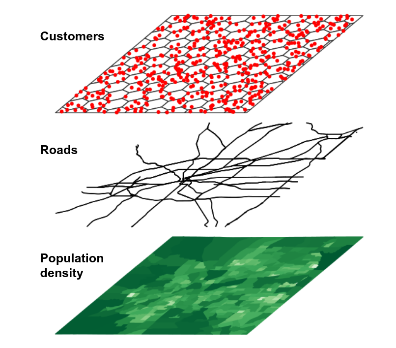
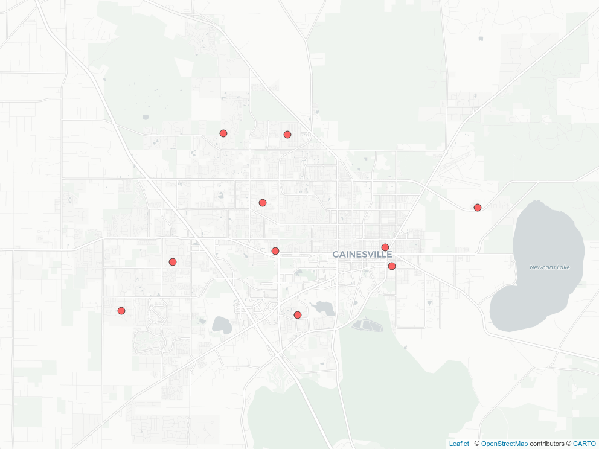
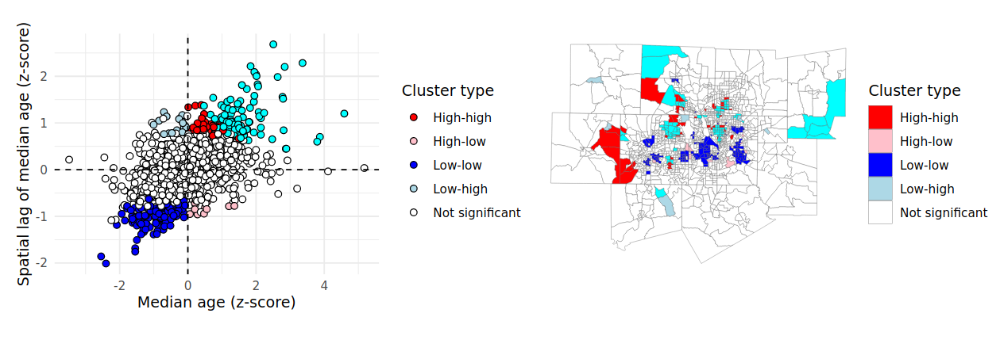

# Spatial analysis with US Census data

```{r ch7-setup, include = FALSE}
library(mapboxapi)
library(tidyverse)
library(tigris)
times <- readr::read_rds("data/ia_trauma_times.rds")
options(tigris_use_cache = TRUE)

source("R/book-functions.R")
```

A very common use-case of spatial data from the US Census Bureau is *spatial analysis*. Spatial analysis refers to the performance of analytic tasks that explicitly incorporate the spatial properties of a dataset. Principles in spatial analysis are closely related to the field of *geographic information science*, which incorporates both theoretical perspectives and methodological insights with regards to the use of geographic data.

Traditionally, geographic information science has been performed in a *geographic information system*, or "GIS", which refers to an integrated software platform for the management, processing, analysis, and visualization of geographic data. As evidenced in this book already, R packages exist for handling these tasks, allowing R to function as a capable substitute for desktop GIS software like ArcGIS or QGIS.

Traditionally, spatial analytic tasks in R have been handled by the **sp** package and allied packages such as **rgeos**. In recent years, however, the **sf** package has emerged as the next-generation alternative to **sp** for spatial data analysis in R. In addition to the simpler representation of vector spatial data in R, as discussed in previous chapters, **sf** also includes significant functionality for spatial data analysis that integrates seamlessly with tidyverse tools.

This chapter covers how to perform common spatial analysis tasks with Census data using the **sf** package. As with previous chapters, the examples will focus on data acquired with the **tidycensus** and **tigris** packages, and will cover common workflows of use to practitioners who work with US Census Bureau data.

## Spatial overlay

Spatial data analysis allows practitioners to consider how geographic datasets interrelate in geographic space. This analytic functionality facilitates answering a wide range of research and analytic questions that would otherwise prove difficult without reference to a dataset's geographic properties.

One common use-case employed by the geospatial analyst is *spatial overlay*. Key to the concept of spatial overlay is the representation of geographic datasets as *layers* in a GIS. This representation is exemplified by the graphic below ([credit to Rafael Pereira for the implementation](https://www.urbandemographics.org/post/figures-map-layers-r/)).

```{r layers-view, echo = FALSE, fig.cap = "Conceptual view of GIS layers"}

```

In this representation, different components of the landscape that interact in the real world are abstracted out into different layers, represented by different geometries. For example, Census tracts might be represented as polygons; customers as points; and roads as linestrings. Separating out these components has significant utility for the geospatial analyst, however. By using spatial analytic tools, a researcher could answer questions like "How many customers live within a given Census tract?" or "Which roads intersect a given Census tract?".

### Note: aligning coordinate reference systems

Section \@ref(coordinate-reference-systems) covered *coordinate reference systems* in R, their importance to spatial data, and how to select appropriate projected coordinate reference systems using the **crsuggest** package. In any workflow using spatial overlay, including all of the methods discussed in this chapter, it is essential that all layers share the same CRS for overlay methods to work.

Spatial datasets obtained with **tigris** or **tidycensus** will by default share the same geographic CRS, NAD 1983. For geographic coordinate reference systems, the **sf** package uses the **s2** spherical geometry library [@dunnington2021] to compute three-dimensional overlay rather than assuming planar geometries for geographic coordinates. This represents a significant technical advancement; however I have found that it can be much slower to compute spatial overlay operations in this way than if the same workflow were using a projected coordinate reference system.

In turn, a recommended spatial analysis data preparation workflow is as follows:

1.  Download the datasets you plan to use in your spatial analysis;
2.  Use `suggest_crs()` in the **crsuggest** package to identify an appropriate projected CRS for your layers;
3.  Transform your data to the projected CRS using `st_transform()`;
4.  Compute the spatial overlay operation.

To avoid redundancy, step 2 is implied in the examples in this chapter and an appropriate projected coordinate reference system has been pre-selected for all sections.

### Identifying geometries within a metropolitan area

One example of the utility of spatial overlay for the Census data analyst is the use of overlay techniques to find out which geographies lie within a given metropolitan area. Core-based statistical areas, also known as metropolitan or micropolitan areas, are common geographies defined by the US Census Bureau for regional analysis. Core-based statistical areas are defined as agglomerations of counties that are oriented around a central core or cores, and have a significant degree of population interaction as measured through commuting patterns. Metropolitan areas are those core-based statistical areas that have a population exceeding 50,000.

A Census data analyst in the United States will often need to know which Census geographies, such as Census tracts or block groups, fall within a given metropolitan area. However, these geographies are only organized by state and county, and don't have metropolitan area identification included by default. Given that Census spatial datasets are designed to align with one another, spatial overlay can be used to identify geographic features that fall within a given metropolitan area and extract those features.

Let's use the example of the Kansas City metropolitan area, which includes Census tracts in both Kansas and Missouri. We'll first use **tigris** to acquire 2020 Census tracts for the two states that comprise the Kansas City region as well as the boundary of the Kansas City metropolitan area.

```{r kc-metro, fig.cap = "The Kansas City CBSA relative to Kansas and Missouri"}
library(tigris)
library(tidyverse)
library(sf)
options(tigris_use_cache = TRUE)

# CRS used: NAD83(2011) Kansas Regional Coordinate System 
# Zone 11 (for Kansas City)
ks_mo_tracts <- map_dfr(c("KS", "MO"), ~{
  tracts(.x, cb = TRUE, year = 2020)
}) %>%
  st_transform(8528)  

kc_metro <- core_based_statistical_areas(cb = TRUE, year = 2020) %>%
  filter(str_detect(NAME, "Kansas City")) %>%
  st_transform(8528)

ggplot() + 
  geom_sf(data = ks_mo_tracts, fill = "white", color = "grey") + 
  geom_sf(data = kc_metro, fill = NA, color = "red") + 
  theme_void()

```

We can see visually from the plot which Census tracts are *within* the Kansas City metropolitan area, and which lay outside. This spatial relationship represented in the image can be expressed through code using *spatial subsetting*, enabled by functionality in the **sf** package.

### Spatial subsets and spatial predicates

Spatial subsetting uses the extent of one spatial dataset to extract features from another spatial dataset based on co-location, defined by a *spatial predicate*. Spatial subsets can be expressed through base R indexing notation:

```{r kc-tracts-intersect, fig.cap = "Census tracts that intersect the Kansas City CBSA"}
kc_tracts <- ks_mo_tracts[kc_metro, ]

ggplot() + 
  geom_sf(data = kc_tracts, fill = "white", color = "grey") + 
  geom_sf(data = kc_metro, fill = NA, color = "red") + 
  theme_void()
```

The spatial subsetting operation returns all the Census tracts that *intersect* the extent of the Kansas City metropolitan area, using the default spatial predicate, `st_intersects()`. This gives us back tracts that fall within the metro area's boundary and those that cross or touch the boundary. For many analysts, however, this will be insufficient as they will want to tabulate statistics exclusively for tracts that fall *within* the metropolitan area's boundaries. In this case, a different spatial predicate can be used with the `op` argument.

Generally, Census analysts will want to use the `st_within()` spatial predicate to return tracts within a given metropolitan area. As long as objects within the core Census hierarchy are obtained for the same year from **tigris**, the `st_within()` spatial predicate will cleanly return geographies that fall within the larger geography when requested. The example below illustrates the same process using the `st_filter()` function in **sf**, which allows spatial subsetting to be used cleanly within a tidyverse-style pipeline. The key difference between these two approaches to spatial subsetting is the argument name for the spatial predicate (`op` vs. `.predicate`).

```{r kc-tracts-within, fig.cap = "Census tracts that are within the Kansas City CBSA"}
kc_tracts_within <- ks_mo_tracts %>%
  st_filter(kc_metro, .predicate = st_within)

# Equivalent syntax: 
# kc_metro2 <- kc_tracts[kc_metro, op = st_within]

ggplot() + 
  geom_sf(data = kc_tracts_within, fill = "white", color = "grey") + 
  geom_sf(data = kc_metro, fill = NA, color = "red") + 
  theme_void()
```

## Spatial joins

*Spatial joins* extend the aforementioned concepts in spatial overlay by transferring attributes between spatial layers. Conceptually, spatial joins can be thought of like the table joins covered in Section \@ref(national-election-mapping-with-tigris-shapes) where the equivalent of a "key field" used to match rows is a spatial relationship defined by a spatial predicate. Spatial joins in R are implemented in **sf**'s `st_join()` function. This section covers two common use cases for spatial joins with Census data. The first topic is the *point-in-polygon spatial join*, where a table of coordinates is matched to Census polygons to determine demographic characteristics around those locations. The second topic covers *polygon-in-polygon spatial joins*, where smaller Census shapes are matched to larger shapes.

### Point-in-polygon spatial joins

Analysts are commonly tasked with matching point-level data to Census shapes in order to study demographic differences. For example, a marketing analyst may have a dataset of customers and needs to understand the characteristics of those customers' neighborhoods in order to target products efficiently. Similarly, a health data analyst may need to match neighborhood demographic data to patient information to understand inequalities in patient outcomes. This scenario is explored in this section.

Let's consider a hypothetical task where a health data analyst in Gainesville, Florida needs to determine the percentage of residents age 65 and up who lack health insurance in patients' neighborhoods. The analyst has a dataset of patients with patient ID along with longitude and latitude information.

```{r gainesville-patients}
library(tidyverse)
library(sf)
library(tidycensus)
library(mapview)

gainesville_patients <- tibble(
  patient_id = 1:10,
  longitude = c(-82.308131, -82.311972, -82.361748, -82.374377, 
                -82.38177, -82.259461, -82.367436, -82.404031, 
                -82.43289, -82.461844),
  latitude = c(29.645933, 29.655195, 29.621759, 29.653576, 
               29.677201, 29.674923, 29.71099, 29.711587, 
               29.648227, 29.624037)
)
```

```{r gainesville-patients-show, echo = FALSE}
style_data(gainesville_patients, caption = "Hypothetical dataset of patients in Gainesville, Florida")
```

Whereas the spatial overlay example in the previous section used spatial datasets from **tigris** that already include geographic information, this dataset needs to be converted to a simple features object. The `st_as_sf()` function in the **sf** package can take an R data frame or tibble with longitude and latitude columns like this and create a dataset of geometry type `POINT`. By convention, the coordinate reference system used for longitude / latitude data is WGS 1984, represented with the EPSG code `4326`. We'll need to specify this CRS in `st_as_sf()` so that **sf** can locate the points correctly before we transform to an appropriate projected coordinate reference system with `st_transform()`.

```{r make-spatial-gainesville}
# CRS: NAD83(2011) / Florida North
gainesville_sf <- gainesville_patients %>%
  st_as_sf(coords = c("longitude", "latitude"),
           crs = 4326) %>%
  st_transform(6440)
```

Once prepared as a spatial dataset, the patient information can be mapped.

```{r map-gainesville-pts, eval = FALSE}
mapview(
  gainesville_sf, 
  col.regions = "red",
  legend = FALSE
)
```

```{r map-gainesville-pts-show, echo = FALSE, fig.cap = "Map of hypothetical patient locations in Gainesville, Florida"}
if (knitr::is_html_output()) {
  knitr::include_url("img/leaflet/gainesville_pts.html", height = "500px")
} else {
  
}
```

As the patient data are now formatted as a simple features object, the next step is to acquire data on health insurance from the American Community Survey. A pre-computed percentage from the ACS Data Profile is available at the Census tract level, which will be used in the example below. Users who require a more granular geography can construct this information from the ACS Detailed Tables at the block group level using table B27001 and techniques learned in Section \@ref(tabulating-new-groups). As Gainesville is contained within Alachua County, Florida, we can obtain data from the 2015-2019 5-year ACS accordingly.

```{r get-alachua-data}
alachua_insurance <- get_acs(
  geography = "tract",
  variables = "DP03_0096P",
  state = "FL",
  county = "Alachua",
  year = 2019,
  geometry = TRUE
) %>%
  select(GEOID, pct_insured = estimate, 
         pct_insured_moe = moe) %>%
  st_transform(6440)
```

After obtaining the spatial & demographic data with `get_acs()` and the `geometry = TRUE` argument, two additional commands help pre-process the data for the spatial join. The call to `select()` retains three non-geometry columns in the simple features object: `GEOID`, which is the Census tract ID, and the ACS estimate and MOE renamed to `pct_insured` and `pct_insured_moe`, respectively. This formats the information that will be appended to the patient data in the spatial join. The `st_transform()` command then aligns the coordinate reference system of the Census tracts with the CRS used by the patient dataset.

Before computing the spatial join, the spatial relationships between patient points and Census tract demographics can be visualized interactively with `mapview()`, layering two interactive views with the `+` operator.

```{r mapview-gainesville-relationship, eval = FALSE}
mapview(
  alachua_insurance,
  zcol = "pct_insured", 
  layer.name = "% with health<br/>insurance"
) + 
  mapview(
    gainesville_sf,
    col.regions = "red",
    legend = FALSE
  )
```

```{r mapview-gainesville-relationship-show, echo = FALSE, fig.cap = "Layered interactive view of patients and Census tracts in Gainesville"}
if (knitr::is_html_output()) {
  knitr::include_url("img/leaflet/gainesville_relationship.html", height = "500px")
} else {
  knitr::include_graphics("img/leaflet/gainesville_relationship.png")
}
```

The interrelationships between patient points and tract neighborhoods can be explored on the map. These relationships can be formalized with a *spatial join*, implemented with the `st_join()` function in the **sf** package. `st_join()` returns a new simple features object that inherits geometry and attributes from a first dataset `x` with attributes from a second dataset `y` appended. Rows in `x` are matched to rows in `y` based on a spatial relationship defined by a spatial predicate, which defaults in `st_join()` to `st_intersects()`. For point-in-polygon spatial joins, this default will be sufficient in most cases unless a point falls directly on the boundary between polygons (which is not true in this example).

```{r compute-alachua-join}
patients_joined <- st_join(
  gainesville_sf,
  alachua_insurance
)
```

```{r compute-alachua-join-show, echo = FALSE}
style_data(patients_joined, caption = "Patients dataset after spatial join to Census tracts")
```

The output dataset includes the patient ID and the original `POINT` feature geometry, but also now includes GEOID information from the Census tract dataset along with neighborhood demographic information from the ACS. This workflow can be used for analyses of neighborhood characteristics in a wide variety of applications and to generate data suitable for hierarchical modeling.

::: rmdnote
An issue to avoid when interpreting the results of point-in-polygon spatial joins is the *ecological fallacy*, where individual-level characteristics are inferred from that of the neighborhood. While neighborhood demographics are useful for inferring the characteristics of the environment in which an observation is located, they do not necessarily provide information about the demographics of the observation itself - particularly important when the observations represent people.
:::

### Spatial joins and group-wise spatial analysis

Spatial data operations can also be embedded in workflows where analysts are interested in understanding how characteristics vary by group. For example, while demographic data for metropolitan areas can be readily acquired using **tidycensus** functions, we might also be interested in learning about how demographic characteristics of *neighborhoods within metropolitan areas* vary across the United States. The example below illustrates this with some important new concepts for spatial data analysts. It involves a *polygon-on-polygon spatial join* in which attention to the spatial predicate used will be very important. Additionally, as all polygons involved are acquired with tidycensus and `get_acs()`, the section will show how `st_join()` handles column names that are duplicated between datasets.

#### Spatial join data setup

Let's say that we are interested in analyzing the distributions of neighborhoods (defined here as Census tracts) by Hispanic population for the four largest metropolitan areas in Texas. We'll use the variable `B01003_001` from the 2019 1-year ACS to acquire population data by core-based statistical area (CBSA) along with simple feature geometry which will eventually be used for the spatial join.

```{r tx-cbsa}
library(tidycensus)
library(tidyverse)
library(sf)

# CRS: NAD83(2011) / Texas Centric Albers Equal Area
tx_cbsa <- get_acs(
  geography = "cbsa",
  variables = "B01003_001",
  year = 2019,
  survey = "acs1",
  geometry = TRUE
) %>%
  filter(str_detect(NAME, "TX")) %>%
  slice_max(estimate, n = 4) %>%
  st_transform(6579)
```

```{r tx-cbsa-show, echo = FALSE}
style_data(tx_cbsa, caption = "Large CBSAs in Texas")
```

The filtering steps used merit some additional explanation. The expression `filter(str_detect(NAME, "TX"))` first subsets the core-based statistical area data for only those metropolitan or micropolitan areas in (or partially in) Texas. Given that string matching in `str_detect()` is case-sensitive, using `"TX"` as the search string will match rows correctly. `slice_max()`, introduced in Section \@ref(basic-census-visualization-with-ggplot2), then retains the four rows with the largest population values, found in the `estimate` column. Finally, the spatial dataset is transformed to an appropriate projected coordinate reference system for the state of Texas.

Given that all four of these metropolitan areas are completely contained within the state of Texas, we can obtain data on percent Hispanic by tract from the ACS Data Profile for 2015-2019.

```{r tx-hispanic}
pct_hispanic <- get_acs(
  geography = "tract",
  variables = "DP05_0071P",
  state = "TX",
  year = 2019,
  geometry = TRUE
) %>%
  st_transform(6579)
```

```{r tx-hispanic-show, echo = FALSE}
style_data(pct_hispanic, caption = "Percent Hispanic by Census tract in Texas")
```

The returned dataset covers Census tracts in the entirety of the state of Texas; however we only need to retain those tracts that fall within our four metropolitan areas of interest. We can accomplish this with a spatial join using `st_join()`.

#### Computing and visualizing the spatial join

We know that in `st_join()`, we request that a given spatial dataset `x`, for which geometry will be retained, gains attributes from a second spatial dataset `y` based on their spatial relationship. This spatial relationship, as in the above examples, will be defined by a spatial predicate passed to the `join` parameter. The argument `suffix` defines the suffixes to be used for columns that share the same names, which will be important given that both datasets came from **tidycensus**. The argument `left = FALSE` requests an inner spatial join, returning only those tracts that fall within the four metropolitan areas.

```{r hispanic-by-metro}
hispanic_by_metro <- st_join(
  pct_hispanic,
  tx_cbsa,
  join = st_within,
  suffix = c("_tracts", "_metro"),
  left = FALSE
) 
```

```{r hispanic-by-metro-show, echo = FALSE}
style_data(hispanic_by_metro, caption = "Census tracts after spatial join operation")
```

The output dataset has been reduced from 5,265 Census tracts to 3,189 as a result of the inner spatial join. Notably, the output dataset now includes information for each Census tract about the metropolitan area that it falls within. This enables group-wise data visualization and analysis across metro areas such as a faceted plot:

```{r plot-hispanic-by-metro, fig.cap = "Faceted density plot of tract Hispanic populations by CBSA in Texas"}
hispanic_by_metro %>%
  mutate(NAME_metro = str_replace(NAME_metro, ", TX Metro Area", "")) %>%
  ggplot() + 
  geom_density(aes(x = estimate_tracts), color = "navy", fill = "navy", 
               alpha = 0.4) + 
  theme_minimal() + 
  facet_wrap(~NAME_metro) + 
  labs(title = "Distribution of Hispanic/Latino population by Census tract",
       subtitle = "Largest metropolitan areas in Texas",
       y = "Kernel density estimate",
       x = "Percent Hispanic/Latino in Census tract")
```

Output from a spatial join operation can also be "rolled up" to a larger geography through group-wise data analysis. For example, let's say we want to know the median value of the four distributions visualized in the plot above. As explained in Section \@ref(group-wise-census-data-analysis), we can accomplish this by grouping our dataset by metro area then summarizing using the `median()` function.

```{r calculate-median-by-metro}
median_by_metro <- hispanic_by_metro %>%
  group_by(NAME_metro) %>%
  summarize(median_hispanic = median(estimate_tracts, na.rm = TRUE))
```

```{r median-by-metro-show, echo = FALSE}
style_data(median_by_metro, caption = "Summarized median Hispanic population by metro")
```

The grouping column (`NAME_metro`) and the output of `summarize()` (`median_hispanic`) are returned as expected. However, the `group_by() %>% summarize()` operations also return the dataset as a simple features object with geometry, but in this case with only 4 rows. Let's take a look at the output geometry:

```{r plot-metro-geometry, fig.cap = "Dissolved geometry of Census tracts identified within the Austin CBSA"}
plot(median_by_metro[1,]$geometry)
```

The returned geometry represents the extent of the given metropolitan area (in the above example, Austin-Round Rock). The analytic process we carried out not only summarized the data by group, it also summarized the geometry by group. The typical name for this geometric process in geographic information systems is a *dissolve* operation, where geometries are identified by group and combined to return a single larger geometry. In this case, the Census tracts are dissolved by metropolitan area, returning metropolitan area geometries. This type of process is extremely useful when creating custom geographies (e.g. sales territories) from Census geometry building blocks that may belong to the same group.

## Small area time-series analysis

Previous chapters of this book covered techniques and methods for analyzing demographic change over time in the US Census. Section \@ref(comparing-acs-estimates-over-time) introduced the ACS Comparison Profile along with how to use iteration to get multiple years of data from the ACS Detailed Tables; Section \@ref(visualizing-acs-estimates-over-time) then illustrated how to visualize time-series ACS data. These techniques, however, are typically only appropriate for larger geographies like counties that rarely change shape over time. In contrast, smaller geographies like Census tracts and block groups are re-drawn by the US Census Bureau with every decennial US Census, making time-series analysis for smaller areas difficult.

For example, we can compare Census tract boundaries for a fast-growing area of Gilbert, Arizona (southeast of Phoenix) for 2010 and 2020.

```{r gilbert_compare, echo = FALSE, fig.cap = "Comparison of Census tracts in Gilbert, AZ from the 2010 and 2020 Census"}
library(patchwork)

maricopa_2010 <- tracts(state = "AZ", county = "Maricopa", cb = TRUE, year = 2015)
maricopa_2020 <- tracts(state = "AZ", county = "Maricopa", cb = TRUE, year = 2020)

gilbert_2010 <- filter(maricopa_2010, GEOID == "04013816000")
gilbert_2020 <- filter(maricopa_2020, GEOID %in% c("04013816001",
                                                   "04013816002",
                                                   "04013816003",
                                                   "04013816005",
                                                   "04013816004"))

gilbert_basemap <- layer_static_mapbox(
  location = gilbert_2010,
  buffer_dist = 500,
  style_id = "streets-v11",
  username = "mapbox"
)

g1 <- ggplot() + 
  gilbert_basemap + 
  geom_sf(data = gilbert_2010, color = "red", fill = NA) + 
  theme_void() + 
  labs(title = "2010")

g2 <- ggplot() + 
  gilbert_basemap + 
  geom_sf(data = gilbert_2020, color = "red", fill = NA) + 
  theme_void() + 
  labs(title = "2020")

g1 + g2

```

As discussed in Section \@ref(understanding-yearly-differences-in-tigerline-files), the US Census Bureau tries to keep Census tract sizes relatively consistent at around 4,000 people. If a tract grows too large between Census years, the Census Bureau will subdivide it into multiple Census tracts when re-drawing tracts for the next decennial Census. In this example from Arizona, the tract shown was divided into five tracts in 2020.

While this partitioning of Census tracts makes practical sense and allows for more granular demographic analysis in 2020, it also makes time-series comparisons difficult. This is particularly important with the release of the 2016-2020 ACS, which is the first ACS dataset to use 2020 Census boundaries. A common method for resolving this issue in geographic information science is *areal interpolation*. Areal interpolation refers to the allocation of data from one set of zones to a second overlapping set of zones that may or may not perfectly align spatially. In cases of mis-alignment, some type of weighting scheme needs to be specified to determine how to allocate partial data in areas of overlap. Two such approaches for interpolation are outlined here: *area-weighted interpolation* and *population-weighted interpolation*.

To get started, let's obtain some comparison data for Maricopa County, AZ on the number of people working from home in the 2011-2015 ACS (which uses 2010 boundaries) and the 2016-2020 ACS (which uses 2020 boundaries). We will use both interpolation methods to allocate 2011-2015 data to 2020 Census tracts.

```{r get-wfh-data}
library(tidycensus)
library(tidyverse)
library(tigris)
library(sf)
options(tigris_use_cache = TRUE)

# CRS: NAD 83 / Arizona Central
wfh_15 <- get_acs(
  geography = "tract",
  variables = "B08006_017",
  year = 2015,
  state = "AZ",
  county = "Maricopa",
  geometry = TRUE
) %>%
  select(estimate) %>%
  st_transform(26949)

wfh_20 <- get_acs(
  geography = "tract",
  variables = "B08006_017",
  year = 2020,
  state = "AZ",
  county = "Maricopa",
  geometry = TRUE
 ) %>%
  st_transform(26949)
```

### Area-weighted areal interpolation

*Area-weighted areal interpolation* is implemented in **sf** with the `st_interpolate_aw()` function. This method uses the area of overlap of geometries as the interpolation weights. From a technical standpoint, an intersection is computed between the origin geometries and the destination geometries. Weights are then computed as the proportion of the overall origin area comprised by the intersection. Area weights used to estimate data at 2020 geographies for the Census tract in Gilbert are illustrated below.

```{r gilbert-area-weights, echo = FALSE, fig.cap = "Illustration of area weights"}
area_10 <- gilbert_2010$ALAND

area_weights <- gilbert_2020 %>%
  mutate(proportion = round(ALAND / area_10, 3))

ggplot() + 
  gilbert_basemap + 
  geom_sf(data = area_weights, color = "red", fill = NA) + 
  geom_sf_label(data = area_weights, aes(label = proportion), fun.geometry = st_centroid) + 
  theme_void() + 
  labs(title = "Illustration of area weights")
```

Those weights are applied to target variables (in this case, the information on workers from home) in accordance with the value of the `extensive` argument. If `extensive = TRUE`, as used below, weighted sums will be computed. Alternatively, if `extensive = FALSE`, the function returns weighted means.

```{r az-interpolate-aw}
wfh_interpolate_aw <- st_interpolate_aw(
  wfh_15,
  wfh_20,
  extensive = TRUE
) %>%
  mutate(GEOID = wfh_20$GEOID)
```

### Population-weighted areal interpolation

When a user computes area-weighted areal interpolation with `st_interpolate_aw()`, the function prints the following warning: `st_interpolate_aw assumes attributes are constant or uniform over areas of x`. This assumption that proportionally larger *areas* also have proportionally more *people* is often incorrect with respect to the geography of human settlements, and can be a source of error when using this method. An alternative method, *population-weighted areal interpolation*, can represent an improvement. As opposed to using area-based weights, population-weighted techniques estimate the populations of the intersections between origin and destination from a third dataset, then use those values for interpolation weights.

This method is implemented in **tidycensus** with the `interpolate_pw()` function. This function is specified in a similar way to `st_interpolate_aw()`, but also requires a third dataset to be used as weights, and optionally a weight column to determine the relative influence of each feature in the weights dataset. For many purposes, **tidycensus** users will want to use Census blocks as the weights dataset, though users can bring alternative datasets as well. 2020 Census blocks acquired with the **tigris** package have the added benefit of `POP20` and `HU20` columns in the dataset that represent population and housing unit counts, respectively, either one of which could be used to weight each block.

```{r az-interpolate-pw}
maricopa_blocks <- blocks(
  state = "AZ",
  county = "Maricopa",
  year = 2020
)

wfh_interpolate_pw <- interpolate_pw(
  wfh_15,
  wfh_20,
  to_id = "GEOID",
  extensive = TRUE, 
  weights = maricopa_blocks,
  weight_column = "POP20",
  crs = 26949
)
```

`interpolate_pw()` uses a *weighted centroid* approach to interpolation, where the input Census blocks are first converted to centroids, then joined to the origin/destination intersections to produce population weights. An illustration of this process is found below; the map on the left-hand side shows the block centroid weights, and the map on the right-hand side shows the population weights used for each 2020 Census tract.

```{r gilbert-pop-weights, echo = FALSE, "Illustration of block centroids and population weights"}
gilbert_blocks <- maricopa_blocks %>%
  st_transform(26949) %>%
  st_centroid() %>%
  select(POP20) %>%
  st_join(st_transform(gilbert_2020, 26949), left = FALSE)

# Determine the weights by tract
pop_total <- sum(gilbert_blocks$POP20, na.rm = TRUE)

tract_totals <- gilbert_blocks %>%
  st_drop_geometry() %>%
  group_by(GEOID) %>%
  summarize(block_pop = sum(POP20, na.rm = TRUE)) %>%
  mutate(pop_weights = round(block_pop / pop_total, 3))

gilbert_weight_geo <- gilbert_2020 %>%
  left_join(tract_totals, by = "GEOID")

# First map: block centroids
gb1 <- ggplot() + 
  gilbert_basemap + 
  geom_sf(data = gilbert_2020, color = "red", fill = NA) + 
  geom_sf(data = gilbert_blocks, color = "navy") + 
  theme_void() + 
  labs(title = "Illustration of block centroids")

gb2 <- ggplot() + 
  gilbert_basemap + 
  geom_sf(data = gilbert_weight_geo, color = "red", fill = NA) + 
  geom_sf_label(data = gilbert_weight_geo, aes(label = pop_weights), 
                fun.geometry = sf::st_centroid) + 
  labs(title = "Illustration of area weights") + 
  theme_void()

gb1 + gb2
```

The population-based weights differ significantly from the area-based weights for the Census tract in Gilbert. Notably, the southern-most Census tract in the example only had an area weight of 0.167, whereas the population weighting revealed that over 30 percent of the origin tract's population is actually located there. This leads to substantive differences in the results of the area- and population-weighted approaches, as illustrated in the figure below.

```{r wfh-estimate-map, echo = FALSE, fig.cap="Comparison of area-weighted and population-weighted interpolation results"}
gilbert_aw <- wfh_interpolate_aw %>%
  filter(GEOID %in% c("04013816001",
                      "04013816002",
                      "04013816003",
                      "04013816005",
                      "04013816004")) %>%
  mutate(estimate = round(estimate, 1))

gilbert_pw <- wfh_interpolate_pw %>%
  filter(GEOID %in% c("04013816001",
                      "04013816002",
                      "04013816003",
                      "04013816005",
                      "04013816004")) %>%
  mutate(estimate = round(estimate, 1))

aw_map1 <- ggplot() + 
  gilbert_basemap + 
  geom_sf(data = gilbert_aw, color = "red", fill = NA) + 
  geom_sf_label(data = gilbert_aw, aes(label = estimate)) + 
  labs(title = "Work from home, 2011-2015 ACS\n(area-weighted method)",
       subtitle = "2020 tract boundaries") + 
  theme_void()

aw_map2 <- ggplot() + 
  gilbert_basemap + 
  geom_sf(data = gilbert_pw, color = "red", fill = NA) + 
  geom_sf_label(data = gilbert_pw, aes(label = estimate)) + 
  labs(title = "Work from home, 2011-2015 ACS\n(population-weighted method)",
       subtitle = "2020 tract boundaries") + 
  theme_void()

aw_map1 + aw_map2
```

The area-weighted method under-estimates the population in geographically smaller tracts, and over-estimates in larger ones; in contrast, the population-weighted method takes the underlying population distribution into account.

### Making small-area comparisons

As these methods have interpolated 2011-2015 ACS estimates to 2020 Census tracts, 2011-2015 and 2016-2020 ACS data can now be compared at consistent geographies. To do this, we will join the population-weighted interpolated 2011-2015 data to the original 2016-2020 data using `left_join()` (as covered in Section \@ref(cartographic-workflows-with-non-census-data)), taking care to drop the geometry of the dataset on the right-hand side of the join and to specify a `suffix` argument to distinguish the two ACS estimates. We then calculate change over time from these estimates and map the result.

```{r map-maricopa-change, fig.cap = "Map of shift in workers from home, Maricopa County Arizona"}
library(mapboxapi)

wfh_shift <- wfh_20 %>%
  left_join(st_drop_geometry(wfh_interpolate_pw), 
            by = "GEOID",
            suffix = c("_2020", "_2015")) %>%
  mutate(wfh_shift = estimate_2020 - estimate_2015)

maricopa_basemap <- layer_static_mapbox(
  location = wfh_shift,
  style_id = "dark-v9",
  username = "mapbox"
)

ggplot() + 
  maricopa_basemap + 
  geom_sf(data = wfh_shift, aes(fill = wfh_shift), color = NA, 
          alpha = 0.8) + 
  scale_fill_distiller(palette = "PuOr", direction = -1) + 
  labs(fill = "Shift, 2011-2015 to\n2016-2020 ACS",
       title = "Change in work-from-home population",
       subtitle = "Maricopa County, Arizona") + 
  theme_void()
```

Notable increases in tract-level working from home are found in locations like Gilbert, Scottsdale, and Tempe on the eastern side of the metropolitan area. That said, these results may simply be a function of overall population growth in those tracts, which means that a follow-up analysis should examine change in the share of the population working from home. This would require interpolating a total workforce denominator column and calculating a percentage. Fortunately, both interpolation methods introduced in this section will interpolate all numeric columns in an input dataset, so wide-form data or data with a summary variable acquired by **tidycensus** will work well for this purpose.

::: rmdwarning
As discussed in Section \@ref(calculating-derived-margins-of-error-in-tidycensus), derived margins of error (even for sums) require special methods. Given the complexity of the interpolation methods covered here, direct interpolation of margin of error columns will not take these methods into account. Analysts should interpret such columns with caution.
:::

## Distance and proximity analysis

A common use case for spatially-referenced demographic data is the analysis of *accessibility*. This might include studying the relative accessibility of different demographic groups to resources within a given region, or analyzing the characteristics of potential customers who live within a given distance of a store. Conceptually, there are a variety of ways to measure accessibility. The most straightforward method, computationally, is using straight-line (Euclidean) distances over geographic data in a projected coordinate system. A more computationally complex - but potentially more accurate - method involves the use of transportation networks to model accessibility, where proximity is measured not based on distance from a given location but instead based on travel times for a given transit mode, such as walking, cycling, or driving. This section will illustrate both types of approaches. Let's consider the topic of accessibility to Level I and Level II trauma hospitals by Census tract in the state of Iowa. 2019 Census tract boundaries are acquired from **tigris**, and we use `st_read()` to read in a shapefile of hospital locations acquired from the US Department of Homeland Security.

```{r read-hospital-data}
library(tigris)
library(sf)
library(tidyverse)
options(tigris_use_cache = TRUE)

# CRS: NAD83 / Iowa North
ia_tracts <- tracts("IA", cb = TRUE, year = 2019) %>%
  st_transform(26975)

hospital_url <- "https://opendata.arcgis.com/api/v3/datasets/6ac5e325468c4cb9b905f1728d6fbf0f_0/downloads/data?format=geojson&spatialRefId=4326"

trauma <- st_read(hospital_url) %>%
  filter(str_detect(TRAUMA, "LEVEL I\\b|LEVEL II\\b|RTH|RTC")) %>%
  st_transform(26975) %>%
  distinct(ID, .keep_all = TRUE)

names(trauma)
```

### Calculating distances

To determine accessibility of Iowa Census tracts to Level I or II trauma centers, we need to identify not only those hospitals that are located in Iowa, but also those in other states near to the Iowa border, such as in Omaha, Nebraska and Rock Island, Illinois. We can accomplish this by applying a distance threshold in `st_filter()`. In this example, we use the spatial predicate `st_is_within_distance`, and set a 100km distance threshold with the `dist = 100000` argument (specified in meters, the base measurement unit of our coordinate system used).

```{r identify-iowa-hospitals, fig.cap = "Level I or II trauma centers within 100km of Iowa"}
ia_trauma <- trauma %>%
  st_filter(ia_tracts, 
            .predicate = st_is_within_distance,
            dist = 100000)

ggplot() + 
  geom_sf(data = ia_tracts, color = "NA", fill = "grey50") + 
  geom_sf(data = ia_trauma, color = "red") + 
  theme_void()
```

As illustrated in the visualization, the `st_filter()` operation has retained Level I and II trauma centers *within* the state of Iowa, but also within the 100km threshold beyond the state's borders.

With the Census tract and hospital data in hand, we can calculate distances from Census tracts to trauma centers by using the `st_distance()` function in the **sf** package. `st_distance(x, y)` by default returns the dense matrix of distances computed from the geometries in `x` to the geometries in `y`. In this example, we will calculate the distances from the *centroids* of Iowa Census tracts (reflecting the center points of each tract geometry) to each trauma center.

```{r tract-centroids, message = FALSE, warning = FALSE}
dist <- ia_tracts %>%
  st_centroid() %>%
  st_distance(ia_trauma) 

dist[1:5, 1:5]
```

A glimpse at the matrix shows distances (in meters) between the first five Census tracts in the dataset and the first five hospitals. When considering *accessibility*, we may be interested in the distance to the *nearest* hospital to each Census tract. The code below extracts the minimum distance from the matrix for each row, converts to a vector, and divides each value by 1000 to convert values to kilometers. A quick histogram visualizes the distribution of minimum distances.

```{r get-min-dist, fig.cap = "Base R histogram of minimum distances to trauma centers"}
min_dist <- dist %>%
  apply(1, min) %>%
  as.vector() %>%
  magrittr::divide_by(1000)

hist(min_dist)
```

::: rmdnote
The code that extracts minimum distances from the distance matrix includes some notation that may be unfamiliar to readers.

-   The `apply()` function from base R is used to iterate over rows of the matrix. Matrices are a data structure not handled by the `map_*()` family of functions in the tidyverse, so base R methods must be used. In the example pipeline, the `apply()` function inherits the `dist` matrix object as its first argument. The second argument, `1`, refers to the margin of the matrix that `apply()` will iterate over; `1` references rows (which we want), whereas `2` would be used for columns. `min` then is the function to be applied to each row, giving us the minimum distance to a hospital for each Census tract.

-   The `divide_by()` function in the **magrittr** package is a convenience arithmetic function to be used in analytic pipelines as R's arithmetic operators (e.g. `/` for division) won't work in this way. In this example, it divides all the values by 1000 to convert meters to kilometers.
:::

While many tracts are within 10km of a trauma center, around 16 percent of Iowa Census tracts in 2019 are beyond 100km from a Level I or II trauma center, suggesting significant accessibility issues for these areas.

### Calculating travel times

An alternative way to model accessibility to hospitals is through *travel times* rather than distance, as the way that people experience access to locations is through time expended given a transportation network. While network-based accessibility may be a more accurate representation of people's lived experiences, it is more computationally complex and requires additional tools. To perform spatial network analyses, R users will either need to obtain network data (like roadways) and use appropriate tools that can model the network; set up a routing engine that R can connect to; or connect to a hosted routing engine via a web API. In this example, we'll use the **mapboxapi** R package [@walker_mapbox] to perform network analysis using [Mapbox's travel-time Matrix API](https://docs.mapbox.com/api/navigation/matrix/).

The function `mb_matrix()` in **mapboxapi** works much like `st_distance()` in that it only requires arguments for origins and destinations, and will return the dense matrix of travel times by default. In turn, much of the computational complexity of routing is abstracted away by the function. However, as routes will be computed across the state of Iowa and API usage is subject to rate-limitations, the function can take several minutes to compute for larger matrices like this one.

If you are using **mapboxapi** for the first time, visit [mapbox.com](), register for an account, and obtain an access token. The function `mb_access_token()` installs this token in your .Renviron for future use.

```{r setup-mapbox, eval = FALSE}
library(mapboxapi)
# mb_access_token("pk.eybcasq...", install = TRUE)

times <- mb_matrix(ia_tracts, ia_trauma)

```

```{r show-time-matrix, eval = TRUE}
times[1:5, 1:5]
```

A glimpse at the travel-time matrix shows a similar format to the distance matrix, but with travel times in minutes used instead of meters. As with the distance-based example, we can determine the minimum travel time from each tract to a Level I or Level II trauma center. In this instance, we will visualize the result on a map.

```{r show-min-times, fig.cap = "Map of travel-times to trauma centers by Census tract in Iowa"}
min_time <- apply(times, 1, min)

ia_tracts$time <- min_time

ggplot(ia_tracts, aes(fill = time)) + 
  geom_sf(color = NA) + 
  scale_fill_viridis_c(option = "magma") + 
  theme_void() + 
  labs(fill = "Time (minutes)",
       title = "Travel time to nearest Level I or Level II trauma hospital",
       subtitle = "Census tracts in Iowa",
       caption = "Data sources: US Census Bureau, US DHS, Mapbox")
  
```

The map illustrates considerable accessibility gaps to trauma centers across the state. Whereas urban residents typically live within 20 minutes of a trauma center, travel times in rural Iowa can exceed two hours.

::: rmdnote
An advantage to using a package like **mapboxapi** for routing and travel times is that users can connect directly to a hosted routing engine using an API. Due to rate limitations, however, web APIs are likely inadequate for more advanced users who need to compute travel times at scale. There are several R packages that can connect to user-hosted routing engines which may be better-suited to such tasks. These packages include [**osrm**](https://github.com/rCarto/osrm) for the Open Source Routing Machine; [**opentripplanner**](https://docs.ropensci.org/opentripplanner/) for OpenTripPlanner; and [**r5r**](https://ipeagit.github.io/r5r/) for R5.
:::

### Catchment areas with buffers and isochrones

The above example considers a broader accessibility analysis across the state of Iowa. In many cases, however, you'll want to analyze accessibility in a more local way. A common use case might involve a study of the demographic characteristics of a hospital *catchment area*, defined as the area around a hospital from which patients will likely come.

As with the matrix-based accessibility approach outlined above, catchment area-based proximity can be modeled with either Euclidean distances or network travel times as well. Let's consider the example of [Iowa Methodist Medical Center in Des Moines](https://www.unitypoint.org/desmoines/iowa-methodist-medical-center.aspx), one of two Level I trauma centers in the state of Iowa.

The example below illustrates the distance-based approach using a *buffer*, implemented with the `st_buffer()` function in **sf**. A buffer is a common GIS operation that represents the area within a given distance of a location. The code below creates a 5km buffer around Iowa Methodist Medical Center by using the argument `dist = 5000`.

```{r get-buffer}
iowa_methodist <- filter(ia_trauma, NAME == "IOWA METHODIST MEDICAL CENTER")

buf5km <- st_buffer(iowa_methodist, dist = 5000) 

```

An alternative option is to create network-based *isochrones*, which are polygons that represent the accessible area around a given location within a given travel time for a given travel mode. Isochrones are implemented in the **mapboxapi** package with the `mb_isochrone()` function. The example below draws a 10-minute driving isochrone around Iowa Methodist.

```{r get-isochrone}
iso10min <- mb_isochrone(iowa_methodist, time = 10)
```

We can visualize the comparative extents of these two methods in Des Moines. Run the code on your own computer to get a synced interactive map showing the two methods. The `makeAwesomeIcon()` function in **leaflet** creates a custom icon appropriate for a medical facility; [many other icons are available for common points of interest](http://rstudio.github.io/leaflet/markers.html#awesome-icons).

```{r sync, eval = FALSE, fig.cap = "Side-by-side comparison of buffer and isochrone methods for catchment areas in Des Moines, Iowa"}
library(leaflet)
library(leafsync)

hospital_icon <- makeAwesomeIcon(icon = "ios-medical", 
                                 markerColor = "red",
                                 library = "ion")

# The Leaflet package requires data be in CRS 4326
map1 <- leaflet() %>% 
  addTiles() %>%
  addPolygons(data = st_transform(buf5km, 4326)) %>% 
  addAwesomeMarkers(data = st_transform(iowa_methodist, 4326),
                    icon = hospital_icon)

map2 <- leaflet() %>% 
  addTiles() %>%
  addPolygons(data = iso10min) %>% 
  addAwesomeMarkers(data = st_transform(iowa_methodist, 4326),
                    icon = hospital_icon)

sync(map1, map2)
```

```{r synced-map, echo = FALSE, fig.cap = "Synced map showing buffer and isochrone-based catchment areas in Des Moines"}
knitr::include_graphics("img/screenshots/synced-map.png")
```

The comparative maps illustrate the differences between the two methods quite clearly. Many areas of equal distance to the hospital do not have the same level of access; this is particularly true of areas to the south of the Raccoon/Des Moines River. Conversely, due to the location of highways, there are some areas outside the 5km buffer area that can reach the hospital within 10 minutes.

### Computing demographic estimates for zones with areal interpolation

Common to both methods, however, is a mis-alignment between their geometries and those of any Census geographies we may use to infer catchment area demographics. As opposed to the spatial overlay analysis matching Census tracts to metropolitan areas earlier in this chapter, Census tracts or block groups on the edge of the catchment area will only be partially included in the catchment. Areal interpolation methods like those introduced in Section \@ref(small-area-time-series-analysis) can be used here to estimate the demographics of both the buffer zone and isochrone.

Let's produce interpolated estimates of the percentage of population in poverty for both catchment area definitions. This will require obtaining block group-level poverty information from the ACS for Polk County, Iowa, which encompasses both the buffer and the isochrone. The variables requested from the ACS include the number of family households with incomes below the poverty line along with total number of family households to serve as a denominator.

```{r get-polk-poverty}
polk_poverty <- get_acs(
  geography = "block group",
  variables = c(poverty_denom = "B17010_001",
                poverty_num = "B17010_002"),
  state = "IA",
  county = "Polk",
  geometry = TRUE,
  output = "wide",
  year = 2020
) %>%
  select(poverty_denomE, poverty_numE) %>%
  st_transform(26975)
```

```{r interpolate, message = FALSE, warning = FALSE}
library(glue)

polk_blocks <- blocks(
  state = "IA",
  county = "Polk",
  year = 2020
)

buffer_pov <- interpolate_pw(
  from = polk_poverty, 
  to = buf5km,
  extensive = TRUE,
  weights = polk_blocks,
  weight_column = "POP20",
  crs = 26975
) %>%
  mutate(pct_poverty = 100 * (poverty_numE / poverty_denomE))

iso_pov <- interpolate_pw(
  from = polk_poverty, 
  to = iso10min,
  extensive = TRUE,
  weights = polk_blocks,
  weight_column = "POP20",
  crs = 26975
) %>%
  mutate(pct_poverty = 100 * (poverty_numE / poverty_denomE))


print(glue("Family poverty (5km buffer method): {round(buffer_pov$pct_poverty, 1)}%"))
print(glue("Family poverty (10min isochrone method): {round(iso_pov$pct_poverty, 1)}%"))
```

The two methods return slightly different results, illustrating how the definition of catchment area impacts downstream analyses.

Following up on Section \@ref(understanding-yearly-differences-in-tigerline-files), areal interpolation is also a common method used to adjust population data aggregated to inconsistent Census boundaries over time. However, it can introduce inaccuracies in sparsely populated areas, which can be improved with a population-weighted interpolation approach. While this approach is not covered here, @schroeder2013 provide a good discussion of the method.

## Better cartography with spatial overlay

As discussed in Section \@ref(using-geometry-in-tidycensus), one of the major benefits of working with the **tidycensus** package to get Census data in R is its ability to retrieve pre-joined feature geometry for Census geographies with the argument `geometry = TRUE`. tidycensus uses the **tigris** package to fetch these geometries, which default to the Census Bureau's [cartographic boundary shapefiles](https://www.census.gov/geo/maps-data/data/tiger-cart-boundary.html). Cartographic boundary shapefiles are preferred to the core [TIGER/Line shapefiles](https://www.census.gov/geo/maps-data/data/tiger-line.html) in **tidycensus** as their smaller size speeds up processing and because they are pre-clipped to the US coastline.

However, there may be circumstances in which your mapping requires more detail. A good example of this would be maps of New York City, in which even the cartographic boundary shapefiles include water area. For example, take this example of median household income by Census tract in Manhattan (New York County), NY:

```{r manhattan, fig.cap = "Map of Manhattan with default CB geometries"}
library(tidycensus)
library(tidyverse)
options(tigris_use_cache = TRUE)

ny <- get_acs(
  geography = "tract", 
  variables = "B19013_001", 
  state = "NY", 
  county = "New York", 
  year = 2020,
  geometry = TRUE
)

ggplot(ny) + 
  geom_sf(aes(fill = estimate)) + 
  scale_fill_viridis_c(labels = scales::label_dollar()) + 
  theme_void() + 
  labs(fill = "Median household\nincome")

```

As illustrated in the graphic, the boundaries of Manhattan include water boundaries - stretching into the Hudson and East Rivers. In turn, a more accurate representation of Manhattan's land area might be desired. To accomplish this, a **tidycensus** user can use the core TIGER/Line shapefiles instead, then erase water area from Manhattan's geometry.

### "Erasing" areas from Census polygons

tidycensus allows users to get TIGER/Line instead of cartographic boundary shapefiles with the keyword argument `cb = FALSE`. This argument will be familiar to users of the **tigris** package, as it is used by **tigris** to distinguish between cartographic boundary and TIGER/Line shapefiles in the package.

```{r get-tiger-manhattan}
ny2 <- get_acs(
  geography = "tract",
  variables = "B19013_001", 
  state = "NY", 
  county = "New York", 
  geometry = TRUE, 
  year = 2020,
  cb = FALSE
) %>%
  st_transform(6538)
```

Next, the `erase_water()` function in the **tigris** package will be used to remove water area from the Census tracts. `erase_water()` works by auto-detecting US counties that surround an input dataset, obtaining an area water shapefile from the Census Bureau for those counties, then computing an *erase* operation to remove those water areas from the input dataset. Using TIGER/Line geometries with `cb = FALSE` is recommended as they will align with the input water areas and minimize the creation of *sliver polygons*, which are small polygons that can be created from the overlay of inconsistent spatial datasets.

```{r erase-nyc}
ny_erase <- erase_water(ny2)

```

Although it is not used here, `erase_water()` has an optional argument, `area_threshold`, that defines the area percentile threshold at which water areas are kept for the erase operation. The default of 0.75, used here, erases water areas with a size percentile of 75 percent and up (so, the top 25 percent). A lower area threshold can produce more accurate shapes, but can slow down the operation substantially.

After erasing water area from Manhattan's Census tracts with `erase_water()`, we can map the result:

```{r plot-erase-manhattan, fig.cap = "Map of Manhattan with water areas erased"}
ggplot(ny_erase) + 
  geom_sf(aes(fill = estimate)) + 
  scale_fill_viridis_c(labels = scales::label_dollar()) + 
  theme_void() + 
  labs(fill = "Median household\nincome")
```

The map appears as before, but now with a more familiar representation of the extent of Manhattan.

## Spatial neighborhoods and spatial weights matrices

The spatial capabilities of **tidycensus** also allow for exploratory spatial data analysis (ESDA) within R. ESDA refers to the use of datasets' spatial properties in addition to their attributes to explore patterns and relationships. This may involve exploration of spatial patterns in datasets or identification of spatial clustering of a given demographic attribute.

To illustrate how an analyst can apply ESDA to Census data, let's acquire a dataset on median age by Census tract in the Dallas-Fort Worth, TX metropolitan area. Census tracts in the metro area will be identified using methods introduced earlier in this chapter.

```{r get-dfw-tract-ch7}
library(tidycensus)
library(tidyverse)
library(tigris)
library(sf)
library(spdep)
options(tigris_use_cache = TRUE)

# CRS: NAD83 / Texas North Central
dfw <- core_based_statistical_areas(cb = TRUE, year = 2020) %>%
  filter(str_detect(NAME, "Dallas")) %>%
  st_transform(32138)

dfw_tracts <- get_acs(
  geography = "tract",
  variables = "B01002_001",
  state = "TX",
  year = 2020,
  geometry = TRUE
) %>%
  st_transform(32138) %>%
  st_filter(dfw, .predicate = st_within) %>%
  na.omit()

ggplot(dfw_tracts) + 
  geom_sf(aes(fill = estimate), color = NA) + 
  scale_fill_viridis_c() + 
  theme_void()

```

### Understanding spatial neighborhoods

Exploratory spatial data analysis relies on the concept of a *neighborhood*, which is a representation of how a given geographic feature (e.g. a given point, line, or polygon) interrelates with other features nearby. The workhorse package for exploratory spatial data analysis in R is **spdep**, which includes a wide range of tools for exploring and modeling spatial data. As part of this framework, **spdep** supports a variety of neighborhood definitions. These definitions include:

-   *Proximity-based neighbors*, where neighboring features are identified based on some measure of distance. Neighbors might be defined as those that fall within a given distance threshold (e.g. all features within 2km of a given feature) or as *k*-nearest neighbors (e.g. the nearest eight features to a given feature).
-   *Graph-based neighbors*, where neighbors are defined through network relationships (e.g. along a street network).
-   *Contiguity-based neighbors*, used when geographic features are polygons. Options for contiguity-based spatial relationships include *queen's case neighbors*, where all polygons that share at least one vertex are considered neighbors; and *rook's case neighbors*, where polygons must share at least one line segment to be considered neighbors.

In this example, we'll choose a queen's case contiguity-based neighborhood definition for our Census tracts. We implement this with the function `poly2nb()`, which can take an **sf** object as an argument and produce a neighbors list object. We use the argument `queen = TRUE` to request queen's case neighbors explicitly (though this is the function default).

```{r generate-neighbors}
neighbors <- poly2nb(dfw_tracts, queen = TRUE)

summary(neighbors)
```

On average, the Census tracts in the Dallas-Fort Worth metropolitan area have 6.43 neighbors. The minimum number of neighbors in the dataset is 2 (there are eight such tracts), and the maximum number of neighbors is 17 (the tract at row index 1635). An important caveat to keep in mind here is that tracts with few neighbors may actually have more neighbors than listed here given that we have restricted the tract dataset to those tracts within the Dallas-Fort Worth metropolitan area. In turn, our analysis will be influenced by *edge effects* as neighborhoods on the edge of the metropolitan area are artificially restricted.

Neighborhood relationships can be visualized using plotting functionality in **spdep**, with blue lines connecting each polygon with its neighbors.

```{r plot-neighbors, fig.cap = "Visualization of queens-case neighborhood relationships"}
dfw_coords <- dfw_tracts %>%
  st_centroid() %>%
  st_coordinates()

plot(dfw_tracts$geometry)
plot(neighbors, 
     coords = dfw_coords, 
     add = TRUE, 
     col = "blue", 
     points = FALSE)
```

Additionally, row indices for the neighbors of a given feature can be readily extracted from the neighbors list object.

```{r see-neighbors}
# Get the row indices of the neighbors of the Census tract at row index 1
neighbors[[1]]
```

### Generating the spatial weights matrix

To perform exploratory spatial data analysis, we can convert the neighbors list object into *spatial weights*. Spatial weights define how metrics associated with a feature's neighbors should be weighted. Weight generation is implemented in the `nb2listw()` function, to which we pass the neighbors object and specify a style of weights. The default, `style = "W"`, produces a row-standardized weights object where the weights for all neighbors of a given feature sum to 1. This is the option you would choose when analyzing neighborhood means. An alternative option, `style = "B"`, produces binary weights where neighbors are given the weight of 1 and non-neighbors take the weight of 0. This style of weights is useful for producing neighborhood sums.

In the example below, we create row-standardized spatial weights for the Dallas-Fort Worth Census tracts and check their values for the feature at row index 1.

```{r make-weights}
weights <- nb2listw(neighbors, style = "W")

weights$weights[[1]]

```

Given that the Census tract at row index 1 has five neighbors, each neighbor is assigned the weight 0.2.

## Global and local spatial autocorrelation

The row-standardized spatial weights object named `weights` provides the needed information to perform exploratory spatial data analysis of median age in the Dallas-Fort Worth metropolitan area. In many cases, an analyst may be interested in understanding how the attributes of geographic features relate to those of their neighbors. Formally, this concept is called *spatial autocorrelation*. The concept of spatial autocorrelation relates to Waldo Tobler's famous "first law of geography," which reads [@tobler1970]:

> Everything is related to everything else, but near things are more related than distant things.

This formulation informs much of the theory behind spatial data science and geographical inquiry more broadly. With respect to the exploratory spatial analysis of Census data, we might be interested in the degree to which a given Census variable clusters spatially, and subsequently where those clusters are found. One such way to assess clustering is to assess the degree to which ACS estimates are similar to or differ from those of their neighbors as defined by a weights matrix. Patterns can in turn be explained as follows:

-   *Spatial clustering*: data values tend to be similar to neighboring data values;
-   *Spatial uniformity*: data values tend to differ from neighboring data values;
-   *Spatial randomness*: there is no apparent relationship between data values and those of their neighbors.

Given Tobler's first law of geography, we tend to expect that most geographic phenomena exhibit some degree of spatial clustering. This section introduces a variety of methods available in R to evaluate spatial clustering using ESDA and the **spdep** package [@bivand2018].

### Spatial lags and Moran's *I*

Spatial weights matrices can be used to calculate the *spatial lag* of a given attribute for each observation in a dataset. The spatial lag refers to the neighboring values of an observation given a spatial weights matrix. As discussed above, row-standardized weights matrices will produce lagged means, and binary weights matrices will produce lagged sums. Spatial lag calculations are implemented in the function `lag.listw()`, which requires a spatial weights list object and a numeric vector from which to compute the lag.

```{r calculate-lag}
dfw_tracts$lag_estimate <- lag.listw(weights, dfw_tracts$estimate)
```

The code above creates a new column in `dfw_tracts`, `lag_estimate`, that represents the average median age for the neighbors of each Census tract in the Dallas-Fort Worth metropolitan area. Using this information, we can draw a scatterplot of the ACS estimate vs. its lagged mean to do a preliminary assessment of spatial clustering in the data.

```{r visualize-lag, fig.cap = "Scatterplot of median age relative to its spatial lag"}
ggplot(dfw_tracts, aes(x = estimate, y = lag_estimate)) + 
  geom_point(alpha = 0.3) + 
  geom_abline(color = "red") + 
  theme_minimal() + 
  labs(title = "Median age by Census tract, Dallas-Fort Worth TX",
       x = "Median age",
       y = "Spatial lag, median age", 
       caption = "Data source: 2016-2020 ACS via the tidycensus R package.\nSpatial relationships based on queens-case polygon contiguity.")

```

The scatterplot suggests a positive correlation between the ACS estimate and its spatial lag, representative of spatial autocorrelation in the data. This relationship can be evaluated further by using a test of global spatial autocorrelation. The most common method used for spatial autocorrelation evaluation is Moran's $I$, which can be interpreted similar to a correlation coefficient but for the relationship between observations and their neighbors. The statistic is computed as:

$$
I = \frac{N}{W}\frac{\sum_i\sum_j w_{ij}(x_i - \bar{x})(x_j - \bar{x})}{\sum_i(x_i - \bar{x})^2}
$$

where $w_{ij}$ represents the spatial weights matrix, $N$ is the number of spatial units denoted by $i$ and $j$, and $W$ is the sum of the spatial weights.

Moran's $I$ is implemented in **spdep** with the `moran.test()` function, which requires a numeric vector and a spatial weights list object.

```{r morans-i}
moran.test(dfw_tracts$estimate, weights)
```

The Moran's $I$ statistic of 0.292 is positive, and the small *p*-value suggests that we reject the null hypothesis of spatial randomness in our dataset. (See Section \@ref(a-first-regression-model) for additional discussion of *p-*values). As the statistic is positive, it suggests that our data are *spatially clustered*; a negative statistic would suggest spatial uniformity. In a practical sense, this means that Census tracts with older populations tend to be located near one another, and Census tracts with younger populations also tend to be found in the same areas.

### Local spatial autocorrelation

We can explore this further with *local spatial autocorrelation analysis*. Local measures of spatial autocorrelation disaggregate global results to identify "hot spots" of similar values within a given spatial dataset. One such example is the Getis-Ord local G statistic [@getis2010], which is computed as follows:

$$
G_{i} = \dfrac{\sum\limits_{j}w_{ij}x_j}{\sum\limits_{j=1}^{n}x_j} \text{ for all }i \neq j
$$

In summary, the equation computes a ratio of the weighted average of the neighborhood values to the total sum of values for the dataset. While the default version of the local G (represented in the equation above) omits the location $i$ from its calculation, a variant of the local G statistic, $G_i*$, includes this location. Results are returned as z-scores, and implemented in the `localG()` function in **spdep**.

The code below calculates the local G variant $G_i*$ by re-generating the weights matrix with `include.self()`, then passing this weights matrix to the `localG()` function.

```{r dfw-local-g, fig.cap = "Map of local Gi* scores"}
# For Gi*, re-compute the weights with `include.self()`
localg_weights <- nb2listw(include.self(neighbors))

dfw_tracts$localG <- localG(dfw_tracts$estimate, localg_weights)

ggplot(dfw_tracts) + 
  geom_sf(aes(fill = localG), color = NA) + 
  scale_fill_distiller(palette = "RdYlBu") + 
  theme_void() + 
  labs(fill = "Local Gi* statistic")
```

Given that the returned results are z-scores, an analyst can choose hot spot thresholds in the statistic, calculate them with `case_when()`, then plot them accordingly.

```{r local-g-z-scores, fig.cap = "Map of local Gi* scores with significant clusters highlighted"}
dfw_tracts <- dfw_tracts %>%
  mutate(hotspot = case_when(
    localG >= 2.56 ~ "High cluster",
    localG <= -2.56 ~ "Low cluster",
    TRUE ~ "Not significant"
  ))

ggplot(dfw_tracts) + 
  geom_sf(aes(fill = hotspot), color = "grey90", size = 0.1) + 
  scale_fill_manual(values = c("red", "blue", "grey")) + 
  theme_void()
```

The red areas on the resulting map are representative of "high" clustering of median age, where neighborhoods with older populations are surrounded by other older-age neighborhoods. "Low" clusters are represented in blue, which reflect clustering of Census tracts with comparatively youthful populations.

### Identifying clusters and spatial outliers with local indicators of spatial association (LISA)

An alternative method for the calculation of local spatial autocorrelation is the local indicators of spatial association statistic, commonly referred to as LISA or the local form of Moran's $I$ [@anselin2010]. As an extension of the Global Moran's $I$ statistic, the local statistic $I_i$ for a given local feature $i$ with neighbors $j$ is computed as follows:

$$
I_i = z_i \sum_j w_{ij} z_j,
$$

where $z_i$ and $z_j$ are expressed as deviations from the mean.

LISA is a popular method for exploratory spatial data analysis in the spatial social sciences implemented in a variety of software packages. ArcGIS implements LISA in its [Cluster and Outlier Analysis geoprocessing tool](https://pro.arcgis.com/en/pro-app/latest/tool-reference/spatial-statistics/cluster-and-outlier-analysis-anselin-local-moran-s.htm); Anselin's open-source [GeoDa](https://geodacenter.github.io/) software has a graphical interface for calculating LISA statistics; and [Python users can compute LISA using the PySAL library](https://pysal.org/esda/generated/esda.Moran_Local.html).

In R, LISA can be computed using the `localmoran()` family of functions in the spdep package. For users familiar with using LISA in other software packages, the `localmoran_perm()` function implements LISA where statistical significance is calculated based on a conditional permutation-based approach.

The example below calculates local Moran's $I$ statistics in a way that resembles the output from GeoDa, which returns a cluster map and a Moran scatterplot. One of the major benefits of using LISA for exploratory analysis is its ability to identify both *spatial clusters*, where observations are surrounded by similar values, and *spatial outliers*, where observations are surrounded by dissimilar values. We'll use this method to explore clustering and the possible presence of spatial outliers with respect to Census tract median age in Dallas-Fort Worth.

```{r local-morans-i-dfw}
set.seed(1983)

dfw_tracts$scaled_estimate <- as.numeric(scale(dfw_tracts$estimate))

dfw_lisa <- localmoran_perm(
  dfw_tracts$scaled_estimate, 
  weights, 
  nsim = 999L, 
  alternative = "two.sided"
) %>%
  as_tibble() %>%
  set_names(c("local_i", "exp_i", "var_i", "z_i", "p_i",
              "p_i_sim", "pi_sim_folded", "skewness", "kurtosis"))

dfw_lisa_df <- dfw_tracts %>%
  select(GEOID, scaled_estimate) %>%
  mutate(lagged_estimate = lag.listw(weights, scaled_estimate)) %>%
  bind_cols(dfw_lisa)
```

The above code uses the following steps:

1.  First, a random number seed is set given that we are using the conditional permutation approach to calculating statistical significance. This will ensure reproducibility of results when the process is re-run.
2.  The ACS estimate for median age is converted to a z-score using `scale()`, which subtracts the mean from the estimate then divides by its standard deviation. This follows convention from GeoDa.
3.  LISA is computed with `localmoran_perm()` for the scaled value for median age, using the contiguity-based spatial weights matrix. 999 conditional permutation simulations are used to calculate statistical significance, and the argument `alternative = "two.sided"` will identify both statistically significant clusters and statistically significant spatial outliers.
4.  The LISA data frame is attached to the Census tract shapes after computing the lagged value for median age.

Our result appears as follows:

```{r show-dfw-lisa-df, echo = FALSE}
style_data(dfw_lisa_df, n_rows = 5, caption = "Local Moran's I results")
```

The information returned by `localmoran_perm()` can be used to compute both a GeoDa-style LISA quadrant plot as well as a cluster map. The LISA quadrant plot is similar to a Moran scatterplot, but also identifies "quadrants" of observations with respect to the spatial relationships identified by LISA. The code below uses `case_when()` to recode the data into appropriate categories for the LISA quadrant plot, using a significance level of *p* = 0.05.

```{r dfw-lisa-clusters}
dfw_lisa_clusters <- dfw_lisa_df %>%
  mutate(lisa_cluster = case_when(
    p_i >= 0.05 ~ "Not significant",
    scaled_estimate > 0 & local_i > 0 ~ "High-high",
    scaled_estimate > 0 & local_i < 0 ~ "High-low",
    scaled_estimate < 0 & local_i > 0 ~ "Low-low",
    scaled_estimate < 0 & local_i < 0 ~ "Low-high"
  ))
```

The LISA quadrant plot then appears as follow:

```{r dfw-quadrant-plot, fig.cap = "LISA quadrant scatterplot"}
color_values <- c(`High-high` = "red", 
                  `High-low` = "pink", 
                  `Low-low` = "blue", 
                  `Low-high` = "lightblue", 
                  `Not significant` = "white")

ggplot(dfw_lisa_clusters, aes(x = scaled_estimate, 
                              y = lagged_estimate,
                              fill = lisa_cluster)) + 
  geom_point(color = "black", shape = 21, size = 2) + 
  theme_minimal() + 
  geom_hline(yintercept = 0, linetype = "dashed") + 
  geom_vline(xintercept = 0, linetype = "dashed") + 
  scale_fill_manual(values = color_values) + 
  labs(x = "Median age (z-score)",
       y = "Spatial lag of median age (z-score)",
       fill = "Cluster type")

```

Observations falling in the top-right quadrant represent "high-high" clusters, where Census tracts with higher median ages are also surrounded by Census tracts with older populations. Statistically significant clusters - those with a *p*-value less than or equal to 0.05 - are colored red on the chart. The bottom-left quadrant also represents spatial clusters, but instead includes lower-median-age tracts that are also surrounded by tracts with similarly low median ages. The top-left and bottom-right quadrants are home to the spatial outliers, where values are dissimilar from their neighbors.

GeoDa also implements a "cluster map" where observations are visualized in relationship to their cluster membership and statistical significance. The code below reproduces the GeoDa cluster map using **ggplot2** and `geom_sf()`.

```{r dfw-lisa-map, fig.cap = "LISA cluster map"}
ggplot(dfw_lisa_clusters, aes(fill = lisa_cluster)) + 
  geom_sf(size = 0.1) + 
  theme_void() + 
  scale_fill_manual(values = color_values) + 
  labs(fill = "Cluster type")
```

The map illustrates distinctive patterns of spatial clustering by age in the Dallas-Fort Worth region. Older clusters are colored red; this includes areas like the wealthy Highland Park community north of downtown Dallas. Younger clusters are colored dark blue, and found in areas like east Fort Worth, east Dallas, and Arlington in the center of the metropolitan area. Spatial outliers appear scattered throughout the map as well; in the Dallas area, low-high clusters are Census tracts with large quantities of multifamily housing that are adjacent to predominantly single-family neighborhoods.

One very useful feature of GeoDa for exploratory spatial data analysis is the ability to perform linked brushing between the LISA quadrant plot and cluster map. This allows users to click and drag on either plot and highlight the corresponding observations on the other plot. Building on the chart linking example using ggiraph introduced in Section \@ref(linking-maps-and-charts), a linked brushing approach similar to GeoDa can be implemented in Shiny, and is represented in the image below and available at <https://walkerke.shinyapps.io/linked-brushing/>.

```{r linked-brushing, echo = FALSE, fig.cap = "View of LISA Shiny app with linked brushing enabled"}

```

Using the lasso select tool, you can click and drag on either the scatterplot or the map and view the corresponding observations highlighted on the other chart panel. Code to reproduce this Shiny app is available in `scripts/linked_brushing` in the book's GitHub repository.

## Exercises

1.  Identify a different core-based statistical area of interest and use the methods introduced in this chapter to extract Census tracts or block groups for that CBSA.
2.  Replicate the `erase_water()` cartographic workflow for a different county with significant water area; a good choice is King County, Washington. Be sure to transform your data to an appropriate projected coordinate system (selected with `suggest_crs()`) first. If the operation is too slow, try re-running with a higher area threshold and seeing what you get back.
3.  Acquire a spatial dataset with **tidycensus** for a region of interest and a variable of interest to you. Follow the instructions in this chapter to generate a spatial weights matrix, then compute a hot-spot analysis with `localG()`.
