# Modeling US Census data


The previous chapter included a range of examples illustrating methods for analyzing and exploring spatial datasets. Census data can also be used to derive models for explaining patterns that occur across regions or within cities. These models draw from concepts introduced in prior chapters, but can also be used as part of explanatory frameworks or within broader analytic pipelines for statistical inference or machine learning. This chapter introduces a series of such frameworks. The first section looks at *demographic indices* such as segregation, diversity, and centralization, which are widely used across the social sciences to explain demographic patterns. The second section explores topics in statistical modeling, including methods for *spatial regression* that take into account the spatial autocorrelation inherent in most Census variables. The third and final section explores concepts such as *classification*, *clustering*, and *regionalization* which are common in both unsupervised and supervised machine learning. Examples will illustrate how to use Census data to generate neighborhood typologies, which are widely used for business and marketing applications, and how to generate spatially coherent sales territories from Census data with regionalization.

## Indices of segregation and diversity

A large body of research in the social sciences is concerned with neighborhood *segregation* and *diversity*. Segregation as addressed here generally refers to the measurement of the extent to which two or more groups live apart from each other; diversity as a companion metric measures neighborhood heterogeneity among groups. A wide range of indices have been developed by social scientists to measure segregation and diversity, and in many cases are inherently linked with spatial Census data which are often the best way to measure these concepts. Segregation and diversity indices are implemented in a variety of different R packages; the package recommended by this book is the **segregation** package [@elbers2021], which includes R functions for a variety of regional and local indices.

### Data setup with spatial analysis

Much of the segregation and diversity literature focuses on race and ethnicity, which will be explored in the example below. The data setup code uses spatial methods covered in the previous three chapters to acquire Census tract-level data on population estimates for non-Hispanic white, non-Hispanic black, non-Hispanic Asian, and Hispanic populations in California, then filters those Census tracts those that intersect the largest urbanized areas by population in the state using an inner spatial join. In turn, it is an illustrative example of how spatial analysis tools can be important parts of data setup workflows for analysis.


```r
library(tidycensus)
library(tidyverse)
library(segregation) # remotes::install_github("elbersb/segregation")
library(tigris)
library(sf)

# Get California tract data by race/ethnicity
ca_acs_data <- get_acs(
  geography = "tract",
  variables = c(
    white = "B03002_003",
    black = "B03002_004",
    asian = "B03002_006",
    hispanic = "B03002_012"
  ), 
  state = "CA",
  geometry = TRUE,
  year = 2019
) 

# Use tidycensus to get urbanized areas by population with geometry, 
# then filter for those that have populations of 750,000 or more
us_urban_areas <- get_acs(
  geography = "urban area",
  variables = "B01001_001",
  geometry = TRUE,
  year = 2019,
  survey = "acs1"
) %>%
  filter(estimate >= 750000) %>%
  transmute(urban_name = str_remove(NAME, 
                                    fixed(", CA Urbanized Area (2010)")))

# Compute an inner spatial join between the California tracts and the 
# urbanized areas, returning tracts in the largest California urban 
# areas with the urban_name column appended
ca_urban_data <- ca_acs_data %>%
  st_join(us_urban_areas, left = FALSE) %>%
  select(-NAME) %>%
  st_drop_geometry()
```

To summarize, the spatial analysis workflow detailed above uses the following steps:

1.  Data on race & ethnicity from the 2015-2019 5-year ACS for the four largest demographic groups in California is acquired with **tidycensus**'s `get_acs()` at the Census tract level with feature geometry included. Depending on the goals of the study, other racial/ethnic groups (e.g. native American, native Hawaiian/Pacific Islander) should be added or removed as needed.
2.  As urban areas as defined by the Census Bureau often cross state boundaries, urban areas must be obtained for the entire US with `get_acs()`. Once obtained, urban areas are filtered to only those areas with populations of 750,000 or greater, and then `transmute()` is used to retain only a new column representing the area name (along with the simple feature geometry column).
3.  A spatial join between the Census tract data and the urban area data is computed with `st_join()`. The argument `left = FALSE` computes an *inner spatial join*, which retains only those Census tracts that intersect the urban area boundaries, and appends the corresponding `urban_name` column to each Census tract.

The data structure appears as follows:

<table class="table table-striped table-hover table-condensed table-responsive" style="margin-left: auto; margin-right: auto;">
<caption>(\#tab:show-ca-urban-data)Prepared data for segregation analysis</caption>
 <thead>
  <tr>
   <th style="text-align:left;position: sticky; top:0; background-color: #FFFFFF;"> GEOID </th>
   <th style="text-align:left;position: sticky; top:0; background-color: #FFFFFF;"> variable </th>
   <th style="text-align:right;position: sticky; top:0; background-color: #FFFFFF;"> estimate </th>
   <th style="text-align:right;position: sticky; top:0; background-color: #FFFFFF;"> moe </th>
   <th style="text-align:left;position: sticky; top:0; background-color: #FFFFFF;"> urban_name </th>
  </tr>
 </thead>
<tbody>
  <tr>
   <td style="text-align:left;"> 06013370000 </td>
   <td style="text-align:left;"> white </td>
   <td style="text-align:right;"> 1235 </td>
   <td style="text-align:right;"> 166 </td>
   <td style="text-align:left;"> San Francisco--Oakland </td>
  </tr>
  <tr>
   <td style="text-align:left;"> 06013370000 </td>
   <td style="text-align:left;"> black </td>
   <td style="text-align:right;"> 371 </td>
   <td style="text-align:right;"> 149 </td>
   <td style="text-align:left;"> San Francisco--Oakland </td>
  </tr>
  <tr>
   <td style="text-align:left;"> 06013370000 </td>
   <td style="text-align:left;"> asian </td>
   <td style="text-align:right;"> 540 </td>
   <td style="text-align:right;"> 88 </td>
   <td style="text-align:left;"> San Francisco--Oakland </td>
  </tr>
  <tr>
   <td style="text-align:left;"> 06013370000 </td>
   <td style="text-align:left;"> hispanic </td>
   <td style="text-align:right;"> 557 </td>
   <td style="text-align:right;"> 121 </td>
   <td style="text-align:left;"> San Francisco--Oakland </td>
  </tr>
  <tr>
   <td style="text-align:left;"> 06001442301 </td>
   <td style="text-align:left;"> white </td>
   <td style="text-align:right;"> 969 </td>
   <td style="text-align:right;"> 197 </td>
   <td style="text-align:left;"> San Francisco--Oakland </td>
  </tr>
  <tr>
   <td style="text-align:left;"> 06001442301 </td>
   <td style="text-align:left;"> black </td>
   <td style="text-align:right;"> 214 </td>
   <td style="text-align:right;"> 129 </td>
   <td style="text-align:left;"> San Francisco--Oakland </td>
  </tr>
  <tr>
   <td style="text-align:left;"> 06001442301 </td>
   <td style="text-align:left;"> asian </td>
   <td style="text-align:right;"> 3000 </td>
   <td style="text-align:right;"> 259 </td>
   <td style="text-align:left;"> San Francisco--Oakland </td>
  </tr>
  <tr>
   <td style="text-align:left;"> 06001442301 </td>
   <td style="text-align:left;"> hispanic </td>
   <td style="text-align:right;"> 1010 </td>
   <td style="text-align:right;"> 272 </td>
   <td style="text-align:left;"> San Francisco--Oakland </td>
  </tr>
</tbody>
</table>

The data are in long (tidy) form, the default used by **tidycensus**; this data structure is ideal for computing indices in the **segregation** package.

### The dissimilarity index

The dissimilarity index is widely used to assess neighborhood segregation between two groups within a region. It is computed as follows:

$$
D = \frac{1}{2}\sum\limits_{i=1}^{N}\left |\frac{a_i}{A}-\frac{b_i}{B}  \right |
$$

where $a_i$ represents the population of group $A$ in a given areal unit $i$; $A$ is the total population of that group in the study region (e.g. a metropolitan area); and $b_i$ and $B$ are the equivalent metrics for the second group. The index ranges from a low of 0 to a high of 1, where 0 represents perfect integration between the two groups and 1 represents complete segregation. This index is implemented in the **segregation** package with the `dissimilarity()` function.

The example below computes the dissimilarity index between non-Hispanic white and Hispanic populations for the San Francisco/Oakland urbanized area. The data are filtered for only those rows that represent the target populations in the San Francisco/Oakland area, which is then piped to the `dissimilarity()` function. The function requires identification of a group column, for which we'll use `variable`; a unit column representing the neighborhood unit, for which we'll use `GEOID` to represent the Census tract; and a weight column that tells the function how many people are in each group.


```r
ca_urban_data %>%
  filter(variable %in% c("white", "hispanic"),
         urban_name == "San Francisco--Oakland") %>%
  dissimilarity(
    group = "variable",
    unit = "GEOID",
    weight = "estimate"
  )
```

```
##    stat       est
## 1:    D 0.5135526
```

The $D$ index of segregation between non-Hispanic white and Hispanic populations in the San Francisco-Oakland area is 0.51. This statistic, however, is more meaningful in comparison with other cities. To compute dissimilarity for each urban area, we can creatively apply tidyverse techniques covered in earlier chapters. The code below uses the `split()` function from base R to split the dataset into a list based on unique values of the `urban_name` column. `imap_dfr()` iterates over the list elements as well as the list indices (which are the values of `urban_name`), returning a combined data frame with a column representing the index values (the `.id` argument).


```r
ca_urban_data %>%
  split(~urban_name) %>%
  imap_dfr(~{
    .x %>%
      filter(variable %in% c("white", "hispanic")) %>%
      dissimilarity(
        group = "variable",
        unit = "GEOID",
        weight = "estimate"
      )
  }, .id = "urban_name") %>%
  arrange(desc(est))
```

<table class="table table-striped table-hover table-condensed table-responsive" style="margin-left: auto; margin-right: auto;">
<caption>(\#tab:compare-dissim-show)Dissimilarity indices for Hispanic and non-Hispanic white populations, large California urbanized areas</caption>
 <thead>
  <tr>
   <th style="text-align:left;position: sticky; top:0; background-color: #FFFFFF;"> urban_name </th>
   <th style="text-align:left;position: sticky; top:0; background-color: #FFFFFF;"> stat </th>
   <th style="text-align:right;position: sticky; top:0; background-color: #FFFFFF;"> est </th>
  </tr>
 </thead>
<tbody>
  <tr>
   <td style="text-align:left;"> Los Angeles--Long Beach--Anaheim </td>
   <td style="text-align:left;"> D </td>
   <td style="text-align:right;"> 0.5999229 </td>
  </tr>
  <tr>
   <td style="text-align:left;"> San Francisco--Oakland </td>
   <td style="text-align:left;"> D </td>
   <td style="text-align:right;"> 0.5135526 </td>
  </tr>
  <tr>
   <td style="text-align:left;"> San Jose </td>
   <td style="text-align:left;"> D </td>
   <td style="text-align:right;"> 0.4935633 </td>
  </tr>
  <tr>
   <td style="text-align:left;"> San Diego </td>
   <td style="text-align:left;"> D </td>
   <td style="text-align:right;"> 0.4898184 </td>
  </tr>
  <tr>
   <td style="text-align:left;"> Riverside--San Bernardino </td>
   <td style="text-align:left;"> D </td>
   <td style="text-align:right;"> 0.4079863 </td>
  </tr>
  <tr>
   <td style="text-align:left;"> Sacramento </td>
   <td style="text-align:left;"> D </td>
   <td style="text-align:right;"> 0.3687927 </td>
  </tr>
</tbody>
</table>

The Los Angeles area is the most segregated of the large urbanized areas in California with respect to non-Hispanic white and Hispanic populations at the Census tract level, followed by San Francisco/Oakland. Riverside/San Bernardino and Sacramento are the least segregated of the large urban areas in the state.

### Multi-group segregation indices

One disadvantage of the dissimilarity index is that it only measures segregation between two groups. For a state as diverse as California, we may be interested in measuring segregation and diversity between multiple groups at a time. The **segregation** package implements two such indices: the Mutual Information Index $M$, and Theil's Entropy Index $H$ [@mora2011]. Following @elbers2021, $M$ is computed as follows for a dataset $T$:

$$
M(\mathbf{T})=\sum_{u=1}^U\sum_{g=1}^Gp_{ug}\log\frac{p_{ug}}{p_{u}p_{g}}
$$

where $U$ is the total number of units $u$, $G$ is the total number of groups $g$, and $p_{ug}$ is the joint probability of being in unit $u$ and group $g$, with $p_u$ and $p_g$ referring to unit and group probabilities. Theil's $H$ for the same dataset $T$ can then be written as:

$$
H(\mathbf{T})=\frac{M(\mathbf{T})}{E(\mathbf{T})}
$$

where $E(T)$ is the entropy of $T$, normalizing $H$ to range between values of 0 and 1.

Computing these indices is straightforward with the **segregation** package. The `mutual_total()` function computes both indices; when different regions are to be considered (like multiple urban areas, as in this example) the `mutual_within()` function will compute $M$ and $H$ by urban area with the `within` argument appropriately specified.


```r
mutual_within(
  data = ca_urban_data,
  group = "variable",
  unit = "GEOID",
  weight = "estimate",
  within = "urban_name",
  wide = TRUE
)
```

<table class="table table-striped table-hover table-condensed table-responsive" style="margin-left: auto; margin-right: auto;">
<caption>(\#tab:multi-entropy-show)Multi-group segregation results for California urban areas</caption>
 <thead>
  <tr>
   <th style="text-align:left;position: sticky; top:0; background-color: #FFFFFF;"> urban_name </th>
   <th style="text-align:right;position: sticky; top:0; background-color: #FFFFFF;"> M </th>
   <th style="text-align:right;position: sticky; top:0; background-color: #FFFFFF;"> p </th>
   <th style="text-align:right;position: sticky; top:0; background-color: #FFFFFF;"> H </th>
   <th style="text-align:right;position: sticky; top:0; background-color: #FFFFFF;"> ent_ratio </th>
  </tr>
 </thead>
<tbody>
  <tr>
   <td style="text-align:left;"> Los Angeles--Long Beach--Anaheim </td>
   <td style="text-align:right;"> 0.3391033 </td>
   <td style="text-align:right;"> 0.5016371 </td>
   <td style="text-align:right;"> 0.2851662 </td>
   <td style="text-align:right;"> 0.9693226 </td>
  </tr>
  <tr>
   <td style="text-align:left;"> Riverside--San Bernardino </td>
   <td style="text-align:right;"> 0.1497129 </td>
   <td style="text-align:right;"> 0.0867808 </td>
   <td style="text-align:right;"> 0.1408461 </td>
   <td style="text-align:right;"> 0.8664604 </td>
  </tr>
  <tr>
   <td style="text-align:left;"> Sacramento </td>
   <td style="text-align:right;"> 0.1658898 </td>
   <td style="text-align:right;"> 0.0736948 </td>
   <td style="text-align:right;"> 0.1426804 </td>
   <td style="text-align:right;"> 0.9477412 </td>
  </tr>
  <tr>
   <td style="text-align:left;"> San Diego </td>
   <td style="text-align:right;"> 0.2290891 </td>
   <td style="text-align:right;"> 0.1256072 </td>
   <td style="text-align:right;"> 0.2025728 </td>
   <td style="text-align:right;"> 0.9218445 </td>
  </tr>
  <tr>
   <td style="text-align:left;"> San Francisco--Oakland </td>
   <td style="text-align:right;"> 0.2685992 </td>
   <td style="text-align:right;"> 0.1394522 </td>
   <td style="text-align:right;"> 0.2116127 </td>
   <td style="text-align:right;"> 1.0346590 </td>
  </tr>
  <tr>
   <td style="text-align:left;"> San Jose </td>
   <td style="text-align:right;"> 0.2147445 </td>
   <td style="text-align:right;"> 0.0728278 </td>
   <td style="text-align:right;"> 0.1829190 </td>
   <td style="text-align:right;"> 0.9569681 </td>
  </tr>
</tbody>
</table>

When multi-group segregation is considered using these indices, Los Angeles remains the most segregated urban area, whereas Riverside/San Bernardino is the least segregated.

The **segregation** package also offers a function for local segregation analysis, `mutual_local()`, which decomposes $M$ into unit-level segregation scores. In the example below, we will use `mutual_local()` to examine patterns of segregation across the most segregated urban area, Los Angeles.


```r
la_local_seg <- ca_urban_data %>%
  filter(urban_name == "Los Angeles--Long Beach--Anaheim") %>%
  mutual_local(
    group = "variable",
    unit = "GEOID",
    weight = "estimate", 
    wide = TRUE
  )
```

<table class="table table-striped table-hover table-condensed table-responsive" style="margin-left: auto; margin-right: auto;">
 <thead>
  <tr>
   <th style="text-align:left;position: sticky; top:0; background-color: #FFFFFF;"> GEOID </th>
   <th style="text-align:right;position: sticky; top:0; background-color: #FFFFFF;"> ls </th>
   <th style="text-align:right;position: sticky; top:0; background-color: #FFFFFF;"> p </th>
  </tr>
 </thead>
<tbody>
  <tr>
   <td style="text-align:left;"> 06037101110 </td>
   <td style="text-align:right;"> 0.2821846 </td>
   <td style="text-align:right;"> 0.0003363 </td>
  </tr>
  <tr>
   <td style="text-align:left;"> 06037101122 </td>
   <td style="text-align:right;"> 0.7790480 </td>
   <td style="text-align:right;"> 0.0002690 </td>
  </tr>
  <tr>
   <td style="text-align:left;"> 06037101210 </td>
   <td style="text-align:right;"> 0.1012193 </td>
   <td style="text-align:right;"> 0.0005088 </td>
  </tr>
  <tr>
   <td style="text-align:left;"> 06037101220 </td>
   <td style="text-align:right;"> 0.1182334 </td>
   <td style="text-align:right;"> 0.0002917 </td>
  </tr>
  <tr>
   <td style="text-align:left;"> 06037101300 </td>
   <td style="text-align:right;"> 0.6538220 </td>
   <td style="text-align:right;"> 0.0003094 </td>
  </tr>
  <tr>
   <td style="text-align:left;"> 06037101400 </td>
   <td style="text-align:right;"> 0.3951408 </td>
   <td style="text-align:right;"> 0.0002655 </td>
  </tr>
  <tr>
   <td style="text-align:left;"> 06037102103 </td>
   <td style="text-align:right;"> 0.3039904 </td>
   <td style="text-align:right;"> 0.0001384 </td>
  </tr>
  <tr>
   <td style="text-align:left;"> 06037102104 </td>
   <td style="text-align:right;"> 0.4462187 </td>
   <td style="text-align:right;"> 0.0002836 </td>
  </tr>
  <tr>
   <td style="text-align:left;"> 06037102105 </td>
   <td style="text-align:right;"> 0.1284913 </td>
   <td style="text-align:right;"> 0.0001496 </td>
  </tr>
  <tr>
   <td style="text-align:left;"> 06037102107 </td>
   <td style="text-align:right;"> 0.2389721 </td>
   <td style="text-align:right;"> 0.0003454 </td>
  </tr>
</tbody>
</table>

The results can be mapped by joining the data to a dataset of Census tracts from **tigris**; the `inner_join()` function is used to retain tracts for the Los Angeles area only.


```r
la_tracts_seg <- tracts("CA", cb = TRUE) %>%
  inner_join(la_local_seg, by = "GEOID") 

la_tracts_seg %>%
  ggplot(aes(fill = ls)) + 
  geom_sf(color = NA) + 
  coord_sf(crs = 26946) + 
  scale_fill_viridis_c(option = "inferno") + 
  theme_void() + 
  labs(fill = "Local\nsegregation index")
```

<div class="figure">

<p class="caption">(\#fig:local-seg-map)Map of local multi-group segregation scores in Los Angeles</p>
</div>

### Visualizing the diversity gradient

The *diversity gradient* is a concept that uses scatterplot smoothing to visualize how neighborhood diversity varies by distance or travel-time from the core of an urban region [@walker2016b]. Historically, literature on suburbanization in the social sciences assumes a more heterogeneous urban core relative to segregated and homogeneous suburban neighborhoods. The diversity gradient is a visual heuristic used to evaluate the validity of this demographic model.

The entropy index for a given geographic unit is calculated as follows:

$$
E = \sum\limits_{r=1}^{n}Q_rln\frac{1}{Q_r}
$$

$Q_r$ in this calculation represents group $r$'s proportion of the population in the geographic unit.

This statistic is implemented in the `entropy()` function in the **segregation** package. As the `entropy()` function calculates this statistic for a specific unit at a time, we can iterate over Census tracts with `map_dbl()` from the **purrr** package and compute the entropy index for each tract. The argument `base = 4` is set by convention to the number of groups in the calculation; this sets the maximum value of the statistic to 1, which represents perfect evenness between the four groups in the area. Once computed, the indices are joined to a dataset of Census tracts from California; `inner_join()` is used to retain only those tracts in the Los Angeles urbanized area.


```r
la_entropy <- ca_urban_data %>%
  filter(urban_name == "Los Angeles--Long Beach--Anaheim") %>%
  split(~GEOID) %>%
  map_dbl(~{
    entropy(
      data = .x,
      group = "variable",
      weight = "estimate",
      base = 4
    )
  }) %>%
  as_tibble(rownames = "GEOID") %>%
  rename(entropy = value)

la_entropy_geo <- tracts("CA", cb = TRUE, year = 2019) %>%
  inner_join(la_entropy, by = "GEOID")
```

Visualization of the diversity gradient then requires a relative measurement of how far each Census tract is from the urban core. The travel-time methods available in the **mapboxapi** package introduced in Chapter \@ref(spatial-analysis-with-us-census-data) are again used here to calculate driving distance to Los Angeles City Hall for all Census tracts in the Los Angeles urbanized area.


```r
library(mapboxapi)

la_city_hall <- mb_geocode("City Hall, Los Angeles CA")

minutes_to_downtown <- mb_matrix(la_entropy_geo, la_city_hall)
```

Once computed, the travel times are stored in a vector `minutes_to_downtown`, then assigned to a new column `minutes` in the entropy data frame. The tract diversity index is visualized using **ggplot2** relative to its travel time to downtown Los Angeles, with a LOESS smoother superimposed over the scatterplot to represent the diversity gradient.


```r
la_entropy_geo$minutes <- as.numeric(minutes_to_downtown)

ggplot(la_entropy_geo, aes(x = minutes_to_downtown, y = entropy)) + 
  geom_point(alpha = 0.5) + 
  geom_smooth(method = "loess") + 
  theme_minimal() + 
  scale_x_continuous(limits = c(0, 80)) + 
  labs(title = "Diversity gradient, Los Angeles urbanized area",
       x = "Travel-time to downtown Los Angeles in minutes, Census tracts",
       y = "Entropy index")
```

<div class="figure">

<p class="caption">(\#fig:visualize-diversity-gradient)Diversity gradient visualization for the Los Angeles, CA urbanized area</p>
</div>

The visualization of the diversity gradient shows that neighborhood diversity increases with driving time from the urban core in Los Angeles, peaking at about 35 minutes in free-flowing traffic from the urban core then leveling off after that. The structure of the diversity gradient suggests that Census tracts near to downtown tend to be segregated, and suburban tracts more likely to be integrated.

## Regression modeling with US Census data

*Regression modeling* is widely used in industry and the social sciences to understand social processes. In the social sciences, the goal of regression modeling is commonly to understand the relationships between a variable under study, termed an *outcome variable*, and one or more *predictors* that are believed to have some influence on the outcome variable. Following @james2013c, a model can be represented with the following general notation:

$$
Y = f(X) + \epsilon
$$

where $Y$ represents the outcome variable; $X$ represents one or more predictors hypothesized to have some influence on the outcome variable; $f$ is a function that represents the relationships between $X$ and $Y$; and $\epsilon$ represents the *error terms* or residuals, the differences between the modeled values of $Y$ and the actual values. The function $f$ will be estimated using a method appropriate for the structure of the data and selected by the analyst.

A complete treatment of regression modeling is beyond the scope of this book; recommended resources include @james2013c, @boehmke2019j, @cetinkaya2021, and @matloff2017a. The purpose of this section is to illustrate an example workflow using regression modeling to analyze data from the American Community Survey. The section will start with a simple linear model and extend its discussion from there. In doing so, some problems with the application of the linear model to aggregated Census data will be discussed. First, demographic statistics are often highly correlated with one another, meaning that Census data-based models risk *collinearity* where predictors are not independent of one another. Second, spatial demographic data commonly exhibit *spatial autocorrelation*, which may lead to a violation of the assumption of independent and identically distributed error terms ($i.i.d$) in the linear model. Suggested approaches for addressing these problems discussed in this section include dimension reduction and spatial regression.

### Data setup and exploratory data analysis

The topic of study in this illustrative applied workflow will be median home value by Census tract in the Dallas-Fort Worth metropolitan area. To get started, we'll define several counties in north Texas that we'll use to represent the DFW region, and use a named vector of variables to acquire data that will represent both our outcome variable and predictors. Data are returned from **tidycensus** with the argument `output = "wide"`, giving one column per variable. The geometry is also transformed to an appropriate coordinate reference system for North Texas, EPSG code 32138 (NAD83 / Texas North Central with meters for measurement units).


```r
library(tidycensus)
library(sf)

dfw_counties <- c("Collin County", "Dallas", "Denton", 
                  "Ellis", "Hunt", "Kaufman", "Rockwall", 
                  "Johnson", "Parker", "Tarrant", "Wise")

variables_to_get <- c(
  median_value = "B25077_001",
  median_rooms = "B25018_001",
  median_income = "DP03_0062",
  total_population = "B01003_001",
  median_age = "B01002_001",
  pct_college = "DP02_0068P",
  pct_foreign_born = "DP02_0094P",
  pct_white = "DP05_0077P",
  median_year_built = "B25037_001",
  percent_ooh = "DP04_0046P"
)

dfw_data <- get_acs(
  geography = "tract",
  variables = variables_to_get,
  state = "TX",
  county = dfw_counties,
  geometry = TRUE,
  output = "wide",
  year = 2019
) %>%
  select(-NAME) %>%
  st_transform(32138) # NAD83 / Texas North Central
```

<table class="table table-striped table-hover table-condensed table-responsive" style="margin-left: auto; margin-right: auto;">
<caption>(\#tab:show-variables)Data acquired from tidycensus for regression modeling</caption>
 <thead>
  <tr>
   <th style="text-align:left;position: sticky; top:0; background-color: #FFFFFF;"> GEOID </th>
   <th style="text-align:right;position: sticky; top:0; background-color: #FFFFFF;"> median_valueE </th>
   <th style="text-align:right;position: sticky; top:0; background-color: #FFFFFF;"> median_valueM </th>
   <th style="text-align:right;position: sticky; top:0; background-color: #FFFFFF;"> median_roomsE </th>
   <th style="text-align:right;position: sticky; top:0; background-color: #FFFFFF;"> median_roomsM </th>
   <th style="text-align:right;position: sticky; top:0; background-color: #FFFFFF;"> total_populationE </th>
   <th style="text-align:right;position: sticky; top:0; background-color: #FFFFFF;"> total_populationM </th>
   <th style="text-align:right;position: sticky; top:0; background-color: #FFFFFF;"> median_ageE </th>
   <th style="text-align:right;position: sticky; top:0; background-color: #FFFFFF;"> median_ageM </th>
   <th style="text-align:right;position: sticky; top:0; background-color: #FFFFFF;"> median_year_builtE </th>
   <th style="text-align:right;position: sticky; top:0; background-color: #FFFFFF;"> median_year_builtM </th>
   <th style="text-align:right;position: sticky; top:0; background-color: #FFFFFF;"> median_incomeE </th>
   <th style="text-align:right;position: sticky; top:0; background-color: #FFFFFF;"> median_incomeM </th>
   <th style="text-align:right;position: sticky; top:0; background-color: #FFFFFF;"> pct_collegeE </th>
   <th style="text-align:right;position: sticky; top:0; background-color: #FFFFFF;"> pct_collegeM </th>
   <th style="text-align:right;position: sticky; top:0; background-color: #FFFFFF;"> pct_foreign_bornE </th>
   <th style="text-align:right;position: sticky; top:0; background-color: #FFFFFF;"> pct_foreign_bornM </th>
   <th style="text-align:right;position: sticky; top:0; background-color: #FFFFFF;"> pct_whiteE </th>
   <th style="text-align:right;position: sticky; top:0; background-color: #FFFFFF;"> pct_whiteM </th>
   <th style="text-align:right;position: sticky; top:0; background-color: #FFFFFF;"> percent_oohE </th>
   <th style="text-align:right;position: sticky; top:0; background-color: #FFFFFF;"> percent_oohM </th>
   <th style="text-align:left;position: sticky; top:0; background-color: #FFFFFF;"> geometry </th>
  </tr>
 </thead>
<tbody>
  <tr>
   <td style="text-align:left;"> 48085030100 </td>
   <td style="text-align:right;"> 185400 </td>
   <td style="text-align:right;"> 21713 </td>
   <td style="text-align:right;"> 6.1 </td>
   <td style="text-align:right;"> 0.3 </td>
   <td style="text-align:right;"> 6121 </td>
   <td style="text-align:right;"> 649 </td>
   <td style="text-align:right;"> 36.8 </td>
   <td style="text-align:right;"> 3.5 </td>
   <td style="text-align:right;"> 1996 </td>
   <td style="text-align:right;"> 3 </td>
   <td style="text-align:right;"> 68032 </td>
   <td style="text-align:right;"> 8184 </td>
   <td style="text-align:right;"> 13.9 </td>
   <td style="text-align:right;"> 3.6 </td>
   <td style="text-align:right;"> 923 </td>
   <td style="text-align:right;"> NA </td>
   <td style="text-align:right;"> 72.7 </td>
   <td style="text-align:right;"> 7.4 </td>
   <td style="text-align:right;"> 78.1 </td>
   <td style="text-align:right;"> 6.8 </td>
   <td style="text-align:left;"> MULTIPOLYGON (((784027.9 21... </td>
  </tr>
  <tr>
   <td style="text-align:left;"> 48085030201 </td>
   <td style="text-align:right;"> 298600 </td>
   <td style="text-align:right;"> 37949 </td>
   <td style="text-align:right;"> 7.2 </td>
   <td style="text-align:right;"> 0.5 </td>
   <td style="text-align:right;"> 3360 </td>
   <td style="text-align:right;"> 373 </td>
   <td style="text-align:right;"> 39.1 </td>
   <td style="text-align:right;"> 3.5 </td>
   <td style="text-align:right;"> 1999 </td>
   <td style="text-align:right;"> 4 </td>
   <td style="text-align:right;"> 84455 </td>
   <td style="text-align:right;"> 12935 </td>
   <td style="text-align:right;"> 31.0 </td>
   <td style="text-align:right;"> 6.4 </td>
   <td style="text-align:right;"> 150 </td>
   <td style="text-align:right;"> NA </td>
   <td style="text-align:right;"> 78.5 </td>
   <td style="text-align:right;"> 7.8 </td>
   <td style="text-align:right;"> 78.5 </td>
   <td style="text-align:right;"> 7.4 </td>
   <td style="text-align:left;"> MULTIPOLYGON (((774843.6 21... </td>
  </tr>
  <tr>
   <td style="text-align:left;"> 48085030202 </td>
   <td style="text-align:right;"> 358700 </td>
   <td style="text-align:right;"> 33617 </td>
   <td style="text-align:right;"> 7.3 </td>
   <td style="text-align:right;"> 0.5 </td>
   <td style="text-align:right;"> 3476 </td>
   <td style="text-align:right;"> 355 </td>
   <td style="text-align:right;"> 41.8 </td>
   <td style="text-align:right;"> 2.6 </td>
   <td style="text-align:right;"> 1999 </td>
   <td style="text-align:right;"> 5 </td>
   <td style="text-align:right;"> 108523 </td>
   <td style="text-align:right;"> 21535 </td>
   <td style="text-align:right;"> 37.2 </td>
   <td style="text-align:right;"> 6.0 </td>
   <td style="text-align:right;"> 324 </td>
   <td style="text-align:right;"> NA </td>
   <td style="text-align:right;"> 77.2 </td>
   <td style="text-align:right;"> 8.6 </td>
   <td style="text-align:right;"> 89.9 </td>
   <td style="text-align:right;"> 4.3 </td>
   <td style="text-align:left;"> MULTIPOLYGON (((764886.2 21... </td>
  </tr>
  <tr>
   <td style="text-align:left;"> 48085030203 </td>
   <td style="text-align:right;"> 242700 </td>
   <td style="text-align:right;"> 16699 </td>
   <td style="text-align:right;"> 7.0 </td>
   <td style="text-align:right;"> 0.4 </td>
   <td style="text-align:right;"> 22332 </td>
   <td style="text-align:right;"> 503 </td>
   <td style="text-align:right;"> 32.1 </td>
   <td style="text-align:right;"> 2.3 </td>
   <td style="text-align:right;"> 2007 </td>
   <td style="text-align:right;"> 1 </td>
   <td style="text-align:right;"> 101194 </td>
   <td style="text-align:right;"> 9811 </td>
   <td style="text-align:right;"> 33.0 </td>
   <td style="text-align:right;"> 4.8 </td>
   <td style="text-align:right;"> 2191 </td>
   <td style="text-align:right;"> NA </td>
   <td style="text-align:right;"> 69.9 </td>
   <td style="text-align:right;"> 5.7 </td>
   <td style="text-align:right;"> 82.3 </td>
   <td style="text-align:right;"> 5.3 </td>
   <td style="text-align:left;"> MULTIPOLYGON (((776880.5 21... </td>
  </tr>
  <tr>
   <td style="text-align:left;"> 48085030301 </td>
   <td style="text-align:right;"> 320600 </td>
   <td style="text-align:right;"> 12258 </td>
   <td style="text-align:right;"> 7.3 </td>
   <td style="text-align:right;"> 0.2 </td>
   <td style="text-align:right;"> 7349 </td>
   <td style="text-align:right;"> 558 </td>
   <td style="text-align:right;"> 36.7 </td>
   <td style="text-align:right;"> 2.2 </td>
   <td style="text-align:right;"> NA </td>
   <td style="text-align:right;"> NA </td>
   <td style="text-align:right;"> 109671 </td>
   <td style="text-align:right;"> 14572 </td>
   <td style="text-align:right;"> 48.8 </td>
   <td style="text-align:right;"> 5.1 </td>
   <td style="text-align:right;"> 821 </td>
   <td style="text-align:right;"> NA </td>
   <td style="text-align:right;"> 61.9 </td>
   <td style="text-align:right;"> 4.9 </td>
   <td style="text-align:right;"> 81.7 </td>
   <td style="text-align:right;"> 6.1 </td>
   <td style="text-align:left;"> MULTIPOLYGON (((764616.1 21... </td>
  </tr>
  <tr>
   <td style="text-align:left;"> 48085030302 </td>
   <td style="text-align:right;"> 603000 </td>
   <td style="text-align:right;"> 46006 </td>
   <td style="text-align:right;"> 10.0 </td>
   <td style="text-align:right;"> NA </td>
   <td style="text-align:right;"> 5048 </td>
   <td style="text-align:right;"> 382 </td>
   <td style="text-align:right;"> 38.4 </td>
   <td style="text-align:right;"> 1.0 </td>
   <td style="text-align:right;"> 2011 </td>
   <td style="text-align:right;"> 1 </td>
   <td style="text-align:right;"> 172833 </td>
   <td style="text-align:right;"> 24228 </td>
   <td style="text-align:right;"> 60.5 </td>
   <td style="text-align:right;"> 5.1 </td>
   <td style="text-align:right;"> 605 </td>
   <td style="text-align:right;"> NA </td>
   <td style="text-align:right;"> 77.5 </td>
   <td style="text-align:right;"> 6.1 </td>
   <td style="text-align:right;"> 91.6 </td>
   <td style="text-align:right;"> 4.2 </td>
   <td style="text-align:left;"> MULTIPOLYGON (((761453.2 21... </td>
  </tr>
</tbody>
</table>

The ACS estimates we've acquired include:

-   `median_valueE`: The median home value of the Census tract (our outcome variable);

-   `median_roomsE`: The median number of rooms for homes in the Census tract;

-   `total_populationE`: The total population;

-   `median_ageE`: The median age of the population in the Census tract;

-   `median_year_builtE`: The median year built of housing structures in the tract;

-   `median_incomeE`: The median income of households in the Census tract;

-   `pct_collegeE`: The percentage of the population age 25 and up with a four-year college degree;

-   `pct_foreign_bornE`: The percentage of the population born outside the United States;

-   `pct_whiteE`: The percentage of the population that identifies as non-Hispanic white;

-   `percent_oohE`: The percentage of housing units in the tract that are owner-occupied.

### Inspecting the outcome variable with visualization

To get started, we will examine both the geographic and data distributions of our outcome variable, median home value, with a quick map with `geom_sf()` and a histogram.


```r
library(tidyverse)
library(patchwork)

mhv_map <- ggplot(dfw_data, aes(fill = median_valueE)) + 
  geom_sf(color = NA) + 
  scale_fill_viridis_c(labels = scales::dollar) + 
  theme_void() + 
  labs(fill = "Median home value ")

mhv_histogram <- ggplot(dfw_data, aes(x = median_valueE)) + 
  geom_histogram(alpha = 0.5, fill = "navy", color = "navy",
                 bins = 100) + 
  theme_minimal() + 
  scale_x_continuous(labels = scales::label_number_si(accuracy = NULL)) + 
  labs(x = "Median home value")

mhv_map + mhv_histogram
```

<div class="figure">
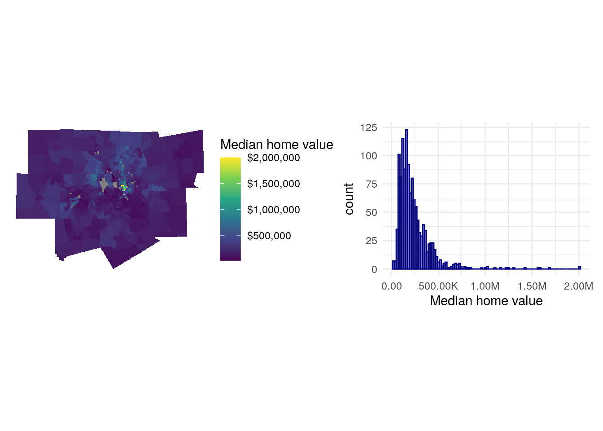
<p class="caption">(\#fig:visualize-home-value)Median home value charts</p>
</div>

As is common with home values in metropolitan regions, the data distribution is right-skewed with a clustering of Census tracts on the lower end of the distribution of values and a long tail of very expensive areas, generally located north of downtown Dallas. This can lead to downstream violations of normality in model residuals. In turn, we might consider log-transforming our outcome variable, which will make its distribution closer to normal and will better capture the geographic variations in home values that we are trying to model.


```r
library(tidyverse)
library(patchwork)

mhv_map_log <- ggplot(dfw_data, aes(fill = log(median_valueE))) + 
  geom_sf(color = NA) + 
  scale_fill_viridis_c() + 
  theme_void() + 
  labs(fill = "Median home\nvalue (log)")

mhv_histogram_log <- ggplot(dfw_data, aes(x = log(median_valueE))) + 
  geom_histogram(alpha = 0.5, fill = "navy", color = "navy",
                 bins = 100) + 
  theme_minimal() + 
  scale_x_continuous() + 
  labs(x = "Median home value (log)")

mhv_map_log + mhv_histogram_log
```

<div class="figure">

<p class="caption">(\#fig:visualize-logged-home-value)Logged median home value charts</p>
</div>

The expensive areas of north Dallas still stand out, but the log-transformation makes the distribution of values more normal and better shows geographic variation of home values on the map. This suggests that we require some data preparation prior to fitting the model.

### "Feature engineering"

A common term used when preparing data for regression modeling is "feature engineering," which refers to the transformation of predictors in ways that better represent the relationships between those predictors and the outcome variable. Many of the variables acquired from the ACS in the steps above are already "pre-engineered" as they were returned as percentages from the ACS data profile, saving some steps. However, some variables would benefit from additional transformation.

The code below creates two new variables: `pop_density`, which represents the number of people in each Census tract per square kilometer, and `median_structure_age`, which represents the median age of housing structures in the tract.


```r
library(sf)
library(units)

dfw_data_for_model <- dfw_data %>%
  mutate(pop_density = as.numeric(set_units(total_populationE / st_area(.), "1/km2")),
         median_structure_age = 2017 - median_year_builtE) %>%
  select(!ends_with("M")) %>% 
  rename_with(.fn = ~str_remove(.x, "E$")) %>%
  na.omit()
```

The calculation of the `pop_density` column appears more complicated, so it is helpful to read it from the inside out. The `st_area()` function from the sf package calculates the area of the Census tract; by default this will be in square meters, using the base measurement unit of the data's coordinate reference system. The `total_population` column is then divided by the area of the tract. Next, the `set_units()` function is used to convert the measurement to population per square kilometer using `"1/km2"`. Finally, the calculation is converted from a units vector to a numeric vector with `as.numeric()`. Calculating median structure age is more straightforward, as the `median_year_builtE` column is subtracted from 2017, the mid-point of the 5-year ACS period from which our data are derived. Finally, to simplify the dataset, margin of error columns are dropped, the `E` at the end of the estimate columns is removed with `rename_with()`, and tracts with `NA` values are dropped as well with `na.omit()`.

We can then examine our modified dataset:

<table class="table table-striped table-hover table-condensed table-responsive" style="margin-left: auto; margin-right: auto;">
<caption>(\#tab:inspect-dfw)Engineered predictors for regression modeling</caption>
 <thead>
  <tr>
   <th style="text-align:left;position: sticky; top:0; background-color: #FFFFFF;"> GEOID </th>
   <th style="text-align:right;position: sticky; top:0; background-color: #FFFFFF;"> median_value </th>
   <th style="text-align:right;position: sticky; top:0; background-color: #FFFFFF;"> median_rooms </th>
   <th style="text-align:right;position: sticky; top:0; background-color: #FFFFFF;"> total_population </th>
   <th style="text-align:right;position: sticky; top:0; background-color: #FFFFFF;"> median_age </th>
   <th style="text-align:right;position: sticky; top:0; background-color: #FFFFFF;"> median_year_built </th>
   <th style="text-align:right;position: sticky; top:0; background-color: #FFFFFF;"> median_income </th>
   <th style="text-align:right;position: sticky; top:0; background-color: #FFFFFF;"> pct_college </th>
   <th style="text-align:right;position: sticky; top:0; background-color: #FFFFFF;"> pct_foreign_born </th>
   <th style="text-align:right;position: sticky; top:0; background-color: #FFFFFF;"> pct_white </th>
   <th style="text-align:right;position: sticky; top:0; background-color: #FFFFFF;"> percent_ooh </th>
   <th style="text-align:left;position: sticky; top:0; background-color: #FFFFFF;"> geometry </th>
   <th style="text-align:right;position: sticky; top:0; background-color: #FFFFFF;"> pop_density </th>
   <th style="text-align:right;position: sticky; top:0; background-color: #FFFFFF;"> median_structure_age </th>
  </tr>
 </thead>
<tbody>
  <tr>
   <td style="text-align:left;"> 48085030100 </td>
   <td style="text-align:right;"> 185400 </td>
   <td style="text-align:right;"> 6.1 </td>
   <td style="text-align:right;"> 6121 </td>
   <td style="text-align:right;"> 36.8 </td>
   <td style="text-align:right;"> 1996 </td>
   <td style="text-align:right;"> 68032 </td>
   <td style="text-align:right;"> 13.9 </td>
   <td style="text-align:right;"> 923 </td>
   <td style="text-align:right;"> 72.7 </td>
   <td style="text-align:right;"> 78.1 </td>
   <td style="text-align:left;"> MULTIPOLYGON (((784027.9 21... </td>
   <td style="text-align:right;"> 18.94582 </td>
   <td style="text-align:right;"> 21 </td>
  </tr>
  <tr>
   <td style="text-align:left;"> 48085030201 </td>
   <td style="text-align:right;"> 298600 </td>
   <td style="text-align:right;"> 7.2 </td>
   <td style="text-align:right;"> 3360 </td>
   <td style="text-align:right;"> 39.1 </td>
   <td style="text-align:right;"> 1999 </td>
   <td style="text-align:right;"> 84455 </td>
   <td style="text-align:right;"> 31.0 </td>
   <td style="text-align:right;"> 150 </td>
   <td style="text-align:right;"> 78.5 </td>
   <td style="text-align:right;"> 78.5 </td>
   <td style="text-align:left;"> MULTIPOLYGON (((774843.6 21... </td>
   <td style="text-align:right;"> 36.32168 </td>
   <td style="text-align:right;"> 18 </td>
  </tr>
  <tr>
   <td style="text-align:left;"> 48085030202 </td>
   <td style="text-align:right;"> 358700 </td>
   <td style="text-align:right;"> 7.3 </td>
   <td style="text-align:right;"> 3476 </td>
   <td style="text-align:right;"> 41.8 </td>
   <td style="text-align:right;"> 1999 </td>
   <td style="text-align:right;"> 108523 </td>
   <td style="text-align:right;"> 37.2 </td>
   <td style="text-align:right;"> 324 </td>
   <td style="text-align:right;"> 77.2 </td>
   <td style="text-align:right;"> 89.9 </td>
   <td style="text-align:left;"> MULTIPOLYGON (((764886.2 21... </td>
   <td style="text-align:right;"> 22.60180 </td>
   <td style="text-align:right;"> 18 </td>
  </tr>
  <tr>
   <td style="text-align:left;"> 48085030203 </td>
   <td style="text-align:right;"> 242700 </td>
   <td style="text-align:right;"> 7.0 </td>
   <td style="text-align:right;"> 22332 </td>
   <td style="text-align:right;"> 32.1 </td>
   <td style="text-align:right;"> 2007 </td>
   <td style="text-align:right;"> 101194 </td>
   <td style="text-align:right;"> 33.0 </td>
   <td style="text-align:right;"> 2191 </td>
   <td style="text-align:right;"> 69.9 </td>
   <td style="text-align:right;"> 82.3 </td>
   <td style="text-align:left;"> MULTIPOLYGON (((776880.5 21... </td>
   <td style="text-align:right;"> 226.08704 </td>
   <td style="text-align:right;"> 10 </td>
  </tr>
  <tr>
   <td style="text-align:left;"> 48085030302 </td>
   <td style="text-align:right;"> 603000 </td>
   <td style="text-align:right;"> 10.0 </td>
   <td style="text-align:right;"> 5048 </td>
   <td style="text-align:right;"> 38.4 </td>
   <td style="text-align:right;"> 2011 </td>
   <td style="text-align:right;"> 172833 </td>
   <td style="text-align:right;"> 60.5 </td>
   <td style="text-align:right;"> 605 </td>
   <td style="text-align:right;"> 77.5 </td>
   <td style="text-align:right;"> 91.6 </td>
   <td style="text-align:left;"> MULTIPOLYGON (((761453.2 21... </td>
   <td style="text-align:right;"> 321.08475 </td>
   <td style="text-align:right;"> 6 </td>
  </tr>
</tbody>
</table>

### A first regression model

After inspecting the distribution of the outcome variable and completing feature engineering with respect to the predictors, we are ready to fit a first linear model. Our linear model with a log-transformed outcome variable can be written as follows:

$$
\begin{align*}\operatorname{log(median\_value)} &= \alpha + \beta_{1}(\operatorname{median\_rooms}) + \beta_{2}(\operatorname{median\_income})\ + \\&\quad \beta_{3}(\operatorname{pct\_college}) + \beta_{4}(\operatorname{pct\_foreign\_born}) + \\&\quad\beta_{5}(\operatorname{pct\_white})\ + \beta_{6}(\operatorname{median\_age}) + \\&\quad\beta_{7}(\operatorname{median\_structure\_age}) + \beta_{8}(\operatorname{percent\_ooh})\ + \\&\quad \beta_{9}(\operatorname{pop\_density}) + \beta_{10}(\operatorname{total\_population}) + \epsilon\end{align*}
$$\
where $\alpha$ is the model intercept, $\beta_{1}$ is the change in the log of median home value with a 1-unit increase in the median number of rooms (and so forth for all the model predictors) while holding all other predictors constant, and $\epsilon$ is the error term.

Model formulas in R are generally written as `outcome ~ predictor_1 + predictor_2 + ... + predictor_k`, where `k` is the number of model predictors. The formula can be supplied as a character string to the model function (as shown below) or supplied unquoted in the call to the function. We use `lm()` to fit the linear model, and then check the results with `summary()`.


```r
formula <- "log(median_value) ~ median_rooms + median_income + pct_college + pct_foreign_born + pct_white + median_age + median_structure_age + percent_ooh + pop_density + total_population"

model1 <- lm(formula = formula, data = dfw_data_for_model)

summary(model1)
```

```
## 
## Call:
## lm(formula = formula, data = dfw_data_for_model)
## 
## Residuals:
##      Min       1Q   Median       3Q      Max 
## -2.48648 -0.13749  0.01104  0.14980  1.47861 
## 
## Coefficients:
##                        Estimate Std. Error t value Pr(>|t|)    
## (Intercept)           1.113e+01  7.558e-02 147.247  < 2e-16 ***
## median_rooms         -1.483e-02  1.511e-02  -0.981  0.32662    
## median_income         6.155e-06  6.140e-07  10.024  < 2e-16 ***
## pct_college           1.509e-02  8.170e-04  18.470  < 2e-16 ***
## pct_foreign_born      8.704e-06  1.621e-05   0.537  0.59134    
## pct_white             2.644e-03  5.960e-04   4.437 9.95e-06 ***
## median_age            5.742e-03  1.986e-03   2.891  0.00391 ** 
## median_structure_age  2.400e-05  5.321e-05   0.451  0.65204    
## percent_ooh          -4.343e-03  7.503e-04  -5.788 8.99e-09 ***
## pop_density           4.287e-06  7.911e-06   0.542  0.58797    
## total_population      9.852e-06  4.026e-06   2.447  0.01453 *  
## ---
## Signif. codes:  0 '***' 0.001 '**' 0.01 '*' 0.05 '.' 0.1 ' ' 1
## 
## Residual standard error: 0.2952 on 1242 degrees of freedom
## Multiple R-squared:  0.7829,	Adjusted R-squared:  0.7812 
## F-statistic:   448 on 10 and 1242 DF,  p-value: < 2.2e-16
```

The printed summary gives us information about the model fit. The `Estimate` column represents the model parameters (the $\beta$ values), followed by the standard error, the t-value test statistic, and the *p*-value which helps us assess relative statistical significance. @james2013c (p. 67) provides a concise summary of how *p*-values should be interpreted:

> Roughly speaking, we interpret the *p-*value as follows: a small *p*-value indicates that it is unlikely to observe such a substantial association between the predictor and the response [outcome variable] due to chance, in the absence of any real association between the predictor and the response. Hence, if we see a small *p*-value, then we can infer that there is an association between the predictor and the response. We *reject the null hypothesis* -- that is, we declare a relationship to exist between X and Y -- if the *p-*value is small enough.

By convention, researchers will use *p*-value cutoffs of 0.05, 0.01, or 0.001, depending on the topic under study; these values are highlighted with asterisks in the model summary printout. Examining the model parameters and *p*-values suggests that median household income, bachelor's degree attainment, the percentage non-Hispanic white population, and median age are positively associated with median home values, whereas the percentage owner-occupied housing is negatively associated with median home values. The R-squared value is 0.78, suggesting that our model explains around 78 percent of the variance in `median_value`.

Somewhat surprisingly, `median_rooms` does not appear to have a significant relationship with median home value as per the model. On the one hand, this can be interpreted as "the effect of median rooms on median home value with all other predictors held constant" - but also could be suggestive of model mis-specification. As mentioned earlier, models using ACS data as predictors are highly vulnerable to *collinearity*. Collinearity occurs when two or more predictors are highly correlated with one another, which can lead to mis-interpretation of the actual relationships between predictors and the outcome variable.

One way to inspect for collinearity is to visualize the *correlation matrix* of the predictors, in which correlations between all predictors are calculated with one another. The `correlate()` function in the **corrr** package [@kuhn2020] offers a straightforward method for calculating a correlation matrix over a rectangular data frame.


```r
library(corrr)

dfw_estimates <- dfw_data_for_model %>%
  select(-GEOID, -median_value, -median_year_built) %>%
  st_drop_geometry()

correlations <- correlate(dfw_estimates, method = "pearson")
```

One calculated, the correlation matrix can be visualized with `network_plot()`:


```r
network_plot(correlations)
```

<div class="figure">
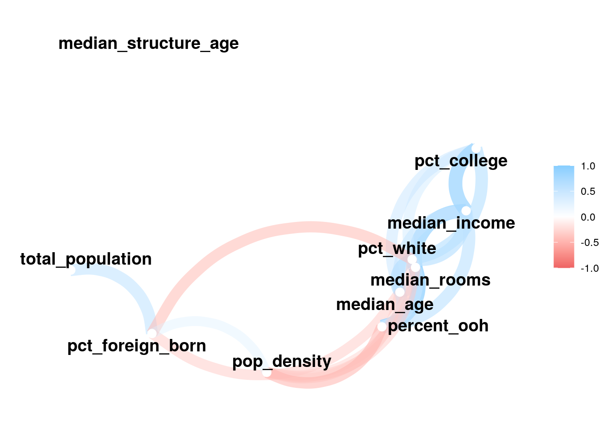
<p class="caption">(\#fig:network-plot)Network plot of correlations between model predictors</p>
</div>

We notice that most of the predictors are correlated with one another to some degree, which is unsurprising given that they all represent social demographic data. Collinearity can be diagnosed further by calculating the *variance inflation factor* (VIF) for the model, which takes into account not just pairwise correlations but the extent to which predictors are collinear with all other predictors. A VIF value of 1 indicates no collinearity; VIF values above 5 suggest a level of collinearity that has a problematic influence on model interpretation [@james2013c]. VIF is implemented by the `vif()` function in the **car** package [@fox2019].


```r
library(car)

vif(model1)
```

```
##         median_rooms        median_income          pct_college 
##             6.821157             8.024309             4.618074 
##     pct_foreign_born            pct_white           median_age 
##             2.702410             3.491267             2.208367 
## median_structure_age          percent_ooh          pop_density 
##             1.022674             4.753253             1.575666 
##     total_population 
##             2.142887
```

The most problematic variable is `median_income`, with a VIF value of over 8. A potential solution involves removing this variable and re-running the model; as it is highly correlated with other predictors in the model, the effect of median household income would in theory be captured by the remaining predictors.


```r
formula2 <- "log(median_value) ~ median_rooms + pct_college + pct_foreign_born + pct_white + median_age + median_structure_age + percent_ooh + pop_density + total_population"

model2 <- lm(formula = formula2, data = dfw_data_for_model)

summary(model2)
```

```
## 
## Call:
## lm(formula = formula2, data = dfw_data_for_model)
## 
## Residuals:
##      Min       1Q   Median       3Q      Max 
## -2.40162 -0.14110  0.00698  0.15523  1.63788 
## 
## Coefficients:
##                        Estimate Std. Error t value Pr(>|t|)    
## (Intercept)           1.090e+01  7.481e-02 145.676  < 2e-16 ***
## median_rooms          7.141e-02  1.291e-02   5.531 3.87e-08 ***
## pct_college           2.064e-02  6.240e-04  33.081  < 2e-16 ***
## pct_foreign_born      2.777e-05  1.673e-05   1.660   0.0971 .  
## pct_white             3.677e-03  6.100e-04   6.028 2.19e-09 ***
## median_age            4.139e-03  2.058e-03   2.012   0.0445 *  
## median_structure_age  1.543e-05  5.529e-05   0.279   0.7803    
## percent_ooh          -3.925e-03  7.785e-04  -5.041 5.31e-07 ***
## pop_density           7.409e-06  8.215e-06   0.902   0.3673    
## total_population      7.131e-06  4.174e-06   1.708   0.0878 .  
## ---
## Signif. codes:  0 '***' 0.001 '**' 0.01 '*' 0.05 '.' 0.1 ' ' 1
## 
## Residual standard error: 0.3068 on 1243 degrees of freedom
## Multiple R-squared:  0.7654,	Adjusted R-squared:  0.7637 
## F-statistic: 450.6 on 9 and 1243 DF,  p-value: < 2.2e-16
```

The model R-squared drops slightly but not substantially to 0.76. Notably, the effect of `median_rooms` on median home value now comes through as strongly positive and statistically significant, suggesting that collinearity with median household income was suppressing this relationship in the first model. As a diagnostic, we can re-compute the VIF for the second model:


```r
vif(model2)
```

```
##         median_rooms          pct_college     pct_foreign_born 
##             4.610142             2.494552             2.665189 
##            pct_white           median_age median_structure_age 
##             3.386907             2.194054             1.022410 
##          percent_ooh          pop_density     total_population 
##             4.738564             1.573224             2.133146
```

The VIF values for all predictors in the model are now below 5.

### Dimension reduction with principal components analysis

In the example above, dropping median household income from the model had a fairly negligible impact on the overall model fit and significantly improved the model's problems with collinearity. However, this will not always be the best solution for analysts, especially when dropping variables has a more significant impact on the model fit. An alternative approach to resolving problems with collinearity is *dimension reduction*, which transforms the predictors into a series of dimensions that represent the variance in the predictors but are uncorrelated with one another. Dimension reduction is also a useful technique when an analyst is dealing with a massive number of predictors (hundreds or even thousands) and needs to reduce the predictors in the model to a more manageable number while still retaining the ability to explain the variance in the outcome variable.

One of the most popular methods for dimension reduction is *principal components analysis*. Principal components analysis (PCA) reduces a higher-dimensional dataset into a lower-dimensional representation based linear combinations of the variables used. The *first principal component* is the linear combination of variables that explains the most overall variance in the data; the *second principal component* explains the second-most overall variance but is also constrained to be uncorrelated with the first component; and so forth.

PCA can be computed with the `prcomp()` function. We will use the `dfw_estimates` object that we used to compute the correlation data frame here as it includes only the predictors in the regression model, and use the notation `formula = ~.` to compute PCA over all the predictors. By convention, `scale.` and `center` should be set to `TRUE` as this normalizes the variables in the dataset before computing PCA given that they are measured differently.


```r
pca <- prcomp(
  formula = ~., 
  data = dfw_estimates, 
  scale. = TRUE, 
  center = TRUE
)

summary(pca)
```

```
## Importance of components:
##                           PC1    PC2    PC3    PC4     PC5     PC6    PC7
## Standard deviation     2.0451 1.3020 1.1292 0.9990 0.80857 0.66682 0.6229
## Proportion of Variance 0.4183 0.1695 0.1275 0.0998 0.06538 0.04446 0.0388
## Cumulative Proportion  0.4183 0.5878 0.7153 0.8151 0.88045 0.92492 0.9637
##                            PC8     PC9    PC10
## Standard deviation     0.42630 0.32794 0.27129
## Proportion of Variance 0.01817 0.01075 0.00736
## Cumulative Proportion  0.98189 0.99264 1.00000
```

Printing the `summary()` of the PCA model shows 10 components that collectively explain 100% of the variance in the original predictors. The first principal component explains 41.8 percent of the overall variance; the second explains 17 percent; and so forth.

To understand what the different principal components now mean, it is helpful to plot the variable *loadings*. This represents the relationships between the original variables in the model and the derived components. This approach is derived from Julia Silge's blog post on the topic [@silge2020].

First, the variable loading matrix (stored in the `rotation` element of the `pca` object) is converted to a tibble so we can view it easier.


```r
pca_tibble <- pca$rotation %>%
  as_tibble(rownames = "predictor")
```

<table class="table table-striped table-hover table-condensed table-responsive" style="margin-left: auto; margin-right: auto;">
<caption>(\#tab:pca-tibble-show)PCA variable loadings</caption>
 <thead>
  <tr>
   <th style="text-align:left;position: sticky; top:0; background-color: #FFFFFF;"> predictor </th>
   <th style="text-align:right;position: sticky; top:0; background-color: #FFFFFF;"> PC1 </th>
   <th style="text-align:right;position: sticky; top:0; background-color: #FFFFFF;"> PC2 </th>
   <th style="text-align:right;position: sticky; top:0; background-color: #FFFFFF;"> PC3 </th>
   <th style="text-align:right;position: sticky; top:0; background-color: #FFFFFF;"> PC4 </th>
   <th style="text-align:right;position: sticky; top:0; background-color: #FFFFFF;"> PC5 </th>
   <th style="text-align:right;position: sticky; top:0; background-color: #FFFFFF;"> PC6 </th>
   <th style="text-align:right;position: sticky; top:0; background-color: #FFFFFF;"> PC7 </th>
   <th style="text-align:right;position: sticky; top:0; background-color: #FFFFFF;"> PC8 </th>
   <th style="text-align:right;position: sticky; top:0; background-color: #FFFFFF;"> PC9 </th>
   <th style="text-align:right;position: sticky; top:0; background-color: #FFFFFF;"> PC10 </th>
  </tr>
 </thead>
<tbody>
  <tr>
   <td style="text-align:left;"> median_rooms </td>
   <td style="text-align:right;"> -0.4090133 </td>
   <td style="text-align:right;"> -0.2315839 </td>
   <td style="text-align:right;"> 0.1294997 </td>
   <td style="text-align:right;"> -0.1062506 </td>
   <td style="text-align:right;"> 0.4160170 </td>
   <td style="text-align:right;"> -0.1490841 </td>
   <td style="text-align:right;"> 0.0815549 </td>
   <td style="text-align:right;"> -0.2261685 </td>
   <td style="text-align:right;"> -0.3904059 </td>
   <td style="text-align:right;"> -0.5877935 </td>
  </tr>
  <tr>
   <td style="text-align:left;"> total_population </td>
   <td style="text-align:right;"> -0.0295549 </td>
   <td style="text-align:right;"> -0.6670723 </td>
   <td style="text-align:right;"> 0.1062555 </td>
   <td style="text-align:right;"> 0.0168430 </td>
   <td style="text-align:right;"> -0.4843805 </td>
   <td style="text-align:right;"> 0.1009209 </td>
   <td style="text-align:right;"> 0.2856905 </td>
   <td style="text-align:right;"> -0.4452406 </td>
   <td style="text-align:right;"> 0.1134291 </td>
   <td style="text-align:right;"> 0.0709454 </td>
  </tr>
  <tr>
   <td style="text-align:left;"> median_age </td>
   <td style="text-align:right;"> -0.3807340 </td>
   <td style="text-align:right;"> 0.1759268 </td>
   <td style="text-align:right;"> -0.0162161 </td>
   <td style="text-align:right;"> -0.0083145 </td>
   <td style="text-align:right;"> -0.0293581 </td>
   <td style="text-align:right;"> 0.7975732 </td>
   <td style="text-align:right;"> -0.3413550 </td>
   <td style="text-align:right;"> -0.2534675 </td>
   <td style="text-align:right;"> -0.0534283 </td>
   <td style="text-align:right;"> 0.0561319 </td>
  </tr>
  <tr>
   <td style="text-align:left;"> median_income </td>
   <td style="text-align:right;"> -0.4217974 </td>
   <td style="text-align:right;"> -0.1636128 </td>
   <td style="text-align:right;"> -0.2852666 </td>
   <td style="text-align:right;"> -0.0610486 </td>
   <td style="text-align:right;"> 0.1551824 </td>
   <td style="text-align:right;"> -0.2889482 </td>
   <td style="text-align:right;"> -0.0838855 </td>
   <td style="text-align:right;"> -0.0524015 </td>
   <td style="text-align:right;"> -0.3110098 </td>
   <td style="text-align:right;"> 0.7043660 </td>
  </tr>
  <tr>
   <td style="text-align:left;"> pct_college </td>
   <td style="text-align:right;"> -0.3263031 </td>
   <td style="text-align:right;"> -0.0187279 </td>
   <td style="text-align:right;"> -0.5883010 </td>
   <td style="text-align:right;"> -0.0024238 </td>
   <td style="text-align:right;"> -0.1603572 </td>
   <td style="text-align:right;"> -0.2515384 </td>
   <td style="text-align:right;"> -0.2770087 </td>
   <td style="text-align:right;"> -0.0653810 </td>
   <td style="text-align:right;"> 0.5301654 </td>
   <td style="text-align:right;"> -0.3098416 </td>
  </tr>
  <tr>
   <td style="text-align:left;"> pct_foreign_born </td>
   <td style="text-align:right;"> 0.1990002 </td>
   <td style="text-align:right;"> -0.6187500 </td>
   <td style="text-align:right;"> -0.1355999 </td>
   <td style="text-align:right;"> -0.1168251 </td>
   <td style="text-align:right;"> 0.0614476 </td>
   <td style="text-align:right;"> 0.2140267 </td>
   <td style="text-align:right;"> -0.4270678 </td>
   <td style="text-align:right;"> 0.5354397 </td>
   <td style="text-align:right;"> -0.1385110 </td>
   <td style="text-align:right;"> -0.0875255 </td>
  </tr>
  <tr>
   <td style="text-align:left;"> pct_white </td>
   <td style="text-align:right;"> -0.3953763 </td>
   <td style="text-align:right;"> 0.1252299 </td>
   <td style="text-align:right;"> -0.1338299 </td>
   <td style="text-align:right;"> 0.1088477 </td>
   <td style="text-align:right;"> -0.4840645 </td>
   <td style="text-align:right;"> 0.0994392 </td>
   <td style="text-align:right;"> 0.4127846 </td>
   <td style="text-align:right;"> 0.5279469 </td>
   <td style="text-align:right;"> -0.2898554 </td>
   <td style="text-align:right;"> -0.1445508 </td>
  </tr>
  <tr>
   <td style="text-align:left;"> percent_ooh </td>
   <td style="text-align:right;"> -0.3811992 </td>
   <td style="text-align:right;"> -0.1543321 </td>
   <td style="text-align:right;"> 0.3629358 </td>
   <td style="text-align:right;"> -0.1176951 </td>
   <td style="text-align:right;"> 0.3471589 </td>
   <td style="text-align:right;"> 0.1151789 </td>
   <td style="text-align:right;"> 0.2593986 </td>
   <td style="text-align:right;"> 0.3297543 </td>
   <td style="text-align:right;"> 0.5915015 </td>
   <td style="text-align:right;"> 0.1600287 </td>
  </tr>
  <tr>
   <td style="text-align:left;"> pop_density </td>
   <td style="text-align:right;"> 0.2448452 </td>
   <td style="text-align:right;"> -0.0555150 </td>
   <td style="text-align:right;"> -0.6133030 </td>
   <td style="text-align:right;"> -0.0662510 </td>
   <td style="text-align:right;"> 0.3818102 </td>
   <td style="text-align:right;"> 0.3395139 </td>
   <td style="text-align:right;"> 0.5386890 </td>
   <td style="text-align:right;"> -0.0697380 </td>
   <td style="text-align:right;"> 0.0183813 </td>
   <td style="text-align:right;"> 0.0018384 </td>
  </tr>
  <tr>
   <td style="text-align:left;"> median_structure_age </td>
   <td style="text-align:right;"> 0.0361103 </td>
   <td style="text-align:right;"> 0.1337122 </td>
   <td style="text-align:right;"> 0.0063884 </td>
   <td style="text-align:right;"> -0.9699938 </td>
   <td style="text-align:right;"> -0.1930152 </td>
   <td style="text-align:right;"> -0.0217227 </td>
   <td style="text-align:right;"> 0.0344143 </td>
   <td style="text-align:right;"> -0.0178155 </td>
   <td style="text-align:right;"> -0.0254289 </td>
   <td style="text-align:right;"> -0.0036424 </td>
  </tr>
</tbody>
</table>

Positive values for a given row mean that the original variable is *positively loaded* onto a given component, and negative values mean that the variable is *negatively loaded*. Larger values in each direction are of the most interest to us; values near 0 mean the variable is not meaningfully explained by a given component. To explore this further, we can visualize the first five components with **ggplot2**:


```r
pca_tibble %>%
  select(predictor:PC5) %>%
  pivot_longer(PC1:PC5, names_to = "component", values_to = "value") %>%
  ggplot(aes(x = value, y = predictor)) + 
  geom_col(fill = "darkgreen", color = "darkgreen", alpha = 0.5) + 
  facet_wrap(~component, nrow = 1) + 
  labs(y = NULL, x = "Value") + 
  theme_minimal()
```

<div class="figure">
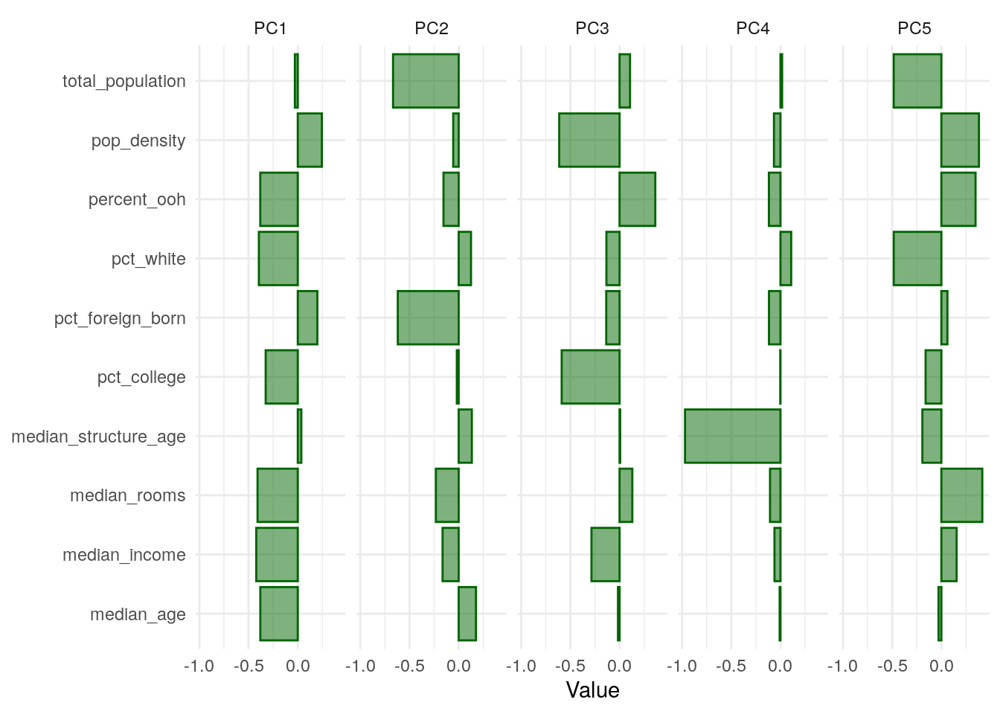
<p class="caption">(\#fig:pca-tibble-plot)Loadings for first five principal components</p>
</div>

With respect to PC1, which explains nearly 42 percent of the variance in the overall predictor set, the variables `percent_ooh`, `pct_white`, `pct_college`, `median_rooms`, `median_income`, and `median_age` load negatively, whereas `pop_density` and to a lesser extent `pct_foreign_born` load positively. We can attach these principal components to our original data with `predict()` and `cbind()`, then make a map of PC1 for further exploration:


```r
components <- predict(pca, dfw_estimates)

dfw_pca <- dfw_data_for_model %>%
  select(GEOID, median_value) %>%
  cbind(components) 

ggplot(dfw_pca, aes(fill = PC1)) +
  geom_sf(color = NA) +
  theme_void() +
  scale_fill_viridis_c()
```

<div class="figure">
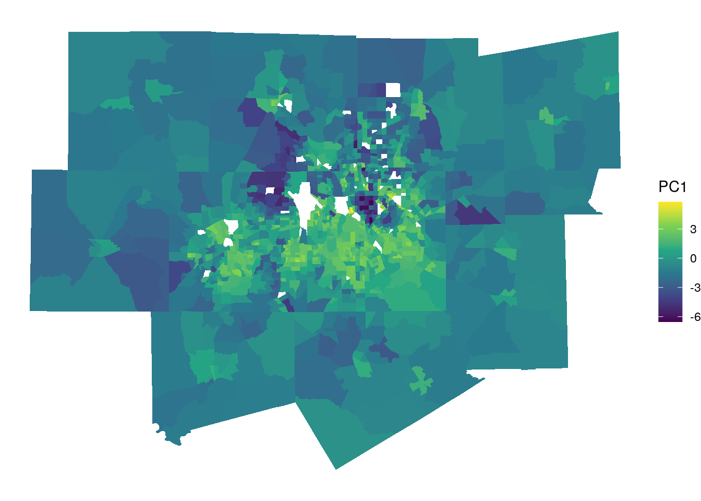
<p class="caption">(\#fig:pca_model)Map of principal component 1</p>
</div>

The map, along with the bar chart, helps us understand how the multiple variables represent latent social processes at play in Dallas-Fort Worth. The brighter yellow areas, which have higher values for PC1, are located in communities like east Fort Worth, east Arlington, Grand Prairie, and south Dallas. Generally speaking, these are low-to-middle income areas with larger nonwhite populations. The locations with the lowest values for PC1 are Southlake (northeast of Fort Worth) and Highland Park (north of downtown Dallas); these communities are segregated, predominantly non-Hispanic white, and are among the wealthiest neighborhoods in the entire United States. In turn, PC1 captures the gradient that represents these social differences, with which multiple demographic characteristics will be associated.

These principal components can be used for *principal components regression*, in which the derived components themselves are used as model predictors. Generally, components should be chosen that account for at least 90 percent of the original variance in the predictors, though this will often be up to the discretion of the analyst. In the example below, we will fit a model using the first six principal components and the log of median home value as the outcome variable.


```r
pca_formula <- paste0("log(median_value) ~ ", 
                      paste0('PC', 1:6, collapse = ' + '))

pca_model <- lm(formula = pca_formula, data = dfw_pca)

summary(pca_model)
```

```
## 
## Call:
## lm(formula = pca_formula, data = dfw_pca)
## 
## Residuals:
##     Min      1Q  Median      3Q     Max 
## -2.3572 -0.1453 -0.0008  0.1513  1.5871 
## 
## Coefficients:
##              Estimate Std. Error  t value Pr(>|t|)    
## (Intercept) 12.162977   0.008606 1413.264  < 2e-16 ***
## PC1         -0.198012   0.004210  -47.035  < 2e-16 ***
## PC2         -0.033101   0.006613   -5.006 6.37e-07 ***
## PC3         -0.314540   0.007625  -41.252  < 2e-16 ***
## PC4          0.002204   0.008618    0.256    0.798    
## PC5         -0.108924   0.010648  -10.229  < 2e-16 ***
## PC6         -0.118806   0.012912   -9.201  < 2e-16 ***
## ---
## Signif. codes:  0 '***' 0.001 '**' 0.01 '*' 0.05 '.' 0.1 ' ' 1
## 
## Residual standard error: 0.3046 on 1246 degrees of freedom
## Multiple R-squared:  0.7682,	Adjusted R-squared:  0.767 
## F-statistic: 688.1 on 6 and 1246 DF,  p-value: < 2.2e-16
```

The model fit, as represented by the R-squared value, is similar to the models fit earlier in this chapter. One possible disadvantage of principal components regression, however, is the interpretation of the results as the different variables which are comprehensible on their own are now spread across the components. It can be helpful to think of the different components as *indices* in this sense.

As discussed above, PC1 represents a gradient from segregated, older, wealthy, white communities on the low end to more diverse, lower-income, and younger communities on the high end; this PC is negatively associated with median home values, with tracks with expectations. Reviewing the plot above, PC3 is associated with lower population densities, incomes, and educational attainment, but higher levels of owner-occupied housing; in turn, it can be thought of as an urban (on the low end) to rural (on the high end) gradient. A negative association with median home value is then expected as home values are higher in the urban core than on the rural fringe of the metropolitan area.

## Spatial regression

A core assumption of the linear model is that the errors are independent of one another and normally distributed. Log-transforming the right-skewed outcome variable, median home values, was indented to resolve the latter; we can check this by adding the residuals for `model2` to our dataset and drawing a histogram to check its distribution.


```r
dfw_data_for_model$residuals <- residuals(model2)

ggplot(dfw_data_for_model, aes(x = residuals)) + 
  geom_histogram(bins = 100, alpha = 0.5, color = "navy",
                 fill = "navy") + 
  theme_minimal()
```

<div class="figure">
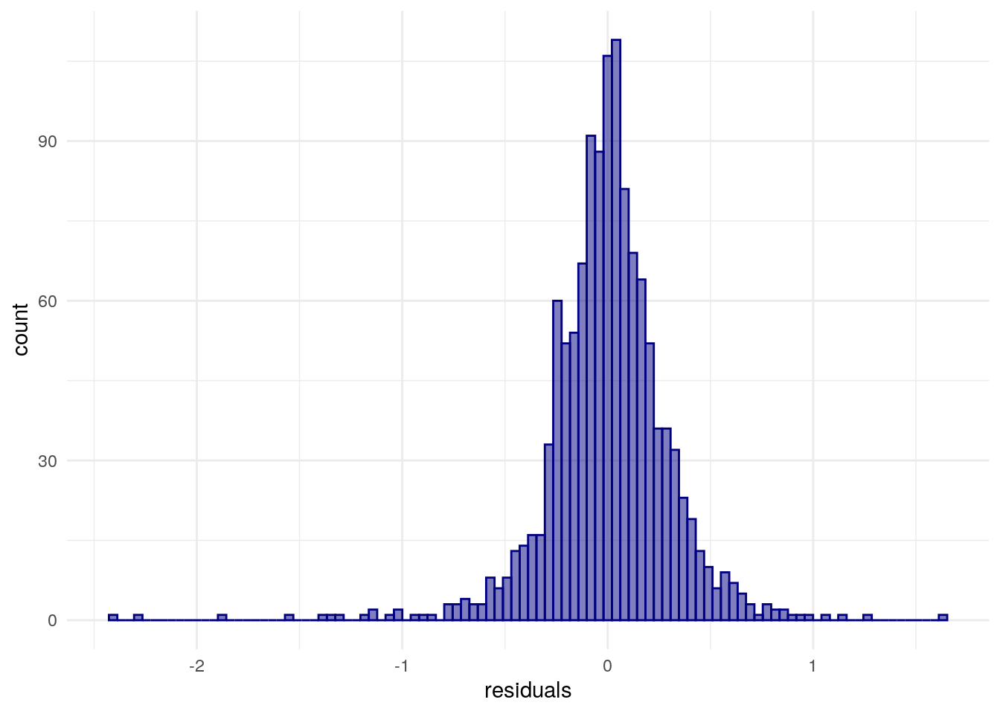
<p class="caption">(\#fig:residuals)Distribution of model residuals with a ggplot2 histogram</p>
</div>

The former assumption of independence of residuals is commonly violated in models that use spatial data, however. This is because models of spatial processes commonly are characterized by *spatial autocorrelation* in the error term, meaning that the model's performance itself depends on geographic location. We can assess this using techniques learned in the previous chapter such as Moran's $I$.


```r
library(spdep)

wts <- dfw_data_for_model %>%
  poly2nb() %>%
  nb2listw()

moran.test(dfw_data_for_model$residuals, wts)
```

```
## 
## 	Moran I test under randomisation
## 
## data:  dfw_data_for_model$residuals  
## weights: wts    
## 
## Moran I statistic standard deviate = 13.003, p-value < 2.2e-16
## alternative hypothesis: greater
## sample estimates:
## Moran I statistic       Expectation          Variance 
##      0.2107771756     -0.0007987220      0.0002647578
```

The Moran's $I$ test statistic is modest and positive (0.21) but is statistically significant. This can be visualized with a Moran scatterplot:


```r
dfw_data_for_model$lagged_residuals <- lag.listw(wts, dfw_data_for_model$residuals)

ggplot(dfw_data_for_model, aes(x = residuals, y = lagged_residuals)) + 
  theme_minimal() + 
  geom_point(alpha = 0.5) + 
  geom_smooth(method = "lm", color = "red")
```

<div class="figure">
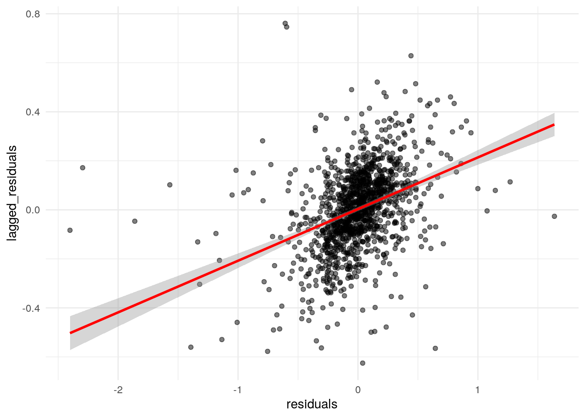
<p class="caption">(\#fig:residual-scatterplot)Moran scatterplot of residual spatial autocorrelation</p>
</div>

The plot illustrates the positive spatial autocorrelation in the residuals, suggesting that the assumption of independence in the model error term is violated. To resolve this issue, we can turn to *spatial regression methods*.

### Methods for spatial regression

The field of *spatial econometrics* is broadly concerned with the estimation and specification of models that are appropriate for handling spatial dependence in statistical processes. In general, two families of models are used to address these concerns with respect to regression: *spatial lag models* and *spatial error models*.

#### Spatial lag models

Spatial lag models account for spatial dependence by including a spatial lag of the outcome variable in the model. In doing so, it accounts for *spatial spillover effects* -- the possibility that values in neighboring areas have an influence on values in a given location. A spatial lag model can be written as follows [@rey2020]:

$$
{Y_i} = \alpha + \rho{Y_{lag-i}} + \sum_k \beta_k X_{ki} + \epsilon_i, 
$$

where

$$
Y_{lag-i} = \sum\limits_{j}w_{ij}Y_j
$$

with $w_{ij}$ representing the spatial weights. In this notation, $\rho$ is the parameter measuring the effect of the spatial lag in the outcome variable, and $k$ is the number of predictors in the model. However, the inclusion of a spatially lagged outcome variable on the right-hand side of the equation violates the exogeneity assumption of the linear model. In turn, special methods are required for estimating the spatial lag model, which are implemented in R in the **spatialreg** package [@applied2013]. Below, we use the function `lagsarlm()` to estimate the relationship between logged median home value and its predictors as a spatial lag model:


```r
library(spatialreg)

lag_model <- lagsarlm(
  formula = formula2, 
  data = dfw_data_for_model, 
  listw = wts
)

summary(lag_model, Nagelkerke = TRUE)
```

```
## 
## Call:lagsarlm(formula = formula2, data = dfw_data_for_model, listw = wts)
## 
## Residuals:
##        Min         1Q     Median         3Q        Max 
## -2.3723490 -0.1220521  0.0034481  0.1360878  1.5824870 
## 
## Type: lag 
## Coefficients: (asymptotic standard errors) 
##                         Estimate  Std. Error z value  Pr(>|z|)
## (Intercept)           7.3976e+00  3.1723e-01 23.3197 < 2.2e-16
## median_rooms          6.2134e-02  1.2239e-02  5.0767 3.839e-07
## pct_college           1.5958e-02  7.2885e-04 21.8944 < 2.2e-16
## pct_foreign_born      6.5953e-06  1.5829e-05  0.4167  0.676933
## pct_white             1.8154e-03  5.9211e-04  3.0661  0.002169
## median_age            3.6436e-03  1.9359e-03  1.8821  0.059819
## median_structure_age  1.0929e-07  5.2025e-05  0.0021  0.998324
## percent_ooh          -3.1303e-03  7.4195e-04 -4.2190 2.454e-05
## pop_density          -5.9826e-06  7.7643e-06 -0.7705  0.440987
## total_population      7.8832e-06  3.9279e-06  2.0070  0.044750
## 
## Rho: 0.31271, LR test value: 121.73, p-value: < 2.22e-16
## Asymptotic standard error: 0.027608
##     z-value: 11.327, p-value: < 2.22e-16
## Wald statistic: 128.3, p-value: < 2.22e-16
## 
## Log likelihood: -231.6933 for lag model
## ML residual variance (sigma squared): 0.083304, (sigma: 0.28862)
## Nagelkerke pseudo-R-squared: 0.7871 
## Number of observations: 1253 
## Number of parameters estimated: 12 
## AIC: 487.39, (AIC for lm: 607.12)
## LM test for residual autocorrelation
## test value: 24.391, p-value: 7.8631e-07
```

The general statistical relationships observed in the non-spatial model are preserved in the spatial lag model, though the effect sizes (the model parameters) shrink, illustrating the importance of controlling for the spatial lag. Additionally, the $\rho$ parameter is positive and statistically significant, suggesting the presence of spatial spillover effects. This finding makes practical sense, as median home values may be influenced by the values of homes in neighboring Census tracts along with the characteristics of the neighborhood itself. The argument `Nagelkerke = TRUE` computes a pseudo-R-squared value, which is slightly higher than the corresponding value for the non-spatial model.

#### Spatial error models

In contrast with spatial lag models, spatial error models include a spatial lag in model's error term. This is designed to capture latent spatial processes that are not currently being accounted for in the model estimation and in turn show up in the model's residuals. The spatial error model can be written as follows:

$$
Y_i = \alpha + \sum\limits_k\beta_kX_{ki} + u_i,
$$

where

$$
u_i = \lambda u_{lag-i} + \epsilon_i 
$$

and

$$
u_{lag-i} = \sum\limits_jw_{ij}u_j
$$

Like the spatial lag model, estimating the spatial error model requires special methods, implemented with the `errorsarlm()` function in **spatialreg**.


```r
error_model <- errorsarlm(
  formula = formula2, 
  data = dfw_data_for_model, 
  listw = wts
)

summary(error_model, Nagelkerke = TRUE)
```

```
## 
## Call:errorsarlm(formula = formula2, data = dfw_data_for_model, listw = wts)
## 
## Residuals:
##        Min         1Q     Median         3Q        Max 
## -2.4339197 -0.1149563 -0.0021212  0.1304131  1.6290693 
## 
## Type: error 
## Coefficients: (asymptotic standard errors) 
##                         Estimate  Std. Error  z value  Pr(>|z|)
## (Intercept)           1.1032e+01  7.8522e-02 140.4939 < 2.2e-16
## median_rooms          8.1476e-02  1.3405e-02   6.0779 1.217e-09
## pct_college           2.0181e-02  7.5671e-04  26.6693 < 2.2e-16
## pct_foreign_born      2.0499e-05  1.8562e-05   1.1043 0.2694505
## pct_white             2.6841e-03  7.7412e-04   3.4672 0.0005259
## median_age            3.3172e-03  2.0873e-03   1.5892 0.1120138
## median_structure_age -5.2096e-05  5.2417e-05  -0.9939 0.3202858
## percent_ooh          -4.8478e-03  7.7758e-04  -6.2345 4.532e-10
## pop_density          -7.2613e-06  8.7967e-06  -0.8255 0.4091127
## total_population      5.0509e-06  4.4601e-06   1.1325 0.2574403
## 
## Lambda: 0.47333, LR test value: 135.76, p-value: < 2.22e-16
## Asymptotic standard error: 0.036298
##     z-value: 13.04, p-value: < 2.22e-16
## Wald statistic: 170.04, p-value: < 2.22e-16
## 
## Log likelihood: -224.6815 for error model
## ML residual variance (sigma squared): 0.080341, (sigma: 0.28344)
## Nagelkerke pseudo-R-squared: 0.78947 
## Number of observations: 1253 
## Number of parameters estimated: 12 
## AIC: 473.36, (AIC for lm: 607.12)
```

The $\lambda$ value is large and statistically significant, again illustrating the importance of accounting for spatial autocorrelation in the model.

### Choosing between spatial lag and spatial error models

The spatial lag and spatial error models offer alternative approaches to accounting for processes of spatial autocorrelation when fitting models. This raises the question: which one of the two models should the analyst choose? On the one hand, this should be thought through in the context of the topic under study. For example, if spatial spillover effects are related to the hypotheses being evaluated by the analysts (e.g. the effect of neighboring home values on focal home values), a spatial lag model may be preferable; alternatively, if there are spatially autocorrelated factors that likely influence the outcome variable but are difficult to measure quantitatively (e.g. discrimination and racial bias in the housing market), a spatial error model might be preferred.

The two types of models can also be evaluated with respect to some quantitative metrics. For example, we can re-compute Moran's $I$ over the model residuals to see if the spatial model has resolved our problems with spatial dependence. First, we'll check the spatial lag model:


```r
moran.test(lag_model$residuals, wts)
```

```
## 
## 	Moran I test under randomisation
## 
## data:  lag_model$residuals  
## weights: wts    
## 
## Moran I statistic standard deviate = 3.7965, p-value = 7.339e-05
## alternative hypothesis: greater
## sample estimates:
## Moran I statistic       Expectation          Variance 
##      0.0609054865     -0.0007987220      0.0002641632
```

Next, the spatial error model:


```r
moran.test(error_model$residuals, wts)
```

```
## 
## 	Moran I test under randomisation
## 
## data:  error_model$residuals  
## weights: wts    
## 
## Moran I statistic standard deviate = -0.88352, p-value = 0.8115
## alternative hypothesis: greater
## sample estimates:
## Moran I statistic       Expectation          Variance 
##     -0.0151538315     -0.0007987220      0.0002639866
```

Both models reduce Moran's $I$; however, the error model does a better job of eliminating spatial autocorrelation in the residuals entirely. We can also use *Lagrange multiplier tests* to evaluate the appropriateness of these models together [@anselin1996]. These tests check for spatial error dependence, whether a spatially lagged dependent variable is missing, and the robustness of each in the presence of the other.

The `lm.LMtests()` function can be used with an input linear model to compute these tests:


```r
lm.LMtests(
  model2, 
  wts, 
  test = c("LMerr", "LMlag", "RLMerr", "RLMlag")
)
```

```
## 
## 	Lagrange multiplier diagnostics for spatial dependence
## 
## data:  
## model: lm(formula = formula2, data = dfw_data_for_model)
## weights: wts
## 
## LMerr = 165.73, df = 1, p-value < 2.2e-16
## 
## 
## 	Lagrange multiplier diagnostics for spatial dependence
## 
## data:  
## model: lm(formula = formula2, data = dfw_data_for_model)
## weights: wts
## 
## LMlag = 131.18, df = 1, p-value < 2.2e-16
## 
## 
## 	Lagrange multiplier diagnostics for spatial dependence
## 
## data:  
## model: lm(formula = formula2, data = dfw_data_for_model)
## weights: wts
## 
## RLMerr = 52.184, df = 1, p-value = 5.053e-13
## 
## 
## 	Lagrange multiplier diagnostics for spatial dependence
## 
## data:  
## model: lm(formula = formula2, data = dfw_data_for_model)
## weights: wts
## 
## RLMlag = 17.633, df = 1, p-value = 2.679e-05
```

All test statistics are large and statistically significant; in this case, the robust versions of the statistics should be compared. While both the lag and error models would be appropriate for this data, the test statistic for the robust version of the error model is larger, suggesting that the spatial error model should be preferred over the spatial lag model in this example.

## Geographically weighted regression

The models addressed in the previous sections -- both the regular linear model and its spatial adaptations -- estimate *global* relationships between the outcome variable, median home values, and its predictors. This lends itself to conclusions like "In the Dallas-Fort Worth metropolitan area, higher levels of educational attainment are associated with higher median home values." However, metropolitan regions like Dallas-Fort Worth are diverse and multifaceted. It is possible that a relationship between a predictor and the outcome variable that is observed for the entire region *on average* may vary significantly from neighborhood to neighborhood. This type of phenomenon is called *spatial non-stationarity*, and can be explored with *geographically weighted regression*, or GWR [@brunsdon1996].

GWR is a technique designed to evaluate local variations in the results of regression models given a kernel (distance-decay) weighting function. Following @lu2014, the basic form of GWR for a given location $i$ can be written as:

$$
Y_i = \alpha_i + \sum\limits_{k=1}^m\beta_{ik}X_{ik} + \epsilon_i
$$

where the model intercept, parameters, and error term are all location-specific. Notably, $\beta_{ik}$ represents a *local regression coefficient* for predictor $k$ (of the total number of predictors $m$) that is specific to location $i$.

GWR is implemented in the **GWmodel** R package [@gollini2015] as well as the spgwr package [@bivand_gwr]. These packages offer an interface to a wider family of geographically weighted methods, such as binomial, generalized linear, and robust geographically weighted regression; geographically weighted PCA; and geographically weighted summary statistics. The example below will adapt the regression model used in earlier examples to a locally-variation model with GWR.

### Choosing a bandwidth for GWR

GWR relies on the concept of a "kernel bandwidth" to compute the local regression model for each location. A kernel bandwidth is based on the kernel type (fixed or adaptive) and a distance-decay function. A fixed kernel uses a cutoff distance to determine which observations will be included in the local model for a given location $i$, whereas an adaptive kernel uses the nearest neighbors to a given location. In most circumstances with Census tract data where the size of tracts in a region will vary widely, an adaptive kernel will be preferred to a fixed kernel to ensure consistency of neighborhoods across the region. The distance-decay function then governs how observations will be weighted in the local model relative to their distance from location $i$. Closer tracts to $i$ will have a greater influence on the results for location $i$, with influence falling with distance.

Bandwidth sizes (either a distance cutoff or number of nearest neighbors) can be selected directly by the user; in the **GWmodel** R package, the `bw.gwr()` function also helps analysts choose an appropriate kernel bandwidth using cross-validation. The code below computes a bandwidth `bw` using this method. Note that we must first convert our data to a legacy `SpatialPolygonsDataFrame` object from the sp package as **GWmodel** does not yet support sf objects.


```r
library(GWmodel)
library(sf)

dfw_data_sp <- dfw_data_for_model %>%
  as_Spatial()

bw <- bw.gwr(
  formula = formula2, 
  data = dfw_data_sp, 
  kernel = "bisquare",
  adaptive = TRUE
)
```

`bw.gwr()` chose 131 as the number of nearest neighbors based on cross-validation. This means that for each Census tract, the nearest 131 of the total 1253 Census tracts in the Dallas-Fort Worth region will be used to estimate the local model, with weights calculated using the bisquare distance-decay function as follows:

$$
w_{ij} = 1-(\frac{d_{ij}^2}{h^2})^2
$$

where $d_{ij}$ is the distance between local observation $i$ and neighbor $j$, and $h$ is the kernel bandwidth. As we are using an adaptive kernel, $h$ will vary for each observation and take on the distance between location $i$ and its "neighbor" furthest from that location.

### Fitting and evaluating the GWR model

The basic form of GWR can be fit with the `gwr.basic()` function, which uses a similar argument structure to other models fit in this chapter. The formula can be passed to the `formula` parameter as a character string; we'll use the original formula with median household income omitted and include it below for a refresher. The derived bandwidth from `bw.gwr()` will be used with a bisquare, adaptive kernel.


```r
formula2 <- "log(median_value) ~ median_rooms + pct_college + pct_foreign_born + pct_white + median_age + median_structure_age + percent_ooh + pop_density + total_population"

gw_model <- gwr.basic(
  formula = formula2, 
  data = dfw_data_sp, 
  bw = bw,
  kernel = "bisquare",
  adaptive = TRUE
)
```

Printing the object `gw_model` will show both the results of the global model and the ranges of the locally varying parameter estimates. The model object itself has the following elements:


```r
names(gw_model)
```

```
## [1] "GW.arguments"  "GW.diagnostic" "lm"            "SDF"          
## [5] "timings"       "this.call"     "Ftests"
```

Each element provides information about the model fit, but perhaps most interesting to the analyst is the `SDF` element, in this case a `SpatialPolygonsDataFrame` containing mappable model results. We will extract that element from the model object and convert it to simple features, then take a look at the columns in the object.


```r
gw_model_results <- gw_model$SDF %>%
  st_as_sf() 

names(gw_model_results)
```

```
##  [1] "Intercept"               "median_rooms"           
##  [3] "pct_college"             "pct_foreign_born"       
##  [5] "pct_white"               "median_age"             
##  [7] "median_structure_age"    "percent_ooh"            
##  [9] "pop_density"             "total_population"       
## [11] "y"                       "yhat"                   
## [13] "residual"                "CV_Score"               
## [15] "Stud_residual"           "Intercept_SE"           
## [17] "median_rooms_SE"         "pct_college_SE"         
## [19] "pct_foreign_born_SE"     "pct_white_SE"           
## [21] "median_age_SE"           "median_structure_age_SE"
## [23] "percent_ooh_SE"          "pop_density_SE"         
## [25] "total_population_SE"     "Intercept_TV"           
## [27] "median_rooms_TV"         "pct_college_TV"         
## [29] "pct_foreign_born_TV"     "pct_white_TV"           
## [31] "median_age_TV"           "median_structure_age_TV"
## [33] "percent_ooh_TV"          "pop_density_TV"         
## [35] "total_population_TV"     "Local_R2"               
## [37] "geometry"
```

The sf object includes columns with local parameter estimates, standard errors, and t-values for each predictor, along with local diagnostic elements such as the Local R-squared, giving information about how well a model performs in any particular location. Below, we use ggplot2 and `geom_sf()` to map the local R-squared, though it may be useful as well to use `mapview::mapview(gw_model_results, zcol = "Local_R2"` and explore these results interactively.


```r
ggplot(gw_model_results, aes(fill = Local_R2)) + 
  geom_sf(color = NA) + 
  scale_fill_viridis_c() + 
  theme_void()
```

<div class="figure">
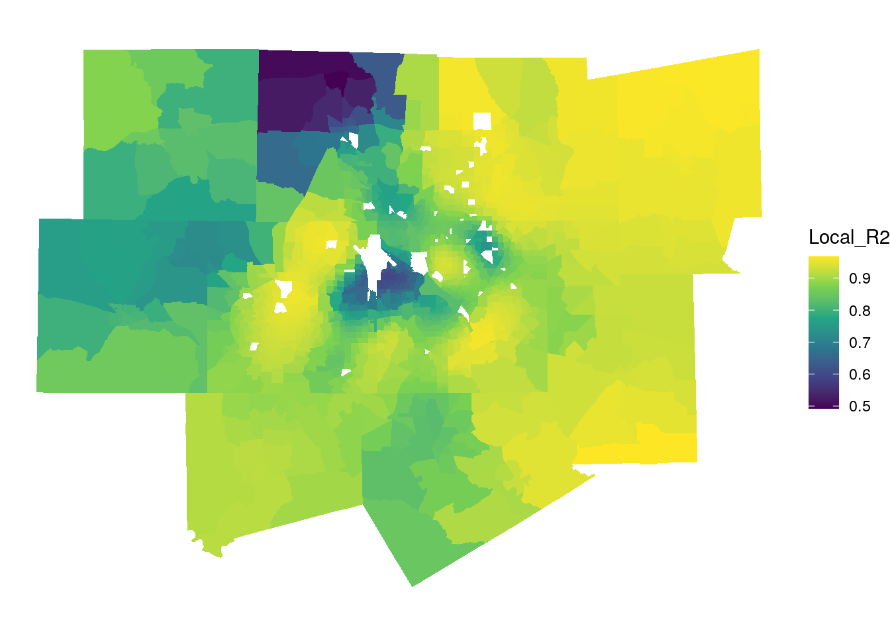
<p class="caption">(\#fig:map-local-r2)Local R-squared values from the GWR model</p>
</div>

The map suggests that the model performs very well in Fort Worth, Collin County, and the eastern edge of the metropolitan area, with local R-squared values exceeding 0.9. It performs worse in northwestern Denton County and in the areas near the Dallas-Fort Worth airport (the large missing area in the center of the map).

We can examine locally varying parameter estimates in much the same way. The first map below visualizes the local relationships between the percentage owner-occupied housing and median home values. Recall from the global model that this coefficient was negative and statistically significant.


```r
ggplot(gw_model_results, aes(fill = percent_ooh)) + 
  geom_sf(color = NA) + 
  scale_fill_viridis_c() + 
  theme_void() + 
  labs(fill = "Local β for \npercent_ooh")
```

<div class="figure">
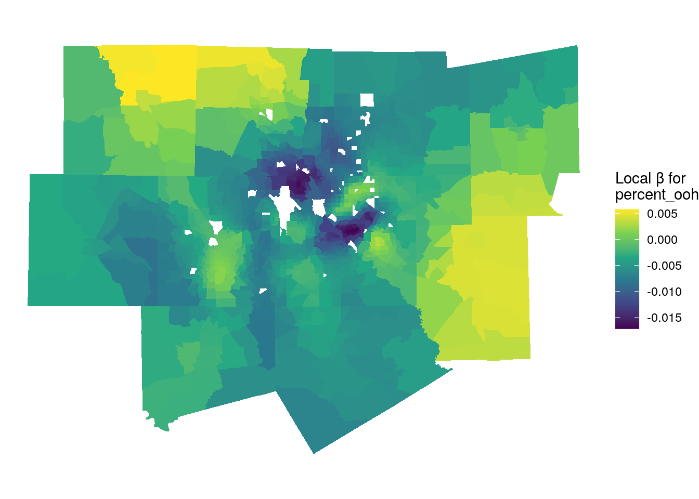
<p class="caption">(\#fig:map-ooh-betas)Local parameter estimates for percent owner-occupied housing</p>
</div>

The dark purple areas on the map are those areas where the global relationship in the model reflects the local relationship, as local parameter estimates are negative. The areas that stick out include the high-density area of uptown Dallas, where renter-occupied housing is common and median home values are very high. However, in rural areas on the fringe of the metropolitan area this relationship reverses, returning in some cases positive parameter estimates (the yellow parts of the map). This means that for those local areas, a greater percentage of owner-occupied housing is associated with higher home values.

We can also explore local variations for a predictor that was not statistically significant in the global model, median structure age:


```r
ggplot(gw_model_results, aes(fill = median_structure_age)) + 
  geom_sf(color = NA) + 
  scale_fill_viridis_c() + 
  theme_void() + 
  labs(fill = "Local β for \nmedian_structure_age")
```

<div class="figure">
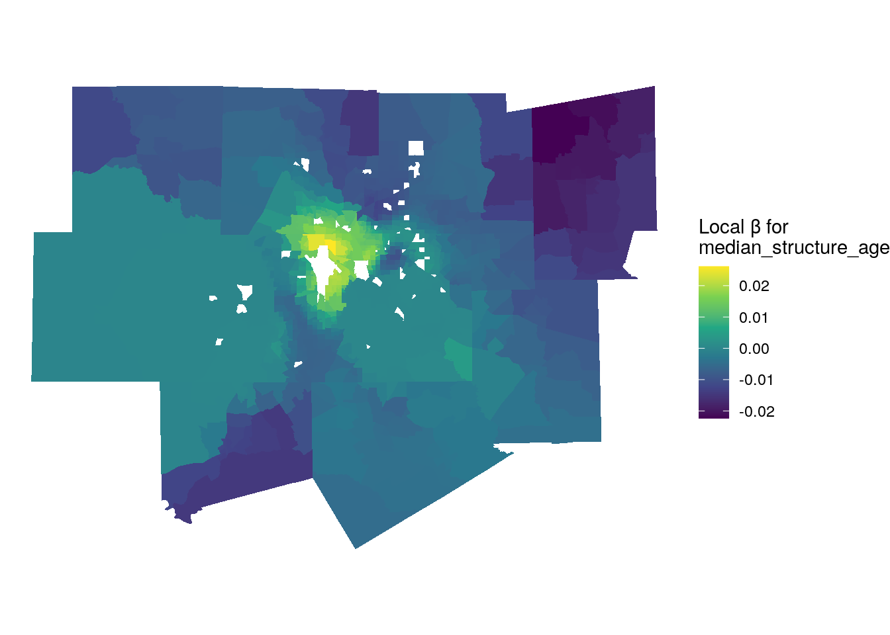
<p class="caption">(\#fig:map-structure-age-betas)Local parameter estimates for median structure age</p>
</div>

For large portions of the metropolitan area, the relationship between median age of structures and median home values is negligible, which is what drives the global relationship. However, in the areas around the airport, we see a positive relationship between the variables, suggesting that neighborhoods with older homes have higher home values. Conversely, on the rural fringe, we observe the opposite relationship. In rural areas with new suburban developments, this makes intuitive sense; new suburban subdivisions will attract a different buyer than existing older rural housing stock, and will likely be more expensive.

### Limitations of GWR

While GWR is an excellent method for exploring spatial non-stationarity in regression model results, it does have some limitations. When the **spgwr** package itself *is loaded into your R environment*, it prints the following warning:

> NOTE: This package does not constitute approval of GWR as a method of spatial analysis.

Why would an R package itself warn the user about its use? GWR is particularly susceptible to problems that plague other regression models using spatial data. Earlier sections in this chapter covered the topic of *collinearity*, where parameter estimates are biased due to high correlations between predictors. Given that predictor values tend to cluster spatially, GWR models often suffer from *local multicollinearity* where predictors are highly correlated in local areas.

Additionally, the impact of *edge effects* can be acute in GWR models. Edge effects - which are present in most spatial models and analysis techniques - refer to misleading results for observations on the edge of a dataset. In the example used in this chapter, the Dallas-Fort Worth metropolitan area represents the region under study. This artificially restricts the neighborhoods around Census tracts on the edge of the metropolitan area to only those tracts *that are also within the metropolitan area*, and omits the rural tracts that border them. For local models, this is a particular problem as results for observations on the edge of an area are based on incomplete information that may not reflect the true circumstances of that location.

With these concerns in mind, GWR is generally recommended as an *exploratory technique* that serves as a useful companion to the estimation of a global model. For example, a global parameter estimate may suggest that in Dallas-Fort Worth, median home values tend to be higher in areas with lower percentages of owner-occupied housing, controlling for other predictors in the model. GWR, used as a follow-up, helps the analyst understand that this global relationship is driven by higher home values near to urban cores such as in the uptown Dallas area, and may not necessarily characterize the dynamics of rural and exurban areas elsewhere in the metropolitan region.

## Classification and clustering of ACS data

The statistical models discussed earlier in this chapter were fit for the purpose of understanding relationships between an outcome variable and a series of predictors. In the social sciences, such models are generally used for *inference*, where a researcher tests those hypotheses with respect to those relationships to understand social processes. In industry, regression models are commonly used instead for *prediction,* where a model is trained on the relationship between an observed outcome and predictors then used to make predictions on out-of-sample data. In machine learning terminology, this is referred to as *supervised learning*, where the prediction target is known.

In other cases, the researcher is interested in discovering the structure of a dataset and generating meaningful labels for it rather than making predictions based on a known outcome. This type of approach is termed *unsupervised machine learning*. This section will explore two common applications of unsupervised machine learning with respect to demographic data: *geodemographic classification*, which identifies "clusters" of similar areas based on common demographic characteristics, and *regionalization*, which partitions an area into salient *regions* that are both spatially contiguous and share common demographic attributes.

### Geodemographic classification

*Geodemographic classification* refers to the grouping of geographic observations based on similar demographic (or other) characteristics [@singleton2013]. It is commonly used to generate neighborhood "typologies" that can help explain general similarities and differences among neighborhoods in a broader region. While the geodemographic approach has been criticized for essentializing neighborhoods [@goss1995], it is also widely used to understand dynamics of urban systems [@vicino2011] and has been proposed as a possible solution to problems with large margins of error for individual variables in the ACS [@spielman2015]. In industry, geodemographics are widely used for marketing and customer segmentation purposes. Popular frameworks include [Esri's Tapestry Segmentation](https://www.esri.com/en-us/arcgis/products/data/data-portfolio/tapestry-segmentation) and [Experian's Mosaic product](https://www.experian.com/marketing-services/consumer-segmentation).

While the exact methodology to produce a geodemographic classification system varies from implementation to implementation, the general process used involves *dimension reduction* applied to a high-dimensional input dataset of model features, followed by a *clustering algorithm* to partition observations into groups based on the derived dimensions. As we have already employed principal components analysis for dimension reduction on the Dallas-Fort Worth dataset, we can re-use those components for this purpose.

The *k*-means clustering algorithm is one of the most common unsupervised algorithms used to partition data in this way. *K-*means works by attempting to generate $K$ clusters that are internally similar but dissimilar from other clusters. Following @james2013c and @boehmke2019j, the goal of *K-*means clustering can be written as:

$$
\underset{C_1...C_k}{\text{minimize}}\left \{ \sum\limits_{k=1}^KW(C_k) \right \}
$$

where the within-cluster variation $W(C_k)$ is computed as

$$
W(C_k) = \sum_{x_i \in C_k}(x_{i} - \mu_k) ^ 2
$$

with $x_i$ representing an observation in the cluster $C_k$ and $\mu_k$ representing the mean value of all observations in cluster $C_k$.

To compute *k-*means, the analyst must first choose the number of desired clusters, represented with $k$. The analyst then specifies $k$ initial "centers" from the data (this is generally done at random) to seed the algorithm. The algorithm then iteratively assigns observations to clusters until the total within-cluster variation is minimized, returning a cluster solution.

In R, *k-*means can be computed with the `kmeans()` function. This example solution will generate 6 cluster groups. Given that the algorithm relies on random seeding of the cluster centers, `set.seed()` should be used to ensure stability of the solution.


```r
set.seed(1983)

dfw_kmeans <- dfw_pca %>%
  st_drop_geometry() %>%
  select(PC1:PC8) %>%
  kmeans(centers = 6)

table(dfw_kmeans$cluster)
```

```
## 
##   1   2   3   4   5   6 
##  65  88 380 200 180 340
```

The algorithm has partitioned the data into six clusters; the smallest (Cluster 1) has 65 Census tracts, whereas the largest (Cluster 3) has 380 Census tracts. At this stage, it is useful to explore the data in both *geographic space* and *variable space* to understand how the clusters differ from one another. We can assign the cluster ID to the original dataset as a new column and map it with `geom_sf()`.


```r
dfw_clusters <- dfw_pca %>%
  mutate(cluster = as.character(dfw_kmeans$cluster))

ggplot(dfw_clusters, aes(fill = cluster)) + 
  geom_sf(size = 0.1) + 
  scale_fill_brewer(palette = "Set1") + 
  theme_void() + 
  labs(fill = "Cluster ")
```

<div class="figure">
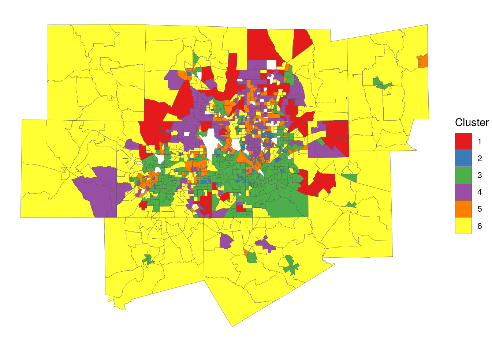
<p class="caption">(\#fig:map-clusters)Map of geodemographic clusters in Dallas-Fort Worth</p>
</div>

Some notable geographic patterns in the clusters are evident from the map, even if the viewer does not have local knowledge of the Dallas-Fort Worth region. Cluster 6 represents more rural communities on the edges of the metropolitan area, whereas Cluster 3 tends to be located in the core counties of Tarrant and Dallas as well as higher-density tracts in outer counties. Cluster 5 covers both big-city downtowns of Fort Worth and Dallas along with a scattering of suburban tracts.

A useful companion visualization to the map is a color-coded scatterplot using two of the principal components in the PCA dataset. We will use the two components discussed as "indices" in Section \@ref(dimension-reduction-with-principal-components-analysis): PC1, which is a gradient from affluent/older/white to lower-income/younger/nonwhite, and PC3, which is an urban-to-rural gradient. Given the data density, `ggplotly()` from the **plotly** package will convert the scatterplot to a graphic with an interactive legend, allowing the analyst to turn cluster groups on and off.


```r
library(plotly)

cluster_plot <- ggplot(dfw_clusters, 
                       aes(x = PC1, y = PC3, color = cluster)) + 
  geom_point() + 
  scale_color_brewer(palette = "Set1") + 
  theme_minimal()

ggplotly(cluster_plot) %>%
  layout(legend = list(orientation = "h", y = -0.15, 
                       x = 0.2, title = "Cluster"))
```

<div class="figure">

```{=html}
<div id="htmlwidget-fc54e5bbce7453b39897" style="width:100%;height:480px;" class="plotly html-widget"></div>
<script type="application/json" data-for="htmlwidget-fc54e5bbce7453b39897">{"x":{"data":[{"x":[-1.28449021836318,-2.4773344530903,-2.00170386562322,0.445774538432379,-0.910425648169213,-1.15213540458603,-1.05880407931013,-2.48147400684124,-0.770666413814161,-0.698563585919416,-1.2195074176092,-2.93973173678582,-0.228220514162649,-1.92520565756597,-2.60645282839406,-1.90740647033015,-1.40933879648861,-1.5144793364711,-1.03903618833089,1.2478308513311,0.795580696449422,1.03226713647113,-0.712224818132249,1.23982266598863,-0.234459345913672,-0.500009745266063,-0.494080847648061,0.314125707405848,-1.41489668871303,-1.24765333720211,-1.52117936985078,-0.115802073310115,0.282986346204963,-3.12559008647173,-2.92856275908142,-1.63631645363885,-1.03327355961769,-0.634201820163871,-2.06055394887832,-0.237001322474898,-3.05090463191475,0.560936069435346,-1.18145720291547,-0.920389038175646,-1.85319776671257,-0.996863551313032,-1.35770240878992,-1.83833476935642,-1.52314703063435,-0.00384055980040952,-1.74645705446138,-0.349380067418282,1.49309742839718,-1.02582369727282,-1.60649189374336,0.320294014056702,0.717980587182183,-0.83879836907878,-1.28693941653691,-0.145363083351875,-1.24182241910546,-1.12580951480872,-0.498512600156426,0.260516392786278,-1.81059451061775],"y":[1.22344518719514,0.76248266830248,-0.982328833941977,-0.742547674604633,-1.12882271480834,-1.02072130875323,-0.57521000833511,-0.805058320346866,0.219695358029521,1.08537478205199,0.404667572147923,0.0213574376245271,-0.111155068838741,0.0647204922970261,-0.936769849697285,-0.318319034876578,-0.175596503662405,-0.560257285156644,-1.17662360160551,-2.08826640372505,0.890937389984844,0.992054999157213,1.26966464047197,1.49960590567673,0.725948012986924,1.22000864914952,0.642544552544264,0.60738959369664,0.527862197153115,0.594520528907697,0.133490095831605,-0.569507680541192,0.531451015573106,0.445317444671244,0.366110816400214,1.16096842321812,0.981174052348268,0.525795020857515,0.362536322392312,-0.330248765928942,-0.959094365558988,-1.12379874034262,-0.869693979794867,1.40737782002548,1.20027260223259,1.12469881457386,0.983710809739941,1.06422212659723,0.404749197006136,0.205806171918858,0.1105829356522,0.351188290172256,0.321624208624423,0.911375403918751,-0.353539270636806,0.22673478674359,-0.288714404680141,-0.0794271362325883,0.259274549596935,0.61228312602551,0.276482325787635,0.0587601463430984,0.574563451013859,0.926295206141145,1.30581134758342],"text":["PC1: -1.284490218<br />PC3:  1.2234451872<br />cluster: 1","PC1: -2.477334453<br />PC3:  0.7624826683<br />cluster: 1","PC1: -2.001703866<br />PC3: -0.9823288339<br />cluster: 1","PC1:  0.445774538<br />PC3: -0.7425476746<br />cluster: 1","PC1: -0.910425648<br />PC3: -1.1288227148<br />cluster: 1","PC1: -1.152135405<br />PC3: -1.0207213088<br />cluster: 1","PC1: -1.058804079<br />PC3: -0.5752100083<br />cluster: 1","PC1: -2.481474007<br />PC3: -0.8050583203<br />cluster: 1","PC1: -0.770666414<br />PC3:  0.2196953580<br />cluster: 1","PC1: -0.698563586<br />PC3:  1.0853747821<br />cluster: 1","PC1: -1.219507418<br />PC3:  0.4046675721<br />cluster: 1","PC1: -2.939731737<br />PC3:  0.0213574376<br />cluster: 1","PC1: -0.228220514<br />PC3: -0.1111550688<br />cluster: 1","PC1: -1.925205658<br />PC3:  0.0647204923<br />cluster: 1","PC1: -2.606452828<br />PC3: -0.9367698497<br />cluster: 1","PC1: -1.907406470<br />PC3: -0.3183190349<br />cluster: 1","PC1: -1.409338796<br />PC3: -0.1755965037<br />cluster: 1","PC1: -1.514479336<br />PC3: -0.5602572852<br />cluster: 1","PC1: -1.039036188<br />PC3: -1.1766236016<br />cluster: 1","PC1:  1.247830851<br />PC3: -2.0882664037<br />cluster: 1","PC1:  0.795580696<br />PC3:  0.8909373900<br />cluster: 1","PC1:  1.032267136<br />PC3:  0.9920549992<br />cluster: 1","PC1: -0.712224818<br />PC3:  1.2696646405<br />cluster: 1","PC1:  1.239822666<br />PC3:  1.4996059057<br />cluster: 1","PC1: -0.234459346<br />PC3:  0.7259480130<br />cluster: 1","PC1: -0.500009745<br />PC3:  1.2200086491<br />cluster: 1","PC1: -0.494080848<br />PC3:  0.6425445525<br />cluster: 1","PC1:  0.314125707<br />PC3:  0.6073895937<br />cluster: 1","PC1: -1.414896689<br />PC3:  0.5278621972<br />cluster: 1","PC1: -1.247653337<br />PC3:  0.5945205289<br />cluster: 1","PC1: -1.521179370<br />PC3:  0.1334900958<br />cluster: 1","PC1: -0.115802073<br />PC3: -0.5695076805<br />cluster: 1","PC1:  0.282986346<br />PC3:  0.5314510156<br />cluster: 1","PC1: -3.125590086<br />PC3:  0.4453174447<br />cluster: 1","PC1: -2.928562759<br />PC3:  0.3661108164<br />cluster: 1","PC1: -1.636316454<br />PC3:  1.1609684232<br />cluster: 1","PC1: -1.033273560<br />PC3:  0.9811740523<br />cluster: 1","PC1: -0.634201820<br />PC3:  0.5257950209<br />cluster: 1","PC1: -2.060553949<br />PC3:  0.3625363224<br />cluster: 1","PC1: -0.237001322<br />PC3: -0.3302487659<br />cluster: 1","PC1: -3.050904632<br />PC3: -0.9590943656<br />cluster: 1","PC1:  0.560936069<br />PC3: -1.1237987403<br />cluster: 1","PC1: -1.181457203<br />PC3: -0.8696939798<br />cluster: 1","PC1: -0.920389038<br />PC3:  1.4073778200<br />cluster: 1","PC1: -1.853197767<br />PC3:  1.2002726022<br />cluster: 1","PC1: -0.996863551<br />PC3:  1.1246988146<br />cluster: 1","PC1: -1.357702409<br />PC3:  0.9837108097<br />cluster: 1","PC1: -1.838334769<br />PC3:  1.0642221266<br />cluster: 1","PC1: -1.523147031<br />PC3:  0.4047491970<br />cluster: 1","PC1: -0.003840560<br />PC3:  0.2058061719<br />cluster: 1","PC1: -1.746457054<br />PC3:  0.1105829357<br />cluster: 1","PC1: -0.349380067<br />PC3:  0.3511882902<br />cluster: 1","PC1:  1.493097428<br />PC3:  0.3216242086<br />cluster: 1","PC1: -1.025823697<br />PC3:  0.9113754039<br />cluster: 1","PC1: -1.606491894<br />PC3: -0.3535392706<br />cluster: 1","PC1:  0.320294014<br />PC3:  0.2267347867<br />cluster: 1","PC1:  0.717980587<br />PC3: -0.2887144047<br />cluster: 1","PC1: -0.838798369<br />PC3: -0.0794271362<br />cluster: 1","PC1: -1.286939417<br />PC3:  0.2592745496<br />cluster: 1","PC1: -0.145363083<br />PC3:  0.6122831260<br />cluster: 1","PC1: -1.241822419<br />PC3:  0.2764823258<br />cluster: 1","PC1: -1.125809515<br />PC3:  0.0587601463<br />cluster: 1","PC1: -0.498512600<br />PC3:  0.5745634510<br />cluster: 1","PC1:  0.260516393<br />PC3:  0.9262952061<br />cluster: 1","PC1: -1.810594511<br />PC3:  1.3058113476<br />cluster: 1"],"type":"scatter","mode":"markers","marker":{"autocolorscale":false,"color":"rgba(228,26,28,1)","opacity":1,"size":5.66929133858268,"symbol":"circle","line":{"width":1.88976377952756,"color":"rgba(228,26,28,1)"}},"hoveron":"points","name":"1","legendgroup":"1","showlegend":true,"xaxis":"x","yaxis":"y","hoverinfo":"text","frame":null},{"x":[2.84417247473929,3.16327313735362,2.77743627720342,2.97799552414385,2.18778959842414,2.8487540593985,2.13595932489706,2.57726253174486,3.21353581075906,3.55268914417936,2.07230424876495,1.17259782922049,2.88750458310282,2.67959146230512,3.25677508635617,3.11022523002063,3.12420020041332,2.50546253587206,2.49581836444668,4.93629039979181,5.77313322970946,2.48754787163252,3.37402893430258,4.12845802613176,5.0290281551282,3.40609095286465,3.1811406530943,2.73971211706363,5.45433031744435,3.05222173342346,3.43675829277841,3.48433931265648,3.13531139120328,3.45643925082297,3.43660926818608,3.29594884556959,3.41544839610924,3.88430744736725,3.04958755081555,3.94055882321751,4.25843400128608,2.57130888754589,2.72194357107544,3.6430094905451,3.41102570822186,3.3068209372045,3.88768960898785,2.90246997838508,1.84835468568922,2.48508206060136,3.26338675784437,4.41827889864606,3.37850511595552,3.00583746677709,2.88735745112953,2.73252609093797,2.36443503730696,4.46597339853376,4.69668428514468,1.87560998785584,3.49695762168107,2.73039193241387,4.26716096370712,2.34139765984664,2.19464598473701,3.58909325861497,3.21635331570048,2.82368364747899,1.8714928186665,1.84503514896784,2.7035095083095,3.11054587039332,2.04031381640954,2.3121608293612,2.59435693717838,3.45981319195692,3.25020874570082,3.21644848880707,3.12425892200546,2.36594837416237,2.52654734135582,2.66077796950475,3.09967372717503,3.55433764742256,4.06691891350035,3.42557902192531,3.50163834981786,2.80354965568496],"y":[-3.04681663973468,-2.5751705566716,-1.34742088451284,-2.23495057657477,-2.21551422290718,-2.52850611501852,-3.42976110252292,-0.919354331221313,-0.962573683877102,-1.87013465575271,-5.34118787324876,-4.70192254959414,-0.858404437662726,-0.616827246609269,-0.284358641480445,-0.40754761549915,-0.398959317709016,-0.326127678440579,-0.509488173348344,-2.51670237716625,-3.90112854637884,-1.18070245755752,-2.14390269038623,-1.81032198967582,-3.98446528526284,-0.857860383792289,-2.55608112617416,-0.473996026177652,-3.26087562481753,-0.0387605427950163,-0.00797212252250623,-0.277732276061224,-1.03705703194945,-0.599730072356079,-0.421670627428663,-0.731514933039573,-1.17699520246944,-1.8483483327523,-3.64948140671899,-1.99530978431111,-4.68259638376326,-3.97678994324442,-2.71463835058066,-1.74954098500129,-1.3738552589386,-2.80034086715322,-4.02703357108162,-0.914820115190238,-2.47373809934706,-2.67296445562591,-1.01886046945932,-3.12730706399686,-4.46812618735947,-0.729362498569494,-0.404468766262528,-0.504529154292257,-0.600069385810179,-3.59991964502106,-3.6552972228226,-1.01450017972596,-1.81461864652714,-0.723053301946834,-2.82552996702123,-0.871690769244444,-1.2363334947763,-1.60845121321476,-0.936852697110683,-1.27490157367577,-1.17164726657079,-1.27284940572366,-2.10998571147992,-3.7501849552858,-1.48902133438355,-0.785024235872556,-0.477030466630854,-1.13260155269577,-0.517762266440547,-0.925404846711029,-2.12878099815284,-0.644861126661308,-2.60725802223068,-1.23896099794116,-0.452551483321956,-0.103410182214719,-1.31773379340038,-0.595134390423706,-1.37476061826352,-0.0570215911559722],"text":["PC1:  2.844172475<br />PC3: -3.0468166397<br />cluster: 2","PC1:  3.163273137<br />PC3: -2.5751705567<br />cluster: 2","PC1:  2.777436277<br />PC3: -1.3474208845<br />cluster: 2","PC1:  2.977995524<br />PC3: -2.2349505766<br />cluster: 2","PC1:  2.187789598<br />PC3: -2.2155142229<br />cluster: 2","PC1:  2.848754059<br />PC3: -2.5285061150<br />cluster: 2","PC1:  2.135959325<br />PC3: -3.4297611025<br />cluster: 2","PC1:  2.577262532<br />PC3: -0.9193543312<br />cluster: 2","PC1:  3.213535811<br />PC3: -0.9625736839<br />cluster: 2","PC1:  3.552689144<br />PC3: -1.8701346558<br />cluster: 2","PC1:  2.072304249<br />PC3: -5.3411878732<br />cluster: 2","PC1:  1.172597829<br />PC3: -4.7019225496<br />cluster: 2","PC1:  2.887504583<br />PC3: -0.8584044377<br />cluster: 2","PC1:  2.679591462<br />PC3: -0.6168272466<br />cluster: 2","PC1:  3.256775086<br />PC3: -0.2843586415<br />cluster: 2","PC1:  3.110225230<br />PC3: -0.4075476155<br />cluster: 2","PC1:  3.124200200<br />PC3: -0.3989593177<br />cluster: 2","PC1:  2.505462536<br />PC3: -0.3261276784<br />cluster: 2","PC1:  2.495818364<br />PC3: -0.5094881733<br />cluster: 2","PC1:  4.936290400<br />PC3: -2.5167023772<br />cluster: 2","PC1:  5.773133230<br />PC3: -3.9011285464<br />cluster: 2","PC1:  2.487547872<br />PC3: -1.1807024576<br />cluster: 2","PC1:  3.374028934<br />PC3: -2.1439026904<br />cluster: 2","PC1:  4.128458026<br />PC3: -1.8103219897<br />cluster: 2","PC1:  5.029028155<br />PC3: -3.9844652853<br />cluster: 2","PC1:  3.406090953<br />PC3: -0.8578603838<br />cluster: 2","PC1:  3.181140653<br />PC3: -2.5560811262<br />cluster: 2","PC1:  2.739712117<br />PC3: -0.4739960262<br />cluster: 2","PC1:  5.454330317<br />PC3: -3.2608756248<br />cluster: 2","PC1:  3.052221733<br />PC3: -0.0387605428<br />cluster: 2","PC1:  3.436758293<br />PC3: -0.0079721225<br />cluster: 2","PC1:  3.484339313<br />PC3: -0.2777322761<br />cluster: 2","PC1:  3.135311391<br />PC3: -1.0370570319<br />cluster: 2","PC1:  3.456439251<br />PC3: -0.5997300724<br />cluster: 2","PC1:  3.436609268<br />PC3: -0.4216706274<br />cluster: 2","PC1:  3.295948846<br />PC3: -0.7315149330<br />cluster: 2","PC1:  3.415448396<br />PC3: -1.1769952025<br />cluster: 2","PC1:  3.884307447<br />PC3: -1.8483483328<br />cluster: 2","PC1:  3.049587551<br />PC3: -3.6494814067<br />cluster: 2","PC1:  3.940558823<br />PC3: -1.9953097843<br />cluster: 2","PC1:  4.258434001<br />PC3: -4.6825963838<br />cluster: 2","PC1:  2.571308888<br />PC3: -3.9767899432<br />cluster: 2","PC1:  2.721943571<br />PC3: -2.7146383506<br />cluster: 2","PC1:  3.643009491<br />PC3: -1.7495409850<br />cluster: 2","PC1:  3.411025708<br />PC3: -1.3738552589<br />cluster: 2","PC1:  3.306820937<br />PC3: -2.8003408672<br />cluster: 2","PC1:  3.887689609<br />PC3: -4.0270335711<br />cluster: 2","PC1:  2.902469978<br />PC3: -0.9148201152<br />cluster: 2","PC1:  1.848354686<br />PC3: -2.4737380993<br />cluster: 2","PC1:  2.485082061<br />PC3: -2.6729644556<br />cluster: 2","PC1:  3.263386758<br />PC3: -1.0188604695<br />cluster: 2","PC1:  4.418278899<br />PC3: -3.1273070640<br />cluster: 2","PC1:  3.378505116<br />PC3: -4.4681261874<br />cluster: 2","PC1:  3.005837467<br />PC3: -0.7293624986<br />cluster: 2","PC1:  2.887357451<br />PC3: -0.4044687663<br />cluster: 2","PC1:  2.732526091<br />PC3: -0.5045291543<br />cluster: 2","PC1:  2.364435037<br />PC3: -0.6000693858<br />cluster: 2","PC1:  4.465973399<br />PC3: -3.5999196450<br />cluster: 2","PC1:  4.696684285<br />PC3: -3.6552972228<br />cluster: 2","PC1:  1.875609988<br />PC3: -1.0145001797<br />cluster: 2","PC1:  3.496957622<br />PC3: -1.8146186465<br />cluster: 2","PC1:  2.730391932<br />PC3: -0.7230533019<br />cluster: 2","PC1:  4.267160964<br />PC3: -2.8255299670<br />cluster: 2","PC1:  2.341397660<br />PC3: -0.8716907692<br />cluster: 2","PC1:  2.194645985<br />PC3: -1.2363334948<br />cluster: 2","PC1:  3.589093259<br />PC3: -1.6084512132<br />cluster: 2","PC1:  3.216353316<br />PC3: -0.9368526971<br />cluster: 2","PC1:  2.823683647<br />PC3: -1.2749015737<br />cluster: 2","PC1:  1.871492819<br />PC3: -1.1716472666<br />cluster: 2","PC1:  1.845035149<br />PC3: -1.2728494057<br />cluster: 2","PC1:  2.703509508<br />PC3: -2.1099857115<br />cluster: 2","PC1:  3.110545870<br />PC3: -3.7501849553<br />cluster: 2","PC1:  2.040313816<br />PC3: -1.4890213344<br />cluster: 2","PC1:  2.312160829<br />PC3: -0.7850242359<br />cluster: 2","PC1:  2.594356937<br />PC3: -0.4770304666<br />cluster: 2","PC1:  3.459813192<br />PC3: -1.1326015527<br />cluster: 2","PC1:  3.250208746<br />PC3: -0.5177622664<br />cluster: 2","PC1:  3.216448489<br />PC3: -0.9254048467<br />cluster: 2","PC1:  3.124258922<br />PC3: -2.1287809982<br />cluster: 2","PC1:  2.365948374<br />PC3: -0.6448611267<br />cluster: 2","PC1:  2.526547341<br />PC3: -2.6072580222<br />cluster: 2","PC1:  2.660777970<br />PC3: -1.2389609979<br />cluster: 2","PC1:  3.099673727<br />PC3: -0.4525514833<br />cluster: 2","PC1:  3.554337647<br />PC3: -0.1034101822<br />cluster: 2","PC1:  4.066918914<br />PC3: -1.3177337934<br />cluster: 2","PC1:  3.425579022<br />PC3: -0.5951343904<br />cluster: 2","PC1:  3.501638350<br />PC3: -1.3747606183<br />cluster: 2","PC1:  2.803549656<br />PC3: -0.0570215912<br />cluster: 2"],"type":"scatter","mode":"markers","marker":{"autocolorscale":false,"color":"rgba(55,126,184,1)","opacity":1,"size":5.66929133858268,"symbol":"circle","line":{"width":1.88976377952756,"color":"rgba(55,126,184,1)"}},"hoveron":"points","name":"2","legendgroup":"2","showlegend":true,"xaxis":"x","yaxis":"y","hoverinfo":"text","frame":null},{"x":[0.495107352533522,1.58542817628472,1.94323318134625,2.18620633735099,1.19819426688789,1.06836780633758,1.03688019228725,1.27526136615634,2.10787976913507,1.35160448905203,2.57798109426871,2.85971506906779,1.82222975627675,1.5222001894017,1.27385354298937,2.78428459817038,1.46188496657113,2.60844620527553,1.56822799161652,2.54373705669156,1.88812793597399,1.99120553887666,1.59547641870967,2.19429253026925,1.95007155769785,1.82151622157466,1.28504132863211,2.885285163777,2.22406438123952,0.963603062770923,2.76926773893627,1.56480767527008,2.52716626563761,1.77436076197373,1.3332615043216,2.06648001942524,1.72882464185032,3.18642214058641,3.17423398279145,2.14840158802893,2.08600627703231,1.00936242416443,3.05090843861337,2.61262550283384,1.38588471718043,2.02297805835282,0.871600273518254,0.652129374541301,1.79595896491606,2.41760268142011,2.52957307521119,1.69542193674626,2.52458387057693,1.32055974663966,2.22898121582007,2.04235681652309,2.65422071974656,1.92036455353041,1.40506380045283,3.49509137135828,1.44495552673946,0.478904347965826,0.485463753892466,0.742413863577253,1.97308754029407,1.46525794643066,1.66670759279918,1.62354487126024,2.27597634979871,2.66076081017249,1.87413311396065,2.69316705943495,0.670182027296528,2.27676858248476,2.8704946006918,2.81618274170879,3.02738814416332,0.93450567338272,1.54910337499681,1.75980910133543,3.02555938524369,1.56126980515427,0.500130804646388,2.52883055380394,2.69843416241671,1.65657785873213,1.74072411725204,1.93078491672256,1.65203551941298,2.67320718712151,2.12272952283197,2.75681355819232,0.623510170960707,0.322908282245892,2.43596810989697,1.87325806131928,1.76721636301857,2.19497880877285,1.62840540075318,1.15746311124646,0.648096887452334,2.91591976600455,2.12289969690811,0.517566313473568,2.79839446024957,1.44738768382081,1.39756701754254,2.43183902096971,1.3294119269774,1.42159741322218,1.77065918467357,2.73193807415566,1.70656487746423,1.61013784587767,1.24214700777037,2.60212347609814,0.85535270182396,2.5655916756931,1.30608362862021,2.07350822016776,2.92566216708856,1.64217417479269,2.30257703068574,1.78130229886466,1.1472031809375,2.58629090426104,0.725597481083327,2.05884721738312,1.21884026309503,1.04180541766108,1.32074717188194,0.223932609350296,2.50253935147141,2.90419800788871,1.29987926428219,2.48125898042254,1.71146651613274,1.24842610640573,1.98223606008236,2.49367726940365,2.59072267481095,1.14462109872709,1.2407237829298,2.65985426348054,1.13316441707348,1.76427953013865,2.06884516563534,0.2076852314957,0.0411606170649974,1.15294368382553,1.43622948238166,1.56930941383418,1.400825208735,1.18077637366877,2.3861955201206,1.47362418904265,2.47480254220237,0.488219762865923,1.00869581044048,0.140060618589944,0.574051314158915,0.454692994417246,1.68814354330024,0.255709033931051,0.693847670703301,-0.00483222133870764,0.106166062721321,0.173101363154107,1.22439333069719,0.91057168495432,0.90641211720455,1.17036089357938,1.64420091625483,1.12200876822483,0.71096353327368,1.2646208848127,1.05217122477443,0.530734500746096,2.57243611521898,1.15244123034396,1.441377249711,2.26779481110795,2.40490192232845,1.06896612768945,0.306371860616601,-0.0163147289299335,0.843648207111828,0.782607087953142,1.67698393363926,1.95897914044179,1.69103061309492,0.601640123179911,2.44690706359585,2.03562807906022,2.2049002828861,0.919655884055069,1.92568796338156,1.9252933182566,2.49838960766586,0.130441434624253,1.6532844896658,1.24372660133282,1.27364436297869,1.63819224539789,0.998039710396848,0.315712440072212,0.641636058287105,0.0991348010044495,0.822357563242643,2.13311166435829,2.30423831246323,0.568730797706264,1.17953498787873,2.58106130020845,2.10675836945383,2.15065660483727,1.48986394455241,1.28751012295552,1.33875733513481,0.408653132764104,2.44899633843123,1.47521105657291,0.962255427833846,1.40074901305798,2.17543329255544,0.967135234609915,1.28907612293239,1.29074860319263,0.669323954590908,0.798956711040014,1.83841320479487,1.94119273905278,2.19063309377714,1.03234510285668,0.501248379947041,1.7003629994507,3.28533310304304,0.706970166736897,1.10618388260526,0.504422490970763,0.978164645314239,0.203755608424777,0.182281115794631,0.323877350925605,1.3663812118313,1.36335229033799,1.4835249396359,1.11415858650583,1.30525943156041,1.37367005948014,1.72295497089417,1.75376490386869,0.832645412810841,0.778578868943073,1.2138328774812,0.796363845070523,1.19831781595787,1.16824167718805,0.0580251833895024,1.81617146893654,0.492138822925585,2.61895950590703,1.9738625987284,2.37568848549631,2.56979872659257,3.03323345280249,1.84340834320953,1.45223010592384,2.45322581210988,2.4749103946504,1.72049110991694,1.32789112157463,1.81302196667506,2.22667436172547,0.950030834028414,2.37852553098381,1.66620157308293,1.24005643040233,1.54420257795895,2.49208100294787,3.11368864332522,1.4563334429751,2.44199821732521,2.02299410328458,2.28002359043588,0.677650263722928,1.92401965199061,1.76194445821706,2.02709396441843,1.97369310773659,2.33296788626485,2.20488592867292,2.3144041320239,2.27904271730677,1.40454424532607,2.49741575024427,2.52346160309263,2.59280630031312,2.29762888987918,1.17112880407781,1.99592472232085,0.900288771511076,2.67797788838929,1.17766112173204,0.830164737814383,0.970124132005271,0.434230113072735,1.11772665564171,2.1517744904939,1.87261969345039,1.90667254888277,3.34787792401301,1.6101519921496,1.54664938656376,1.20973161748805,1.16706422601717,2.45130122550943,1.99818766040611,2.25243835642178,1.83406554823918,0.856496875509717,0.938705161494363,1.15075927875951,0.599948433345298,1.42427607315649,1.70239301063932,1.68393595642345,1.70595058965145,1.24477654293084,0.830935472210357,1.1234709669054,0.991951835312345,1.14756303366939,1.99171757736608,1.10179972110783,0.555829681051322,1.51621859851505,0.702760934688165,1.10793915718333,0.454505881018394,1.35756362241004,1.78999550701996,0.606853340348655,1.13462314156497,1.02372380216886,0.784735940845438,0.88580387068464,1.95789248776576,1.65025105946185,2.55442940379729,2.04040528245655,1.14745330759444,0.765697773220221,1.82142456231711,0.944733475309863,0.841193817683291,0.590227389572024,0.6948732314862,0.114939633406855,2.09918718544257,2.5625902846171,0.756472553403057,0.996114999314297,1.78806015852072,0.624845494476326,1.85985939596931,0.687096475048427,0.795145634276026,0.446962701826282,0.849910843157229,0.454612417465036,2.3398176944658,2.92052613686398,1.7080825743742,2.73155960198074,1.77599367977699,2.385834924716,2.4052705864684,1.93411365386107,2.17565751061117],"y":[0.275639399331563,0.148624539506863,1.06763097804265,-0.0399784502881289,-0.101657331913067,-0.2220455132753,0.210630603311542,-0.372098349937579,-0.38666248009291,0.453262367788164,0.831789524059806,0.661668054623798,0.84946034692674,0.73003202054675,0.837709058665374,0.738516818816115,1.10415995942378,1.21743502909945,-0.155549327776837,0.400605489067677,1.10530023812426,0.342347392329219,0.390110033897897,0.113335583759,0.19109268137673,0.619067922839772,1.21567650225586,0.415047817547546,0.886225570592065,1.154670226591,0.399757072656001,0.678770866912951,0.19190526767658,0.514048926405379,0.321129069927351,0.233040784321238,0.699275847495771,0.313826359412641,-0.029836841414463,1.01859840762972,0.771100880262874,2.20587681706854,0.315104136171345,1.09928108084826,1.04983860379261,0.953554166602797,1.69483643544555,1.39296936515108,1.18038319421431,0.796093888327148,0.905551796296377,0.967177631401749,0.364604337507374,0.661196160572536,0.683577689530734,0.88470346725389,0.740914590794037,1.14416998220348,1.71400711276774,0.412715996921561,-0.066364095697808,0.0430732247135604,-0.139749756437278,0.443662850107368,1.04264556557207,1.11563380365764,1.7496026328524,1.42609332107977,1.15008150704998,0.471472174758806,1.60438619680411,0.795940679085919,0.46543083484937,0.408997407981986,0.127324556077137,0.749344549091785,0.720845817059145,0.636132629575957,1.02419700299055,1.08506316928763,-0.086058610174614,1.27492387969269,1.4651446596243,1.37890768866274,1.31453396645095,1.47016508557177,1.39380208771842,1.34330683186105,1.54287436825619,0.876205736933682,0.959730779717988,0.612631360709386,-0.212277293150457,0.577488038574897,0.5608525465448,0.353257833222825,0.39197066049182,0.284598114376474,0.336054402879625,0.262800044531738,0.0400335925677723,0.410888755871057,-0.0764566262421633,0.289935321595186,0.0547525801308543,-0.332776915580335,0.715850176589134,-0.35471602534661,0.0877954570185503,-0.0529624072872394,0.254846516667886,-0.0192624748758754,0.191172874293406,0.10455253173053,-0.224200132243615,-0.309797996537893,0.215454139018353,0.01448824056707,0.842102240926433,0.366638925427208,-0.119377144430952,0.346163626360989,0.437870642938262,0.737170887525038,0.664948120386551,-0.105553181159499,0.306769034912684,-0.417878352802983,1.80328709346757,1.68961055147056,0.459582045078315,0.82946719251886,-0.444801812263654,0.19924178452054,0.72080882869729,0.903389333069357,1.44442505258173,1.89095730619808,1.06254578782233,0.320588205560397,0.484086599669756,1.19244008371051,0.691456513738575,-0.0497106794445278,1.0424339144301,0.814607682997683,-0.262940258304436,0.927831471847535,1.34213187194585,0.885709551565238,0.514247961941568,0.456895026219989,0.427449325922224,0.57070468399473,1.10791582124787,0.69709080429471,1.10206310278508,0.923229647145115,0.449874671048406,0.825481852584487,0.592614969593292,1.40153616583942,0.203450102061045,0.994944096278565,1.30776696566486,1.45122549331439,1.26462953095647,0.479152051934751,0.760012305615335,1.7589750890202,1.49236275474214,1.01656848332222,0.764534453612811,0.923551852228521,0.853107584835718,1.86322568635437,1.65310922182017,1.73220106594239,0.983145479486382,1.33020606544011,1.6998284997565,1.06216893776138,0.826556573777704,1.29775910586365,0.736812892626265,1.57112568521762,0.808696968694861,1.39694206381571,0.851014105806716,0.344555976340928,1.26937698024514,0.699729133376225,0.282299518620715,0.574463147577129,0.368184593999104,1.13171673054656,0.495475377678251,-0.209733997698239,-0.436072264850561,0.0998048944984925,0.979222633828466,0.324563792847565,0.428191867375091,0.728972112980005,0.143965589878128,0.502667556908581,0.677879185746847,0.48904592212902,0.576878187776613,-0.374153271960499,0.318030878696642,0.54844003709739,0.82922236524636,0.54455139913846,0.042866654018193,0.634909728856905,0.727971423341125,0.695764458273467,1.57549677921344,0.534397037692626,0.317326761116149,0.888864634363664,0.615060159857469,-0.204730602498153,0.0252881293956589,-0.463387316625174,-0.287381089978522,0.0461934172726806,0.229618493041967,-0.12522358930547,0.0900172798174219,-0.182022833922592,0.352314973055045,1.27783659340809,2.10042720554288,0.82592525593962,0.861144663501567,0.856095292589336,0.322536735164202,0.70533987932836,0.763381585298104,0.156712785683801,0.239676131999013,0.775972902944848,0.932703457407673,0.089139100298999,-0.05385265931523,1.30550187089426,1.246738366531,1.59606442707649,1.56368536842944,0.754491579408329,1.16570310428924,0.70709870079236,1.17840135776528,1.96018586090827,1.21790816246617,1.58082420315392,0.805616722604627,0.451144544170074,0.340495525572562,0.577382875467212,1.29512557257851,1.45543379921127,0.515373903439103,0.518503765791801,0.87175555276003,0.918940740956702,0.939470887004011,1.23526635584584,1.18644902961369,1.42331749008035,1.01833599869658,0.61871760654942,0.857953651292212,1.034375482976,0.732940543820967,0.683182016304922,1.2776145307657,1.10095257110239,0.997257967646226,1.14621782258211,0.931303169619193,1.13359900836192,1.08841368421805,-0.169470438106496,0.929800891115451,1.31104850967511,1.14931195258535,1.13901550308973,1.23564811830577,0.827445137146939,1.10485041153896,1.26152444094866,1.14400686262251,-0.0335661074268851,1.14417523062779,0.322527123196703,0.913317965331181,1.3869026002947,1.39428933541829,0.128629645152759,-0.148631818361594,0.362652031296395,-0.015696626727116,0.410610487092949,0.388974144376732,-0.0207758277202987,0.135843852746764,0.503861360364744,0.96650558091527,0.297395439767705,0.956082773831656,1.88590382509175,1.35003715029816,1.54177508245635,0.479507206567068,0.984847121477503,0.804912202187434,1.28714966990095,1.47632181838119,0.662761157878481,0.674731268039,0.992719869240252,0.279592119249351,0.11488281868288,0.00886363652406803,0.193145766085503,0.930442754397901,0.899529061086892,0.340099983365949,0.979843240593914,1.23024850462321,0.581863298216245,1.01951982354689,0.757958986482073,0.838574368543781,0.399517640645177,0.135376295909929,1.15242149072359,1.4474314624178,1.14228680532695,1.70774098236342,1.26291994894804,0.966443941209384,0.597617579017178,0.233624664280779,-0.19912133591269,0.175897390407873,0.092728401351631,-0.185348964657587,0.582511534528679,0.096852534347546,0.448092286569242,0.143231749186538,-0.141312278679409,0.537213934643015,0.259448373291188,-0.0847211597351416,-0.424412905912429,0.917117882648713,0.74773678719332,0.150997676243479,-0.27520290390787,0.38787581253465,-0.196188647372131,0.334931511365668,0.491824114848085,-0.477895575977363,-0.693715605716255,-0.488382841480785,0.34450793747596,0.215320233249816,0.32881988357971,-0.144457183370402,1.08271987921178,0.449899357726031,-0.225952581536354,1.39174186353049,1.27630154993148],"text":["PC1:  0.495107353<br />PC3:  0.2756393993<br />cluster: 3","PC1:  1.585428176<br />PC3:  0.1486245395<br />cluster: 3","PC1:  1.943233181<br />PC3:  1.0676309780<br />cluster: 3","PC1:  2.186206337<br />PC3: -0.0399784503<br />cluster: 3","PC1:  1.198194267<br />PC3: -0.1016573319<br />cluster: 3","PC1:  1.068367806<br />PC3: -0.2220455133<br />cluster: 3","PC1:  1.036880192<br />PC3:  0.2106306033<br />cluster: 3","PC1:  1.275261366<br />PC3: -0.3720983499<br />cluster: 3","PC1:  2.107879769<br />PC3: -0.3866624801<br />cluster: 3","PC1:  1.351604489<br />PC3:  0.4532623678<br />cluster: 3","PC1:  2.577981094<br />PC3:  0.8317895241<br />cluster: 3","PC1:  2.859715069<br />PC3:  0.6616680546<br />cluster: 3","PC1:  1.822229756<br />PC3:  0.8494603469<br />cluster: 3","PC1:  1.522200189<br />PC3:  0.7300320205<br />cluster: 3","PC1:  1.273853543<br />PC3:  0.8377090587<br />cluster: 3","PC1:  2.784284598<br />PC3:  0.7385168188<br />cluster: 3","PC1:  1.461884967<br />PC3:  1.1041599594<br />cluster: 3","PC1:  2.608446205<br />PC3:  1.2174350291<br />cluster: 3","PC1:  1.568227992<br />PC3: -0.1555493278<br />cluster: 3","PC1:  2.543737057<br />PC3:  0.4006054891<br />cluster: 3","PC1:  1.888127936<br />PC3:  1.1053002381<br />cluster: 3","PC1:  1.991205539<br />PC3:  0.3423473923<br />cluster: 3","PC1:  1.595476419<br />PC3:  0.3901100339<br />cluster: 3","PC1:  2.194292530<br />PC3:  0.1133355838<br />cluster: 3","PC1:  1.950071558<br />PC3:  0.1910926814<br />cluster: 3","PC1:  1.821516222<br />PC3:  0.6190679228<br />cluster: 3","PC1:  1.285041329<br />PC3:  1.2156765023<br />cluster: 3","PC1:  2.885285164<br />PC3:  0.4150478175<br />cluster: 3","PC1:  2.224064381<br />PC3:  0.8862255706<br />cluster: 3","PC1:  0.963603063<br />PC3:  1.1546702266<br />cluster: 3","PC1:  2.769267739<br />PC3:  0.3997570727<br />cluster: 3","PC1:  1.564807675<br />PC3:  0.6787708669<br />cluster: 3","PC1:  2.527166266<br />PC3:  0.1919052677<br />cluster: 3","PC1:  1.774360762<br />PC3:  0.5140489264<br />cluster: 3","PC1:  1.333261504<br />PC3:  0.3211290699<br />cluster: 3","PC1:  2.066480019<br />PC3:  0.2330407843<br />cluster: 3","PC1:  1.728824642<br />PC3:  0.6992758475<br />cluster: 3","PC1:  3.186422141<br />PC3:  0.3138263594<br />cluster: 3","PC1:  3.174233983<br />PC3: -0.0298368414<br />cluster: 3","PC1:  2.148401588<br />PC3:  1.0185984076<br />cluster: 3","PC1:  2.086006277<br />PC3:  0.7711008803<br />cluster: 3","PC1:  1.009362424<br />PC3:  2.2058768171<br />cluster: 3","PC1:  3.050908439<br />PC3:  0.3151041362<br />cluster: 3","PC1:  2.612625503<br />PC3:  1.0992810808<br />cluster: 3","PC1:  1.385884717<br />PC3:  1.0498386038<br />cluster: 3","PC1:  2.022978058<br />PC3:  0.9535541666<br />cluster: 3","PC1:  0.871600274<br />PC3:  1.6948364354<br />cluster: 3","PC1:  0.652129375<br />PC3:  1.3929693652<br />cluster: 3","PC1:  1.795958965<br />PC3:  1.1803831942<br />cluster: 3","PC1:  2.417602681<br />PC3:  0.7960938883<br />cluster: 3","PC1:  2.529573075<br />PC3:  0.9055517963<br />cluster: 3","PC1:  1.695421937<br />PC3:  0.9671776314<br />cluster: 3","PC1:  2.524583871<br />PC3:  0.3646043375<br />cluster: 3","PC1:  1.320559747<br />PC3:  0.6611961606<br />cluster: 3","PC1:  2.228981216<br />PC3:  0.6835776895<br />cluster: 3","PC1:  2.042356817<br />PC3:  0.8847034673<br />cluster: 3","PC1:  2.654220720<br />PC3:  0.7409145908<br />cluster: 3","PC1:  1.920364554<br />PC3:  1.1441699822<br />cluster: 3","PC1:  1.405063800<br />PC3:  1.7140071128<br />cluster: 3","PC1:  3.495091371<br />PC3:  0.4127159969<br />cluster: 3","PC1:  1.444955527<br />PC3: -0.0663640957<br />cluster: 3","PC1:  0.478904348<br />PC3:  0.0430732247<br />cluster: 3","PC1:  0.485463754<br />PC3: -0.1397497564<br />cluster: 3","PC1:  0.742413864<br />PC3:  0.4436628501<br />cluster: 3","PC1:  1.973087540<br />PC3:  1.0426455656<br />cluster: 3","PC1:  1.465257946<br />PC3:  1.1156338037<br />cluster: 3","PC1:  1.666707593<br />PC3:  1.7496026329<br />cluster: 3","PC1:  1.623544871<br />PC3:  1.4260933211<br />cluster: 3","PC1:  2.275976350<br />PC3:  1.1500815070<br />cluster: 3","PC1:  2.660760810<br />PC3:  0.4714721748<br />cluster: 3","PC1:  1.874133114<br />PC3:  1.6043861968<br />cluster: 3","PC1:  2.693167059<br />PC3:  0.7959406791<br />cluster: 3","PC1:  0.670182027<br />PC3:  0.4654308348<br />cluster: 3","PC1:  2.276768582<br />PC3:  0.4089974080<br />cluster: 3","PC1:  2.870494601<br />PC3:  0.1273245561<br />cluster: 3","PC1:  2.816182742<br />PC3:  0.7493445491<br />cluster: 3","PC1:  3.027388144<br />PC3:  0.7208458171<br />cluster: 3","PC1:  0.934505673<br />PC3:  0.6361326296<br />cluster: 3","PC1:  1.549103375<br />PC3:  1.0241970030<br />cluster: 3","PC1:  1.759809101<br />PC3:  1.0850631693<br />cluster: 3","PC1:  3.025559385<br />PC3: -0.0860586102<br />cluster: 3","PC1:  1.561269805<br />PC3:  1.2749238797<br />cluster: 3","PC1:  0.500130805<br />PC3:  1.4651446596<br />cluster: 3","PC1:  2.528830554<br />PC3:  1.3789076887<br />cluster: 3","PC1:  2.698434162<br />PC3:  1.3145339665<br />cluster: 3","PC1:  1.656577859<br />PC3:  1.4701650856<br />cluster: 3","PC1:  1.740724117<br />PC3:  1.3938020877<br />cluster: 3","PC1:  1.930784917<br />PC3:  1.3433068319<br />cluster: 3","PC1:  1.652035519<br />PC3:  1.5428743683<br />cluster: 3","PC1:  2.673207187<br />PC3:  0.8762057369<br />cluster: 3","PC1:  2.122729523<br />PC3:  0.9597307797<br />cluster: 3","PC1:  2.756813558<br />PC3:  0.6126313607<br />cluster: 3","PC1:  0.623510171<br />PC3: -0.2122772932<br />cluster: 3","PC1:  0.322908282<br />PC3:  0.5774880386<br />cluster: 3","PC1:  2.435968110<br />PC3:  0.5608525465<br />cluster: 3","PC1:  1.873258061<br />PC3:  0.3532578332<br />cluster: 3","PC1:  1.767216363<br />PC3:  0.3919706605<br />cluster: 3","PC1:  2.194978809<br />PC3:  0.2845981144<br />cluster: 3","PC1:  1.628405401<br />PC3:  0.3360544029<br />cluster: 3","PC1:  1.157463111<br />PC3:  0.2628000445<br />cluster: 3","PC1:  0.648096887<br />PC3:  0.0400335926<br />cluster: 3","PC1:  2.915919766<br />PC3:  0.4108887559<br />cluster: 3","PC1:  2.122899697<br />PC3: -0.0764566262<br />cluster: 3","PC1:  0.517566313<br />PC3:  0.2899353216<br />cluster: 3","PC1:  2.798394460<br />PC3:  0.0547525801<br />cluster: 3","PC1:  1.447387684<br />PC3: -0.3327769156<br />cluster: 3","PC1:  1.397567018<br />PC3:  0.7158501766<br />cluster: 3","PC1:  2.431839021<br />PC3: -0.3547160253<br />cluster: 3","PC1:  1.329411927<br />PC3:  0.0877954570<br />cluster: 3","PC1:  1.421597413<br />PC3: -0.0529624073<br />cluster: 3","PC1:  1.770659185<br />PC3:  0.2548465167<br />cluster: 3","PC1:  2.731938074<br />PC3: -0.0192624749<br />cluster: 3","PC1:  1.706564877<br />PC3:  0.1911728743<br />cluster: 3","PC1:  1.610137846<br />PC3:  0.1045525317<br />cluster: 3","PC1:  1.242147008<br />PC3: -0.2242001322<br />cluster: 3","PC1:  2.602123476<br />PC3: -0.3097979965<br />cluster: 3","PC1:  0.855352702<br />PC3:  0.2154541390<br />cluster: 3","PC1:  2.565591676<br />PC3:  0.0144882406<br />cluster: 3","PC1:  1.306083629<br />PC3:  0.8421022409<br />cluster: 3","PC1:  2.073508220<br />PC3:  0.3666389254<br />cluster: 3","PC1:  2.925662167<br />PC3: -0.1193771444<br />cluster: 3","PC1:  1.642174175<br />PC3:  0.3461636264<br />cluster: 3","PC1:  2.302577031<br />PC3:  0.4378706429<br />cluster: 3","PC1:  1.781302299<br />PC3:  0.7371708875<br />cluster: 3","PC1:  1.147203181<br />PC3:  0.6649481204<br />cluster: 3","PC1:  2.586290904<br />PC3: -0.1055531812<br />cluster: 3","PC1:  0.725597481<br />PC3:  0.3067690349<br />cluster: 3","PC1:  2.058847217<br />PC3: -0.4178783528<br />cluster: 3","PC1:  1.218840263<br />PC3:  1.8032870935<br />cluster: 3","PC1:  1.041805418<br />PC3:  1.6896105515<br />cluster: 3","PC1:  1.320747172<br />PC3:  0.4595820451<br />cluster: 3","PC1:  0.223932609<br />PC3:  0.8294671925<br />cluster: 3","PC1:  2.502539351<br />PC3: -0.4448018123<br />cluster: 3","PC1:  2.904198008<br />PC3:  0.1992417845<br />cluster: 3","PC1:  1.299879264<br />PC3:  0.7208088287<br />cluster: 3","PC1:  2.481258980<br />PC3:  0.9033893331<br />cluster: 3","PC1:  1.711466516<br />PC3:  1.4444250526<br />cluster: 3","PC1:  1.248426106<br />PC3:  1.8909573062<br />cluster: 3","PC1:  1.982236060<br />PC3:  1.0625457878<br />cluster: 3","PC1:  2.493677269<br />PC3:  0.3205882056<br />cluster: 3","PC1:  2.590722675<br />PC3:  0.4840865997<br />cluster: 3","PC1:  1.144621099<br />PC3:  1.1924400837<br />cluster: 3","PC1:  1.240723783<br />PC3:  0.6914565137<br />cluster: 3","PC1:  2.659854263<br />PC3: -0.0497106794<br />cluster: 3","PC1:  1.133164417<br />PC3:  1.0424339144<br />cluster: 3","PC1:  1.764279530<br />PC3:  0.8146076830<br />cluster: 3","PC1:  2.068845166<br />PC3: -0.2629402583<br />cluster: 3","PC1:  0.207685231<br />PC3:  0.9278314718<br />cluster: 3","PC1:  0.041160617<br />PC3:  1.3421318719<br />cluster: 3","PC1:  1.152943684<br />PC3:  0.8857095516<br />cluster: 3","PC1:  1.436229482<br />PC3:  0.5142479619<br />cluster: 3","PC1:  1.569309414<br />PC3:  0.4568950262<br />cluster: 3","PC1:  1.400825209<br />PC3:  0.4274493259<br />cluster: 3","PC1:  1.180776374<br />PC3:  0.5707046840<br />cluster: 3","PC1:  2.386195520<br />PC3:  1.1079158212<br />cluster: 3","PC1:  1.473624189<br />PC3:  0.6970908043<br />cluster: 3","PC1:  2.474802542<br />PC3:  1.1020631028<br />cluster: 3","PC1:  0.488219763<br />PC3:  0.9232296471<br />cluster: 3","PC1:  1.008695810<br />PC3:  0.4498746710<br />cluster: 3","PC1:  0.140060619<br />PC3:  0.8254818526<br />cluster: 3","PC1:  0.574051314<br />PC3:  0.5926149696<br />cluster: 3","PC1:  0.454692994<br />PC3:  1.4015361658<br />cluster: 3","PC1:  1.688143543<br />PC3:  0.2034501021<br />cluster: 3","PC1:  0.255709034<br />PC3:  0.9949440963<br />cluster: 3","PC1:  0.693847671<br />PC3:  1.3077669657<br />cluster: 3","PC1: -0.004832221<br />PC3:  1.4512254933<br />cluster: 3","PC1:  0.106166063<br />PC3:  1.2646295310<br />cluster: 3","PC1:  0.173101363<br />PC3:  0.4791520519<br />cluster: 3","PC1:  1.224393331<br />PC3:  0.7600123056<br />cluster: 3","PC1:  0.910571685<br />PC3:  1.7589750890<br />cluster: 3","PC1:  0.906412117<br />PC3:  1.4923627547<br />cluster: 3","PC1:  1.170360894<br />PC3:  1.0165684833<br />cluster: 3","PC1:  1.644200916<br />PC3:  0.7645344536<br />cluster: 3","PC1:  1.122008768<br />PC3:  0.9235518522<br />cluster: 3","PC1:  0.710963533<br />PC3:  0.8531075848<br />cluster: 3","PC1:  1.264620885<br />PC3:  1.8632256864<br />cluster: 3","PC1:  1.052171225<br />PC3:  1.6531092218<br />cluster: 3","PC1:  0.530734501<br />PC3:  1.7322010659<br />cluster: 3","PC1:  2.572436115<br />PC3:  0.9831454795<br />cluster: 3","PC1:  1.152441230<br />PC3:  1.3302060654<br />cluster: 3","PC1:  1.441377250<br />PC3:  1.6998284998<br />cluster: 3","PC1:  2.267794811<br />PC3:  1.0621689378<br />cluster: 3","PC1:  2.404901922<br />PC3:  0.8265565738<br />cluster: 3","PC1:  1.068966128<br />PC3:  1.2977591059<br />cluster: 3","PC1:  0.306371861<br />PC3:  0.7368128926<br />cluster: 3","PC1: -0.016314729<br />PC3:  1.5711256852<br />cluster: 3","PC1:  0.843648207<br />PC3:  0.8086969687<br />cluster: 3","PC1:  0.782607088<br />PC3:  1.3969420638<br />cluster: 3","PC1:  1.676983934<br />PC3:  0.8510141058<br />cluster: 3","PC1:  1.958979140<br />PC3:  0.3445559763<br />cluster: 3","PC1:  1.691030613<br />PC3:  1.2693769802<br />cluster: 3","PC1:  0.601640123<br />PC3:  0.6997291334<br />cluster: 3","PC1:  2.446907064<br />PC3:  0.2822995186<br />cluster: 3","PC1:  2.035628079<br />PC3:  0.5744631476<br />cluster: 3","PC1:  2.204900283<br />PC3:  0.3681845940<br />cluster: 3","PC1:  0.919655884<br />PC3:  1.1317167305<br />cluster: 3","PC1:  1.925687963<br />PC3:  0.4954753777<br />cluster: 3","PC1:  1.925293318<br />PC3: -0.2097339977<br />cluster: 3","PC1:  2.498389608<br />PC3: -0.4360722649<br />cluster: 3","PC1:  0.130441435<br />PC3:  0.0998048945<br />cluster: 3","PC1:  1.653284490<br />PC3:  0.9792226338<br />cluster: 3","PC1:  1.243726601<br />PC3:  0.3245637928<br />cluster: 3","PC1:  1.273644363<br />PC3:  0.4281918674<br />cluster: 3","PC1:  1.638192245<br />PC3:  0.7289721130<br />cluster: 3","PC1:  0.998039710<br />PC3:  0.1439655899<br />cluster: 3","PC1:  0.315712440<br />PC3:  0.5026675569<br />cluster: 3","PC1:  0.641636058<br />PC3:  0.6778791857<br />cluster: 3","PC1:  0.099134801<br />PC3:  0.4890459221<br />cluster: 3","PC1:  0.822357563<br />PC3:  0.5768781878<br />cluster: 3","PC1:  2.133111664<br />PC3: -0.3741532720<br />cluster: 3","PC1:  2.304238312<br />PC3:  0.3180308787<br />cluster: 3","PC1:  0.568730798<br />PC3:  0.5484400371<br />cluster: 3","PC1:  1.179534988<br />PC3:  0.8292223652<br />cluster: 3","PC1:  2.581061300<br />PC3:  0.5445513991<br />cluster: 3","PC1:  2.106758369<br />PC3:  0.0428666540<br />cluster: 3","PC1:  2.150656605<br />PC3:  0.6349097289<br />cluster: 3","PC1:  1.489863945<br />PC3:  0.7279714233<br />cluster: 3","PC1:  1.287510123<br />PC3:  0.6957644583<br />cluster: 3","PC1:  1.338757335<br />PC3:  1.5754967792<br />cluster: 3","PC1:  0.408653133<br />PC3:  0.5343970377<br />cluster: 3","PC1:  2.448996338<br />PC3:  0.3173267611<br />cluster: 3","PC1:  1.475211057<br />PC3:  0.8888646344<br />cluster: 3","PC1:  0.962255428<br />PC3:  0.6150601599<br />cluster: 3","PC1:  1.400749013<br />PC3: -0.2047306025<br />cluster: 3","PC1:  2.175433293<br />PC3:  0.0252881294<br />cluster: 3","PC1:  0.967135235<br />PC3: -0.4633873166<br />cluster: 3","PC1:  1.289076123<br />PC3: -0.2873810900<br />cluster: 3","PC1:  1.290748603<br />PC3:  0.0461934173<br />cluster: 3","PC1:  0.669323955<br />PC3:  0.2296184930<br />cluster: 3","PC1:  0.798956711<br />PC3: -0.1252235893<br />cluster: 3","PC1:  1.838413205<br />PC3:  0.0900172798<br />cluster: 3","PC1:  1.941192739<br />PC3: -0.1820228339<br />cluster: 3","PC1:  2.190633094<br />PC3:  0.3523149731<br />cluster: 3","PC1:  1.032345103<br />PC3:  1.2778365934<br />cluster: 3","PC1:  0.501248380<br />PC3:  2.1004272055<br />cluster: 3","PC1:  1.700362999<br />PC3:  0.8259252559<br />cluster: 3","PC1:  3.285333103<br />PC3:  0.8611446635<br />cluster: 3","PC1:  0.706970167<br />PC3:  0.8560952926<br />cluster: 3","PC1:  1.106183883<br />PC3:  0.3225367352<br />cluster: 3","PC1:  0.504422491<br />PC3:  0.7053398793<br />cluster: 3","PC1:  0.978164645<br />PC3:  0.7633815853<br />cluster: 3","PC1:  0.203755608<br />PC3:  0.1567127857<br />cluster: 3","PC1:  0.182281116<br />PC3:  0.2396761320<br />cluster: 3","PC1:  0.323877351<br />PC3:  0.7759729029<br />cluster: 3","PC1:  1.366381212<br />PC3:  0.9327034574<br />cluster: 3","PC1:  1.363352290<br />PC3:  0.0891391003<br />cluster: 3","PC1:  1.483524940<br />PC3: -0.0538526593<br />cluster: 3","PC1:  1.114158587<br />PC3:  1.3055018709<br />cluster: 3","PC1:  1.305259432<br />PC3:  1.2467383665<br />cluster: 3","PC1:  1.373670059<br />PC3:  1.5960644271<br />cluster: 3","PC1:  1.722954971<br />PC3:  1.5636853684<br />cluster: 3","PC1:  1.753764904<br />PC3:  0.7544915794<br />cluster: 3","PC1:  0.832645413<br />PC3:  1.1657031043<br />cluster: 3","PC1:  0.778578869<br />PC3:  0.7070987008<br />cluster: 3","PC1:  1.213832877<br />PC3:  1.1784013578<br />cluster: 3","PC1:  0.796363845<br />PC3:  1.9601858609<br />cluster: 3","PC1:  1.198317816<br />PC3:  1.2179081625<br />cluster: 3","PC1:  1.168241677<br />PC3:  1.5808242032<br />cluster: 3","PC1:  0.058025183<br />PC3:  0.8056167226<br />cluster: 3","PC1:  1.816171469<br />PC3:  0.4511445442<br />cluster: 3","PC1:  0.492138823<br />PC3:  0.3404955256<br />cluster: 3","PC1:  2.618959506<br />PC3:  0.5773828755<br />cluster: 3","PC1:  1.973862599<br />PC3:  1.2951255726<br />cluster: 3","PC1:  2.375688485<br />PC3:  1.4554337992<br />cluster: 3","PC1:  2.569798727<br />PC3:  0.5153739034<br />cluster: 3","PC1:  3.033233453<br />PC3:  0.5185037658<br />cluster: 3","PC1:  1.843408343<br />PC3:  0.8717555528<br />cluster: 3","PC1:  1.452230106<br />PC3:  0.9189407410<br />cluster: 3","PC1:  2.453225812<br />PC3:  0.9394708870<br />cluster: 3","PC1:  2.474910395<br />PC3:  1.2352663558<br />cluster: 3","PC1:  1.720491110<br />PC3:  1.1864490296<br />cluster: 3","PC1:  1.327891122<br />PC3:  1.4233174901<br />cluster: 3","PC1:  1.813021967<br />PC3:  1.0183359987<br />cluster: 3","PC1:  2.226674362<br />PC3:  0.6187176065<br />cluster: 3","PC1:  0.950030834<br />PC3:  0.8579536513<br />cluster: 3","PC1:  2.378525531<br />PC3:  1.0343754830<br />cluster: 3","PC1:  1.666201573<br />PC3:  0.7329405438<br />cluster: 3","PC1:  1.240056430<br />PC3:  0.6831820163<br />cluster: 3","PC1:  1.544202578<br />PC3:  1.2776145308<br />cluster: 3","PC1:  2.492081003<br />PC3:  1.1009525711<br />cluster: 3","PC1:  3.113688643<br />PC3:  0.9972579676<br />cluster: 3","PC1:  1.456333443<br />PC3:  1.1462178226<br />cluster: 3","PC1:  2.441998217<br />PC3:  0.9313031696<br />cluster: 3","PC1:  2.022994103<br />PC3:  1.1335990084<br />cluster: 3","PC1:  2.280023590<br />PC3:  1.0884136842<br />cluster: 3","PC1:  0.677650264<br />PC3: -0.1694704381<br />cluster: 3","PC1:  1.924019652<br />PC3:  0.9298008911<br />cluster: 3","PC1:  1.761944458<br />PC3:  1.3110485097<br />cluster: 3","PC1:  2.027093964<br />PC3:  1.1493119526<br />cluster: 3","PC1:  1.973693108<br />PC3:  1.1390155031<br />cluster: 3","PC1:  2.332967886<br />PC3:  1.2356481183<br />cluster: 3","PC1:  2.204885929<br />PC3:  0.8274451371<br />cluster: 3","PC1:  2.314404132<br />PC3:  1.1048504115<br />cluster: 3","PC1:  2.279042717<br />PC3:  1.2615244409<br />cluster: 3","PC1:  1.404544245<br />PC3:  1.1440068626<br />cluster: 3","PC1:  2.497415750<br />PC3: -0.0335661074<br />cluster: 3","PC1:  2.523461603<br />PC3:  1.1441752306<br />cluster: 3","PC1:  2.592806300<br />PC3:  0.3225271232<br />cluster: 3","PC1:  2.297628890<br />PC3:  0.9133179653<br />cluster: 3","PC1:  1.171128804<br />PC3:  1.3869026003<br />cluster: 3","PC1:  1.995924722<br />PC3:  1.3942893354<br />cluster: 3","PC1:  0.900288772<br />PC3:  0.1286296452<br />cluster: 3","PC1:  2.677977888<br />PC3: -0.1486318184<br />cluster: 3","PC1:  1.177661122<br />PC3:  0.3626520313<br />cluster: 3","PC1:  0.830164738<br />PC3: -0.0156966267<br />cluster: 3","PC1:  0.970124132<br />PC3:  0.4106104871<br />cluster: 3","PC1:  0.434230113<br />PC3:  0.3889741444<br />cluster: 3","PC1:  1.117726656<br />PC3: -0.0207758277<br />cluster: 3","PC1:  2.151774490<br />PC3:  0.1358438527<br />cluster: 3","PC1:  1.872619693<br />PC3:  0.5038613604<br />cluster: 3","PC1:  1.906672549<br />PC3:  0.9665055809<br />cluster: 3","PC1:  3.347877924<br />PC3:  0.2973954398<br />cluster: 3","PC1:  1.610151992<br />PC3:  0.9560827738<br />cluster: 3","PC1:  1.546649387<br />PC3:  1.8859038251<br />cluster: 3","PC1:  1.209731617<br />PC3:  1.3500371503<br />cluster: 3","PC1:  1.167064226<br />PC3:  1.5417750825<br />cluster: 3","PC1:  2.451301226<br />PC3:  0.4795072066<br />cluster: 3","PC1:  1.998187660<br />PC3:  0.9848471215<br />cluster: 3","PC1:  2.252438356<br />PC3:  0.8049122022<br />cluster: 3","PC1:  1.834065548<br />PC3:  1.2871496699<br />cluster: 3","PC1:  0.856496876<br />PC3:  1.4763218184<br />cluster: 3","PC1:  0.938705161<br />PC3:  0.6627611579<br />cluster: 3","PC1:  1.150759279<br />PC3:  0.6747312680<br />cluster: 3","PC1:  0.599948433<br />PC3:  0.9927198692<br />cluster: 3","PC1:  1.424276073<br />PC3:  0.2795921192<br />cluster: 3","PC1:  1.702393011<br />PC3:  0.1148828187<br />cluster: 3","PC1:  1.683935956<br />PC3:  0.0088636365<br />cluster: 3","PC1:  1.705950590<br />PC3:  0.1931457661<br />cluster: 3","PC1:  1.244776543<br />PC3:  0.9304427544<br />cluster: 3","PC1:  0.830935472<br />PC3:  0.8995290611<br />cluster: 3","PC1:  1.123470967<br />PC3:  0.3400999834<br />cluster: 3","PC1:  0.991951835<br />PC3:  0.9798432406<br />cluster: 3","PC1:  1.147563034<br />PC3:  1.2302485046<br />cluster: 3","PC1:  1.991717577<br />PC3:  0.5818632982<br />cluster: 3","PC1:  1.101799721<br />PC3:  1.0195198235<br />cluster: 3","PC1:  0.555829681<br />PC3:  0.7579589865<br />cluster: 3","PC1:  1.516218599<br />PC3:  0.8385743685<br />cluster: 3","PC1:  0.702760935<br />PC3:  0.3995176406<br />cluster: 3","PC1:  1.107939157<br />PC3:  0.1353762959<br />cluster: 3","PC1:  0.454505881<br />PC3:  1.1524214907<br />cluster: 3","PC1:  1.357563622<br />PC3:  1.4474314624<br />cluster: 3","PC1:  1.789995507<br />PC3:  1.1422868053<br />cluster: 3","PC1:  0.606853340<br />PC3:  1.7077409824<br />cluster: 3","PC1:  1.134623142<br />PC3:  1.2629199489<br />cluster: 3","PC1:  1.023723802<br />PC3:  0.9664439412<br />cluster: 3","PC1:  0.784735941<br />PC3:  0.5976175790<br />cluster: 3","PC1:  0.885803871<br />PC3:  0.2336246643<br />cluster: 3","PC1:  1.957892488<br />PC3: -0.1991213359<br />cluster: 3","PC1:  1.650251059<br />PC3:  0.1758973904<br />cluster: 3","PC1:  2.554429404<br />PC3:  0.0927284014<br />cluster: 3","PC1:  2.040405282<br />PC3: -0.1853489647<br />cluster: 3","PC1:  1.147453308<br />PC3:  0.5825115345<br />cluster: 3","PC1:  0.765697773<br />PC3:  0.0968525343<br />cluster: 3","PC1:  1.821424562<br />PC3:  0.4480922866<br />cluster: 3","PC1:  0.944733475<br />PC3:  0.1432317492<br />cluster: 3","PC1:  0.841193818<br />PC3: -0.1413122787<br />cluster: 3","PC1:  0.590227390<br />PC3:  0.5372139346<br />cluster: 3","PC1:  0.694873231<br />PC3:  0.2594483733<br />cluster: 3","PC1:  0.114939633<br />PC3: -0.0847211597<br />cluster: 3","PC1:  2.099187185<br />PC3: -0.4244129059<br />cluster: 3","PC1:  2.562590285<br />PC3:  0.9171178826<br />cluster: 3","PC1:  0.756472553<br />PC3:  0.7477367872<br />cluster: 3","PC1:  0.996114999<br />PC3:  0.1509976762<br />cluster: 3","PC1:  1.788060159<br />PC3: -0.2752029039<br />cluster: 3","PC1:  0.624845494<br />PC3:  0.3878758125<br />cluster: 3","PC1:  1.859859396<br />PC3: -0.1961886474<br />cluster: 3","PC1:  0.687096475<br />PC3:  0.3349315114<br />cluster: 3","PC1:  0.795145634<br />PC3:  0.4918241148<br />cluster: 3","PC1:  0.446962702<br />PC3: -0.4778955760<br />cluster: 3","PC1:  0.849910843<br />PC3: -0.6937156057<br />cluster: 3","PC1:  0.454612417<br />PC3: -0.4883828415<br />cluster: 3","PC1:  2.339817694<br />PC3:  0.3445079375<br />cluster: 3","PC1:  2.920526137<br />PC3:  0.2153202332<br />cluster: 3","PC1:  1.708082574<br />PC3:  0.3288198836<br />cluster: 3","PC1:  2.731559602<br />PC3: -0.1444571834<br />cluster: 3","PC1:  1.775993680<br />PC3:  1.0827198792<br />cluster: 3","PC1:  2.385834925<br />PC3:  0.4498993577<br />cluster: 3","PC1:  2.405270586<br />PC3: -0.2259525815<br />cluster: 3","PC1:  1.934113654<br />PC3:  1.3917418635<br />cluster: 3","PC1:  2.175657511<br />PC3:  1.2763015499<br />cluster: 3"],"type":"scatter","mode":"markers","marker":{"autocolorscale":false,"color":"rgba(77,175,74,1)","opacity":1,"size":5.66929133858268,"symbol":"circle","line":{"width":1.88976377952756,"color":"rgba(77,175,74,1)"}},"hoveron":"points","name":"3","legendgroup":"3","showlegend":true,"xaxis":"x","yaxis":"y","hoverinfo":"text","frame":null},{"x":[-4.16222777305774,-3.6607952758671,-3.18241880188546,-2.23435414728718,-1.81471126691787,-3.21740518426625,-2.86351673666242,-1.94845211488835,-1.86861965061717,-1.58918164536218,-3.29947999315343,-2.00518631542681,-1.45624722109027,-1.67019449158229,-3.79165644732217,-2.30254593809551,-2.18722706684116,-2.579037706235,-2.28180921708642,-2.88884032201529,-3.69043508127195,-1.97894099713109,-3.56425642134608,-2.3136495249775,-2.6512645532906,-2.10546690802936,-2.36015416867163,-3.0105317134576,-1.71575606448,-2.1987627904012,-3.07341255096085,-2.31477871913535,-1.5488262984944,-2.68049640563624,-1.76526045845817,-2.86990431856125,-4.58159533455948,-4.13614053073668,-3.22266726110479,-3.31176993906596,-1.26830452767722,-4.20444530912654,-2.15648181190502,-2.03613519413721,-1.68914960462402,-3.32128363286811,-5.87476965609967,-2.37709240475061,-1.74412127479848,-3.50146655666375,-2.49298503583858,-2.74468708397638,-2.00430288528631,-2.87019390481352,-2.95816676272264,-1.7769858859965,-1.67149296054016,-4.56478250265135,-1.85797033720498,-3.8813463219889,-6.36819350269315,-4.73045413750328,-2.45799630346867,-3.55719273341684,-4.03958112932824,-4.06795470571724,-4.37461206115452,-4.31403255554915,-3.07752020315036,-4.29546610978697,-3.17560045927228,-2.53078870046256,-3.93310345268851,-2.36342483624458,-2.85771803035429,-2.12161247116454,-1.46863966438458,-3.81200980746541,-3.60581946888407,-5.48145444338159,-4.95071957841588,-6.29144101715587,-2.6164552535759,-2.00608951779176,-4.6787857704043,-3.41525510059333,-3.19603201736641,-3.0448139143258,-2.08439590360442,-2.98992261548807,-3.2798869241561,-3.26443339265533,-2.84595732828601,-1.89213617400017,-4.21291044929751,-1.89647098722376,-2.34069541990689,-2.31613068211071,-2.66477260917157,-2.92248607988851,-3.43679346644964,-1.96844770032403,-3.01426298044759,-2.55321973382613,-3.10297583841918,-3.3998688968562,-5.32671220203301,-2.44567429540842,-3.139453414216,-5.47240227519602,-4.28148375976802,-4.04692572870172,-6.52839728157462,-4.31470723372004,-2.49358769542603,-6.25365940875237,-2.46110191079334,-2.70771093145462,-4.11917819150126,-4.0992720105883,-2.98546740653097,-4.96066978787611,-3.56904747212902,-3.29511611260992,-2.67007425840186,-1.14378919216991,-2.88413074670965,-3.01153414547337,-2.45764255838916,-3.45712356791692,-5.74099287442442,-2.12989878844262,-2.18160269034078,-4.01087467500339,-4.06859514177065,-3.21719861259689,-2.61956564251735,-3.04050360812868,-2.11993347848946,-2.06335002123441,-4.15207480312694,-2.23032577876603,-3.08489250123866,-5.04766573614473,-4.45171241400017,-4.13455540237264,-3.27484527192393,-3.43974398889468,-3.2512001248727,-3.76557169225922,-3.10517506873764,-2.81230567533061,-3.13594504512625,-3.07775140364056,-2.8686077697469,-2.77269298657782,-3.07608103095677,-3.02653960846757,-4.62585121515352,-2.39380530706903,-2.3394594205519,-2.31854719290625,-3.79201945686477,-1.97563686752549,-3.82645163088923,-1.98766372496205,-4.48817438331774,-1.79598183950669,-2.53149388556604,-2.48595150268045,-2.96275741659445,-2.54105564814419,-3.30871651781677,-2.9293675880776,-3.21205290963581,-4.0030183523866,-2.93754869969699,-3.48205802847781,-3.80751240421184,-3.35348707306752,-4.73330016430756,-3.06469421672586,-5.2594935040439,-3.2466830012176,-3.08216089924903,-1.95965324437504,-4.35115376871798,-4.63717436345841,-4.89294228805779,-4.63551697069855,-4.75546630649691,-4.78946593001383,-5.37023090102961,-4.66342063166867,-3.7867832549632,-1.92921728943407,-2.38943809533672,-2.52445901051918,-2.6193427913322,-3.01040133918012],"y":[-0.086570834564325,-0.244847538390675,0.250614390917985,-0.0120069514679252,-0.654825043342977,-0.842418749898673,-0.499108896764275,-1.41715423791157,-1.15283759162136,-1.08582555980488,-0.534123470995171,-0.509511587653896,-1.27256244336277,-1.11098726893247,-0.359865690890566,0.0969618503230603,-0.716752540457002,-0.564484122811128,-0.366317846937084,-0.00182104347586868,0.298739695309306,-0.460025265214241,0.419343276823386,0.140615141939533,0.16940240407621,-0.475435178784404,-1.04412597546757,-0.269090248320828,-0.547990098241265,-0.533870687632231,-0.653746977468492,-0.942759540816559,-1.34066210971535,-1.67924699469415,-2.05869790880113,-1.09889725789129,-0.912373944594716,-1.3278124500983,-1.16529671712003,-1.01606531209589,-1.39552264739834,-1.36951139238125,-1.0122531421797,-1.43886317090603,-1.64052002778017,-1.47862402127454,-1.50796314940485,-1.09111461674883,-0.874661519233653,-0.554644708928511,-0.156766499442496,-0.880764829975367,-1.41151011614421,-1.47834846307339,-1.92225457967505,-1.77136730490544,-1.05107253870468,-1.55434981496451,-0.900506569382722,-0.971341521127796,-1.80013917672605,-1.04623946471325,-1.67867682601562,-0.494484226113335,-1.62095509765546,-1.3885693457968,-2.30321678699255,-1.52529004870864,-1.24340140087614,-1.03759955853242,-1.076702365462,-0.633265921856122,-0.73558600719098,-0.435840777315899,-0.981733971479988,-1.01504775383032,-1.01202413767689,-1.06783264376275,-1.27394752666295,-1.83860854635427,-1.37733997611599,-1.66304075973493,-0.939052249886449,-0.583050395307321,-0.468109401496234,-0.777018662001504,-1.26250695268055,-0.385534190676525,-0.549436746744367,-0.812521259490641,-0.827954541861147,-0.797700148389492,-0.394491769024677,-1.08212457779388,-0.448809361720785,0.516189429092919,0.779073374832455,0.606451148449275,0.29137628385576,0.466906875274445,-0.325572167248827,-0.758122365015338,0.318420930330691,-0.809327482060332,-0.875765145588526,-0.990203409826143,-2.46817951400036,-2.92409282922996,-2.47568465604912,-2.36000956824722,-2.42558237834132,-2.00919018619007,-1.89752834057779,-2.13442380631068,-0.971255169255616,-1.30063784826698,-0.408129688877928,-0.904425004397843,-0.0203215700535791,0.459525313770139,0.742847288044394,-0.295487641720592,-0.212378975145601,-0.233412187211863,0.508001921120238,-1.16948299745016,-0.934012491053527,-0.554160674882893,-1.1112696407944,-0.00263506913476399,-1.34833087240754,-0.912531343236011,-0.60479910998444,-0.248220101192746,0.00559008595775939,-0.861117453868687,-0.73959910495225,-0.466571306035478,-0.789488599839132,-0.537732056244692,0.221517454566534,-0.673792479081891,-0.360267298994981,-0.784620798345115,-0.330314642275954,-1.71425689572109,-1.06014290011899,-0.69641821329774,-1.09214709194759,-0.53938220723367,0.782429065787309,0.697434381011654,0.651337098356418,0.420301870235272,0.506430161249186,0.38237966952066,0.376507975116442,0.209901327755504,0.373081781055941,-1.45653087665673,-0.7620777411282,-0.944891228354254,-1.30975065827437,-1.07172841654787,-0.323781204897107,0.0108183794539055,-0.0310008537401917,0.194330487180967,0.359980473574321,0.289890571998299,-0.139175589954815,-0.0720943959843044,-0.129204115678003,-0.218909470989836,-0.101098963077537,-0.218628554519305,0.127910189872872,0.129178012010373,-0.537343899618944,-0.44568768870564,-0.495771804279369,-0.915887189740766,-0.710904101587301,-0.421028014717029,-0.439649688081805,-0.32419212029178,-0.140535322455463,-0.380287950680209,-0.770394262156225,-0.409999118152429,-0.805916800682867,-0.594186646781795,-1.14197816290946,-0.0719217711266328,-0.209002045518666,-0.399919259246007,-0.455113949616112,0.204383525495192,0.469390670067511,-0.135017414984142],"text":["PC1: -4.162227773<br />PC3: -0.0865708346<br />cluster: 4","PC1: -3.660795276<br />PC3: -0.2448475384<br />cluster: 4","PC1: -3.182418802<br />PC3:  0.2506143909<br />cluster: 4","PC1: -2.234354147<br />PC3: -0.0120069515<br />cluster: 4","PC1: -1.814711267<br />PC3: -0.6548250433<br />cluster: 4","PC1: -3.217405184<br />PC3: -0.8424187499<br />cluster: 4","PC1: -2.863516737<br />PC3: -0.4991088968<br />cluster: 4","PC1: -1.948452115<br />PC3: -1.4171542379<br />cluster: 4","PC1: -1.868619651<br />PC3: -1.1528375916<br />cluster: 4","PC1: -1.589181645<br />PC3: -1.0858255598<br />cluster: 4","PC1: -3.299479993<br />PC3: -0.5341234710<br />cluster: 4","PC1: -2.005186315<br />PC3: -0.5095115877<br />cluster: 4","PC1: -1.456247221<br />PC3: -1.2725624434<br />cluster: 4","PC1: -1.670194492<br />PC3: -1.1109872689<br />cluster: 4","PC1: -3.791656447<br />PC3: -0.3598656909<br />cluster: 4","PC1: -2.302545938<br />PC3:  0.0969618503<br />cluster: 4","PC1: -2.187227067<br />PC3: -0.7167525405<br />cluster: 4","PC1: -2.579037706<br />PC3: -0.5644841228<br />cluster: 4","PC1: -2.281809217<br />PC3: -0.3663178469<br />cluster: 4","PC1: -2.888840322<br />PC3: -0.0018210435<br />cluster: 4","PC1: -3.690435081<br />PC3:  0.2987396953<br />cluster: 4","PC1: -1.978940997<br />PC3: -0.4600252652<br />cluster: 4","PC1: -3.564256421<br />PC3:  0.4193432768<br />cluster: 4","PC1: -2.313649525<br />PC3:  0.1406151419<br />cluster: 4","PC1: -2.651264553<br />PC3:  0.1694024041<br />cluster: 4","PC1: -2.105466908<br />PC3: -0.4754351788<br />cluster: 4","PC1: -2.360154169<br />PC3: -1.0441259755<br />cluster: 4","PC1: -3.010531713<br />PC3: -0.2690902483<br />cluster: 4","PC1: -1.715756064<br />PC3: -0.5479900982<br />cluster: 4","PC1: -2.198762790<br />PC3: -0.5338706876<br />cluster: 4","PC1: -3.073412551<br />PC3: -0.6537469775<br />cluster: 4","PC1: -2.314778719<br />PC3: -0.9427595408<br />cluster: 4","PC1: -1.548826298<br />PC3: -1.3406621097<br />cluster: 4","PC1: -2.680496406<br />PC3: -1.6792469947<br />cluster: 4","PC1: -1.765260458<br />PC3: -2.0586979088<br />cluster: 4","PC1: -2.869904319<br />PC3: -1.0988972579<br />cluster: 4","PC1: -4.581595335<br />PC3: -0.9123739446<br />cluster: 4","PC1: -4.136140531<br />PC3: -1.3278124501<br />cluster: 4","PC1: -3.222667261<br />PC3: -1.1652967171<br />cluster: 4","PC1: -3.311769939<br />PC3: -1.0160653121<br />cluster: 4","PC1: -1.268304528<br />PC3: -1.3955226474<br />cluster: 4","PC1: -4.204445309<br />PC3: -1.3695113924<br />cluster: 4","PC1: -2.156481812<br />PC3: -1.0122531422<br />cluster: 4","PC1: -2.036135194<br />PC3: -1.4388631709<br />cluster: 4","PC1: -1.689149605<br />PC3: -1.6405200278<br />cluster: 4","PC1: -3.321283633<br />PC3: -1.4786240213<br />cluster: 4","PC1: -5.874769656<br />PC3: -1.5079631494<br />cluster: 4","PC1: -2.377092405<br />PC3: -1.0911146167<br />cluster: 4","PC1: -1.744121275<br />PC3: -0.8746615192<br />cluster: 4","PC1: -3.501466557<br />PC3: -0.5546447089<br />cluster: 4","PC1: -2.492985036<br />PC3: -0.1567664994<br />cluster: 4","PC1: -2.744687084<br />PC3: -0.8807648300<br />cluster: 4","PC1: -2.004302885<br />PC3: -1.4115101161<br />cluster: 4","PC1: -2.870193905<br />PC3: -1.4783484631<br />cluster: 4","PC1: -2.958166763<br />PC3: -1.9222545797<br />cluster: 4","PC1: -1.776985886<br />PC3: -1.7713673049<br />cluster: 4","PC1: -1.671492961<br />PC3: -1.0510725387<br />cluster: 4","PC1: -4.564782503<br />PC3: -1.5543498150<br />cluster: 4","PC1: -1.857970337<br />PC3: -0.9005065694<br />cluster: 4","PC1: -3.881346322<br />PC3: -0.9713415211<br />cluster: 4","PC1: -6.368193503<br />PC3: -1.8001391767<br />cluster: 4","PC1: -4.730454138<br />PC3: -1.0462394647<br />cluster: 4","PC1: -2.457996303<br />PC3: -1.6786768260<br />cluster: 4","PC1: -3.557192733<br />PC3: -0.4944842261<br />cluster: 4","PC1: -4.039581129<br />PC3: -1.6209550977<br />cluster: 4","PC1: -4.067954706<br />PC3: -1.3885693458<br />cluster: 4","PC1: -4.374612061<br />PC3: -2.3032167870<br />cluster: 4","PC1: -4.314032556<br />PC3: -1.5252900487<br />cluster: 4","PC1: -3.077520203<br />PC3: -1.2434014009<br />cluster: 4","PC1: -4.295466110<br />PC3: -1.0375995585<br />cluster: 4","PC1: -3.175600459<br />PC3: -1.0767023655<br />cluster: 4","PC1: -2.530788700<br />PC3: -0.6332659219<br />cluster: 4","PC1: -3.933103453<br />PC3: -0.7355860072<br />cluster: 4","PC1: -2.363424836<br />PC3: -0.4358407773<br />cluster: 4","PC1: -2.857718030<br />PC3: -0.9817339715<br />cluster: 4","PC1: -2.121612471<br />PC3: -1.0150477538<br />cluster: 4","PC1: -1.468639664<br />PC3: -1.0120241377<br />cluster: 4","PC1: -3.812009807<br />PC3: -1.0678326438<br />cluster: 4","PC1: -3.605819469<br />PC3: -1.2739475267<br />cluster: 4","PC1: -5.481454443<br />PC3: -1.8386085464<br />cluster: 4","PC1: -4.950719578<br />PC3: -1.3773399761<br />cluster: 4","PC1: -6.291441017<br />PC3: -1.6630407597<br />cluster: 4","PC1: -2.616455254<br />PC3: -0.9390522499<br />cluster: 4","PC1: -2.006089518<br />PC3: -0.5830503953<br />cluster: 4","PC1: -4.678785770<br />PC3: -0.4681094015<br />cluster: 4","PC1: -3.415255101<br />PC3: -0.7770186620<br />cluster: 4","PC1: -3.196032017<br />PC3: -1.2625069527<br />cluster: 4","PC1: -3.044813914<br />PC3: -0.3855341907<br />cluster: 4","PC1: -2.084395904<br />PC3: -0.5494367467<br />cluster: 4","PC1: -2.989922615<br />PC3: -0.8125212595<br />cluster: 4","PC1: -3.279886924<br />PC3: -0.8279545419<br />cluster: 4","PC1: -3.264433393<br />PC3: -0.7977001484<br />cluster: 4","PC1: -2.845957328<br />PC3: -0.3944917690<br />cluster: 4","PC1: -1.892136174<br />PC3: -1.0821245778<br />cluster: 4","PC1: -4.212910449<br />PC3: -0.4488093617<br />cluster: 4","PC1: -1.896470987<br />PC3:  0.5161894291<br />cluster: 4","PC1: -2.340695420<br />PC3:  0.7790733748<br />cluster: 4","PC1: -2.316130682<br />PC3:  0.6064511484<br />cluster: 4","PC1: -2.664772609<br />PC3:  0.2913762839<br />cluster: 4","PC1: -2.922486080<br />PC3:  0.4669068753<br />cluster: 4","PC1: -3.436793466<br />PC3: -0.3255721672<br />cluster: 4","PC1: -1.968447700<br />PC3: -0.7581223650<br />cluster: 4","PC1: -3.014262980<br />PC3:  0.3184209303<br />cluster: 4","PC1: -2.553219734<br />PC3: -0.8093274821<br />cluster: 4","PC1: -3.102975838<br />PC3: -0.8757651456<br />cluster: 4","PC1: -3.399868897<br />PC3: -0.9902034098<br />cluster: 4","PC1: -5.326712202<br />PC3: -2.4681795140<br />cluster: 4","PC1: -2.445674295<br />PC3: -2.9240928292<br />cluster: 4","PC1: -3.139453414<br />PC3: -2.4756846560<br />cluster: 4","PC1: -5.472402275<br />PC3: -2.3600095682<br />cluster: 4","PC1: -4.281483760<br />PC3: -2.4255823783<br />cluster: 4","PC1: -4.046925729<br />PC3: -2.0091901862<br />cluster: 4","PC1: -6.528397282<br />PC3: -1.8975283406<br />cluster: 4","PC1: -4.314707234<br />PC3: -2.1344238063<br />cluster: 4","PC1: -2.493587695<br />PC3: -0.9712551693<br />cluster: 4","PC1: -6.253659409<br />PC3: -1.3006378483<br />cluster: 4","PC1: -2.461101911<br />PC3: -0.4081296889<br />cluster: 4","PC1: -2.707710931<br />PC3: -0.9044250044<br />cluster: 4","PC1: -4.119178192<br />PC3: -0.0203215701<br />cluster: 4","PC1: -4.099272011<br />PC3:  0.4595253138<br />cluster: 4","PC1: -2.985467407<br />PC3:  0.7428472880<br />cluster: 4","PC1: -4.960669788<br />PC3: -0.2954876417<br />cluster: 4","PC1: -3.569047472<br />PC3: -0.2123789751<br />cluster: 4","PC1: -3.295116113<br />PC3: -0.2334121872<br />cluster: 4","PC1: -2.670074258<br />PC3:  0.5080019211<br />cluster: 4","PC1: -1.143789192<br />PC3: -1.1694829975<br />cluster: 4","PC1: -2.884130747<br />PC3: -0.9340124911<br />cluster: 4","PC1: -3.011534145<br />PC3: -0.5541606749<br />cluster: 4","PC1: -2.457642558<br />PC3: -1.1112696408<br />cluster: 4","PC1: -3.457123568<br />PC3: -0.0026350691<br />cluster: 4","PC1: -5.740992874<br />PC3: -1.3483308724<br />cluster: 4","PC1: -2.129898788<br />PC3: -0.9125313432<br />cluster: 4","PC1: -2.181602690<br />PC3: -0.6047991100<br />cluster: 4","PC1: -4.010874675<br />PC3: -0.2482201012<br />cluster: 4","PC1: -4.068595142<br />PC3:  0.0055900860<br />cluster: 4","PC1: -3.217198613<br />PC3: -0.8611174539<br />cluster: 4","PC1: -2.619565643<br />PC3: -0.7395991050<br />cluster: 4","PC1: -3.040503608<br />PC3: -0.4665713060<br />cluster: 4","PC1: -2.119933478<br />PC3: -0.7894885998<br />cluster: 4","PC1: -2.063350021<br />PC3: -0.5377320562<br />cluster: 4","PC1: -4.152074803<br />PC3:  0.2215174546<br />cluster: 4","PC1: -2.230325779<br />PC3: -0.6737924791<br />cluster: 4","PC1: -3.084892501<br />PC3: -0.3602672990<br />cluster: 4","PC1: -5.047665736<br />PC3: -0.7846207983<br />cluster: 4","PC1: -4.451712414<br />PC3: -0.3303146423<br />cluster: 4","PC1: -4.134555402<br />PC3: -1.7142568957<br />cluster: 4","PC1: -3.274845272<br />PC3: -1.0601429001<br />cluster: 4","PC1: -3.439743989<br />PC3: -0.6964182133<br />cluster: 4","PC1: -3.251200125<br />PC3: -1.0921470919<br />cluster: 4","PC1: -3.765571692<br />PC3: -0.5393822072<br />cluster: 4","PC1: -3.105175069<br />PC3:  0.7824290658<br />cluster: 4","PC1: -2.812305675<br />PC3:  0.6974343810<br />cluster: 4","PC1: -3.135945045<br />PC3:  0.6513370984<br />cluster: 4","PC1: -3.077751404<br />PC3:  0.4203018702<br />cluster: 4","PC1: -2.868607770<br />PC3:  0.5064301612<br />cluster: 4","PC1: -2.772692987<br />PC3:  0.3823796695<br />cluster: 4","PC1: -3.076081031<br />PC3:  0.3765079751<br />cluster: 4","PC1: -3.026539608<br />PC3:  0.2099013278<br />cluster: 4","PC1: -4.625851215<br />PC3:  0.3730817811<br />cluster: 4","PC1: -2.393805307<br />PC3: -1.4565308767<br />cluster: 4","PC1: -2.339459421<br />PC3: -0.7620777411<br />cluster: 4","PC1: -2.318547193<br />PC3: -0.9448912284<br />cluster: 4","PC1: -3.792019457<br />PC3: -1.3097506583<br />cluster: 4","PC1: -1.975636868<br />PC3: -1.0717284165<br />cluster: 4","PC1: -3.826451631<br />PC3: -0.3237812049<br />cluster: 4","PC1: -1.987663725<br />PC3:  0.0108183795<br />cluster: 4","PC1: -4.488174383<br />PC3: -0.0310008537<br />cluster: 4","PC1: -1.795981840<br />PC3:  0.1943304872<br />cluster: 4","PC1: -2.531493886<br />PC3:  0.3599804736<br />cluster: 4","PC1: -2.485951503<br />PC3:  0.2898905720<br />cluster: 4","PC1: -2.962757417<br />PC3: -0.1391755900<br />cluster: 4","PC1: -2.541055648<br />PC3: -0.0720943960<br />cluster: 4","PC1: -3.308716518<br />PC3: -0.1292041157<br />cluster: 4","PC1: -2.929367588<br />PC3: -0.2189094710<br />cluster: 4","PC1: -3.212052910<br />PC3: -0.1010989631<br />cluster: 4","PC1: -4.003018352<br />PC3: -0.2186285545<br />cluster: 4","PC1: -2.937548700<br />PC3:  0.1279101899<br />cluster: 4","PC1: -3.482058028<br />PC3:  0.1291780120<br />cluster: 4","PC1: -3.807512404<br />PC3: -0.5373438996<br />cluster: 4","PC1: -3.353487073<br />PC3: -0.4456876887<br />cluster: 4","PC1: -4.733300164<br />PC3: -0.4957718043<br />cluster: 4","PC1: -3.064694217<br />PC3: -0.9158871897<br />cluster: 4","PC1: -5.259493504<br />PC3: -0.7109041016<br />cluster: 4","PC1: -3.246683001<br />PC3: -0.4210280147<br />cluster: 4","PC1: -3.082160899<br />PC3: -0.4396496881<br />cluster: 4","PC1: -1.959653244<br />PC3: -0.3241921203<br />cluster: 4","PC1: -4.351153769<br />PC3: -0.1405353225<br />cluster: 4","PC1: -4.637174363<br />PC3: -0.3802879507<br />cluster: 4","PC1: -4.892942288<br />PC3: -0.7703942622<br />cluster: 4","PC1: -4.635516971<br />PC3: -0.4099991182<br />cluster: 4","PC1: -4.755466306<br />PC3: -0.8059168007<br />cluster: 4","PC1: -4.789465930<br />PC3: -0.5941866468<br />cluster: 4","PC1: -5.370230901<br />PC3: -1.1419781629<br />cluster: 4","PC1: -4.663420632<br />PC3: -0.0719217711<br />cluster: 4","PC1: -3.786783255<br />PC3: -0.2090020455<br />cluster: 4","PC1: -1.929217289<br />PC3: -0.3999192592<br />cluster: 4","PC1: -2.389438095<br />PC3: -0.4551139496<br />cluster: 4","PC1: -2.524459011<br />PC3:  0.2043835255<br />cluster: 4","PC1: -2.619342791<br />PC3:  0.4693906701<br />cluster: 4","PC1: -3.010401339<br />PC3: -0.1350174150<br />cluster: 4"],"type":"scatter","mode":"markers","marker":{"autocolorscale":false,"color":"rgba(152,78,163,1)","opacity":1,"size":5.66929133858268,"symbol":"circle","line":{"width":1.88976377952756,"color":"rgba(152,78,163,1)"}},"hoveron":"points","name":"4","legendgroup":"4","showlegend":true,"xaxis":"x","yaxis":"y","hoverinfo":"text","frame":null},{"x":[0.308610967829424,1.333101800541,1.01409542437221,-0.283921348793744,1.03526591943148,0.664252555345502,1.34570075071399,0.340589810467679,1.47390001172652,0.352454534482788,0.27477376338264,0.779517356493551,-0.693328564826705,0.410549354578241,0.321821815708302,-0.180277452888872,1.0244123559869,-0.408285061688059,-0.659552452077115,1.24272250274004,1.14922562423849,1.52683032014622,-0.33148440260807,-0.347057108559971,0.348703529000494,1.18612228346818,0.222932758484055,1.3660719112152,0.196508375674707,0.539244759400096,1.85256937633581,-1.01403917643187,-1.11737451059858,1.26061813458405,0.94371640847729,0.0507494270874414,-0.263002498397078,0.522342764858207,0.321053349533308,-0.10829046107361,-0.547766503985752,-1.3396172309613,1.12469720497584,-0.38652061293255,0.550128193686916,1.75869864437255,2.05464225468835,2.10947997388,0.988296540261361,-0.327767783963032,0.840574530567909,0.377750507389161,1.30728901206628,1.039736665233,1.21169187054503,0.281733956741615,0.606497121829717,1.96458782961125,0.293884934361243,-1.13481669472013,0.435620857215685,0.319749424005434,0.131999052979343,1.90606623420616,1.38705557517649,1.93599593968891,0.362425224355012,1.47354345583614,1.95256115368682,-0.0336767249331195,-1.40439823371238,-0.820214150392869,-0.0787628398523023,0.687869369045702,1.61957791182911,-0.0358925121229072,1.05651401480066,1.04973713929256,1.55705924268037,2.39112404784383,0.251542085722166,0.163726179036435,0.960196975985291,0.558527212632798,0.0889884038523705,1.16600681979243,0.227258391230752,0.874586259751248,1.99616217721769,-0.438970246016805,1.24763725817271,0.939510633577619,2.26057557608731,1.64578320826096,0.432622949484591,1.55924045985824,0.966403314506122,0.40276884704426,2.32767156363443,1.81719312269008,2.03911542045063,1.89029409845128,0.0639515676658692,0.141084164001367,0.76045884362725,0.745020569348757,1.29776838537086,-0.0757484256156558,1.19500821891678,2.5158687617928,1.80038418879451,1.44827183600989,2.40550274757337,1.34689606714876,0.955398548994419,0.0420716857758359,-0.159657173275556,2.1292892095394,0.512709419582588,1.54543137579194,1.27297964127693,1.20719017295263,2.03722899865201,1.86884872365793,0.493178745883337,0.606724638478643,1.36463843178489,1.1058776852967,0.540296717757133,2.01548081674893,-0.0189362270754203,-0.164262005281689,0.102858045066345,1.45289304772938,-0.823973075477265,0.654434786802141,-0.913647138189065,-0.582461997221934,0.892098097252966,1.31808318994147,2.81188650655134,-1.15374512244317,-0.101674084760064,0.0516140272832172,0.896957660276316,1.36301212229033,0.463859998919502,0.960342498450277,1.15002251498893,0.178558452214716,1.24846727312124,0.0599770239399565,2.1776229949408,1.51476175797887,2.02619442871359,-0.129062745060172,1.01978895829499,2.08186254833297,0.816193110074805,0.50682754662762,0.428631495254904,0.489169308457521,-0.210974130990054,0.208877019783695,0.472152604653374,0.838530041802967,1.92790159385791,0.633863183607428,1.49066930404715,-0.0096010351620727,0.823408787810367,0.672954833955475,1.79294748135617,3.02857343898613,1.9227934139643,0.964732784871699,-0.245307795733238,-0.0940502638082133,1.05068142417782,2.32605287546108],"y":[-0.934284832076614,-0.643592192489474,-0.193888011865043,-1.11757526278639,-1.80857976893847,0.385915101553197,-0.255384821558989,-1.31207182801486,-1.07483106923053,-0.927184476549071,-0.865199558934833,-0.548897500064926,-1.66709137979337,-1.52405328985362,-1.44653296647415,-1.11131961118958,-1.96050701801678,-1.59037907716991,-1.23076636088196,-1.47860975802086,-2.05359396069191,-3.18884615539728,-1.35815969441865,-0.851940730843637,-1.36328145594843,-2.03346173383464,-1.73118580898641,-2.44451068234242,-0.382359489605076,-1.02840981669376,-0.514240972632963,-1.81743838098143,-1.89987095646925,-1.90888599665661,-3.31436822429284,-2.81854643164933,-3.12690702871795,-4.72898588735291,-3.15847888840259,-1.42958729366967,-2.04206486684297,-2.28389167772017,-1.00091066328616,-0.617895029714375,-1.24780300082956,-1.77513707292091,-1.60594819535543,-1.62063602512254,-2.23978977706256,-2.08235556147236,-4.17295818810476,-4.46183443984573,-2.2203457731083,-1.44261797190386,-3.07264586543808,-0.27747726409873,-0.392354070421453,0.0973586293156598,-1.4694918787222,-2.15358415125899,-0.291791969973977,-0.472511472096267,-0.92742394592354,-0.249346350540067,-1.01252636149029,-1.60369139036615,-3.04094921758463,-2.39474380364574,0.17643939715981,-1.22317022217109,-1.48842373358848,-1.31251736169639,-0.937558227436166,-0.909692795713788,-1.66839504700689,-1.4393174024837,-2.29930308804049,-1.215350557748,-0.788477322751008,-0.894634648243381,-1.00831148414569,-0.621138633066357,-1.51402115966156,-1.34535301177978,-2.26253118025626,-2.1013387194871,-1.16498949858983,-1.36097585621193,-0.444731884558716,-1.94533277890289,-2.17519444073457,-1.91796443493703,-0.0526222656776982,-2.00647787354943,-1.07941517765765,-0.846883454939712,-1.25751554195798,0.212915763686382,-0.409724847216465,0.354357324297451,0.0638255241682361,-1.07219590369806,-0.200342627686288,-0.300585577303975,-0.659850104230149,-1.00813481381429,-1.00268062987076,-0.0965608450743649,-0.564982419228066,-0.658740482520043,-1.13011953759941,0.480030760404068,-1.52852657306328,-0.409298782175694,-0.317837100703528,-1.61313938465908,-0.914543533934414,-0.873016711236843,-0.583444893488352,-0.136869505767478,-0.889967211547908,-0.980037438429243,-1.79639986751706,-1.88652138397141,-1.08695122566327,-0.573582877415332,-0.951471248536896,0.810609794127696,0.713791457679926,0.0268081335289149,-1.59534277405281,-0.677155131635292,-0.586544279369042,-0.100227637057179,-1.08170632346123,-0.800696625982671,-1.40580766717265,-0.636947378429493,-1.13663056888546,-0.528671584691381,-0.740050063011733,-1.30776872790825,-0.666972306471427,-1.53114018290958,-1.06526523543774,-0.819119255988936,0.067718013035658,-0.140487826756596,0.0757198947553726,-0.0113183056325016,-0.474483530024985,-0.29405528368114,-1.37054408165467,-0.518719522457106,-0.866038911850702,-0.6131504735697,-0.603067552931428,-0.683076657333216,-0.271089433033332,-0.0308754680679094,-0.33907658547845,-1.40904047894535,-0.920183646420014,-1.20655996687538,-0.0936648375519356,-1.02865869275547,-0.771068595093789,-0.477572030079111,-0.921234081164044,-0.678610254101935,-0.165132556853334,-0.0734354643977636,0.292557060015718,-1.12249242943303,-0.708235688886341,-0.439010742450451,-0.357933025739146,-0.887096050731706,-0.676811493717777,0.0934343800010678],"text":["PC1:  0.308610968<br />PC3: -0.9342848321<br />cluster: 5","PC1:  1.333101801<br />PC3: -0.6435921925<br />cluster: 5","PC1:  1.014095424<br />PC3: -0.1938880119<br />cluster: 5","PC1: -0.283921349<br />PC3: -1.1175752628<br />cluster: 5","PC1:  1.035265919<br />PC3: -1.8085797689<br />cluster: 5","PC1:  0.664252555<br />PC3:  0.3859151016<br />cluster: 5","PC1:  1.345700751<br />PC3: -0.2553848216<br />cluster: 5","PC1:  0.340589810<br />PC3: -1.3120718280<br />cluster: 5","PC1:  1.473900012<br />PC3: -1.0748310692<br />cluster: 5","PC1:  0.352454534<br />PC3: -0.9271844765<br />cluster: 5","PC1:  0.274773763<br />PC3: -0.8651995589<br />cluster: 5","PC1:  0.779517356<br />PC3: -0.5488975001<br />cluster: 5","PC1: -0.693328565<br />PC3: -1.6670913798<br />cluster: 5","PC1:  0.410549355<br />PC3: -1.5240532899<br />cluster: 5","PC1:  0.321821816<br />PC3: -1.4465329665<br />cluster: 5","PC1: -0.180277453<br />PC3: -1.1113196112<br />cluster: 5","PC1:  1.024412356<br />PC3: -1.9605070180<br />cluster: 5","PC1: -0.408285062<br />PC3: -1.5903790772<br />cluster: 5","PC1: -0.659552452<br />PC3: -1.2307663609<br />cluster: 5","PC1:  1.242722503<br />PC3: -1.4786097580<br />cluster: 5","PC1:  1.149225624<br />PC3: -2.0535939607<br />cluster: 5","PC1:  1.526830320<br />PC3: -3.1888461554<br />cluster: 5","PC1: -0.331484403<br />PC3: -1.3581596944<br />cluster: 5","PC1: -0.347057109<br />PC3: -0.8519407308<br />cluster: 5","PC1:  0.348703529<br />PC3: -1.3632814559<br />cluster: 5","PC1:  1.186122283<br />PC3: -2.0334617338<br />cluster: 5","PC1:  0.222932758<br />PC3: -1.7311858090<br />cluster: 5","PC1:  1.366071911<br />PC3: -2.4445106823<br />cluster: 5","PC1:  0.196508376<br />PC3: -0.3823594896<br />cluster: 5","PC1:  0.539244759<br />PC3: -1.0284098167<br />cluster: 5","PC1:  1.852569376<br />PC3: -0.5142409726<br />cluster: 5","PC1: -1.014039176<br />PC3: -1.8174383810<br />cluster: 5","PC1: -1.117374511<br />PC3: -1.8998709565<br />cluster: 5","PC1:  1.260618135<br />PC3: -1.9088859967<br />cluster: 5","PC1:  0.943716408<br />PC3: -3.3143682243<br />cluster: 5","PC1:  0.050749427<br />PC3: -2.8185464316<br />cluster: 5","PC1: -0.263002498<br />PC3: -3.1269070287<br />cluster: 5","PC1:  0.522342765<br />PC3: -4.7289858874<br />cluster: 5","PC1:  0.321053350<br />PC3: -3.1584788884<br />cluster: 5","PC1: -0.108290461<br />PC3: -1.4295872937<br />cluster: 5","PC1: -0.547766504<br />PC3: -2.0420648668<br />cluster: 5","PC1: -1.339617231<br />PC3: -2.2838916777<br />cluster: 5","PC1:  1.124697205<br />PC3: -1.0009106633<br />cluster: 5","PC1: -0.386520613<br />PC3: -0.6178950297<br />cluster: 5","PC1:  0.550128194<br />PC3: -1.2478030008<br />cluster: 5","PC1:  1.758698644<br />PC3: -1.7751370729<br />cluster: 5","PC1:  2.054642255<br />PC3: -1.6059481954<br />cluster: 5","PC1:  2.109479974<br />PC3: -1.6206360251<br />cluster: 5","PC1:  0.988296540<br />PC3: -2.2397897771<br />cluster: 5","PC1: -0.327767784<br />PC3: -2.0823555615<br />cluster: 5","PC1:  0.840574531<br />PC3: -4.1729581881<br />cluster: 5","PC1:  0.377750507<br />PC3: -4.4618344398<br />cluster: 5","PC1:  1.307289012<br />PC3: -2.2203457731<br />cluster: 5","PC1:  1.039736665<br />PC3: -1.4426179719<br />cluster: 5","PC1:  1.211691871<br />PC3: -3.0726458654<br />cluster: 5","PC1:  0.281733957<br />PC3: -0.2774772641<br />cluster: 5","PC1:  0.606497122<br />PC3: -0.3923540704<br />cluster: 5","PC1:  1.964587830<br />PC3:  0.0973586293<br />cluster: 5","PC1:  0.293884934<br />PC3: -1.4694918787<br />cluster: 5","PC1: -1.134816695<br />PC3: -2.1535841513<br />cluster: 5","PC1:  0.435620857<br />PC3: -0.2917919700<br />cluster: 5","PC1:  0.319749424<br />PC3: -0.4725114721<br />cluster: 5","PC1:  0.131999053<br />PC3: -0.9274239459<br />cluster: 5","PC1:  1.906066234<br />PC3: -0.2493463505<br />cluster: 5","PC1:  1.387055575<br />PC3: -1.0125263615<br />cluster: 5","PC1:  1.935995940<br />PC3: -1.6036913904<br />cluster: 5","PC1:  0.362425224<br />PC3: -3.0409492176<br />cluster: 5","PC1:  1.473543456<br />PC3: -2.3947438036<br />cluster: 5","PC1:  1.952561154<br />PC3:  0.1764393972<br />cluster: 5","PC1: -0.033676725<br />PC3: -1.2231702222<br />cluster: 5","PC1: -1.404398234<br />PC3: -1.4884237336<br />cluster: 5","PC1: -0.820214150<br />PC3: -1.3125173617<br />cluster: 5","PC1: -0.078762840<br />PC3: -0.9375582274<br />cluster: 5","PC1:  0.687869369<br />PC3: -0.9096927957<br />cluster: 5","PC1:  1.619577912<br />PC3: -1.6683950470<br />cluster: 5","PC1: -0.035892512<br />PC3: -1.4393174025<br />cluster: 5","PC1:  1.056514015<br />PC3: -2.2993030880<br />cluster: 5","PC1:  1.049737139<br />PC3: -1.2153505577<br />cluster: 5","PC1:  1.557059243<br />PC3: -0.7884773228<br />cluster: 5","PC1:  2.391124048<br />PC3: -0.8946346482<br />cluster: 5","PC1:  0.251542086<br />PC3: -1.0083114841<br />cluster: 5","PC1:  0.163726179<br />PC3: -0.6211386331<br />cluster: 5","PC1:  0.960196976<br />PC3: -1.5140211597<br />cluster: 5","PC1:  0.558527213<br />PC3: -1.3453530118<br />cluster: 5","PC1:  0.088988404<br />PC3: -2.2625311803<br />cluster: 5","PC1:  1.166006820<br />PC3: -2.1013387195<br />cluster: 5","PC1:  0.227258391<br />PC3: -1.1649894986<br />cluster: 5","PC1:  0.874586260<br />PC3: -1.3609758562<br />cluster: 5","PC1:  1.996162177<br />PC3: -0.4447318846<br />cluster: 5","PC1: -0.438970246<br />PC3: -1.9453327789<br />cluster: 5","PC1:  1.247637258<br />PC3: -2.1751944407<br />cluster: 5","PC1:  0.939510634<br />PC3: -1.9179644349<br />cluster: 5","PC1:  2.260575576<br />PC3: -0.0526222657<br />cluster: 5","PC1:  1.645783208<br />PC3: -2.0064778735<br />cluster: 5","PC1:  0.432622949<br />PC3: -1.0794151777<br />cluster: 5","PC1:  1.559240460<br />PC3: -0.8468834549<br />cluster: 5","PC1:  0.966403315<br />PC3: -1.2575155420<br />cluster: 5","PC1:  0.402768847<br />PC3:  0.2129157637<br />cluster: 5","PC1:  2.327671564<br />PC3: -0.4097248472<br />cluster: 5","PC1:  1.817193123<br />PC3:  0.3543573243<br />cluster: 5","PC1:  2.039115420<br />PC3:  0.0638255242<br />cluster: 5","PC1:  1.890294098<br />PC3: -1.0721959037<br />cluster: 5","PC1:  0.063951568<br />PC3: -0.2003426277<br />cluster: 5","PC1:  0.141084164<br />PC3: -0.3005855773<br />cluster: 5","PC1:  0.760458844<br />PC3: -0.6598501042<br />cluster: 5","PC1:  0.745020569<br />PC3: -1.0081348138<br />cluster: 5","PC1:  1.297768385<br />PC3: -1.0026806299<br />cluster: 5","PC1: -0.075748426<br />PC3: -0.0965608451<br />cluster: 5","PC1:  1.195008219<br />PC3: -0.5649824192<br />cluster: 5","PC1:  2.515868762<br />PC3: -0.6587404825<br />cluster: 5","PC1:  1.800384189<br />PC3: -1.1301195376<br />cluster: 5","PC1:  1.448271836<br />PC3:  0.4800307604<br />cluster: 5","PC1:  2.405502748<br />PC3: -1.5285265731<br />cluster: 5","PC1:  1.346896067<br />PC3: -0.4092987822<br />cluster: 5","PC1:  0.955398549<br />PC3: -0.3178371007<br />cluster: 5","PC1:  0.042071686<br />PC3: -1.6131393847<br />cluster: 5","PC1: -0.159657173<br />PC3: -0.9145435339<br />cluster: 5","PC1:  2.129289210<br />PC3: -0.8730167112<br />cluster: 5","PC1:  0.512709420<br />PC3: -0.5834448935<br />cluster: 5","PC1:  1.545431376<br />PC3: -0.1368695058<br />cluster: 5","PC1:  1.272979641<br />PC3: -0.8899672115<br />cluster: 5","PC1:  1.207190173<br />PC3: -0.9800374384<br />cluster: 5","PC1:  2.037228999<br />PC3: -1.7963998675<br />cluster: 5","PC1:  1.868848724<br />PC3: -1.8865213840<br />cluster: 5","PC1:  0.493178746<br />PC3: -1.0869512257<br />cluster: 5","PC1:  0.606724638<br />PC3: -0.5735828774<br />cluster: 5","PC1:  1.364638432<br />PC3: -0.9514712485<br />cluster: 5","PC1:  1.105877685<br />PC3:  0.8106097941<br />cluster: 5","PC1:  0.540296718<br />PC3:  0.7137914577<br />cluster: 5","PC1:  2.015480817<br />PC3:  0.0268081335<br />cluster: 5","PC1: -0.018936227<br />PC3: -1.5953427741<br />cluster: 5","PC1: -0.164262005<br />PC3: -0.6771551316<br />cluster: 5","PC1:  0.102858045<br />PC3: -0.5865442794<br />cluster: 5","PC1:  1.452893048<br />PC3: -0.1002276371<br />cluster: 5","PC1: -0.823973075<br />PC3: -1.0817063235<br />cluster: 5","PC1:  0.654434787<br />PC3: -0.8006966260<br />cluster: 5","PC1: -0.913647138<br />PC3: -1.4058076672<br />cluster: 5","PC1: -0.582461997<br />PC3: -0.6369473784<br />cluster: 5","PC1:  0.892098097<br />PC3: -1.1366305689<br />cluster: 5","PC1:  1.318083190<br />PC3: -0.5286715847<br />cluster: 5","PC1:  2.811886507<br />PC3: -0.7400500630<br />cluster: 5","PC1: -1.153745122<br />PC3: -1.3077687279<br />cluster: 5","PC1: -0.101674085<br />PC3: -0.6669723065<br />cluster: 5","PC1:  0.051614027<br />PC3: -1.5311401829<br />cluster: 5","PC1:  0.896957660<br />PC3: -1.0652652354<br />cluster: 5","PC1:  1.363012122<br />PC3: -0.8191192560<br />cluster: 5","PC1:  0.463859999<br />PC3:  0.0677180130<br />cluster: 5","PC1:  0.960342498<br />PC3: -0.1404878268<br />cluster: 5","PC1:  1.150022515<br />PC3:  0.0757198948<br />cluster: 5","PC1:  0.178558452<br />PC3: -0.0113183056<br />cluster: 5","PC1:  1.248467273<br />PC3: -0.4744835300<br />cluster: 5","PC1:  0.059977024<br />PC3: -0.2940552837<br />cluster: 5","PC1:  2.177622995<br />PC3: -1.3705440817<br />cluster: 5","PC1:  1.514761758<br />PC3: -0.5187195225<br />cluster: 5","PC1:  2.026194429<br />PC3: -0.8660389119<br />cluster: 5","PC1: -0.129062745<br />PC3: -0.6131504736<br />cluster: 5","PC1:  1.019788958<br />PC3: -0.6030675529<br />cluster: 5","PC1:  2.081862548<br />PC3: -0.6830766573<br />cluster: 5","PC1:  0.816193110<br />PC3: -0.2710894330<br />cluster: 5","PC1:  0.506827547<br />PC3: -0.0308754681<br />cluster: 5","PC1:  0.428631495<br />PC3: -0.3390765855<br />cluster: 5","PC1:  0.489169308<br />PC3: -1.4090404789<br />cluster: 5","PC1: -0.210974131<br />PC3: -0.9201836464<br />cluster: 5","PC1:  0.208877020<br />PC3: -1.2065599669<br />cluster: 5","PC1:  0.472152605<br />PC3: -0.0936648376<br />cluster: 5","PC1:  0.838530042<br />PC3: -1.0286586928<br />cluster: 5","PC1:  1.927901594<br />PC3: -0.7710685951<br />cluster: 5","PC1:  0.633863184<br />PC3: -0.4775720301<br />cluster: 5","PC1:  1.490669304<br />PC3: -0.9212340812<br />cluster: 5","PC1: -0.009601035<br />PC3: -0.6786102541<br />cluster: 5","PC1:  0.823408788<br />PC3: -0.1651325569<br />cluster: 5","PC1:  0.672954834<br />PC3: -0.0734354644<br />cluster: 5","PC1:  1.792947481<br />PC3:  0.2925570600<br />cluster: 5","PC1:  3.028573439<br />PC3: -1.1224924294<br />cluster: 5","PC1:  1.922793414<br />PC3: -0.7082356889<br />cluster: 5","PC1:  0.964732785<br />PC3: -0.4390107425<br />cluster: 5","PC1: -0.245307796<br />PC3: -0.3579330257<br />cluster: 5","PC1: -0.094050264<br />PC3: -0.8870960507<br />cluster: 5","PC1:  1.050681424<br />PC3: -0.6768114937<br />cluster: 5","PC1:  2.326052875<br />PC3:  0.0934343800<br />cluster: 5"],"type":"scatter","mode":"markers","marker":{"autocolorscale":false,"color":"rgba(255,127,0,1)","opacity":1,"size":5.66929133858268,"symbol":"circle","line":{"width":1.88976377952756,"color":"rgba(255,127,0,1)"}},"hoveron":"points","name":"5","legendgroup":"5","showlegend":true,"xaxis":"x","yaxis":"y","hoverinfo":"text","frame":null},{"x":[-0.820905276662205,-1.95357987419338,-2.62481586233039,-1.39341814471886,-1.43058878707097,-1.23062201330093,-1.31752894245591,-0.242387975940258,-0.429787715188613,-0.656810961040137,-0.325622325007417,-0.825957985216106,-1.57133928699074,-1.58440276332074,-1.6433880277395,-0.38137280534805,-1.68099640152515,0.410966280954824,-0.689584116527339,-0.430741865008906,-1.18969747378725,-0.463934262513367,-1.4848455764749,-0.505329672187135,-1.41179266505045,-0.27272286090992,-1.02110844985043,-1.23349679065321,-1.6080173624608,-0.814723739033801,-1.48766114706765,-1.56599578731263,-1.50387244577903,-1.37499209521425,-0.117284207559912,-0.41494859508173,-1.50019361137207,-0.333956985701761,-0.551134210628875,-0.514490274571121,-0.175816967517847,0.0553930391015978,-0.54940505723724,-2.03877544796374,-0.0999150114216057,-0.710253181329996,-1.45835953333108,-0.0760635055267035,0.024496853178084,-1.27658255972176,-0.376876696370652,-0.354532010091636,-0.455136172234905,-2.50317181821161,-0.0422718302844531,0.107592897906845,0.133555429541124,-2.05690644467768,-0.603842461827614,-0.573777405825445,-0.642347027855343,-2.0693989113155,-0.345232663596239,-0.858521925925837,0.113434549006195,-0.045105972213831,-0.859477550063831,-0.959968738789251,-0.709755756391077,-0.423427628939723,-0.254668964998279,-1.4907264637452,-0.476664081016668,-0.522673126960151,-0.807696753233373,-1.48260431942614,-0.384448507287092,-0.729508647589012,-1.30600691761741,-0.431156410186912,0.0661180357721877,-1.24769096196815,-1.27777523799199,-0.640064525561339,-1.37325595402835,-0.71849365384972,-0.338350883873796,-1.23226980569991,-1.43595047126492,-1.90499828297723,-1.76951993574248,-1.91261016320482,-1.09552824749318,-1.78310829760094,-0.333334474591439,-1.65881891694877,-2.31103992140287,-0.387473786294627,-2.07854282042428,-0.0468372943011845,-1.49738838866348,-2.3542801350321,-0.806035155229507,-1.30254609817409,-0.840436131200758,-1.36794931598598,-1.64412482991747,-1.36972810754026,-1.2318704675374,-1.56090463726837,-0.411272618130412,-0.956904887470007,-0.260441098415626,-0.953672584079131,0.141404447937075,-0.711643689631262,-0.546387767286939,-1.47411428194218,-0.396956624208604,-1.84144195689588,-1.71488141600525,-1.109937835199,-0.742281674558585,-1.46794383817197,-1.15312126337689,-0.982326249967735,-1.74646393947084,-0.212698264381008,0.066904914040434,-0.0779742904601263,-0.553851189330105,-1.47073658622906,0.24408656997163,-0.990318705597676,-1.41364325531958,-2.57217893678281,-2.50597652865418,-0.92304470608334,-1.73248410469909,-2.0681334594008,-0.511274573382765,0.359745246344984,-0.0953097107215244,-1.42108565709255,-0.0651318254298252,-1.87662459583107,-0.786069227319849,-2.08382878357038,-0.305713958577486,-0.978312607127437,-0.890438858322352,-0.999626043247065,-0.810742390407359,-1.34092186143735,-0.263911078608281,-1.12188761702523,-1.6295425557144,-1.11157974381284,-1.37310436087427,-1.8301938730927,-0.795405525536316,-0.378471566111186,-1.09019320491239,-2.55324955153529,-1.388144187965,-1.26805418333532,-1.05620449469281,-1.37996566757559,-1.37645277571413,-0.551624089840446,-0.263902196186916,-1.91666381958672,-0.620750136570695,-1.35617654774445,-1.80127037813384,-0.375921613575365,-0.393556369239047,-0.441124179700183,-1.23454286939359,0.651277068097133,0.30115755629291,0.0361106707124961,-1.88247863405645,-2.50701398920019,-0.208396924339136,-0.298936782237097,-1.20668273734627,-0.300140689276884,-1.28861223846053,-1.33706497818801,-1.79913264890898,-2.16266596864923,0.319374309450849,-1.12702944717228,-0.254746479101466,-1.49000068460904,0.389831928625472,-0.34878574354743,-0.756356240539939,-1.53832286307222,-0.671108271916949,-0.701103946989061,-1.28575760562697,0.420810600812888,-0.974750727588188,-1.51094415240752,-0.919441603242034,0.0815403951281296,0.393399168009508,-0.0274305063541823,-0.497790406710793,-1.17162468606785,-1.22991049639027,-2.42536981786501,-1.56579480507934,-0.545092030922506,-1.10959465084351,-1.56379023926402,-1.13908210919932,-2.13269492662472,-2.25295158730713,-1.1206416743378,-2.55713141059469,-2.37859453848601,-1.87833700621312,-1.04215140671273,-1.18483881490658,-0.0306390370399061,-0.161478455726022,0.0883339610940183,0.0850751784562812,-1.91622394731876,-0.0350468345162475,-0.180553042559169,-0.655435154971666,-1.24731802629645,0.0157437089981899,-0.17902838104863,-0.728252595138557,-1.0000339988484,0.0937308457626877,-0.638794339505333,0.0751090986217683,0.58840455736011,0.615508586919947,0.460055666273693,-0.317463297560393,-1.72888684325441,-0.60701943205889,-2.46128674978334,-2.05228289024843,-1.75568887580436,-1.50084110011649,-1.2118071798198,-1.39774427720573,-0.834780653874739,-0.143807935839812,-1.69156560565545,-0.428515239909074,-0.963790472413731,-2.52832026237602,-0.0400892084788416,-1.57256995389112,-1.80375373698216,-1.26093193768766,-0.893377080360328,-0.693023820418348,-1.38106443680054,0.330117795433564,0.30771754904807,-0.922204415754512,-0.628336700136076,-0.351621584334873,-1.52902489099903,-1.39456113071529,-1.15230708834565,-1.84135352457888,-0.771097595330146,0.102074052479994,-1.83746331506895,-1.69569644327571,-1.42528369661031,0.379786892363341,-2.10271430513619,-2.19824191554512,-1.88769635754574,-0.500020096088645,-0.00506575090544818,-1.07683985256081,0.270258801281122,-0.00533886823527447,-1.86770260171409,-0.51037830615228,-1.26480086105978,-0.895207390095245,0.271364287874499,-0.110236851522719,0.356461209031519,-0.961725396923382,-2.34497559131646,-1.16164385659036,-1.47555983088255,-2.13878608372237,-0.462167946608179,-1.06656569404422,-0.269979729278522,-0.300444585287419,-0.389062435386105,-0.208758306385019,-0.569411148214468,0.415661913949602,-1.29975613190054,-0.36319662421995,-0.44759434148726,-0.289429931679827,-0.522376194968293,-2.54071924187038,-1.25008231228772,-1.41968557992841,-1.53437525722996,-1.96147943921893,-2.08240677163253,-0.730878247834389,-1.12503257894353,-1.37282937141125,-1.02925378104387,-0.527669071444767,-0.793506370687903,-0.181059753660361,-1.87724292373928,-1.84624799315781,0.219946907218432,-0.961479518949946,-0.995755232280305,-1.68699485237594,-1.48975809294391,0.490732481949216,-1.27201594977305,-0.951447219950701,-0.584321696013278],"y":[1.54276972195531,1.05080169822907,0.868056519567701,-0.174850319225731,-0.599086115190054,0.149756434323409,0.794323890194066,0.349634802958175,1.47586105131008,1.02442015683411,1.31480655923442,1.46724510911127,1.43010716182022,1.2085396884127,0.672141110257942,0.373029975820322,-0.213289535003774,0.118841522903222,0.26796610992884,0.0319543881544668,-0.735642360686861,-0.310420852713369,-0.258153628579037,-0.717351962522922,-0.661795539874233,-0.68878026260422,-1.28627066816158,-1.12925903126506,0.304437605451925,-0.00511991996592796,-1.05267895068873,-1.34961089718022,-0.732591583338838,-0.488576806183297,-0.228986666087769,-0.663811193089224,-0.420736199154264,1.43311946050531,1.08933887323918,-0.457380423869397,0.398098717820748,0.519187471341313,-0.194616155690084,-0.224505451946593,-0.599035750618228,-0.582929993488901,-0.752976596473021,0.332424561780469,-0.124810736131196,-0.143489876777397,0.203100998328963,0.550527214707762,-0.0202783187387863,1.27393068144374,0.0996630819128519,0.597538408042588,0.23838067807496,0.973353871506253,0.843246658036215,0.255052219118297,0.68555443513514,0.900778270276131,1.06355736106685,1.01720800933274,0.792849150454238,0.775469656500511,0.892822649743122,1.49797833784639,0.95717522220544,0.575508851838888,0.39009316183704,0.682441246568184,0.982497051856687,0.77040244798657,0.991963676599091,0.439907816439754,1.11125947613373,0.537026702912896,0.507084623483988,1.20387703942872,0.566885628853424,-0.580136383860977,0.196546268499111,0.207696712596086,0.0182295391047371,-0.0386867981943441,-0.297752643773374,0.0384508606844317,1.10291865490926,0.7988937836417,0.869855501464364,0.810049484435272,1.05031018385156,1.21076259962134,1.23565887435639,1.03656687744712,1.06768821122671,-0.0654898932944988,1.08255484639484,0.940633334911445,0.406703777431268,-0.138404199156054,0.824659011347849,0.00230459466672321,0.138358331610863,-0.48296389542364,0.257074079303922,0.329931323015556,0.469696878772758,0.207222440682461,0.586142848559676,0.692354898499327,0.198696911118716,0.541178338465531,0.246700599840777,-0.165603666957707,-1.00010767006353,-0.0289725529444034,-0.352678247417267,-0.113655086033671,-0.434790350210153,-0.345772239961747,0.038031631642774,-0.774597015059683,-0.723099897374588,-0.505769793608102,-0.140968701495291,-0.295637418095641,-0.186911182734074,1.62618228684202,1.68686701732612,1.22507284251354,1.12887190620878,1.427272566754,1.00545386333442,0.873098723672844,0.863850445613252,0.728414713122584,1.39659428079967,0.905800484527752,0.985571850956315,0.452057683904483,1.2452075309321,1.10541458278385,0.729738285348938,0.921583726647149,1.55843653196071,1.41699190029394,1.52106532238605,1.56230705315874,1.59436430838841,1.33146149042141,1.12507180202412,1.63012274158597,1.24243636030105,1.50518502991182,1.45702096950776,1.34999884943326,1.38492985684457,1.1665011627618,0.565813382341634,1.12607904493491,1.50103586971214,1.16894978374823,1.51359789750408,1.53200857359023,1.61709334094954,1.69003162745405,1.48300715427288,0.455556793959231,0.250040782367295,1.00881698408502,0.790084927178185,1.44719594481804,1.21851782283272,1.94379155770328,1.92101889861354,1.32590334558301,0.887986985256658,1.18414973382541,1.29710203775804,0.924599995682755,1.29558236063413,1.0876946368408,1.68149057346474,1.89675847573162,1.30797255905554,1.75800232496714,1.52106163819106,1.27415404635569,1.13041266593255,0.4656278794228,0.864063311136413,1.24104291126028,1.30123506220302,1.25408558118412,0.950421592927978,1.23615903283207,1.8690846963368,1.76218515688487,1.54142691287764,1.92172394473066,1.52629614696856,1.27408672693319,1.68581667723394,1.56848500902974,1.44080431444491,0.680795941805989,1.18784633986293,0.696336459264787,1.178365587808,1.47516035081503,1.44179186502503,1.26895731843533,1.15017440504699,1.77298179046351,1.73185273599505,1.56417338762751,1.50817372268814,1.27590463774809,1.34834558660112,1.40055708194713,0.933289702269483,0.912709565388226,0.805968865047228,0.299855743805875,0.757158940063709,1.49922521163698,1.33897624529905,0.775173811702794,0.706622460207517,-0.14628721676478,0.0899393099386094,0.000249187070428851,0.246668725515605,0.0501660572069689,0.172287288538285,0.882769243332132,-0.0771989171535094,0.543362973618028,1.34938571872471,1.26628903317032,0.401372929663662,0.444111326396823,0.469367021880738,0.861923701406373,0.77923227455569,0.801353969025071,1.05212314757919,0.111086877485996,0.47973830711994,-0.659926341397617,0.543647572653287,1.08840202468261,-0.0946281739362173,1.00258029000825,1.1463526013812,0.658482827553973,0.985655968264948,0.386391192738387,0.922202975480592,1.04214293932269,1.06449400463697,1.15012127092443,0.041540785428536,0.744879459909436,0.524243316438743,0.292798276668297,0.392177008042725,1.42657864564757,0.582760599982419,-0.314182368702851,0.858491064026328,-0.0637004639264488,0.334236411895436,0.152662322540477,-0.14372489104668,0.0593073503400589,0.230144966121932,0.377177633234575,0.315385259622419,0.483302663852344,0.268781697806086,0.173108068001709,0.259587295121822,-0.021160824165912,0.852477907977251,-0.0419523376866729,0.520989581058322,0.0557222406135971,0.387769900216906,0.0637122387933735,-0.683421161532482,0.676312739375648,0.55858601893014,0.336262916106534,0.707769291248916,0.348078424430265,0.102562758829081,0.225599710626386,0.127550443178839,-0.535448896095622,-0.0720278341075679,-0.635500932957616,-1.0074807610318,0.142738752640938,0.272390612592928,0.688318614484712,0.678824731203891,-0.449263610904707,0.0108609255326947,-0.412018017739923,0.214536346640776,1.07478619219193,0.279085883356736,0.110588332853196,0.977711349217424,1.49055259321808,0.957882966232333,0.974048263026632,1.08953964633222,0.917665981551883,0.0471479867524645,0.256115886770825,0.12494642203216,-0.26658996643953,0.350562745391709,-0.0277029734721464,-0.0980500075965131,1.34677491222914,1.21659115320227,1.27474618948351,1.3125246901265,1.70723437666535,1.4985781039761,1.54765036967419,1.07172903524362,1.57602360810475,1.64604229697509,1.58415732782571],"text":["PC1: -0.820905277<br />PC3:  1.5427697220<br />cluster: 6","PC1: -1.953579874<br />PC3:  1.0508016982<br />cluster: 6","PC1: -2.624815862<br />PC3:  0.8680565196<br />cluster: 6","PC1: -1.393418145<br />PC3: -0.1748503192<br />cluster: 6","PC1: -1.430588787<br />PC3: -0.5990861152<br />cluster: 6","PC1: -1.230622013<br />PC3:  0.1497564343<br />cluster: 6","PC1: -1.317528942<br />PC3:  0.7943238902<br />cluster: 6","PC1: -0.242387976<br />PC3:  0.3496348030<br />cluster: 6","PC1: -0.429787715<br />PC3:  1.4758610513<br />cluster: 6","PC1: -0.656810961<br />PC3:  1.0244201568<br />cluster: 6","PC1: -0.325622325<br />PC3:  1.3148065592<br />cluster: 6","PC1: -0.825957985<br />PC3:  1.4672451091<br />cluster: 6","PC1: -1.571339287<br />PC3:  1.4301071618<br />cluster: 6","PC1: -1.584402763<br />PC3:  1.2085396884<br />cluster: 6","PC1: -1.643388028<br />PC3:  0.6721411103<br />cluster: 6","PC1: -0.381372805<br />PC3:  0.3730299758<br />cluster: 6","PC1: -1.680996402<br />PC3: -0.2132895350<br />cluster: 6","PC1:  0.410966281<br />PC3:  0.1188415229<br />cluster: 6","PC1: -0.689584117<br />PC3:  0.2679661099<br />cluster: 6","PC1: -0.430741865<br />PC3:  0.0319543882<br />cluster: 6","PC1: -1.189697474<br />PC3: -0.7356423607<br />cluster: 6","PC1: -0.463934263<br />PC3: -0.3104208527<br />cluster: 6","PC1: -1.484845576<br />PC3: -0.2581536286<br />cluster: 6","PC1: -0.505329672<br />PC3: -0.7173519625<br />cluster: 6","PC1: -1.411792665<br />PC3: -0.6617955399<br />cluster: 6","PC1: -0.272722861<br />PC3: -0.6887802626<br />cluster: 6","PC1: -1.021108450<br />PC3: -1.2862706682<br />cluster: 6","PC1: -1.233496791<br />PC3: -1.1292590313<br />cluster: 6","PC1: -1.608017362<br />PC3:  0.3044376055<br />cluster: 6","PC1: -0.814723739<br />PC3: -0.0051199200<br />cluster: 6","PC1: -1.487661147<br />PC3: -1.0526789507<br />cluster: 6","PC1: -1.565995787<br />PC3: -1.3496108972<br />cluster: 6","PC1: -1.503872446<br />PC3: -0.7325915833<br />cluster: 6","PC1: -1.374992095<br />PC3: -0.4885768062<br />cluster: 6","PC1: -0.117284208<br />PC3: -0.2289866661<br />cluster: 6","PC1: -0.414948595<br />PC3: -0.6638111931<br />cluster: 6","PC1: -1.500193611<br />PC3: -0.4207361992<br />cluster: 6","PC1: -0.333956986<br />PC3:  1.4331194605<br />cluster: 6","PC1: -0.551134211<br />PC3:  1.0893388732<br />cluster: 6","PC1: -0.514490275<br />PC3: -0.4573804239<br />cluster: 6","PC1: -0.175816968<br />PC3:  0.3980987178<br />cluster: 6","PC1:  0.055393039<br />PC3:  0.5191874713<br />cluster: 6","PC1: -0.549405057<br />PC3: -0.1946161557<br />cluster: 6","PC1: -2.038775448<br />PC3: -0.2245054519<br />cluster: 6","PC1: -0.099915011<br />PC3: -0.5990357506<br />cluster: 6","PC1: -0.710253181<br />PC3: -0.5829299935<br />cluster: 6","PC1: -1.458359533<br />PC3: -0.7529765965<br />cluster: 6","PC1: -0.076063506<br />PC3:  0.3324245618<br />cluster: 6","PC1:  0.024496853<br />PC3: -0.1248107361<br />cluster: 6","PC1: -1.276582560<br />PC3: -0.1434898768<br />cluster: 6","PC1: -0.376876696<br />PC3:  0.2031009983<br />cluster: 6","PC1: -0.354532010<br />PC3:  0.5505272147<br />cluster: 6","PC1: -0.455136172<br />PC3: -0.0202783187<br />cluster: 6","PC1: -2.503171818<br />PC3:  1.2739306814<br />cluster: 6","PC1: -0.042271830<br />PC3:  0.0996630819<br />cluster: 6","PC1:  0.107592898<br />PC3:  0.5975384080<br />cluster: 6","PC1:  0.133555430<br />PC3:  0.2383806781<br />cluster: 6","PC1: -2.056906445<br />PC3:  0.9733538715<br />cluster: 6","PC1: -0.603842462<br />PC3:  0.8432466580<br />cluster: 6","PC1: -0.573777406<br />PC3:  0.2550522191<br />cluster: 6","PC1: -0.642347028<br />PC3:  0.6855544351<br />cluster: 6","PC1: -2.069398911<br />PC3:  0.9007782703<br />cluster: 6","PC1: -0.345232664<br />PC3:  1.0635573611<br />cluster: 6","PC1: -0.858521926<br />PC3:  1.0172080093<br />cluster: 6","PC1:  0.113434549<br />PC3:  0.7928491505<br />cluster: 6","PC1: -0.045105972<br />PC3:  0.7754696565<br />cluster: 6","PC1: -0.859477550<br />PC3:  0.8928226497<br />cluster: 6","PC1: -0.959968739<br />PC3:  1.4979783378<br />cluster: 6","PC1: -0.709755756<br />PC3:  0.9571752222<br />cluster: 6","PC1: -0.423427629<br />PC3:  0.5755088518<br />cluster: 6","PC1: -0.254668965<br />PC3:  0.3900931618<br />cluster: 6","PC1: -1.490726464<br />PC3:  0.6824412466<br />cluster: 6","PC1: -0.476664081<br />PC3:  0.9824970519<br />cluster: 6","PC1: -0.522673127<br />PC3:  0.7704024480<br />cluster: 6","PC1: -0.807696753<br />PC3:  0.9919636766<br />cluster: 6","PC1: -1.482604319<br />PC3:  0.4399078164<br />cluster: 6","PC1: -0.384448507<br />PC3:  1.1112594761<br />cluster: 6","PC1: -0.729508648<br />PC3:  0.5370267029<br />cluster: 6","PC1: -1.306006918<br />PC3:  0.5070846235<br />cluster: 6","PC1: -0.431156410<br />PC3:  1.2038770394<br />cluster: 6","PC1:  0.066118036<br />PC3:  0.5668856289<br />cluster: 6","PC1: -1.247690962<br />PC3: -0.5801363839<br />cluster: 6","PC1: -1.277775238<br />PC3:  0.1965462685<br />cluster: 6","PC1: -0.640064526<br />PC3:  0.2076967126<br />cluster: 6","PC1: -1.373255954<br />PC3:  0.0182295391<br />cluster: 6","PC1: -0.718493654<br />PC3: -0.0386867982<br />cluster: 6","PC1: -0.338350884<br />PC3: -0.2977526438<br />cluster: 6","PC1: -1.232269806<br />PC3:  0.0384508607<br />cluster: 6","PC1: -1.435950471<br />PC3:  1.1029186549<br />cluster: 6","PC1: -1.904998283<br />PC3:  0.7988937836<br />cluster: 6","PC1: -1.769519936<br />PC3:  0.8698555015<br />cluster: 6","PC1: -1.912610163<br />PC3:  0.8100494844<br />cluster: 6","PC1: -1.095528247<br />PC3:  1.0503101839<br />cluster: 6","PC1: -1.783108298<br />PC3:  1.2107625996<br />cluster: 6","PC1: -0.333334475<br />PC3:  1.2356588744<br />cluster: 6","PC1: -1.658818917<br />PC3:  1.0365668774<br />cluster: 6","PC1: -2.311039921<br />PC3:  1.0676882112<br />cluster: 6","PC1: -0.387473786<br />PC3: -0.0654898933<br />cluster: 6","PC1: -2.078542820<br />PC3:  1.0825548464<br />cluster: 6","PC1: -0.046837294<br />PC3:  0.9406333349<br />cluster: 6","PC1: -1.497388389<br />PC3:  0.4067037774<br />cluster: 6","PC1: -2.354280135<br />PC3: -0.1384041992<br />cluster: 6","PC1: -0.806035155<br />PC3:  0.8246590113<br />cluster: 6","PC1: -1.302546098<br />PC3:  0.0023045947<br />cluster: 6","PC1: -0.840436131<br />PC3:  0.1383583316<br />cluster: 6","PC1: -1.367949316<br />PC3: -0.4829638954<br />cluster: 6","PC1: -1.644124830<br />PC3:  0.2570740793<br />cluster: 6","PC1: -1.369728108<br />PC3:  0.3299313230<br />cluster: 6","PC1: -1.231870468<br />PC3:  0.4696968788<br />cluster: 6","PC1: -1.560904637<br />PC3:  0.2072224407<br />cluster: 6","PC1: -0.411272618<br />PC3:  0.5861428486<br />cluster: 6","PC1: -0.956904887<br />PC3:  0.6923548985<br />cluster: 6","PC1: -0.260441098<br />PC3:  0.1986969111<br />cluster: 6","PC1: -0.953672584<br />PC3:  0.5411783385<br />cluster: 6","PC1:  0.141404448<br />PC3:  0.2467005998<br />cluster: 6","PC1: -0.711643690<br />PC3: -0.1656036670<br />cluster: 6","PC1: -0.546387767<br />PC3: -1.0001076701<br />cluster: 6","PC1: -1.474114282<br />PC3: -0.0289725529<br />cluster: 6","PC1: -0.396956624<br />PC3: -0.3526782474<br />cluster: 6","PC1: -1.841441957<br />PC3: -0.1136550860<br />cluster: 6","PC1: -1.714881416<br />PC3: -0.4347903502<br />cluster: 6","PC1: -1.109937835<br />PC3: -0.3457722400<br />cluster: 6","PC1: -0.742281675<br />PC3:  0.0380316316<br />cluster: 6","PC1: -1.467943838<br />PC3: -0.7745970151<br />cluster: 6","PC1: -1.153121263<br />PC3: -0.7230998974<br />cluster: 6","PC1: -0.982326250<br />PC3: -0.5057697936<br />cluster: 6","PC1: -1.746463939<br />PC3: -0.1409687015<br />cluster: 6","PC1: -0.212698264<br />PC3: -0.2956374181<br />cluster: 6","PC1:  0.066904914<br />PC3: -0.1869111827<br />cluster: 6","PC1: -0.077974290<br />PC3:  1.6261822868<br />cluster: 6","PC1: -0.553851189<br />PC3:  1.6868670173<br />cluster: 6","PC1: -1.470736586<br />PC3:  1.2250728425<br />cluster: 6","PC1:  0.244086570<br />PC3:  1.1288719062<br />cluster: 6","PC1: -0.990318706<br />PC3:  1.4272725668<br />cluster: 6","PC1: -1.413643255<br />PC3:  1.0054538633<br />cluster: 6","PC1: -2.572178937<br />PC3:  0.8730987237<br />cluster: 6","PC1: -2.505976529<br />PC3:  0.8638504456<br />cluster: 6","PC1: -0.923044706<br />PC3:  0.7284147131<br />cluster: 6","PC1: -1.732484105<br />PC3:  1.3965942808<br />cluster: 6","PC1: -2.068133459<br />PC3:  0.9058004845<br />cluster: 6","PC1: -0.511274573<br />PC3:  0.9855718510<br />cluster: 6","PC1:  0.359745246<br />PC3:  0.4520576839<br />cluster: 6","PC1: -0.095309711<br />PC3:  1.2452075309<br />cluster: 6","PC1: -1.421085657<br />PC3:  1.1054145828<br />cluster: 6","PC1: -0.065131825<br />PC3:  0.7297382853<br />cluster: 6","PC1: -1.876624596<br />PC3:  0.9215837266<br />cluster: 6","PC1: -0.786069227<br />PC3:  1.5584365320<br />cluster: 6","PC1: -2.083828784<br />PC3:  1.4169919003<br />cluster: 6","PC1: -0.305713959<br />PC3:  1.5210653224<br />cluster: 6","PC1: -0.978312607<br />PC3:  1.5623070532<br />cluster: 6","PC1: -0.890438858<br />PC3:  1.5943643084<br />cluster: 6","PC1: -0.999626043<br />PC3:  1.3314614904<br />cluster: 6","PC1: -0.810742390<br />PC3:  1.1250718020<br />cluster: 6","PC1: -1.340921861<br />PC3:  1.6301227416<br />cluster: 6","PC1: -0.263911079<br />PC3:  1.2424363603<br />cluster: 6","PC1: -1.121887617<br />PC3:  1.5051850299<br />cluster: 6","PC1: -1.629542556<br />PC3:  1.4570209695<br />cluster: 6","PC1: -1.111579744<br />PC3:  1.3499988494<br />cluster: 6","PC1: -1.373104361<br />PC3:  1.3849298568<br />cluster: 6","PC1: -1.830193873<br />PC3:  1.1665011628<br />cluster: 6","PC1: -0.795405526<br />PC3:  0.5658133823<br />cluster: 6","PC1: -0.378471566<br />PC3:  1.1260790449<br />cluster: 6","PC1: -1.090193205<br />PC3:  1.5010358697<br />cluster: 6","PC1: -2.553249552<br />PC3:  1.1689497837<br />cluster: 6","PC1: -1.388144188<br />PC3:  1.5135978975<br />cluster: 6","PC1: -1.268054183<br />PC3:  1.5320085736<br />cluster: 6","PC1: -1.056204495<br />PC3:  1.6170933409<br />cluster: 6","PC1: -1.379965668<br />PC3:  1.6900316275<br />cluster: 6","PC1: -1.376452776<br />PC3:  1.4830071543<br />cluster: 6","PC1: -0.551624090<br />PC3:  0.4555567940<br />cluster: 6","PC1: -0.263902196<br />PC3:  0.2500407824<br />cluster: 6","PC1: -1.916663820<br />PC3:  1.0088169841<br />cluster: 6","PC1: -0.620750137<br />PC3:  0.7900849272<br />cluster: 6","PC1: -1.356176548<br />PC3:  1.4471959448<br />cluster: 6","PC1: -1.801270378<br />PC3:  1.2185178228<br />cluster: 6","PC1: -0.375921614<br />PC3:  1.9437915577<br />cluster: 6","PC1: -0.393556369<br />PC3:  1.9210188986<br />cluster: 6","PC1: -0.441124180<br />PC3:  1.3259033456<br />cluster: 6","PC1: -1.234542869<br />PC3:  0.8879869853<br />cluster: 6","PC1:  0.651277068<br />PC3:  1.1841497338<br />cluster: 6","PC1:  0.301157556<br />PC3:  1.2971020378<br />cluster: 6","PC1:  0.036110671<br />PC3:  0.9245999957<br />cluster: 6","PC1: -1.882478634<br />PC3:  1.2955823606<br />cluster: 6","PC1: -2.507013989<br />PC3:  1.0876946368<br />cluster: 6","PC1: -0.208396924<br />PC3:  1.6814905735<br />cluster: 6","PC1: -0.298936782<br />PC3:  1.8967584757<br />cluster: 6","PC1: -1.206682737<br />PC3:  1.3079725591<br />cluster: 6","PC1: -0.300140689<br />PC3:  1.7580023250<br />cluster: 6","PC1: -1.288612238<br />PC3:  1.5210616382<br />cluster: 6","PC1: -1.337064978<br />PC3:  1.2741540464<br />cluster: 6","PC1: -1.799132649<br />PC3:  1.1304126659<br />cluster: 6","PC1: -2.162665969<br />PC3:  0.4656278794<br />cluster: 6","PC1:  0.319374309<br />PC3:  0.8640633111<br />cluster: 6","PC1: -1.127029447<br />PC3:  1.2410429113<br />cluster: 6","PC1: -0.254746479<br />PC3:  1.3012350622<br />cluster: 6","PC1: -1.490000685<br />PC3:  1.2540855812<br />cluster: 6","PC1:  0.389831929<br />PC3:  0.9504215929<br />cluster: 6","PC1: -0.348785744<br />PC3:  1.2361590328<br />cluster: 6","PC1: -0.756356241<br />PC3:  1.8690846963<br />cluster: 6","PC1: -1.538322863<br />PC3:  1.7621851569<br />cluster: 6","PC1: -0.671108272<br />PC3:  1.5414269129<br />cluster: 6","PC1: -0.701103947<br />PC3:  1.9217239447<br />cluster: 6","PC1: -1.285757606<br />PC3:  1.5262961470<br />cluster: 6","PC1:  0.420810601<br />PC3:  1.2740867269<br />cluster: 6","PC1: -0.974750728<br />PC3:  1.6858166772<br />cluster: 6","PC1: -1.510944152<br />PC3:  1.5684850090<br />cluster: 6","PC1: -0.919441603<br />PC3:  1.4408043144<br />cluster: 6","PC1:  0.081540395<br />PC3:  0.6807959418<br />cluster: 6","PC1:  0.393399168<br />PC3:  1.1878463399<br />cluster: 6","PC1: -0.027430506<br />PC3:  0.6963364593<br />cluster: 6","PC1: -0.497790407<br />PC3:  1.1783655878<br />cluster: 6","PC1: -1.171624686<br />PC3:  1.4751603508<br />cluster: 6","PC1: -1.229910496<br />PC3:  1.4417918650<br />cluster: 6","PC1: -2.425369818<br />PC3:  1.2689573184<br />cluster: 6","PC1: -1.565794805<br />PC3:  1.1501744050<br />cluster: 6","PC1: -0.545092031<br />PC3:  1.7729817905<br />cluster: 6","PC1: -1.109594651<br />PC3:  1.7318527360<br />cluster: 6","PC1: -1.563790239<br />PC3:  1.5641733876<br />cluster: 6","PC1: -1.139082109<br />PC3:  1.5081737227<br />cluster: 6","PC1: -2.132694927<br />PC3:  1.2759046377<br />cluster: 6","PC1: -2.252951587<br />PC3:  1.3483455866<br />cluster: 6","PC1: -1.120641674<br />PC3:  1.4005570819<br />cluster: 6","PC1: -2.557131411<br />PC3:  0.9332897023<br />cluster: 6","PC1: -2.378594538<br />PC3:  0.9127095654<br />cluster: 6","PC1: -1.878337006<br />PC3:  0.8059688650<br />cluster: 6","PC1: -1.042151407<br />PC3:  0.2998557438<br />cluster: 6","PC1: -1.184838815<br />PC3:  0.7571589401<br />cluster: 6","PC1: -0.030639037<br />PC3:  1.4992252116<br />cluster: 6","PC1: -0.161478456<br />PC3:  1.3389762453<br />cluster: 6","PC1:  0.088333961<br />PC3:  0.7751738117<br />cluster: 6","PC1:  0.085075178<br />PC3:  0.7066224602<br />cluster: 6","PC1: -1.916223947<br />PC3: -0.1462872168<br />cluster: 6","PC1: -0.035046835<br />PC3:  0.0899393099<br />cluster: 6","PC1: -0.180553043<br />PC3:  0.0002491871<br />cluster: 6","PC1: -0.655435155<br />PC3:  0.2466687255<br />cluster: 6","PC1: -1.247318026<br />PC3:  0.0501660572<br />cluster: 6","PC1:  0.015743709<br />PC3:  0.1722872885<br />cluster: 6","PC1: -0.179028381<br />PC3:  0.8827692433<br />cluster: 6","PC1: -0.728252595<br />PC3: -0.0771989172<br />cluster: 6","PC1: -1.000033999<br />PC3:  0.5433629736<br />cluster: 6","PC1:  0.093730846<br />PC3:  1.3493857187<br />cluster: 6","PC1: -0.638794340<br />PC3:  1.2662890332<br />cluster: 6","PC1:  0.075109099<br />PC3:  0.4013729297<br />cluster: 6","PC1:  0.588404557<br />PC3:  0.4441113264<br />cluster: 6","PC1:  0.615508587<br />PC3:  0.4693670219<br />cluster: 6","PC1:  0.460055666<br />PC3:  0.8619237014<br />cluster: 6","PC1: -0.317463298<br />PC3:  0.7792322746<br />cluster: 6","PC1: -1.728886843<br />PC3:  0.8013539690<br />cluster: 6","PC1: -0.607019432<br />PC3:  1.0521231476<br />cluster: 6","PC1: -2.461286750<br />PC3:  0.1110868775<br />cluster: 6","PC1: -2.052282890<br />PC3:  0.4797383071<br />cluster: 6","PC1: -1.755688876<br />PC3: -0.6599263414<br />cluster: 6","PC1: -1.500841100<br />PC3:  0.5436475727<br />cluster: 6","PC1: -1.211807180<br />PC3:  1.0884020247<br />cluster: 6","PC1: -1.397744277<br />PC3: -0.0946281739<br />cluster: 6","PC1: -0.834780654<br />PC3:  1.0025802900<br />cluster: 6","PC1: -0.143807936<br />PC3:  1.1463526014<br />cluster: 6","PC1: -1.691565606<br />PC3:  0.6584828276<br />cluster: 6","PC1: -0.428515240<br />PC3:  0.9856559683<br />cluster: 6","PC1: -0.963790472<br />PC3:  0.3863911927<br />cluster: 6","PC1: -2.528320262<br />PC3:  0.9222029755<br />cluster: 6","PC1: -0.040089208<br />PC3:  1.0421429393<br />cluster: 6","PC1: -1.572569954<br />PC3:  1.0644940046<br />cluster: 6","PC1: -1.803753737<br />PC3:  1.1501212709<br />cluster: 6","PC1: -1.260931938<br />PC3:  0.0415407854<br />cluster: 6","PC1: -0.893377080<br />PC3:  0.7448794599<br />cluster: 6","PC1: -0.693023820<br />PC3:  0.5242433164<br />cluster: 6","PC1: -1.381064437<br />PC3:  0.2927982767<br />cluster: 6","PC1:  0.330117795<br />PC3:  0.3921770080<br />cluster: 6","PC1:  0.307717549<br />PC3:  1.4265786456<br />cluster: 6","PC1: -0.922204416<br />PC3:  0.5827606000<br />cluster: 6","PC1: -0.628336700<br />PC3: -0.3141823687<br />cluster: 6","PC1: -0.351621584<br />PC3:  0.8584910640<br />cluster: 6","PC1: -1.529024891<br />PC3: -0.0637004639<br />cluster: 6","PC1: -1.394561131<br />PC3:  0.3342364119<br />cluster: 6","PC1: -1.152307088<br />PC3:  0.1526623225<br />cluster: 6","PC1: -1.841353525<br />PC3: -0.1437248910<br />cluster: 6","PC1: -0.771097595<br />PC3:  0.0593073503<br />cluster: 6","PC1:  0.102074052<br />PC3:  0.2301449661<br />cluster: 6","PC1: -1.837463315<br />PC3:  0.3771776332<br />cluster: 6","PC1: -1.695696443<br />PC3:  0.3153852596<br />cluster: 6","PC1: -1.425283697<br />PC3:  0.4833026639<br />cluster: 6","PC1:  0.379786892<br />PC3:  0.2687816978<br />cluster: 6","PC1: -2.102714305<br />PC3:  0.1731080680<br />cluster: 6","PC1: -2.198241916<br />PC3:  0.2595872951<br />cluster: 6","PC1: -1.887696358<br />PC3: -0.0211608242<br />cluster: 6","PC1: -0.500020096<br />PC3:  0.8524779080<br />cluster: 6","PC1: -0.005065751<br />PC3: -0.0419523377<br />cluster: 6","PC1: -1.076839853<br />PC3:  0.5209895811<br />cluster: 6","PC1:  0.270258801<br />PC3:  0.0557222406<br />cluster: 6","PC1: -0.005338868<br />PC3:  0.3877699002<br />cluster: 6","PC1: -1.867702602<br />PC3:  0.0637122388<br />cluster: 6","PC1: -0.510378306<br />PC3: -0.6834211615<br />cluster: 6","PC1: -1.264800861<br />PC3:  0.6763127394<br />cluster: 6","PC1: -0.895207390<br />PC3:  0.5585860189<br />cluster: 6","PC1:  0.271364288<br />PC3:  0.3362629161<br />cluster: 6","PC1: -0.110236852<br />PC3:  0.7077692912<br />cluster: 6","PC1:  0.356461209<br />PC3:  0.3480784244<br />cluster: 6","PC1: -0.961725397<br />PC3:  0.1025627588<br />cluster: 6","PC1: -2.344975591<br />PC3:  0.2255997106<br />cluster: 6","PC1: -1.161643857<br />PC3:  0.1275504432<br />cluster: 6","PC1: -1.475559831<br />PC3: -0.5354488961<br />cluster: 6","PC1: -2.138786084<br />PC3: -0.0720278341<br />cluster: 6","PC1: -0.462167947<br />PC3: -0.6355009330<br />cluster: 6","PC1: -1.066565694<br />PC3: -1.0074807610<br />cluster: 6","PC1: -0.269979729<br />PC3:  0.1427387526<br />cluster: 6","PC1: -0.300444585<br />PC3:  0.2723906126<br />cluster: 6","PC1: -0.389062435<br />PC3:  0.6883186145<br />cluster: 6","PC1: -0.208758306<br />PC3:  0.6788247312<br />cluster: 6","PC1: -0.569411148<br />PC3: -0.4492636109<br />cluster: 6","PC1:  0.415661914<br />PC3:  0.0108609255<br />cluster: 6","PC1: -1.299756132<br />PC3: -0.4120180177<br />cluster: 6","PC1: -0.363196624<br />PC3:  0.2145363466<br />cluster: 6","PC1: -0.447594341<br />PC3:  1.0747861922<br />cluster: 6","PC1: -0.289429932<br />PC3:  0.2790858834<br />cluster: 6","PC1: -0.522376195<br />PC3:  0.1105883329<br />cluster: 6","PC1: -2.540719242<br />PC3:  0.9777113492<br />cluster: 6","PC1: -1.250082312<br />PC3:  1.4905525932<br />cluster: 6","PC1: -1.419685580<br />PC3:  0.9578829662<br />cluster: 6","PC1: -1.534375257<br />PC3:  0.9740482630<br />cluster: 6","PC1: -1.961479439<br />PC3:  1.0895396463<br />cluster: 6","PC1: -2.082406772<br />PC3:  0.9176659816<br />cluster: 6","PC1: -0.730878248<br />PC3:  0.0471479868<br />cluster: 6","PC1: -1.125032579<br />PC3:  0.2561158868<br />cluster: 6","PC1: -1.372829371<br />PC3:  0.1249464220<br />cluster: 6","PC1: -1.029253781<br />PC3: -0.2665899664<br />cluster: 6","PC1: -0.527669071<br />PC3:  0.3505627454<br />cluster: 6","PC1: -0.793506371<br />PC3: -0.0277029735<br />cluster: 6","PC1: -0.181059754<br />PC3: -0.0980500076<br />cluster: 6","PC1: -1.877242924<br />PC3:  1.3467749122<br />cluster: 6","PC1: -1.846247993<br />PC3:  1.2165911532<br />cluster: 6","PC1:  0.219946907<br />PC3:  1.2747461895<br />cluster: 6","PC1: -0.961479519<br />PC3:  1.3125246901<br />cluster: 6","PC1: -0.995755232<br />PC3:  1.7072343767<br />cluster: 6","PC1: -1.686994852<br />PC3:  1.4985781040<br />cluster: 6","PC1: -1.489758093<br />PC3:  1.5476503697<br />cluster: 6","PC1:  0.490732482<br />PC3:  1.0717290352<br />cluster: 6","PC1: -1.272015950<br />PC3:  1.5760236081<br />cluster: 6","PC1: -0.951447220<br />PC3:  1.6460422970<br />cluster: 6","PC1: -0.584321696<br />PC3:  1.5841573278<br />cluster: 6"],"type":"scatter","mode":"markers","marker":{"autocolorscale":false,"color":"rgba(255,255,51,1)","opacity":1,"size":5.66929133858268,"symbol":"circle","line":{"width":1.88976377952756,"color":"rgba(255,255,51,1)"}},"hoveron":"points","name":"6","legendgroup":"6","showlegend":true,"xaxis":"x","yaxis":"y","hoverinfo":"text","frame":null}],"layout":{"margin":{"t":26.2283105022831,"r":7.30593607305936,"b":40.1826484018265,"l":37.2602739726027},"font":{"color":"rgba(0,0,0,1)","family":"","size":14.6118721461187},"xaxis":{"domain":[0,1],"automargin":true,"type":"linear","autorange":false,"range":[-7.14347380713882,6.38820975527366],"tickmode":"array","ticktext":["-4","0","4"],"tickvals":[-4,0,4],"categoryorder":"array","categoryarray":["-4","0","4"],"nticks":null,"ticks":"","tickcolor":null,"ticklen":3.65296803652968,"tickwidth":0,"showticklabels":true,"tickfont":{"color":"rgba(77,77,77,1)","family":"","size":11.689497716895},"tickangle":-0,"showline":false,"linecolor":null,"linewidth":0,"showgrid":true,"gridcolor":"rgba(235,235,235,1)","gridwidth":0.66417600664176,"zeroline":false,"anchor":"y","title":{"text":"PC1","font":{"color":"rgba(0,0,0,1)","family":"","size":14.6118721461187}},"hoverformat":".2f"},"yaxis":{"domain":[0,1],"automargin":true,"type":"linear","autorange":false,"range":[-5.71854110776462,2.5832300515844],"tickmode":"array","ticktext":["-4","-2","0","2"],"tickvals":[-4,-2,0,2],"categoryorder":"array","categoryarray":["-4","-2","0","2"],"nticks":null,"ticks":"","tickcolor":null,"ticklen":3.65296803652968,"tickwidth":0,"showticklabels":true,"tickfont":{"color":"rgba(77,77,77,1)","family":"","size":11.689497716895},"tickangle":-0,"showline":false,"linecolor":null,"linewidth":0,"showgrid":true,"gridcolor":"rgba(235,235,235,1)","gridwidth":0.66417600664176,"zeroline":false,"anchor":"x","title":{"text":"PC3","font":{"color":"rgba(0,0,0,1)","family":"","size":14.6118721461187}},"hoverformat":".2f"},"shapes":[{"type":"rect","fillcolor":null,"line":{"color":null,"width":0,"linetype":[]},"yref":"paper","xref":"paper","x0":0,"x1":1,"y0":0,"y1":1}],"showlegend":true,"legend":{"bgcolor":null,"bordercolor":null,"borderwidth":0,"font":{"color":"rgba(0,0,0,1)","family":"","size":11.689497716895},"y":-0.15,"orientation":"h","x":0.2,"title":"Cluster"},"annotations":[{"text":"cluster","x":1.02,"y":1,"showarrow":false,"ax":0,"ay":0,"font":{"color":"rgba(0,0,0,1)","family":"","size":14.6118721461187},"xref":"paper","yref":"paper","textangle":-0,"xanchor":"left","yanchor":"bottom","legendTitle":true}],"hovermode":"closest","barmode":"relative"},"config":{"doubleClick":"reset","showSendToCloud":false},"source":"A","attrs":{"63f112c9693d":{"x":{},"y":{},"colour":{},"type":"scatter"}},"cur_data":"63f112c9693d","visdat":{"63f112c9693d":["function (y) ","x"]},"highlight":{"on":"plotly_click","persistent":false,"dynamic":false,"selectize":false,"opacityDim":0.2,"selected":{"opacity":1},"debounce":0},"shinyEvents":["plotly_hover","plotly_click","plotly_selected","plotly_relayout","plotly_brushed","plotly_brushing","plotly_clickannotation","plotly_doubleclick","plotly_deselect","plotly_afterplot","plotly_sunburstclick"],"base_url":"https://plot.ly"},"evals":[],"jsHooks":[]}</script>
```

<p class="caption">(\#fig:cluster-scatterplot)Interactive scatterplot of PC1 and PC3 colored by cluster</p>
</div>

While Cluster 1 overlaps with several other clusters in the feature space shown on the plot (double-click it in the legend to isolate it), the other five clusters show distinctive differences with respect to the two principal components. Cluster 4 represents affluent, homogeneous, urban communities; the Dallas enclave of Highland Park falls within this cluster. Cluster 5, which includes the two downtowns, also scores lower on the "rurality" index PC3 but scores higher on the "diversity" index PC1. A geodemographic analyst may adopt these visualization approaches to explore the proposed typology in greater depth, and aim to produce informative "labels" for each cluster.

### Spatial clustering & regionalization

The geodemographic classification outlined in the previous section offers a useful methodology for identifying similar types of Census tracts in varying parts of a metropolitan region. However, this approach was *aspatial* in that it did not take the geographic properties of the Census tracts into account. In other applications, an analyst may want to generate meaningful clusters that are constrained to be neighboring or contiguous areas. An application of this workflow might be sales territory generation, where sales representatives will be assigned to communities in which they have local market knowledge but also want to minimize overall travel time.

A suite of *regionalization* algorithms are available that adapt the clustering approach by introducing spatial constraints. A spatial constraint might be an additional requirement that the algorithm minimize overall geographic distance between observations, or even that the derived clusters must be geographically contiguous. The latter scenario is explored in this subsection.

The workflow below illustrates the SKATER algorithm [@assunção2006], an acronym that stands for "Spatial 'K'luster Analysis by Tree Edge Removal." This algorithm is implemented in R with the `skater()` function in the **spdep** package, and is also available in PySAL, GeoDa, and ArcGIS as the "[Spatially Constrained Multivariate Clustering](https://pro.arcgis.com/en/pro-app/latest/tool-reference/spatial-statistics/how-spatially-constrained-multivariate-clustering-works.htm)" tool.

SKATER relies on the concept of *minimum spanning trees*, where a connectivity graph is drawn between all observations in the dataset with graph edges weighted by the attribute similarity between observations. The graph is then "pruned" by removing edges that connect observations that are not similar to one another.

The setup for SKATER involves similar steps to clustering algorithms used in Chapter \@ref(spatial-analysis-with-us-census-data), as a queens-case contiguity weights matrix is generated. The key differences include the use of *costs* - which represent the differences between neighbors based on an input set of variables, which in this example will be principal components 1 through 8 - and the use of a binary weights matrix with `style = "B"`.


```r
library(spdep)

input_vars <- dfw_pca %>%
  select(PC1:PC8) %>%
  st_drop_geometry() %>%
  as.data.frame() 

skater_nbrs <- poly2nb(dfw_pca, queen = TRUE)
costs <- nbcosts(skater_nbrs, input_vars)
skater_weights <- nb2listw(skater_nbrs, costs, style = "B")
```

Once the weights have been generated, a minimum spanning tree is created with `mstree()`, and used in the call to `skater()`.


```r
mst <- mstree(skater_weights)

regions <- skater(
  mst[,1:2], 
  input_vars, 
  ncuts = 7,
  crit = 10
)
```

The `ncuts` parameter dictates how many times the algorithm should prune the minimum spanning tree; a value of `7` will create 8 groups. The `crit` parameter is used to determine the minimum number of observations per group; above, we have set this value to `10`, requiring that each region will have at least 10 Census tracts.

The solution can be extracted and assigned to the spatial dataset, then visualized with `geom_sf()`:


```r
dfw_clusters$region <- as.character(regions$group)

ggplot(dfw_clusters, aes(fill = region)) + 
  geom_sf(size = 0.1) + 
  scale_fill_brewer(palette = "Set1") + 
  theme_void()
```

<div class="figure">
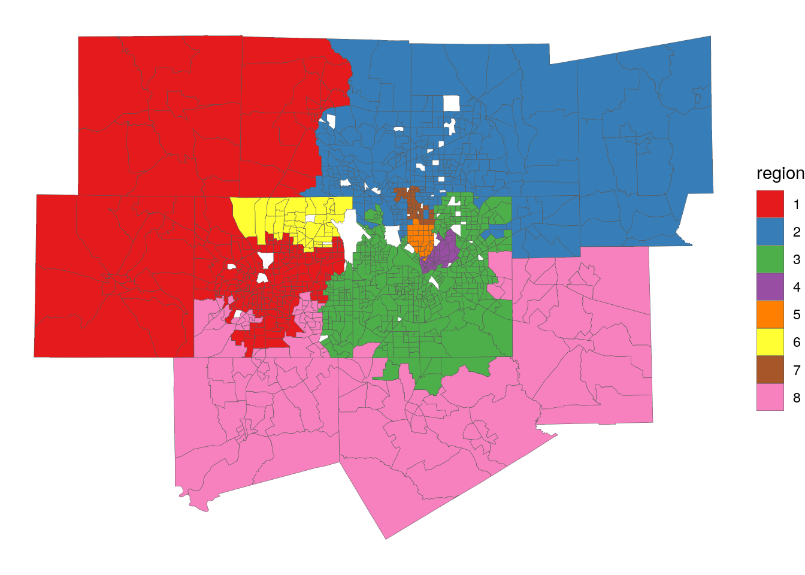
<p class="caption">(\#fig:map-skater)Map of contiguous regions derived with the SKATER algorithm</p>
</div>

The algorithm has partitioned the data into eight contiguous regions. These regions are largely geographic in nature (regions 1, 2, and 8 cover the western, eastern, and southern portions of the metro respectively), but they also incorporate demographic variations in the data. For example, the very affluent Highland Park area, which is demographically distinct from the rest of the region in both socioeconomic status and age (it is much older), is given its own cluster. Additionally, Cluster 6 represents the "northeast Tarrant County" suburban community, which is a socially meaningful designation in north Texas.

## Exercises

Identify a different region of the United States of interest to you. Complete the following tasks:

1.  Acquire race/ethnicity data from **tidycensus** for your chosen region and compute the dissimilarity index. How does segregation in your chosen region compare with urban areas in California?
2.  Reproduce the regression modeling workflow outlined in this chapter for your chosen region. Is residual spatial autocorrelation more, or less, of an issue for your region than in Dallas-Fort Worth?
3.  Create a geodemographic classification for your region using the sample code in this chapter. Does the typology you've generated resemble that of Dallas-Fort Worth, or does it differ?
