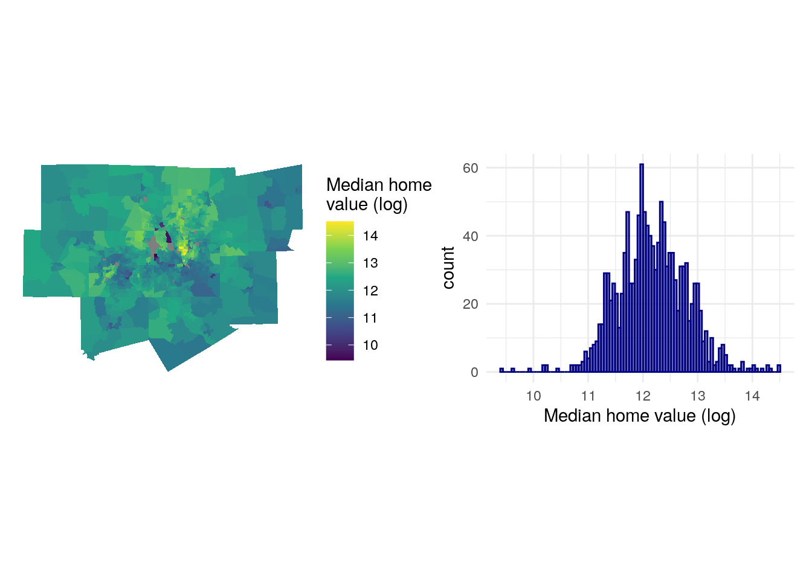
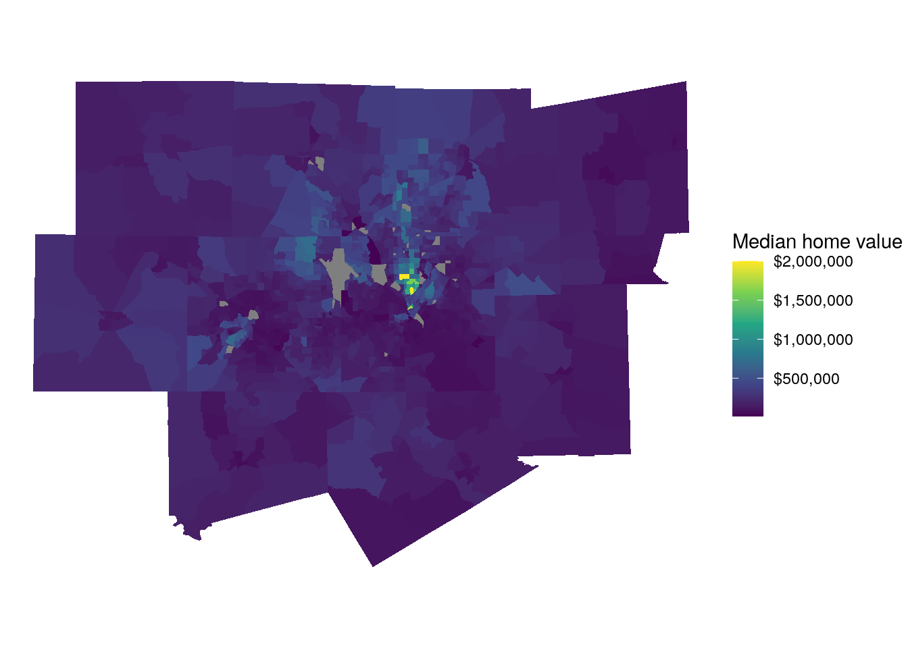
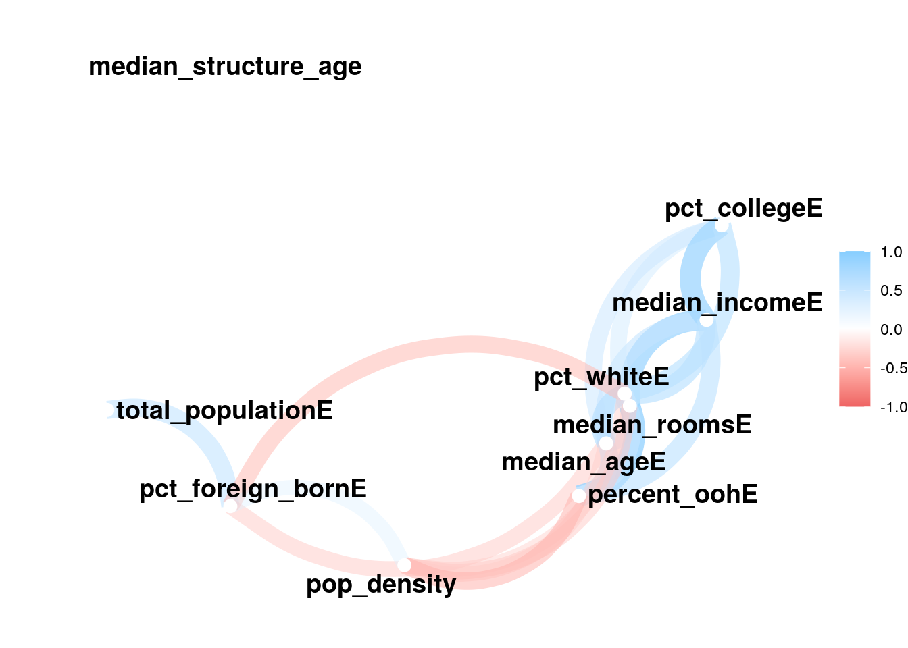
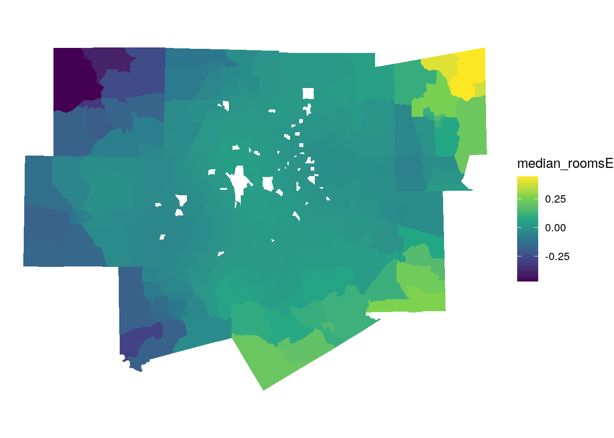
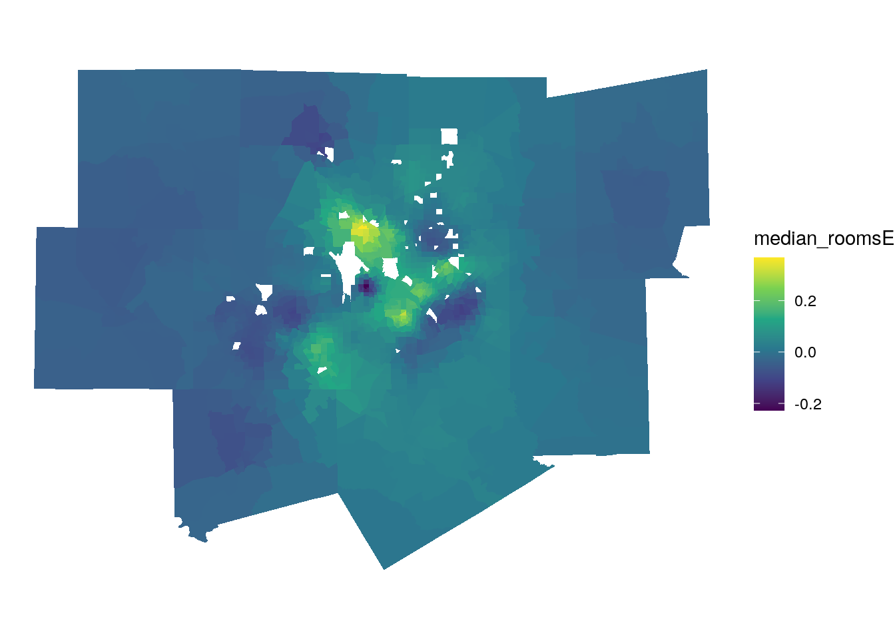

# Modeling US Census data


The previous chapter included a range of examples illustrating methods for analyzing and exploring spatial datasets. Census data can also be used to derive models for explaining patterns that occur across regions or within cities. These models draw from concepts introduced in prior chapters, but can also be used as part of explanatory frameworks or within broader analytic pipelines for statistical inference or machine learning. This chapter introduces a series of such frameworks. The first section looks at *demographic indices* such as segregation, diversity, and centralization, which are widely used across the social sciences to explain demographic patterns. The second section explores topics in statistical modeling, including methods for *spatial regression* that take into account the spatial autocorrelation inherent in most Census variables. The third and final section explores concepts such as *classification*, *clustering*, and *regionalization* which are common in both unsupervised and supervised machine learning. Examples will illustrate how to use Census data to generate neighborhood typologies, which are widely used for business and marketing applications, and how to generate spatially coherent sales territories from Census data with regionalization.

## Indices of segregation and diversity

-   Dissimilarity index
-   Entropy (diversity) index
-   Other applications

The calculation of segregration and diversity indices are widely used in the social sciences. {Cite literature here and give examples}


```r
library(tidycensus)
library(tidyverse)
library(segregation) # remotes::install_github("elbersb/segregation")
library(tigris)
library(sf)

la_urban_area <- urban_areas(cb = TRUE, year = 2019) %>%
  filter(NAME10 == "Los Angeles--Long Beach--Anaheim, CA")

la_data <- get_acs(
  geography = "tract",
  variables = c(
    white = "B03002_003",
    black = "B03002_004",
    asian = "B03002_006",
    hispanic = "B03002_012"
  ), 
  state = "CA",
  geometry = TRUE,
  year = 2019
) %>%
  st_filter(la_urban_area) %>%
  st_drop_geometry()
```

Let's take a quick look at our data: 


Dissimilarity index:


```r
la_data %>%
  filter(variable %in% c("white", "black")) %>%
  dissimilarity(
    group = "variable",
    unit = "GEOID",
    weight = "estimate"
  )
```

```
##    stat       est
## 1:    D 0.6460713
```

Multi-group entropy:


```r
la_data %>%
  mutual_total(
    group = "variable",
    unit = "GEOID",
    weight = "estimate"
  )
```

```
##    stat       est
## 1:    M 0.3391033
## 2:    H 0.2851662
```

Local segregation indices:


```r
la_local_seg <- la_data %>%
  mutual_local(
    group = "variable",
    unit = "GEOID",
    weight = "estimate", 
    wide = TRUE
  )

glimpse(la_local_seg)
```

```
## Rows: 2,773
## Columns: 3
## $ GEOID <chr> "06037101110", "06037101122", "06037101210", "06037101220", "060…
## $ ls    <dbl> 0.28218462, 0.77904804, 0.10121933, 0.11823338, 0.65382196, 0.39…
## $ p     <dbl> 0.0003362648, 0.0002689957, 0.0005088495, 0.0002917425, 0.000309…
```

Map the results:


```r
ca_tracts <- tracts("CA", cb = TRUE)

ca_tracts %>%
  inner_join(la_local_seg, by = "GEOID") %>%
  ggplot(aes(fill = ls)) + 
  geom_sf(color = NA) + 
  coord_sf(crs = 26946) + 
  scale_fill_viridis_c(option = "inferno") + 
  theme_void() + 
  labs(fill = "Local\nsegregation index")
```



### Diversity gradient:


```r
la_entropy <- la_data %>%
  split(~GEOID) %>%
  map_dbl(~{
    entropy(
      data = .x,
      group = "variable",
      weight = "estimate",
      base = 4
    )
  }) %>%
  as_tibble(rownames = "GEOID") %>%
  rename(entropy = value)

la_entropy_geo <- tracts("CA", cb = TRUE, year = 2019) %>%
  inner_join(la_entropy, by = "GEOID")
```

Drive-time to downtown LA:


```r
library(mapboxapi)

la_city_hall <- mb_geocode("City Hall, Los Angeles CA")

minutes_to_downtown <- mb_matrix(la_entropy_geo, la_city_hall)
```


```r
la_entropy_geo$minutes <- as.numeric(minutes_to_downtown)

ggplot(la_entropy_geo, aes(x = minutes_to_downtown, y = entropy)) + 
  geom_point(alpha = 0.5) + 
  geom_smooth(method = "loess") + 
  theme_minimal() + 
  scale_x_continuous(limits = c(0, 80)) + 
  labs(title = "Diversity gradient, Los Angeles urbanized area",
       x = "Travel-time to downtown Los Angeles in minutes, Census tracts",
       y = "Entropy index")
```


## Regression modeling with US Census data


```r
library(tidycensus)
library(tidyverse)
library(crsuggest)

dfw_counties <- c("Collin County", "Dallas", "Denton", "Ellis", "Hunt", 
                  "Kaufman", "Rockwall", "Johnson", "Parker", "Tarrant", "Wise")

median_value <- get_acs(
  geography = "tract",
  variables = "B25077_001",
  state = "TX",
  county = dfw_counties,
  geometry = TRUE
)

best_crs <- suggest_top_crs(median_value, units = "m")

ggplot(median_value, aes(fill = estimate)) + 
  geom_sf(color = NA) + 
  coord_sf(crs = best_crs) + 
  scale_fill_viridis_c(labels = scales::dollar) + 
  theme_void() + 
  labs(fill = "Median home value ")
```



-   Fitting a simple regression model


```r
library(sf)
library(units)

variables_to_get <- c(
  median_value = "B25077_001",
  median_rooms = "B25018_001",
  median_income = "DP03_0062",
  total_population = "B01003_001",
  median_age = "B01002_001",
  pct_college = "DP02_0068P",
  pct_foreign_born = "DP02_0094P",
  pct_white = "DP05_0077P",
  median_year_built = "B25037_001",
  percent_ooh = "DP04_0046P"
)

dfw_data <- get_acs(
  geography = "tract",
  variables = variables_to_get,
  state = "TX",
  county = dfw_counties,
  geometry = TRUE,
  output = "wide"
) %>%
  st_transform(best_crs) %>%
  mutate(pop_density = as.numeric(set_units(total_populationE / st_area(.), "1/km2")),
         median_structure_age = 2017 - median_year_builtE)

glimpse(dfw_data)
```

```
## Rows: 1,312
## Columns: 25
## $ GEOID                <chr> "48085030100", "48085030201", "48085030202", "480…
## $ NAME                 <chr> "Census Tract 301, Collin County, Texas", "Census…
## $ median_valueE        <dbl> 185400, 298600, 358700, 242700, 320600, 603000, 4…
## $ median_valueM        <dbl> 21713, 37949, 33617, 16699, 12258, 46006, 14984, …
## $ median_roomsE        <dbl> 6.1, 7.2, 7.3, 7.0, 7.3, 10.0, 10.0, 8.5, 7.9, 7.…
## $ median_roomsM        <dbl> 0.3, 0.5, 0.5, 0.4, 0.2, NA, NA, 0.2, 0.2, 0.4, 0…
## $ total_populationE    <dbl> 6121, 3360, 3476, 22332, 7349, 5048, 8360, 6046, …
## $ total_populationM    <dbl> 649, 373, 355, 503, 558, 382, 389, 369, 1163, 423…
## $ median_ageE          <dbl> 36.8, 39.1, 41.8, 32.1, 36.7, 38.4, 36.4, 34.8, 3…
## $ median_ageM          <dbl> 3.5, 3.5, 2.6, 2.3, 2.2, 1.0, 1.7, 2.9, 1.8, 3.8,…
## $ median_year_builtE   <dbl> 1996, 1999, 1999, 2007, NA, 2011, 2008, 2011, 200…
## $ median_year_builtM   <dbl> 3, 4, 5, 1, NA, 1, 2, 2, 2, 2, 1, 2, 4, 2, 3, 2, …
## $ median_incomeE       <dbl> 68032, 84455, 108523, 101194, 109671, 172833, 150…
## $ median_incomeM       <dbl> 8184, 12935, 21535, 9811, 14572, 24228, 16540, 37…
## $ pct_collegeE         <dbl> 13.9, 31.0, 37.2, 33.0, 48.8, 60.5, 62.6, 52.9, 4…
## $ pct_collegeM         <dbl> 3.6, 6.4, 6.0, 4.8, 5.1, 5.1, 4.4, 5.5, 4.7, 5.6,…
## $ pct_foreign_bornE    <dbl> 923, 150, 324, 2191, 821, 605, 506, 340, 1421, 47…
## $ pct_foreign_bornM    <dbl> NA, NA, NA, NA, NA, NA, NA, NA, NA, NA, NA, NA, N…
## $ pct_whiteE           <dbl> 72.7, 78.5, 77.2, 69.9, 61.9, 77.5, 79.9, 84.3, 7…
## $ pct_whiteM           <dbl> 7.4, 7.8, 8.6, 5.7, 4.9, 6.1, 2.8, 4.4, 6.9, 5.4,…
## $ percent_oohE         <dbl> 78.1, 78.5, 89.9, 82.3, 81.7, 91.6, 81.3, 88.5, 8…
## $ percent_oohM         <dbl> 6.8, 7.4, 4.3, 5.3, 6.1, 4.2, 4.0, 3.8, 4.3, 5.8,…
## $ geometry             <MULTIPOLYGON [m]> MULTIPOLYGON (((784027.9 21..., MULT…
## $ pop_density          <dbl> 18.94582, 36.32168, 22.60180, 226.08704, 310.3172…
## $ median_structure_age <dbl> 21, 18, 18, 10, NA, 6, 9, 6, 10, 22, 20, 20, 16, …
```


```r
dfw_data_for_model <- dfw_data %>%
  select(!ends_with("M")) %>%
  na.omit()

formula <- "log(median_valueE) ~ median_roomsE + median_incomeE + pct_collegeE + pct_foreign_bornE + pct_whiteE + median_ageE + median_structure_age + percent_oohE + pop_density + total_populationE"

model1 <- lm(formula = formula, data = dfw_data_for_model)

summary(model1)
```

```
## 
## Call:
## lm(formula = formula, data = dfw_data_for_model)
## 
## Residuals:
##      Min       1Q   Median       3Q      Max 
## -2.48648 -0.13749  0.01104  0.14980  1.47861 
## 
## Coefficients:
##                        Estimate Std. Error t value Pr(>|t|)    
## (Intercept)           1.113e+01  7.558e-02 147.247  < 2e-16 ***
## median_roomsE        -1.483e-02  1.511e-02  -0.981  0.32662    
## median_incomeE        6.155e-06  6.140e-07  10.024  < 2e-16 ***
## pct_collegeE          1.509e-02  8.170e-04  18.470  < 2e-16 ***
## pct_foreign_bornE     8.704e-06  1.621e-05   0.537  0.59134    
## pct_whiteE            2.644e-03  5.960e-04   4.437 9.95e-06 ***
## median_ageE           5.742e-03  1.986e-03   2.891  0.00391 ** 
## median_structure_age  2.400e-05  5.321e-05   0.451  0.65204    
## percent_oohE         -4.343e-03  7.503e-04  -5.788 8.99e-09 ***
## pop_density           4.287e-06  7.911e-06   0.542  0.58797    
## total_populationE     9.852e-06  4.026e-06   2.447  0.01453 *  
## ---
## Signif. codes:  0 '***' 0.001 '**' 0.01 '*' 0.05 '.' 0.1 ' ' 1
## 
## Residual standard error: 0.2952 on 1242 degrees of freedom
## Multiple R-squared:  0.7829,	Adjusted R-squared:  0.7812 
## F-statistic:   448 on 10 and 1242 DF,  p-value: < 2.2e-16
```


```r
library(corrr)

dfw_estimates <- dfw_data_for_model %>%
  select(-GEOID, -NAME, -median_valueE, -median_year_builtE) %>%
  st_drop_geometry()

correlations <- correlate(dfw_estimates, method = "pearson")
```


```r
correlations %>% network_plot()
```




```r
car::vif(model1)
```

```
##        median_roomsE       median_incomeE         pct_collegeE 
##             6.821157             8.024309             4.618074 
##    pct_foreign_bornE           pct_whiteE          median_ageE 
##             2.702410             3.491267             2.208367 
## median_structure_age         percent_oohE          pop_density 
##             1.022674             4.753253             1.575666 
##    total_populationE 
##             2.142887
```


```r
pca <- prcomp(formula = ~., data = dfw_estimates, scale. = TRUE, na.action = na.exclude)

summary(pca)
```

```
## Importance of components:
##                           PC1    PC2    PC3    PC4     PC5     PC6    PC7
## Standard deviation     2.0451 1.3020 1.1292 0.9990 0.80857 0.66682 0.6229
## Proportion of Variance 0.4183 0.1695 0.1275 0.0998 0.06538 0.04446 0.0388
## Cumulative Proportion  0.4183 0.5878 0.7153 0.8151 0.88045 0.92492 0.9637
##                            PC8     PC9    PC10
## Standard deviation     0.42630 0.32794 0.27129
## Proportion of Variance 0.01817 0.01075 0.00736
## Cumulative Proportion  0.98189 0.99264 1.00000
```

Perhaps plot the loadings then make a map of one of the components?


```r
pca$rotation
```

```
##                              PC1         PC2          PC3          PC4
## median_roomsE        -0.40901334 -0.23158386  0.129499707 -0.106250597
## total_populationE    -0.02955492 -0.66707228  0.106255475  0.016843027
## median_ageE          -0.38073401  0.17592676 -0.016216105 -0.008314538
## median_incomeE       -0.42179736 -0.16361276 -0.285266608 -0.061048558
## pct_collegeE         -0.32630309 -0.01872792 -0.588300990 -0.002423780
## pct_foreign_bornE     0.19900021 -0.61875004 -0.135599918 -0.116825140
## pct_whiteE           -0.39537635  0.12522990 -0.133829866  0.108847696
## percent_oohE         -0.38119923 -0.15433206  0.362935794 -0.117695119
## pop_density           0.24484515 -0.05551502 -0.613303002 -0.066250999
## median_structure_age  0.03611031  0.13371217  0.006388362 -0.969993773
##                              PC5         PC6         PC7         PC8
## median_roomsE         0.41601697 -0.14908409  0.08155494 -0.22616850
## total_populationE    -0.48438053  0.10092091  0.28569049 -0.44524057
## median_ageE          -0.02935806  0.79757318 -0.34135502 -0.25346754
## median_incomeE        0.15518243 -0.28894816 -0.08388548 -0.05240147
## pct_collegeE         -0.16035717 -0.25153836 -0.27700874 -0.06538097
## pct_foreign_bornE     0.06144757  0.21402670 -0.42706783  0.53543969
## pct_whiteE           -0.48406451  0.09943919  0.41278461  0.52794692
## percent_oohE          0.34715894  0.11517894  0.25939863  0.32975425
## pop_density           0.38181020  0.33951391  0.53868897 -0.06973797
## median_structure_age -0.19301519 -0.02172275  0.03441426 -0.01781554
##                              PC9         PC10
## median_roomsE        -0.39040595 -0.587793540
## total_populationE     0.11342913  0.070945379
## median_ageE          -0.05342835  0.056131858
## median_incomeE       -0.31100981  0.704366007
## pct_collegeE          0.53016541 -0.309841552
## pct_foreign_bornE    -0.13851103 -0.087525510
## pct_whiteE           -0.28985539 -0.144550773
## percent_oohE          0.59150150  0.160028668
## pop_density           0.01838128  0.001838437
## median_structure_age -0.02542888 -0.003642427
```


```r
components <- predict(pca, dfw_estimates)

dfw_pca <- dfw_data_for_model %>%
  select(GEOID, median_valueE) %>%
  cbind(components) %>%
  na.omit()

ggplot(dfw_pca, aes(fill = PC1)) +
  geom_sf(color = NA) +
  theme_void() +
  scale_fill_viridis_c()
```


```r
pca_formula <- paste0("log(median_valueE) ~ ", paste0('PC', 1:8, collapse = ' + '))

pca_model <- lm(formula = pca_formula, data = dfw_pca)

summary(pca_model)
```

```
## 
## Call:
## lm(formula = pca_formula, data = dfw_pca)
## 
## Residuals:
##      Min       1Q   Median       3Q      Max 
## -2.50592 -0.13633  0.00962  0.15160  1.50693 
## 
## Coefficients:
##              Estimate Std. Error  t value Pr(>|t|)    
## (Intercept) 12.162977   0.008348 1456.916  < 2e-16 ***
## PC1         -0.198012   0.004084  -48.488  < 2e-16 ***
## PC2         -0.033101   0.006415   -5.160 2.87e-07 ***
## PC3         -0.314540   0.007396  -42.526  < 2e-16 ***
## PC4          0.002204   0.008360    0.264   0.7921    
## PC5         -0.108924   0.010329  -10.545  < 2e-16 ***
## PC6         -0.118806   0.012525   -9.486  < 2e-16 ***
## PC7         -0.115780   0.013408   -8.635  < 2e-16 ***
## PC8         -0.046352   0.019592   -2.366   0.0181 *  
## ---
## Signif. codes:  0 '***' 0.001 '**' 0.01 '*' 0.05 '.' 0.1 ' ' 1
## 
## Residual standard error: 0.2955 on 1244 degrees of freedom
## Multiple R-squared:  0.7822,	Adjusted R-squared:  0.7808 
## F-statistic: 558.4 on 8 and 1244 DF,  p-value: < 2.2e-16
```


```r
dfw_data_for_model$residuals <- residuals(model1)

ggplot(dfw_data_for_model, aes(fill = residuals)) +
  geom_sf(color = NA) +
  theme_void() +
  scale_fill_viridis_c()
```


Check for spatial autocorrelation in residuals:


```r
library(spdep)

nbrs <- dfw_data_for_model %>%
  poly2nb()

wts <- nb2listw(nbrs, style = "W")

moran.test(dfw_data_for_model$residuals, wts, na.action = na.exclude)
```

```
## 
## 	Moran I test under randomisation
## 
## data:  dfw_data_for_model$residuals  
## weights: wts    
## 
## Moran I statistic standard deviate = 10.577, p-value < 2.2e-16
## alternative hypothesis: greater
## sample estimates:
## Moran I statistic       Expectation          Variance 
##      0.1711472115     -0.0007987220      0.0002642971
```

## Spatial regression

-   Fitting a spatial regression model
-   Spatial lag vs. spatial error models
-   Intepreting results

Show Lagrange multiplier test first


```r
lm.LMtests(model1, wts, test = "all")
```

```
## 
## 	Lagrange multiplier diagnostics for spatial dependence
## 
## data:  
## model: lm(formula = formula, data = dfw_data_for_model)
## weights: wts
## 
## LMerr = 109.27, df = 1, p-value < 2.2e-16
## 
## 
## 	Lagrange multiplier diagnostics for spatial dependence
## 
## data:  
## model: lm(formula = formula, data = dfw_data_for_model)
## weights: wts
## 
## LMlag = 97.31, df = 1, p-value < 2.2e-16
## 
## 
## 	Lagrange multiplier diagnostics for spatial dependence
## 
## data:  
## model: lm(formula = formula, data = dfw_data_for_model)
## weights: wts
## 
## RLMerr = 30.398, df = 1, p-value = 3.519e-08
## 
## 
## 	Lagrange multiplier diagnostics for spatial dependence
## 
## data:  
## model: lm(formula = formula, data = dfw_data_for_model)
## weights: wts
## 
## RLMlag = 18.437, df = 1, p-value = 1.756e-05
## 
## 
## 	Lagrange multiplier diagnostics for spatial dependence
## 
## data:  
## model: lm(formula = formula, data = dfw_data_for_model)
## weights: wts
## 
## SARMA = 127.71, df = 2, p-value < 2.2e-16
```


```r
library(spatialreg)

lag_model <- lagsarlm(formula = formula, data = dfw_data_for_model, listw = wts)

summary(lag_model, Nagelkerke = TRUE)
```

```
## 
## Call:lagsarlm(formula = formula, data = dfw_data_for_model, listw = wts)
## 
## Residuals:
##        Min         1Q     Median         3Q        Max 
## -2.4252533 -0.1181296  0.0015142  0.1360930  1.4614530 
## 
## Type: lag 
## Coefficients: (asymptotic standard errors) 
##                         Estimate  Std. Error z value  Pr(>|z|)
## (Intercept)           8.0591e+00  3.2172e-01 25.0503 < 2.2e-16
## median_roomsE        -6.2144e-03  1.4411e-02 -0.4312  0.666310
## median_incomeE        4.9678e-06  5.9282e-07  8.3799 < 2.2e-16
## pct_collegeE          1.2111e-02  8.5381e-04 14.1848 < 2.2e-16
## pct_foreign_bornE    -5.9208e-06  1.5526e-05 -0.3814  0.702943
## pct_whiteE            1.2344e-03  5.8399e-04  2.1137  0.034543
## median_ageE           5.0048e-03  1.8955e-03  2.6403  0.008282
## median_structure_age  9.1072e-06  5.0764e-05  0.1794  0.857622
## percent_oohE         -3.5756e-03  7.2405e-04 -4.9383 7.881e-07
## pop_density          -6.6853e-06  7.5828e-06 -0.8816  0.377976
## total_populationE     9.9773e-06  3.8404e-06  2.5980  0.009377
## 
## Rho: 0.27028, LR test value: 91.806, p-value: < 2.22e-16
## Asymptotic standard error: 0.027625
##     z-value: 9.7837, p-value: < 2.22e-16
## Wald statistic: 95.721, p-value: < 2.22e-16
## 
## Log likelihood: -197.9142 for lag model
## ML residual variance (sigma squared): 0.079291, (sigma: 0.28159)
## Nagelkerke pseudo-R-squared: 0.79828 
## Number of observations: 1253 
## Number of parameters estimated: 13 
## AIC: 421.83, (AIC for lm: 511.63)
## LM test for residual autocorrelation
## test value: 15.626, p-value: 7.7173e-05
```

Error model:


```r
error_model <- errorsarlm(formula = formula, data = dfw_data_for_model, listw = wts)

summary(error_model, Nagelkerke = TRUE)
```

```
## 
## Call:errorsarlm(formula = formula, data = dfw_data_for_model, listw = wts)
## 
## Residuals:
##        Min         1Q     Median         3Q        Max 
## -2.4829144 -0.1070623  0.0063614  0.1307733  1.5504567 
## 
## Type: error 
## Coefficients: (asymptotic standard errors) 
##                         Estimate  Std. Error  z value  Pr(>|z|)
## (Intercept)           1.1194e+01  7.9612e-02 140.6128 < 2.2e-16
## median_roomsE         6.4425e-03  1.6165e-02   0.3985  0.690231
## median_incomeE        4.9957e-06  6.4631e-07   7.7296 1.088e-14
## pct_collegeE          1.5877e-02  9.1373e-04  17.3763 < 2.2e-16
## pct_foreign_bornE     7.3979e-06  1.7990e-05   0.4112  0.680915
## pct_whiteE            2.2014e-03  7.3403e-04   2.9990  0.002708
## median_ageE           4.7496e-03  2.0404e-03   2.3277  0.019927
## median_structure_age -4.2584e-05  5.1522e-05  -0.8265  0.408500
## percent_oohE         -4.8612e-03  7.5959e-04  -6.3998 1.555e-10
## pop_density          -6.4972e-06  8.4988e-06  -0.7645  0.444579
## total_populationE     7.0784e-06  4.3239e-06   1.6371  0.101619
## 
## Lambda: 0.41139, LR test value: 93.935, p-value: < 2.22e-16
## Asymptotic standard error: 0.038492
##     z-value: 10.688, p-value: < 2.22e-16
## Wald statistic: 114.23, p-value: < 2.22e-16
## 
## Log likelihood: -196.8496 for error model
## ML residual variance (sigma squared): 0.077718, (sigma: 0.27878)
## Nagelkerke pseudo-R-squared: 0.79862 
## Number of observations: 1253 
## Number of parameters estimated: 13 
## AIC: 419.7, (AIC for lm: 511.63)
```

Spatial Durbin model:


```r
durbin_model <- lagsarlm(formula = formula, data = dfw_data_for_model, listw = wts,
                         Durbin = TRUE)

summary(durbin_model, Nagelkerke = TRUE)
```

```
## 
## Call:lagsarlm(formula = formula, data = dfw_data_for_model, listw = wts, 
##     Durbin = TRUE)
## 
## Residuals:
##        Min         1Q     Median         3Q        Max 
## -2.4564570 -0.1044720  0.0036499  0.1293586  1.4738726 
## 
## Type: mixed 
## Coefficients: (asymptotic standard errors) 
##                             Estimate  Std. Error z value  Pr(>|z|)
## (Intercept)               6.7087e+00  4.4785e-01 14.9799 < 2.2e-16
## median_roomsE             2.3770e-02  1.6941e-02  1.4031  0.160584
## median_incomeE            3.9692e-06  6.6993e-07  5.9248 3.128e-09
## pct_collegeE              1.5486e-02  1.1200e-03 13.8271 < 2.2e-16
## pct_foreign_bornE        -6.6357e-06  1.9419e-05 -0.3417  0.732568
## pct_whiteE                2.0534e-04  9.8507e-04  0.2085  0.834874
## median_ageE               5.5417e-03  2.1197e-03  2.6144  0.008937
## median_structure_age     -3.6830e-05  5.0780e-05 -0.7253  0.468271
## percent_oohE             -4.8481e-03  7.6614e-04 -6.3280 2.484e-10
## pop_density              -1.6789e-05  9.6047e-06 -1.7480  0.080457
## total_populationE         8.8438e-06  4.6002e-06  1.9225  0.054546
## lag.median_roomsE        -6.9851e-02  2.6564e-02 -2.6295  0.008551
## lag.median_incomeE        1.8420e-06  1.1554e-06  1.5943  0.110879
## lag.pct_collegeE         -7.8118e-03  1.7276e-03 -4.5219 6.128e-06
## lag.pct_foreign_bornE     4.8624e-06  2.7359e-05  0.1777  0.858938
## lag.pct_whiteE            1.0243e-03  1.2118e-03  0.8453  0.397939
## lag.median_ageE           3.6338e-03  3.7791e-03  0.9615  0.336276
## lag.median_structure_age  4.2936e-04  1.0955e-04  3.9192 8.883e-05
## lag.percent_oohE          3.4518e-03  1.4366e-03  2.4027  0.016274
## lag.pop_density           4.3961e-05  1.5772e-05  2.7873  0.005315
## lag.total_populationE     6.7134e-06  6.9481e-06  0.9662  0.333929
## 
## Rho: 0.37504, LR test value: 86.201, p-value: < 2.22e-16
## Asymptotic standard error: 0.039273
##     z-value: 9.5497, p-value: < 2.22e-16
## Wald statistic: 91.196, p-value: < 2.22e-16
## 
## Log likelihood: -167.7153 for mixed model
## ML residual variance (sigma squared): 0.074606, (sigma: 0.27314)
## Nagelkerke pseudo-R-squared: 0.80777 
## Number of observations: 1253 
## Number of parameters estimated: 23 
## AIC: 381.43, (AIC for lm: 465.63)
## LM test for residual autocorrelation
## test value: 0.98614, p-value: 0.32069
```

## Geographically weighted regression

-   Basic principles
-   Fitting model/mapping results
-   Dealing with potential issues (e.g. local multicollinearity)


```r
library(GWmodel)

dfw_data_sp <- dfw_data_for_model %>%
  as_Spatial()

bw <- bw.gwr(formula = formula, data = dfw_data_sp, kernel = "gaussian")
```

```
## Fixed bandwidth: 124957.3 CV score: 110.8221 
## Fixed bandwidth: 77243.3 CV score: 110.5175 
## Fixed bandwidth: 47754.43 CV score: 109.4817 
## Fixed bandwidth: 29529.3 CV score: 106.3411 
## Fixed bandwidth: 18265.56 CV score: 103.0022 
## Fixed bandwidth: 11304.18 CV score: 103.2211 
## Fixed bandwidth: 22567.93 CV score: 104.4241 
## Fixed bandwidth: 15606.55 CV score: 102.3864 
## Fixed bandwidth: 13963.19 CV score: 102.3085 
## Fixed bandwidth: 12947.54 CV score: 102.4524 
## Fixed bandwidth: 14590.9 CV score: 102.3057 
## Fixed bandwidth: 14978.84 CV score: 102.3255 
## Fixed bandwidth: 14351.13 CV score: 102.3011 
## Fixed bandwidth: 14202.95 CV score: 102.3016 
## Fixed bandwidth: 14442.71 CV score: 102.3021 
## Fixed bandwidth: 14294.53 CV score: 102.301 
## Fixed bandwidth: 14259.55 CV score: 102.3011 
## Fixed bandwidth: 14316.15 CV score: 102.301
```

Fit the model:


```r
gw_model <- gwr.basic(formula = formula, data = dfw_data_sp, bw = bw,
                      kernel = "gaussian")

gw_model
```

```
##    ***********************************************************************
##    *                       Package   GWmodel                             *
##    ***********************************************************************
##    Program starts at: 2021-06-21 13:52:41 
##    Call:
##    gwr.basic(formula = formula, data = dfw_data_sp, bw = bw, kernel = "gaussian")
## 
##    Dependent (y) variable:  NA
##    Independent variables:  
##    Number of data points: 1253
##    ***********************************************************************
##    *                    Results of Global Regression                     *
##    ***********************************************************************
## 
##    Call:
##     lm(formula = formula, data = data)
## 
##    Residuals:
##      Min       1Q   Median       3Q      Max 
## -2.48648 -0.13749  0.01104  0.14980  1.47861 
## 
##    Coefficients:
##                           Estimate Std. Error t value Pr(>|t|)    
##    (Intercept)           1.113e+01  7.558e-02 147.247  < 2e-16 ***
##    median_roomsE        -1.483e-02  1.511e-02  -0.981  0.32662    
##    median_incomeE        6.155e-06  6.140e-07  10.024  < 2e-16 ***
##    pct_collegeE          1.509e-02  8.170e-04  18.470  < 2e-16 ***
##    pct_foreign_bornE     8.704e-06  1.621e-05   0.537  0.59134    
##    pct_whiteE            2.644e-03  5.960e-04   4.437 9.95e-06 ***
##    median_ageE           5.742e-03  1.986e-03   2.891  0.00391 ** 
##    median_structure_age  2.400e-05  5.321e-05   0.451  0.65204    
##    percent_oohE         -4.343e-03  7.503e-04  -5.788 8.99e-09 ***
##    pop_density           4.287e-06  7.911e-06   0.542  0.58797    
##    total_populationE     9.852e-06  4.026e-06   2.447  0.01453 *  
## 
##    ---Significance stars
##    Signif. codes:  0 '***' 0.001 '**' 0.01 '*' 0.05 '.' 0.1 ' ' 1 
##    Residual standard error: 0.2952 on 1242 degrees of freedom
##    Multiple R-squared: 0.7829
##    Adjusted R-squared: 0.7812 
##    F-statistic:   448 on 10 and 1242 DF,  p-value: < 2.2e-16 
##    ***Extra Diagnostic information
##    Residual sum of squares: 108.2661
##    Sigma(hat): 0.2941831
##    AIC:  511.6345
##    AICc:  511.8862
##    BIC:  -594.1664
##    ***********************************************************************
##    *          Results of Geographically Weighted Regression              *
##    ***********************************************************************
## 
##    *********************Model calibration information*********************
##    Kernel function: gaussian 
##    Fixed bandwidth: 14294.53 
##    Regression points: the same locations as observations are used.
##    Distance metric: Euclidean distance metric is used.
## 
##    ****************Summary of GWR coefficient estimates:******************
##                                Min.     1st Qu.      Median     3rd Qu.    Max.
##    Intercept             8.7783e+00  1.1049e+01  1.1112e+01  1.1257e+01 13.0505
##    median_roomsE        -4.6925e-01 -1.3864e-02  1.0011e-02  2.6039e-02  0.4435
##    median_incomeE        3.2480e-06  4.9277e-06  5.5076e-06  6.0806e-06  0.0000
##    pct_collegeE          9.0524e-04  1.4409e-02  1.5881e-02  1.6997e-02  0.0225
##    pct_foreign_bornE    -3.2816e-04 -1.8857e-05  1.2037e-05  2.6436e-05  0.0001
##    pct_whiteE           -6.3873e-03  1.4181e-03  2.6382e-03  3.3654e-03  0.0134
##    median_ageE          -2.7699e-02  3.0337e-03  3.6856e-03  5.7769e-03  0.0382
##    median_structure_age -1.7776e-02 -2.4753e-05  1.0899e-04  1.2033e-04  0.0006
##    percent_oohE         -1.1430e-02 -5.4618e-03 -5.0913e-03 -4.7072e-03  0.0121
##    pop_density          -4.0604e-04 -1.6746e-05 -3.3897e-06  1.6040e-05  0.0001
##    total_populationE    -1.7837e-05  5.0186e-06  9.9030e-06  1.6876e-05  0.0000
##    ************************Diagnostic information*************************
##    Number of data points: 1253 
##    Effective number of parameters (2trace(S) - trace(S'S)): 130.8759 
##    Effective degrees of freedom (n-2trace(S) + trace(S'S)): 1122.124 
##    AICc (GWR book, Fotheringham, et al. 2002, p. 61, eq 2.33): 462.9319 
##    AIC (GWR book, Fotheringham, et al. 2002,GWR p. 96, eq. 4.22): 347.4801 
##    BIC (GWR book, Fotheringham, et al. 2002,GWR p. 61, eq. 2.34): -312.2319 
##    Residual sum of squares: 89.61627 
##    R-square value:  0.8203329 
##    Adjusted R-square value:  0.7993592 
## 
##    ***********************************************************************
##    Program stops at: 2021-06-21 13:52:41
```

Plot the results:


```r
gw_model_results <- gw_model$SDF %>%
  st_as_sf() 


ggplot(gw_model_results, aes(fill = median_roomsE)) + 
  geom_sf(color = NA) + 
  scale_fill_viridis_c() + 
  theme_void()
```




```r
bw2 <- bw.gwr(formula = formula, data = dfw_data_sp, kernel = "gaussian",
              adaptive = TRUE)
```

```
## Adaptive bandwidth: 782 CV score: 110.0998 
## Adaptive bandwidth: 491 CV score: 109.3392 
## Adaptive bandwidth: 311 CV score: 108.1626 
## Adaptive bandwidth: 199 CV score: 107.179 
## Adaptive bandwidth: 131 CV score: 106.3014 
## Adaptive bandwidth: 87 CV score: 105.7045 
## Adaptive bandwidth: 62 CV score: 105.1957 
## Adaptive bandwidth: 44 CV score: 104.2308 
## Adaptive bandwidth: 35 CV score: 103.4493 
## Adaptive bandwidth: 27 CV score: 102.9522 
## Adaptive bandwidth: 24 CV score: 102.8862 
## Adaptive bandwidth: 20 CV score: 102.6655 
## Adaptive bandwidth: 20 CV score: 102.6655
```

Adaptive bandwidth model results:


```r
gw_model2 <- gwr.basic(formula = formula, data = dfw_data_sp, bw = bw2,
                      kernel = "gaussian", adaptive = TRUE)

gw_model2
```

```
##    ***********************************************************************
##    *                       Package   GWmodel                             *
##    ***********************************************************************
##    Program starts at: 2021-06-21 13:52:44 
##    Call:
##    gwr.basic(formula = formula, data = dfw_data_sp, bw = bw2, kernel = "gaussian", 
##     adaptive = TRUE)
## 
##    Dependent (y) variable:  NA
##    Independent variables:  
##    Number of data points: 1253
##    ***********************************************************************
##    *                    Results of Global Regression                     *
##    ***********************************************************************
## 
##    Call:
##     lm(formula = formula, data = data)
## 
##    Residuals:
##      Min       1Q   Median       3Q      Max 
## -2.48648 -0.13749  0.01104  0.14980  1.47861 
## 
##    Coefficients:
##                           Estimate Std. Error t value Pr(>|t|)    
##    (Intercept)           1.113e+01  7.558e-02 147.247  < 2e-16 ***
##    median_roomsE        -1.483e-02  1.511e-02  -0.981  0.32662    
##    median_incomeE        6.155e-06  6.140e-07  10.024  < 2e-16 ***
##    pct_collegeE          1.509e-02  8.170e-04  18.470  < 2e-16 ***
##    pct_foreign_bornE     8.704e-06  1.621e-05   0.537  0.59134    
##    pct_whiteE            2.644e-03  5.960e-04   4.437 9.95e-06 ***
##    median_ageE           5.742e-03  1.986e-03   2.891  0.00391 ** 
##    median_structure_age  2.400e-05  5.321e-05   0.451  0.65204    
##    percent_oohE         -4.343e-03  7.503e-04  -5.788 8.99e-09 ***
##    pop_density           4.287e-06  7.911e-06   0.542  0.58797    
##    total_populationE     9.852e-06  4.026e-06   2.447  0.01453 *  
## 
##    ---Significance stars
##    Signif. codes:  0 '***' 0.001 '**' 0.01 '*' 0.05 '.' 0.1 ' ' 1 
##    Residual standard error: 0.2952 on 1242 degrees of freedom
##    Multiple R-squared: 0.7829
##    Adjusted R-squared: 0.7812 
##    F-statistic:   448 on 10 and 1242 DF,  p-value: < 2.2e-16 
##    ***Extra Diagnostic information
##    Residual sum of squares: 108.2661
##    Sigma(hat): 0.2941831
##    AIC:  511.6345
##    AICc:  511.8862
##    BIC:  -594.1664
##    ***********************************************************************
##    *          Results of Geographically Weighted Regression              *
##    ***********************************************************************
## 
##    *********************Model calibration information*********************
##    Kernel function: gaussian 
##    Adaptive bandwidth: 20 (number of nearest neighbours)
##    Regression points: the same locations as observations are used.
##    Distance metric: Euclidean distance metric is used.
## 
##    ****************Summary of GWR coefficient estimates:******************
##                                Min.     1st Qu.      Median     3rd Qu.    Max.
##    Intercept             7.7767e+00  1.0890e+01  1.1121e+01  1.1333e+01 12.3158
##    median_roomsE        -2.2748e-01 -3.0845e-02  2.5522e-02  7.1693e-02  0.3676
##    median_incomeE       -4.1432e-06  2.5362e-06  4.1714e-06  6.0212e-06  0.0000
##    pct_collegeE          3.9178e-03  1.3196e-02  1.6162e-02  1.9665e-02  0.0288
##    pct_foreign_bornE    -3.4858e-04 -3.4315e-05  7.9566e-06  4.5834e-05  0.0004
##    pct_whiteE           -1.6222e-02 -3.5666e-04  2.2847e-03  4.1515e-03  0.0253
##    median_ageE          -1.9423e-02  1.2102e-03  5.8333e-03  1.0973e-02  0.0494
##    median_structure_age -1.0421e-02 -4.9384e-05  6.8295e-05  2.6674e-04  0.0207
##    percent_oohE         -2.2712e-02 -7.6664e-03 -5.5906e-03 -3.6218e-03  0.0047
##    pop_density          -1.1724e-04 -3.4743e-05 -9.8972e-06  2.0451e-05  0.0002
##    total_populationE    -8.0596e-05  9.5370e-07  1.2795e-05  3.3375e-05  0.0002
##    ************************Diagnostic information*************************
##    Number of data points: 1253 
##    Effective number of parameters (2trace(S) - trace(S'S)): 335.433 
##    Effective degrees of freedom (n-2trace(S) + trace(S'S)): 917.567 
##    AICc (GWR book, Fotheringham, et al. 2002, p. 61, eq 2.33): 305.9918 
##    AIC (GWR book, Fotheringham, et al. 2002,GWR p. 96, eq. 4.22): -54.97696 
##    BIC (GWR book, Fotheringham, et al. 2002,GWR p. 61, eq. 2.34): 174.6376 
##    Residual sum of squares: 57.89436 
##    R-square value:  0.8839305 
##    Adjusted R-square value:  0.841453 
## 
##    ***********************************************************************
##    Program stops at: 2021-06-21 13:52:45
```


```r
gw_model_results2 <- gw_model2$SDF %>%
  st_as_sf() 


ggplot(gw_model_results2, aes(fill = median_roomsE)) + 
  geom_sf(color = NA) + 
  scale_fill_viridis_c() + 
  theme_void()
```



## Geodemographic classification


```r
set.seed(1983)

dfw_kmeans <- dfw_pca %>%
  st_drop_geometry() %>%
  na.omit() %>%
  select(PC1:PC8) %>%
  kmeans(centers = 8)

table(dfw_kmeans$cluster)
```

```
## 
##   1   2   3   4   5   6   7   8 
##  62  54 185 199   8 351 170 224
```

Map the clusters:


```r
dfw_clusters <- dfw_pca %>%
  na.omit() %>%
  mutate(cluster = as.character(dfw_kmeans$cluster))

ggplot(dfw_clusters, aes(fill = cluster)) + 
  geom_sf(size = 0.1) + 
  scale_fill_brewer(palette = "Set1") + 
  theme_void()
```


## Spatial clustering & regionalization

-   Concept: clustering with spatial constraints
-   SKATER and minimum spanning trees
-   Potential applications
-   Alternative approaches


```r
input_vars <- dfw_pca %>%
  select(PC1:PC8) %>%
  st_drop_geometry() %>%
  as.data.frame() %>%
  na.omit()

skater_nbrs <- poly2nb(na.omit(dfw_pca), queen = TRUE)
costs <- nbcosts(skater_nbrs, input_vars)
skater_weights <- nb2listw(skater_nbrs, costs, style = "B")

mst <- mstree(skater_weights)

regions <- skater(mst[,1:2], input_vars, ncuts = 7,
                  crit = 10)
```

Plot the regions:


```r
dfw_clusters$region <- as.character(regions$group)

ggplot(dfw_clusters, aes(fill = region)) + 
  geom_sf(size = 0.1) + 
  scale_fill_brewer(palette = "Set1") + 
  theme_void()
```


