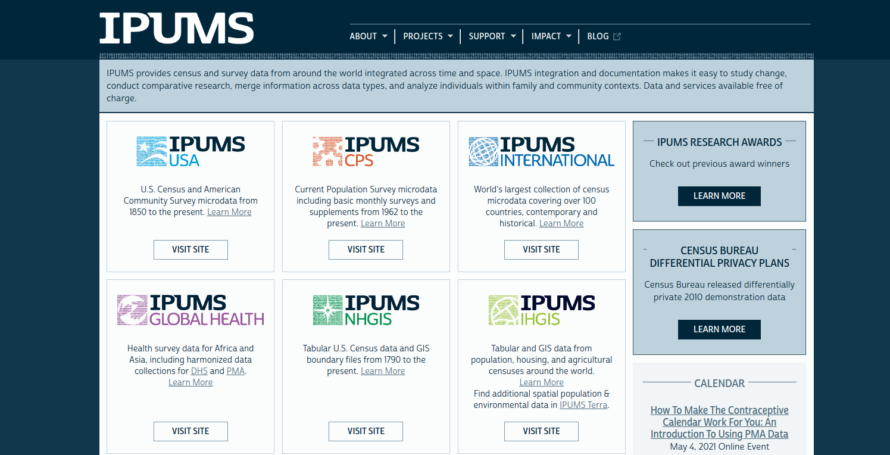

# Introduction to Census microdata

```{r setup-ch9, include = FALSE}
knitr::opts_chunk$set(warning = FALSE, message = FALSE)
```

The previous two sections of this book cover aggregate-level analysis of US Census Bureau data. However, such analyses are limited to the pre-tabulated estimates provided by the Census Bureau. While these estimates are voluminous, they may not include the level of detail required by researchers, and they are limited to analyses appropriate for aggregate-level data. In turn, many researchers turn to Census *microdata*, which are anonymized individual-level Census records, to help answer demographic questions. In 2020, tidycensus added support for American Community Survey microdata along with a series of tools to assist with analysis of these datasets. The next two chapters provide an overview of this functionality in tidycensus and help users get started analyzing and modeling ACS microdata appropriately.

## What is "microdata?"

**Microdata** refer to individual-level data made available to researchers. In many cases, microdata reflect responses to surveys that are de-identified and anonymized, then prepared in datasets that include rich detail about survey responses. US Census microdata are available for both the decennial Census and the American Community Survey; these datasets, named [the Public Use Microdata Series (PUMS)](https://www.census.gov/programs-surveys/acs/microdata.html), allow for detailed cross-tabulations not available in aggregated data.

The ACS PUMS is available, like the aggregate data, in both 1-year and 5-year versions. The 1-year PUMS covers about 1 percent of the US population, whereas the 5-year PUMS covers about 5 percent; this means that microdata represent a smaller subset of the US population than the regular ACS. Public use microdata downloads available [in bulk from the Census FTP server](https://www2.census.gov/programs-surveys/acs/data/pums/2019/5-Year/) or [from data.census.gov's MDAT tool](https://data.census.gov/mdat/#/search?ds=ACSPUMS5Y2019). F

The Census Bureau also operates a network of [Federal Statistical Research Data Centers](https://www.census.gov/about/adrm/fsrdc.html) (FSRDCs) around the country that grant access to microdata with larger sample sizes and greater demographic detail. To work at one of these centers, researchers must get special government clearance and have an approved proposal with the US Census Bureau. This and the following chapter focus on the public use microdata product, which is much more accessible to researchers and analysts.

### Microdata resources: IPUMS

One of the most popular and comprehensive repositories for research microdata is the [University of Minnesota's IPUMS project](https://www.ipums.org/) [@ruggles2020]. IPUMS includes Decennial US Census and ACS microdata (IPUMS USA), microdata from the Current Population Survey (IPUMS CPS), and over 100 countries around the world (IPUMS International).

{style="width: 100%;"}

IPUMS releases microdata that are *harmonized,* which means that changing variable definitions over time are aligned by the IPUMS team to allow for coherent longitudinal analysis. Using IPUMS requires signing up for an account and making a request through their web interface, then downloading a data extract; [an API is under development](https://developer.ipums.org/docs/apiprogram/). IPUMS data products will be covered in more detail in Chapter \@ref(11), which will also introduce the ipumsr R package [@ellis_and_burk2020] for working with IPUMS data in R.

### Microdata and the Census API

The migration of US Census data from American FactFinder to the data.census.gov tool integrated the Census Bureau's data download interface with its API. The Census Bureau's MDAT tool allows for flat file downloads of microdata along with API queries for microdata, marking the first time that microdata are available via the API.

{width="100%"}

This means that microdata can be accessed with `httr::GET()` requests in R, but also made ACS microdata accessible to tidycensus. In 2020, tidycensus released a range of features to support ACS microdata for R users; this functionality is covered in the remainder of this chapter.

## Using microdata in tidycensus

American Community Survey microdata are available in tidycensus by using the `get_pums()` function, which communicates with the Census API much like other tidycensus functions and returns PUMS data. Given the unique properties of Census microdata and the different structure of individual-level records as opposed to aggregate data, the data returned by `get_pums()` differs from other tidycensus functions. This section covers the basics of requesting microdata extracts with tidycensus.

### Basic usage of `get_pums()`

`get_pums()` requires specifying one or more variables and the state for which you'd like to request data. For national-level analyses, `state = 'all'` *can* get data for the entire USA by iterating over all US states, but the data can take some time to download depending on the user's internet connection. The `get_pums()` function defaults to the 5-year ACS with `survey = "acs5"`; 1-year ACS data is available with `survey = "acs1"`. At the time of this writing, the default year is 2019; data are available back to 2006 for the 1-year ACS and 2005-2009 for the 5-year ACS.

Let's take a look at a first example using `get_pums()` to request microdata for Wyoming from the 1-year 2019 ACS with information on sex, age (`AGEP`), and household type (`HHT`).

```{r first-call, results = 'hide'}
library(tidycensus)

wy_pums <- get_pums(
  variables = c("SEX", "AGEP", "HHT"),
  state = "WY",
  survey = "acs1",
  year = 2019
)
```

```{r show-first-call}
wy_pums
```

The function returns just under 6,000 rows of data with our requested variables in the columns. However, a few other variables are also returned that we did not request; these default variables are covered below.

### Understanding default data from `get_pums()`

`get_pums()` returns some technical variables by default without the user needing to request them specifically. These technical variables are essential for uniquely identifying observations in the dataset and eventually performing any analysis and modeling. These default technical variables include:

-   `SERIALNO`: a serial number that uniquely identifies households in the sample;

-   `SPORDER`: the order of the person in the household, which when combined with `SERIALNO` uniquely identifies a person;

-   `WGTP`: the household weight;

-   `PWGTP`: the person weight;

-   `ST`: the state FIPS code.

Given that PUMS data are a *sample* of the US population, the weights columns must be used for analysis. In general terms, we can interpret the weights as "the number of observations in the general population represented by this particular row in the dataset." In turn, a row with a `PWGTP` value of 50 represents about 50 people in Wyoming with the same demographic characteristics of the "person" in that row.

Inferences about population characteristics can be made by summing over the weights columns. For example, let's say we want to get an estimate of the number of people in Wyoming who are 50 years old in 2019, and compare this with the total population in Wyoming. We can filter the dataset for rows that match the condition `AGEP == 50`, then sum over the `PWGTP` column.

```{r tabulate}
library(tidyverse)

wy_age_50 <- filter(wy_pums, AGEP == 50)

print(sum(wy_pums$PWGTP))
print(sum(wy_age_50$PWGTP))
```

Our data suggest that of the 578,759 people in Wyoming in 2019, about 4,756 were 50 years old. Of course, this estimate will be subject to a margin of error; the topic of error calculations from PUMS data will be covered in the next chapter.

It is important to note that `get_pums()` returns two separate weights columns: one for households and one for persons. Let's take a look at a single household in the Wyoming dataset to examine this further.

```{r wyoming-household}
wy_hh_example <- filter(wy_pums, SERIALNO == "2019HU0456721")

wy_hh_example
```

This household includes a woman aged 40, a man aged 45, and two children: a girl aged 8 and a boy aged 5. The `HHT` value is 1, which tells us that this is a married-couple household. Notably, the household weight value, `WGTP`, is identical for all household members, whereas the person weight value, `PWGTP`, is not.

Microdata retrieved from the Census API are a hybrid of both household-level data and person-level data, which means that analysts need to take care to use appropriate weights and filters for household-level or person-level analyses. For example, to determine the number of households in Wyoming, the dataset should be filtered to records where the `SPORDER` column is equal to 1 then summed over the `WGTP` column. Persons living in group quarters will be excluded automatically as they have a household weight of 0.

```{r tabulate-households}
wy_households <- filter(wy_pums, SPORDER == 1)

sum(wy_households$WGTP)
```

## Working with PUMS variables

While the ACS PUMS dataset does not include tens of thousands of variables choices like its aggregate counterpart, it nonetheless includes variables and variable codes that can be difficult to understand without a data dictionary. In the Wyoming example above, only interpretation of the `AGEP` column for age is straightforward. `HHT`, for household type, and `SEX`, for sex, are coded as integers represented as character strings. To help users understand the meanings of these codes, tidycensus includes a built-in dataset, `pums_variables`, that can be viewed, filtered, and browsed.

### Variables available in the ACS PUMS

As with the data dictionaries for the decennial Census and aggregate ACS obtained with `load_variables()`, it is advisable to browse the PUMS data dictionary, `pums_variables`, with the `View()` function in RStudio.

```{r view, eval = FALSE}
View(pums_variables)
```

`pums_variables` is a long-form dataset that organizes specific *value codes* by variable so you know what you can get with `get_pums()`. You'll use information in the `var_code` column to fetch variables, but pay close attention to the `var_label`, `val_min`, `val_max`, `val_label`, and `data_type` columns. These columns should be interpreted as follows:

-   `var_code` gives you the variable codes that should be supplied to the `variables` parameter (as a character vector) in `get_pums()`. These variables will be represented in the columns of your output dataset.
-   `var_label` is a more informative description of the variable's topic.
-   `data_type` is one of `"chr"`, for categorical variables that will be returned as R character strings, or `"num"`, for variables that will be returned as numeric.
-   `val_min` and `val_max` provide information about the meaning of the data values. For categorical variables, these two columns will be the same; for numeric variables, they will give you the possible range of data values.
-   `val_label` contains the value labels, which are particularly important for understanding the content of categorical variables.

### Recoding PUMS variables

A typical tidycensus workflow covered earlier in this book involves browsing the appropriate data dictionary, choosing variable IDs, and using those IDs in your scripts and workflows. Analysts will likely follow this same process with `get_pums()`, but can also use the argument `recode = TRUE` to return additional contextual information with the requested data. `recode = TRUE` instructs `get_pums()` to append recoded columns to your returned dataset based on information available in `pums_variables`. Let's take a look at the Wyoming example with `recode = TRUE`.

```{r recode, results = 'hide'}
wy_pums_recoded <- get_pums(
  variables = c("SEX", "AGEP", "HHT"),
  state = "WY",
  survey = "acs1",
  year = 2019,
  recode = TRUE
)
```

```{r show-recode}
wy_pums_recoded
```

Note that the dataset returns three new columns: `ST_label`, `HHT_label`, and `SEX_label` which include longer and more informative descriptions of the value labels. These columns are returned as ordered factors that preserve the original ordering of the columns independent of their alphabetical order. Numeric columns like `AGEP` are not recoded as the data values reflect numbers, not a categorical label.

### Using variables filters

PUMS datasets, especially those from the 5-year ACS, can get quite large. Even users with speedy internet connections will need to be patient when downloading what could be millions of records from the Census API and potentially risk internet hiccups. When only subsets of data are required for an analysis, the `variables_filter` argument can return a subset of data from the API, reducing long download times.

The `variables_filter` argument should be supplied as a named list where variable names (which can be quoted or unquoted) are paired with a data value or vector of data values to be requested from the API. The "filter" works by passing a special query to the Census API which will only return a subset of data, meaning that the entire dataset does not need to be first downloaded then filtered on the R side. This leads to substantial time savings for targeted queries.

In the example below, the Wyoming request is modified with `variables_filter` to return only women (`SEX = 2`) between the ages of 30 and 49, but this time from the 5-year ACS PUMS.

```{r filter, results = 'hide'}
wy_pums_filtered <- get_pums(
  variables = c("SEX", "AGEP", "HHT"),
  state = "WY",
  survey = "acs5",
  variables_filter = list(
    SEX = 2,
    AGEP = 30:49
  ),
  year = 2019
)
```

```{r show-filter}
wy_pums_filtered
```

The returned dataset reflects the filter request, with data values in the `AGEP` column only ranging between 30 and 49 and the `SEX` column only including 2, for female.

## Public Use Microdata Areas (PUMAs)

One of the steps the Census Bureau takes to preserve anonymity in the PUMS datasets is limiting the geographical detail in the data. Granular Census geographical information like the Census tract or block group of residence for individuals in the PUMS samples are not available. That said, some geographical information is available in the PUMS samples in the form of the Public Use Microdata Area, or PUMA.

### What is a PUMA?

Public Use Microdata Areas (PUMAs) are the smallest available geographies at which records are identifiable in the PUMS datasets. PUMAs are redrawn with each decennial US Census, and typically are home to between 100,000 - 200,000 people when drawn, although some may be much larger by the end of a Census cycle. In large cities, a PUMA will represent a collection of nearby neighborhoods; in rural areas, it might represent several counties across a large area of a state.

PUMA geographies can be obtained and reviewed with the `pumas()` function in the tigris package. Let's take a look at PUMA geographies for the state of Wyoming:

```{r plot-pumas}
library(tigris)
options(tigris_use_cache = TRUE)

wy_pumas <- pumas(state = "WY", cb = TRUE)

ggplot(wy_pumas) + 
  geom_sf() + 
  theme_void()
```

There are five PUMAs in Wyoming, largely covering large rural areas of the state, although the smallest PUMA by area covers the more urban southeast corner of the state. The returned object includes a `NAME10` column with an informative description of the PUMAs:

```{r wy-puma-names}
wy_pumas$NAME10
```

In a denser urban area, PUMAs will reflect subsections of major cities and are drawn in attempts to reflect meaningful local areas. In New York City, for example, PUMAs are drawn to align with recognized community districts in the city.

```{r nyc-pumas}
nyc_pumas <- pumas(state = "NY", cb = TRUE) %>%
  filter(str_detect(NAME10, "NYC"))

ggplot(nyc_pumas) + 
  geom_sf() + 
  theme_void()
```

The names of NYC's PUMAs themselves reflect the community districts in the geographic data returned by tigris.

```{r nyc-puma-names}
nyc_pumas$NAME10[1:5]
```

### Working with PUMAs in PUMS data

PUMA information is available with the variable code `PUMA` in `get_pums()`. Use `PUMA` like any other variable to return information about the PUMA of residence for the individual records.

```{r get-pumas, results = 'hide'}
wy_age_by_puma <- get_pums(
  variables = c("PUMA", "AGEP"),
  state = "WY",
  survey = "acs5"
)
```

```{r show-pumas}
wy_age_by_puma
```

PUMA IDs are replicated across states, so the `PUMA` column should be combined with the `ST` column to uniquely identify PUMAs when performing multi-state analyses.

The `puma` argument in `get_pums()` can also be used to obtain data for a specific PUMA or multiple PUMAs. Like the `variables_filter` parameter, `puma` uses a query on the API side to reduce long download times for users only interested in a geographical subset of data.

```{r subset-puma, results = 'hide'}
wy_puma_subset <- get_pums(
  variables = "AGEP",
  state = "WY",
  survey = "acs5",
  puma = "00500"
)
```

```{r show-subset-puma}
wy_puma_subset
```

For multi-state geographical queries, the `puma` argument must be adapted slightly due to the aforementioned possibility that PUMA IDs will be replicated across states. To perform a multi-state query by PUMA, specify `state = "multiple"` and pass a named vector of state/PUMA pairs to the `puma` parameter.

```{r multistate-pumas, results = 'hide'}
twostate_puma_subset <- get_pums(
  variables = "AGEP",
  state = "multiple",
  survey = "acs5",
  puma = c("WY" = "00500", "UT" = "05001")
)

```

```{r show-multistate-pumas}
twostate_puma_subset
```

The returned data include neighboring areas in Wyoming and Utah.

## Exercises

-   Try requesting PUMS data using `get_pums()` yourselves, but for a state other than Wyoming.

-   Use the `pums_variables` dataset to browse the available variables in the PUMS. Create a custom query with `get_pums()` to request data for variables other than those we've used in the above examples.
