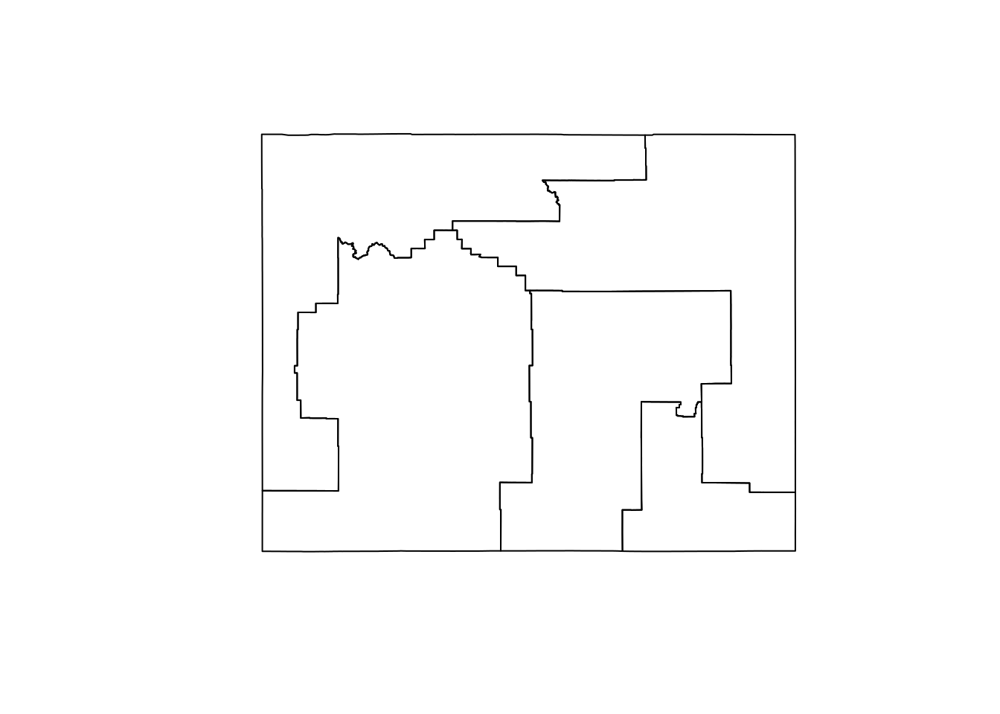

# Introduction to Census microdata


The previous two sections of this book cover aggregate-level analysis of US Census Bureau data. However, such analyses are limited to the pre-tabulated estimates provided by the Census Bureau.  While these estimates are voluminous, they may not include the level of detail required by researchers, and they are limited to analyses appropriate for aggregate-level data.  In turn, many researchers turn to Census _microdata_, which are anonymized individual-level Census records, to help answer demographic questions.  In 2020, tidycensus added support for American Community Survey microdata along with a series of tools to assist with analysis of these datasets.  The next two chapters provide an overview of this functionality in tidycensus and help users get started analyzing and modeling ACS microdata appropriately.  

## What is "microdata?"  

__Microdata__ refer to individual-level data made available to researchers.  In many cases, microdata reflect 


* [The ACS Public Use Microdata Series (PUMS)](https://www.census.gov/programs-surveys/acs/microdata.html) allows for detailed cross-tabulations not available in aggregated data

* The 1-year PUMS covers about 1 percent of the US population; the 5-year PUMS covers about 5 percent (so, not the full ACS)

* Data downloads available [in bulk from the Census FTP server](https://www2.census.gov/programs-surveys/acs/data/pums/2019/5-Year/) or [from data.census.gov's MDAT tool](https://data.census.gov/mdat/#/search?ds=ACSPUMS5Y2019)


## Microdata resources: IPUMS & ipumsr


## Microdata and the Census API


---
class: middle, center, inverse

## Using microdata in tidycensus

---

## Setting up tidycensus

* To use tidycensus, you will need a Census API key.  Visit https://api.census.gov/data/key_signup.html to request a key, then activate the key from the link in your email.  

* Once activated, use the `census_api_key()` function to set your key as an environment variable


```r
library(tidycensus)

census_api_key("YOUR KEY GOES HERE", install = TRUE)
```


---

## Basic usage of `get_pums()`


* `get_pums()` requires specifying one or more variables and the state for which you'd like to request data.  `state = 'all'` _can_ get data for the entire USA, but it takes a while!

* The function defaults to the 5-year ACS with `survey = "acs5"`; 1-year ACS data is available with `survey = "acs1"`. 

* The default year is 2019; data are available back to 2006 (1-year ACS) and 2005-2009 (5-year ACS)


```r
library(tidycensus)

wy_pums <- get_pums(
  variables = c("SEX", "AGEP", "SCHL"),
  state = "WY",
  survey = "acs1",
  year = 2019
)
```


---


```r
wy_pums
```

```
## # A tibble: 5,967 x 8
##    SERIALNO      SPORDER  WGTP PWGTP  AGEP ST    SCHL  SEX  
##    <chr>           <dbl> <dbl> <dbl> <dbl> <chr> <chr> <chr>
##  1 2019GQ0009731       1     0    47    28 56    16    1    
##  2 2019GQ0010758       1     0    27    54 56    16    2    
##  3 2019GQ0014986       1     0    67    43 56    16    1    
##  4 2019GQ0016090       1     0    57    19 56    19    1    
##  5 2019GQ0020825       1     0    24    20 56    18    2    
##  6 2019GQ0022170       1     0    73    18 56    16    1    
##  7 2019GQ0022185       1     0    32    14 56    11    1    
##  8 2019GQ0023934       1     0    75    51 56    18    1    
##  9 2019GQ0026378       1     0    40    94 56    16    2    
## 10 2019GQ0027977       1     0    48    22 56    21    1    
## # … with 5,957 more rows
```

---

## Understanding default data from `get_pums()`

`get_pums()` returns some technical variables by default without the user needing to request them specifically.  These include: 

* `SERIALNO`: a serial number that uniquely identifies households in the sample; 

* `SPORDER`: the order of the person in the household; when combined with `SERIALNO`, uniquely identifies a person;

* `WGTP`: the household weight;

* `PWGTP`: the person weight

---

## Weights and ACS microdata

* Given that PUMS data are a _sample_ of the US population, the weights columns must be used for analysis


```r
library(tidyverse)

wy_age_50 <- filter(wy_pums, AGEP == 50)

print(sum(wy_pums$PWGTP))
```

```
## [1] 578759
```

```r
print(sum(wy_age_50$PWGTP))
```

```
## [1] 4756
```


## Working with PUMS variables

---

## Variables available in the ACS PUMS


```r
View(pums_variables)
```

* The `pums_variables` dataset is your one-stop shop for browsing variables in the ACS PUMS

* It is a long-form dataset that organizes specific _value codes_ by variable so you know what you can get.  You'll use information in the `var_code` column to fetch variables, but pay attention to the `var_label`, `val_code`, `val_label`, and `data_type` columns

---

## Recoding PUMS variables


* The `recode = TRUE` argument in `get_pums()` appends recoded columns to your returned dataset based on information available in `pums_variables`


```r
wy_pums_recoded <- get_pums(
  variables = c("SEX", "AGEP", "SCHL"),
  state = "WY",
  survey = "acs1",
  year = 2019,
  recode = TRUE
)
```


---


```r
wy_pums_recoded
```

```
## # A tibble: 5,967 x 11
##    SERIALNO  SPORDER  WGTP PWGTP  AGEP ST    SCHL  SEX   ST_label SCHL_label    
##    <chr>       <dbl> <dbl> <dbl> <dbl> <chr> <chr> <chr> <ord>    <ord>         
##  1 2019GQ00…       1     0   206    17 56    16    2     Wyoming… Regular high …
##  2 2019GQ00…       1     0    50    37 56    18    1     Wyoming… Some college,…
##  3 2019GQ00…       1     0    33    75 56    19    2     Wyoming… 1 or more yea…
##  4 2019GQ00…       1     0    23    21 56    19    2     Wyoming… 1 or more yea…
##  5 2019GQ00…       1     0   209    94 56    16    1     Wyoming… Regular high …
##  6 2019GQ00…       1     0   273    26 56    16    1     Wyoming… Regular high …
##  7 2019GQ00…       1     0     6    16 56    12    1     Wyoming… Grade 9       
##  8 2019GQ00…       1     0    67    18 56    18    2     Wyoming… Some college,…
##  9 2019GQ00…       1     0   113    94 56    21    2     Wyoming… Bachelor's de…
## 10 2019GQ00…       1     0    10    44 56    13    1     Wyoming… Grade 10      
## # … with 5,957 more rows, and 1 more variable: SEX_label <ord>
```

---

## Using variables filters


* PUMS datasets - especially from the 5-year ACS - can get quite large.  The `variables_filter` argument can return a subset of data from the API, reducing long download times

* This feature is currently only available in the development (GitHub) version of tidycensus


```r
wy_pums_filtered <- get_pums(
  variables = c("SEX", "AGEP", "SCHL"),
  state = "WY",
  survey = "acs5",
  variables_filter = list(
    SEX = 2,
    SCHL = 16:20
  ),
  year = 2019,
  recode = TRUE
)
```


---


```r
wy_pums_filtered
```

```
## # A tibble: 7,658 x 11
##    SERIALNO  SPORDER  WGTP PWGTP  AGEP ST    SCHL  SEX   ST_label SCHL_label    
##    <chr>       <dbl> <dbl> <dbl> <dbl> <chr> <chr> <chr> <ord>    <ord>         
##  1 20150000…       2     5     6    83 56    20    2     Wyoming… Associate's d…
##  2 20150000…       1    23    23    62 56    18    2     Wyoming… Some college,…
##  3 20150000…       1    17    17    33 56    18    2     Wyoming… Some college,…
##  4 20150000…       1     3     3    56 56    17    2     Wyoming… GED or altern…
##  5 20150000…       2    17     7    54 56    16    2     Wyoming… Regular high …
##  6 20150000…       1     3     3    41 56    19    2     Wyoming… 1 or more yea…
##  7 20150000…       1    13    13    67 56    19    2     Wyoming… 1 or more yea…
##  8 20150000…       1     4     4    53 56    20    2     Wyoming… Associate's d…
##  9 20150000…       3     4     5    29 56    20    2     Wyoming… Associate's d…
## 10 20150000…       1    11    11    65 56    18    2     Wyoming… Some college,…
## # … with 7,648 more rows, and 1 more variable: SEX_label <ord>
```


## Public Use Microdata Areas (PUMAs)

---

## What is a PUMA?


* Public Use Microdata Areas (PUMAs) are the smallest available geographies at which records are identifiable in the PUMS datasets

* PUMAs are redrawn with each decennial US Census, and typically are home to 100,000-200,000 people

* In large cities, a PUMA will represent a collection of nearby neighborhoods; in rural areas, it might represent several counties across a large area of a state


```r
library(tigris)
options(tigris_use_cache = TRUE)

wy_pumas <- pumas(state = "WY", cb = TRUE)

plot(wy_pumas$geometry)
```




---

## Working with PUMAs in PUMS data

* To get PUMA information in your output data, use the variable code `PUMA`


```r
wy_age_by_puma <- get_pums(
  variables = c("PUMA", "AGEP"),
  state = "WY",
  survey = "acs5"
)
```

---


```r
wy_age_by_puma
```

```
## # A tibble: 29,238 x 7
##    SERIALNO      SPORDER  WGTP PWGTP  AGEP PUMA  ST   
##    <chr>           <dbl> <dbl> <dbl> <dbl> <chr> <chr>
##  1 2015000001990       1    27    26    67 00300 56   
##  2 2015000006752       1     5     5    86 00100 56   
##  3 2015000006752       2     5     6    83 00100 56   
##  4 2015000006847       1    29    29    61 00300 56   
##  5 2015000007045       1    23    23    62 00300 56   
##  6 2015000007045       2    23    19    66 00300 56   
##  7 2015000007045       3    23    34    35 00300 56   
##  8 2015000007382       1    17    17    33 00500 56   
##  9 2015000010448       1     9     9    69 00100 56   
## 10 2015000010448       2     9     9    77 00100 56   
## # … with 29,228 more rows
```


---

## Custom queries by PUMA

* The `puma` argument in `get_pums()` can be used to obtain data for a specific PUMA or multiple PUMAs - again reducing long download times if specific geographies are required


```r
wy_puma_subset <- get_pums(
  variables = "AGEP",
  state = "WY",
  survey = "acs5",
  puma = "00500"
)
```

---


```r
wy_puma_subset
```

```
## # A tibble: 7,176 x 7
##    SERIALNO      SPORDER  WGTP PWGTP  AGEP PUMA  ST   
##    <chr>           <dbl> <dbl> <dbl> <dbl> <chr> <chr>
##  1 2015000008887       1     3     3    32 00500 56   
##  2 2015000011835       1    18    18    73 00500 56   
##  3 2015000020297       1    11    11    71 00500 56   
##  4 2015000020297       2    11    12    66 00500 56   
##  5 2015000026229       1    17    17    28 00500 56   
##  6 2015000026229       2    17    13    19 00500 56   
##  7 2015000033620       1     7     6    78 00500 56   
##  8 2015000044674       1    14    13    40 00500 56   
##  9 2015000044674       2    14    14    50 00500 56   
## 10 2015000044674       3    14    10    16 00500 56   
## # … with 7,166 more rows
```


---

## Part 1 exercises

* Try requesting PUMS data using `get_pums()` yourselves, but for a state other than Wyoming.  

* Use the `pums_variables` dataset to browse the available variables in the PUMS.  Create a custom query with `get_pums()` to request data for variables other than those we've used in the above examples.  
