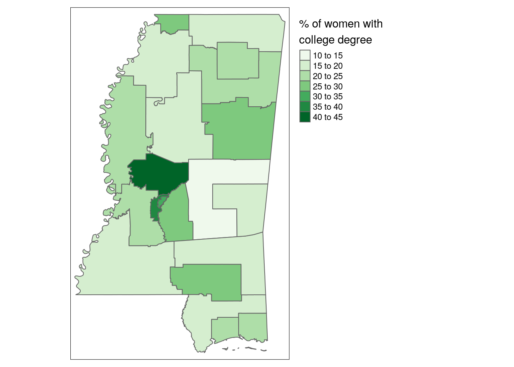

# Analyzing Census microdata


A major benefit of using the individual-level microdata returned by `get_pums()` is the ability to create detailed, granular estimates of ACS data.  While the aggregate ACS data available with `get_acs()` includes tens of thousands of indicators to choose from, researchers and analysts still may be interested in cross-tabulations not available in the aggregate files.  Additionally, microdata helps researchers design statistical models to assess demographic relationships at the individual level in a way not possible with aggregate data.  

Analysts must pay careful attention to the structure of the PUMS datasets in order to produce accurate estimates and handle errors appropriately.  PUMS datasets are _weighted_ samples, in which each person or household is not considered unique or individual, but rather representative of multiple other persons or households.  In turn, analyses and tabulations using PUMS data must use appropriate tools for handling weighting variables to accurately produce estimates.  Fortunately, tidyverse tools like dplyr, covered elsewhere in this book, are excellent for producing these tabulations and handling survey weights

As covered in Chapter 3, data from the American Community Survey are based on a sample and in turn characterized by error.  This means that ACS data acquired with `get_pums()` are similarly characterized by error, which can be substantial when cross-tabulations are highly specific.  Fortunately, the US Census Bureau provides _replicate weights_ to help analysts generate standard errors around tabulated estimates with PUMS data as they take into account the complex structure of the survey sample.  While working with replicate weights has traditionally been cumbersome for analysts, tidycensus with help from the [survey](https://cran.r-project.org/web/packages/survey/survey.pdf) and [srvyr](https://github.com/gergness/srvyr) R packages has integrated tools for handling replicate weights and correctly estimating standard errors when tabulating and modeling data. These workflows will be covered later in this chapter.  

## PUMS data and the tidyverse

As discussed in Chapter 9, `get_pums()` automatically returns data with both household (`WGTP`) and person (`PWGTP`) weights.  These weights can loosely be interpreted as the number of households - or persons - represented by each individual row in the PUMS data.  Appropriate use of these weights columns is essential for tabulating accurate estimates of population characteristics with PUMS data.  Fortunately, weighted tabulations work quite well within familiar tidyverse workflows, such as those covered in Chapter 3.  

Let's get some sample PUMS data from the 2015-2019 ACS for Mississippi.  We'll get information on the PUMA geography, along with sex, age (`AGEP`), and educational attainment (`SCHL`).  


```r
library(tidycensus)
library(tidyverse)

ms_pums <- get_pums(
  variables = c("PUMA", "SEX", "AGEP", "SCHL"),
  state = "MS",
  survey = "acs5",
  year = 2019,
  recode = TRUE
)
```

Let's take a quick look at our data: 


```r
glimpse(ms_pums)
```

```
## Rows: 146,023
## Columns: 12
## $ SERIALNO   <chr> "2015000000079", "2015000000245", "2015000000245", "2015000…
## $ SPORDER    <dbl> 1, 1, 2, 3, 1, 2, 3, 4, 1, 1, 2, 3, 1, 2, 1, 1, 1, 2, 1, 2,…
## $ WGTP       <dbl> 19, 27, 27, 27, 13, 13, 13, 13, 46, 8, 8, 8, 30, 30, 6, 39,…
## $ PWGTP      <dbl> 20, 28, 30, 23, 14, 15, 28, 24, 46, 8, 10, 11, 30, 30, 7, 3…
## $ AGEP       <dbl> 53, 30, 4, 24, 64, 61, 37, 30, 78, 63, 59, 1, 60, 57, 42, 8…
## $ PUMA       <chr> "00500", "01400", "01400", "01400", "00200", "00200", "0020…
## $ ST         <chr> "28", "28", "28", "28", "28", "28", "28", "28", "28", "28",…
## $ SCHL       <chr> "20", "16", "01", "16", "16", "16", "17", "20", "13", "21",…
## $ SEX        <chr> "1", "1", "1", "2", "2", "1", "2", "2", "1", "1", "2", "1",…
## $ ST_label   <ord> Mississippi/MS, Mississippi/MS, Mississippi/MS, Mississippi…
## $ SCHL_label <ord> "Associate's degree", "Regular high school diploma", "No sc…
## $ SEX_label  <ord> Male, Male, Male, Female, Female, Male, Female, Female, Mal…
```

As we learned in Chapter 9, the number of people in Mississippi can be tabulated by summing over the person-weight column: 


```r
sum(ms_pums$PWGTP)
```

```
## [1] 2984418
```

We can perform similar calculations with tidyverse tools.  The `count()` function in the dplyr package performs a simple tabulation of your data.  The optional `wt` argument in `count()` allows you to specify a weight column, which in this case will be our person-weight.  


```r
ms_pums %>% count(wt = PWGTP)
```

```
## # A tibble: 1 x 1
##         n
##     <dbl>
## 1 2984418
```

`count()` has the additional benefit, however, of allowing for the specification of one our more columns that will be grouped and tabulated.  For example, we could tabulate data by unique values of age and sex in Mississippi: 


```r
ms_pums %>%
  count(SEX_label, AGEP, wt = PWGTP) 
```

```
## # A tibble: 186 x 3
##    SEX_label  AGEP     n
##    <ord>     <dbl> <dbl>
##  1 Male          0 18232
##  2 Male          1 19104
##  3 Male          2 18399
##  4 Male          3 18810
##  5 Male          4 20597
##  6 Male          5 18066
##  7 Male          6 20756
##  8 Male          7 20989
##  9 Male          8 20548
## 10 Male          9 21852
## # … with 176 more rows
```

We can also perform more custom analyses, such as tabulating the number of people over age 65 by sex in Mississippi.  This involves specifying a filter condition to retain rows for records with an age of 65 and up, then tabulating by sex.  


```r
ms_pums %>%
  filter(AGEP >= 65) %>%
  count(SEX, wt = PWGTP)
```

```
## # A tibble: 2 x 2
##   SEX        n
##   <chr>  <dbl>
## 1 1     200306
## 2 2     260737
```

We can then use `get_acs()` to check our answer: 


```r
get_acs(geography = "state",
        state = "MS",
        variables = c("DP05_0030", "DP05_0031"))
```

```
## # A tibble: 2 x 5
##   GEOID NAME        variable  estimate   moe
##   <chr> <chr>       <chr>        <dbl> <dbl>
## 1 28    Mississippi DP05_0030   200258   413
## 2 28    Mississippi DP05_0031   260764   468
```


We notice that our tabulations are very close to the ACS estimates available in `get_acs()`, and well within the margin of error.  When we are doing tabulations with microdata, it is important to remember that we are tabulating data based on a smaller subsample of information than is available to the aggregate ACS estimates.  In turn, as the US Census Bureau reminds us:  

> Because PUMS data consist of a subset of the full ACS sample, tabulations from the ACS PUMS will not match those from published tables of ACS data (US Census Bureau 2021).  


## Group-wise data tabulation


```r
ms_pums_summary <- ms_pums %>% 
  mutate(ba_above = SCHL %in% c("21", "22", "23", "24")) %>% 
  group_by(PUMA, SEX_label) %>% 
  summarize(
    total_pop = sum(PWGTP),
    mean_age = weighted.mean(AGEP, PWGTP),
    ba_above = sum(PWGTP[ba_above == TRUE & AGEP >= 25]),
    ba_above_pct = 100 * (ba_above / sum(PWGTP[AGEP >= 25]))
  )
```


```r
ms_pums_summary
```

```
## # A tibble: 42 x 6
## # Groups:   PUMA [21]
##    PUMA  SEX_label total_pop mean_age ba_above ba_above_pct
##    <chr> <ord>         <dbl>    <dbl>    <dbl>        <dbl>
##  1 00100 Male          86297     35.6    12061         22.1
##  2 00100 Female        92713     37.7    17297         27.8
##  3 00200 Male          71887     38.4     5933         12.4
##  4 00200 Female        75595     41.1     8315         15.8
##  5 00300 Male          56603     36.4     4498         12.4
##  6 00300 Female        60428     38.9     6641         16.3
##  7 00400 Male          69837     37.0    10173         23.0
##  8 00400 Female        74481     39.1    11907         24.4
##  9 00500 Male          69954     36.6     8238         18.2
## 10 00500 Female        75230     38.7    11162         22.0
## # … with 32 more rows
```


## Advanced example: mapping PUMS data

* Use the tigris package to obtain PUMA geometries and join data based on a common identifier for mapping


```r
library(tigris)
library(tmap)
options(tigris_use_cache = TRUE)

ms_pumas <- pumas("MS", cb = TRUE)

joined_pumas <- ms_pumas %>%
  left_join(ms_pums_summary, by = c("PUMACE10" = "PUMA")) %>%
  filter(SEX_label == "Female")
```


```r
ms_map <- tm_shape(joined_pumas) + 
  tm_polygons(col = "ba_above_pct", 
              palette = "Greens",
              title = "% of women with\ncollege degree") + 
  tm_layout(legend.outside = TRUE,
            legend.outside.position = "right")
```


```r
ms_map
```




## Calculating errors around tabulated estimates


## Survey design and the ACS PUMS

* As we covered in the first workshop, the American Community Survey is based on a _sample_ of the US population and in turn subject to sampling error

* The complex sample design of the ACS further requires appropriate specification when fitting statistical models using PUMS data

* tidycensus, with help from the survey/srvyr packages, includes tools to assist with these tasks


## Getting replicate weights


* The Census Bureau publishes 80 "replicate weights" that can be used to calculate standard errors around tabulated estimates from microdata

* The `rep_weights` parameter in `get_pums()` makes it easier for users to retrieve all of these variables without having to request all 80 directly.  Choose `rep_weights = "person"` for person-weights or `"household"` for household weights


```r
ms_pums_replicate <- get_pums(
  variables = c("PUMA", "SEX", "AGEP", "SCHL"),
  state = "MS",
  survey = "acs5",
  year = 2019,
  recode = TRUE,
  rep_weights = "person"
)
```


```r
ms_pums_replicate
```

```
## # A tibble: 146,023 x 92
##    SERIALNO  SPORDER  AGEP PUMA  ST    SCHL  SEX   ST_label SCHL_label SEX_label
##    <chr>       <dbl> <dbl> <chr> <chr> <chr> <chr> <ord>    <ord>      <ord>    
##  1 20150000…       1    53 01100 28    16    2     Mississ… Regular h… Female   
##  2 20150000…       2    33 01100 28    13    1     Mississ… Grade 10   Male     
##  3 20150000…       3    32 01100 28    17    1     Mississ… GED or al… Male     
##  4 20150000…       1    42 00500 28    21    1     Mississ… Bachelor'… Male     
##  5 20150000…       2    37 00500 28    21    2     Mississ… Bachelor'… Female   
##  6 20150000…       3     8 00500 28    05    1     Mississ… Grade 2    Male     
##  7 20150000…       4     7 00500 28    04    1     Mississ… Grade 1    Male     
##  8 20150000…       1    33 01300 28    18    2     Mississ… Some coll… Female   
##  9 20150000…       2    15 01300 28    11    1     Mississ… Grade 8    Male     
## 10 20150000…       3     5 01300 28    02    2     Mississ… Nursery s… Female   
## # … with 146,013 more rows, and 82 more variables: WGTP <dbl>, PWGTP <dbl>,
## #   PWGTP1 <dbl>, PWGTP2 <dbl>, PWGTP3 <dbl>, PWGTP4 <dbl>, PWGTP5 <dbl>,
## #   PWGTP6 <dbl>, PWGTP7 <dbl>, PWGTP8 <dbl>, PWGTP9 <dbl>, PWGTP10 <dbl>,
## #   PWGTP11 <dbl>, PWGTP12 <dbl>, PWGTP13 <dbl>, PWGTP14 <dbl>, PWGTP15 <dbl>,
## #   PWGTP16 <dbl>, PWGTP17 <dbl>, PWGTP18 <dbl>, PWGTP19 <dbl>, PWGTP20 <dbl>,
## #   PWGTP21 <dbl>, PWGTP22 <dbl>, PWGTP23 <dbl>, PWGTP24 <dbl>, PWGTP25 <dbl>,
## #   PWGTP26 <dbl>, PWGTP27 <dbl>, PWGTP28 <dbl>, PWGTP29 <dbl>, PWGTP30 <dbl>,
## #   PWGTP31 <dbl>, PWGTP32 <dbl>, PWGTP33 <dbl>, PWGTP34 <dbl>, PWGTP35 <dbl>,
## #   PWGTP36 <dbl>, PWGTP37 <dbl>, PWGTP38 <dbl>, PWGTP39 <dbl>, PWGTP40 <dbl>,
## #   PWGTP41 <dbl>, PWGTP42 <dbl>, PWGTP43 <dbl>, PWGTP44 <dbl>, PWGTP45 <dbl>,
## #   PWGTP46 <dbl>, PWGTP47 <dbl>, PWGTP48 <dbl>, PWGTP49 <dbl>, PWGTP50 <dbl>,
## #   PWGTP51 <dbl>, PWGTP52 <dbl>, PWGTP53 <dbl>, PWGTP54 <dbl>, PWGTP55 <dbl>,
## #   PWGTP56 <dbl>, PWGTP57 <dbl>, PWGTP58 <dbl>, PWGTP59 <dbl>, PWGTP60 <dbl>,
## #   PWGTP61 <dbl>, PWGTP62 <dbl>, PWGTP63 <dbl>, PWGTP64 <dbl>, PWGTP65 <dbl>,
## #   PWGTP66 <dbl>, PWGTP67 <dbl>, PWGTP68 <dbl>, PWGTP69 <dbl>, PWGTP70 <dbl>,
## #   PWGTP71 <dbl>, PWGTP72 <dbl>, PWGTP73 <dbl>, PWGTP74 <dbl>, PWGTP75 <dbl>,
## #   PWGTP76 <dbl>, PWGTP77 <dbl>, PWGTP78 <dbl>, PWGTP79 <dbl>, PWGTP80 <dbl>
```


## Creating a `survey` object


* The __survey__ package is the standard for handling complex survey samples in R

* The more recent __srvyr__ package wraps __survey__ to allow the use of tidyverse functions on survey objects

* tidycensus includes a function, `to_survey()`, to convert ACS microdata to survey/srvyr objects


```r
library(survey)
library(srvyr)

ms_pums_svy <- ms_pums_replicate %>%
  to_survey(type = "person", 
            design = "rep_weights")

class(ms_pums_svy)
```

```
## [1] "tbl_svy"       "svyrep.design"
```


## Calculating estimates and errors with __srvyr__

* srvyr's `survey_*()` family of functions automatically calculates standard errors around tabulated estimates for you 


```r
ms_pums_svy %>% 
  survey_count(PUMA, SEX_label)
```

```
## # A tibble: 42 x 4
##    PUMA  SEX_label     n  n_se
##    <chr> <ord>     <dbl> <dbl>
##  1 00100 Male      86297  272.
##  2 00100 Female    92713  119.
##  3 00200 Male      71887  402.
##  4 00200 Female    75595  333.
##  5 00300 Male      56603  715.
##  6 00300 Female    60428  293.
##  7 00400 Male      69837  652.
##  8 00400 Female    74481  458.
##  9 00500 Male      69954  233.
## 10 00500 Female    75230  258.
## # … with 32 more rows
```


## Complex tabulations with __srvyr__


```r
ms_svy_summary <- ms_pums_svy %>% 
  mutate(ba_above = SCHL %in% c("21", "22", "23", "24")) %>% 
  filter(AGEP >= 25) %>% 
  group_by(PUMA, SEX_label) %>% 
  summarize(
    age_25_up = survey_total(vartype = "se"),
    ba_above_n = survey_total(ba_above, vartype = "se"),
    ba_above_prop = survey_mean(ba_above, vartype = "se")
    )

glimpse(ms_svy_summary)
```

```
## Rows: 42
## Columns: 8
## Groups: PUMA [21]
## $ PUMA             <chr> "00100", "00100", "00200", "00200", "00300", "00300",…
## $ SEX_label        <ord> Male, Female, Male, Female, Male, Female, Male, Femal…
## $ age_25_up        <dbl> 54604, 62248, 47679, 52649, 36400, 40802, 44281, 4889…
## $ age_25_up_se     <dbl> 240.3236, 107.8895, 350.4173, 272.1924, 468.8363, 198…
## $ ba_above_n       <dbl> 12061, 17297, 5933, 8315, 4498, 6641, 10173, 11907, 8…
## $ ba_above_n_se    <dbl> 568.4099, 607.9556, 414.7287, 463.0930, 335.5505, 400…
## $ ba_above_prop    <dbl> 0.2208813, 0.2778724, 0.1244363, 0.1579327, 0.1235714…
## $ ba_above_prop_se <dbl> 0.010308248, 0.009783897, 0.008779868, 0.008863327, 0…
```


## Converting standard errors to MOEs

* To convert standard errors to the familiar margins of error at a 90 percent confidence level, multiply them by 1.645


```r
ms_svy_summary_moe <- ms_svy_summary %>%
  mutate(ba_above_prop_moe = ba_above_prop_se * 1.645) %>%
  filter(SEX_label == "Female")

ggplot(ms_svy_summary_moe, aes(x = ba_above_prop, y = reorder(PUMA, ba_above_prop))) +
  geom_errorbarh(aes(xmin = ba_above_prop - ba_above_prop_moe, 
                     xmax = ba_above_prop + ba_above_prop_moe)) +
  geom_point(size = 3, color = "navy") +
  labs(title = "Percent of women age 25+ with 4-year college degree",
       subtitle = "PUMAs in Missisippi.  Error bars represent margin of error at 90 percent confidence level.",
       x = "2015-2019 ACS estimate (from PUMS data)",
       y = "") +
  scale_x_continuous(labels = scales::percent) + 
  theme_grey(base_size = 14)
```


## Advanced example: modeling with PUMS data


* Question (adapted from the tidycensus docs by Matt Herman): what is the relationship between wages/class of worker and commute times in Rhode Island?


```r
ri_pums_to_model <- get_pums(
  variables = c("PUMA", "WAGP", "JWMNP", "JWTRNS", "COW", "ESR"),
  state = "RI",
  survey = "acs5",
  year = 2019,
  rep_weights = "person"
  )
```


## Data preparation


* For analysis of subpopulations, `srvyr::filter()` works like `survey::subset()` for appropriate standard error estimation


```r
ri_model_sd <- ri_pums_to_model %>% 
  mutate(
    emp_type = case_when(
      COW %in% c("1", "2")      ~ "private",
      COW %in% c("3", "4", "5") ~ "public",
      TRUE                      ~ "self"
      )
    ) %>%
  to_survey() %>%
  filter(
    ESR == 1,   # civilian employed
    JWTRNS != 11, # does not work at home
    WAGP > 0,   # earned wages last year
    JWMNP > 0   # commute more than zero min
  ) 
```


## Fitting a model

* The family of modeling functions in the __survey__ package should be used for modeling data in survey design objects, e.g. `survey::svyglm()`


```r
model <- survey::svyglm(log(JWMNP) ~ log(WAGP) + emp_type + PUMA, 
                        design = ri_model_sd)
```


## Evaluating the model


```r
summary(model)
```

```
## 
## Call:
## survey::svyglm(formula = log(JWMNP) ~ log(WAGP) + emp_type + 
##     PUMA, design = ri_model_sd)
## 
## Survey design:
## Called via srvyr
## 
## Coefficients:
##                 Estimate Std. Error t value Pr(>|t|)    
## (Intercept)     1.725934   0.065017  26.546  < 2e-16 ***
## log(WAGP)       0.128040   0.006113  20.945  < 2e-16 ***
## emp_typepublic -0.102069   0.017574  -5.808 1.70e-07 ***
## emp_typeself   -0.206041   0.032482  -6.343 1.92e-08 ***
## PUMA00102      -0.055908   0.019301  -2.897  0.00503 ** 
## PUMA00103      -0.171204   0.022522  -7.602 9.88e-11 ***
## PUMA00104      -0.139590   0.025732  -5.425 7.84e-07 ***
## PUMA00201      -0.037179   0.022801  -1.631  0.10747    
## PUMA00300      -0.159596   0.025680  -6.215 3.26e-08 ***
## PUMA00400      -0.051718   0.022139  -2.336  0.02236 *  
## ---
## Signif. codes:  0 '***' 0.001 '**' 0.01 '*' 0.05 '.' 0.1 ' ' 1
## 
## (Dispersion parameter for gaussian family taken to be 13447.08)
## 
## Number of Fisher Scoring iterations: 2
```


## Part 2 exercises

* Using the dataset you acquired from the exercises in Part 1 (or the example Wyoming dataset), tabulate a group-wise summary using the PWGTP column and dplyr functions as you've learned in this section.  

* Advanced follow-up: using `get_acs()`, attempt to acquire the same aggregated data from the ACS.  Compare your tabulated estimate with the ACS estimate.

* Second advanced follow-up: request the same data as before, but this time with replicate weights.  Calculate the margin of error as you've learned in this section - and if you have time, compare with the posted ACS margin of error!  
