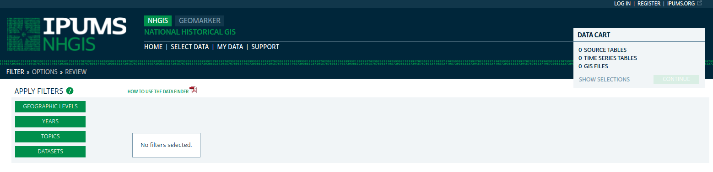
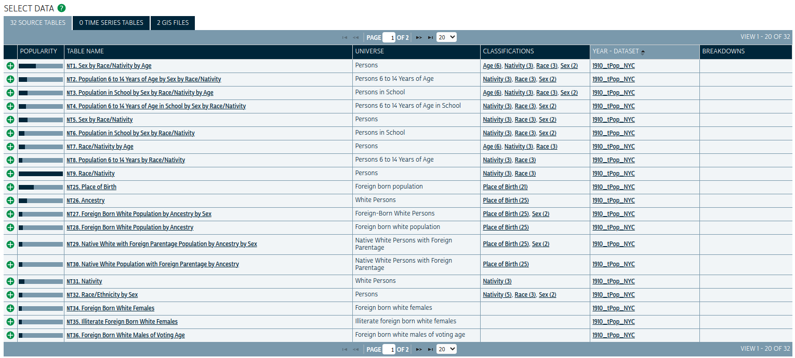
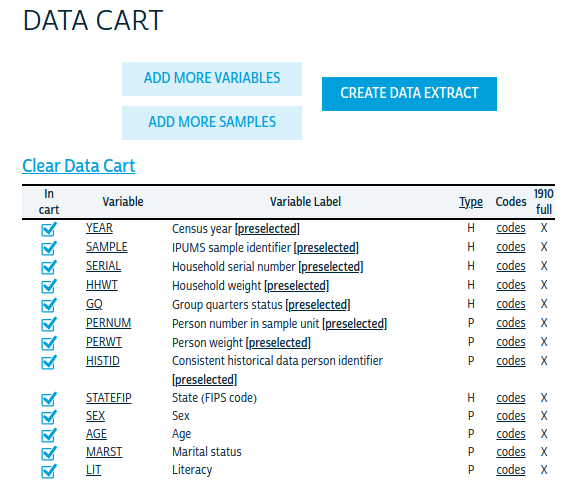
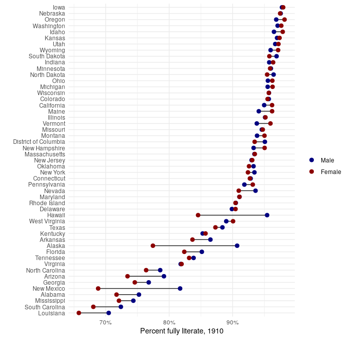

# Other Census and government data resources

```{r setup-ch11, include = FALSE}
knitr::opts_chunk$set(warning = FALSE, message = FALSE)
library(tidyverse)
```

Most of the examples covered in the book to this point use data from recent US Census Bureau datasets such as the Decennial Census since 2000 and the American Community Survey. These datasets are available through the US Census Bureau's APIs and in turn accessible with tidycensus and related tools. However, analysts and historians may be interested in accessing data from much earlier - perhaps all the way back to 1790, the first US Census! Fortunately, these historical datasets are available to analysts through the [National Historical Geographic Information System (NHGIS) project](https://www.nhgis.org/) and the [Minnesota Population Center's](https://pop.umn.edu/) [IPUMS project](https://ipums.org/). While both of these data repositories have typically attracted researchers using commercial software such as ArcGIS (for NHGIS) and Stata/SAS (for IPUMS), the Minnesota Population Center has developed an associated [ipumsr](http://tech.popdata.org/ipumsr/) R package to help analysts integrate these datasets into R-based workflows.

Additionally, the US Census Bureau publishes many other surveys and datasets besides the decennial US Census and American Community Survey. While tidycensus focuses on these core datasets, other R packages provide support for the wide range of datasets available from the Census Bureau and other government agencies.

The first part of this chapter provides an overview of how to access and use historical US Census datasets in R with NHGIS, IPUMS, and the ipumsr package. Due to the size of the datasets involved, these datasets are not provided with the sample data available in the book's data repository. To reproduce, readers should follow the steps provided to sign up for an IPUMS account and download the data themselves. The second part of this chapter covers R workflows for Census data resources outside the decennial US Census and American Community Survey. It highlights packages such as censusapi, which allows for programmatic access to all US Census Bureau APIs, and lehdr, which grants access to the LEHD LODES dataset for analyzing commuting flows and jobs distributions. Other government data resources are also addressed at the end of the chapter.

## Mapping historical geographies of New York City with NHGIS

The National Historical Geographic Information System (NHGIS) project is a tremendous resource for both contemporary and historical US Census data. While some datasets (e.g. the 2000 and 2010 decennial US Censuses, the ACS) can be accessed with both tidycensus and NHGIS, NHGIS is an excellent option for users who prefer browsing data menus to request data and/or who require historical information earlier than 2000. The example in this section will illustrate an applied workflow using NHGIS and its companion R package, ipumsr [@ellis_and_burk2020] to map geographies of immigration in New York City from the 1910 Census.

### Getting started with NHGIS

To get started with NHGIS, visit [the NHGIS website](https://www.nhgis.org/) and click the "REGISTER" link at the top of the screen to register for an account. NHGIS asks for some basic information about your work and how you plan to use the data, and you'll agree to the NHGIS usage license agreement. Once registered, return to the NHGIS home page and click the "Get Data" button to visit the NHGIS data browser interface.

{width="100%"}

A series of options on the left-hand side of your screen. These options include:

-   **Geographic levels**: the level of aggregation for your data. NHGIS includes a series of filters to help you choose the correct level of aggregation; click the plus sign to select it. Keep in mind that not all geographic levels will be available for all variables and all years. To reproduce the example in this section, click "CENSUS TRACT" then "SUBMIT."

-   **Years**: The year(s) for which you would like to request data. Decennial, non-decennial, and 5-year ranges are available for Census tracts. Note that many years are greyed out - this means that no data are available for those years at the Census tract level. The earliest year for which Census tract-level data are available is 1910, which is the year we will choose; check the box next to "1910" then click SUBMIT.

-   **Topics**: This menu helps you filter down to specific areas of interest in which you are searching for data to select. Data are organized into categories (e.g. race, ethnicity, and origins) and sub-topics (e.g. age, sex). Topics not available at your chosen geography/year combination are greyed out. Choose the "Nativity and Place of Birth" topic then click SUBMIT.

-   **Datasets**: The specific datasets from which you would like to request data, which is particularly useful when there are multiple datasets available in a given year. In this applied example, there is only one dataset that aligns with our choices: Population Data for Census tracts in New York City in 1910. As such, there is no need to select anything here.

The **Select Data** menu shows which Census tables are available given your filter selections. Usefully, the menu includes embedded links that give additional information about the available data choices, along with a "popularity" bar graph showing the most-downloaded tables for that particular dataset.

{width="100%"}

For this example, choose the tables "NT26: Ancestry" and "NT45: Race/Ethnicity" by clicking the green plus signs next to the two to select them. Then, click the **GIS FILES** tab. This tab allows you to select companion shapefiles that can be merged to the demographic extracts for mapping in a desktop GIS or in software like R. Choose either of the Census Tract options then click "CONTINUE" to review your selection. On the "REVIEW AND SUBMIT" screen, keep the "Comma delimited" file structure selected and give your extract a description if you would like.

When finished, click SUBMIT. You'll be taken to the "EXTRACTS HISTORY" screen where you can download your data when it is ready; you'll receive a notification by email when your data can be downloaded. Once you receive this notification, return to NHGIS and download both the table data and the GIS data to the same directory on your computer.

### Working with NHGIS data in R

Once acquired, NHGIS spatial and attribute data can be integrated seamlessly into R-based data analysis workflows thanks to the ipumsr package. ipumsr includes a series of NHGIS-specific functions: `read_nhgis()`, which reads in the tabular aggregate data; `read_nhgis_sf()`, which reads in the spatial data as a simple features object; and `read_nhgis_sp()`, which reads in the spatial data in legacy sp format.

`read_nhgis_sf()` has built-in features to make working with spatial and demographic data simpler for R users. If the `data_file` argument is pointed to the CSV file with the demographic data, and the `shape_file` argument is pointed to the shapefile, `read_nhgis_sf()` will read in both files simultaneously and join them correctly based on a common `GISJOIN` column found in both files. An additional perk is that `read_nhgis_sf()` can handle the zipped folders, removing an additional step from the analyst's data preparation workflow.

The example below uses `read_nhgis_sf()` to read in spatial and demographic data on immigrants in New York City in 1910. As the 1910 shapefile folder includes both NYC Census tracts and a separate dataset with US counties, the top-level folder should be unzipped, `shape_file` pointed to the second-level zipped folder, and the `shape_layer` argument used to exclusively read in the tracts. The `filter()` call will drop Census tracts that do not have corresponding data (so, outside NYC).

```{r read_nhgis, message = TRUE}
library(ipumsr)
library(tidyverse)

nyc_1910 <- read_nhgis_sf(
  data_file = "data/NHGIS/nhgis0099_csv.zip",
  shape_file = "data/NHGIS/nhgis0099_shape/nhgis0099_shapefile_tl2000_us_tract_1910.zip",
  shape_layer = starts_with("US_tract_1910")
) %>%
  filter(!is.na(TRACTA))

```

`read_nhgis_sf()` has read in the tracts shapefile as a simple features object then joined the corresponding CSV file to it *and* imported data labels from the data codebook. Note that if you are reproducing this example with data downloaded yourself, you will have a unique zipped folder & file name based on your unique download ID. The "99" in the example above reflects the 99th extract from NHGIS for a given user, not a unique dataset name.

The best way to review the variables and their labels is the `View()` command in RStudio, which is most efficient on sf objects when the geometry is first dropped with `sf::st_drop_geometry()`.

```{r view_nhgis, eval = FALSE}
View(sf::st_drop_geometry(nyc_1910))
```

{width="100%"}

As shown in the graphic above, the variable labels are particularly useful when using `View()` to understand what the different variables mean without having to reference the codebook.

### Mapping NHGIS data in R

The message displayed when reading in the NHGIS shapefile above indicates that the Census tract data are in a projected coordinate reference system, `USA_Contiguous_Albers_Equal_Area_Conic`. The spatial data can be displayed with `plot()`:

```{r plot-nyc-tracts}
plot(nyc_1910$geometry)
```

The data reflect Census tracts for New York City, but appear rotated counter-clockwise. This is because the coordinate reference system used, `ESRI:100023`, is appropriate for the entire United States (in fact, it is the base CRS used for `tigris::shift_geometry()`), but will not be appropriate for any specific small area. As covered in Chapter 5, the crsuggest package helps identify more appropriate projected coordinate reference system options.

```{r suggest-nyc-crs}
library(crsuggest)
library(sf)

suggest_crs(nyc_1910)
```

Based on these suggestions, we'll select the CRS "NAD83(2011) / New York Long Island" which has an EPSG code of 6538.

```{r transform-nyc-crs}
nyc_1910_proj <- st_transform(nyc_1910, 6538)

plot(nyc_1910_proj$geometry)
```

Given the information in the two tables downloaded from NHGIS, there are multiple ways to visualize the demographics of New York City in 1910. The first example is a choropleth map of the percentage of the total population born outside the United States. As there is no "total population" column in the dataset, the code below uses some newer tidyverse syntax to perform row-wise calculations and sum across the columns `A60001` through `A60007` to calculate this. The `transmute()` function then works like a combination of `mutate()` and `select()`: it calculates two new columns, then selects only those columns in the output dataset `nyc_pctfb`.

```{r calculate-nyc-fb}
nyc_pctfb <- nyc_1910_proj %>%
  rowwise() %>%
  mutate(total = sum(c_across(A60001:A60007))) %>%
  ungroup() %>%
  transmute(
    tract_id = GISJOIN,
    pct_fb = A60005 / total
  ) 
```

The result can be visualized with any of the mapping packages covered in Chapter \@ref(mapping-census-data-with-r), such as ggplot2 and `geom_sf()`.

```{r map-nyc-fb}
ggplot(nyc_pctfb, aes(fill = pct_fb)) + 
  geom_sf(color = NA) + 
  scale_fill_viridis_c(option = "magma", labels = scales::percent) + 
  theme_void(base_family = "Verdana") + 
  labs(title = "Percent foreign-born by Census tract, 1910",
       subtitle = "New York City",
       caption =  "Data source: NHGIS",
       fill = "Percentage")
```

Manhattan's Lower East Side stands out as the part of the city with the largest proportion of foreign-born residents in 1910, with percentages exceeding 60%.

An alternative view could focus on one of the specific groups represented in the columns in the dataset. For example, the number of Italy-born residents by Census tract is represented in the column `A6G014`; this type of information could be represented by either a graduated symbol map or a dot-density map. Using techniques learned in Section \@ref(dot-density-maps), `st_sample()` in the code below generates one dot for approximately every 100 Italian immigrants. Next, the Census tracts are dissolved with the `st_union()` function to generate a base layer on top of which the dots will be plotted.

```{r generate-italy-dots}
italy_dots <- nyc_1910_proj %>%
  st_sample(size = as.integer(.$A6G014 / 100)) %>%
  st_sf()

nyc_base <- nyc_1910_proj %>%
  st_union()
```

In Section \@ref(dot-density-maps), we used `tmap::tm_dots()` to create a dot-density map. ggplot2 and `geom_sf()` also work well for dot-density mapping; cartographers can either use `geom_sf()` with a very small `size` argument, or set `shape = "."` where each data point will be represented by a single pixel on the screen.

```{r visualize-italy-dots}
ggplot() + 
  geom_sf(data = nyc_base, size = 0.1) + 
  geom_sf(data = italy_dots, shape = ".", color = "darkgreen") + 
  theme_void(base_family = "Verdana") + 
  labs(title = "Italy-born population in New York City, 1910",
       subtitle = "1 dot = 100 people",
       caption = "Data source: NHGIS")
```

The resulting map highlights areas with large concentrations of Italian immigrants in New York City in 1910.

## Analyzing complete-count historical microdata with IPUMS and R

Chapters 9 and 10 covered the process of acquiring and analyzing microdata from the American Community Survey with tidycensus. As noted, these workflows are only available for recent demographics, reflecting the recent availability of the ACS. Historical researchers will need data that goes further back, and will likely turn to [IPUMS-USA](https://usa.ipums.org/usa/) for these datasets. IPUMS-USA makes available microdata samples all the way back to 1790, enabling historical demographic research not possible elsewhere.

A core focus of Chapter 10 was the use of sampling weights to appropriately analyze and model microdata. Historical Census datasets, however, are subject to the ["72-year rule"](https://www.census.gov/history/www/genealogy/decennial_census_records/the_72_year_rule_1.html), which states:

> The U.S. government will not release personally identifiable information about an individual to any other individual or agency until 72 years after it was collected for the decennial census. This "72-Year Rule" (92 Stat. 915; [Public Law 95-416](https://www.census.gov/history/pdf/NARA_Legislation.pdf); October 5, 1978) restricts access to decennial census records to all but the individual named on the record or their legal heir.

This means that decennial Census records that reflect periods 72 years ago or older can be made available to researchers by the IPUMS team. In fact, complete-count Census microdata can be downloaded from IPUMS at the person-level for the Census years 1850-1940, and at the household level for years earlier than 1850.

The availability of complete-count Census records offers a tremendous analytic opportunity for researchers, but also comes with some challenges. The largest ACS microdata sample - the 2015-2019 5-year ACS - has around 16 million records, which can be read into memory on a standard desktop computer with 16GB RAM. Complete-count Census data can have records exceeding 100 million, which will not be possible to read into memory in R on a standard computer. This chapter covers R-based workflows for handling massive Census microdata without needing to upgrade one's computer or set up a cloud computing instance. The solution presented involves setting up a local database with PostgreSQL and the DBeaver platform, then interacting with microdata in that database using R's tidyverse and database interface tooling.

### Getting microdata from IPUMS

To get started, visit the IPUMS-USA website at <https://usa.ipums.org/usa/>. If you already signed up for an IPUMS account in Section \@ref(getting-started-with-nhgis), log in with your user name and password; otherwise follow those instructions to register for an account, which you can use for all of the IPUMS resources including NHGIS. Once you are logged in, click the "Get Data" button to visit the data selection menu.

{width="100%"}

You'll use the various options displayed in the image above to define your extract. These options include:

-   **Select samples**: choose one or more data samples to include in your microdata extract. You can choose a wide range of American Community Survey and Decennial US Census samples, or you can download full count Census data from the "USA FULL COUNT" tab. To reproduce this example, choose the 1910 100% dataset by first un-checking the "Default sample from each year" box, clicking the "USA FULL COUNT" tab, then choosing the 1910 dataset and clicking **SUBMIT SAMPLE SELECTIONS**.

-   **Select harmonized variables**: One of the major benefits of using IPUMS for microdata analysis is that the IPUMS team has produced *harmonized variables* that aim to reconcile variable IDs and variable definitions over time allowing for easier longitudinal analysis. By default, users will browse and select from these harmonized variables. Choose from household-level variables and person-level variables by browsing the drop-down menus and selecting appropriate variable IDs; these will be added to your output extract. For users who want to work with variables as they originally were in the source dataset, click the **SOURCE VARIABLES** radio button to switch to source variables. To replicate this example, choose the STATEFIP (household \> geographic), SEX, AGE, and MARST (person \> demographic), and LIT (person \> education) variables.

-   **Display options:** This menu gives a number of options to modify the display of variables when browsing; try out the different options if you'd like.

When finished, click the "VIEW CART" link to go to your data cart. You'll see the variables that will be returned with your extract.

{width="83%"}

Notice that there will be more variables in your output extract than you selected; this is because a number of technical variables are *pre-selected,* which is similar to the approach taken by `get_pums()` in tidycensus. When you are ready to create the extract, click the **CREATE DATA EXTRACT** button to get a summary of your extract before submitting.


Note that the example shown reflects changing the output data format to CSV, which will be used to load the IPUMS data into a database. If using R directly for a smaller extract and the ipumsr R package, the default fixed-width text file with the extension `.dat` can be selected and the data can be read into R with `ipumsr::read_ipums_micro()`. To replicate the workflow below, however, the output data format should be changed to CSV.

Click **SUBMIT EXTRACT** to submit your extract request to the IPUMS system. You'll need to agree to some special usage terms for the 100% data, then wait patiently for your extract to process. You'll get an email notification when your extract is ready; when you do, return to IPUMS and download your data extract to your computer. The output format will be a gzipped CSV with a prefix unique to your download ID, e.g. `usa_00032.csv.gz`. Use an appropriate utility to unzip the CSV file.

### Loading microdata into a database

Census data analysts may feel comfortable working with `.csv` files, and reading them into R with `readr::read_csv()` or one of the many other options for loading data from comma-separated text files. The data extract created in the previous section presents additional challenges for the Census analyst, however. It contains approximately 92.4 million rows - one for each person in the 1910 US Census! This will fill up the memory of a standard laptop computer when read into R very quickly using standard tools.

An alternative solution that can be performed on a standard laptop computer is setting up a database. The solution proposed here uses [PostgreSQL](https://www.postgresql.org/), a popular open-source database, and [DBeaver](https://dbeaver.io/), a free cross-platform tool for working with databases.

If PostgreSQL is not already installed on your computer, visit <https://www.postgresql.org/download/> and follow the instructions for your operating system to install it. A full tutorial on PostgreSQL for each operating system is beyond the scope of this book, so this example will use standard defaults. When you are finished installing PostgreSQL, you will be prompted to set up a default database, which will be called `postgres` and will be associated with a user, also named `postgres`. You'll be asked to set a password for the database; the examples in this chapter also use `postgres` for the password, but you can choose whatever password you would like.

Once the default database has been set up, visit <https://dbeaver.io/download/> and download/install the appropriate DBeaver Community Edition for your operating system. Launch DBeaver, and look for the "New Database Connection" icon. Click there to launch a connection to your PostgreSQL database. Choose "PostgreSQL" from the menu of database options and fill out your connection settings appropriately.

{width="100%"}

For most defaults, the host should be `localhost` running on port `5432` with the database name `postgres` and the username `postgres` as well. Enter the password you selected when setting up PostgreSQL and click **Finish**. You'll notice your database connection appear in the "Database Navigator" pane of DBeaver.

Within the database, you can create **schemas** to organize sets of related tables. To create a new schema, right-click the postgres database in the Database Navigator pane and choose "Create \> Schema". This example uses a schema named "ipums". Within the new schema you'll be able to import your CSV file as a table. Expand the "ipums" schema and right-click on "Tables" then choose **Import Data.** Select the unzipped IPUMS CSV file and progress through the menus. This example changes the default "Target" name to `census1910`.

On the final menu, click the **Start** button to import your data. Given the size of the dataset, this will likely take some time; it took around 2 hours to prepare the example on my machine. Once the data has imported successfully to the new database table in DBeaver, you'll be able to inspect your dataset using the DBeaver interface.

{width="100%"}

### Accessing your microdata database with R

In a typical R workflow with flat files, an analyst will read in a dataset (such as a CSV file) entirely in-memory into R then use their preferred toolset to interact with the data. The alternative discussed in this section involves connecting to the 1910 Census database from R then using R's database interface toolkit through the tidyverse to analyze the data. A major benefit to this workflow is that it allows an analyst to perform tidyverse operations on datasets *in the database*. This means that tidyverse functions are translated to Structured Query Language (SQL) queries and passed to the database, with outputs displayed in R, allowing the analyst to interact with data without having to read it into memory.

The first step requires making a database connection from R. [The DBI infrastructure for R](https://www.r-dbi.org/) allows users to make connections to a wide range of databases using a consistent interface [@dbi2021]. The PostgreSQL interface is handled with the [RPostgres package](https://rpostgres.r-dbi.org/) [@wickham2021_rpostgres].

The `dbConnect()` function is used to make a database connection, which will be assigned to the object `conn`. Arguments include the database driver `Postgres()` and the username, password, database name, host, and port, which are all familiar from the database setup process.

```{r connect-to-db}
library(tidyverse)
library(RPostgres)
library(dbplyr)

conn <- dbConnect(
  drv = Postgres(),
  user = "postgres",
  password = "postgres",
  host = "localhost",
  port = "5432",
  dbname = "postgres"
)
```

Once connected to the database, the database extension to dplyr, dbplyr, facilitates interaction with database tables [@wickham2021_dbplyr]. `tbl()` links to the connection object `conn` to retrieve data from the database; the `in_schema()` function points `tbl()` to the `census1910` table in the `ipums` schema.

Printing the new object `census1910` shows the general structure of the 1910 Census microdata:

```{r show-census-1910}
census1910 <- tbl(conn, in_schema("ipums", "census1910"))

census1910
```

Our data have 13 columns and an unknown number of rows; the database table is so large that dbplyr won't calculate this automatically. However, the connection to the database allows for interaction with the 1910 Census microdata using familiar tidyverse workflows, which are addressed in the next section.

### Analyzing big Census microdata in R

While the default printing of the microdata shown above does not reveal the number of rows in the dataset, tidyverse tools can be used to request this information from the database. For example, the `summarize()` function will generate summary tabulations as shown earlier in this book; without a companion `group_by()`, it will do so over the whole dataset.

```{r calculate_rows}
census1910 %>% summarize(n())
```

There are 92.4 million rows in the dataset, reflecting the US population size in 1910. Given that we are working with complete-count data, the workflow for using microdata differs from the sample data covered in Chapters 9 and 10. While IPUMS by default returns a person-weight column, the value for all rows in the dataset for this column is 1, reflecting a 1:1 relationship between the records and actual people in the United States at that time.

dplyr's database interface can accommodate more complex examples as well. Let's say we want to tabulate literacy statistics in 1910 for the population age 18 and up in Texas by sex. A straightforward tidyverse pipeline can accommodate this request to the database. For reference, male is coded as 1 and female as 2, and the literacy codes are as follows:

-   1: No, illiterate (cannot read or write)

-   2: Cannot read, can write

-   3: Cannot write, can read

-   4: Yes, literate (reads and writes)

```{r texas-query}
census1910 %>%
  filter(age > 17, statefip == "48") %>%
  group_by(sex, lit) %>%
  summarize(num = n())
```

dbplyr also includes some helper functions to better understand how it is working and to work with the derived results. For example, the `show_query()` function can be attached to the end of a tidyverse pipeline to show the SQL query that the R code is translated to in order to perform operations in-database:

```{r show-texas-query}
census1910 %>%
  filter(age > 17, statefip == "48") %>%
  group_by(sex, lit) %>%
  summarize(num = n()) %>%
  show_query()
```

If an analyst wants the result of a database operation to be brought into R as an R object rather than as a database view, the `collect()` function can be used at the end of a pipeline to load data directly. A companion function from ipumsr, `ipums_collect()`, will add variable and value labels to the collected data based on an IPUMS codebook.

The aforementioned toolsets can now be used for robust analyses of historical microdata based on complete-count Census data. The example below illustrates how to extend the literacy by sex example above to visualize literacy gaps by sex by state in 1910.

```{r literacy-gaps-1910, eval = FALSE}
literacy_props <- census1910 %>%
  filter(age > 18) %>%
  group_by(statefip, sex, lit) %>%
  summarize(num = n()) %>%
  group_by(statefip, sex) %>%
  mutate(total = sum(num, na.rm = TRUE)) %>%
  ungroup() %>%
  mutate(prop = num / total) %>%
  filter(lit == 4) %>%
  collect()

state_names <- tigris::fips_codes %>%
  select(state_code, state_name) %>%
  distinct()

literacy_props_with_name <- literacy_props %>%
  mutate(statefip = str_pad(statefip, 2, "left", "0")) %>%
  left_join(state_names, by = c("statefip" = "state_code")) %>%
  mutate(sex = ifelse(sex == 1, "Male", "Female")) %>%

ggplot(literacy_props_with_name, aes(x = prop, y = reorder(state_name, prop), 
                           color = sex)) + 
  geom_line(aes(group = state_name), color = "grey10") + 
  geom_point(size = 2.5) +
  theme_minimal() + 
  scale_color_manual(values = c(Male = "navy", Female = "darkred")) + 
  scale_x_continuous(labels = scales::percent) + 
  labs(x = "Percent fully literate, 1910",
       color = "",
       y = "")
```

{width="100%"}

## Other US government datasets

To this point, this book has focused on a smaller number of US Census Bureau datasets, with a primary focus on the decennial US Census and the American Community Survey. However, many more US government datasets are available to researchers, some from the US Census Bureau and others from different US government agencies. This section covers a series of R packages to help analysts access these resources, and illustrates some applied workflows using those datasets.

### Accessing Census data resources with censusapi

censusapi [@recht2021] is an R package designed to give R users access to *all* of the US Census Bureau's API endpoints. Unlike tidycensus, which only focuses on a select number of datasets, censusapi's `getCensus()` function can be widely applied to the hundreds of possible datasets the Census Bureau makes available. censusapi requires some knowledge of how to structure Census Bureau API requests to work; however this makes the package more flexible than tidycensus and may be preferable for users who want to submit highly customized queries to the decennial Census or ACS APIs.

censusapi uses the same Census API key as tidycensus, though references it with the R environment variable `CENSUS_KEY`. If this environment variable is set in a user's `.Renviron` file, functions in censusapi will pick up the key without having to supply it directly.

The usethis package [@wickham_and_bryan2021] is the most user-friendly way to work with the `.Renviron` file in R with its function `edit_r_environ()`. Calling this function will bring up the `.Renviron` file in a text editor, allowing users to set environment variables that will be made available to R when R starts up.

```{r set-census-key, eval = FALSE}
library(usethis)

edit_r_environ()
```

Add the line `CENSUS_KEY='YOUR KEY HERE'` to your `.Renviron` file, replacing the `YOUR KEY HERE` text with your API key.

censusapi's core function is `getCensus()`, which translates R code to Census API queries. The `name` argument references the API name; the [censusapi documentation](<https://www.hrecht.com/censusapi/articles/example-masterlist.html>) or the function `listCensusApis()` helps you understand how to format this.

The example below makes a request to the [Economic Census API](<https://www.census.gov/programs-surveys/economic-census/data/api.html>), getting data on employment and payroll for NAICS code 72 (accommodation and food services businesses) in counties in Texas in 2017.

```{r censusapi}
library(censusapi)

tx_econ17 <- getCensus(
  name = "ecnbasic",
  vintage = 2017,
  vars = c("EMP", "PAYANN", "GEO_ID"),
  region = "county:*",
  regionin = "state:48",
  NAICS2017 = 72
)

head(tx_econ17)
```

censusapi can also be used in combination with other packages covered in this book such as tigris for mapping. The example below uses the [Small Area Health Insurance Estimates API](<https://www.census.gov/programs-surveys/sahie/data/api.html>), which delivers modeled estimates of health insurance coverage at the county level with various demographic breakdowns. Using censusapi and tigris, we can retrieve data on the percent of the population below age 19 without health insurance for all counties in the US. This information will be joined to a counties dataset from tigris with shifted geometry, then mapped with ggplot2.

```{r map-sahie}
library(tigris)
library(tidyverse)

us_youth_sahie <- getCensus(
  name = "timeseries/healthins/sahie",
  vars = c("GEOID", "PCTUI_PT"),
  region = "county:*",
  regionin = "state:*",
  time = 2019,
  AGECAT = 4
)

us_counties <- counties(cb = TRUE, resolution = "20m") %>%
  shift_geometry(position = "outside") %>%
  inner_join(us_youth_sahie, by = "GEOID") 

ggplot(us_counties, aes(fill = PCTUI_PT)) + 
  geom_sf(color = NA) + 
  theme_void() + 
  scale_fill_viridis_c() + 
  labs(fill = "% uninsured ",
       caption = "Data source: US Census Bureau Small Area\nHealth Insurance Estimates via the censusapi R package",
       title = "  Percent uninsured under age 19 by county, 2019")
```

As these are *modeled* estimates, state-level influences on the county-level estimates are apparent on the map.

### Analyzing labor markets with lehdr

Another very useful package for working with Census Bureau data is the lehdr R package [@green2021], which access the Longitudinal and Employer-Household Dynamics (LEHD) Origin-Destination Employment Statistics (LODES) data. LODES is not available from the Census API, meriting an alternative package and approach. LODES includes synthetic estimates of residential, workplace, and residential-workplace links at the Census block level, allowing for highly detailed geographic analysis of jobs and commuter patterns over time.

The core function implemented in lehdr is `grab_lodes()`, which downloads a LODES file of a specified `lodes_type` (either `"rac"` for residential, `"wac"` for workplace, or `"od"` for origin-destination) for a given state and year. While the raw LODES data are available at the Census block level, the `agg_geo` parameter offers a convenient way to roll up estimates to higher levels of aggregation. For origin-destination data, the `state_part = "main"` argument below captures within-state commuters; use `state_part = "aux"` to get commuters from out-of-state.

```{r lehdr}
library(lehdr)
library(tidycensus)
library(sf)
library(tidyverse)

wa_lodes_od <- grab_lodes(
  state = "wa",
  year = 2018,
  lodes_type = "od",
  agg_geo = "tract",
  state_part = "main"
)
```

The result is a dataset that shows tract-to-tract commute flows (`S000`) and broken down by a variety of characteristics, [referenced in the LODES documentation](<https://lehd.ces.census.gov/data/lodes/LODES7/LODESTechDoc7.5.pdf>).

```{r show-wa-lodes, echo = FALSE}
wa_lodes_od[1:10,] %>%
  knitr::kable() %>%
  kableExtra::kable_styling()
```

lehdr can be used for a variety of purposes including transportation and economic development planning. For example, the workflow below illustrates how to use LODES data to understand the origins of commuters to the Microsoft campus (represented by its Census tract) in Redmond, Washington. Commuters from LODES will be normalized by the total population age 18 and up, acquired with tidycensus for Seattle-area counties. The dataset `ms_commuters` will include Census tract geometries (obtained with `geometry = TRUE` in tidycensus) and an estimate of the number of Microsoft-area commuters per 1000 adults in that Census tract.

```{r microsoft-commuters}
seattle_adults <- get_acs(
  geography = "tract",
  variables = "S0101_C01_026",
  state = "WA",
  county = c("King", "Kitsap", "Pierce",
             "Snohomish"),
  geometry = TRUE
)

microsoft <- filter(wa_lodes_od, w_tract == "53033022803")

ms_commuters <- seattle_adults %>%
  left_join(microsoft, by = c("GEOID" = "h_tract")) %>%
  mutate(ms_per_1000 = 1000 * (S000 / estimate)) %>%
  st_transform(6596)
```

The result can be visualized on a map with ggplot2, or alternatively with any of the mapping tools introduced in Chapter \@ref(mapping-census-data-with-r).

```{r}
ggplot(ms_commuters, aes(fill = ms_per_1000)) + 
  geom_sf(color = NA) + 
  theme_void() + 
  scale_fill_viridis_c(option = "cividis") + 
  labs(title = "Microsoft commuters per 1000 adults",
       subtitle = "2018 LODES data, Seattle-area counties",
       fill = "Rate per 1000")
```

### Bureau of Labor Statistics data with blscrapeR

blscrapeR

### Working with agricultural data with tidyUSDA

tidyUSDA

## Getting government data without R packages

### Making requests to APIs with httr

General example: using httr to get data

```{r get-data-hud}
library(glue)
library(httr)
library(jsonlite)
library(tidyverse)

my_token <- Sys.getenv("HUD_TOKEN")

hud_chas_request <- GET("https://www.huduser.gov/hudapi/public/chas?type=3&year=2012-2016&stateId=51&entityId=59",
                add_headers(Authorization = glue("Bearer {my_token}")))

hud_chas_request$status_code

```

Now, take a look at what we got back:

```{r hud-content}
content(hud_chas_request, as = "text")
```

```{r hud-from-json, eval = FALSE}
hud_chas_request %>%
  content(as = "text") %>%
  fromJSON()
  
```

```{r hud-from-json-styling, echo = FALSE}
hud_chas_request %>%
  content(as = "text") %>%
  fromJSON() %>%
  knitr::kable() %>%
  kableExtra::kable_styling()
```

### Writing your own data access functions

```{r define-function}
get_hud_chas <- function(
  type, 
  year = "2013-2017", 
  state_id = NULL, 
  entity_id = NULL, 
  token = NULL
) {
  
  if (is.null(token)) {
    if (Sys.getenv("HUD_TOKEN") != "") {
      token <- Sys.getenv("HUD_TOKEN")
    }
  }
  
  base_url <- "https://www.huduser.gov/hudapi/public/chas"
  
  hud_query <- httr::GET(
    base_url,
    httr::add_headers(Authorization = glue::glue("Bearer {token}")),
    query = list(
      type = type,
      year = year,
      stateId = state_id,
      entityId = entity_id)
  )
  
  # Return the HTTP error message if query failed
  if (hud_query$status_code != "200") {
    msg <- httr::content(hud_query, as = "text")
    return(msg)
  }
  
  hud_content <- httr::content(hud_query, as = "text")
  
  hud_tibble <- hud_content |>
    jsonlite::fromJSON() |>
    dplyr::as_tibble() |>
    tidyr::pivot_longer(cols = !dplyr::all_of(c("geoname", "sumlevel", "year")),
                        names_to = "indicator",
                        values_to = "value")
  
  return(hud_tibble)
  
}
```

Now, let's try out the function:

```{r}
get_hud_chas(type = 3, state_id = 51, entity_id = 510)
```
