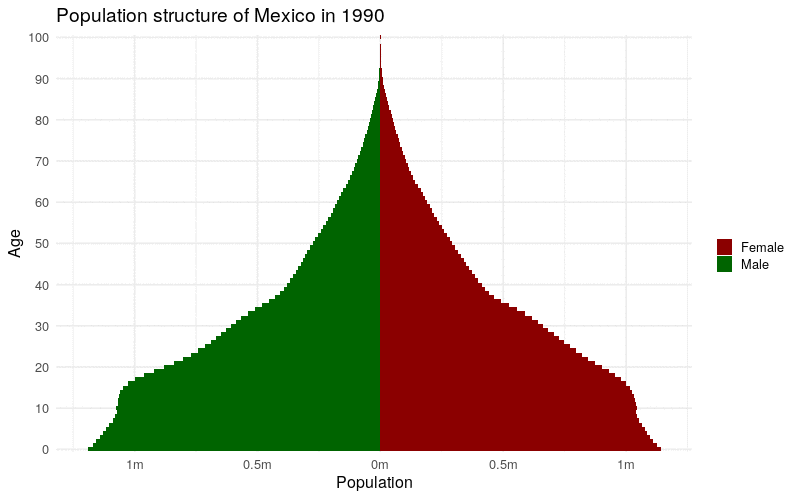
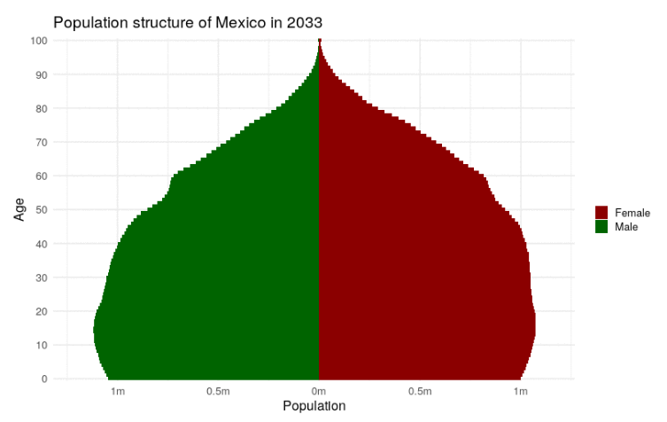
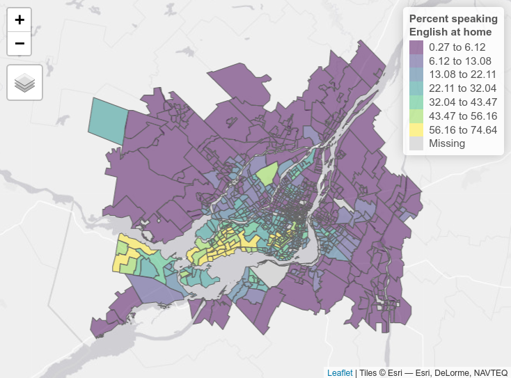

# Working with Census data outside the United States

```{r setup-ch12, include = FALSE}
library(idbr)
library(tidyverse)
library(cancensus)

source("R/book-functions.R")
```

Although the methods presented in this book are generalizable, the examples given in the book to this point have focused on the United States. Readers of this book are most certainly not limited to the United States in their projects, and will be interested in how to apply the methods presented to examples around the world. International Census & demographic data is the focus of this chapter. The first section focuses on *global demographic indicators* for between-country comparisons and gives an overview of the **idbr** R package for accessing these indicators through the [US Census Bureau's International Data Base](https://www.census.gov/programs-surveys/international-programs/about/idb.html). The sections that follow cover country-specific packages from around the world that deliver Census data to R users in similar ways to the US-focused packages covered earlier in this book. Examples from Canada, Mexico, Brazil, and Kenya illustrate how to apply the methods readers have learned in this book to Census data analyses in other parts of the world.

## The International Data Base and the idbr R package

The US Census Bureau's International Database (IDB) is a repository of dozens of demographic indicators for over 200 countries around the world. The IDB includes both historical information by year for most countries as well as population projections to 2100. In-place demographic characteristics are derived from a wide range of international Censuses and surveys, and future projections are estimated with the cohort-component method.

The Census Bureau makes these datasets available to researchers [through an interactive data tool](https://www.census.gov/data-tools/demo/idb/#/country?YR_ANIM=2021) and also through its API, allowing for programmatic data access. The **idbr** R package [@walker_idbr2021], first released in 2016 and updated to version 1.0 in 2021, uses a simple R interface to help users gain access to and analyze data from the IDB.

To get started with **idbr**, users can install the package from CRAN and set their Census API keys with the `idb_api_key()` function. If a user's Census API key is already installed using **tidycensus**, **idbr** will pick it up making this step unnecessary.

```{r idb-api-key, eval = FALSE}
library(idbr)
# Unnecessary if API key is installed with tidycensus
idb_api_key("YOUR KEY GOES HERE")

```

The core function implemented in **idbr** is `get_idb()`, which can access all datasets available in the IDB. There are two main datasets available: the 1-year-of-age population dataset, which allows for population data by country to be downloaded broken down by age and sex; and the 5-year-of-age dataset, which gives access to population by 5-year age bands but also many other fertility, mortality, and migration indicators that are not organized by age bands.

A basic IDB query uses a country, specified as either an ISO-2 code or a country name in English, a vector of one or more variables, and a vector of one or more years. For example, we can fetch historical and projected population for Nigeria from 1990 to 2100:

```{r nigeria-pop}
nigeria_pop <- get_idb(
  country = "Nigeria",
  variables = "pop",
  year = 1990:2100
)
```

```{r nigeria-pop-show, echo = FALSE}
style_data(nigeria_pop, caption = "Nigeria population data acquired with idbr")
```

The result can then be visualized as a time series using **ggplot2**.

```{r plot-nigeria-pop, fig.cap = "Historical and projected population of Nigeria"}
library(tidyverse)

ggplot(nigeria_pop, aes(x = year, y = pop)) + 
  geom_line(color = "darkgreen") + 
  theme_minimal() + 
  scale_y_continuous(labels = scales::label_number_si()) + 
  labs(title = "Population of Nigeria",
       subtitle = "1990 to 2100 (projected)",
       x = "Year",
       y = "Population at midyear")
```

**idbr** includes functionality to help users look up variable codes for use in their function calls. The function `idb_variables()` returns a data frame with all variables available in the IDB, along with an informative label; the `idb_concepts()` function prints out a list of *concepts* that can be supplied to the `concept` parameter and will return a group of variables that belong to the same concept (e.g. mortality rates, components of population growth).

For worldwide analyses, users can specify the argument `country = "all"` to return all available countries in the IDB. In concert with tidyverse tools, this makes global comparative analyses straightforward. In the example below, we get data on life expectancy at birth for all countries in 2021, then view the top 10 and bottom 10 countries.

```{r world-lex, eval = FALSE}

world_lex <- get_idb(
  country = "all",
  variables = "e0",
  year = 2021
)

world_lex %>% 
  slice_max(e0, n = 10)
```

```{r world-lex-show, echo = FALSE}
world_lex <- get_idb(
  country = "all",
  variables = "e0",
  year = 2021
)

world_lex %>% 
  slice_max(e0, n = 10) %>%
  style_data(caption = "Countries with the longest life expectancies at birth, 2021")
```

```{r world-lex-min, eval = FALSE}
world_lex %>% 
  slice_min(e0, n = 10)
```

```{r world-lex-min-show, echo = FALSE}
world_lex %>% 
  slice_min(e0, n = 10) %>%
  style_data(caption = "Countries with the shortest life expectancies at birth, 2021")
```

### Visualizing IDB data

**idbr** aims to return data from the IDB in a structure suitable for creative data visualizations. This includes population pyramids (like those introduced in Chapter 4) and world maps.

As mentioned earlier in this chapter, `get_idb()` can retrieve population data by age and sex in one-year age bands if the `age` or `sex` arguments are supplied but `variables` is left blank. An illustration of this is found in the example below, where `get_idb()` is used to get 1-year-of-age population data for 2021 in Japan, broken down by sex.

```{r japan-pop-data}
japan_data <- get_idb(
  country = "Japan",
  year = 2021,
  age = 0:100,
  sex = c("male", "female")
) 
```

```{r japan-data-show, echo = FALSE}
style_data(japan_data, caption = "1-year age band population data for Japan in 2021")
```

Following the example illustrated in Section \@ref(designing-and-styling-the-population-pyramid), a population pyramid can be created by changing data values for one sex to negative, then plotting the data as back-to-back horizontal bar charts.

```{r japan-pyramid, fig.cap = "Population pyramid for Japan"}

japan_data %>%
  mutate(pop = ifelse(sex == "Male", pop * -1, pop)) %>%
  ggplot(aes(x = pop, y = as.factor(age), fill = sex)) + 
  geom_col(width = 1) + 
  theme_minimal(base_size = 12) + 
  scale_x_continuous(labels = function(x) paste0(abs(x / 1000000), "m")) + 
  scale_y_discrete(breaks = scales::pretty_breaks(n = 10)) + 
  scale_fill_manual(values = c("darkred", "navy")) + 
  labs(title = "Population structure of Japan in 2021",
       x = "Population",
       y = "Age",
       fill = "")
```

The aging structure of Japan's population is notable, especially the number of female centenarians (women aged 100 and up) that stand out on the chart, a number that is likely to grow in the years ahead.

`get_idb()` also includes a `geometry` parameter to help users make world maps of demographic indicators. By setting `geometry = TRUE`, `get_idb()` returns a simple features object with a `geometry` column attached to the demographic data. Here, we fetch data on total fertility rate by country in 2021.

```{r world-map-data}

library(idbr)
library(tidyverse)

fertility_data <- get_idb(
  country = "all",
  year = 2021,
  variables = "tfr",
  geometry = TRUE,
)
```

There are a couple points of note with respect to the data returned. The dataset leaves out a number of small countries that would not appear on a zoomed-out world map. To ensure that they are retained, use the argument `resolution = "high"` for a higher-resolution dataset (which you may also want for regional mapping). There are also rows returned as `NA` in the dataset; this is to fill in areas that should appear on the map (like Antarctica) but do not have data in the IDB.

The data returned can be mapped with `geom_sf()` from ggplot2 or any other mapping tool introduced in this book. Specifying a suitable map projection with `coord_sf()` for the whole world - like the Robinson projection used below - is recommended.

```{r fertility-map, fig.cap = "Map of total fertility rates by country in 2021"}

ggplot(fertility_data, aes(fill = tfr)) + 
  theme_bw() + 
  geom_sf() + 
  coord_sf(crs = 'ESRI:54030') + 
  scale_fill_viridis_c() + 
  labs(fill = "Total fertility\nrate (2021)")

```

### Interactive and animated visualization of global demographic data

In Chapter 6, readers learned how to create interactive maps of US Census data with the **tmap** and **leaflet** packages. While the same methods *can* be applied to the global data returned by `get_idb()`, the Web Mercator projection used by the Leaflet library is not ideal for world maps as it inflates the area of countries near the poles relative to countries near the Equator. This problem with Web Mercator was covered in Section \@ref(alternative-approaches-to-interactive-mapping) and is particularly important for global maps. In turn, it is preferable to turn to other interactive charting libraries such as **ggiraph**.

To get started, let's return to our global fertility data and create a new column that will store information we want to include in our tooltip that appears when a viewer hovers over a country.

```{r prep-tfr-tooltip}
fertility_data$tooltip <- paste0(fertility_data$name,
                                 ": ",
                                 round(fertility_data$tfr, 2))
```

We now set up the visualization. Note that instead of using `geom_sf()`, we use **ggiraph**'s `geom_sf_interactive()`, which includes some new aesthetics. We map our new `tooltip` column to the `tooltip` aesthetic, which will generate a hover tooltip, and we map the `code` column to the `data_id` aesthetic, which will change the country's color when hovered over. The `girafe()` function then renders the interactive graphic; we can specify that we want map zooming with `girafe_options()`.

```{r interactive-world-map, fig.cap = "Interactive world map with ggiraph"}
library(ggiraph)

fertility_map <- ggplot(fertility_data, aes(fill = tfr)) + 
  theme_bw() + 
  geom_sf_interactive(aes(tooltip = tooltip, data_id = code), size = 0.1) + 
  coord_sf(crs = 'ESRI:54030') + 
  scale_fill_viridis_c() + 
  labs(fill = "Total fertility\nrate (2021)")

girafe(ggobj = fertility_map) %>%
  girafe_options(opts_zoom(max = 10))
```

The time-series data availability in the IDB also works well for creating animated time-series graphics with help from the **gganimate** package [@pedersen_gganimate]. **gganimate** extends **ggplot2** to animate sequences of plots using intuitive syntax to **ggplot2** users. Earlier in this chapter, we learned how to create a population pyramid from IDB data for a single year (2021). If data are requested instead for multiple years, **gganimate** can be used to transition from year to year in an animated population pyramid, showing how the population structure of a country has evolved (and is projected to evolve) over time.

```{r animated-pyramid, eval = FALSE}
library(idbr)
library(tidyverse)
library(gganimate)

mx_pyramid_data <- get_idb(
  country = "Mexico",
  sex = c("male", "female"),
  age = 0:100,
  year = 1990:2050
) %>%
  mutate(pop = ifelse(sex == "Male", pop * -1, pop))

mx_animation <- ggplot(mx_pyramid_data, 
                       aes(x = pop, 
                           y = as.factor(age), 
                           fill = sex)) + 
  geom_col(width = 1) + 
  theme_minimal(base_size = 16) + 
  scale_x_continuous(labels = function(x) paste0(abs(x / 1000000), 
                                                 "m")) + 
  scale_y_discrete(breaks = scales::pretty_breaks(n = 10)) + 
  scale_fill_manual(values = c("darkred", "darkgreen")) + 
  transition_states(year) + 
  labs(title = "Population structure of Mexico in {closest_state}",
       x = "Population",
       y = "Age",
       fill = "")

animate(mx_animation, height = 500, width = 800)

```

```{r animated-pyramid-show, echo = FALSE, fig.cap = "Animated time-series population pyramid of Mexico"}
if (knitr::is_html_output()) {
  
} else {
  
}

```

The animation illustrates the aging of Mexico's population, both observed and projected, during the specified time period.

## Country-specific Census data packages

Analysts around the world need access to high-quality tabular and spatial demographic data to make decisions much like the data that are available from the US Census Bureau. While Censuses are conducted by countries around the world, few countries expose their data by API in the way the US Census Bureau does. Nonetheless, there are a number of R packages that help analysts acquire and work with country-specific Census data. This section of the book covers a sampling of those packages, with examples given from Canada, Mexico, Kenya, and Brazil. These examples will illustrate how to apply many of the techniques introduced in this book to a variety of non-US examples.

### Canada: cancensus

The **cancensus** R package [@vonbergmann2021] grants comprehensive access to Canadian Census data through the [CensusMapper APIs](https://censusmapper.ca/). While Statistics Canada, the Canadian agency that distributes Canadian demographic data, does not maintain these APIs, package author Jens von Bergmann's CensusMapper product makes Canadian data accessible via a web interface and data API. Working with **cancensus** will feel familiar to **tidycensus** users, as **cancensus** integrates well within the tidyverse and includes an option to return feature geometry along with demographic data for a wide range of Canadian geographies.

To get started with **cancensus**, obtain an API key from the CensusMapper website and store it in your `.Renviron` file as discussed in Section \@ref(other-census-and-government-data-resources). Supplying this key to the `cancensus.api_key` option will allow the key to be picked up automatically by cancensus functions.

The `list_census_vectors()` function operates in a similar way to `load_variables()` in **tidycensus**. Specify a dataset to generate a browsable data frame of variable IDs which can be used to query data from the CensusMapper API.

```{r cancensus-1}
library(cancensus)
library(tidyverse)
options(cancensus.api_key = Sys.getenv("CANCENSUS_API_KEY"))

var_list <- list_census_vectors("CA16")
```

```{r show-canada-vars, echo = FALSE}
style_data(var_list, n_rows = 5, caption = "List of Census vectors in cancensus")
```

The data can be browsed with the `View()` function in RStudio much like it is recommended to do with **tidycensus** in Section \@ref(searching-for-variables-in-tidycensus). Two companion functions, `list_census_regions()` and `list_census_datasets()`, should also be used to identify region codes and dataset codes for which you'd like to request data.

Once determined, the appropriate codes can be passed as arguments to various parameters in the `get_census()` function, the main data access function used in **cancensus**. The example below fetches data on English speakers by Census tract in the Montreal area in this way.

```{r montreal-english, results = 'hide'}
montreal_english <- get_census(
  dataset = "CA16",
  regions = list(CMA = "24462"),
  vectors = "v_CA16_1364",
  level = "CT",
  geo_format = "sf",
  labels = "short"
) 
```

The example above constructs the query to the CensusMapper API using the following arguments:

-   `dataset = "CA16"` requests data from the 2016 Canadian Census;

-   `regions = list(CMA = "24462")` gets data for the Montreal metropolitan area by using a named list, matching the region type `CMA` with the specific ID for the Montreal area;

-   `vectors = "v_CA16_1364"` fetches data for the specific Census vector that represents English language speaking, as identified using `list_census_vectors()`;

-   `level = "CT"` gets data at the Census tract level;

-   `geo_format = "sf"` instructs `get_census()` to return simple feature geometry for Census tracts along with the Census data;

-   `labels = "short"` returns simpler labels in the output dataset.

Once queried, our data appear as follows:

```{r style-data-cancensus-english, echo = FALSE}
style_data(montreal_english, 6, "Data on English speakers in Montreal by Census tract")
```

By default, cancensus returns a number of contextual variables along with the requested Census vector; total population, total households, total dwellings, and area can be used for normalization automatically. This information can be used to normalize data on English speakers by calculating a new column with `mutate()` named `pct_english`; familiar mapping tools from Chapter \@ref(mapping-census-data-with-r) are then used to visualize the data.

```{r map-montreal-english, eval = FALSE}
library(tmap)
tmap_mode("view")

montreal_pct <- montreal_english %>%
  mutate(pct_english = 100 * (v_CA16_1364 / Population))

tm_shape(montreal_pct) + 
  tm_polygons(
    col = "pct_english", 
    alpha = 0.5, 
    palette = "viridis",
    style = "jenks", 
    n = 7, 
    title = "Percent speaking<br/>English at home"
  )
```

```{r show-montreal-english, echo = FALSE, fig.cap = "Interactive map of the percentage English language speakers at home in the Montreal area"}
if (knitr::is_html_output()) {
  knitr::include_url("img/leaflet/montreal_english.html", height = "500px")
} else {
  
}

```

Exploring the data interactively reveals distinctive patterns of English language speaking in Montreal. While English is the most common language spoken at home in some central Census tracts and the southwestern portion of the Island of Montreal, percentages are much lower in suburban areas and the outer portions of the metropolitan region.

### Kenya: rKenyaCensus

The **rKenyaCensus** package [@kariuki2020] makes indicators from the 2019 Kenya Population and Housing Census available to R users. This package is the result of a painstaking effort by the package author [Shel Kariuki](https://shelkariuki.netlify.app/) to scrape data from PDFs containing the Census results - which is the way the original data were distributed - and convert them to R data frames. Kenyan Census tables install directly with the package and can be accessed by name. Let's take a look at table `V4_T2.30`, which contains information on religion by county in Kenya. We will assign this table to the variable `religion` for ease of reference.

```{r kenya-1}
# remotes::install_github("Shelmith-Kariuki/rKenyaCensus")
library(rKenyaCensus)
library(tidyverse)

religion <- V4_T2.30
```

```{r show-kenya-religion, echo = FALSE}
style_data(religion, n_rows = 5, caption = "Religion data from the 2019 Kenyan Census")
```

The data are organized by county in Kenya with religious affiliations arranged by column. The first row represents data for the entirety of Kenya. Some additional data wrangling steps allow for the data to be readily plotted using familiar tooling. For example, the inclusion of the `Total` column makes calculation of proportions straightforward. In the example below, a new column `prop_islam` is computed and passed to a **ggplot2** bar chart.

```{r plot-kenya, fig.height=10, fig.cap = "Bar chart of Islam prevalence by county in Kenya"}
religion_prop <- religion %>%
  filter(County != "KENYA") %>%
  mutate(county_title = str_to_title(County), 
         prop_islam = Islam / Total)

ggplot(religion_prop, aes(x = prop_islam, 
                          y = reorder(county_title, prop_islam))) + 
  geom_col(fill = "navy", alpha = 0.6) + 
  theme_minimal(base_size = 12.5) + 
  scale_x_continuous(labels = scales::percent) + 
  labs(title = "Percent Muslim by County in Kenya",
       subtitle = "2019 Kenyan Census", 
       x = "",
       y = "",
       caption = "Data source: rKenyaCensus R package")
```

The visualization illustrates that most Kenyan counties have very small Muslim populations; however, a smaller number of counties have much larger Muslim populations, with percentages in some cases close to 100%. This raises related questions about the geography of these patterns, which can be mapped using additional functionality in **rKenyaCensus**.

The **rKenyaCensus** package includes a built-in county boundaries dataset to facilitate mapping of the various indicators in the Census, `KenyaCounties_SHP`. This object is of class `SpatialPolygonsDataFrame`, which will need to be converted to a simple features object with `sf::st_as_sf()`

```{r show-kenya-counties, fig.cap = "ggplot2 map of Kenya county boundaries"}
library(sf)

kenya_counties_sf <- st_as_sf(KenyaCounties_SHP)

ggplot(kenya_counties_sf) + 
  geom_sf() + 
  theme_void()

```

With a little additional cleaning, the religion data can be joined to the county boundaries dataset, facilitating choropleth mapping with **ggplot2** and `geom_sf()`.

```{r map-kenya, fig.cap = "Choropleth map of Islam in Kenya"}
kenya_islam_map <- kenya_counties_sf %>%
  mutate(County = str_remove(County, " CITY")) %>%
  left_join(religion_prop, by = "County") 

ggplot(kenya_islam_map, aes(fill = prop_islam)) + 
  geom_sf() + 
  scale_fill_viridis_c(labels = scales::percent) + 
  theme_void() + 
  labs(fill = "% Muslim",
       title = "Percent Muslim by County in Kenya",
       subtitle = "2019 Kenyan Census",
       caption = "Data acquired with the rKenyaCensus R package")
```

The map shows how the distinct religious divides in Kenya play out geographically in the country, with proportionally few Muslim residents in the western part of Kenya and much higher percentages in the eastern part of the country.

### Mexico: combining mxmaps and inegiR

Mexico's national statistics office, the [Instituto Nacional de Estadística y Geografía (INEGI)](https://www.inegi.org.mx/), offers an API for access to many of its datasets. Used together, the **mxmaps** [@vallejones2021] and **inegiR** [@flores2021] R packages allow for geographic analysis and visualization of Mexican Census data obtained from INEGI.

Like other APIs introduced in this book, the INEGI API requires an API token. [This token can be requested from the INEGI website](http://www3.inegi.org.mx//sistemas/api/indicadores/v1/tokenVerify.aspx). Once acquired, it can be used by both **mxmaps** and **inegiR** to request data; I'm saving my key as the environment variable `INEGI_API_KEY`.

The **mxmaps** package is based on the **choroplethr** R package [@lamstein2020], which offers a convenient interface for visualizing data from the US ACS. **mxmaps** wraps **inegiR**'s data access functions in the `choropleth_inegi()` function, which can request data for [indicators from INEGI's data bank](https://en.www.inegi.org.mx/app/indicadores/) and visualize them. The map below shows the percentage of residents by state born in Mexico but outside their current state of residence using indicator code `304003001`. For full functionality, the **inegiR** and **mxmaps** packages must both be installed from GitHub with `remotes::install_github()`.

```{r mxmaps, message = FALSE, fig.cap = "Choropleth map of internal migration in Mexico by state"}
# remotes::install_github("Eflores89/inegiR")
# remotes::install_github("diegovalle/mxmaps")
library(mxmaps)
token_inegi <- Sys.getenv("INEGI_API_KEY")

state_regions <- df_mxstate_2020$region
choropleth_inegi(token_inegi, state_regions, 
                 indicator = "3104003001",
                 legend = "%",
                 title = "Percentage born outside\nstate of residence") + 
  theme_void(base_size = 14) + 
  labs(caption = "Data sources: INEGI, mxmaps R package")
```

The map illustrates that the states with the most internal migrants in Mexico include Baja California Sur, Quintana Roo, and Nuevo Leon. This information can also be accessed directly using the inegiR package. The `inegi_series()` function returns one state at a time, which can be combined into a country-wide dataset with `map_dfr()`.

```{r inegir}
library(inegiR)
token_inegi <- Sys.getenv("INEGI_API_KEY")
state_regions <- mxmaps::df_mxstate_2020$region

pct_migrants <- map_dfr(state_regions, ~{
  inegi_series(series_id = "3104003001", 
               token = token_inegi, 
               geography = .x,
               database = "BISE") %>%
    mutate(state_code = .x)
})
  
```

```{r show-inegir, echo = FALSE}
style_data(pct_migrants, caption = "Illustration of data acquired with inegiR")
```

### Brazil: aligning the geobr R package with raw Census data files for spatial analysis

The three country-specific examples shown above - Canada, Kenya, and Mexico - illustrate workflows for obtaining data directly from an R package and mapping the results. In many cases, however, data do not come directly with an R package, requiring analysts to research the raw data and work with raw files. The example below illustrates how to accomplish this for Brazil, where spatial data are found in a well-documented and widely used R package **geobr**, but demographic data will be downloaded and processed directly from the Instituto Brasileiro de Geografia e Estatística website using R tooling.

#### Spatial data for Brazil with geobr

The **geobr** [@pereira2021] package from [IPEA](https://www.ipea.gov.br/portal/) helps you load spatial datasets for many Brazilian geographies, including Census boundaries. These datasets are generously hosted by IPEA and downloaded into a user's R session when the corresponding function is called. The `code_tract` parameter can accept a 7-digit municipality code; below, the code for Rio de Janeiro is used. Municipality codes can be looked up with the corresponding `read_municipality()` function.

```{r geobr, results = "hide"}
library(geobr)

rj_tracts <- read_census_tract(code_tract = 3304557)
```

By default, **geobr** retrieves a Census tract dataset with simplified geometries that is appropriate for small-scale demographic visualization but inappropriate for spatial analysis or large-scale visualization. A quick visualization shows the Census tract geometries for Rio de Janeiro:

```{r geobr-map, fig.cap = "Basic ggplot2 map of Census tracts in Rio de Janeiro"}
ggplot(rj_tracts) + 
  geom_sf(lwd = 0.1) + 
  theme_void()
```

#### Identifying demographic data resources for Brazil

For many demographic applications, users will want to identify Brazilian data that can be joined to the Census tract shapes. This makes for a useful exercise to illustrate an applied workflow for working with the raw tables. The example below will get data from the 2010 Brazilian Census and merge it to the geometries obtained with **geobr** for analysis.

Census data tables can be downloaded from the [Instituto Brasileiro de Geografia e Estatística (IBGE) website's FTP page](https://ftp.ibge.gov.br/Censos/Censo_Demografico_2010/Resultados_do_Universo/Agregados_por_Setores_Censitarios/), which provides aggregated data at the Census tract level. These datasets are organized by state, so we'll need to identify the appropriate zipped folder to download and bring in the data we need into R. R's web access tools, discussed in Section \@ref(other-census-and-government-data-resources), can be used to download this data. Our analysis will focus on Brasilia, the capital city of Brazil; in turn, we'll need data for the Distrito Federal (Federal District) in which Brasilia is located.

```{r get-df-data, eval = FALSE}
library(httr)

dir.create("brazil")

data_url <- "https://ftp.ibge.gov.br/Censos/Censo_Demografico_2010/Resultados_do_Universo/Agregados_por_Setores_Censitarios/DF_20171016.zip"

zip_name <- basename(data_url)

out_file <- file.path("brazil", zip_name)

GET(data_url, write_disk(out_file, overwrite = TRUE))

unzip(out_file, exdir = "brazil/brasilia_data")
```

The workflow above operates as follows:

-   After loading in **httr**, we create a new subdirectory named `brazil` in our working directory. This will store the data we download from IBGE.

-   We then identify the URL from which we'll be requesting data, and extract the basename from the URL with `basename()`; this will be the name of the file on disk.

-   `file.path()` constructs the output location for the downloaded file, then `GET()` from httr makes the HTTP request, using `write_disk()` to write the downloaded file to the output location.

-   Finally, `unzip()` unzips the folder. We can take a look at what we got back:

```{r list-br-files}
data_path <- "brazil/brasilia_data/DF/Base informa\x87oes setores2010 universo DF/CSV"

list.files(data_path)
```

The actual path, given that a subdirectory includes an accented character, may differ based on your operating system and/or your locale. Finally, we'll copy all the files from the nested subdirectory to the `brasilia_data` directory.

```{r copy-files, eval = FALSE}
file.copy(data_path, "brazil/brasilia_data", recursive = TRUE)
```

#### Working with Brazilian demographic data

Our files include a series of CSV files that represent characteristics of Census tracts in the Federal District. Let's read in the first file, `Basico_DF.csv`, and see what we get back. An important step here is to use `read_csv2()` rather than `read_csv()`; this is because the file is semicolon-delimited and uses commas for decimal places, meaning that `read_csv()` will interpret it incorrectly. The use of accented characters in the raw data file also requires setting the encoding to Latin-1.

```{r read-brazil-csv}
basico <- read_csv2("brazil/brasilia_data/CSV/Basico_DF.csv", 
                     locale = locale(encoding = "latin1"))
```

```{r see-brazil-data, echo = FALSE}
style_data(basico, n_rows = 5, caption = "Data from the 2010 Brazilian Census")
```

The file includes a series of ID codes then a series of variables associated with each Census tract. The meaning of the variables in the dataset can be looked up from a PDF data dictionary [available for download from the IBGE website](https://ftp.ibge.gov.br/Censos/Censo_Demografico_2010/Resultados_do_Universo/Agregados_por_Setores_Censitarios/Documentacao_Agregado_dos_Setores_20180416.zip). We'll focus here on variable `V007`, which represents the average monthly income in each Census tract for income-earning households.

```{r brasilia-income, fig.cap = "ggplot2 histogram of median monthly income by Census tract in Brasilia"}
brasilia_income <- basico %>%
  mutate(code_tract = as.character(Cod_setor)) %>%
  select(code_tract, monthly_income = V007)

ggplot(brasilia_income, 
       aes(x = monthly_income)) + 
  geom_histogram(bins = 100, 
                 alpha = 0.5, 
                 color = "navy", 
                 fill = "navy") + 
  theme_minimal()
```

Typical of neighborhood income distributions, the histogram is heavily right-skewed with a large cluster of Census tracts with low earnings and a long tail of wealthier areas.

#### Spatial analysis of Brazilian Census data

This information can be used in concert with the **geobr** package to analyze the geographic distribution of earnings using techniques covered elsewhere in this book. The first step of the analysis involves returning to **geobr** to get Census tracts for Brasilia/the Federal District using Brasilia's municipality code. The argument `simplified = FALSE` is used given the need for higher-quality tract boundaries for spatial analysis. Next, the income data is merged to the tract shapes, then transformed to an appropriate coordinate reference system for Brasilia.

```{r br-tracts, results = 'hide'}
library(sf)
library(geobr)

brasilia_tracts <- read_census_tract(
  code_tract = 5300108,
  simplified = FALSE
) %>%
  select(code_tract)

brasilia_income_geo <- brasilia_tracts %>%
  left_join(brasilia_income, by = "code_tract") %>%
  st_transform(22523)
```

After joining the data, the income information can be visualized on a map using familiar mapping tools like `geom_sf()`.

```{r map-brasilia-income, fig.cap = "Choropleth map of median monthly income in Brasilia"}
ggplot(brasilia_income_geo, aes(fill = monthly_income)) + 
  geom_sf(color = NA) + 
  theme_void() + 
  scale_fill_viridis_c()
```

The map highlights income disparities between central Brasilia and the more rural portions of the Federal District, and identifies the Lago Sul area as home to the highest-earning households, on average.

As the spatial data have been prepared appropriately, methods from Section \@ref(global-and-local-spatial-autocorrelation) can be used to explore patterns of spatial autocorrelation by monthly income in the Brasilia area. The example below uses the local form of the Moran's $I$ statistic, described in more detail in Section \@ref(identifying-clusters-and-spatial-outliers-with-local-indicators-of-spatial-association-lisa). The steps used are described in brief below:

-   A queens-case contiguity-based spatial weights matrix is created with functions from the **spdep** package, using the argument `zero_policy = TRUE` as a small number of tracts in the dataset have no neighbors after omitting NA values;

-   The `monthly_income` column is scaled to a z-score;

-   The LISA statistic is computed with the `localmoran_perm()` function, using the permutation-based method to compute statistical significance;

-   The LISA results are attached to the spatial dataset and recoded into cluster groups for visualization.

```{r prepare-brasilia-lisa}
library(spdep)
set.seed(1983)

# Generate contiguity-based weights with zero-policy = TRUE
brasilia_weights <- brasilia_income_geo %>%
  na.omit() %>%
  poly2nb() %>%
  nb2listw(zero.policy = TRUE)

# Omit NAs and scale the income variable
brasilia_input <- brasilia_income_geo %>%
  na.omit() %>%
  mutate(scaled_income = as.numeric(scale(monthly_income)))

# Compute the LISA and convert to a tibble
brasilia_lisa <- localmoran_perm(brasilia_input$scaled_income, 
                                 brasilia_weights,
                                 nsim = 999L, 
                                 alternative = "two.sided") %>%
  as_tibble() %>%
  set_names(c("local_i", "exp_i", "var_i", "z_i", "p_i"))

# Add the LISA columns to the spatial dataset 
# and recode them into cluster values
brasilia_lisa_clusters <- brasilia_input %>%
  select(code_tract, scaled_income) %>%
  bind_cols(brasilia_lisa) %>%
  mutate(lisa_cluster = case_when(
    p_i >= 0.05 ~ "Not significant",
    scaled_income > 0 & local_i > 0 ~ "High-high",
    scaled_income > 0 & local_i < 0 ~ "High-low",
    scaled_income < 0 & local_i > 0 ~ "Low-low",
    scaled_income < 0 & local_i < 0 ~ "Low-high"
  ))
```

Once computed, the results can be visualized on a map.

```{r brasilia-lisa-map, fig.cap = "LISA cluster map of median monthly income by Census tract in Brasilia"}
color_values <- c(`High-high` = "red", 
                  `High-low` = "pink", 
                  `Low-low` = "blue", 
                  `Low-high` = "lightblue", 
                  `Not significant` = "white")

ggplot(brasilia_lisa_clusters, aes(fill = lisa_cluster)) + 
  geom_sf(size = 0.1) + 
  theme_void() + 
  scale_fill_manual(values = color_values) + 
  labs(title = "LISA clusters of median monthly income",
       subtitle = "Census tracts, Brasilia/Federal District",
       fill = "Cluster type",
       caption = "Data sources: 2010 Brazilian Census via IBGE; geobr R package")
```

The map illustrates strong clustering of high monthly incomes in central Brasilia with low-high spatial outliers scattered among the higher-earning areas. Low-low cluster census tracts tend to be found on the edges of the urbanized portions of the Federal District, representing more sparsely populated rural areas.

## Other international data resources

Many other international data resources in R exist, and a robust R ecosystem is emerging to standardize these data source. In Europe, the **nomisr** R package [@odell2018] provides an interface to official statistics for the United Kingdom, and the insee package [@leclerc2021] does the same for France. Europe-wide data can be acquired using the X package, which interacts with European Union data sources. In Africa, the [afrimapr](https://afrimapr.github.io/afrimapr.website/) project is an effort to disseminate Africa-wide datasets to R users. It includes a wide variety of spatial datasets for countries across Africa.

Microdata users will be interested in the [IPUMS International project](https://international.ipums.org/international/), which makes historical microdata for over 100 countries available to researchers. Like US IPUMS data, the **ipumsr** R package can help users work with international microdata in R. A companion project from IPUMS is the International Historical Geographic Information System (IHGIS) project, which aims to disseminate international spatial and demographic data in much the same way that the NHGIS project (covered in Section \@ref(getting-started-with-nhgis) does for historical Census data for the US.

## Exercises

-   Use **idbr** to create a map of a global demographic indicator as shown above. Use **ggiraph** and **ggplot2** to make both static and interactive versions of the map.
-   Choose one of the four countries highlighted in this chapter (Canada, Kenya, Mexico, or Brazil) and explore their corresponding R packages further. Explore the available demographic indicators for those countries, and try making a map or a chart for that indicator.
