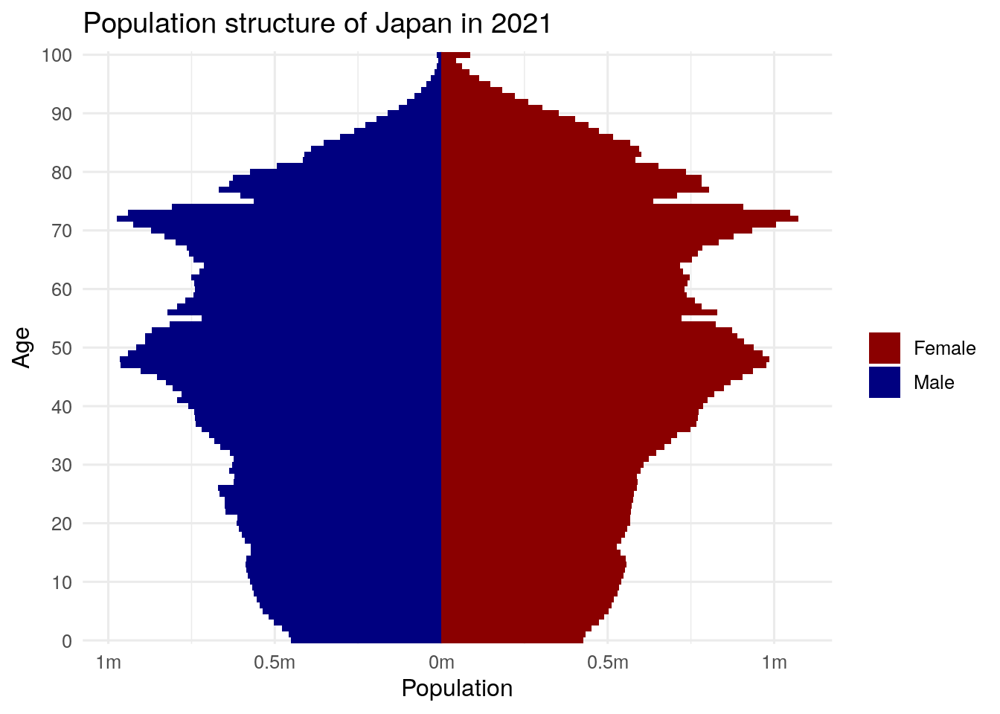
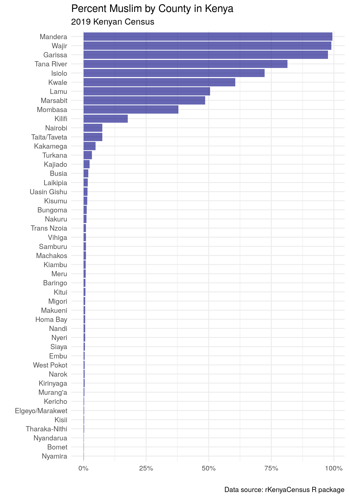
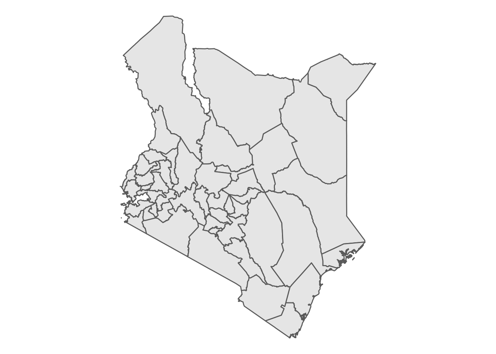
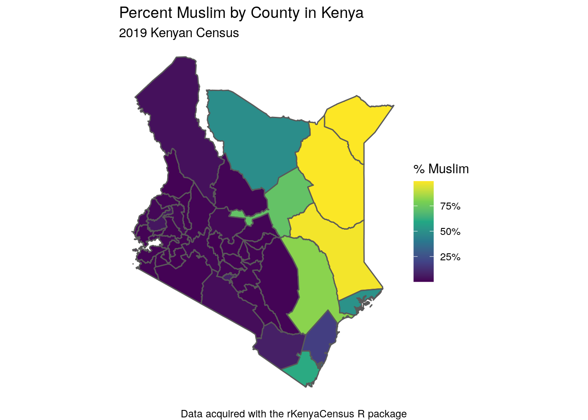
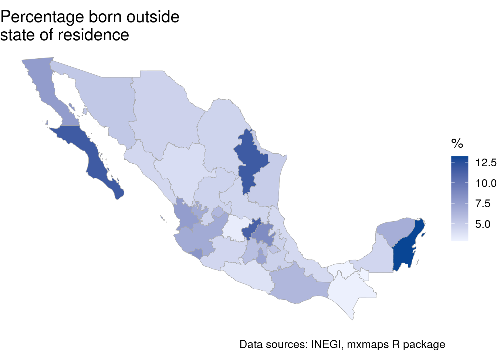
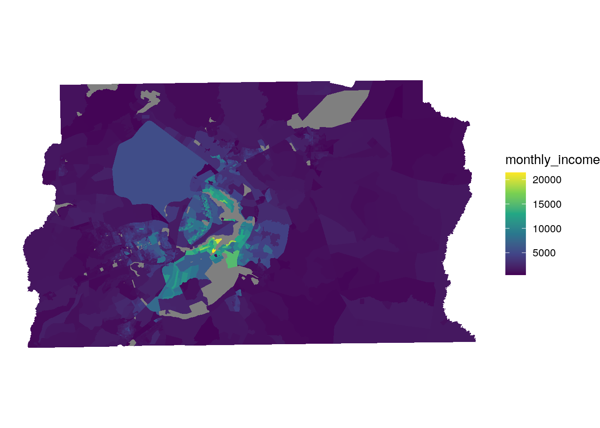

# Working with Census data outside the United States


Although the methods presented in this book are generalizable, the examples given in the book to this point have focused on the United States. Readers of this book are most certainly not limited to the United States in their projects, and will be interested in how to apply the methods presented to examples around the world. International Census & demographic data is the focus of this chapter. The first section focuses on *global demographic indicators* for between-country comparisons and gives an overview of the **idbr** R package for accessing these indicators through the [US Census Bureau's International Data Base](https://www.census.gov/programs-surveys/international-programs/about/idb.html). The sections that follow cover country-specific packages from around the world that deliver Census data to R users in similar ways to the US-focused packages covered earlier in this book. Examples from Canada, Mexico, Brazil, and Kenya illustrate how to apply the methods readers have learned in this book to Census data analyses in other parts of the world.

## The International Data Base and the idbr R package

The US Census Bureau's International Database (IDB) is a repository of dozens of demographic indicators for over 200 countries around the world. The IDB includes both historical information by year for most countries as well as population projections to 2100. In-place demographic characteristics are derived from a wide range of international Censuses and surveys, and future projections are estimated with the cohort-component method.

The Census Bureau makes these datasets available to researchers [through an interactive data tool](https://www.census.gov/data-tools/demo/idb/#/country?YR_ANIM=2021) and also through its API, allowing for programmatic data access. The **idbr** R package [@walker_idbr2021], first released in 2016 and updated to version 1.0 in 2021, uses a simple R interface to help users gain access to and analyze data from the IDB.

To get started with **idbr**, users can install the package from CRAN and set their Census API keys with the `idb_api_key()` function. If a user's Census API key is already installed using **tidycensus**, **idbr** will pick it up making this step unnecessary.


```r
library(idbr)
# Unnecessary if API key is installed with tidycensus
idb_api_key("YOUR KEY GOES HERE")
```

The core function implemented in **idbr** is `get_idb()`, which can access all datasets available in the IDB. There are two main datasets available: the 1-year-of-age population dataset, which allows for population data by country to be downloaded broken down by age and sex; and the 5-year-of-age dataset, which gives access to population by 5-year age bands but also many other fertility, mortality, and migration indicators that are not organized by age bands.

A basic IDB query uses a country, specified as either an ISO-2 code or a country name in English, a vector of one or more variables, and a vector of one or more years. For example, we can fetch historical and projected population for Nigeria from 1990 to 2100:


```r
nigeria_pop <- get_idb(
  country = "Nigeria",
  variables = "pop",
  year = 1990:2100
)
```

<table class="table table-striped table-hover table-condensed table-responsive" style="margin-left: auto; margin-right: auto;">
<caption>(\#tab:nigeria-pop-show)Nigeria population data acquired with idbr</caption>
 <thead>
  <tr>
   <th style="text-align:left;position: sticky; top:0; background-color: #FFFFFF;"> code </th>
   <th style="text-align:right;position: sticky; top:0; background-color: #FFFFFF;"> year </th>
   <th style="text-align:left;position: sticky; top:0; background-color: #FFFFFF;"> name </th>
   <th style="text-align:right;position: sticky; top:0; background-color: #FFFFFF;"> pop </th>
  </tr>
 </thead>
<tbody>
  <tr>
   <td style="text-align:left;"> NG </td>
   <td style="text-align:right;"> 1990 </td>
   <td style="text-align:left;"> Nigeria </td>
   <td style="text-align:right;"> 97041753 </td>
  </tr>
  <tr>
   <td style="text-align:left;"> NG </td>
   <td style="text-align:right;"> 1991 </td>
   <td style="text-align:left;"> Nigeria </td>
   <td style="text-align:right;"> 99406734 </td>
  </tr>
  <tr>
   <td style="text-align:left;"> NG </td>
   <td style="text-align:right;"> 1992 </td>
   <td style="text-align:left;"> Nigeria </td>
   <td style="text-align:right;"> 101837787 </td>
  </tr>
  <tr>
   <td style="text-align:left;"> NG </td>
   <td style="text-align:right;"> 1993 </td>
   <td style="text-align:left;"> Nigeria </td>
   <td style="text-align:right;"> 104387403 </td>
  </tr>
  <tr>
   <td style="text-align:left;"> NG </td>
   <td style="text-align:right;"> 1994 </td>
   <td style="text-align:left;"> Nigeria </td>
   <td style="text-align:right;"> 107053762 </td>
  </tr>
  <tr>
   <td style="text-align:left;"> NG </td>
   <td style="text-align:right;"> 1995 </td>
   <td style="text-align:left;"> Nigeria </td>
   <td style="text-align:right;"> 109838554 </td>
  </tr>
  <tr>
   <td style="text-align:left;"> NG </td>
   <td style="text-align:right;"> 1996 </td>
   <td style="text-align:left;"> Nigeria </td>
   <td style="text-align:right;"> 112744016 </td>
  </tr>
  <tr>
   <td style="text-align:left;"> NG </td>
   <td style="text-align:right;"> 1997 </td>
   <td style="text-align:left;"> Nigeria </td>
   <td style="text-align:right;"> 115773046 </td>
  </tr>
  <tr>
   <td style="text-align:left;"> NG </td>
   <td style="text-align:right;"> 1998 </td>
   <td style="text-align:left;"> Nigeria </td>
   <td style="text-align:right;"> 118927944 </td>
  </tr>
  <tr>
   <td style="text-align:left;"> NG </td>
   <td style="text-align:right;"> 1999 </td>
   <td style="text-align:left;"> Nigeria </td>
   <td style="text-align:right;"> 122200766 </td>
  </tr>
</tbody>
</table>

The result can then be visualized as a time series using **ggplot2**.


```r
library(tidyverse)

ggplot(nigeria_pop, aes(x = year, y = pop)) + 
  geom_line(color = "darkgreen") + 
  theme_minimal() + 
  scale_y_continuous(labels = scales::label_number_si()) + 
  labs(title = "Population of Nigeria",
       subtitle = "1990 to 2100 (projected)",
       x = "Year",
       y = "Population at midyear")
```

<div class="figure">

<p class="caption">(\#fig:plot-nigeria-pop)Historical and projected population of Nigeria</p>
</div>

**idbr** includes functionality to help users look up variable codes for use in their function calls. The function `idb_variables()` returns a data frame with all variables available in the IDB, along with an informative label; the `idb_concepts()` function prints out a list of *concepts* that can be supplied to the `concept` parameter and will return a group of variables that belong to the same concept (e.g. mortality rates, components of population growth).

For worldwide analyses, users can specify the argument `country = "all"` to return all available countries in the IDB. In concert with tidyverse tools, this makes global comparative analyses straightforward. In the example below, we get data on life expectancy at birth for all countries in 2021, then view the top 10 and bottom 10 countries.


```r
world_lex <- get_idb(
  country = "all",
  variables = "e0",
  year = 2021
)

world_lex %>% 
  slice_max(e0, n = 10)
```

<table class="table table-striped table-hover table-condensed table-responsive" style="margin-left: auto; margin-right: auto;">
<caption>(\#tab:world-lex-show)Countries with the longest life expectancies at birth, 2021</caption>
 <thead>
  <tr>
   <th style="text-align:left;position: sticky; top:0; background-color: #FFFFFF;"> code </th>
   <th style="text-align:right;position: sticky; top:0; background-color: #FFFFFF;"> year </th>
   <th style="text-align:left;position: sticky; top:0; background-color: #FFFFFF;"> name </th>
   <th style="text-align:right;position: sticky; top:0; background-color: #FFFFFF;"> e0 </th>
  </tr>
 </thead>
<tbody>
  <tr>
   <td style="text-align:left;"> MC </td>
   <td style="text-align:right;"> 2021 </td>
   <td style="text-align:left;"> Monaco </td>
   <td style="text-align:right;"> 89.40 </td>
  </tr>
  <tr>
   <td style="text-align:left;"> SG </td>
   <td style="text-align:right;"> 2021 </td>
   <td style="text-align:left;"> Singapore </td>
   <td style="text-align:right;"> 86.19 </td>
  </tr>
  <tr>
   <td style="text-align:left;"> MO </td>
   <td style="text-align:right;"> 2021 </td>
   <td style="text-align:left;"> Macau </td>
   <td style="text-align:right;"> 84.81 </td>
  </tr>
  <tr>
   <td style="text-align:left;"> JP </td>
   <td style="text-align:right;"> 2021 </td>
   <td style="text-align:left;"> Japan </td>
   <td style="text-align:right;"> 84.65 </td>
  </tr>
  <tr>
   <td style="text-align:left;"> SM </td>
   <td style="text-align:right;"> 2021 </td>
   <td style="text-align:left;"> San Marino </td>
   <td style="text-align:right;"> 83.68 </td>
  </tr>
  <tr>
   <td style="text-align:left;"> CA </td>
   <td style="text-align:right;"> 2021 </td>
   <td style="text-align:left;"> Canada </td>
   <td style="text-align:right;"> 83.62 </td>
  </tr>
  <tr>
   <td style="text-align:left;"> IS </td>
   <td style="text-align:right;"> 2021 </td>
   <td style="text-align:left;"> Iceland </td>
   <td style="text-align:right;"> 83.45 </td>
  </tr>
  <tr>
   <td style="text-align:left;"> HK </td>
   <td style="text-align:right;"> 2021 </td>
   <td style="text-align:left;"> Hong Kong </td>
   <td style="text-align:right;"> 83.41 </td>
  </tr>
  <tr>
   <td style="text-align:left;"> AD </td>
   <td style="text-align:right;"> 2021 </td>
   <td style="text-align:left;"> Andorra </td>
   <td style="text-align:right;"> 83.23 </td>
  </tr>
  <tr>
   <td style="text-align:left;"> IL </td>
   <td style="text-align:right;"> 2021 </td>
   <td style="text-align:left;"> Israel </td>
   <td style="text-align:right;"> 83.15 </td>
  </tr>
</tbody>
</table>


```r
world_lex %>% 
  slice_min(e0, n = 10)
```

<table class="table table-striped table-hover table-condensed table-responsive" style="margin-left: auto; margin-right: auto;">
<caption>(\#tab:world-lex-min-show)Countries with the shortest life expectancies at birth, 2021</caption>
 <thead>
  <tr>
   <th style="text-align:left;position: sticky; top:0; background-color: #FFFFFF;"> code </th>
   <th style="text-align:right;position: sticky; top:0; background-color: #FFFFFF;"> year </th>
   <th style="text-align:left;position: sticky; top:0; background-color: #FFFFFF;"> name </th>
   <th style="text-align:right;position: sticky; top:0; background-color: #FFFFFF;"> e0 </th>
  </tr>
 </thead>
<tbody>
  <tr>
   <td style="text-align:left;"> AF </td>
   <td style="text-align:right;"> 2021 </td>
   <td style="text-align:left;"> Afghanistan </td>
   <td style="text-align:right;"> 53.25 </td>
  </tr>
  <tr>
   <td style="text-align:left;"> CF </td>
   <td style="text-align:right;"> 2021 </td>
   <td style="text-align:left;"> Central African Republic </td>
   <td style="text-align:right;"> 55.07 </td>
  </tr>
  <tr>
   <td style="text-align:left;"> SO </td>
   <td style="text-align:right;"> 2021 </td>
   <td style="text-align:left;"> Somalia </td>
   <td style="text-align:right;"> 55.32 </td>
  </tr>
  <tr>
   <td style="text-align:left;"> MZ </td>
   <td style="text-align:right;"> 2021 </td>
   <td style="text-align:left;"> Mozambique </td>
   <td style="text-align:right;"> 56.49 </td>
  </tr>
  <tr>
   <td style="text-align:left;"> SL </td>
   <td style="text-align:right;"> 2021 </td>
   <td style="text-align:left;"> Sierra Leone </td>
   <td style="text-align:right;"> 58.45 </td>
  </tr>
  <tr>
   <td style="text-align:left;"> SS </td>
   <td style="text-align:right;"> 2021 </td>
   <td style="text-align:left;"> South Sudan </td>
   <td style="text-align:right;"> 58.60 </td>
  </tr>
  <tr>
   <td style="text-align:left;"> TD </td>
   <td style="text-align:right;"> 2021 </td>
   <td style="text-align:left;"> Chad </td>
   <td style="text-align:right;"> 58.73 </td>
  </tr>
  <tr>
   <td style="text-align:left;"> LS </td>
   <td style="text-align:right;"> 2021 </td>
   <td style="text-align:left;"> Lesotho </td>
   <td style="text-align:right;"> 58.90 </td>
  </tr>
  <tr>
   <td style="text-align:left;"> SZ </td>
   <td style="text-align:right;"> 2021 </td>
   <td style="text-align:left;"> Eswatini </td>
   <td style="text-align:right;"> 59.13 </td>
  </tr>
  <tr>
   <td style="text-align:left;"> NE </td>
   <td style="text-align:right;"> 2021 </td>
   <td style="text-align:left;"> Niger </td>
   <td style="text-align:right;"> 59.70 </td>
  </tr>
</tbody>
</table>

### Visualizing IDB data

**idbr** aims to return data from the IDB in a structure suitable for creative data visualizations. This includes population pyramids (like those introduced in Chapter 4) and world maps.

As mentioned earlier in this chapter, `get_idb()` can retrieve population data by age and sex in one-year age bands if the `age` or `sex` arguments are supplied but `variables` is left blank. An illustration of this is found in the example below, where `get_idb()` is used to get 1-year-of-age population data for 2021 in Japan, broken down by sex.


```r
japan_data <- get_idb(
  country = "Japan",
  year = 2021,
  age = 0:100,
  sex = c("male", "female")
) 
```

<table class="table table-striped table-hover table-condensed table-responsive" style="margin-left: auto; margin-right: auto;">
<caption>(\#tab:japan-data-show)1-year age band population data for Japan in 2021</caption>
 <thead>
  <tr>
   <th style="text-align:left;position: sticky; top:0; background-color: #FFFFFF;"> code </th>
   <th style="text-align:right;position: sticky; top:0; background-color: #FFFFFF;"> year </th>
   <th style="text-align:left;position: sticky; top:0; background-color: #FFFFFF;"> name </th>
   <th style="text-align:right;position: sticky; top:0; background-color: #FFFFFF;"> pop </th>
   <th style="text-align:left;position: sticky; top:0; background-color: #FFFFFF;"> sex </th>
   <th style="text-align:right;position: sticky; top:0; background-color: #FFFFFF;"> age </th>
  </tr>
 </thead>
<tbody>
  <tr>
   <td style="text-align:left;"> JP </td>
   <td style="text-align:right;"> 2021 </td>
   <td style="text-align:left;"> Japan </td>
   <td style="text-align:right;"> 450869 </td>
   <td style="text-align:left;"> Male </td>
   <td style="text-align:right;"> 0 </td>
  </tr>
  <tr>
   <td style="text-align:left;"> JP </td>
   <td style="text-align:right;"> 2021 </td>
   <td style="text-align:left;"> Japan </td>
   <td style="text-align:right;"> 458588 </td>
   <td style="text-align:left;"> Male </td>
   <td style="text-align:right;"> 1 </td>
  </tr>
  <tr>
   <td style="text-align:left;"> JP </td>
   <td style="text-align:right;"> 2021 </td>
   <td style="text-align:left;"> Japan </td>
   <td style="text-align:right;"> 478968 </td>
   <td style="text-align:left;"> Male </td>
   <td style="text-align:right;"> 2 </td>
  </tr>
  <tr>
   <td style="text-align:left;"> JP </td>
   <td style="text-align:right;"> 2021 </td>
   <td style="text-align:left;"> Japan </td>
   <td style="text-align:right;"> 503320 </td>
   <td style="text-align:left;"> Male </td>
   <td style="text-align:right;"> 3 </td>
  </tr>
  <tr>
   <td style="text-align:left;"> JP </td>
   <td style="text-align:right;"> 2021 </td>
   <td style="text-align:left;"> Japan </td>
   <td style="text-align:right;"> 519507 </td>
   <td style="text-align:left;"> Male </td>
   <td style="text-align:right;"> 4 </td>
  </tr>
  <tr>
   <td style="text-align:left;"> JP </td>
   <td style="text-align:right;"> 2021 </td>
   <td style="text-align:left;"> Japan </td>
   <td style="text-align:right;"> 535623 </td>
   <td style="text-align:left;"> Male </td>
   <td style="text-align:right;"> 5 </td>
  </tr>
  <tr>
   <td style="text-align:left;"> JP </td>
   <td style="text-align:right;"> 2021 </td>
   <td style="text-align:left;"> Japan </td>
   <td style="text-align:right;"> 544629 </td>
   <td style="text-align:left;"> Male </td>
   <td style="text-align:right;"> 6 </td>
  </tr>
  <tr>
   <td style="text-align:left;"> JP </td>
   <td style="text-align:right;"> 2021 </td>
   <td style="text-align:left;"> Japan </td>
   <td style="text-align:right;"> 553183 </td>
   <td style="text-align:left;"> Male </td>
   <td style="text-align:right;"> 7 </td>
  </tr>
  <tr>
   <td style="text-align:left;"> JP </td>
   <td style="text-align:right;"> 2021 </td>
   <td style="text-align:left;"> Japan </td>
   <td style="text-align:right;"> 563710 </td>
   <td style="text-align:left;"> Male </td>
   <td style="text-align:right;"> 8 </td>
  </tr>
  <tr>
   <td style="text-align:left;"> JP </td>
   <td style="text-align:right;"> 2021 </td>
   <td style="text-align:left;"> Japan </td>
   <td style="text-align:right;"> 567511 </td>
   <td style="text-align:left;"> Male </td>
   <td style="text-align:right;"> 9 </td>
  </tr>
</tbody>
</table>

Following the example illustrated in Section \@ref(designing-and-styling-the-population-pyramid), a population pyramid can be created by changing data values for one sex to negative, then plotting the data as back-to-back horizontal bar charts.


```r
japan_data %>%
  mutate(pop = ifelse(sex == "Male", pop * -1, pop)) %>%
  ggplot(aes(x = pop, y = as.factor(age), fill = sex)) + 
  geom_col(width = 1) + 
  theme_minimal(base_size = 12) + 
  scale_x_continuous(labels = function(x) paste0(abs(x / 1000000), "m")) + 
  scale_y_discrete(breaks = scales::pretty_breaks(n = 10)) + 
  scale_fill_manual(values = c("darkred", "navy")) + 
  labs(title = "Population structure of Japan in 2021",
       x = "Population",
       y = "Age",
       fill = "")
```

<div class="figure">

<p class="caption">(\#fig:japan-pyramid)Population pyramid for Japan</p>
</div>

The aging structure of Japan's population is notable, especially the number of female centenarians (women aged 100 and up) that stand out on the chart, a number that is likely to grow in the years ahead.

`get_idb()` also includes a `geometry` parameter to help users make world maps of demographic indicators. By setting `geometry = TRUE`, `get_idb()` returns a simple features object with a `geometry` column attached to the demographic data. Here, we fetch data on total fertility rate by country in 2021.


```r
library(idbr)
library(tidyverse)

fertility_data <- get_idb(
  country = "all",
  year = 2021,
  variables = "tfr",
  geometry = TRUE,
)
```

There are a couple points of note with respect to the data returned. The dataset leaves out a number of small countries that would not appear on a zoomed-out world map. To ensure that they are retained, use the argument `resolution = "high"` for a higher-resolution dataset (which you may also want for regional mapping). There are also rows returned as `NA` in the dataset; this is to fill in areas that should appear on the map (like Antarctica) but do not have data in the IDB.

The data returned can be mapped with `geom_sf()` from ggplot2 or any other mapping tool introduced in this book. Specifying a suitable map projection with `coord_sf()` for the whole world - like the Robinson projection used below - is recommended.


```r
ggplot(fertility_data, aes(fill = tfr)) + 
  theme_bw() + 
  geom_sf() + 
  coord_sf(crs = 'ESRI:54030') + 
  scale_fill_viridis_c() + 
  labs(fill = "Total fertility\nrate (2021)")
```

<div class="figure">

<p class="caption">(\#fig:fertility-map)Map of total fertility rates by country in 2021</p>
</div>

### Interactive and animated visualization of global demographic data

In Chapter 6, readers learned how to create interactive maps of US Census data with the **tmap** and **leaflet** packages. While the same methods *can* be applied to the global data returned by `get_idb()`, the Web Mercator projection used by the Leaflet library is not ideal for world maps as it inflates the area of countries near the poles relative to countries near the Equator. This problem with Web Mercator was covered in Section \@ref(alternative-approaches-to-interactive-mapping) and is particularly important for global maps. In turn, it is preferable to turn to other interactive charting libraries such as **ggiraph**.

To get started, let's return to our global fertility data and create a new column that will store information we want to include in our tooltip that appears when a viewer hovers over a country.


```r
fertility_data$tooltip <- paste0(fertility_data$name,
                                 ": ",
                                 round(fertility_data$tfr, 2))
```

We now set up the visualization. Note that instead of using `geom_sf()`, we use **ggiraph**'s `geom_sf_interactive()`, which includes some new aesthetics. We map our new `tooltip` column to the `tooltip` aesthetic, which will generate a hover tooltip, and we map the `code` column to the `data_id` aesthetic, which will change the country's color when hovered over. The `girafe()` function then renders the interactive graphic; we can specify that we want map zooming with `girafe_options()`.


```r
library(ggiraph)

fertility_map <- ggplot(fertility_data, aes(fill = tfr)) + 
  theme_bw() + 
  geom_sf_interactive(aes(tooltip = tooltip, data_id = code), size = 0.1) + 
  coord_sf(crs = 'ESRI:54030') + 
  scale_fill_viridis_c() + 
  labs(fill = "Total fertility\nrate (2021)")

girafe(ggobj = fertility_map) %>%
  girafe_options(opts_zoom(max = 10))
```

<div class="figure">

```{=html}
<div id="htmlwidget-b4b3d3311fca3d7c9ded" style="width:100%;height:480px;" class="girafe html-widget"></div>
<script type="application/json" data-for="htmlwidget-b4b3d3311fca3d7c9ded">{"x":{"html":"<?xml version=\"1.0\" encoding=\"UTF-8\"?>\n<svg xmlns='http://www.w3.org/2000/svg' xmlns:xlink='http://www.w3.org/1999/xlink' id='svg_d0dfcd05-c488-49fd-8775-f0e54836ea5a' viewBox='0 0 432 360'>\n <defs>\n  <clipPath id='svg_d0dfcd05-c488-49fd-8775-f0e54836ea5a_c1'>\n   <rect x='0' y='0' width='432' height='360'/>\n  <\/clipPath>\n  <clipPath id='svg_d0dfcd05-c488-49fd-8775-f0e54836ea5a_c2'>\n   <rect x='0' y='91.13' width='432' height='177.74'/>\n  <\/clipPath>\n  <clipPath id='svg_d0dfcd05-c488-49fd-8775-f0e54836ea5a_c3'>\n   <rect x='5.48' y='96.61' width='330.46' height='166.78'/>\n  <\/clipPath>\n <\/defs>\n <g>\n  <g clip-path='url(#svg_d0dfcd05-c488-49fd-8775-f0e54836ea5a_c1)'>\n   <rect x='0' y='0' width='432' height='360' fill='#FFFFFF' stroke='#FFFFFF' stroke-width='0.75' stroke-linejoin='round' stroke-linecap='round'/>\n  <\/g>\n  <g clip-path='url(#svg_d0dfcd05-c488-49fd-8775-f0e54836ea5a_c2)'>\n   <rect x='0' y='91.13' width='432' height='177.74' fill='#FFFFFF' stroke='#FFFFFF' stroke-width='1.07' stroke-linejoin='round' stroke-linecap='round'/>\n  <\/g>\n  <g clip-path='url(#svg_d0dfcd05-c488-49fd-8775-f0e54836ea5a_c3)'>\n   <rect x='5.48' y='96.61' width='330.46' height='166.78' fill='#FFFFFF' stroke='none'/>\n   <polyline points='85.69,254.61 83.41,253.85 80.98,252.97 78.42,251.99 75.76,250.92 73.04,249.76 70.35,248.55 67.77,247.29 65.35,246.00 63.05,244.68 60.84,243.33 58.69,241.96 56.59,240.56 54.53,239.13 52.50,237.69 50.51,236.22 48.56,234.74 46.65,233.24 44.79,231.72 42.99,230.19 41.25,228.65 39.59,227.09 38.02,225.52 36.54,223.94 35.12,222.36 33.74,220.76 32.40,219.16 31.12,217.55 29.93,215.94 28.82,214.33 27.78,212.71 26.80,211.09 25.89,209.47 25.04,207.85 24.28,206.22 23.59,204.60 22.98,202.98 22.44,201.36 21.97,199.74 21.53,198.12 21.10,196.50 20.69,194.87 20.31,193.25 19.98,191.63 19.70,190.01 19.46,188.39 19.27,186.77 19.10,185.14 18.96,183.52 18.85,181.90 18.78,180.28 18.75,178.66 18.78,177.04 18.86,175.42 18.98,173.79 19.12,172.17 19.28,170.55 19.48,168.93 19.73,167.31 20.01,165.69 20.35,164.07 20.73,162.44 21.14,160.82 21.57,159.20 22.01,157.58 22.49,155.96 23.03,154.34 23.65,152.72 24.35,151.09 25.12,149.47 25.98,147.85 26.90,146.23 27.88,144.61 28.92,142.99 30.04,141.38 31.25,139.76 32.53,138.16 33.87,136.56 35.26,134.96 36.68,133.38 38.17,131.80 39.75,130.23 41.42,128.68 43.17,127.13 44.98,125.60 46.84,124.09 48.75,122.59 50.70,121.11 52.70,119.65 54.73,118.20 56.80,116.78 58.90,115.38 61.06,114.01 63.27,112.67 65.58,111.35 68.02,110.07 70.61,108.81 73.31,107.60 76.02,106.45 78.68,105.39' fill='none' stroke='#EBEBEB' stroke-width='1.07' stroke-linejoin='round' stroke-linecap='round'/>\n   <polyline points='114.03,254.61 112.51,253.85 110.89,252.97 109.18,251.99 107.41,250.92 105.60,249.76 103.80,248.55 102.08,247.29 100.47,246.00 98.94,244.68 97.46,243.33 96.03,241.96 94.63,240.56 93.25,239.13 91.90,237.69 90.57,236.22 89.27,234.74 88.00,233.24 86.77,231.72 85.56,230.19 84.40,228.65 83.30,227.09 82.25,225.52 81.26,223.94 80.32,222.36 79.40,220.76 78.50,219.16 77.65,217.55 76.85,215.94 76.11,214.33 75.42,212.71 74.77,211.09 74.16,209.47 73.60,207.85 73.09,206.22 72.63,204.60 72.22,202.98 71.86,201.36 71.55,199.74 71.25,198.12 70.97,196.50 70.69,194.87 70.44,193.25 70.22,191.63 70.04,190.01 69.88,188.39 69.75,186.77 69.64,185.14 69.55,183.52 69.47,181.90 69.42,180.28 69.40,178.66 69.42,177.04 69.48,175.42 69.55,173.79 69.65,172.17 69.76,170.55 69.89,168.93 70.05,167.31 70.24,165.69 70.47,164.07 70.72,162.44 71.00,160.82 71.28,159.20 71.58,157.58 71.90,155.96 72.26,154.34 72.67,152.72 73.13,151.09 73.65,149.47 74.22,147.85 74.83,146.23 75.49,144.61 76.19,142.99 76.93,141.38 77.73,139.76 78.59,138.16 79.49,136.56 80.41,134.96 81.36,133.38 82.35,131.80 83.40,130.23 84.52,128.68 85.68,127.13 86.89,125.60 88.13,124.09 89.40,122.59 90.70,121.11 92.03,119.65 93.39,118.20 94.77,116.78 96.17,115.38 97.61,114.01 99.09,112.67 100.62,111.35 102.25,110.07 103.98,108.81 105.78,107.60 107.59,106.45 109.35,105.39' fill='none' stroke='#EBEBEB' stroke-width='1.07' stroke-linejoin='round' stroke-linecap='round'/>\n   <polyline points='142.37,254.61 141.61,253.85 140.80,252.97 139.94,251.99 139.06,250.92 138.15,249.76 137.26,248.55 136.40,247.29 135.59,246.00 134.82,244.68 134.09,243.33 133.37,241.96 132.67,240.56 131.98,239.13 131.30,237.69 130.64,236.22 129.99,234.74 129.36,233.24 128.74,231.72 128.14,230.19 127.56,228.65 127.00,227.09 126.48,225.52 125.99,223.94 125.51,222.36 125.05,220.76 124.61,219.16 124.18,217.55 123.78,215.94 123.41,214.33 123.07,212.71 122.74,211.09 122.43,209.47 122.15,207.85 121.90,206.22 121.67,204.60 121.46,202.98 121.29,201.36 121.13,199.74 120.98,198.12 120.84,196.50 120.70,194.87 120.58,193.25 120.47,191.63 120.37,190.01 120.29,188.39 120.23,186.77 120.17,185.14 120.13,183.52 120.09,181.90 120.06,180.28 120.06,178.66 120.07,177.04 120.09,175.42 120.13,173.79 120.18,172.17 120.23,170.55 120.30,168.93 120.38,167.31 120.48,165.69 120.59,164.07 120.71,162.44 120.85,160.82 121.00,159.20 121.14,157.58 121.30,155.96 121.48,154.34 121.69,152.72 121.92,151.09 122.18,149.47 122.46,147.85 122.77,146.23 123.10,144.61 123.45,142.99 123.82,141.38 124.22,139.76 124.65,138.16 125.10,136.56 125.56,134.96 126.03,133.38 126.53,131.80 127.06,130.23 127.61,128.68 128.19,127.13 128.80,125.60 129.42,124.09 130.05,122.59 130.71,121.11 131.37,119.65 132.05,118.20 132.74,116.78 133.44,115.38 134.16,114.01 134.90,112.67 135.67,111.35 136.48,110.07 137.34,108.81 138.24,107.60 139.15,106.45 140.03,105.39' fill='none' stroke='#EBEBEB' stroke-width='1.07' stroke-linejoin='round' stroke-linecap='round'/>\n   <polyline points='170.71,254.61 170.71,253.85 170.71,252.97 170.71,251.99 170.71,250.92 170.71,249.76 170.71,248.55 170.71,247.29 170.71,246.00 170.71,244.68 170.71,243.33 170.71,241.96 170.71,240.56 170.71,239.13 170.71,237.69 170.71,236.22 170.71,234.74 170.71,233.24 170.71,231.72 170.71,230.19 170.71,228.65 170.71,227.09 170.71,225.52 170.71,223.94 170.71,222.36 170.71,220.76 170.71,219.16 170.71,217.55 170.71,215.94 170.71,214.33 170.71,212.71 170.71,211.09 170.71,209.47 170.71,207.85 170.71,206.22 170.71,204.60 170.71,202.98 170.71,201.36 170.71,199.74 170.71,198.12 170.71,196.50 170.71,194.87 170.71,193.25 170.71,191.63 170.71,190.01 170.71,188.39 170.71,186.77 170.71,185.14 170.71,183.52 170.71,181.90 170.71,180.28 170.71,178.66 170.71,177.04 170.71,175.42 170.71,173.79 170.71,172.17 170.71,170.55 170.71,168.93 170.71,167.31 170.71,165.69 170.71,164.07 170.71,162.44 170.71,160.82 170.71,159.20 170.71,157.58 170.71,155.96 170.71,154.34 170.71,152.72 170.71,151.09 170.71,149.47 170.71,147.85 170.71,146.23 170.71,144.61 170.71,142.99 170.71,141.38 170.71,139.76 170.71,138.16 170.71,136.56 170.71,134.96 170.71,133.38 170.71,131.80 170.71,130.23 170.71,128.68 170.71,127.13 170.71,125.60 170.71,124.09 170.71,122.59 170.71,121.11 170.71,119.65 170.71,118.20 170.71,116.78 170.71,115.38 170.71,114.01 170.71,112.67 170.71,111.35 170.71,110.07 170.71,108.81 170.71,107.60 170.71,106.45 170.71,105.39' fill='none' stroke='#EBEBEB' stroke-width='1.07' stroke-linejoin='round' stroke-linecap='round'/>\n   <polyline points='199.05,254.61 199.81,253.85 200.62,252.97 201.47,251.99 202.36,250.92 203.26,249.76 204.16,248.55 205.02,247.29 205.83,246.00 206.59,244.68 207.33,243.33 208.05,241.96 208.75,240.56 209.43,239.13 210.11,237.69 210.78,236.22 211.43,234.74 212.06,233.24 212.68,231.72 213.28,230.19 213.86,228.65 214.41,227.09 214.94,225.52 215.43,223.94 215.90,222.36 216.36,220.76 216.81,219.16 217.24,217.55 217.63,215.94 218.00,214.33 218.35,212.71 218.68,211.09 218.98,209.47 219.26,207.85 219.52,206.22 219.75,204.60 219.95,202.98 220.13,201.36 220.29,199.74 220.43,198.12 220.58,196.50 220.71,194.87 220.84,193.25 220.95,191.63 221.04,190.01 221.12,188.39 221.19,186.77 221.24,185.14 221.29,183.52 221.33,181.90 221.35,180.28 221.36,178.66 221.35,177.04 221.32,175.42 221.28,173.79 221.24,172.17 221.18,170.55 221.12,168.93 221.04,167.31 220.94,165.69 220.83,164.07 220.70,162.44 220.56,160.82 220.42,159.20 220.27,157.58 220.11,155.96 219.93,154.34 219.73,152.72 219.49,151.09 219.24,149.47 218.95,147.85 218.64,146.23 218.32,144.61 217.97,142.99 217.60,141.38 217.20,139.76 216.77,138.16 216.32,136.56 215.86,134.96 215.38,133.38 214.89,131.80 214.36,130.23 213.80,128.68 213.22,127.13 212.62,125.60 212.00,124.09 211.36,122.59 210.71,121.11 210.04,119.65 209.37,118.20 208.68,116.78 207.98,115.38 207.26,114.01 206.52,112.67 205.75,111.35 204.94,110.07 204.07,108.81 203.17,107.60 202.27,106.45 201.39,105.39' fill='none' stroke='#EBEBEB' stroke-width='1.07' stroke-linejoin='round' stroke-linecap='round'/>\n   <polyline points='227.39,254.61 228.91,253.85 230.53,252.97 232.23,251.99 234.01,250.92 235.82,249.76 237.61,248.55 239.33,247.29 240.95,246.00 242.48,244.68 243.95,243.33 245.38,241.96 246.79,240.56 248.16,239.13 249.51,237.69 250.84,236.22 252.14,234.74 253.41,233.24 254.65,231.72 255.85,230.19 257.01,228.65 258.12,227.09 259.16,225.52 260.15,223.94 261.10,222.36 262.02,220.76 262.91,219.16 263.76,217.55 264.56,215.94 265.30,214.33 265.99,212.71 266.64,211.09 267.25,209.47 267.82,207.85 268.33,206.22 268.79,204.60 269.20,202.98 269.55,201.36 269.87,199.74 270.16,198.12 270.45,196.50 270.72,194.87 270.97,193.25 271.19,191.63 271.38,190.01 271.54,188.39 271.67,186.77 271.78,185.14 271.87,183.52 271.94,181.90 271.99,180.28 272.01,178.66 271.99,177.04 271.94,175.42 271.86,173.79 271.77,172.17 271.66,170.55 271.52,168.93 271.36,167.31 271.17,165.69 270.95,164.07 270.70,162.44 270.42,160.82 270.13,159.20 269.84,157.58 269.52,155.96 269.16,154.34 268.75,152.72 268.28,151.09 267.76,149.47 267.20,147.85 266.58,146.23 265.93,144.61 265.23,142.99 264.48,141.38 263.68,139.76 262.83,138.16 261.93,136.56 261.01,134.96 260.06,133.38 259.06,131.80 258.01,130.23 256.90,128.68 255.73,127.13 254.53,125.60 253.29,124.09 252.02,122.59 250.71,121.11 249.38,119.65 248.03,118.20 246.65,116.78 245.24,115.38 243.81,114.01 242.33,112.67 240.79,111.35 239.17,110.07 237.44,108.81 235.64,107.60 233.83,106.45 232.06,105.39' fill='none' stroke='#EBEBEB' stroke-width='1.07' stroke-linejoin='round' stroke-linecap='round'/>\n   <polyline points='255.73,254.61 258.00,253.85 260.44,252.97 263.00,251.99 265.66,250.92 268.37,249.76 271.06,248.55 273.64,247.29 276.07,246.00 278.37,244.68 280.57,243.33 282.72,241.96 284.82,240.56 286.89,239.13 288.92,237.69 290.91,236.22 292.86,234.74 294.77,233.24 296.62,231.72 298.42,230.19 300.16,228.65 301.82,227.09 303.39,225.52 304.88,223.94 306.30,222.36 307.68,220.76 309.02,219.16 310.29,217.55 311.49,215.94 312.60,214.33 313.64,212.71 314.61,211.09 315.53,209.47 316.37,207.85 317.14,206.22 317.83,204.60 318.44,202.98 318.97,201.36 319.45,199.74 319.89,198.12 320.32,196.50 320.73,194.87 321.11,193.25 321.44,191.63 321.72,190.01 321.95,188.39 322.15,186.77 322.31,185.14 322.45,183.52 322.56,181.90 322.64,180.28 322.66,178.66 322.63,177.04 322.55,175.42 322.44,173.79 322.30,172.17 322.13,170.55 321.93,168.93 321.69,167.31 321.40,165.69 321.07,164.07 320.69,162.44 320.28,160.82 319.85,159.20 319.40,157.58 318.92,155.96 318.38,154.34 317.76,152.72 317.07,151.09 316.29,149.47 315.44,147.85 314.52,146.23 313.54,144.61 312.49,142.99 311.37,141.38 310.17,139.76 308.89,138.16 307.54,136.56 306.16,134.96 304.73,133.38 303.24,131.80 301.66,130.23 299.99,128.68 298.25,127.13 296.44,125.60 294.58,124.09 292.67,122.59 290.71,121.11 288.72,119.65 286.68,118.20 284.62,116.78 282.51,115.38 280.36,114.01 278.14,112.67 275.83,111.35 273.40,110.07 270.80,108.81 268.10,107.60 265.39,106.45 262.74,105.39' fill='none' stroke='#EBEBEB' stroke-width='1.07' stroke-linejoin='round' stroke-linecap='round'/>\n   <polyline points='76.30,251.14 78.20,251.14 80.11,251.14 82.02,251.14 83.93,251.14 85.83,251.14 87.74,251.14 89.65,251.14 91.56,251.14 93.46,251.14 95.37,251.14 97.28,251.14 99.18,251.14 101.09,251.14 103.00,251.14 104.91,251.14 106.81,251.14 108.72,251.14 110.63,251.14 112.54,251.14 114.44,251.14 116.35,251.14 118.26,251.14 120.16,251.14 122.07,251.14 123.98,251.14 125.89,251.14 127.79,251.14 129.70,251.14 131.61,251.14 133.52,251.14 135.42,251.14 137.33,251.14 139.24,251.14 141.15,251.14 143.05,251.14 144.96,251.14 146.87,251.14 148.77,251.14 150.68,251.14 152.59,251.14 154.50,251.14 156.40,251.14 158.31,251.14 160.22,251.14 162.13,251.14 164.03,251.14 165.94,251.14 167.85,251.14 169.75,251.14 171.66,251.14 173.57,251.14 175.48,251.14 177.38,251.14 179.29,251.14 181.20,251.14 183.11,251.14 185.01,251.14 186.92,251.14 188.83,251.14 190.73,251.14 192.64,251.14 194.55,251.14 196.46,251.14 198.36,251.14 200.27,251.14 202.18,251.14 204.09,251.14 205.99,251.14 207.90,251.14 209.81,251.14 211.71,251.14 213.62,251.14 215.53,251.14 217.44,251.14 219.34,251.14 221.25,251.14 223.16,251.14 225.07,251.14 226.97,251.14 228.88,251.14 230.79,251.14 232.69,251.14 234.60,251.14 236.51,251.14 238.42,251.14 240.32,251.14 242.23,251.14 244.14,251.14 246.05,251.14 247.95,251.14 249.86,251.14 251.77,251.14 253.67,251.14 255.58,251.14 257.49,251.14 259.40,251.14 261.30,251.14 263.21,251.14 265.12,251.14' fill='none' stroke='#EBEBEB' stroke-width='1.07' stroke-linejoin='round' stroke-linecap='round'/>\n   <polyline points='49.36,235.36 51.81,235.36 54.26,235.36 56.71,235.36 59.16,235.36 61.61,235.36 64.06,235.36 66.52,235.36 68.97,235.36 71.42,235.36 73.87,235.36 76.32,235.36 78.77,235.36 81.23,235.36 83.68,235.36 86.13,235.36 88.58,235.36 91.03,235.36 93.48,235.36 95.94,235.36 98.39,235.36 100.84,235.36 103.29,235.36 105.74,235.36 108.19,235.36 110.64,235.36 113.10,235.36 115.55,235.36 118.00,235.36 120.45,235.36 122.90,235.36 125.35,235.36 127.81,235.36 130.26,235.36 132.71,235.36 135.16,235.36 137.61,235.36 140.06,235.36 142.51,235.36 144.97,235.36 147.42,235.36 149.87,235.36 152.32,235.36 154.77,235.36 157.22,235.36 159.68,235.36 162.13,235.36 164.58,235.36 167.03,235.36 169.48,235.36 171.93,235.36 174.39,235.36 176.84,235.36 179.29,235.36 181.74,235.36 184.19,235.36 186.64,235.36 189.09,235.36 191.55,235.36 194.00,235.36 196.45,235.36 198.90,235.36 201.35,235.36 203.80,235.36 206.26,235.36 208.71,235.36 211.16,235.36 213.61,235.36 216.06,235.36 218.51,235.36 220.96,235.36 223.42,235.36 225.87,235.36 228.32,235.36 230.77,235.36 233.22,235.36 235.67,235.36 238.13,235.36 240.58,235.36 243.03,235.36 245.48,235.36 247.93,235.36 250.38,235.36 252.84,235.36 255.29,235.36 257.74,235.36 260.19,235.36 262.64,235.36 265.09,235.36 267.54,235.36 270.00,235.36 272.45,235.36 274.90,235.36 277.35,235.36 279.80,235.36 282.25,235.36 284.71,235.36 287.16,235.36 289.61,235.36 292.06,235.36' fill='none' stroke='#EBEBEB' stroke-width='1.07' stroke-linejoin='round' stroke-linecap='round'/>\n   <polyline points='30.66,216.95 33.49,216.95 36.32,216.95 39.15,216.95 41.98,216.95 44.81,216.95 47.64,216.95 50.47,216.95 53.30,216.95 56.13,216.95 58.96,216.95 61.79,216.95 64.61,216.95 67.44,216.95 70.27,216.95 73.10,216.95 75.93,216.95 78.76,216.95 81.59,216.95 84.42,216.95 87.25,216.95 90.08,216.95 92.91,216.95 95.74,216.95 98.56,216.95 101.39,216.95 104.22,216.95 107.05,216.95 109.88,216.95 112.71,216.95 115.54,216.95 118.37,216.95 121.20,216.95 124.03,216.95 126.86,216.95 129.69,216.95 132.51,216.95 135.34,216.95 138.17,216.95 141.00,216.95 143.83,216.95 146.66,216.95 149.49,216.95 152.32,216.95 155.15,216.95 157.98,216.95 160.81,216.95 163.64,216.95 166.46,216.95 169.29,216.95 172.12,216.95 174.95,216.95 177.78,216.95 180.61,216.95 183.44,216.95 186.27,216.95 189.10,216.95 191.93,216.95 194.76,216.95 197.58,216.95 200.41,216.95 203.24,216.95 206.07,216.95 208.90,216.95 211.73,216.95 214.56,216.95 217.39,216.95 220.22,216.95 223.05,216.95 225.88,216.95 228.71,216.95 231.53,216.95 234.36,216.95 237.19,216.95 240.02,216.95 242.85,216.95 245.68,216.95 248.51,216.95 251.34,216.95 254.17,216.95 257.00,216.95 259.83,216.95 262.66,216.95 265.48,216.95 268.31,216.95 271.14,216.95 273.97,216.95 276.80,216.95 279.63,216.95 282.46,216.95 285.29,216.95 288.12,216.95 290.95,216.95 293.78,216.95 296.61,216.95 299.43,216.95 302.26,216.95 305.09,216.95 307.92,216.95 310.75,216.95' fill='none' stroke='#EBEBEB' stroke-width='1.07' stroke-linejoin='round' stroke-linecap='round'/>\n   <polyline points='21.46,197.85 24.47,197.85 27.49,197.85 30.50,197.85 33.52,197.85 36.53,197.85 39.55,197.85 42.56,197.85 45.58,197.85 48.59,197.85 51.61,197.85 54.62,197.85 57.64,197.85 60.65,197.85 63.67,197.85 66.68,197.85 69.70,197.85 72.71,197.85 75.73,197.85 78.74,197.85 81.76,197.85 84.78,197.85 87.79,197.85 90.81,197.85 93.82,197.85 96.84,197.85 99.85,197.85 102.87,197.85 105.88,197.85 108.90,197.85 111.91,197.85 114.93,197.85 117.94,197.85 120.96,197.85 123.97,197.85 126.99,197.85 130.00,197.85 133.02,197.85 136.03,197.85 139.05,197.85 142.06,197.85 145.08,197.85 148.09,197.85 151.11,197.85 154.12,197.85 157.14,197.85 160.15,197.85 163.17,197.85 166.19,197.85 169.20,197.85 172.22,197.85 175.23,197.85 178.25,197.85 181.26,197.85 184.28,197.85 187.29,197.85 190.31,197.85 193.32,197.85 196.34,197.85 199.35,197.85 202.37,197.85 205.38,197.85 208.40,197.85 211.41,197.85 214.43,197.85 217.44,197.85 220.46,197.85 223.47,197.85 226.49,197.85 229.50,197.85 232.52,197.85 235.53,197.85 238.55,197.85 241.56,197.85 244.58,197.85 247.60,197.85 250.61,197.85 253.63,197.85 256.64,197.85 259.66,197.85 262.67,197.85 265.69,197.85 268.70,197.85 271.72,197.85 274.73,197.85 277.75,197.85 280.76,197.85 283.78,197.85 286.79,197.85 289.81,197.85 292.82,197.85 295.84,197.85 298.85,197.85 301.87,197.85 304.88,197.85 307.90,197.85 310.91,197.85 313.93,197.85 316.94,197.85 319.96,197.85' fill='none' stroke='#EBEBEB' stroke-width='1.07' stroke-linejoin='round' stroke-linecap='round'/>\n   <polyline points='18.75,178.74 21.82,178.74 24.89,178.74 27.96,178.74 31.03,178.74 34.10,178.74 37.17,178.74 40.24,178.74 43.31,178.74 46.38,178.74 49.45,178.74 52.52,178.74 55.59,178.74 58.66,178.74 61.73,178.74 64.80,178.74 67.87,178.74 70.94,178.74 74.01,178.74 77.08,178.74 80.15,178.74 83.22,178.74 86.29,178.74 89.36,178.74 92.43,178.74 95.50,178.74 98.57,178.74 101.64,178.74 104.71,178.74 107.78,178.74 110.85,178.74 113.92,178.74 116.99,178.74 120.06,178.74 123.13,178.74 126.20,178.74 129.27,178.74 132.34,178.74 135.40,178.74 138.47,178.74 141.54,178.74 144.61,178.74 147.68,178.74 150.75,178.74 153.82,178.74 156.89,178.74 159.96,178.74 163.03,178.74 166.10,178.74 169.17,178.74 172.24,178.74 175.31,178.74 178.38,178.74 181.45,178.74 184.52,178.74 187.59,178.74 190.66,178.74 193.73,178.74 196.80,178.74 199.87,178.74 202.94,178.74 206.01,178.74 209.08,178.74 212.15,178.74 215.22,178.74 218.29,178.74 221.36,178.74 224.43,178.74 227.50,178.74 230.57,178.74 233.64,178.74 236.71,178.74 239.78,178.74 242.85,178.74 245.92,178.74 248.99,178.74 252.06,178.74 255.13,178.74 258.20,178.74 261.27,178.74 264.34,178.74 267.41,178.74 270.48,178.74 273.55,178.74 276.62,178.74 279.69,178.74 282.76,178.74 285.83,178.74 288.90,178.74 291.97,178.74 295.04,178.74 298.11,178.74 301.18,178.74 304.25,178.74 307.32,178.74 310.38,178.74 313.45,178.74 316.52,178.74 319.59,178.74 322.66,178.74' fill='none' stroke='#EBEBEB' stroke-width='1.07' stroke-linejoin='round' stroke-linecap='round'/>\n   <polyline points='21.46,159.63 24.47,159.63 27.49,159.63 30.50,159.63 33.52,159.63 36.53,159.63 39.55,159.63 42.56,159.63 45.58,159.63 48.59,159.63 51.61,159.63 54.62,159.63 57.64,159.63 60.65,159.63 63.67,159.63 66.68,159.63 69.70,159.63 72.71,159.63 75.73,159.63 78.74,159.63 81.76,159.63 84.78,159.63 87.79,159.63 90.81,159.63 93.82,159.63 96.84,159.63 99.85,159.63 102.87,159.63 105.88,159.63 108.90,159.63 111.91,159.63 114.93,159.63 117.94,159.63 120.96,159.63 123.97,159.63 126.99,159.63 130.00,159.63 133.02,159.63 136.03,159.63 139.05,159.63 142.06,159.63 145.08,159.63 148.09,159.63 151.11,159.63 154.12,159.63 157.14,159.63 160.15,159.63 163.17,159.63 166.19,159.63 169.20,159.63 172.22,159.63 175.23,159.63 178.25,159.63 181.26,159.63 184.28,159.63 187.29,159.63 190.31,159.63 193.32,159.63 196.34,159.63 199.35,159.63 202.37,159.63 205.38,159.63 208.40,159.63 211.41,159.63 214.43,159.63 217.44,159.63 220.46,159.63 223.47,159.63 226.49,159.63 229.50,159.63 232.52,159.63 235.53,159.63 238.55,159.63 241.56,159.63 244.58,159.63 247.60,159.63 250.61,159.63 253.63,159.63 256.64,159.63 259.66,159.63 262.67,159.63 265.69,159.63 268.70,159.63 271.72,159.63 274.73,159.63 277.75,159.63 280.76,159.63 283.78,159.63 286.79,159.63 289.81,159.63 292.82,159.63 295.84,159.63 298.85,159.63 301.87,159.63 304.88,159.63 307.90,159.63 310.91,159.63 313.93,159.63 316.94,159.63 319.96,159.63' fill='none' stroke='#EBEBEB' stroke-width='1.07' stroke-linejoin='round' stroke-linecap='round'/>\n   <polyline points='30.66,140.53 33.49,140.53 36.32,140.53 39.15,140.53 41.98,140.53 44.81,140.53 47.64,140.53 50.47,140.53 53.30,140.53 56.13,140.53 58.96,140.53 61.79,140.53 64.61,140.53 67.44,140.53 70.27,140.53 73.10,140.53 75.93,140.53 78.76,140.53 81.59,140.53 84.42,140.53 87.25,140.53 90.08,140.53 92.91,140.53 95.74,140.53 98.56,140.53 101.39,140.53 104.22,140.53 107.05,140.53 109.88,140.53 112.71,140.53 115.54,140.53 118.37,140.53 121.20,140.53 124.03,140.53 126.86,140.53 129.69,140.53 132.51,140.53 135.34,140.53 138.17,140.53 141.00,140.53 143.83,140.53 146.66,140.53 149.49,140.53 152.32,140.53 155.15,140.53 157.98,140.53 160.81,140.53 163.64,140.53 166.46,140.53 169.29,140.53 172.12,140.53 174.95,140.53 177.78,140.53 180.61,140.53 183.44,140.53 186.27,140.53 189.10,140.53 191.93,140.53 194.76,140.53 197.58,140.53 200.41,140.53 203.24,140.53 206.07,140.53 208.90,140.53 211.73,140.53 214.56,140.53 217.39,140.53 220.22,140.53 223.05,140.53 225.88,140.53 228.71,140.53 231.53,140.53 234.36,140.53 237.19,140.53 240.02,140.53 242.85,140.53 245.68,140.53 248.51,140.53 251.34,140.53 254.17,140.53 257.00,140.53 259.83,140.53 262.66,140.53 265.48,140.53 268.31,140.53 271.14,140.53 273.97,140.53 276.80,140.53 279.63,140.53 282.46,140.53 285.29,140.53 288.12,140.53 290.95,140.53 293.78,140.53 296.61,140.53 299.43,140.53 302.26,140.53 305.09,140.53 307.92,140.53 310.75,140.53' fill='none' stroke='#EBEBEB' stroke-width='1.07' stroke-linejoin='round' stroke-linecap='round'/>\n   <polyline points='49.36,122.12 51.81,122.12 54.26,122.12 56.71,122.12 59.16,122.12 61.61,122.12 64.06,122.12 66.52,122.12 68.97,122.12 71.42,122.12 73.87,122.12 76.32,122.12 78.77,122.12 81.23,122.12 83.68,122.12 86.13,122.12 88.58,122.12 91.03,122.12 93.48,122.12 95.94,122.12 98.39,122.12 100.84,122.12 103.29,122.12 105.74,122.12 108.19,122.12 110.64,122.12 113.10,122.12 115.55,122.12 118.00,122.12 120.45,122.12 122.90,122.12 125.35,122.12 127.81,122.12 130.26,122.12 132.71,122.12 135.16,122.12 137.61,122.12 140.06,122.12 142.51,122.12 144.97,122.12 147.42,122.12 149.87,122.12 152.32,122.12 154.77,122.12 157.22,122.12 159.68,122.12 162.13,122.12 164.58,122.12 167.03,122.12 169.48,122.12 171.93,122.12 174.39,122.12 176.84,122.12 179.29,122.12 181.74,122.12 184.19,122.12 186.64,122.12 189.09,122.12 191.55,122.12 194.00,122.12 196.45,122.12 198.90,122.12 201.35,122.12 203.80,122.12 206.26,122.12 208.71,122.12 211.16,122.12 213.61,122.12 216.06,122.12 218.51,122.12 220.96,122.12 223.42,122.12 225.87,122.12 228.32,122.12 230.77,122.12 233.22,122.12 235.67,122.12 238.13,122.12 240.58,122.12 243.03,122.12 245.48,122.12 247.93,122.12 250.38,122.12 252.84,122.12 255.29,122.12 257.74,122.12 260.19,122.12 262.64,122.12 265.09,122.12 267.54,122.12 270.00,122.12 272.45,122.12 274.90,122.12 277.35,122.12 279.80,122.12 282.25,122.12 284.71,122.12 287.16,122.12 289.61,122.12 292.06,122.12' fill='none' stroke='#EBEBEB' stroke-width='1.07' stroke-linejoin='round' stroke-linecap='round'/>\n   <polyline points='76.30,106.34 78.20,106.34 80.11,106.34 82.02,106.34 83.93,106.34 85.83,106.34 87.74,106.34 89.65,106.34 91.56,106.34 93.46,106.34 95.37,106.34 97.28,106.34 99.18,106.34 101.09,106.34 103.00,106.34 104.91,106.34 106.81,106.34 108.72,106.34 110.63,106.34 112.54,106.34 114.44,106.34 116.35,106.34 118.26,106.34 120.16,106.34 122.07,106.34 123.98,106.34 125.89,106.34 127.79,106.34 129.70,106.34 131.61,106.34 133.52,106.34 135.42,106.34 137.33,106.34 139.24,106.34 141.15,106.34 143.05,106.34 144.96,106.34 146.87,106.34 148.77,106.34 150.68,106.34 152.59,106.34 154.50,106.34 156.40,106.34 158.31,106.34 160.22,106.34 162.13,106.34 164.03,106.34 165.94,106.34 167.85,106.34 169.75,106.34 171.66,106.34 173.57,106.34 175.48,106.34 177.38,106.34 179.29,106.34 181.20,106.34 183.11,106.34 185.01,106.34 186.92,106.34 188.83,106.34 190.73,106.34 192.64,106.34 194.55,106.34 196.46,106.34 198.36,106.34 200.27,106.34 202.18,106.34 204.09,106.34 205.99,106.34 207.90,106.34 209.81,106.34 211.71,106.34 213.62,106.34 215.53,106.34 217.44,106.34 219.34,106.34 221.25,106.34 223.16,106.34 225.07,106.34 226.97,106.34 228.88,106.34 230.79,106.34 232.69,106.34 234.60,106.34 236.51,106.34 238.42,106.34 240.32,106.34 242.23,106.34 244.14,106.34 246.05,106.34 247.95,106.34 249.86,106.34 251.77,106.34 253.67,106.34 255.58,106.34 257.49,106.34 259.40,106.34 261.30,106.34 263.21,106.34 265.12,106.34' fill='none' stroke='#EBEBEB' stroke-width='1.07' stroke-linejoin='round' stroke-linecap='round'/>\n   <path d='M 219.291211 144.670245 L 220.178192 145.032415 L 220.750127 144.905087 L 220.821478 144.472603 L 221.415226 144.328713 L 221.795752 144.038570 L 221.775621 143.275954 L 222.395911 143.091625 L 222.436394 142.752474 L 222.870469 143.007219 L 223.115039 143.036765 L 223.555585 143.043093 L 224.200138 143.244331 L 224.470096 143.360509 L 224.963767 143.054346 L 225.276123 143.238470 L 225.418043 142.802171 L 225.893686 142.821962 L 225.978005 142.681982 L 225.958643 142.297982 L 226.206237 141.966844 L 226.690199 142.183257 L 226.684104 142.474260 L 226.934074 142.519486 L 227.073724 143.319967 L 227.467616 143.632181 L 227.690420 143.431844 L 228.015672 143.337208 L 228.391994 142.910536 L 228.953527 142.980751 L 229.766253 142.982253 L 229.982329 143.255734 L 229.552413 143.362677 L 229.198751 143.538733 L 228.321767 143.649502 L 227.525136 143.849834 L 227.168417 144.265329 L 227.456691 144.669776 L 227.664139 145.144557 L 227.364364 145.545664 L 227.484568 145.912627 L 227.345225 146.256580 L 226.578315 146.226712 L 227.035620 146.858843 L 226.579152 147.100651 L 226.362826 147.677501 L 226.527519 148.251538 L 226.267450 148.520371 L 225.951424 148.431352 L 225.360473 148.555989 L 225.325123 148.823445 L 224.724021 148.821766 L 224.376642 149.362859 L 224.496422 150.176330 L 223.511136 150.573734 L 222.931639 150.489765 L 222.802409 150.699291 L 222.296847 150.577414 L 221.507999 150.720554 L 220.069098 150.232444 L 220.657903 149.365774 L 220.483202 148.750455 L 219.843548 148.589309 L 219.670514 147.982443 L 219.264896 147.219376 L 219.506879 146.696110 L 219.131039 146.555063 L 219.212739 145.859910 L 219.291211 144.670245 Z ' fill='#36AD7F' fill-rule='evenodd' stroke='#595959' stroke-width='0.21' stroke-linejoin='round' stroke-linecap='butt' title='Afghanistan: 4.72' data-id='AF'/>\n   <path d='M 186.570875 138.769073 L 186.502306 139.091218 L 186.648652 139.497482 L 186.990623 139.728295 L 186.997536 139.977443 L 186.757537 140.115004 L 186.737733 140.423441 L 186.414535 140.884068 L 186.276571 140.817572 L 186.243797 140.608606 L 185.786828 140.289825 L 185.682097 139.837809 L 185.692999 139.191150 L 185.772953 138.897235 L 185.630327 138.748119 L 185.552345 138.447120 L 185.843873 137.981623 L 185.908728 138.159404 L 186.107619 138.075740 L 186.294544 138.329388 L 186.487356 138.426198 L 186.570875 138.769073 Z ' fill='#462268' fill-rule='evenodd' stroke='#595959' stroke-width='0.21' stroke-linejoin='round' stroke-linecap='butt' title='Albania: 1.53' data-id='AL'/>\n   <path d='M 180.595729 156.308111 L 177.797116 158.129649 L 175.418790 160.007077 L 174.251411 160.433255 L 173.330731 160.526817 L 173.318391 159.918800 L 172.933606 159.763356 L 172.416404 159.490010 L 172.218093 159.042195 L 169.428957 156.957015 L 166.663597 154.871872 L 163.615994 152.558199 L 163.635418 152.373060 L 163.636323 152.309083 L 163.653096 151.176726 L 164.979302 150.471416 L 165.791998 150.325677 L 166.459502 150.068780 L 166.775838 149.590103 L 167.725784 149.211766 L 167.767942 148.504020 L 168.234993 148.420657 L 168.602264 148.067110 L 169.656041 147.906002 L 169.804773 147.534534 L 169.594033 147.331439 L 169.322425 146.322638 L 169.278272 145.741648 L 168.982199 145.130052 L 169.748881 144.608422 L 170.606836 144.442546 L 171.106727 144.048873 L 171.867479 143.758558 L 173.205248 143.588572 L 174.510400 143.511215 L 174.911369 143.652828 L 175.646858 143.277063 L 176.489482 143.269699 L 176.816511 143.491507 L 177.354682 143.433618 L 177.208838 143.923052 L 177.360957 144.832697 L 177.195746 145.620136 L 176.717701 146.152907 L 176.805796 146.872620 L 177.475965 147.441999 L 177.488911 147.673352 L 177.994896 148.059132 L 178.384966 149.775205 L 178.669000 150.619176 L 178.724374 151.063278 L 178.599795 151.842963 L 178.668716 152.278662 L 178.576526 152.801681 L 178.660591 153.402514 L 178.343591 153.801838 L 178.841954 154.498341 L 178.880619 154.907822 L 179.182875 155.440719 L 179.563982 155.265629 L 180.222171 155.709641 L 180.595729 156.308111 Z ' fill='#3F5289' fill-rule='evenodd' stroke='#595959' stroke-width='0.21' stroke-linejoin='round' stroke-linecap='butt' title='Algeria: 2.55' data-id='DZ'/>\n   <path d='M 184.465381 184.356357 L 184.667478 185.068500 L 184.904167 185.641573 L 185.094753 185.950630 L 185.412111 186.450315 L 185.969410 186.373026 L 186.248545 186.238598 L 186.712129 186.373570 L 186.840911 186.134592 L 187.058091 185.577668 L 187.580738 185.540332 L 187.627887 185.374742 L 188.057587 185.371136 L 187.980478 185.715454 L 189.002179 185.707108 L 189.010241 186.308430 L 189.175985 186.677144 L 189.044100 187.253230 L 189.097147 187.840971 L 189.371959 188.195611 L 189.307513 189.332866 L 189.516926 189.245206 L 189.881327 189.268665 L 190.404115 189.125544 L 190.785439 189.181894 L 190.868305 189.478604 L 190.763336 189.942090 L 190.901085 190.390315 L 190.768119 190.748264 L 190.831859 191.078160 L 189.087329 191.066110 L 188.972660 194.106933 L 189.512151 194.888802 L 190.036887 195.485773 L 188.494919 195.875227 L 186.484153 195.739960 L 185.919223 195.282058 L 182.542204 195.323295 L 182.414961 195.390459 L 181.926562 194.958337 L 181.386825 194.929792 L 180.885228 195.092566 L 180.481318 195.274354 L 180.412497 194.673482 L 180.540888 193.833141 L 180.841978 192.958223 L 180.891273 192.548076 L 181.174426 191.686593 L 181.379159 191.294964 L 181.868512 190.669691 L 182.142827 190.244430 L 182.239396 189.536484 L 182.201517 188.994820 L 181.953940 188.653169 L 181.735828 188.073381 L 181.534506 187.500011 L 181.581357 187.301381 L 181.843076 186.922493 L 181.594953 185.999225 L 181.427028 185.359481 L 181.008893 184.754851 L 181.090105 184.569111 L 181.438634 184.440659 L 181.682626 184.458536 L 181.978870 184.343714 L 184.465381 184.356357 Z ' fill='#8ED44D' fill-rule='evenodd' stroke='#595959' stroke-width='0.21' stroke-linejoin='round' stroke-linecap='butt' title='Angola: 5.9' data-id='AO'/>\n   <path d='M 181.188685 184.171753 L 180.973769 184.272697 L 180.752267 183.554085 L 181.094664 183.141466 L 181.350250 182.980715 L 181.664525 183.308587 L 181.356645 183.509439 L 181.217399 183.755134 L 181.188685 184.171753 Z ' fill='#8ED44D' fill-rule='evenodd' stroke='#595959' stroke-width='0.21' stroke-linejoin='round' stroke-linecap='butt' title='Angola: 5.9' data-id='AO'/>\n   <path d='M 124.613740 231.088854 L 123.964867 231.133934 L 123.466563 230.815212 L 123.030824 230.791003 L 122.274905 230.790542 L 121.394084 228.761430 L 121.848031 229.184582 L 122.496141 229.867054 L 123.652366 230.411152 L 124.738853 230.637352 L 124.613740 231.088854 Z ' fill='#424285' fill-rule='evenodd' stroke='#595959' stroke-width='0.21' stroke-linejoin='round' stroke-linecap='butt' title='Argentina: 2.2' data-id='AR'/>\n   <path d='M 117.035106 199.836773 L 117.591410 200.526997 L 117.835323 199.758198 L 118.781480 199.797708 L 118.934922 200.002267 L 120.609863 201.561622 L 121.298285 201.706961 L 122.379060 202.412855 L 123.266318 202.786388 L 123.431817 203.208111 L 122.804389 204.660676 L 123.662322 204.920776 L 124.598324 205.066605 L 125.224295 204.913072 L 125.876070 204.181027 L 125.913735 203.337688 L 126.300013 203.154581 L 126.771704 203.706173 L 126.842675 204.469319 L 126.218794 204.996135 L 125.720406 205.385233 L 124.927143 206.313065 L 124.038832 207.616383 L 123.960066 208.381400 L 123.911232 209.364072 L 124.089054 210.316122 L 123.954206 210.528873 L 124.007949 211.146388 L 124.049099 211.645077 L 125.219428 212.462988 L 125.241563 213.120947 L 125.820235 213.536650 L 125.875262 214.002445 L 125.379995 215.224139 L 124.333482 215.734574 L 122.811063 215.932617 L 121.928262 215.836822 L 122.233528 216.403868 L 122.256343 217.114791 L 122.525819 217.593284 L 122.151091 217.926883 L 121.394451 218.057688 L 120.553967 217.712559 L 120.324841 217.960579 L 120.703532 218.901432 L 121.305925 219.186078 L 121.640508 218.887892 L 122.011196 219.379000 L 121.391333 219.672228 L 120.954016 220.259018 L 121.134825 221.206562 L 121.113841 221.709927 L 120.400121 221.712597 L 119.963898 222.193564 L 119.980272 222.896415 L 120.945563 223.581175 L 121.722399 223.770024 L 121.748236 224.606402 L 121.056558 225.130926 L 120.974842 226.217622 L 120.445383 226.582234 L 120.315280 227.014224 L 120.934562 227.969219 L 121.633114 228.499577 L 121.310336 228.453330 L 120.582461 228.309887 L 118.786644 228.187366 L 118.257491 227.652336 L 117.982562 226.963070 L 117.521922 227.022462 L 117.125561 226.687997 L 116.663420 225.707260 L 117.068987 225.299279 L 117.078424 224.709659 L 116.815908 224.238696 L 116.919984 223.441862 L 116.755804 222.201855 L 116.483790 221.650655 L 116.753127 221.472594 L 116.551062 221.118265 L 116.134424 220.929692 L 116.251229 220.534501 L 115.786629 220.177141 L 115.246281 219.087632 L 115.492997 218.895175 L 114.996848 217.740684 L 114.884997 216.768753 L 114.848519 215.920822 L 115.220896 215.575468 L 114.730552 214.646008 L 114.499607 213.770313 L 114.942167 213.147377 L 114.729728 212.350008 L 114.965844 211.417814 L 114.769794 210.539095 L 114.523152 210.364521 L 113.801594 208.714514 L 114.104317 207.731137 L 113.854680 206.805442 L 113.992343 205.936874 L 114.378684 205.040531 L 114.863426 204.446257 L 114.562908 204.071251 L 114.689362 203.763653 L 114.450463 202.171172 L 115.289266 201.699801 L 115.459046 200.706910 L 115.332768 200.467585 L 115.930142 199.604013 L 117.035106 199.836773 Z ' fill='#424285' fill-rule='evenodd' stroke='#595959' stroke-width='0.21' stroke-linejoin='round' stroke-linecap='butt' title='Argentina: 2.2' data-id='AR'/>\n   <path d='M 204.423687 139.491875 L 205.469759 139.344073 L 205.678812 139.593086 L 206.005920 139.757153 L 205.896290 139.994992 L 206.372783 140.320479 L 206.211220 140.622862 L 206.590594 140.881196 L 206.970028 141.036898 L 207.109874 141.696322 L 206.831519 141.724293 L 206.411806 141.174171 L 206.388265 141.027543 L 206.043997 141.029680 L 205.766130 140.774815 L 205.608810 140.800464 L 205.250967 140.523134 L 204.629376 140.287176 L 204.618267 139.825509 L 204.423687 139.491875 Z ' fill='#46286D' fill-rule='evenodd' stroke='#595959' stroke-width='0.21' stroke-linejoin='round' stroke-linecap='butt' title='Armenia: 1.65' data-id='AM'/>\n   <path d='M 283.367150 217.702956 L 283.908243 218.030119 L 284.412422 217.900140 L 285.133040 217.717851 L 285.557022 217.781545 L 284.875678 218.905636 L 284.393652 219.231459 L 283.796968 219.991252 L 283.706601 219.732783 L 282.724960 220.390279 L 282.601965 220.339612 L 282.152898 220.310280 L 282.227796 219.502426 L 282.535078 218.878359 L 282.620286 218.053672 L 282.912466 217.618964 L 283.367150 217.702956 Z ' fill='#452C70' fill-rule='evenodd' stroke='#595959' stroke-width='0.21' stroke-linejoin='round' stroke-linecap='butt' title='Australia: 1.74' data-id='AU'/>\n   <path d='M 290.883136 191.892976 L 291.065069 192.642847 L 291.660473 192.282431 L 291.871240 192.686948 L 292.208789 193.060155 L 292.048042 193.483740 L 292.073777 194.303190 L 292.107667 194.780302 L 292.294536 194.896901 L 292.355006 195.713736 L 292.171457 196.209173 L 292.303228 196.857312 L 293.095313 197.356605 L 293.582338 197.810761 L 294.046893 198.226762 L 293.887179 198.458287 L 294.226658 199.057548 L 294.309449 200.091607 L 294.688530 199.881616 L 294.925037 200.295770 L 295.161974 200.148846 L 295.054454 201.161702 L 295.485739 201.748494 L 295.768676 202.113196 L 296.189478 202.886881 L 296.184322 203.654866 L 296.028990 204.199693 L 295.772425 204.791195 L 295.871609 205.603269 L 295.504868 206.449084 L 295.189671 206.891731 L 294.620924 207.744426 L 294.402977 208.292577 L 293.940117 208.977820 L 293.185472 209.847261 L 292.369013 210.316863 L 291.718870 211.057124 L 291.219038 211.529375 L 290.565904 212.353610 L 290.013274 212.829395 L 289.435752 213.543402 L 288.977577 214.200237 L 288.851176 214.501596 L 288.214575 214.832580 L 287.315017 214.867231 L 286.370290 215.257789 L 285.799886 215.626409 L 285.091077 216.034689 L 284.684653 215.614264 L 284.299189 215.446475 L 284.696535 214.950211 L 284.168042 215.130315 L 283.096548 215.819471 L 282.564209 215.561453 L 282.202897 215.410867 L 281.791753 215.342792 L 281.180720 215.067480 L 280.981830 214.480324 L 281.205321 213.756465 L 281.261227 213.274536 L 281.060505 212.887494 L 280.352226 212.772527 L 280.832985 212.309501 L 280.969397 211.600406 L 280.274623 212.261345 L 279.485040 212.436742 L 280.146190 211.908536 L 280.518125 211.357341 L 281.036155 210.889397 L 281.281309 210.181787 L 280.274035 210.996690 L 279.629414 211.323426 L 278.980164 212.083085 L 278.536290 211.690141 L 278.786535 211.183170 L 278.585805 210.490255 L 278.313722 210.132151 L 278.556338 209.911521 L 277.759859 209.332260 L 277.205040 209.304943 L 276.611559 208.839548 L 275.133320 208.930001 L 273.959450 209.272290 L 272.921029 209.591348 L 272.177946 209.527972 L 271.137564 210.018108 L 270.356247 210.238633 L 270.005124 210.739732 L 269.554747 211.127973 L 268.867135 211.151177 L 268.331398 211.236143 L 267.693908 211.061913 L 267.078261 211.166186 L 266.512418 211.210027 L 265.837005 211.719459 L 265.621595 211.676271 L 265.114759 211.946241 L 264.610921 212.249799 L 264.045454 212.212299 L 263.512123 212.211954 L 262.904096 211.602035 L 262.544092 211.420628 L 262.766306 210.873103 L 263.211795 210.742991 L 263.427655 210.525416 L 263.524209 210.182133 L 263.858741 209.517550 L 263.964052 208.951045 L 263.856649 207.984709 L 263.896306 207.438994 L 264.097392 206.894497 L 263.956610 206.272417 L 264.015777 205.991596 L 263.760687 205.610923 L 263.858234 204.862356 L 263.581054 204.105868 L 263.565172 203.698223 L 263.825913 204.111497 L 263.758105 203.224950 L 264.101113 203.502030 L 264.256015 203.872046 L 264.357755 203.382625 L 264.119745 202.630239 L 264.105031 202.329249 L 263.973723 202.043317 L 264.173814 201.490558 L 264.388434 201.255337 L 264.591824 200.777285 L 264.606473 200.218678 L 265.070418 199.530970 L 265.002672 200.258829 L 265.469655 199.601346 L 266.197753 199.281814 L 266.672260 198.874224 L 267.366118 198.523478 L 267.755729 198.448855 L 267.963055 198.566692 L 268.678303 198.210514 L 269.199578 198.104530 L 269.362220 197.895130 L 269.597055 197.807897 L 270.051413 197.830417 L 270.972871 197.550594 L 271.499694 197.126318 L 271.802384 196.615568 L 272.375379 196.130403 L 272.479180 195.749047 L 272.589882 195.229512 L 273.308196 194.417419 L 273.521428 195.242500 L 273.908448 195.051823 L 273.687368 194.600243 L 274.024854 194.136564 L 274.359323 194.343588 L 274.576970 193.616438 L 275.105438 193.146289 L 275.362788 192.769077 L 275.806796 192.606302 L 275.857873 192.339274 L 276.209658 192.450787 L 276.258236 192.210575 L 276.645187 192.073727 L 277.067351 191.944880 L 277.624195 192.383474 L 278.004888 192.949482 L 278.527050 192.956001 L 279.044826 193.045636 L 278.946787 192.520865 L 279.456472 191.754449 L 279.867854 191.504705 L 279.768870 191.265925 L 280.202465 190.720114 L 280.751606 190.383006 L 281.166794 190.496544 L 281.893308 190.316483 L 281.935787 189.828107 L 281.356542 189.513470 L 281.818831 189.374647 L 282.348456 189.611550 L 282.749024 190.003476 L 283.426174 190.247985 L 283.677434 190.151288 L 284.161139 190.445084 L 284.684949 190.171437 L 284.989827 190.254652 L 285.208693 190.071036 L 285.534771 190.543856 L 285.244225 191.055394 L 284.873204 191.441491 L 284.580942 191.473296 L 284.623602 191.855344 L 284.306958 192.332903 L 283.937265 192.802560 L 283.953898 193.072353 L 284.530257 193.600388 L 285.120318 193.906676 L 285.491670 194.235730 L 285.990304 194.801982 L 286.225496 194.801044 L 286.615356 195.045749 L 286.685235 195.340975 L 287.416631 195.665141 L 288.030601 195.338555 L 288.293010 194.825342 L 288.542383 194.401813 L 288.742307 193.877785 L 289.129643 193.117448 L 289.090527 192.655292 L 289.195555 192.377251 L 289.183287 191.830305 L 289.397669 191.110311 L 289.585357 190.916175 L 289.498070 190.597044 L 289.766525 190.090395 L 289.990556 189.565325 L 290.043958 189.292666 L 290.396900 188.934718 L 290.579791 189.402204 L 290.564737 190.001748 L 290.759080 190.117311 L 290.742391 190.518718 L 290.980462 191.004872 L 290.965143 191.545843 L 290.883136 191.892976 Z ' fill='#452C70' fill-rule='evenodd' stroke='#595959' stroke-width='0.21' stroke-linejoin='round' stroke-linecap='butt' title='Australia: 1.74' data-id='AU'/>\n   <path d='M 183.307284 132.881540 L 183.284137 133.262192 L 182.865297 133.264023 L 183.026464 133.466127 L 182.828278 134.067298 L 182.698282 134.225101 L 182.045111 134.248397 L 181.682585 134.460676 L 181.058108 134.388159 L 179.971223 134.146600 L 179.784214 133.821552 L 179.055259 133.983936 L 178.978153 134.161748 L 178.517711 134.028826 L 178.134843 134.003422 L 177.788404 133.833305 L 177.891528 133.604753 L 177.854590 133.439181 L 178.076836 133.387755 L 178.467332 133.646860 L 178.560375 133.400622 L 179.219449 133.440386 L 179.741640 133.273175 L 180.100187 133.301792 L 180.344876 133.492738 L 180.403816 133.334242 L 180.257923 132.727385 L 180.516032 132.609286 L 180.746387 132.180891 L 181.317649 132.479881 L 181.703859 132.099922 L 181.957924 132.030629 L 182.554628 132.313938 L 182.897493 132.265726 L 183.253827 132.441147 L 183.204907 132.559169 L 183.307284 132.881540 Z ' fill='#462066' fill-rule='evenodd' stroke='#595959' stroke-width='0.21' stroke-linejoin='round' stroke-linecap='butt' title='Austria: 1.5' data-id='AT'/>\n   <path d='M 205.766130 140.774815 L 206.043997 141.029680 L 206.388265 141.027543 L 206.411806 141.174171 L 206.831519 141.724293 L 206.271913 141.597840 L 205.798023 141.158920 L 205.608810 140.800464 L 205.766130 140.774815 Z ' fill='#453376' fill-rule='evenodd' stroke='#595959' stroke-width='0.21' stroke-linejoin='round' stroke-linecap='butt' title='Azerbaijan: 1.87' data-id='AZ'/>\n   <path d='M 207.331085 139.370976 L 207.686582 139.435706 L 207.768586 139.194699 L 208.147443 138.813110 L 208.661128 139.311712 L 209.198586 139.984158 L 209.569476 140.028522 L 209.863010 140.284331 L 209.238958 140.360700 L 209.253815 141.098360 L 209.185359 141.431337 L 208.941741 141.653629 L 209.052454 142.124868 L 208.866128 142.172336 L 208.283712 141.674053 L 208.462991 141.203594 L 208.178003 140.924696 L 207.899253 140.994888 L 207.109874 141.696322 L 206.970028 141.036898 L 206.590594 140.881196 L 206.211220 140.622862 L 206.372783 140.320479 L 205.896290 139.994992 L 206.005920 139.757153 L 205.678812 139.593086 L 205.469759 139.344073 L 205.628356 139.189364 L 206.258731 139.461807 L 206.687067 139.518125 L 206.769913 139.407037 L 206.284758 138.894569 L 206.457803 138.764085 L 206.681003 138.795822 L 207.331085 139.370976 Z ' fill='#453376' fill-rule='evenodd' stroke='#595959' stroke-width='0.21' stroke-linejoin='round' stroke-linecap='butt' title='Azerbaijan: 1.87' data-id='AZ'/>\n   <path d='M 106.854202 156.032803 L 106.645791 156.080347 L 106.511900 155.529749 L 106.243180 155.253102 L 106.511328 154.646607 L 106.752564 154.685118 L 106.925503 155.478288 L 106.854202 156.032803 Z ' fill='#44387B' fill-rule='evenodd' stroke='#595959' stroke-width='0.21' stroke-linejoin='round' stroke-linecap='butt' title='Bahamas, The: 1.98' data-id='BS'/>\n   <path d='M 107.023718 153.337730 L 106.105924 153.490625 L 106.108776 153.137055 L 106.506343 153.060607 L 107.041161 153.089275 L 107.023718 153.337730 Z ' fill='#44387B' fill-rule='evenodd' stroke='#595959' stroke-width='0.21' stroke-linejoin='round' stroke-linecap='butt' title='Bahamas, The: 1.98' data-id='BS'/>\n   <path d='M 107.696350 153.328174 L 107.445315 154.007428 L 107.314005 153.884950 L 107.408596 153.385510 L 107.105766 153.007895 L 107.123052 152.898154 L 107.696350 153.328174 Z ' fill='#44387B' fill-rule='evenodd' stroke='#595959' stroke-width='0.21' stroke-linejoin='round' stroke-linecap='butt' title='Bahamas, The: 1.98' data-id='BS'/>\n   <path d='M 247.277162 157.675143 L 247.357801 158.360557 L 247.048755 158.215829 L 247.209737 158.984783 L 246.904326 158.486568 L 246.788392 157.999762 L 246.565475 157.539725 L 246.139399 156.983437 L 245.373783 156.945212 L 245.506009 157.339166 L 245.321833 157.870936 L 244.943124 157.677143 L 244.847197 157.851108 L 244.598697 157.746877 L 244.267127 157.661315 L 244.027189 156.874368 L 243.635283 156.155709 L 243.686311 155.579859 L 243.139216 155.323803 L 243.264851 154.975551 L 243.718155 154.619476 L 243.037319 154.113608 L 243.207843 153.465278 L 243.933515 153.878206 L 244.333435 153.925341 L 244.525036 154.589797 L 245.329140 154.720857 L 246.088179 154.706685 L 246.590414 154.869847 L 246.347728 155.678578 L 245.988502 155.733790 L 245.820016 156.277665 L 246.346771 156.772954 L 246.387794 156.162203 L 246.614770 156.159190 L 247.277162 157.675143 Z ' fill='#433E81' fill-rule='evenodd' stroke='#595959' stroke-width='0.21' stroke-linejoin='round' stroke-linecap='butt' title='Bangladesh: 2.1' data-id='BD'/>\n   <path d='M 187.411038 127.555019 L 188.099462 127.561189 L 188.815986 127.219467 L 188.895506 126.708645 L 189.423963 126.419575 L 189.287371 126.016089 L 189.686614 125.864835 L 190.373656 125.518452 L 191.152476 125.743518 L 191.295440 125.966631 L 191.641920 125.859308 L 192.370400 126.073794 L 192.525314 126.496820 L 192.423223 126.740443 L 192.985790 127.333112 L 193.308220 127.498607 L 193.298493 127.662614 L 193.811311 127.822568 L 194.066463 128.065176 L 193.828569 128.264412 L 193.244886 128.232785 L 193.123752 128.317954 L 193.350858 128.620858 L 193.640630 129.206569 L 193.031386 129.260918 L 192.845871 129.462182 L 192.882790 129.924324 L 192.578415 129.835512 L 191.931525 129.879533 L 191.704695 129.664762 L 191.459978 129.824876 L 191.165228 129.692139 L 190.591761 129.673705 L 189.748969 129.453485 L 189.007798 129.381624 L 188.451059 129.401974 L 188.090521 129.650624 L 187.749366 129.686421 L 187.678379 129.278060 L 187.396170 128.853947 L 187.800426 128.667397 L 187.751124 128.303607 L 187.501646 127.957127 L 187.411038 127.555019 Z ' fill='#462066' fill-rule='evenodd' stroke='#595959' stroke-width='0.21' stroke-linejoin='round' stroke-linecap='butt' title='Belarus: 1.51' data-id='BY'/>\n   <path d='M 173.113215 129.900170 L 173.646131 129.972355 L 174.313517 129.781412 L 174.785550 130.183900 L 175.192947 130.398987 L 175.131563 131.022362 L 174.941884 131.057217 L 174.878793 131.576038 L 174.224565 131.154220 L 173.850228 131.226222 L 173.329853 130.790639 L 172.983533 130.420508 L 172.644621 130.405319 L 172.534389 130.081572 L 173.113215 129.900170 Z ' fill='#452E72' fill-rule='evenodd' stroke='#595959' stroke-width='0.21' stroke-linejoin='round' stroke-linecap='butt' title='Belgium: 1.77' data-id='BE'/>\n   <path d='M 96.521020 161.720495 L 96.532289 161.579869 L 96.638583 161.535867 L 96.775314 161.648935 L 97.146513 161.072061 L 97.306139 161.059493 L 97.291353 161.199699 L 97.448380 161.204094 L 97.401681 161.464035 L 97.215298 161.877393 L 97.269849 162.025203 L 97.140727 162.367123 L 97.182244 162.458511 L 97.027954 162.941401 L 96.834452 163.194946 L 96.680238 163.225367 L 96.476738 163.556372 L 96.227533 163.556693 L 96.420522 162.478092 L 96.521020 161.720495 Z ' fill='#3D578A' fill-rule='evenodd' stroke='#595959' stroke-width='0.21' stroke-linejoin='round' stroke-linecap='butt' title='Belize: 2.66' data-id='BZ'/>\n   <path d='M 172.975580 172.758027 L 172.279410 172.869515 L 172.071371 172.210215 L 172.107559 170.015459 L 171.937977 169.818558 L 171.905574 169.349540 L 171.613453 169.014854 L 171.356642 168.732738 L 171.463152 168.229546 L 171.751779 168.121391 L 171.922280 167.703562 L 172.332307 167.614272 L 172.515088 167.328526 L 172.796033 167.048607 L 173.096631 167.046138 L 173.737842 167.596098 L 173.706123 167.913600 L 173.896645 168.480500 L 173.732248 168.865215 L 173.821481 169.122269 L 173.415237 169.713885 L 173.156846 170.006842 L 172.999384 170.609645 L 173.021649 171.217560 L 172.975580 172.758027 Z ' fill='#6CC75F' fill-rule='evenodd' stroke='#595959' stroke-width='0.21' stroke-linejoin='round' stroke-linecap='butt' title='Benin: 5.47' data-id='BJ'/>\n   <path d='M 245.513595 152.198882 L 245.910689 152.503852 L 245.974393 153.090889 L 245.312739 153.119235 L 244.609556 153.055137 L 244.124698 153.204517 L 243.310193 152.841805 L 243.254466 152.650348 L 243.647107 151.939882 L 244.034869 151.697447 L 244.665331 151.918671 L 245.101061 151.941932 L 245.513595 152.198882 Z ' fill='#452F73' fill-rule='evenodd' stroke='#595959' stroke-width='0.21' stroke-linejoin='round' stroke-linecap='butt' title='Bhutan: 1.8' data-id='BT'/>\n   <path d='M 118.781480 199.797708 L 117.835323 199.758198 L 117.591410 200.526997 L 117.035106 199.836773 L 115.930142 199.604013 L 115.332768 200.467585 L 114.751787 200.598508 L 114.287405 199.281024 L 113.732419 198.209032 L 113.899869 197.284304 L 113.423534 196.879684 L 113.243653 196.190110 L 112.771788 195.540146 L 113.199540 194.508683 L 112.768503 193.705381 L 112.932398 193.384129 L 112.752976 193.029783 L 113.041144 192.552373 L 112.996156 191.739139 L 112.990126 191.067345 L 113.148741 190.743918 L 112.329658 189.205698 L 112.958467 189.286592 L 113.389588 189.265701 L 113.561039 188.976646 L 114.275186 188.589363 L 114.700046 188.230527 L 115.792008 188.068689 L 115.737505 188.784930 L 115.859754 189.152312 L 115.827279 189.792994 L 116.788305 190.648998 L 117.736632 190.806736 L 118.088339 191.163795 L 118.666530 191.353140 L 119.030832 191.630688 L 119.557013 191.621305 L 120.061489 191.904729 L 120.135134 192.457157 L 120.317372 192.736186 L 120.357722 193.148314 L 120.115023 193.164266 L 120.520839 194.277016 L 122.123256 194.316475 L 122.043893 194.868406 L 122.163447 195.245513 L 122.640019 195.513824 L 122.885082 196.107982 L 122.800168 196.860720 L 122.608156 197.279464 L 122.734496 197.824194 L 122.492293 198.021758 L 122.452776 197.727101 L 121.637563 197.238276 L 120.865620 197.224744 L 119.444249 197.502838 L 119.123814 198.343858 L 119.150794 198.857926 L 118.934922 200.002267 L 118.781480 199.797708 Z ' fill='#404B88' fill-rule='evenodd' stroke='#595959' stroke-width='0.21' stroke-linejoin='round' stroke-linecap='butt' title='Bolivia: 2.39' data-id='BO'/>\n   <path d='M 185.098966 135.934799 L 185.373244 135.932199 L 185.221521 136.345931 L 185.621309 136.707991 L 185.551063 137.151240 L 185.375155 137.192973 L 185.240212 137.279082 L 185.011047 137.498344 L 184.943569 138.017756 L 184.235589 137.660252 L 183.914887 137.266057 L 183.607257 137.057322 L 183.229362 136.705383 L 183.041895 136.413617 L 182.636866 135.973829 L 182.765424 135.583868 L 183.053484 135.799585 L 183.201941 135.604687 L 183.553258 135.583868 L 184.216177 135.739818 L 184.737919 135.726808 L 185.098966 135.934799 Z ' fill='#451760' fill-rule='evenodd' stroke='#595959' stroke-width='0.21' stroke-linejoin='round' stroke-linecap='butt' title='Bosnia and Herzegovina: 1.35' data-id='BA'/>\n   <path d='M 192.028170 196.453780 L 192.189047 196.624260 L 192.429163 197.177284 L 193.326355 198.227058 L 193.676972 198.329832 L 193.665086 198.666947 L 193.882988 199.273023 L 194.516079 199.419702 L 195.023546 199.851539 L 193.823197 200.555344 L 193.050323 201.268819 L 192.746256 201.905635 L 192.481667 202.264606 L 192.030703 202.341101 L 191.863956 202.798339 L 191.765949 203.096458 L 191.230131 203.318972 L 190.564977 203.271714 L 190.185785 203.004065 L 189.845164 202.888017 L 189.434795 203.109495 L 189.213152 203.567213 L 188.811831 203.854663 L 188.382590 204.281124 L 187.792189 204.378604 L 187.624688 204.043103 L 187.725315 203.460846 L 187.275189 202.552856 L 187.058753 202.409349 L 187.151849 199.620113 L 187.967602 199.586827 L 188.097556 196.182554 L 188.717594 196.150947 L 190.010936 195.816360 L 190.315676 196.210309 L 190.859474 195.835768 L 191.111962 195.833645 L 191.588690 195.618324 L 191.735801 195.689735 L 192.028170 196.453780 Z ' fill='#404C88' fill-rule='evenodd' stroke='#595959' stroke-width='0.21' stroke-linejoin='round' stroke-linecap='butt' title='Botswana: 2.42' data-id='BW'/>\n   <path d='M 124.038832 207.616383 L 124.927143 206.313065 L 125.720406 205.385233 L 126.218794 204.996135 L 126.842675 204.469319 L 126.771704 203.706173 L 126.300013 203.154581 L 125.913735 203.337688 L 126.015609 202.786240 L 126.069234 202.221099 L 126.018495 201.695702 L 125.705743 201.522312 L 125.411731 201.676837 L 125.100713 201.634465 L 124.969271 201.266596 L 124.812163 200.390839 L 124.632208 200.105386 L 124.051568 199.846749 L 123.731037 200.033924 L 122.842530 199.850453 L 122.783122 198.553110 L 122.492293 198.021758 L 122.734496 197.824194 L 122.608156 197.279464 L 122.800168 196.860720 L 122.885082 196.107982 L 122.640019 195.513824 L 122.163447 195.245513 L 122.043893 194.868406 L 122.123256 194.316475 L 120.520839 194.277016 L 120.115023 193.164266 L 120.357722 193.148314 L 120.317372 192.736186 L 120.135134 192.457157 L 120.061489 191.904729 L 119.557013 191.621305 L 119.030832 191.630688 L 118.666530 191.353140 L 118.088339 191.163795 L 117.736632 190.806736 L 116.788305 190.648998 L 115.827279 189.792994 L 115.859754 189.152312 L 115.737505 188.784930 L 115.792008 188.068689 L 114.700046 188.230527 L 114.275186 188.589363 L 113.561039 188.976646 L 113.389588 189.265701 L 112.958467 189.286592 L 112.329658 189.205698 L 111.865504 189.370301 L 111.477235 189.260565 L 111.456105 187.808870 L 110.795127 188.372065 L 110.052295 188.347372 L 109.708012 187.837613 L 109.147272 187.782202 L 109.304665 187.371855 L 108.810022 186.790435 L 108.422419 185.929739 L 108.637390 185.755012 L 108.620533 185.351333 L 109.119189 185.075464 L 109.016594 184.558691 L 109.220232 184.226176 L 109.266788 183.780173 L 110.210938 183.129761 L 110.896738 182.945898 L 111.005804 182.802235 L 111.766962 182.847077 L 112.092508 180.226716 L 112.107999 179.812270 L 111.972029 179.265026 L 111.596452 178.916363 L 111.601815 178.221998 L 112.078062 178.064556 L 112.246322 178.163476 L 112.277261 177.797428 L 111.783470 177.698607 L 111.779734 177.100619 L 113.423986 177.121979 L 113.707763 176.792551 L 113.937982 177.095656 L 114.096358 177.659395 L 114.256758 177.541610 L 114.717579 178.047074 L 115.374290 177.985144 L 115.539817 177.692681 L 116.169633 177.469581 L 116.518786 177.312731 L 116.621849 176.907990 L 117.228596 176.636072 L 117.186111 176.435220 L 116.472603 176.353091 L 116.366692 175.751226 L 116.414683 175.110520 L 116.043098 174.862776 L 116.203312 174.774820 L 116.824698 174.897099 L 117.489785 175.135978 L 117.738475 174.910063 L 118.348455 174.761782 L 119.300356 174.404031 L 119.617862 174.039317 L 119.513265 173.769646 L 119.952610 173.727396 L 120.143076 173.947607 L 120.022942 174.367239 L 120.309182 174.511989 L 120.492418 174.956090 L 120.251223 175.292778 L 120.101480 176.106310 L 120.309842 176.589501 L 120.365188 177.031726 L 120.879752 177.480125 L 121.293664 177.527535 L 121.388688 177.340363 L 121.655848 177.299027 L 122.039520 177.131411 L 122.316907 176.877247 L 122.782763 176.958314 L 122.988530 176.924090 L 123.446499 177.002317 L 123.524861 176.807045 L 123.385752 176.617058 L 123.474079 176.340325 L 123.813400 176.425244 L 124.213266 176.327534 L 124.693815 176.530040 L 125.059796 176.727189 L 125.324407 176.468061 L 125.512632 176.508014 L 125.624304 176.777044 L 126.029228 176.708743 L 126.357397 176.345733 L 126.627376 175.641985 L 127.142436 174.767412 L 127.430614 174.722249 L 127.629269 175.250825 L 128.078315 176.922139 L 128.528089 177.079902 L 128.545598 177.739598 L 127.907630 178.526313 L 128.170079 178.814381 L 129.662470 178.964464 L 129.697014 179.922351 L 130.334918 179.295250 L 131.398675 179.638729 L 132.804496 180.222370 L 133.221568 180.782405 L 133.089246 181.311426 L 134.067011 181.016889 L 135.715144 181.522353 L 136.975265 181.485116 L 138.232515 182.276029 L 139.325252 183.346664 L 139.978964 183.622336 L 140.700416 183.660659 L 141.010582 183.962110 L 141.316951 185.178927 L 141.467448 185.757136 L 141.165565 187.337038 L 140.752878 187.960979 L 139.605612 189.290740 L 139.106097 190.371104 L 138.515815 191.199600 L 138.307075 191.218268 L 138.101389 191.921372 L 138.242096 193.711999 L 138.085755 195.185016 L 138.031892 195.815125 L 137.790084 196.192184 L 137.716702 197.469749 L 136.950891 198.717322 L 136.871661 199.704367 L 136.229871 200.118523 L 136.075247 200.691353 L 135.178990 200.689081 L 133.908608 201.056314 L 133.360904 201.481471 L 132.461289 201.760642 L 131.558740 202.521547 L 130.953300 203.469339 L 130.906791 204.182854 L 131.099152 204.710552 L 131.055791 205.675965 L 130.926615 206.142328 L 130.423857 206.668330 L 129.753635 208.350722 L 129.156900 209.109026 L 128.679197 209.556079 L 128.460750 210.465217 L 128.023745 211.011601 L 127.709494 210.470403 L 127.987442 210.017071 L 127.416419 209.366690 L 126.699597 208.838313 L 125.771852 208.225885 L 125.475844 208.253797 L 124.548733 207.514474 L 124.038832 207.616383 Z ' fill='#46256B' fill-rule='evenodd' stroke='#595959' stroke-width='0.21' stroke-linejoin='round' stroke-linecap='butt' title='Brazil: 1.6' data-id='BR'/>\n   <path d='M 267.005668 174.414155 L 267.322626 174.056602 L 268.013643 173.533162 L 267.999339 174.003834 L 267.979004 174.614119 L 267.574627 174.583845 L 267.411914 174.909421 L 267.005668 174.414155 Z ' fill='#452D71' fill-rule='evenodd' stroke='#595959' stroke-width='0.21' stroke-linejoin='round' stroke-linecap='butt' title='Brunei: 1.75' data-id='BN'/>\n   <path d='M 187.927771 136.523010 L 188.188509 136.910237 L 188.476103 136.841243 L 189.077952 136.988205 L 190.203313 137.037789 L 190.551855 136.797452 L 191.419836 136.578496 L 192.018441 136.920902 L 192.479737 137.019864 L 192.135389 137.410537 L 191.942638 138.085886 L 192.258857 138.625301 L 191.580588 138.498433 L 190.831935 138.796042 L 190.878095 139.267557 L 190.185714 139.356998 L 189.605367 139.026067 L 189.014887 139.286330 L 188.440558 139.258941 L 188.322014 138.632927 L 187.905766 138.329388 L 188.018479 138.196008 L 187.923714 138.083591 L 188.021558 137.783029 L 188.282108 137.487916 L 187.867801 137.080802 L 187.762994 136.736630 L 187.927771 136.523010 Z ' fill='#461F66' fill-rule='evenodd' stroke='#595959' stroke-width='0.21' stroke-linejoin='round' stroke-linecap='butt' title='Bulgaria: 1.49' data-id='BG'/>\n   <path d='M 168.331202 169.524366 L 167.756537 169.277931 L 167.362668 169.314230 L 167.067950 169.554591 L 166.690679 169.352800 L 166.544943 169.036732 L 166.167960 168.828374 L 166.114719 168.273573 L 166.345449 167.868486 L 166.327520 167.544787 L 166.996707 166.752737 L 167.122495 166.097339 L 167.352980 165.864115 L 167.757463 165.992962 L 168.109092 165.798382 L 168.223751 165.552886 L 168.874231 165.124490 L 169.034522 164.825756 L 169.816640 164.429338 L 170.276834 164.293300 L 170.485346 164.476650 L 171.021246 164.472255 L 170.955169 164.935442 L 171.067687 165.370751 L 171.539598 165.994789 L 171.566085 166.457262 L 172.532750 166.674016 L 172.515088 167.328526 L 172.332307 167.614272 L 171.922280 167.703562 L 171.751779 168.121391 L 171.463152 168.229546 L 170.727880 168.209149 L 170.339605 168.133021 L 170.068456 168.287278 L 169.697592 168.217619 L 168.239106 168.262659 L 168.218118 168.804866 L 168.331202 169.524366 Z ' fill='#26A086' fill-rule='evenodd' stroke='#595959' stroke-width='0.21' stroke-linejoin='round' stroke-linecap='butt' title='Burkina Faso: 4.39' data-id='BF'/>\n   <path d='M 253.220484 159.447611 L 252.797346 159.862030 L 252.217949 159.904823 L 251.987716 160.938028 L 251.661539 161.111619 L 252.180124 161.950212 L 252.803343 162.647953 L 253.227844 163.278703 L 253.026305 164.109488 L 252.758961 164.286090 L 253.014262 164.765531 L 253.655898 165.524835 L 253.807018 166.058299 L 253.837896 166.502252 L 254.246653 167.373813 L 253.861220 168.264708 L 253.528918 169.246744 L 253.394945 168.537343 L 253.593721 167.805272 L 253.262603 167.239805 L 253.232688 166.198703 L 252.842464 165.703586 L 252.444678 164.559815 L 252.147343 163.352534 L 251.683948 162.561085 L 251.197142 163.040345 L 250.333599 163.721591 L 249.855003 163.636475 L 249.310643 163.412389 L 249.447985 162.228029 L 249.155094 161.333262 L 248.353327 160.231389 L 248.407275 159.886896 L 247.905159 159.764393 L 247.209737 158.984783 L 247.048755 158.215829 L 247.357801 158.360557 L 247.277162 157.675143 L 247.651732 157.448434 L 247.504156 157.042601 L 247.641279 156.717148 L 247.516313 155.728135 L 248.195384 155.945847 L 248.429228 155.157923 L 248.387751 154.692290 L 248.689060 153.890725 L 248.554727 153.343873 L 249.473829 152.683533 L 250.095301 152.856323 L 249.898186 152.268341 L 250.144220 152.093001 L 249.998497 151.730758 L 250.458116 151.659691 L 250.862090 152.222315 L 251.270276 152.450148 L 251.455795 153.181456 L 251.587017 153.969661 L 250.964860 154.767647 L 251.068055 155.901253 L 251.909720 155.742728 L 252.254415 156.622475 L 252.806842 156.807573 L 252.692596 157.601483 L 253.361700 157.960228 L 253.746784 158.136168 L 254.310092 157.857923 L 254.396160 158.253017 L 253.786357 158.874650 L 253.662372 159.226605 L 253.220484 159.447611 Z ' fill='#433B7E' fill-rule='evenodd' stroke='#595959' stroke-width='0.21' stroke-linejoin='round' stroke-linecap='butt' title='Burma: 2.05' data-id='MM'/>\n   <path d='M 195.447917 183.039929 L 195.406642 181.887314 L 195.198412 181.452817 L 195.710136 181.527933 L 195.972967 180.983800 L 196.420880 181.046274 L 196.466665 181.422593 L 196.646371 181.639199 L 196.651121 181.949836 L 196.440929 182.149799 L 196.107147 182.648250 L 195.797143 182.994444 L 195.447917 183.039929 Z ' fill='#56BA6F' fill-rule='evenodd' stroke='#595959' stroke-width='0.21' stroke-linejoin='round' stroke-linecap='butt' title='Burundi: 5.1' data-id='BI'/>\n   <path d='M 257.631089 168.578160 L 257.248178 168.080154 L 256.735110 167.093005 L 256.421224 165.938885 L 256.869568 165.144269 L 257.929883 164.961715 L 258.730177 165.098884 L 259.464226 165.473622 L 259.764596 164.814694 L 260.548573 165.166517 L 260.816597 165.803864 L 260.835313 166.949070 L 259.495917 167.684548 L 259.915999 168.263499 L 259.040518 168.332787 L 258.345443 168.717700 L 257.631089 168.578160 Z ' fill='#414687' fill-rule='evenodd' stroke='#595959' stroke-width='0.21' stroke-linejoin='round' stroke-linecap='butt' title='Cambodia: 2.28' data-id='KH'/>\n   <path d='M 181.742874 176.572809 L 181.637649 176.520707 L 181.138464 176.643801 L 180.625223 176.515793 L 180.224358 176.578587 L 178.850998 176.556783 L 178.972179 175.802242 L 178.640446 175.170425 L 178.255074 175.008341 L 178.082267 174.580116 L 177.865834 174.443071 L 177.874590 174.178956 L 178.088920 173.502641 L 178.485773 172.580584 L 178.729639 172.571991 L 179.228430 172.012647 L 179.547578 171.996794 L 180.022591 172.389510 L 180.599275 172.067490 L 180.675507 171.670255 L 180.862011 171.285342 L 180.988906 170.801756 L 181.435755 170.408077 L 181.599748 169.739096 L 181.776134 169.526120 L 181.889917 169.029423 L 182.105563 168.419508 L 182.804112 167.680005 L 182.844385 167.362355 L 182.933536 167.189752 L 182.596536 166.809111 L 182.619366 166.504845 L 182.855129 166.450027 L 183.196990 167.061991 L 183.261449 167.696055 L 183.238659 168.330861 L 183.706032 169.199556 L 183.236589 169.190197 L 183.000216 169.258251 L 182.616233 169.162246 L 182.438193 169.613212 L 182.939866 170.170975 L 183.307727 170.333208 L 183.429979 170.728813 L 183.701221 171.387595 L 183.571598 171.646476 L 183.155688 172.614981 L 182.954759 172.788473 L 182.894746 173.529310 L 182.981192 173.931804 L 182.915011 174.216588 L 183.316443 174.715656 L 183.390288 175.058763 L 183.704313 175.551955 L 184.091687 175.859455 L 184.131355 176.295384 L 184.221497 176.572290 L 184.162596 177.088322 L 183.491243 176.862456 L 182.808026 176.610292 L 181.742874 176.572809 Z ' fill='#27A983' fill-rule='evenodd' stroke='#595959' stroke-width='0.21' stroke-linejoin='round' stroke-linecap='butt' title='Cameroon: 4.61' data-id='CM'/>\n   <path d='M 122.992970 134.350074 L 123.497330 134.475602 L 124.200670 134.450079 L 123.713597 134.833794 L 123.416251 134.894903 L 122.587692 134.497336 L 122.500445 134.184086 L 122.875653 133.895704 L 122.992970 134.350074 Z ' fill='#462369' fill-rule='evenodd' stroke='#595959' stroke-width='0.21' stroke-linejoin='round' stroke-linecap='butt' title='Canada: 1.57' data-id='CA'/>\n   <path d='M 125.143477 131.969414 L 124.778995 131.986009 L 123.923211 131.695342 L 123.393793 131.258087 L 123.675142 131.180284 L 124.558272 131.412244 L 125.178608 131.799268 L 125.143477 131.969414 Z ' fill='#462369' fill-rule='evenodd' stroke='#595959' stroke-width='0.21' stroke-linejoin='round' stroke-linecap='butt' title='Canada: 1.57' data-id='CA'/>\n   <path d='M 79.292014 132.521984 L 78.835618 132.651386 L 77.898827 132.229327 L 77.899316 131.899914 L 77.462986 131.575559 L 77.514694 131.311775 L 76.877673 131.145359 L 76.958495 130.642884 L 77.177892 130.429459 L 77.796618 130.630492 L 78.143840 130.770417 L 78.761229 130.868155 L 78.786225 131.186922 L 78.846592 131.626245 L 79.324324 132.008910 L 79.292014 132.521984 Z ' fill='#462369' fill-rule='evenodd' stroke='#595959' stroke-width='0.21' stroke-linejoin='round' stroke-linecap='butt' title='Canada: 1.57' data-id='CA'/>\n   <path d='M 129.780322 130.506539 L 129.039870 131.314261 L 129.616271 131.001976 L 130.046581 131.200037 L 129.690105 131.522659 L 130.266117 131.776595 L 130.672665 131.550843 L 131.322771 131.835803 L 130.899978 132.515691 L 131.462479 132.356758 L 131.419716 132.850201 L 131.493197 133.429396 L 130.959940 134.251394 L 130.611910 134.286196 L 130.167024 134.109664 L 130.537669 133.345782 L 130.363164 133.227318 L 129.272932 134.036819 L 128.835748 134.004364 L 129.486181 133.565593 L 128.835713 133.338939 L 128.019616 133.394646 L 126.582991 133.366165 L 126.552851 133.090177 L 127.115624 132.762387 L 126.871447 132.509735 L 127.666665 131.950380 L 128.896881 130.477723 L 129.520926 129.953802 L 130.254894 129.637175 L 130.577663 129.677406 L 130.356187 129.926557 L 129.780322 130.506539 Z ' fill='#462369' fill-rule='evenodd' stroke='#595959' stroke-width='0.21' stroke-linejoin='round' stroke-linecap='butt' title='Canada: 1.57' data-id='CA'/>\n   <path d='M 76.181632 127.321398 L 76.415323 127.439283 L 77.158440 127.366714 L 76.088171 128.399461 L 76.122781 129.134442 L 75.836649 129.132668 L 75.738194 128.714348 L 75.815970 128.294232 L 75.690140 128.010508 L 75.893698 127.610791 L 76.181632 127.321398 Z ' fill='#462369' fill-rule='evenodd' stroke='#595959' stroke-width='0.21' stroke-linejoin='round' stroke-linecap='butt' title='Canada: 1.57' data-id='CA'/>\n   <path d='M 118.374530 120.249228 L 117.842605 120.702782 L 117.593585 120.629291 L 117.575948 120.371742 L 117.643142 120.312206 L 118.055339 120.053979 L 118.313582 120.072798 L 118.374530 120.249228 Z ' fill='#462369' fill-rule='evenodd' stroke='#595959' stroke-width='0.21' stroke-linejoin='round' stroke-linecap='butt' title='Canada: 1.57' data-id='CA'/>\n   <path d='M 116.933524 119.774785 L 115.864152 120.248758 L 115.410669 120.228876 L 115.415108 119.996227 L 116.157269 119.600625 L 117.052120 119.608766 L 116.933524 119.774785 Z ' fill='#462369' fill-rule='evenodd' stroke='#595959' stroke-width='0.21' stroke-linejoin='round' stroke-linecap='butt' title='Canada: 1.57' data-id='CA'/>\n   <path d='M 116.468918 117.279576 L 116.334203 117.647901 L 116.749707 117.518535 L 116.972582 117.738499 L 117.482845 118.027010 L 118.048525 118.289904 L 117.846194 118.692535 L 118.365337 118.626484 L 118.650612 118.907956 L 117.904349 119.175920 L 117.021694 118.971116 L 116.905904 118.588854 L 115.965645 119.040915 L 114.746059 119.482315 L 114.854467 118.983428 L 113.917262 119.065160 L 114.767765 118.644844 L 115.305572 117.979645 L 116.056220 117.211487 L 116.468918 117.279576 Z ' fill='#462369' fill-rule='evenodd' stroke='#595959' stroke-width='0.21' stroke-linejoin='round' stroke-linecap='butt' title='Canada: 1.57' data-id='CA'/>\n   <path d='M 123.162832 116.041875 L 122.433700 116.083172 L 122.538542 115.680970 L 123.103122 115.222914 L 123.744704 115.110035 L 124.082483 115.335600 L 123.865694 115.685947 L 123.723643 115.798976 L 123.162832 116.041875 Z ' fill='#462369' fill-rule='evenodd' stroke='#595959' stroke-width='0.21' stroke-linejoin='round' stroke-linecap='butt' title='Canada: 1.57' data-id='CA'/>\n   <path d='M 112.074801 114.445695 L 111.455029 114.728846 L 110.834384 114.484112 L 110.258733 114.572321 L 109.738180 114.210524 L 110.494617 113.962050 L 111.225862 113.616162 L 111.670347 113.842159 L 111.910487 113.986055 L 111.962601 114.138290 L 112.074801 114.445695 Z ' fill='#462369' fill-rule='evenodd' stroke='#595959' stroke-width='0.21' stroke-linejoin='round' stroke-linecap='butt' title='Canada: 1.57' data-id='CA'/>\n   <path d='M 115.452487 114.132170 L 114.794742 114.957438 L 116.113612 114.324090 L 116.444743 114.843808 L 115.802766 115.447460 L 115.995686 116.000823 L 117.082121 115.408178 L 118.052988 114.706582 L 118.754142 113.824530 L 119.571228 113.885806 L 120.383061 114.003480 L 120.913391 114.401928 L 120.665450 114.802818 L 119.900506 115.235976 L 120.034739 115.673536 L 119.681678 116.073243 L 118.054017 116.651414 L 117.086050 116.779495 L 116.608224 116.529701 L 116.125058 116.946738 L 115.016164 117.651718 L 114.572066 118.019480 L 113.425124 118.591317 L 112.458612 118.647476 L 111.691685 119.006475 L 111.257656 119.561153 L 110.419756 119.668279 L 109.121558 120.364673 L 107.715347 121.339587 L 106.977272 122.027052 L 106.243289 123.046650 L 107.146281 123.193656 L 106.912459 124.022425 L 106.803597 124.697461 L 107.882390 124.521336 L 108.931196 124.907538 L 109.421765 125.247421 L 109.671295 125.670973 L 110.405237 125.918307 L 110.934397 126.297481 L 112.066929 126.349499 L 112.785078 126.436581 L 112.251468 127.219606 L 111.997428 128.132924 L 112.004700 129.155094 L 112.664672 130.026462 L 113.362769 129.727307 L 114.199482 128.785289 L 114.535358 127.347265 L 114.279430 126.870665 L 115.626777 126.447288 L 116.746020 125.816221 L 117.455027 125.191383 L 117.709944 124.594446 L 117.644933 123.839339 L 117.179733 123.173840 L 118.496401 122.252504 L 118.652805 121.462042 L 119.222096 120.110696 L 119.798405 119.912291 L 120.790661 120.146172 L 121.420969 120.229909 L 122.094953 120.003960 L 122.546196 120.295401 L 123.088660 120.795972 L 123.110554 121.132390 L 124.265680 121.198161 L 123.869637 121.929998 L 123.537975 123.039123 L 124.092664 123.176946 L 124.337956 123.697590 L 125.559968 123.206725 L 126.667176 122.236650 L 127.305492 121.830148 L 127.466086 122.612167 L 127.848722 123.737432 L 128.153523 124.804207 L 127.639342 125.365786 L 128.361484 125.871876 L 128.788547 126.386303 L 129.822130 126.619652 L 130.167418 126.907947 L 130.168053 127.675070 L 130.679720 127.795795 L 130.846070 128.138999 L 130.547657 129.165388 L 129.907814 129.509979 L 129.279810 129.832221 L 127.972578 130.159050 L 126.797979 130.916399 L 125.509602 131.066335 L 124.013030 130.871875 L 122.918129 130.865218 L 122.136980 130.929143 L 121.277557 131.592637 L 120.188063 132.003459 L 118.673065 133.234215 L 117.506811 134.095974 L 118.196356 133.942372 L 119.826374 132.717287 L 121.653876 131.943405 L 122.789063 131.850970 L 123.284950 132.305967 L 122.373858 132.930552 L 122.276996 133.935915 L 122.294638 134.641669 L 123.125029 135.109737 L 124.410552 134.974020 L 125.480437 133.921938 L 125.328343 134.600327 L 125.713367 134.939684 L 124.600127 135.554315 L 122.756775 136.113519 L 121.888066 136.494198 L 120.829298 137.172804 L 120.271341 137.103563 L 120.492016 136.306366 L 122.050576 135.529160 L 120.831936 135.559892 L 119.955313 135.674260 L 119.635433 135.143696 L 120.064168 133.867352 L 119.825306 133.597978 L 119.270002 133.756547 L 119.108012 133.511271 L 118.291279 134.216255 L 117.810025 134.944746 L 117.395957 135.371496 L 117.025384 135.516767 L 116.767290 135.563939 L 116.611683 135.795758 L 115.217288 135.796528 L 114.065635 135.803011 L 113.661590 135.975955 L 112.614057 136.653520 L 112.492389 136.726839 L 112.115773 137.094028 L 111.415804 137.093772 L 110.665131 137.097511 L 110.265265 137.247196 L 110.320358 137.432399 L 110.283702 137.720259 L 110.233984 137.815992 L 109.059176 138.285958 L 108.212878 138.434561 L 107.132905 138.939719 L 106.939486 138.939719 L 106.732766 138.790467 L 106.696702 138.655269 L 106.750549 138.556587 L 107.044152 138.225651 L 107.601708 137.706097 L 108.038954 137.148423 L 108.205326 136.330001 L 108.382168 135.477077 L 107.774575 135.036716 L 107.935484 134.870062 L 107.872267 134.755528 L 107.665885 134.755528 L 107.576241 134.607088 L 107.630753 134.385427 L 107.444436 134.482247 L 107.255335 134.453392 L 107.340056 134.360671 L 107.202335 134.268601 L 107.233957 134.022716 L 106.782240 133.723663 L 106.314386 133.412804 L 105.747801 133.052407 L 105.205683 132.714573 L 104.420233 132.978079 L 104.173132 132.987212 L 103.373930 132.745198 L 102.715761 132.866178 L 102.135497 132.577777 L 101.452538 132.429737 L 100.964517 132.372611 L 100.813592 132.215403 L 100.941967 131.706128 L 100.690596 131.710575 L 100.505651 132.066886 L 98.979134 132.066236 L 96.454795 132.066886 L 93.947705 132.067016 L 91.733287 132.066886 L 89.520079 132.066886 L 87.343759 132.066886 L 85.095008 132.066886 L 84.369791 132.066886 L 82.179609 132.066886 L 80.084439 132.066886 L 79.986978 132.064531 L 79.178364 131.154972 L 78.936143 130.755969 L 77.890748 130.374216 L 78.093937 129.560322 L 78.628484 128.997892 L 78.013705 128.608687 L 78.478556 127.873911 L 78.162298 127.214803 L 78.540350 126.748568 L 79.302808 126.313344 L 79.772007 125.745776 L 79.087815 125.175374 L 79.302175 124.158151 L 79.465097 123.522151 L 79.217426 123.123978 L 79.106100 122.763383 L 79.189755 122.309306 L 78.231135 122.593466 L 77.087553 123.085277 L 77.056109 122.507227 L 76.970604 122.123456 L 76.561549 121.881456 L 75.926059 121.855633 L 81.238509 116.993563 L 84.888488 113.960474 L 85.784655 114.153542 L 86.275855 114.540585 L 86.827207 114.614849 L 87.767465 114.278745 L 88.807269 114.028165 L 89.596507 114.126011 L 90.923502 113.774734 L 92.149743 113.576269 L 92.181058 113.906681 L 92.850037 113.720232 L 93.421169 113.345956 L 93.739557 113.430499 L 93.951122 114.145872 L 95.368205 113.604339 L 94.774691 114.210798 L 95.669162 114.079206 L 96.155492 113.845752 L 96.841263 113.891887 L 97.411679 114.228330 L 98.535856 114.523431 L 99.241011 114.660531 L 99.895726 114.608492 L 100.318135 115.019233 L 99.048733 115.423577 L 100.002853 115.598989 L 101.775249 115.502448 L 102.439120 115.359529 L 102.647693 115.850561 L 103.706121 115.436036 L 103.394129 115.090164 L 104.053561 114.812336 L 104.838323 114.775016 L 105.405854 114.694094 L 105.725309 114.887473 L 105.948356 115.329366 L 106.698948 115.264324 L 107.476144 115.632784 L 108.553874 115.502824 L 109.444999 115.522463 L 109.801443 115.015138 L 110.470706 114.873348 L 111.197693 115.148947 L 110.561807 115.922942 L 111.488800 115.270071 L 111.969918 115.291981 L 112.916318 114.476856 L 112.677551 113.981510 L 112.246472 113.658970 L 113.069918 112.785144 L 114.289983 112.217905 L 114.958860 112.342812 L 115.255328 112.687952 L 115.314117 113.578178 L 114.451046 113.970099 L 115.452487 114.132170 Z ' fill='#462369' fill-rule='evenodd' stroke='#595959' stroke-width='0.21' stroke-linejoin='round' stroke-linecap='butt' title='Canada: 1.57' data-id='CA'/>\n   <path d='M 104.101552 111.290751 L 103.395894 111.650880 L 104.963930 111.418092 L 105.347037 111.807055 L 106.442627 111.413693 L 106.702137 111.665849 L 106.380816 112.428052 L 107.013595 112.105236 L 107.441417 111.315209 L 108.077509 111.203080 L 108.523901 111.325571 L 108.850019 111.635606 L 108.447504 112.390972 L 108.087392 112.943849 L 108.723122 113.334928 L 109.466202 113.711098 L 109.081833 114.062578 L 108.021952 114.127069 L 108.132202 114.436082 L 107.660125 114.732261 L 106.661805 114.605188 L 105.807558 114.387450 L 105.049337 114.436405 L 103.637198 114.710271 L 101.960072 114.831668 L 100.788190 114.908302 L 100.832715 114.526529 L 100.217623 114.306983 L 99.582250 114.396943 L 99.490606 113.762379 L 99.983751 113.677454 L 101.061089 113.541599 L 101.877013 113.577319 L 102.808339 113.439092 L 101.833930 113.253986 L 100.479614 113.316956 L 99.641951 113.301031 L 99.642004 113.009832 L 101.374850 112.695408 L 100.441620 112.706371 L 99.631440 112.500154 L 100.797215 111.917311 L 101.565380 111.609915 L 103.678765 111.142981 L 104.101552 111.290751 Z ' fill='#462369' fill-rule='evenodd' stroke='#595959' stroke-width='0.21' stroke-linejoin='round' stroke-linecap='butt' title='Canada: 1.57' data-id='CA'/>\n   <path d='M 109.985093 111.062489 L 108.933852 111.568292 L 108.600852 111.031974 L 108.915877 110.925296 L 109.725896 110.894852 L 109.985093 111.062489 Z ' fill='#462369' fill-rule='evenodd' stroke='#595959' stroke-width='0.21' stroke-linejoin='round' stroke-linecap='butt' title='Canada: 1.57' data-id='CA'/>\n   <path d='M 126.159199 111.305128 L 126.048033 111.517220 L 125.442782 111.494801 L 124.824850 111.478576 L 124.101976 111.581992 L 123.969389 111.535282 L 123.657436 111.128775 L 123.911105 110.854399 L 124.231875 110.803830 L 125.488914 110.885774 L 126.159199 111.305128 Z ' fill='#462369' fill-rule='evenodd' stroke='#595959' stroke-width='0.21' stroke-linejoin='round' stroke-linecap='butt' title='Canada: 1.57' data-id='CA'/>\n   <path d='M 120.230823 111.263182 L 120.278437 111.742392 L 121.350225 111.123355 L 123.091020 110.810492 L 123.433021 111.601748 L 122.944197 112.108011 L 124.287125 111.883007 L 125.080683 111.576285 L 126.090053 111.967010 L 126.637055 112.337359 L 126.473929 112.678427 L 127.703353 112.501455 L 127.989631 113.001312 L 129.240031 113.313334 L 129.567297 113.633346 L 129.692358 114.382549 L 128.341210 114.758663 L 129.487170 115.289262 L 130.372690 115.468582 L 130.863288 116.223588 L 131.823227 116.278378 L 131.328952 116.860184 L 129.713843 117.831739 L 129.112728 117.473074 L 128.545285 116.670915 L 127.669491 116.774986 L 127.323941 117.252412 L 127.729659 117.739476 L 128.395751 118.126737 L 128.544469 118.351098 L 128.537655 119.191539 L 128.004168 119.806184 L 127.294147 119.574084 L 126.016395 118.891217 L 126.549908 119.626414 L 126.968981 120.144731 L 126.925105 120.445559 L 125.310667 120.101657 L 124.167563 119.603520 L 123.606318 119.187353 L 123.968744 118.947069 L 123.250293 118.510836 L 122.551941 118.100870 L 122.416589 118.345724 L 120.467270 118.480709 L 120.101120 118.190444 L 120.911777 117.570996 L 122.122073 117.556091 L 123.501648 117.449010 L 123.468247 117.150545 L 123.941341 116.735231 L 125.245546 115.930183 L 125.297016 115.567243 L 125.231796 115.287408 L 124.536007 114.892820 L 123.470468 114.617518 L 124.000540 114.413406 L 123.694228 113.914459 L 123.190046 113.868949 L 122.903822 113.597593 L 122.411139 113.832755 L 121.234689 113.935531 L 119.156364 113.757088 L 118.056546 113.523560 L 117.172426 113.403901 L 116.898776 113.125918 L 117.823023 112.766799 L 116.976799 112.763371 L 117.468581 111.973677 L 118.535213 111.284612 L 119.417641 110.972600 L 121.096329 110.770340 L 120.230823 111.263182 Z ' fill='#462369' fill-rule='evenodd' stroke='#595959' stroke-width='0.21' stroke-linejoin='round' stroke-linecap='butt' title='Canada: 1.57' data-id='CA'/>\n   <path d='M 112.729158 110.739922 L 113.252484 110.899882 L 114.383748 110.803617 L 114.311601 111.024348 L 113.402849 111.391136 L 113.968045 111.722423 L 113.206274 112.420941 L 111.949368 112.723901 L 111.435208 112.658402 L 111.305781 112.359872 L 110.426057 111.761018 L 110.688997 111.514441 L 111.788941 111.609961 L 111.657325 111.108292 L 112.729158 110.739922 Z ' fill='#462369' fill-rule='evenodd' stroke='#595959' stroke-width='0.21' stroke-linejoin='round' stroke-linecap='butt' title='Canada: 1.57' data-id='CA'/>\n   <path d='M 116.084558 111.559063 L 114.920487 112.136994 L 114.272121 112.108031 L 114.545999 111.429703 L 114.926791 111.049190 L 115.551377 110.725864 L 116.330689 110.519503 L 117.503679 110.545878 L 118.427094 110.730177 L 116.921133 111.409767 L 116.084558 111.559063 Z ' fill='#462369' fill-rule='evenodd' stroke='#595959' stroke-width='0.21' stroke-linejoin='round' stroke-linecap='butt' title='Canada: 1.57' data-id='CA'/>\n   <path d='M 98.845468 112.637081 L 96.839059 113.015791 L 96.920490 112.671247 L 96.037236 112.258252 L 96.691786 111.929380 L 97.798251 111.366555 L 98.942937 110.864425 L 98.989688 110.400304 L 101.084326 110.282606 L 101.700109 110.439093 L 103.114808 110.481066 L 103.402286 110.700338 L 103.637015 111.020390 L 102.676448 111.213071 L 100.601854 111.753297 L 99.236226 112.296170 L 98.845468 112.637081 Z ' fill='#462369' fill-rule='evenodd' stroke='#595959' stroke-width='0.21' stroke-linejoin='round' stroke-linecap='butt' title='Canada: 1.57' data-id='CA'/>\n   <path d='M 117.490605 109.884207 L 116.879963 110.174740 L 116.108457 110.118775 L 115.624671 109.923372 L 116.290586 109.587635 L 117.319951 109.387828 L 117.532087 109.648131 L 117.490605 109.884207 Z ' fill='#462369' fill-rule='evenodd' stroke='#595959' stroke-width='0.21' stroke-linejoin='round' stroke-linecap='butt' title='Canada: 1.57' data-id='CA'/>\n   <path d='M 116.180176 108.601917 L 116.208440 108.939348 L 115.794023 109.316675 L 114.921909 109.869255 L 113.899859 109.945956 L 113.422241 109.826404 L 113.930407 109.392614 L 112.940560 109.449605 L 113.586428 108.880831 L 114.158034 108.903651 L 115.294466 108.655318 L 116.024210 108.697248 L 116.180176 108.601917 Z ' fill='#462369' fill-rule='evenodd' stroke='#595959' stroke-width='0.21' stroke-linejoin='round' stroke-linecap='butt' title='Canada: 1.57' data-id='CA'/>\n   <path d='M 110.315430 108.979526 L 110.203213 109.241322 L 110.856718 109.118127 L 111.403683 109.150063 L 111.059872 109.512115 L 110.292820 109.865316 L 108.226952 109.981469 L 106.391150 110.306679 L 105.498601 110.323770 L 105.729193 110.078684 L 107.325095 109.747946 L 104.647795 109.836807 L 104.029803 109.703449 L 105.772858 108.981467 L 106.578752 108.777059 L 107.812649 109.023753 L 108.242316 109.460434 L 109.156845 109.516791 L 109.258631 108.812801 L 110.117150 108.548237 L 110.577846 108.632122 L 110.315430 108.979526 Z ' fill='#462369' fill-rule='evenodd' stroke='#595959' stroke-width='0.21' stroke-linejoin='round' stroke-linecap='butt' title='Canada: 1.57' data-id='CA'/>\n   <path d='M 118.607130 108.329429 L 118.953337 108.561165 L 120.044095 108.559557 L 120.260559 108.798385 L 119.837585 109.073162 L 120.304375 109.239660 L 120.479705 109.415257 L 121.206462 109.447835 L 121.967309 109.509954 L 123.020619 109.349371 L 124.226016 109.286486 L 125.089926 109.338444 L 125.435859 109.618104 L 125.285911 109.926736 L 124.754399 110.125952 L 123.758780 110.287477 L 123.108029 110.196023 L 121.359286 110.311897 L 120.169918 110.325249 L 119.334519 110.232470 L 118.058231 109.990637 L 118.287124 109.580952 L 118.610764 109.213944 L 118.401769 108.893512 L 117.351326 108.804373 L 116.969807 108.579413 L 117.527235 108.283882 L 118.607130 108.329429 Z ' fill='#462369' fill-rule='evenodd' stroke='#595959' stroke-width='0.21' stroke-linejoin='round' stroke-linecap='butt' title='Canada: 1.57' data-id='CA'/>\n   <path d='M 107.331517 107.939374 L 106.466830 108.488429 L 105.685685 108.739820 L 105.116581 108.775383 L 103.638578 109.088440 L 102.582965 109.201149 L 102.052444 109.041943 L 102.052444 109.041943 L 103.791001 108.497418 L 105.606300 108.033652 L 106.430183 108.043522 L 107.331517 107.939374 Z ' fill='#462369' fill-rule='evenodd' stroke='#595959' stroke-width='0.21' stroke-linejoin='round' stroke-linecap='butt' title='Canada: 1.57' data-id='CA'/>\n   <path d='M 119.421906 108.028132 L 119.148954 108.048476 L 118.178637 108.003225 L 118.272361 107.805849 L 119.355014 107.816136 L 119.582190 107.947122 L 119.421906 108.028132 Z ' fill='#462369' fill-rule='evenodd' stroke='#595959' stroke-width='0.21' stroke-linejoin='round' stroke-linecap='butt' title='Canada: 1.57' data-id='CA'/>\n   <path d='M 110.660963 107.902821 L 109.359045 108.106864 L 108.872301 107.877986 L 109.632921 107.654160 L 110.524983 107.583089 L 111.134476 107.692421 L 110.660963 107.902821 Z ' fill='#462369' fill-rule='evenodd' stroke='#595959' stroke-width='0.21' stroke-linejoin='round' stroke-linecap='butt' title='Canada: 1.57' data-id='CA'/>\n   <path d='M 111.829770 107.272767 L 110.983051 107.406992 L 110.089478 107.406314 L 110.241218 107.308062 L 111.089843 107.103424 L 111.331622 107.134412 L 111.829770 107.272767 Z ' fill='#462369' fill-rule='evenodd' stroke='#595959' stroke-width='0.21' stroke-linejoin='round' stroke-linecap='butt' title='Canada: 1.57' data-id='CA'/>\n   <path d='M 118.791392 107.650045 L 117.811205 107.794623 L 117.571247 107.631953 L 117.668558 107.371681 L 117.989521 107.088520 L 118.646948 107.115669 L 118.901670 107.160730 L 119.245777 107.399126 L 118.791392 107.650045 Z ' fill='#462369' fill-rule='evenodd' stroke='#595959' stroke-width='0.21' stroke-linejoin='round' stroke-linecap='butt' title='Canada: 1.57' data-id='CA'/>\n   <path d='M 116.738470 107.463803 L 116.578211 107.754630 L 115.791796 107.676570 L 115.196842 107.451016 L 114.031163 107.425358 L 114.827370 107.221093 L 114.405121 107.057032 L 114.725662 106.799103 L 115.642118 106.890352 L 116.753128 107.137121 L 116.738470 107.463803 Z ' fill='#462369' fill-rule='evenodd' stroke='#595959' stroke-width='0.21' stroke-linejoin='round' stroke-linecap='butt' title='Canada: 1.57' data-id='CA'/>\n   <path d='M 124.804755 106.561480 L 125.195159 106.775539 L 124.236356 106.975210 L 122.655172 107.489800 L 121.642277 107.539703 L 120.628402 107.450946 L 120.390236 107.170839 L 120.701696 106.925052 L 121.342823 106.746751 L 120.367199 106.751825 L 120.065856 106.531885 L 120.117389 106.237542 L 120.852937 105.954505 L 121.464887 105.763868 L 122.051417 105.720533 L 122.012947 105.579695 L 123.248733 105.548627 L 123.484549 105.878443 L 124.190014 106.013221 L 124.897750 106.133559 L 124.804755 106.561480 Z ' fill='#462369' fill-rule='evenodd' stroke='#595959' stroke-width='0.21' stroke-linejoin='round' stroke-linecap='butt' title='Canada: 1.57' data-id='CA'/>\n   <path d='M 136.590721 104.479288 L 137.879652 104.522186 L 138.883585 104.592779 L 139.659456 104.744359 L 139.499894 104.895956 L 138.035008 105.147565 L 136.691797 105.267146 L 136.102137 105.400930 L 137.218644 105.397828 L 135.658248 105.768391 L 134.645657 105.945375 L 133.248379 106.469640 L 132.055502 106.578498 L 131.585799 106.713454 L 129.909475 106.784752 L 130.556631 106.868668 L 130.068178 106.988867 L 130.178008 107.325070 L 129.434090 107.562208 L 128.402609 107.759988 L 127.872734 108.036229 L 126.898212 108.249300 L 126.816135 108.411743 L 127.784659 108.383910 L 127.629543 108.559965 L 125.730469 108.996788 L 124.470849 108.795155 L 122.721807 108.908301 L 121.984668 108.819961 L 120.973911 108.781779 L 121.280783 108.434231 L 122.475408 108.271745 L 122.769386 107.759925 L 123.155461 107.710694 L 124.280242 108.014842 L 124.027402 107.564267 L 123.300784 107.431249 L 124.037651 107.165601 L 125.168302 107.003847 L 125.583142 106.769850 L 125.133456 106.511396 L 125.303761 106.177400 L 126.699597 106.205031 L 127.033098 106.274762 L 128.111223 106.041663 L 127.024012 105.968578 L 125.157944 106.008826 L 124.502219 105.795920 L 124.385667 105.547037 L 124.014977 105.369893 L 124.168294 105.167232 L 125.068861 105.055643 L 125.684680 105.036743 L 126.796271 104.943039 L 127.804037 104.731034 L 128.389734 104.760482 L 128.738093 104.919830 L 129.491056 104.614957 L 130.257822 104.526587 L 131.224072 104.466055 L 132.771704 104.443447 L 132.969128 104.502422 L 134.508812 104.410229 L 135.548680 104.444686 L 136.590721 104.479288 Z ' fill='#462369' fill-rule='evenodd' stroke='#595959' stroke-width='0.21' stroke-linejoin='round' stroke-linecap='butt' title='Canada: 1.57' data-id='CA'/>\n   <path d='M 183.571598 171.646476 L 184.267010 171.574644 L 184.419923 171.328826 L 184.559506 171.347494 L 184.771818 171.563903 L 185.827909 171.198275 L 186.181206 170.825190 L 186.616060 170.491094 L 186.528690 170.154678 L 186.764741 170.066821 L 187.577603 170.126207 L 188.362826 169.683463 L 188.953922 168.640757 L 189.373162 168.253868 L 189.901602 168.090920 L 190.004390 168.499884 L 190.499539 169.097378 L 190.508675 169.487327 L 190.378563 169.885031 L 190.437215 170.182038 L 190.733103 170.457241 L 191.380075 170.874995 L 191.846558 171.261168 L 191.858734 171.571780 L 192.431857 172.069465 L 192.788407 172.482997 L 193.008470 173.056292 L 193.643069 173.434514 L 193.782284 173.737471 L 193.505174 173.838860 L 192.964324 173.816858 L 192.329040 173.716309 L 192.016666 173.798191 L 191.892753 174.030576 L 191.620070 174.059245 L 191.285381 173.857083 L 190.351543 174.334052 L 189.966380 174.238070 L 189.851257 174.311729 L 189.604227 174.888852 L 188.973514 174.702322 L 188.355830 174.608242 L 187.815854 174.255701 L 187.119382 173.930915 L 186.670423 174.238663 L 186.345758 174.723878 L 186.274410 175.390364 L 185.731527 175.337028 L 185.159594 175.176475 L 184.659719 175.682926 L 184.221497 176.572290 L 184.131355 176.295384 L 184.091687 175.859455 L 183.704313 175.551955 L 183.390288 175.058763 L 183.316443 174.715656 L 182.915011 174.216588 L 182.981192 173.931804 L 182.894746 173.529310 L 182.954759 172.788473 L 183.155688 172.614981 L 183.571598 171.646476 Z ' fill='#2A9489' fill-rule='evenodd' stroke='#595959' stroke-width='0.21' stroke-linejoin='round' stroke-linecap='butt' title='Central African Republic: 4.09' data-id='CF'/>\n   <path d='M 182.855129 166.450027 L 182.932323 165.999876 L 182.394894 165.977875 L 182.387654 165.363146 L 182.033939 165.009125 L 182.374036 163.750280 L 183.421157 162.849149 L 183.438787 161.606167 L 183.715075 159.666880 L 183.885749 159.255497 L 183.533407 158.927889 L 183.513038 158.623944 L 183.197678 158.375398 L 182.959980 156.889846 L 183.779138 156.367313 L 187.123975 158.197093 L 190.487611 160.026895 L 190.654500 163.820550 L 189.932505 163.753768 L 189.570722 164.457555 L 189.364935 165.047652 L 189.544955 165.270935 L 189.276956 165.564039 L 189.381066 165.959840 L 189.173041 166.358221 L 189.096097 166.709221 L 189.389302 166.653916 L 189.572826 167.022625 L 189.593360 167.577756 L 189.907281 167.859441 L 189.901602 168.090920 L 189.373162 168.253868 L 188.953922 168.640757 L 188.362826 169.683463 L 187.577603 170.126207 L 186.764741 170.066821 L 186.528690 170.154678 L 186.616060 170.491094 L 186.181206 170.825190 L 185.827909 171.198275 L 184.771818 171.563903 L 184.559506 171.347494 L 184.419923 171.328826 L 184.267010 171.574644 L 183.571598 171.646476 L 183.701221 171.387595 L 183.429979 170.728813 L 183.307727 170.333208 L 182.939866 170.170975 L 182.438193 169.613212 L 182.616233 169.162246 L 183.000216 169.258251 L 183.236589 169.190197 L 183.706032 169.199556 L 183.238659 168.330861 L 183.261449 167.696055 L 183.196968 167.061989 L 182.855129 166.450027 Z ' fill='#71CB5A' fill-rule='evenodd' stroke='#595959' stroke-width='0.21' stroke-linejoin='round' stroke-linecap='butt' title='Chad: 5.57' data-id='TD'/>\n   <path d='M 121.394084 228.761430 L 122.274905 230.790542 L 123.030824 230.791003 L 123.466563 230.815212 L 123.393689 231.180120 L 122.916501 231.459790 L 122.558907 231.431167 L 122.110194 231.358303 L 121.475810 231.087438 L 120.677913 230.956994 L 119.554380 230.452017 L 118.602662 229.964682 L 117.146771 228.945107 L 117.825582 229.136649 L 119.106747 229.744763 L 120.198842 230.070682 L 120.378931 229.654245 L 120.336752 229.030657 L 120.837048 228.653518 L 121.394084 228.761430 Z ' fill='#452D72' fill-rule='evenodd' stroke='#595959' stroke-width='0.21' stroke-linejoin='round' stroke-linecap='butt' title='Chile: 1.76' data-id='CL'/>\n   <path d='M 114.287405 199.281024 L 114.751787 200.598508 L 115.332768 200.467585 L 115.459046 200.706910 L 115.289266 201.699801 L 114.450463 202.171172 L 114.689362 203.763653 L 114.562908 204.071251 L 114.863426 204.446257 L 114.378684 205.040531 L 113.992343 205.936874 L 113.854680 206.805442 L 114.104317 207.731137 L 113.801594 208.714514 L 114.523152 210.364521 L 114.769794 210.539095 L 114.965844 211.417814 L 114.729728 212.350008 L 114.942167 213.147377 L 114.499607 213.770313 L 114.730552 214.646008 L 115.220896 215.575468 L 114.848519 215.920822 L 114.884997 216.768753 L 114.996848 217.740684 L 115.492997 218.895175 L 115.246281 219.087632 L 115.786629 220.177141 L 116.251229 220.534501 L 116.134424 220.929692 L 116.551062 221.118265 L 116.753127 221.472594 L 116.483790 221.650655 L 116.755804 222.201855 L 116.919984 223.441862 L 116.815908 224.238696 L 117.078424 224.709659 L 117.068987 225.299279 L 116.663420 225.707260 L 117.125561 226.687997 L 117.521922 227.022462 L 117.982562 226.963070 L 118.257491 227.652336 L 118.786644 228.187366 L 120.582461 228.309887 L 121.310336 228.453330 L 120.666502 228.446473 L 120.415271 228.671464 L 119.909902 229.001430 L 120.172045 229.851843 L 119.880208 229.872917 L 118.942079 229.577463 L 117.834286 228.942898 L 117.834286 228.942898 L 116.702526 228.419750 L 116.215263 227.839137 L 116.183834 227.300539 L 115.553103 226.687615 L 114.807332 225.109034 L 114.771534 224.213889 L 115.286485 223.492718 L 114.048680 223.220086 L 114.457415 222.392493 L 114.155289 220.831649 L 115.116088 221.162902 L 114.849059 219.209087 L 114.249971 218.957740 L 114.408844 220.136782 L 113.881098 220.003930 L 113.664582 218.652414 L 113.369089 216.896057 L 113.532545 216.246643 L 113.039253 215.318394 L 112.677626 214.245258 L 113.001572 214.214275 L 113.088336 212.673778 L 113.269733 211.146043 L 113.287180 209.721949 L 112.799604 208.289711 L 112.884789 207.501087 L 112.567463 206.321362 L 112.843093 205.154410 L 112.707055 203.305837 L 112.711596 201.321068 L 112.729440 199.184472 L 112.505154 197.620130 L 112.194072 196.274066 L 112.597122 196.030100 L 112.771788 195.540146 L 113.243653 196.190110 L 113.423534 196.879684 L 113.899869 197.284304 L 113.732419 198.209032 L 114.287405 199.281024 Z ' fill='#452D72' fill-rule='evenodd' stroke='#595959' stroke-width='0.21' stroke-linejoin='round' stroke-linecap='butt' title='Chile: 1.76' data-id='CL'/>\n   <path d='M 262.403039 160.888988 L 261.757605 161.348374 L 261.029281 161.052134 L 260.874888 160.230056 L 261.214315 159.796988 L 262.076860 159.529173 L 262.557230 159.551842 L 262.802359 159.916552 L 262.506280 160.337100 L 262.403039 160.888988 Z ' fill='#462066' fill-rule='evenodd' stroke='#595959' stroke-width='0.21' stroke-linejoin='round' stroke-linecap='butt' title='China: 1.5' data-id='CN'/>\n   <path d='M 264.397046 131.362404 L 265.884060 131.658366 L 267.217624 132.317850 L 268.114113 133.192039 L 269.244717 133.193123 L 269.636171 132.825744 L 270.668537 132.551530 L 270.862780 133.389393 L 270.806017 133.730900 L 271.232754 134.755528 L 271.318839 135.668121 L 270.295355 135.501819 L 269.857163 135.833562 L 270.562229 136.639197 L 271.137358 137.753314 L 270.761539 137.778784 L 271.053655 138.258724 L 270.224947 137.701011 L 270.235535 138.230394 L 269.285428 138.637669 L 269.690923 139.136973 L 269.003988 139.102522 L 268.470243 138.805823 L 268.314931 139.477477 L 267.737247 139.987099 L 267.423663 140.595798 L 266.475246 140.871917 L 266.120954 141.316067 L 265.404754 141.575649 L 265.606380 141.135074 L 265.260075 140.765072 L 265.551424 140.126919 L 264.882352 139.630020 L 264.381277 139.964747 L 263.837559 140.624702 L 263.655775 141.238226 L 262.911565 141.283913 L 262.720161 141.727686 L 263.426762 142.371219 L 264.140159 142.527533 L 264.357230 142.955121 L 265.103408 143.233470 L 265.680788 142.553149 L 266.547998 142.924002 L 267.068770 142.949385 L 267.421388 143.448693 L 266.420477 143.714993 L 266.272500 144.229977 L 265.702150 144.708692 L 265.566578 145.376891 L 266.634254 145.901718 L 267.315612 146.841460 L 268.134544 147.717288 L 268.949378 148.451557 L 269.187012 149.161673 L 268.769201 149.422734 L 269.133573 149.932590 L 269.707908 150.229307 L 269.830405 151.007813 L 269.852091 151.765229 L 269.421833 151.851087 L 269.114688 152.885533 L 268.770767 154.139682 L 268.269300 155.280098 L 267.321201 156.162055 L 266.330281 156.966374 L 265.420775 157.076085 L 264.993342 157.500709 L 264.651814 157.190513 L 264.269710 157.665463 L 263.197686 158.144144 L 262.347401 158.290700 L 262.232062 159.300019 L 261.781942 159.355999 L 261.451243 158.662385 L 261.585921 158.292700 L 260.425364 157.986724 L 260.060401 158.142341 L 259.187092 157.894321 L 258.729098 157.506018 L 258.766010 156.955484 L 257.981677 156.780954 L 257.521538 156.422414 L 256.906730 156.931705 L 256.122950 157.041984 L 255.464013 157.037169 L 255.059390 157.270396 L 254.653951 157.410456 L 254.950210 158.503606 L 254.505086 158.477530 L 254.396160 158.253017 L 254.310092 157.857923 L 253.746784 158.136168 L 253.361700 157.960228 L 252.692596 157.601483 L 252.806842 156.807573 L 252.254415 156.622475 L 251.909720 155.742728 L 251.068055 155.901253 L 250.964860 154.767647 L 251.587017 153.969661 L 251.455795 153.181456 L 251.270276 152.450148 L 250.862090 152.222315 L 250.458116 151.659691 L 249.998497 151.730758 L 249.086636 151.587931 L 249.265727 151.186579 L 248.738209 150.592257 L 248.258319 150.994725 L 247.519626 150.759870 L 246.727175 151.368502 L 246.145506 152.079297 L 245.513595 152.198882 L 245.101061 151.941932 L 244.665331 151.918671 L 244.034869 151.697447 L 243.647107 151.939882 L 243.254466 152.650348 L 243.030474 151.897732 L 242.575408 152.098730 L 241.605325 152.005343 L 240.638052 151.786194 L 239.889477 151.366453 L 239.217530 151.178060 L 238.846438 150.718973 L 238.360413 150.581810 L 237.404391 149.959018 L 236.689325 149.665117 L 236.404682 149.893812 L 235.130915 149.225376 L 234.199782 148.620061 L 233.725297 147.566416 L 234.332978 147.694863 L 234.239560 147.206832 L 233.798448 146.717738 L 233.679471 145.938394 L 232.527898 144.819206 L 231.119685 144.433251 L 230.687663 143.700234 L 229.982329 143.255734 L 229.766253 142.982253 L 229.495449 142.439272 L 229.416556 142.069091 L 228.877802 141.852442 L 228.647943 141.948255 L 228.191966 141.068181 L 228.348569 140.850807 L 228.173671 140.628579 L 228.776476 140.180071 L 229.253577 139.994452 L 230.116157 140.121697 L 230.209661 139.516190 L 231.163717 139.403585 L 231.309352 139.027633 L 232.341412 138.515026 L 232.371839 138.301273 L 232.112627 137.762682 L 232.545969 137.516979 L 231.238012 135.880959 L 232.589075 135.505700 L 232.892018 135.296754 L 232.745557 133.621151 L 234.357116 133.928454 L 234.590027 133.506430 L 234.211952 132.572431 L 234.787357 132.485573 L 235.062871 131.867473 L 235.314986 131.791252 L 235.812762 132.438842 L 236.663615 132.932199 L 237.885208 133.282063 L 238.744814 134.033873 L 238.946162 135.127840 L 239.396936 135.534763 L 240.365970 135.695351 L 241.443362 135.826497 L 242.623498 136.412499 L 243.140244 136.516978 L 243.878550 137.385747 L 244.577084 137.946305 L 245.412406 137.924340 L 247.091268 138.136158 L 248.051476 138.004715 L 248.874169 138.145436 L 250.278147 138.719807 L 251.209693 138.718976 L 251.688416 139.013273 L 252.345344 138.505202 L 253.427473 138.176961 L 254.560299 138.141115 L 255.288799 137.808794 L 255.577644 137.303318 L 255.945790 136.986257 L 255.658322 136.675306 L 255.223687 136.313590 L 255.296598 135.707560 L 255.768166 135.792520 L 256.649774 135.983059 L 257.129148 135.484305 L 258.075490 135.120789 L 258.272545 134.501499 L 258.645462 134.235275 L 259.659784 134.111210 L 260.313063 134.216620 L 260.196008 133.884448 L 259.125270 133.232183 L 258.347151 132.934388 L 257.984308 133.278185 L 257.163593 133.133075 L 256.813068 133.251306 L 256.394573 132.870476 L 256.348905 131.942016 L 256.263241 131.243760 L 257.369911 131.593171 L 258.020617 131.008660 L 257.740361 130.602517 L 257.717399 129.626644 L 257.908577 129.332618 L 257.530851 128.827205 L 256.976510 128.610051 L 257.229579 128.156270 L 257.992637 127.992070 L 258.920147 127.967426 L 260.200418 128.238601 L 261.090442 128.574520 L 262.241069 129.497543 L 262.808473 129.892713 L 263.478285 130.457888 L 264.397046 131.362404 Z ' fill='#462066' fill-rule='evenodd' stroke='#595959' stroke-width='0.21' stroke-linejoin='round' stroke-linecap='butt' title='China: 1.5' data-id='CN'/>\n   <path d='M 107.077764 178.884706 L 106.716168 178.658371 L 106.302543 178.341808 L 106.062254 178.493867 L 105.346278 178.361266 L 105.142971 177.950129 L 104.985462 177.965389 L 104.146655 177.419701 L 104.036225 177.123016 L 104.352233 177.051308 L 104.323186 176.572562 L 104.528151 176.226417 L 104.948138 176.162338 L 105.317704 175.561782 L 105.654023 175.060418 L 105.349693 174.832996 L 105.525759 174.278345 L 105.364786 173.404067 L 105.554391 173.153163 L 105.451919 172.344890 L 105.131717 171.835846 L 105.259709 171.371323 L 105.527985 171.439920 L 105.699333 171.155877 L 105.530329 170.592977 L 105.639236 170.453240 L 106.072388 170.483588 L 106.736918 169.816459 L 107.088421 169.714749 L 107.113570 169.398655 L 107.314161 168.591124 L 107.822544 168.147639 L 108.352668 168.129490 L 108.431752 167.930292 L 109.083583 168.010050 L 109.774172 167.527477 L 110.114798 167.313809 L 110.551284 166.853410 L 110.844363 166.911957 L 111.047788 167.163355 L 110.864371 167.485129 L 110.315386 167.645311 L 110.073329 168.123119 L 109.732198 168.397137 L 109.467811 168.752295 L 109.328130 169.434237 L 109.066701 169.993088 L 109.497678 170.057092 L 109.584826 170.496453 L 109.760918 170.706713 L 109.810557 171.091503 L 109.695778 171.445229 L 109.717313 171.644698 L 109.921365 171.724357 L 110.108993 172.057711 L 111.195352 171.965804 L 111.680008 172.087565 L 112.244096 172.909938 L 112.588015 172.807734 L 113.193150 172.858897 L 113.676932 172.749903 L 113.969528 172.914135 L 113.801637 173.428859 L 113.603913 173.749718 L 113.518398 174.435120 L 113.671561 175.070122 L 113.904560 175.354091 L 113.928723 175.568054 L 113.491193 176.043788 L 113.793349 176.254394 L 114.011847 176.588538 L 114.256758 177.541610 L 114.096358 177.659395 L 113.937982 177.095656 L 113.707763 176.792551 L 113.423986 177.121979 L 111.779734 177.100619 L 111.783470 177.698607 L 112.277261 177.797428 L 112.246322 178.163476 L 112.078062 178.064556 L 111.601815 178.221998 L 111.596452 178.916363 L 111.972029 179.265026 L 112.107999 179.812270 L 112.092508 180.226716 L 111.766962 182.847077 L 111.331541 182.339046 L 111.079070 182.316377 L 111.601170 181.343774 L 110.946657 180.896239 L 110.441608 180.978368 L 110.133975 180.813024 L 109.673459 181.065732 L 109.042883 180.946020 L 108.531067 179.944032 L 108.137917 179.697794 L 107.865375 179.246704 L 107.302737 178.794083 L 107.077764 178.884706 Z ' fill='#44367A' fill-rule='evenodd' stroke='#595959' stroke-width='0.21' stroke-linejoin='round' stroke-linecap='butt' title='Colombia: 1.95' data-id='CO'/>\n   <path d='M 181.664525 183.308587 L 181.350250 182.980715 L 181.094664 183.141466 L 180.752267 183.554085 L 180.064509 182.541873 L 180.708858 182.014383 L 180.393015 181.382443 L 180.683159 181.142131 L 181.252926 181.025087 L 181.321338 180.601554 L 181.770886 181.060497 L 182.515711 181.100697 L 182.776171 180.649113 L 182.884437 180.013715 L 182.793589 179.267545 L 182.394456 178.702374 L 182.758779 177.595539 L 182.547689 177.405601 L 181.919815 177.483483 L 181.682729 176.989674 L 181.742874 176.572809 L 182.808026 176.610292 L 183.491243 176.862456 L 184.162596 177.088322 L 184.221497 176.572290 L 184.659719 175.682926 L 185.159594 175.176475 L 185.731527 175.337028 L 186.274410 175.390364 L 186.227806 175.967536 L 185.977634 176.478556 L 185.815099 177.074791 L 185.712150 177.921683 L 185.757011 178.463297 L 185.619501 178.794923 L 185.598289 179.145414 L 185.500888 179.450272 L 184.944175 179.910894 L 184.556022 180.403172 L 184.185909 181.331575 L 184.210214 182.117847 L 183.995296 182.423693 L 183.501255 182.890388 L 183.001503 183.489339 L 182.687584 183.320045 L 182.635126 183.049509 L 182.175861 183.040077 L 181.885489 183.405927 L 181.664525 183.308587 Z ' fill='#26A186' fill-rule='evenodd' stroke='#595959' stroke-width='0.21' stroke-linejoin='round' stroke-linecap='butt' title='Congo (Brazzaville): 4.41' data-id='CG'/>\n   <path d='M 196.718470 175.385796 L 196.677679 176.503249 L 197.016906 176.632664 L 196.747925 176.971994 L 196.425177 177.225812 L 196.104735 177.724189 L 195.928465 178.168513 L 195.881509 178.935623 L 195.685411 179.300782 L 195.675918 180.021271 L 195.431853 180.287658 L 195.397054 180.856336 L 195.280614 180.930019 L 195.198412 181.452817 L 195.406642 181.887314 L 195.447917 183.039929 L 195.588684 183.919145 L 195.497714 184.416114 L 195.658299 184.970420 L 196.138481 185.505565 L 196.572059 186.709739 L 196.242409 186.612498 L 195.109346 186.773792 L 194.881789 186.888022 L 194.630793 187.498085 L 194.810691 187.919544 L 194.637204 189.051021 L 194.510339 190.010291 L 194.732642 190.180327 L 195.309041 190.552251 L 195.543928 190.378463 L 195.584385 191.408996 L 194.943577 191.401094 L 194.614447 190.875136 L 194.316495 190.467900 L 193.677300 190.334361 L 193.501254 189.833589 L 192.981224 190.135287 L 192.312569 190.001995 L 192.041730 189.568091 L 191.510644 189.479937 L 191.116791 189.503000 L 191.074589 189.205945 L 190.785439 189.181894 L 190.404115 189.125544 L 189.881327 189.268665 L 189.516926 189.245206 L 189.307513 189.332866 L 189.371959 188.195611 L 189.097147 187.840971 L 189.044100 187.253230 L 189.175985 186.677144 L 189.010241 186.308430 L 189.002179 185.707108 L 187.980478 185.715454 L 188.057587 185.371136 L 187.627887 185.374742 L 187.580738 185.540332 L 187.058091 185.577668 L 186.840911 186.134592 L 186.712129 186.373570 L 186.248545 186.238598 L 185.969410 186.373026 L 185.412111 186.450315 L 185.094753 185.950630 L 184.904167 185.641573 L 184.667478 185.068500 L 184.465381 184.356357 L 181.978870 184.343714 L 181.682626 184.458536 L 181.438634 184.440659 L 181.090105 184.569111 L 180.973769 184.272697 L 181.188685 184.171753 L 181.217399 183.755134 L 181.356645 183.509439 L 181.664525 183.308587 L 181.885489 183.405927 L 182.175861 183.040077 L 182.635126 183.049509 L 182.687584 183.320045 L 183.001503 183.489339 L 183.501255 182.890388 L 183.995296 182.423693 L 184.210214 182.117847 L 184.185909 181.331575 L 184.556022 180.403172 L 184.944175 179.910894 L 185.500888 179.450272 L 185.598289 179.145414 L 185.619501 178.794923 L 185.757011 178.463297 L 185.712150 177.921683 L 185.815099 177.074791 L 185.977634 176.478556 L 186.227806 175.967536 L 186.274410 175.390364 L 186.345758 174.723878 L 186.670423 174.238663 L 187.119382 173.930915 L 187.815854 174.255701 L 188.355830 174.608242 L 188.973514 174.702322 L 189.604227 174.888852 L 189.851257 174.311729 L 189.966380 174.238070 L 190.351543 174.334052 L 191.285381 173.857083 L 191.620070 174.059245 L 191.892753 174.030576 L 192.016666 173.798191 L 192.329040 173.716309 L 192.964324 173.816858 L 193.505174 173.838860 L 193.782284 173.737471 L 194.302101 174.526409 L 194.682033 174.642293 L 194.905952 174.481814 L 195.296594 174.544707 L 195.763807 174.342546 L 195.968906 174.750720 L 196.718470 175.385796 Z ' fill='#78CF53' fill-rule='evenodd' stroke='#595959' stroke-width='0.21' stroke-linejoin='round' stroke-linecap='butt' title='Congo (Kinshasa): 5.7' data-id='CD'/>\n   <path d='M 100.896252 170.878971 L 100.450473 170.666908 L 100.290178 170.466303 L 100.395929 170.300391 L 100.376925 170.089242 L 100.156656 169.860437 L 99.836667 169.672598 L 99.554524 169.550096 L 99.516235 169.270548 L 99.306443 169.099798 L 99.343250 169.377641 L 99.161760 169.606001 L 98.985700 169.340799 L 98.721534 169.246373 L 98.618866 169.053770 L 98.642584 168.762814 L 98.773970 168.461783 L 98.546085 168.327083 L 98.751423 168.142479 L 98.886649 168.019508 L 99.422004 168.272586 L 99.623683 168.148010 L 99.884414 168.227743 L 100.010211 168.424398 L 100.253787 168.488056 L 100.468455 168.285525 L 100.646992 168.804767 L 100.947852 169.189382 L 101.318229 169.597309 L 100.988233 169.682673 L 100.971410 170.067315 L 101.138566 170.209348 L 101.006768 170.322541 L 101.030333 170.495490 L 100.950131 170.689280 L 100.896252 170.878971 Z ' fill='#453376' fill-rule='evenodd' stroke='#595959' stroke-width='0.21' stroke-linejoin='round' stroke-linecap='butt' title='Costa Rica: 1.87' data-id='CR'/>\n   <path d='M 168.300118 173.966325 L 167.916564 173.976054 L 167.328676 173.789202 L 166.788243 173.800240 L 165.789282 173.967066 L 165.203240 174.242886 L 164.367325 174.593426 L 164.204465 174.568313 L 164.271716 173.781227 L 164.352741 173.661589 L 164.328366 173.285047 L 163.972942 172.884775 L 163.705563 172.820895 L 163.461053 172.558533 L 163.646027 172.133988 L 163.563922 171.672008 L 163.604088 171.394065 L 163.737591 171.392978 L 163.789180 170.976162 L 163.725093 170.791607 L 163.806159 170.658759 L 164.119185 170.543839 L 163.915446 169.778802 L 163.723956 169.383814 L 163.793379 169.059376 L 163.961360 168.985297 L 164.071397 168.898477 L 164.303142 169.041967 L 164.951959 169.049844 L 165.108005 168.770963 L 165.252811 168.789606 L 165.495877 168.681846 L 165.623998 169.090588 L 165.820742 168.969987 L 166.167960 168.828374 L 166.544943 169.036732 L 166.690679 169.352800 L 167.067950 169.554591 L 167.362668 169.314230 L 167.756537 169.277931 L 168.331202 169.524366 L 168.551931 170.884132 L 168.195964 171.686824 L 167.974592 172.766003 L 168.338872 173.589239 L 168.300118 173.966325 Z ' fill='#2B808D' fill-rule='evenodd' stroke='#595959' stroke-width='0.21' stroke-linejoin='round' stroke-linecap='butt' title='Côte d&amp;#39;Ivoire: 3.6' data-id='CI'/>\n   <path d='M 184.876099 134.950484 L 185.092676 135.313774 L 185.357434 135.581296 L 185.098966 135.934799 L 184.737919 135.726808 L 184.216177 135.739818 L 183.553258 135.583868 L 183.201941 135.604687 L 183.053484 135.799585 L 182.765424 135.583868 L 182.636866 135.973829 L 183.041895 136.413617 L 183.229362 136.705383 L 183.607257 137.057322 L 183.914887 137.266057 L 184.235589 137.660252 L 184.943569 138.017756 L 184.872765 138.178402 L 184.122982 137.828851 L 183.652003 137.489013 L 182.931751 137.208649 L 182.240215 136.515226 L 182.388428 136.444890 L 182.013847 136.049254 L 181.976927 135.732002 L 181.480581 135.583868 L 181.276291 135.989423 L 181.031935 135.674819 L 181.027301 135.348833 L 181.053189 135.333655 L 181.581111 135.365710 L 181.708048 135.207354 L 181.975524 135.360521 L 182.272939 135.378707 L 182.250586 135.116524 L 182.505051 135.020534 L 182.548932 134.642026 L 183.126356 134.393358 L 183.374170 134.508586 L 183.969880 134.910283 L 184.607492 135.090549 L 184.876099 134.950484 Z ' fill='#461C64' fill-rule='evenodd' stroke='#595959' stroke-width='0.21' stroke-linejoin='round' stroke-linecap='butt' title='Croatia: 1.44' data-id='HR'/>\n   <path d='M 102.880037 156.578621 L 103.582945 156.646798 L 104.229376 156.657588 L 104.961510 156.983165 L 105.245537 157.333042 L 106.030229 157.225084 L 106.294816 157.449644 L 106.923275 158.041543 L 107.387840 158.472591 L 107.661755 158.459455 L 108.133030 158.654360 L 108.042246 158.923420 L 108.648313 158.962781 L 109.231180 159.353925 L 109.108237 159.577794 L 108.543479 159.699129 L 107.979994 159.746589 L 107.417120 159.670979 L 106.219091 159.764072 L 106.835939 159.230902 L 106.526874 158.982659 L 106.000421 158.918777 L 105.746710 158.642902 L 105.615466 158.098634 L 105.143652 158.135847 L 104.404125 157.879579 L 104.181147 157.679118 L 103.123170 157.531008 L 102.859006 157.344599 L 103.199790 157.105816 L 102.396734 157.056899 L 101.737888 157.553504 L 101.393870 157.566838 L 101.244918 157.800017 L 100.822277 157.904519 L 100.480494 157.813919 L 100.955609 157.518686 L 101.180626 157.173870 L 101.582471 156.961361 L 102.029101 156.775077 L 102.665960 156.683615 L 102.880037 156.578621 Z ' fill='#452B6F' fill-rule='evenodd' stroke='#595959' stroke-width='0.21' stroke-linejoin='round' stroke-linecap='butt' title='Cuba: 1.71' data-id='CU'/>\n   <path d='M 197.738669 145.234973 L 197.772384 145.311731 L 196.999501 145.699671 L 196.595791 145.575719 L 196.367920 145.192268 L 196.741962 145.157139 L 196.896901 145.206972 L 197.103627 145.125537 L 197.258129 145.135479 L 197.322117 145.193995 L 197.348898 145.290508 L 197.384427 145.253895 L 197.505818 145.273780 L 197.649544 145.201470 L 197.738669 145.234973 Z ' fill='#461F65' fill-rule='evenodd' stroke='#595959' stroke-width='0.21' stroke-linejoin='round' stroke-linecap='butt' title='Cyprus: 1.48' data-id='CY'/>\n   <path d='M 183.253827 132.441147 L 182.897493 132.265726 L 182.554628 132.313938 L 181.957924 132.030629 L 181.703859 132.099922 L 181.317649 132.479881 L 180.746387 132.180891 L 180.301600 131.782104 L 179.910748 131.559432 L 179.806267 131.169244 L 179.659165 130.894636 L 180.175899 130.693674 L 180.429534 130.463936 L 180.938502 130.285516 L 181.106511 130.110311 L 181.307117 130.216078 L 181.623391 130.120058 L 181.994438 130.416484 L 182.546632 130.496656 L 182.524521 130.750389 L 182.939342 130.941356 L 183.025868 130.702994 L 183.536907 130.806188 L 183.634889 131.095373 L 184.185147 131.151210 L 184.569684 131.606836 L 184.350566 131.607961 L 184.253294 131.774751 L 184.088311 131.815060 L 184.060624 132.026074 L 183.923645 132.070140 L 183.911954 132.156473 L 183.668840 132.252529 L 183.340138 132.236789 L 183.253827 132.441147 Z ' fill='#461F66' fill-rule='evenodd' stroke='#595959' stroke-width='0.21' stroke-linejoin='round' stroke-linecap='butt' title='Czechia: 1.49' data-id='CZ'/>\n   <path d='M 179.607306 126.020692 L 179.244464 126.751067 L 178.468753 126.241378 L 178.343669 125.867854 L 179.346387 125.570226 L 179.607306 126.020692 Z ' fill='#452E72' fill-rule='evenodd' stroke='#595959' stroke-width='0.21' stroke-linejoin='round' stroke-linecap='butt' title='Denmark: 1.77' data-id='DK'/>\n   <path d='M 178.304927 125.259058 L 178.159053 125.597163 L 177.944265 125.499731 L 177.483403 126.146688 L 177.702923 126.585690 L 177.260134 126.723189 L 176.719982 126.604073 L 176.407073 126.103724 L 176.336131 125.186209 L 176.438509 124.944833 L 176.621975 124.677026 L 177.228280 124.621690 L 177.454646 124.375972 L 177.991466 124.125165 L 178.001474 124.582769 L 177.817079 124.873337 L 177.917952 125.123610 L 178.304927 125.259058 Z ' fill='#452E72' fill-rule='evenodd' stroke='#595959' stroke-width='0.21' stroke-linejoin='round' stroke-linecap='butt' title='Denmark: 1.77' data-id='DK'/>\n   <path d='M 206.815671 166.602703 L 207.026202 166.898475 L 207.015611 167.295289 L 206.545776 167.523970 L 206.915848 167.785444 L 206.624854 168.296883 L 206.432596 168.126552 L 206.232810 168.194319 L 205.763315 168.178350 L 205.739789 167.887634 L 205.665031 167.623782 L 205.932071 167.175762 L 206.210229 166.753134 L 206.572447 166.836100 L 206.815671 166.602703 Z ' fill='#424184' fill-rule='evenodd' stroke='#595959' stroke-width='0.21' stroke-linejoin='round' stroke-linecap='butt' title='Djibouti: 2.17' data-id='DJ'/>\n   <path d='M 111.216856 159.898847 L 111.337826 159.735947 L 111.984743 159.740367 L 112.450496 159.986360 L 112.671641 159.962358 L 112.787463 160.301370 L 113.243608 160.282307 L 113.187953 160.567116 L 113.554026 160.601636 L 113.927387 160.952251 L 113.580208 161.341263 L 113.205309 161.133398 L 112.819647 161.173475 L 112.550734 161.127991 L 112.383248 161.302297 L 112.058028 161.361190 L 111.955028 161.129349 L 111.666108 161.266542 L 111.266863 161.920951 L 111.067866 161.768991 L 111.053675 161.494309 L 111.097444 161.234688 L 110.913237 160.947757 L 111.132642 160.786710 L 111.234581 160.419328 L 111.216856 159.898847 Z ' fill='#414386' fill-rule='evenodd' stroke='#595959' stroke-width='0.21' stroke-linejoin='round' stroke-linecap='butt' title='Dominican Republic: 2.23' data-id='DO'/>\n   <path d='M 102.964212 181.993345 L 103.395741 181.279128 L 103.204599 180.861768 L 102.891312 181.305549 L 102.377015 180.886757 L 102.543302 180.617358 L 102.388742 179.749995 L 102.683085 179.605887 L 102.834999 179.010541 L 103.154700 178.395046 L 103.097992 178.005046 L 103.562169 177.800046 L 104.146655 177.419701 L 104.985462 177.965389 L 105.142971 177.950129 L 105.346278 178.361266 L 106.062254 178.493867 L 106.302543 178.341808 L 106.716168 178.658371 L 107.077764 178.884706 L 107.199051 179.610431 L 106.943021 180.231803 L 106.040061 181.232458 L 105.033835 181.609321 L 104.538777 182.440830 L 104.398748 183.085610 L 103.934917 183.478721 L 103.565265 182.996173 L 103.221378 182.892858 L 102.875247 182.968961 L 102.841505 182.618767 L 103.075352 182.391197 L 102.964212 181.993345 Z ' fill='#433C7F' fill-rule='evenodd' stroke='#595959' stroke-width='0.21' stroke-linejoin='round' stroke-linecap='butt' title='Ecuador: 2.07' data-id='EC'/>\n   <path d='M 199.054553 150.545873 L 198.860956 150.930016 L 198.747996 151.652002 L 198.567039 152.149610 L 198.390076 152.316466 L 198.093821 152.008116 L 197.691789 151.581606 L 196.997167 150.211567 L 196.921299 150.298215 L 197.342296 151.306762 L 197.919002 152.267547 L 198.647612 153.756022 L 198.986660 154.275587 L 199.286735 154.815320 L 200.092518 155.873247 L 199.939191 156.039856 L 200.002942 156.660972 L 201.013983 157.518782 L 201.170257 157.714554 L 197.892983 157.714554 L 194.686960 157.714554 L 191.365257 157.714554 L 191.211275 154.195374 L 191.016667 150.796939 L 190.722859 150.026962 L 190.891053 149.436755 L 190.737208 149.027894 L 190.996045 148.569162 L 192.067488 148.553360 L 192.863492 148.806137 L 193.687736 149.088618 L 194.073976 149.237483 L 194.670503 148.934620 L 194.978894 148.660696 L 195.682985 148.581867 L 196.267427 148.702567 L 196.530769 149.176731 L 196.689472 148.864375 L 197.357688 149.090243 L 197.992494 149.144361 L 198.366377 148.903551 L 199.054553 150.545873 Z ' fill='#37668C' fill-rule='evenodd' stroke='#595959' stroke-width='0.21' stroke-linejoin='round' stroke-linecap='butt' title='Egypt: 2.99' data-id='EG'/>\n   <path d='M 97.183068 165.948218 L 97.069913 166.173245 L 96.585997 166.158972 L 96.292749 166.067436 L 95.963852 165.877449 L 95.504103 165.818112 L 95.286524 165.612914 L 95.325925 165.472782 L 95.636452 165.231706 L 95.804038 165.126021 L 95.770925 165.013471 L 95.972626 164.954653 L 96.211108 165.035028 L 96.372396 165.225706 L 96.610037 165.378950 L 96.628846 165.507649 L 97.006871 165.393790 L 97.172624 165.461942 L 97.276687 165.565405 L 97.183068 165.948218 Z ' fill='#433C7F' fill-rule='evenodd' stroke='#595959' stroke-width='0.21' stroke-linejoin='round' stroke-linecap='butt' title='El Salvador: 2.07' data-id='SV'/>\n   <path d='M 178.721253 177.774069 L 178.562995 177.629961 L 178.850998 176.556783 L 180.224358 176.578587 L 180.234056 177.728634 L 179.005997 177.718856 L 178.721253 177.774069 Z ' fill='#279E86' fill-rule='evenodd' stroke='#595959' stroke-width='0.21' stroke-linejoin='round' stroke-linecap='butt' title='Equatorial Guinea: 4.34' data-id='GQ'/>\n   <path d='M 206.210229 166.753134 L 205.911127 166.443888 L 205.543005 165.883606 L 205.158401 165.576616 L 204.927257 165.246603 L 204.181727 164.863438 L 203.607838 164.851997 L 203.397072 164.652177 L 202.916778 164.876921 L 202.390032 164.443086 L 202.159918 165.156331 L 201.177679 164.956586 L 201.072680 164.573964 L 201.368205 163.169710 L 201.419127 162.534502 L 201.666613 162.241505 L 202.271833 162.084393 L 202.663736 161.538929 L 203.206794 162.645287 L 203.481954 163.522494 L 203.962904 163.987975 L 205.147308 164.890674 L 205.637360 165.435447 L 206.115511 165.986912 L 206.391590 166.315253 L 206.815671 166.602703 L 206.572447 166.836100 L 206.210229 166.753134 Z ' fill='#2B828C' fill-rule='evenodd' stroke='#595959' stroke-width='0.21' stroke-linejoin='round' stroke-linecap='butt' title='Eritrea: 3.65' data-id='ER'/>\n   <path d='M 187.436026 124.068848 L 187.426430 123.545917 L 187.193653 123.657464 L 186.706886 123.343181 L 186.563415 122.836680 L 187.379064 122.591742 L 188.208984 122.464243 L 188.971341 122.609353 L 189.665473 122.583368 L 189.798552 122.736768 L 189.415094 123.244435 L 189.778241 124.070202 L 189.536791 124.352313 L 188.967477 124.350658 L 188.314993 124.020811 L 187.994531 123.911996 L 187.436026 124.068848 Z ' fill='#46266B' fill-rule='evenodd' stroke='#595959' stroke-width='0.21' stroke-linejoin='round' stroke-linecap='butt' title='Estonia: 1.61' data-id='EE'/>\n   <path d='M 196.943623 204.288087 L 196.747174 204.712478 L 196.261663 204.815639 L 195.809430 204.297667 L 195.823560 203.967253 L 196.070341 203.608496 L 196.165316 203.330231 L 196.406659 203.262134 L 196.809293 203.437143 L 196.902274 203.865675 L 196.943623 204.288087 Z ' fill='#3F4F89' fill-rule='evenodd' stroke='#595959' stroke-width='0.21' stroke-linejoin='round' stroke-linecap='butt' title='Eswatini: 2.48' data-id='SZ'/>\n   <path d='M 202.390032 164.443086 L 202.916778 164.876921 L 203.397072 164.652177 L 203.607838 164.851997 L 204.181752 164.863427 L 204.927257 165.246603 L 205.158406 165.576606 L 205.543005 165.883606 L 205.911127 166.443888 L 206.210229 166.753134 L 205.932071 167.175762 L 205.665031 167.623782 L 205.739789 167.887634 L 205.763315 168.178350 L 206.232810 168.194319 L 206.432596 168.126552 L 206.624854 168.296883 L 206.453192 168.635477 L 206.780542 169.161710 L 207.104788 169.621827 L 207.435913 169.962907 L 210.218736 171.097006 L 210.926408 171.091157 L 208.613092 173.959497 L 207.515647 174.001614 L 206.776059 174.675326 L 206.235734 174.692967 L 206.009833 174.994213 L 205.433528 174.994043 L 205.088365 174.671092 L 204.323966 175.070783 L 204.080193 175.469041 L 203.516627 175.393849 L 203.328412 175.283631 L 203.131234 175.309969 L 202.864500 175.300322 L 201.785518 174.488707 L 201.198612 174.488707 L 200.905944 174.174194 L 200.897711 173.637806 L 200.457365 173.477474 L 199.942080 172.437491 L 199.553513 172.215918 L 199.399046 171.833764 L 198.963616 171.367978 L 198.445403 171.299523 L 198.721330 170.755161 L 199.167360 170.731671 L 199.286926 170.439808 L 199.256186 169.580637 L 199.479411 168.580516 L 199.869847 168.312851 L 199.942978 167.922181 L 200.280367 167.192142 L 200.770368 166.718682 L 201.076965 165.777297 L 201.177679 164.956586 L 202.159918 165.156331 L 202.390032 164.443086 Z ' fill='#2B9389' fill-rule='evenodd' stroke='#595959' stroke-width='0.21' stroke-linejoin='round' stroke-linecap='butt' title='Ethiopia: 4.07' data-id='ET'/>\n   <path d='M 319.266386 195.310698 L 319.484405 195.586447 L 319.220356 196.085430 L 318.671119 196.216739 L 318.242829 196.098552 L 318.268519 195.678372 L 318.671387 195.350091 L 319.020690 195.468278 L 319.266386 195.310698 Z ' fill='#414687' fill-rule='evenodd' stroke='#595959' stroke-width='0.21' stroke-linejoin='round' stroke-linecap='butt' title='Fiji: 2.28' data-id='FJ'/>\n   <path d='M 320.218018 194.796009 L 319.636320 194.997356 L 319.615752 194.640997 L 320.079311 194.444927 L 320.356091 194.392432 L 320.915572 194.094340 L 320.804995 194.560784 L 320.218018 194.796009 Z ' fill='#414687' fill-rule='evenodd' stroke='#595959' stroke-width='0.21' stroke-linejoin='round' stroke-linecap='butt' title='Fiji: 2.28' data-id='FJ'/>\n   <path d='M 20.667443 194.509720 L 20.610796 194.560784 L 20.500220 194.094340 L 20.662399 194.050140 L 20.667443 194.509720 Z ' fill='#414687' fill-rule='evenodd' stroke='#595959' stroke-width='0.21' stroke-linejoin='round' stroke-linecap='butt' title='Fiji: 2.28' data-id='FJ'/>\n   <path d='M 188.243759 114.480285 L 188.294535 115.047096 L 189.380728 115.590681 L 188.957315 116.210536 L 189.922930 117.155379 L 189.666149 117.873791 L 190.395935 118.501952 L 190.262079 119.055303 L 191.368753 119.640353 L 191.226707 120.077972 L 190.728799 120.575791 L 189.541700 121.683629 L 188.337428 121.753017 L 187.214070 122.073310 L 186.148563 122.257967 L 185.680029 121.780972 L 184.984546 121.494867 L 184.996168 120.640327 L 184.549707 119.863485 L 184.780322 119.364936 L 185.279161 118.829907 L 186.584841 117.912774 L 186.977620 117.736980 L 186.838671 117.382391 L 185.875103 116.987817 L 185.598405 116.664267 L 185.331625 115.396296 L 184.257148 114.842377 L 183.364086 114.446858 L 183.691642 114.234288 L 184.454566 114.660343 L 185.249229 114.620336 L 185.951170 114.815871 L 186.458505 114.458249 L 186.622422 113.869899 L 187.498743 113.599730 L 188.358613 113.916896 L 188.243759 114.480285 Z ' fill='#452C71' fill-rule='evenodd' stroke='#595959' stroke-width='0.21' stroke-linejoin='round' stroke-linecap='butt' title='Finland: 1.74' data-id='FI'/>\n   <path d='M 126.357397 176.345733 L 126.029228 176.708743 L 125.624304 176.777044 L 125.512632 176.508014 L 125.324407 176.468061 L 125.059796 176.727189 L 124.693815 176.530040 L 124.913669 176.122064 L 124.994163 175.686827 L 125.147340 175.277419 L 124.831320 174.713532 L 124.779027 174.059714 L 125.237465 173.238032 L 125.521053 173.343175 L 126.136193 173.569361 L 127.010823 174.376030 L 127.142436 174.767412 L 126.627376 175.641985 L 126.357397 176.345733 Z ' fill='#433B7E' fill-rule='evenodd' stroke='#595959' stroke-width='0.21' stroke-linejoin='round' stroke-linecap='butt' title='France: 2.04' data-id='FR'/>\n   <path d='M 178.060969 138.488024 L 177.837049 139.219147 L 177.478877 139.026336 L 177.275862 138.389655 L 177.416985 138.038426 L 177.895398 137.677790 L 178.060969 138.488024 Z ' fill='#433B7E' fill-rule='evenodd' stroke='#595959' stroke-width='0.21' stroke-linejoin='round' stroke-linecap='butt' title='France: 2.04' data-id='FR'/>\n   <path d='M 173.329853 130.790639 L 173.850228 131.226222 L 174.224565 131.154220 L 174.878793 131.576038 L 175.045822 131.656452 L 175.257405 131.636872 L 175.613210 131.879548 L 176.682308 132.050384 L 176.334905 132.686571 L 176.266456 133.350094 L 176.067905 133.509419 L 175.725400 133.423564 L 175.757491 133.660656 L 175.227828 134.185667 L 175.229416 134.609363 L 175.583184 134.462683 L 175.854660 134.873379 L 175.832457 135.138284 L 176.066315 135.490612 L 175.813865 135.776668 L 176.033157 136.504330 L 176.449351 136.623772 L 176.376711 137.032698 L 175.702258 137.565553 L 174.188193 137.310093 L 173.080196 137.616229 L 173.000465 138.184995 L 172.111477 138.307526 L 171.245578 137.880094 L 170.967284 138.084323 L 169.557770 137.655106 L 169.255968 137.288257 L 169.654544 136.722928 L 169.810224 134.851103 L 169.045119 133.869218 L 168.501203 133.396960 L 167.371388 133.038478 L 167.312790 132.360143 L 168.274850 132.158128 L 169.512500 132.397064 L 169.289042 131.347535 L 169.979646 131.744746 L 171.687905 131.023173 L 171.900646 130.267387 L 172.534389 130.081572 L 172.644621 130.405319 L 172.983533 130.420508 L 173.329853 130.790639 Z ' fill='#433B7E' fill-rule='evenodd' stroke='#595959' stroke-width='0.21' stroke-linejoin='round' stroke-linecap='butt' title='France: 2.04' data-id='FR'/>\n   <path d='M 180.064509 182.541873 L 179.201079 181.577270 L 178.645456 180.788677 L 178.134558 179.801455 L 178.161961 179.483954 L 178.346478 179.178404 L 178.551634 178.482656 L 178.721253 177.774069 L 179.005997 177.718856 L 180.234056 177.728634 L 180.224358 176.578587 L 180.625223 176.515793 L 181.138464 176.643801 L 181.637649 176.520707 L 181.742874 176.572809 L 181.682729 176.989674 L 181.919815 177.483483 L 182.547689 177.405601 L 182.758779 177.595539 L 182.394456 178.702374 L 182.793589 179.267545 L 182.884437 180.013715 L 182.776171 180.649113 L 182.515711 181.100697 L 181.770886 181.060497 L 181.321338 180.601554 L 181.252926 181.025087 L 180.683159 181.142131 L 180.393015 181.382443 L 180.708858 182.014383 L 180.064509 182.541873 Z ' fill='#2C768E' fill-rule='evenodd' stroke='#595959' stroke-width='0.21' stroke-linejoin='round' stroke-linecap='butt' title='Gabon: 3.36' data-id='GA'/>\n   <path d='M 156.599654 166.170973 L 156.714015 165.747070 L 157.626362 165.719711 L 157.819152 165.493426 L 158.084761 165.478017 L 158.411430 165.713241 L 158.671170 165.717711 L 158.949630 165.556787 L 159.114695 165.833002 L 158.749174 166.047508 L 158.385503 166.030668 L 158.029378 165.828730 L 157.715476 166.049434 L 157.565266 166.057287 L 157.361833 166.191147 L 156.599654 166.170973 Z ' fill='#2B8D8A' fill-rule='evenodd' stroke='#595959' stroke-width='0.21' stroke-linejoin='round' stroke-linecap='butt' title='Gambia, The: 3.93' data-id='GM'/>\n   <path d='M 202.777648 139.071743 L 202.817509 138.667320 L 202.503925 138.022364 L 201.995049 137.674350 L 201.550654 137.565797 L 201.216577 137.276755 L 201.288793 137.165379 L 201.964623 137.326592 L 203.119292 137.479285 L 204.251889 137.931954 L 204.421546 138.107542 L 204.856652 137.959192 L 205.612911 138.156864 L 205.928491 138.544816 L 206.457803 138.764085 L 206.284758 138.894569 L 206.769913 139.407037 L 206.687067 139.518125 L 206.258731 139.461807 L 205.628356 139.189364 L 205.469759 139.344073 L 204.423687 139.491875 L 203.591436 139.026752 L 202.777648 139.071743 Z ' fill='#452D71' fill-rule='evenodd' stroke='#595959' stroke-width='0.21' stroke-linejoin='round' stroke-linecap='butt' title='Georgia: 1.75' data-id='GE'/>\n   <path d='M 177.702923 126.585690 L 177.737939 126.934957 L 178.467561 127.145914 L 178.482542 127.467700 L 179.192165 127.297362 L 179.571146 127.049233 L 180.401835 127.407073 L 180.763196 127.696232 L 180.971311 128.159212 L 180.793226 128.402525 L 181.082299 128.727923 L 181.303693 129.217315 L 181.275072 129.533385 L 181.623391 130.120058 L 181.307117 130.216078 L 181.106511 130.110311 L 180.938502 130.285516 L 180.429534 130.463936 L 180.175899 130.693674 L 179.659165 130.894636 L 179.806267 131.169244 L 179.910748 131.559432 L 180.301600 131.782104 L 180.746387 132.180891 L 180.516032 132.609286 L 180.257923 132.727385 L 180.403816 133.334242 L 180.344876 133.492738 L 180.100187 133.301792 L 179.741640 133.273175 L 179.219449 133.440386 L 178.560375 133.400622 L 178.467332 133.646860 L 178.076836 133.387755 L 177.854590 133.439181 L 177.043914 133.154117 L 176.899912 133.356624 L 176.266456 133.350094 L 176.334905 132.686571 L 176.682308 132.050384 L 175.613210 131.879548 L 175.257405 131.636872 L 175.284988 131.231096 L 175.131563 131.022362 L 175.192947 130.398987 L 175.036774 129.435760 L 175.471000 129.435381 L 175.640051 129.090488 L 175.783296 128.254097 L 175.636250 127.946171 L 175.767019 127.753576 L 176.360068 127.704168 L 176.502423 127.904655 L 176.961936 127.456726 L 176.780824 127.116894 L 176.719982 126.604073 L 177.260134 126.723189 L 177.702923 126.585690 Z ' fill='#462469' fill-rule='evenodd' stroke='#595959' stroke-width='0.21' stroke-linejoin='round' stroke-linecap='butt' title='Germany: 1.57' data-id='DE'/>\n   <path d='M 171.601179 173.073380 L 170.280019 173.632798 L 169.811239 173.960522 L 169.051380 174.237749 L 168.300118 173.966325 L 168.338872 173.589239 L 167.974592 172.766003 L 168.195964 171.686824 L 168.551931 170.884132 L 168.331202 169.524366 L 168.218118 168.804866 L 168.239106 168.262659 L 169.697592 168.217619 L 170.068456 168.287278 L 170.339605 168.133021 L 170.727880 168.209149 L 170.666087 168.507094 L 171.016730 168.999940 L 171.015502 169.693958 L 171.095843 170.446820 L 171.306997 170.795410 L 171.121233 171.656205 L 171.188248 172.131543 L 171.412979 172.737803 L 171.601179 173.073380 Z ' fill='#2C848C' fill-rule='evenodd' stroke='#595959' stroke-width='0.21' stroke-linejoin='round' stroke-linecap='butt' title='Ghana: 3.71' data-id='GH'/>\n   <path d='M 189.514374 144.617817 L 189.975085 144.939471 L 190.588916 144.885084 L 191.186128 144.952840 L 191.181521 145.118975 L 191.604634 145.004418 L 191.530348 145.286067 L 190.391146 145.367220 L 190.385938 145.209685 L 189.400428 145.023510 L 189.514374 144.617817 Z ' fill='#461961' fill-rule='evenodd' stroke='#595959' stroke-width='0.21' stroke-linejoin='round' stroke-linecap='butt' title='Greece: 1.39' data-id='GR'/>\n   <path d='M 191.236981 139.046690 L 191.066376 139.639622 L 190.894333 139.745933 L 190.419376 139.718986 L 190.005520 139.629383 L 189.093113 139.875839 L 189.685646 140.409215 L 189.306053 140.563976 L 188.872732 140.564933 L 188.414231 140.076100 L 188.288482 140.284331 L 188.515889 140.851469 L 188.947966 141.297472 L 188.672613 141.505811 L 189.148644 141.944272 L 189.562213 142.220300 L 189.623044 142.758332 L 188.873236 142.505928 L 189.147700 142.991781 L 188.655953 143.091822 L 189.025540 143.933230 L 188.501041 143.945159 L 187.819971 143.530332 L 187.463987 142.767882 L 187.275452 142.134313 L 186.934210 141.696912 L 186.489522 141.154671 L 186.414535 140.884068 L 186.737733 140.423441 L 186.757537 140.115004 L 186.997536 139.977443 L 186.990623 139.728295 L 187.489463 139.644349 L 187.764767 139.437175 L 188.185688 139.455538 L 188.296442 139.290385 L 188.440558 139.258941 L 189.014887 139.286330 L 189.605367 139.026067 L 190.185714 139.356998 L 190.878095 139.267557 L 190.831935 138.796042 L 191.236981 139.046690 Z ' fill='#461961' fill-rule='evenodd' stroke='#595959' stroke-width='0.21' stroke-linejoin='round' stroke-linecap='butt' title='Greece: 1.39' data-id='GR'/>\n   <path d='M 147.232422 104.744719 L 149.130956 104.414609 L 150.860569 104.439030 L 151.610613 104.240918 L 153.385335 104.190130 L 157.301249 104.256521 L 160.260532 104.689276 L 159.262482 104.907413 L 157.323092 104.932666 L 154.580173 104.988947 L 154.787630 105.092639 L 156.608411 105.028458 L 158.060691 105.230562 L 159.108099 105.050890 L 159.462337 105.261671 L 158.787780 105.612574 L 160.163322 105.386983 L 162.697775 105.156553 L 164.199792 105.270959 L 164.441496 105.527841 L 162.248847 105.968553 L 161.921734 106.114417 L 160.224760 106.225124 L 161.428390 106.255988 L 160.694617 106.733507 L 160.154496 107.170641 L 159.976500 107.944110 L 160.524778 108.410095 L 159.656347 108.439843 L 158.689104 108.668664 L 159.620789 109.055493 L 159.610204 109.683947 L 158.988721 109.752905 L 159.585960 110.398147 L 158.298110 110.452328 L 158.897932 110.760232 L 158.650560 111.028649 L 157.804898 111.146832 L 156.993292 111.149064 L 157.605533 111.668987 L 157.538061 112.013197 L 156.445712 111.693200 L 156.092885 111.900011 L 156.844402 112.093837 L 157.518182 112.570235 L 157.615617 113.203617 L 156.509914 113.356130 L 156.112993 113.051387 L 155.478492 112.600009 L 155.556835 113.133638 L 154.758086 113.550216 L 156.345236 113.583968 L 157.170822 113.627367 L 155.391507 114.324034 L 153.573749 114.961116 L 151.692523 115.242088 L 151.007840 115.245551 L 150.278483 115.560250 L 149.163225 116.429167 L 147.634305 117.011169 L 147.185369 117.045523 L 146.276014 117.250456 L 145.297990 117.445899 L 144.581400 117.965284 L 144.381239 118.557377 L 143.873660 119.115227 L 142.584671 119.799199 L 142.631829 120.471415 L 142.103997 121.187194 L 141.490100 122.037974 L 140.523567 122.091292 L 139.771002 121.379040 L 138.435655 121.374561 L 137.961602 120.898601 L 137.835860 120.055905 L 137.118661 118.992229 L 137.015598 118.439337 L 137.243113 117.682163 L 136.692275 116.910675 L 137.189231 116.299544 L 136.900454 116.008832 L 137.950277 115.052804 L 139.015397 114.751069 L 139.409561 114.413373 L 139.821285 113.787028 L 138.995825 114.070226 L 138.608206 114.189545 L 138.005328 114.304068 L 137.381801 114.042101 L 137.608279 113.500268 L 138.054721 113.079132 L 138.617515 113.067741 L 139.743902 113.277900 L 138.954579 112.777268 L 138.556218 112.509065 L 137.906054 112.619117 L 137.510955 112.425281 L 138.559118 111.702171 L 138.360104 111.415628 L 138.199296 110.887419 L 137.992432 110.086209 L 137.454552 109.795608 L 137.667771 109.484101 L 136.461445 109.052337 L 135.314672 108.998928 L 133.799426 109.028505 L 132.392739 109.082419 L 131.935820 108.849324 L 131.361797 108.393602 L 132.999725 108.168234 L 134.134460 108.130565 L 131.954173 107.945977 L 130.990590 107.658953 L 131.318313 107.389193 L 133.653985 107.060053 L 135.890878 106.737260 L 136.306105 106.497041 L 135.099705 106.263664 L 135.790113 106.009110 L 137.975091 105.575115 L 138.779996 105.509879 L 138.806223 105.240363 L 140.146474 105.085580 L 141.781013 104.994301 L 143.338916 104.989166 L 143.751478 105.170739 L 145.332506 104.851874 L 146.383980 105.067399 L 147.064434 105.113450 L 147.995511 105.305565 L 146.996167 104.989068 L 147.232422 104.744719 Z ' fill='#443579' fill-rule='evenodd' stroke='#595959' stroke-width='0.21' stroke-linejoin='round' stroke-linecap='butt' title='Greenland: 1.92' data-id='GL'/>\n   <path d='M 95.286524 165.612914 L 94.873262 165.446213 L 94.352894 165.428953 L 93.989183 165.239361 L 93.579995 164.845041 L 93.630345 164.566680 L 93.751888 164.342587 L 93.653157 164.164009 L 94.145343 163.385030 L 95.216734 163.382165 L 95.276699 163.056716 L 95.148571 162.998738 L 95.081154 162.791640 L 94.800036 162.570888 L 94.529846 162.251981 L 94.906356 162.249611 L 94.975526 161.711630 L 95.752677 161.709976 L 96.521020 161.720495 L 96.420522 162.478092 L 96.227533 163.556693 L 96.476738 163.556372 L 96.729368 163.729245 L 96.817392 163.586843 L 97.048555 163.708849 L 96.627732 164.073412 L 96.202646 164.340834 L 96.124267 164.524455 L 96.171274 164.712021 L 95.972626 164.954653 L 95.770925 165.013471 L 95.804038 165.126021 L 95.636452 165.231706 L 95.325925 165.472782 L 95.286524 165.612914 Z ' fill='#3D588A' fill-rule='evenodd' stroke='#595959' stroke-width='0.21' stroke-linejoin='round' stroke-linecap='butt' title='Guatemala: 2.67' data-id='GT'/>\n   <path d='M 158.005289 168.188383 L 157.562320 167.788851 L 157.209856 167.725662 L 157.021047 167.456238 L 157.028063 167.310797 L 156.775385 167.107994 L 156.725203 166.903537 L 157.171720 166.747848 L 157.448844 166.778615 L 157.675189 166.671004 L 159.223653 166.711130 L 159.204159 167.035100 L 159.111043 167.135008 L 159.178498 167.451694 L 159.044702 167.578369 L 158.859587 167.579900 L 158.638780 167.740305 L 158.384319 167.722576 L 158.005289 168.188383 Z ' fill='#36AD7F' fill-rule='evenodd' stroke='#595959' stroke-width='0.21' stroke-linejoin='round' stroke-linecap='butt' title='Guinea-Bissau: 4.72' data-id='GW'/>\n   <path d='M 163.604088 171.394065 L 163.366141 171.369570 L 163.192557 171.754359 L 162.954542 171.749692 L 162.791789 171.546149 L 162.849459 171.162322 L 162.501066 170.576952 L 162.280636 170.684514 L 162.100855 170.705824 L 161.868808 170.760593 L 161.880499 170.410200 L 161.747256 170.160160 L 161.776453 169.882315 L 161.597221 169.480611 L 161.366026 169.138838 L 160.693977 169.137776 L 160.496542 169.317835 L 160.264736 169.339565 L 160.119347 169.545652 L 160.020141 169.810829 L 159.566960 170.231004 L 159.203283 169.665536 L 158.880094 169.291463 L 158.666222 169.167654 L 158.458520 168.977716 L 158.367905 168.555468 L 158.247505 168.344960 L 158.005289 168.188383 L 158.384319 167.722576 L 158.638780 167.740305 L 158.859587 167.579900 L 159.044702 167.578369 L 159.178498 167.451694 L 159.111043 167.135008 L 159.204159 167.035100 L 159.223653 166.711130 L 159.628110 166.720982 L 160.227864 166.953959 L 160.412951 166.932600 L 160.477082 166.826322 L 160.933373 166.901882 L 161.054989 166.847978 L 161.099710 167.197901 L 161.232734 167.196814 L 161.452934 167.069448 L 161.591589 167.101327 L 161.822057 167.343984 L 162.180389 167.420334 L 162.412269 167.213531 L 162.684357 167.085696 L 162.887023 166.951861 L 163.054623 166.976924 L 163.239220 167.186888 L 163.337081 167.450460 L 163.677954 167.850806 L 163.504134 168.096797 L 163.469200 168.407730 L 163.648706 168.313724 L 163.752881 168.425212 L 163.706493 168.709798 L 163.961360 168.985297 L 163.793379 169.059376 L 163.723956 169.383814 L 163.915446 169.778802 L 164.119185 170.543839 L 163.806159 170.658759 L 163.725093 170.791607 L 163.789180 170.976162 L 163.737591 171.392978 L 163.604088 171.394065 Z ' fill='#46B378' fill-rule='evenodd' stroke='#595959' stroke-width='0.21' stroke-linejoin='round' stroke-linecap='butt' title='Guinea: 4.89' data-id='GN'/>\n   <path d='M 120.429167 170.743259 L 120.969107 171.094787 L 121.469095 171.717419 L 121.477398 172.209499 L 121.794034 172.232142 L 122.231852 172.698344 L 122.555286 173.031032 L 122.398449 173.890740 L 121.880603 174.140114 L 121.920827 174.365486 L 121.754052 174.858553 L 122.113610 175.552572 L 122.383664 175.553683 L 122.484942 176.093223 L 122.988530 176.924090 L 122.782763 176.958314 L 122.316907 176.877247 L 122.039520 177.131411 L 121.655848 177.299027 L 121.388688 177.340363 L 121.293664 177.527535 L 120.879752 177.480125 L 120.365188 177.031726 L 120.309842 176.589501 L 120.101480 176.106310 L 120.251223 175.292778 L 120.492418 174.956090 L 120.309182 174.511989 L 120.022942 174.367239 L 120.143076 173.947607 L 119.952610 173.727396 L 119.513265 173.769646 L 118.962991 173.044489 L 119.198939 172.781460 L 119.195599 172.340149 L 119.718660 172.186757 L 119.933470 172.007733 L 119.656866 171.653094 L 119.742336 171.304652 L 120.429167 170.743259 Z ' fill='#433C7F' fill-rule='evenodd' stroke='#595959' stroke-width='0.21' stroke-linejoin='round' stroke-linecap='butt' title='Guyana: 2.07' data-id='GY'/>\n   <path d='M 110.012005 159.706537 L 110.513442 159.748762 L 111.216856 159.898847 L 111.234581 160.419328 L 111.132642 160.786710 L 110.913237 160.947757 L 111.097444 161.234688 L 111.053675 161.494309 L 110.517963 161.331879 L 110.118554 161.398155 L 109.618328 161.329064 L 109.210329 161.507692 L 108.796512 161.209946 L 108.902887 160.901878 L 109.653650 161.034578 L 110.272853 161.111274 L 110.594460 160.898520 L 110.258803 160.484518 L 110.304085 160.119480 L 109.796610 159.970433 L 110.012005 159.706537 Z ' fill='#3F4F89' fill-rule='evenodd' stroke='#595959' stroke-width='0.21' stroke-linejoin='round' stroke-linecap='butt' title='Haiti: 2.48' data-id='HT'/>\n   <path d='M 97.548294 166.330291 L 97.429939 166.031310 L 97.183068 165.948218 L 97.276687 165.565405 L 97.172624 165.461942 L 97.006871 165.393790 L 96.628846 165.507649 L 96.610037 165.378950 L 96.372396 165.225706 L 96.211108 165.035028 L 95.972626 164.954653 L 96.171274 164.712021 L 96.124267 164.524455 L 96.202646 164.340834 L 96.627732 164.073412 L 97.048555 163.708849 L 97.131112 163.746185 L 97.333032 163.578176 L 97.573414 163.564471 L 97.642133 163.642377 L 97.776952 163.594917 L 98.155210 163.681144 L 98.543867 163.656180 L 98.824072 163.550471 L 98.933808 163.443477 L 99.194265 163.492937 L 99.386881 163.557829 L 99.607652 163.535457 L 99.782593 163.452539 L 100.149381 163.585090 L 100.279601 163.606177 L 100.515326 163.784804 L 100.734282 163.999038 L 101.022949 164.145416 L 101.216369 164.408300 L 100.931845 164.388762 L 100.803058 164.518924 L 100.500555 164.643771 L 100.289291 164.644413 L 100.092597 164.765926 L 99.929390 164.722738 L 99.801342 164.576730 L 99.711239 164.604534 L 99.581435 164.832893 L 99.501994 164.824621 L 99.469014 165.021323 L 99.151956 165.284475 L 98.987114 165.398136 L 98.890213 165.516661 L 98.661390 165.323489 L 98.456893 165.578492 L 98.282936 165.571677 L 98.084645 165.594271 L 98.059873 166.064225 L 97.936215 166.072720 L 97.812178 166.291005 L 97.548294 166.330291 Z ' fill='#433B7F' fill-rule='evenodd' stroke='#595959' stroke-width='0.21' stroke-linejoin='round' stroke-linecap='butt' title='Honduras: 2.05' data-id='HN'/>\n   <path d='M 182.828278 134.067298 L 183.026464 133.466127 L 182.865297 133.264023 L 183.284137 133.262192 L 183.307284 132.881540 L 183.706388 133.119978 L 183.989724 133.221587 L 184.603067 133.107412 L 184.644757 132.920387 L 184.936934 132.892820 L 185.283553 132.748347 L 185.369823 132.807830 L 185.705824 132.691642 L 185.856103 132.472869 L 186.092370 132.416175 L 186.916883 132.698709 L 187.064011 132.603568 L 187.505091 132.856647 L 187.586133 133.106257 L 187.154400 133.301744 L 186.871582 133.934731 L 186.486101 134.569009 L 185.901931 134.745653 L 185.428932 134.704193 L 184.876099 134.950484 L 184.607492 135.090549 L 183.969880 134.910283 L 183.374170 134.508586 L 183.126356 134.393358 L 182.954954 134.077635 L 182.828278 134.067298 Z ' fill='#461E65' fill-rule='evenodd' stroke='#595959' stroke-width='0.21' stroke-linejoin='round' stroke-linecap='butt' title='Hungary: 1.48' data-id='HU'/>\n   <path d='M 161.546262 116.614620 L 161.335418 117.153068 L 161.991050 117.724175 L 161.081904 118.366872 L 159.138129 118.948124 L 158.555168 119.103366 L 157.717142 118.977997 L 155.950331 118.709022 L 156.652960 118.334714 L 155.326991 117.922212 L 156.492851 117.759209 L 156.509365 117.512819 L 155.207020 117.318113 L 155.742338 116.775158 L 156.723743 116.652303 L 157.613369 117.217055 L 158.650951 116.763457 L 159.412703 116.998709 L 160.506439 116.555836 L 161.546262 116.614620 Z ' fill='#44377B' fill-rule='evenodd' stroke='#595959' stroke-width='0.21' stroke-linejoin='round' stroke-linecap='butt' title='Iceland: 1.96' data-id='IS'/>\n   <path d='M 232.527898 144.819206 L 233.679471 145.938394 L 233.798448 146.717738 L 234.239560 147.206832 L 234.332978 147.694863 L 233.725297 147.566416 L 234.199782 148.620061 L 235.130915 149.225376 L 236.404682 149.893812 L 235.984517 150.327431 L 235.854095 151.221473 L 236.714610 151.583092 L 237.574758 152.051962 L 238.741926 152.588051 L 239.885178 152.711903 L 240.448137 153.198024 L 241.097128 153.289010 L 242.123120 153.511746 L 242.801939 153.495771 L 242.823849 153.117556 L 242.596530 152.510346 L 242.575408 152.098730 L 243.030474 151.897732 L 243.254466 152.650348 L 243.310193 152.841805 L 244.124698 153.204517 L 244.609556 153.055137 L 245.312739 153.119235 L 245.974393 153.090889 L 245.910689 152.503852 L 245.513595 152.198882 L 246.145506 152.079297 L 246.727175 151.368502 L 247.519626 150.759870 L 248.258319 150.994725 L 248.738209 150.592257 L 249.265727 151.186579 L 249.086636 151.587931 L 249.998497 151.730758 L 250.144220 152.093001 L 249.898186 152.268341 L 250.095301 152.856323 L 249.473829 152.683533 L 248.554727 153.343873 L 248.689060 153.890725 L 248.387751 154.692290 L 248.429228 155.157923 L 248.195384 155.945847 L 247.516313 155.728135 L 247.641279 156.717148 L 247.504156 157.042601 L 247.651732 157.448434 L 247.277162 157.675143 L 246.614770 156.159190 L 246.387794 156.162203 L 246.346771 156.772954 L 245.820016 156.277665 L 245.988502 155.733790 L 246.347728 155.678578 L 246.590414 154.869847 L 246.088179 154.706685 L 245.329140 154.720857 L 244.525036 154.589797 L 244.333435 153.925341 L 243.933515 153.878206 L 243.207843 153.465278 L 243.037319 154.113608 L 243.718155 154.619476 L 243.264851 154.975551 L 243.139216 155.323803 L 243.686311 155.579859 L 243.635283 156.155709 L 244.027189 156.874368 L 244.267127 157.661315 L 244.196812 158.010256 L 243.632769 157.998231 L 242.639993 158.196642 L 242.781855 158.915567 L 242.412477 159.481021 L 241.300340 160.124271 L 240.508989 161.248689 L 239.955216 161.851515 L 239.197199 162.477080 L 239.244783 162.916659 L 238.854607 163.152178 L 238.139266 163.494542 L 237.754615 163.544989 L 237.577109 164.273941 L 237.865039 165.516933 L 237.975355 166.309673 L 237.689326 167.217606 L 237.793671 168.841239 L 237.361741 168.887513 L 237.021247 169.616422 L 237.294236 169.931405 L 236.541648 170.202335 L 236.290310 170.852278 L 235.965383 171.126962 L 235.126165 170.234609 L 234.665156 168.896328 L 234.284506 167.932416 L 233.961026 167.480388 L 233.451597 166.562281 L 233.151723 165.367072 L 232.957123 164.770124 L 232.078190 163.457577 L 231.548014 161.605575 L 231.170415 160.382634 L 231.048898 159.225025 L 230.790746 158.330012 L 229.648169 158.902060 L 229.052435 158.787482 L 227.848631 157.629213 L 228.207943 157.283755 L 227.922330 156.908740 L 226.862387 156.097582 L 227.333766 155.460003 L 229.144203 155.462497 L 228.872455 154.642019 L 228.343987 154.157410 L 228.143465 153.421945 L 227.542910 152.992791 L 228.281904 151.991070 L 229.240963 152.063716 L 229.915536 151.061747 L 230.239254 150.091763 L 230.828375 149.132550 L 230.668917 148.451112 L 231.231560 147.898148 L 230.474708 147.426169 L 230.045170 146.779586 L 229.560952 145.942442 L 229.850412 145.530612 L 231.117752 145.763612 L 231.970219 145.621666 L 232.527898 144.819206 Z ' fill='#423F82' fill-rule='evenodd' stroke='#595959' stroke-width='0.21' stroke-linejoin='round' stroke-linecap='butt' title='India: 2.13' data-id='IN'/>\n   <path d='M 272.126941 188.525112 L 271.771926 188.543335 L 270.714809 187.873714 L 271.514288 187.685801 L 271.931646 187.976881 L 272.200388 188.267171 L 272.126941 188.525112 Z ' fill='#433B7E' fill-rule='evenodd' stroke='#595959' stroke-width='0.21' stroke-linejoin='round' stroke-linecap='butt' title='Indonesia: 2.04' data-id='ID'/>\n   <path d='M 275.261453 188.429945 L 274.522660 188.640181 L 274.432591 188.525507 L 274.537914 188.200599 L 274.950067 187.617648 L 275.812893 187.238019 L 275.882619 187.426476 L 275.873674 187.716223 L 275.261453 188.429945 Z ' fill='#433B7E' fill-rule='evenodd' stroke='#595959' stroke-width='0.21' stroke-linejoin='round' stroke-linecap='butt' title='Indonesia: 2.04' data-id='ID'/>\n   <path d='M 269.923736 186.476243 L 270.208958 186.731123 L 270.734465 186.653044 L 270.913035 187.059341 L 269.925967 187.251255 L 269.333523 187.379559 L 268.882020 187.371954 L 269.212223 186.821697 L 269.674052 186.814190 L 269.923736 186.476243 Z ' fill='#433B7E' fill-rule='evenodd' stroke='#595959' stroke-width='0.21' stroke-linejoin='round' stroke-linecap='butt' title='Indonesia: 2.04' data-id='ID'/>\n   <path d='M 274.134425 186.474860 L 273.971043 187.005807 L 272.685980 187.277084 L 271.576503 187.159298 L 271.600069 186.809943 L 272.282902 186.611264 L 272.788736 186.897751 L 273.354295 186.825006 L 274.134425 186.474860 Z ' fill='#433B7E' fill-rule='evenodd' stroke='#595959' stroke-width='0.21' stroke-linejoin='round' stroke-linecap='butt' title='Indonesia: 2.04' data-id='ID'/>\n   <path d='M 262.193178 185.216658 L 263.801211 185.311923 L 264.009007 184.918022 L 265.545349 185.377557 L 265.813770 185.997003 L 267.065255 186.171236 L 268.058608 186.739173 L 267.072423 187.103295 L 266.174734 186.718283 L 265.411437 186.744309 L 264.543261 186.673539 L 263.767233 186.501973 L 262.815737 186.136962 L 262.203766 186.042290 L 261.846292 186.161803 L 260.334834 185.768297 L 260.212201 185.357358 L 259.445377 185.287131 L 260.071027 184.373988 L 261.090608 184.430436 L 261.751240 184.803891 L 262.096741 184.876735 L 262.193178 185.216658 Z ' fill='#433B7E' fill-rule='evenodd' stroke='#595959' stroke-width='0.21' stroke-linejoin='round' stroke-linecap='butt' title='Indonesia: 2.04' data-id='ID'/>\n   <path d='M 284.212431 184.678352 L 283.735048 185.329010 L 283.701403 184.609607 L 283.872757 184.266129 L 284.068864 183.943097 L 284.243432 184.222670 L 284.212431 184.678352 Z ' fill='#433B7E' fill-rule='evenodd' stroke='#595959' stroke-width='0.21' stroke-linejoin='round' stroke-linecap='butt' title='Indonesia: 2.04' data-id='ID'/>\n   <path d='M 278.053817 182.045151 L 277.723988 182.362356 L 277.148900 182.186888 L 277.001894 181.775850 L 277.857215 181.730020 L 278.053817 182.045151 Z ' fill='#433B7E' fill-rule='evenodd' stroke='#595959' stroke-width='0.21' stroke-linejoin='round' stroke-linecap='butt' title='Indonesia: 2.04' data-id='ID'/>\n   <path d='M 280.786797 181.696042 L 281.061022 182.426853 L 280.366908 182.032952 L 279.665715 181.952997 L 279.186724 182.016112 L 278.604574 181.982431 L 278.825629 181.457015 L 279.869284 181.417358 L 280.786797 181.696042 Z ' fill='#433B7E' fill-rule='evenodd' stroke='#595959' stroke-width='0.21' stroke-linejoin='round' stroke-linecap='butt' title='Indonesia: 2.04' data-id='ID'/>\n   <path d='M 283.941803 179.840223 L 284.132997 181.385850 L 284.982280 181.957886 L 285.727581 180.944193 L 286.713354 180.367416 L 287.463718 180.366626 L 288.175883 180.699783 L 288.790388 181.041681 L 289.689503 181.224309 L 289.536530 184.338726 L 289.304527 187.453144 L 288.625853 186.668798 L 287.787393 186.476589 L 287.557240 186.748853 L 286.488743 186.778237 L 286.909361 186.000509 L 287.459733 185.735159 L 287.314392 184.695983 L 286.961314 183.893711 L 285.374073 183.084425 L 284.683069 183.004519 L 283.460829 182.121402 L 283.189531 182.585826 L 282.861645 182.670078 L 282.687374 182.319637 L 282.703641 181.904401 L 282.078322 181.434940 L 282.999758 181.090770 L 283.600948 181.109339 L 283.538732 180.855792 L 282.303410 180.853866 L 281.984956 180.284893 L 281.234902 180.108437 L 280.886137 179.635568 L 282.027018 179.404047 L 282.462400 179.092571 L 283.814024 179.485040 L 283.941803 179.840223 Z ' fill='#433B7E' fill-rule='evenodd' stroke='#595959' stroke-width='0.21' stroke-linejoin='round' stroke-linecap='butt' title='Indonesia: 2.04' data-id='ID'/>\n   <path d='M 276.421886 177.382513 L 275.756558 178.330499 L 275.123054 178.514263 L 274.309634 178.327387 L 272.903198 178.375094 L 272.166308 178.512683 L 272.044742 179.236037 L 272.788634 180.085868 L 273.251618 179.653001 L 274.829517 179.327796 L 274.754681 179.767922 L 274.388926 179.629098 L 274.012668 180.189035 L 273.261024 180.559478 L 274.019624 181.784245 L 273.852203 182.112463 L 274.559105 183.215495 L 274.518855 183.843288 L 274.053466 184.124244 L 273.741366 183.788173 L 274.188960 183.005704 L 273.343004 183.375703 L 273.146531 183.111192 L 273.273648 182.742231 L 272.690483 182.181851 L 272.788357 181.250583 L 272.215522 181.541070 L 272.241082 182.655361 L 272.206806 184.022608 L 271.664785 184.161332 L 271.317787 183.880821 L 271.603859 183.001161 L 271.514317 182.078931 L 271.159887 182.071868 L 270.922437 181.417210 L 271.290640 180.791344 L 271.428540 180.032581 L 271.865090 178.591997 L 272.040024 178.198046 L 272.748127 177.488224 L 273.412061 177.770414 L 274.478141 177.903015 L 275.448354 177.862963 L 276.269930 177.168994 L 276.421886 177.382513 Z ' fill='#433B7E' fill-rule='evenodd' stroke='#595959' stroke-width='0.21' stroke-linejoin='round' stroke-linecap='butt' title='Indonesia: 2.04' data-id='ID'/>\n   <path d='M 279.337315 177.657222 L 279.302130 178.492385 L 278.866250 178.398799 L 278.738299 178.980317 L 279.082009 179.484843 L 278.844182 179.599516 L 278.508992 178.994195 L 278.251289 177.772538 L 278.405241 177.008984 L 278.675595 176.661209 L 278.750225 177.183069 L 279.250493 177.266901 L 279.337315 177.657222 Z ' fill='#433B7E' fill-rule='evenodd' stroke='#595959' stroke-width='0.21' stroke-linejoin='round' stroke-linecap='butt' title='Indonesia: 2.04' data-id='ID'/>\n   <path d='M 270.196860 176.992785 L 271.159584 177.877186 L 270.160692 177.989934 L 269.883287 178.641481 L 269.915494 179.507511 L 269.093565 180.161132 L 269.047248 181.112846 L 268.667095 182.574270 L 268.557256 182.234348 L 267.580872 182.664350 L 267.270924 182.080165 L 266.671556 182.026137 L 266.262172 181.719945 L 265.246529 182.063621 L 264.955428 181.601123 L 264.400952 181.653669 L 263.709098 181.543391 L 263.614315 180.261681 L 263.197980 179.996035 L 262.802126 179.178552 L 262.684848 178.342450 L 262.773123 177.456963 L 263.261514 176.821886 L 263.415621 177.460592 L 264.000247 178.000552 L 264.542548 177.806219 L 265.082319 177.875063 L 265.566875 177.391798 L 265.970091 177.308015 L 266.773387 177.575834 L 267.458200 177.372142 L 267.855724 176.042998 L 268.168920 175.710656 L 268.416312 174.623749 L 269.385862 174.624193 L 270.124188 174.785265 L 269.680269 175.648356 L 270.330942 176.553128 L 270.196860 176.992785 Z ' fill='#433B7E' fill-rule='evenodd' stroke='#595959' stroke-width='0.21' stroke-linejoin='round' stroke-linecap='butt' title='Indonesia: 2.04' data-id='ID'/>\n   <path d='M 259.875915 184.332356 L 258.941888 184.352357 L 258.269324 183.553443 L 257.219632 182.772603 L 256.880418 182.193357 L 256.267077 181.415087 L 255.866668 180.698795 L 255.245485 179.360934 L 254.506359 178.564390 L 254.252385 177.742758 L 253.929134 176.996736 L 253.154378 176.394970 L 252.689858 175.577290 L 252.036739 175.042046 L 251.117040 173.988969 L 251.022761 173.502493 L 251.567051 173.541014 L 252.879726 173.725643 L 253.663191 174.660245 L 254.339108 175.308211 L 254.817477 175.705791 L 255.645262 176.733090 L 256.503562 176.748079 L 257.225780 177.402712 L 257.723672 178.202935 L 258.368425 178.639506 L 258.027109 179.419801 L 258.507303 179.751674 L 258.810197 179.776169 L 258.941852 180.442779 L 259.223307 180.976096 L 259.840646 181.060595 L 260.232911 181.665473 L 259.976631 182.854090 L 259.875915 184.332356 Z ' fill='#433B7E' fill-rule='evenodd' stroke='#595959' stroke-width='0.21' stroke-linejoin='round' stroke-linecap='butt' title='Indonesia: 2.04' data-id='ID'/>\n   <path d='M 213.221480 143.192934 L 213.876958 143.008524 L 214.323821 142.463926 L 214.855187 142.491533 L 215.161907 142.314169 L 215.739392 142.401923 L 216.714218 142.884760 L 217.365906 142.988925 L 218.451938 143.833199 L 219.048860 143.867331 L 219.291211 144.670245 L 219.212739 145.859910 L 219.131039 146.555063 L 219.506879 146.696110 L 219.264896 147.219376 L 219.670514 147.982443 L 219.843548 148.589309 L 220.483202 148.750455 L 220.657903 149.365774 L 220.069098 150.232444 L 220.551532 150.735174 L 220.968903 151.312397 L 221.811381 151.732610 L 221.957869 152.574273 L 222.370773 152.728965 L 222.500090 153.169036 L 221.385467 153.662656 L 221.213607 154.772808 L 219.635339 154.484292 L 218.715049 154.264691 L 217.775066 154.140521 L 217.284207 152.968767 L 216.871613 152.799434 L 216.264854 152.970174 L 215.495245 153.432661 L 214.458334 153.115679 L 213.546027 152.381307 L 212.727431 152.109100 L 212.070688 151.202310 L 211.303648 149.927946 L 210.888487 150.082872 L 210.331277 149.766090 L 210.078174 150.139208 L 209.563843 149.636688 L 209.487259 149.127462 L 209.229267 149.127734 L 209.265589 148.435304 L 208.747544 147.708842 L 207.688013 147.184953 L 207.000584 146.276699 L 207.073272 145.531327 L 207.422914 145.201791 L 207.274743 144.644179 L 206.708988 144.357731 L 206.012627 143.220068 L 205.455258 142.456815 L 205.558881 142.161957 L 205.123960 141.071128 L 205.608810 140.800464 L 205.798023 141.158920 L 206.271913 141.597840 L 206.831519 141.724293 L 207.109874 141.696322 L 207.899253 140.994888 L 208.178003 140.924696 L 208.462991 141.203594 L 208.283712 141.674053 L 208.866128 142.172336 L 209.052454 142.124868 L 209.431765 142.827058 L 210.215078 143.025537 L 210.851460 143.503800 L 212.005050 143.668178 L 213.189878 143.415882 L 213.221480 143.192934 Z ' fill='#443679' fill-rule='evenodd' stroke='#595959' stroke-width='0.21' stroke-linejoin='round' stroke-linecap='butt' title='Iran: 1.93' data-id='IR'/>\n   <path d='M 206.708988 144.357731 L 207.274743 144.644179 L 207.422914 145.201791 L 207.073272 145.531327 L 207.000584 146.276699 L 207.688013 147.184953 L 208.747544 147.708842 L 209.265589 148.435304 L 209.229267 149.127734 L 209.487259 149.127462 L 209.563843 149.636688 L 210.078174 150.139208 L 209.591066 150.092331 L 209.036342 150.012738 L 208.553955 150.930393 L 207.034255 150.854060 L 204.524161 148.931610 L 203.242176 148.262455 L 202.241717 148.003388 L 201.777370 146.839584 L 203.417967 145.845325 L 203.557521 144.691010 L 203.381719 143.993983 L 203.779619 143.758361 L 204.093125 143.163432 L 204.408330 143.015344 L 205.344597 143.138314 L 205.660866 143.381101 L 206.012651 143.220073 L 206.708988 144.357731 Z ' fill='#2E748E' fill-rule='evenodd' stroke='#595959' stroke-width='0.21' stroke-linejoin='round' stroke-linecap='butt' title='Iraq: 3.32' data-id='IQ'/>\n   <path d='M 166.298030 127.595820 L 166.390725 128.245784 L 165.815862 129.061490 L 164.510648 129.603023 L 163.494299 129.464339 L 164.133622 128.508948 L 163.815170 127.583290 L 164.821005 126.873560 L 165.376091 126.451643 L 165.498032 126.935682 L 165.328624 127.421185 L 165.768515 127.408714 L 166.298030 127.595820 Z ' fill='#443579' fill-rule='evenodd' stroke='#595959' stroke-width='0.21' stroke-linejoin='round' stroke-linecap='butt' title='Ireland: 1.93' data-id='IE'/>\n   <path d='M 199.388346 147.479412 L 199.281333 147.780686 L 198.976297 147.648285 L 198.875447 148.284833 L 199.089015 148.392129 L 198.896820 148.523632 L 198.887762 148.775378 L 199.253722 148.645700 L 199.310664 149.017593 L 199.054555 150.545877 L 198.366371 148.903550 L 198.569584 148.588593 L 198.509058 148.534376 L 198.676111 148.087585 L 198.762261 147.366456 L 198.850509 147.124504 L 198.871542 147.114602 L 199.140064 147.116380 L 199.195106 146.948916 L 199.408662 146.936348 L 199.464971 147.327513 L 199.372274 147.472893 L 199.388346 147.479412 Z ' fill='#3E5389' fill-rule='evenodd' stroke='#595959' stroke-width='0.21' stroke-linejoin='round' stroke-linecap='butt' title='Israel: 2.57' data-id='IL'/>\n   <path d='M 182.887316 142.209674 L 182.647643 142.959331 L 182.782198 143.254601 L 182.643534 143.744882 L 182.020394 143.385757 L 181.613920 143.282900 L 180.490717 142.798405 L 180.577592 142.309421 L 181.500915 142.396461 L 182.296304 142.292767 L 182.887316 142.209674 Z ' fill='#450D5A' fill-rule='evenodd' stroke='#595959' stroke-width='0.21' stroke-linejoin='round' stroke-linecap='butt' title='Italy: 1.2' data-id='IT'/>\n   <path d='M 177.828310 139.380205 L 178.320640 140.053328 L 178.261787 141.309484 L 177.904355 141.249500 L 177.596959 141.566949 L 177.292318 141.314741 L 177.221462 140.168793 L 177.025278 139.626591 L 177.452864 139.674011 L 177.828310 139.380205 Z ' fill='#450D5A' fill-rule='evenodd' stroke='#595959' stroke-width='0.21' stroke-linejoin='round' stroke-linecap='butt' title='Italy: 1.2' data-id='IT'/>\n   <path d='M 179.971223 134.146600 L 181.058108 134.388159 L 181.008027 134.849360 L 181.215309 135.248561 L 180.606449 135.111920 L 180.014020 135.444915 L 180.083634 135.911169 L 180.006711 136.179030 L 180.284044 136.658176 L 181.027587 137.132735 L 181.462129 137.912894 L 182.367512 138.674703 L 182.970475 138.668860 L 183.173250 138.878012 L 182.970285 139.066605 L 183.686774 139.408996 L 184.276280 139.695665 L 184.979258 140.190320 L 185.073468 140.367567 L 184.954067 140.707595 L 184.489083 140.264297 L 183.802979 140.108140 L 183.518522 140.722197 L 184.106116 141.074394 L 184.047406 141.570513 L 183.724329 141.626914 L 183.357290 142.443184 L 183.034149 142.516558 L 183.019777 142.225440 L 183.148385 141.715027 L 183.305607 141.511856 L 182.965410 140.960957 L 182.696997 140.481969 L 182.366694 140.363692 L 182.111723 139.954160 L 181.602934 139.781751 L 181.245144 139.400770 L 180.669584 139.339373 L 180.042748 138.911860 L 179.306403 138.296143 L 178.757787 137.751923 L 178.474462 136.819578 L 178.090592 136.710055 L 177.458432 136.399319 L 177.113906 136.526488 L 176.691010 136.963610 L 176.376711 137.032698 L 176.449351 136.623772 L 176.033157 136.504330 L 175.813865 135.776668 L 176.066315 135.490612 L 175.832457 135.138284 L 175.854660 134.873379 L 176.185384 135.074171 L 176.546766 135.029594 L 176.955865 134.711768 L 177.092268 134.860256 L 177.449172 134.830475 L 177.594910 134.452816 L 178.155620 134.570122 L 178.478180 134.412241 L 178.517711 134.028826 L 178.978153 134.161748 L 179.055259 133.983936 L 179.784214 133.821552 L 179.971223 134.146600 Z ' fill='#450D5A' fill-rule='evenodd' stroke='#595959' stroke-width='0.21' stroke-linejoin='round' stroke-linecap='butt' title='Italy: 1.2' data-id='IT'/>\n   <path d='M 106.225083 161.068530 L 106.775017 161.154214 L 107.191533 161.383734 L 107.300931 161.645429 L 106.714093 161.663232 L 106.443873 161.822945 L 105.994871 161.669578 L 105.558038 161.321360 L 105.682417 161.102927 L 106.039366 161.036331 L 106.225083 161.068530 Z ' fill='#433C7F' fill-rule='evenodd' stroke='#595959' stroke-width='0.21' stroke-linejoin='round' stroke-linecap='butt' title='Jamaica: 2.06' data-id='JM'/>\n   <path d='M 278.221776 146.103368 L 278.467869 146.430960 L 278.265992 147.009214 L 277.806559 146.702653 L 277.490491 146.924743 L 277.510800 147.483833 L 276.875349 147.211623 L 276.692056 146.758402 L 276.890033 146.188328 L 277.392375 146.298841 L 277.544491 145.897325 L 278.221776 146.103368 Z ' fill='#451961' fill-rule='evenodd' stroke='#595959' stroke-width='0.21' stroke-linejoin='round' stroke-linecap='butt' title='Japan: 1.38' data-id='JP'/>\n   <path d='M 281.886442 143.247114 L 281.975919 144.008131 L 282.350900 144.486238 L 282.262831 145.158964 L 281.457127 145.608242 L 280.083085 145.666800 L 279.431274 146.757291 L 278.733531 146.390129 L 278.382962 145.676104 L 277.090027 145.886812 L 276.340819 146.336758 L 275.412933 146.355075 L 276.520461 147.058130 L 276.633425 148.682726 L 276.263658 149.084977 L 275.733379 148.713429 L 275.596753 147.851914 L 274.977358 147.573924 L 274.385902 146.918546 L 275.020873 146.624141 L 275.184978 146.023594 L 275.771446 145.529822 L 276.061805 144.877068 L 277.510799 144.592417 L 278.450824 144.787587 L 278.454566 143.091847 L 279.208894 143.547109 L 279.877934 142.594049 L 280.128758 142.224137 L 279.979387 141.060987 L 279.224531 139.993276 L 279.189354 139.394404 L 279.903555 139.220517 L 281.124264 140.535860 L 281.547188 141.306168 L 281.353511 142.264084 L 281.886442 143.247114 Z ' fill='#451961' fill-rule='evenodd' stroke='#595959' stroke-width='0.21' stroke-linejoin='round' stroke-linecap='butt' title='Japan: 1.38' data-id='JP'/>\n   <path d='M 280.121598 136.580272 L 280.793964 136.781071 L 281.056952 136.382006 L 281.951936 137.439864 L 280.990834 137.698206 L 280.933541 138.636789 L 279.307412 137.990557 L 279.548935 139.025407 L 278.699660 139.039645 L 278.001269 138.099240 L 277.909718 137.372706 L 278.691457 137.320304 L 278.039138 136.017625 L 277.761214 135.285650 L 279.322335 136.263805 L 280.121598 136.580272 Z ' fill='#451961' fill-rule='evenodd' stroke='#595959' stroke-width='0.21' stroke-linejoin='round' stroke-linecap='butt' title='Japan: 1.38' data-id='JP'/>\n   <path d='M 199.281333 147.780686 L 199.388346 147.479412 L 200.325702 147.858162 L 201.777370 146.839584 L 202.241717 148.003388 L 202.105295 148.147530 L 200.545733 148.627224 L 201.452951 149.583113 L 201.202240 149.745466 L 201.101711 150.065593 L 200.496368 150.197990 L 200.335555 150.542123 L 200.012178 150.836279 L 199.094288 150.684251 L 199.054555 150.545877 L 199.310664 149.017593 L 199.253722 148.645700 L 199.343485 148.365206 L 199.281333 147.780686 Z ' fill='#37668C' fill-rule='evenodd' stroke='#595959' stroke-width='0.21' stroke-linejoin='round' stroke-linecap='butt' title='Jordan: 3' data-id='JO'/>\n   <path d='M 225.253945 138.380542 L 224.868854 138.555350 L 224.057054 139.215133 L 223.921268 139.893335 L 223.634148 139.899363 L 223.289721 139.450323 L 222.297120 139.419572 L 221.911197 138.643951 L 221.534115 138.637327 L 221.305655 137.689425 L 220.180438 137.000430 L 218.894956 137.073957 L 218.040736 137.211232 L 217.066621 136.362166 L 216.342702 136.006426 L 214.977936 135.333946 L 214.813829 135.252512 L 213.023306 135.807341 L 213.954917 139.286746 L 213.569806 139.332959 L 212.848239 138.590666 L 212.263256 138.325748 L 211.438167 138.522504 L 211.172443 138.837294 L 211.074957 138.606578 L 211.170088 138.212517 L 210.944507 137.883340 L 209.979917 137.561700 L 209.432653 136.714995 L 208.955545 136.476798 L 208.856463 136.170233 L 209.616138 136.259576 L 209.475691 135.572392 L 210.079688 135.419934 L 210.774942 135.560140 L 210.673288 134.645269 L 210.387189 134.066718 L 209.650355 134.111935 L 208.955737 133.883845 L 208.193456 134.294897 L 207.542278 134.491083 L 207.124808 134.339760 L 207.083797 133.858694 L 206.455426 133.235266 L 205.909780 133.261277 L 205.126288 132.629711 L 205.378086 131.925840 L 205.115072 131.736748 L 205.434440 130.720778 L 206.331280 131.256497 L 206.238014 130.582027 L 207.448387 129.581491 L 208.571501 129.557733 L 210.369963 130.194078 L 211.350523 130.566732 L 211.997581 130.178145 L 213.144191 130.159645 L 214.237757 130.637069 L 214.356005 130.363545 L 215.392975 130.403272 L 215.419938 129.967390 L 214.019433 129.336005 L 214.548562 128.890003 L 214.321389 128.641011 L 214.920477 128.403680 L 214.165502 127.779882 L 214.371558 127.469904 L 216.899435 127.154410 L 217.150838 126.930773 L 218.772791 126.597167 L 219.237237 126.223012 L 220.590424 126.417268 L 221.244073 127.354669 L 221.883178 127.134095 L 222.938734 127.443268 L 223.110250 127.939211 L 223.770527 127.887308 L 225.138945 127.030988 L 225.019532 127.315025 L 226.270681 128.016929 L 228.986947 130.342768 L 229.149288 129.861059 L 230.400874 130.391179 L 231.333712 130.154556 L 231.815554 130.320208 L 232.422337 130.853032 L 233.019150 131.032292 L 233.516925 131.424786 L 234.403463 131.300971 L 235.062871 131.867473 L 234.787357 132.485573 L 234.211952 132.572431 L 234.590027 133.506430 L 234.357116 133.928454 L 232.745557 133.621151 L 232.892018 135.296754 L 232.589075 135.505700 L 231.238012 135.880959 L 232.545969 137.516979 L 232.112627 137.762682 L 232.371839 138.301273 L 231.848007 138.162627 L 231.339772 137.823092 L 230.167617 137.724332 L 228.889057 137.698523 L 228.647199 137.802499 L 227.419725 137.405662 L 227.052926 137.601060 L 227.122511 138.158647 L 225.752375 137.833194 L 225.291609 137.966466 L 225.253945 138.380542 Z ' fill='#423F82' fill-rule='evenodd' stroke='#595959' stroke-width='0.21' stroke-linejoin='round' stroke-linecap='butt' title='Kazakhstan: 2.13' data-id='KZ'/>\n   <path d='M 205.312518 179.559659 L 205.807556 180.348051 L 205.213165 180.729652 L 205.000784 181.128397 L 204.683740 181.198448 L 204.555964 181.871806 L 204.279827 182.257401 L 204.105773 182.893277 L 203.761231 183.208879 L 202.564879 182.253540 L 202.514310 181.699125 L 199.469870 179.752256 L 199.327710 179.647303 L 199.320895 178.634468 L 199.562190 178.247242 L 199.975405 177.614643 L 200.278304 176.918052 L 199.897072 175.821035 L 199.792991 175.341420 L 199.384745 174.677911 L 199.895560 174.107147 L 200.457365 173.477474 L 200.897711 173.637806 L 200.905944 174.174194 L 201.198612 174.488707 L 201.785518 174.488707 L 202.864500 175.300322 L 203.131234 175.309969 L 203.328412 175.283631 L 203.516627 175.393849 L 204.080193 175.469041 L 204.323966 175.070783 L 205.088365 174.671092 L 205.433528 174.994043 L 206.009833 174.994213 L 205.287316 176.078321 L 205.312518 179.559659 Z ' fill='#2C768E' fill-rule='evenodd' stroke='#595959' stroke-width='0.21' stroke-linejoin='round' stroke-linecap='butt' title='Kenya: 3.36' data-id='KE'/>\n   <path d='M 271.053655 138.258724 L 271.259396 138.424177 L 270.933729 138.367448 L 270.787886 138.687733 L 270.744287 139.009775 L 271.159978 139.690276 L 270.875955 139.899853 L 270.830222 140.067153 L 270.689967 140.347652 L 270.255831 140.503754 L 270.052830 140.758813 L 270.242002 141.170168 L 270.204706 141.275168 L 270.594453 141.429740 L 271.248399 141.846984 L 271.250265 142.077133 L 270.947327 142.139822 L 270.415471 142.185913 L 270.317154 142.615680 L 269.950010 142.581769 L 269.941912 142.668150 L 269.473859 142.486883 L 269.463971 142.665862 L 269.270674 142.744942 L 269.158421 142.565724 L 268.913481 142.478492 L 268.630064 142.326592 L 268.643066 141.907661 L 268.773337 141.795973 L 268.618074 141.622170 L 268.559710 141.109313 L 268.429620 140.954009 L 267.921783 140.850488 L 267.423663 140.595798 L 267.737247 139.987099 L 268.314931 139.477477 L 268.470243 138.805823 L 269.003988 139.102522 L 269.690923 139.136973 L 269.285428 138.637669 L 270.235535 138.230394 L 270.224947 137.701011 L 271.053655 138.258724 Z ' fill='#453578' fill-rule='evenodd' stroke='#595959' stroke-width='0.21' stroke-linejoin='round' stroke-linecap='butt' title='Korea, North: 1.91' data-id='KP'/>\n   <path d='M 271.248399 141.846984 L 272.477399 142.970435 L 272.965544 143.588301 L 273.475175 144.687360 L 273.408149 145.212078 L 272.767282 145.395495 L 272.299710 145.791548 L 271.615644 145.873336 L 271.306664 145.353304 L 271.144127 144.637348 L 270.350459 143.644279 L 270.863503 143.483673 L 269.941912 142.668150 L 269.950010 142.581769 L 270.317154 142.615680 L 270.415471 142.185913 L 270.947327 142.139822 L 271.250265 142.077133 L 271.248399 141.846984 Z ' fill='#440355' fill-rule='evenodd' stroke='#595959' stroke-width='0.21' stroke-linejoin='round' stroke-linecap='butt' title='Korea, South: 1.09' data-id='KR'/>\n   <path d='M 209.591066 150.092331 L 209.814169 150.514191 L 209.769033 150.732285 L 210.118787 151.453203 L 209.546001 151.477995 L 209.289287 151.022630 L 208.553955 150.930393 L 209.036342 150.012738 L 209.591066 150.092331 Z ' fill='#414587' fill-rule='evenodd' stroke='#595959' stroke-width='0.21' stroke-linejoin='round' stroke-linecap='butt' title='Kuwait: 2.25' data-id='KW'/>\n   <path d='M 225.253945 138.380542 L 225.291609 137.966466 L 225.752375 137.833194 L 227.122511 138.158647 L 227.052926 137.601060 L 227.419725 137.405662 L 228.647199 137.802499 L 228.889057 137.698523 L 230.167617 137.724332 L 231.339772 137.823092 L 231.848007 138.162627 L 232.371839 138.301273 L 232.341412 138.515026 L 231.309352 139.027633 L 231.163717 139.403585 L 230.209661 139.516190 L 230.116157 140.121697 L 229.253577 139.994452 L 228.776476 140.180071 L 228.173671 140.628579 L 228.348569 140.850807 L 228.191966 141.068181 L 226.758600 141.212436 L 225.705620 140.903830 L 224.881212 140.977480 L 224.798019 140.429892 L 225.691134 140.588904 L 225.889233 140.295906 L 226.508477 140.389421 L 227.291756 139.706198 L 226.217226 139.206935 L 225.740786 139.443125 L 225.059826 139.086569 L 225.512212 138.473631 L 225.253945 138.380542 Z ' fill='#3F5189' fill-rule='evenodd' stroke='#595959' stroke-width='0.21' stroke-linejoin='round' stroke-linecap='butt' title='Kyrgyzstan: 2.52' data-id='KG'/>\n   <path d='M 258.730177 165.098884 L 258.950540 164.668142 L 258.884521 163.859277 L 258.095635 163.026369 L 257.909041 162.083133 L 257.161554 161.307038 L 256.522873 161.241405 L 256.404316 161.573918 L 255.921028 161.601550 L 255.647377 161.433046 L 254.852126 162.003202 L 254.709401 161.146510 L 254.765226 160.139556 L 254.197944 160.095824 L 254.065020 159.521543 L 253.662372 159.226605 L 253.786357 158.874650 L 254.396160 158.253017 L 254.505086 158.477530 L 254.950210 158.503606 L 254.653951 157.410456 L 255.059390 157.270396 L 255.662985 158.025023 L 256.169712 158.893343 L 257.190370 158.900825 L 257.640981 159.734292 L 257.149394 159.984656 L 256.963916 160.328211 L 258.046294 160.899902 L 258.907682 162.029179 L 259.555365 162.871151 L 260.279951 163.536050 L 260.580968 164.211098 L 260.548573 165.166517 L 259.764596 164.814694 L 259.464226 165.473622 L 258.730177 165.098884 Z ' fill='#404C88' fill-rule='evenodd' stroke='#595959' stroke-width='0.21' stroke-linejoin='round' stroke-linecap='butt' title='Laos: 2.41' data-id='LA'/>\n   <path d='M 185.421135 125.642307 L 185.349392 124.968150 L 185.607731 124.408075 L 186.211030 124.104417 L 186.864559 124.769592 L 187.417568 124.752231 L 187.436026 124.068848 L 187.994531 123.911996 L 188.314993 124.020811 L 188.967477 124.350658 L 189.536791 124.352313 L 189.908500 124.557349 L 190.049881 124.990085 L 190.373656 125.518452 L 189.686614 125.864835 L 189.287371 126.016089 L 188.539099 125.580193 L 188.157835 125.522577 L 188.028771 125.336154 L 187.358545 125.424729 L 186.180486 125.367263 L 185.421135 125.642307 Z ' fill='#462268' fill-rule='evenodd' stroke='#595959' stroke-width='0.21' stroke-linejoin='round' stroke-linecap='butt' title='Latvia: 1.54' data-id='LV'/>\n   <path d='M 199.408662 146.936348 L 199.195106 146.948916 L 199.140064 147.116380 L 198.871542 147.114602 L 199.068771 146.336264 L 199.386545 145.663198 L 199.397536 145.629908 L 199.761931 145.678596 L 199.937727 146.053163 L 199.544772 146.413211 L 199.408662 146.936348 Z ' fill='#452B6F' fill-rule='evenodd' stroke='#595959' stroke-width='0.21' stroke-linejoin='round' stroke-linecap='butt' title='Lebanon: 1.71' data-id='LB'/>\n   <path d='M 194.268411 206.411350 L 194.528868 206.699792 L 194.244414 207.164683 L 194.082406 207.476585 L 193.619349 207.625867 L 193.446795 207.931306 L 193.149979 208.026304 L 192.597612 207.291037 L 193.073680 206.685765 L 193.540525 206.311830 L 193.934513 206.116893 L 194.268411 206.411350 Z ' fill='#38648B' fill-rule='evenodd' stroke='#595959' stroke-width='0.21' stroke-linejoin='round' stroke-linecap='butt' title='Lesotho: 2.95' data-id='LS'/>\n   <path d='M 164.204465 174.568313 L 163.983546 174.576733 L 163.116063 174.121199 L 162.353153 173.393795 L 161.637771 172.870898 L 161.073930 172.254292 L 161.276999 171.948544 L 161.323393 171.670576 L 161.706340 171.151877 L 162.100855 170.705824 L 162.280636 170.684514 L 162.501066 170.576952 L 162.849459 171.162322 L 162.791789 171.546149 L 162.954542 171.749692 L 163.192557 171.754359 L 163.366141 171.369570 L 163.604088 171.394065 L 163.563922 171.672008 L 163.646027 172.133988 L 163.461053 172.558533 L 163.705563 172.820895 L 163.972942 172.884775 L 164.328366 173.285047 L 164.352741 173.661589 L 164.271716 173.781227 L 164.204465 174.568313 Z ' fill='#42B17A' fill-rule='evenodd' stroke='#595959' stroke-width='0.21' stroke-linejoin='round' stroke-linecap='butt' title='Liberia: 4.84' data-id='LR'/>\n   <path d='M 182.959980 156.889846 L 182.384447 157.245036 L 181.908586 156.720160 L 180.595729 156.308111 L 180.222171 155.709641 L 179.563982 155.265629 L 179.182875 155.440719 L 178.880619 154.907822 L 178.841954 154.498341 L 178.343591 153.801838 L 178.660591 153.402514 L 178.576526 152.801681 L 178.668716 152.278662 L 178.599795 151.842963 L 178.724374 151.063278 L 178.669000 150.619176 L 178.384966 149.775205 L 178.773870 149.553646 L 178.832479 149.149742 L 178.735236 148.753740 L 179.277719 148.385361 L 179.515773 148.079089 L 179.898566 147.804667 L 179.917874 147.070550 L 180.872461 147.399522 L 181.206199 147.317289 L 181.883452 147.476767 L 182.968832 147.903908 L 183.385102 148.753558 L 184.118213 148.939094 L 185.276573 149.339275 L 186.162975 149.814557 L 186.544448 149.566556 L 186.907446 149.126867 L 186.677064 148.394567 L 186.901732 147.929602 L 187.452679 147.481699 L 187.996753 147.351333 L 189.096270 147.546903 L 189.400490 147.974251 L 189.700295 147.978294 L 189.968150 148.141361 L 190.776326 148.253500 L 190.996045 148.569162 L 190.737208 149.027894 L 190.891053 149.436755 L 190.722859 150.026962 L 191.016667 150.796939 L 191.211275 154.195374 L 191.365257 157.714554 L 191.437173 159.623035 L 190.483728 159.625941 L 190.487611 160.026895 L 187.123975 158.197093 L 183.779138 156.367313 L 182.959980 156.889846 Z ' fill='#346C8C' fill-rule='evenodd' stroke='#595959' stroke-width='0.21' stroke-linejoin='round' stroke-linecap='butt' title='Libya: 3.13' data-id='LY'/>\n   <path d='M 186.820787 127.178590 L 186.730322 126.947534 L 186.769261 126.699961 L 186.436432 126.556609 L 185.676287 126.398556 L 185.421135 125.642307 L 186.180486 125.367263 L 187.358545 125.424729 L 188.028771 125.336154 L 188.157835 125.522577 L 188.539099 125.580193 L 189.287371 126.016089 L 189.423963 126.419575 L 188.895506 126.708645 L 188.815986 127.219467 L 188.099462 127.561189 L 187.411038 127.555019 L 187.198799 127.275531 L 186.820787 127.178590 Z ' fill='#46256B' fill-rule='evenodd' stroke='#595959' stroke-width='0.21' stroke-linejoin='round' stroke-linecap='butt' title='Lithuania: 1.61' data-id='LT'/>\n   <path d='M 175.131563 131.022362 L 175.284988 131.231096 L 175.257405 131.636872 L 175.045822 131.656452 L 174.878793 131.576038 L 174.941884 131.057217 L 175.131563 131.022362 Z ' fill='#46276C' fill-rule='evenodd' stroke='#595959' stroke-width='0.21' stroke-linejoin='round' stroke-linecap='butt' title='Luxembourg: 1.63' data-id='LU'/>\n   <path d='M 212.242335 190.656505 L 212.445328 191.063098 L 212.620612 191.694297 L 212.691319 192.843995 L 212.880979 193.290989 L 212.769220 193.749285 L 212.603529 194.030435 L 212.355379 193.470406 L 212.180760 193.753235 L 212.294195 194.461224 L 212.193045 194.866430 L 211.948114 195.087183 L 211.839629 195.896661 L 211.432981 197.010705 L 210.928977 198.327758 L 210.284654 200.138425 L 209.864098 201.467248 L 209.397739 202.575473 L 208.709630 202.801796 L 207.956867 203.205987 L 207.506027 202.961991 L 206.883437 202.620115 L 206.697712 202.115862 L 206.708488 201.268621 L 206.473147 200.506748 L 206.444893 199.819142 L 206.638868 199.130147 L 207.030719 198.964651 L 207.053919 198.646550 L 207.497453 197.922046 L 207.612083 197.313343 L 207.448896 196.860868 L 207.330028 196.258213 L 207.318467 195.377619 L 207.642015 194.842972 L 207.789687 194.236817 L 208.207589 194.201605 L 208.684555 194.005693 L 209.003738 193.832795 L 209.371191 193.819955 L 209.878792 193.275383 L 210.599665 192.686800 L 210.876627 192.206031 L 210.783818 191.797612 L 211.133532 191.912483 L 211.628609 191.248393 L 211.671456 190.673740 L 211.968556 190.246257 L 212.242335 190.656505 Z ' fill='#2C848C' fill-rule='evenodd' stroke='#595959' stroke-width='0.21' stroke-linejoin='round' stroke-linecap='butt' title='Madagascar: 3.7' data-id='MG'/>\n   <path d='M 199.709326 189.748794 L 199.452110 190.475111 L 199.644410 191.717459 L 199.935594 191.703532 L 200.226114 192.011649 L 200.549130 192.702801 L 200.566597 193.931615 L 200.196120 194.132860 L 199.910554 194.795957 L 199.393659 194.205605 L 199.361413 193.531940 L 199.555844 193.087620 L 199.522865 192.704678 L 199.202139 192.462837 L 198.968640 192.550644 L 198.504139 192.091950 L 198.072772 191.844429 L 198.356786 190.956622 L 198.631110 190.623959 L 198.493765 189.832107 L 198.683947 189.057392 L 198.833849 188.798413 L 198.640263 187.987203 L 198.253181 187.560855 L 199.073395 187.739138 L 199.236195 188.003404 L 199.510149 188.449057 L 199.709326 189.748794 Z ' fill='#2B7C8D' fill-rule='evenodd' stroke='#595959' stroke-width='0.21' stroke-linejoin='round' stroke-linecap='butt' title='Malawi: 3.51' data-id='MW'/>\n   <path d='M 255.863743 172.809586 L 255.953427 173.300308 L 256.504324 173.186177 L 256.760775 172.793560 L 256.958925 172.882849 L 257.484103 173.459799 L 257.866411 174.099617 L 257.941569 174.743164 L 257.868452 175.177907 L 257.962260 175.506495 L 258.042092 176.072111 L 258.346881 176.335460 L 258.698658 177.180575 L 258.688148 177.503682 L 258.090553 177.567439 L 257.278837 176.859493 L 256.261012 176.100977 L 256.147112 175.614082 L 255.636980 174.974882 L 255.489238 174.183450 L 255.162794 173.662404 L 255.223205 172.966608 L 255.017681 172.561471 L 255.155526 172.391041 L 255.863743 172.809586 Z ' fill='#452D72' fill-rule='evenodd' stroke='#595959' stroke-width='0.21' stroke-linejoin='round' stroke-linecap='butt' title='Malaysia: 1.76' data-id='MY'/>\n   <path d='M 270.730019 174.459714 L 270.124188 174.785265 L 269.385862 174.624193 L 268.416312 174.623749 L 268.168920 175.710656 L 267.855724 176.042998 L 267.458200 177.372142 L 266.773387 177.575834 L 265.970091 177.308015 L 265.566875 177.391798 L 265.082319 177.875063 L 264.542548 177.806219 L 264.000247 178.000552 L 263.415621 177.460592 L 263.261514 176.821886 L 263.887426 177.149388 L 264.535732 176.970809 L 264.683553 176.161672 L 265.037917 175.981438 L 266.042203 175.774536 L 266.618098 175.018489 L 267.005668 174.414155 L 267.411914 174.909421 L 267.574627 174.583845 L 267.979004 174.614119 L 267.999339 174.003834 L 268.013643 173.533162 L 268.626859 172.868528 L 269.008034 172.121592 L 269.348511 172.118456 L 269.810167 172.601918 L 269.872319 173.017327 L 270.441956 173.283763 L 271.160443 173.571288 L 271.119842 173.945632 L 270.556597 173.993043 L 270.730019 174.459714 Z ' fill='#452D72' fill-rule='evenodd' stroke='#595959' stroke-width='0.21' stroke-linejoin='round' stroke-linecap='butt' title='Malaysia: 1.76' data-id='MY'/>\n   <path d='M 160.530828 164.770494 L 160.814644 164.596311 L 160.963115 164.033311 L 161.228203 164.011285 L 161.808014 164.277448 L 162.281575 164.088474 L 162.603771 164.151910 L 162.731607 163.939380 L 166.082913 163.924861 L 166.273257 163.255739 L 166.129564 163.137955 L 165.762209 159.013501 L 165.406192 154.889057 L 166.663597 154.871872 L 169.428957 156.957015 L 172.218093 159.042195 L 172.416404 159.490010 L 172.933606 159.763356 L 173.318391 159.918800 L 173.330731 160.526817 L 174.251411 160.433255 L 174.267075 162.634200 L 173.814500 163.272530 L 173.746189 163.861376 L 173.004921 164.012940 L 171.865346 164.095092 L 171.556884 164.434722 L 171.021246 164.472255 L 170.485346 164.476650 L 170.276834 164.293300 L 169.816640 164.429338 L 169.034522 164.825756 L 168.874231 165.124490 L 168.223751 165.552886 L 168.109092 165.798382 L 167.757463 165.992962 L 167.352980 165.864115 L 167.122495 166.097339 L 166.996707 166.752737 L 166.327520 167.544787 L 166.345449 167.868486 L 166.114719 168.273573 L 166.167960 168.828374 L 165.820742 168.969987 L 165.623998 169.090588 L 165.495877 168.681846 L 165.252811 168.789606 L 165.108005 168.770963 L 164.951959 169.049844 L 164.303142 169.041967 L 164.071397 168.898477 L 163.961360 168.985297 L 163.706493 168.709798 L 163.752881 168.425212 L 163.648706 168.313724 L 163.469200 168.407730 L 163.504134 168.096797 L 163.677954 167.850806 L 163.337081 167.450460 L 163.239220 167.186888 L 163.054623 166.976924 L 162.887023 166.951861 L 162.684357 167.085696 L 162.412269 167.213531 L 162.180389 167.420334 L 161.822057 167.343984 L 161.591589 167.101327 L 161.452934 167.069448 L 161.232734 167.196814 L 161.099710 167.197901 L 161.054989 166.847978 L 161.096860 166.550255 L 161.029435 166.180702 L 160.719135 165.912290 L 160.561076 165.365023 L 160.530828 164.770494 Z ' fill='#74CD57' fill-rule='evenodd' stroke='#595959' stroke-width='0.21' stroke-linejoin='round' stroke-linecap='butt' title='Mali: 5.63' data-id='ML'/>\n   <path d='M 160.530828 164.770494 L 159.989054 164.114081 L 159.495484 163.411006 L 158.946204 163.157832 L 158.553045 162.876904 L 158.087237 162.887398 L 157.676058 163.095681 L 157.263248 163.013183 L 156.971042 163.319594 L 156.910061 162.804629 L 157.153242 162.333418 L 157.277130 161.433639 L 157.207419 160.489209 L 157.118562 160.014140 L 157.212843 159.537520 L 157.009692 159.083236 L 156.583587 158.670485 L 156.772331 158.351692 L 160.011889 158.357668 L 159.883269 156.977511 L 160.095419 156.486665 L 160.869518 156.400882 L 160.897171 153.955661 L 163.586475 154.005635 L 163.615994 152.558199 L 166.663597 154.871872 L 165.406192 154.889057 L 165.762209 159.013501 L 166.129564 163.137955 L 166.273257 163.255739 L 166.082913 163.924861 L 162.731607 163.939380 L 162.603771 164.151910 L 162.281575 164.088474 L 161.808014 164.277448 L 161.228203 164.011285 L 160.963115 164.033311 L 160.814644 164.596311 L 160.530828 164.770494 Z ' fill='#2B7F8D' fill-rule='evenodd' stroke='#595959' stroke-width='0.21' stroke-linejoin='round' stroke-linecap='butt' title='Mauritania: 3.59' data-id='MR'/>\n   <path d='M 91.075154 154.016203 L 90.596098 154.855082 L 90.328650 155.542944 L 90.054833 156.823303 L 89.901815 157.290027 L 89.965037 157.811376 L 90.151674 158.277439 L 90.208461 159.018662 L 90.656391 159.730193 L 90.772594 160.275467 L 91.031352 160.745991 L 91.878618 160.999538 L 92.167835 161.399340 L 92.933255 161.132263 L 93.580150 161.035738 L 94.225468 160.863974 L 94.770336 160.700063 L 95.350524 160.310111 L 95.622715 159.752664 L 95.798548 158.949768 L 95.979462 158.670386 L 96.573903 158.420118 L 97.478628 158.198445 L 98.206484 158.231732 L 98.718883 158.150787 L 98.890507 158.353421 L 98.802234 158.813731 L 98.283399 159.381853 L 98.010954 159.963741 L 98.142421 160.130173 L 97.964986 160.543287 L 97.661844 161.289013 L 97.482209 161.043566 L 97.306139 161.059493 L 97.146513 161.072061 L 96.775314 161.648935 L 96.638583 161.535867 L 96.532289 161.579869 L 96.521020 161.720495 L 95.752677 161.709976 L 94.975526 161.711630 L 94.906356 162.249611 L 94.529846 162.251981 L 94.800036 162.570888 L 95.081154 162.791640 L 95.148571 162.998738 L 95.276699 163.056716 L 95.216734 163.382165 L 94.145343 163.385030 L 93.653157 164.164009 L 93.751888 164.342587 L 93.630345 164.566680 L 93.579995 164.845041 L 92.749149 163.816164 L 92.355566 163.505826 L 91.704710 163.256578 L 91.230050 163.326014 L 90.515471 163.685564 L 90.083144 163.779767 L 89.524679 163.527901 L 88.922176 163.346089 L 88.199491 162.907696 L 87.592247 162.773787 L 86.709510 162.329492 L 86.077257 161.872726 L 85.903886 161.617501 L 85.446559 161.560486 L 84.640329 161.257974 L 84.359468 160.821922 L 83.549907 160.279516 L 83.227732 159.676831 L 83.103023 159.211073 L 83.394066 159.117782 L 83.351715 158.845240 L 83.581235 158.597343 L 83.637950 158.266846 L 83.428418 157.837699 L 83.416559 157.457397 L 83.221247 156.975091 L 82.663561 156.025135 L 81.978533 155.278641 L 81.699758 154.682907 L 81.078500 154.292740 L 80.979009 154.059313 L 81.238200 153.468710 L 80.873395 153.245825 L 80.503462 152.781459 L 80.469349 152.114656 L 80.051047 152.036900 L 79.713072 151.533532 L 79.461418 151.068612 L 79.511576 150.769995 L 79.289298 150.049021 L 79.230685 149.316990 L 79.361148 148.949814 L 78.902665 148.570636 L 78.619571 148.612281 L 78.248446 148.348929 L 77.988324 148.737092 L 77.970608 149.195834 L 77.820541 149.913695 L 77.977233 150.307772 L 78.384682 150.966152 L 78.454160 151.191172 L 78.558518 151.259403 L 78.574133 151.587685 L 78.722540 151.574399 L 78.719664 152.190783 L 78.903930 152.433900 L 78.991453 152.772274 L 79.385335 153.258590 L 79.450135 154.147509 L 79.601583 154.566044 L 79.735043 155.013848 L 79.678057 155.517857 L 80.068498 155.549438 L 80.314573 155.983651 L 80.533765 156.410364 L 80.482509 156.581510 L 80.072310 156.932545 L 79.926953 156.927952 L 79.815307 156.347002 L 79.379862 155.802286 L 78.878472 155.340272 L 78.507940 155.097552 L 78.685271 154.398318 L 78.678038 153.880503 L 78.357107 153.584312 L 77.898001 153.157901 L 77.759658 153.280911 L 77.615119 153.031878 L 77.169551 152.800595 L 76.833863 152.245723 L 76.912727 152.173597 L 77.234188 152.227796 L 77.633315 151.870841 L 77.783358 151.439720 L 77.354472 150.757919 L 76.957380 150.493272 L 76.843079 149.896380 L 76.744722 149.269590 L 76.627573 148.505502 L 76.602993 147.645581 L 77.542297 147.571935 L 78.599060 147.468290 L 78.457764 147.655196 L 79.511235 148.119882 L 81.126912 148.793269 L 82.733632 148.786367 L 83.373592 148.786100 L 83.500258 148.391639 L 84.895939 148.391958 L 85.084200 148.730911 L 85.404572 149.033114 L 85.759534 149.453561 L 85.883737 149.952841 L 85.938708 150.478363 L 86.280170 150.766979 L 86.878830 151.053711 L 87.591716 150.298626 L 88.259813 150.280178 L 88.730335 150.661163 L 88.970702 151.315469 L 89.115235 151.875622 L 89.468779 152.420343 L 89.499074 153.089275 L 89.632253 153.538405 L 90.210017 153.834638 L 90.749761 154.044868 L 91.075154 154.016203 Z ' fill='#46266B' fill-rule='evenodd' stroke='#595959' stroke-width='0.21' stroke-linejoin='round' stroke-linecap='butt' title='Mexico: 1.62' data-id='MX'/>\n   <path d='M 190.447665 132.791046 L 190.605280 132.653837 L 191.084459 132.561860 L 191.672890 132.851692 L 191.983240 132.886519 L 192.356214 133.137095 L 192.349800 133.453015 L 192.643978 133.605645 L 192.809932 133.996081 L 193.106524 134.233753 L 193.074297 134.373170 L 193.228173 134.468051 L 193.039830 134.537272 L 192.593654 134.509867 L 192.501066 134.380326 L 192.354974 134.454993 L 192.431997 134.622621 L 192.268543 134.921326 L 192.181834 135.243034 L 192.006062 135.344954 L 191.812405 134.917015 L 191.836411 134.517075 L 191.755017 134.106475 L 191.246312 133.551079 L 190.955073 133.157897 L 190.686418 132.881756 L 190.447665 132.791046 Z ' fill='#46246A' fill-rule='evenodd' stroke='#595959' stroke-width='0.21' stroke-linejoin='round' stroke-linecap='butt' title='Moldova: 1.58' data-id='MD'/>\n   <path d='M 235.314986 131.791252 L 236.013781 131.630649 L 237.016470 130.834188 L 237.900520 130.400415 L 238.684395 130.683329 L 239.453428 130.696939 L 240.171381 131.128281 L 240.920310 131.161529 L 242.104815 131.394059 L 242.465527 130.750579 L 241.865053 130.208110 L 242.063344 129.256326 L 243.097952 129.635420 L 243.819327 129.742988 L 244.812829 129.979103 L 245.357972 130.669242 L 246.621881 131.057551 L 247.213396 130.886334 L 248.066387 130.765696 L 248.871919 130.887288 L 249.855114 131.331471 L 250.580981 131.804832 L 251.258051 131.795180 L 252.275551 131.946162 L 252.814590 131.716396 L 253.689028 131.562997 L 254.352578 130.911290 L 254.855528 131.011094 L 255.437630 131.320858 L 256.263241 131.243760 L 256.348905 131.942016 L 256.394573 132.870476 L 256.813068 133.251306 L 257.163593 133.133075 L 257.984308 133.278185 L 258.347151 132.934388 L 259.125270 133.232183 L 260.196008 133.884448 L 260.313063 134.216620 L 259.659784 134.111210 L 258.645462 134.235275 L 258.272545 134.501499 L 258.075490 135.120789 L 257.129148 135.484305 L 256.649774 135.983059 L 255.768166 135.792520 L 255.296598 135.707560 L 255.223687 136.313590 L 255.658322 136.675306 L 255.945790 136.986257 L 255.577644 137.303318 L 255.288799 137.808794 L 254.560299 138.141115 L 253.427473 138.176961 L 252.345344 138.505202 L 251.688416 139.013273 L 251.209693 138.718976 L 250.278147 138.719807 L 248.874169 138.145436 L 248.051476 138.004715 L 247.091268 138.136158 L 245.412406 137.924340 L 244.577084 137.946305 L 243.878550 137.385747 L 243.140244 136.516978 L 242.623498 136.412499 L 241.443362 135.826497 L 240.365970 135.695351 L 239.396936 135.534763 L 238.946162 135.127840 L 238.744814 134.033873 L 237.885208 133.282063 L 236.663615 132.932199 L 235.812762 132.438842 L 235.314986 131.791252 Z ' fill='#443579' fill-rule='evenodd' stroke='#595959' stroke-width='0.21' stroke-linejoin='round' stroke-linecap='butt' title='Mongolia: 1.93' data-id='MN'/>\n   <path d='M 185.908728 138.159404 L 185.843873 137.981623 L 185.552348 138.447124 L 185.630328 138.748117 L 185.462795 138.674816 L 185.220640 138.366023 L 184.872752 138.178393 L 184.943569 138.017756 L 185.011047 137.498344 L 185.240212 137.279082 L 185.375155 137.192973 L 185.592427 137.354767 L 185.716001 137.485445 L 185.976639 137.587121 L 186.286729 137.783028 L 186.231318 137.864024 L 186.107619 138.075740 L 185.908728 138.159404 Z ' fill='#453074' fill-rule='evenodd' stroke='#595959' stroke-width='0.21' stroke-linejoin='round' stroke-linecap='butt' title='Montenegro: 1.82' data-id='ME'/>\n   <path d='M 166.587310 144.569928 L 167.059173 144.975089 L 167.815768 144.909083 L 168.636825 145.119839 L 168.982199 145.130052 L 169.278272 145.741648 L 169.322425 146.322638 L 169.594033 147.331439 L 169.804773 147.534534 L 169.656041 147.906002 L 168.602264 148.067110 L 168.234993 148.420657 L 167.767942 148.504020 L 167.725784 149.211766 L 166.775838 149.590103 L 166.459502 150.068780 L 165.791998 150.325677 L 164.979302 150.471416 L 163.653096 151.176726 L 163.636323 152.309083 L 163.512104 152.309083 L 163.512088 152.309083 L 163.520550 152.821039 L 163.014735 152.851829 L 162.746634 153.069260 L 162.375301 153.069260 L 162.082288 152.945162 L 161.391955 153.047779 L 161.107006 153.792505 L 160.849198 153.862478 L 160.434333 155.067256 L 159.266299 156.098496 L 158.963629 157.418135 L 158.615505 157.847453 L 158.508424 158.191827 L 156.643971 158.268154 L 156.629563 158.266648 L 156.680120 157.823747 L 157.004301 157.563332 L 157.287455 157.065319 L 157.242813 156.741890 L 157.544455 156.067581 L 158.019373 155.460003 L 158.300513 155.306025 L 158.533600 154.748635 L 158.567826 154.239556 L 158.881394 153.648854 L 159.437173 153.300565 L 159.984544 152.324639 L 159.999909 152.311260 L 160.421096 151.944253 L 161.182110 151.838691 L 161.841731 151.185468 L 162.256211 150.930813 L 162.954614 150.132713 L 162.784498 148.943343 L 163.114012 148.120879 L 163.236166 147.617538 L 163.770334 146.971880 L 164.584989 146.535363 L 165.187129 146.140393 L 165.741416 145.151563 L 166.003391 144.565342 L 166.587310 144.569928 Z ' fill='#414787' fill-rule='evenodd' stroke='#595959' stroke-width='0.21' stroke-linejoin='round' stroke-linecap='butt' title='Morocco: 2.31' data-id='MA'/>\n   <path d='M 199.709326 189.748794 L 200.343058 189.671505 L 201.343031 189.940806 L 201.565944 189.820008 L 202.150869 189.795364 L 202.459137 189.508680 L 202.962175 189.524384 L 203.892067 189.153250 L 204.577561 188.599190 L 204.699997 189.027662 L 204.633166 189.979771 L 204.705489 190.818342 L 204.675179 192.311865 L 204.800581 192.779942 L 204.518047 193.462800 L 204.160195 194.126490 L 203.597926 194.719114 L 202.816727 195.082393 L 201.853464 195.546221 L 200.859658 196.571961 L 200.530776 196.746441 L 199.915754 197.425499 L 199.562521 197.646453 L 199.457416 198.327906 L 199.812158 199.051671 L 199.945104 199.612162 L 199.939637 199.898069 L 200.088261 199.850285 L 200.011273 200.787606 L 199.851302 201.231582 L 200.035553 201.395195 L 199.888485 201.792792 L 199.523114 202.132752 L 198.824385 202.455719 L 197.803499 202.972954 L 197.420692 203.326281 L 197.464070 203.728839 L 197.669041 203.793134 L 197.563494 204.296087 L 196.943623 204.288087 L 196.902274 203.865675 L 196.809293 203.437143 L 196.761139 203.094039 L 196.971553 202.028650 L 196.795300 201.349712 L 196.469453 200.004638 L 197.393387 198.919907 L 197.645110 198.230664 L 197.774487 198.143693 L 197.895380 197.581065 L 197.775662 197.297984 L 197.845362 196.583813 L 198.038682 195.921502 L 198.091984 194.711953 L 197.672237 194.404875 L 197.277971 194.335439 L 197.107955 194.098982 L 196.729329 193.897292 L 196.032325 193.916306 L 195.991964 193.559793 L 195.937672 192.879651 L 198.504139 192.091950 L 198.968640 192.550644 L 199.202139 192.462837 L 199.522865 192.704678 L 199.555844 193.087620 L 199.361413 193.531940 L 199.393659 194.205605 L 199.910554 194.795957 L 200.196120 194.132860 L 200.566597 193.931615 L 200.549130 192.702801 L 200.226114 192.011649 L 199.935594 191.703532 L 199.644410 191.717459 L 199.452110 190.475111 L 199.709326 189.748794 Z ' fill='#46B378' fill-rule='evenodd' stroke='#595959' stroke-width='0.21' stroke-linejoin='round' stroke-linecap='butt' title='Mozambique: 4.89' data-id='MZ'/>\n   <path d='M 139.483210 251.165418 L 139.596091 251.491102 L 139.678451 251.772538 L 138.523712 251.687563 L 137.402228 251.724040 L 136.564892 251.515814 L 136.542476 251.491102 L 136.087380 251.304196 L 137.285640 251.329260 L 138.463051 251.391716 L 138.630313 251.127322 L 138.719210 250.896724 L 139.483210 251.165418 Z ' fill='#7F7F7F' fill-rule='evenodd' stroke='#595959' stroke-width='0.21' stroke-linejoin='round' stroke-linecap='butt' title='NA: NA' data-id='AQ'/>\n   <path d='M 86.495855 250.809759 L 85.676175 250.900367 L 84.475933 250.666274 L 83.652921 250.428871 L 83.546641 250.388973 L 82.801272 250.201736 L 82.801271 250.201735 L 82.586238 249.944688 L 83.816795 250.053361 L 84.802588 250.268829 L 85.712713 250.508366 L 86.495855 250.809759 Z ' fill='#7F7F7F' fill-rule='evenodd' stroke='#595959' stroke-width='0.21' stroke-linejoin='round' stroke-linecap='butt' title='NA: NA' data-id='AQ'/>\n   <path d='M 146.241130 249.821886 L 147.078341 250.120924 L 147.545358 250.534808 L 147.773876 250.822730 L 147.989431 251.156322 L 147.301598 251.357805 L 146.557103 251.519299 L 145.679444 251.666597 L 144.680923 251.788034 L 143.432287 251.751750 L 142.598690 251.543957 L 142.496266 251.282567 L 143.486934 251.105483 L 143.789458 250.887460 L 143.927789 250.600651 L 144.002024 250.349022 L 144.172003 250.107465 L 144.341485 249.821850 L 144.341485 249.821851 L 144.617424 249.821886 L 145.334485 249.670760 L 146.241130 249.821886 Z ' fill='#7F7F7F' fill-rule='evenodd' stroke='#595959' stroke-width='0.21' stroke-linejoin='round' stroke-linecap='butt' title='NA: NA' data-id='AQ'/>\n   <path d='M 100.351526 246.478107 L 101.250157 246.597460 L 101.776960 246.463137 L 101.780167 246.731473 L 101.481950 246.924466 L 100.604814 246.865176 L 99.684681 246.597500 L 99.684680 246.597499 L 99.488666 246.343509 L 100.351526 246.478107 Z ' fill='#7F7F7F' fill-rule='evenodd' stroke='#595959' stroke-width='0.21' stroke-linejoin='round' stroke-linecap='butt' title='NA: NA' data-id='AQ'/>\n   <path d='M 97.808331 246.463137 L 99.080214 246.761194 L 98.701991 246.731473 L 97.856995 246.657064 L 96.788037 246.448202 L 96.788036 246.448201 L 96.995282 246.283583 L 97.808331 246.463137 Z ' fill='#7F7F7F' fill-rule='evenodd' stroke='#595959' stroke-width='0.21' stroke-linejoin='round' stroke-linecap='butt' title='NA: NA' data-id='AQ'/>\n   <path d='M 112.063864 245.270883 L 112.814577 245.377516 L 113.377778 245.286156 L 114.139197 245.726461 L 113.620662 245.665948 L 112.935158 245.696212 L 112.179557 245.665948 L 111.429147 245.711338 L 110.678563 245.559823 L 110.049526 245.240405 L 110.049525 245.240405 L 110.287009 245.102983 L 111.146220 245.209911 L 112.063864 245.270883 Z ' fill='#7F7F7F' fill-rule='evenodd' stroke='#595959' stroke-width='0.21' stroke-linejoin='round' stroke-linecap='butt' title='NA: NA' data-id='AQ'/>\n   <path d='M 129.656703 244.505727 L 129.953772 244.859675 L 130.048217 245.165833 L 130.077798 245.455274 L 129.456193 245.561543 L 128.903728 245.713054 L 128.121114 245.697928 L 128.195782 245.394448 L 127.576574 245.500824 L 126.994718 245.607053 L 126.378138 245.379242 L 126.112366 245.058868 L 126.549827 244.752176 L 126.549827 244.752175 L 126.895958 244.659877 L 127.608101 244.690645 L 127.516148 244.289266 L 127.357899 243.994343 L 126.932382 243.353171 L 127.041151 242.974913 L 127.528089 242.848385 L 128.036926 243.148533 L 128.365040 243.447391 L 128.850745 243.807319 L 129.266605 244.149755 L 129.656703 244.505727 Z ' fill='#7F7F7F' fill-rule='evenodd' stroke='#595959' stroke-width='0.21' stroke-linejoin='round' stroke-linecap='butt' title='NA: NA' data-id='AQ'/>\n   <path d='M 132.782787 238.932843 L 132.589145 239.115276 L 132.045893 238.982607 L 131.553727 239.065536 L 131.207536 239.264259 L 130.846717 239.479116 L 130.655790 239.726392 L 130.733868 240.055085 L 130.929389 240.366205 L 131.368993 240.643656 L 131.035758 240.839000 L 130.476076 240.903971 L 130.276833 241.179700 L 130.047332 241.438281 L 129.849882 241.792544 L 129.922115 242.097131 L 130.328895 242.432318 L 130.798548 242.686731 L 131.411359 242.876857 L 132.020975 243.129656 L 132.447985 243.444246 L 132.746178 243.741763 L 133.100405 244.053447 L 133.533726 244.317156 L 133.877856 244.610568 L 134.379653 245.330548 L 134.725321 245.619164 L 134.954068 245.921513 L 135.321653 246.222331 L 135.494379 246.625993 L 135.378475 246.938028 L 135.207292 247.189384 L 134.515130 247.292552 L 134.442910 247.557038 L 134.276649 247.805652 L 133.630445 248.082048 L 132.970651 248.197948 L 132.393391 248.356754 L 131.766881 248.514911 L 131.571837 248.814913 L 130.706304 248.843329 L 129.704405 248.814913 L 128.876841 248.871758 L 127.944288 248.871758 L 128.382834 249.154366 L 129.340725 249.280572 L 130.133715 249.475821 L 130.706813 249.724595 L 130.309179 249.943503 L 129.311213 249.875326 L 128.714312 250.052146 L 128.968485 250.334525 L 129.219563 250.599541 L 130.071523 250.821601 L 130.437471 251.066116 L 131.352952 251.306612 L 132.557985 251.406635 L 133.667151 251.579818 L 134.598471 251.774899 L 135.721790 251.966866 L 137.086084 252.061678 L 138.486601 252.225622 L 139.507557 252.398534 L 140.617496 252.590997 L 141.340241 252.856153 L 141.762845 253.060571 L 142.201779 252.867029 L 142.889835 252.702394 L 143.625459 252.523483 L 144.563727 252.375659 L 145.352236 252.213998 L 146.611827 252.202362 L 147.911845 252.283580 L 149.022740 252.421388 L 149.196371 252.167377 L 149.803583 251.990659 L 151.092613 251.978785 L 152.040036 251.847251 L 152.943942 251.714266 L 153.978082 251.628885 L 155.077938 251.518224 L 155.818050 251.356717 L 155.359808 251.129802 L 155.041385 250.899244 L 154.943448 250.652070 L 153.924750 250.678256 L 152.880185 250.782618 L 151.843494 250.782618 L 151.579670 250.533659 L 151.415484 250.025057 L 151.590558 249.875326 L 152.293375 249.710848 L 153.141141 249.545225 L 153.722593 249.336549 L 154.310649 249.126206 L 154.707221 248.843329 L 155.424367 248.715220 L 156.143862 248.615191 L 156.508168 248.557945 L 157.362480 248.529249 L 158.155122 248.428730 L 158.808954 248.284644 L 159.449440 248.111072 L 160.028761 247.936802 L 160.767673 247.703431 L 161.221576 247.454313 L 161.719580 247.233605 L 161.838840 246.938028 L 161.199053 246.759940 L 161.350164 246.446940 L 161.699049 246.207295 L 162.282570 246.057038 L 162.899830 245.876242 L 163.467784 245.634310 L 163.895106 245.330548 L 164.146220 244.963959 L 164.556796 244.749094 L 165.274541 244.795214 L 165.588118 245.055803 L 166.300609 245.086373 L 166.303518 244.795214 L 166.587743 244.487205 L 167.238124 244.564350 L 167.405857 244.856640 L 168.120300 244.902639 L 168.886756 244.764498 L 169.633903 244.672178 L 170.313701 244.718355 L 170.571930 245.040511 L 171.226339 244.779858 L 171.836981 244.641401 L 172.519831 244.533520 L 173.193227 244.425411 L 173.813625 244.239704 L 174.493006 244.115607 L 175.024066 243.944549 L 175.410963 243.663604 L 175.847476 243.866638 L 176.485482 243.757378 L 176.890269 244.131128 L 177.205097 244.409963 L 177.904450 244.255194 L 178.210855 243.944549 L 178.853424 243.726147 L 179.643513 243.772986 L 179.840453 244.068982 L 180.379918 243.772986 L 181.047564 243.679235 L 181.766291 243.647969 L 182.406164 243.663604 L 183.067048 243.757378 L 183.711392 243.804233 L 183.943606 244.068982 L 184.285684 244.301681 L 184.975844 244.162157 L 185.691394 244.131128 L 186.376562 244.131128 L 187.053795 244.115607 L 187.684308 244.006776 L 188.348199 243.913371 L 188.940832 243.694863 L 189.550770 243.554038 L 190.192798 243.475652 L 190.722159 243.255662 L 191.186733 242.813553 L 191.615417 242.543788 L 192.217744 242.670826 L 192.371229 242.955988 L 192.839839 243.145415 L 193.495829 243.082317 L 193.832659 243.365728 L 194.216364 243.569696 L 194.902526 243.381472 L 195.240228 243.034945 L 195.843554 242.892715 L 196.579724 242.623213 L 197.224924 242.511909 L 198.011233 242.352681 L 198.563745 242.177088 L 199.149037 241.985062 L 199.706004 241.808599 L 200.253502 241.904899 L 200.932772 241.615636 L 201.429637 241.389877 L 202.012457 241.406014 L 202.610328 241.212058 L 202.856697 240.920249 L 203.485251 240.692545 L 204.076126 240.529529 L 204.766833 240.398877 L 205.380643 240.333521 L 205.918913 240.382543 L 206.478707 240.464228 L 206.881581 240.692545 L 206.774675 241.050056 L 207.196814 241.325249 L 207.466727 241.551193 L 208.165650 241.647815 L 208.466546 241.872827 L 208.861827 242.097131 L 209.432325 242.145132 L 210.017005 241.985062 L 210.735998 241.647815 L 211.226455 241.824608 L 211.783088 241.920930 L 212.313735 242.017087 L 212.885583 242.081137 L 213.506158 242.081137 L 213.509083 242.924338 L 213.359265 243.129656 L 213.064004 243.491328 L 212.354424 243.694863 L 211.696891 243.991225 L 211.586656 244.301681 L 212.268167 244.286162 L 211.988228 244.595166 L 211.495532 244.887310 L 211.007202 245.208583 L 211.298371 245.452229 L 211.929235 245.528169 L 212.705565 245.391399 L 213.239928 245.086373 L 213.636337 244.795214 L 214.130785 244.548937 L 214.663365 244.317156 L 215.004253 244.037866 L 215.584280 243.647969 L 216.017325 243.569696 L 216.729505 243.538377 L 217.401805 243.444246 L 218.109232 243.318597 L 218.625676 243.003373 L 219.012107 242.702549 L 219.641143 242.400516 L 220.389495 242.193103 L 221.022484 242.033136 L 221.552003 241.760382 L 222.006569 241.615636 L 222.549285 241.486698 L 223.118196 241.567298 L 223.739084 241.486698 L 224.421865 241.389877 L 225.074539 241.438281 L 225.693881 241.212058 L 226.415390 240.659941 L 226.485385 240.887733 L 226.495446 241.276776 L 226.903384 241.438281 L 227.455814 241.502816 L 228.131029 241.406014 L 228.719478 241.470576 L 229.295728 241.486698 L 229.751916 241.406014 L 230.241389 241.454451 L 230.577390 241.631727 L 231.232168 241.518973 L 231.906537 241.518973 L 232.576229 241.406014 L 233.132603 241.518973 L 233.779989 241.244402 L 234.330569 240.968934 L 234.953464 240.741363 L 236.267071 240.120647 L 236.582826 240.235351 L 236.874839 240.464228 L 237.045243 240.757672 L 237.408216 241.260570 L 238.008922 241.276776 L 238.587038 241.276776 L 239.351821 241.179700 L 240.133038 241.066262 L 240.859751 240.839000 L 241.516973 240.594781 L 242.254580 240.562140 L 242.893047 240.382543 L 243.238318 240.545836 L 243.315421 240.806453 L 243.512821 241.066262 L 244.234908 241.033846 L 244.461531 241.244402 L 245.004133 241.454451 L 245.708449 241.535085 L 246.423570 241.470576 L 247.176985 241.212058 L 247.858707 240.952709 L 248.493071 240.887733 L 248.945212 241.001418 L 249.515429 241.082465 L 250.242874 240.952709 L 250.811179 240.952709 L 251.281207 241.033846 L 251.774607 241.114904 L 252.498530 240.968934 L 253.318088 240.839000 L 253.996774 240.806453 L 254.714620 240.806453 L 255.385945 240.725093 L 256.027919 240.659984 L 256.651585 240.251713 L 257.052931 239.907310 L 257.201669 240.137030 L 256.898079 240.513219 L 256.726791 240.855247 L 256.674728 241.131097 L 257.038068 241.276776 L 257.807545 241.228232 L 258.651036 241.212058 L 259.274269 241.163474 L 260.099662 241.163474 L 260.710241 241.147287 L 261.496882 241.179700 L 262.120557 241.244402 L 262.247782 241.502816 L 261.748987 241.808599 L 261.852469 242.049140 L 262.279715 242.241000 L 262.706358 242.448319 L 263.319600 242.591412 L 263.986043 242.718489 L 264.444693 242.845212 L 265.121552 242.861120 L 265.880989 242.591412 L 266.124810 242.813553 L 266.248699 243.066586 L 266.526856 243.255662 L 267.158638 243.334311 L 267.730379 243.428558 L 267.580582 243.741763 L 267.997511 243.928941 L 268.047077 244.208713 L 268.534175 244.332627 L 269.252395 244.317156 L 269.829696 244.363556 L 270.571503 244.348093 L 271.194015 244.409963 L 271.695696 244.518058 L 272.025444 244.702980 L 272.399542 244.856640 L 272.446592 245.086373 L 271.874519 245.391399 L 271.106528 245.664630 L 270.254224 246.011911 L 269.583499 246.282279 L 268.762441 246.596163 L 267.793421 246.715312 L 266.981060 246.982445 L 265.947860 247.145089 L 265.158087 247.439634 L 264.256691 247.718041 L 263.412051 247.951343 L 262.604978 248.255779 L 261.936876 248.529249 L 261.240139 248.857566 L 260.716232 249.126206 L 260.460727 249.406261 L 260.035727 249.669560 L 259.774237 249.916309 L 260.576731 250.011463 L 260.146608 250.307823 L 258.951043 250.414436 L 257.821228 250.560028 L 256.753631 250.586392 L 255.495342 250.963654 L 254.737308 251.268902 L 253.990670 251.505876 L 253.200042 251.738575 L 253.425539 251.943054 L 253.119106 252.190713 L 253.046766 252.409953 L 253.204870 252.602193 L 253.475467 252.779617 L 253.801296 252.953601 L 254.512076 253.124085 L 254.096002 253.383325 L 255.217531 253.494572 L 255.207745 253.533627 L 255.170453 253.682590 L 256.869523 253.554515 L 257.552331 253.711807 L 258.054428 253.830084 L 251.579082 255.809870 L 89.836710 255.809870 L 83.361364 253.830084 L 83.400496 253.834005 L 83.014025 253.544565 L 84.333421 253.702091 L 84.341445 253.684696 L 84.414602 253.524121 L 84.497541 253.529824 L 84.565429 253.533627 L 85.844786 253.742371 L 85.894738 253.533627 L 85.928263 253.504594 L 87.130540 253.413822 L 87.911526 253.533627 L 88.300665 253.594195 L 89.473774 253.760191 L 91.178922 253.884233 L 92.658771 254.033427 L 94.800045 254.142780 L 95.859912 254.014999 L 98.134290 254.106575 L 99.642343 254.249887 L 100.585477 254.115643 L 101.623958 253.987219 L 101.209734 253.760191 L 99.250155 253.740866 L 97.401185 253.623783 L 96.521537 253.423960 L 94.937546 253.311611 L 94.465325 253.071187 L 94.134083 252.845264 L 93.849032 252.635703 L 93.223344 252.398534 L 92.021184 252.237264 L 91.165661 252.026209 L 89.951139 251.835228 L 91.279820 251.871291 L 92.263230 251.774899 L 93.442294 251.978785 L 93.980330 251.799086 L 94.353885 251.567530 L 94.345275 251.356717 L 93.631457 251.091644 L 92.594181 250.912141 L 91.430005 250.717492 L 90.260595 250.678256 L 89.117502 250.586392 L 87.950812 250.520460 L 87.089584 250.267663 L 85.957341 250.052146 L 85.038639 249.806934 L 83.275126 248.999234 L 83.681597 249.069875 L 84.612483 249.294632 L 85.380247 249.224552 L 86.065745 249.126206 L 87.101394 249.434130 L 87.837479 249.364493 L 88.280838 249.210529 L 88.610116 249.013398 L 88.806140 248.772241 L 89.517961 248.700959 L 89.023961 248.428730 L 88.358227 248.154551 L 88.085131 247.893112 L 88.600470 247.761846 L 89.339376 248.009502 L 89.963845 247.863989 L 90.314344 247.674161 L 91.102936 247.659539 L 91.756869 247.586332 L 92.257657 247.410263 L 92.631068 247.248377 L 93.088930 247.086027 L 93.602690 247.130329 L 94.081149 247.189384 L 94.786613 247.086027 L 95.738801 247.218868 L 96.503177 247.204128 L 97.111825 247.100798 L 97.988364 247.174635 L 98.941601 247.248377 L 99.697718 247.218868 L 100.547211 247.233605 L 101.418739 247.248377 L 102.165057 247.218868 L 102.465274 246.997242 L 103.015446 246.878714 L 103.939446 247.041652 L 104.462414 246.908359 L 104.762172 246.640882 L 105.419470 246.878714 L 105.944155 247.145089 L 106.620748 247.395573 L 106.945484 247.174635 L 107.966029 247.454313 L 108.842161 247.542347 L 109.745885 247.747249 L 110.492906 247.703431 L 111.060854 247.571687 L 111.952251 247.600973 L 112.837221 247.703431 L 113.763913 247.834810 L 113.702586 247.513031 L 113.058391 247.263106 L 112.488241 246.997242 L 111.680284 246.938028 L 111.046683 246.655768 L 110.618764 246.372127 L 109.816438 245.800781 L 110.373179 245.906439 L 111.188361 245.951647 L 111.900319 245.906439 L 112.708857 246.026957 L 113.528340 246.252313 L 114.049463 246.521580 L 114.878009 246.566357 L 115.524378 246.461876 L 116.176559 246.312270 L 116.810145 246.222331 L 117.571877 246.402071 L 118.290657 246.342206 L 118.265303 245.755418 L 119.043574 246.102171 L 119.838272 246.237324 L 120.503446 246.162282 L 121.244392 246.461876 L 122.032151 246.491735 L 122.813522 246.581261 L 123.645098 246.745042 L 123.859920 246.461876 L 123.865911 246.192294 L 124.691737 246.491735 L 125.427326 246.417018 L 126.149723 246.581261 L 126.748823 246.834178 L 127.458346 246.759940 L 127.931351 246.596163 L 128.375145 246.402071 L 129.004081 246.297296 L 129.760885 246.207295 L 130.430038 246.102171 L 130.889216 245.936582 L 131.071878 245.694895 L 130.991136 245.360981 L 130.714612 245.040511 L 130.332197 244.733726 L 129.926261 244.425411 L 129.543588 244.115607 L 129.215486 243.835422 L 128.987085 243.522670 L 128.855399 243.208453 L 128.963380 242.908528 L 129.007931 242.575527 L 128.919439 242.256959 L 128.594964 241.904899 L 128.337815 241.583400 L 128.435162 241.212058 L 128.645316 240.968934 L 128.884816 240.659984 L 129.179231 240.398877 L 129.560577 240.153453 L 129.623089 239.792233 L 129.856476 239.561617 L 130.150930 239.346946 L 130.744259 239.297368 L 131.018898 239.032390 L 131.394989 238.866407 L 131.880645 238.766691 L 132.250026 238.550261 L 132.497172 238.283278 L 132.962983 238.182985 L 133.443346 238.400200 L 133.328698 238.683511 L 132.782787 238.932843 Z ' fill='#7F7F7F' fill-rule='evenodd' stroke='#595959' stroke-width='0.21' stroke-linejoin='round' stroke-linecap='butt' title='NA: NA' data-id='AQ'/>\n   <path d='M 163.520550 152.821039 L 163.512088 152.309083 L 163.636323 152.309083 L 163.635418 152.373060 L 163.615994 152.558199 L 163.586475 154.005635 L 160.897171 153.955661 L 160.869518 156.400882 L 160.095419 156.486665 L 159.883269 156.977511 L 160.011889 158.357668 L 156.772331 158.351692 L 156.583587 158.670485 L 156.629563 158.266648 L 156.643971 158.268154 L 158.508424 158.191827 L 158.615505 157.847453 L 158.963629 157.418135 L 159.266299 156.098496 L 160.434333 155.067256 L 160.849198 153.862478 L 161.107006 153.792505 L 161.391955 153.047779 L 162.082288 152.945162 L 162.375301 153.069260 L 162.746634 153.069260 L 163.014735 152.851829 L 163.520550 152.821039 Z ' fill='#7F7F7F' fill-rule='evenodd' stroke='#595959' stroke-width='0.21' stroke-linejoin='round' stroke-linecap='butt' title='NA: NA' data-id='EH'/>\n   <path d='M 126.469178 228.041585 L 127.141417 227.490602 L 127.838354 227.720358 L 128.147212 227.352628 L 128.868662 227.766278 L 128.762062 228.087433 L 127.884642 228.362301 L 127.445032 228.041585 L 126.981026 228.453839 L 126.469178 228.041585 Z ' fill='#7F7F7F' fill-rule='evenodd' stroke='#595959' stroke-width='0.21' stroke-linejoin='round' stroke-linecap='butt' title='NA: NA' data-id='FK'/>\n   <path d='M 199.281333 147.780686 L 199.343485 148.365206 L 199.253722 148.645700 L 198.887762 148.775378 L 198.896820 148.523632 L 199.089015 148.392129 L 198.875447 148.284833 L 198.976297 147.648285 L 199.281333 147.780686 Z ' fill='#7F7F7F' fill-rule='evenodd' stroke='#595959' stroke-width='0.21' stroke-linejoin='round' stroke-linecap='butt' title='NA: NA' data-id='PS'/>\n   <path d='M 221.691293 225.063716 L 222.060258 225.356257 L 222.713920 225.472251 L 222.672798 225.648457 L 222.305145 226.069905 L 221.155429 226.130051 L 221.322006 225.636869 L 221.571885 225.254139 L 221.691293 225.063716 Z ' fill='#7F7F7F' fill-rule='evenodd' stroke='#595959' stroke-width='0.21' stroke-linejoin='round' stroke-linecap='butt' title='NA: NA' data-id='TF'/>\n   <path d='M 196.741962 145.157139 L 196.797606 145.151909 L 196.886608 144.921638 L 197.460397 144.934513 L 198.148946 144.649703 L 197.660115 145.056194 L 197.738669 145.234973 L 197.649544 145.201470 L 197.505818 145.273780 L 197.384427 145.253895 L 197.348898 145.290508 L 197.322117 145.193995 L 197.258129 145.135479 L 197.103627 145.125537 L 196.896901 145.206972 L 196.741962 145.157139 Z ' fill='#7F7F7F' fill-rule='evenodd' stroke='#595959' stroke-width='0.21' stroke-linejoin='round' stroke-linecap='butt' title='NA: NA' data-id='NA'/>\n   <path d='M 186.685995 138.583204 L 186.669493 138.776921 L 186.570861 138.769067 L 186.487356 138.426198 L 186.294533 138.329397 L 186.107619 138.075740 L 186.231318 137.864024 L 186.408207 137.796087 L 186.484169 137.482680 L 186.616267 137.430465 L 186.737798 137.563620 L 186.886513 137.622379 L 187.001393 137.772575 L 187.131736 137.816994 L 187.298054 137.992088 L 187.406454 137.986864 L 187.343255 138.216936 L 187.262433 138.329397 L 187.294976 138.400332 L 187.126337 138.436666 L 186.685995 138.583204 Z ' fill='#7F7F7F' fill-rule='evenodd' stroke='#595959' stroke-width='0.21' stroke-linejoin='round' stroke-linecap='butt' title='NA: NA' data-id='NA'/>\n   <path d='M 211.849802 169.706625 L 211.489357 170.293526 L 210.926408 171.091157 L 210.218726 171.097009 L 207.435913 169.962907 L 207.104776 169.621829 L 206.780542 169.161710 L 206.453192 168.635477 L 206.624854 168.296883 L 206.915848 167.785444 L 207.195380 167.961603 L 207.374087 168.356813 L 207.766792 168.756888 L 208.183923 168.760073 L 208.967088 168.515588 L 209.876985 168.402322 L 210.604673 168.105415 L 211.018497 168.042497 L 211.311243 167.868165 L 211.787751 167.834583 L 211.783198 167.850213 L 211.796278 168.243892 L 211.832523 169.208001 L 211.849802 169.706625 Z ' fill='#7F7F7F' fill-rule='evenodd' stroke='#595959' stroke-width='0.21' stroke-linejoin='round' stroke-linecap='butt' title='NA: NA' data-id='NA'/>\n   <path d='M 184.011820 206.049231 L 183.434055 205.327255 L 183.139149 204.629367 L 182.988766 203.699013 L 182.807418 203.006731 L 182.571507 201.535152 L 182.580466 200.391827 L 182.486602 199.870553 L 182.173644 199.476645 L 181.762903 198.687047 L 181.349519 197.540519 L 181.179543 196.940527 L 180.519714 196.007581 L 180.481318 195.274354 L 180.885228 195.092566 L 181.386825 194.929792 L 181.926562 194.958337 L 182.414961 195.390459 L 182.542204 195.323295 L 185.919223 195.282058 L 186.484153 195.739960 L 188.494919 195.875227 L 190.036887 195.485773 L 190.725907 195.268576 L 191.264153 195.323591 L 191.585247 195.539011 L 191.588690 195.618324 L 191.111962 195.833645 L 190.859474 195.835768 L 190.315676 196.210309 L 190.010936 195.816360 L 188.717594 196.150947 L 188.097556 196.182554 L 187.967602 199.586827 L 187.151849 199.620113 L 187.058753 202.409349 L 186.906535 205.938751 L 186.156630 206.427451 L 185.716594 206.497240 L 185.213682 206.316522 L 184.851836 206.246883 L 184.732072 205.838248 L 184.421047 205.576600 L 184.011820 206.049231 Z ' fill='#37678C' fill-rule='evenodd' stroke='#595959' stroke-width='0.21' stroke-linejoin='round' stroke-linecap='butt' title='Namibia: 3.03' data-id='NA'/>\n   <path d='M 242.575408 152.098730 L 242.596530 152.510346 L 242.823849 153.117556 L 242.801939 153.495771 L 242.123120 153.511746 L 241.097128 153.289010 L 240.448137 153.198024 L 239.885178 152.711903 L 238.741926 152.588051 L 237.574758 152.051962 L 236.714610 151.583092 L 235.854095 151.221473 L 235.984517 150.327431 L 236.404682 149.893812 L 236.689325 149.665117 L 237.404391 149.959018 L 238.360413 150.581810 L 238.846438 150.718973 L 239.217530 151.178060 L 239.889477 151.366453 L 240.638052 151.786194 L 241.605325 152.005343 L 242.575408 152.098730 Z ' fill='#443679' fill-rule='evenodd' stroke='#595959' stroke-width='0.21' stroke-linejoin='round' stroke-linecap='butt' title='Nepal: 1.93' data-id='NP'/>\n   <path d='M 175.042197 127.920475 L 175.636250 127.946171 L 175.783296 128.254097 L 175.640051 129.090488 L 175.471000 129.435381 L 175.036774 129.435760 L 175.192947 130.398987 L 174.785550 130.183900 L 174.313517 129.781412 L 173.646131 129.972355 L 173.113215 129.900194 L 173.481431 129.647778 L 174.077116 128.301722 L 175.042197 127.920475 Z ' fill='#452E72' fill-rule='evenodd' stroke='#595959' stroke-width='0.21' stroke-linejoin='round' stroke-linecap='butt' title='Netherlands: 1.78' data-id='NL'/>\n   <path d='M 307.913751 198.885039 L 308.442373 199.477583 L 308.758336 199.917174 L 308.384180 200.146525 L 307.997405 199.888233 L 307.516742 199.458075 L 307.110779 198.951761 L 306.728554 198.277927 L 306.692702 197.953851 L 307.046140 197.967580 L 307.430936 198.292496 L 307.715336 198.617461 L 307.913751 198.885039 Z ' fill='#453376' fill-rule='evenodd' stroke='#595959' stroke-width='0.21' stroke-linejoin='round' stroke-linecap='butt' title='New Caledonia: 1.87' data-id='NC'/>\n   <path d='M 304.680374 217.822892 L 304.560436 218.214207 L 305.401249 217.830142 L 305.320872 218.230458 L 305.014013 218.628938 L 304.384709 219.067110 L 303.330093 219.763325 L 302.633785 220.142924 L 302.546925 220.596441 L 301.949766 220.608078 L 301.009628 220.962968 L 300.301798 221.578683 L 299.085596 222.528390 L 298.145141 222.946973 L 297.546362 223.214092 L 296.873185 223.194177 L 296.644470 222.885577 L 295.882674 222.819765 L 296.037866 222.475685 L 297.006922 221.779592 L 298.705575 220.851357 L 299.338447 220.674145 L 300.171973 220.315542 L 301.218669 219.821525 L 302.063788 219.331388 L 302.951135 218.626493 L 303.426219 218.386972 L 303.939399 217.858015 L 304.807390 217.419763 L 304.680374 217.822892 Z ' fill='#453276' fill-rule='evenodd' stroke='#595959' stroke-width='0.21' stroke-linejoin='round' stroke-linecap='butt' title='New Zealand: 1.87' data-id='NZ'/>\n   <path d='M 309.003273 213.291743 L 308.942866 214.295595 L 309.373863 213.644493 L 309.566093 213.904593 L 309.217940 214.625576 L 309.645144 214.935988 L 310.124939 215.012169 L 310.817632 214.648864 L 311.142870 214.758941 L 310.375772 215.603840 L 309.747058 216.158853 L 309.164466 216.139299 L 308.749959 216.428227 L 308.526192 216.836923 L 308.281867 217.013587 L 307.606998 217.524911 L 306.727883 218.174066 L 305.838272 218.551606 L 305.898569 218.303142 L 305.681423 218.166674 L 306.716966 217.386817 L 306.845910 216.864454 L 306.279371 216.484405 L 306.542778 216.140085 L 307.337219 215.808263 L 307.965041 215.075550 L 308.332831 214.459543 L 308.420798 213.820824 L 308.547445 213.652724 L 308.412757 213.258907 L 308.296341 212.414393 L 308.357260 211.738313 L 308.696180 211.663389 L 308.821651 212.193895 L 309.294096 212.441478 L 309.003273 213.291743 Z ' fill='#453276' fill-rule='evenodd' stroke='#595959' stroke-width='0.21' stroke-linejoin='round' stroke-linecap='butt' title='New Zealand: 1.87' data-id='NZ'/>\n   <path d='M 98.751423 168.142479 L 98.482678 167.841447 L 98.119401 167.455892 L 97.959894 167.133749 L 97.630748 166.833384 L 97.247296 166.401752 L 97.353194 166.253966 L 97.478994 166.397826 L 97.548294 166.330291 L 97.812178 166.291005 L 97.936215 166.072720 L 98.059873 166.064225 L 98.084645 165.594271 L 98.282936 165.571677 L 98.456893 165.578492 L 98.661390 165.323489 L 98.890213 165.516661 L 98.987114 165.398136 L 99.151956 165.284475 L 99.469014 165.021323 L 99.501994 164.824621 L 99.581435 164.832893 L 99.711239 164.604534 L 99.801342 164.576730 L 99.929390 164.722738 L 100.092597 164.765926 L 100.289291 164.644413 L 100.500555 164.643771 L 100.803058 164.518924 L 100.931845 164.388762 L 101.216369 164.408300 L 101.135394 164.500009 L 101.071974 164.713355 L 101.124037 165.063054 L 100.901263 165.388580 L 100.777074 165.773121 L 100.713770 166.194233 L 100.738279 166.440570 L 100.724840 166.870819 L 100.589396 166.964701 L 100.479756 167.373467 L 100.518815 167.625853 L 100.329527 167.870239 L 100.350480 168.128527 L 100.468455 168.285525 L 100.253787 168.488056 L 100.010211 168.424398 L 99.884414 168.227743 L 99.623683 168.148010 L 99.422004 168.272586 L 98.886649 168.019508 L 98.751423 168.142479 Z ' fill='#453074' fill-rule='evenodd' stroke='#595959' stroke-width='0.21' stroke-linejoin='round' stroke-linecap='butt' title='Nicaragua: 1.81' data-id='NI'/>\n   <path d='M 172.515088 167.328526 L 172.532750 166.674016 L 171.566085 166.457262 L 171.539598 165.994789 L 171.067687 165.370751 L 170.955169 164.935442 L 171.021246 164.472255 L 171.556884 164.434722 L 171.865346 164.095092 L 173.004921 164.012940 L 173.746189 163.861376 L 173.814500 163.272530 L 174.267075 162.634200 L 174.251411 160.433255 L 175.418790 160.007077 L 177.797116 158.129649 L 180.595729 156.308111 L 181.908586 156.720160 L 182.384447 157.245036 L 182.959980 156.889846 L 183.197678 158.375398 L 183.513052 158.623938 L 183.533407 158.927889 L 183.885749 159.255497 L 183.715075 159.666880 L 183.438787 161.606167 L 183.421157 162.849149 L 182.374062 163.750284 L 182.033939 165.009125 L 182.387654 165.363146 L 182.394894 165.977875 L 182.932323 165.999876 L 182.855129 166.450027 L 182.619366 166.504845 L 182.596536 166.809111 L 182.440900 166.830223 L 181.859743 165.783962 L 181.662692 165.745935 L 181.014760 166.280115 L 180.362811 166.001259 L 179.911411 165.945502 L 179.671221 166.079683 L 179.179898 166.050694 L 178.689704 166.457953 L 178.262539 166.481313 L 177.244454 165.987357 L 176.849281 166.221964 L 176.421658 166.205666 L 176.105108 165.844731 L 175.263695 165.488117 L 174.364698 165.601309 L 174.147613 165.807988 L 174.032052 166.357602 L 173.793250 166.742934 L 173.737842 167.596098 L 173.096631 167.046138 L 172.796033 167.048607 L 172.515088 167.328526 Z ' fill='#FDE725' fill-rule='evenodd' stroke='#595959' stroke-width='0.21' stroke-linejoin='round' stroke-linecap='butt' title='Niger: 6.91' data-id='NE'/>\n   <path d='M 177.874590 174.178956 L 177.000332 174.522878 L 176.680166 174.472628 L 176.356488 174.686790 L 175.681872 174.665900 L 175.229092 174.068109 L 174.950006 173.376362 L 174.352076 172.746717 L 173.719044 172.758521 L 172.975580 172.758027 L 173.021649 171.217560 L 172.999384 170.609645 L 173.156846 170.006842 L 173.415237 169.713885 L 173.821481 169.122269 L 173.732248 168.865215 L 173.896645 168.480500 L 173.706123 167.913600 L 173.737842 167.596098 L 173.793250 166.742934 L 174.032052 166.357602 L 174.147613 165.807988 L 174.364698 165.601309 L 175.263695 165.488117 L 176.105108 165.844731 L 176.421658 166.205666 L 176.849281 166.221964 L 177.244454 165.987357 L 178.262539 166.481313 L 178.689704 166.457953 L 179.179898 166.050694 L 179.671221 166.079683 L 179.911411 165.945502 L 180.362811 166.001259 L 181.014760 166.280115 L 181.662692 165.745935 L 181.859743 165.783962 L 182.440900 166.830223 L 182.596536 166.809111 L 182.933536 167.189752 L 182.844385 167.362355 L 182.804112 167.680005 L 182.105563 168.419508 L 181.889917 169.029423 L 181.776134 169.526120 L 181.599748 169.739096 L 181.435755 170.408077 L 180.988906 170.801756 L 180.862011 171.285342 L 180.675507 171.670255 L 180.599275 172.067490 L 180.022591 172.389510 L 179.547578 171.996794 L 179.228430 172.012647 L 178.729639 172.571991 L 178.485773 172.580584 L 178.088920 173.502641 L 177.874590 174.178956 Z ' fill='#30AB80' fill-rule='evenodd' stroke='#595959' stroke-width='0.21' stroke-linejoin='round' stroke-linecap='butt' title='Nigeria: 4.67' data-id='NG'/>\n   <path d='M 186.570861 138.769067 L 186.669493 138.776921 L 186.685995 138.583204 L 187.126337 138.436666 L 187.294976 138.400332 L 187.551204 138.345100 L 187.905766 138.329388 L 188.322014 138.632927 L 188.440558 139.258941 L 188.296442 139.290385 L 188.185688 139.455538 L 187.764767 139.437175 L 187.489463 139.644349 L 186.990623 139.728295 L 186.648652 139.497488 L 186.502286 139.091217 L 186.570861 138.769067 Z ' fill='#462066' fill-rule='evenodd' stroke='#595959' stroke-width='0.21' stroke-linejoin='round' stroke-linecap='butt' title='North Macedonia: 1.51' data-id='MK'/>\n   <path d='M 187.551682 112.792483 L 189.589383 113.369772 L 188.870271 113.582179 L 189.673597 114.083726 L 188.719907 114.406039 L 188.243759 114.480285 L 188.358613 113.916896 L 187.498743 113.599730 L 186.622422 113.869899 L 186.458505 114.458249 L 185.951170 114.815871 L 185.249229 114.620336 L 184.454566 114.660343 L 183.691642 114.234288 L 183.364086 114.446858 L 182.989645 114.479994 L 182.991835 115.012494 L 181.806952 114.882469 L 181.712810 115.335443 L 181.116332 115.332681 L 180.786128 115.915479 L 180.275264 116.832227 L 179.421145 118.009877 L 179.687188 118.298114 L 179.498707 118.633582 L 178.854743 118.619079 L 178.508615 119.417404 L 178.653448 120.558229 L 179.118501 120.996726 L 178.991298 122.020299 L 178.480924 122.621133 L 178.222135 123.128353 L 177.724967 122.588269 L 176.447985 123.607968 L 175.545230 123.815587 L 174.578206 123.364911 L 174.297974 122.418501 L 174.009924 120.410969 L 174.594055 119.857409 L 176.282017 119.139471 L 177.496122 118.263796 L 178.560225 117.093848 L 179.891035 115.498750 L 180.846460 114.885863 L 182.370898 113.876174 L 183.637684 113.527399 L 184.641607 113.569604 L 185.415359 112.914313 L 186.516492 112.949130 L 187.551682 112.792483 Z ' fill='#453175' fill-rule='evenodd' stroke='#595959' stroke-width='0.21' stroke-linejoin='round' stroke-linecap='butt' title='Norway: 1.84' data-id='NO'/>\n   <path d='M 184.146974 107.792337 L 183.014400 108.081462 L 182.006317 107.916930 L 182.333403 107.735346 L 181.946203 107.512412 L 183.024428 107.373863 L 183.315986 107.634267 L 184.146974 107.792337 Z ' fill='#453175' fill-rule='evenodd' stroke='#595959' stroke-width='0.21' stroke-linejoin='round' stroke-linecap='butt' title='Norway: 1.84' data-id='NO'/>\n   <path d='M 180.329021 106.534033 L 182.206841 107.031440 L 180.930362 107.299788 L 180.752871 107.811433 L 180.305284 107.944556 L 180.170784 108.537219 L 179.510075 108.565394 L 178.246534 108.127430 L 178.697113 107.875557 L 177.846882 107.672414 L 176.706435 107.090307 L 176.218099 106.566488 L 177.614790 106.332648 L 177.944382 106.561223 L 178.693834 106.552067 L 178.847322 106.329007 L 179.612047 106.306500 L 180.329021 106.534033 Z ' fill='#453175' fill-rule='evenodd' stroke='#595959' stroke-width='0.21' stroke-linejoin='round' stroke-linecap='butt' title='Norway: 1.84' data-id='NO'/>\n   <path d='M 183.964404 106.077907 L 185.069619 106.302915 L 184.415786 106.655310 L 182.906327 106.733499 L 181.314124 106.622913 L 181.171689 106.441961 L 180.414183 106.430531 L 179.768892 106.134264 L 181.330077 105.957135 L 182.129971 106.109522 L 182.597418 105.920026 L 183.964404 106.077907 Z ' fill='#453175' fill-rule='evenodd' stroke='#595959' stroke-width='0.21' stroke-linejoin='round' stroke-linecap='butt' title='Norway: 1.84' data-id='NO'/>\n   <path d='M 219.420743 158.561266 L 219.169163 159.215963 L 218.788947 159.165835 L 218.636220 159.393706 L 218.544425 159.878253 L 218.700693 160.517063 L 218.632271 160.634478 L 218.249801 160.631342 L 217.760365 160.988501 L 217.717204 161.454060 L 217.543145 161.655750 L 217.024927 161.648046 L 216.717894 161.888702 L 216.751775 162.274748 L 216.368656 162.540096 L 215.902166 162.449992 L 215.368412 162.772355 L 214.987173 162.826457 L 214.666861 162.158742 L 213.898168 160.581635 L 216.312525 159.625963 L 216.704947 157.714553 L 216.267099 157.037613 L 216.254013 156.652798 L 216.457525 156.257269 L 216.422519 155.866659 L 216.776592 155.678454 L 216.617653 155.545561 L 216.621333 154.923230 L 217.040433 154.919502 L 217.476809 155.572253 L 217.971243 155.919229 L 218.587729 156.044098 L 219.093003 156.218280 L 219.518909 156.766138 L 219.771890 157.083543 L 220.078913 157.204588 L 220.097575 157.417789 L 219.849723 157.987366 L 219.741944 158.255585 L 219.420743 158.561266 Z ' fill='#3C5A8A' fill-rule='evenodd' stroke='#595959' stroke-width='0.21' stroke-linejoin='round' stroke-linecap='butt' title='Oman: 2.73' data-id='OM'/>\n   <path d='M 216.933196 153.991364 L 216.846085 154.164693 L 216.652842 153.838973 L 216.853056 153.513622 L 216.964208 153.596584 L 216.933196 153.991364 Z ' fill='#3C5A8A' fill-rule='evenodd' stroke='#595959' stroke-width='0.21' stroke-linejoin='round' stroke-linecap='butt' title='Oman: 2.73' data-id='OM'/>\n   <path d='M 229.982329 143.255734 L 230.687663 143.700234 L 231.119685 144.433251 L 232.527898 144.819206 L 231.970219 145.621666 L 231.117752 145.763612 L 229.850412 145.530612 L 229.560952 145.942442 L 230.045170 146.779586 L 230.474708 147.426169 L 231.231560 147.898148 L 230.668917 148.451112 L 230.828375 149.132550 L 230.239254 150.091763 L 229.915536 151.061747 L 229.240963 152.063716 L 228.281904 151.991070 L 227.542910 152.992791 L 228.143465 153.421945 L 228.343987 154.157410 L 228.872455 154.642019 L 229.144203 155.462497 L 227.333766 155.460003 L 226.862387 156.097582 L 226.230452 155.855918 L 225.902151 155.169035 L 225.175013 154.441305 L 223.685710 154.621056 L 222.354034 154.638858 L 221.213607 154.772808 L 221.385467 153.662656 L 222.500090 153.169036 L 222.370773 152.728965 L 221.957869 152.574273 L 221.811381 151.732610 L 220.968903 151.312397 L 220.551532 150.735174 L 220.069098 150.232444 L 221.507999 150.720554 L 222.296847 150.577414 L 222.802409 150.699291 L 222.931639 150.489765 L 223.511136 150.573734 L 224.496422 150.176330 L 224.376642 149.362859 L 224.724021 148.821766 L 225.325123 148.823445 L 225.360473 148.555989 L 225.951424 148.431352 L 226.267450 148.520371 L 226.527519 148.251538 L 226.362826 147.677501 L 226.579152 147.100651 L 227.035620 146.858843 L 226.578315 146.226712 L 227.345225 146.256580 L 227.484568 145.912627 L 227.364364 145.545664 L 227.664139 145.144557 L 227.456691 144.669776 L 227.168417 144.265329 L 227.525136 143.849834 L 228.321767 143.649502 L 229.198751 143.538733 L 229.552413 143.362677 L 229.982329 143.255734 Z ' fill='#2B7D8D' fill-rule='evenodd' stroke='#595959' stroke-width='0.21' stroke-linejoin='round' stroke-linecap='butt' title='Pakistan: 3.53' data-id='PK'/>\n   <path d='M 105.131717 171.835846 L 104.862884 171.560149 L 104.705834 171.044290 L 104.925766 170.788990 L 104.715731 170.723504 L 104.574249 170.407731 L 104.168818 170.142085 L 103.797651 170.202977 L 103.610173 170.535418 L 103.258456 170.775483 L 103.073246 170.808843 L 102.981119 171.007720 L 103.358536 171.526444 L 103.123274 171.648550 L 102.995383 171.790164 L 102.601520 171.838932 L 102.481617 171.268032 L 102.364500 171.430512 L 102.089486 171.374409 L 101.937969 170.989891 L 101.595961 170.926406 L 101.383176 170.814621 L 101.022014 170.816053 L 100.985694 171.023474 L 100.896252 170.878971 L 100.950131 170.689280 L 101.030333 170.495490 L 101.006768 170.322541 L 101.138566 170.209348 L 100.971410 170.067315 L 100.988233 169.682673 L 101.318229 169.597309 L 101.600721 169.940097 L 101.572433 170.142579 L 101.905695 170.185544 L 101.989276 170.107811 L 102.207963 170.342641 L 102.625389 170.273575 L 102.995957 170.032201 L 103.517024 169.839448 L 103.819719 169.553850 L 104.280707 169.609927 L 104.244216 169.703933 L 104.711187 169.736528 L 105.076471 169.901600 L 105.336055 170.189149 L 105.639236 170.453240 L 105.530329 170.592977 L 105.699333 171.155877 L 105.527985 171.439920 L 105.259709 171.371323 L 105.131717 171.835846 Z ' fill='#404C88' fill-rule='evenodd' stroke='#595959' stroke-width='0.21' stroke-linejoin='round' stroke-linecap='butt' title='Panama: 2.41' data-id='PA'/>\n   <path d='M 301.990511 185.257105 L 301.746924 185.352666 L 301.411467 184.985631 L 301.088230 184.378679 L 300.957612 183.650733 L 301.080414 183.558332 L 301.151902 183.842695 L 301.392220 184.059450 L 301.756752 184.665216 L 302.129654 184.989532 L 301.990511 185.257105 Z ' fill='#2B8F8A' fill-rule='evenodd' stroke='#595959' stroke-width='0.21' stroke-linejoin='round' stroke-linecap='butt' title='Papua New Guinea: 3.98' data-id='PG'/>\n   <path d='M 298.802145 183.974654 L 298.355417 184.053227 L 298.203900 184.321244 L 297.726499 184.553505 L 297.277800 184.777124 L 296.830352 184.775939 L 296.159570 184.498341 L 295.696842 184.231806 L 295.786584 183.936133 L 296.532900 184.075648 L 296.999078 184.000878 L 297.156179 183.542726 L 297.278671 183.519070 L 297.327182 184.026410 L 297.812986 183.953418 L 298.072517 183.626435 L 298.564936 183.285623 L 298.506289 182.722477 L 299.012452 182.704303 L 299.173511 182.861201 L 299.123790 183.391308 L 298.802145 183.974654 Z ' fill='#2B8F8A' fill-rule='evenodd' stroke='#595959' stroke-width='0.21' stroke-linejoin='round' stroke-linecap='butt' title='Papua New Guinea: 3.98' data-id='PG'/>\n   <path d='M 294.630636 185.799953 L 295.329191 186.426956 L 295.780993 187.440501 L 296.265763 187.408746 L 296.188992 187.832082 L 296.820931 187.994462 L 296.549483 188.174721 L 297.397776 188.576819 L 297.272457 188.853033 L 296.708450 188.919704 L 296.530581 188.671985 L 295.821014 188.564620 L 294.988359 188.420809 L 294.399556 187.811093 L 293.974365 187.285578 L 293.613725 186.449229 L 292.551174 186.031326 L 291.815561 186.303886 L 291.274669 186.619412 L 291.318176 187.324296 L 290.626212 187.652811 L 290.170585 187.492998 L 289.304527 187.453144 L 289.536530 184.338726 L 289.689503 181.224309 L 291.125359 181.882770 L 292.657632 182.429668 L 293.211877 182.919279 L 293.652646 183.399753 L 293.745262 183.962752 L 295.109221 184.553406 L 295.277125 185.060253 L 294.494337 185.163123 L 294.630636 185.799953 Z ' fill='#2B8F8A' fill-rule='evenodd' stroke='#595959' stroke-width='0.21' stroke-linejoin='round' stroke-linecap='butt' title='Papua New Guinea: 3.98' data-id='PG'/>\n   <path d='M 299.838370 183.039929 L 299.558752 183.294562 L 299.434185 182.730428 L 299.258954 182.361170 L 298.893688 182.048015 L 298.433694 181.640286 L 297.836875 181.359379 L 298.080948 181.128600 L 298.525455 181.396172 L 298.802908 181.606407 L 299.146283 181.835804 L 299.463068 182.237163 L 299.766620 182.543009 L 299.838370 183.039929 Z ' fill='#2B8F8A' fill-rule='evenodd' stroke='#595959' stroke-width='0.21' stroke-linejoin='round' stroke-linecap='butt' title='Papua New Guinea: 3.98' data-id='PG'/>\n   <path d='M 118.934922 200.002267 L 119.150794 198.857926 L 119.123814 198.343858 L 119.444249 197.502838 L 120.865620 197.224744 L 121.637563 197.238276 L 122.452776 197.727101 L 122.492293 198.021758 L 122.783122 198.553110 L 122.842530 199.850453 L 123.731037 200.033924 L 124.051568 199.846749 L 124.632208 200.105386 L 124.812163 200.390839 L 124.969271 201.266596 L 125.100713 201.634465 L 125.411731 201.676837 L 125.705743 201.522312 L 126.018495 201.695702 L 126.069234 202.221099 L 126.015609 202.786240 L 125.913735 203.337688 L 125.876070 204.181027 L 125.224295 204.913072 L 124.598324 205.066605 L 123.662322 204.920776 L 122.804389 204.660676 L 123.431817 203.208111 L 123.266318 202.786388 L 122.379060 202.412855 L 121.298285 201.706961 L 120.609863 201.561622 L 118.934922 200.002267 Z ' fill='#453477' fill-rule='evenodd' stroke='#595959' stroke-width='0.21' stroke-linejoin='round' stroke-linecap='butt' title='Paraguay: 1.89' data-id='PY'/>\n   <path d='M 112.771788 195.540146 L 112.597122 196.030100 L 112.194072 196.274066 L 111.304478 195.725342 L 111.192957 195.333221 L 109.446238 194.373614 L 107.850179 193.328423 L 107.152438 192.739347 L 106.738660 191.949868 L 106.853841 191.674493 L 106.049479 190.420342 L 105.106708 188.657120 L 104.209612 186.754236 L 103.844758 186.318702 L 103.548384 185.614855 L 102.868069 184.991113 L 102.252447 184.604224 L 102.508937 184.177729 L 102.068220 183.266214 L 102.309189 182.596889 L 102.964212 181.993345 L 103.075352 182.391197 L 102.841505 182.618767 L 102.875247 182.968961 L 103.221378 182.892858 L 103.565265 182.996173 L 103.934917 183.478721 L 104.398748 183.085610 L 104.538777 182.440830 L 105.033835 181.609321 L 106.040061 181.232458 L 106.943021 180.231803 L 107.199051 179.610431 L 107.077764 178.884706 L 107.302737 178.794083 L 107.865375 179.246704 L 108.137917 179.697794 L 108.531067 179.944032 L 109.042883 180.946020 L 109.673459 181.065732 L 110.133975 180.813024 L 110.441608 180.978368 L 110.946657 180.896239 L 111.601170 181.343774 L 111.079070 182.316377 L 111.331541 182.339046 L 111.766962 182.847077 L 111.005804 182.802235 L 110.896738 182.945898 L 110.210938 183.129761 L 109.266788 183.780173 L 109.220232 184.226176 L 109.016594 184.558691 L 109.119189 185.075464 L 108.620533 185.351333 L 108.637390 185.755012 L 108.422419 185.929739 L 108.810022 186.790435 L 109.304665 187.371855 L 109.147272 187.782202 L 109.708012 187.837613 L 110.052295 188.347372 L 110.795127 188.372065 L 111.456105 187.808870 L 111.477235 189.260565 L 111.865504 189.370301 L 112.329658 189.205698 L 113.148741 190.743918 L 112.990126 191.067345 L 112.996156 191.739139 L 113.041144 192.552373 L 112.752976 193.029783 L 112.932398 193.384129 L 112.768503 193.705381 L 113.199540 194.508683 L 112.771788 195.540146 Z ' fill='#414487' fill-rule='evenodd' stroke='#595959' stroke-width='0.21' stroke-linejoin='round' stroke-linecap='butt' title='Peru: 2.23' data-id='PE'/>\n   <path d='M 277.033802 170.697700 L 277.167163 171.332604 L 277.254483 171.868712 L 277.024265 172.743236 L 276.653213 171.769002 L 276.291775 172.253748 L 276.604566 172.957916 L 276.389119 173.405796 L 275.365224 172.851168 L 275.085441 172.159471 L 275.312032 171.705072 L 274.747200 171.253118 L 274.510444 171.649390 L 274.111772 171.612597 L 273.523843 172.145816 L 273.366304 171.866095 L 273.641048 171.060612 L 274.151393 170.791805 L 274.582474 170.431733 L 274.913068 170.864353 L 275.532782 170.602657 L 275.635994 170.176186 L 276.228307 170.150777 L 276.114875 169.411717 L 276.836054 169.864956 L 276.946791 170.346221 L 277.033802 170.697700 Z ' fill='#3B5D8B' fill-rule='evenodd' stroke='#595959' stroke-width='0.21' stroke-linejoin='round' stroke-linecap='butt' title='Philippines: 2.79' data-id='PH'/>\n   <path d='M 274.868057 168.916256 L 274.595100 169.230372 L 274.384392 169.834189 L 274.143701 170.117145 L 273.570392 169.456609 L 273.720922 169.200790 L 273.907383 168.933096 L 273.943163 168.339898 L 274.400584 168.283747 L 274.327477 168.927145 L 274.858281 168.004593 L 274.868057 168.916256 Z ' fill='#3B5D8B' fill-rule='evenodd' stroke='#595959' stroke-width='0.21' stroke-linejoin='round' stroke-linecap='butt' title='Philippines: 2.79' data-id='PH'/>\n   <path d='M 270.344305 169.835991 L 269.294589 170.742814 L 269.656825 170.074426 L 270.216409 169.484191 L 270.663145 168.823065 L 271.012071 167.873721 L 271.237431 168.652955 L 270.730286 169.179186 L 270.344305 169.835991 Z ' fill='#3B5D8B' fill-rule='evenodd' stroke='#595959' stroke-width='0.21' stroke-linejoin='round' stroke-linecap='butt' title='Philippines: 2.79' data-id='PH'/>\n   <path d='M 272.949969 167.374776 L 273.485384 167.670622 L 274.019240 167.669214 L 274.044655 168.068425 L 273.696301 168.474228 L 273.190331 168.761209 L 273.118009 168.317132 L 273.128263 167.829595 L 272.949969 167.374776 Z ' fill='#3B5D8B' fill-rule='evenodd' stroke='#595959' stroke-width='0.21' stroke-linejoin='round' stroke-linecap='butt' title='Philippines: 2.79' data-id='PH'/>\n   <path d='M 275.956345 167.115846 L 276.308462 168.182926 L 275.634340 167.929354 L 275.685077 168.250115 L 275.948752 168.839856 L 275.569336 169.053968 L 275.469488 168.381827 L 275.211711 168.332194 L 275.020368 167.753590 L 275.522361 167.829842 L 275.472210 167.468016 L 274.876089 166.738292 L 275.683632 166.759355 L 275.956345 167.115846 Z ' fill='#3B5D8B' fill-rule='evenodd' stroke='#595959' stroke-width='0.21' stroke-linejoin='round' stroke-linecap='butt' title='Philippines: 2.79' data-id='PH'/>\n   <path d='M 272.521651 166.249150 L 272.395742 167.074881 L 271.982166 166.598061 L 271.466402 165.869917 L 272.188209 165.905006 L 272.521651 166.249150 Z ' fill='#3B5D8B' fill-rule='evenodd' stroke='#595959' stroke-width='0.21' stroke-linejoin='round' stroke-linecap='butt' title='Philippines: 2.79' data-id='PH'/>\n   <path d='M 271.558786 161.055591 L 272.118999 161.328447 L 272.331700 161.079593 L 272.450067 161.322397 L 272.383754 161.718618 L 272.784941 162.403619 L 272.696086 163.197835 L 272.254357 163.514567 L 272.239564 164.285028 L 272.534689 165.046164 L 272.992542 165.151455 L 273.347068 165.038361 L 274.464041 165.568195 L 274.451666 166.088425 L 274.753583 166.318019 L 274.719752 166.758441 L 274.010023 166.289350 L 273.637388 165.787246 L 273.466313 166.138057 L 272.860202 165.565948 L 272.118121 165.707191 L 271.674193 165.496018 L 271.664254 165.100982 L 271.892294 164.857882 L 271.611777 164.636857 L 271.551588 164.981272 L 271.061965 164.432153 L 270.876369 164.015977 L 270.704866 163.101064 L 271.090258 163.415550 L 270.933131 161.920457 L 271.055307 161.054480 L 271.558786 161.055591 Z ' fill='#3B5D8B' fill-rule='evenodd' stroke='#595959' stroke-width='0.21' stroke-linejoin='round' stroke-linecap='butt' title='Philippines: 2.79' data-id='PH'/>\n   <path d='M 181.623391 130.120058 L 181.275072 129.533385 L 181.303693 129.217315 L 181.082299 128.727923 L 180.793226 128.402525 L 180.971311 128.159212 L 180.763196 127.696232 L 181.224676 127.429577 L 182.289404 127.010501 L 183.145788 126.704513 L 183.868642 126.857204 L 183.948587 127.077890 L 184.633013 127.089330 L 185.519144 127.192191 L 186.820787 127.178590 L 187.198799 127.275531 L 187.411038 127.555019 L 187.501646 127.957127 L 187.751124 128.303607 L 187.800426 128.667397 L 187.396170 128.853947 L 187.678379 129.278060 L 187.749366 129.686421 L 188.225933 130.489583 L 188.182997 130.748290 L 187.834711 130.855703 L 187.266815 131.624857 L 187.507774 132.041466 L 187.340222 131.987337 L 186.597902 131.631032 L 186.083396 131.761987 L 185.725329 131.666840 L 185.312071 131.865485 L 184.906102 131.537062 L 184.616936 131.662771 L 184.569684 131.606836 L 184.185147 131.151210 L 183.634889 131.095373 L 183.536907 130.806188 L 183.025868 130.702994 L 182.939342 130.941356 L 182.524521 130.750389 L 182.546632 130.496656 L 181.994438 130.416484 L 181.623391 130.120058 Z ' fill='#461962' fill-rule='evenodd' stroke='#595959' stroke-width='0.21' stroke-linejoin='round' stroke-linecap='butt' title='Poland: 1.39' data-id='PL'/>\n   <path d='M 163.748325 138.745258 L 164.037222 138.504860 L 164.356288 138.367008 L 164.532261 138.830129 L 164.987512 138.829005 L 165.123333 138.709515 L 165.571111 138.742593 L 165.772949 139.217433 L 165.408372 139.473927 L 165.376607 140.213809 L 165.246370 140.352705 L 165.201981 140.801519 L 164.862956 140.879723 L 165.158894 141.449543 L 164.925008 142.074600 L 165.187774 142.357614 L 165.072970 142.616517 L 164.771496 142.973759 L 164.828493 143.289328 L 164.504406 143.536737 L 164.092165 143.402679 L 163.681508 143.507618 L 163.826178 142.761827 L 163.771954 142.176272 L 163.424012 142.088470 L 163.249868 141.727882 L 163.335606 141.105408 L 163.659460 140.760482 L 163.729032 140.376642 L 163.912483 139.806129 L 163.910606 139.404515 L 163.769464 139.064354 L 163.748325 138.745258 Z ' fill='#461B63' fill-rule='evenodd' stroke='#595959' stroke-width='0.21' stroke-linejoin='round' stroke-linecap='butt' title='Portugal: 1.42' data-id='PT'/>\n   <path d='M 115.610207 161.045368 L 116.027093 161.129546 L 116.159077 161.319385 L 115.923371 161.560337 L 115.297605 161.554683 L 114.808314 161.588388 L 114.799195 161.179451 L 114.930578 161.039788 L 115.610207 161.045368 Z ' fill='#450F5B' fill-rule='evenodd' stroke='#595959' stroke-width='0.21' stroke-linejoin='round' stroke-linecap='butt' title='Puerto Rico: 1.23' data-id='PR'/>\n   <path d='M 212.466136 155.081947 L 212.344079 154.386565 L 212.513580 153.885293 L 212.726493 153.782480 L 213.006121 154.082029 L 213.077716 154.641475 L 212.953970 155.203652 L 212.732468 155.271555 L 212.466136 155.081947 Z ' fill='#453478' fill-rule='evenodd' stroke='#595959' stroke-width='0.21' stroke-linejoin='round' stroke-linecap='butt' title='Qatar: 1.9' data-id='QA'/>\n   <path d='M 187.586133 133.106257 L 187.883118 132.906820 L 188.354992 133.009937 L 188.831568 133.013402 L 189.205520 133.241070 L 189.440964 133.098000 L 189.977570 133.008493 L 190.134792 132.790902 L 190.447665 132.791046 L 190.686418 132.881756 L 190.955073 133.157897 L 191.246312 133.551079 L 191.755017 134.106475 L 191.836411 134.517075 L 191.812405 134.917015 L 192.006062 135.344954 L 192.366723 135.517902 L 192.700284 135.366874 L 193.065595 135.527970 L 193.117820 135.770210 L 192.779371 135.972420 L 192.537105 135.884383 L 192.479737 137.019864 L 192.018441 136.920902 L 191.419836 136.578496 L 190.551855 136.797452 L 190.203313 137.037789 L 189.077952 136.988205 L 188.476103 136.841243 L 188.188509 136.910237 L 187.927771 136.523010 L 187.771015 136.358957 L 187.929714 136.200173 L 187.729995 136.083073 L 187.514401 136.293850 L 187.043681 136.020613 L 186.944134 135.633272 L 186.461407 135.412440 L 186.346633 135.113907 L 185.901931 134.745653 L 186.486101 134.569009 L 186.871582 133.934731 L 187.154400 133.301744 L 187.586133 133.106257 Z ' fill='#46276C' fill-rule='evenodd' stroke='#595959' stroke-width='0.21' stroke-linejoin='round' stroke-linecap='butt' title='Romania: 1.63' data-id='RO'/>\n   <path d='M 275.396357 130.450697 L 277.441381 132.088795 L 276.113344 131.782583 L 276.670159 133.125467 L 278.090871 134.081935 L 278.534994 134.735874 L 277.566943 134.171654 L 277.584968 134.896238 L 276.894392 134.110727 L 276.324024 133.201358 L 275.494868 132.197587 L 275.127784 131.496704 L 274.172153 130.262106 L 272.993595 129.358908 L 271.975438 128.110211 L 272.260883 127.691584 L 271.597338 127.271081 L 271.796596 127.143854 L 272.527252 127.743900 L 273.557636 128.622038 L 274.319253 129.522859 L 275.396357 130.450697 Z ' fill='#46256B' fill-rule='evenodd' stroke='#595959' stroke-width='0.21' stroke-linejoin='round' stroke-linecap='butt' title='Russia: 1.6' data-id='RU'/>\n   <path d='M 186.820787 127.178590 L 185.519144 127.192191 L 184.633013 127.089330 L 184.743135 126.691301 L 185.676287 126.398556 L 186.436432 126.556609 L 186.769261 126.699961 L 186.730322 126.947534 L 186.820787 127.178590 Z ' fill='#46256B' fill-rule='evenodd' stroke='#595959' stroke-width='0.21' stroke-linejoin='round' stroke-linecap='butt' title='Russia: 1.6' data-id='RU'/>\n   <path d='M 60.347616 116.508145 L 60.476193 116.714484 L 61.199636 116.113287 L 62.726058 116.236296 L 62.868640 117.012552 L 61.733654 117.376498 L 60.567499 117.463125 L 59.415888 118.285127 L 58.916564 118.461114 L 58.346057 118.435800 L 58.261966 118.141209 L 57.751117 117.895491 L 58.123387 117.531193 L 57.670721 117.394196 L 56.788744 117.502825 L 56.865851 117.210100 L 57.455721 116.900238 L 56.405829 117.098157 L 56.120069 117.491439 L 55.242014 117.847683 L 60.182346 114.561879 L 60.733400 115.181015 L 61.149379 115.994921 L 60.347616 116.508145 Z ' fill='#46256B' fill-rule='evenodd' stroke='#595959' stroke-width='0.21' stroke-linejoin='round' stroke-linecap='butt' title='Russia: 1.6' data-id='RU'/>\n   <path d='M 278.818995 113.070546 L 278.227029 113.110837 L 277.704505 112.860589 L 277.913818 112.533676 L 278.818995 113.070546 Z ' fill='#46256B' fill-rule='evenodd' stroke='#595959' stroke-width='0.21' stroke-linejoin='round' stroke-linecap='butt' title='Russia: 1.6' data-id='RU'/>\n   <path d='M 63.460735 113.022585 L 62.596797 113.070546 L 63.501974 112.533676 L 63.634219 112.500912 L 64.135966 112.502546 L 64.621187 112.726545 L 64.391243 112.833888 L 63.460735 113.022585 Z ' fill='#46256B' fill-rule='evenodd' stroke='#595959' stroke-width='0.21' stroke-linejoin='round' stroke-linecap='butt' title='Russia: 1.6' data-id='RU'/>\n   <path d='M 254.386237 111.221089 L 253.510482 111.226445 L 252.194276 111.141201 L 252.034501 111.100786 L 252.147088 110.799774 L 252.765670 110.729534 L 254.020549 111.020344 L 254.386237 111.221089 Z ' fill='#46256B' fill-rule='evenodd' stroke='#595959' stroke-width='0.21' stroke-linejoin='round' stroke-linecap='butt' title='Russia: 1.6' data-id='RU'/>\n   <path d='M 256.265583 109.806469 L 256.099400 110.102221 L 255.077837 110.035145 L 253.538741 109.740132 L 253.274714 109.499271 L 254.515420 109.611413 L 256.265583 109.806469 Z ' fill='#46256B' fill-rule='evenodd' stroke='#595959' stroke-width='0.21' stroke-linejoin='round' stroke-linecap='butt' title='Russia: 1.6' data-id='RU'/>\n   <path d='M 252.475952 109.450476 L 252.931486 110.003939 L 250.798868 109.983207 L 250.124614 110.160365 L 248.252809 109.674051 L 247.752512 109.164952 L 248.267096 109.027112 L 249.795884 109.059303 L 252.475952 109.450476 Z ' fill='#46256B' fill-rule='evenodd' stroke='#595959' stroke-width='0.21' stroke-linejoin='round' stroke-linecap='butt' title='Russia: 1.6' data-id='RU'/>\n   <path d='M 205.311704 113.158751 L 204.992783 113.228086 L 202.974685 113.125428 L 202.641449 112.775846 L 201.457055 112.565713 L 201.162615 112.144543 L 201.682942 111.978042 L 201.444876 111.556955 L 202.245695 110.904328 L 201.661174 110.811356 L 202.650295 110.148342 L 202.286694 109.808445 L 203.298617 109.415831 L 204.820104 108.942770 L 206.571265 108.806068 L 207.308902 108.536950 L 208.306885 108.443189 L 208.928661 108.729070 L 208.740391 108.956121 L 207.039855 109.320876 L 205.572395 109.674636 L 204.273235 110.388004 L 203.860577 111.128882 L 203.359348 111.868235 L 203.825948 112.514221 L 205.311704 113.158751 Z ' fill='#46256B' fill-rule='evenodd' stroke='#595959' stroke-width='0.21' stroke-linejoin='round' stroke-linecap='butt' title='Russia: 1.6' data-id='RU'/>\n   <path d='M 229.685733 108.418344 L 230.298860 108.776236 L 230.576601 108.599490 L 232.207878 108.609161 L 233.937690 108.964469 L 234.754126 109.239759 L 235.118092 109.624842 L 234.772275 109.845449 L 233.783619 110.261681 L 233.616679 110.485425 L 234.454305 110.591294 L 235.532413 110.782547 L 235.882420 110.639051 L 236.753179 111.127349 L 236.775945 110.929194 L 237.558357 110.809050 L 239.569592 110.934645 L 240.146774 111.291862 L 242.727929 111.405948 L 242.024059 110.822590 L 243.425552 110.955756 L 244.345955 110.951574 L 245.811964 111.354169 L 246.714404 111.847004 L 246.772179 112.171654 L 248.274469 112.786542 L 249.605391 113.106219 L 249.160801 112.283473 L 250.560133 112.634873 L 251.306474 112.424649 L 252.770909 112.665267 L 252.923208 112.445902 L 254.041669 112.555486 L 252.642295 111.833497 L 252.954125 111.499517 L 258.982803 112.000862 L 260.154047 112.462772 L 262.572459 113.062641 L 264.780086 112.913594 L 266.164619 113.043320 L 267.145230 113.370206 L 267.912547 113.952491 L 268.989396 114.180618 L 269.569751 114.016466 L 270.619421 113.995500 L 272.001612 114.152763 L 273.026026 114.064004 L 275.156684 114.780036 L 275.534322 114.521535 L 274.265382 114.007883 L 273.993431 113.653182 L 276.275383 113.876186 L 277.464638 113.828410 L 279.820908 114.210549 L 281.233446 114.561879 L 286.173778 117.847683 L 286.175689 117.852207 L 285.878978 118.222505 L 284.956525 118.160649 L 286.172975 118.610847 L 287.539307 119.311796 L 288.160739 119.541979 L 288.726211 119.896487 L 288.868267 120.124063 L 287.385752 119.936874 L 286.407355 120.585186 L 285.949895 120.685896 L 285.718674 121.294950 L 285.422653 121.829624 L 285.669828 122.226964 L 283.957145 121.622579 L 283.044518 122.308631 L 282.344505 121.983524 L 282.146143 122.358549 L 281.099576 122.238402 L 281.562378 122.815766 L 281.729806 123.669943 L 282.160437 124.028275 L 283.169472 124.227352 L 284.522881 125.527321 L 283.911017 125.560553 L 284.419632 126.312731 L 285.124204 126.701257 L 284.369283 127.163376 L 285.173716 128.200759 L 284.326044 128.423126 L 285.005723 129.352257 L 284.754683 130.208060 L 283.904941 129.574849 L 282.329649 128.240510 L 279.924087 126.226814 L 278.962681 124.982405 L 278.977053 124.450069 L 278.561669 124.034561 L 279.411090 123.836094 L 279.374775 122.724507 L 279.483924 121.823671 L 279.851199 121.129152 L 278.874613 119.912223 L 278.165989 119.984654 L 278.647025 120.694637 L 278.100916 121.648134 L 276.283856 120.581031 L 274.919098 120.874689 L 274.916017 122.335248 L 276.075744 122.873900 L 274.809951 123.103925 L 273.854393 123.194742 L 273.214123 122.558277 L 272.017109 122.425081 L 271.640773 122.856710 L 269.405360 122.705518 L 267.439648 122.966328 L 266.918673 124.696604 L 266.174406 126.814722 L 267.388447 126.928708 L 268.235715 127.496173 L 269.103154 127.698067 L 269.158167 127.244728 L 269.988846 127.303532 L 271.904703 128.303754 L 272.602143 129.081031 L 272.804604 129.997724 L 273.626510 131.098615 L 274.417979 132.580837 L 274.260360 133.929674 L 274.455071 134.576629 L 274.165380 135.668653 L 273.851124 136.754586 L 273.712788 137.311452 L 273.038197 137.865233 L 272.562465 137.877492 L 271.799884 137.418662 L 271.191872 138.109653 L 271.259394 138.424184 L 271.053648 138.258733 L 270.761539 137.778784 L 271.137358 137.753314 L 270.562229 136.639197 L 269.857142 135.833556 L 270.295355 135.501819 L 271.318819 135.668098 L 271.232754 134.755528 L 270.806000 133.730888 L 270.862771 133.389384 L 270.668537 132.551530 L 269.636171 132.825744 L 269.244736 133.193132 L 268.114099 133.192042 L 267.217624 132.317850 L 265.884060 131.658366 L 264.397041 131.362405 L 263.478285 130.457888 L 262.808473 129.892713 L 262.241069 129.497543 L 261.090442 128.574520 L 260.200418 128.238601 L 258.920124 127.967430 L 257.992637 127.992070 L 257.229579 128.156270 L 256.976510 128.610051 L 257.530851 128.827205 L 257.908587 129.332623 L 257.717431 129.626659 L 257.740371 130.602506 L 258.020617 131.008660 L 257.369911 131.593171 L 256.263241 131.243760 L 255.437630 131.320858 L 254.855528 131.011094 L 254.352578 130.911290 L 253.689028 131.562997 L 252.814590 131.716396 L 252.275551 131.946162 L 251.258051 131.795180 L 250.580981 131.804832 L 249.855114 131.331471 L 248.871919 130.887288 L 248.066387 130.765696 L 247.213421 130.886343 L 246.621881 131.057551 L 245.357959 130.669243 L 244.812825 129.979112 L 243.819327 129.742988 L 243.097952 129.635420 L 242.063344 129.256326 L 241.865053 130.208110 L 242.465527 130.750579 L 242.104844 131.394069 L 240.920308 131.161535 L 240.171381 131.128281 L 239.453428 130.696939 L 238.684389 130.683329 L 237.900520 130.400415 L 237.016470 130.834188 L 236.013781 131.630649 L 235.314986 131.791252 L 235.062871 131.867473 L 234.403463 131.300971 L 233.516925 131.424786 L 233.019150 131.032292 L 232.422337 130.853032 L 231.815554 130.320208 L 231.333712 130.154556 L 230.400874 130.391179 L 229.149288 129.861059 L 228.986947 130.342768 L 226.270681 128.016929 L 225.019532 127.315025 L 225.138945 127.030988 L 223.770514 127.887318 L 223.110250 127.939211 L 222.938734 127.443268 L 221.883178 127.134095 L 221.244073 127.354669 L 220.590424 126.417268 L 219.237237 126.223012 L 218.772791 126.597167 L 217.150841 126.930788 L 216.899435 127.154410 L 214.371570 127.469917 L 214.165502 127.779882 L 214.920477 128.403680 L 214.321389 128.641011 L 214.548562 128.890003 L 214.019433 129.336005 L 215.419938 129.967390 L 215.392975 130.403272 L 214.356005 130.363545 L 214.237757 130.637069 L 213.144217 130.159657 L 211.997595 130.178146 L 211.350525 130.566738 L 210.369963 130.194078 L 208.571501 129.557733 L 207.448387 129.581491 L 206.238014 130.582027 L 206.331280 131.256497 L 205.434440 130.720778 L 205.115072 131.736748 L 205.378086 131.925840 L 205.126288 132.629711 L 205.909786 133.261274 L 206.455420 133.235250 L 207.083797 133.858694 L 207.124813 134.339755 L 207.542278 134.491083 L 207.333213 135.046658 L 206.639208 135.201211 L 206.108667 136.170830 L 206.999809 137.064450 L 207.065525 137.699885 L 208.147454 138.813100 L 207.768586 139.194699 L 207.686582 139.435706 L 207.331085 139.370976 L 206.681003 138.795822 L 206.457803 138.764085 L 205.928484 138.544820 L 205.612911 138.156864 L 204.856652 137.959192 L 204.421557 138.107555 L 204.251868 137.931952 L 203.119297 137.479293 L 201.964628 137.326600 L 201.288793 137.165379 L 201.216577 137.276755 L 200.097639 136.480577 L 199.167141 136.125678 L 198.414908 135.573620 L 198.937491 135.423577 L 199.417245 134.639440 L 198.928232 134.269099 L 199.957636 133.887539 L 199.897590 133.683385 L 199.256840 133.833884 L 199.200070 133.419274 L 199.532309 133.158969 L 200.237789 133.090659 L 200.290534 132.780174 L 200.019742 132.267572 L 200.215421 131.781768 L 200.147434 131.509770 L 199.000369 131.208685 L 198.574106 131.218672 L 198.031068 130.786060 L 197.500586 130.932264 L 196.506628 130.607783 L 196.485848 130.426426 L 196.145759 130.027242 L 195.557706 129.982714 L 195.440341 129.697477 L 195.583371 129.511647 L 195.015993 128.992891 L 194.286717 129.081310 L 194.058820 129.035334 L 193.917219 129.243605 L 193.640609 129.206567 L 193.350858 128.620858 L 193.123752 128.317954 L 193.244883 128.232782 L 193.828569 128.264412 L 194.066463 128.065176 L 193.811311 127.822568 L 193.298493 127.662614 L 193.308220 127.498607 L 192.985790 127.333112 L 192.423223 126.740443 L 192.525314 126.496820 L 192.370400 126.073794 L 191.641920 125.859308 L 191.295440 125.966631 L 191.152476 125.743518 L 190.373656 125.518452 L 190.049881 124.990085 L 189.908500 124.557349 L 189.536791 124.352313 L 189.778241 124.070202 L 189.415084 123.244445 L 189.798552 122.736768 L 189.665480 122.583384 L 190.333253 122.098912 L 189.541701 121.683626 L 190.728799 120.575791 L 191.226707 120.077972 L 191.368753 119.640353 L 190.262079 119.055303 L 190.395935 118.501952 L 189.666149 117.873791 L 189.922930 117.155379 L 188.957315 116.210536 L 189.380728 115.590681 L 188.294535 115.047096 L 188.243759 114.480285 L 188.719888 114.406035 L 189.673591 114.083702 L 190.222710 113.805501 L 191.366199 114.289759 L 193.102811 114.481379 L 195.740236 115.399243 L 196.352609 115.788402 L 196.582598 116.336666 L 196.028089 116.772116 L 195.064634 116.993980 L 192.055553 116.363098 L 191.622346 116.468245 L 192.823903 117.076814 L 192.974189 117.464547 L 193.256385 118.324356 L 194.161047 118.582435 L 194.731028 118.802706 L 194.694567 118.391713 L 194.200145 118.028892 L 194.514485 117.710276 L 196.228366 118.234445 L 196.704998 118.028892 L 196.075812 117.413799 L 197.282064 116.597753 L 197.881701 116.645573 L 198.576357 116.936056 L 198.736478 116.365801 L 198.032195 115.874382 L 198.154878 115.384454 L 197.509615 114.879713 L 199.338976 115.140312 L 199.875449 115.597499 L 199.125706 115.698655 L 199.305144 116.156278 L 199.908222 116.439156 L 200.810276 116.259853 L 200.752106 115.734856 L 201.889531 115.345140 L 203.732381 114.647703 L 204.215022 114.687503 L 203.836531 115.179948 L 204.644743 115.264919 L 204.956415 114.986936 L 206.103139 114.964509 L 206.848549 114.628761 L 207.802723 115.117170 L 208.221481 114.580404 L 207.331005 114.114254 L 207.505367 113.850169 L 209.438016 114.092295 L 210.426515 114.343314 L 213.195884 115.268742 L 213.356757 114.843362 L 212.475740 114.416152 L 212.355190 114.245498 L 211.571803 114.166709 L 211.545035 113.787323 L 210.844025 113.167895 L 210.669840 112.915514 L 211.315526 112.207037 L 211.226631 111.504169 L 211.555840 111.353179 L 213.249826 111.555756 L 213.680560 111.985312 L 213.556604 112.617204 L 214.097807 112.867359 L 214.661302 113.419448 L 215.235491 114.515711 L 216.230529 115.011921 L 216.306599 115.556215 L 215.784437 116.727406 L 216.580076 116.849855 L 216.652904 116.550964 L 217.216921 116.338419 L 217.131152 115.930417 L 217.425098 115.539791 L 216.766934 115.076055 L 216.707275 114.541263 L 215.993039 114.474897 L 215.554389 114.028005 L 215.502351 113.228872 L 214.283199 112.587304 L 214.973031 112.061989 L 214.431870 111.512695 L 214.710824 111.495243 L 215.338987 111.922954 L 215.649521 112.674727 L 216.391095 112.818094 L 215.712290 112.254110 L 216.474997 111.948812 L 217.667445 111.907820 L 219.106314 112.350726 L 218.071494 111.704793 L 217.346483 110.888614 L 218.222040 110.735285 L 219.641222 110.768750 L 220.803174 110.669399 L 219.971367 110.274521 L 220.161580 109.782310 L 220.793073 109.761795 L 221.517394 109.393169 L 222.898067 109.294597 L 222.866114 109.092858 L 224.258242 109.024735 L 224.902434 109.189759 L 225.705569 108.800358 L 226.741530 108.812465 L 226.513351 108.499308 L 226.658453 108.193634 L 227.573993 107.902182 L 228.813346 108.132033 L 228.295495 108.308248 L 229.685733 108.418344 Z ' fill='#46256B' fill-rule='evenodd' stroke='#595959' stroke-width='0.21' stroke-linejoin='round' stroke-linecap='butt' title='Russia: 1.6' data-id='RU'/>\n   <path d='M 227.399133 107.476175 L 224.699251 107.745191 L 224.507534 106.844319 L 224.842082 106.769197 L 225.299997 106.812670 L 227.177806 107.196540 L 227.399133 107.476175 Z ' fill='#46256B' fill-rule='evenodd' stroke='#595959' stroke-width='0.21' stroke-linejoin='round' stroke-linecap='butt' title='Russia: 1.6' data-id='RU'/>\n   <path d='M 197.284022 105.989226 L 196.643553 106.072766 L 196.207560 106.121071 L 196.204869 106.226160 L 195.662687 106.332828 L 194.997852 106.180093 L 195.167072 105.981559 L 193.998827 105.962394 L 194.938652 105.848134 L 195.720241 105.840583 L 195.939642 106.009902 L 196.136127 105.859339 L 196.552854 105.756677 L 197.416720 105.893306 L 197.284022 105.989226 Z ' fill='#46256B' fill-rule='evenodd' stroke='#595959' stroke-width='0.21' stroke-linejoin='round' stroke-linecap='butt' title='Russia: 1.6' data-id='RU'/>\n   <path d='M 224.117256 107.082402 L 223.059827 107.167285 L 221.324309 106.971536 L 220.123425 106.715888 L 219.131325 106.246540 L 218.259607 106.119864 L 219.057363 105.691312 L 219.986268 105.552886 L 221.409483 105.863723 L 223.450151 106.482637 L 224.117256 107.082402 Z ' fill='#46256B' fill-rule='evenodd' stroke='#595959' stroke-width='0.21' stroke-linejoin='round' stroke-linecap='butt' title='Russia: 1.6' data-id='RU'/>\n   <path d='M 196.385521 179.823777 L 196.717967 180.363021 L 196.665373 180.925278 L 196.420880 181.046274 L 195.972967 180.983800 L 195.710136 181.527933 L 195.198412 181.452817 L 195.280614 180.930019 L 195.397054 180.856336 L 195.431853 180.287658 L 195.675918 180.021271 L 195.879769 180.118759 L 196.385521 179.823777 Z ' fill='#2A798E' fill-rule='evenodd' stroke='#595959' stroke-width='0.21' stroke-linejoin='round' stroke-linecap='butt' title='Rwanda: 3.42' data-id='RW'/>\n   <path d='M 206.391674 163.116176 L 206.260192 162.708352 L 205.992188 162.420534 L 205.905628 162.039303 L 205.455435 161.696864 L 204.964485 160.895482 L 204.683447 160.116715 L 204.070317 159.459044 L 203.691383 159.302093 L 203.089191 158.391276 L 202.953720 157.727098 L 202.954052 157.160585 L 202.413139 156.100941 L 202.002253 155.728012 L 201.544467 155.530376 L 201.236668 154.982810 L 201.266369 154.766783 L 201.002438 154.271382 L 200.747165 154.058029 L 200.373196 153.347157 L 199.814065 152.576569 L 199.343798 151.920202 L 198.938362 151.924795 L 199.020736 151.400234 L 199.027760 151.065674 L 199.094288 150.684251 L 200.012178 150.836279 L 200.335555 150.542123 L 200.496368 150.197990 L 201.101711 150.065593 L 201.202240 149.745466 L 201.452951 149.583113 L 200.545733 148.627224 L 202.105295 148.147530 L 202.241717 148.003388 L 203.242176 148.262455 L 204.524161 148.931610 L 207.034255 150.854060 L 208.553955 150.930393 L 209.289287 151.022630 L 209.546001 151.477995 L 210.118787 151.453203 L 210.533839 152.277353 L 210.960114 152.495630 L 211.137597 152.831262 L 211.738900 153.232937 L 211.830678 153.627249 L 211.782184 153.945513 L 211.918523 154.266518 L 212.181071 154.534316 L 212.320928 154.847674 L 212.466136 155.081947 L 212.732468 155.271555 L 212.953970 155.203652 L 213.144221 155.568599 L 213.195842 155.789619 L 213.596452 156.757768 L 216.118593 157.239628 L 216.267099 157.037613 L 216.704947 157.714553 L 216.312525 159.625963 L 213.898168 160.581635 L 211.529512 160.947980 L 210.783667 161.378030 L 210.254540 162.381470 L 209.875974 162.540763 L 209.647146 162.222202 L 209.330924 162.270007 L 208.519692 162.174422 L 208.360976 162.078861 L 207.401326 162.100813 L 207.180830 162.187188 L 206.823706 161.938705 L 206.631210 162.408459 L 206.740341 162.811320 L 206.391674 163.116176 Z ' fill='#44367A' fill-rule='evenodd' stroke='#595959' stroke-width='0.21' stroke-linejoin='round' stroke-linecap='butt' title='Saudi Arabia: 1.95' data-id='SA'/>\n   <path d='M 156.714015 165.747070 L 156.382653 165.003026 L 155.972205 164.662784 L 156.343638 164.481267 L 156.762285 163.810336 L 156.971042 163.319594 L 157.263248 163.013183 L 157.676058 163.095681 L 158.087237 162.887398 L 158.553045 162.876904 L 158.946204 163.157832 L 159.495484 163.411006 L 159.989054 164.114081 L 160.530828 164.770494 L 160.561076 165.365023 L 160.719135 165.912290 L 161.029435 166.180702 L 161.096860 166.550255 L 161.054989 166.847978 L 160.933373 166.901882 L 160.477082 166.826322 L 160.412951 166.932600 L 160.227864 166.953959 L 159.628110 166.720982 L 159.223653 166.711130 L 157.675189 166.671004 L 157.448844 166.778615 L 157.171720 166.747848 L 156.725203 166.903537 L 156.599654 166.170973 L 157.361833 166.191147 L 157.565266 166.057287 L 157.715476 166.049434 L 158.029378 165.828730 L 158.385503 166.030668 L 158.749174 166.047508 L 159.114695 165.833002 L 158.949630 165.556787 L 158.671170 165.717711 L 158.411430 165.713241 L 158.084761 165.478017 L 157.819152 165.493426 L 157.626362 165.719711 L 156.714015 165.747070 Z ' fill='#27A086' fill-rule='evenodd' stroke='#595959' stroke-width='0.21' stroke-linejoin='round' stroke-linecap='butt' title='Senegal: 4.38' data-id='SN'/>\n   <path d='M 186.461407 135.412440 L 186.944134 135.633272 L 187.043681 136.020613 L 187.514401 136.293850 L 187.729995 136.083073 L 187.929714 136.200173 L 187.771015 136.358957 L 187.927771 136.523010 L 187.762994 136.736630 L 187.867801 137.080802 L 188.282108 137.487916 L 188.021558 137.783029 L 187.923714 138.083591 L 188.018479 138.196008 L 187.905766 138.329388 L 187.551204 138.345100 L 187.294976 138.400332 L 187.262433 138.329397 L 187.343255 138.216936 L 187.406454 137.986864 L 187.298054 137.992088 L 187.131736 137.816994 L 187.001393 137.772575 L 186.886513 137.622379 L 186.737798 137.563620 L 186.616267 137.430465 L 186.484169 137.482680 L 186.408207 137.796087 L 186.231318 137.864024 L 186.286729 137.783028 L 185.976639 137.587121 L 185.716001 137.485445 L 185.592427 137.354767 L 185.375155 137.192973 L 185.551063 137.151240 L 185.621309 136.707991 L 185.221521 136.345931 L 185.373244 135.932199 L 185.098962 135.934802 L 185.357434 135.581296 L 185.092676 135.313774 L 184.876085 134.950482 L 185.428932 134.704193 L 185.901931 134.745653 L 186.346633 135.113907 L 186.461407 135.412440 Z ' fill='#461D64' fill-rule='evenodd' stroke='#595959' stroke-width='0.21' stroke-linejoin='round' stroke-linecap='butt' title='Serbia: 1.46' data-id='RS'/>\n   <path d='M 161.073930 172.254292 L 160.847453 172.183398 L 160.243706 171.798411 L 159.808789 171.286453 L 159.664210 170.937345 L 159.566960 170.231004 L 160.020141 169.810829 L 160.119347 169.545652 L 160.264736 169.339565 L 160.496542 169.317835 L 160.693977 169.137776 L 161.366026 169.138838 L 161.597221 169.480611 L 161.776453 169.882315 L 161.747256 170.160160 L 161.880499 170.410200 L 161.868808 170.760593 L 162.100855 170.705824 L 161.706340 171.151877 L 161.323393 171.670576 L 161.276999 171.948544 L 161.073930 172.254292 Z ' fill='#2B8C8A' fill-rule='evenodd' stroke='#595959' stroke-width='0.21' stroke-linejoin='round' stroke-linecap='butt' title='Sierra Leone: 3.9' data-id='SL'/>\n   <path d='M 184.569684 131.606836 L 184.616936 131.662771 L 184.906102 131.537062 L 185.312071 131.865485 L 185.725329 131.666840 L 186.083396 131.761987 L 186.597902 131.631032 L 187.340222 131.987337 L 187.164532 132.228967 L 187.064011 132.603568 L 186.916883 132.698709 L 186.092370 132.416175 L 185.856103 132.472869 L 185.705824 132.691642 L 185.369823 132.807830 L 185.283553 132.748347 L 184.936934 132.892820 L 184.644757 132.920387 L 184.603067 133.107412 L 183.989724 133.221587 L 183.706388 133.119978 L 183.307284 132.881540 L 183.204907 132.559169 L 183.253827 132.441147 L 183.340138 132.236789 L 183.668840 132.252529 L 183.911954 132.156473 L 183.923645 132.070140 L 184.060624 132.026074 L 184.088311 131.815060 L 184.253294 131.774751 L 184.350566 131.607961 L 184.569684 131.606836 Z ' fill='#461D64' fill-rule='evenodd' stroke='#595959' stroke-width='0.21' stroke-linejoin='round' stroke-linecap='butt' title='Slovakia: 1.45' data-id='SK'/>\n   <path d='M 181.058108 134.388159 L 181.682585 134.460676 L 182.045111 134.248397 L 182.698282 134.225101 L 182.828278 134.067298 L 182.954954 134.077635 L 183.126356 134.393358 L 182.548932 134.642026 L 182.505051 135.020534 L 182.250586 135.116524 L 182.272939 135.378707 L 181.975524 135.360521 L 181.708048 135.207354 L 181.581111 135.365710 L 181.053189 135.333655 L 181.215309 135.248561 L 181.008027 134.849360 L 181.058108 134.388159 Z ' fill='#46256A' fill-rule='evenodd' stroke='#595959' stroke-width='0.21' stroke-linejoin='round' stroke-linecap='butt' title='Slovenia: 1.59' data-id='SI'/>\n   <path d='M 306.883216 188.757472 L 307.076110 189.085888 L 306.490262 189.079813 L 306.244528 188.491826 L 306.718143 188.723050 L 306.883216 188.757472 Z ' fill='#39638B' fill-rule='evenodd' stroke='#595959' stroke-width='0.21' stroke-linejoin='round' stroke-linecap='butt' title='Solomon Islands: 2.92' data-id='SB'/>\n   <path d='M 305.889292 188.174721 L 305.559359 188.196006 L 305.055238 188.099309 L 304.895941 187.952089 L 304.990718 187.572658 L 305.529229 187.723038 L 305.780515 187.923594 L 305.889292 188.174721 Z ' fill='#39638B' fill-rule='evenodd' stroke='#595959' stroke-width='0.21' stroke-linejoin='round' stroke-linecap='butt' title='Solomon Islands: 2.92' data-id='SB'/>\n   <path d='M 306.615032 187.913865 L 306.468247 188.090024 L 305.936489 187.261675 L 305.819243 186.690627 L 306.105343 186.690627 L 306.329482 187.455169 L 306.615032 187.913865 Z ' fill='#39638B' fill-rule='evenodd' stroke='#595959' stroke-width='0.21' stroke-linejoin='round' stroke-linecap='butt' title='Solomon Islands: 2.92' data-id='SB'/>\n   <path d='M 305.224466 186.707171 L 305.241111 186.899232 L 304.621222 186.493923 L 304.192326 186.150494 L 303.905081 185.832301 L 304.038858 185.734962 L 304.405983 185.964309 L 305.055836 186.403942 L 305.224466 186.707171 Z ' fill='#39638B' fill-rule='evenodd' stroke='#595959' stroke-width='0.21' stroke-linejoin='round' stroke-linecap='butt' title='Solomon Islands: 2.92' data-id='SB'/>\n   <path d='M 303.344861 185.761531 L 303.172597 185.815954 L 302.822991 185.598163 L 302.509550 185.205447 L 302.565611 185.046227 L 303.035813 185.449808 L 303.344861 185.761531 Z ' fill='#39638B' fill-rule='evenodd' stroke='#595959' stroke-width='0.21' stroke-linejoin='round' stroke-linecap='butt' title='Solomon Islands: 2.92' data-id='SB'/>\n   <path d='M 212.435850 167.673763 L 212.876507 167.577556 L 213.258801 167.250400 L 213.576713 167.247781 L 213.607792 167.512016 L 213.554586 168.067874 L 213.578474 168.570186 L 213.414687 168.915356 L 213.215238 169.948419 L 212.844236 171.015917 L 212.357480 172.236379 L 211.667258 173.636967 L 210.968850 174.707044 L 209.997881 176.010688 L 209.162620 176.784335 L 207.907507 177.733252 L 207.123155 178.460166 L 206.197420 179.617831 L 205.999838 180.121767 L 205.807556 180.348051 L 205.312518 179.559659 L 205.287316 176.078321 L 206.009833 174.994213 L 206.235734 174.692967 L 206.776059 174.675326 L 207.515647 174.001614 L 208.613092 173.959497 L 210.926408 171.091157 L 211.489357 170.293526 L 211.849802 169.706625 L 211.832523 169.208001 L 211.796278 168.243892 L 211.783198 167.850213 L 211.787750 167.834587 L 212.055147 167.815748 L 212.435850 167.673763 Z ' fill='#69C562' fill-rule='evenodd' stroke='#595959' stroke-width='0.21' stroke-linejoin='round' stroke-linecap='butt' title='Somalia: 5.41' data-id='SO'/>\n   <path d='M 196.312555 206.699792 L 196.142594 206.837992 L 195.758884 207.323539 L 195.491828 207.814722 L 194.974894 208.499668 L 193.978370 209.485985 L 193.361027 210.059399 L 192.717424 210.494255 L 191.848627 210.865005 L 191.436549 210.914776 L 191.311173 211.180010 L 190.837000 211.038806 L 190.426594 211.220641 L 189.574694 211.036535 L 189.081537 211.153054 L 188.754284 211.103040 L 187.903220 211.480161 L 187.211424 211.631404 L 186.694435 211.992383 L 186.330634 212.015330 L 186.015492 211.674790 L 185.747042 211.657318 L 185.429388 211.230861 L 185.383686 211.363314 L 185.292832 211.106546 L 185.330097 210.546305 L 185.105675 209.905841 L 185.374635 209.731729 L 185.393741 208.998074 L 184.911195 208.103370 L 184.542795 207.293605 L 184.541697 207.291037 L 184.011820 206.049231 L 184.421047 205.576600 L 184.732072 205.838248 L 184.851836 206.246883 L 185.213682 206.316522 L 185.716594 206.497240 L 186.156630 206.427451 L 186.906535 205.938751 L 187.058753 202.409349 L 187.275189 202.552856 L 187.725315 203.460846 L 187.624688 204.043103 L 187.792189 204.378604 L 188.382590 204.281124 L 188.811831 203.854663 L 189.213152 203.567213 L 189.434795 203.109495 L 189.845164 202.888017 L 190.185785 203.004065 L 190.564977 203.271714 L 191.230131 203.318972 L 191.765949 203.096458 L 191.863956 202.798339 L 192.030703 202.341101 L 192.481667 202.264606 L 192.746256 201.905635 L 193.050323 201.268819 L 193.823197 200.555344 L 195.023546 199.851539 L 195.359181 199.861960 L 195.751205 200.023849 L 196.035040 199.909124 L 196.469453 200.004638 L 196.795300 201.349712 L 196.971553 202.028650 L 196.761139 203.094039 L 196.809293 203.437143 L 196.406659 203.262134 L 196.165316 203.330231 L 196.070341 203.608496 L 195.823560 203.967253 L 195.809430 204.297667 L 196.261663 204.815639 L 196.747174 204.712478 L 196.943623 204.288087 L 197.563494 204.296087 L 197.308471 204.991740 L 197.151234 205.785750 L 196.906283 206.217151 L 196.312555 206.699792 Z M 194.268411 206.411350 L 193.934513 206.116893 L 193.540525 206.311830 L 193.073680 206.685765 L 192.597612 207.291037 L 193.149979 208.026304 L 193.446795 207.931306 L 193.619349 207.625867 L 194.082406 207.476585 L 194.244414 207.164683 L 194.528868 206.699792 L 194.268411 206.411350 Z ' fill='#424285' fill-rule='evenodd' stroke='#595959' stroke-width='0.21' stroke-linejoin='round' stroke-linecap='butt' title='South Africa: 2.2' data-id='ZA'/>\n   <path d='M 199.260375 169.694644 L 199.286926 170.439808 L 199.167360 170.731671 L 198.721330 170.755161 L 198.445403 171.299523 L 198.963616 171.367978 L 199.399046 171.833764 L 199.553513 172.215918 L 199.942080 172.437491 L 200.457365 173.477474 L 199.895560 174.107147 L 199.384745 174.677911 L 198.871608 175.117411 L 198.278128 175.115193 L 197.601673 175.338869 L 197.062908 175.125152 L 196.718462 175.385792 L 195.968897 174.750719 L 195.763807 174.342546 L 195.296594 174.544707 L 194.905952 174.481814 L 194.682033 174.642293 L 194.302101 174.526409 L 193.782284 173.737471 L 193.643069 173.434514 L 193.008470 173.056292 L 192.788407 172.482997 L 192.431857 172.069465 L 191.858734 171.571780 L 191.846558 171.261168 L 191.380075 170.874995 L 190.802052 170.501765 L 191.058780 170.397628 L 191.344728 170.217157 L 191.546806 169.364023 L 191.769469 168.921052 L 192.372646 168.789801 L 192.522008 169.052303 L 192.965403 169.610120 L 193.197832 169.692152 L 193.497800 169.528088 L 194.104517 169.560900 L 194.223793 169.757777 L 195.060912 169.757777 L 195.085807 169.560900 L 195.514944 169.380430 L 195.595491 169.101522 L 195.908418 168.904645 L 196.627748 169.462462 L 197.058427 169.364023 L 197.460436 168.674956 L 197.908256 168.149950 L 197.820448 167.575726 L 197.610852 167.296817 L 198.113388 167.247598 L 198.164591 167.034315 L 198.555281 167.099940 L 198.475192 167.805416 L 198.594873 168.494485 L 199.037262 168.871833 L 199.146504 169.199959 L 199.143557 169.675745 L 199.260375 169.694644 Z ' fill='#6AC661' fill-rule='evenodd' stroke='#595959' stroke-width='0.21' stroke-linejoin='round' stroke-linecap='butt' title='South Sudan: 5.43' data-id='SS'/>\n   <path d='M 163.748325 138.745258 L 163.814537 138.071823 L 163.518871 137.662082 L 164.627006 136.981338 L 165.554295 137.151420 L 166.578839 137.145451 L 167.387383 137.306510 L 168.022318 137.257041 L 169.255968 137.288257 L 169.557770 137.655106 L 170.967284 138.084323 L 171.245578 137.880094 L 172.111477 138.307526 L 173.000465 138.184995 L 173.049079 138.734330 L 172.324994 139.364954 L 171.335180 139.565241 L 171.267143 139.884195 L 170.790851 140.410220 L 170.490306 141.183430 L 170.795021 141.726850 L 170.341431 142.151406 L 170.170161 142.770393 L 169.575065 142.960267 L 169.011652 143.693236 L 168.008381 143.707774 L 167.255408 143.689713 L 166.754446 144.026517 L 166.445323 144.387021 L 166.059097 144.307855 L 165.772795 143.985529 L 165.561337 143.436968 L 164.828493 143.289328 L 164.771496 142.973759 L 165.072970 142.616517 L 165.187774 142.357614 L 164.925008 142.074600 L 165.158894 141.449543 L 164.862956 140.879723 L 165.201981 140.801519 L 165.246370 140.352705 L 165.376607 140.213809 L 165.408372 139.473927 L 165.772949 139.217433 L 165.571111 138.742593 L 165.123333 138.709515 L 164.987512 138.829005 L 164.532261 138.830129 L 164.356288 138.367008 L 164.037222 138.504860 L 163.748325 138.745258 Z ' fill='#45115C' fill-rule='evenodd' stroke='#595959' stroke-width='0.21' stroke-linejoin='round' stroke-linecap='butt' title='Spain: 1.26' data-id='ES'/>\n   <path d='M 239.560375 171.549828 L 239.476500 172.544952 L 239.134147 172.816969 L 238.409848 173.035600 L 237.978951 172.275750 L 237.768589 170.902083 L 238.067400 169.350800 L 238.678163 169.881821 L 239.105266 170.554827 L 239.560375 171.549828 Z ' fill='#44397C' fill-rule='evenodd' stroke='#595959' stroke-width='0.21' stroke-linejoin='round' stroke-linecap='butt' title='Sri Lanka: 2' data-id='LK'/>\n   <path d='M 199.260375 169.694644 L 199.143557 169.675745 L 199.146504 169.199959 L 199.037262 168.871833 L 198.594873 168.494485 L 198.475192 167.805416 L 198.555281 167.099940 L 198.164591 167.034315 L 198.113388 167.247598 L 197.610852 167.296817 L 197.820448 167.575726 L 197.908256 168.149950 L 197.460436 168.674956 L 197.058427 169.364023 L 196.627748 169.462462 L 195.908418 168.904645 L 195.595491 169.101522 L 195.514944 169.380430 L 195.085807 169.560900 L 195.060912 169.757777 L 194.223793 169.757777 L 194.104517 169.560900 L 193.497800 169.528088 L 193.197832 169.692152 L 192.965403 169.610120 L 192.522008 169.052303 L 192.372646 168.789801 L 191.769469 168.921052 L 191.546806 169.364023 L 191.344728 170.217157 L 191.058780 170.397628 L 190.802052 170.501765 L 190.733103 170.457241 L 190.437215 170.182038 L 190.378563 169.885031 L 190.508675 169.487327 L 190.499539 169.097378 L 190.004390 168.499884 L 189.901602 168.090920 L 189.907281 167.859441 L 189.593360 167.577756 L 189.572826 167.022625 L 189.389302 166.653916 L 189.096097 166.709221 L 189.173041 166.358221 L 189.381066 165.959840 L 189.276956 165.564039 L 189.544955 165.270935 L 189.364935 165.047652 L 189.570722 164.457555 L 189.932505 163.753768 L 190.654500 163.820550 L 190.487611 160.026895 L 190.483728 159.625941 L 191.437173 159.623035 L 191.365257 157.714554 L 194.686960 157.714554 L 197.892983 157.714554 L 201.170257 157.714554 L 201.489971 158.652233 L 201.318054 158.825606 L 201.492559 159.809487 L 201.859718 160.950443 L 202.189223 161.185758 L 202.663736 161.538929 L 202.271833 162.084393 L 201.666613 162.241505 L 201.419127 162.534502 L 201.368230 163.169723 L 201.072706 164.573955 L 201.177679 164.956586 L 201.076965 165.777297 L 200.770368 166.718682 L 200.280367 167.192142 L 199.942978 167.922181 L 199.869847 168.312851 L 199.479411 168.580516 L 199.256186 169.580637 L 199.260375 169.694644 Z ' fill='#2FAB81' fill-rule='evenodd' stroke='#595959' stroke-width='0.21' stroke-linejoin='round' stroke-linecap='butt' title='Sudan: 4.66' data-id='SD'/>\n   <path d='M 122.555286 173.031032 L 123.559822 173.222426 L 123.654932 173.050169 L 124.338004 172.981201 L 125.237465 173.238032 L 124.779027 174.059714 L 124.831320 174.713532 L 125.151152 175.279839 L 124.996249 175.691025 L 124.914862 176.128139 L 124.693815 176.530040 L 124.213266 176.327534 L 123.813400 176.425244 L 123.474079 176.340325 L 123.385752 176.617058 L 123.524861 176.807045 L 123.446499 177.002317 L 122.988530 176.924090 L 122.484942 176.093223 L 122.383664 175.553683 L 122.113610 175.552572 L 121.754052 174.858553 L 121.920827 174.365486 L 121.880603 174.140114 L 122.398449 173.890740 L 122.555286 173.031032 Z ' fill='#44367A' fill-rule='evenodd' stroke='#595959' stroke-width='0.21' stroke-linejoin='round' stroke-linecap='butt' title='Suriname: 1.94' data-id='SR'/>\n   <path d='M 184.826290 117.224048 L 184.309262 117.808766 L 184.497332 118.325017 L 183.577030 119.006999 L 182.422204 119.741694 L 182.101880 120.955474 L 182.656747 121.567658 L 183.364381 122.051796 L 182.873337 123.042291 L 182.189979 123.248632 L 182.100523 124.738469 L 181.797286 125.576600 L 180.941612 125.489977 L 180.613594 126.202718 L 179.803775 126.244194 L 179.509013 125.394789 L 178.843967 124.381422 L 178.222135 123.128353 L 178.480924 122.621133 L 178.991298 122.020299 L 179.118501 120.996726 L 178.653448 120.558229 L 178.508615 119.417404 L 178.854743 118.619079 L 179.498707 118.633582 L 179.687188 118.298114 L 179.421145 118.009877 L 180.275264 116.832227 L 180.786128 115.915479 L 181.116332 115.332681 L 181.712810 115.335443 L 181.806952 114.882469 L 182.991835 115.012494 L 182.989645 114.479994 L 183.364086 114.446858 L 184.257148 114.842377 L 185.331625 115.396296 L 185.598405 116.664267 L 185.875103 116.987817 L 184.826290 117.224048 Z ' fill='#46296D' fill-rule='evenodd' stroke='#595959' stroke-width='0.21' stroke-linejoin='round' stroke-linecap='butt' title='Sweden: 1.67' data-id='SE'/>\n   <path d='M 177.854590 133.439181 L 177.891528 133.604753 L 177.788404 133.833305 L 178.134843 134.003422 L 178.517711 134.028826 L 178.478180 134.412241 L 178.155620 134.570122 L 177.594910 134.452816 L 177.449172 134.830475 L 177.092268 134.860256 L 176.955865 134.711768 L 176.546766 135.029594 L 176.185384 135.074171 L 175.854660 134.873379 L 175.583184 134.462683 L 175.229416 134.609363 L 175.227828 134.185667 L 175.757491 133.660656 L 175.725400 133.423564 L 176.067905 133.509419 L 176.266456 133.350094 L 176.899912 133.356624 L 177.043914 133.154117 L 177.854590 133.439181 Z ' fill='#46246A' fill-rule='evenodd' stroke='#595959' stroke-width='0.21' stroke-linejoin='round' stroke-linecap='butt' title='Switzerland: 1.58' data-id='CH'/>\n   <path d='M 201.777370 146.839584 L 200.325702 147.858162 L 199.388346 147.479412 L 199.372274 147.472893 L 199.464971 147.327513 L 199.408662 146.936348 L 199.544772 146.413211 L 199.937727 146.053163 L 199.761931 145.678596 L 199.397536 145.629908 L 199.234257 144.899390 L 199.379578 144.506605 L 199.565322 144.297550 L 199.750496 144.088532 L 199.723298 143.556520 L 200.006566 143.741975 L 200.840210 143.476727 L 201.285495 143.656253 L 201.935094 143.653272 L 202.791366 143.295534 L 203.218835 143.311667 L 204.093125 143.163432 L 203.779619 143.758361 L 203.381719 143.993983 L 203.557521 144.691010 L 203.417967 145.845325 L 201.777370 146.839584 Z ' fill='#3A5F8B' fill-rule='evenodd' stroke='#595959' stroke-width='0.21' stroke-linejoin='round' stroke-linecap='butt' title='Syria: 2.85' data-id='SY'/>\n   <path d='M 270.867781 155.426422 L 270.689396 156.958744 L 270.485815 157.742679 L 269.896507 156.935804 L 269.661353 156.227268 L 269.946701 155.288642 L 270.439057 154.565229 L 270.880242 154.849872 L 270.867781 155.426422 Z ' fill='#440154' fill-rule='evenodd' stroke='#595959' stroke-width='0.21' stroke-linejoin='round' stroke-linecap='butt' title='Taiwan: 1.07' data-id='TW'/>\n   <path d='M 225.889233 140.295906 L 225.691134 140.588904 L 224.798019 140.429892 L 224.881212 140.977480 L 225.705620 140.903830 L 226.758600 141.212436 L 228.191966 141.068181 L 228.647943 141.948255 L 228.877802 141.852442 L 229.416556 142.069091 L 229.495449 142.439272 L 229.766253 142.982253 L 228.953527 142.980751 L 228.391994 142.910536 L 228.015672 143.337208 L 227.690420 143.431844 L 227.467616 143.632181 L 227.073724 143.319967 L 226.934074 142.519486 L 226.684104 142.474260 L 226.690199 142.183257 L 226.206237 141.966844 L 225.958643 142.297982 L 225.978005 142.681982 L 225.893686 142.821962 L 225.418043 142.802171 L 225.276123 143.238470 L 224.963767 143.054346 L 224.470096 143.360509 L 224.200138 143.244331 L 224.396196 142.280246 L 224.038633 141.571766 L 223.403753 141.344883 L 223.491852 140.926366 L 224.155335 140.971048 L 224.376574 140.446081 L 224.445015 139.837246 L 225.414269 139.616917 L 225.385887 140.056661 L 225.575751 140.320430 L 225.889233 140.295906 Z ' fill='#3F4F89' fill-rule='evenodd' stroke='#595959' stroke-width='0.21' stroke-linejoin='round' stroke-linecap='butt' title='Tajikistan: 2.48' data-id='TJ'/>\n   <path d='M 199.327710 179.647303 L 199.469870 179.752256 L 202.514310 181.699125 L 202.564879 182.253540 L 203.761231 183.208879 L 203.351915 184.386441 L 203.391663 184.928031 L 203.923989 185.276221 L 203.944093 185.524696 L 203.699776 186.101828 L 203.741424 186.392267 L 203.675451 186.848792 L 203.953994 187.447866 L 204.275524 188.390188 L 204.577562 188.599194 L 203.892041 189.153275 L 202.962175 189.524384 L 202.459132 189.508700 L 202.150873 189.795373 L 201.565944 189.820008 L 201.343031 189.940806 L 200.343058 189.671505 L 199.709326 189.748794 L 199.510144 188.449058 L 199.236195 188.003404 L 199.073387 187.739137 L 198.253181 187.560855 L 197.782132 187.273923 L 197.250931 187.113073 L 196.918828 186.953026 L 196.572046 186.709732 L 196.138483 185.505583 L 195.658272 184.970406 L 195.497714 184.416114 L 195.588684 183.919145 L 195.447917 183.039929 L 195.797143 182.994444 L 196.107136 182.648233 L 196.440913 182.149811 L 196.651102 181.949817 L 196.646369 181.639224 L 196.466650 181.422582 L 196.420858 181.046247 L 196.665373 180.925278 L 196.717967 180.363021 L 196.385521 179.823777 L 196.682049 179.708992 L 197.607444 179.721234 L 199.327710 179.647303 Z ' fill='#25A385' fill-rule='evenodd' stroke='#595959' stroke-width='0.21' stroke-linejoin='round' stroke-linecap='butt' title='Tanzania: 4.45' data-id='TZ'/>\n   <path d='M 256.735110 167.093005 L 255.940258 166.654212 L 255.225048 166.672041 L 255.272356 165.921229 L 254.535419 165.926834 L 254.572457 166.977936 L 254.240089 168.373826 L 254.031241 169.217976 L 254.137175 169.909700 L 254.686942 169.939702 L 255.084230 170.811954 L 255.283653 171.639167 L 255.783139 172.186485 L 256.299125 172.297578 L 256.760775 172.793560 L 256.504324 173.186177 L 255.953427 173.300308 L 255.863743 172.809586 L 255.155526 172.391041 L 255.017681 172.561471 L 254.666294 172.194757 L 254.497098 171.721468 L 254.019481 171.181953 L 253.584980 170.728665 L 253.479793 171.290404 L 253.289187 170.759531 L 253.343842 170.163271 L 253.528918 169.246744 L 253.861220 168.264708 L 254.246653 167.373813 L 253.837896 166.502252 L 253.807018 166.058299 L 253.655898 165.524835 L 253.014262 164.765531 L 252.758961 164.286090 L 253.026305 164.109488 L 253.227844 163.278703 L 252.803343 162.647953 L 252.180124 161.950212 L 251.661539 161.111619 L 251.987716 160.938028 L 252.217949 159.904823 L 252.797346 159.862030 L 253.220484 159.447611 L 253.662372 159.226605 L 254.065020 159.521543 L 254.197944 160.095824 L 254.765226 160.139556 L 254.709401 161.146510 L 254.852126 162.003202 L 255.647377 161.433046 L 255.921028 161.601550 L 256.404316 161.573918 L 256.522873 161.241405 L 257.161554 161.307038 L 257.909041 162.083133 L 258.095635 163.026369 L 258.884521 163.859277 L 258.950540 164.668142 L 258.730177 165.098884 L 257.929883 164.961715 L 256.869568 165.144269 L 256.421224 165.938885 L 256.735110 167.093005 Z ' fill='#462268' fill-rule='evenodd' stroke='#595959' stroke-width='0.21' stroke-linejoin='round' stroke-linecap='butt' title='Thailand: 1.54' data-id='TH'/>\n   <path d='M 275.812893 187.238019 L 275.929883 187.012573 L 276.670950 186.797745 L 277.260417 186.765397 L 277.532646 186.646031 L 277.842048 186.764508 L 277.511924 187.023438 L 276.601056 187.441785 L 275.873674 187.716223 L 275.882619 187.426476 L 275.812893 187.238019 Z ' fill='#279E86' fill-rule='evenodd' stroke='#595959' stroke-width='0.21' stroke-linejoin='round' stroke-linecap='butt' title='Timor-Leste: 4.32' data-id='TL'/>\n   <path d='M 172.279410 172.869515 L 171.601179 173.073380 L 171.412979 172.737803 L 171.188248 172.131543 L 171.121233 171.656205 L 171.306997 170.795410 L 171.095843 170.446820 L 171.015502 169.693958 L 171.016730 168.999940 L 170.666087 168.507094 L 170.727880 168.209149 L 171.463152 168.229546 L 171.356642 168.732738 L 171.613453 169.014854 L 171.905574 169.349540 L 171.937977 169.818558 L 172.107559 170.015459 L 172.071371 172.210215 L 172.279410 172.869515 Z ' fill='#289C87' fill-rule='evenodd' stroke='#595959' stroke-width='0.21' stroke-linejoin='round' stroke-linecap='butt' title='Togo: 4.28' data-id='TG'/>\n   <path d='M 118.911289 168.456365 L 119.400236 168.332127 L 119.574925 168.365576 L 119.507799 169.077553 L 118.801402 169.182677 L 118.654075 169.096666 L 118.909940 168.833856 L 118.911289 168.456365 Z ' fill='#46276C' fill-rule='evenodd' stroke='#595959' stroke-width='0.21' stroke-linejoin='round' stroke-linecap='butt' title='Trinidad and Tobago: 1.63' data-id='TT'/>\n   <path d='M 178.384966 149.775205 L 177.994896 148.059132 L 177.488911 147.673352 L 177.475965 147.441999 L 176.805796 146.872620 L 176.717701 146.152907 L 177.195746 145.620136 L 177.360957 144.832697 L 177.208838 143.923052 L 177.354682 143.433618 L 178.200839 143.048953 L 178.756689 143.163308 L 178.751453 143.645658 L 179.407544 143.294746 L 179.471091 143.477884 L 179.094164 143.945159 L 179.105367 144.386454 L 179.388873 144.623563 L 179.314896 145.449802 L 178.806934 145.929953 L 178.976205 146.450636 L 179.390347 146.466880 L 179.607770 146.921138 L 179.917874 147.070550 L 179.898566 147.804667 L 179.515773 148.079089 L 179.277719 148.385361 L 178.735236 148.753740 L 178.832479 149.149742 L 178.773870 149.553646 L 178.384966 149.775205 Z ' fill='#443A7D' fill-rule='evenodd' stroke='#595959' stroke-width='0.21' stroke-linejoin='round' stroke-linecap='butt' title='Tunisia: 2.03' data-id='TN'/>\n   <path d='M 199.226830 139.261438 L 200.396467 139.627938 L 201.273279 139.481811 L 201.954006 139.566245 L 202.777648 139.071743 L 203.591436 139.026752 L 204.423687 139.491875 L 204.618267 139.825509 L 204.629376 140.287176 L 205.250967 140.523134 L 205.608810 140.800464 L 205.123960 141.071128 L 205.558881 142.161957 L 205.455258 142.456815 L 206.012651 143.220073 L 205.660866 143.381101 L 205.344597 143.138314 L 204.408330 143.015344 L 204.093125 143.163432 L 203.218835 143.311667 L 202.791366 143.295534 L 201.935094 143.653272 L 201.285495 143.656253 L 200.840210 143.476727 L 200.006566 143.741975 L 199.723298 143.556520 L 199.750496 144.088532 L 199.565322 144.297550 L 199.379578 144.506605 L 199.033529 144.073940 L 199.287065 143.715683 L 198.815424 143.796901 L 198.126715 143.577486 L 197.650423 144.126443 L 196.460987 144.233675 L 195.761890 143.721720 L 194.906377 143.689688 L 194.767177 144.085402 L 194.231934 144.198571 L 193.413933 143.690674 L 192.552919 143.707848 L 191.990553 142.759907 L 191.363001 142.231590 L 191.667380 141.491682 L 191.123980 141.037414 L 191.886546 140.129223 L 193.077442 140.091274 L 193.312620 139.370731 L 194.803100 139.496160 L 195.645464 138.881827 L 196.503672 138.614326 L 197.773926 138.594210 L 199.226830 139.261438 Z ' fill='#44367A' fill-rule='evenodd' stroke='#595959' stroke-width='0.21' stroke-linejoin='round' stroke-linecap='butt' title='Turkey: 1.94' data-id='TR'/>\n   <path d='M 191.788761 139.872580 L 191.198994 140.383583 L 190.905677 139.941637 L 190.894333 139.745933 L 191.066376 139.639622 L 191.236981 139.046690 L 190.831935 138.796042 L 191.580588 138.498433 L 192.258857 138.625301 L 192.396021 138.989153 L 193.108522 139.294994 L 192.997092 139.527112 L 192.084587 139.579372 L 191.788761 139.872580 Z ' fill='#44367A' fill-rule='evenodd' stroke='#595959' stroke-width='0.21' stroke-linejoin='round' stroke-linecap='butt' title='Turkey: 1.94' data-id='TR'/>\n   <path d='M 219.291211 144.670245 L 219.048860 143.867331 L 218.451938 143.833199 L 217.365906 142.988925 L 216.714218 142.884760 L 215.739392 142.401923 L 215.161907 142.314169 L 214.855187 142.491533 L 214.323821 142.463926 L 213.876958 143.008524 L 213.221480 143.192934 L 212.939604 142.519142 L 212.846027 141.523700 L 212.167820 141.201875 L 212.226367 140.551365 L 211.697683 140.495952 L 211.690253 139.696253 L 212.474386 139.929040 L 213.084343 139.625636 L 212.385792 139.057014 L 212.034599 138.515735 L 211.472760 138.757043 L 211.556127 139.450911 L 211.172443 138.837294 L 211.438167 138.522504 L 212.263256 138.325748 L 212.848239 138.590666 L 213.569806 139.332959 L 213.954917 139.286746 L 214.823439 139.273798 L 214.576251 138.796874 L 215.149864 138.470943 L 215.651011 137.921826 L 216.820571 138.421269 L 217.105552 139.176394 L 217.452544 139.370413 L 218.276653 139.326791 L 218.582479 139.498780 L 219.222823 140.476720 L 220.283442 141.132790 L 220.907300 141.580465 L 221.844270 142.046393 L 222.991235 142.453862 L 223.115039 143.036765 L 222.870469 143.007219 L 222.436394 142.752474 L 222.395911 143.091625 L 221.775621 143.275954 L 221.795752 144.038570 L 221.415226 144.328713 L 220.821478 144.472603 L 220.750127 144.905087 L 220.178192 145.032415 L 219.291211 144.670245 Z ' fill='#433B7E' fill-rule='evenodd' stroke='#595959' stroke-width='0.21' stroke-linejoin='round' stroke-linecap='butt' title='Turkmenistan: 2.04' data-id='TM'/>\n   <path d='M 197.607444 179.721234 L 196.682049 179.708992 L 196.385521 179.823777 L 195.879769 180.118759 L 195.675918 180.021271 L 195.685411 179.300782 L 195.881507 178.935613 L 195.928465 178.168513 L 196.104735 177.724189 L 196.425177 177.225812 L 196.747925 176.971994 L 197.016906 176.632664 L 196.677657 176.503242 L 196.718462 175.385792 L 197.062908 175.125152 L 197.601673 175.338869 L 198.278128 175.115193 L 198.871608 175.117411 L 199.384745 174.677911 L 199.792991 175.341420 L 199.897072 175.821035 L 200.278304 176.918052 L 199.975405 177.614643 L 199.562190 178.247242 L 199.320895 178.634468 L 199.327710 179.647303 L 197.607444 179.721234 Z ' fill='#6BC660' fill-rule='evenodd' stroke='#595959' stroke-width='0.21' stroke-linejoin='round' stroke-linecap='butt' title='Uganda: 5.45' data-id='UG'/>\n   <path d='M 193.640630 129.206569 L 193.917196 129.243589 L 194.058820 129.035334 L 194.286717 129.081310 L 195.015993 128.992891 L 195.583371 129.511647 L 195.440341 129.697477 L 195.557706 129.982714 L 196.145759 130.027242 L 196.485855 130.426412 L 196.506628 130.607783 L 197.500586 130.932264 L 198.031068 130.786060 L 198.574106 131.218672 L 199.000369 131.208685 L 200.147446 131.509765 L 200.215421 131.781768 L 200.019753 132.267574 L 200.290544 132.780178 L 200.237789 133.090659 L 199.532322 133.158980 L 199.200070 133.419274 L 199.256840 133.833884 L 198.674579 133.908587 L 198.233047 134.210990 L 197.540856 134.260311 L 196.956107 134.609169 L 197.100023 135.192085 L 197.507764 135.418430 L 198.267584 135.362121 L 198.179159 135.697099 L 197.379130 135.859834 L 196.440044 136.403891 L 195.987258 136.212520 L 196.083344 135.770793 L 195.213670 135.495900 L 195.318561 135.315956 L 195.989585 135.004207 L 195.736584 134.789562 L 194.531196 134.552850 L 194.424711 134.203934 L 193.748575 134.319116 L 193.547795 134.834712 L 193.065595 135.527970 L 192.700284 135.366874 L 192.366723 135.517902 L 192.006062 135.344954 L 192.181834 135.243034 L 192.268543 134.921326 L 192.431997 134.622621 L 192.354974 134.454993 L 192.501066 134.380326 L 192.593654 134.509867 L 193.039830 134.537272 L 193.228173 134.468051 L 193.074297 134.373170 L 193.106524 134.233753 L 192.809932 133.996081 L 192.643978 133.605645 L 192.349800 133.453015 L 192.356214 133.137095 L 191.983240 132.886519 L 191.672890 132.851692 L 191.084459 132.561860 L 190.605280 132.653837 L 190.447665 132.791046 L 190.134792 132.790902 L 189.977570 133.008493 L 189.440964 133.098000 L 189.205520 133.241070 L 188.831568 133.013402 L 188.354992 133.009937 L 187.883118 132.906820 L 187.586133 133.106257 L 187.505091 132.856647 L 187.064011 132.603568 L 187.164532 132.228967 L 187.340222 131.987337 L 187.507774 132.041466 L 187.266815 131.624857 L 187.834711 130.855703 L 188.182997 130.748290 L 188.225933 130.489583 L 187.749366 129.686421 L 188.090521 129.650624 L 188.451059 129.401974 L 189.007798 129.381624 L 189.748969 129.453485 L 190.591761 129.673705 L 191.165228 129.692139 L 191.459978 129.824876 L 191.704695 129.664762 L 191.931525 129.879533 L 192.578415 129.835512 L 192.882790 129.924324 L 192.845871 129.462182 L 193.031386 129.260918 L 193.640630 129.206569 Z ' fill='#462369' fill-rule='evenodd' stroke='#595959' stroke-width='0.21' stroke-linejoin='round' stroke-linecap='butt' title='Ukraine: 1.56' data-id='UA'/>\n   <path d='M 213.144221 155.568599 L 213.286304 155.522178 L 213.340787 155.784260 L 213.971044 155.633638 L 214.653849 155.658602 L 215.153576 155.686850 L 215.653105 155.040712 L 216.201015 154.427923 L 216.652842 153.838973 L 216.846085 154.164693 L 217.040433 154.919502 L 216.621333 154.923230 L 216.617653 155.545561 L 216.776592 155.678454 L 216.422519 155.866659 L 216.457525 156.257269 L 216.254013 156.652798 L 216.267099 157.037613 L 216.118593 157.239628 L 213.596452 156.757768 L 213.195842 155.789619 L 213.144221 155.568599 Z ' fill='#46286D' fill-rule='evenodd' stroke='#595959' stroke-width='0.21' stroke-linejoin='round' stroke-linecap='butt' title='United Arab Emirates: 1.65' data-id='AE'/>\n   <path d='M 166.701934 126.972994 L 166.298030 127.595820 L 165.768515 127.408714 L 165.328624 127.421185 L 165.498032 126.935682 L 165.376091 126.451643 L 165.968021 126.414448 L 166.701934 126.972994 Z ' fill='#46266C' fill-rule='evenodd' stroke='#595959' stroke-width='0.21' stroke-linejoin='round' stroke-linecap='butt' title='United Kingdom: 1.63' data-id='GB'/>\n   <path d='M 168.656069 123.323531 L 167.898914 124.282485 L 168.603994 124.160702 L 169.358526 124.165340 L 169.167889 124.891196 L 168.527346 125.693728 L 169.249432 125.751014 L 169.303664 125.845432 L 169.919473 126.909316 L 170.403091 127.054660 L 170.840087 128.089222 L 171.044801 128.449293 L 171.915111 128.623171 L 171.833399 129.208108 L 171.467548 129.476899 L 171.760347 129.951973 L 171.108918 130.433983 L 170.134079 130.425459 L 168.889981 130.678967 L 168.552617 130.497442 L 168.061720 130.929711 L 167.387716 130.824934 L 166.863878 131.177677 L 166.480262 130.993145 L 167.577452 130.025008 L 168.231583 129.826443 L 168.225892 129.825671 L 167.097953 129.672638 L 166.904489 129.307610 L 167.666247 129.023747 L 167.286069 128.531424 L 167.439383 127.934486 L 168.498389 128.016809 L 168.499638 128.016906 L 168.614484 127.489203 L 168.151389 126.931072 L 168.140864 126.918338 L 167.287241 126.759240 L 167.127025 126.514820 L 167.395564 126.112051 L 167.173026 125.864231 L 166.780271 126.289780 L 166.771605 125.423524 L 166.438469 124.967134 L 166.727260 124.046273 L 167.286896 123.327935 L 167.830058 123.397878 L 168.656069 123.323531 Z ' fill='#46266C' fill-rule='evenodd' stroke='#595959' stroke-width='0.21' stroke-linejoin='round' stroke-linecap='butt' title='United Kingdom: 1.63' data-id='GB'/>\n   <path d='M 41.535568 160.501858 L 41.377895 160.661734 L 41.202663 160.524881 L 41.287474 160.257778 L 41.230151 159.909853 L 41.295957 159.803505 L 41.475849 159.647661 L 41.462003 159.459698 L 41.530655 159.370571 L 41.589584 159.388260 L 41.869791 159.549724 L 41.998019 159.632628 L 42.103222 159.760613 L 42.238099 160.095475 L 42.206056 160.148448 L 41.835235 160.352543 L 41.535568 160.501858 Z ' fill='#453175' fill-rule='evenodd' stroke='#595959' stroke-width='0.21' stroke-linejoin='round' stroke-linecap='butt' title='United States: 1.84' data-id='US'/>\n   <path d='M 41.433341 159.010504 L 41.139782 159.078893 L 41.044075 158.877634 L 40.967111 158.799936 L 40.973775 158.740243 L 41.074141 158.658311 L 41.347075 158.749140 L 41.529295 158.895754 L 41.433341 159.010504 Z ' fill='#453175' fill-rule='evenodd' stroke='#595959' stroke-width='0.21' stroke-linejoin='round' stroke-linecap='butt' title='United States: 1.84' data-id='US'/>\n   <path d='M 40.990653 158.501243 L 40.940511 158.604563 L 40.503561 158.576810 L 40.593200 158.460396 L 40.990653 158.501243 Z ' fill='#453175' fill-rule='evenodd' stroke='#595959' stroke-width='0.21' stroke-linejoin='round' stroke-linecap='butt' title='United States: 1.84' data-id='US'/>\n   <path d='M 40.283504 158.362352 L 40.225481 158.417543 L 40.169203 158.405243 L 39.889273 158.371651 L 39.836270 158.154947 L 39.813374 158.116786 L 40.066453 157.985053 L 40.120669 158.046447 L 40.283504 158.362352 Z ' fill='#453175' fill-rule='evenodd' stroke='#595959' stroke-width='0.21' stroke-linejoin='round' stroke-linecap='butt' title='United States: 1.84' data-id='US'/>\n   <path d='M 39.037647 157.731757 L 38.916241 157.826380 L 38.681167 157.652119 L 38.741301 157.582478 L 38.890786 157.488840 L 39.076088 157.509139 L 39.037647 157.731757 Z ' fill='#453175' fill-rule='evenodd' stroke='#595959' stroke-width='0.21' stroke-linejoin='round' stroke-linecap='butt' title='United States: 1.84' data-id='US'/>\n   <path d='M 100.941967 131.706128 L 100.813592 132.215403 L 100.964517 132.372611 L 101.452538 132.429737 L 102.135497 132.577777 L 102.715761 132.866178 L 103.373930 132.745198 L 104.173132 132.987212 L 104.420233 132.978079 L 105.205683 132.714573 L 105.747801 133.052407 L 106.314386 133.412804 L 106.782240 133.723663 L 107.233957 134.022716 L 107.202335 134.268601 L 107.340056 134.360671 L 107.255335 134.453392 L 107.444436 134.482247 L 107.630753 134.385427 L 107.576241 134.607088 L 107.665885 134.755528 L 107.872267 134.755528 L 107.935484 134.870062 L 107.774575 135.036716 L 108.382168 135.477077 L 108.205326 136.330001 L 108.038954 137.148423 L 107.601708 137.706097 L 107.044152 138.225651 L 106.750549 138.556587 L 106.696702 138.655269 L 106.732766 138.790467 L 106.939486 138.939719 L 107.132905 138.939719 L 108.212878 138.434561 L 109.059176 138.285958 L 110.233984 137.815992 L 110.283702 137.720259 L 110.320358 137.432399 L 110.265265 137.247196 L 110.665131 137.097511 L 111.415804 137.093772 L 112.115773 137.094028 L 112.492389 136.726839 L 112.614057 136.653520 L 113.661590 135.975955 L 114.065635 135.803011 L 115.217288 135.796528 L 116.611683 135.795758 L 116.767290 135.563939 L 117.025384 135.516767 L 117.395957 135.371496 L 117.810025 134.944746 L 118.291279 134.216255 L 119.108012 133.511271 L 119.270002 133.756547 L 119.825306 133.597978 L 120.064168 133.867352 L 119.635433 135.143696 L 119.955313 135.674260 L 119.986560 135.982301 L 119.029377 136.438034 L 118.142287 136.763063 L 117.246111 137.041931 L 116.657674 137.602035 L 116.458505 137.814397 L 116.288315 138.315452 L 116.382650 138.816772 L 116.695055 138.840432 L 116.722955 138.495109 L 116.887631 138.705272 L 116.741548 138.975630 L 116.172877 139.129180 L 115.807797 139.110762 L 115.184555 139.275986 L 114.833422 139.323352 L 114.369129 139.370107 L 113.636692 139.644512 L 114.829914 139.465969 L 115.002948 139.645557 L 113.829217 139.930021 L 113.334627 139.931918 L 113.394537 139.815506 L 113.075216 140.078467 L 113.289946 140.121997 L 112.911264 140.804019 L 112.123316 141.535638 L 112.138144 141.291398 L 111.981533 141.241917 L 111.797898 141.004261 L 111.805366 141.516180 L 111.949232 141.685452 L 111.855721 142.045037 L 111.497195 142.414987 L 110.838875 143.175805 L 110.777704 143.137959 L 111.205021 142.489702 L 110.909706 142.125849 L 111.054822 141.335512 L 110.779535 141.746732 L 110.768257 142.350477 L 110.293452 142.201262 L 110.744327 142.507896 L 110.521080 143.414577 L 110.729323 143.480493 L 110.720896 143.810437 L 110.577804 144.765055 L 109.888745 145.473645 L 108.991563 145.756843 L 108.323537 146.317137 L 107.908766 146.378417 L 107.414585 146.729441 L 107.219517 147.050104 L 106.184634 147.670418 L 105.620116 148.125464 L 105.104453 148.692156 L 104.821755 149.371376 L 104.815944 150.035249 L 104.912062 150.853000 L 105.136501 151.529539 L 105.060656 151.942519 L 105.243341 153.051051 L 105.106950 153.695347 L 105.009934 154.067062 L 104.712540 154.650564 L 104.448391 154.771123 L 104.062288 154.655246 L 103.999685 154.235987 L 103.724257 154.016201 L 103.432090 153.194391 L 103.186728 152.463309 L 103.136265 152.089461 L 103.430080 151.455118 L 103.311478 150.929462 L 102.853141 150.129858 L 102.569939 149.983172 L 101.653910 150.417008 L 101.519417 150.369245 L 101.228320 149.923322 L 100.776449 149.686834 L 99.832655 149.806967 L 99.139724 149.701268 L 98.506241 149.767152 L 98.135098 149.916263 L 98.219668 150.170359 L 98.114774 150.558002 L 98.243369 150.746831 L 98.059703 150.872488 L 97.790777 150.731481 L 97.443924 150.912803 L 96.861179 150.883073 L 96.374931 150.377962 L 95.638259 150.497155 L 95.102478 150.275925 L 94.581306 150.342949 L 93.843025 150.566261 L 92.931182 151.274841 L 92.024777 151.686894 L 91.474224 152.143207 L 91.189742 152.573244 L 91.038847 153.232615 L 90.984680 153.691300 L 91.075162 154.016201 L 90.749761 154.044868 L 90.210017 153.834638 L 89.632253 153.538405 L 89.499074 153.089275 L 89.468779 152.420343 L 89.115235 151.875622 L 88.970702 151.315469 L 88.730335 150.661163 L 88.259813 150.280178 L 87.591716 150.298626 L 86.878830 151.053711 L 86.280170 150.766979 L 85.938708 150.478363 L 85.883737 149.952841 L 85.759534 149.453561 L 85.404572 149.033114 L 85.084200 148.730911 L 84.895939 148.391958 L 83.500258 148.391639 L 83.373592 148.786100 L 82.733632 148.786367 L 81.126912 148.793269 L 79.511235 148.119882 L 78.457764 147.655196 L 78.599060 147.468290 L 77.542297 147.571935 L 76.602993 147.645581 L 76.645690 147.157298 L 76.331895 146.607816 L 76.002158 146.493471 L 76.020255 146.219393 L 75.590656 146.171418 L 75.406335 145.913042 L 74.702683 145.818831 L 74.561128 145.664638 L 74.677380 145.141066 L 74.310202 144.182187 L 74.240069 142.856701 L 74.369374 142.636047 L 74.169246 142.321485 L 73.945572 141.524112 L 74.225344 140.749182 L 74.079032 140.230579 L 74.668203 139.444610 L 75.088170 138.632603 L 75.252834 137.908188 L 76.066087 137.018998 L 76.662075 136.164534 L 77.263764 135.311992 L 77.895362 134.055741 L 78.161789 133.257248 L 78.223242 132.824822 L 78.431162 132.643138 L 79.299798 132.959277 L 79.144524 133.839665 L 79.481632 133.593181 L 79.842940 132.828947 L 80.084439 132.066886 L 82.179609 132.066886 L 84.369791 132.066886 L 85.095008 132.066886 L 87.343759 132.066886 L 89.520079 132.066886 L 91.733287 132.066886 L 93.947705 132.067016 L 96.454795 132.066886 L 98.979134 132.066236 L 100.505651 132.066886 L 100.690596 131.710575 L 100.941967 131.706128 Z ' fill='#453175' fill-rule='evenodd' stroke='#595959' stroke-width='0.21' stroke-linejoin='round' stroke-linecap='butt' title='United States: 1.84' data-id='US'/>\n   <path d='M 64.796802 124.671819 L 63.747687 125.012115 L 63.635356 124.781628 L 63.971964 124.364176 L 64.935534 124.048291 L 65.447404 123.913050 L 65.839690 123.972973 L 65.839341 124.248664 L 64.796802 124.671819 Z ' fill='#453175' fill-rule='evenodd' stroke='#595959' stroke-width='0.21' stroke-linejoin='round' stroke-linecap='butt' title='United States: 1.84' data-id='US'/>\n   <path d='M 58.982785 122.202254 L 58.404282 122.338526 L 58.159801 122.174746 L 58.040755 121.937146 L 58.887489 121.787737 L 59.324310 121.866796 L 58.982785 122.202254 Z ' fill='#453175' fill-rule='evenodd' stroke='#595959' stroke-width='0.21' stroke-linejoin='round' stroke-linecap='butt' title='United States: 1.84' data-id='US'/>\n   <path d='M 59.168332 118.859898 L 59.352462 119.021778 L 59.874679 118.934323 L 60.102725 119.158983 L 60.600525 119.272931 L 60.424895 119.365907 L 59.692566 119.546846 L 59.439150 119.360919 L 59.395508 119.206125 L 58.754444 119.255625 L 58.699446 119.180524 L 59.168332 118.859898 Z ' fill='#453175' fill-rule='evenodd' stroke='#595959' stroke-width='0.21' stroke-linejoin='round' stroke-linecap='butt' title='United States: 1.84' data-id='US'/>\n   <path d='M 77.930018 112.822096 L 77.853334 113.177757 L 78.337875 113.024975 L 79.285493 113.072287 L 78.994401 113.253982 L 79.730058 113.388616 L 80.454192 113.309385 L 81.386677 113.560093 L 82.451779 113.634888 L 82.782667 113.738463 L 83.757870 113.609022 L 84.369505 113.848621 L 84.888494 113.960476 L 84.888493 113.960476 L 81.238509 116.993564 L 75.926072 121.855627 L 76.561567 121.881440 L 76.970610 122.123449 L 77.056109 122.507227 L 77.087553 123.085277 L 78.231135 122.593466 L 79.189755 122.309306 L 79.106100 122.763383 L 79.217426 123.123978 L 79.465109 123.522147 L 79.302175 124.158151 L 79.087815 125.175374 L 79.772007 125.745776 L 79.302810 126.313346 L 78.540329 126.748592 L 78.442835 126.408995 L 78.072066 126.121681 L 78.564968 125.338422 L 78.323462 124.615609 L 78.731110 123.776428 L 78.126690 123.719153 L 77.057506 123.697458 L 76.501326 123.442821 L 76.000870 122.528600 L 75.522099 122.362128 L 74.663895 122.049581 L 73.652973 122.124180 L 72.755849 121.722791 L 72.361013 121.351755 L 71.416939 121.535948 L 70.896654 122.142427 L 70.463183 122.198589 L 69.483925 122.381294 L 68.566679 122.677530 L 67.611718 122.864331 L 68.080808 122.346816 L 69.334581 121.489963 L 70.344566 121.222325 L 70.406038 121.004655 L 69.010473 121.488749 L 67.902673 122.069513 L 66.235957 122.693291 L 66.263395 123.120787 L 64.927611 123.755777 L 63.787771 124.127139 L 62.805155 124.398370 L 62.209753 124.793019 L 60.631893 125.254593 L 59.963745 125.675449 L 58.738055 126.059657 L 58.329974 125.990475 L 57.408171 126.241494 L 56.368209 126.548587 L 55.461401 126.850755 L 53.973537 127.109172 L 54.024376 126.957049 L 55.247865 126.534827 L 56.234642 126.256532 L 57.511337 125.764497 L 58.488082 125.662971 L 59.227953 125.295380 L 60.770271 124.760277 L 61.118994 124.581709 L 61.971560 124.267389 L 62.830431 123.594659 L 63.758857 123.073037 L 62.673030 123.340487 L 62.623536 123.188661 L 61.892690 123.509852 L 61.953080 123.062013 L 61.409678 123.378699 L 61.655758 122.938899 L 60.570377 123.291882 L 60.152187 123.291152 L 60.699895 122.766579 L 61.198345 122.444476 L 61.130854 122.132455 L 60.054210 122.300301 L 59.977295 121.889609 L 59.771549 121.680159 L 60.371870 121.187320 L 60.316494 120.817895 L 61.194916 120.321313 L 62.337592 119.841447 L 63.129528 119.401972 L 63.737732 119.339561 L 64.013260 119.476262 L 65.060056 119.064566 L 65.440412 119.137930 L 66.268719 118.873843 L 66.638741 118.486419 L 66.471520 118.334147 L 67.365774 118.008549 L 66.958681 118.018128 L 66.038823 118.201808 L 65.601470 118.388418 L 65.334065 118.202047 L 64.298551 118.296825 L 63.621704 118.094464 L 63.803457 117.755909 L 63.653286 117.268952 L 65.022215 116.920041 L 66.984963 116.514515 L 67.503467 116.514515 L 66.858891 116.929290 L 68.240109 116.896902 L 68.413785 116.382982 L 68.068278 116.068618 L 68.190869 115.657817 L 68.083484 115.309156 L 67.599459 115.051758 L 68.558411 114.626975 L 69.686404 114.600717 L 70.988918 114.233749 L 71.701082 113.843731 L 72.875891 113.465322 L 73.597673 113.374605 L 75.255293 113.023671 L 75.729836 113.076445 L 77.267085 112.657325 L 77.930018 112.822096 Z ' fill='#453175' fill-rule='evenodd' stroke='#595959' stroke-width='0.21' stroke-linejoin='round' stroke-linecap='butt' title='United States: 1.84' data-id='US'/>\n   <path d='M 124.038832 207.616383 L 124.548733 207.514474 L 125.475844 208.253797 L 125.771852 208.225885 L 126.699597 208.838313 L 127.416419 209.366690 L 127.987442 210.017071 L 127.709494 210.470403 L 128.023745 211.011601 L 127.783379 211.611956 L 126.979922 212.142793 L 126.356511 211.951817 L 125.944712 212.054167 L 125.130329 211.644089 L 124.595262 211.674741 L 124.007949 211.146388 L 123.954206 210.528873 L 124.089054 210.316122 L 123.911232 209.364072 L 123.960066 208.381400 L 124.038832 207.616383 Z ' fill='#452D72' fill-rule='evenodd' stroke='#595959' stroke-width='0.21' stroke-linejoin='round' stroke-linecap='butt' title='Uruguay: 1.76' data-id='UY'/>\n   <path d='M 223.115039 143.036765 L 222.991235 142.453862 L 221.844270 142.046393 L 220.907300 141.580465 L 220.283442 141.132790 L 219.222823 140.476720 L 218.582479 139.498780 L 218.276653 139.326791 L 217.452544 139.370413 L 217.105552 139.176394 L 216.820571 138.421269 L 215.651011 137.921826 L 215.149864 138.470943 L 214.576251 138.796874 L 214.823439 139.273798 L 213.954917 139.286746 L 213.023306 135.807341 L 214.813829 135.252512 L 214.977936 135.333946 L 216.342702 136.006426 L 217.066621 136.362166 L 218.040736 137.211232 L 218.894956 137.073957 L 220.180438 137.000430 L 221.305655 137.689425 L 221.534115 138.637327 L 221.911197 138.643951 L 222.297120 139.419572 L 223.289721 139.450323 L 223.634148 139.899363 L 223.921268 139.893335 L 224.057054 139.215133 L 224.868854 138.555350 L 225.253945 138.380542 L 225.512212 138.473631 L 225.059826 139.086569 L 225.740786 139.443125 L 226.217226 139.206935 L 227.291756 139.706198 L 226.508477 140.389421 L 225.889233 140.295906 L 225.575751 140.320430 L 225.385887 140.056661 L 225.414269 139.616917 L 224.445015 139.837246 L 224.376574 140.446081 L 224.155335 140.971048 L 223.491852 140.926366 L 223.403753 141.344883 L 224.038633 141.571766 L 224.396196 142.280246 L 224.200138 143.244331 L 223.555585 143.043093 L 223.115039 143.036765 Z ' fill='#452C70' fill-rule='evenodd' stroke='#595959' stroke-width='0.21' stroke-linejoin='round' stroke-linecap='butt' title='Uzbekistan: 1.73' data-id='UZ'/>\n   <path d='M 310.688170 194.475842 L 310.385115 194.601527 L 310.198151 194.183085 L 310.284282 193.926825 L 310.688170 194.475842 Z ' fill='#3C5A8A' fill-rule='evenodd' stroke='#595959' stroke-width='0.21' stroke-linejoin='round' stroke-linecap='butt' title='Vanuatu: 2.72' data-id='VU'/>\n   <path d='M 310.382442 193.011362 L 310.359661 193.781731 L 310.160500 193.661873 L 309.975888 193.713678 L 309.911156 193.449812 L 310.039843 192.717568 L 310.382442 193.011362 Z ' fill='#3C5A8A' fill-rule='evenodd' stroke='#595959' stroke-width='0.21' stroke-linejoin='round' stroke-linecap='butt' title='Vanuatu: 2.72' data-id='VU'/>\n   <path d='M 110.864371 167.485129 L 110.826463 167.710945 L 110.326968 167.822483 L 110.574847 168.256189 L 110.536268 168.755974 L 110.135867 169.311069 L 110.416306 170.069290 L 110.781766 170.007237 L 111.004722 169.316477 L 110.761808 168.980136 L 110.759738 168.256659 L 111.827955 167.868165 L 111.739181 167.417717 L 112.052347 167.116217 L 112.311947 167.787765 L 112.899574 167.803272 L 113.414660 168.336194 L 113.430427 168.652609 L 114.184131 168.661005 L 115.086582 168.562801 L 115.545913 168.990779 L 116.182757 169.108885 L 116.668580 168.810348 L 116.690223 168.569691 L 117.733402 168.512057 L 118.740458 168.498773 L 118.013515 168.781037 L 118.279394 169.232175 L 118.948248 169.303982 L 119.565264 169.773913 L 119.668703 170.539567 L 120.107939 170.517985 L 120.429167 170.743259 L 119.742336 171.304652 L 119.656866 171.653094 L 119.933470 172.007733 L 119.718660 172.186757 L 119.195599 172.340149 L 119.198939 172.781460 L 118.962991 173.044489 L 119.513265 173.769646 L 119.617862 174.039317 L 119.300356 174.404031 L 118.348455 174.761782 L 117.738475 174.910063 L 117.489785 175.135978 L 116.824698 174.897099 L 116.203312 174.774820 L 116.043098 174.862776 L 116.414683 175.110520 L 116.366692 175.751226 L 116.472603 176.353091 L 117.186111 176.435220 L 117.228596 176.636072 L 116.621849 176.907990 L 116.518786 177.312731 L 116.169633 177.469581 L 115.539817 177.692681 L 115.374290 177.985144 L 114.717579 178.047074 L 114.256758 177.541610 L 114.011847 176.588538 L 113.793349 176.254394 L 113.491193 176.043788 L 113.928723 175.568054 L 113.904560 175.354091 L 113.671561 175.070122 L 113.518398 174.435120 L 113.603913 173.749718 L 113.801637 173.428859 L 113.969528 172.914135 L 113.676932 172.749903 L 113.193150 172.858897 L 112.588015 172.807734 L 112.244096 172.909938 L 111.680008 172.087565 L 111.195352 171.965804 L 110.108993 172.057711 L 109.921365 171.724357 L 109.717313 171.644698 L 109.695778 171.445229 L 109.810557 171.091503 L 109.760918 170.706713 L 109.584826 170.496453 L 109.497678 170.057092 L 109.066701 169.993088 L 109.328130 169.434237 L 109.467811 168.752295 L 109.732198 168.397137 L 110.073329 168.123119 L 110.315386 167.645311 L 110.864371 167.485129 Z ' fill='#414487' fill-rule='evenodd' stroke='#595959' stroke-width='0.21' stroke-linejoin='round' stroke-linecap='butt' title='Venezuela: 2.24' data-id='VE'/>\n   <path d='M 260.060401 158.142341 L 259.087913 158.959966 L 258.539457 159.862919 L 258.460267 160.526051 L 259.250412 161.533373 L 260.214530 162.782109 L 261.055699 163.372436 L 261.668203 164.139885 L 262.269324 165.908512 L 262.331216 167.589703 L 261.689072 168.219051 L 260.779700 168.834349 L 260.156263 169.631040 L 259.170182 170.520849 L 258.822826 169.907996 L 259.011388 169.260572 L 258.345443 168.717700 L 259.040518 168.332787 L 259.915999 168.263499 L 259.495917 167.684548 L 260.835313 166.949070 L 260.816597 165.803864 L 260.548573 165.166517 L 260.580968 164.211098 L 260.279951 163.536050 L 259.555365 162.871151 L 258.907682 162.029179 L 258.046294 160.899902 L 256.963916 160.328211 L 257.149394 159.984656 L 257.640981 159.734292 L 257.190370 158.900825 L 256.169712 158.893343 L 255.662985 158.025023 L 255.059390 157.270396 L 255.464013 157.037169 L 256.122950 157.041984 L 256.906730 156.931705 L 257.521538 156.422414 L 257.981677 156.780954 L 258.766010 156.955484 L 258.729098 157.506018 L 259.187092 157.894321 L 260.060401 158.142341 Z ' fill='#433C7F' fill-rule='evenodd' stroke='#595959' stroke-width='0.21' stroke-linejoin='round' stroke-linecap='butt' title='Vietnam: 2.06' data-id='VN'/>\n   <path d='M 214.987173 162.826457 L 214.401995 163.083187 L 214.269512 163.507481 L 214.271450 163.833374 L 213.465518 164.236828 L 212.156639 164.682637 L 211.445110 165.356924 L 211.079430 165.409593 L 210.825374 165.353071 L 210.356424 165.749688 L 209.831733 165.933674 L 209.131044 165.983307 L 208.922078 166.037607 L 208.750571 166.289943 L 208.534105 166.359676 L 208.415087 166.602752 L 207.999339 166.581665 L 207.737109 166.711352 L 207.154894 166.662756 L 206.913033 166.104500 L 206.913403 165.582097 L 206.763359 165.300130 L 206.565133 164.593298 L 206.304867 164.200431 L 206.469662 164.153959 L 206.360749 163.717294 L 206.451903 163.532988 L 206.391674 163.116176 L 206.740341 162.811320 L 206.631210 162.408459 L 206.823706 161.938705 L 207.180830 162.187188 L 207.401326 162.100813 L 208.360976 162.078861 L 208.519692 162.174422 L 209.330924 162.270007 L 209.647146 162.222202 L 209.875974 162.540763 L 210.254540 162.381470 L 210.783667 161.378030 L 211.529512 160.947980 L 213.898168 160.581635 L 214.666861 162.158742 L 214.987173 162.826457 Z ' fill='#356B8C' fill-rule='evenodd' stroke='#595959' stroke-width='0.21' stroke-linejoin='round' stroke-linecap='butt' title='Yemen: 3.1' data-id='YE'/>\n   <path d='M 198.253181 187.560855 L 198.640263 187.987203 L 198.833849 188.798413 L 198.683947 189.057392 L 198.493765 189.832107 L 198.631110 190.623959 L 198.356786 190.956622 L 198.072772 191.844429 L 198.504139 192.091950 L 195.937672 192.879651 L 195.991964 193.559793 L 195.354551 193.690615 L 194.865044 194.071326 L 194.751065 194.402653 L 194.449656 194.477817 L 193.694895 195.263785 L 193.210122 195.882289 L 192.928336 195.904463 L 192.662189 195.794383 L 191.735801 195.689735 L 191.588690 195.618324 L 191.585247 195.539011 L 191.264153 195.323591 L 190.725907 195.268576 L 190.036887 195.485773 L 189.512151 194.888802 L 188.972660 194.106933 L 189.087329 191.066110 L 190.831859 191.078160 L 190.768119 190.748264 L 190.901085 190.390315 L 190.763336 189.942090 L 190.868305 189.478604 L 190.785439 189.181894 L 191.074589 189.205945 L 191.116791 189.503000 L 191.510644 189.479937 L 192.041730 189.568091 L 192.312569 190.001995 L 192.981224 190.135287 L 193.501254 189.833589 L 193.677300 190.334361 L 194.316495 190.467900 L 194.614447 190.875136 L 194.943577 191.401094 L 195.584385 191.408996 L 195.543928 190.378463 L 195.309041 190.552251 L 194.732642 190.180327 L 194.510339 190.010291 L 194.637204 189.051021 L 194.810691 187.919544 L 194.630793 187.498085 L 194.881789 186.888022 L 195.109346 186.773792 L 196.242409 186.612498 L 196.572059 186.709739 L 196.918828 186.953026 L 197.250931 187.113073 L 197.782132 187.273923 L 198.253181 187.560855 Z ' fill='#2AAA82' fill-rule='evenodd' stroke='#595959' stroke-width='0.21' stroke-linejoin='round' stroke-linecap='butt' title='Zambia: 4.63' data-id='ZM'/>\n   <path d='M 196.469453 200.004638 L 196.035040 199.909124 L 195.751205 200.023849 L 195.359181 199.861960 L 195.023546 199.851539 L 194.516079 199.419702 L 193.882988 199.273023 L 193.665086 198.666947 L 193.676972 198.329832 L 193.326355 198.227058 L 192.429163 197.177284 L 192.189047 196.624260 L 192.028170 196.453780 L 191.735801 195.689735 L 192.662189 195.794383 L 192.928336 195.904463 L 193.210122 195.882289 L 193.694895 195.263785 L 194.449656 194.477817 L 194.751065 194.402653 L 194.865044 194.071326 L 195.354551 193.690615 L 195.991964 193.559793 L 196.032325 193.916306 L 196.729329 193.897292 L 197.107955 194.098982 L 197.277971 194.335439 L 197.672237 194.404875 L 198.091984 194.711953 L 198.038682 195.921502 L 197.845362 196.583813 L 197.775662 197.297984 L 197.895380 197.581065 L 197.774487 198.143693 L 197.645110 198.230664 L 197.393387 198.919907 L 196.469453 200.004638 Z ' fill='#2B8D8A' fill-rule='evenodd' stroke='#595959' stroke-width='0.21' stroke-linejoin='round' stroke-linecap='butt' title='Zimbabwe: 3.91' data-id='ZW'/>\n   <rect x='5.48' y='96.61' width='330.46' height='166.78' fill='none' stroke='#333333' stroke-width='1.07' stroke-linejoin='round' stroke-linecap='round'/>\n  <\/g>\n  <g clip-path='url(#svg_d0dfcd05-c488-49fd-8775-f0e54836ea5a_c1)'>\n   <rect x='346.9' y='117.49' width='79.63' height='125.03' fill='#FFFFFF' stroke='none'/>\n   <image x='352.37' y='150.63' width='17.28' height='86.4' preserveAspectRatio='none' xlink:href='data:image/png;base64,iVBORw0KGgoAAAANSUhEUgAAAAEAAAEsCAYAAAACUNnVAAAA2ElEQVQ4jZWRyRVDIQhFL/SS/stKFUIWOSoomp8NR3gDg7T3y9UQ1FxQQ0mpPEz5G+21FsgkbZa11WUxIALtahCtiAZzllYCoO7SA/JHeqVYqeAnZRxs+tkJtUDpe1iwJ6f5P5ZPmWca2jbSeStxUBxUXPqLWQOlABZFheLSDQqgVgy0BEAFqYGoSBQ/NT/2gP61cdWuEF+CR8p2ukTG/UJZGn3JBWU7ne9oseCc4M4jr3W8c+UXBxoAnmt7iN0yumoLShm4dHvkMijWa76glhUztaydBrahH9ZJlv7ajQdXAAAAAElFTkSuQmCC' xmlns:xlink='http://www.w3.org/1999/xlink'/>\n   <text x='375.13' y='226.4' font-size='6.6pt' font-family='DejaVu Sans'>2<\/text>\n   <text x='375.13' y='211.65' font-size='6.6pt' font-family='DejaVu Sans'>3<\/text>\n   <text x='375.13' y='196.9' font-size='6.6pt' font-family='DejaVu Sans'>4<\/text>\n   <text x='375.13' y='182.15' font-size='6.6pt' font-family='DejaVu Sans'>5<\/text>\n   <text x='375.13' y='167.4' font-size='6.6pt' font-family='DejaVu Sans'>6<\/text>\n   <text x='352.37' y='132.13' font-size='8.25pt' font-family='DejaVu Sans'>Total fertility<\/text>\n   <text x='352.37' y='144.01' font-size='8.25pt' font-family='DejaVu Sans'>rate (2021)<\/text>\n   <line x1='352.37' y1='223.2' x2='355.83' y2='223.2' stroke='#FFFFFF' stroke-width='0.38' stroke-linejoin='round' stroke-linecap='butt'/>\n   <line x1='352.37' y1='208.45' x2='355.83' y2='208.45' stroke='#FFFFFF' stroke-width='0.38' stroke-linejoin='round' stroke-linecap='butt'/>\n   <line x1='352.37' y1='193.7' x2='355.83' y2='193.7' stroke='#FFFFFF' stroke-width='0.38' stroke-linejoin='round' stroke-linecap='butt'/>\n   <line x1='352.37' y1='178.95' x2='355.83' y2='178.95' stroke='#FFFFFF' stroke-width='0.38' stroke-linejoin='round' stroke-linecap='butt'/>\n   <line x1='352.37' y1='164.2' x2='355.83' y2='164.2' stroke='#FFFFFF' stroke-width='0.38' stroke-linejoin='round' stroke-linecap='butt'/>\n   <line x1='366.2' y1='223.2' x2='369.65' y2='223.2' stroke='#FFFFFF' stroke-width='0.38' stroke-linejoin='round' stroke-linecap='butt'/>\n   <line x1='366.2' y1='208.45' x2='369.65' y2='208.45' stroke='#FFFFFF' stroke-width='0.38' stroke-linejoin='round' stroke-linecap='butt'/>\n   <line x1='366.2' y1='193.7' x2='369.65' y2='193.7' stroke='#FFFFFF' stroke-width='0.38' stroke-linejoin='round' stroke-linecap='butt'/>\n   <line x1='366.2' y1='178.95' x2='369.65' y2='178.95' stroke='#FFFFFF' stroke-width='0.38' stroke-linejoin='round' stroke-linecap='butt'/>\n   <line x1='366.2' y1='164.2' x2='369.65' y2='164.2' stroke='#FFFFFF' stroke-width='0.38' stroke-linejoin='round' stroke-linecap='butt'/>\n  <\/g>\n <\/g>\n<\/svg>","js":null,"uid":"svg_d0dfcd05-c488-49fd-8775-f0e54836ea5a","ratio":1.2,"settings":{"tooltip":{"css":".tooltip_SVGID_ { padding:5px;background:black;color:white;border-radius:2px 2px 2px 2px;text-align:left; ; position:absolute;pointer-events:none;z-index:999;}","placement":"doc","offx":10,"offy":0,"use_cursor_pos":true,"opacity":0.9,"usefill":false,"usestroke":false,"delay":{"over":200,"out":500}},"hover":{"css":".hover_SVGID_ { fill:orange;stroke:gray; }","reactive":false},"hoverkey":{"css":".hover_key_SVGID_ { stroke:red; }","reactive":false},"hovertheme":{"css":".hover_theme_SVGID_ { fill:green; }","reactive":false},"hoverinv":{"css":""},"zoom":{"min":1,"max":10},"capture":{"css":".selected_SVGID_ { fill:red;stroke:gray; }","type":"multiple","only_shiny":true,"selected":[]},"capturekey":{"css":".selected_key_SVGID_ { stroke:gray; }","type":"single","only_shiny":true,"selected":[]},"capturetheme":{"css":".selected_theme_SVGID_ { stroke:gray; }","type":"single","only_shiny":true,"selected":[]},"toolbar":{"position":"topright","saveaspng":true,"pngname":"diagram"},"sizing":{"rescale":true,"width":1}}},"evals":[],"jsHooks":[]}</script>
```

<p class="caption">(\#fig:interactive-world-map)Interactive world map with ggiraph</p>
</div>

The time-series data availability in the IDB also works well for creating animated time-series graphics with help from the **gganimate** package [@pedersen_gganimate]. **gganimate** extends **ggplot2** to animate sequences of plots using intuitive syntax to **ggplot2** users. Earlier in this chapter, we learned how to create a population pyramid from IDB data for a single year (2021). If data are requested instead for multiple years, **gganimate** can be used to transition from year to year in an animated population pyramid, showing how the population structure of a country has evolved (and is projected to evolve) over time.


```r
library(idbr)
library(tidyverse)
library(gganimate)

mx_pyramid_data <- get_idb(
  country = "Mexico",
  sex = c("male", "female"),
  age = 0:100,
  year = 1990:2050
) %>%
  mutate(pop = ifelse(sex == "Male", pop * -1, pop))

mx_animation <- ggplot(mx_pyramid_data, 
                       aes(x = pop, 
                           y = as.factor(age), 
                           fill = sex)) + 
  geom_col(width = 1) + 
  theme_minimal(base_size = 16) + 
  scale_x_continuous(labels = function(x) paste0(abs(x / 1000000), 
                                                 "m")) + 
  scale_y_discrete(breaks = scales::pretty_breaks(n = 10)) + 
  scale_fill_manual(values = c("darkred", "darkgreen")) + 
  transition_states(year) + 
  labs(title = "Population structure of Mexico in {closest_state}",
       x = "Population",
       y = "Age",
       fill = "")

animate(mx_animation, height = 500, width = 800)
```

<div class="figure">

<p class="caption">(\#fig:animated-pyramid-show)Animated time-series population pyramid of Mexico</p>
</div>

The animation illustrates the aging of Mexico's population, both observed and projected, during the specified time period.

## Country-specific Census data packages

Analysts around the world need access to high-quality tabular and spatial demographic data to make decisions much like the data that are available from the US Census Bureau. While Censuses are conducted by countries around the world, few countries expose their data by API in the way the US Census Bureau does. Nonetheless, there are a number of R packages that help analysts acquire and work with country-specific Census data. This section of the book covers a sampling of those packages, with examples given from Canada, Mexico, Kenya, and Brazil. These examples will illustrate how to apply many of the techniques introduced in this book to a variety of non-US examples.

### Canada: cancensus

The **cancensus** R package [@vonbergmann2021] grants comprehensive access to Canadian Census data through the [CensusMapper APIs](https://censusmapper.ca/). While Statistics Canada, the Canadian agency that distributes Canadian demographic data, does not maintain these APIs, package author Jens von Bergmann's CensusMapper product makes Canadian data accessible via a web interface and data API. Working with **cancensus** will feel familiar to **tidycensus** users, as **cancensus** integrates well within the tidyverse and includes an option to return feature geometry along with demographic data for a wide range of Canadian geographies.

To get started with **cancensus**, obtain an API key from the CensusMapper website and store it in your `.Renviron` file as discussed in Section \@ref(other-census-and-government-data-resources). Supplying this key to the `cancensus.api_key` option will allow the key to be picked up automatically by cancensus functions.

The `list_census_vectors()` function operates in a similar way to `load_variables()` in **tidycensus**. Specify a dataset to generate a browsable data frame of variable IDs which can be used to query data from the CensusMapper API.


```r
library(cancensus)
library(tidyverse)
options(cancensus.api_key = Sys.getenv("CANCENSUS_API_KEY"))

var_list <- list_census_vectors("CA16")
```

<table class="table table-striped table-hover table-condensed table-responsive" style="margin-left: auto; margin-right: auto;">
<caption>(\#tab:show-canada-vars)List of Census vectors in cancensus</caption>
 <thead>
  <tr>
   <th style="text-align:left;position: sticky; top:0; background-color: #FFFFFF;"> vector </th>
   <th style="text-align:left;position: sticky; top:0; background-color: #FFFFFF;"> type </th>
   <th style="text-align:left;position: sticky; top:0; background-color: #FFFFFF;"> label </th>
   <th style="text-align:left;position: sticky; top:0; background-color: #FFFFFF;"> units </th>
   <th style="text-align:left;position: sticky; top:0; background-color: #FFFFFF;"> parent_vector </th>
   <th style="text-align:left;position: sticky; top:0; background-color: #FFFFFF;"> aggregation </th>
   <th style="text-align:left;position: sticky; top:0; background-color: #FFFFFF;"> details </th>
  </tr>
 </thead>
<tbody>
  <tr>
   <td style="text-align:left;"> v_CA16_401 </td>
   <td style="text-align:left;"> Total </td>
   <td style="text-align:left;"> Population, 2016 </td>
   <td style="text-align:left;"> Number </td>
   <td style="text-align:left;"> NA </td>
   <td style="text-align:left;"> Additive </td>
   <td style="text-align:left;"> CA 2016 Census; Population and Dwellings; Population, 2016 </td>
  </tr>
  <tr>
   <td style="text-align:left;"> v_CA16_402 </td>
   <td style="text-align:left;"> Total </td>
   <td style="text-align:left;"> Population, 2011 </td>
   <td style="text-align:left;"> Number </td>
   <td style="text-align:left;"> NA </td>
   <td style="text-align:left;"> Additive </td>
   <td style="text-align:left;"> CA 2016 Census; Population and Dwellings; Population, 2011 </td>
  </tr>
  <tr>
   <td style="text-align:left;"> v_CA16_403 </td>
   <td style="text-align:left;"> Total </td>
   <td style="text-align:left;"> Population percentage change, 2011 to 2016 </td>
   <td style="text-align:left;"> Number </td>
   <td style="text-align:left;"> NA </td>
   <td style="text-align:left;"> Average of v_CA16_402 </td>
   <td style="text-align:left;"> CA 2016 Census; Population and Dwellings; Population percentage change, 2011 to 2016 </td>
  </tr>
  <tr>
   <td style="text-align:left;"> v_CA16_404 </td>
   <td style="text-align:left;"> Total </td>
   <td style="text-align:left;"> Total private dwellings </td>
   <td style="text-align:left;"> Number </td>
   <td style="text-align:left;"> NA </td>
   <td style="text-align:left;"> Additive </td>
   <td style="text-align:left;"> CA 2016 Census; Population and Dwellings; Total private dwellings </td>
  </tr>
  <tr>
   <td style="text-align:left;"> v_CA16_405 </td>
   <td style="text-align:left;"> Total </td>
   <td style="text-align:left;"> Private dwellings occupied by usual residents </td>
   <td style="text-align:left;"> Number </td>
   <td style="text-align:left;"> v_CA16_404 </td>
   <td style="text-align:left;"> Additive </td>
   <td style="text-align:left;"> CA 2016 Census; Population and Dwellings; Total private dwellings; Private dwellings occupied by usual residents </td>
  </tr>
</tbody>
</table>

The data can be browsed with the `View()` function in RStudio much like it is recommended to do with **tidycensus** in Section \@ref(searching-for-variables-in-tidycensus). Two companion functions, `list_census_regions()` and `list_census_datasets()`, should also be used to identify region codes and dataset codes for which you'd like to request data.

Once determined, the appropriate codes can be passed as arguments to various parameters in the `get_census()` function, the main data access function used in **cancensus**. The example below fetches data on English speakers by Census tract in the Montreal area in this way.


```r
montreal_english <- get_census(
  dataset = "CA16",
  regions = list(CMA = "24462"),
  vectors = "v_CA16_1364",
  level = "CT",
  geo_format = "sf",
  labels = "short"
) 
```

The example above constructs the query to the CensusMapper API using the following arguments:

-   `dataset = "CA16"` requests data from the 2016 Canadian Census;

-   `regions = list(CMA = "24462")` gets data for the Montreal metropolitan area by using a named list, matching the region type `CMA` with the specific ID for the Montreal area;

-   `vectors = "v_CA16_1364"` fetches data for the specific Census vector that represents English language speaking, as identified using `list_census_vectors()`;

-   `level = "CT"` gets data at the Census tract level;

-   `geo_format = "sf"` instructs `get_census()` to return simple feature geometry for Census tracts along with the Census data;

-   `labels = "short"` returns simpler labels in the output dataset.

Once queried, our data appear as follows:

<table class="table table-striped table-hover table-condensed table-responsive" style="margin-left: auto; margin-right: auto;">
<caption>(\#tab:style-data-cancensus-english)Data on English speakers in Montreal by Census tract</caption>
 <thead>
  <tr>
   <th style="text-align:right;position: sticky; top:0; background-color: #FFFFFF;"> Population </th>
   <th style="text-align:right;position: sticky; top:0; background-color: #FFFFFF;"> Households </th>
   <th style="text-align:left;position: sticky; top:0; background-color: #FFFFFF;"> GeoUID </th>
   <th style="text-align:left;position: sticky; top:0; background-color: #FFFFFF;"> Type </th>
   <th style="text-align:left;position: sticky; top:0; background-color: #FFFFFF;"> PR_UID </th>
   <th style="text-align:right;position: sticky; top:0; background-color: #FFFFFF;"> Shape Area </th>
   <th style="text-align:right;position: sticky; top:0; background-color: #FFFFFF;"> Dwellings </th>
   <th style="text-align:right;position: sticky; top:0; background-color: #FFFFFF;"> Adjusted Population (previous Census) </th>
   <th style="text-align:left;position: sticky; top:0; background-color: #FFFFFF;"> CMA_UID </th>
   <th style="text-align:left;position: sticky; top:0; background-color: #FFFFFF;"> CSD_UID </th>
   <th style="text-align:left;position: sticky; top:0; background-color: #FFFFFF;"> CD_UID </th>
   <th style="text-align:left;position: sticky; top:0; background-color: #FFFFFF;"> Region Name </th>
   <th style="text-align:right;position: sticky; top:0; background-color: #FFFFFF;"> Area (sq km) </th>
   <th style="text-align:right;position: sticky; top:0; background-color: #FFFFFF;"> v_CA16_1364 </th>
   <th style="text-align:left;position: sticky; top:0; background-color: #FFFFFF;"> geometry </th>
  </tr>
 </thead>
<tbody>
  <tr>
   <td style="text-align:right;"> 3161 </td>
   <td style="text-align:right;"> 1756 </td>
   <td style="text-align:left;"> 4620149.00 </td>
   <td style="text-align:left;"> CT </td>
   <td style="text-align:left;"> 24 </td>
   <td style="text-align:right;"> 0.13819 </td>
   <td style="text-align:right;"> 1924 </td>
   <td style="text-align:right;"> 3141 </td>
   <td style="text-align:left;"> 24462 </td>
   <td style="text-align:left;"> 2466023 </td>
   <td style="text-align:left;"> 2466 </td>
   <td style="text-align:left;"> Montréal </td>
   <td style="text-align:right;"> 0.13819 </td>
   <td style="text-align:right;"> 395 </td>
   <td style="text-align:left;"> MULTIPOLYGON (((-73.56392 4... </td>
  </tr>
  <tr>
   <td style="text-align:right;"> 5217 </td>
   <td style="text-align:right;"> 2756 </td>
   <td style="text-align:left;"> 4620185.00 </td>
   <td style="text-align:left;"> CT </td>
   <td style="text-align:left;"> 24 </td>
   <td style="text-align:right;"> 0.39316 </td>
   <td style="text-align:right;"> 2982 </td>
   <td style="text-align:right;"> 5262 </td>
   <td style="text-align:left;"> 24462 </td>
   <td style="text-align:left;"> 2466023 </td>
   <td style="text-align:left;"> 2466 </td>
   <td style="text-align:left;"> Montréal </td>
   <td style="text-align:right;"> 0.39316 </td>
   <td style="text-align:right;"> 230 </td>
   <td style="text-align:left;"> MULTIPOLYGON (((-73.57216 4... </td>
  </tr>
  <tr>
   <td style="text-align:right;"> 3587 </td>
   <td style="text-align:right;"> 1492 </td>
   <td style="text-align:left;"> 4620222.00 </td>
   <td style="text-align:left;"> CT </td>
   <td style="text-align:left;"> 24 </td>
   <td style="text-align:right;"> 0.19894 </td>
   <td style="text-align:right;"> 1634 </td>
   <td style="text-align:right;"> 3757 </td>
   <td style="text-align:left;"> 24462 </td>
   <td style="text-align:left;"> 2466023 </td>
   <td style="text-align:left;"> 2466 </td>
   <td style="text-align:left;"> Montréal </td>
   <td style="text-align:right;"> 0.19894 </td>
   <td style="text-align:right;"> 610 </td>
   <td style="text-align:left;"> MULTIPOLYGON (((-73.63158 4... </td>
  </tr>
  <tr>
   <td style="text-align:right;"> 4359 </td>
   <td style="text-align:right;"> 1506 </td>
   <td style="text-align:left;"> 4620117.00 </td>
   <td style="text-align:left;"> CT </td>
   <td style="text-align:left;"> 24 </td>
   <td style="text-align:right;"> 0.27047 </td>
   <td style="text-align:right;"> 1614 </td>
   <td style="text-align:right;"> 4478 </td>
   <td style="text-align:left;"> 24462 </td>
   <td style="text-align:left;"> 2466023 </td>
   <td style="text-align:left;"> 2466 </td>
   <td style="text-align:left;"> Montréal </td>
   <td style="text-align:right;"> 0.27047 </td>
   <td style="text-align:right;"> 1015 </td>
   <td style="text-align:left;"> MULTIPOLYGON (((-73.63313 4... </td>
  </tr>
  <tr>
   <td style="text-align:right;"> 5729 </td>
   <td style="text-align:right;"> 2592 </td>
   <td style="text-align:left;"> 4620124.00 </td>
   <td style="text-align:left;"> CT </td>
   <td style="text-align:left;"> 24 </td>
   <td style="text-align:right;"> 0.37836 </td>
   <td style="text-align:right;"> 2899 </td>
   <td style="text-align:right;"> 5834 </td>
   <td style="text-align:left;"> 24462 </td>
   <td style="text-align:left;"> 2466023 </td>
   <td style="text-align:left;"> 2466 </td>
   <td style="text-align:left;"> Montréal </td>
   <td style="text-align:right;"> 0.37836 </td>
   <td style="text-align:right;"> 1020 </td>
   <td style="text-align:left;"> MULTIPOLYGON (((-73.61896 4... </td>
  </tr>
  <tr>
   <td style="text-align:right;"> 2847 </td>
   <td style="text-align:right;"> 1524 </td>
   <td style="text-align:left;"> 4620306.00 </td>
   <td style="text-align:left;"> CT </td>
   <td style="text-align:left;"> 24 </td>
   <td style="text-align:right;"> 0.22301 </td>
   <td style="text-align:right;"> 1635 </td>
   <td style="text-align:right;"> 2799 </td>
   <td style="text-align:left;"> 24462 </td>
   <td style="text-align:left;"> 2466023 </td>
   <td style="text-align:left;"> 2466 </td>
   <td style="text-align:left;"> Montréal </td>
   <td style="text-align:right;"> 0.22301 </td>
   <td style="text-align:right;"> 600 </td>
   <td style="text-align:left;"> MULTIPOLYGON (((-73.56348 4... </td>
  </tr>
</tbody>
</table>

By default, cancensus returns a number of contextual variables along with the requested Census vector; total population, total households, total dwellings, and area can be used for normalization automatically. This information can be used to normalize data on English speakers by calculating a new column with `mutate()` named `pct_english`; familiar mapping tools from Chapter \@ref(mapping-census-data-with-r) are then used to visualize the data.


```r
library(tmap)
tmap_mode("view")

montreal_pct <- montreal_english %>%
  mutate(pct_english = 100 * (v_CA16_1364 / Population))

tm_shape(montreal_pct) + 
  tm_polygons(
    col = "pct_english", 
    alpha = 0.5, 
    palette = "viridis",
    style = "jenks", 
    n = 7, 
    title = "Percent speaking<br/>English at home"
  )
```

<div class="figure">
<iframe src="img/leaflet/montreal_english.html" width="100%" height="500px" data-external="1"></iframe>
<p class="caption">(\#fig:show-montreal-english)Interactive map of the percentage English language speakers at home in the Montreal area</p>
</div>

Exploring the data interactively reveals distinctive patterns of English language speaking in Montreal. While English is the most common language spoken at home in some central Census tracts and the southwestern portion of the Island of Montreal, percentages are much lower in suburban areas and the outer portions of the metropolitan region.

### Kenya: rKenyaCensus

The **rKenyaCensus** package [@kariuki2020] makes indicators from the 2019 Kenya Population and Housing Census available to R users. This package is the result of a painstaking effort by the package author [Shel Kariuki](https://shelkariuki.netlify.app/) to scrape data from PDFs containing the Census results - which is the way the original data were distributed - and convert them to R data frames. Kenyan Census tables install directly with the package and can be accessed by name. Let's take a look at table `V4_T2.30`, which contains information on religion by county in Kenya. We will assign this table to the variable `religion` for ease of reference.


```r
# remotes::install_github("Shelmith-Kariuki/rKenyaCensus")
library(rKenyaCensus)
library(tidyverse)

religion <- V4_T2.30
```

<table class="table table-striped table-hover table-condensed table-responsive" style="margin-left: auto; margin-right: auto;">
<caption>(\#tab:show-kenya-religion)Religion data from the 2019 Kenyan Census</caption>
 <thead>
  <tr>
   <th style="text-align:left;position: sticky; top:0; background-color: #FFFFFF;"> County </th>
   <th style="text-align:right;position: sticky; top:0; background-color: #FFFFFF;"> Total </th>
   <th style="text-align:right;position: sticky; top:0; background-color: #FFFFFF;"> Catholic </th>
   <th style="text-align:right;position: sticky; top:0; background-color: #FFFFFF;"> Protestant </th>
   <th style="text-align:right;position: sticky; top:0; background-color: #FFFFFF;"> Evangelical </th>
   <th style="text-align:right;position: sticky; top:0; background-color: #FFFFFF;"> AfricanInstituted </th>
   <th style="text-align:right;position: sticky; top:0; background-color: #FFFFFF;"> Orthodox </th>
   <th style="text-align:right;position: sticky; top:0; background-color: #FFFFFF;"> OtherChristian </th>
   <th style="text-align:right;position: sticky; top:0; background-color: #FFFFFF;"> Islam </th>
   <th style="text-align:right;position: sticky; top:0; background-color: #FFFFFF;"> Hindu </th>
   <th style="text-align:right;position: sticky; top:0; background-color: #FFFFFF;"> Traditionists </th>
   <th style="text-align:right;position: sticky; top:0; background-color: #FFFFFF;"> OtherReligion </th>
   <th style="text-align:right;position: sticky; top:0; background-color: #FFFFFF;"> NoReligion/Atheists </th>
   <th style="text-align:right;position: sticky; top:0; background-color: #FFFFFF;"> Don't Know </th>
   <th style="text-align:right;position: sticky; top:0; background-color: #FFFFFF;"> NotStated </th>
  </tr>
 </thead>
<tbody>
  <tr>
   <td style="text-align:left;"> KENYA </td>
   <td style="text-align:right;"> 47213282 </td>
   <td style="text-align:right;"> 9726169 </td>
   <td style="text-align:right;"> 15777473 </td>
   <td style="text-align:right;"> 9648690 </td>
   <td style="text-align:right;"> 3292573 </td>
   <td style="text-align:right;"> 201263 </td>
   <td style="text-align:right;"> 1732911 </td>
   <td style="text-align:right;"> 5152194 </td>
   <td style="text-align:right;"> 60287 </td>
   <td style="text-align:right;"> 318727 </td>
   <td style="text-align:right;"> 467083 </td>
   <td style="text-align:right;"> 755750 </td>
   <td style="text-align:right;"> 73253 </td>
   <td style="text-align:right;"> 6909 </td>
  </tr>
  <tr>
   <td style="text-align:left;"> MOMBASA </td>
   <td style="text-align:right;"> 1190987 </td>
   <td style="text-align:right;"> 170797 </td>
   <td style="text-align:right;"> 241554 </td>
   <td style="text-align:right;"> 151939 </td>
   <td style="text-align:right;"> 46094 </td>
   <td style="text-align:right;"> 3104 </td>
   <td style="text-align:right;"> 100568 </td>
   <td style="text-align:right;"> 450740 </td>
   <td style="text-align:right;"> 6136 </td>
   <td style="text-align:right;"> 1040 </td>
   <td style="text-align:right;"> 6637 </td>
   <td style="text-align:right;"> 11148 </td>
   <td style="text-align:right;"> 1018 </td>
   <td style="text-align:right;"> 212 </td>
  </tr>
  <tr>
   <td style="text-align:left;"> KWALE </td>
   <td style="text-align:right;"> 858748 </td>
   <td style="text-align:right;"> 43624 </td>
   <td style="text-align:right;"> 116453 </td>
   <td style="text-align:right;"> 82176 </td>
   <td style="text-align:right;"> 22193 </td>
   <td style="text-align:right;"> 720 </td>
   <td style="text-align:right;"> 47892 </td>
   <td style="text-align:right;"> 520160 </td>
   <td style="text-align:right;"> 332 </td>
   <td style="text-align:right;"> 7121 </td>
   <td style="text-align:right;"> 4703 </td>
   <td style="text-align:right;"> 12551 </td>
   <td style="text-align:right;"> 715 </td>
   <td style="text-align:right;"> 108 </td>
  </tr>
  <tr>
   <td style="text-align:left;"> KILIFI </td>
   <td style="text-align:right;"> 1440958 </td>
   <td style="text-align:right;"> 95148 </td>
   <td style="text-align:right;"> 388893 </td>
   <td style="text-align:right;"> 307345 </td>
   <td style="text-align:right;"> 54980 </td>
   <td style="text-align:right;"> 2858 </td>
   <td style="text-align:right;"> 128298 </td>
   <td style="text-align:right;"> 253966 </td>
   <td style="text-align:right;"> 518 </td>
   <td style="text-align:right;"> 32605 </td>
   <td style="text-align:right;"> 27502 </td>
   <td style="text-align:right;"> 146669 </td>
   <td style="text-align:right;"> 1989 </td>
   <td style="text-align:right;"> 187 </td>
  </tr>
  <tr>
   <td style="text-align:left;"> TANA RIVER </td>
   <td style="text-align:right;"> 314710 </td>
   <td style="text-align:right;"> 11306 </td>
   <td style="text-align:right;"> 22866 </td>
   <td style="text-align:right;"> 6791 </td>
   <td style="text-align:right;"> 4015 </td>
   <td style="text-align:right;"> 176 </td>
   <td style="text-align:right;"> 11148 </td>
   <td style="text-align:right;"> 256422 </td>
   <td style="text-align:right;"> 115 </td>
   <td style="text-align:right;"> 226 </td>
   <td style="text-align:right;"> 453 </td>
   <td style="text-align:right;"> 1044 </td>
   <td style="text-align:right;"> 80 </td>
   <td style="text-align:right;"> 68 </td>
  </tr>
</tbody>
</table>

The data are organized by county in Kenya with religious affiliations arranged by column. The first row represents data for the entirety of Kenya. Some additional data wrangling steps allow for the data to be readily plotted using familiar tooling. For example, the inclusion of the `Total` column makes calculation of proportions straightforward. In the example below, a new column `prop_islam` is computed and passed to a **ggplot2** bar chart.


```r
religion_prop <- religion %>%
  filter(County != "KENYA") %>%
  mutate(county_title = str_to_title(County), 
         prop_islam = Islam / Total)

ggplot(religion_prop, aes(x = prop_islam, 
                          y = reorder(county_title, prop_islam))) + 
  geom_col(fill = "navy", alpha = 0.6) + 
  theme_minimal(base_size = 12.5) + 
  scale_x_continuous(labels = scales::percent) + 
  labs(title = "Percent Muslim by County in Kenya",
       subtitle = "2019 Kenyan Census", 
       x = "",
       y = "",
       caption = "Data source: rKenyaCensus R package")
```

<div class="figure">

<p class="caption">(\#fig:plot-kenya)Bar chart of Islam prevalence by county in Kenya</p>
</div>

The visualization illustrates that most Kenyan counties have very small Muslim populations; however, a smaller number of counties have much larger Muslim populations, with percentages in some cases close to 100%. This raises related questions about the geography of these patterns, which can be mapped using additional functionality in **rKenyaCensus**.

The **rKenyaCensus** package includes a built-in county boundaries dataset to facilitate mapping of the various indicators in the Census, `KenyaCounties_SHP`. This object is of class `SpatialPolygonsDataFrame`, which will need to be converted to a simple features object with `sf::st_as_sf()`


```r
library(sf)

kenya_counties_sf <- st_as_sf(KenyaCounties_SHP)

ggplot(kenya_counties_sf) + 
  geom_sf() + 
  theme_void()
```

<div class="figure">

<p class="caption">(\#fig:show-kenya-counties)ggplot2 map of Kenya county boundaries</p>
</div>

With a little additional cleaning, the religion data can be joined to the county boundaries dataset, facilitating choropleth mapping with **ggplot2** and `geom_sf()`.


```r
kenya_islam_map <- kenya_counties_sf %>%
  mutate(County = str_remove(County, " CITY")) %>%
  left_join(religion_prop, by = "County") 

ggplot(kenya_islam_map, aes(fill = prop_islam)) + 
  geom_sf() + 
  scale_fill_viridis_c(labels = scales::percent) + 
  theme_void() + 
  labs(fill = "% Muslim",
       title = "Percent Muslim by County in Kenya",
       subtitle = "2019 Kenyan Census",
       caption = "Data acquired with the rKenyaCensus R package")
```

<div class="figure">

<p class="caption">(\#fig:map-kenya)Choropleth map of Islam in Kenya</p>
</div>

The map shows how the distinct religious divides in Kenya play out geographically in the country, with proportionally few Muslim residents in the western part of Kenya and much higher percentages in the eastern part of the country.

### Mexico: combining mxmaps and inegiR

Mexico's national statistics office, the [Instituto Nacional de Estadística y Geografía (INEGI)](https://www.inegi.org.mx/), offers an API for access to many of its datasets. Used together, the **mxmaps** [@vallejones2021] and **inegiR** [@flores2021] R packages allow for geographic analysis and visualization of Mexican Census data obtained from INEGI.

Like other APIs introduced in this book, the INEGI API requires an API token. [This token can be requested from the INEGI website](http://www3.inegi.org.mx//sistemas/api/indicadores/v1/tokenVerify.aspx). Once acquired, it can be used by both **mxmaps** and **inegiR** to request data; I'm saving my key as the environment variable `INEGI_API_KEY`.

The **mxmaps** package is based on the **choroplethr** R package [@lamstein2020], which offers a convenient interface for visualizing data from the US ACS. **mxmaps** wraps **inegiR**'s data access functions in the `choropleth_inegi()` function, which can request data for [indicators from INEGI's data bank](https://en.www.inegi.org.mx/app/indicadores/) and visualize them. The map below shows the percentage of residents by state born in Mexico but outside their current state of residence using indicator code `304003001`. For full functionality, the **inegiR** and **mxmaps** packages must both be installed from GitHub with `remotes::install_github()`.


```r
# remotes::install_github("Eflores89/inegiR")
# remotes::install_github("diegovalle/mxmaps")
library(mxmaps)
token_inegi <- Sys.getenv("INEGI_API_KEY")

state_regions <- df_mxstate_2020$region
choropleth_inegi(token_inegi, state_regions, 
                 indicator = "3104003001",
                 legend = "%",
                 title = "Percentage born outside\nstate of residence") + 
  theme_void(base_size = 14) + 
  labs(caption = "Data sources: INEGI, mxmaps R package")
```

```
## 
Downloading data from the INEGI API
```

<div class="figure">

<p class="caption">(\#fig:mxmaps)Choropleth map of internal migration in Mexico by state</p>
</div>

The map illustrates that the states with the most internal migrants in Mexico include Baja California Sur, Quintana Roo, and Nuevo Leon. This information can also be accessed directly using the inegiR package. The `inegi_series()` function returns one state at a time, which can be combined into a country-wide dataset with `map_dfr()`.


```r
library(inegiR)
token_inegi <- Sys.getenv("INEGI_API_KEY")
state_regions <- mxmaps::df_mxstate_2020$region

pct_migrants <- map_dfr(state_regions, ~{
  inegi_series(series_id = "3104003001", 
               token = token_inegi, 
               geography = .x,
               database = "BISE") %>%
    mutate(state_code = .x)
})
```

<table class="table table-striped table-hover table-condensed table-responsive" style="margin-left: auto; margin-right: auto;">
<caption>(\#tab:show-inegir)Illustration of data acquired with inegiR</caption>
 <thead>
  <tr>
   <th style="text-align:left;position: sticky; top:0; background-color: #FFFFFF;"> date </th>
   <th style="text-align:left;position: sticky; top:0; background-color: #FFFFFF;"> date_shortcut </th>
   <th style="text-align:right;position: sticky; top:0; background-color: #FFFFFF;"> values </th>
   <th style="text-align:left;position: sticky; top:0; background-color: #FFFFFF;"> notes </th>
   <th style="text-align:left;position: sticky; top:0; background-color: #FFFFFF;"> state_code </th>
  </tr>
 </thead>
<tbody>
  <tr>
   <td style="text-align:left;"> NA </td>
   <td style="text-align:left;"> Q1 </td>
   <td style="text-align:right;"> 6.182882 </td>
   <td style="text-align:left;">  </td>
   <td style="text-align:left;"> 01 </td>
  </tr>
  <tr>
   <td style="text-align:left;"> NA </td>
   <td style="text-align:left;"> Q1 </td>
   <td style="text-align:right;"> 7.725998 </td>
   <td style="text-align:left;">  </td>
   <td style="text-align:left;"> 02 </td>
  </tr>
  <tr>
   <td style="text-align:left;"> NA </td>
   <td style="text-align:left;"> Q1 </td>
   <td style="text-align:right;"> 11.723691 </td>
   <td style="text-align:left;">  </td>
   <td style="text-align:left;"> 03 </td>
  </tr>
  <tr>
   <td style="text-align:left;"> NA </td>
   <td style="text-align:left;"> Q1 </td>
   <td style="text-align:right;"> 4.443911 </td>
   <td style="text-align:left;">  </td>
   <td style="text-align:left;"> 04 </td>
  </tr>
  <tr>
   <td style="text-align:left;"> NA </td>
   <td style="text-align:left;"> Q1 </td>
   <td style="text-align:right;"> 4.581990 </td>
   <td style="text-align:left;">  </td>
   <td style="text-align:left;"> 05 </td>
  </tr>
  <tr>
   <td style="text-align:left;"> NA </td>
   <td style="text-align:left;"> Q1 </td>
   <td style="text-align:right;"> 8.135314 </td>
   <td style="text-align:left;">  </td>
   <td style="text-align:left;"> 06 </td>
  </tr>
  <tr>
   <td style="text-align:left;"> NA </td>
   <td style="text-align:left;"> Q1 </td>
   <td style="text-align:right;"> 3.030496 </td>
   <td style="text-align:left;">  </td>
   <td style="text-align:left;"> 07 </td>
  </tr>
  <tr>
   <td style="text-align:left;"> NA </td>
   <td style="text-align:left;"> Q1 </td>
   <td style="text-align:right;"> 4.665803 </td>
   <td style="text-align:left;">  </td>
   <td style="text-align:left;"> 08 </td>
  </tr>
  <tr>
   <td style="text-align:left;"> NA </td>
   <td style="text-align:left;"> Q1 </td>
   <td style="text-align:right;"> 7.377861 </td>
   <td style="text-align:left;">  </td>
   <td style="text-align:left;"> 09 </td>
  </tr>
  <tr>
   <td style="text-align:left;"> NA </td>
   <td style="text-align:left;"> Q1 </td>
   <td style="text-align:right;"> 4.055359 </td>
   <td style="text-align:left;">  </td>
   <td style="text-align:left;"> 10 </td>
  </tr>
</tbody>
</table>

### Brazil: aligning the geobr R package with raw Census data files for spatial analysis

The three country-specific examples shown above - Canada, Kenya, and Mexico - illustrate workflows for obtaining data directly from an R package and mapping the results. In many cases, however, data do not come directly with an R package, requiring analysts to research the raw data and work with raw files. The example below illustrates how to accomplish this for Brazil, where spatial data are found in a well-documented and widely used R package **geobr**, but demographic data will be downloaded and processed directly from the Instituto Brasileiro de Geografia e Estatística website using R tooling.

#### Spatial data for Brazil with geobr

The **geobr** [@pereira2021] package from [IPEA](https://www.ipea.gov.br/portal/) helps you load spatial datasets for many Brazilian geographies, including Census boundaries. These datasets are generously hosted by IPEA and downloaded into a user's R session when the corresponding function is called. The `code_tract` parameter can accept a 7-digit municipality code; below, the code for Rio de Janeiro is used. Municipality codes can be looked up with the corresponding `read_municipality()` function.


```r
library(geobr)

rj_tracts <- read_census_tract(code_tract = 3304557)
```

By default, **geobr** retrieves a Census tract dataset with simplified geometries that is appropriate for small-scale demographic visualization but inappropriate for spatial analysis or large-scale visualization. A quick visualization shows the Census tract geometries for Rio de Janeiro:


```r
ggplot(rj_tracts) + 
  geom_sf(lwd = 0.1) + 
  theme_void()
```

<div class="figure">

<p class="caption">(\#fig:geobr-map)Basic ggplot2 map of Census tracts in Rio de Janeiro</p>
</div>

#### Identifying demographic data resources for Brazil

For many demographic applications, users will want to identify Brazilian data that can be joined to the Census tract shapes. This makes for a useful exercise to illustrate an applied workflow for working with the raw tables. The example below will get data from the 2010 Brazilian Census and merge it to the geometries obtained with **geobr** for analysis.

Census data tables can be downloaded from the [Instituto Brasileiro de Geografia e Estatística (IBGE) website's FTP page](https://ftp.ibge.gov.br/Censos/Censo_Demografico_2010/Resultados_do_Universo/Agregados_por_Setores_Censitarios/), which provides aggregated data at the Census tract level. These datasets are organized by state, so we'll need to identify the appropriate zipped folder to download and bring in the data we need into R. R's web access tools, discussed in Section \@ref(other-census-and-government-data-resources), can be used to download this data. Our analysis will focus on Brasilia, the capital city of Brazil; in turn, we'll need data for the Distrito Federal (Federal District) in which Brasilia is located.


```r
library(httr)

dir.create("brazil")

data_url <- "https://ftp.ibge.gov.br/Censos/Censo_Demografico_2010/Resultados_do_Universo/Agregados_por_Setores_Censitarios/DF_20171016.zip"

zip_name <- basename(data_url)

out_file <- file.path("brazil", zip_name)

GET(data_url, write_disk(out_file, overwrite = TRUE))

unzip(out_file, exdir = "brazil/brasilia_data")
```

The workflow above operates as follows:

-   After loading in **httr**, we create a new subdirectory named `brazil` in our working directory. This will store the data we download from IBGE.

-   We then identify the URL from which we'll be requesting data, and extract the basename from the URL with `basename()`; this will be the name of the file on disk.

-   `file.path()` constructs the output location for the downloaded file, then `GET()` from httr makes the HTTP request, using `write_disk()` to write the downloaded file to the output location.

-   Finally, `unzip()` unzips the folder. We can take a look at what we got back:


```r
data_path <- "brazil/brasilia_data/DF/Base informa\x87oes setores2010 universo DF/CSV"

list.files(data_path)
```

```
##  [1] "Basico_DF.csv"           "Domicilio01_DF.csv"     
##  [3] "Domicilio02_DF.csv"      "DomicilioRenda_DF.csv"  
##  [5] "Entorno01_DF.csv"        "Entorno02_DF.csv"       
##  [7] "Entorno03_DF.csv"        "Entorno04_DF.csv"       
##  [9] "Entorno05_DF.csv"        "Pessoa01_DF.csv"        
## [11] "Pessoa02_DF.csv"         "Pessoa03_DF.csv"        
## [13] "Pessoa04_DF.csv"         "Pessoa05_DF.csv"        
## [15] "Pessoa06_DF.csv"         "Pessoa07_DF.csv"        
## [17] "Pessoa08_DF.csv"         "Pessoa09_DF.csv"        
## [19] "Pessoa10_DF.csv"         "Pessoa11_DF.csv"        
## [21] "Pessoa12_DF.csv"         "Pessoa13_DF.csv"        
## [23] "PessoaRenda_DF.csv"      "Responsavel01_DF.csv"   
## [25] "Responsavel02_DF.csv"    "ResponsavelRenda_DF.csv"
```

The actual path, given that a subdirectory includes an accented character, may differ based on your operating system and/or your locale. Finally, we'll copy all the files from the nested subdirectory to the `brasilia_data` directory.


```r
file.copy(data_path, "brazil/brasilia_data", recursive = TRUE)
```

#### Working with Brazilian demographic data

Our files include a series of CSV files that represent characteristics of Census tracts in the Federal District. Let's read in the first file, `Basico_DF.csv`, and see what we get back. An important step here is to use `read_csv2()` rather than `read_csv()`; this is because the file is semicolon-delimited and uses commas for decimal places, meaning that `read_csv()` will interpret it incorrectly. The use of accented characters in the raw data file also requires setting the encoding to Latin-1.


```r
basico <- read_csv2("brazil/brasilia_data/CSV/Basico_DF.csv", 
                     locale = locale(encoding = "latin1"))
```

<table class="table table-striped table-hover table-condensed table-responsive" style="margin-left: auto; margin-right: auto;">
<caption>(\#tab:see-brazil-data)Data from the 2010 Brazilian Census</caption>
 <thead>
  <tr>
   <th style="text-align:right;position: sticky; top:0; background-color: #FFFFFF;"> Cod_setor </th>
   <th style="text-align:right;position: sticky; top:0; background-color: #FFFFFF;"> Cod_Grandes Regiões </th>
   <th style="text-align:left;position: sticky; top:0; background-color: #FFFFFF;"> Nome_Grande_Regiao </th>
   <th style="text-align:right;position: sticky; top:0; background-color: #FFFFFF;"> Cod_UF </th>
   <th style="text-align:left;position: sticky; top:0; background-color: #FFFFFF;"> Nome_da_UF </th>
   <th style="text-align:right;position: sticky; top:0; background-color: #FFFFFF;"> Cod_meso </th>
   <th style="text-align:left;position: sticky; top:0; background-color: #FFFFFF;"> Nome_da_meso </th>
   <th style="text-align:right;position: sticky; top:0; background-color: #FFFFFF;"> Cod_micro </th>
   <th style="text-align:left;position: sticky; top:0; background-color: #FFFFFF;"> Nome_da_micro </th>
   <th style="text-align:right;position: sticky; top:0; background-color: #FFFFFF;"> Cod_RM </th>
   <th style="text-align:left;position: sticky; top:0; background-color: #FFFFFF;"> Nome_da_RM </th>
   <th style="text-align:right;position: sticky; top:0; background-color: #FFFFFF;"> Cod_municipio </th>
   <th style="text-align:left;position: sticky; top:0; background-color: #FFFFFF;"> Nome_do_municipio </th>
   <th style="text-align:right;position: sticky; top:0; background-color: #FFFFFF;"> Cod_distrito </th>
   <th style="text-align:left;position: sticky; top:0; background-color: #FFFFFF;"> Nome_do_distrito </th>
   <th style="text-align:right;position: sticky; top:0; background-color: #FFFFFF;"> Cod_subdistrito </th>
   <th style="text-align:left;position: sticky; top:0; background-color: #FFFFFF;"> Nome_do_subdistrito </th>
   <th style="text-align:right;position: sticky; top:0; background-color: #FFFFFF;"> Cod_bairro </th>
   <th style="text-align:left;position: sticky; top:0; background-color: #FFFFFF;"> Nome_do_bairro </th>
   <th style="text-align:right;position: sticky; top:0; background-color: #FFFFFF;"> Situacao_setor </th>
   <th style="text-align:right;position: sticky; top:0; background-color: #FFFFFF;"> Tipo_setor </th>
   <th style="text-align:right;position: sticky; top:0; background-color: #FFFFFF;"> V001 </th>
   <th style="text-align:right;position: sticky; top:0; background-color: #FFFFFF;"> V002 </th>
   <th style="text-align:right;position: sticky; top:0; background-color: #FFFFFF;"> V003 </th>
   <th style="text-align:right;position: sticky; top:0; background-color: #FFFFFF;"> V004 </th>
   <th style="text-align:right;position: sticky; top:0; background-color: #FFFFFF;"> V005 </th>
   <th style="text-align:right;position: sticky; top:0; background-color: #FFFFFF;"> V006 </th>
   <th style="text-align:right;position: sticky; top:0; background-color: #FFFFFF;"> V007 </th>
   <th style="text-align:right;position: sticky; top:0; background-color: #FFFFFF;"> V008 </th>
   <th style="text-align:right;position: sticky; top:0; background-color: #FFFFFF;"> V009 </th>
   <th style="text-align:right;position: sticky; top:0; background-color: #FFFFFF;"> V010 </th>
   <th style="text-align:right;position: sticky; top:0; background-color: #FFFFFF;"> V011 </th>
   <th style="text-align:right;position: sticky; top:0; background-color: #FFFFFF;"> V012 </th>
   <th style="text-align:left;position: sticky; top:0; background-color: #FFFFFF;"> ...34 </th>
  </tr>
 </thead>
<tbody>
  <tr>
   <td style="text-align:right;"> 5.300108e+14 </td>
   <td style="text-align:right;"> 5 </td>
   <td style="text-align:left;"> Região Centro-Oeste </td>
   <td style="text-align:right;"> 53 </td>
   <td style="text-align:left;"> Distrito Federal </td>
   <td style="text-align:right;"> 5301 </td>
   <td style="text-align:left;"> Distrito Federal </td>
   <td style="text-align:right;"> 53001 </td>
   <td style="text-align:left;"> Brasília </td>
   <td style="text-align:right;"> 40 </td>
   <td style="text-align:left;"> RIDE - Região Integrada de Desenvolvimento do Distrito Federal e Entorno </td>
   <td style="text-align:right;"> 5300108 </td>
   <td style="text-align:left;"> BRASÍLIA </td>
   <td style="text-align:right;"> 530010805 </td>
   <td style="text-align:left;"> BRASÍLIA </td>
   <td style="text-align:right;"> 53001080506 </td>
   <td style="text-align:left;"> BRASÍLIA </td>
   <td style="text-align:right;"> 5300108000 </td>
   <td style="text-align:left;"> BRASÍLIA (todos os setores) </td>
   <td style="text-align:right;"> 1 </td>
   <td style="text-align:right;"> 0 </td>
   <td style="text-align:right;"> NA </td>
   <td style="text-align:right;"> NA </td>
   <td style="text-align:right;"> NA </td>
   <td style="text-align:right;"> NA </td>
   <td style="text-align:right;"> NA </td>
   <td style="text-align:right;"> NA </td>
   <td style="text-align:right;"> NA </td>
   <td style="text-align:right;"> NA </td>
   <td style="text-align:right;"> 9506.63 </td>
   <td style="text-align:right;"> 138395783 </td>
   <td style="text-align:right;"> 11709.39 </td>
   <td style="text-align:right;"> 144747623 </td>
   <td style="text-align:left;"> NA </td>
  </tr>
  <tr>
   <td style="text-align:right;"> 5.300108e+14 </td>
   <td style="text-align:right;"> 5 </td>
   <td style="text-align:left;"> Região Centro-Oeste </td>
   <td style="text-align:right;"> 53 </td>
   <td style="text-align:left;"> Distrito Federal </td>
   <td style="text-align:right;"> 5301 </td>
   <td style="text-align:left;"> Distrito Federal </td>
   <td style="text-align:right;"> 53001 </td>
   <td style="text-align:left;"> Brasília </td>
   <td style="text-align:right;"> 40 </td>
   <td style="text-align:left;"> RIDE - Região Integrada de Desenvolvimento do Distrito Federal e Entorno </td>
   <td style="text-align:right;"> 5300108 </td>
   <td style="text-align:left;"> BRASÍLIA </td>
   <td style="text-align:right;"> 530010805 </td>
   <td style="text-align:left;"> BRASÍLIA </td>
   <td style="text-align:right;"> 53001080506 </td>
   <td style="text-align:left;"> BRASÍLIA </td>
   <td style="text-align:right;"> 5300108000 </td>
   <td style="text-align:left;"> BRASÍLIA (todos os setores) </td>
   <td style="text-align:right;"> 1 </td>
   <td style="text-align:right;"> 0 </td>
   <td style="text-align:right;"> NA </td>
   <td style="text-align:right;"> NA </td>
   <td style="text-align:right;"> NA </td>
   <td style="text-align:right;"> NA </td>
   <td style="text-align:right;"> NA </td>
   <td style="text-align:right;"> NA </td>
   <td style="text-align:right;"> NA </td>
   <td style="text-align:right;"> NA </td>
   <td style="text-align:right;"> 7806.67 </td>
   <td style="text-align:right;"> 22289238 </td>
   <td style="text-align:right;"> 7806.67 </td>
   <td style="text-align:right;"> 22289238 </td>
   <td style="text-align:left;"> NA </td>
  </tr>
  <tr>
   <td style="text-align:right;"> 5.300108e+14 </td>
   <td style="text-align:right;"> 5 </td>
   <td style="text-align:left;"> Região Centro-Oeste </td>
   <td style="text-align:right;"> 53 </td>
   <td style="text-align:left;"> Distrito Federal </td>
   <td style="text-align:right;"> 5301 </td>
   <td style="text-align:left;"> Distrito Federal </td>
   <td style="text-align:right;"> 53001 </td>
   <td style="text-align:left;"> Brasília </td>
   <td style="text-align:right;"> 40 </td>
   <td style="text-align:left;"> RIDE - Região Integrada de Desenvolvimento do Distrito Federal e Entorno </td>
   <td style="text-align:right;"> 5300108 </td>
   <td style="text-align:left;"> BRASÍLIA </td>
   <td style="text-align:right;"> 530010805 </td>
   <td style="text-align:left;"> BRASÍLIA </td>
   <td style="text-align:right;"> 53001080506 </td>
   <td style="text-align:left;"> BRASÍLIA </td>
   <td style="text-align:right;"> 5300108000 </td>
   <td style="text-align:left;"> BRASÍLIA (todos os setores) </td>
   <td style="text-align:right;"> 1 </td>
   <td style="text-align:right;"> 0 </td>
   <td style="text-align:right;"> NA </td>
   <td style="text-align:right;"> NA </td>
   <td style="text-align:right;"> NA </td>
   <td style="text-align:right;"> NA </td>
   <td style="text-align:right;"> NA </td>
   <td style="text-align:right;"> NA </td>
   <td style="text-align:right;"> NA </td>
   <td style="text-align:right;"> NA </td>
   <td style="text-align:right;"> 10939.03 </td>
   <td style="text-align:right;"> 192793982 </td>
   <td style="text-align:right;"> 12006.26 </td>
   <td style="text-align:right;"> 198863824 </td>
   <td style="text-align:left;"> NA </td>
  </tr>
  <tr>
   <td style="text-align:right;"> 5.300108e+14 </td>
   <td style="text-align:right;"> 5 </td>
   <td style="text-align:left;"> Região Centro-Oeste </td>
   <td style="text-align:right;"> 53 </td>
   <td style="text-align:left;"> Distrito Federal </td>
   <td style="text-align:right;"> 5301 </td>
   <td style="text-align:left;"> Distrito Federal </td>
   <td style="text-align:right;"> 53001 </td>
   <td style="text-align:left;"> Brasília </td>
   <td style="text-align:right;"> 40 </td>
   <td style="text-align:left;"> RIDE - Região Integrada de Desenvolvimento do Distrito Federal e Entorno </td>
   <td style="text-align:right;"> 5300108 </td>
   <td style="text-align:left;"> BRASÍLIA </td>
   <td style="text-align:right;"> 530010805 </td>
   <td style="text-align:left;"> BRASÍLIA </td>
   <td style="text-align:right;"> 53001080506 </td>
   <td style="text-align:left;"> BRASÍLIA </td>
   <td style="text-align:right;"> 5300108000 </td>
   <td style="text-align:left;"> BRASÍLIA (todos os setores) </td>
   <td style="text-align:right;"> 1 </td>
   <td style="text-align:right;"> 0 </td>
   <td style="text-align:right;"> 22 </td>
   <td style="text-align:right;"> 49 </td>
   <td style="text-align:right;"> 2.23 </td>
   <td style="text-align:right;"> 1.71 </td>
   <td style="text-align:right;"> 2502.36 </td>
   <td style="text-align:right;"> 6401544 </td>
   <td style="text-align:right;"> 2502.36 </td>
   <td style="text-align:right;"> 6401544 </td>
   <td style="text-align:right;"> 1453.43 </td>
   <td style="text-align:right;"> 3813162 </td>
   <td style="text-align:right;"> 1975.18 </td>
   <td style="text-align:right;"> 4160350 </td>
   <td style="text-align:left;"> NA </td>
  </tr>
  <tr>
   <td style="text-align:right;"> 5.300108e+14 </td>
   <td style="text-align:right;"> 5 </td>
   <td style="text-align:left;"> Região Centro-Oeste </td>
   <td style="text-align:right;"> 53 </td>
   <td style="text-align:left;"> Distrito Federal </td>
   <td style="text-align:right;"> 5301 </td>
   <td style="text-align:left;"> Distrito Federal </td>
   <td style="text-align:right;"> 53001 </td>
   <td style="text-align:left;"> Brasília </td>
   <td style="text-align:right;"> 40 </td>
   <td style="text-align:left;"> RIDE - Região Integrada de Desenvolvimento do Distrito Federal e Entorno </td>
   <td style="text-align:right;"> 5300108 </td>
   <td style="text-align:left;"> BRASÍLIA </td>
   <td style="text-align:right;"> 530010805 </td>
   <td style="text-align:left;"> BRASÍLIA </td>
   <td style="text-align:right;"> 53001080506 </td>
   <td style="text-align:left;"> BRASÍLIA </td>
   <td style="text-align:right;"> 5300108000 </td>
   <td style="text-align:left;"> BRASÍLIA (todos os setores) </td>
   <td style="text-align:right;"> 1 </td>
   <td style="text-align:right;"> 0 </td>
   <td style="text-align:right;"> 186 </td>
   <td style="text-align:right;"> 676 </td>
   <td style="text-align:right;"> 3.63 </td>
   <td style="text-align:right;"> 1.15 </td>
   <td style="text-align:right;"> 6932.78 </td>
   <td style="text-align:right;"> 6092028 </td>
   <td style="text-align:right;"> 6970.25 </td>
   <td style="text-align:right;"> 5862510 </td>
   <td style="text-align:right;"> 2972.86 </td>
   <td style="text-align:right;"> 12913471 </td>
   <td style="text-align:right;"> 5053.02 </td>
   <td style="text-align:right;"> 11433950 </td>
   <td style="text-align:left;"> NA </td>
  </tr>
</tbody>
</table>

The file includes a series of ID codes then a series of variables associated with each Census tract. The meaning of the variables in the dataset can be looked up from a PDF data dictionary [available for download from the IBGE website](https://ftp.ibge.gov.br/Censos/Censo_Demografico_2010/Resultados_do_Universo/Agregados_por_Setores_Censitarios/Documentacao_Agregado_dos_Setores_20180416.zip). We'll focus here on variable `V007`, which represents the average monthly income in each Census tract for income-earning households.


```r
brasilia_income <- basico %>%
  mutate(code_tract = as.character(Cod_setor)) %>%
  select(code_tract, monthly_income = V007)

ggplot(brasilia_income, 
       aes(x = monthly_income)) + 
  geom_histogram(bins = 100, 
                 alpha = 0.5, 
                 color = "navy", 
                 fill = "navy") + 
  theme_minimal()
```

<div class="figure">

<p class="caption">(\#fig:brasilia-income)ggplot2 histogram of median monthly income by Census tract in Brasilia</p>
</div>

Typical of neighborhood income distributions, the histogram is heavily right-skewed with a large cluster of Census tracts with low earnings and a long tail of wealthier areas.

#### Spatial analysis of Brazilian Census data

This information can be used in concert with the **geobr** package to analyze the geographic distribution of earnings using techniques covered elsewhere in this book. The first step of the analysis involves returning to **geobr** to get Census tracts for Brasilia/the Federal District using Brasilia's municipality code. The argument `simplified = FALSE` is used given the need for higher-quality tract boundaries for spatial analysis. Next, the income data is merged to the tract shapes, then transformed to an appropriate coordinate reference system for Brasilia.


```r
library(sf)
library(geobr)

brasilia_tracts <- read_census_tract(
  code_tract = 5300108,
  simplified = FALSE
) %>%
  select(code_tract)

brasilia_income_geo <- brasilia_tracts %>%
  left_join(brasilia_income, by = "code_tract") %>%
  st_transform(22523)
```

After joining the data, the income information can be visualized on a map using familiar mapping tools like `geom_sf()`.


```r
ggplot(brasilia_income_geo, aes(fill = monthly_income)) + 
  geom_sf(color = NA) + 
  theme_void() + 
  scale_fill_viridis_c()
```

<div class="figure">

<p class="caption">(\#fig:map-brasilia-income)Choropleth map of median monthly income in Brasilia</p>
</div>

The map highlights income disparities between central Brasilia and the more rural portions of the Federal District, and identifies the Lago Sul area as home to the highest-earning households, on average.

As the spatial data have been prepared appropriately, methods from Section \@ref(global-and-local-spatial-autocorrelation) can be used to explore patterns of spatial autocorrelation by monthly income in the Brasilia area. The example below uses the local form of the Moran's $I$ statistic, described in more detail in Section \@ref(identifying-clusters-and-spatial-outliers-with-local-indicators-of-spatial-association-lisa). The steps used are described in brief below:

-   A queens-case contiguity-based spatial weights matrix is created with functions from the **spdep** package, using the argument `zero_policy = TRUE` as a small number of tracts in the dataset have no neighbors after omitting NA values;

-   The `monthly_income` column is scaled to a z-score;

-   The LISA statistic is computed with the `localmoran_perm()` function, using the permutation-based method to compute statistical significance;

-   The LISA results are attached to the spatial dataset and recoded into cluster groups for visualization.


