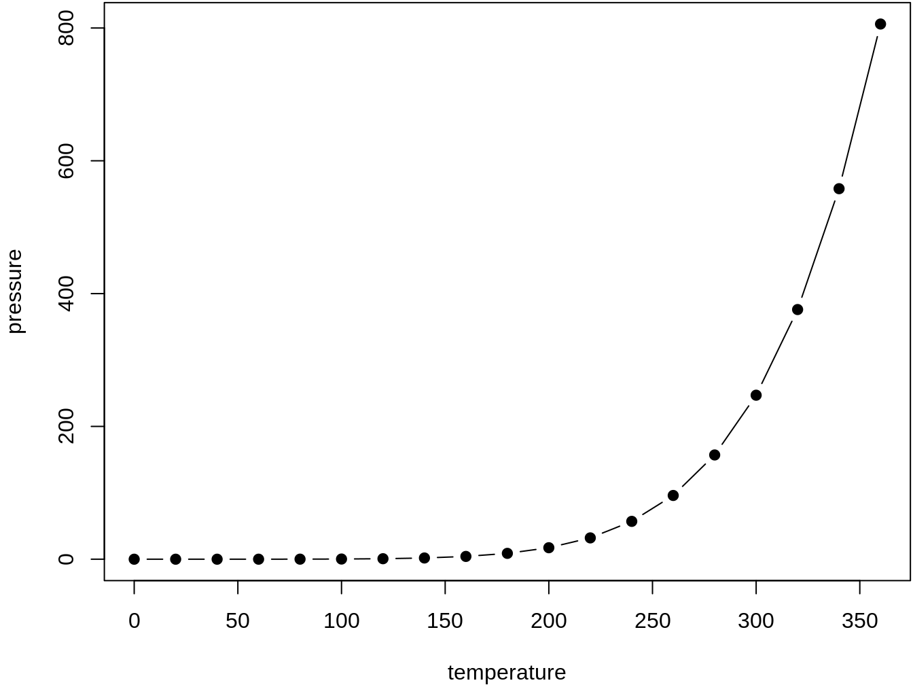

--- 
title: "Analyzing the US Census with R"
author: "Kyle E. Walker"
date: "2018-07-25"
site: bookdown::bookdown_site
knit: bookdown::render_book
output: bookdown::gitbook
documentclass: book
bibliography: [book.bib, packages.bib]
biblio-style: apalike
link-citations: yes
github-repo: rstudio/bookdown-demo
description: "This book is an overview of how practitioners can acquire, wrangle, visualize, and model data from the US Census Bureau with the R programming language."
---

# Overview

This book is an overview of how practitioners can work with data from the US Census Bureau using the R programming language.  The book will focus on data acquisition and wrangling as well as data analysis and modeling of aggregate and individual-level decennial Census and American Community Survey data.  It is designed to be useful for both beginners and advanced users of both R and Census data.  Beginners will find Part 1 more useful, as it covers the basics of R and the US Census and how to work with them together.  Advanced readers will find Parts 2 and 3 more useful, as these parts cover applications from exploratory mapping and visualization to advanced data modeling.  

The growing popularity of the R programming language for exploratory data analysis and data science has led many practitioners to turn to R to work with Census data.  To date, however, no book exists as a reference manual for how to use Census data in R; as such, resources are scattered across blog posts, webinars, and journal articles.  This proposed book aims to fill this gap as a reference manual for a wide range of use cases for practitioners using Census data in R.  
Additionally, the book will take advantage of cutting-edge developments in both data wrangling and spatial data analysis in R.  The book’s approach will be oriented around two major R ecosystems.  The first is the tidyverse, a suite of packages authored by Hadley Wickham and colleagues at RStudio that are designed to work together seamlessly in data science projects.  The second is sf, a re-imagination of the spatial ecosystem in R that works very well with the tidyverse.  Book readers will learn to work with US Census data using visualization, spatial analysis, and functional programming tools available in these packages.  

<!--chapter:end:index.Rmd-->

# An introduction to the United States Census {#intro}

You can label chapter and section titles using `{#label}` after them, e.g., we can reference Chapter \@ref(intro). If you do not manually label them, there will be automatic labels anyway, e.g., Chapter \@ref(methods).

Figures and tables with captions will be placed in `figure` and `table` environments, respectively.

In this book, you'll be learning about how to use US Census Bureau data in R.  This chapter provides a brief overview of ...


```r
par(mar = c(4, 4, .1, .1))
plot(pressure, type = 'b', pch = 19)
```

<div class="figure" style="text-align: center">

<p class="caption">(\#fig:nice-fig)Here is a nice figure!</p>
</div>

Reference a figure by its code chunk label with the `fig:` prefix, e.g., see Figure \@ref(fig:nice-fig). Similarly, you can reference tables generated from `knitr::kable()`, e.g., see Table \@ref(tab:nice-tab).


```r
knitr::kable(
  head(iris, 20), caption = 'Here is a nice table!',
  booktabs = TRUE
)
```


Table: (\#tab:nice-tab)Here is a nice table!

 Sepal.Length   Sepal.Width   Petal.Length   Petal.Width  Species 
-------------  ------------  -------------  ------------  --------
          5.1           3.5            1.4           0.2  setosa  
          4.9           3.0            1.4           0.2  setosa  
          4.7           3.2            1.3           0.2  setosa  
          4.6           3.1            1.5           0.2  setosa  
          5.0           3.6            1.4           0.2  setosa  
          5.4           3.9            1.7           0.4  setosa  
          4.6           3.4            1.4           0.3  setosa  
          5.0           3.4            1.5           0.2  setosa  
          4.4           2.9            1.4           0.2  setosa  
          4.9           3.1            1.5           0.1  setosa  
          5.4           3.7            1.5           0.2  setosa  
          4.8           3.4            1.6           0.2  setosa  
          4.8           3.0            1.4           0.1  setosa  
          4.3           3.0            1.1           0.1  setosa  
          5.8           4.0            1.2           0.2  setosa  
          5.7           4.4            1.5           0.4  setosa  
          5.4           3.9            1.3           0.4  setosa  
          5.1           3.5            1.4           0.3  setosa  
          5.7           3.8            1.7           0.3  setosa  
          5.1           3.8            1.5           0.3  setosa  

You can write citations, too. For example, we are using the **bookdown** package [@R-bookdown] in this sample book, which was built on top of R Markdown and **knitr** [@xie2015].

<!--chapter:end:01-intro-to-the-census.Rmd-->

# R, the tidyverse, and tidy tools for Census data

{intro here}

## R

* Basics of R
* Benefits of R
* RStudio


## The __tidyverse__

* General discussion
* Core packages
* Core functionality


## Accessing Census and ACS data with __tidycensus__

The __tidycensus__ package, first released in 2017, replicates some of the functionality of the aforementioned packages but with two distinct goals.  First, tidycensus aims to make Census data available to R users in a tidyverse-friendly format.  Second, R users can obtain feature geometry via __tigris__ pre-joined with tabular Census data in a single tidycensus function call.  As such, tidycensus is designed to streamline the process of Census data access and manipulation for R users who are committed to tidyverse-based workflows.  

To get started with tidycensus, users should load the package along with the __tidyverse__ package and set their Census API key with the `census_api_key()` function.  API keys can be obtained at https://api.census.gov/data/key_signup.html.  Declaring `install = TRUE` when calling `census_api_key()` will install the key for use in future R sessions, which may be convenient for many users.  


```r
library(tidycensus)
library(tidyverse)
census_api_key("YOUR KEY GOES HERE", install = TRUE)
```

Once an API key is installed, users can obtain decennial Census or ACS data with a single function call.  The function `get_decennial()` is used to access decennial Census data from the 1990, 2000, and 2010 Censuses, and the `get_acs()` function is used to obtain data from the 1-, 3-, and 5-year American Community Survey samples since 2011.  To get data from either of these functions, users must specify a string representing the requested `geography`; a vector of Census variable IDs, represented by `variable`; or optionally a Census table ID, passed to `table`.   


