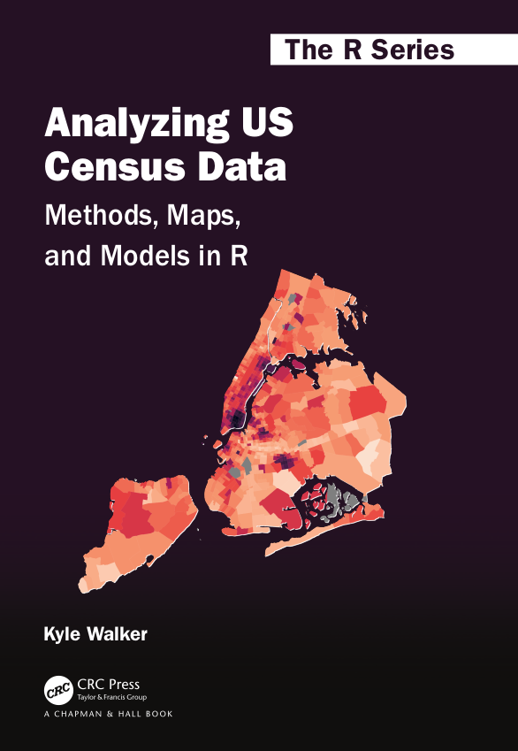

```{r setup-preface, include = FALSE}
knitr::opts_chunk$set(warning = FALSE, message = FALSE)

source("R/book-functions.R")
```

# Preface {.unnumbered}

This is the online home of *Analyzing US Census Data: Methods, Maps, and Models in R*, a forthcoming book published with CRC Press. [Pre-order a hard copy of the book from this link!](https://www.routledge.com/Analyzing-US-Census-Data-Methods-Maps-and-Models-in-R/Walker/p/book/9781032366449)

```{r crc-logo, echo = FALSE, out.width="30%"}

```

<a rel="license" href="http://creativecommons.org/licenses/by-nc-nd/4.0/"></a><br/> The online version of the book is published with the [Creative Commons Attribution-NonCommercial-NoDerivatives 4.0 International (CC BY-NC-ND 4.0) license](https://creativecommons.org/licenses/by-nc-nd/4.0/).

To support the development of the book and help me maintain this free online version, please consider one of the following:

-   [Purchasing a hard copy of the book from CRC Press](https://www.routledge.com/Analyzing-US-Census-Data-Methods-Maps-and-Models-in-R/Walker/p/book/9781032366449) (available now for pre-order; expected publication October 2022);

-   Contributing to the book by filing an issue or making a pull request at [the book's GitHub repository](https://github.com/walkerke/census-with-r-book);

-   [Sponsoring book development and maintenance as a GitHub Sponsor](https://github.com/sponsors/walkerke);

-   [Chipping in some funds to support book maintenance via PayPal](https://paypal.me/walkerdata).

## About the book {.unnumbered}

Census data are widely used in the United States across numerous research and applied fields, including education, business, journalism, and many others. Until recently, the process of working with US Census data has required the use of a wide array of web interfaces and software platforms to prepare, map, and present data products. The goal of this book is to illustrate the utility of the R programming language for handling these tasks, allowing Census data users to manage their projects in a single computing environment.

The book focuses on two types of Census data products commonly used by analysts:

-   **Aggregate data**, which involve counts or estimates released by the Census Bureau that are aggregated to some geographic unit of interest, such as a state;

-   **Microdata**, which are individual, anonymized Census records that represent a sample of a given Census dataset.

Readers new to R and Census data should read the book in order, as each chapter includes concepts that build upon examples introduced in previous chapters. More experienced analysts might use chapters as standalone manuals tailored to specific tasks and topics of interest to them. A brief overview of each chapter follows below.

-   Chapter 1 is a general overview of US Census data terms and definitions, and gives some brief background about the R language and why R is an excellent environment for working with US Census data. It ends with motivating examples of excellent applied projects that use R and Census data.
-   Chapter 2 introduces **tidycensus**, an R package for working with US Census Bureau data in a tidy format. Readers will learn how to make basic data requests with the package and understand various options in the package.
-   Chapter 3 covers analysis of US Census data using the **tidyverse**, an integrated framework of packages for data preparation and wrangling. It includes both simple and more complex examples of common **tidyverse** data wrangling tasks, and discusses workflows for handling margins of error in the American Community Survey.
-   Chapter 4 introduces workflows for Census data visualization with a focus on the **ggplot2** package. Examples focus on best practices for preparing data for visualization and building charts well-suited for presenting Census data analyses.
-   Chapter 5 introduces the **tigris** package for working with US Census Bureau geographic data in R. It includes an overview of spatial data structures in R with the **sf** package and covers key geospatial data topics like coordinate reference systems.
-   Chapter 6 is all about mapping in R. Readers learn how to make simple shaded maps with US Census data using packages like **ggplot2** and **tmap**; maps with more complex data requirements like dot-density maps; and interactive geographic visualizations and apps.
-   Chapter 7 covers spatial data analysis. Topics include geographic data overlay; distance and proximity analysis; and exploratory spatial data analysis with the **spdep** package.
-   Chapter 8's topic is modeling of geographic data. Readers learn how to compute indices of segregation and diversity with Census data; fit linear, spatial, and geographically weighted regression models; and develop workflows for geodemographic segmentation and regionalization.
-   Chapter 9 focuses on individual-level *microdata* from the US Census Bureau's Public Use Microdata Sample. Readers will learn how to acquire these datasets with **tidycensus** and use them to generate unique insights.
-   Chapter 10 covers analysis of microdata with a focus on methods for analyzing and modeling complex survey samples. Topics include estimation of standard errors with replicate weights, mapping microdata, and modeling microdata appropriately with the **survey** and **srvyr** packages.
-   Chapter 11's focus is Census datasets beyond the decennial US Census and American Community Survey. The first part of the chapter focuses on historical mapping with the National Historical Geographic Information System (NHGIS) and historical microdata analysis with IPUMS-USA; readers learn how to use the **ipumsr** R package and R's database tools to assist with these tasks. The second part of the chapter covers the wide range of datasets available from the US Census Bureau, and R packages like **censusapi** and **lehdr** that help analysts access those datasets.
-   Chapter 12 covers Census data resources for regions outside the United States. It covers global demographic analysis with the US Census Bureau's International Data Base as well as country-specific examples from Canada, Mexico, Brazil, and Kenya.

## Who this book is for {.unnumbered}

This book is designed for practitioners interested in working efficiently with data from the United States Census Bureau. It defines "practitioners" quite broadly, and analysts at all levels of expertise should find topics within this book useful. While the book focuses on examples from the United States, the topics covered are designed to be more general and applicable to use-cases outside the United States and also outside the domain of working with Census data.

-   Students and analysts newer to R will likely want to start with Chapters 2 through 4 which cover the basics of **tidycensus** and give examples of several tidyverse-centric workflows.

-   Chapters 5 through 7 will likely appeal to analysts from a Geographic Information Systems (GIS) background, as these chapters introduce methods for handling and mapping spatial data that might alternatively be done in desktop GIS software like ArcGIS or QGIS.

-   More experienced social science researchers will find Chapters 9 through 11 useful as they cover ACS microdata, an essential resource for many social science disciplines. Analysts coming to R from Stata or SAS will also learn how to use R's survey data modeling tools in these chapters.

-   Data scientists interested in integrating spatial analysis into their work may want to focus on Chapters 7 and 8, which cover a range of methods that can be incorporated into business intelligence workflows.

-   Journalists will find value throughout the book, though Chapters 2, 5-6, 9, and 12 may prove especially useful as they focus on rapid retrieval of US and international Census data that can be incorporated into articles and reports.

Of course, there are many other use cases for Census data that are not covered in this overview. If you are using the examples in this book for unique applications, please reach out!

## About the author {.unnumbered}

I (Kyle Walker) work as an associate professor of Geography at Texas Christian University and as a spatial data science consultant. I'm a proud graduate of the University of Oregon (Go Ducks!) and I hold a Ph.D. in Geography from the University of Minnesota. I do research in the field of population geography, focusing on metropolitan demographic trends, and I consult broadly in areas such as commercial real estate, the health sciences, and general R training/software development. For consulting inquiries, please reach out to [kyle\@walker-data.com](mailto:kyle@walker-data.com){.email}.

I live in Fort Worth, Texas with my wife Molly and our three children Michaela, Landry, and Clara, to whom this book is dedicated. While I enjoy developing open source software, my true passions are exploring the country with my family and earnestly (though not always successfully) coaching my kids' sports teams.

## Technical details {.unnumbered}

This book was written using RStudio's [Visual Editor for R Markdown](https://rstudio.github.io/visual-markdown-editing/), and published with the **bookdown** R package [@xie2016].

At the time of the most recent book build, the following R version was used:

```{r r-version, echo = FALSE}
cat(system("R --version", intern = TRUE)[1])
```

The examples in this book were created with the following R package versions:

```{r book-pkgs, echo = FALSE}
pkgs <- c(
  "tidyverse",
  "tidycensus",
  "dplyr",
  "tidyr",
  "ggplot2",
  "stringr",
  "purrr",
  "leafsync",
  "readr",
  "tibble",
  "ggridges",
  "geofacet",
  "ggbeeswarm",
  "plotly",
  "tigris",
  "sf",
  "mapview",
  "crsuggest",
  "tmap",
  "raster",
  "leaflet",
  "ggiraph",
  "spdep",
  "mapboxapi",
  "segregation",
  "spatialreg",
  "GWmodel",
  "ipumsr",
  "survey",
  "srvyr",
  "censusapi",
  "tidyUSDA",
  "lehdr",
  "blscrapeR",
  "rKenyaCensus",
  "idbr",
  "cancensus",
  "mxmaps",
  "inegiR",
  "geobr",
  "httr",
  "jsonlite"
)

pkgs <- sessioninfo::package_info(pkgs, dependencies = FALSE)
df <- tibble::tibble(
  package = pkgs$package,
  version = pkgs$ondiskversion,
  source = gsub("@", "\\\\@", pkgs$source)
)

style_data(df, nrow(df), "Packages used in this book")
```
